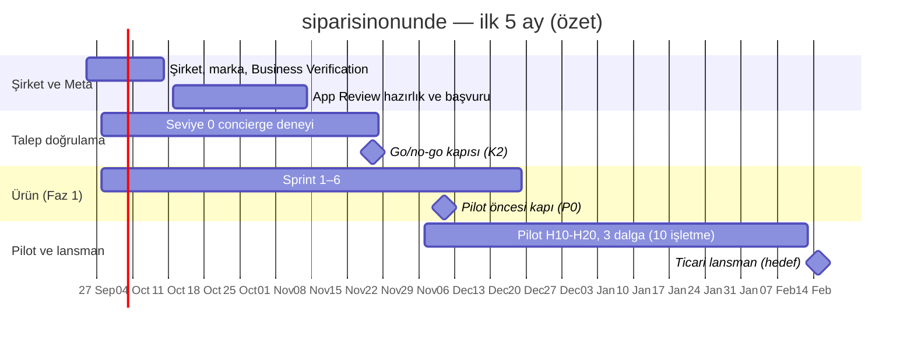

# 00 — Yönetici Özeti

> **siparisinonunde** ("Siparişin Önünde") planının 3 sayfalık özeti. Tarih: 24 Eylül 2026. Tüm bağlayıcı kararlar [00-kararlar-ve-sozluk.md](00-kararlar-ve-sozluk.md) dosyasında, ayrıntılar 01–10 no'lu dokümanlarda, ham araştırma ve kaynaklar [arastirma/](arastirma/) klasöründe.

## 1. Ne yapıyoruz?

Türkiye'deki yerel işletmelere komisyonsuz bir sipariş kanalı sunuyoruz. Öncelik kendi kuryesi olan paket servis restoranları. İşletme siparişi **kendi WhatsApp numarasından** alır:

1. Müşteri işletmenin WhatsApp'ına yazar ya da QR kodunu okutur.
2. Bot bir **"Menüyü aç"** linki gönderir.
3. Müşteri işletmenin mobil menüsünde sepetini doldurup siparişi onaylar.
4. Sipariş işletme paneline **sesli uyarıyla** düşer.
5. İşletme tek dokunuşla "Onayla · 30 dk" der.
6. Müşteri durum bildirimlerini ("onaylandı", "yolda", "teslim edildi") WhatsApp'tan alır.

İşletme **sabit aylık ücret** öder. Sipariş başı ücret, ciro payı ya da ödeme komisyonu alınmaz.

**Konumlandırma:** Pazaryeri değiliz, işletmenin kendi kanalı ve operasyon paneliyiz. Ana mesaj: *"Keşif pazaryerinde, sadakat sende."* Pazaryerinden vazgeçmesini istemiyoruz. Sadık müşterisini komisyonsuz kendi kanalına taşımasını sağlıyoruz.

## 2. Neden şimdi?

- **Komisyon acısı büyük ve görünür hale geldi.** Kendi kuryesiyle çalışan restoran için oran %9–25, platform kuryesiyle %25–40 (+KDV). TÜRES Kasım 2025'te boykot çağrısı yaptı. Ticaret Bakanlığı'nın Nisan 2026 düzenlemesi kesintileri kalem kalem görünür kıldı.
- **Pazar iki bloğa toplanıyor.** Uber, Trendyol GO ve GetirYemek'i aldı. Yemeksepeti SSW Partners'a satılıyor. Restoranın pazarlık gücü azalıyor.
- **WhatsApp altyapısı hazır ve ucuz.** Resmi Cloud API'nin **Coexistence** özelliğiyle esnaf numarasını ve telefondaki uygulamasını kaybetmeden bağlanıyor. Türkiye'de mesaj başına maliyet yaklaşık 0,04 TL ve her numaraya ayda 1.000 servis mesajı ücretsiz. Bir siparişin WhatsApp maliyeti yaklaşık 0,2 TL. Bu tutarı Meta doğrudan işletmeden tahsil ediyor.
- **Global kanıt var.** Brezilya'da paket servis cirosunun %26'sı WhatsApp'tan geliyor ve iFood WhatsApp sipariş şirketi Anota AI'yı satın aldı. ABD'de sabit abonelikli Owner.com 100 milyon $ ARR'a ulaştı. Oracle'ın ücretsiz sipariş sistemi GloriaFood Nisan 2027'de kapanıyor ve kullanıcıları yeni bir çözüme geçmek zorunda kalacak.

## 3. Ürün (Faz 1 = MVP)

| Bileşen | Faz 1'de ne var? |
|---|---|
| **WhatsApp kanalı** | Resmi Cloud API. Embedded Signup + Coexistence ile 10 dakikada bağlantı. Karşılama + menü linki. Sipariş başına en fazla 4 durum mesajı. İnsana devir ve gelen kutusu. |
| **Storefront** (işletmeye özel mobil menü) | Seçenekli ürünler, sepet, adres + harita pini, teslimat bölgesi kontrolü, kapıda nakit/kart/yemek kartı, mesafeli satış onay adımı, sipariş takip sayfası, "Son siparişin" kartı. |
| **İşletme paneli (PWA)** | Canlı sipariş ekranı, "sipariş kaçmaz" alarm zinciri, menü (toplu fiyat güncelleme, "Bugün tükendi"), saatler, bölgeler, telefon siparişi girişi, tarayıcıdan fiş, basit kurye görünümü, müşteriler, günlük kasa ve "bu ay ne kadar tasarruf ettin" raporu. |
| **Süper admin paneli** | İşletme yaşam döngüsü, onboarding hunisi, WhatsApp sağlık tablosu, Meta maliyet defteri, loglu impersonation, kill-switch'ler, DLQ, audit log. |
| **Pazarlama sitesi** | Komisyon hesaplayıcısı (ana satış aracı), fiyatlar, demo ve kayıt, SSS, yasal sayfalar. |

**Faz 1'de bilinçli olarak yok:** AI serbest metin siparişi, kampanya/toplu mesaj (İYS gerektirir), online ödeme, çoklu şube, bayi paneli. Bunlar **Faz 2**'de (Ay 4–9). Özel alan adı, WhatsApp Flows, native uygulamalar ve kredi hattı **Faz 3**'te (Ay 9–18).

**"Sipariş kaçmaz" garantisi ürünün kalbidir.** Yeni sipariş onaylanmazsa alarm kademeli olarak büyür:

| Süre | Olay |
|---|---|
| t=0 | Panel sesi + Web Push |
| 60 sn | Ses tekrarı |
| 2 dk | Platform WhatsApp numarasından işletme sahibine uyarı |
| 5 dk | SMS |
| 10 dk | Müşteriye bilgi |
| 15 dk | Otomatik iptal |

Otomatik iptal süresi işletme ayarıyla 10–30 dk arasında seçilir; müşteriye bilgi her zaman iptalden en az 5 dk önce gider. "Otomatik reddet" yoktur.

Bunu destekleyen altyapı:
- olay günlüğü + SSE ile yeniden oynatma
- sentetik canary siparişler
- en az iki ayrı sunucuda webhook alımı
- **WhatsApp'sız mod:** SMS OTP ile web siparişi alınmaya devam eder. Meta tarafında bir sorun olursa ürün durmaz.

## 4. İş modeli

| Paket (KDV hariç) | Aylık | Yıllık peşin | Hedef |
|---|---|---|---|
| Esnaf | 990 TL | 9.504 TL | Günde 5–20 sipariş |
| **Pro** (ana paket) | 1.790 TL | 17.184 TL | Günde 20–80 sipariş |
| Zincir (Faz 2) | 2.990 TL / şube | 28.704 TL / şube | 2+ şube |

- 14 gün kartsız deneme.
- İlk 100 işletme "kurucu üye": 12 ay boyunca sabit %30 indirim oranı.
- Pilot işletmeler: 3 ay ücretsiz + kurulumu biz yaparız.
- **Başa baş:** %25 komisyonlu bir işletmenin ayda **~21 siparişi** kendi kanalına geçerse Pro paket kendini amorti eder.
- Meta mesaj ücretleri doğrudan işletmenin Meta hesabından çekilir, bize uğramaz. SMS yedeği aboneliğe kotayla dahil (Esnaf 100, Pro 300, Zincir şube başına 300 SMS/ay).
- **Deneme ve tahsilat:** Deneme bitince plan seçilmezse 3 gün uyarı bandı, ardından sipariş alma durur (90 gün içinde veriler aynen döner). Ödeme alınamazsa G+10 salt-okunur mod (sipariş alma sürer), G+21 askı, G+75 hesap kapatma.
- **Birim ekonomi hedefleri:**
  - karma brüt marj ≥ %70 (1.000 işletme ölçeğinde)
  - CAC ≤ 4.000 TL
  - geri ödeme < 4 ay
  - ilk yıl aylık churn %5–7
  - **Uyarı:** Esnaf paketinin marjı mevcut varsayımlarla %29–67 arasında kalıyor. Bu açık karar olarak duruyor.
- **Koruyucu metrikler:** döviz bazlı giderlerin (Meta hariç: LLM, bulut, SaaS araçları) gelire oranı ≤ %15; nakit pisti ≥ 9 ay (altına düşerse harcama gözden geçirilir).

## 5. Teknik ve hukuki temel

- **Stack:** TypeScript monorepo.
  - Next.js 16: site ve storefront
  - Vite + React: paneller
  - Fastify 5: API, SSE, webhook
  - BullMQ, PostgreSQL 18 + PostGIS (RLS ile tenant yalıtımı), Redis, Better Auth
  - Alternatif: ekip Laravel'de çok güçlüyse Laravel 13 + Filament.
- **Kişisel veri Türkiye'de barındırılır.** KVKK'nın yurt dışı aktarım rejimi en büyük hukuki gri alan. Meta aktarımı için avukat görüşü alınacak.
- **Hukuki rol:** İşletme, son müşterinin veri sorumlusu; biz veri işleyeniz.
- **Pazaryeri sayılmamak için yapmadıklarımız:** müşteri parası hiçbir zaman bizim hesabımızdan geçmez (6493 sayılı Kanun). Keşif/dizin sayfası, ortak müşteri hesabı ve ücretli öne çıkarma yoktur (ETAHS riski).
- **Kampanya mesajları:** İşletmenin İYS kaydı, müşterinin önceden onayı ve yazılımda zorunlu İYS kontrolü olmadan gönderilmez.
- **Yalnız resmi WhatsApp Cloud API.** Resmi olmayan bağlantı yöntemleri numaranın kapatılmasına yol açabilir; hiçbiri kullanılmaz. Rakiplere karşı satış argümanı: "Numaran güvende."

## 6. Yol haritası (Hafta 1 = 28 Eylül 2026)

| Tarih | Kilometre taşı |
|---|---|
| **Bu hafta** | Açık kararlar (stack, şirket türü, pilot şehir). Meta Business Portfolio. Marka başvurusu. |
| 9 Ekim | Şirket tescili + Meta Business Verification başvurusu |
| 27 Ekim | App Review başvurusu (en geç 6 Kasım) |
| 20 Kasım | **Talep go/no-go kapısı (Hafta 8):** işletme başı haftada ≥ 5 kendi kanal siparişi, kart→sipariş ≥ %3, ödeme niyeti. **NO-GO olursa Faz 1'in kalan ağır geliştirmesi (Sprint 5–6) durur ve pivot seçenekleri 2 hafta içinde değerlendirilir; KOŞULLU GO'da pilot yalnız eşikleri karşılayan segmentle sürer.** |
| 30 Kasım | Pilot başlar (Hafta 10–20): Dalga 1 kurulumu |
| 4 Aralık | Pilot öncesi kapı ("sipariş kaçmaz" paketi hazır) |
| 7–21 Aralık | Pilot 3 dalgada canlı (3 + 4 + 3 işletme; ilk canlı sipariş 7 Aralık, Hafta 11) |
| 29 Ocak 2027 | Ticari lansman ön-onay kapısı (K4, Hafta 18; ilk dalganın verisiyle) |
| 12 Şubat 2027 | Ticari lansman kesin kararı (Hafta 20; son dalganın 8. haftası), pilot biter |
| 15 Şubat 2027 | Ticari lansman (hedef, Hafta 21), kurucu üye programı açılır |
| ≈ Haziran 2027 | Faz 2 sonu, ~100 işletme |
| ≈ Mart 2028 | Faz 3 sonu, ikinci şehir, 1.000 işletmeye doğru |

## 7. En büyük riskler ve cevabımız

| Risk | Cevap |
|---|---|
| **Talep (R01):** müşteri kendi kanala geçmiyor, panel boş kalıyor | Yazılımı beklemeden, geliştirmeyle paralel 8 haftalık "Seviye 0" deneyi ve sayısal go/no-go (NO-GO kuralı tanımlı). Paket içi QR kartı, magnet, doğrudan kanal avantajı. Aylık "tasarruf" raporu. |
| **Ekip kapasitesi** (5 ürün, 1–3 geliştirici) | Faz 1 kapsamı katı. AI, kampanya ve online ödeme Faz 2'de. Kesme çizgisi tanımlı. |
| **Onboarding sürtünmesi** (Meta hesabı, kart, doğrulama) | "Biz kuralım" hizmeti. Adım adım rehber. WhatsApp bağlanmadan SMS doğrulamalı web siparişiyle ilk gün başlama. |
| **Meta tek nokta arızası / App Review gecikmesi** | Kritik yol bugün başlıyor. Hafta 6'da Plan B (Solution Partner) hazırlığı. WhatsApp'sız mod. |
| **Sipariş kaçırma** | Kademeli alarm, canary, iki düğümlü webhook, pilotta P1 telefon hattı. |
| **Güvenlik / tenant sızıntısı** | RLS + CI'da yalıtım testleri. Ticari lansmandan önce dış pentest. |

## 8. Karar bekleyenler

Ayrıntı: [00-kararlar-ve-sozluk.md](00-kararlar-ve-sozluk.md) §13.

1. Ekip ve stack: TypeScript mi, Laravel mi? (Varsayılan: TypeScript.)
2. Pilot şehir ve 2–3 ilçe.
3. Şirket türü (Ltd/AŞ) ve Teknokent.
4. Yurt içi barındırma sağlayıcısı (teklifler).
5. Meta modeli: Tech Provider mı, baştan Solution Partner mı? (Varsayılan: Tech Provider + Plan B.)
6. Marka ve alan adı müsaitliği.
7. Kurye stratejisi.
8. AI siparişin hangi paketlerde olacağı.
9. Yemek kartıyla online ödemenin zamanı.
10. SLO hedefleri.
11. Esnaf paketinin ekonomisi.
12. Sezonluk işletmeler için hesap dondurma.

## 9. Doküman haritası

| # | Doküman | Ne için okunur? |
|---|---|---|
| 00 | [Kararlar ve sözlük](00-kararlar-ve-sozluk.md) | **Bağlayıcı** isimler, durumlar, roller, fiyatlar, fazlar |
| 01 | [Vizyon, pazar, iş modeli](01-vizyon-pazar-is-modeli.md) | Pazar, rakipler, personalar, fiyat, birim ekonomi, GTM |
| 02 | [WhatsApp entegrasyonu](02-whatsapp-entegrasyonu.md) | Meta süreçleri, onboarding, şablonlar, konuşma motoru, maliyet |
| 03 | [Müşteri deneyimi ve storefront](03-musteri-deneyimi-ve-storefront.md) | Sipariş akışları, ekranlar, tüm mesaj metinleri |
| 04 | [İşletme paneli](04-isletme-paneli.md) | Panel ekranları, alarm, menü, kurye, raporlar |
| 05 | [Admin paneli ve pazarlama sitesi](05-admin-paneli-ve-pazarlama-sitesi.md) | Operasyon kulesi, bayi paneli, site ve hesaplayıcı |
| 06 | [Teknik mimari](06-teknik-mimari.md) | Stack, multi-tenancy, gerçek zamanlılık, altyapı, güvenlik |
| 07 | [Veri modeli ve API](07-veri-modeli-ve-api.md) | Tablolar, durum makineleri, uç noktalar, olaylar |
| 08 | [Mevzuat, KVKK, ödeme, fatura](08-mevzuat-kvkk-odeme-fatura.md) | Uyum kontrol listesi, sözleşmeler, ödeme ve fatura |
| 09 | [Yol haritası ve sprint planı](09-yol-haritasi-ve-sprint-plani.md) | Takvim, kritik yol, sprintler, pilot, bütçe |
| 10 | [Riskler, operasyon ve metrikler](10-riskler-operasyon-ve-metrikler.md) | Risk kaydı, deneyler, destek, olay yönetimi, SLO, KPI |
| 11 | [Finansal model ve finansman](11-finansal-model-ve-finansman.md) | 24 aylık gelir-gider ve nakit, 3 senaryo, sermaye ihtiyacı, finansman yolu, fiyat revizyon politikası (betik: `finans/model.py`) |
| 12 | [Marka, tasarım ve kullanılabilirlik](12-marka-tasarim-ve-kullanilabilirlik.md) | Marka platformu, tasarım sistemi, alarm sesleri, basılı şablonlar, kullanılabilirlik testi, cihaz matrisi, eğitim içeriği |
| 13 | [Varsayım ve teyit kaydı](13-varsayim-ve-teyit-kaydi.md) | Doğrulanması gereken 84 varsayım (28'i engelleyici), sahip, son tarih ve bağlı kapıyla |

> **Güvenilirlik notu:** Araştırma 24 Eylül 2026'da yapıldı. Oturumun web arama kotası dolduğu ve bazı resmi siteler erişime kapalı olduğu için birçok rakam ikincil kaynaklardan üçgenlendi. Bu rakamlar dokümanlarda **"(teyit edilmeli)"**, [D?] veya [E] ile işaretli. Meta rate card'ı, Coexistence'ın +90 numaralarda çalışması, KVKK aktarım yaklaşımı ve sağlayıcı fiyatları ilk ücretli müşteriden önce birincil kaynaktan doğrulanmalı.
