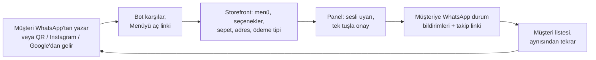

# 01 — Vizyon, Pazar ve İş Modeli

> **Amaç:** Siparişin Önünde'nin hangi problemi, kimin için ve hangi iş modeliyle çözdüğünü; pazarı, rakipleri, fiyatlandırmayı, birim ekonomiyi ve pazara giriş planını tek yerde tanımlamak.
> **Kapsam:** Problem ve çözüm, vizyon ve konumlandırma, pazar büyüklüğü, rakipler, personalar, paketler ve fiyat kuralları, birim ekonomi, go-to-market (GTM), pazaryerleriyle birlikte kullanım, savunulabilirlik.
> **Kapsam dışı:** WhatsApp teknik ayrıntıları ve mesaj akışları ([02](02-whatsapp-entegrasyonu.md)), ekran ve özellik tasarımı ([03](03-musteri-deneyimi-ve-storefront.md), [04](04-isletme-paneli.md), [05](05-admin-paneli-ve-pazarlama-sitesi.md)), sözleşme, vergi ve tahsilat ([08](08-mevzuat-kvkk-odeme-fatura.md)), takvim ([09](09-yol-haritasi-ve-sprint-plani.md)), risk matrisi ve KPI'lar ([10](10-riskler-operasyon-ve-metrikler.md)).
> **İlgili dokümanlar:** [00 Kararlar ve sözlük](00-kararlar-ve-sozluk.md) · [02 WhatsApp entegrasyonu](02-whatsapp-entegrasyonu.md) · [04 İşletme paneli](04-isletme-paneli.md) · [05 Admin paneli ve pazarlama sitesi](05-admin-paneli-ve-pazarlama-sitesi.md) · [08 Mevzuat](08-mevzuat-kvkk-odeme-fatura.md) · [09 Yol haritası](09-yol-haritasi-ve-sprint-plani.md) · [10 Riskler ve metrikler](10-riskler-operasyon-ve-metrikler.md)
> **Kaynaklar:** [arastirma/02-pazar-rakipler-is-modeli.md](arastirma/02-pazar-rakipler-is-modeli.md) (ana kaynak), [arastirma/01-whatsapp-platform.md](arastirma/01-whatsapp-platform.md) (maliyet ve rakip altyapıları).
> **Tarih:** 2026-09-24 · **Durum:** Taslak v1

**Okuma notları**
- Rakamlar araştırma raporlarından alındı; kaynak sayfalar arama özetleri üzerinden okundu. Dışarıya sunulmadan önce kritik rakamlar birincil kaynaktan teyit edilmelidir. **[T]** bizim tahminimiz veya hesabımızdır; **(teyit edilmeli)** doğrulanmamış bilgidir.
- Fiyatlar aksi yazılmadıkça **KDV hariçtir** (yazılım hizmetinde KDV %20). Kur varsayımı **1 USD ≈ 48,4 TL** (TCMB, 24.09.2026); arastirma/02 serbest piyasa kurunu (48,8) kullanır, fark sonuçları değiştirmez. Kur ve Meta rate card'ı konfigürasyonda tutulur.

---

## 1. Problem, çözüm ve "Neden şimdi?"

### 1.1 Problem: restoranın komisyon acısı

**Pazar büyük, kârın önemli kısmı pazaryerinde kalıyor.**
- 2025'te hızlı ticaret hacmi %55,6 artışla **388,7 milyar TL** oldu; bunun **%69,5'i yemek siparişi**. Buradan yemek siparişi hacmi **≈ 270 milyar TL** çıkıyor [T] ([Ticaret Bakanlığı, E-Ticaretin Görünümü 2025](https://etbis.ticaret.gov.tr/tr/Post/postturkiyede-e-ticaretin-gorunumu-2025-raporu-yayimlandi-3)). Büyümenin önemli kısmı nominaldir (enflasyon).
- Bu hacmin %15–35'i komisyon olarak kesilirse restoranlardan pazaryerlerine yılda kabaca **40–95 milyar TL** akar [T] (270 × 0,15 … 0,35; KDV, reklam ve kampanya payı hariç).

**Komisyon bantları.** Platformlar resmi tarife yayımlamıyor; oranı sözleşme, şehir, kategori ve kurye modeli belirliyor. Aşağıdaki bantlar blog, şikâyet ve dernek beyanlarından derlendi **(teyit edilmeli)**. Kaynaklar: arastirma/02 §2.4.

| Platform | Restoranın kendi kuryesiyle | Platform kuryesiyle |
|---|---|---|
| Yemeksepeti | ~%25 (şikâyet örneği) | ~%25–40 (şikâyette %38,4 örneği) |
| Uber Eats Trendyol Go | "%9'a kadar düşebiliyor" iddiası | %15–38 |
| GetirYemek (TGO paneline taşınıyor) | ~%12 (KDV dahil) | ~%35–38 (KDV dahil) |
| Migros Yemek | Daha düşük bant | %15–25 |

**Komisyonun üstüne binenler:** Komisyon faturasına %20 KDV (yemeğin KDV'si %10; mükellef indirir ama nakit akışında hisseder, basit usulde gerçek maliyettir); kampanya/Joker indirim finansmanı (şikâyetlerde Joker siparişi başına 6,80 TL reklam ücreti iddiası, [şikayetvar](https://www.sikayetvar.com/yemeksepeti/yemeksepetiye-asiri-komisyon-ve-reklam-bedeli-sikayeti)); görünürlük, reklam ve kurye bedelleri.

**Sahadan iki örnek**
- **TÜRES (Kasım 2025):** "%40'a varan komisyon." 1.000 TL'lik siparişte %32 komisyon (320 TL) ve komisyon KDV'si (64 TL) düşülünce 616 TL kalıyor, diğer kesintilerle **"restorana 531 TL kalıyor"**. Dernek boykot çağrısı yaptı ve "300 bin restoran ve kafe sistemden çıkar" dedi ([gazetepencere](https://www.gazetepencere.com/ekonomi/restoranlardan-online-platformlara-boykot-uyarisi-komisyon-yuzde-40i-buluyor-681695h), [dunya.com](https://www.dunya.com/ekonomi/restoranlardan-yuzde-20-indirim-karari-online-platformlari-boykota-hazirlaniyorlar-haberi-805101)).
- **Tantuni işletmecisi (İstanbul):** %38 komisyon yüzünden 200 TL'lik ürünü pazaryerinde 276 TL'ye satmak zorunda kaldığını anlatıyor ([Türkiye Gazetesi](https://www.turkiyegazetesi.com.tr/ekonomi/esnaf-komisyonlar-yuksek-ama-mecburuz-diyor-online-platformlar-isletme-karina-ortak-1816030)).

**Konsolidasyon restoranın pazarlık gücünü azaltıyor**
- **Uber**, Trendyol GO'nun %85'ini ~700 milyon $'a aldı (kapanış 17 Haziran 2025). GetirYemek'i ~335 milyon $'a aldı; Rekabet Kurulu Haziran 2026'da taahhütlerle onayladı. Eylül 2026'dan itibaren GetirYemek satıcı panelleri Uber Eats Trendyol Go'ya taşınıyor ([Rekabet Kurumu](https://www.rekabet.gov.tr/tr/Guncel/uber-technologies-inc-tarafindan-getir-a-b7a6d2dc226bf11193eb0050568549fa)).
- **Yemeksepeti**, Uber–Delivery Hero anlaşması kapsamında SSW Partners'a (~1,6 milyar $) devrediliyor; kapanış 2027'nin ikinci yarısında bekleniyor. Üç büyük oyuncunun toplam payı ~%90, Yemeksepeti'nin ~%40 **(teyit edilmeli;** resmi pay verisi yok).
- **Sonuç [T]:** 2026–2027'de restoranın karşısında fiilen iki blok (Uber ve YS/SSW) ile Migros kalıyor. Koşulların tek taraflı sıkılaşma riski, restoranların "B planı" arayışını hızlandırıyor.

**Nisan 2026 şeffaflık düzenlemesi (Ticaret Bakanlığı)** ([ticaret.gov.tr](https://ticaret.gov.tr/haberler/elektronik-ticarette-yemek-siparis-hizmetlerine-yonelik-yeni-duzenleme))
- Pazaryerleri restorandan aldıkları tüm bedelleri **hizmet kalemi bazında** satıcı panelinde göstermek zorunda. Aracılığın doğasındaki hizmetler (sipariş alma, iletme, ödeme, temel altyapı) ve **sırf kampanyaya katılım** için ayrı bedel alınamıyor.
- İndirim varsa komisyon, tüketicinin fiilen ödediği tutar üzerinden hesaplanıyor. Yürürlük tarihi haberlerde 1 Nisan ve 13 Nisan 2026 olarak çelişkili geçiyor **(teyit edilmeli)**.
- **Bizim için anlamı:** Restoran artık ne ödediğini kalem kalem görüyor. Komisyon hesaplayıcımız bu dökümü doğrudan girdi olarak alır (§6.7).

**Restoranın bugünkü "kendi kanalı" da kırık.** Esnafın çoğu zaten telefondan ve WhatsApp'tan sipariş alıyor. Ancak siparişler kâğıda yazılıyor, adres hatası ve unutulan sipariş oluyor, müşteri "siparişim nerede?" diye arıyor, müşteri listesi tutulmuyor. Türkiye'de bireylerin %88,6'sı WhatsApp kullanıyor (TÜİK 2025, arastirma/02 §1). **Kanal var, altyapısı yok.**

### 1.2 Çözüm

Siparişin Önünde, işletmenin **kendi WhatsApp numarasını** resmi WhatsApp Cloud API üzerinden düzenli bir sipariş kanalına ve operasyon paneline çevirir.



- **Komisyonsuz:** Sabit aylık abonelik; sipariş başı ücret, ciro yüzdesi veya ödeme payı yok. **Numara, müşteri ve veri işletmenin:** Coexistence ile esnaf telefonundaki WhatsApp Business uygulamasını kullanmaya devam eder. Akışlar (A–E) ve mesaj tasarımı: [03](03-musteri-deneyimi-ve-storefront.md), [02](02-whatsapp-entegrasyonu.md).

### 1.3 Neden şimdi?

| Etken | Neden lehimize | Kaynak |
|---|---|---|
| Konsolidasyon (2025–2026) | Platform bağımlılığı korkusu arttı, "B planı" arayışı hızlandı | §1.1 |
| Nisan 2026 şeffaflık düzenlemesi | Kesinti kalem kalem görünür oldu; tasarruf hesabı somut veriye dayanıyor | ticaret.gov.tr |
| TÜRES boykot söylemi (Kasım 2025) | Sektör alternatif arıyor, konu kamuoyunda | dunya.com |
| Coexistence Türkiye'de açık | Esnaf numarasını ve uygulamasını kaybetmeden API'ye bağlanabiliyor | arastirma/01 §3 |
| Türkiye WhatsApp tarifesi çok ucuz | utility/service ≈ $0,0009, marketing ≈ $0,0109 **(teyit edilmeli)** | arastirma/01 §4.3 |
| GloriaFood 30 Nisan 2027'de kapanıyor | SambaPOS + GloriaFood kullanıcılarında geçiş havuzu doğuyor | arastirma/02 §5 |
| Global kanıt | Brezilya'da WhatsApp, bar ve restoranların paket servis cirosunun %26'sı; iFood, Anota AI'yı ~60 milyon R$'a aldı | Abrasel, Mart 2025 |

**Karşı rüzgâr:** 1 Ekim 2026'dan itibaren pencere içi serbest (service) mesajlar ücretli. Numara başına ayda ilk 1.000 mesaj ücretsiz, ama işletmenin Meta'ya ödeme yöntemi tanımlaması zorunlu. Tutar küçük; onboarding'e bir adım ekliyor (bkz. §6.5 ve §8.7).

---

## 2. Vizyon, misyon ve konumlandırma

### 2.1 Vizyon, misyon, kuzey yıldızı
- **Vizyon:** Türkiye'deki her mahalle işletmesinin, müşterisiyle arasına kimse girmeden, **kendi kanalından** sipariş alabildiği bir düzen.
- **Misyon:** Esnafın zaten kullandığı WhatsApp'ı komisyonsuz ve güvenli bir sipariş ve müşteri kanalına çevirmek; kurulumu bir günde bitirmek, maliyeti sabit ve öngörülebilir tutmak.
- **Kuzey yıldızı metriği:** İşletmelerin kendi kanalından aldığı aylık sipariş sayısı (`wa_link`, `wa_ai`, `web`, `table_qr`; `manual` ayrı izlenir). Tanım ve hedefler: [10](10-riskler-operasyon-ve-metrikler.md).

### 2.2 Konumlandırma cümlesi

> **Paket servis yapan bağımsız restoranlar için** Siparişin Önünde, **kendi WhatsApp numaranı komisyonsuz bir sipariş kanalına ve operasyon paneline çeviren** yazılımdır. **Pazaryerlerinden farklı olarak** müşteri ve veri senindir, sipariş başına ödeme yapmazsın. **WhatsApp'tan sipariş alan diğer araçlardan farklı olarak** resmi Meta altyapısıyla çalışır; sipariş panele düzenli düşer, müşteriye otomatik bildirim gider.

- **Ana mesaj:** *"Keşif pazaryerinde, sadakat sende. Komisyonsuz, WhatsApp'tan."*
- **Asla kullanılmayacak mesaj:** "Yemeksepeti'ni bırak." Yerine: **"Pazaryerine bağımlı kalma."**
- **Kanıt noktaları:** komisyon hesaplayıcı, "ayda ~21 siparişle kendini amorti eder" hesabı, resmi Meta altyapısı ("numaran güvende"), vaka videoları.

### 2.3 Değer önerisi

| İşletme için | Son müşteri için |
|---|---|
| **Komisyonsuz kendi kanalı:** sabit aylık ücret; sipariş başı ücret, ciro yüzdesi, ödeme payı yok | **Uygulama ve üyelik yok:** WhatsApp'tan yazar veya QR'ı okutur |
| **Kaçan sipariş yok:** sesli uyarı, 2. ve 5. dakikada hatırlatma, 2 dakikada onaylanmayan siparişe alarm | **Net menü ve fiyat:** fotoğraflı, seçenekli web menüsü |
| **Kâğıt-kalem yok:** sipariş yapılandırılmış veri olarak düşer (ürün, seçenek, adres, ödeme tipi) | **Daha iyi fiyat veya ikram:** işletme komisyon ödemediği için doğrudan kanala özel avantaj verebilir |
| **Daha az "siparişim nerede?" araması:** otomatik WhatsApp durum bildirimleri ve takip sayfası | **Siparişin nerede olduğunu bilmek:** durum mesajları ve takip linki |
| **Müşterisini tanıma:** müşteri listesi, sipariş geçmişi, aynısından tekrar **[Faz 2]** | **Alıştığı ödeme:** kapıda nakit, kart, yemek kartı; gel-alda kasada |
| **Numara güvende:** resmi Cloud API; Coexistence ile telefondaki uygulama çalışmaya devam eder | **Hızlı tekrar:** "Geçen seferkinin aynısı" **[Faz 2]** |
| **Değer görünür:** aylık "kendi kanalından X sipariş, Y TL tasarruf" raporu; "biz kuralım" ile hızlı başlangıç | **Gerektiğinde insan:** "Yetkiliyle görüş" her zaman erişilebilir |

### 2.4 Ne değiliz
- **Pazaryeri değiliz.** Tüketiciye yönelik ortak uygulama, işletmeler arası sıralama veya keşif listesi yok. Bu yüzden soğuk başlangıç (cold-start) sorunumuz da yok.
- **Kurye filosu işletmiyoruz.** Kurye işletmenindir. Kurye çağırma entegrasyonu **[Faz 3]**'te değerlendirilir.
- **Ödeme aracısı değiliz.** Müşterinin parası doğrudan işletmeye gider. Online ödeme işletmenin **kendi** ödeme kuruluşu hesabıyla yapılır **[Faz 2]**.
- **Resmi olmayan WhatsApp aracı değiliz.** Baileys, whatsapp-web.js, Evolution vb. hiçbir koşulda (prototipte bile) kullanılmaz.
- **Genel amaçlı AI sohbet botu değiliz.** Bot yalnız menü, sipariş, adres ve çalışma saati konularında çalışır. Ürün "WhatsApp'ta ChatGPT" diye pazarlanmaz.
- **POS/adisyonun yerine geçmeye çalışmıyoruz.** POS-agnostik bir sipariş kanalıyız. POS'u olmayan küçük esnafa panelimiz hafif bir adisyon işlevi görür; POS'u olana entegre oluruz **[Faz 2]**.
- **`wa.me` ile "sepeti metin olarak yolla" aracı değiliz.** Sipariş bir mesaj değil, yapılandırılmış veridir. Sipariş başına veya ciroya göre ücret de almıyoruz.
- **Commerce Policy dışı ürünlerin kanalı değiliz.** Alkol, tütün/nargile, ilaç ve tüp WhatsApp akışında satılamaz; tüp bayi, eczane, tekel ve nargile kafe hedeflenmez.

---

## 3. Pazar büyüklüğü ve hedef kitle

### 3.1 Temel veriler

| Gösterge | Değer | Kaynak |
|---|---|---|
| Yemek siparişi hacmi (2025) | ≈ 270 milyar TL | [T] Ticaret Bakanlığı verisinden hesap |
| Kayıtlı yeme-içme işyeri (en az 1 sigortalı) | 2010'da 62.384 → **2025'te 158.725** | [TEPAV, Ağustos 2026](https://files.tepav.org.tr/upload/files/1787904391748-0.Cafe_latte_ekonomisiBir_fincanda_iki_Turkiye.pdf) |
| Yemeksepeti iş ortağı | ~90.000 (market vb. dahil); 2025'te 22.209 yeni restoran katıldı | Delivery Hero 2025 raporu; [Webrazzi](https://webrazzi.com/2026/05/13/yemeksepeti-nin-25-yilinda-one-cikan-verileri/) |
| WhatsApp kullanan birey oranı | %88,6 | TÜİK 2025 (haber özeti) |
| En çok sipariş edilenler (2025) | Döner, lahmacun, simit (Yemeksepeti); harcamada hamburger 26,74, pizza 17,03 milyar TL | Yemeksepeti, Cumhuriyet |

### 3.2 TAM / SAM / SOM (kaba tahmin [T])

> Tümü tahmindir. Yöntem: işletme sayısı × yıllık abonelik. Yıllık abonelik bandı Esnaf (990 × 12 = 11.880 TL) ile Pro (1.790 × 12 = 21.480 TL) arasıdır. Dikeyler (su bayi, pastane, market) dahil değildir.

| Katman | Tanım | İşletme sayısı | Yıllık gelir potansiyeli |
|---|---|---|---|
| **TAM** | Kayıtlı tüm yeme-içme işyerleri | ~159 bin | 159.000 × 11.880–21.480 ≈ **1,9–3,4 milyar TL** |
| **SAM** | Paket servis yapan, kendi kuryesi olan bağımsız işletmeler | 40–80 bin **(teyit edilmeli)** | ≈ **0,48–1,72 milyar TL** |
| **SOM** (Ay 18 hedefi) | Başlangıç şehri ve ikinci şehirde kazanılan işletmeler | 1.000 | ≈ **12–21 milyon TL ARR** (SAM'in %1,25–2,5'i) |

- **SAM varsayımı:** 159 bin kayıtlı işyerinin önemli kısmı paket servis yapıyor ve Yemeksepeti'nin ~90 bin iş ortağı var. 40–80 bin aralığı bu kaba mantığa dayanır; doğrulanmadı.
- **Kanal payı ölçütü yok:** Brezilya'da paket servis cirosunun %26'sı WhatsApp'tan geliyor. Türkiye'de bu pay ölçülmedi **(teyit edilmeli)**. Pilot verisiyle yeniden tahmin edilecek.

### 3.3 Hedef kitle ve segment önceliği

| Öncelik | Segment | Neden | Faz |
|---|---|---|---|
| **1** | Kendi kuryesi olan, paket ağırlıklı bağımsız restoranlar: dönerci, pide/lahmacun, kebap, çiğ köfte, bağımsız pizza/burger, ev yemekleri | Lojistik hazır, tasarruf ilk günden görünür, tekrar siparişi yüksek kategoriler | Pilot → Faz 2 |
| 2 | Gel-al ağırlıklı işletmeler (fırın, büfe, kafe) | Aynı ürün, `pickup` akışı; teslimat bölgesi gerekmez. Fırsatçı olarak alınır, özel kampanya yapılmaz | Faz 2 |
| 3 | Su bayi, pastane, market | Yüksek tekrar ve WhatsApp alışkanlığı; özel akış gerekir (damacana depozitosu, özel pasta formu) | Faz 3 |
| Ertelenir | Zincirler; tamamen platform kuryesine bağlı işletmeler | Uzun satış döngüsü; lojistik yok | Zincir: Faz 2'den sonra |
| **Hedeflenmez** | Tüp bayi, eczane, tekel, nargile kafe | WhatsApp Commerce Policy | — |

---

## 4. Rakip analizi

### 4.1 Yerli rakipler (kısaltılmış)

Alanda üç model var (arastirma/01 §8.3): **`wa.me` modeli** (sepet hazır metin olarak işletmenin WhatsApp'ına gider; API ve otomatik bildirim yok), **QR ile bağlanan botlar** (WhatsApp Web oturumu; numara kapatılma riski) ve genel amaçlı **resmi BSP'ler** (VatanSMS, OctoChat, Invekto vb.). Hangi rakibin hangi altyapıyı kullandığı çoğunlukla açık değildir; "yaklaşım" sütunu çıkarımdır **(teyit edilmeli)**.

| Rakip | Odak | Fiyat (TL/ay) | WhatsApp yaklaşımı | Bizim için not |
|---|---|---|---|---|
| SepetTakip | Restoran WA sipariş + adisyon + kurye | Yayımlanmamış | "Siparişler otomatik düşer"; API türü belirsiz | Şeffaf fiyat yok |
| Siparel | WA sipariş + AI asistan | 680'den; 7 gün deneme | AI asistan; API türü belirsiz | Genel amaçlı AI yasağı ve yeni mesaj ücretleri riski |
| KolaySiparis | IG + WA sipariş, dikeyler arası | Ücretsiz (20 sipariş/ay); 999 (liste 1.499) | Panel + WA/IG | Freemium; restorana özel değil |
| QrMenum | QR menü + paket servis | Yıllık 6.000 / 10.000 (+AI 10.000) | Muhtemelen `wa.me` | Güçlü SEO; sipariş mesaj olarak düşüyor |
| KendiSepeti, Komisyonsuz.com | Kendi kanal, QR | Ücretsiz giriş, ücretli modüller | Web, QR, `wa.me` | Gelir modeli belirsiz |
| Restajet | Markalı web/uygulama, sadakat | Demo ile | Web/uygulama | WhatsApp-merkezli değil |
| Yemek Butik | Komisyonsuz sipariş, oda protokolleri | Ciroya göre kademeli, en fazla 10.000 | Web/uygulama | Oda kanalının çalıştığının kanıtı; ciroya bağlı ücret |
| İletmen TekMenü | Pazaryeri siparişlerini tek ekranda toplama + menü | Paket başı 5,99 TL | Web menü | Hacim arttıkça pahalılaşıyor |
| OxyMenu | Adisyon + QR + paket | 749 (+KDV) / 1.499; 30 gün deneme | Web/uygulama | Adisyonla bütünleşik |
| SiparişGo, Siparişmatik vb. | Su bayi, market | Belirsiz | WA + telefon | Faz 3 dikeylerinde rakip |
| Wabo ve AI botlar | Genel WA AI asistanı | 1.490–5.490 | "QR ile bağlanır", muhtemelen resmi değil | Ban riski; sipariş paneli yok |
| Sipariş Ustası | *Rakip değil:* pazaryeri panel ajansı | Teklif | — | Ortaklık adayı |

**Çıkarımlar [T]**
- **Fiyat bandı:** Giriş paketleri 680–1.000 TL, orta paketler ~1.500 TL, AI botları 1.500–5.500 TL.
- **Belirgin lider yok.** Aşağıdakilerin hepsini **birlikte** sunan bir oyuncu görünmüyor: resmi Cloud API ile sipariş ve durum bildirimi; sesli uyarı, mutfak ve kurye akışı olan panel; pazaryeriyle birlikte kullanım araçları; şeffaf fiyat ve self-servis kurulum.
- **Risk:** Pazar kalabalık ve fiyat baskısı yüksek. Ürün farkı tek başına yetmez; fark **dağıtım ve kurulum hizmetiyle** yaratılır.

### 4.2 POS ve adisyon ekosistemi

| Firma | Model / fiyat | Online sipariş | Bizim için anlamı |
|---|---|---|---|
| Adisyo | Bulut; yıllık 9.000 / 15.000 / 22.000 TL (+KDV) | QR menü ve sipariş; pazaryeri entegrasyonları | Entegrasyon ortağı **[Faz 2]**; bayileri dağıtım kanalı |
| SambaPOS | V5 Pro 339 $ tek seferlik; entegrasyon paketi 15.000 TL | **GloriaFood modülü** var | GloriaFood kapanışıyla geçiş havuzu; entegrasyon **[Faz 2]** |
| Menulux | Donanım + yazılım teklifi | Web Store + online sipariş | **Tehdit:** WhatsApp modülü ekleyebilir |
| Simpra | Bulut, zincir odaklı | QR, kiosk, platform entegrasyonları | Zincir segmentinde ortak (açık API **[Faz 3]**) |
| robotPOS | Kurumsal | QR menü ve sipariş | Entegrasyon adayı (Faz 2 kapsamında değil) |

Kaynak: arastirma/02 §4. Genel adisyon bandı aylık 465–1.050 TL; online sipariş entegrasyonu çoğunlukla ayrı ücretli. **Strateji:** POS'la rekabet etmek yerine **"POS-agnostik WhatsApp sipariş kanalı"** olmak. POS'u olan işletmeye sipariş "bir kanal daha" olarak POS'a aktarılır, ekran değiştirmek zorunda kalmaz. POS bayileri ve teknik servisler, ayda onlarca restoran ziyaret eden hazır bir satış ağıdır.

### 4.3 Global emsaller ve derslerimiz

| Şirket (ülke) | Model ve fiyat | Ölçek | Bize dersi |
|---|---|---|---|
| Anota AI (Brezilya) | WA'da AI karşılama + dijital menü; 219,99–329,99 R$/ay; sipariş başı ücret yok | iFood ~60 milyon R$'a aldı; satın almada 15 bin+ restoran, yılda 40 milyon+ sipariş | Sohbet + link + web sepeti modeli çalışıyor; pazaryerleri bu kanalı satın alıyor |
| Brendi (Brezilya) | WA'yı satış kanalına çevirir; ciroya göre aylık ücret | 8.500+ restoran | Büyük uygulamaların zayıf olduğu küçük şehirlerde güçlü |
| Goomer (Brezilya) | Freemium: 0–224,93 R$/ay | Referans programı, ~100 POS entegrasyonu | Referans döngüsü ve POS entegrasyonu |
| OlaClick (Latin Amerika) | Ücretsiz plan; ücretli ~8 $/ay'dan | 120 bin+ işletme, ayda 1,3 milyon+ sipariş | Düşük giriş fiyatıyla hacim |
| Owner.com (ABD) | Sabit 499 $/ay | ARR ~100 milyon $ (Temmuz 2026); 10 bin+ restoran (Haziran 2025) | Outbound satış + içerik + "biz yaparız"; uygulamalı müşteri 2 kat sık tekrar sipariş veriyor |
| Slerp (İngiltere) | Sabit aylık | Uber Direct, Stuart ile otomatik kurye çağırma | Kurye çağırma entegrasyonu **[Faz 3]** |
| GloriaFood (Oracle) | Ücretsiz + eklentiler | **30 Nisan 2027'de kapanıyor** | Geçiş kampanyası |
| Zbooni (BAE) | Sipariş başı %3,5 + KDV | — | Bu modelden bilinçli olarak ayrışıyoruz |

Kaynaklar: arastirma/02 §5. **Abrasel araştırması (Mart 2025, 2.176 işletme):** paket servis cirosunun %54'ü pazaryerinden, %26'sı WhatsApp'tan, %12'si kendi uygulama/sitesinden, %8'i telefondan geliyor; paket servis yapanların %63'ü WhatsApp'ı satış kanalı olarak kullanıyor ([Abrasel](https://abrasel.com.br/noticias/noticias/whatsapp-representa-26-do-faturamento-delivery-bares-restaurantes/)).

**Derslerimiz**
1. **Sohbet + link + web sepeti** modeli kanıtlanmış (Anota, Brendi, OlaClick). Akış A'nın dayanağı budur; `wa.me` "metin olarak sepet" modelinin tersidir.
2. **"Pazaryerinin yanında"** konumlanan kazanıyor; "yerine" diyen değil.
3. **Dağıtım ürün kadar önemli:** Owner.com outbound ve içerikle, Goomer referansla büyüdü.
4. **Tekrar sipariş ve görünür değer** churn'ü düşürür. **Ücretsiz katman** (OlaClick, Goomer, Take App) müşteri toplar ama destek yükü getirir; ürün oturmadan açılmaz (**[Faz 3]**).
5. **Pazaryerleri WhatsApp kanalını satın alıyor** (iFood → Anota). Bu hem risk hem olası çıkış (exit) yolu.

### 4.4 Farklılaşma tablosu

| Kriter | **Siparişin Önünde** | `wa.me` modeli (QR menü → hazır metin) | Resmi olmayan botlar (QR ile WhatsApp Web) | Pazaryeri |
|---|---|---|---|---|
| WhatsApp altyapısı | Resmi Cloud API (Tech Provider) | API yok, tüketici linki | Tersine mühendislik, ToS ihlali | Kendi uygulaması |
| Numara riski | Yok; Coexistence ile uygulama da çalışır | Yok | **Yüksek** (kapatılma) | — |
| Sipariş panele nasıl düşer | Yapılandırılmış veri, sesli uyarı | Mesaj metni; elle işlenir | Değişken, çoğunlukla metin | Tablet/panel |
| Seçenekler (porsiyon, ekstra, çıkarılacak) | Var (storefront) | Sınırlı | Sınırlı | Var |
| Müşteriye otomatik durum bildirimi | Var (sipariş başı ≤ 4 mesaj) | Yok | Var ama riskli | Var (uygulamada) |
| Müşteri verisi kimde | İşletmede (müşteri listesi) | Sohbetlerde dağınık | Tüm sohbetler sağlayıcının sunucusunda (KVKK riski) | Pazaryerinde; telefon maskeli |
| Yeni müşteri (keşif) | Yok; işletmenin mevcut müşterisi + CTWA reklamı | Yok | Yok | **Güçlü** |
| Maliyet modeli | Sabit abonelik + Meta ücreti (işletmenin Meta hesabından) | Düşük sabit ücret | 1.490–5.490 TL/ay | %9–40 komisyon + KDV + reklam |
| Sipariş başı maliyet [T] (günde 30 sipariş, sepet 350 TL) | ~2 TL (1.790 / 900) + Meta ~0,1–0,2 TL | ~0 TL + elle işleme emeği | ~1,7–6,1 TL (1.490–5.490 / 900) | 31,5–140 TL (350 × %9–40) |
| Kurulum | Embedded Signup + "biz kuralım" | Kolay | 15 dakika QR | Sözleşme + tablet |

---

## 5. Personalar

Rol kodları [00 Kararlar ve sözlük](00-kararlar-ve-sozluk.md) ile aynıdır. Ekran ayrıntıları: [04](04-isletme-paneli.md), [05](05-admin-paneli-ve-pazarlama-sitesi.md).

### 5.1 İşletme sahibi: "Mehmet Usta" (`owner`)
- **Profil:** 40–55 yaşında; dönerci veya pideci; 1 şube, 3–8 çalışan. Günde 20–60 paket, yarıdan fazlası pazaryerinden. 1–2 kendi kuryesi var. Telefonu WhatsApp Business sohbetleriyle dolu. Teknolojiye mesafeli, ama ekranda "para" görünce ikna oluyor. Satın alma kriteri: tanıdık tavsiyesi, somut TL hesabı, taahhütsüz plan.
- **İhtiyaç:** Bir günde kurulum (biz yapalım); numarasını ve WhatsApp uygulamasını kaybetmemek; sesli uyarı ve tek tuşla onay; aylık "ne kadar tasarruf ettim" raporu; sabit, öngörülebilir ücret; istediğinde bırakabilmek.
- **Acı:** Aylık kesinti dökümünü anlamamak (Joker, reklam, KDV kalemleri); algoritmada görünmez olma korkusu; fiyatını pazaryerine göre şişirmek zorunda kalmak; kâğıda yazılan siparişler, adres hataları, unutulan sipariş; "bir sistem daha" yorgunluğu.
- **Başarı ölçütü:** İlk 14 günde ≥ 10 kanal siparişi; 60. günde siparişlerin ≥ %10'u kendi kanalından; aylık raporda tasarrufun abonelik ücretini geçmesi.

### 5.2 Kasiyer / operatör: "Elif" (`cashier`)
- **Profil:** 20–30 yaşında. Yoğun saatte hem kasaya, hem telefona, hem 3–4 pazaryeri tabletine bakıyor.
- **İhtiyaç:** Tek ekranda sipariş kuyruğu (Yeni / Onaylandı / Hazır / Yolda); büyük butonlar, klavyesiz akış; hazır yanıtlar ("20 dk", adres teyidi); otomatik fiş; müşteri geçmişi ("her zaman acısız"); telefon siparişini bir dakikada girmek (Akış E).
- **Acı:** Farklı bip sesleri; siparişi elle yazmak; adres ve ödeme karışıklığı; "sipariş nerede?" diye arayan müşteri.
- **Başarı ölçütü:** Yeni siparişler 2 dakika içinde onaylanır (kaçırma oranı %0); müşteri aramaları azalır.

### 5.3 Kurye: "Burak" (`courier`)
- **Profil:** İşletmenin kendi kuryesi veya esnaf kurye. Motorda, telefonu tek elle kullanıyor.
- **İhtiyaç:** Uygulama indirmeden, magic link ile kendine atanan siparişler; tek tuşla navigasyon; müşteriyi arama veya yazma; "Yola çıktım" ve "Teslim ettim" butonları (müşteriye otomatik bildirim gider); kapıda ödeme tipi (nakit, kart, yemek kartı markası) ve para üstü bilgisi; gün sonu tahsilat özeti.
- **Acı:** Yanlış veya eksik adres; müşteriye ulaşamamak (kullanıcı adları nedeniyle telefon her zaman gelmeyebilir); kapıda ödeme tipi sürprizi.
- **Başarı ölçütü:** Adres kaynaklı geri dönüş ve arama sayısı düşer; teslim tek dokunuşla kapanır.

### 5.4 Son müşteri: "Ayşe" (`customer`, kimlik `(tenant_id, wa_bsuid)`)
- **Profil:** 25–45 yaşında, mahallenin düzenli müşterisi. Pazaryerini keşif için kullanıyor; sevdiği dönerciyi zaten biliyor.
- **İhtiyaç:** Uygulama indirmeden sipariş; fotoğraflı ve fiyatlı menü; "geçen seferkinin aynısı"; durum bildirimi ve takip linki; kapıda kart veya yemek kartı; doğrudan kanala özel avantaj; gerektiğinde bir insanla konuşmak.
- **Acı:** Pazaryerinde şişkin fiyat; meşgul telefon hattı; telefonda belirsiz kalan menü ve fiyat; üyelik zorunluluğu.
- **Başarı ölçütü:** İlk siparişini uygulama ve üyelik olmadan tamamlar; ikinci siparişini tekrar butonuyla verir **[Faz 2]**. **Dikkat:** Sipariş bildirimleri işlemseldir, onaya tabi değildir. Kampanya mesajları yalnız **açık rıza ve İYS kaydıyla** gönderilir ([08](08-mevzuat-kvkk-odeme-fatura.md)).

### 5.5 Platform admini: "Can" (`platform_admin`; ekip içinde `support_agent`, `finance`, `sales_rep`)
- **İhtiyaç:** İşletme yönetimi (açma, askıya alma, paket değişikliği); WABA ve numara sağlığı (kalite puanı, limitler, şablon onayları, Coexistence bağlantısı); işletme başına tahmini Meta maliyeti (bilgi amaçlı; ödemeyi işletme yapar); abonelik ve fatura; loglu impersonation; onboarding hunisi (deneme → aktivasyon → ödeme); sipariş hacmi düşen işletme için churn uyarısı; bayi ve referans ödemeleri; denetim kaydı ve KVKK talepleri.
- **Acı:** Meta'nın politika ve fiyat değişiklikleri; elle yapılan onboarding yükü; Meta'ya ödeme yöntemi eklenmediği için duran mesajlar (hata 131042).
- **Başarı ölçütü:** Onboarding başına harcanan destek süresi düşer; destek uzmanı başına ≥ 300 işletme (§7.2 marj hedefi); churn gerçekleşmeden müdahale.

### 5.6 Bayi / kurulum ortağı: "Serkan" (`reseller`) **[Faz 2]**
- **Profil:** POS bayisi, teknik servis veya yerel reklam ajansı. Ayda onlarca restoran ziyaret ediyor.
- **İhtiyaç:** Yalnız kendi getirdiği işletmeleri gördüğü bayi paneli; komisyon raporu; demo hesabı; eğitim materyali; kurulum kontrol listesi; zamanında ödeme.
- **Acı:** Tek seferlik kazanç yerine yinelenen gelir istiyor; kurulumda müşteriye mahcup olmak istemiyor; destek yükünün kendisine kalmasından çekiniyor.
- **Başarı ölçütü:** Kurduğu işletmelerin 90. günde aktif kalma oranı; aylık yinelenen komisyon geliri.

---

## 6. İş modeli ve fiyatlandırma

### 6.1 İlkeler
- **Sabit aylık abonelik.** Sipariş başı ücret yok, ciro yüzdesi yok, ödeme işlemlerinden pay yok.
- **Meta mesaj ücretleri pass-through.** İşletmenin kendi Meta hesabından çekilir; aboneliğe dahil değildir (§6.5).
- **Liste fiyatı KDV hariç** yazılır, yanında KDV dahil tutar gösterilir. Esnaf "ne ödeyeceğim?" sorusunu KDV dahil düşünür.
- **Taahhütsüz aylık plan**, yıllık peşinde %20 indirim. **Fiyatlar yıllık TÜFE endeksli** güncellenir. Paketler sipariş kotasıyla değil **özellikle** ayrışır (öneri).

### 6.2 Paketler (KARARLAR, değiştirilmez)

| | **Esnaf** | **Pro** (ana paket) | **Zincir** |
|---|---|---|---|
| Hedef | Günde 5–20 sipariş, tek şube | Günde 20–80 sipariş, tek şube | 2+ şube |
| **Aylık (KDV hariç)** | **990 TL** | **1.790 TL** | **2.990 TL / şube** |
| Aylık (KDV dahil) | 1.188 TL | 2.148 TL | 3.588 TL / şube |
| **Yıllık peşin, %20 indirim (KDV hariç)** | **9.504 TL** (792 TL/ay) | **17.184 TL** (1.432 TL/ay) | **28.704 TL / şube** (2.392 TL/ay) |
| Kurucu üye (%30, 12 ay sabit) | 693 TL/ay | 1.253 TL/ay | 2.093 TL/ay/şube |
| "Biz kuralım" kurulum | 1.990 TL + KDV tek sefer; ilk 100 işletmeye ücretsiz | ← | ← |

- **Zincir paketi**, çoklu şube özelliği geldiğinde **[Faz 2]** satışa açılır.
- **"Biz kuralım" kapsamı:** menü girişi, temel fotoğraf düzenleme, WhatsApp bağlantısı (Embedded Signup, Coexistence), 1 QR stand seti ve paket kartı tasarımı (arastirma/02 §7.2).

### 6.3 Paket içerik matrisi (öneri)

> KARARLAR paket fiyatlarını ve hedeflerini sabitler, içerik dağılımını sabitlemez. Aşağıdaki matris bu dokümanın önerisidir ve [04](04-isletme-paneli.md) ile senkron tutulmalıdır. Faz etiketi özelliğin **ne zaman** geldiğini, ✓ işareti **hangi pakette** olduğunu gösterir.

| Özellik | Faz | Esnaf | Pro | Zincir |
|---|---|---|---|---|
| **Sipariş kanalları** | | | | |
| WhatsApp sipariş hattı: resmi Cloud API, Coexistence veya yeni numara | [Faz 1] | ✓ | ✓ | ✓ (şube başı numara) |
| Storefront `{slug}.siparisinonunde.com`: menü, seçenek grupları, sepet | [Faz 1] | ✓ | ✓ | ✓ |
| Akış A (sohbet + web sepeti), Akış B (doğrudan web + WhatsApp ile onay), Akış E (manuel/telefon) | [Faz 1] | ✓ | ✓ | ✓ |
| Akış D: Aynısından tekrar | [Faz 2] | ✓ | ✓ | ✓ |
| Akış C: AI ile serbest metin siparişi | [Faz 2] | — | ✓ | ✓ |
| Masa QR (`dine_in`) | [Faz 3] | — | ✓ | ✓ |
| WhatsApp Flows ile sohbet içi sipariş | [Faz 3] | — | ✓ | ✓ |
| **Operasyon** | | | | |
| Canlı sipariş ekranı, sesli uyarı, 2/5 dk hatırlatma, 2 dk alarmı | [Faz 1] | ✓ | ✓ | ✓ |
| Otomatik WhatsApp durum bildirimleri + sipariş takip sayfası | [Faz 1] | ✓ | ✓ | ✓ |
| Teslimat bölgeleri (poligon, min sepet, ücret, tahmini süre) | [Faz 1] | En fazla 3 bölge | Sınırsız | Sınırsız |
| Kapıda ödeme (nakit, kart, yemek kartı), gel-alda kasada | [Faz 1] | ✓ | ✓ | ✓ |
| Tarayıcıdan fiş yazdırma | [Faz 1] | ✓ | ✓ | ✓ |
| Kurye görünümü (magic link) ve kurye atama | [Faz 1] | — | ✓ | ✓ |
| Yazıcı otomasyonu (otomatik mutfak ve kasa fişi) | [Faz 2] | — | ✓ | ✓ |
| Online kart ödemesi (işletmenin kendi ödeme kuruluşu hesabı) | [Faz 2] | — | ✓ | ✓ |
| SambaPOS / Adisyo entegrasyonu | [Faz 2] | — | ✓ | ✓ |
| Kurye çağırma entegrasyonu | [Faz 3] | — | ✓ | ✓ |
| **Müşteri ve pazarlama** | | | | |
| Müşteri listesi: sipariş geçmişi, adresler, not | [Faz 1] | ✓ | ✓ | ✓ |
| QR stand, paket kartı ve magnet şablonları | [Faz 1] | ✓ | ✓ | ✓ |
| Kupon ve sadakat (damga kartı) | [Faz 2] | — | ✓ | ✓ |
| İYS uyumlu kampanya modülü (maliyet önizlemeli; Meta ücreti işletmeden) | [Faz 2] | — | ✓ | ✓ |
| **Yönetim ve raporlar** | | | | |
| Kullanıcılar ve roller | [Faz 1] | 2 kullanıcı (`owner` + `cashier`) | Sınırsız, tüm roller | Sınırsız, tüm roller |
| Temel raporlar: gün sonu, kanal karması, "bu ay tahmini tasarruf", "bu ay Meta'ya tahmini ödeme" | [Faz 1] | ✓ | ✓ | ✓ |
| Gelişmiş raporlar (ürün, saat, müşteri kohortu) | [Faz 2] | — | ✓ | ✓ |
| Çoklu şube: merkezi menü ve fiyat, şube bazlı rapor | [Faz 2] | — | — | ✓ |
| Özel alan adı | [Faz 3] | — | — | ✓ |
| Açık API ve webhook | [Faz 3] | — | — | ✓ |
| **Destek** | | Panel içi yardım + WhatsApp destek hattı | + akşam yoğun saatlerinde canlı destek | + öncelikli yanıt, atanmış hesap sorumlusu |
| **Paket içi WhatsApp mesajı / mesaj kredisi** | [Faz 3] | Yok; yalnız MPS (kredi hattı) ile mümkün olur | ← | ← |

**Araştırmadan ayrılan noktalar:** POS entegrasyonu yalnız Zincir'de değil Pro'da da var, çünkü GloriaFood'dan geçecek SambaPOS kullanıcılarının çoğu tek şubeli. "Aynısından tekrar" tüm paketlerde var, çünkü kanal benimsenmesi churn'e karşı ana savunmamız. Araştırmadaki "ayda 300 / 1.000 pazarlama mesajı kredisi" kaldırıldı (§6.5).

### 6.4 Deneme, kurucu üye, pilot ve diğer kurallar

**14 gün kartsız deneme** (abonelik tahsilatı geldiğinde, **[Faz 2]** ticari lansmanla)
- Bize kart bilgisi verilmez. Deneme boyunca Pro özellikleri açıktır (öneri); sonunda işletme paketini seçer.
- Deneme bitince ödeme yapılmazsa hesabın davranışı [05](05-admin-paneli-ve-pazarlama-sitesi.md) ve [08](08-mevzuat-kvkk-odeme-fatura.md)'de tanımlanır.
- **Önemli ayrım:** "Kartsız" yalnız **bizim** aboneliğimiz içindir. WhatsApp mesajlarının teslim edilmesi için işletmenin **Meta'ya** ödeme yöntemi tanımlaması deneme sırasında da zorunludur (1 Ekim 2026 kuralı). Pazarlama sitesinde bu ayrım açıkça yazılır.

**Kurucu üye (ilk 100 işletme)**
- %30 indirim, **12 ay sabit** (bu sürede TÜFE güncellemesi uygulanmaz): Esnaf 693, Pro 1.253, Zincir 2.093 TL/şube. "Biz kuralım" kurulumu ücretsiz (normalde 1.990 TL + KDV). 12 ayın sonunda o günkü liste fiyatına geçilir.
- Sayaç: ücretli aboneliğe geçen ilk 100 işletme; pilotlar dahil (öneri). Yıllık peşin indirimiyle birleşmez (öneri; açık konu).

**Pilot (ilk 10 işletme, Hafta 10–18)**
- 3 ay ücretsiz + concierge kurulum; karşılığında haftalık geri bildirim görüşmesi ve vaka izni (isim, video, rakamlar). Pilot bitince kurucu üye koşullarıyla devam edilir.

**Diğer kurallar**
- Paket hedefleri (günde 5–20 / 20–80 sipariş) yönlendirme amaçlıdır; sipariş kotası uygulanmaz (öneri).
- Ücretsiz "Menü" katmanı (QR/web menü, ayda 50 web sipariş, WhatsApp API yok) **[Faz 3]**'te değerlendirilir.

### 6.5 Meta ücretleri neden pass-through?

**Model:** Doğrudan Meta Tech Provider + Embedded Signup. İşletmenin portföyü, WABA'sı ve numarası **işletmenindir**. Meta mesaj ücretini doğrudan işletmenin Meta'ya tanımladığı karttan (USD) çeker. Biz yalnız aboneliğimizi faturalarız (arastirma/01 §1.2, §4.4).

**Sonuçları**
- Aboneliğe "WhatsApp mesajları dahil" vaadi verilmez, mesaj kredisi satılmaz. Bu ancak **[Faz 3]** Multi-Partner Solution (kredi hattı) ile mümkün olur.
- Meta ücreti **bizim maliyet kalemimiz değildir** (§7.1). Meta tarifesi artarsa marjımız etkilenmez; işletmenin toplam maliyeti artar. Bu yüzden panelde görünür tutulur.
- Meta faturası USD'dir. Türkiye'deki KDV ve muhasebe işlemi mali müşavirle doğrulanmalıdır ([08](08-mevzuat-kvkk-odeme-fatura.md)).

**Güncel Türkiye tarifesi** (1 Ekim 2026 sonrası, konfigürasyonda tutulur, **teyit edilmeli**)
- Service (pencere içi serbest mesaj) ve utility ≈ $0,0009 (~0,044 TL); marketing ≈ $0,0109 (~0,53 TL).
- **Numara başına ayda ilk 1.000 service mesajı ücretsiz**; template'ler bu kotaya girmez. Gelen mesajlar ücretsiz. Click-to-WhatsApp (CTWA) reklamından gelen sohbette 72 saat boyunca tüm mesajlar ücretsiz.

**İşletmenin Meta'ya ödeyeceği tahmini tutar** [T] (sipariş başına 4 durum mesajı; Akış A'da + 1 karşılama mesajı = 4–5 mesaj; tümü pencere içinde)

| İşletme | Sipariş/ay | İşletme mesajı | Ücretli (1.000 düşülmüş) | Meta'ya aylık |
|---|---|---|---|---|
| Günde 10 sipariş | 300 | 1.200–1.500 | 200–500 | $0,18–0,45 ≈ **9–22 TL** |
| Günde 30 sipariş | 900 | 3.600–4.500 | 2.600–3.500 | $2,34–3,15 ≈ **113–152 TL** |
| Günde 80 sipariş | 2.400 | 9.600–12.000 | 8.600–11.000 | $7,74–9,90 ≈ **375–479 TL** |
| 1.000 kişiye 1 kampanya | — | 1.000 marketing | 1.000 | $10,90 ≈ **528 TL** |

- **Hassasiyet:** Utility fiyatı Nisan–Temmuz 2026 seviyesine ($0,0053) dönerse günde 30 siparişli işletmenin tutarı ≈ 667–898 TL/ay olur. Bu risk işletmede kalır; biz sipariş başı mesaj sayısını düşük tutarak azaltırız.
- **Maliyet disiplini (ayrıntı [02](02-whatsapp-entegrasyonu.md)):** sipariş başına en fazla 4 işletme mesajı; "Hazırlanıyor" bildirimi varsayılan kapalı; web siparişinde pencereyi müşteri açar (Akış B).

**İş modeli gereksinimleri (kabul kriterleri)**
- Pazarlama sitesinde, fiyat sayfasında ve abonelik sözleşmesinde şu ifade bulunur: *"WhatsApp (Meta) mesaj ücretleri abonelik fiyatına dahil değildir; işletmenin kendi Meta hesabından tahsil edilir."*
- Panelde "bu ay Meta'ya tahmini ödeme" gösterilir; kaynak, status webhook'larındaki `pricing` nesnesidir **[Faz 1]**.
- Kampanya gönderiminden önce maliyet önizlemesi zorunludur **[Faz 2]**.
- Onboarding'de "Meta'ya ödeme yöntemi ekle" adımı atlanamaz; eksikse panelde uyarı çıkar (hata 131042) **[Faz 1]**.
- Komisyon hesaplayıcı Meta tahminini ayrı bir satırda gösterir (§6.7).

**[Faz 3] Multi-Partner Solution:** Bir Türk Solution Partner'ın kredi hattı paylaşılırsa TL fatura, "karta gerek yok" ve "mesaj dahil" paket mümkün olur. O zaman fiyatlama yeniden yapılır (araştırmanın önerisi: Meta maliyeti × 1,6, çeyreklik güncelleme; arastirma/02 §7.2).

### 6.6 Rakip fiyat kıyası (aylık, TL)

| Çözüm | Aylık eşdeğer | Not |
|---|---|---|
| QrMenum (yıllık / 12) | 500 / 833 (+AI 833) | QR ağırlıklı, `wa.me` |
| Siparel Başlangıç | 680 | AI odaklı |
| OxyMenu Lite / Start | 749 (+KDV) / 1.499 | Adisyon ağırlıklı |
| Adisyo (yıllık lisans / 12) | 750 / 1.250 / 1.833 (+KDV) | POS |
| **Siparişin Önünde Esnaf** | **990 (+KDV)** | Resmi API, panel, sesli uyarı |
| KolaySiparis Başlangıç | 999 (liste 1.499) | Dikeyler arası |
| WhatsApp AI botları | 1.490–5.490 | Çoğunda sipariş paneli yok; muhtemelen resmi değil |
| **Siparişin Önünde Pro** | **1.790 (+KDV)** | + kurye, sınırsız bölge, tüm roller; [Faz 2] online ödeme, AI, kupon |
| **Siparişin Önünde Zincir** | **2.990 / şube (+KDV)** | + çoklu şube [Faz 2] |
| İletmen TekMenü | Günde 30 pakette 5.391 (5,99 × 900) | Paket başı ücret |
| Yemek Butik | En fazla 10.000 | Ciroya bağlı |
| Owner.com (ABD) | 499 $ ≈ 24.150 | Referans; farklı pazar |

- Pro, yerli pazarın orta-üst bandındadır. Fark "resmi API + operasyon paneli + pazaryeriyle birlikte kullanım araçları" ile anlatılır.
- Günde 30 siparişte Pro'nun sipariş başı eşdeğeri **~2 TL**'dir (1.790 / 900); Meta ücretiyle birlikte ~2,1–2,2 TL. İletmen'in 5,99 TL'sinin üçte birinden az.
- **Adil kıyas notu:** Rakip fiyatlarının mesaj ücretini içerip içermediği bilinmiyor. Bizim fiyatımız Meta ücretini içermez; satışta bu açıkça söylenir.

### 6.7 Komisyon hesaplayıcı: mantık ve örnek hesap

Pazarlama sitesindeki birincil satış aracıdır. Sayfa tasarımı [05](05-admin-paneli-ve-pazarlama-sitesi.md)'te; aynı formül panelin aylık "tahmini tasarruf" raporunda da kullanılır.

**Formüller**

```
Girdiler
  S = günlük pazaryeri siparişi            B = ortalama sepet (TL)
  g = aylık gün sayısı (varsayılan 30)      k = efektif pazaryeri kesinti oranı (KDV hariç)
  p = kendi kanala geçiş oranı              t = doğrudan kanala teşvik (sepetin yüzdesi)
  o = kartla ödenen sipariş payı            c = kart / ödeme kuruluşu komisyon oranı
  K = sipariş başı ek kurye maliyeti (yalnız platform kuryesinden geçişte)
  U = abonelik (KDV hariç)                  M = işletmenin Meta'ya aylık mesaj ücreti

Bugün
  Aylık pazaryeri cirosu        C   = S × B × g
  Aylık kesinti (gerçek)        Kes = C × k
  Aylık nakit çıkışı            Kes × 1,20            (komisyon KDV'si dahil)

Geçişten sonra
  Taşınan sipariş               N   = S × g × p
  Taşınan ciro                  Cp  = N × B
  Net aylık kazanç              Net = Cp×k − Cp×t − Cp×o×c − N×K − U − M
  Başa baş sipariş sayısı       N*  = (U + M) / (B × (k − t − o×c) − K)
```

- KDV mükellefi işletmede **gerçek maliyet KDV hariç kesintidir**; nakit akışı etkisi KDV dahildir. Hesaplayıcı ikisini de gösterir. Basit usul mükellefinde KDV dahil tutar gerçek maliyettir.
- `k`, panelden kopyalanan kalem kalem kesinti toplamının ciroya bölünmesiyle de girilebilir (Nisan 2026 düzenlemesi); Joker, reklam ve kampanya kalemleri eklenince gerçek oran genelde yüksektir. `M` çoğu senaryoda ~0'dır (180 sipariş × 5 mesaj = 900 < 1.000 ücretsiz kota).

**Örnek (arastirma/02 §7.4):** S = 30, B = 350 TL, g = 30 → C = **315.000 TL/ay**.

| Komisyon | Kesinti (KDV hariç) | Komisyon KDV'si | Aylık nakit çıkışı | Yıllık nakit çıkışı |
|---|---|---|---|---|
| %15 (kendi kuryesi, iyi sözleşme) | 47.250 | 9.450 | **56.700** | 680.400 |
| %25 (kendi kuryesi, tipik) | 78.750 | 15.750 | **94.500** | 1.134.000 |
| %35 (platform kuryesi) | 110.250 | 22.050 | **132.300** | 1.587.600 |

**Siparişlerin %20'si kendi kanalına geçerse:** p = %20 → N = 180 sipariş, Cp = 63.000 TL; o = %50, c = %2,5; U = 1.790 (Pro); M ≈ 0.

| Kalem (TL/ay) | A: Kendi kuryesi, k = %15, t = %5 | B: Kendi kuryesi, k = %25, t = %10 | C: Platform kuryesi, k = %35, t = %10, K = 40 |
|---|---|---|---|
| Kaçınılan komisyon (Cp × k) | +9.450 | +15.750 | +22.050 |
| Doğrudan kanal teşviki (Cp × t) | −3.150 | −6.300 | −6.300 |
| Kartla tahsilat maliyeti (Cp × o × c) | −787,5 | −787,5 | −787,5 |
| Ek kurye (N × K; 25–45 TL bandından 40 TL) | 0 | 0 | −7.200 |
| Siparişin Önünde Pro (U) | −1.790 | −1.790 | −1.790 |
| **Net aylık kazanç** | **+3.722,5** | **+6.872,5** | **+5.972,5** |
| Yıllık | ~44.670 | ~82.470 | ~71.670 |
| Başa baş (N*) | 1.790 / (350 × 0,0875) ≈ **59/ay** | 1.790 / (350 × 0,1375) ≈ **37/ay** | 1.790 / (350 × 0,2375 − 40) ≈ **42/ay** |

**Satış için kısa başa baş referansları** (o = 0, K = 0)
- k = %25, t = 0 → 1.790 / 87,5 = 20,5 → **ayda ~21 sipariş**, yani günde birden az (KARARLAR başa baş argümanı). t = %10 ile → 1.790 / 52,5 → ayda ~35 sipariş.
- k = %15, t = %10 → 1.790 / 17,5 → ayda ~103 sipariş. **Sonuç:** Düşük komisyonlu işletmede teşvik küçük tutulmalı (ücretsiz içecek veya %5).

**Kabul kriterleri (hesaplayıcı mantığı)**
- Girdiler: günlük sipariş, ortalama sepet, komisyon oranı **veya** aylık kesinti kalemleri toplamı, kurye modeli (kendi / platform), teşvik oranı, kartla ödeme payı. Makul varsayılanlar dolu gelir.
- Çıktılar: aylık ve yıllık kesinti (KDV hariç ve dahil); %10 / %20 / %30 geçişte net kazanç; başa baş sipariş sayısı; önerilen paket (günlük toplam sipariş 5–20 → Esnaf, 20–80 → Pro, 2+ şube → Zincir); Meta tahmini ayrı satırda.
- Net kazanç negatifse dürüstçe negatif gösterilir ve teşviki düşürme önerisi çıkar.
- Sonuçta "oranlar sözleşmenize göre değişir; bantlar kaynaklıdır" uyarısı yer alır. Paket fiyatı, KDV oranı ve Meta rate card'ı konfigürasyondan okunur, kodda sabit değildir.
- Birim testleri bu bölümdeki üç senaryonun sonuçlarını (3.722,5 / 6.872,5 / 5.972,5 TL) aynen üretir.

---

## 7. Birim ekonomi

> Tüm kalemler **[T] tahmindir**. arastirma/02 §8'deki tablo, KARARLAR'a göre düzeltildi: Meta mesaj ücreti ve "mesaj kredisi" geliri/maliyeti çıkarıldı. ARPU yalnız aboneliktir.

### 7.1 İşletme başına aylık maliyet kalemleri (COGS)

| Kalem | Esnaf (TL/ay) | Pro (TL/ay) | Varsayım |
|---|---|---|---|
| Bulut altyapısı (API, veritabanı, WebSocket, depolama, CDN, izleme) | 60–120 | 60–120 | 500 işletmede toplam ~600–1.000 $/ay |
| AI (LLM) | 0 | [Faz 2]'de hesaplanacak | Sipariş ayrıştırma (Haiku 4.5), menü çıkarma (Sonnet 5); bkz. [06](06-teknik-mimari.md) |
| SMS (OTP, yedek kanal) | 20–80 | 20–80 | Ayda ~200 SMS × 0,16–0,43 TL; SMS OTP [Faz 2] |
| Harita, geocoding, adres tamamlama | 0–60 | 0–60 | Google Maps ücretsiz kotası platform genelinde; poligon bölge ve kayıtlı adres çağrıyı azaltır |
| Abonelik tahsilatı (kartla, %2–3) | 20–30 | 36–54 | Havale/EFT'de ~0 |
| e-Arşiv / e-Fatura entegratörü | Düşük **(teyit edilmeli)** | Düşük **(teyit edilmeli)** | Kontör veya abonelik |
| Destek ve onboarding (amortize) | 200–400 | 200–400 | 1 uzman ~60.000 TL/ay; uzman başına 150–300 işletme |
| **Meta mesaj ücreti; BSP / Solution Partner ücreti** | **0** | **0** | Meta ücreti işletmenin Meta hesabından (pass-through); doğrudan Tech Provider olduğumuz için BSP ücreti yok. [Faz 3] MPS'te yeniden hesaplanır |
| **Toplam COGS** | **~300–690** | **~316–714** | |

### 7.2 Brüt marj

Brüt marj = (Aylık ücret − COGS) / Aylık ücret

| | Esnaf (990) | Pro (1.790) | Pro, kurucu üye (1.253) |
|---|---|---|---|
| Brüt kâr (TL/ay) | 300–690 | 1.076–1.474 | 539–937 |
| **Brüt marj** | **%30–70** | **%60–82** | **%43–75** |

- **Hedef ≥ %70** (KARARLAR). En büyük kaldıraç **destek ve onboarding** kalemidir. Hedefe ulaşmak için uzman başına ≥ 300 işletme (≈ 200 TL/işletme) gerekir.
- **Esnaf paketinin marjı destek yüküne çok duyarlıdır.** Esnaf self-servis ağırlıklı kurgulanır: panel içi yardım, video rehberler, ilk 100 sonrasında ücretli "biz kuralım". "Biz kuralım" ve pilot concierge maliyeti tek seferliktir; COGS'a değil CAC'e yazılır.
- Meta ücreti çıkarıldığı için araştırmadaki "tarife 5 katına çıkarsa COGS 375–770 TL" riski artık bizim marjımızı etkilemez; ancak işletmenin toplam maliyetini ve dolayısıyla churn riskini etkiler ([10](10-riskler-operasyon-ve-metrikler.md)).

### 7.3 CAC hedefleri

**Karma hedef (KARARLAR): CAC ≤ 4.000 TL, geri ödeme süresi < 4 ay.**

| Kanal | Maliyet varsayımı | İşletme başı CAC [T] |
|---|---|---|
| Saha satış temsilcisi | ~70.000 TL/ay (maaş, prim, yol); ayda 20 kapanış | ~3.500 + onboarding emeği 1.000 + basılı materyal 500–1.000 → **~5.000** |
| Bayi (POS teknik servisi, ajans) | Öneri: ilk 12 ay aylık ücretin %30'u (Pro'da ~537 TL/ay) veya tek seferlik 2 aylık ücret | ~3.600–6.400 (zamana yayılır) |
| Referans programı | Getiren ve gelen işletmeye 1'er ay ücretsiz | ~1.790 (gelir kaybı, nakit değil) |
| İçerik ve organik (Instagram, TikTok, YouTube, SEO) | İçerik üreticisi + küçük reklam bütçesi | Hedef < 2.000 |
| Esnaf odası, muhasebeci, CTWA reklamı | Protokol indirimi, tavsiye ücreti, reklam bütçesi | Pilot ve Faz 2'de ölçülecek |

**Geri ödeme süresi** = CAC / (aylık ücret × brüt marj). %70 marj varsayımıyla:
- **Pro liste fiyatı:** 4.000 / (1.790 × 0,70) = **3,2 ay** → hedefle uyumlu.
- **Pro kurucu üye:** 4.000 / (1.253 × 0,70) = 4,6 ay → hedefin üstünde. Kurucu üye dönemi bilinçli bir yatırım olarak kabul edilir; bu dönemde CAC ≤ ~3.500 TL hedeflenir.
- **Esnaf:** 4.000 / (990 × 0,70) = 5,8 ay → hedefin üstünde. **Esnaf için CAC tavanı ≈ 2.770 TL** (990 × 0,70 × 4). Esnaf müşterisi referans, içerik ve self-servis kanallarından gelmeli; saha satışı Pro'ya odaklanmalı.

### 7.4 Churn ve LTV

- **Churn beklentisi (KARARLAR):** ilk yıl aylık logo churn **%5–7**, ürün oturunca **< %3**. SMB SaaS için aylık %3–5 tipik; düşük fiyatlı ürünlerde %3–8 ([koji.so](https://www.koji.so/blog/saas-churn-rate-benchmarks-2026)).
- **Restoran kapanışları churn'ü artırır:** TOBB'a göre 2023'te 2.136 lokanta kapandı; 2024'te kurulan şirket sayısı %10,2 azalırken kapanan şirket sayısı %21,4 arttı (arastirma/02 §8).

LTV = ARPU × brüt marj / aylık churn (marj %70 varsayımı). Araştırmadaki LTV (~31.500 TL, %4 churn) mesaj kredisi gelirini içeren 1.940 TL ARPU'ya dayanıyordu; burada ARPU yalnız aboneliktir.

| Aylık churn | Pro LTV (1.253 TL/ay brüt kâr) | Pro LTV / CAC (4.000) | Esnaf LTV (693 TL/ay brüt kâr) | Esnaf LTV / CAC (4.000) |
|---|---|---|---|---|
| %7 | ~17.900 TL | 4,5× | ~9.900 TL | 2,5× |
| %5 | ~25.060 TL | 6,3× | ~13.860 TL | 3,5× |
| %3 | ~41.770 TL | 10,4× | ~23.100 TL | 5,8× |

- **Churn önleyiciler:** aylık "kendi kanalından X sipariş, Y TL tasarruf" raporu; sipariş hacmi düşen işletme için admin uyarısı; yıllık peşin plan teşviki; "aynısından tekrar" ile kanal alışkanlığı.

---

## 8. Go-to-market

Sıra: **Faz 0** (20+ esnaf görüşmesi, Meta doğrulama) → **Pilot** (ilk 10) → **Faz 2** (ilk 100, kurucu üye) → **Faz 3** (1.000, ikinci şehir).

### 8.1 Başlangıç şehri ve segment kriterleri
- **İlke: tek şehir, 2–3 ilçe, yoğunluk.** Saha satışı, referans ağı ve vaka videoları aynı mahallede birbirini besler.
- **Şehir seçim kriterleri (öneri ağırlıklar):**

| Kriter | Ağırlık | Ölçüm |
|---|---|---|
| Ekibin fiziksel yakınlığı | %30 | Günlük ziyaret yapılabilir mi |
| Paket servis yoğunluğu | %25 | Pazaryerinde listelenen restoran sayısı (ilçe bazında) |
| Kendi kuryesi olan bağımsız esnaf yoğunluğu | %20 | Saha gözlemi, Faz 0 görüşmeleri |
| Ulaşılabilir esnaf odası / dernek | %15 | Lokantacılar odası, TÜRES şubesi |
| POS bayisi ve teknik servis varlığı | %10 | Adisyo / SambaPOS bayileri |

- **Aday kümeler (arastirma/02 §9.1):** İstanbul Anadolu yakasında bir ilçe kümesi; İzmir (Bornova/Karşıyaka); Anadolu'da güçlü esnaf kültürü olan bir şehir (Eskişehir, Konya, Kayseri) veya oda protokolü emsali olan Edirne. Karar ekibin konumuna bağlıdır (Açık konular). Şehirlere göre pazaryeri penetrasyonu **(teyit edilmeli)**.
- **Segment:** §3.3'teki Öncelik 1. İlk aşamada zincirlerden ve tamamen platform kuryesine bağlı işletmelerden kaçınılır.

### 8.2 İlk 10 işletme: Pilot (Hafta 10–18)
- **Havuz:** Faz 0'daki 20+ esnaf görüşmesi ve pilot ilçelerdeki 30–40 işletmeyle yüz yüze görüşme. Hedef 10 pilot. Teklif §6.4'teki pilot koşullarıdır.
- **Pilot seçim kriterleri:** Öncelik 1 segmenti; kendi kuryesi var; pazaryerinde aktif; karar vericiye ulaşılabiliyor; menü Commerce Policy'ye uygun. Karma: çoğunluk WhatsApp Business kullanan (Coexistence testi), 1–2 normal WhatsApp veya yeni numara kullanan; POS'u olan ve olmayan; Esnaf ve Pro ölçeğinde.
- **Biz yaparız:** Menü girişi; Embedded Signup ve Coexistence kurulumu; Meta ödeme yöntemi ekleme desteği; paket içi QR kartı, buzdolabı magneti ve kasa QR standı basımı; Google İşletme Profili ve Instagram bio'suna sipariş linki.
- **Ritim:** İlk iki hafta her gün kısa ziyaret veya arama; ürün hataları aynı gün düzeltilir.
- **Başarı ölçütleri (KARARLAR):** işletme başına ilk 14 günde ≥ 10 kanal siparişi; 60. günde siparişlerin ≥ %10'u kendi kanalından; panel günlük aktif.
- **Meta kısıtı:** Uygulama canlı moda geçmeden Embedded Signup yalnız test kullanıcılarıyla çalışır. App Review gecikirse pilot bir Solution Partner üzerinden başlatılabilir (KARARLAR §6.2).

### 8.3 İlk 100 işletme: Faz 2 (Ay 4–9)
- **Hız:** Ayda 20–25 net yeni işletme [T]; kanallar §8.5'te.
- **Ticari altyapı:** Abonelik tahsilatı ve e-fatura Faz 2 ile gelir; kurucu üye programı bu dönemde dolar.
- **Meta limiti:** Varsayılan 7 günde 10 yeni işletme (~40/ay) bu hıza yeter. Ancak Business Verification ve App Review ile **200/hafta**'ya çıkış Faz 1 içinde tamamlanmalıdır.
- **GloriaFood takvimi:** Kapanış 30 Nisan 2027. Faz 1'in Ekim 2026'da başladığı varsayımıyla bu tarih Faz 2'nin ilk aylarına denk gelir. **SambaPOS entegrasyonunun Mart 2027'ye kadar hazır olması** gerekir ([09](09-yol-haritasi-ve-sprint-plani.md) ile senkron).

### 8.4 100'den 1.000'e: Faz 3 (Ay 9–18)
- **Hız:** Ayda ~100 net yeni işletme [T]; 200/hafta onboarding limiti şart.
- **İkinci şehir.** Sertifikalı kurulum ortağı (bayi) programı resmileşir; bayi paneli Faz 2'den hazırdır.
- **Self-servis onboarding:** menü fotoğrafından AI ile menü çıkarımı, Embedded Signup v4, panel içi rehber. **MPS / kredi hattı** "Meta'ya kart ekleme" sürtünmesini kaldırarak self-servis dönüşümünü artırır.
- **Genişleme:** ücretsiz "Menü" katmanı değerlendirmesi; dikeyler (su bayi, pastane, market); Zincir segmenti için açık API.

### 8.5 Kanallar

| Kanal | Nasıl | Teklif / teşvik | Başlangıç | Hedef paket |
|---|---|---|---|---|
| **Saha satışı** (1–2 kişi) | İlçe bazlı yoğun ziyaret; hesaplayıcıyla demo: "Panelindeki son ayın kesintisini göster" | Kurucu üye + ücretsiz kurulum | Pilot | Pro |
| **Referans programı** | Esnaf esnafı dinler; panelde davet linki | Getiren ve gelen işletmeye 1'er ay ücretsiz | Faz 2 | Tümü |
| **Esnaf odası ve dernek** | Lokantacılar odası, TÜRES şubeleri, TESK'e bağlı odalarla protokol; Edirne–Yemek Butik emsali | Üyelere özel indirim, odada eğitim semineri | Faz 2 | Esnaf, Pro |
| **POS bayileri ve teknik servisler** | Adisyo, SambaPOS, robotPOS bayileri kurulum sırasında önerir | Gelir paylaşımı (öneri: ilk yıl %30) | Faz 2 (bayi paneli) | Pro |
| **Muhasebeciler** | Esnafın en güvendiği danışman | Tavsiye ücreti; "müşterine tasarruf raporu" içeriği | Faz 2 | Esnaf, Pro |
| **İçerik** | Instagram, TikTok, YouTube Shorts: "Bir dönercinin aylık komisyon faturası", önce/sonra vaka videoları, esnaf röportajları, "kesinti dökümünü okuma rehberi" | — | Faz 1 | Esnaf, Pro |
| **CTWA reklamları** | (a) Bizim satışımız için; (b) işletmenin kendi müşterisini çekmesi için mahalle hedefli reklam rehberi (72 saat ücretsiz pencere; reklam bütçesi işletmenin) | — | Faz 2 | Esnaf |
| **GloriaFood geçişi** | SambaPOS + GloriaFood kullananlara menü taşıma desteği | "Biz kuralım" ücretsiz, kurucu üye | Faz 2 (30.04.2027'den önce) | Pro |
| **Ortaklıklar** | Pazaryeri panel ajansları (ör. Sipariş Ustası), ambalaj tedarikçileri (paket içi kart baskısı), yemek kartı şirketleri | Karşılıklı yönlendirme | Faz 2 | — |
| **Pazarlama sitesi ve SEO** | Hesaplayıcı, vaka sayfaları, "komisyonsuz sipariş" içerikleri ([05](05-admin-paneli-ve-pazarlama-sitesi.md)) | 14 gün deneme | Faz 1 | Tümü |

### 8.6 Satış konuşması iskeleti (saha ziyareti, ~15 dakika)

1. **Açılış (30 sn):** Kendini tanıt, mahalleden referans ver: "Karşıdaki X Usta da kullanıyor."
2. **Keşif soruları (3 dk):** Günde kaç paket çıkıyor, kaçı pazaryerinden? Hangi platformlar, komisyonun ne kadar? Kendi kuryen var mı? WhatsApp'tan sipariş alıyor musun, nasıl not ediyorsun? Adisyon/POS kullanıyor musun? Seni en çok ne yoruyor?
3. **Acıyı sayıya dök (3 dk):** Pazaryeri panelinden son ayın kalem kalem kesinti dökümünü birlikte aç. Hesaplayıcıya gir: aylık kesinti, başa baş sipariş sayısı.
4. **Canlı demo (4 dk):** Esnafın kendi telefonundan demo işletmeye WhatsApp yaz → menü linki → sepet → tablette sesli uyarı → onay → esnafın telefonuna "Siparişiniz onaylandı" mesajı gelir.
5. **Güven (2 dk):** Resmi Meta altyapısı; numara ve telefondaki uygulama aynı kalır; taahhüt yok; müşteri listesi senin.
6. **Teklif (1 dk):** Kurucu üye %30 + ücretsiz kurulum (pilot döneminde: 3 ay ücretsiz). Paket önerisi hesaplayıcıdan gelir.
7. **Kapanış:** "Kurulum için yarın sabah 10'da geleyim mi? Telefonun ve Facebook girişin yanında olsun." (Embedded Signup için Meta/Facebook hesabı gerekir.)
8. **Takip:** Aynı gün WhatsApp'tan hesaplayıcı özeti ve kurulum hatırlatması.

### 8.7 İtiraz karşılama

| İtiraz | Yanıt (esnaf diliyle) | Kanıt / araç |
|---|---|---|
| **"WhatsApp'tan zaten sipariş alıyorum."** | "Çok iyi, müşterin zaten orada. Şu an sipariş kâğıda yazılıyor, yoğunlukta mesaj kaçıyor, adres soruluyor. Bizde aynı numaraya gelen sipariş panele sesli düşer; ürün, seçenek, adres, ödeme hazırdır. Müşteriye 'onaylandı, yolda' mesajı kendiliğinden gider, 'nerede kaldı' araması azalır. Numaran ve telefondaki uygulaman aynen kalır." | Canlı demo; Coexistence |
| **"Pazaryeri müşteri getiriyor, siz getirmiyorsunuz."** | "Doğru, biz yeni müşteri getirmiyoruz, pazaryerinden de çıkma demiyoruz. Keşif pazaryerinde kalsın. Ama seni zaten bilen, ikinci üçüncü kez sipariş veren müşteri için neden %25 ödeyesin? Paketine koyduğun kartla o müşteri sana doğrudan yazar. Ayda 21 sipariş taşınsa ücret çıkıyor." | Hesaplayıcı, başa baş; paket içi kart |
| **"Meta'ya kart eklemek istemiyorum."** | "Kartını biz görmüyoruz; doğrudan WhatsApp'ın sahibi Meta'ya tanımlıyorsun. 1 Ekim 2026'dan beri otomatik mesaj atan her işletmeden bunu istiyorlar, bizim kuralımız değil. Her ay ilk 1.000 mesaj ücretsiz; günde 10 paketlik bir yerde ayda birkaç lira, günde 30 pakette 110–150 lira civarı. Ne kadar tuttuğunu panelde görürsün. İstersen internet alışverişine açık, limitli bir kart tanımla; kurulumda yanında oluruz." | §6.5 tablosu; panelde Meta tahmini. Kartsız seçenek (MPS) **vaat edilmez**. |
| **"Numaram kapanır mı, ban yer miyim?"** | "QR okutup bağlanan botlar WhatsApp kurallarına aykırı; numara kapanabiliyor. Biz Meta'nın resmi altyapısını kullanıyoruz. Kurulumu da Meta'nın kendi ekranından sen onaylıyorsun." | Resmi Cloud API; Embedded Signup |
| **"Bir sistem daha, tabletlerle uğraşamam."** | "Ayrı cihaz gerekmez; mevcut tablette veya telefonda açılır. Adisyon kullanıyorsan siparişi oraya da aktaracağız. Tek tuşla onaylarsın." | PWA; SambaPOS/Adisyo entegrasyonu [Faz 2] |
| **"Pahalı, X firması 680 lira."** | "Farkı sipariş başına hesaplayalım: günde 30 pakette bize sipariş başı ~2 lira ödüyorsun, pazaryerine 350 liralık siparişte 87 lira. Ucuz araçların çoğu siparişi mesaj olarak yollar ya da resmi olmayan bağlantı kullanır. Kurucu üye olursan 12 ay %30 indirimli." | §6.6 kıyas; kurucu üye |
| **"Müşterim uygulama indirmez."** | "İndirmesine gerek yok. WhatsApp'tan yazar ya da QR'ı okutur, menü tarayıcıda açılır." | Demo |
| **"Pazaryeri sözleşmem izin vermez, ceza yerim."** | "Haklı bir soru. Paketine kart koymadan önce sözleşmendeki yönlendirme ve fiyat maddelerine birlikte bakalım; gerekirse avukatına danış. Kartsız da başlayabilirsin: Google, Instagram ve telefonla arayan müşterin zaten senin." | §9 sözleşme uyarısı. Hukuki görüş verilmez. |
| **"Bağlanmak istemiyorum, beğenmezsem?"** | "Aylık plan, taahhüt yok. 14 gün ücretsiz dene; bize kart vermiyorsun. Müşteri listeni istediğin zaman dışa aktarırsın." | Deneme, veri dışa aktarma |
| **"Bot müşteriyi kızdırır."** | "Bot sadece selam verip menü linkini yollar. Müşteri 'yetkiliyle görüş' dediği an sen devralırsın; istersen botu tamamen kapatırsın." | AI politikası (KARARLAR §6.9) |

---

## 9. Pazaryerleriyle birlikte kullanım

**Strateji: "Keşif pazaryerinde, sadakat kendi kanalında."** Amaç pazaryerini bırakmak değil, tekrar eden müşteriyi kendi kanalına taşımaktır.

| Taktik | Nasıl | Ürün desteği | Not |
|---|---|---|---|
| **Paket içi kart / QR** | Her pakete "WhatsApp'tan doğrudan sipariş ver, X kazan" kartı. QR, hazır metinli `wa.me/90XXXXXXXXXX?text=Merhaba` linkine gider; müşteri yazınca pencere açılır, bot menü linkini yollar. | Kart şablonları [Faz 1] | Sözleşme kontrolü gerekli (aşağıda) |
| **Buzdolabı magneti** | Mahalle esnafının klasik yöntemi; QR ve numara magnet üzerinde | Şablon [Faz 1] | Düşük maliyet, uzun ömür |
| **Doğrudan kanala özel avantaj** | Ücretsiz ayran/içecek, %5–10 indirim | Faz 1'de menü fiyatı veya ikram ürünüyle; kupon [Faz 2] | Teşvik komisyon oranına göre ayarlanır (§6.7) |
| **Damga kartı** | "Her 10. siparişe 1 bedava" | Sadakat [Faz 2] | |
| **Farklı fiyat** | Kendi kanalında pazaryerinden düşük liste fiyatı | Storefront menü fiyatı [Faz 1] | Fiyat paritesi (MFN) maddesi kontrol edilmeli |
| **Aynısından tekrar** | Önceki siparişi tek dokunuşla tekrarlama; en belirgin buton | Akış D [Faz 2] | Owner.com: uygulamalı müşteri 2 kat sık tekrar sipariş veriyor |
| **Telefonla arayanı kanala çekme** | Telefon siparişi panele girilince müşteriye "sipariş linkiniz" mesajı; ileride Calling API | Akış E [Faz 1] | İşlemsel mesaj |
| **Google İşletme Profili, Instagram bio ve hikâye linki** | "Sipariş ver" linki storefront'a gider | Kurulumda biz yaparız [Faz 1] | |
| **Click-to-WhatsApp reklamı** | Mahalle hedefli reklam | Rehber [Faz 2] | 72 saat ücretsiz pencere; reklam bütçesi işletmenin |
| **Mevcut müşteri listesini aktarma** | Adisyondaki veya rehberdeki numaraların rızayla aktarılması | [Faz 2] | KVKK: işletme veri sorumlusu, biz veri işleyen; pazarlama için İYS onayı |
| **Kanal karması raporu** | Panelde pazaryeri ve kendi kanal payı, tasarruf grafiği | Temel rapor [Faz 1] | Motivasyon ve churn savunması |

**Sözleşme ve veri uyarısı**
- **Pazaryeri sözleşmeleri**, pakete materyal koymayı, müşteriyi yönlendirmeyi veya farklı fiyat uygulamayı kısıtlayan hükümler içerebilir. Pilot öncesinde her pilot işletmenin güncel Yemeksepeti, Uber Eats Trendyol Go ve Migros Yemek sözleşmesi avukata kontrol ettirilir. Kontrol listesi: [08](08-mevzuat-kvkk-odeme-fatura.md).
- **Emsal:** Rekabet Kurulu 2016'da Yemeksepeti'nin MFN (fiyat paritesi) ve münhasırlık uygulamalarını hâkim durumun kötüye kullanılması saydı ve 427.977,70 TL idari para cezası verdi ([karar](https://www.rekabet.gov.tr/Karar?kararId=b01af595-d4f2-4fe3-b587-a6f9ebe8f279)). Bu emsal güncel sözleşme hükümlerini kendiliğinden geçersiz kılmaz; hukuki görüş gerekir.
- **Pazaryeri müşteri verisi kullanılmaz.** Pazaryeri siparişlerinden gelen (çoğunlukla maskeli) telefon numaraları pazarlama için kullanılamaz. Taşıma yalnız **paket içi materyal**, **müşterinin kendi başlattığı WhatsApp sohbeti** ve **açık rıza** ile yapılır. Sipariş bildirimleri işlemseldir; kampanya mesajı için açık rıza ve İYS kaydı gerekir.
- Satış ekibi hukuki danışmanlık vermez; "sözleşmeni kontrol ettir" der. Pazaryeri misillemesi (sıralama cezası, sözleşme kısıtı) riski: [10](10-riskler-operasyon-ve-metrikler.md).

---

## 10. Moat ve savunulabilirlik

Yazılımın kendisi kopyalanabilir. Savunma aşağıdaki katmanlarda kurulur:

1. **İşletmenin müşteri verisi ve alışkanlığı:** Sipariş geçmişi, adresler, sadakat puanları ve "aynısından tekrar" verisi bizde birikir. Veri dışa aktarılabilir (güven verir), ama birikim ve müşterinin alışkanlığı yine de geçiş maliyeti yaratır.
2. **Dağıtım ağı:** Esnaf odası protokolleri, POS bayileri, muhasebeciler, referans döngüsü ve mahalle yoğunluğu (aynı ilçede onlarca kullanıcı = sosyal kanıt). Kopyalanması yazılımdan çok daha zordur.
3. **Entegrasyon derinliği:** SambaPOS/Adisyo [Faz 2], yazıcı otomasyonu [Faz 2], kapıda yemek kartı, ödeme kuruluşları [Faz 2], kurye çağırma [Faz 3].
4. **Resmi WhatsApp altyapısında operasyonel mükemmellik:** Tech Provider statüsü (Business Verification ve App Review rakip için zaman bariyeridir), Coexistence, şablon kütüphanesi, kalite puanı yönetimi, mesaj maliyeti disiplini. Resmi olmayan botlara karşı "numaran güvende" güvencesi.
5. **Dikey derinlik [Faz 3]:** su bayi (damacana depozitosu, düzenli sipariş), pastane (özel pasta formu), market.
6. **Veri ürünleri:** tekrar sipariş tahmini ("Ayşe Hanım 10 gündür sipariş vermedi"), en iyi kampanya zamanı, anonim ve toplu ilçe kıyası ("ilçendeki dönercilerin ortalama sepeti"). KVKK uyumlu, toplu veriyle.
7. **Marka ve güven:** Esnafın yanında duran marka hikâyesi, şeffaf fiyat, taahhütsüzlük, "pazaryerini bırak" demeyen dürüst mesaj.
8. **Bilinçli olarak pazaryeri olmamak:** Pazaryerleriyle doğrudan rekabete, tüketici tarafında fiyat baskısına ve soğuk başlangıç sorununa girmemek.

**Moat saymadıklarımız:** Bot/AI yeteneği (Meta Business Agent basit soru-cevap botlarını metalaştırıyor), fiyat (rakipler daha ucuz), yazılımın kendisi.

**Savunulabilirliği tehdit edenler** (ayrıntı [10](10-riskler-operasyon-ve-metrikler.md)): Meta'nın politika/fiyat değişiklikleri ve kendi Business Agent'ı; pazaryerlerinin yerli bir WhatsApp aracını satın alması (iFood → Anota emsali; bizim için olası çıkış yolu da); POS'ların WhatsApp modülü eklemesi (Menulux); TÜRES'in duyurduğu "sektörün kendi sipariş sistemi" (rakip de olabilir, ortak da).

---

## 11. Açık konular

**KARARLAR ile çelişkiler ve uygulanan tercih**
1. **MPS / kredi hattının fazı:** KARARLAR §6.2 "Plan B / Faz 2", §6.6 "Faz 2 MPS'e kadar", §11 ise "Faz 3: MPS/kredi hattı" diyor. Bu dokümanda görev tanımına ve §11'e uyularak **Faz 3** kullanıldı. KARARLAR'da tekilleştirilmeli.
2. **Mesaj maliyeti ve kredi:** Araştırma (arastirma/02 §7.2, §8) servis/utility mesajlarının "adil kullanımla pakete dahil" olmasını, Pro'da 300, Zincir'de 1.000 pazarlama mesajı kredisini ve kredi satışını öneriyor. KARARLAR (pass-through) uygulandı; bunlar kaldırıldı. Birim ekonomi buna göre düzeltildi.
3. **Ücretsiz "Menü" katmanı:** Araştırma Faz 2 öneriyor; KARARLAR'a uyularak **Faz 3** yazıldı.
4. **Sipariş başı mesaj hedefi:** arastirma/02 ≤ 3, arastirma/01 ≤ 5, KARARLAR ≤ 4 diyor. 4 uygulandı. Akış A'daki karşılama + "Menüyü aç" mesajının bu 4'e dahil olup olmadığı netleşmeli; maliyet tablosu 4–5 mesajla hesaplandı.
5. **İkinci segment:** Araştırma "su/tüp bayileri"ni ikinci segment öneriyor. KARARLAR tüp bayiyi hedef dışı (§6.10), su bayiyi Faz 3 dikeyi (§11) sayıyor. KARARLAR uygulandı.
6. **Şube indirimi:** Araştırma 2. ve sonraki şubelerde %20 indirim öneriyor; KARARLAR Zincir'i düz 2.990 TL/şube tanımlıyor. İndirim uygulanmadı; karar gerekli.

**Karar bekleyenler**
7. **Paket içerik matrisi (§6.3)** KARARLAR'da yok; bu doküman öneri sundu. Onaylanmalı ve [04](04-isletme-paneli.md) ile senkron tutulmalı. Özellikle: kurye görünümü ve temel tasarruf raporunun [Faz 1]'e konması (KARARLAR fazlarında açıkça yazmıyor), Esnaf'ta kurye görünümü olmaması, "en fazla 3 teslimat bölgesi", 2 kullanıcı limiti, POS entegrasyonunun Pro'ya da verilmesi.
8. **Zincir paketi Faz 1'de satılamaz** (çoklu şube Faz 2). Pilot veya Faz 1'de 2+ şubeli işletmeye ne teklif edileceği (ör. şube başına ayrı Pro) karara bağlanmalı.
9. **Sipariş kotası:** Paket hedef hacimleri yalnız yönlendirme mi, yoksa limit mi? "Sipariş başı ücret yok" ilkesiyle uyum için kota uygulanmaması önerildi.
10. **İndirimlerin birleşmesi ve sayaç:** Kurucu üye (%30) ile yıllık peşin (%20) birleşir mi, pilotlar kurucu üye sayacına dahil mi? Öneri: birleşmez; pilotlar dahil.
11. **Kartsız deneme ve Meta kartı:** 1 Ekim 2026'dan beri Meta'ya ödeme yöntemi eklenmeden service mesajları teslim edilmiyor. Deneme sırasında da Meta'ya kart gerektiği için "kartsız deneme" dönüşümü düşürebilir. Onboarding ve pazarlama metni buna göre tasarlanmalı ([02](02-whatsapp-entegrasyonu.md), [05](05-admin-paneli-ve-pazarlama-sitesi.md)).
12. **Bayi gelir paylaşımı** (öneri: ilk 12 ay %30), **referans ödülü** (1'er ay ücretsiz) ve paket bazında **destek seviyeleri** ([10](10-riskler-operasyon-ve-metrikler.md)) onaylanmalı.
13. **Pilot şehir ve ilçeler:** Ekibin konumuna göre §8.1 ağırlıklarıyla seçilmeli.
14. **SambaPOS entegrasyonunun zamanlaması:** GloriaFood kapanışı (30.04.2027) nedeniyle Faz 2'nin ilk sprintlerine alınması önerildi ([09](09-yol-haritasi-ve-sprint-plani.md)).

**Teyit edilmesi gereken veriler**
15. Platform bazlı komisyon oranları ve pazar payları (resmi veri yok); Nisan 2026 düzenlemesinin yürürlük tarihi (1 / 13 Nisan çelişkisi).
16. Türkiye Meta rate card'ı (utility/service $0,0009, marketing $0,0109), Meta'nın resmi CSV'sinden. Kur: arastirma/01 48,4 (TCMB), arastirma/02 48,8; burada 48,4 kullanıldı, konfigürasyonda tek değer tutulmalı.
17. SAM tahmini (40–80 bin işletme), Türkiye'de WhatsApp siparişlerinin payı ve rakiplerin WhatsApp altyapısı (resmi API mi, WhatsApp Web mi).
18. e-Arşiv/e-Fatura entegratör maliyeti ve AI (LLM) maliyeti; birim ekonomiye eklenmeli ([06](06-teknik-mimari.md), [08](08-mevzuat-kvkk-odeme-fatura.md)).

**Takip edilecek gelişmeler**
19. Uber–Getir taahhütleri; Yemeksepeti–SSW kapanışı ve yeni sahipliğin komisyon politikası; TÜRES'in "kendi sipariş sistemi" girişimi (rakip mi, ortak mı?).
20. Meta'nın Ekim 2026 sonrası tarife güncellemeleri; Meta Business Agent'ın Türkçe kullanılabilirliği.
21. Pilot işletmelerin pazaryeri sözleşmelerindeki yönlendirme ve parite maddeleri (pilot öncesi avukat incelemesi).
