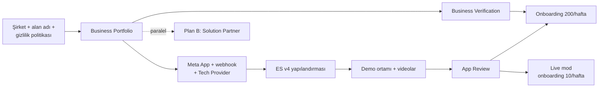
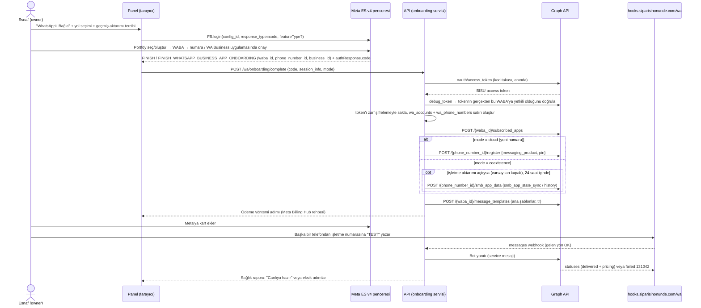
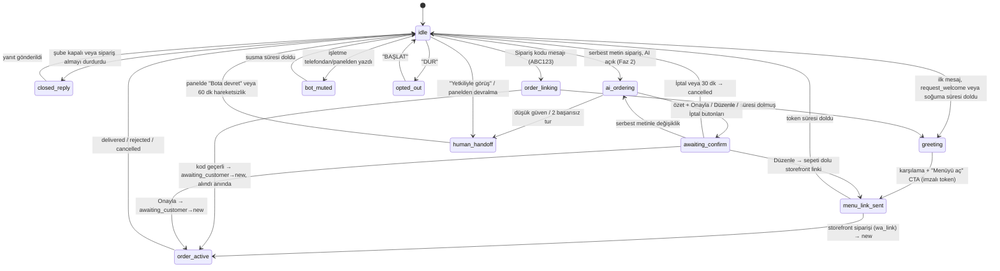
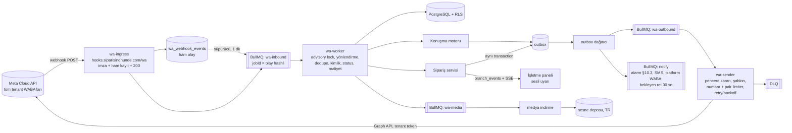

# 02 — WhatsApp Entegrasyonu (Cloud API, Tech Provider, Embedded Signup, Coexistence)

> **Amaç:** Geliştiricinin WhatsApp tarafını doğrudan uygulayabilmesi için Meta hazırlığı, işletme onboarding'i, mesaj/şablon tasarımı, konuşma motoru, webhook/gönderim mimarisi, kimlik, politika uyumu, hata yönetimi ve test stratejisini tek yerde tanımlamak.
> **Tarih:** 2026-09-24 · **Durum:** Taslak (düzeltme turu sonrası) · **Bağlayıcı kaynak:** [00-kararlar-ve-sozluk.md](00-kararlar-ve-sozluk.md) §5 (durum makinesi, sebep kodları, adlandırma, kuyruklar, SSE), §6 (WhatsApp kararları), §7 (akışlar, mesaj koruma kuralları, ret geri alma), §10 (kademeli alarm). Çelişkide 00 geçerlidir. Tablo adları [07](07-veri-modeli-ve-api.md) ile aynıdır (çoğul snake_case).

**Kapsam:** Cloud API erişimi, Tech Provider süreci, Embedded Signup v4, Coexistence, şablon kataloğu (müşteri ve platform şablonları), mesaj bütçesi ve maliyet defteri, konuşma durum makinesi, WhatsApp'sız mod (SMS OTP yedeği) ile WhatsApp kanalının sınırı, webhook ingress → kuyruk → worker → outbox mimarisi, BSUID, WhatsApp politikaları, hata kodları, izleme, kademeli alarm, test.

**Kapsam dışı (bağlantı verilir):**
- Müşteriye giden serbest (service) mesajların tam Türkçe metinleri ve storefront ekranları → [03 Müşteri deneyimi](03-musteri-deneyimi-ve-storefront.md)
- Onboarding sihirbazının diğer adımları, panel sohbet kutusu (inbox) UX'i → [04 İşletme paneli](04-isletme-paneli.md)
- Kuyruk/DB/barındırma teknoloji seçimi, KMS, gözlemlenebilirlik yığını → [06 Teknik mimari](06-teknik-mimari.md)
- Tabloların tam alan listesi, ERD, API uç noktaları → [07 Veri modeli ve API](07-veri-modeli-ve-api.md)
- İYS, KVKK aydınlatma/rıza metinleri, Meta faturasının muhasebesi → [08 Mevzuat](08-mevzuat-kvkk-odeme-fatura.md)
- SLO/KPI ve olay yönetimi süreçleri → [10 Riskler ve operasyon](10-riskler-operasyon-ve-metrikler.md)

**Kaynaklar:** Rakam ve iddiaların ana kaynağı [arastirma/01-whatsapp-platform.md](arastirma/01-whatsapp-platform.md), destek: [arastirma/02-pazar-rakipler-is-modeli.md](arastirma/02-pazar-rakipler-is-modeli.md) §6. **Atıf biçimi:** `A01 §4.3` / `A02 §6` = araştırma raporu 01/02'nin bölümü (URL'ler orada); yalnız `§4.3` = bu dokümanın bölümü. Meta resmi sayfaları araştırma sırasında doğrudan açılamadı; "(teyit edilmeli)" işaretli her madde canlıya çıkmadan önce resmi dokümandan doğrulanır.

## 1. Özet kararlar

| # | Karar | Faz |
|---|---|---|
| 1 | **Yalnız resmi WhatsApp Cloud API.** Baileys, whatsapp-web.js, Evolution API, WPPConnect, Venom vb. hiçbir koşulda (prototip/demo dahil) kullanılmaz. On-Premises API 23 Ekim 2025'te sona erdi (A01 §1.1). Satış argümanı: "Resmi Meta altyapısı, numaran güvende." | Tümü |
| 2 | **Model: doğrudan Meta Tech Provider + Embedded Signup v4 + Coexistence varsayılan.** Portföy, WABA ve numara işletmenindir. Meta mesaj ücretini işletmenin Meta'ya tanımladığı karttan (USD) çeker; biz yalnız aboneliği faturalarız. | Faz 0–1 |
| 3 | **MPS / kredi hattı = Faz 3:** Türk bir Solution Partner ile Multi-Partner Solution (TL fatura, "mesaj dahil" paket, işletmenin Meta'ya kart girmesine gerek kalmaz). Solution Partner görüşmeleri Faz 1'de başlar; App Review/Business Verification gecikirse **Plan B** olarak pilot bir Solution Partner üzerinden başlar. Bu yüzden gönderim katmanı taşıyıcı-bağımsız yazılır (§7.10). | Faz 1 (görüşme, Plan B), Faz 3 (MPS) |
| 4 | **Kritik yol (Faz 0, hemen):** şirket → Business Portfolio + Business Verification → Meta App + Tech Provider → ES v4 yapılandırması → App Review (`whatsapp_business_messaging`, `whatsapp_business_management`, video) → onboarding limiti 10/hafta → 200/hafta. ES v2 8 Ekim 2026'da kalkıyor; yalnız v4 geliştirilir. | Faz 0 |
| 5 | **Varsayılan onboarding: Coexistence.** Alternatif: yeni numara. Normal WhatsApp kullanan esnafa önce WhatsApp Business'a geçiş rehberi. Kısıtlar: 20 mesaj/sn, uygulama ≥14 günde bir açılmalı, API'de grup yok. **Sohbet geçmişi senkronu (6 ay) ve kişi (contacts) senkronu varsayılan kapalı**; işletme açık onayla açabilir. | Faz 1 |
| 6 | **Mesaj ekonomisi (1 Ekim 2026 sonrası):** service mesajları ücretli (numara başına ayda ilk 1.000 ücretsiz); TR utility/service ≈ $0,0009, marketing ≈ $0,0109. Rate card **konfigürasyonda**, kodda değil. **Sipariş başına en fazla 4 durum mesajı** (alındı+takip linki, onaylandı+süre, yolda — gel-alda "hazır", teslim edildi+değerlendirme); Akış A'daki karşılama + "Menüyü aç" ek 1 mesaj (toplam ≤ 5); gecikme/iptal bilgilendirmesi gibi olağan dışı mesajlar bütçe dışı; "hazırlanıyor" varsayılan kapalı. **60 sn debounce yalnız Akış A'da**; Akış B'de doğrulama kodu mesajına "alındı" anında gider (§4.3). Pencere içinde serbest mesaj, dışında utility şablonu. | Faz 1 |
| 7 | **Maliyet defteri ve pass-through:** her status webhook'undaki `pricing` nesnesi kaydedilir; panelde "bu ay Meta'ya tahmini ödeme". Aboneliğe "WhatsApp mesajları dahil" vaadi verilmez (MPS'e kadar). Kampanya modülünde (Faz 2) gönderim öncesi maliyet önizlemesi ve İYS sorgusu zorunlu; durum şablonlarına promosyon/indirim kodu konamaz. | Faz 1 / Faz 2 |
| 8 | **Menü/sepet kendi web storefront'umuzda**, WhatsApp Catalog'da değil (modifier desteği yok). Flows Faz 3. WhatsApp Pay Türkiye'de yok → online ödeme PSP linki (CTA URL). | Faz 1 / Faz 3 |
| 9 | **Müşteri kimliği `(tenant_id, wa_bsuid)`**; telefon nullable. Kurye telefonu: webhook'taki `wa_id` → storefront "teslimat telefonu" → sohbette REQUEST_CONTACT_INFO. İşletmeye contact book'u açık tutması önerilir. | Faz 1 |
| 10 | **AI politikası:** bot yalnız menü/sipariş/adres/çalışma saati konularında çalışır; konu dışına kibar ret + menü butonu; her zaman "Yetkiliyle görüş"; işletme botu kapatabilir. "WhatsApp'ta ChatGPT" diye pazarlanmaz. AI sipariş özetinde kanonik butonlar **[Onayla] [Düzenle] [İptal]**; "ödeme yükümlülüğü doğar" ibaresi mesaj gövdesinde (§6.5). | Faz 1 (kural tabanlı), Faz 2 (AI) |
| 11 | **Kademeli yeni sipariş alarmı (kanonik zamanlama):** t=0 panel sesi + Web Push → t=60 sn ses tekrarı (yükselen) → t=2 dk ayrı **platform WhatsApp numarasından** işletme sahibine uyarı şablonu → t=5 dk SMS → t=10 dk müşteriye "henüz onaylanmadı" bilgisi → t=15 dk otomatik `cancelled` (`tenant_no_response`) + müşteriye özür ve işletme telefonu (§10.3). "Otomatik reddet" yoktur. | Faz 1 |
| 12 | **Commerce Policy:** alkol, tütün/nargile, ilaç, tehlikeli madde (tüp/LPG şüpheli) WhatsApp akışında satılamaz → ürün/kategori bayrağı; bu dikeyler hedeflenmez. | Faz 1 |
| 13 | **WhatsApp'sız mod (SMS OTP yedeği):** müşterinin WhatsApp'ı yoksa, işletmenin WhatsApp bağlantısı henüz tamamlanmadıysa ya da WhatsApp kanalı arızalıysa Akış B doğrulaması SMS OTP ile yapılır; durum bilgisi takip sayfasından, kritik durumlarda (onaylandı, ret, iptal) SMS ile verilir. İşletme Meta adımları bitmeden ilk gün web siparişi alabilir (§6.11). | Faz 1 |

## 2. Meta tarafı hazırlık ve kritik yol **[Faz 0]**

### 2.1 Kritik yol



### 2.2 Kontrol listesi

Süreler **bizim tahminimizdir**; Meta inceleme süreleri resmi olarak taahhüt edilmez (teyit edilmeli).

| ☐ | Adım | Sorumlu | Tahmini süre | Çıktı / bitti tanımı |
|---|---|---|---|---|
| ☐ | Şirket kuruluşu, vergi levhası, ticaret sicil/faaliyet belgesi | Kurucu + mali müşavir | 1–2 hafta | Resmi ünvan ve adres, belgeler PDF ([08](08-mevzuat-kvkk-odeme-fatura.md)) |
| ☐ | `siparisinonunde.com` yayında: gizlilik politikası, kullanım koşulları, veri silme talimatı sayfası, kurumsal e-posta (`@siparisinonunde.com`) | Kurucu + teknik lider | 2–3 gün | URL'ler 200 dönüyor; ünvan/adres sitede görünür |
| ☐ | Meta **Business Portfolio** (şirket adına, 2 yönetici) | Kurucu | 1 saat | Portfolio ID kayıtlı |
| ☐ | **Business Verification** başvurusu (ünvan, adres, telefon, e-posta, web sitesi; gerekirse belge yükleme) | Kurucu | Başvuru 1 gün; inceleme birkaç gün–2 hafta | "Verified" rozeti. Türkiye'de pratikte vergi levhası, sicil/faaliyet belgesi ve alan adlı e-posta istenir (A01 §1.3, teyit edilmeli) |
| ☐ | **Meta App** ("Business" tipi), WhatsApp ürünü, ikon, gizlilik URL'si, kategori | Teknik lider | 1 gün | App ID; App Secret secret manager'da |
| ☐ | Uygulama seviyesinde **webhook**: callback `https://hooks.siparisinonunde.com/wa`, verify token, alan abonelikleri (§7.9) | Teknik lider | 1 gün | GET doğrulaması başarılı, test olayı ingress'e düşüyor |
| ☐ | **Tech Provider** kaydı (App Dashboard → WhatsApp → Tech Provider adımları) | Teknik lider | 1 gün + Meta onayı | Tech Provider durumu aktif |
| ☐ | **ES v4 yapılandırması** (§2.3) | Teknik lider | 1 gün | `config_id` ortam değişkeninde |
| ☐ | **Demo ortamı** (inceleme için): ES ile bağlanma, panelden mesaj gönderme, panelden şablon oluşturma | Geliştirici | 1–2 hafta (Faz 1 ilk sprintleri) | Aşağıdaki video senaryoları kesintisiz çalışıyor |
| ☐ | **App Review videoları** (§2.4) + inceleyici için test hesabı ve adım notları | Teknik lider + tasarım | 1–2 gün | 2 video, İngilizce altyazılı (öneri) |
| ☐ | **App Review başvurusu**: `whatsapp_business_messaging`, `whatsapp_business_management` (Advanced Access). `business_management` gerekip gerekmediği başvuruda teyit edilir (A01 §1.3 [?]) | Teknik lider | Başvuru 1 gün; inceleme birkaç gün–birkaç hafta; ret olursa +1–2 hafta | Advanced Access onaylı |
| ☐ | Uygulamayı **Live** moda al | Teknik lider | 1 saat | ES rol dışı kullanıcılarla çalışıyor |
| ☐ | Onboarding limitini doğrula: 7 günde 10 → doğrulama + review sonrası 200 | Teknik lider | Onaylardan sonra | Admin panelde "kalan onboarding kotası" sayacı. "Access Verification" gereksinimi çelişkili (A01 §1.3 [?]) |
| ☐ | **Solution Partner görüşmeleri** (Plan B pilotu + Faz 3 MPS: kredi hattı, TL fatura, Coexistence desteği, fiyat) | Kurucu | Faz 1 içinde, 2–4 hafta | İmzaya hazır teklif + teknik entegrasyon notu |
| ☐ | Ayrı **platform WhatsApp numarası** (kendi portföyümüzde WABA, Cloud API; alarm, panel çevrimdışı, kurye giriş linki, olay duyurusu ve abonelik şablonları, §5.3, §10.3) | Teknik lider | 1 gün | Numara kayıtlı; §5.3'teki Faz 1 şablonları pilot öncesi `APPROVED` |

### 2.3 Embedded Signup v4 yapılandırması

- Facebook Login for Business → **"WhatsApp Embedded Signup" konfigürasyonu** oluştur → `config_id` al (A01 §2.2).
  - İzinler: `whatsapp_business_management`, `whatsapp_business_messaging` (+ gerekirse `business_management`).
  - Token süresi: mümkünse süresiz; konfigürasyon adlarında "60 gün" ifadesi görülüyor (A01 §2.3 [?], teyit edilmeli). Süreli seçilirse §7.8'deki yenileme alarmı zorunlu.
- **Client OAuth ayarları:** JS SDK ile giriş açık, HTTPS zorunlu, **Allowed Domains:** `panel.siparisinonunde.com` (+ staging: `panel.staging.siparisinonunde.com`), **Valid OAuth Redirect URIs:** `https://panel.siparisinonunde.com/wa/connect`. Ortamlar: prod ve staging için ayrı Meta App (ayrı App Secret, ayrı webhook). Staging uygulaması Development modda kalır.
- ES v2 8 Ekim 2026'da kalkıyor; kodda yalnız v4 akışı. v4'e özgü `extras` alanları (örn. sürüm parametresi) resmi dokümandan teyit edilmeli.

### 2.4 App Review video senaryoları

Meta iki kanıt istiyor: (a) uygulamamızdan gönderilen mesajın WhatsApp istemcisinde alınması, (b) uygulamamızdan şablon oluşturulması (A01 §1.3). Ekran kaydı tek parça, kesintisiz; telefon ekranı ikinci pencerede (scrcpy vb.) görünür.

**Video 1 — `whatsapp_business_messaging` (≈2 dk)**
1. `panel.siparisinonunde.com`'a demo işletme hesabıyla giriş; Ayarlar → WhatsApp'ta numara "Bağlı" görünür.
2. Telefondan (test müşteri) işletme numarasına "Merhaba" yazılır.
3. Panelde mesaj sohbet kutusunda belirir (webhook kanıtı); bot karşılaması ve "Menüyü aç" butonu telefonda görünür.
4. Panelden operatör serbest yanıt yazar → telefonda alınır.
5. Storefront'tan sipariş verilir → panelde sesli uyarı → "Onayla" → telefonda "Siparişiniz onaylandı" mesajı alınır.

**Video 2 — `whatsapp_business_management` (≈2 dk)**
1. Yeni demo işletme ile giriş → "WhatsApp'ı Bağla".
2. ES penceresinde portföy, WABA, numara adımları tamamlanır; panel "Bağlandı" ekranını ve WABA/numara bilgisini gösterir.
3. Ayarlar → Şablonlar → "Yeni şablon": ad, kategori (Utility), dil (tr), gövde girilir → "Gönder".
4. Liste ekranında şablon durumu "İncelemede" → (sayfa yenilenir) "Onaylandı".

**Başvuru notları:** her izin için "neden gerekli" metni (İngilizce), inceleyici için test kullanıcısı + şifre + test numarası, videoda panel dilinin Türkçe olduğunu belirten İngilizce altyazı.

### 2.5 Geliştirme modu kısıtı ve pilot riski

- Uygulama Live olmadan ES'yi yalnız **uygulama rolü olan kullanıcılar veya test kullanıcıları** tamamlayabilir (A01 §1.3).
- Pilot takvimi (Hafta 10–18) App Review'a bağlı. Alternatifler:
  1. **Plan A':** pilot işletme sahiplerinin Facebook hesaplarını uygulamaya "tester" rolüyle eklemek. Standart erişimle bu işletmeler adına mesaj gönderiminin çalışıp çalışmadığı **teyit edilmeli**.
  2. **Plan B:** Solution Partner'ın onboarding'i ve Cloud API uyumlu uç noktası (§7.10). **Karar noktası:** Hafta 8'de Advanced Access yoksa Plan B devreye girer.

## 3. İşletme onboarding'i **[Faz 1]**

Yetki: yalnız `owner` rolü WhatsApp bağlantısını başlatır, yeniden bağlar ve kaldırır ([00](00-kararlar-ve-sozluk.md) §4). Admin tarafında `wa_onboarding` kill-switch'i Embedded Signup başlatmayı durdurur (örn. Meta onboarding kotası dolunca).

**Bağlantı bitmeden sipariş:** İşletme, Meta adımları (portföy, doğrulama, ödeme yöntemi, şablon onayı) tamamlanmadan da storefront'u yayına alabilir. Bu sürede web siparişleri **WhatsApp'sız modda** (Akış B + SMS OTP, §6.11) doğrulanır; numara `live` olunca Akış B WhatsApp doğrulamasına ve Akış A'ya kendiliğinden geçilir.

### 3.1 Teknik akış



### 3.2 Coexistence yolu ve yeni numara yolu

| | **Coexistence (varsayılan, `mode=coexistence`)** | **Yeni numara (`mode=cloud`)** |
|---|---|---|
| Kimin için | WhatsApp Business uygulamasını kullanan esnaf | Ayrı sipariş hattı isteyen veya Coexistence'ın uygun olmadığı işletme |
| Ön koşul | WhatsApp Business app ≥ 2.24.17 (A01 §3.2). Normal WhatsApp kullanan önce aynı numarayla WhatsApp Business'a geçer (rehber ekranı; sohbet taşıma teyit edilmeli, A01 §3.4) | SMS/sesli arama alabilen, başka bir WhatsApp hesabında kayıtlı olmayan numara |
| `FB.login` extras | `featureType: 'whatsapp_business_app_onboarding'` | `featureType` verilmez |
| Bitiş olayı | `FINISH_WHATSAPP_BUSINESS_APP_ONBOARDING` | `FINISH` |
| `/register` | **Çağrılmaz** | Zorunlu, 6 haneli PIN |
| `smb_app_data` | Yalnız işletme seçtiyse, bağlantıdan sonra 24 saat içinde | Yok |
| Throughput | 20 mesaj/sn | 80 mesaj/sn (otomatik 1.000'e kadar) |
| Telefondan yazma | Devam eder; yazılanlar `smb_message_echoes` ile panele düşer | Yok (yalnız panel) |
| Maliyet | Telefondaki uygulamadan gönderilen mesajlar ücretsiz; API mesajları ücretli | Tüm mesajlar API'den, ücretli |
| Kısıtlar | Uygulama ≥14 günde bir açılmalı; API'de grup yok; kaybolan mesaj, tek seferlik medya, canlı konum kapanır; Windows/WearOS istemcileri desteklenmez; uygulamadan gidenlerin durumları gerçek zamanlı gelmez; mavi tik yok (A01 §3.2) | Numara kalıcı olarak API'de; telefon uygulaması kullanılamaz |
| Türkiye | Açık olduğu kuvvetle muhtemel; pilotta bir +90 numarayla **bizzat teyit edilmeli** (A01 §3.1) | Destekli |

### 3.3 Frontend: ES başlatma

```ts
let session: { event: string; data: Record<string, any> } | null = null;
window.addEventListener('message', (e) => {           // FB.login'den ÖNCE kurulur
  if (!/^https:\/\/([a-z0-9-]+\.)*facebook\.com$/.test(e.origin)) return;
  const msg = safeJson(e.data);
  if (msg?.type === 'WA_EMBEDDED_SIGNUP') { session = msg; track('es_event', { event: msg.event, step: msg.data?.current_step }); }
});

export const startSignup = (mode: 'coexistence' | 'cloud') => FB.login((res: any) => { // async callback verme: SDK reddedebilir
  const code = res?.authResponse?.code;
  if (!code) return showEsCancelled(session);                                    // §3.9
  void api.post('/wa/onboarding/complete', { code, mode, session });             // kod ~60 sn içinde takas edilmeli
}, { config_id: ENV.WA_ES_CONFIG_ID, response_type: 'code', override_default_response_type: true,
     extras: { setup: {}, sessionInfoVersion: '3', ...(mode === 'coexistence' && { featureType: 'whatsapp_business_app_onboarding' }) } });
```

### 3.4 Backend: kod takası, doğrulama, saklama

```ts
async function completeOnboarding(tenantId: string, userId: string, body: CompleteBody) {
  assertRole(userId, tenantId, 'owner');
  const { access_token } = await graph.get('/oauth/access_token', {
    client_id: env.META_APP_ID, client_secret: env.META_APP_SECRET, code: body.code,
  }); // kod ömrü çok kısa (~60 sn [?]): kuyruğa atmadan, istek içinde takas et

  // İstemciden gelen waba_id'ye güvenme: token kapsamından doğrula (granular_scopes.target_ids — teyit edilmeli).
  const dbg = await graph.get('/debug_token', { input_token: access_token, access_token: appToken() });
  const { waba_id: wabaId, phone_number_id, business_id } = body.session?.data ?? {};
  if (!scopeTargets(dbg, 'whatsapp_business_management').includes(wabaId)) throw new OnboardingError('WABA_MISMATCH');
  await db.tx(async (tx) => {
    await tx.waAccounts.upsert({ tenantId, wabaId, businessId: business_id, ...(await kms.seal(access_token, { tenantId })), tokenExpiresAt: expiresAt(dbg) }); // token_ciphertext, token_iv, token_auth_tag, token_dek_encrypted, token_kek_version
    await tx.waPhoneNumbers.insert({ tenantId, branchId: body.branchId, phoneNumberId: phone_number_id, mode: body.mode, connectionStatus: 'connecting' }); // phone_number_id global UNIQUE
    await tx.auditLog.insert({ tenantId, userId, action: 'wa.connect', meta: { wabaId, mode: body.mode } });
  });
  await queues.waOutbound.add('onboarding_continue', { tenantId, wabaId }, { jobId: `wa-onb:${wabaId}` }); // subscribed_apps, register, şablonlar, sağlık (§3.5)
}
```

**Token ve PIN saklama:** zarf şifreleme (envelope encryption). KMS'ten tenant başına veri anahtarı (DEK) üretilir; token/PIN AES-256-GCM ile şifrelenir; DB'de `wa_accounts.token_ciphertext`, `token_iv`, `token_auth_tag`, `token_dek_encrypted`, `token_kek_version` (PIN için `wa_phone_numbers.pin_ciphertext` + iv/tag/dek) tutulur ([07](07-veri-modeli-ve-api.md) §3.4). Çözme yalnız `wa-outbound` tüketicisinde (`wa-sender`) ve onboarding kodunda, bellekte kısa süreli önbellekle (≤5 dk). Token/PIN asla loglanmaz, hata raporlarına girmez. KMS seçimi → [06](06-teknik-mimari.md).

### 3.5 Sonraki adımlar (`onboarding_continue` işi, `wa-outbound` kuyruğunda, idempotent)

| Adım | Çağrı / işlem | Hata olursa |
|---|---|---|
| 1. Webhook aboneliği | `POST /{waba_id}/subscribed_apps` (BISU token). Yapılmazsa numaranın webhook'ları gelmez (A01 §2.2) | 3 deneme, sonra panelde "Bağlantı tamamlanamadı" + admin alarmı |
| 2. Numara kaydı (yalnız `cloud`) | `POST /{phone_number_id}/register {"messaging_product":"whatsapp","pin":"<6 hane>"}`. PIN rastgele üretilir, şifreli saklanır. Numara başına **72 saatte en fazla 10** kayıt (A01 §2.2); iki adımlı doğrulamayı kapatan uç nokta yok | Numara daha önce PIN'le kaydedilmişse esnaftan mevcut PIN istenir; deneme sayacı tutulur, 5. denemeden sonra destek ekibine düşer |
| 3. Coexistence senkronu (yalnız seçildiyse) | 24 saat içinde `POST /{phone_number_id}/smb_app_data` → `{"messaging_product":"whatsapp","sync_type":"smb_app_state_sync"}` (kişiler) ve/veya `"history"` (son 6 ay) | 24 saat kaçarsa ve işletme hâlâ istiyorsa bağlantı kesilip akış tekrarlanır (A01 §2.2). Paylaşım tercihi sonradan değiştirilemez |
| 4. Numara bilgisi | `GET /{phone_number_id}` → görünen ad, ad durumu (`AVAILABLE_WITHOUT_REVIEW` / `PENDING_REVIEW` / `DECLINED`), kalite, limit (alan adları teyit edilmeli) | `DECLINED` → §3.6 |
| 5. Ana şablonlar | §5.2'deki her şablon için `POST /{waba_id}/message_templates` | Tek tek yeniden denenir; onaylanmayanlar panelde listelenir |
| 6. Ödeme yöntemi | Esnaf Meta Billing Hub'dan kart ekler (API ile eklenemez) | Sağlık kontrolünde 131042 → canlıya geçiş engellenir |
| 7. Sağlık kontrolü | §3.8 | Eksik adımlar listesi |

**Geçmiş senkronu kararı:** Geçmiş (6 ay 1:1 sohbet) varsayılan **kapalı** (veri minimizasyonu). İşletme açarsa aydınlatma metni gösterilir ([08](08-mevzuat-kvkk-odeme-fatura.md)). `history` webhook'undan gelen mesajlar `source='history'` ile saklanır, bot tetiklemez, sipariş oluşturmaz. **Kişi senkronu** (`smb_app_state_sync`) de varsayılan **kapalı**dır (esnafın kişisel rehberi gelir; [00](00-kararlar-ve-sozluk.md) §6.4); işletme açık onayla açabilir. Tercihler `wa_accounts.history_sync_enabled` ve `contacts_sync_enabled` alanlarında tutulur. Senkron hiç çağrılmazsa Coexistence'ın başka bir işlevinin etkilenip etkilenmediği teyit edilmeli (Açık konular #5).

### 3.6 Görünen ad

- Görünen ad ES sırasında verilir; Business Verification tamamlanınca incelemeye girer; sonraki değişiklikler onaya tabidir (A01 §2.2). Kural: tabela veya ticari ünvanla tutarlı ad ("Lezzet Dürüm Kadıköy"). Panel, ad girilmeden önce örnek ve uyarı gösterir.
- `phone_number_name_update` webhook'u → `wa_phone_numbers.name_status` güncellenir; `DECLINED` → panelde kırmızı uyarı + "Adı düzelt" rehberi.

### 3.7 Ödeme yöntemi adımı (131042)

- Tech Provider modelinde işletme WABA'sına kendi kartını ekler. **1 Ekim 2026'dan itibaren ödeme yöntemi olmayan WABA'ların service mesajları teslim edilmez** (A01 §4.1).
- Panel adımı: 4 ekranlık görselli rehber + Billing Hub'a derin bağlantı (URL teyit edilmeli) + "Kartımı ekledim, kontrol et" butonu (sağlık kontrolünü yeniden çalıştırır). Deneme süresinde de zorunludur ("kartsız deneme" yalnız bize kart vermemek demektir). Ödeme yöntemi API ile doğrudan okunamayabilir; birincil tespit yöntemi **test mesajının 131042 ile düşmesi**dir. WABA alanlarından ödeme bilgisi okunabiliyorsa ek sinyal olarak kullanılır (teyit edilmeli).
- Canlıda 131042 alınırsa: tenant'ın otomatik gönderimleri duraklatılır (`wa_accounts.sending_paused_reason = 'payment_missing'`; kuyruğa alınır, 24 saat saklanır), işletmeye §5.3 `isletme_meta_odeme_v1` şablonu + e-posta + panel banner'ı, admin panelde kırmızı rozet. Duraklama sürdükçe yeni web siparişleri WhatsApp'sız modda doğrulanır (§6.11).

### 3.8 Sağlık kontrolü ve "canlı" kapısı

| Kontrol | Nasıl | Canlıya engel mi? |
|---|---|---|
| Token geçerli ve WABA kapsamında | `debug_token` | Evet |
| Webhook aboneliği | `GET /{waba_id}/subscribed_apps` listesinde uygulamamız | Evet |
| Gelen mesaj | Esnaf **başka bir telefondan** ekrandaki QR/`wa.me` linkiyle "TEST" yazar; ingress'te 60 sn içinde görülür | Evet |
| Giden mesaj + faturalama | Bot yanıtı `delivered` olur ve `pricing` gelir; `failed 131042` → ödeme adımı | Evet |
| Görünen ad | `DECLINED` değil | Evet (`PENDING_REVIEW` engel değil) |
| Ana şablonlar | `siparis_*` şablonları `APPROVED` | Hayır; uyarı ("Pencere dışı bildirimler şablon onayı bekliyor") |
| Kalite | `GREEN`/bilinmiyor | Hayır; `RED` ise uyarı |

**Kabul kriterleri (onboarding):**
- Coexistence ve yeni numara yollarıyla gerçek birer +90 numara, ES başlangıcından "Canlıya hazır" ekranına 15 dakikadan kısa sürede bağlanır.
- Kod takası hatasız; token DB'de düz metin olarak hiçbir yerde (DB, log, APM) görünmez.
- Aynı `phone_number_id` ikinci bir tenant'a bağlanmaya çalışıldığında işlem reddedilir ve admin alarmı üretilir.
- Onboarding işi iki kez çalıştırıldığında yan etki üretmez (şablon/abonelik tekrarlanmaz).
- Her ES olayı (`FINISH*`, `CANCEL` + `current_step`, `ERROR`) huni analitiğine yazılır.

### 3.9 Hata, iptal ve kurtarma

| Senaryo | Tespit | Sistem aksiyonu | Esnafa mesaj |
|---|---|---|---|
| ES penceresi kapatıldı | `CANCEL` + `current_step` veya `code` yok | Huni kaydı; 24 saat sonra hatırlatma e-postası | "Bağlantı yarıda kaldı. Kaldığınız yerden devam edebilirsiniz." |
| ES hatası | `CANCEL` + `error_message` (v4) / `ERROR` | Hata metni loglanır, destek kaydı açılır | "Meta bağlantıyı tamamlayamadı: {kısa sebep}. Tekrar deneyin veya destekle görüşün." |
| Kod süresi doldu | Takas 400 döner | Yeni `FB.login` gerekir | "Süre doldu, lütfen tekrar bağlanın." |
| WABA uyuşmazlığı | `debug_token` kapsamı | İşlem reddedilir, güvenlik logu | "Bağlantı doğrulanamadı. Destekle görüşün." |
| Numara başka sağlayıcıda/kişisel WhatsApp'ta | ES sırasında Meta hatası | Rehber: önce eski sağlayıcıdan ayrılma (teyit edilmeli) | "Bu numara başka bir yerde kullanılıyor." |
| WA Business sürümü eski / uygulama yok | ES Coexistence adımı | Güncelleme/geçiş rehberi | "WhatsApp Business uygulamanızı güncelleyin." |
| `/register` PIN hatası | Graph hatası | Deneme sayacı (72 saatte 10 sınırı) | "Numaranın iki adımlı doğrulama PIN'ini girin." |
| 24 saatlik senkron kaçtı | İş zamanlayıcı | Geçmiş istenmiyorsa yok say; isteniyorsa yeniden bağlanma önerisi | "Eski sohbetleri aktarmak için bağlantıyı yenilemeniz gerekiyor." |
| Canlıda token geçersiz (190) | Gönderim hatası / günlük `debug_token` | Tenant gönderimi duraklat, "Yeniden bağlan"; yeni web siparişleri WhatsApp'sız moda düşer (§6.11) | Panel banner + e-posta + platform şablonu |
| Coexistence koptu | `account_update` / gönderim hataları / sessizlik (§10) | Tenant gönderimi duraklat, "Yeniden bağlan"; yeni web siparişleri WhatsApp'sız moda düşer (§6.11) | "WhatsApp bağlantınız koptu. Web siparişleri SMS doğrulamasıyla alınmaya devam ediyor; müşteri bildirimleri gecikebilir." |

**"Yeniden bağlan" akışı:** Aynı ES akışı, mevcut portföy ve WABA seçilir. Yeni token eskisinin yerine yazılır (eski token iptal edilir). `phone_number_id` aynıysa tüm veri korunur. **Farklı portföy** seçilirse BSUID'ler değişir → §8.4 portföy geçişi kuralı. Bağlantı yeniden kurulunca duraklatılan kuyruk, 24 saatten eski durum mesajları atılarak boşaltılır.

### 3.10 Esnafın göreceği ekran metinleri (kısa)

Sihirbazın genel akışı [04](04-isletme-paneli.md)'te. WhatsApp adımının metinleri:

1. **"WhatsApp'ınızı bağlayalım"** — "Siparişler sizin numaranıza gelecek. Numaranız ve sohbetleriniz yerinde kalır." Seçenekler: **[Mevcut WhatsApp Business numaramı kullan (önerilen)]** · [Sipariş için yeni numara bağla] · "Normal (yeşil) WhatsApp mı kullanıyorsunuz? → Önce WhatsApp Business'a geçin (2 dk'lık rehber)".
2. **"Eski sohbetler"** — "Son 6 ayın sohbetlerini panele aktarmak ister misiniz? Aktarmazsanız yalnız bundan sonraki mesajlar görünür. Bu tercih sonradan değiştirilemez." [ ] Aktar (kapalı).
3. **"Meta penceresi açılacak"** — "Facebook hesabınızla giriş yapın, işletmenizi seçin, numaranızı onaylayın. Telefonunuzdaki WhatsApp Business uygulamasına gelen onayı verin. Pencereyi kapatmayın. Görünen ad sorulduğunda tabelanızdaki adı yazın; müşterileriniz sizi bu adla görecek."
4. **"Meta'ya kart ekleyin"** — "WhatsApp, müşterilerinize giden mesajlar için çok küçük bir ücret alır: mesaj başına yaklaşık 4 kuruş, ayda ilk 1.000 mesaj ücretsiz. Bu ücret bize değil doğrudan Meta'ya ödenir." [Kart ekleme rehberini aç] [Ekledim, kontrol et]
5. **"Deneme"** — "Başka bir telefondan bu QR'ı okutup TEST yazın. Birkaç saniye içinde yanıt gelecek."
6. **"Hazırsınız"** — "Telefonunuzdaki WhatsApp Business'ı en az 2 haftada bir açın. İzinsiz kampanya mesajı atmayın. Alkol ve sigara WhatsApp üzerinden satılamaz."

## 4. Mesaj tasarımı ve maliyet **[Faz 1]**

### 4.1 Kategoriler ve pencereler (A01 §4.2)

| Kategori | Ne için | 1 Ekim 2026 sonrası ücret |
|---|---|---|
| **Service** (şablon olmayan serbest mesaj) | Müşteri yazdıktan sonraki 24 saat içinde her serbest mesaj (metin, buton, liste, CTA URL) | Numara başına aylık ilk **1.000 ücretsiz**, sonrası utility fiyatı; devretmez |
| **Utility** (şablon) | Sipariş durumu, hesap/fatura bildirimi | Her zaman ücretli (pencere içinde de); hacim kademesi var |
| **Authentication** (şablon) | OTP | Ücretli; telefona gönderilmesi gerekir (BSUID'ye one-tap/zero-tap/copy-code gönderilemez) |
| **Marketing** (şablon) | Kampanya, indirim | Her zaman ücretli; hacim kademesi yok |
| **FEP** | Click-to-WhatsApp reklamı / Facebook sayfası CTA'sından gelen kullanıcıya 24 saat içinde yanıt | 72 saat boyunca şablon dahil tüm mesajlar ücretsiz |

- **Customer Service Window (CSW):** müşterinin her mesajıyla açılan/sıfırlanan 24 saat. Dışında yalnız şablon gönderilebilir. Meta gelen mesajdan ücret almaz.
- **1 Ekim 2026 değişikliği:** (1) service mesajları ücretli oldu (1.000 ücretsiz kota hariç), (2) pencere içi utility şablonu da ücretli oldu, (3) ödeme yöntemi olmayan WABA'nın service mesajları teslim edilmez. Status webhook'unda pencere içi utility'nin `pricing.type` değeri `free_customer_service` yerine `regular` görünür (A01 §4.1). **Sonuç:** pencere içindeysek şablon yerine **serbest mesaj** göndeririz (ilk 1.000'i bedava); şablon yalnız pencere dışında.

### 4.2 Türkiye fiyatları (konfigürasyonda)

Fiyatlar kodda sabit yazılmaz; admin panelden yönetilen, tarihli rate card kaydında tutulur. Meta rate card'ları genelde **üç ayda bir** değişir; TR utility Nisan–Temmuz 2026'da ≈ $0,0053 idi (A01 §4.3).

```yaml
# wa_rate_cards tablosu (admin panelden düzenlenir; satır değişmez, yeni effective_from ile eklenir; DB'de USD mikro birim) + fx_rates
rate_cards:
  - { market: TR, effective_from: 2026-10-01, currency: USD, free_service_per_number_per_month: 1000,
      per_message: { marketing: 0.0109, utility: 0.0009, authentication: 0.0009, service: 0.0009 },
      source: "A01 §4.3 ([3P] üçgenleme); Meta rate card CSV'sinden teyit edilmeli" }
fx: { USDTRY: 48.4, as_of: 2026-09-24, source: TCMB }   # yalnız TL gösterimi; günlük güncellenir
```

### 4.3 Sipariş başına mesaj bütçesi (4 durum + 1 karşılama)

Sipariş başına en fazla **4 otomatik durum mesajı**; Akış A'daki karşılama + "Menüyü aç" mesajı bunlara ek 1 mesajdır (toplam ≤ 5, [00](00-kararlar-ve-sozluk.md) §6.5). Gecikme/iptal bilgilendirmesi gibi olağan dışı durum mesajları bütçe dışıdır: kademeli alarmdaki müşteriye gecikme bilgisi (§10.3, sipariş başına en fazla 1) ve `tenant_no_response` iptalindeki özür mesajı. Sayaç `orders.wa_status_msg_count` alanındadır ([07](07-veri-modeli-ve-api.md)). Müşteriye giden serbest metinler ve kodları (M05…M13) [03](03-musteri-deneyimi-ve-storefront.md) §9'dadır.

| Olay (sipariş durumu) | Mesaj | Varsayılan | Not |
|---|---|---|---|
| `new` oluştu | **1. Alındı + takip linki** | Açık | **Akış A:** 60 sn debounce (aşağıda). **Akış B:** müşterinin doğrulama kodu mesajına yanıt olarak **anında** gider, debounce yok. **Akış E:** pencere kapalıysa `siparis_alindi_v1` şablonu, debounce yok. WhatsApp'sız modda gönderilmez (takip sayfası, §6.11) |
| `accepted` | **2. Onaylandı + tahmini süre** | Açık | Akış A'da debounce içinde gelirse 1. mesajla birleşir ("alındı ve onaylandı", 1 mesaj sayılır). WhatsApp'sız modda SMS |
| `preparing` | Hazırlanıyor | **Kapalı** | Açılsa bile yalnız birleşik "alındı ve onaylandı" gittiyse (bütçede "yolda/hazır" ve "teslim" için yer varsa) gönderilir; aksi halde atlanır ([03](03-musteri-deneyimi-ve-storefront.md) §9.6) |
| `ready` (gel-al) | **3. Hazır** | Açık | Paket serviste gönderilmez |
| `on_the_way` | **3. Yolda** (+ ödeme yöntemi hatırlatması) | Açık | |
| `delivered` | **4. Teslim edildi + değerlendirme butonları** | Açık | |
| `rejected` | Reddedildi + sebep | Açık | "Reddet"ten **30 sn sonra** gider ("bekleyen ret", aşağıda); "Geri al" basılırsa hiç gitmez. Kalan mesajların yerini alır (toplam 2). Sebep metni §5.2. WhatsApp'sız modda SMS |
| `cancelled` | İptal + sebep | Açık | `awaiting_customer→cancelled` (müşteri iptali, Akış C zaman aşımı), `new→cancelled` (müşteri iptali veya 15 dk `tenant_no_response`) ve onay sonrası iptalleri kapsar. `tenant_no_response`'ta özür + işletme telefonu (bütçe dışı). Akış B'nin 30 dk `customer_timeout` iptalinde mesaj gitmez (müşteri henüz doğrulamadı, pencere yok). WhatsApp'sız modda SMS |

**Kurallar:**
- Otomatik mesaj sayacı sipariş başına tutulur; 4'e ulaşınca sonraki otomatik mesaj gönderilmez (terminal durum mesajı hariç: `rejected`/`cancelled` her zaman gider, gerekirse önceki bekleyen mesajı iptal ederek).
- **60 sn debounce — yalnız Akış A** ([00](00-kararlar-ve-sozluk.md) §7): storefront ekranı zaten "alındı" gösterdiği için "alındı" outbox kaydı `available_at = placed_at + 60 sn` ile yazılır. Bu sürede `accepted` gelirse kayıt `superseded` olur ve tek birleşik "alındı ve onaylandı" mesajı gider. **Akış B'de** müşteri doğrulama kodunu gönderdiğinde "Siparişiniz alındı" yanıtı **anında** gider (müşteri sohbette yanıt bekliyor; pencereyi kendisi açtı). Akış E ve WhatsApp'sız modda debounce yoktur.
- **Bekleyen ret (30 sn):** işletme "Reddet" dediğinde sipariş `new` kalır, `rejection_reason` ve `rejection_scheduled_at` yazılır; `order.finalize_rejection` outbox kaydı `available_at = +30 sn` ile açılır, kademeli alarm duraklar. 30 sn içinde "Geri al" basılırsa kayıt iptal edilir, müşteriye hiçbir şey gitmez, alarm kaldığı yerden sürer. Süre dolunca `new → rejected` geçişi ve ret mesajı aynı transaction'da outbox'a yazılır. `rejected → new` geçişi yoktur ([00](00-kararlar-ve-sozluk.md) §7).
- **Yerine geçme (supersede):** aynı sipariş için henüz gönderilmemiş eski durum mesajı, yeni durum geldiğinde atılır (örn. "onaylandı" kuyrukta beklerken "yolda" gelirse yalnız "yolda" gider).
- Operatörün panelden elle yazdığı mesajlar ve müşterinin tetiklediği yanıtlar (değerlendirme cevabı, "Beklerim", sipariş kodu hataları) bütçeye girmez, ayrı sayılır.
- Süre değişikliği (örn. "10 dk gecikecek") otomatik gönderilmez; panelde hazır yanıt olarak sunulur ([04](04-isletme-paneli.md)).

### 4.4 Pencere içi/dışı karar mantığı

```ts
type SendPlan = { kind: 'free_form'; expectedCategory: 'service' } | { kind: 'template'; name: string; expectedCategory: 'utility' | 'marketing' }
  | { kind: 'sms_fallback'; templateKey: string } | { kind: 'skip'; reason: string };
const SAFETY_MS = 5 * 60_000; // pencere sonuna 5 dk kala şablona geç (saat kayması, kuyruk gecikmesi)
const SMS_CRITICAL = new Set(['accepted', 'rejected', 'cancelled']); // WhatsApp'sız modda SMS giden durumlar (§6.11)
function planSend(msg: OutboundIntent, c: ConversationState, t: TenantWaState, now = Date.now()): SendPlan {
  if (t.sendingPaused) {                                                         // 131042, 190, kopma
    const smsOk = msg.orderId && SMS_CRITICAL.has(msg.orderEvent!) && msg.deliveryPhone && t.smsFallbackEnabled && flags.sms_fallback;
    return smsOk ? { kind: 'sms_fallback', templateKey: `order_${msg.orderEvent}` } : { kind: 'skip', reason: t.pauseReason };
  }
  if (msg.orderId ? !msg.orderWaNotify : c.customer.optOutAll) return { kind: 'skip', reason: 'no_notify_consent' }; // §6.9
  if (msg.category === 'marketing') {
    if (!c.customer.marketingOptIn || c.customer.marketingSuppressedUntil > now) return { kind: 'skip', reason: 'no_marketing_consent' };
    return { kind: 'template', name: msg.templateName!, expectedCategory: 'marketing' };
  }
  if (msg.orderId && orderBudgetExceeded(msg)) return { kind: 'skip', reason: 'order_budget' };
  const cswOpen = c.lastInboundAt != null && now < c.lastInboundAt + 24 * 3600_000 - SAFETY_MS;
  if (cswOpen) return { kind: 'free_form', expectedCategory: 'service' };        // FEP açıksa da ücret 0 (pricing.type ile doğrulanır)
  const tpl = t.templates.get(msg.templateName ?? '');
  if (tpl?.status === 'APPROVED' && tpl.category === 'UTILITY') return { kind: 'template', name: tpl.name, expectedCategory: 'utility' };
  return { kind: 'skip', reason: tpl ? `template_${tpl.status}_${tpl.category}` : 'window_closed_no_template' }; // panelde uyarı
}
```

- **SMS kanalındaki siparişler** (`orders.status_notify_channel = 'sms'`, WhatsApp'sız mod) `wa.send` üretmez; sipariş servisi kritik durumlarda doğrudan `sms.send` outbox kaydı yazar (`notify` kuyruğu, §6.11). `sms_fallback` sonucu ise gönderici aynı içeriği `sms.send` kaydı olarak yeniden yazar: WhatsApp gönderimi duraklatılmışken açık siparişin kritik durumları, teslimat telefonu varsa SMS'e düşer.
- **Pencere dışı tipik durumlar:** Akış E (telefon siparişi), ertesi güne planlı sipariş (`scheduled_for`), müşterinin 24 saatten eski mesajına panelden yanıt.
- **FEP/CTWA:** gelen mesajda `referral` nesnesi (reklam kaynağı) varsa `conversations.fep_candidate_at` işaretlenir; 24 saat içinde yanıt verilirse 72 saat ücretsiz olur. FEP yalnız **ücreti** etkiler; pencere dışında serbest mesaj izni verdiğini varsaymıyoruz (teyit edilmeli). Gerçek ücret `pricing.type = free_entry_point` ile doğrulanır. Esnafa Click-to-WhatsApp reklam rehberi [Faz 2].
- **Messaging limit:** pencere içi yanıtlar sayılmaz; yalnız pencere dışı şablonlar tekil kullanıcı sayar (§9.4).

### 4.5 Maliyet defteri

Her status webhook'u `pricing` nesnesi taşıyabilir (A01 §9.2): `billable: boolean`, `pricing_model` (örn. `"PMP"`, teyit edilmeli), `category` (`marketing | utility | authentication | service`), `type` (`regular | free_customer_service | free_entry_point`).

- **Kayıt (`wa_message_costs` tablosu):** `wamid` başına tek kayıt (UNIQUE); ilk `pricing` içeren status yazılır, sonrakiler yalnız eksik alanı doldurur. Alanlar: `tenant_id`, `wa_phone_number_id`, `wamid`, `message_id`, `category`, `pricing_type`, `billable`, `pricing_model`, `source`, `delivered_at`, `billing_month`, `in_free_tier`, `rate_card_id`, `est_usd_micros`, `est_try_kurus` (tam liste: [07](07-veri-modeli-ve-api.md) §3.4).
- **Tahmin:** ücret teslim edilen mesajdan alınır → `failed` mesajlar 0. `billable=false` veya `type ≠ regular` → 0. Service kategorisinde numara başına ay içindeki ilk 1.000 mesaj 0 kabul edilir (Meta'nın bu kotayı webhook'ta nasıl işaretlediği ve ay sınırının saat dilimi teyit edilmeli). Kalan: `rate_card[category] × 1`.
- **Gösterim:** panelde "Bu ay Meta'ya tahmini ödeme: ≈ X TL (Y $)" + kategori kırılımı + "Kesin tutar Meta faturasındadır" notu. Admin panelde tenant bazında aynı rapor.
- Coexistence'ta telefondan gönderilen mesajlar ücretsizdir; deftere `source='business_app'` ile 0 olarak yazılır.
- Platform WABA'sından (§5.3) giden mesajlar ve SMS'ler tenant defterine girmez; platform maliyeti olarak `tenant_usage_daily.platform_wa_count` / `sms_count` ve `sms_messages` tablosunda izlenir ([07](07-veri-modeli-ve-api.md) §3.7).

### 4.6 Aylık maliyet örneği (Türkiye, 1 Ekim 2026 sonrası)

Varsayım: Akış A, sipariş başına 5 service mesajı (karşılama + 4 durum; üst sınır), hepsi pencere içinde, tek numara, kur 48,4. Sipariş başı ≈ 5 × $0,0009 = $0,0045 ≈ 0,22 TL. Kaynak: A01 §4.5.

| İşletme | Sipariş/ay | Service mesajı | Ücretli (−1.000) | $0,0009 ile | Hassasiyet: $0,0053 ile |
|---|---|---|---|---|---|
| Küçük (pideci) | 300 | 1.500 | 500 | $0,45 ≈ **22 TL** | $2,65 ≈ 128 TL |
| Pro tipik (günde 30) | 900 | 4.500 | 3.500 | $3,15 ≈ **152 TL** | $18,55 ≈ 898 TL |
| Orta | 1.500 | 7.500 | 6.500 | $5,85 ≈ **283 TL** | $34,45 ≈ 1.667 TL |
| Çok yoğun | 5.000 | 25.000 | 24.000 | $21,60 ≈ **1.045 TL** | $127,20 ≈ 6.156 TL |

- Akış B siparişi en fazla 4 mesajdır (karşılama yok). Pencere dışı utility şablonu ücretsiz kotaya girmez: 3 şablon × $0,0009 = $0,0027/sipariş. **Pazarlama** [Faz 2] asıl değişken kalemdir: 1.000 kişiye bir kampanya ≈ $10,90 ≈ 528 TL.
- WhatsApp'sız moddaki sipariş 0 WhatsApp mesajıdır; SMS (OTP + en fazla 2 kritik durum SMS'i) platform maliyetidir ve aboneliğe adil kullanım kotasıyla dahildir (Esnaf 100, Pro 300 SMS/ay; [00](00-kararlar-ve-sozluk.md) §4).

**Kabul kriterleri (maliyet):** Rate card değişikliği deploy gerektirmez; her gönderilen mesajın `wamid`'i için en geç 24 saat içinde defter kaydı oluşur; panel tahmini ile deftere yazılan ücretli mesaj sayısı birebir tutar; kampanya ekranı gönderimden önce "≈ N mesaj × fiyat = X TL" gösterir ve onaysız gönderim yapılamaz [Faz 2].

## 5. Şablon kataloğu **[Faz 1]**

### 5.1 İlkeler

- Platform bir **ana şablon seti** tutar (ad, sürüm, kategori, gövde, değişken şeması, butonlar). Onboarding'de her tenant WABA'sında programatik oluşturulur; onay her WABA'da ayrı yürür.
- Ad biçimi: `snake_case` + sürüm eki (`_v1`). Metin değişikliği = yeni sürüm (eski sürüm onaylı kaldıkça kullanılmaya devam eder).
- Dil: `tr`. Değişkenler konumsal (`{{1}}`). Meta'nın gövdenin değişkenle başlamasını/bitmesini ve değişken/metin oranının yüksek olmasını reddedebildiği bilinir (teyit edilmeli); metinler buna göre yazıldı.
- URL butonlarında taban adres tenant'a özeldir (`https://{slug}.siparisinonunde.com/t/{{1}}`); slug değişirse ilgili şablonlar yeni sürümle yeniden oluşturulur.
- Boş değişken gönderilmez: müşteri adı bilinmiyorsa `{{1}}` = "değerli müşterimiz". URL butonunun değişkeni gövdeden bağımsızdır (takip token'ı).
- **Durum şablonları saf bilgilendirmedir:** promosyon dili, indirim/kupon kodu ve takip linki dışında URL içeremez (Meta promosyonlu utility'yi marketing'e de çevirir, A01 §5). Şablon editörü (panel/admin) bunu sunucu tarafında engeller: yasaklı ifade listesi ("indirim", "kampanya", "fırsat", "kupon", "hediye"…) + kupon kodu kalıbı + URL beyaz listesi; ihlalde kaydetmez. Aynı kontrol, işletmenin özelleştirdiği pencere içi durum metinlerine de uygulanır.
- Şablon limiti: doğrulanmamış portföyde WABA başına 250, doğrulanmışta 6.000 (A01 §5) — setimiz bunun çok altında.

### 5.2 İşletme WABA'sı şablonları (müşteriye)

Bu şablonlar **yalnız pencere dışında** kullanılır (§4.4). Pencere içinde aynı içerik serbest mesaj olarak gider; serbest metinler [03](03-musteri-deneyimi-ve-storefront.md)'te.

| Ad | Kategori | Değişkenler | Butonlar | Kullanım |
|---|---|---|---|---|
| `siparis_alindi_v1` | Utility | 1 müşteri adı, 2 işletme adı, 3 sipariş no, 4 tutar | URL "Siparişi takip et" → `/t/{{1}}` | `new` (Akış E, planlı sipariş) |
| `siparis_onaylandi_v1` | Utility | 1 işletme adı, 2 tahmini dakika, 3 sipariş no | URL "Siparişi takip et" | `accepted` |
| `siparis_hazir_v1` | Utility | 1 işletme adı, 2 sipariş no, 3 şube adresi | URL "Siparişi takip et" | `ready` (gel-al) |
| `siparis_yolda_v1` | Utility | 1 işletme adı, 2 tahmini dakika, 3 sipariş no, 4 ödeme yöntemi | URL "Siparişi takip et" | `on_the_way` |
| `siparis_teslim_v1` | Utility | 1 işletme adı, 2 sipariş no | URL "Değerlendir" → `/t/{{1}}#degerlendir` | `delivered` |
| `siparis_reddedildi_v1` | Utility | 1 işletme adı, 2 sebep, 3 sipariş no | — | `rejected` |
| `siparis_iptal_v1` | Utility | 1 sipariş no, 2 sebep, 3 işletme adı | — | `cancelled` (`tenant_no_response` hariç) |
| `siparis_iptal_yanitsiz_v1` | Utility | 1 sipariş no, 2 işletme adı, 3 işletme telefonu | — | `new → cancelled`, `cancelled_by = system`, `tenant_no_response` (§10.3 basamak 6) |
| `yanit_bekliyor_v1` | Utility (risk: marketing'e çevrilebilir) | 1 müşteri adı, 2 işletme adı | Hızlı yanıt "Devam et" | Panelden 24 saatten eski sohbete yanıt |
| `kampanya_genel_v1` **[Faz 2]** | Marketing | 1 işletme adı, 2 kampanya metni, 3 bitiş tarihi | URL "Menüyü aç", hızlı yanıt "Kampanyaları durdur" | Yalnız kampanya modülünden, opt-in'li müşteriye; otomatik oluşturulmaz |

**Metinler (Meta'ya gönderilecek resmi gövdeler):**
- **`siparis_alindi_v1`** — "Merhaba {{1}}, {{2}} siparişinizi aldı. Sipariş no: {{3}}, tutar: {{4}}. İşletme onayladığında size buradan haber vereceğiz."
- **`siparis_onaylandi_v1`** — "Siparişiniz onaylandı. {{1}} siparişinizi hazırlamaya başladı, tahmini süre {{2}} dakika. Sipariş no: {{3}}."
- **`siparis_hazir_v1`** — "Siparişiniz hazır. {{1}} sizi bekliyor. Sipariş no: {{2}}. Adres: {{3}}."
- **`siparis_yolda_v1`** — "Siparişiniz yola çıktı. {{1}} kuryesi yaklaşık {{2}} dakika içinde adresinizde olacak. Sipariş no: {{3}}. Ödeme: {{4}}."
- **`siparis_teslim_v1`** — "Siparişiniz teslim edildi, afiyet olsun! {{1}} olarak bizi tercih ettiğiniz için teşekkür ederiz. Sipariş no: {{2}}. Deneyiminizi aşağıdaki bağlantıdan paylaşabilirsiniz."
- **`siparis_reddedildi_v1`** — "Üzgünüz, {{1}} siparişinizi şu anda alamıyor. Sebep: {{2}}. Sipariş no: {{3}}. Anlayışınız için teşekkür ederiz."
- **`siparis_iptal_v1`** — "Siparişiniz iptal edildi. Sipariş no: {{1}}. Sebep: {{2}}. Sorunuz varsa bu mesajı yanıtlayarak {{3}} ile görüşebilirsiniz."
- **`siparis_iptal_yanitsiz_v1`** — "Üzgünüz, {{1}} numaralı siparişiniz {{2}} tarafından zamanında onaylanamadığı için iptal edildi. Siparişinizi telefonla vermek isterseniz {{3}} numarasını arayabilirsiniz. Sizi beklettiğimiz için özür dileriz."
- **`yanit_bekliyor_v1`** — "Merhaba {{1}}, {{2}} olarak mesajınızı gördük ve yanıtlamak istiyoruz. Devam etmek için aşağıdaki butona dokunmanız yeterli."
- **`kampanya_genel_v1`** — "Merhaba, {{1}} size özel bir fırsat hazırladı: {{2}}. Kampanya {{3}} tarihine kadar geçerli. Kampanya mesajı almak istemiyorsanız \"Kampanyaları durdur\"a dokunun."

**Sebep değişkeni metinleri.** `{{2}}`, [00](00-kararlar-ve-sozluk.md) §5'teki sebep kodunun kısa Türkçe karşılığıdır; aynı kısa metin WhatsApp'sız moddaki SMS-03a/03b'de de kullanılır. Pencere içinde giden serbest mesajın tam metni (sebebe göre buton dahil) [03](03-musteri-deneyimi-ve-storefront.md) §9.2 M11/M12'dedir; kanonik kısa metin bu tablodur. Değişkende satır sonu olmaz, promosyon filtresinden geçer (§5.1).

| `rejection_reason` (`siparis_reddedildi_v1`) | `{{2}}` metni | Pencere içi mesaj notu |
|---|---|---|
| `closed` | işletme şu an kapalı | Açılış saati eklenir (M11) |
| `out_of_zone` | adresiniz teslimat bölgesi dışında | Gel-al açıksa "Gel-al sipariş ver" butonu |
| `item_unavailable` | siparişinizdeki bir ürün tükendi | Ürün adı + "Menüyü aç" butonu |
| `too_busy` | yoğunluk nedeniyle şu an sipariş alınamıyor | "Biraz sonra tekrar deneyebilirsiniz" |
| `duplicate` | aynı sipariş daha önce alındı, diğer siparişiniz geçerli | Diğer siparişin numarası eklenir |
| `suspected_fake` | ayrıntı için lütfen işletmeyi arayın | Nötr metin, suçlama yok; şube telefonu eklenir |
| `other` | işletmenin yazdığı not (zorunlu, en fazla 140 karakter) | Not promosyon filtresinden geçer |

| `cancel_reason` (`siparis_iptal_v1`) | `{{2}}` metni | Not |
|---|---|---|
| `customer_request` | isteğiniz üzerine | `awaiting_customer`, `new` veya onay sonrası müşteri iptali |
| `customer_timeout` | sipariş onayınız süresi içinde gelmedi | Yalnız Akış C [Faz 2]; Akış B'nin 30 dk zaman aşımında mesaj gitmez |
| `tenant_no_response` | — | Ayrı şablon `siparis_iptal_yanitsiz_v1` (özür + işletme telefonu); pencere içinde [03](03-musteri-deneyimi-ve-storefront.md) M12d; bütçe dışı |
| `item_unavailable` | siparişinizdeki bir ürün tükendi | |
| `courier_issue` | teslimat şu an yapılamıyor | |
| `duplicate` | aynı siparişin tekrarı, diğer siparişiniz geçerli | |
| `suspected_fake` | ayrıntı için lütfen işletmeyi arayın | Nötr metin |
| `payment_timeout` [Faz 2] | online ödeme süresi içinde tamamlanmadı | Online ödeme |
| `other` | işletmenin yazdığı not | |

### 5.3 Platform WABA'sı şablonları (işletmeye ve kuryeye)

**[Faz 1]** Ayrı bir **platform WhatsApp numarasından** (kendi portföyümüzdeki WABA, Cloud API, görünen ad "Siparişin Önünde") işletme sahibi/personelinin ve kuryenin kişisel numarasına gider; kademeli alarmın 3. basamağıdır (§10.3). Onboarding'de `owner`'dan açık onay alınır ("Kritik uyarıları WhatsApp'tan almak istiyorum"); `manager` kendi profilinden katılabilir. Kurye için onay, `owner`/`manager` kuryeyi eklerken işaretlenir ("Kurye giriş linkini WhatsApp'tan almayı kabul etti"); yoksa link SMS ile gider. Ücret bizim WABA'mızdan çıkar; gönderimler `notifications` tablosuna (`channel = 'platform_wa'`) yazılır. WhatsApp'a ulaşılamazsa (şablon `failed`, onay yok) aynı uyarı e-posta ve SMS ile gider (SMS sağlayıcısı → [06](06-teknik-mimari.md)). **Meta/WhatsApp genel kesintisinde** platform şablonları kullanılmaz; SMS + e-posta + panel duyuru bandı kullanılır ([10](10-riskler-operasyon-ve-metrikler.md) §6.3). Admin tarafında `platform_wa_alerts` gibi bir acil durdurma anahtarı önerilir ([06](06-teknik-mimari.md)).

| Ad | Kategori | Değişkenler | Buton | Tetik |
|---|---|---|---|---|
| `isletme_yeni_siparis_v1` | Utility | 1 işletme adı, 2 sipariş no, 3 bekleme dk, 4 tutar | URL "Siparişi aç" → `panel.siparisinonunde.com/o/{{1}}` | `new` 2 dk onaylanmadı (§10.3 basamak 3); bekleyen ret varsa gitmez |
| `isletme_panel_cevrimdisi_v1` | Utility | 1 şube adı, 2 dakika | URL "Paneli aç" → `panel.siparisinonunde.com` | Panel çevrimdışı dedektörü: şube açıkken sesi açık ve nabız gönderen hiç cihaz yok ([06](06-teknik-mimari.md) §7.7); 30 dk'da en fazla 1, SMS ile birlikte |
| `kurye_giris_v1` | Utility (risk: Meta authentication sayabilir, teyit edilmeli) | 1 işletme adı | URL "Kurye ekranını aç" → `panel.siparisinonunde.com/kurye/giris?t={{1}}` (tek kullanımlık token) | `owner`/`manager` panelde kurye için "Giriş linki gönder" ([04](04-isletme-paneli.md) P-24); kurye oturumu 12 saat (vardiya, [00](00-kararlar-ve-sozluk.md) §4) |
| `isletme_baglanti_sorunu_v1` | Utility | 1 işletme adı, 2 sorun özeti | URL "Yeniden bağlan" | Token 190, Coexistence kopması, abonelik iptali |
| `isletme_meta_odeme_v1` | Utility | 1 işletme adı | URL "Rehberi aç" | 131042 |
| `isletme_kalite_uyari_v1` | Utility | 1 işletme adı, 2 kalite durumu | URL "Ayrıntılar" | Kalite `YELLOW`/`RED` |
| `platform_planli_bakim_v1` | Utility (risk: teyit edilmeli) | 1 tarih, 2 başlangıç saati, 3 tahmini süre (dk), 4 siparişlere etkisi | URL "Ayrıntılar" → durum sayfası | Planlı bakım; en az 48 saat önce, yoğun saat dışında ([10](10-riskler-operasyon-ve-metrikler.md) §6.4) |
| `platform_hizmet_bildirimi_v1` | Utility (risk: teyit edilmeli) | 1 başlangıç saati, 2 sorun, 3 siparişlere etkisi, 4 sonraki bilgi saati | URL "Durumu gör" → durum sayfası | Olay/kesinti ilk duyurusu ve güncellemeleri (SEV1–SEV2, yalnız etkilenen tenant'lar; [10](10-riskler-operasyon-ve-metrikler.md) §6.3) |
| `platform_hizmet_duzeldi_v1` | Utility (risk: teyit edilmeli) | 1 sorun, 2 çözülme saati, 3 yapılması gereken | URL "Paneli aç" | Olay çözüldü duyurusu |
| `abonelik_odeme_hatirlatma_v1` | Utility | 1 paket adı, 2 tutar, 3 tarih | URL "Faturalarım" | Yenilemeden 3 gün önce [Faz 2] |
| `abonelik_odeme_basarisiz_v1` | Utility | 1 paket adı, 2 tutar, 3 son tarih | URL "Ödeme bilgisini güncelle" | Tahsilat başarısız (dunning G, G+3, G+7; [00](00-kararlar-ve-sozluk.md) §9) [Faz 2] |
| `deneme_bitiyor_v1` | Utility (risk: marketing'e çevrilebilir) | 1 bitiş tarihi, 2 alınan sipariş sayısı | URL "Paketimi seç" | Denemenin 12. günü [Faz 2] |

Metinler:
- **`isletme_yeni_siparis_v1`** — "Yeni sipariş onay bekliyor. İşletme: {{1}}, sipariş no: {{2}}, bekleme: {{3}} dakika, tutar: {{4}}. Müşteriniz beklemesin, panelden onaylayın ya da reddedin."
- **`isletme_panel_cevrimdisi_v1`** — "Dikkat: {{1}} şu an sipariş alıyor ama {{2}} dakikadır sesi açık hiçbir panel ekranı yok. Yeni siparişleri kaçırmamak için paneli açıp \"Siparişleri almaya başla\" düğmesine dokunun."
- **`kurye_giris_v1`** — "Merhaba, {{1}} sizi kurye olarak ekledi. Kurye ekranına girmek için aşağıdaki butona dokunun. Bağlantı tek kullanımlıktır, lütfen kimseyle paylaşmayın."
- **`isletme_baglanti_sorunu_v1`** — "Dikkat: {{1}} WhatsApp bağlantısında sorun var ({{2}}). Çözülene kadar müşterilerinize mesaj gitmeyebilir. Panelde \"Yeniden bağlan\" adımını tamamlayın."
- **`isletme_meta_odeme_v1`** — "Dikkat: {{1}} WhatsApp hesabında Meta ödeme yöntemi eksik veya geçersiz. Müşterilerinize giden mesajlar durdu. Meta hesabınıza geçerli bir kart ekleyin; adım adım rehber panelde."
- **`isletme_kalite_uyari_v1`** — "Bilgilendirme: {{1}} WhatsApp numaranızın kalite durumu {{2}} oldu. Numaranızı korumak için izinsiz toplu mesajdan kaçının; ayrıntılar panelde."
- **`platform_planli_bakim_v1`** — "Siparişin Önünde planlı bakım bilgilendirmesi: {{1}} tarihinde saat {{2}} itibarıyla yaklaşık {{3}} dakikalık bakım çalışması yapılacak. Siparişlerinize etkisi: {{4}}. Ayrıntıları aşağıdaki bağlantıdan görebilirsiniz."
- **`platform_hizmet_bildirimi_v1`** — "Siparişin Önünde bilgilendirme: Bugün saat {{1}} itibarıyla {{2}} yaşanıyor. Siparişlerinize etkisi: {{3}}. Ekibimiz sorunu çözmek için çalışıyor; bir sonraki bilgiyi en geç saat {{4}} itibarıyla vereceğiz."
- **`platform_hizmet_duzeldi_v1`** — "Siparişin Önünde bilgilendirme: {{1}} saat {{2}} itibarıyla giderildi. Sizden ricamız: {{3}}. Yaşattığımız aksaklık için özür dileriz."
- **`abonelik_odeme_hatirlatma_v1`** — "Siparişin Önünde {{1}} paketinizin {{2}} tutarındaki ödemesi {{3}} tarihinde alınacak. Fatura ve ödeme bilgilerinizi panelden görebilirsiniz."
- **`abonelik_odeme_basarisiz_v1`** — "Ödemeniz alınamadı. {{1}} paketinizin {{2}} tutarındaki ödemesi başarısız oldu. Hizmetinizin kesintisiz sürmesi için {{3}} tarihine kadar ödeme bilginizi güncelleyin."
- **`deneme_bitiyor_v1`** — "Deneme süreniz {{1}} tarihinde bitiyor. Bu sürede kendi kanalınızdan {{2}} sipariş aldınız. Kesintisiz devam etmek için panelden paketinizi seçin."

**Notlar:**
- **Kurye giriş linki:** Meta, giriş/doğrulama amaçlı içeriği authentication kategorisine çevirebilir; authentication şablonları URL butonu taşımaz, yalnız kod gönderir. Şablon reddedilir veya kategori değişirse yedek: kurye ekranında 6 haneli kod girişi ile authentication şablonu (telefona gönderilir) ya da doğrudan SMS (`sms_messages.purpose = 'courier_login'`). Linkin geçerlilik süresi ve tek kullanımlık token kuralı [06](06-teknik-mimari.md) §6.4'tedir.
- **Olay duyuruları:** Admin panelindeki olay kaydından tetiklenir, yalnız etkilenen tenant'lara ve platform bildirim onayı olan `owner`'lara gider; aynı olay için ilk duyuru + en fazla bir güncelleme + "çözüldü" (spam ve kalite koruması). SEV1'de SMS her durumda ek olarak gider. Paralel olarak panelde duyuru bandı (SSE `announcement` olayı) ve e-posta çıkar. "Durumu gör" butonu `status.siparisinonunde.com` durum sayfasına açılır; sayfa Faz 2'de tam haliyle gelir, pilot öncesi basit sürüm önerisi [10](10-riskler-operasyon-ve-metrikler.md) §6.4'tedir. Tanıtım/sürüm notu duyuruları WhatsApp'tan gönderilmez ([05](05-admin-paneli-ve-pazarlama-sitesi.md)).
- Duyuru ve bakım şablonları ile kurye şablonu pilot öncesi `APPROVED` olmalıdır; kategori kararı Meta'dadır (Açık konular #16).

### 5.4 Onay süreci, ret ve kategori değişimi

- Utility çoğunlukla dakikalar içinde, marketing 24 saate kadar onaylanır (A01 §5). `message_template_status_update` → `wa_templates.status` güncellenir (`PENDING`, `APPROVED`, `REJECTED`, `PAUSED`, `DISABLED`; tam değer listesi teyit edilmeli).

| Olay | Sistem aksiyonu |
|---|---|
| `REJECTED` | Ret sebebi kaydedilir; admin alarmı. Aynı şablon birden çok tenant'ta reddedildiyse metin sorunu → platform yeni sürüm yazar ve tüm tenant'lara dağıtır. Tek tenant ise işletme adı/slug kaynaklı olabilir → destek incelemesi |
| `template_category_update` (utility → marketing) | Şablon **durum bildirimi için kullanılmaz** (12 kat pahalı, opt-in ve frekans kuralları devreye girer). Pencere dışı o bildirim atlanır ve panelde gösterilir. Platform daha işlemsel bir sürüm (`_v2`) hazırlar. Tekrarlayan yanlış kategorizasyon geçici engellere yol açabileceği için (A01 §5) metinler yayından önce iç incelemeden geçer |
| `PAUSED` / kalite düşüşü (`message_template_quality_update`) | Şablon geçici devre dışı; alternatif sürüm varsa ona geçilir; admin alarmı |
| `DISABLED` | Yeni sürüm oluşturulana kadar ilgili bildirim yalnız pencere içinde gider |

- **Şablon senkronu:** `cron` kuyruğunda günlük iş, `GET /{waba_id}/message_templates` ile tüm tenant'ların durumunu webhook kaçırmalarına karşı mutabık kılar.
- 132xxx gönderim hataları (parametre uyuşmazlığı, şablon yok, duraklatılmış) → şablon senkronu tetiklenir + alarm.

**Kabul kriterleri (şablon):** Yeni tenant'ta tüm §5.2 utility şablonları onboarding'den sonra 10 dk içinde Meta'ya gönderilmiş olur; §5.3'teki Faz 1 platform şablonları (alarm, panel çevrimdışı, kurye girişi, bakım/kesinti/çözüldü) pilot öncesi `APPROVED` durumdadır; her tenant için şablon durumu admin panelde görünür; kategori değişen bir şablonla hiçbir durum bildirimi gönderilmez (otomatik testle doğrulanır).

## 6. Konuşma motoru

Motor, gelen her mesajı işleyen ve bot yanıtını belirleyen kural katmanıdır. Sipariş durum makinesinden ([00](00-kararlar-ve-sozluk.md) §5) ayrıdır; ona olay gönderir. Yanıt metinleri [03](03-musteri-deneyimi-ve-storefront.md)'te. Motor yalnız WhatsApp kanalında çalışır: WhatsApp'sız modda (SMS OTP) konuşma yoktur, sipariş yaşam döngüsü takip sayfası ve SMS ile yürür (§6.11).

### 6.1 Durum makinesi



`human_handoff`, `bot_muted` ve `opted_out` pratikte konuşma üzerindeki **bayraklardır** (`conversations.mode`, `conversations.bot_muted_until`, `customers.opt_out_all`); her bot yanıtından önce kontrol edilir. `closed_reply` kalıcı durum değil, tek seferlik etkidir. Kalıcı durum `conversations.state` alanındadır ([07](07-veri-modeli-ve-api.md) §4.2). Konuşma FSM'i sipariş FSM'inden ayrı, `packages/core`'da tablo güdümlü ve %100 birim testlidir.

### 6.2 Gelen mesaj işleme sırası

```ts
async function onInbound(m: InboundMessage) {
  const conv = await conversations.lockAndLoad(m.tenantId, m.customerId);     // advisory lock: konuşma başına sıralı (§7.3)
  conv.lastInboundAt = m.timestamp;                                           // 24 saat penceresi
  if (m.referral) conv.fepCandidateAt = m.timestamp;                          // CTWA
  await inbox.push(conv, m);                                                  // her mesaj panele düşer (canlı)
  if (isOptOut(m)) return handleOptOut(conv, m);                              // "DUR", "STOP", "MESAJ ATMAYIN"…
  if (isOptIn(m)) return handleOptIn(conv, m);                                // "BAŞLAT"
  const code = matchOrderCode(m);  if (code) return linkOrder(conv, code);    // Akış B: "alındı" anında, debounce yok (§6.4)
  if (m.buttonId) return routeButton(conv, m.buttonId);                       // "handoff", "order:<id>:confirm|edit|cancel", gecikme mesajındaki "Beklerim"/"İptal"…
  if (isHandoffRequest(m)) return startHandoff(conv);                         // "yetkili", "insan", "operatör"
  if (conv.mode === 'human' || conv.botMutedUntil > now() || !tenant.botEnabled) return; // bot susar
  if (!tenant.isOpenNow(conv.branchId)) return replyOnce(conv, 'closed', 6 * HOUR);
  if (conv.activeOrderId) return replyOnce(conv, 'order_status_with_link', 15 * MIN);
  if (isMediaOrUnsupported(m)) return handleMedia(conv, m);
  if (tenant.aiEnabled && flags.llm_parsing && looksLikeOrder(m)) return aiOrdering(conv, m); // Faz 2; kill-switch llm_parsing
  return replyOnce(conv, 'greeting_with_menu_cta', 30 * MIN);                 // konu dışı dahil
}
```

`replyOnce(key, cooldown)`: aynı konuşmada aynı tip otomatik yanıt soğuma süresi içinde tekrar gönderilmez (spam ve maliyet koruması). Soğuma sürelerinin tamamı işletme ayarı değil, platform konfigürasyonudur.

### 6.3 Karşılama ve menü linki (Akış A) **[Faz 1]**

- Yanıt: interaktif **CTA URL** mesajı. Gövde: karşılama + çalışma durumu + tahmini teslim süresi; buton: "Menüyü aç" (buton metni sınırı ~20 karakter, teyit edilmeli). CTA URL mesajı tek buton taşır; ikinci mesaj göndermemek için "Yetkiliyle görüş" yolu gövdede "Yetkiliyle görüşmek için *yetkili* yazın" satırıyla verilir.
- Link: `https://{slug}.siparisinonunde.com/?wa=<token>`. Token imzalı ve kısa ömürlüdür:

```ts
type MenuToken = { v: 1; kid: string; t: string /*tenant*/; b: string /*branch*/; c: string /*customer*/; cv: string /*conversation*/; exp: number }; // telefon yok
const signMenuToken = (p: MenuToken, key: Buffer) => {
  const body = Buffer.from(JSON.stringify(p)).toString('base64url');
  return `${body}.${crypto.createHmac('sha256', key).update(body).digest('base64url')}`;
}; // doğrulama: timingSafeEqual + exp + tenant slug eşleşmesi; ömür 2 saat (konfigürasyon); kid ile 2 anahtar paralel geçerli
```

- Token GET isteğinde tüketilmez (link önizleme/prefetch yakmasın): storefront ilk açılışta token'ı oturum çerezine çevirir, URL'yi temizler ve "Ben değilim" kaçışı sunar ([00](00-kararlar-ve-sozluk.md) §7; kayıt `storefront_link_tokens`).
- Token geçerliyse storefront siparişi `channel = wa_link`, `verification_method = wa_link` ile doğrudan `new` olur ve müşteriye bağlanır. "Alındı" mesajı 60 sn debounce ile gider (§4.3). Token süresi dolmuşsa veya "Ben değilim" seçildiyse storefront çalışmaya devam eder ama siparişi **Akış B** gibi işler ("WhatsApp ile onayla").

### 6.4 Sipariş bağlama — Akış B ("Sipariş kodu") **[Faz 1]**

- Storefront'ta doğrudan verilen sipariş (`channel = web`) `awaiting_customer` olur ve 6 karakterli kod üretilir (`order_verification_codes`) (alfabe: karışan karakterler hariç `ABCDEFGHJKLMNPQRSTUVWXYZ23456789`; en az 1 rakam, böylece "BURADA" gibi kelimeler kod sanılmaz). Kod tenant içinde, açık siparişler arasında benzersizdir; 30 dk sonra `cancelled` (`customer_timeout`).
- Buton: `https://wa.me/<işletme numarası>?text=Sipariş%20kodu%3A%20ABC123`.
- Eşleme:

```ts
const ORDER_CODE = /sipari[şs]\s*kod[uü]?\s*[:：]?\s*([A-HJ-NP-Z2-9]{6})\b/i;
function matchOrderCode(m: InboundMessage): string | null {
  if (m.type !== 'text') return null;
  const t = m.text.normalize('NFKC').toUpperCase().replace(/İ/g, 'I');
  return t.match(ORDER_CODE)?.[1] ?? (/^(?=.*\d)[A-HJ-NP-Z2-9]{6}$/.test(t.trim()) ? t.trim() : null); // yalın kod: en az 1 rakam
}
```

- Kod geçerliyse (aynı tenant, `awaiting_customer`, süresi dolmamış): siparişe `customer_id` bağlanır, `verification_method = wa_code`, `awaiting_customer → new`, sesli uyarı ve kademeli alarm başlar; müşteriye "Siparişiniz alındı" + takip linki **anında** gider (debounce yok; pencereyi müşteri açtığı için service mesajı). Kod zaten kullanılmışsa "Bu sipariş zaten onaylandı" + takip linki; süresi dolmuşsa "kodun süresi doldu, sipariş iptal edildi" + "Menüyü aç" ([03](03-musteri-deneyimi-ve-storefront.md) M17c/M17d).
- Kod bulunamazsa: "Bu kodla bekleyen sipariş bulamadık" + "Menüyü aç" CTA. BSUID başına 10 dk'da en fazla 5 hatalı deneme (kaba kuvvete karşı), sonrası sessiz + panele not.
- Storefront formundaki "teslimat telefonu" siparişte kalır; müşteri kimliğini değiştirmez (§8.3).
- WhatsApp'ı olmayan müşteri aynı ekranda "SMS ile doğrula" seçeneğini kullanır; işletmenin numarası `live` değilse veya gönderimi duraklatılmışsa storefront doğrudan SMS doğrulamasını gösterir (§6.11).

### 6.5 AI modu ve insana devir

- **[Faz 2] Akış C:** serbest metin ("2 lahmacun 1 ayran") → LLM ile menü adaylarına eşleme (yapılandırılmış çıktı; model ve token bütçesi [06](06-teknik-mimari.md); `llm` kuyruğu; kill-switch `llm_parsing`) → sunucu doğrulaması; **fiyat ve toplamı sunucu hesaplar, LLM asla** → sipariş `awaiting_customer` (`channel = wa_ai`) → mesafeli satış onay özeti → [Onayla] → `new`. Hangi paketlerde ve kotayla sunulacağı açık karardır ([00](00-kararlar-ve-sozluk.md) §13 madde 8; varsayılan: Pro ve üstü, adil kullanım kotası). Belirsizlikte (düşük güven, menüde olmayan ürün, 2 başarısız tur) panelde "insan onayı" ve sohbet devralma.
  - **Onay özeti (reply buttons mesajı, [03](03-musteri-deneyimi-ve-storefront.md) M18):** gövdede kalemler (adet, seçenekler, satır tutarı), teslimat ücreti, **KDV dahil toplam**, ödeme yöntemi, adres özeti, cayma hakkı istisnası notu (çabuk bozulan gıda), ön bilgilendirme formu linki (storefront'ta, sipariş token'lı) ve son satır: "“Onayla”ya bastığınızda siparişiniz kesinleşir ve ödeme yükümlülüğü doğar." Bu ibare **butonda değil mesaj gövdesindedir** (reply button başlığı ≤ 20 karakter). Kanonik butonlar ([00](00-kararlar-ve-sozluk.md) §7 Akış C): **[Onayla] [Düzenle] [İptal]**; buton kimlikleri `order:{id}:confirm|edit|cancel`.
    - **[Onayla]** → `awaiting_customer → new`, `confirmation_method = wa_button` (ref = wamid); kademeli alarm başlar, "alındı" gider.
    - **[Düzenle]** → sepeti dolu storefront linki gönderilir (CTA URL, "Menüyü aç"; `storefront_link_tokens.prefill_cart`); müşteri sepeti storefront'ta düzeltip checkout'ta onaylar. Storefront siparişi yeni kayıt olarak Akış A kuralıyla (`wa_link`) `new` olunca AI taslağı sessizce kapatılır (`cancelled`, `customer_request`, mesaj gönderilmez); checkout yapılmazsa taslak 30 dk sonra `customer_timeout` ile kapanır.
    - **[İptal]** → `awaiting_customer → cancelled` (`cancelled_by = customer`, `customer_request`), kısa teyit mesajı; 30 dk yanıt gelmezse `cancelled` (`customer_timeout`).
    - İçerik storefront checkout'la aynıdır (hukuk metni [08](08-mevzuat-kvkk-odeme-fatura.md)). Gövde sınırı (~1.024 karakter, teyit edilmeli) aşılırsa ilk kalemler + "ve N ürün daha" + tam özet linki. Onay anı, özet metni ve sürümü `audit_log`'a ve `legal_acceptances`'a yazılır.
  - **LLM'e giden metinde telefon ve adres maskelenir** (`<TEL>`, `<ADRES>`); adres eşlemesi sunucuda yapılır.
- İşlem sırasında "yazıyor…" göstergesi ve okundu işareti (`status: "read"` + `typing_indicator`, en fazla 25 sn) (A01 §5).
- **İnsana devir [Faz 1]:** "yetkili / insan / operatör / müşteri hizmetleri" anahtar kelimeleri veya "Yetkiliyle görüş" butonu → `conversations.mode = 'human'`, panelde sohbet kırmızı rozetle en üste çıkar ve sesli uyarı çalar; müşteriye "Sizi yetkilimize aktardık" yanıtı. İşletme kapalıysa: "Şu an kapalıyız, açıldığımızda dönüş yapılacak." Panelden "Bota devret" veya 60 dk mesajlaşma olmaması → `mode = 'bot'`.
- İşletme botu tamamen kapatabilir (`tenant.botEnabled = false`): mesajlar yalnız panele düşer, durum bildirimleri devam eder. Bot kapalıyken de "Sipariş kodu" mesajları Akış B için işlenir (§6.2 sırası) ve "alındı" yanıtı gider.

### 6.6 İşletme kapalıyken

- Kapalı = şubenin `ordering_state` değeri `closed` (çalışma saati dışı; hesaplanır) veya `paused` (panelde "Sipariş almayı durdur"). `busy` (yoğun) sipariş almaya devam eder; karşılama uzatılmış tahmini süreyi gösterir ([00](00-kararlar-ve-sozluk.md) §7).
- Abonelik askıdaysa (`suspended`, dunning G+21 veya deneme bitişi) ya da admin tenant için `ordering_enabled` anahtarını kapattıysa bot karşılama yerine "Şu an online sipariş alınamıyor, lütfen arayın: {telefon}" yanıtını verir (6 saatte bir); açık siparişlerin durum bildirimleri sürer ([00](00-kararlar-ve-sozluk.md) §9).
- Yanıt (6 saatte bir): kapalı olduğu, açılış saati, planlı sipariş açıksa "İleri saate sipariş ver" CTA'sı (storefront `scheduled_for` seçimiyle açılır). Kapalıyken storefront planlı sipariş dışında sipariş kabul etmez ([03](03-musteri-deneyimi-ve-storefront.md)).

### 6.7 Konu dışı, medya, ses, konum

| Gelen | Faz 1 davranışı | Sonraki faz |
|---|---|---|
| Konu dışı metin | Karşılama + "Menüyü aç" (30 dk soğuma); tekrar ederse sessiz, panelde okunmamış | [Faz 2] AI kibar ret + menü butonu; genel sohbete girmez |
| Görsel / video / belge | Medya indirilir (§7.7), panelde gösterilir; bot yanıtı yok | — |
| Sesli mesaj | Panelde oynatılır; bot: "Sesli mesajınızı işletmeye ilettik. Hızlı sipariş için menüyü açabilirsiniz." (1 kez/30 dk) | [Faz 2–3] konuşmadan metne + AI (KVKK saklama kuralıyla, teyit edilmeli) |
| Konum | Konuşmaya iliştirilir, panelde harita pini; aktif siparişte "müşteri konum paylaştı" notu | [Faz 2] storefront adres adımında "WhatsApp'ta paylaştığınız konumu kullan" |
| Kişi kartı, tepki (reaction), çıkartma | Saklanır, yanıt yok | — |
| Desteklenmeyen (131051) | "Bu içeriği okuyamadık, lütfen yazarak iletin." (1 kez/gün) | — |

### 6.8 REQUEST_CONTACT_INFO

- Kullanım: teslimat siparişinde kuryenin arayacağı telefon yoksa (webhook'ta `wa_id` gelmedi, formda telefon yok — örn. Akış C) müşteriye "Telefon numaranızı paylaşın" butonu gönderilir. Yanıt geldiğinde telefon `customers.phone_e164` alanına `phone_source = 'wa_shared'` ile yazılır.
- Mesaj yükü ve yanıt webhook biçimi resmi dokümandan **teyit edilmeli** (A01 §5 [3P]). Teyit edilene kadar Akış A/B'de storefront "teslimat telefonu" alanı birincil yoldur.

### 6.9 Opt-out ("DUR")

- Anahtar kelimeler: "DUR", "STOP", "MESAJ ATMAYIN", "ABONELİKTEN ÇIK" (büyük/küçük harf ve Türkçe karakter duyarsız; noktalama atıldıktan sonra **mesajın tamamı** eşleşmeli — "Dur, adresi değiştireyim" opt-out değildir).
- Aksiyon: `marketing_opt_in = false` (+ İYS ret kaydı [08](08-mevzuat-kvkk-odeme-fatura.md)) ve yanıt: "Kampanya mesajlarını durdurduk. Sipariş durum bildirimlerini de kapatalım mı?" **[Evet, hepsini durdur] [Hayır]**.
  - "Evet" → `customers.opt_out_all = true` ve açık siparişlerinde `orders.wa_notify = false`; karşılama dahil hiçbir otomatik mesaj gitmez.
  - Sipariş bildirimi izni sipariş bazındadır: müşteri siparişi WhatsApp üzerinden kendisi başlattıysa (Akış A/B/C) `wa_notify = true`; Akış E'de kasiyerin onay kutusuna göre. Opt-out olmuş müşteri sonradan kendisi yeni sipariş verirse yalnız o siparişin durumları gider.
- "BAŞLAT" → bayraklar geri alınır (pazarlama izni geri alınmaz; o açık onay gerektirir). Marketing şablonlarındaki "Kampanyaları durdur" butonu ve 131050 hatası aynı işlemi yapar.

### 6.10 Coexistence: işletme telefondan yazarsa

- `smb_message_echoes` webhook'u: esnafın telefondaki WhatsApp Business'tan müşteriye yazdığı mesaj. `messages` tablosuna `direction = outbound`, `source = 'business_app'` ile yazılır, panel sohbetinde görünür, maliyeti 0. Aktif siparişi olan sohbet "işletme telefondan yanıt verdi" etiketi alır.
- **Botun susma kuralı:** echo geldiğinde `conversations.bot_muted_until = now + X`. **X varsayılan 30 dk**, işletme ayarı (10–120 dk; `tenants.bot_mute_minutes`). Panelden operatör yazdığında da aynı kural uygulanır (`source = 'panel'`).
- Susma yalnız **konuşma yanıtlarını** (karşılama, kapalı, AI) etkiler; panel aksiyonlarıyla tetiklenen sipariş durum bildirimleri gitmeye devam eder.
- Uygulamadan gidenlerin `delivered/read` durumları gerçek zamanlı gelmeyebilir (A01 §3.2); panelde bu mesajlar için durum ikonu gösterilmez. `history` webhook'ları (senkron açıksa) bot ve sipariş mantığını tetiklemez.

### 6.11 WhatsApp'sız mod (SMS OTP yedeği) **[Faz 1]**

Amaç: Meta tek nokta arızası olmasın ve işletme Meta adımları bitmeden **ilk gün** web siparişi alabilsin ([00](00-kararlar-ve-sozluk.md) §7 Akış B). Bu mod WhatsApp kanalının dışındadır; burada yalnız konuşma motoru ve şablon mantığıyla sınırı tanımlanır. Ekranlar ve SMS metinleri [03](03-musteri-deneyimi-ve-storefront.md) §3.2.1 ve §9.5'te, tablolar (`otp_verifications`, `sms_messages`) [07](07-veri-modeli-ve-api.md) §3.3'te.

| Tetik | Tespit | Storefront davranışı |
|---|---|---|
| Müşterinin WhatsApp'ı yok | Müşteri doğrulama ekranında "SMS ile doğrula"yı seçer | Yalnız o sipariş SMS'e geçer |
| İşletmenin WhatsApp bağlantısı henüz tamamlanmadı | Şubenin `wa_phone_numbers.connection_status` değeri `live` değil veya numara yok | Akış B doğrudan SMS OTP ile çalışır; Akış A (sohbetten link) yoktur |
| WhatsApp kanalı arızalı | `wa_accounts.sending_paused_reason` dolu (131042, 190, kopma) veya platform geneli Meta kesintisi (admin olay kaydından toplu açılır, [10](10-riskler-operasyon-ve-metrikler.md) §6.2) | Yeni web siparişleri SMS OTP ile doğrulanır; kanal düzelince WhatsApp doğrulamasına kendiliğinden dönülür |

**Koşullar:** tenant ayarı `tenants.sms_fallback_enabled = true` (varsayılan) ve platform kill-switch'i `sms_fallback` açık. Biri kapalıysa ve WhatsApp doğrulaması da mümkün değilse storefront "Şu an online sipariş alınamıyor, lütfen arayın" gösterir (sipariş Akış E ile telefondan alınır).

**Akış:** sipariş `awaiting_customer` → SMS-01 (6 haneli kod, 5 dk geçerli) → kod doğrulanır → `awaiting_customer → new`, `verification_method = sms_otp`, `orders.status_notify_channel = 'sms'` → panelde ses ve kademeli alarm (WhatsApp siparişiyle aynı, §10.3) → durum bilgisi takip sayfasından → **kritik durumlarda SMS:** onaylandı (SMS-02), ret (SMS-03a; bekleyen ret kesinleşince, 30 sn sonra), iptal (SMS-03b; `tenant_no_response` dahil, özür + işletme telefonu). "Alındı", "yolda", "hazır" ve "teslim edildi" için SMS gitmez; gecikme bilgisi (t=10 dk) yalnız takip sayfasında görünür. Kodun 30 dk içinde girilmemesi `cancelled` (`customer_timeout`) olur, mesaj gitmez.

**Konuşma motoru ve şablon mantığıyla ilişki:**
- SMS siparişinde `conversation_id` boştur; sipariş servisi bu sipariş için `wa.send` outbox kaydı yazmaz, kritik durumlarda `sms.send` yazar (`notify` kuyruğu). §4.3 bütçe sayacı bu siparişte işlemez; §5.2 şablonları kullanılmaz; sebep metinleri §5.2'deki kısa metinlerle aynıdır.
- Müşteri daha sonra WhatsApp'tan yazarsa normal konuşma akışı çalışır. SMS ile doğrulanan telefonla oluşan BSUID'siz müşteri kaydı (`phone_source = 'sms_otp'`), webhook'ta `wa_id` gelirse §8.3 kural 2 ile birleşir; açık sipariş sorulursa "durum + takip linki" yanıtı verilir. Açık siparişin bildirim kanalı değişmez (SMS'te kalır, çift bildirim olmaz).
- WhatsApp kanalı arızalıyken gelen mesajlar yine işlenir ve panele düşer; sipariş kodu mesajı siparişi `new` yapar, ama bot yanıtları ve "alındı" gönderilemez (`planSend` → `skip`, §4.4). Kanal dönünce 24 saatten eski bekleyen yanıtlar atılır (§3.9).
- Arıza sırasında açık olan Akış A/B siparişlerinin durumu takip sayfasındadır; kritik durum mesajı atlanacaksa ve siparişte teslimat telefonu varsa SMS'e düşer (`sms_fallback` sonucu, §4.4).
- **Maliyet:** SMS OTP ve kritik durum SMS'leri platform maliyetidir; aboneliğe adil kullanım kotasıyla dahildir (Esnaf 100, Pro 300 SMS/ay). Kota aşımında işletme uyarılır; Faz 2'de ek SMS paketi ([00](00-kararlar-ve-sozluk.md) §4).

**Kabul kriterleri (WhatsApp'sız mod):**
- WhatsApp bağlantısı olmayan tenant'ta web siparişi SMS koduyla `new` olur ve panelde sesli uyarı çalar.
- SMS siparişinde hiçbir WhatsApp mesajı üretilmez; müşteriye yalnız SMS-01, SMS-02 ve SMS-03a/03b gider.
- Tenant gönderimi 131042 ile duraklatıldığında yeni web siparişi SMS doğrulamasına geçer; sağlık kontrolü yeşile dönünce yeni siparişler WhatsApp doğrulamasına döner.
- `sms_fallback` kill-switch'i kapatıldığında OTP gönderilmez ve storefront telefonla sipariş yönlendirmesini gösterir.

**Kabul kriterleri (konuşma motoru):**
- İlk mesaja ≤ 3 sn içinde tek karşılama + CTA; aynı müşteri 30 dk içinde tekrar yazarsa ikinci karşılama gitmez.
- Echo alındıktan sonra X dk boyunca hiçbir otomatik konuşma yanıtı gitmez; durum bildirimleri gider (entegrasyon testi).
- Geçerli sipariş kodu mesajı siparişi `new` yapar, panelde sesli uyarı çalar ve müşteriye "alındı" yanıtı debounce beklemeden (≤ 3 sn) gider; aynı mesajın tekrar teslimi (duplicate webhook) ikinci işlem üretmez.
- AI özetinde (Faz 2) butonlar yalnız [Onayla] [Düzenle] [İptal]'dir; "ödeme yükümlülüğü doğar" ibaresi gövdededir; [Düzenle] sepeti dolu storefront linkini açar (sözleşme testi).
- "DUR" sonrası hiçbir marketing gönderimi planlanamaz; "Evet, hepsini durdur" sonrası karşılama gitmez.
- "Yetkiliyle görüş" her durumda (kapalı, AI modu, sipariş aktif) çalışır.

## 7. Teknik mimari **[Faz 1]**

Varsayılan stack: Fastify 5 ingress, BullMQ, PostgreSQL 18 + RLS, Redis/Valkey; ayrıntı [06](06-teknik-mimari.md). Burada davranış sözleşmesi tanımlanır. WhatsApp tarafının kullandığı kanonik kuyruklar ([00](00-kararlar-ve-sozluk.md) §5): `wa-inbound` (webhook bölme, mesaj, status, şablon/hesap olayları), `wa-outbound` (Graph API gönderimi, onboarding devamı), `wa-media` (medya indirme), `notify` (kademeli alarm, platform WABA, SMS, Web Push, e-posta, bekleyen retin kesinleşmesi), `llm` (Faz 2 AI ayrıştırma), `cron` (şablon senkronu, token/sağlık kontrolü, tenant sessizliği, saklama/silme işleri). Bu listenin dışında kuyruk açılmaz. Panel ↔ API gerçek zamanlı kanalı **SSE** + REST'tir; WebSocket kullanılmaz (yalnız Faz 2 yazdırma ajanında).

### 7.1 Genel akış



### 7.2 Ingress ve imza doğrulama

```ts
export function verifyMetaSignature(rawBody: Buffer, header: string | undefined, appSecret: string): boolean {
  if (!header?.startsWith('sha256=')) return false;
  const expected = Buffer.from(crypto.createHmac('sha256', appSecret).update(rawBody).digest('hex'), 'hex');
  const got = Buffer.from(header.slice(7), 'hex');
  return expected.length === got.length && crypto.timingSafeEqual(expected, got);
}
// Fastify: ham gövde, JSON parse edilmeden (Meta özel karakterleri kaçışlı unicode ile imzalar).
app.addContentTypeParser('application/json', { parseAs: 'buffer' }, (_r, body, done) => done(null, body));
app.get('/wa', (req, reply) => {                     // hub.mode=subscribe + verify token → hub.challenge (düz metin)
  const q = req.query as Record<string, string>;
  const ok = q['hub.mode'] === 'subscribe' && safeEqual(q['hub.verify_token'] ?? '', env.WA_VERIFY_TOKEN);
  return ok ? reply.type('text/plain').send(q['hub.challenge']) : reply.code(403).send();
});
app.post('/wa', async (req, reply) => {
  const raw = req.body as Buffer;
  if (!verifyMetaSignature(raw, req.headers['x-hub-signature-256'] as string, env.META_APP_SECRET)) return reply.code(401).send();
  const id = await rawEvents.insert(raw);                               // kalıcı yaz (hata → 500 → Meta yeniden dener)
  inbound.add('split', { rawEventId: id }, { jobId: sha256Hex(raw) }).catch(() => {}); // aynı gövde → aynı jobId; kaçarsa süpürücü
  return reply.code(200).send();                                        // hedef: p99 < 300 ms
});
```

- Meta 200 dışı yanıtta **7 güne kadar** üstel geri çekilmeyle yeniden dener (A01 §9.3); kısa kesintide sipariş kaybolmaz ama gecikir → §10 alarmları. İmza anahtarı App Secret'tır (prod/staging ayrı); ingress stateless ve **en az iki ayrı sunucu/VM** üzerinde çalışır (pilotta ucuz ikinci VPS yeterli; aynı sunucuda iki süreç yetmez, [00](00-kararlar-ve-sozluk.md) §11). Ham olay tablosu 30 gün saklanır (replay ve hata ayıklama için), sonra silinir; telefonlar loglarda maskelenir.

### 7.3 Worker: bölme, yönlendirme, dedupe

1. Ham olay `entry[] → changes[] → value.messages[] / value.statuses[] / diğer alanlar` olarak tek tek işlere bölünür; her işin BullMQ `jobId`'si olay hash'idir (örn. `sha256(field + wamid + status)`, hex), tekrar teslim kuyruğa ikinci iş sokmaz.
2. Yönlendirme: `value.metadata.phone_number_id` → `wa_phone_numbers` → `branch_id`, `tenant_id` (`entry[].id` = WABA ID çapraz kontrol). Bilinmeyen numara → `wa_webhook_events.status = 'orphan'` + admin alarmı (bağlantısı silinmiş tenant olabilir).
3. Tenant bağlamı transaction'a `set_config('app.tenant_id', …, true)` ile verilir (RLS).
4. Konuşma başına sıralı işleme **Postgres advisory lock** ile: `SELECT pg_advisory_xact_lock(hashtextextended(tenant_id || ':' || wa_bsuid, 0))`. Aynı konuşmanın iki olayı paralel worker'larda işlenmez; kilit transaction sonunda bırakılır. Status işleri kilit almaz (monoton güncelleme, §7.4).
5. **wamid dedupe:**

```sql
INSERT INTO messages (tenant_id, conversation_id, customer_id, wa_phone_number_id, wamid, direction, source, type, payload, wa_timestamp)
VALUES ($1, $2, $3, $4, $5, 'inbound', 'customer', $6, $7, to_timestamp($8))
ON CONFLICT (wamid) DO NOTHING
RETURNING id;   -- satır dönmezse: tekrar teslim → işlem yapılmaz
```

### 7.4 Status monotonluğu

Status'lar sırasız gelebilir. Sıra: `sent(1) < delivered(2) < read(3)`; `failed` terminaldir ve yalnız `sent`/henüz durum yokken yazılır.

```sql
-- status_rank: sent=1, delivered=2, read=3, failed=4
UPDATE messages SET status = $2, status_at = to_timestamp($3), error_code = $4
WHERE wamid = $1
  AND (status IS NULL OR status <> 'failed')
  AND COALESCE(status_rank(status), 0) < status_rank($2)
  AND NOT ($2 = 'failed' AND status IN ('delivered', 'read'));
```

- Gönderim yanıtı (wamid) DB'ye yazılmadan status gelebilir: bilinmeyen wamid'li status 10 dk boyunca `wa_pending_statuses` tablosunda bekletilip yeniden denenir.
- Gönderimde `biz_opaque_callback_data` alanına outbox kaydı ID'si konur; status webhook'unda geri gelirse eşleme wamid olmadan da yapılır (alanın varlığı ve davranışı teyit edilmeli).
- `recipient_user_id` (BSUID) her status'ta gelir → telefona gönderilen mesajlarda müşteriye BSUID bağlanır (§8.3).

### 7.5 Outbox ve gönderim

- Sipariş durumu değişikliği ile outbox kaydı **aynı DB transaction'ında** yazılır (`topic = 'wa.send'`, `dedupe_key = order:{id}:{event}` UNIQUE). Konuşma motoru yanıtları `conv:{id}:{inbound_wamid}:{kind}` anahtarıyla. İleri tarihli kayıtlar `available_at` ile: Akış A'daki 60 sn "alındı" debounce'u ve bekleyen retin 30 sn sonra kesinleşmesi (`order.finalize_rejection`, `notify` kuyruğu; "Geri al" bu kaydı iptal eder). WhatsApp'sız moddaki siparişler `sms.send` yazar (§6.11).
- Dağıtıcı kayıtları `wa-outbound` kuyruğuna alır; `wa-sender`:
  1. `planSend` (§4.4) → serbest mesaj / şablon / atla.
  2. Yerine geçme kontrolü (aynı sipariş için daha yeni durum varsa bu kaydı `superseded` yap).
  3. Rate limiter'lardan izin (§7.6).
  4. `POST /{phone_number_id}/messages` (tenant token; alıcı: WhatsApp kaynaklı telefon varsa telefon, yoksa BSUID, §8.2); yanıttaki `wamid` outbox ve `messages` kaydına yazılır.
- **Belirsiz sonuç (zaman aşımı):** Graph API'de idempotency anahtarı doğrulanamadı (A01 §9.3). Körlemesine yeniden gönderilmez: kayıt `unknown` olur; 2 dk içinde `biz_opaque_callback_data` veya aynı alıcıya giden status ile eşleşme aranır; bulunamazsa **bir kez** yeniden gönderilir.

### 7.6 Rate limit

| Limit | Değer | Uygulama | Hata |
|---|---|---|---|
| Numara başı throughput | 80 mesaj/sn (Cloud, otomatik 1.000'e çıkabilir); **20 mesaj/sn (Coexistence)** | Redis token bucket, anahtar `rl:num:{phone_number_id}`, kapasite `mode`'a göre | 130429 |
| Pair rate (aynı kullanıcıya) | ~6 sn'de 1 mesaj | `rl:pair:{phone_number_id}:{recipient}` sonraki izinli zaman; erken gelen iş gecikmeli yeniden kuyruğa | 131056 |
| Messaging limit | Portföy başına 24 saatte pencere dışı tekil kullanıcı: 250 → 2.000 → 10.000 → 100.000 → sınırsız | Tenant başına kayan sayaç; kampanya başlamadan kontrol | — |

### 7.7 Retry, backoff, DLQ, medya

- **Yeniden denenecek:** ağ hatası, 5xx, 130429, 131056, Graph çağrı limiti. Gecikme: `min(1s × 2^n, 60s) × (0,5 + rastgele)`; en fazla 6 deneme.
- **Tazelik kuralı:** 30 dk'dan eski durum mesajı gönderilmez (`stale`), sipariş ilerlemişse atılır.
- **Yeniden denenmeyecek:** 131047 (→ şablona düş), 131026, 131042, 190, 131049, 131050, 131051, 131048, 132xxx → §10.1 aksiyonları.
- **DLQ:** tükenen denemeler DLQ'ya; panelde siparişte "Mesaj gönderilemedi" rozeti (operatör elle arayabilir), admin panelde DLQ listesi ve "yeniden gönder" (idempotent) aksiyonu.
- **Medya indirme (`wa-media` kuyruğunda `download` işi; outbox konusu `wa.media_download`, `dedupe_key = media:{meta_media_id}`; kayıt `wa_media`):** `GET /{media_id}` → **5 dk geçerli** URL → aynı token ile `Authorization` başlığıyla indir → tenant önekli, şifreli, **Türkiye'de barındırılan** nesne deposuna yaz. Meta medyayı 30 gün tutar; sınırlar: görsel 5 MB, ses/video 16 MB, belge 100 MB (A01 §9.5). Konum ve medya kısa sürede silinir; otomatik silme işi Faz 1, süreler [08](08-mevzuat-kvkk-odeme-fatura.md)'de. Giden medya (menü/ürün görselleri) CDN linkiyle gönderilir.

### 7.8 Token yenileme ve sağlık

- Günlük iş (`cron` kuyruğu): her tenant token'ı için `debug_token` → `is_valid`, `expires_at`, kapsamlar. Süreli token'da bitişe 7 gün kala `owner`'a "Yeniden bağlan" hatırlatması (panel + e-posta + §5.3 şablonu). Ölçekte tenant token'ı yerine kendi System User token'ımız (hibrit) → Açık konular #6.
- 190 hatası anında: `wa_accounts.sending_paused_reason = 'token_invalid'`, gelen webhook'lar işlenmeye devam eder (siparişler panele düşer), giden bildirimler 24 saat kuyrukta bekler; yeni web siparişleri WhatsApp'sız moda geçer (§6.11).

### 7.9 Abone olunacak webhook alanları

- `messages` — gelen mesajlar ve status'lar (pricing dahil)
- `message_template_status_update`, `message_template_quality_update`, `template_category_update` — şablon yaşam döngüsü (§5.4)
- `phone_number_quality_update`, `phone_number_name_update`, `business_capability_update` — kalite, görünen ad, messaging limit/numara sınırı
- `account_update` — hesap olayları (yaptırım, bağlantı kopması vb.; olay tipleri teyit edilmeli)
- Coexistence: `smb_message_echoes` (telefondan giden), `smb_app_state_sync` ve `history` (yalnız senkron açıksa)

Tam alan listesi App Dashboard'dan teyit edilir (A01 §2.4).

### 7.10 Taşıyıcı soyutlaması (Plan B için)

Graph API çağrıları doğrudan değil, `WaTransport` arayüzü (`sendMessage`, `createTemplate`, `downloadMedia`, `registerNumber`) üzerinden yapılır. Uygulamalar: `meta_direct` (graph.facebook.com + tenant token) ve `partner_<ad>` (Solution Partner'ın Cloud API uyumlu uç noktası + partner anahtarı; pilot Plan B veya Faz 3 MPS). `wa_accounts.transport` alanı tenant bazında seçimi belirler; partner webhook biçimi farklıysa ingress'e dönüştürücü eklenir.

**Kabul kriterleri (mimari):**
- Ingress p99 < 300 ms; geçersiz imzalı istek 401 alır ve işlenmez.
- Aynı webhook 5 kez teslim edildiğinde tek `message` kaydı ve tek sipariş işlemi oluşur.
- Webhook alımından panelde sesli uyarıya p95 < 3 sn ([00](00-kararlar-ve-sozluk.md) §12).
- Coexistence numarasında 20 mesaj/sn aşılmaz; aynı alıcıya 6 sn'den sık mesaj gitmez (yük testi).
- DB 5 dk kapalı kaldığında ingress 500 döner, DB dönünce Meta'nın yeniden denemeleriyle hiçbir olay kaybolmaz.

## 8. Kimlik: BSUID, kullanıcı adları, telefon **[Faz 1]**

### 8.1 Değişiklik

- BSUID Nisan 2026'dan beri tüm mesaj webhook'larında `user_id` alanında gelir. Biçim: ülke kodu + nokta + ≤128 alfanümerik (örn. `TR.13491208655302741918`); **her (business portföyü, kullanıcı) çifti için benzersiz** (A01 §7). Kullanıcı adları Eylül 2026 boyunca küresel olarak açılıyor; Türkiye'nin tarihi doğrulanamadı. Kullanıcı adı açan müşteride `wa_id`/`from` **gelmeyebilir**.
- **Contact book** (Nisan 2026'dan): portföy seviyesinde telefon–BSUID eşleşmesi saklanır; sonrasında etkileşime giren kullanıcının telefonu kullanıcı adı açsa da gelmeye devam eder. İşletme kapatırsa veriler silinir. Onboarding'de **açık tutulması önerilir** ("Kapatırsanız kuryeniz bazı müşterilerin numarasını göremeyebilir").

### 8.2 Alanlar

| Webhook alanı | Anlam | Bizim alan |
|---|---|---|
| `contacts[].user_id`, `messages[].from_user_id` | BSUID, her zaman | `customers.wa_bsuid` (WhatsApp müşterisinde dolu; SMS/telefon kaynaklı kayıtta boş) |
| `contacts[].wa_id`, `messages[].from` | Telefon, gelmeyebilir | `customers.phone_e164` (nullable; ayrı `wa_id` kolonu yok) |
| `contacts[].username`, `contacts[].profile.name` | Kullanıcı adı, profil adı | `customers.wa_username`, `customers.wa_profile_name` (yalnız gösterim) |
| `contacts[].parent_user_id` | Parent BSUID (açılmışsa) | `customers.wa_parent_bsuid` (nullable) |
| `statuses[].recipient_user_id` / `recipient_id` | Alıcının BSUID'si (her zaman) / telefonu (BSUID'ye gönderildiyse gelmez) | Eşleme |

**Gönderim:** WhatsApp kaynaklı telefon varsa telefona gönderilir (Meta, webhook'larda telefonun gelmeye devam etmesi için bunu öneriyor); yoksa BSUID'ye. BSUID'ye gönderimde istek alan adı teyit edilmeli. Authentication şablonları yalnız telefona.

### 8.3 Kayıt ve birleştirme kuralları

Akış: BSUID ile ara → yoksa ve `wa_id` geldiyse telefonla ara (kural 2/4) → yoksa yeni kayıt → `wa_id` varsa telefonu yaz → profil/kullanıcı adını güncelle.

1. **Kimlik anahtarı** `(tenant_id, wa_bsuid)` UNIQUE. Telefon asla birincil anahtar değildir.
2. **Telefonla otomatik birleştirme** yalnız şu durumda: mevcut kayıt BSUID'siz (Akış E telefon siparişi, WhatsApp'sız moddaki SMS OTP siparişi, POS/Excel içe aktarımı) ve telefon WhatsApp kaynaklı (webhook `wa_id`, REQUEST_CONTACT_INFO, telefona gönderilen mesajın status'undaki `recipient_user_id`).
3. **Storefront formundaki telefon** (`orders.delivery_phone_e164`) müşteri kimliğini değiştirmez ve otomatik birleştirme tetiklemez (başkasının telefonu olabilir). `customers.phone_e164` yalnız doğrulanmış kaynaktan yazılır; `phone_source` alanı tutulur (`wa_webhook`, `wa_shared`, `sms_otp`, `manual`, `import`). SMS OTP ile doğrulanan telefon (`sms_otp`) müşteri kaydına yazılır ama BSUID'li bir kayıtla otomatik birleştirme tetiklemez; yalnız kural 2 yönünde (WhatsApp'tan gelen kayıt → BSUID'siz SMS kaydı) birleşir.
4. **Çatışma** (aynı telefon, farklı BSUID): otomatik birleştirme yok → panelde/adminde "olası aynı kişi" incelemesi (numara el değiştirmiş olabilir).
5. **Birleştirme işlemi:** siparişler, konuşmalar, mesajlar hedef kayda taşınır; kaynak `merged_into_id` ile yumuşak silinir; pazarlama izni için **en kısıtlayıcı** değer alınır (biri opt-out ise sonuç opt-out); `audit_log` kaydı.
6. Kullanıcı adı ve profil adı yalnız gösterimdir, eşleme için kullanılmaz.
7. Loglarda ve analitikte telefon yerine iç `customer_id`/BSUID; telefon maskelenir (`+90 5** *** **12`).

### 8.4 Özel durumlar

- **Aynı kişi farklı işletmelerde farklı BSUID'ye sahiptir** (her tenant ayrı portföy). Platform genelinde "tek müşteri" WhatsApp kimliğiyle kurulmaz; KVKK açısından da tenant verisi ayrı kalır.
- **Portföy değişimi:** işletme yeniden bağlanırken farklı portföy seçerse tüm BSUID'ler değişir. `wa_accounts.business_id` değiştiğinde "portföy geçişi" modu açılır (`wa_accounts.previous_business_id`, `portfolio_migration_until`): 90 gün boyunca yeni BSUID'li müşteri, **eski portföyden** BSUID'li bir kayıtla WhatsApp kaynaklı telefon üzerinden eşleşirse otomatik birleştirilir (kural 4'ün istisnası). BSUID'nin hangi portföye ait olduğu `customers.wa_bsuid_business_id` ile tutulur.
- **Çok şubeli tenant [Faz 2]:** aynı portföydeki şubelerde BSUID aynıdır; müşteri tenant seviyesindedir. Parent BSUID davranışı doğrulanamadı → Açık konular #13.

**Kabul kriterleri (kimlik):** `wa_id` içermeyen webhook fixture'ı ile müşteri oluşur, sipariş verir ve durum mesajlarını alır; Akış E'de telefonla veya WhatsApp'sız modda SMS OTP ile oluşturulan müşteri, aynı kişi WhatsApp'tan (`wa_id`'li) yazdığında tek kayıtta birleşir; storefront'a farklı telefon girilmesi mevcut müşteri kaydını değiştirmez.

## 9. Politika uyumu

### 9.1 WhatsApp Business Messaging Policy **[Faz 1]**

- **Opt-in:** Müşterinin işletmeye yazması sipariş bildirimleri için ilişki kurar. Storefront'ta (Akış B) "Sipariş durumunu {İşletme adı} WhatsApp'tan bildirsin" ifadesi görünür; WhatsApp'sız modda bunun yerine "Sipariş durumu takip sayfasında, önemli adımlar SMS ile bildirilir" yazar. Akış E'de kasiyer "Müşteri WhatsApp bildirimine onay verdi" kutusunu işaretlemeden şablon gitmez.
- **Pazarlama için ayrı, açık onay:** storefront'ta işaretlenmemiş kutu ve sohbette "Kampanyalardan haberdar olmak ister misiniz? [Evet] [Hayır]"; onay metninde işletme adı açıkça yazar; zaman damgası ve kaynak saklanır. İYS/6563 yükümlülükleri → [08](08-mevzuat-kvkk-odeme-fatura.md).
- **Opt-out:** WhatsApp içinden (§6.9) veya dışından (panelden, e-postayla) gelen her talep uygulanır.
- **İnsana devir:** otomasyonda hızlı, açık, doğrudan insana devir yolu zorunlu → §6.5 her durumda aktif.

### 9.2 Commerce Policy **[Faz 1]**

- Gıda ve restoran siparişi yasak listede değildir. Yasak (özet): alkol, tütün ve ekipmanı (nargile tütünü, e-sigara dahil), ilaç, tıbbi/sağlık ürünleri, tehlikeli madde, canlı hayvan, silah, kumar, yetişkin içerik, flört, MLM, maaş günü kredisi, para (A01 §6.2).
- **Menü bayrağı:** ürün ve kategoride "WhatsApp'ta gösterme/satma" bayrağı: `products.wa_restricted` + `restricted_reason` (`alcohol | tobacco | pharma | hazardous | other`; [07](07-veri-modeli-ve-api.md) §3.2).
  - Bayraklı ürün WhatsApp mesajlarında, WhatsApp'tan açılan storefront oturumunda ve WhatsApp ile onaylanan siparişlerde yer alamaz. Ayrıca alkol ve tütün storefront'ta da satılamaz ([00](00-kararlar-ve-sozluk.md) §9); bu yüzden **bayraklı ürün hiçbir kanalda (WhatsApp'sız mod ve Akış E dahil) sepete eklenemez** (`products.wa_restricted`).
  - Menü içe aktarımında (Excel/fotoğraf) anahtar kelime ve kategori filtresi otomatik bayrak önerir (bira, rakı, şarap, viski, sigara, nargile, tüp, LPG, ilaç…); işletme kaldırmak isterse `manager` onayı + `audit_log`.
- **Hedeflenmeyen dikeyler:** tüp bayi, eczane, tekel, nargile kafe, meyhane. Pet shop yalnız hayvan satmıyorsa. Yeni dikeyden önce resmi metin tekrar okunur.

### 9.3 AI Providers maddesi **[Faz 2]**

- WhatsApp Business Solution Terms "AI Providers" maddesi (yeni kullanıcılar 15 Ekim 2025, mevcutlar 15 Ocak 2026): genel amaçlı AI'ın **birincil** işlev olduğu kullanımlar yasak; sipariş alma/takip gibi tanımlı iş süreçlerindeki AI kapsam dışı (A01 §6.5).
- Uyum koşulları: sistem talimatı ve guardrail'ler konuyu menü, sipariş, adres, çalışma saatiyle sınırlar; konu dışına kibar ret + menü butonu; "Yetkiliyle görüş" her zaman; işletme AI'ı kapatabilir; ürün bot olmadan da tam çalışır; pazarlamada "WhatsApp'ta ChatGPT" ifadesi kullanılmaz.
- LLM'e giden metinde telefon ve adres maskelenir (§6.5); Anthropic yurt dışı alt işleyen olarak aktarım envanterindedir ([08](08-mevzuat-kvkk-odeme-fatura.md)).
- Test: kırmızı takım senaryoları (şiir yaz, ödev çöz, genel bilgi sor) → ret + menü CTA (§11).

### 9.4 Pazarlama frekansı, kalite ve messaging limit

- **Frekans (Meta):** kullanıcı başına pazarlama şablonu sınırı var; eşikler kamuya açık değil (A01 §6.4).
  - **131049** → o müşteri için pazarlama 7 gün bastırılır (`marketing_suppressed_until`, konfigürasyon), yeniden denenmez.
  - **131050** → `marketing_opt_in = false` (müşteri pazarlamayı durdurmuş).
- **Kampanya modülü [Faz 2]:** işletmenin İYS kaydı + alıcının önceden onayı + her mesajda ücretsiz ret yolu ("Kampanyaları durdur") + **gönderim öncesi İYS sorgusu (yazılımda zorunlu; WhatsApp operatör İYS filtresinden geçmez)** + `audit_log`. Müşteri başına haftada en fazla 1 kampanya, işletme başına günde en fazla 1 kampanya gönderimi; kampanya önizlemesinde tahmini maliyet, alıcı sayısı, messaging limit uygunluğu ve bastırılan kişi sayısı gösterilir.
- **Kalite puanı:** `phone_number_quality_update` → `wa_phone_numbers.quality_rating` (`GREEN`/`YELLOW`/`RED`). `YELLOW`: işletmeye uyarı, kampanyalar manuel onaya düşer. `RED`: kampanya modülü kilitlenir, admin inceler; sipariş bildirimleri devam eder.
- **Messaging limit:** 7 Ekim 2025'ten beri portföy seviyesinde; yeni portföy 250 tekil kullanıcı/24 saat; basamaklar 2.000 → 10.000 → 100.000 → sınırsız; artış ~6 saatte; kalite düşünce limit artık düşmüyor (A01 §6.3). Pencere içi yanıtlar sayılmaz. Tenant başına sayaç; kampanya limiti aşacaksa bölünür veya engellenir.
- **Numara sınırı:** yeni portföyde 2 kayıtlı numara; doğrulama veya 2.000 limitiyle 20. Zincir paketinde (Faz 2) 3+ şube için işletmenin kendi Business Verification'ı onboarding'de yönlendirilir.
- **Yaptırım:** tekrarlayan ihlalde 5/7/30 günlük gönderim engelleri (A01 §6.3 [3P]); `account_update` ile izlenir.

## 10. Hata kodları, izleme ve alarmlar

### 10.1 Hata kodları ve sistem aksiyonları

Resmi liste: https://developers.facebook.com/documentation/business-messaging/whatsapp/support/error-codes (A01 §9.7).

| Kod | Anlam | Yeniden dene? | Sistem aksiyonu | Kim bilgilendirilir |
|---|---|---|---|---|
| 131047 | 24 saat geçti, serbest mesaj gönderilemez | Hayır | Aynı içerik için utility şablonuna düş (§4.4); şablon yoksa atla | Panelde sipariş notu |
| 131026 | Teslim edilemez (WhatsApp yok, eski sürüm) | Hayır | Siparişte "WhatsApp'a ulaşılamadı, arayın" rozeti; telefon varsa göster | Kasiyer |
| 131042 | Ödeme/uygunluk sorunu | Hayır | Tenant otomatik gönderimini duraklat; sağlık "kırmızı" | `owner` (panel, e-posta, §5.3), admin |
| 190 | Token geçersiz/süresi dolmuş | Hayır | Tenant gönderimini duraklat, "Yeniden bağlan" | `owner`, admin |
| 131049 | Pazarlama frekansı (healthy ecosystem) | Hayır | Müşteriyi pazarlamadan 7 gün bastır | Kampanya raporu |
| 131050 | Kullanıcı pazarlamayı durdurmuş | Hayır | `marketing_opt_in = false` | Kampanya raporu |
| 131056 | Pair rate limit | Evet | Geri çekil, bekleyen mesajları birleştir | — |
| 130429 | Throughput aşıldı | Evet | Kuyruk + jitter'lı geri çekilme; limiter kapasitesini kontrol et | Admin (tekrarlıyorsa) |
| 131048 | Spam rate limit | Hayır | Tenant kampanyalarını durdur, kaliteyi incele | Admin, `owner` |
| 131051 | Desteklenmeyen gelen mesaj tipi | — | "Bu içeriği okuyamadık" (günde 1) | — |
| 132xxx | Şablon hataları (parametre, şablon yok, duraklatılmış) | Hayır | Şablon senkronu tetikle, pencere içindeyse serbest mesaja düş | Admin |
| 4, 80007 (?) | Graph API çağrı limiti | Evet | Uzun geri çekilme | Admin (tekrarlıyorsa) |

### 10.2 İzleme ve alarmlar

Metrikler ve alarm kanalları (on-call, admin paneli) [06](06-teknik-mimari.md) ve [10](10-riskler-operasyon-ve-metrikler.md)'da; WhatsApp'a özgü sinyaller:

| Sinyal | Eşik | Önem | Aksiyon |
|---|---|---|---|
| Platform geneli son webhook zamanı | 11:00–23:00 arası 5 dk hiç webhook yok | P1 | On-call; Meta durum sayfası + ingress kontrolü |
| Tenant sessizliği | Açık saatte, son 4 haftanın aynı saatinde ortalama ≥ 3 mesaj gelen tenant'ta 15 dk hiç gelen mesaj yok | P2 | Admin panelde sarı; `subscribed_apps` + token + numara durumu otomatik kontrol |
| Webhook→panel gecikmesi | p95 > 3 sn (5 dk) | P2 | Kuyruk derinliği, worker ölçekleme |
| Ingress imza hatası | > 10/dk | P2 | App Secret rotasyonu/saldırı kontrolü |
| Yeni sipariş onaylanmadı | `new` ≥ 2 dk | İşletme | Kademeli alarm zinciri (§10.3) |
| Panel çevrimdışı | Şube açıkken sesi açık ve nabız gönderen hiç cihaz yok (≥ 3 dk) | İşletme | `isletme_panel_cevrimdisi_v1` + SMS, 30 dk'da en fazla 1 (§5.3, [06](06-teknik-mimari.md) §7.7) |
| Kalite düşüşü | `YELLOW` / `RED` | İşletme + admin | §9.4 |
| Token 190 / süre bitimi yakın | Anında / 7 gün kala | İşletme + admin | §7.8 |
| Ödeme 131042 | Anında | İşletme + admin | §3.7 |
| Coexistence kopması | `account_update` olayı, ardışık gönderim hataları veya tenant sessizliği + numara durumu değişimi | İşletme + admin | "Yeniden bağlan" |
| 14 gün kuralı (dolaylı) | Son `smb_message_echoes` > 10 gün | İşletme | "Telefonunuzdaki WhatsApp Business'ı açın" hatırlatması (uygulama açılışı doğrudan ölçülemiyor, A01 §3.4) |
| Şablon reddi / kategori değişimi | Olay | Admin | §5.4 |
| DLQ | > 0 kayıt 10 dk | P3 | Admin inceler |
| Outbox gecikmesi | En eski bekleyen kayıt > 60 sn | P2 | Dağıtıcı/sender kontrolü |

Admin panelde tenant başına **WhatsApp sağlık kartı**: mod, kalite, messaging limit, görünen ad durumu, token durumu/bitişi, son gelen/giden webhook, son echo, bu ayki tahmini Meta maliyeti, şablon durumları, aktif duraklatma sebebi ([05](05-admin-paneli-ve-pazarlama-sitesi.md)).

### 10.3 Kademeli yeni sipariş alarmı **[Faz 1]**

Hedef: sipariş kaçırma %0. Zamanlama kanoniktir ([00](00-kararlar-ve-sozluk.md) §10); süreler işletme ayarıyla, platformun min/maks sınırları içinde değiştirilebilir (`branches.alarm_policy`, `branches.new_order_timeout_min`). Zincir, sipariş `new` olduğu anda (Akış A, E) veya `awaiting_customer → new` geçişinde (Akış B/C doğrulaması) başlar; `awaiting_customer` siparişte ses ve alarm yoktur. Her basamak `notify` kuyruğunda `alarm:{order_id}:{step}` anahtarıyla idempotenttir ve çalışmadan önce siparişin hâlâ `new` olduğunu ve **bekleyen ret** (`rejection_scheduled_at` dolu) olmadığını kontrol eder. Zincir sipariş `new`'den çıktığında (`accepted`, `rejected`, `cancelled`) durur; bekleyen ret sırasında duraklar, 30 sn içinde "Geri al" basılırsa kalan basamaklar kaldığı yerden sürer. Otomatik kabul Faz 2'de, kurallı ve varsayılan kapalıdır. Panel tarafı (ses kilidi, Web Push, çevrimdışı dedektörü) [04](04-isletme-paneli.md)/[06](06-teknik-mimari.md)'da.

| Basamak | Zaman (varsayılan) | Kanal | Kime | Not |
|---|---|---|---|---|
| 1 | t=0 | Panel sesi (döngüsel) + Web Push | Açık panel ekranları; `owner`, `manager`, `cashier` cihazları | Push yükünde PII yok ("Yeni sipariş #1234"). "Panel çevrimdışı" ise §5.3 panel çevrimdışı uyarısı ayrıca çalışır |
| 2 | t+60 sn | Ses tekrarı (yükselen ton/seviye) | Açık panel ekranları | |
| 3 | t+2 dk | Platform numarasından `isletme_yeni_siparis_v1` (§5.3) | `owner` (+ isteğe bağlı `manager`) | Açık onay gerekli; maliyet bizde. Onay yoksa veya şablon `failed` olursa aynı uyarı SMS + e-posta ile hemen gider |
| 4 | t+5 dk | SMS | `owner` | WhatsApp şablonunun teslim durumundan bağımsız gider |
| 5 | t+10 dk | Müşteriye "işletme henüz onaylamadı" bilgisi: pencere içi serbest mesaj, butonlar [Beklerim] [Siparişi iptal et] ([03](03-musteri-deneyimi-ve-storefront.md) M13) | Müşteri | Sipariş başına ≤ 1, bütçe dışı; pencere kapalıysa gönderilmez. WhatsApp'sız modda yalnız takip sayfasında gösterilir. [Siparişi iptal et] → `new → cancelled` (`cancelled_by = customer`, `customer_request`) |
| 6 | t+15 dk | Otomatik `new → cancelled` (`cancelled_by = system`, `cancel_reason = tenant_no_response`) | Müşteri, işletme | Müşteriye özür + işletme telefonu: pencere içinde M12d, dışında `siparis_iptal_yanitsiz_v1` (§5.2), WhatsApp'sız modda SMS-03b; bütçe dışı. İşletmeye panel bildirimi ve e-posta. **"Otomatik reddet" yoktur**; sistem siparişi `rejected` yapmaz |

- **Planlı sipariş** (`new` + `scheduled_for`): geldiğinde kısa "planlı sipariş" sesi çalar; tam zincir `scheduled_for − hazırlık süresi` anında kurulur. Basamak 5 ve 6 planlı siparişe uygulanmaz ([07](07-veri-modeli-ve-api.md) §4.1).
- **Canary sipariş** (`test_kind = 'canary'`): zincir ve müşteri mesajı çalışmaz (WhatsApp adımı dry-run).

**Kabul kriterleri:** Panel kapalıyken verilen test siparişinde 3. basamak t+2 dk ±15 sn içinde işletme sahibinin telefonuna ulaşır; 15. dakikada sipariş `cancelled`/`tenant_no_response` olur ve müşteri özür + telefon mesajını alır; sipariş onaylandıktan veya bekleyen ret başladıktan sonra hiçbir basamak tetiklenmez; ret geri alınırsa zincir sürer (sahte saatle test).

## 11. Test stratejisi

| Katman | Nasıl | Faz |
|---|---|---|
| **Meta test numarası + sandbox tenant** | App Dashboard test numarası ve doğrulanmış alıcılar (alıcı sayısı sınırı teyit edilmeli); staging Meta App + kendi test WABA'mızda `sandbox` tenant'ı her deploy'da smoke testten geçer: gelen mesaj → karşılama → storefront siparişi → durum mesajları. §2.4 App Review senaryoları Playwright ile otomatik | Faz 0–1 |
| **Graph API sahte sunucusu** | `WaTransport` için mock: 131047, 131042, 131056, 130429, 190, 5xx, zaman aşımı enjekte edilir; retry/backoff/DLQ/duraklatma davranışı doğrulanır | Faz 1 |
| **Webhook fixture kütüphanesi** | İmzalı örnekler: `wa_id`'li ve `wa_id`'siz (kullanıcı adı) metin, buton yanıtı, konum, ses, görsel, sipariş kodu, `referral` (CTWA), her `pricing.type` için status, sırasız status (read→delivered), her hata koduyla `failed`, şablon olayları, `smb_message_echoes`, `history`. Sözleşme testi: parse + yönlendirme + dedupe | Faz 1 |
| **Mesaj kuralları (sahte saat)** | Akış A'da 60 sn debounce (onay 60 sn içinde → tek mesaj), Akış B'de kod mesajına anında "alındı", 30 sn bekleyen ret ve "Geri al" (müşteriye mesaj gitmez), 15 dk `tenant_no_response` iptali, bütçe sayacı ≤ 4, supersede ve tazelik; alarm basamaklarının t=0/60 sn/2/5/10/15 dk zamanlaması | Faz 1 |
| **WhatsApp'sız mod** | Bağlantısız tenant, 131042/190 ile duraklatılmış tenant ve "SMS ile doğrula" seçimi için uçtan uca: OTP → `new` → SMS-02/SMS-03; `sms_fallback` kill-switch'i; SMS sağlayıcısı sahte sunucuyla | Faz 1 |
| **Webhook replay** | Ham olay tablosundan (§7.2) ID veya zaman aralığıyla yeniden işleme (admin aracı); idempotent olduğu testle kanıtlanır. Staging'de prod olayları maskelenerek oynatılabilir | Faz 1 |
| **Yük testi** | k6: ingress'e imzalı 200 olay/sn, 10 dk (cuma 20:00 senaryosu, 500 tenant); hedef p95 webhook→panel < 3 sn, sıfır kayıp. Gönderim: tek tenant'ta 1.000 mesajlık patlama → Cloud 80/sn, Coexistence 20/sn, pair 6 sn sınırlarına uyum | Faz 1 sonu |
| **Kaos** | DB 5 dk kapalı, kuyruk kapalı, worker çökmesi → Meta yeniden denemesi simülasyonu (ingress 500) ve süpürücü ile kayıpsız toparlanma | Pilot öncesi |
| **Coexistence saha testi** | Gerçek +90 WhatsApp Business numarasıyla: bağlanma, echo, bot susması, 14 gün sonrası durum, geçmiş senkronu kapalı/açık | Pilot öncesi (zorunlu) |
| **AI kırmızı takım** | Konu dışı istemler, prompt enjeksiyonu, menüde olmayan ürün, alkol isteği → ret + menü + insana devir | Faz 2 |

**Pilot çıkış kriteri:** 10 pilot işletmede 14 gün boyunca kaçırılan sipariş 0, DLQ'ya düşen durum mesajı oranı < %0,5, 131042/190 kaynaklı kesinti yok veya 1 saat içinde çözülmüş.

## 12. Açık konular

Proje sahibine sorulacak kararlar [00-kararlar-ve-sozluk.md](00-kararlar-ve-sozluk.md) §13'te tutulur; bu doküman oradaki varsayılanlarla yazılmıştır (özellikle §13 madde 5 Meta modeli, madde 8 AI serbest metin paketleri, madde 4 barındırma).

| # | Konu | Not / öneri |
|---|---|---|
| 1 | **Araştırma–karar farkları ([00-kararlar-ve-sozluk.md](00-kararlar-ve-sozluk.md) uygulandı):** A02 §6 MVP'de BSP kredi hattı + pazarlama kredisi satışı öneriyor → Tech Provider + pass-through, MPS Faz 3. Mesaj bütçesi A01 "≤5", A02 "2–3" → 4 durum + 1 karşılama. Flows A01'de Faz 2 → Faz 3. A02 "su/tüp bayileri" → tüp hedeflenmez. Kur A02'de 48,8 → 48,4. | Bilgi amaçlı; karar gerekmez. |
| 2 | ~~00 iç tutarsızlıkları (MPS fazı, AI özet butonları, su bayi fazı)~~ | **Karara bağlandı:** MPS/kredi hattı Faz 3 ([00](00-kararlar-ve-sozluk.md) §6.2, §6.6, §11); AI özet butonları [Onayla] [Düzenle] [İptal], ibare gövdede, [Düzenle] sepeti dolu storefront linki (00 §7 Akış C, §9, §10); su bayileri segment 2, Faz 2 (00 §11). Bu doküman buna göre güncellendi (§6.1, §6.5). |
| 3 | ~~Onay butonu metni ve ibarenin yeri~~ | **Karara bağlandı:** buton "Onayla" (≤ 20 karakter); "“Onayla”ya bastığınızda siparişiniz kesinleşir ve ödeme yükümlülüğü doğar" ibaresi mesaj gövdesinde (00 §7, §9). Nihai hukuk metni avukat onayıyla [08](08-mevzuat-kvkk-odeme-fatura.md)'de. |
| 4 | ~~Müşteriye gecikme bilgisinin bütçe dışı sayılması~~ | **Karara bağlandı:** gecikme/iptal bilgilendirmesi gibi olağan dışı mesajlar bütçe dışıdır (00 §6.5); gecikme bilgisi sipariş başına ≤ 1 (§4.3, §10.3). |
| 5 | **Kişi senkronu kapalıyken Coexistence:** Geçmiş ve kişi senkronunun varsayılan kapalı olması karara bağlandı (00 §6.4). | Senkron hiç çağrılmazsa Coexistence'ın başka bir işlevinin etkilenip etkilenmediği pilot öncesi saha testinde teyit edilmeli (§11). |
| 6 | **Token modeli:** tenant başına BISU token mı, kendi System User token'ımız mı (hibrit)? ES token süresi (süresiz / 60 gün)? | Faz 1: tenant başına token. Meta'nın güncel önerisi teyit edilmeli (A01 §2.3). |
| 7 | **`business_management` izni** gerekli mi? **Access Verification** hâlâ şart mı? | App Review başvurusunda netleşecek (A01 §1.3 [?]). |
| 8 | **Türkiye rate card:** fiyatlar [3P] üçgenleme. | Canlı öncesi Meta rate card CSV'si ile teyit; konfigürasyon güncellenir (§4.2). |
| 9 | **Coexistence Türkiye'de** çalışıyor mu? | Pilot öncesi +90 numarayla saha testi zorunlu (§11). |
| 10 | **Teyit edilecek API ayrıntıları:** ES v4 `extras` alanları; `debug_token` kapsam alanı; BSUID'ye gönderimde istek alan adı; REQUEST_CONTACT_INFO yükü; interaktif gövde ve buton karakter sınırları; ücretsiz service kotasının webhook'ta işaretlenmesi ve ay sınırının saat dilimi; FEP'te 24 saati aşan serbest mesaj izni; `biz_opaque_callback_data`; `account_update` olay tipleri; ödeme yönteminin API'den okunabilirliği; kullanıcı adlarının Türkiye açılış tarihi; `request_welcome` olayının Türkiye numarasında gelip gelmediği (sprint 1, 00 §7). | Faz 1 ilk sprintinde resmi dokümandan ve test numarasıyla doğrulanır; ilgili bölümler (§3.3, §3.7, §4.4, §4.5, §6.5, §6.8, §7.5, §8.2) güncellenir. |
| 11 | **`siparis_teslim_v1`** (değerlendirme linki), **`yanit_bekliyor_v1`** ve **`deneme_bitiyor_v1`** utility kalır mı? | İlk tenant'larda izlenecek; marketing'e çevrilirse değerlendirme linkisiz sürüm. |
| 12 | **Meta faturasının** (USD, yurt dışı kart) muhasebesi ve KDV'si. | [08](08-mevzuat-kvkk-odeme-fatura.md), mali müşavir görüşü. |
| 13 | **Çok şubeli zincir:** şube başına numara mı, tek numara + şube seçimi mi; parent BSUID gerekecek mi? | Faz 2 çoklu şube tasarımında karar. |
| 14 | **Meta Business Agent** ile ilişki (rakip mi, işletmenin açabileceği seçenek mi)? | Ürün kararı; Coexistence'ta ikisinin aynı numarada çakışması test edilmeli. |
| 15 | **Pilot takvimi riski:** App Review/Business Verification Hafta 8'e kadar yoksa Plan A' (tester rolü) veya Plan B (Solution Partner). | Proje sahibi kararı: 00 §13 madde 5 (varsayılan: Tech Provider + Plan B). Plan A' seçeneğinin standart erişimle çalıştığı teyit edilmeli (§2.5). |
| 16 | **Platform şablonlarının kategorisi:** `kurye_giris_v1` (giriş linki) Meta tarafından authentication sayılabilir; `platform_planli_bakim_v1`, `platform_hizmet_bildirimi_v1`, `platform_hizmet_duzeldi_v1` marketing'e çevrilebilir. | Pilot öncesi onaya gönderilir; kurye şablonu reddedilirse kod tabanlı authentication şablonu veya SMS (§5.3 notları). |
| 17 | **Durum sayfası:** olay duyurularındaki "Durumu gör" butonu `status.siparisinonunde.com`'a bağlanır; tam sayfa Faz 2. | Pilot öncesi basit sürüm önerisi [10](10-riskler-operasyon-ve-metrikler.md) §6.4; açılmazsa buton "Paneli aç" sürümüyle onaylatılır. |
