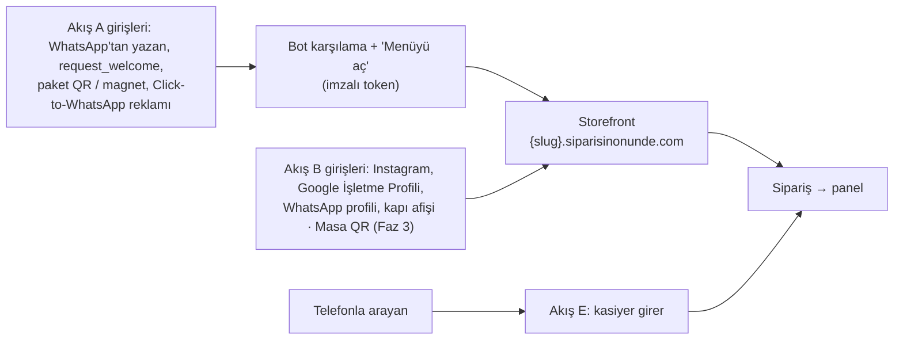
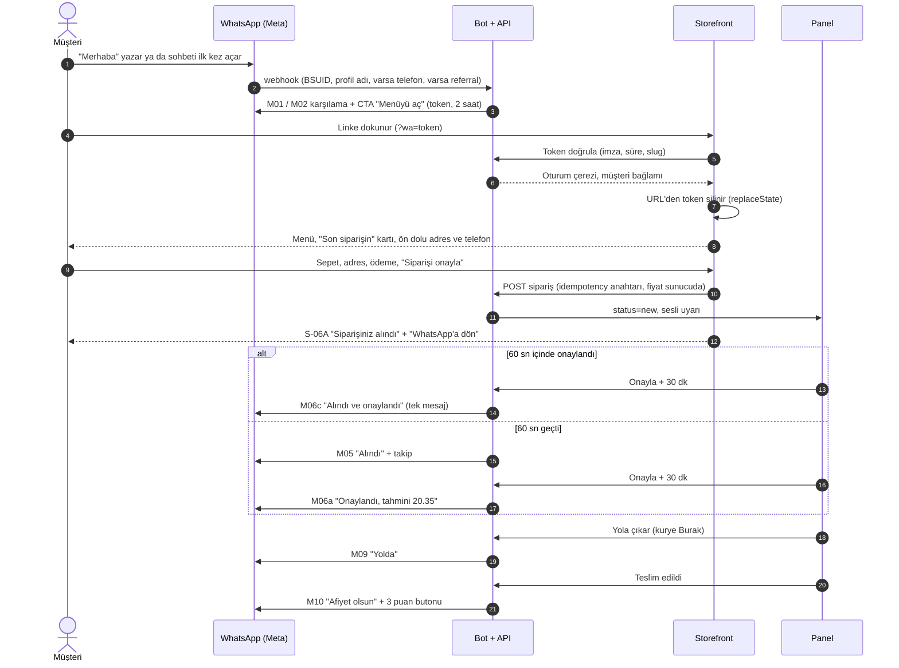
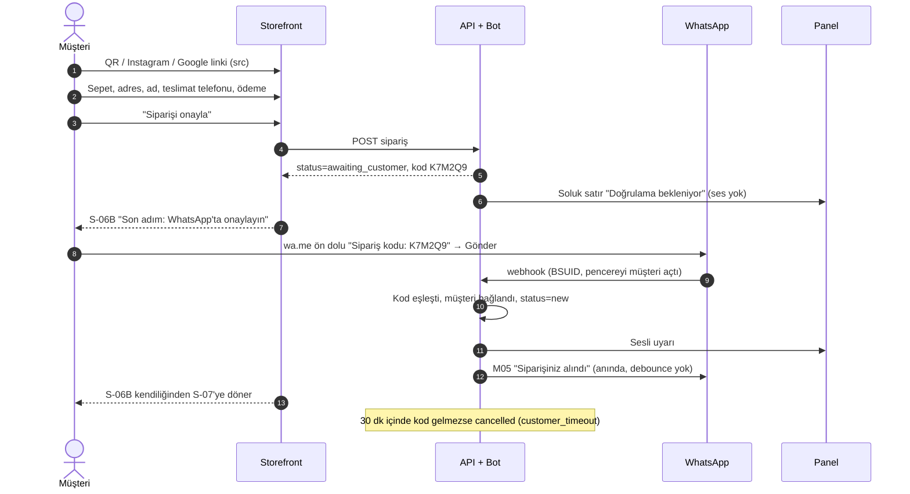
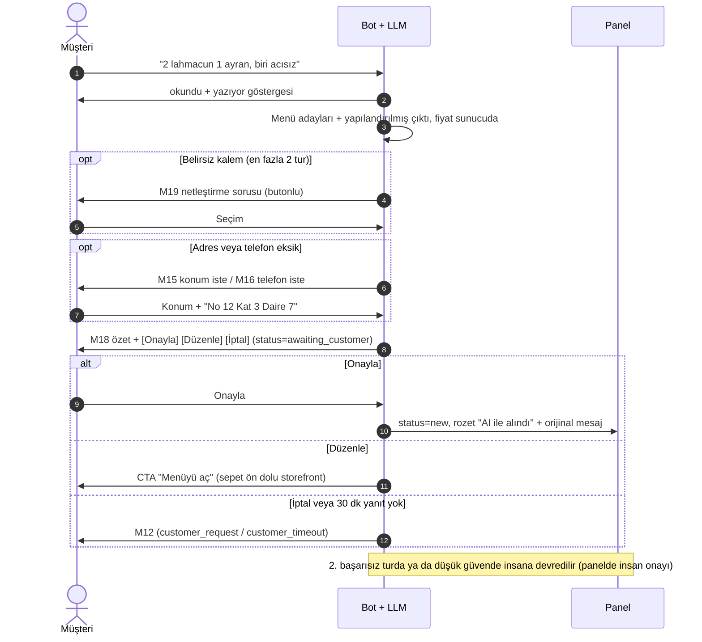
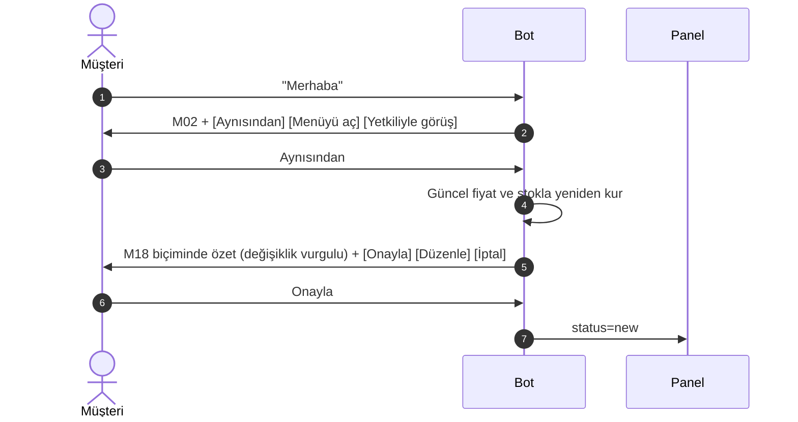
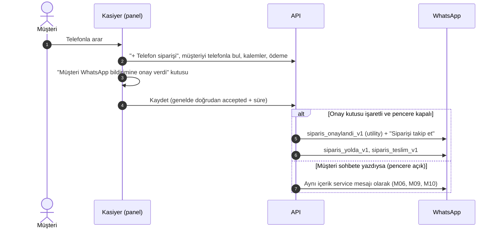
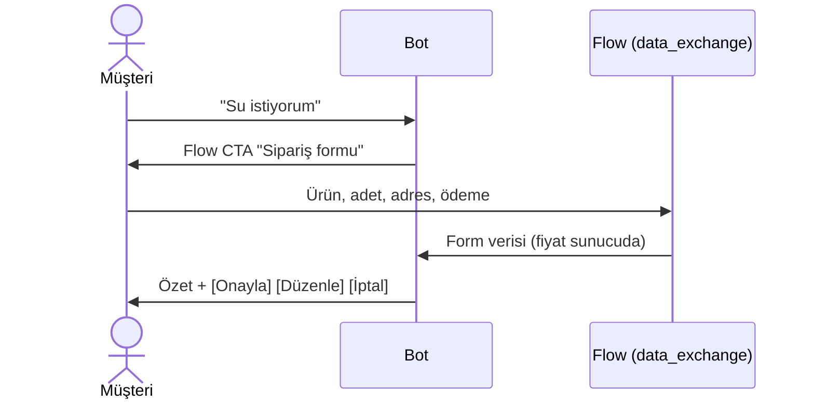

# 03 — Müşteri Deneyimi ve Storefront

> **Amaç:** Son müşterinin işletmeyi bulduğu andan siparişini değerlendirdiği ana kadar yaşadığı her şeyi tanımlamak: akışlar, storefront ekranları, takip sayfası, WhatsApp bot konuşması ve tüm Türkçe mesaj metinleri. Tasarımcı, geliştirici ve hukukçu bu dokümandan doğrudan iş çıkarabilmeli.
> **Tarih:** 2026-09-24 · **Durum:** Taslak (00 son sürümüyle hizalandı) · **Bağlayıcı kaynak:** [Kararlar ve sözlük](00-kararlar-ve-sozluk.md) §5 (durumlar, sebep, ödeme, teslim ve kanal kodları), §6 (WhatsApp), §7 (akışlar, mesaj koruma kuralları, token), §9 (onay adımı, veri minimizasyonu).

**Kapsam:** Müşteri tarafı ilkeler, giriş noktaları, Akış A–E ve Flows, storefront ekranları (S-01…S-15), sepet/checkout, adres ve bölge UX'i, ödeme UX'i, sipariş takip sayfası, müşteri gözünden bot konuşması, müşteriye giden tüm WhatsApp ve SMS metinleri, mesaj bütçesi, müşteri tarafı güven/gizlilik/erişilebilirlik/performans, ölçüm planı.

**Kapsam dışı (bağlantı verilir):**
- Cloud API, şablon onayı, pencere/maliyet mantığı, konuşma motorunun kodu, BSUID kuralları → [02 WhatsApp entegrasyonu](02-whatsapp-entegrasyonu.md)
- Panel tarafı: canlı sipariş ekranı, ret/iptal/"Geri al", gelen kutusu, menü ve bölge yönetimi, QR/afiş oluşturucu, kurye görünümü → [04 İşletme paneli](04-isletme-paneli.md)
- Storefront render/cache, harita ve geocoding altyapısı, SMS sağlayıcısı, rate limit altyapısı → [06 Teknik mimari](06-teknik-mimari.md)
- Alan listeleri, API uç noktaları, olay kataloğu → [07 Veri modeli ve API](07-veri-modeli-ve-api.md)
- Aydınlatma, ön bilgilendirme ve mesafeli satış metinlerinin kendisi, saklama tablosu, İYS → [08 Mevzuat](08-mevzuat-kvkk-odeme-fatura.md)
- KPI takibi, SLO, olay yönetimi → [10 Riskler ve operasyon](10-riskler-operasyon-ve-metrikler.md)

**Kaynaklar ve atıf biçimi:** `A05` = [arastirma/05-urun-ux.md](arastirma/05-urun-ux.md) (ana kaynak: §2, §3, §7, §8). `A01`, `A03`, `A04`, `A06` = araştırma raporları 01, 03, 04, 06. `D02`, `D06`, `D07`, `D08` = plan dokümanları. Yalnız `§x` = bu dokümanın bölümü. **[T]** = tasarım önerisi (veriyle doğrulanmadı, pilotta kalibre edilir). **(teyit edilmeli)** = canlıya çıkmadan önce birincil kaynaktan doğrulanır. Örnekler kurgusaldır: işletme "Lezzet Dürüm", müşteri "Ayşe" ([01](01-vizyon-pazar-is-modeli.md) §5.4 personası).

---

## 1. Müşteri tarafı ilkeler

| # | İlke | Somut kural | Ölçüt |
|---|---|---|---|
| İ1 | **Uygulama ve üyelik yok** | Parola, e-posta, hesap açma yok. Kimlik WhatsApp'tan (BSUID) ya da sipariş doğrulamasından gelir. | Checkout'taki zorunlu alan sayısı |
| İ2 | **Tekrar gelen müşteride 3 dokunuş** | WhatsApp'ta "Sipariş ver" (1) → storefront'ta "Aynısını sipariş ver" (2) → "Siparişi onayla" (3). Adres, telefon ve ödeme ön dolu gelir. Yeni müşteride hedef ≤ 10 dokunuş + adres yazımı [T]. | `sf_reorder_card_tap → order_created` süresi (§11) |
| İ3 | **WhatsApp'ta başla, WhatsApp'a dön** | Menü web'dedir (seçenekli sepet için), ama giriş ve bildirim sohbettedir. Başarı ekranında "WhatsApp'a dön" butonu bulunur. Sohbette uzun form veya menü listesi gösterilmez. | Karşılama → link tıklama |
| İ4 | **Şeffaf fiyat** | Fiyatlar KDV dahil TL'dir. Teslimat ücreti ve min. sepet adres girilmeden önce aralık olarak, girildikten sonra kesin tutar olarak gösterilir. Tek ek kalem teslimat ücretidir. "Servis ücreti" türü kalem tanımlanamaz, kapıda kart ödemesine ek ücret konamaz ([D08 §4.5](08-mevzuat-kvkk-odeme-fatura.md)). Onay ekranındaki toplam kaydedilen toplamla aynıdır. | Sunucu ve ekran toplamı hash eşleşmesi |
| İ5 | **İşletmenin markası önde** | Storefront işletmenin adı, logosu ve rengiyle açılır. Başka işletme listelenmez veya önerilmez; keşif/dizin sayfası yoktur ([00-kararlar-ve-sozluk.md](00-kararlar-ve-sozluk.md) §9, ETAHS riski). Altbilgide yalnız küçük bir "Altyapı: Siparişin Önünde" yazısı durur. | — |
| İ6 | **Az ve işe yarar mesaj** | Sipariş başına en fazla 4 durum mesajı gider, Akış A'da buna 1 karşılama eklenir. Adres ve telefon mesajlarda tekrar edilmez, promosyon içerik girmez (§9.1, §9.6). | Sipariş başına mesaj sayısı |
| İ7 | **İnsan bir dokunuş uzakta** | Her ekranda aynı yerde "İşletmeyi ara" ve "WhatsApp'tan yaz" bulunur. Sohbette "yetkili" yazmak her durumda çalışır. | Yetkili talebi → ilk insan yanıtı |
| İ8 | **Hata, ne yapılacağını söyler** | Örnek: "Bu adrese teslimat yok. Gel-al ile devam edebilirsiniz." Teknik kod gösterilmez, sepet asla kaybolmaz. | Hata sonrası terk oranı |
| İ9 | **Yavaş ağda da çalışır** | 3G'de checkout tamamlanabilir. Performans bütçesi [D06 §12](06-teknik-mimari.md)'dedir (özeti §10.4). | LCP p75 |
| İ10 | **Veri minimizasyonu** | Yalnız siparişin gerektirdiği veri toplanır. Sağlık alanı yok, notlar kısa ömürlü. Link iletilebilir olduğu için takip sayfasında adres maskelidir. | Saklama işleri ([D08 §2.8](08-mevzuat-kvkk-odeme-fatura.md)) |
| İ11 | **Herkes için erişilebilir** | WCAG 2.2 AA (§10.3). | Otomatik ve manuel denetim |
| İ12 | **Doğal Türkçe** | Biçimler: "1.250,50 TL", "20.35", "24 Eylül Çar". `lang="tr"` kullanılır, İ/ı dönüşümü doğru yapılır. Değişkene ek getirilmez (§9.1). | Metin incelemesi |

---

## 2. Giriş noktaları



| Giriş | Müşterinin eylemi | Teknik tetik / link | Akış | `channel` | `src` | Faz | Not |
|---|---|---|---|---|---|---|---|
| WhatsApp sohbeti | Numaraya yazar | Gelen mesaj webhook'u | A | `wa_link` | `wa` | 1 | Pencereyi müşteri açar |
| Sohbeti ilk açma | Sohbeti açar ama yazmaz | `request_welcome` olayı (A05 §2.3) | A | `wa_link` | `wa_welcome` | 1 | Sprint 1'de TR numarasıyla test edilir. Pencere açmıyorsa ilk mesaj beklenir (teyit edilmeli) |
| Paket içi QR kart / buzdolabı magneti | QR okutur, WhatsApp ön dolu metinle açılır, Gönder'e basar | `{slug}.siparisinonunde.com/k/{kod}` → 302 → `wa.me/90…?text=…` | A | `wa_link` | `paket`, `magnet` | 1 | **Tercih edilen yol**, çünkü BSUID ve açık pencere kazanılır. Pazaryeri sözleşmelerinde paket içi materyal kısıtı kontrol edilmeli (A05 §2.10, teyit edilmeli) |
| Kapı / vitrin afişi | QR okutur | İki QR: "Menüye bak" (web) + "WhatsApp'tan yaz" | B / A | `web` / `wa_link` | `afis` | 1 | A05 §2.10 |
| Instagram bio, hikâye link çıkartması | Linke dokunur | `…/?src=ig` | B | `web` | `ig` | 1 | Instagram'ın "Yemek siparişi" butonu yalnız anlaşmalı sağlayıcılarla çalışıyor (teyit edilmeli) |
| Google İşletme Profili | Menü/web sitesi/sipariş bağlantısı | `…/?src=google` | B | `web` | `google` | 1 | Türkiye'de profile sipariş linki ekleme seçenekleri pilotta denenmeli (teyit edilmeli) |
| WhatsApp işletme profili | "Web sitesi" alanına dokunur | `…/?src=wa_profil` | B | `web` | `wa_profil` | 1 | Profilde en fazla 2 web sitesi alanı var (A05 §2.10) |
| Click-to-WhatsApp (CTWA) reklamı | Reklamdan mesaj gönderir | Webhook `referral` (`ctwa_clid`) | A | `wa_link` | `ctwa` | 1 (esnaf rehberi Faz 2) | 72 saat ücretsiz pencere (FEP) ([D02 §4.4](02-whatsapp-entegrasyonu.md)) |
| Masa QR | Masadaki QR'ı okutur | `…/?masa=12&m={imza}` | Masa | `table_qr` | `masa` | 3 | `dine_in` + `pay_at_counter` (§4.10) |
| Telefon | İşletmeyi arar | Kasiyer panelden girer | E | `manual` | — | 1 | Takip linkiyle kanala çekilir (§3.5) |

**Link ve QR kuralları [Faz 1]:**
- `src` parametresi ilk açılışta oturuma yazılır ve siparişin kaynak alanına kopyalanır (alan adı D07'de). Panelin QR/afiş oluşturucusu `src` değerini otomatik ekler ([04](04-isletme-paneli.md)).
- **Paket kartı QR'ı** önce kendi kısa yönlendirme adresimize gider. Okutma sayısı sunucuda sayılır, ardından `wa.me` açılır. Ön dolu metin: `Merhaba! Menüyü görmek istiyorum. (Q1)` [T]. Bot, parantez içindeki etiketi (`Q1` paket, `Q2` magnet, `Q3` afiş) `src` olarak kaydeder ve cevabında etiketi tekrar etmez. Müşteri etiketi silerse `src` boş kalır.
- **Talep doğrulama deneyi (Seviye 0 concierge)** aynı kartları kullanır; QR işletmenin mevcut WhatsApp'ına gider, sayım etiketle elle yapılır ([00-kararlar-ve-sozluk.md](00-kararlar-ve-sozluk.md) §11). **Çoklu şube [Faz 2]:** storefront şubeyi adresin düştüğü bölgeye göre seçer ([04](04-isletme-paneli.md)/[07](07-veri-modeli-ve-api.md)).

**Kanal belirleme kuralı (sunucuda):**
1. Storefront oturumunda geçerli bir WhatsApp bağlamı varsa (2 saatten genç token ve "Ben değilim" denmemiş) sipariş `channel = wa_link` olur ve doğrudan `new` durumuna geçer.
2. Aksi halde `channel = web`, `status = awaiting_customer` olur ve Akış B doğrulaması başlar (WhatsApp ya da SMS OTP).
3. Masa QR'dan gelen sipariş `table_qr` olur [Faz 3]. Panelden girilen `manual`, sohbette AI ile alınan `wa_ai` [Faz 2], Flows ile alınan `wa_flow` [Faz 3] kodunu alır.

---

## 3. Sipariş akışları

### 3.0 Durumların müşteriye yansıması

| Durum (kod) | Takip sayfası etiketi (S-07) | WhatsApp mesajı (§9) | SMS (WhatsApp'sız mod) | Not |
|---|---|---|---|---|
| `awaiting_customer` | "WhatsApp onayınız bekleniyor" / "SMS kodunu girin" | — (S-06B); Akış C: M18 | SMS-01 (kod) | 30 dk sonra `cancelled` (`customer_timeout`) |
| `new` | "Siparişiniz alındı · İşletme onayı bekleniyor" | M05 (Akış A: 60 sn debounce; Akış B: kod mesajına anında) | — | T+10 dk M13 + takip sayfasında gecikme satırı (§7.3), varsayılan T+15 dk sistem iptali (M12d / SMS-03b) |
| `accepted` | "Onaylandı · Tahmini 20.35" | M06 | SMS-02 | |
| `preparing` | "Hazırlanıyor" | M07 (**varsayılan kapalı**) | — | |
| `ready` | Paket: "Hazır · Kurye bekleniyor"; Gel-al: "Hazır · Gelip alabilirsiniz" | Gel-al: M08; paket: mesaj yok | — | |
| `on_the_way` | "Yolda · Kurye: Burak" | M09 | — | |
| `delivered` | "Teslim edildi · Afiyet olsun" + değerlendirme | M10 | — | |
| `rejected` | "Sipariş alınamadı · {sebep}" | M11 (30 sn gecikmeli) | SMS-03a | Panelde "Geri al" penceresi 30 sn |
| `cancelled` | "İptal edildi · {sebep}" | M12 | SMS-03b | |

Takip sayfasının adım çubuğu: **Alındı → Onaylandı → (Hazırlanıyor) → Yolda / Hazır → Teslim edildi**. "Hazırlanıyor" adımı yalnız işletme bu adımı kullanıyorsa görünür.

### 3.1 Akış A — Sohbet + web sepeti [Faz 1] (birincil)



**Adımlar:**
1. **Giriş ve karşılama.** Bot duruma göre varyantı seçer: M01 (ilk kez), M02 (tekrar gelen), kapalı ya da yoğun varyantı (§8.1). CTA URL mesajı tek buton taşır, bu yüzden "yetkili" yolu gövdedeki satırla verilir ([D02 §6.3](02-whatsapp-entegrasyonu.md)).
2. **Link.** `https://{slug}.siparisinonunde.com/?wa=<token>`. Token imzalıdır, 2 saat geçerlidir, PII taşımaz; içinde yalnız tenant, şube, müşteri ve konuşma kimliği vardır. Her CTA yeni token üretir, eski token'lar süreleri dolana kadar geçerli kalır ([D02 §6.3](02-whatsapp-entegrasyonu.md)).
3. **İlk açılış.** Token GET isteğinde **tüketilmez**, çünkü link önizlemesi veya prefetch onu yakmamalı. Sunucu token'ı doğrulayıp host'a özel httpOnly oturum çerezine çevirir; `history.replaceState` token'ı adres çubuğundan siler. Önizleme istekleri (HEAD, bilinen önizleme user-agent'ları) yalnız statik menüyü alır [T].
4. **Menü ve checkout.** S-01'de varsa "Son siparişin" kartı görünür; ad, maskeli telefon, kayıtlı adresler ve son ödeme yöntemi ön dolu gelir. Checkout'ta "Bu sipariş WhatsApp'ta **Ayşe (…45 12)** adına verilecek · *Ben değilim*" satırı bulunur.
5. **Onay ve sonuç.** POST isteği istemcide üretilen bir idempotency anahtarı taşır. Fiyat, bölge, min. sepet ve açık/kapalı kontrolü sunucuda yapılır. Sipariş `new` + `wa_link` olur, panelde ses çalar. S-06A'da "WhatsApp'a dön" (`wa.me/<numara>`) butonu gösterilir. Ardından bildirimler gelir: M05/M06 (debounce'lu) → M09 veya M08 → M10.

**Akış A'ya özgü kenar durumları** (ortak durumlar §3.7'de):

| Durum | Davranış |
|---|---|
| Token süresi dolmuş (> 2 saat), imzası geçersiz ya da başka işletmenin alt alan adında açıldı | Storefront bağlamsız açılır, üstte bant görünür: "Bağlantının süresi dolmuş. Sipariş verebilirsiniz; son adımda WhatsApp'tan tek dokunuşla onaylayacaksınız." Sipariş Akış B'ye düşer. |
| Link başkasına iletildi | "Ben değilim" kaçışı vardır. Token başına saatte en fazla 3 sipariş verilebilir [T]. |
| Müşteri linke dokunup sipariş vermeden çıktı | Faz 1'de hiçbir şey yapılmaz. Sepeti terk hatırlatması (M23) yalnız Faz 2'de, yalnız izinli müşteriye ve tek sefer gider. |
| Opt-out'lu (`opt_out_all`) müşteri kendi sipariş verdi | Yalnız o siparişin durum mesajları gider ([D02 §6.9](02-whatsapp-entegrasyonu.md)). |
| `request_welcome` ile karşılama gönderildi ama müşteri hiç yazmadı | Pencere davranışı teyit edilene kadar: API gönderimi reddederse (131047) ilk mesaj beklenir. |

**Kabul kriterleri (Akış A):**
- İlk mesaja ≤ 3 sn içinde tek karşılama ve CTA gider ([D02 §6.10](02-whatsapp-entegrasyonu.md)).
- Linkin önizlenmesi veya iki kez açılması token'ı geçersiz kılmaz. 2 saatten eski token siparişi BSUID'ye bağlamaz.
- İlk yüklemeden sonra adres çubuğunda token görünmez, sunucu loglarında maskelenir.
- Geçerli token'la verilen sipariş doğrulama beklemeden `new` olur, panelde ses çalar ve müşteri kaydına bağlanır.
- 60 sn içinde onaylanan siparişte müşteri tek mesaj alır (M06c).
- "Ben değilim"e basıldığında sipariş BSUID'ye bağlanmaz ve Akış B doğrulaması istenir.

### 3.2 Akış B — Doğrudan web + WhatsApp doğrulaması [Faz 1]



**Adımlar:**
1. Müşteri storefront'a doğrudan gelir. Checkout'ta **teslimat telefonu zorunludur** (SMS yedeği ve kurye için). Checkout'ta şu ifade görünür: "Sipariş durumunu Lezzet Dürüm WhatsApp'tan bildirecek." ([D02 §9.1](02-whatsapp-entegrasyonu.md)).
2. "Siparişi onayla" sonrası sipariş `awaiting_customer` olur. 6 karakterli kod (alfabe `ABCDEFGHJKLMNPQRSTUVWXYZ23456789`, en az 1 rakam) ve `public_token` üretilir ([D02 §6.4](02-whatsapp-entegrasyonu.md), [D07 §1.2](07-veri-modeli-ve-api.md)).
3. **S-06B** (§4.5) tek büyük yeşil buton gösterir: **"WhatsApp'ta onayla"** → `https://wa.me/<işletme numarası>?text=Sipariş%20kodu%3A%20K7M2Q9`. Masaüstünde aynı link QR olarak da verilir.
4. Kod eşleşince sipariş `new` olur, BSUID bağlanır, panelde ses çalar. Müşterinin kod mesajına M05 "Siparişiniz alındı" **anında** yanıt olarak gider: 60 sn debounce **yalnız Akış A'dadır**, çünkü Akış B'de müşteri sohbette yanıt bekler ([00-kararlar-ve-sozluk.md](00-kararlar-ve-sozluk.md) §7, [D02 §4.3](02-whatsapp-entegrasyonu.md)). Onay sonradan gelirse ayrı M06 gider (M06c birleşik mesajı Akış B'de kullanılmaz). S-06B doğrulanana kadar 3 sn'de bir yoklar [T], sonra takip görünümüne döner. Pencereyi müşteri açtığı için durum mesajları service mesajı olarak gider.

**Hukuki not:** Sözleşme onayı storefront'taki "Siparişi onayla" butonudur. WhatsApp adımı sahte siparişe karşı **doğrulamadır**, yeni bir sözleşme onayı değildir ([D08 §4.4](08-mevzuat-kvkk-odeme-fatura.md)). **Panel:** `awaiting_customer` siparişi ses çalmaz; işletme müşteriyi arayıp "Telefonla doğruladım" diyebilir, sipariş `new` olur ve işlem `audit_log`'a yazılır ([04](04-isletme-paneli.md)).

#### 3.2.1 SMS OTP yedeği — "WhatsApp'sız mod" [Faz 1]

**Tetikler:** (a) müşteri S-06B'de "WhatsApp'ınız yok mu? SMS ile doğrulayın" seçeneğine dokunur; (b) işletmenin WhatsApp bağlantısı henüz tamamlanmamıştır ya da gönderim duraklatılmıştır (131042, 190, kopma) — bu durumda S-06B hiç gösterilmez, doğrudan S-06C açılır; (c) WhatsApp kanalı platform genelinde arızalıdır (Meta kesintisi; admin olay kaydından toplu açılır, [D02 §6.11](02-whatsapp-entegrasyonu.md), [05](05-admin-paneli-ve-pazarlama-sitesi.md)).

**Koşul:** tenant ayarı `sms_fallback_enabled` açık (varsayılan) ve platform kill-switch'i `sms_fallback` açık ([00-kararlar-ve-sozluk.md](00-kararlar-ve-sozluk.md) §4). Biri kapalıysa ve WhatsApp doğrulaması da mümkün değilse storefront "Şu an online sipariş alınamıyor, lütfen arayın" + [Ara] gösterir; sipariş Akış E ile telefondan alınır. İşletme ayrıca `awaiting_customer` siparişi arayıp "Telefonla doğruladım" diyebilir (`verification_method = staff`).

**Akış:** "Siparişi onayla" → `awaiting_customer` → SMS-01 (6 haneli kod) → S-06C'de kod girilir → `new` + sesli uyarı → S-07 takip sayfası → onayda SMS-02, ret/iptalde SMS-03.

- **Kod:** 6 haneli rakam, 5 dk geçerli. "Tekrar gönder" 60 sn sonra açılır. Telefon başına 10 dk'da en fazla 3, günde en fazla 5 SMS; IP başına saatte en fazla 10 gönderim. 5 hatalı girişten sonra kod geçersiz olur [T]. Bu sınırlar SMS pompalama saldırısına karşıdır (A04).
- **Bildirim:** Durum bilgisi takip sayfasından verilir. SMS yalnız kritik durumlarda gider: onaylandı (SMS-02), ret/iptal (SMS-03). "Yolda" ve "teslim edildi" için SMS gönderilmez ([00-kararlar-ve-sozluk.md](00-kararlar-ve-sozluk.md) §7).
- **Gönderici ve maliyet:** SMS'ler platformun onaylı alfanümerik başlığıyla gider, işletme adı mesaj gövdesindedir; maliyet platformundur ve aboneliğe adil kullanım kotasıyla dahildir (ayrıntı §9.5; [00-kararlar-ve-sozluk.md](00-kararlar-ve-sozluk.md) §4, §7).
- **Böylece işletme Meta adımları bitmeden ilk gün web siparişi alabilir.** WhatsApp arızalandığında da ürün çalışmaya devam eder.

**Kabul kriterleri (Akış B ve SMS yedeği):**
- Onay butonuna basılmadan `awaiting_customer` sipariş oluşmaz.
- Geçerli kod mesajı ≤ 3 sn içinde siparişi `new` yapar, panelde ses çalar ve müşteriye M05 debounce beklemeden gider. Aynı webhook ikinci kez gelirse ikinci işlem yapılmaz.
- 30 dk dolunca sipariş otomatik iptal olur, S-06B "Süre doldu" durumunu gösterir.
- `wa.me` linki Android, iOS ve masaüstünde doğru numarayı ve kodu açar (cihaz matrisi testi).
- WhatsApp bağlantısı olmayan tenant'ta web siparişi SMS koduyla `new` olur. SMS-01…03 dışında müşteriye SMS gitmez. Kod hiçbir logda görünmez.

### 3.3 Akış C — AI ile serbest metin [Faz 2]



- Fiyat ve toplamı her zaman sunucu hesaplar. LLM'e yalnız sipariş metni gider; ad, telefon, adres ve sağlık ifadeleri maskelenir ([D02 §6.5](02-whatsapp-entegrasyonu.md), [D08 §2.7](08-mevzuat-kvkk-odeme-fatura.md)).
- **Kanonik butonlar: [Onayla] [Düzenle] [İptal]** ([00-kararlar-ve-sozluk.md](00-kararlar-ve-sozluk.md) §7). Onay ibaresi ve ön bilgilendirme linki mesaj gövdesindedir (M18). Konu dışı mesaja kibar ret gider (M21); "yetkili" her an çalışır, işletme AI'ı kapatabilir.

**Kabul kriterleri:** Onaysız sipariş panele `new` olarak düşmez. M18 gövdesi KDV dahil toplamı, teslimat ücretini, cayma notunu, ön bilgilendirme linkini ve onay ibaresini içerir. Eşleşmeyen kalem tahmin edilmez, soru sorulur. Onay anı `wamid` ve metin sürümüyle `audit_log`'a yazılır.

### 3.4 Akış D — Aynısından tekrar

**[Faz 1] Storefront "Son siparişin" kartı (S-01):**
- **Görünme koşulu:** WhatsApp bağlamı (token → müşteri) ya da müşterinin açıkça seçtiği "Bu cihazda hatırla" çerezi (§4.4) olmalı. Kart, son başarılı (`delivered`) siparişi gösterir.
- **İçerik:** tarih, ilk 3 kalem ("ve 2 ürün daha") ve **güncel** toplam.
- **Buton:** "Aynısını sipariş ver". Kalemler güncel fiyatla sepete eklenir ve kullanıcı doğrudan checkout'a gider. Adres ve ödeme son siparişteki gibi ön seçilidir.
- **Değişiklik varsa** önce "Sepetiniz güncellendi" alt sayfası açılır: "Künefe bugün tükendi, sepete eklenmedi." · "Ekstra kaşar seçeneği artık yok, çıkarıldı." · "Fiyatlar güncellendi: 285,00 TL → 315,00 TL." Butonlar: [Devam et] [Menüye dön].

**[Faz 2] Sohbet içi tekrar:**



**Kabul kriterleri:** Karttaki toplam, sepete eklenince görünen toplamla aynıdır. Tükenen ürün sepete eklenmez ve kullanıcıya bildirilir. Tekrar gelen müşteri WhatsApp'tan başlayarak 3 dokunuşta sipariş verebilir (İ2).

### 3.5 Akış E — Manuel / telefon siparişi [Faz 1]



- **Kasiyer için önerilen cümle [T]:** "Siparişinizi WhatsApp'tan takip etmek ister misiniz? Onaylarsanız durum bilgisi WhatsApp'a gelecek." Kutu işaretlenmezse hiçbir şablon gitmez ([D02 §9.1](02-whatsapp-entegrasyonu.md)).
- Şablondaki takip linki, ön bilgilendirme ve sözleşme metnini de gösterir. Telefonla kurulan sözleşmede ön bilgilendirme yükümlülüğü avukata sorulacak ([D08 §4.4](08-mevzuat-kvkk-odeme-fatura.md)).
- Takip sayfasında kanal çağrısı yer alır: "Bir dahaki siparişinizi WhatsApp'tan verebilirsiniz" + `wa.me` butonu. Bu satır bilgilendirmedir, indirim veya kampanya içermez.

**Kabul kriterleri:** Onay kutusu işaretlenmeden şablon gönderilmez. Pencere kapalıyken yalnız onaylı ve `UTILITY` kategorisindeki şablon kullanılır. Telefonla oluşturulan müşteri, aynı kişi WhatsApp'tan yazınca tek kayıtta birleşir ([D02 §8.3](02-whatsapp-entegrasyonu.md)).

### 3.6 WhatsApp Flows ile sohbet içi sipariş [Faz 3]

- Kanal kodu `wa_flow`; storefront'un yerini almaz. Aday kullanımlar: adres formu, değerlendirme formu, seçeneksiz küçük menüler (su bayi). Onay adımı değişmez (özet, KDV dahil toplam, cayma notu, ön bilgilendirme linki, onay eylemi).
- Bileşen sınırları dardır: NavigationList en fazla 20 öğe, CheckboxGroup en fazla 20, Dropdown en fazla 200, ImageCarousel en fazla 3 görsel; Flow CTA 1–20 karakter ve emojisiz (A05 §2.1). Türkiye'de kullanılabilirliği teyit edilmeli.



### 3.7 Ortak hata ve kenar durumları

| # | Durum | Tespit | Müşteri ne görür | Sistem ne yapar | Faz |
|---|---|---|---|---|---|
| K1 | Token süresi dolmuş / geçersiz | Storefront ilk açılış | §3.1'deki bant | Akış B | 1 |
| K2 | "Ben değilim" | Checkout | "Tamam, siparişi son adımda WhatsApp'tan onaylayacaksınız." | Oturum düşer, Akış B | 1 |
| K3 | İşletme kapalı (`closed`) | S-01 | S-09 kapalı varyantı, sayaç, menüye göz atma | Checkout kapalı. Planlı sipariş [Faz 2] açıksa "İleri saate sipariş ver" | 1 |
| K4 | Sipariş almayı durdurdu (`paused`) | S-01, checkout | "Kısa süreliğine sipariş almıyoruz · ~20.15" | Checkout kapalı, sepet korunur | 1 |
| K5 | Yoğun (`busy`) | S-01 | "Yoğunuz · Tahmini 50–60 dk" bandı | Sipariş alınır, ETA uzatılır | 1 |
| K6 | Checkout sırasında kapandı / durduruldu | POST 409 `branch_closed` | "İşletme şu an sipariş almıyor. Sepetiniz saklandı." | Sepet localStorage'da kalır | 1 |
| K7 | Adres bölge dışı | Adres adımı + sunucu | "Bu adrese teslimat yok. Gel-al ile devam etmek ister misiniz?" | Bölge dışı teslimat POST'u 422 döner ([D06 §10.2](06-teknik-mimari.md)) | 1 |
| K8 | Min. sepet altında | Sepet, checkout | "Minimum sepete 65,00 TL kaldı" | Buton pasif, nedeni yazılı | 1 |
| K9 | Ürün tükendi (menüde) | S-01/S-02 | Gri kart + "Tükendi (bugün)" yazısı | Sepete eklenemez | 1 |
| K10 | Ürün sepetteyken tükendi | Sepet/checkout açılışı veya POST 409 `cart_changed` | "Sepetiniz güncellendi" alt sayfası, fark listesi | Tükenen kalem çıkarılır, onay yeniden istenir | 1 |
| K11 | Ürün sipariş verildikten sonra tükendi | Panel | `new` ise M11 (`item_unavailable`) + "Menüyü aç"; `accepted` sonrası işletme arar veya M12 | Faz 2: M14 ile değişiklik onayı | 1 / 2 |
| K12 | Sepet değişti (fiyat, seçenek, ürün kaldırıldı) | POST 409 `cart_changed` (menü sürümü uyuşmazlığı) | Fark listesi (eski → yeni tutar), [Güncel sepetle devam] | Onay ekranı yeni toplamla yeniden gösterilir (hash kuralı, D08 §4.4) | 1 |
| K13 | Çift gönderim (çift dokunuş, ağ tekrarı) | Aynı idempotency anahtarı | Tek sipariş, aynı sonuç ekranı | İkinci istek ilk yanıtı döndürür | 1 |
| K14 | Olası mükerrer sipariş | Aynı müşteri/cihaz, aynı sepet hash'i, 10 dk içinde, önceki açık [T] | "Az önce aynı siparişi verdiniz (#1047). Yine de yeni sipariş verilsin mi?" [Hayır, takibe git] [Evet, yeni sipariş] | Panelde "olası tekrar" rozeti. İşletme `new` iken `duplicate` sebebiyle reddeder (M11); onay sonrası fark edilirse `cancel_reason = duplicate` (M12e) | 1 |
| K15 | Müşteri doğrulamadı (Akış B, 30 dk) | Zamanlayıcı | S-06B: "Süre doldu, sipariş iptal edildi. [Aynı sepetle yeniden gönder]" | `cancelled` (`customer_timeout`). Pencere olmadığı için WhatsApp mesajı gitmez | 1 |
| K16 | Müşteri AI özetine yanıt vermedi (30 dk) | Zamanlayıcı | M12c (zaman aşımı) | `cancelled` (`customer_timeout`) | 2 |
| K17 | İşletme yanıt vermedi | `new` T+10 dk / T+15 dk | T+10: M13 [Beklerim] [Siparişi iptal et] (yalnız pencere açıksa) + takip sayfasında gecikme satırı (§7.3). T+15: M12d (özür + telefon; pencere dışında `siparis_iptal_yanitsiz_v1`, WhatsApp'sız modda SMS-03b). Müşteri M13'e yanıt vermezse ek mesaj gitmez | Kademeli alarm ([00-kararlar-ve-sozluk.md](00-kararlar-ve-sozluk.md) §10; [D02 §10.3](02-whatsapp-entegrasyonu.md)). T+15'te `cancelled` (`system`, `tenant_no_response`). Otomatik iptal süresi işletme ayarıdır (10–30 dk, varsayılan 15); müşteri bilgisi (M13) varsayılan T+10'da, her durumda iptalden en az 5 dk önce gider (§9.2 M13). Otomatik ret yoktur | 1 |
| K18 | WhatsApp mesajı teslim edilemedi (131026) | Status webhook | Takip sayfası çalışmaya devam eder | Panelde "WhatsApp'a ulaşılamadı, arayın" rozeti | 1 |
| K19 | İşletmenin gönderimi duraklatılmış (131042/190) | Tenant durumu | Web siparişinde S-06C (SMS). Akış A'daki açık siparişte takip sayfası | WhatsApp'sız mod | 1 |
| K20 | Kara listedeki müşteri | Sipariş POST'u, bot | Nötr metin: "Şu an çevrimiçi sipariş alamıyoruz, lütfen işletmeyi arayın." (M33) | Sipariş oluşmaz. Suçlayıcı ifade kullanılmaz | 1 |
| K21 | İşletme askıda (dunning G+21, deneme bitti) | Tenant durumu | S-09 askı varyantı + M33 | Menü salt okunur, checkout kapalı ([00-kararlar-ve-sozluk.md](00-kararlar-ve-sozluk.md) §9) | 1 |
| K22 | Kısıtlı ürün (alkol, tütün…) | Menü bayrağı | Ürün storefront'ta gösterilmez | Sepete eklenemez, sunucu reddeder ([D02 §9.2](02-whatsapp-entegrasyonu.md)) | 1 |
| K23 | Ağ koptu (gönderim sırasında) | İstemci | "Bağlantı koptu, tekrar deneniyor…" | Aynı idempotency anahtarıyla üstel geri çekilmeli tekrar | 1 |
| K24 | Konum izni reddedildi | Tarayıcı | "Sorun değil, adresinizi yazarak ya da haritada işaretleyerek devam edin." | Arama ve pin yolu açık kalır | 1 |
| K25 | Online ödeme başarısız / yarıda kaldı | PSP geri çağrısı | "Ödeme alınamadı. Kartınızdan para çekilmedi. [Tekrar dene] [Kapıda ödemeye geç]" | `payment_status=failed`. Sipariş panele düşmez (§6) | 2 |

---

## 4. Storefront ekranları

### 4.0 Envanter

| ID | Ekran | Yol | Faz |
|---|---|---|---|
| S-01 | Menü (ana) + "Son siparişin" kartı | `/` | 1 |
| S-02 | Ürün detayı + seçenekler (alt sayfa, derin link verilebilir) | `/urun/{urun-slug}` | 1 |
| S-03 | Sepet | `/sepet` | 1 (kupon 2) |
| S-04 | Checkout: teslimat ve iletişim | `/siparis` (bölüm 1–3) | 1 |
| S-05 | Checkout: ödeme, özet ve onay | `/siparis` (bölüm 4–5) | 1 |
| S-06A | Sonuç, Akış A: "Siparişiniz alındı" | `/t/{public_token}` ilk görünüm | 1 |
| S-06B | Sonuç, Akış B: "WhatsApp'ta onaylayın" | `/t/{public_token}` (`awaiting_customer`) | 1 |
| S-06C | Sonuç, SMS ile doğrula | `/t/{public_token}` (`awaiting_customer`, SMS modu) | 1 |
| S-07 | Sipariş takip sayfası | `/t/{public_token}` | 1 |
| S-08 | Değerlendirme (S-07 içinde) | `/t/{public_token}#degerlendir` | 1 |
| S-09 | Kapalı / durduruldu / yoğun / askıda varyantları | S-01 varyantı | 1 |
| S-10 | Yasal metinler | `/yasal/{aydinlatma, on-bilgilendirme, mesafeli-satis, cerez}` | 1 |
| S-14 | İşletme bilgisi (künye, saatler, bölgeler) | `/bilgi` | 1 |
| S-11 | Verilerim (adres silme, izin geri alma, veri talebi) | `/verilerim` | 2 |
| S-12 | Damga kartı / sadakat | S-01 ve S-07 içinde kart | 2 |
| S-15 | Siparişlerim (geçmiş liste) | `/siparislerim` | 2 |
| S-13 | Masa modu | `/?masa=` | 3 |

**Ortak bileşenler [Faz 1]:** üst çubuk (logo, ad, "Bilgi" → S-14); her sayfada aynı yerde duran **yardım menüsü** ("İşletmeyi ara" `tel:`, "WhatsApp'tan yaz"; WCAG 3.2.6); yapışkan sepet çubuğu; 5 sn'lik "Geri al" şeridi; alt sayfa (odak tuzaklı, ESC ve geri tuşuyla kapanır); altbilgi (künye, yasal linkler, "İçerik bildir" [D08 §4.7](08-mevzuat-kvkk-odeme-fatura.md), "Altyapı: Siparişin Önünde"). Tema işletmenin marka rengidir; buton metninin rengi kontrasta göre otomatik seçilir (§10.3).

### 4.1 S-01 Menü (ana) [Faz 1]

**İçerik (yukarıdan aşağı):**
1. **Başlık:** logo, ad, durum rozeti (Açık / Yoğun / Kapalı; renk + ikon + kelime), "Kapanış 23.00". **Teslimat özeti:** "30–40 dk · Teslimat 0–25 TL · Min. sepet 150 TL'den"; adres seçildiyse kesin değerler (§5.4). **Teslim türü anahtarı:** Paket servis / Gel-al.
2. **"Son siparişin" kartı** (§3.4); Faz 2'de yanında damga kartı durur.
3. **Arama** (aksan duyarsız: "lamacun" → Lahmacun, "cig kofte" → Çiğ Köfte; A05 §8.7), **yapışkan kategori sekmeleri**, kategori bölümleri.
4. **Ürün kartları:** ad, kısa açıklama, fiyat, varsa görsel, "+". Seçeneksiz ürün tek dokunuşla sepete eklenir, seçenekli ürün S-02'yi açar. **Yapışkan sepet çubuğu:** "Sepeti gör · 3 ürün · 485,00 TL".

**Durumlar:**

| Durum | Görünüm |
|---|---|
| Yükleniyor | İskelet kartlar. Menü statik (ISR) geldiği için kısa sürer; durum JSON'u ayrı gelir ([D06 §12](06-teknik-mimari.md)) |
| Açık / Yoğun | Normal. Yoğunda üstte turuncu bant: "Yoğunuz · Tahmini 50–60 dk" |
| Durduruldu / Kapalı / Askıda | S-09 varyantları (§4.7) |
| Hafif mod | `Save-Data` açıksa ya da bağlantı yavaşsa görseller kapalıdır, "Görselleri göster" bağlantısı sunulur |
| Boş kategori / arama sonucu yok | "Aradığınızı bulamadık. [Tüm menü]" |
| Tükendi | Kart gri, "Tükendi (bugün)" yazısı, "+" butonu yok |

**SEO:** schema.org `Restaurant` + `hasMenu` → `Menu` / `MenuSection` / `MenuItem` işaretlemesi yapılır (A05 §3.13). `/t/`, `/siparis`, `/sepet` sayfaları `noindex` taşır.

```text
+--------------------------------------+
| [LOGO] Lezzet Dürüm        (i) Bilgi |
| (*) Açık · Kapanış 23.00             |
| 30-40 dk · 0-25 TL · Min. 150 TL'den |
| [(o) Paket servis ] [( ) Gel-al    ] |
|--------------------------------------|
| SON SİPARİŞİN · 12 Eylül             |
| 2x Tavuk Dürüm (acısız), 1x Ayran    |
| Güncel tutar 315,00 TL               |
|            [ Aynısını sipariş ver ]  |
|--------------------------------------|
| [ Menüde ara...                    ] |
| Dürümler | Pideler | Tatlı | İçecek  | <- yapışkan
|--------------------------------------|
| Tavuk Dürüm                 [görsel] |
| Lavaş, tavuk, domates, turşu         |
| 145,00 TL                      [ + ] |
|--------------------------------------|
| Künefe · Tükendi (bugün)    [görsel] |
|--------------------------------------|
| [ Sepeti gör · 3 ürün · 485,00 TL  ] | <- yapışkan
| Yardım: İşletmeyi ara · WhatsApp     |
+--------------------------------------+
```

### 4.2 S-02 Ürün detayı ve seçenekler [Faz 1]

**İçerik:** görsel, ad, açıklama, porsiyon/gramaj, **alerjen etiketleri** (14 ana alerjen; ürün özelliğidir, kişisel veri değildir, [D08 §2.7](08-mevzuat-kvkk-odeme-fatura.md)), seçenek grupları, ürün notu (en fazla 140 karakter), adet stepper'ı ve "Sepete ekle · {canlı tutar}" butonu.

**Seçenek modeli (`option_group`, `option`; A05 §3.5):**

| Grup | Tür | min–max | Zorunlu | Örnek (fiyat farkı) |
|---|---|---|---|---|
| Porsiyon | Tek seçim | 1–1 | Evet | Yarım (−40 TL), Tam (0), 1,5 porsiyon (+60 TL) |
| Ekmek | Tek seçim | 1–1 | Evet | Lavaş, Tombik, Ekmek arası |
| Ekstralar | Çoklu | 0–5 | Hayır | Ekstra kaşar (+25), Ekstra et (+70) |
| Çıkarılacaklar | Çoklu | 0–10 | Hayır | Soğansız, Domatessiz, Turşusuz (0 TL) |
| Acı | Tek seçim | 0–1 | Hayır | Acısız, Az acılı, Acılı |
| Menü içeceği | Tek seçim | 1–1 | Evet (menü ürününde) | Ayran, Kola (+10), Şalgam |

**Kurallar:**
- Zorunlu grup başlığında "Zorunlu · 1 seçin" yazar. Eksik zorunlu grup varsa "Sepete ekle" pasiftir; basılınca sayfa eksik gruba kayar ve grup vurgulanır.
- `max`'a ulaşılınca diğer kutular pasifleşir ("En çok 5 seçebilirsiniz"). Fiyat farkı her seçeneğin yanında "+25,00 TL" biçiminde görünür, buton tutarı canlı güncellenir. Tükenen seçenek gri ve "Tükendi" yazılıdır.
- İç içe grup [Faz 2]; MVP'de menü ürünleri düz grup olarak modellenir. Ürün notu yer tutucusu: *"Örn: Az soslu olsun"*.

### 4.3 S-03 Sepet [Faz 1]

- **Kalemler:** Seçenekler alt satırda görünür, çıkarılacaklar vurgulanır ("Soğansız"). Kalem başına "Düzenle" (S-02'yi dolu açar), adet stepper'ı ve "Sil" bulunur. Silmede onay penceresi açılmaz; 5 sn'lik "Geri al" şeridi gösterilir.
- **Sipariş notu** (en fazla 140 karakter). Yer tutucu: *"Örn: Ketçap mayonez ayrı olsun"*. Altında sabit mikro metin: *"Alerjiniz varsa lütfen işletmeyi arayarak teyit edin."* Not yalnız bu siparişte kullanılır ve 30 gün sonra silinir ([D08 §2.7](08-mevzuat-kvkk-odeme-fatura.md)).
- **[Faz 2]:** Kupon alanı yalnız işletmenin aktif kuponu varsa görünür (A05 §3.8); doğrudan kanal avantajı otomatik satır olarak eklenir ("WhatsApp siparişine ayran bizden").
- **Tutarlar:** ara toplam; teslimat ücreti (adres yoksa "Adrese göre 0–25 TL", varsa kesin); toplam. **Min. sepet ilerleme çubuğu:** "Minimum sepete **65,00 TL** kaldı"; ücretsiz teslimat eşiği tanımlıysa "**40,00 TL** daha ekleyin, teslimat ücretsiz."
- **Buton:** "Siparişe geç"; min. sepetin altındayken pasiftir ve nedeni üstünde yazar. **Boş sepet:** "Sepetiniz boş. [Menüye dön]"
- Sepet istemcide (localStorage) tutulur; kapanma/durdurma durumunda korunur ([D06 §12](06-teknik-mimari.md)).

### 4.4 S-04 ve S-05 Checkout [Faz 1]

Checkout **tek, kaydırılan sayfadır**. Tamamlanan bölüm tek satıra katlanır ("Ev · Caferağa Mah. · Değiştir"). Tekrar gelen müşteride tüm bölümler dolu ve katlanmış gelir; müşteri doğrudan onay butonunu görür.

| Bölüm | Alanlar ve kurallar |
|---|---|
| **1. Teslimat** | Teslim türü (Paket / Gel-al). **Paket:** kayıtlı adresler ("Ev · Caferağa Mah., No 12") + "Yeni adres" (§5). Bölge sonucu anında görünür: "Teslimat bölgesindesiniz · 20,00 TL · Min. 150 TL · 30–40 dk". **Gel-al:** şube adresi, harita linki, "Tahminen 20 dk'da hazır". |
| **2. İletişim** | **Ad** (WhatsApp profil adı ön dolu; emoji veya takma ad gibi görünüyorsa boş bırakılır). **Teslimat telefonu:** paket siparişte her zaman, Akış B'de her teslim türünde zorunlu. Giriş biçimi "0 (5xx) xxx xx xx", saklama E.164. Biliniyorsa maskeli gösterilir: "0 5•• ••• 45 12 · Değiştir". **Akış A:** "Bu sipariş WhatsApp'ta Ayşe (…45 12) adına verilecek · Ben değilim". Telefon bilinmiyorsa "WhatsApp'ta Ayşe adına", profil adı da yoksa "bu linkin geldiği WhatsApp sohbetine bağlanacak". **Akış B:** "Sipariş durumunu Lezzet Dürüm WhatsApp'tan bildirecek." |
| **3. Zaman** | "En kısa sürede · 30–40 dk" [Faz 1]. "İleri bir saat seç" (`scheduled_for`) [Faz 2]. |
| **4. Ödeme** | Yöntem kartları, para üstü çipleri, yemek kartı markası (§6). |
| **5. Özet ve onay** | Kalemler (katlanır), sipariş notu (Düzenle), ara toplam, teslimat ücreti, **Toplam (KDV dahil)**, ödeme yöntemi. Yasal satırlar ve onay butonu aşağıda. |

**Onay adımı ([00-kararlar-ve-sozluk.md](00-kararlar-ve-sozluk.md) §9, [D08 §4.4](08-mevzuat-kvkk-odeme-fatura.md)):**
- **Buton:** `Siparişi onayla · 485,00 TL` (büyük, birincil, tam genişlik).
- **Butonun hemen altında (kilitli metin):** *"Siparişi onayla"ya bastığınızda siparişiniz kesinleşir ve ödeme yükümlülüğü doğar. Gıda siparişleri çabuk bozulabilen ürünler olduğundan cayma hakkı kapsamı dışındadır.*
- **Linkler:** Ön bilgilendirme formu · Mesafeli satış sözleşmesi · Aydınlatma metni. Alt sayfada, sipariş verisiyle doldurulmuş olarak açılırlar (S-10). Aydınlatma bir bilgilendirmedir, onay kutusu gerektirmez ve açık rızayla aynı metinde birleştirilmez (A03 §2.4).
- **Pazarlama izni kutusu [Faz 2]:** işaretsiz ve isteğe bağlıdır; sipariş vermek için gerekmez. Metin ve kayıt kuralı [D08 §3.4](08-mevzuat-kvkk-odeme-fatura.md)'tedir. **Faz 1'de gösterilmez:** İYS kaydı olmadan alınan onay geçersizdir.
- **"Bu cihazda hatırla" [Faz 1, T]:** Yalnız Akış B'de görünür, **işaretsizdir**. Metin: "Adımı, telefonumu ve adresimi bu cihazda sonraki siparişlerim için hatırla." İşaretlenirse 90 gün süreli, host'a özel httpOnly çerez yazılır. Çerez "Son siparişin" kartını ve ön dolumu sağlar, ama Faz 1'de doğrulama adımını atlatmaz. Altbilgide "Bu cihazı unut" bağlantısı bulunur.
- **Kanıt:** Metin sürüm kimlikleri, zaman, IP/cihaz ve tutar hash'i siparişe bağlanır (D08 §4.4).

**Doğrulama:** Hatalar alanın altında gösterilir ve `aria-describedby` ile bağlanır; gönderimde ilk hatalı alana odaklanılır. Örnekler: "Telefon numarası 10 haneli olmalı (5xx xxx xx xx)." · "Daire numarasını yazın ya da 'Müstakil ev'i işaretleyin."

```text
+--------------------------------------+
| < Sepet             Siparişi tamamla |
| 1 TESLİMAT        [Paket] [ Gel-al ] |
|  (o) Ev · Caferağa Mah., No 12       |
|  ( ) + Yeni adres                    |
|  Bölgedesiniz · 20,00 TL · 30-40 dk  |
| 2 İLETİŞİM                           |
|  Ad: Ayşe                            |
|  Tel: 0 5** *** 45 12   [Değiştir]   |
|  WhatsApp'ta Ayşe (...45 12) adına   |
|  verilecek · Ben değilim             |
| 3 ZAMAN  (o) En kısa sürede 30-40 dk |
| 4 ÖDEME (kapıda)                     |
|  ( ) Nakit (o) Kart ( ) Yemek kartı  |
|  "Kurye POS cihazı getirecek"        |
| 5 ÖZET                     [Göster v]|
|  Ara toplam (3 ürün)       465,00 TL |
|  Teslimat ücreti            20,00 TL |
|  Toplam (KDV dahil)        485,00 TL |
|--------------------------------------|
| [   Siparişi onayla · 485,00 TL    ] |
| "Siparişi onayla"ya bastığınızda     |
| siparişiniz kesinleşir ve ödeme      |
| yükümlülüğü doğar. Gıda siparişleri  |
| çabuk bozulabilen ürünler olduğundan |
| cayma hakkı kapsamı dışındadır.      |
| Ön bilgilendirme · Mesafeli satış    |
| sözleşmesi · Aydınlatma metni        |
+--------------------------------------+
```

**Kabul kriterleri (checkout):**
- Onay butonuna basılmadan sipariş oluşmaz (A) ya da `awaiting_customer` olmaz (B).
- Butonun üstünde/altında gösterilen toplam, sunucunun hesapladığı toplamla birebir aynıdır. Fark varsa K12 akışı çalışır.
- Teslimat ücreti dışında ek kalem gösterilemez; API şeması bunu reddeder.
- Tekrar gelen müşteride checkout açıldığında tüm zorunlu alanlar dolu gelir ve onay butonu kaydırmadan görünür (360×640 ekranda).

### 4.5 S-06 Sonuç ekranları [Faz 1]

- **S-06A (Akış A):** "Siparişiniz alındı 🎉 · Sipariş no #1047 · İşletme onayı bekleniyor. Durumu WhatsApp'tan bildireceğiz." Birincil buton [WhatsApp'a dön], altında takip görünümü (S-07) başlar.
- **S-06B (Akış B):** Aşağıdaki tel kafes. Süre sayacı 30 dk'dan geri sayar. "Vazgeçtim, siparişi iptal et" bağlantısı müşteri iptalidir (`customer_request`).
- **S-06C (SMS):** "0 5•• ••• 45 12 numarasına 6 haneli kod gönderdik." 6 kutulu kod alanı (`inputmode="numeric"`, `autocomplete="one-time-code"`, yapıştırma destekli), "Kodu tekrar gönder (0:59)" ve "Numarayı düzelt" bağlantıları.

```text
+--------------------------------------+
| Son adım: WhatsApp'ta onaylayın      |
|                                      |
| Sipariş kodunuz:  K7M2Q9  [Kopyala]  |
|                                      |
| [       WhatsApp'ta onayla         ] | <- yeşil, tam genişlik
|                                      |
| 1. WhatsApp açılacak                 |
| 2. Hazır mesajda yalnızca Gönder'e   |
|    basın                             |
| 3. Bu sayfa kendiliğinden güncellenir|
|                                      |
| Kalan süre: 29:12                    |
| WhatsApp'ınız yok mu? SMS ile doğrula|
|--------------------------------------|
| Siparişiniz: 3 ürün · 485,00 TL      |
| Vazgeçtim, siparişi iptal et         |
+--------------------------------------+
```

### 4.6 S-07 ve S-08 → §7

### 4.7 S-09 Kapalı / durduruldu / yoğun / askıda [Faz 1]

| Varyant | Tetik | Başlık metni | Menü | Checkout |
|---|---|---|---|---|
| Kapalı (`closed`) | Çalışma saati dışı, özel gün | "Şu an kapalıyız · Yarın 11.00'de açılıyoruz" + sayaç (ek, saat biçimleyiciyle hesaplanır) | Göz atılır, sepete eklenebilir | Kapalı. Faz 2'de planlı sipariş açıksa "İleri saate sipariş ver" |
| Durduruldu (`paused`) | Panelde "Sipariş almayı durdur" | "Kısa süreliğine sipariş almıyoruz · ~20.15" (saat girildiyse) | Göz atılır | Kapalı, sepet korunur |
| Yoğun (`busy`) | Panelde yoğun mod | Turuncu bant: "Yoğunuz · Tahmini 50–60 dk" | Normal | Açık, ETA uzun |
| Panel çevrimdışı (işletme ayarı, varsayılan kapalı) | Açık saatte hiç aktif panel cihazı yok (A04 §3.8) | "Durduruldu" ile aynı görünüm | Göz atılır | Kapalı |
| Askıda / deneme bitti | Dunning G+21, deneme sonu ([00-kararlar-ve-sozluk.md](00-kararlar-ve-sozluk.md) §9) | "Şu an online sipariş alınmıyor, lütfen arayın" + [Ara] | Salt okunur | Kapalı |

### 4.8 S-10 Yasal metinler [Faz 1]

Metinlerin içeriği 08'dedir; burada yalnız yerleşim tanımlanır.
- **Aydınlatma metni:** işletme adına şablon, sürümlü; unvan, adres ve iletişim otomatik dolar ([D08 §2.4](08-mevzuat-kvkk-odeme-fatura.md)). **Ön bilgilendirme formu ve mesafeli satış sözleşmesi:** checkout'ta sepet verisiyle doldurulmuş gösterilir; siparişten sonra, takip linki geçerli olduğu sürece (teslimden 7 gün) takip sayfasında, sonrasında kişisel veri içermeyen kalıcı adreste (`legal_documents` URL'si) siparişin kendi sürümüyle erişilebilir kalır ([D08 §2.8](08-mevzuat-kvkk-odeme-fatura.md) satır 5, §4.4).
- **Çerez bilgisi:** Storefront yalnız zorunlu çerezlerle çalışır. İşletme ileride Pixel veya Ads etiketi eklerse rıza paneli zorunlu olur ([D08 §2.13](08-mevzuat-kvkk-odeme-fatura.md)).

### 4.9 S-14 İşletme bilgisi [Faz 1]

- **Künye:** unvan veya ad-soyad, adres, telefon, e-posta, vergi dairesi ve numarası, varsa MERSİS no, isteğe bağlı gıda işletmesi kayıt no (A03 §4.9–4.10). Şahıs işletmesinde TCKN'nin yayımlanması açık konudur (§12).
- **Çalışma saatleri** (haftalık tablo, bugün vurgulu, özel günler: "29 Ekim: kapalı"); **teslimat bölgeleri** (tembel yüklenen harita + liste: bölge · min. sepet · ücret · süre); **ödeme yöntemleri** (kabul edilen yemek kartı markaları dahil).
- **İletişim:** [Ara] [WhatsApp'tan yaz] [Yol tarifi]; altbilgide yasal linkler ve "İçerik bildir".

### 4.10 Faz 2–3 ekranları

- **S-11 Verilerim [Faz 2]:** kayıtlı adresleri silme, pazarlama iznini geri alma, veri talebi formu (m.11). Takip sayfasından veya WhatsApp'tan tek kullanımlık linkle açılır. Faz 1'de talepler işletmenin iletişim kanalından alınır.
- **S-12 Damga kartı [Faz 2]:** "8/10 · 2 sipariş sonra lahmacun bizden". S-01 ve S-07'de görünür, pazarlama mesajı gerektirmez.
- **S-15 Siparişlerim [Faz 2]:** WhatsApp bağlamı veya hatırlanan cihazla son 10 sipariş listelenir; her satırda "Aynısını sipariş ver" bulunur.
- **S-13 Masa modu [Faz 3]:** Masa QR'ı imzalıdır. "Masa 12" başlığı görünür, teslim türü `dine_in`, ödeme `pay_at_counter`. Adres ve telefon istenmez, WhatsApp doğrulaması yoktur. "Garson çağır" özelliği yoktur.

---

## 5. Adres modeli ve bölge kontrolü UX'i

### 5.1 Alanlar ([D06 §10.1](06-teknik-mimari.md))

| Alan | Zorunlu | Kaynak | UI notu |
|---|---|---|---|
| `location` (nokta) | Evet (paket) | "Konumumu kullan", harita pini, otomatik tamamlama | Pin doğrulaması zorunlu adımdır |
| `il`, `ilce`, `mahalle`, `sokak` | Mahalle ve sokak evet | Ters geocoding ile otomatik dolar, düzenlenebilir | UAVT'ye bağımlı olunmaz |
| `bina_no` | Evet | Elle | `inputmode="numeric"` değil, çünkü "12/A" olabilir |
| `kat` | Hayır | Elle | |
| `daire_no` | Evet (ya da "Müstakil ev" kutusu) | Elle | |
| `adres_tarifi` | Önerilir | Elle | Kurye için en değerli alan. Yer tutucu: *"Örn: Eczanenin üstü, zile 2 kez basın"* |
| Adres adı | Hayır | Çipler: Ev / İş / Diğer | Varsayılan "Ev" |
| `kaynak` | Sistem | `wa_pin` / `map_pin` / `autocomplete` / `manual` | Analiz ve kalite için |

### 5.2 Yeni adres akışı [Faz 1]

1. Alt sayfa açılır ve iki büyük seçenek sunar: **"Konumumu kullan"** (tarayıcı konumu yalnız dokununca istenir) ve **"Adres ara"** (Google Places Autocomplete; oturum token'lı, yalnız TR, şube çevresine eğilimli, [D06 §10.3](06-teknik-mimari.md)).
2. **Pin doğrulama:** Harita, pin merkezde sabit olacak şekilde açılır (harita kaydırılır, pin sürüklenmez). Metin: "Pin doğru yerde mi? Gerekirse haritayı kaydırın." Sürükleme yapamayan kullanıcı için alternatif: "Haritaya dokunarak işaretle" ve yön butonları (WCAG 2.5.7).
3. **Bölge sonucu anında gösterilir** (§5.3); mahalle ve sokak ters geocoding ile dolar. Bina no, kat, daire ve tarif girilir, adres adı seçilir, "Adresi kaydet" ile checkout'a dönülür.
4. **Tutarlılık uyarısı [T]:** Pin mahallesi ile yazılan mahalle farklıysa: "Pin konumu: Caferağa Mah. · Adreste yazan: Moda Mah. Kurye pini kullanır, lütfen kontrol edin." Kullanıcı yine de devam edebilir.

### 5.3 Bölge kontrolü durumları

| Sonuç | Metin | Aksiyon |
|---|---|---|
| Bölge içinde | "✓ Teslimat bölgesindesiniz · 20,00 TL · Min. 150 TL · 30–40 dk" | Devam |
| Sınır üstünde | Bölge içinde sayılır (`ST_Covers`) | Devam |
| Birden fazla bölge çakışıyor | Önceliği en yüksek bölge kullanılır ([D06 §10.2](06-teknik-mimari.md)) | Devam |
| Bölge dışı, gel-al açık | "Bu adrese teslimat yok. Gel-al ile devam etmek ister misiniz? Şubemiz 1,2 km uzaklıkta." | [Gel-al ile devam] [Başka adres] |
| Bölge dışı, gel-al kapalı | "Bu adrese şu an teslimat yapamıyoruz." | [Başka adres] [İşletmeyi ara] |
| Konum alınamadı | "Konumunuzu alamadık. Adresinizi arayarak devam edebilirsiniz." | Arama alanına odaklanılır |

Sunucu, istemciden gelen ücret ve bölge bilgisini yok sayar ve hesabı yeniden yapar.

### 5.4 Minimum sepet, teslimat ücreti ve ETA gösterimi

| Yer | Adres seçilmemiş | Adres seçilmiş |
|---|---|---|
| S-01 başlığı | "30–40 dk · Teslimat 0–25 TL · Min. sepet 150 TL'den" (tüm aktif bölgelerin aralığı) | "Ev · 20,00 TL · Min. 150 TL · 30–40 dk" |
| S-03 sepet | "Teslimat: adrese göre 0–25 TL" | Kesin ücret, min. sepet çubuğu, ücretsiz teslimat eşiği |
| Checkout | — (adres zorunlu) | Kesin değerler |
| Takip (onay sonrası) | — | Kesin saat: "Tahmini 20.35" |

- **ETA formülü (sipariş öncesi):** `bölge.eta_minutes + şube varsayılan hazırlık süresi (+ yoğun mod ek süresi)`. Aralık olarak gösterilir; alt sınır 5 dk'ya yuvarlanır, genişlik 10 dk'dır [T] (örn. "30–40 dk").
- **Onay sonrası:** İşletmenin seçtiği süreyle kesin saat hesaplanır: `accepted_at + süre`, 5 dk'ya yukarı yuvarlanır [T].
- **Gel-al:** "Tahminen 20 dk'da hazır" → onaydan sonra "20.20'de hazır".
- **Ücret kuralları** (bölge sabit ücreti, opsiyonel mesafe bandı, "X TL üstü ücretsiz") tek fonksiyondadır; storefront önizlemesi ve sipariş oluşturma aynı fonksiyonu kullanır ([D06 §10.2](06-teknik-mimari.md)).

### 5.5 Kayıtlı adresler

- En fazla 5 adres tutulur [T]; son kullanılan en üstte durur; her adreste "Düzenle" ve "Sil" bulunur (Faz 1'de checkout'ta, Faz 2'de S-11'de de). Adres, sonraki siparişler için sözleşmenin ifası / meşru menfaat kapsamında saklanır ve aydınlatma metninde belirtilir (A03 §2.5). Hareketsizlik süresinde anonimleştirilir ([D08 §2.8](08-mevzuat-kvkk-odeme-fatura.md) satır 6).
- **WhatsApp içinde adres:** [Faz 1] işletme gelen kutusundan "Konum iste" ile, [Faz 2] Akış C'de bot M15 ile konum ister; ardından metinle bina no, kat, daire ve tarif alınır. Tek seferlik konum yeterlidir, canlı konum kullanılmaz.

---

## 6. Ödeme yöntemleri UX'i

| Müşteri metni | Kod | Ek alan / mikro metin | Faz |
|---|---|---|---|
| Kapıda nakit | `cash_on_delivery` | **"Kaç TL ile ödeyeceksiniz?"** çipleri: Tam para · 500 · 1.000 · Diğer. Yalnız toplamın üstündeki yuvarlak tutarlar gösterilir [T]. "Diğer" sayısal alan açar (≥ toplam). | 1 |
| Kapıda kredi/banka kartı | `card_on_delivery` | "Kurye POS cihazı getirecek." Ek ücret yok. | 1 |
| Kapıda yemek kartı | `meal_card_on_delivery` | **Marka seçimi zorunlu**, yalnız işletmenin kabul ettikleri: Multinet, Pluxee, Edenred (Ticket), Setcard, Metropol. "Kurye doğru cihazı getirsin diye soruyoruz." | 1 |
| Kasada öde | `pay_at_counter` | Gel-al ve masa siparişlerinde tek seçenek; gel-alda işletme kapıda yöntemleri de açabilir | 1 |
| Online kart | `online_card` | İşletmenin **kendi** PayTR hesabının (sonra iyzico) ödeme sayfası. Taksit kapalı (gıda). | 2 |
| Online yemek kartı | — | Markalarla ayrı iş ortaklığı gerekir. Fazı açık karardır ([00-kararlar-ve-sozluk.md](00-kararlar-ve-sozluk.md) §13 #9; varsayılan: Faz 1'de yalnız kapıda) | 3 |

**Kurallar [Faz 1]:**
- Yalnız işletmenin açtığı yöntemler gösterilir; varsayılan seçim son siparişteki yöntemdir, yeni müşteride seçim yapılmamış gelir. Para üstü bilgisi fişe, kurye görünümüne ve M09'a yazılır: "500,00 TL'ye para üstü: 15,00 TL".
- Kapıda ödemede `payment_status = unpaid` olur. Kurye veya kasiyer "Tahsil edildi" deyince `paid` olur ([04](04-isletme-paneli.md)).

**Online ödeme [Faz 2]:**
1. "Online kart" seçilince sipariş `payment_status = pending` ile oluşur ve panele henüz düşmez. Müşteri işletmenin PSP'sinin barındırdığı sayfaya/iframe'e gider; kart verisine hiç dokunulmaz (SAQ-A, A03 §5.3). Para doğrudan işletmeye gider, **hiçbir koşulda bizim hesabımıza girmez** ([00-kararlar-ve-sozluk.md](00-kararlar-ve-sozluk.md) §9). Akış C'de ödeme linki "Online öde" CTA URL mesajıyla gönderilir.
2. Başarılıysa `paid` olur ve sipariş Akış A'da `new`'e geçer. Akış B'de online ödenmiş siparişin doğrulama adımını atlaması önerilir (§12). Başarısız veya 15 dk'da tamamlanmamışsa [T]: "Ödeme alınamadı. Kartınızdan para çekilmedi. [Tekrar dene] [Kapıda ödemeye geç]".
3. Ret veya iptalde iade PSP üzerinden tetiklenir; M11/M12'ye iade satırı eklenir (§9.2).

---

## 7. Sipariş takip sayfası (S-07, S-08) [Faz 1]

### 7.1 Adres, token ve güvenlik

- **Adres:** `https://{slug}.siparisinonunde.com/t/{public_token}`. Token 128 bit rastgeledir, base62 ile 22 karakterdir ([D07 §1.2](07-veri-modeli-ve-api.md)). Takip sayfası salt okunurdur.
- **Yanıt başlıkları:** `Cache-Control: no-store`, `noindex`, `Referrer-Policy: no-referrer` [T]; sonuncusu token'ın dış bağlantılara sızmasını önler.
- **Güncelleme:** Sayfa ön plandayken 15 sn'de bir yoklanır ([D06 §12](06-teknik-mimari.md)). `awaiting_customer` durumunda (S-06B/C) aralık 3 sn'dir [T]. Durum değişince `aria-live` ile duyurulur.
- **Gizlilik:** Adres maskelidir: yalnız adres adı ve mahalle ("Ev · Caferağa Mah."). Tam adres ve telefon yalnız siparişi veren oturumda (aynı cihaz çerezi) "Göster" ile açılır [T].
- **Geçerlilik:** Takip linki teslimden **7 gün** sonra geçersizleşir ([00-kararlar-ve-sozluk.md](00-kararlar-ve-sozluk.md) §7); ret veya iptal edilen siparişte süre final durumdan başlar ([D08 §2.8](08-mevzuat-kvkk-odeme-fatura.md) satır 5, `retention.tracking_pages`). Süresi dolan link kişisel alan ve sipariş ayrıntısı göstermez; yalnız "Bu takip bağlantısının süresi doldu." + [Menüyü aç] [İşletmeyi ara] ve siparişin ön bilgilendirme/sözleşme sürümüne giden kalıcı bağlantı (`legal_documents` URL'si, kişisel veri içermez) görünür.

### 7.2 İçerik (yukarıdan aşağı)

1. İşletme adı · "Sipariş #1047"; **durum başlığı + büyük saat** ("YOLDA · Tahmini 20.35"); **adım çubuğu** (her adımda saat; renk + ikon + kelime); `on_the_way`'de **kurye kartı** ("Kurye: Burak").
2. **Aksiyonlar:** [İşletmeyi ara] [WhatsApp'tan yaz]; duruma göre [İptal et] / [İptal talebi gönder]; teslimden sonra [Değerlendir] ve [Aynısını sipariş ver].
3. **Sipariş özeti:** kalemler, seçenekler, not, ara toplam, teslimat, toplam (KDV dahil), ödeme ve para üstü. **Teslimat:** maskeli adres; gel-alda şube adresi ve harita linki.
4. **Belgeler:** siparişin sürümüyle ön bilgilendirme formu ve mesafeli satış sözleşmesi, aydınlatma metni. **Kanal çağrısı** (Akış B ve E): "Bir dahaki siparişinizi WhatsApp'tan verebilirsiniz" + `wa.me` butonu.

### 7.3 Durum çizelgesi, ETA, kurye ve iletişim

- **Adımlar ve etiketler** §3.0'daki tablodur; her adımın yanında saati yazar ("Onaylandı · 20.05"). Gel-alda 4. adım "Hazır · Gelip alabilirsiniz" olur. Pakette `ready` ayrı adım değildir; 2. adımın altına "Hazır, kurye bekleniyor" alt satırı eklenir.
- **Onay gecikmesi (`new`, kademeli alarmın t=10 dk basamağı; zamanlama M13 ile aynı, §9.2):** Sipariş varsayılan 10 dk içinde onaylanmadıysa adım çubuğunun altında şu satır çıkar: "İşletme siparişinizi henüz onaylamadı. {kalan_dk} dakika içinde onaylanmazsa sipariş otomatik olarak iptal edilecek. [İptal et] [İşletmeyi ara]". WhatsApp'sız modda bu bilgi yalnız burada görünür ([D02 §6.11](02-whatsapp-entegrasyonu.md)); otomatik iptal anında (varsayılan t=15 dk) sayfa "İptal edildi · İşletme zamanında onaylayamadı" durumuna geçer ve şube telefonu gösterilir.
- **ETA:** Onaydan önce aralık ("30–40 dk içinde"), sonra kesin saat gösterilir. Tahmini saat 10 dk'dan fazla geçildiyse [T] şu satır çıkar: "Siparişiniz biraz gecikti. Bir sorun olduğunu düşünüyorsanız işletmeyi arayabilirsiniz. [Ara]". **Otomatik WhatsApp mesajı gitmez**; işletme panelde "Gecikme bildir" derse yeni saat takip sayfasına yansır ve M34 gider ([04](04-isletme-paneli.md) §4.10). Canlı kurye konumu yoktur [Faz 3].
- **Kurye [Faz 1]:** Yalnız ilk adı gösterilir; telefonu **gösterilmez**. İşletme ayarla kurye telefonunu açabilir (varsayılan kapalı, A05 §7.3). **Maskeli arama (sanal numara)** Faz 3'te değerlendirilir; sağlayıcı, maliyet ve KVKK etkisi açık konudur (§12). Kurye müşterinin adresini ve telefonunu yalnız kendine atanan siparişte görür, teslimden sonra göremez (A06 §5.4, [04](04-isletme-paneli.md)).
- **İletişim:** "İşletmeyi ara" şube telefonunu (`tel:`) arar. "WhatsApp'tan yaz" `https://wa.me/<numara>?text=Sipariş%20%231047%20hakkında` açar; ön dolu metin panelde siparişle eşleştirilir [T]. WhatsApp'sız modda yalnız "İşletmeyi ara" görünür.

### 7.4 İptal kuralı

| Durum | Müşteri ne yapabilir | Nasıl | Sonuç |
|---|---|---|---|
| `awaiting_customer` | **İptal et** | S-06B "Vazgeçtim" bağlantısı | `cancelled` (`customer`, `customer_request`) |
| `new` | **İptal et** | Takip sayfası [İptal et] → alt sayfa "Siparişi iptal etmek istediğinize emin misiniz?" [Evet, iptal et] [Vazgeç]; ya da WhatsApp'ta M27a / M13 butonu | `cancelled` (`customer`, `customer_request`). İşletmeye sesli uyarı + M12b |
| `accepted`, `preparing`, `ready`, `on_the_way` | **İptal talebi gönder** | Takip sayfası [İptal talebi gönder] (isteğe bağlı kısa gerekçe) ya da WhatsApp'ta "iptal" (M27b) | Panelde uyarı ve sohbet devri. İşletme kabul ederse `cancelled` (`customer`, `customer_request`; onaylayan personel `audit_log`'da) + M12b; reddederse sayfada "İşletme siparişinizi hazırlamaya devam ediyor" yazar, işletme sohbetten hazır yanıt gönderebilir ya da arayabilir |
| `delivered`, `rejected`, `cancelled` | — | — | — |

- Onay alt sayfası bilinçli bir istisnadır: iptal geri alınamaz, bu yüzden iki adım kabul edilir (A05 §3.10).
- Müşterinin seçtiği gerekçe ("Yanlış sipariş verdim", "Çok gecikti", "Diğer") kod değildir; serbest not olarak saklanır. Sebep kodu her zaman `customer_request`'tir ([00-kararlar-ve-sozluk.md](00-kararlar-ve-sozluk.md) §5). Kural [00-kararlar-ve-sozluk.md](00-kararlar-ve-sozluk.md) §7 "Müşteri iptali"dir: `new`'de doğrudan iptal; `accepted` ve sonrasında yalnız iptal talebi, onaylanırsa yine `cancelled_by = customer`. Online ödemede [Faz 2] iade PSP üzerinden otomatik tetiklenir.

### 7.5 Değerlendirme (S-08)

- **Nerede:** M10'daki 3 buton (**😋 Harika · 🙂 İdare eder · 😕 Beğenmedim**) ve teslimden sonra takip sayfasındaki aynı üç seçenek. Ayrı bir değerlendirme mesajı harcanmaz ([00-kararlar-ve-sozluk.md](00-kararlar-ve-sozluk.md) §7).
- **Web'de:** Seçimden sonra isteğe bağlı yorum alanı açılır (en fazla 280 karakter [T]). Olumsuz seçimde sorun çipleri gösterilir: Geç geldi · Soğuk geldi · Eksik/yanlış ürün · Lezzet · Kurye · Diğer.
- **Olumsuz sonuç** işletmeye anlık uyarı olarak düşer (Faz 1: panel; Faz 2: sahibin telefonu). Her sipariş bir kez değerlendirilir; WhatsApp ve web aynı kaydı günceller (son seçim geçerlidir).
- **Görünürlük [Faz 1]:** Faz 1'de değerlendirme basittir: 3 seçenekli puan + isteğe bağlı kısa yorum (web'de sorun çipi). Kayıt `reviews` tablosuna yazılır ve **yalnız işletme panelinde** görünür ([00-kararlar-ve-sozluk.md](00-kararlar-ve-sozluk.md) §7). Storefront'ta yorum gösterilmez.
- **Yayın ve işletme yanıtı [Faz 2]:** Herkese açık yayınlama ve işletmenin yoruma yanıtı Faz 2'dedir. Yorumlar varsayılan olarak anonimdir; isimle yayın açık rıza ister (A03 §2.5).
- Web'de değerlendirme takip linki geçerli olduğu sürece (teslimden 7 gün) yapılabilir.
- **Google yorumu [Faz 2]:** Gösterilecekse her müşteriye aynı "Google'da değerlendir" linki gösterilir; yalnız memnun müşteriyi yönlendirmek ("review gating") yapılmaz (Google politikası, teyit edilmeli).
- Pencere dışında değerlendirme istenmez. `siparis_teslim_v1` şablonundaki "Değerlendir" URL butonu takip sayfasına açılır.

```text
+--------------------------------------+
| Lezzet Dürüm · Sipariş #1047         |
| YOLDA                                |
| Tahmini teslim 20.35                 |
|  [x] Alındı ................ 20.03   |
|  [x] Onaylandı ............. 20.05   |
|  [x] Yolda · Kurye: Burak .. 20.21   |
|  [ ] Teslim edildi                   |
|--------------------------------------|
| [ İşletmeyi ara ] [WhatsApp'tan yaz] |
|--------------------------------------|
| 2x Tavuk Dürüm (acısız)    290,00 TL |
|    Soğansız                          |
| 1x Adana Dürüm             175,00 TL |
| Teslimat ücreti             20,00 TL |
| Toplam (KDV dahil)         485,00 TL |
| Ödeme: Kapıda nakit                  |
|   500,00 TL'ye para üstü: 15,00 TL   |
| Adres: Ev · Caferağa Mah.  [Göster]  |
|--------------------------------------|
| Siparişiniz hazırlanmaya başladı.    |
| [ İptal talebi gönder ]              |
| Belgeler: Ön bilgilendirme ·         |
| Mesafeli satış sözleşmesi            |
+--------------------------------------+
```

**Kabul kriterleri (takip sayfası):**
- Durum değişikliği sayfaya en geç 15 sn'de yansır; ekran okuyucu yeni durumu duyurur.
- `new` durumunda müşteri iptali tek onayla gerçekleşir ve panelde sesli uyarı çalar. `accepted` sonrası yalnız talep oluşturulabilir.
- Token'ı bilen herkes sayfayı görebilir, ama tam adres ve telefon yalnız siparişi veren oturumda açılır. Teslimden (ret/iptalde final durumdan) 7 gün sonra link geçersizdir: sayfa kişisel alan ve sipariş ayrıntısı göstermez, yalnız "süresi doldu" görünümü ve kalıcı belge bağlantısı kalır (zaman yolculuğu testiyle doğrulanır).
- `new` durumunda 10. dakikada gecikme satırı görünür; 15. dakikadaki sistem iptali sayfaya en geç 15 sn'de yansır.
- Sayfa arama motorlarınca indekslenmez ve harici isteklere `Referer` göndermez.

---

## 8. WhatsApp bot konuşma tasarımı (müşteri gözünden)

Motorun teknik işleyişi ve kod sırası [D02 §6](02-whatsapp-entegrasyonu.md)'dadır. Bu bölüm müşterinin **ne gördüğünü** tanımlar.

### 8.1 Karşılama varyantları

| Koşul (öncelik sırasıyla) | Mesaj | Not |
|---|---|---|
| Müşteri opt-out'lu (`opt_out_all`) | Hiçbir otomatik yanıt | Yalnız panel gelen kutusuna düşer |
| Konuşma insan modunda veya bot susturulmuş (§8.5) | Hiçbir otomatik yanıt | |
| Kara listedeki müşteri, askıdaki işletme | M33 (12 saatte 1) | Nötr metin |
| Açık siparişi var | M26 sipariş durumu kartı (15 dk'da 1) | Karşılama **gitmez**, yerine durum kartı gider ([00-kararlar-ve-sozluk.md](00-kararlar-ve-sozluk.md) §7). Mesaj işletmeye de iletilir |
| Şube kapalı (`closed`) | M03 (6 saatte 1) | |
| Sipariş alımı durduruldu (`paused`) | M04 (12 saatte 1; [04](04-isletme-paneli.md) §4.10) | |
| Son 30 dk içinde tam karşılama ya da kısa yanıt almış | Sessiz | Mesaj panelde "yanıt bekliyor" olur |
| Son 12 saat içinde tam karşılama almış | M01K kısa yanıt + "Menüyü aç" | En fazla 30 dk'da 1 |
| İlk kez yazan (önceki siparişi yok) | M01 + aydınlatma satırı | Tam karşılama: aynı müşteriye en fazla 12 saatte 1 |
| Tekrar gelen (teslim edilmiş siparişi var) | M02 | Tam karşılama (12 saatte 1). Aydınlatma satırı yalnız metin sürümü değiştiyse eklenir |
| Yoğun (`busy`) | M01/M02/M01K + yoğunluk satırı | ETA uzun gösterilir |
| CTWA reklamından gelen | Aynı varyantlar | `src=ctwa`, FEP işaretlenir |

**Karşılama sıklığı (kanonik, [00-kararlar-ve-sozluk.md](00-kararlar-ve-sozluk.md) §7):** tam karşılama (M01/M02, menü linkli) aynı müşteriye en fazla 12 saatte bir gider; arada gelen mesajlara kısa yanıt + "Menüyü aç" (M01K) en fazla 30 dk'da bir gider; açık siparişi olan müşteriye karşılama yerine sipariş durumu kartı (M26) gider. `request_welcome` ile gönderilen M01 de tam karşılama sayılır. **Kabul kriteri:** aynı müşteri 12 saat içinde ikinci tam karşılama, 30 dk içinde ikinci otomatik yanıt almaz (birim test).

Her karşılama ve "Menüyü aç" CTA'sı yeni bir imzalı token üretir (2 saat). Kalem listeleri en fazla 5 satırdır, fazlası "ve N ürün daha" olarak yazılır. CTA URL mesajı tek buton taşıdığı için "yetkili" yolu gövdede yazılıdır.

### 8.2 Kural tabanlı niyetler [Faz 1]

Faz 1'de AI yoktur. Aşağıdaki anahtar kelime grupları büyük/küçük harf ve Türkçe karakter duyarsız eşleşir. Tanınmayan her mesaj panel gelen kutusuna "yanıt bekliyor" olarak düşer.

| Niyet | Örnek ifadeler | Yanıt | Soğuma |
|---|---|---|---|
| Selam / menü / sipariş | "merhaba", "menü", "sipariş vermek istiyorum" | §8.1'deki varyant | §8.1 |
| Sipariş kodu | "Sipariş kodu: K7M2Q9", yalın "K7M2Q9" | Akış B eşleme → M05 (anında, debounce yok) veya M17b–d | — |
| Çalışma saati | "kaça kadar açıksınız", "açık mısınız" | M28a | Aynı niyet 30 dk'da 1 [T] |
| Adres / konum | "neredesiniz", "adresiniz" | M28b | 30 dk |
| Bölge / ücret / min. sepet | "…'ya geliyor musunuz", "min sepet", "servis ücreti" | M28c | 30 dk |
| Ödeme | "kart geçiyor mu", "multinet", "yemek kartı" | M28d | 30 dk |
| Sipariş nerede (aktif sipariş) | "siparişim nerede", "ne zaman gelir" | M26 | 15 dk |
| İptal (aktif sipariş) | "iptal", "vazgeçtim", "istemiyorum" | M27 | 15 dk |
| Yetkili | "yetkili", "insan", "operatör", "müşteri hizmetleri" | M20 + insana devir | Her zaman |
| Opt-out / opt-in | Mesajın tamamı "DUR", "STOP", "MESAJ ATMAYIN", "ABONELİKTEN ÇIK" / "BAŞLAT" | M31 / M32 | Her zaman |

### 8.3 Konu dışı, yetkili, DUR/BAŞLAT

- **Konu dışı:** Faz 1'de mesaj, soğuma içinde değilse karşılama varyantıyla yanıtlanır; tekrarlanırsa bot susar ve mesaj panelde okunmamış kalır ([D02 §6.7](02-whatsapp-entegrasyonu.md)). Faz 2'de (AI) M21 kibar ret + "Menüyü aç" gider. Şiir, ödev, genel bilgi gibi istemler kırmızı takım setinde test edilir. Bot genel sohbete girmez.
- **"Yetkiliyle görüş"** her durumda çalışır (kapalıyken, AI modunda, sipariş aktifken). Konuşma `human` moduna geçer, panelde kırmızı rozetli sohbet en üste çıkar ve ses çalar; müşteriye M20 gider. Panelden "Bota devret" denirse ya da 60 dk mesajlaşma olmazsa bot moduna sessizce dönülür.
- **DUR/BAŞLAT:** Yalnız **mesajın tamamı** eşleşirse opt-out sayılır ("Dur, adresi değiştireyim" sayılmaz). DUR → M31: kampanya mesajları durur, sipariş bildirimlerinin de kapatılıp kapatılmayacağı sorulur ([D02 §6.9](02-whatsapp-entegrasyonu.md)). BAŞLAT → M32; pazarlama izni geri gelmez, ayrı açık onay ister.

### 8.4 Konum, ses, görsel ve diğer içerik

| Gelen | Müşterinin gördüğü | Arka planda |
|---|---|---|
| Konum | Aktif sipariş varsa yanıt yok (işletme görür); yoksa karşılama varyantı | Konuşmaya iliştirilir; ham koordinat 30 gün sonra silinir. Faz 2: storefront adres adımında "WhatsApp'ta paylaştığınız konumu kullan" |
| Sesli mesaj | M29 (30 dk'da 1) | Panelde oynatılır, 30 gün sonra silinir |
| Görsel / video / belge | Yanıt yok | Panelde gösterilir, 30 gün sonra silinir |
| Kişi kartı, tepki, çıkartma | Yanıt yok | Saklanır |
| Desteklenmeyen tür (131051) | M30 (günde 1) | — |

### 8.5 İşletme telefondan veya panelden yazınca botun susması

- Esnaf telefondaki WhatsApp Business uygulamasından (Coexistence echo) ya da panelden müşteriye yazdığında bot o konuşmada **30 dk** susar. Süre 10–120 dk arasında işletme ayarıdır ([D02 §6.10](02-whatsapp-entegrasyonu.md)).
- Susma yalnız konuşma yanıtlarını (karşılama, kapalı, SSS) etkiler; **sipariş durum bildirimleri gitmeye devam eder.** Müşteri açısından sonuç: esnafla yazışırken araya bot mesajı girmez.
- Coexistence kurulumunda WhatsApp Business uygulamasının kendi "karşılama/uzakta" mesajlarının kapatılması önerilir; çift karşılamayı önler (teyit edilmeli).

---

## 9. Müşteri mesaj metinleri (nihai kopya)

### 9.1 Yazım kuralları

- **Ton:** Samimi ama resmi "siz" dili. Mesaj başına en fazla 1–2 işlevsel emoji; anlam asla yalnız emojiyle verilmez.
- **Değişkene ek getirilmez.** Türkçe ünlü uyumu yüzünden "{isletme}'ye" yazılmaz ("Lezzet Dürüm'e", "Pideci Ali'ye", "Köfteci Yusuf'a"). Cümle eksiz kurulur: "{isletme} WhatsApp sipariş hattına hoş geldiniz". Saat eki gerekiyorsa biçimleyici hesaplar.
- **Değişkenler:** `{ad}` (bilinmiyorsa ya da emoji/takma ad gibi görünüyorsa selamlama adsız yazılır), `{isletme}`, `{no}` ("#1047"), `{saat}` ("20.35"), `{dk}`, `{eta_aralik}` ("30–40 dk"), `{kapanis}`, `{acilis}` ("Yarın 11.00"), `{kalemler}` ("• 2× Tavuk Dürüm (acısız)", en fazla 5 satır), `{toplam}` ("485,00 TL"), `{odeme}`, `{odeme_detay}`, `{kurye}` (yalnız ilk ad), `{sube_adres_kisa}`, `{sube_tel}`, `{aydinlatma_link}`, `{urun}`, `{takip_link}` (`/t/{token}`), `{kalan_dk}` (otomatik iptale kalan dakika), `{diger_no}` (mükerrer siparişte geçerli olan siparişin numarası).
- **Buton başlığı ≤ 20 karakter** (reply ve CTA), liste satırı ≤ 24, şablon butonu ≤ 25, gövde ≤ 1.024, üst/alt bilgi ≤ 60 (A05 §7.1, teyit edilmeli).
- **Promosyon yasağı:** Durum ve bilgi mesajlarına indirim, kampanya, kupon ya da takip linki dışında URL eklenemez ([D02 §5.1](02-whatsapp-entegrasyonu.md)). İşletme metinleri panelden düzenleyebilir, ancak yasal satırlar (aydınlatma, onay ibaresi, cayma notu) kilitlidir.
- **Adres ve telefon mesajlarda tekrar edilmez.** M18'de yalnız adres adı ve mahalle geçer.

### 9.2 Uzun mesajlar

Her başlıkta tetik, tür, butonlar ve faz yazılıdır. `⏎` satır sonudur; butonlar *italik*tir.

**M01 · İlk karşılama** — tetik: ilk mesaj / `request_welcome` · service, CTA URL · buton: *Menüyü aç* · [Faz 1]. Üst bilgi isteğe bağlı: işletmenin kapak görseli.
> Merhaba {ad} 👋 {isletme} WhatsApp sipariş hattına hoş geldiniz!
> Menümüzü açıp birkaç dokunuşla sipariş verebilirsiniz. Adresiniz ve ödeme tercihiniz bir sonraki siparişiniz için hatırlanır.
> 🕒 Bugün açığız · Kapanış {kapanis}
> 🛵 Tahmini teslimat {eta_aralik} · Minimum sepet {min_sepet}
> Bir yetkiliyle görüşmek isterseniz "yetkili" yazmanız yeterli.
>
> Kişisel verileriniz siparişinizi almak ve teslim etmek amacıyla {isletme} tarafından işlenir. Ayrıntı: {aydinlatma_link}

- Yalnız gel-al yapan işletmede 🛵 satırı şöyle olur: "🛍️ Gel-al: siparişiniz yaklaşık {dk} dakikada hazır." `busy` durumunda: "⏳ Şu an yoğunuz, tahmini teslimat {eta_aralik}."
- Aydınlatma satırı yalnız ilk temasta ve metin sürümü değiştiğinde eklenir ([D08 §2.4](08-mevzuat-kvkk-odeme-fatura.md)).

**M02 · Tekrar gelen müşteri** — tetik: teslim edilmiş siparişi olan müşteri · service, CTA URL · buton: *Sipariş ver* [Faz 1]; [Faz 2] reply: *Aynısından* · *Menüyü aç* · *Yetkiliyle görüş*
> Tekrar hoş geldiniz {ad} 😊
> Son siparişiniz ({son_tarih}): {son_kalemler}
> Aynısını tek dokunuşla tekrarlayabilir ya da menüden yeni seçim yapabilirsiniz.
> 🕒 Bugün açığız · Kapanış {kapanis} · 🛵 {eta_aralik}

- Mesajda eski tutar yazılmaz. Storefront "Son siparişin" kartıyla açılır ve kartta güncel tutar görünür.

**M05 · Sipariş alındı** — tetik: **Akış A:** `new` + 60 sn içinde onay yoksa (debounce); **Akış B:** müşterinin doğrulama kodu mesajına **anında** yanıt (debounce yok); **Akış E:** kasiyer kaydında, pencere kapalıysa şablonla · service, CTA URL (pencere dışı `siparis_alindi_v1`) · buton: *Siparişi takip et* · [Faz 1]
> ✅ Siparişiniz alındı! Sipariş no: {no}
> {kalemler}
> Toplam: {toplam} · Ödeme: {odeme}
> {isletme} siparişinizi onayladığında buradan haber vereceğiz.

**M06 · Onaylandı** — tetik: `accepted` · service, CTA URL (pencere dışı `siparis_onaylandi_v1`) · buton: *Siparişi takip et* · [Faz 1]
- **a) Paket:** "👨‍🍳 Siparişiniz onaylandı! ⏎ Tahmini teslim saati: {saat} (yaklaşık {dk} dk) ⏎ Sipariş no: {no}"
- **b) Gel-al:** "👨‍🍳 Siparişiniz onaylandı! Tahminen {saat} civarında hazır olacak. ⏎ Adresimiz: {sube_adres_kisa} ⏎ Sipariş no: {no}"
- **c) Birleşik** (**yalnız Akış A**; alındıktan sonraki 60 sn içinde onaylandıysa, M05'in yerine): "✅ Siparişiniz alındı ve onaylandı! Sipariş no: {no} ⏎ {kalemler} ⏎ Toplam: {toplam} · Ödeme: {odeme} ⏎ Tahmini teslim saati: {saat} (yaklaşık {dk} dk)". Gel-alda son satır "Tahminen {saat} civarında hazır olacak." olur.

**M09 · Yolda** — tetik: `on_the_way` · service, CTA URL (pencere dışı `siparis_yolda_v1`) · buton: *Siparişi takip et* · [Faz 1]
> 🛵 Siparişiniz yola çıktı! Kuryemiz {kurye} yaklaşık {dk} dk içinde kapınızda olacak.
> Ödeme: {odeme_detay}
> Sipariş no: {no}

- `{odeme_detay}` değerleri: "Kapıda nakit · 500,00 TL'ye para üstü hazırlandı" / "Kapıda kart, kuryemiz POS cihazı getirecek" / "Kapıda yemek kartı · Multinet" / "Online ödendi" [Faz 2]. Kurye atanmamışsa ad yazılmaz.

**M10 · Teslim edildi + değerlendirme** — tetik: `delivered` · service, reply (pencere dışı `siparis_teslim_v1`) · butonlar: *😋 Harika* · *🙂 İdare eder* · *😕 Beğenmedim* · [Faz 1]
> Afiyet olsun! 😊 Siparişiniz teslim edildi.
> Bizi tercih ettiğiniz için teşekkürler. Deneyiminizi nasıl buldunuz?

**M11 · Reddedildi** — tetik: `rejected`, ret anından 30 sn sonra ("Geri al" basılırsa hiç gitmez) · service (pencere dışı `siparis_reddedildi_v1`) · buton sebebe göre · [Faz 1]
> 😔 Üzgünüz, {no} numaralı siparişinizi şu an alamıyoruz.
> {sebep_satiri}

| `rejection_reason` | Sebep satırı | Buton |
|---|---|---|
| `closed` | İşletmemiz şu an kapalı. {acilis} itibarıyla yeniden bekleriz. | — |
| `out_of_zone` | Adresiniz teslimat bölgemizin dışında kalıyor. İsterseniz gel-al ile sipariş verebilirsiniz. | **Gel-al sipariş ver** (gel-al kapalıysa buton ve ikinci cümle yok) |
| `item_unavailable` | Siparişinizdeki {urun} maalesef tükendi. Menüden farklı bir seçim yapabilirsiniz. | **Menüyü aç** |
| `too_busy` | Şu an yoğunluk nedeniyle sipariş alamıyoruz. Biraz sonra tekrar deneyebilirsiniz. | — |
| `duplicate` | Bu sipariş, az önce verdiğiniz {diger_no} numaralı siparişin tekrarı olduğu için alınmadı. Diğer siparişiniz geçerlidir. | **Siparişi takip et** (geçerli siparişin takip sayfası) |
| `suspected_fake` | Ayrıntı için lütfen işletmeyi arayın: {sube_tel} (nötr metin; suçlayıcı ifade kullanılmaz) | — |
| `other` | {isletme_notu} (işletmenin yazdığı en fazla 140 karakter, zorunlu; promosyon filtresinden geçer) | — |

Tablo [00-kararlar-ve-sozluk.md](00-kararlar-ve-sozluk.md) §5'teki yedi `rejection_reason` kodunun tamamını kapsar. Pencere dışı şablonun `{{2}}` değişkeni, takip sayfasındaki "{sebep}" ve SMS-03a'daki sebep, [D02 §5.2](02-whatsapp-entegrasyonu.md)'deki **kısa** sebep metinleridir (ör. `too_busy` → "yoğunluk nedeniyle şu an sipariş alınamıyor"); yukarıdaki satırlar pencere içi serbest mesajın tam metnidir.

[Faz 2] Online ödemede M11 ve M12'ye şu satır eklenir: "Ödemeniz iade edildi; hesabınıza yansıması bankanıza göre birkaç gün sürebilir." (süre PSP'ye göre teyit edilmeli)

**M12 · İptal** — tetik: `cancelled` · service (pencere dışı `siparis_iptal_v1`; `tenant_no_response`'ta `siparis_iptal_yanitsiz_v1`) · [Faz 1]
- **a) İşletme iptali** (`tenant`): "{no} numaralı siparişiniz {isletme} tarafından iptal edildi. Sebep: {sebep}. Özür dileriz 🙏 Sorunuz varsa buraya yazabilirsiniz." `{sebep}`: `item_unavailable` → "siparişinizdeki bir ürün tükendi", `courier_issue` → "teslimat şu an yapılamıyor", `other` → işletme notu.
- **b) Müşteri iptali** (`customer_request`): "{no} numaralı siparişiniz isteğiniz üzerine iptal edildi."
- **c) Zaman aşımı** (`customer_timeout`, yalnız Akış C): "Siparişiniz onaylanmadığı için iptal edildi. Yeniden sipariş vermek isterseniz menümüz burada." + **Menüyü aç**
- **d) İşletme yanıt vermedi** (`system`, `tenant_no_response`; kademeli alarmın t=15 dk basamağı, bütçe dışı): "Üzgünüz 😔 {no} numaralı siparişiniz işletme tarafından zamanında onaylanamadığı için iptal edildi. Sizi beklettiğimiz için özür dileriz. Siparişinizi telefonla vermek isterseniz: {sube_tel}" — pencere dışında aynı içerik `siparis_iptal_yanitsiz_v1` şablonuyla, WhatsApp'sız modda SMS-03b'nin `tenant_no_response` varyantıyla gider.
- **e) Mükerrer** (`duplicate`): "{no} numaralı sipariş, aynı siparişin tekrarı olduğu için iptal edildi. Diğer siparişiniz ({diger_no}) geçerlidir."
- **f) Şüpheli** (`suspected_fake`, nötr metin): "{no} numaralı siparişiniz iptal edildi. Bilgi için lütfen işletmeyi arayın: {sube_tel}"
- **g) Online ödeme tamamlanmadı** (`system`, `payment_timeout`) [Faz 2]: "{no} numaralı siparişinizin online ödemesi süresi içinde tamamlanmadığı için sipariş iptal edildi. Kartınızdan para çekilmedi. Yeniden sipariş vermek isterseniz menümüz burada." + **Menüyü aç**

Kapsam: [00-kararlar-ve-sozluk.md](00-kararlar-ve-sozluk.md) §5'teki `cancel_reason` kodlarının tamamı (`customer_request` → b, `customer_timeout` → c, `tenant_no_response` → d, `item_unavailable`/`courier_issue`/`other` → a, `duplicate` → e, `suspected_fake` → f, `payment_timeout` → g). Akış B'nin 30 dk `customer_timeout` iptalinde müşteri henüz doğrulamadığı için mesaj gitmez (K15).

**M13 · Onay gecikmesi** — tetik: kademeli alarmın t=10 dk basamağı, sipariş hâlâ `new` ([00-kararlar-ve-sozluk.md](00-kararlar-ve-sozluk.md) §10; sipariş başına en fazla 1, bütçe dışı, yalnız pencere açıksa; şablonu yoktur) · service, reply · butonlar: *Beklerim* · *Siparişi iptal et* · [Faz 1]
> ⏳ {no} numaralı siparişiniz henüz onaylanmadı, işletme şu an yoğun olabilir.
> {kalan_dk} dakika içinde onaylanmazsa siparişiniz otomatik olarak iptal edilecek ve size buradan haber vereceğiz.
> Beklemek ister misiniz? Takip: {takip_link}

- **Zamanlama kuralı:** otomatik iptal süresi işletme ayarıdır, **10–30 dk** aralığında seçilir, varsayılan **15 dk**. M13 varsayılan olarak **t=10 dk**'da gider ve her durumda otomatik iptalden **en az 5 dk önce** gider: `M13 zamanı = min(10 dk, iptal süresi − 5 dk)` (ör. iptal 10 dk → M13 t=5 dk; iptal 30 dk → M13 t=10 dk). `{kalan_dk}` = iptal süresi − M13 zamanı.
- *Siparişi iptal et* müşteri iptalidir (`new` → `cancelled`, `customer`, `customer_request`) ve M12b ile yanıtlanır. *Beklerim* (M13a) süreyi uzatmaz; iptal süresi dolduğunda (varsayılan t=15 dk) işletme hâlâ yanıt vermediyse M12d gider.
- Pencere kapalıysa veya WhatsApp'sız moddaysa bu bilgi yalnız takip sayfasında görünür (§7.3).

**M18 · AI sipariş özeti** — tetik: Akış C ve sohbet içi tekrar (Akış D) · service, reply · butonlar: *Onayla* · *Düzenle* · *İptal* · [Faz 2]
> Siparişinizi şöyle anladım 👇
> {kalemler_tutarli}
> Teslimat: {adres_adi} ({mahalle}) · Ödeme: {odeme}
> Ara toplam {ara_toplam} + teslimat {teslimat_ucreti} = Toplam {toplam} (KDV dahil)
> Gıda siparişleri çabuk bozulabilen ürünler olduğundan cayma hakkı kapsamı dışındadır. Ön bilgilendirme ve sözleşme: {on_bilgi_link}
> "Onayla"ya bastığınızda siparişiniz kesinleşir ve ödeme yükümlülüğü doğar.

- Gövde 1.024 karakteri aşarsa ilk kalemler + "ve N ürün daha" + tam özet linki gösterilir.

### 9.3 Kısa mesajlar

| Kod | Tetik · tür · faz | Metin | Butonlar |
|---|---|---|---|
| M01K | Son 12 saatte tam karşılama almış, son otomatik yanıttan 30 dk geçmiş (30 dk'da en fazla 1) · CTA URL · F1 | Tekrar merhaba 👋 Sipariş vermek için menümüzü açabilirsiniz. | Menüyü aç |
| M03 | `closed` (6 saatte 1) · CTA URL · F1 | Merhaba 👋 {isletme} şu an kapalı. {acilis} itibarıyla yeniden sipariş alacağız. ⏎ Bu arada menümüze göz atabilirsiniz. | Menüye göz at (F2, planlı sipariş açıksa: Ön sipariş ver) |
| M04 | `paused` (12 saatte 1) · CTA URL · F1 | Merhaba 👋 Yoğunluk nedeniyle kısa bir süre yeni sipariş alamıyoruz 🙏 ⏎ {devam_satiri} ⏎ Anlayışınız için teşekkür ederiz. — `{devam_satiri}`: "Tahminen {devam_saati} itibarıyla yeniden sipariş alacağız." ya da "Biraz sonra tekrar deneyebilirsiniz." | Menüye göz at |
| M07 | `preparing` (varsayılan kapalı) · metin · F1 | 🔥 Siparişiniz hazırlanıyor. Sipariş no: {no} | — |
| M08 | `ready`, gel-al · metin (pencere dışı `siparis_hazir_v1`) · F1 | 🛍️ Siparişiniz hazır! Kasada sipariş numaranızı ({no}) söylemeniz yeterli. ⏎ Ödeme: {odeme} ⏎ Adresimiz: {sube_adres_kisa} | — |
| M10a | "Harika" · metin · F1 | Çok sevindik, teşekkür ederiz! 🙏 — [F2] İzin yoksa ve son 90 günde "Hayır" denmemişse M22 aynı mesaja eklenir. | (F2: M22 butonları) |
| M10d | "İdare eder" · metin · F1 | Teşekkür ederiz! Bir dahaki siparişinizde daha iyisini yapmak için çalışacağız 🙏 | — |
| M10b | "Beğenmedim" · list · F1 | Üzgünüz 😔 Ne ters gitti? Bildiriminiz doğrudan işletme sahibine iletilecek. — Satırlar: Geç geldi · Soğuk geldi · Eksik/yanlış ürün · Lezzet · Kurye · Diğer | Sorunu seç |
| M10c | Liste seçimi · metin · F1 | Teşekkürler, iletildi. {isletme} size buradan dönüş yapabilir. — "Diğer"de: "Teşekkürler. İsterseniz yaşadığınız sorunu kısaca yazabilirsiniz, doğrudan işletmeye iletilecek." | — |
| M13a | "Beklerim" · metin · F1 | Teşekkürler, işletmeye hatırlattık. Onaylandığında buradan haber vereceğiz. — Panelde siparişe "Müşteri bekliyor" notu düşer; otomatik iptal süresi değişmez. | — |
| M14 | Panelde "ürün tükendi" · reply · F2 | Siparişinizdeki {urun} maalesef tükendi 😔 Nasıl devam edelim? | Onsuz devam et · {alternatif} (örn. "Sütlaç olsun +10TL") · Siparişi iptal et |
| M15 | Panelden "Konum iste" (F1) · Akış C'de adres yok (F2) · konum isteme | Teslimat için konumunuzu paylaşır mısınız? Ardından bina no, kat ve daireyi yazmanız yeterli. — Konum gelince: "Teşekkürler! Şimdi bina no, kat, daire ve varsa adres tarifini yazar mısınız? Örnek: No 12, Kat 3, Daire 7, eczanenin üstü." | Konum gönder (sabit) |
| M16 | Kurye telefonu yok: panelden (F1, yük teyit edilince) · Akış C (F2) · kişi bilgisi isteme | Kuryemizin gerekirse size ulaşabilmesi için telefon numaranızı paylaşır mısınız? Numaranız yalnızca siparişiniz için kullanılır. (Yük teyit edilmeli, [D02 §6.8](02-whatsapp-entegrasyonu.md)) | (sabit) |
| M17b | Kod bulunamadı · CTA URL · F1 | Bu kodla bekleyen bir sipariş bulamadık. Kodu kontrol edebilir ya da menüden yeniden sipariş verebilirsiniz. | Menüyü aç |
| M17c | Kodun süresi dolmuş · CTA URL · F1 | Bu sipariş kodunun süresi dolmuş ve sipariş iptal edildi. Yeniden sipariş vermek için menüyü açabilirsiniz. | Menüyü aç |
| M17d | Kod zaten onaylı · CTA URL · F1 | Bu sipariş zaten onaylandı 👍 Durumunu buradan takip edebilirsiniz. | Siparişi takip et |
| M19 | Belirsiz kalem · reply · F2 | {urun} için hangisini istersiniz? | En çok 2 seçenek + Menüyü aç (örn. Dürüm · Porsiyon · Menüyü aç) |
| M20 | "yetkili" · metin · F1 | Mesai içi: "Sizi yetkilimize aktardık 🙋 Birazdan buradan yanıt verecek." / Mesai dışı: "Şu an ekibimiz yanıt veremiyor. Mesajınızı aldık, {acilis} itibarıyla dönüş yapacağız." | — |
| M21 | AI, konu dışı · CTA URL · F2 | Ben yalnızca {isletme} menüsü ve siparişlerinizle ilgili yardımcı olabiliyorum 🙂 Sipariş vermek için menümüzü açabilir ya da "yetkili" yazarak ekibimize ulaşabilirsiniz. | Menüyü aç |
| M22 | M10a içinde · reply · F2 | {isletme} kampanya ve duyurularını WhatsApp'tan almak ister misiniz? İstediğiniz zaman "DUR" yazarak ayrılabilirsiniz. — Kayıt: zaman, kanal, `wamid`, metin sürümü; 3 iş günü içinde İYS ([D08 §3.4](08-mevzuat-kvkk-odeme-fatura.md)). "Hayır" diyene 90 gün sorulmaz [T]. Nihai metin avukattan. | Evet, isterim · Hayır, teşekkürler |
| M23 | Sepeti terkten 30–60 dk sonra · marketing şablonu (adı [D02 §5.2](02-whatsapp-entegrasyonu.md)'de henüz tanımlı değil) · F2 | Sepetinizde {urun_ozet} bekliyor. Siparişinizi tamamlamak ister misiniz? — Yalnız ETK onaylı ve opt-in'li müşteriye, tek sefer, varsayılan kapalı. İşletmenin kampanya mesajları (M24–M25 ayrılmış) kampanya modülünden `kampanya_genel_v1` ile gider ([04](04-isletme-paneli.md)). | Sepete dön · Kampanyaları durdur |
| M26 | Aktif siparişte gelen mesaj (15 dk'da 1) · CTA URL · F1 | {no} numaralı siparişinizin durumu: {durum_etiketi}{eta_ek} ⏎ Mesajınızı işletmeye de ilettik. Bir yetkiliyle görüşmek isterseniz "yetkili" yazın. — Etiket §3.0'dan; `{eta_ek}` = " · Tahmini {saat}" | Siparişi takip et |
| M27a | "iptal", `awaiting_customer`/`new` · reply · F1 | {no} numaralı siparişinizi iptal etmek istiyor musunuz? | Siparişi iptal et · Vazgeçtim |
| M27b | "iptal", `accepted` ve sonrası · metin · F1 | Siparişiniz onaylandığı için iptal talebinizi işletmeye ilettik. İşletme onaylarsa siparişiniz iptal edilir ve size buradan haber veririz. (Panelde iptal talebi açılır, sohbet insana devredilir; onayda M12b gider.) | — |
| M28a | Saat sorusu · CTA URL · F1 | 🕒 Bugün {bugun_acilis}–{kapanis} arası açığız. Tüm çalışma saatlerimiz: {bilgi_link} | Menüyü aç |
| M28b | Adres sorusu · CTA URL · F1 | 📍 Adresimiz: {sube_adres}. Haritada görmek için: {harita_link} | Menüyü aç |
| M28c | Bölge/ücret sorusu · CTA URL · F1 | 🛵 Teslimat ücreti {ucret_aralik}, minimum sepet {min_aralik}. Adresinize teslimat yapıp yapmadığımızı menüde adresinizi girerek hemen görebilirsiniz. | Menüyü aç |
| M28d | Ödeme sorusu · CTA URL · F1 | 💳 Kapıda şu yöntemlerle ödeyebilirsiniz: {odeme_listesi}. | Menüyü aç |
| M29 | Sesli mesaj (30 dk'da 1) · CTA URL · F1 | Sesli mesajınızı işletmeye ilettik 🎧 Hızlı sipariş için menümüzü açabilirsiniz. | Menüyü aç |
| M30 | Desteklenmeyen tür, 131051 (günde 1) · metin · F1 | Bu içeriği okuyamadık, lütfen yazarak iletin. | — |
| M31 | "DUR" · reply · F1 | Kampanya mesajlarını durdurduk. Sipariş durum bildirimlerini de kapatalım mı? | Evet, hepsini durdur · Hayır |
| M31a | "Evet, hepsini durdur" · metin · F1 | Tamam, size bundan sonra otomatik mesaj göndermeyeceğiz. İstediğiniz zaman BAŞLAT yazarak yeniden açabilirsiniz. | — |
| M31b | "Hayır" · metin · F1 | Tamam, kampanya mesajı almayacaksınız. Sipariş bildirimleriniz gelmeye devam edecek. | — |
| M32 | "BAŞLAT" · metin · F1 | Sipariş bildirimlerini yeniden açtık 👍 Kampanya mesajları kapalı kalmaya devam ediyor. | — |
| M33 | Askı, deneme bitti, kara liste (12 saatte 1) · metin · F1 | Merhaba, şu an WhatsApp üzerinden online sipariş alamıyoruz. Sipariş için lütfen bizi arayın: {sube_tel} | — |
| M34 | Panelde "Gecikme bildir" ([04](04-isletme-paneli.md) §4.10; sipariş başına ≤ 2, bütçe dışı, yalnız pencere açıksa) · CTA URL · F1 | ⏱️ {no} numaralı siparişiniz yaklaşık {ek_dk} dk gecikecek. Yeni tahmini teslim saati: {saat}. Anlayışınız için teşekkür ederiz 🙏 | Siparişi takip et |

### 9.4 Pencere dışı: utility şablonları

Pencere kapalıyken aynı içerik [D02 §5.2](02-whatsapp-entegrasyonu.md)'deki utility şablonlarıyla gider; **gövdeler orada kanoniktir.** Eşleme: M05 → `siparis_alindi_v1`, M06 → `siparis_onaylandi_v1`, M08 → `siparis_hazir_v1`, M09 → `siparis_yolda_v1`, M10 → `siparis_teslim_v1` ("Değerlendir" URL butonu `/t/{token}#degerlendir`'e açılır), M11 → `siparis_reddedildi_v1`, M12a–c, e–g → `siparis_iptal_v1`, M12d (`tenant_no_response`) → `siparis_iptal_yanitsiz_v1`. Panelden 24 saatten eski sohbete yanıt için `yanit_bekliyor_v1`, kampanya için [Faz 2] `kampanya_genel_v1` kullanılır. Şablon adları D02 §5.2 kataloğuyla birebir aynıdır; M23 (sepeti terk, [Faz 2]) için katalogda henüz şablon yoktur.
- Müşteri adı bilinmiyorsa `{{1}}` = "değerli müşterimiz". M10a–d, M13, M17, M26–M32 ve M34 pencere dışında **hiç** gönderilmez (şablonları yoktur); M34 gidemezse panel "müşteriyi arayın" önerir.
- Zamana duyarlı şablonlara kısa TTL verilmesi önerilir (örn. `siparis_yolda_v1` 30 dk), böylece geç teslim edilmezler (A05 §7.4; izin verilen aralık teyit edilmeli).

### 9.5 SMS metinleri (WhatsApp'sız mod) [Faz 1]

| Kod | Tetik | Metin |
|---|---|---|
| SMS-01 | Doğrulama | {isletme} sipariş doğrulama kodunuz: {kod}. 5 dakika geçerlidir, kimseyle paylaşmayın.⏎@{slug}.siparisinonunde.com #{kod} |
| SMS-02 | `accepted` | {isletme}: {no} numaralı siparişiniz onaylandı. Tahmini teslim {saat}. Takip: {takip_link} |
| SMS-03a | `rejected` | {isletme}: {no} numaralı siparişiniz alınamadı. Sebep: {sebep}. Bilgi: {sube_tel} |
| SMS-03b | `cancelled` | {isletme}: {no} numaralı siparişiniz iptal edildi. Sebep: {sebep}. Bilgi: {sube_tel} |
| SMS-03b (`tenant_no_response` varyantı) | `cancelled`, `system`, t=15 dk | {isletme}: {no} numaralı siparişiniz zamanında onaylanamadığı için iptal edildi, özür dileriz. Telefonla sipariş için: {sube_tel} |

- `{sebep}`, [D02 §5.2](02-whatsapp-entegrasyonu.md)'deki kısa sebep metnidir (ret ve iptal kodlarının hepsi için tanımlı).
- SMS-01'in son satırı tarayıcıların SMS kodunu otomatik doldurabilmesi içindir (WebOTP biçimi, teyit edilmeli).
- Türkçe karakterler SMS segment sayısını artırabilir. Sağlayıcının Türkçe karakter desteği ve segment hesabı teyit edilmeli; metinler kısa tutulmuştur (§12).
- SMS'ler işlemseldir, promosyon içermez.
- **Gönderici başlığı ([00-kararlar-ve-sozluk.md](00-kararlar-ve-sozluk.md) §7):** Faz 1'de platformun onaylı alfanümerik başlığı kullanılır (≤ 11 karakter, ör. "SIPARISNDE" — teyit edilmeli). Müşteri mesajın kimden geldiğini gövdeden anlar: işletme adı her SMS'in başındadır (`{isletme}:` / "{isletme} sipariş doğrulama kodunuz"). İşletmeye özel başlık Faz 3.
- **Maliyet ([00-kararlar-ve-sozluk.md](00-kararlar-ve-sozluk.md) §4):** SMS OTP ve kritik durum SMS'leri platform maliyetidir; aboneliğe adil kullanım kotasıyla dahildir (Esnaf 100, Pro 300 SMS/ay). Kota aşımında işletme uyarılır, müşteriye giden SMS kesilmez [T]; Faz 2'de ek SMS paketi. Müşteri SMS için hiçbir ücret ödemez.

### 9.6 Mesaj bütçesi

**Kurallar (kodla uygulanır; [00-kararlar-ve-sozluk.md](00-kararlar-ve-sozluk.md) §6.5, §7; [D02 §4.3](02-whatsapp-entegrasyonu.md)):**
1. Sipariş başına en fazla **4 otomatik durum mesajı** gider. Akış A'daki karşılama bunlara ek 1 mesajdır (toplam ≤ 5). Terminal mesaj (M11/M12) her zaman gider.
2. **60 sn debounce:** M05, `new` anından 60 sn sonra gönderilmek üzere kuyruğa girer. Bu sürede `accepted` gelirse M05 atılır ve M06c gider. Otomatik kabul [Faz 2] açıksa M06c doğrudan gider.
3. **Yerine geçme:** Kuyrukta bekleyen eski durum mesajı, yeni durum gelince atılır (örn. "onaylandı" beklerken "yolda" gelirse yalnız M09 gider).
4. **M07 "hazırlanıyor"** açık olsa bile yalnız M06c gittiyse (yani bütçede M09 ve M10 için yer varsa) gönderilir; aksi halde atlanır.
5. Değerlendirme M10'un içindedir. Pazarlama izni sorusu [Faz 2] M10a'nın içindedir.
6. Adres ve telefon mesajlarda yer almaz.
7. **Bütçe dışı istisnalar:** M13 (sipariş başına ≤ 1), M34 gecikme bildirimi (≤ 2), M12d (sistem iptali), müşterinin tetiklediği yanıtlar (M10a–d, M13a, M17, M26–M32), operatörün elle yazdığı mesajlar.
8. Opt-out'lu müşteriye yalnız kendi başlattığı siparişin durum mesajları gider.

**Örnek senaryolar:**

| # | Senaryo | Giden mesajlar | Durum mesajı | İşletmenin toplam mesajı | Tür |
|---|---|---|---|---|---|
| 1 | A, paket, onay 60 sn'den sonra | M01 → M05 → M06a → M09 → M10 | 4 | 5 | service |
| 2 | A, paket, onay 60 sn içinde | M01 → M06c → M09 → M10 | 3 | 4 | service |
| 3 | A, gel-al | M01 → M05 → M06b → M08 → M10 | 4 | 5 | service |
| 4 | A, "hazırlanıyor" açık, hızlı onay | M01 → M06c → M07 → M09 → M10 | 4 | 5 | service |
| 5 | B, paket (pencereyi müşterinin kod mesajı açar) | M05/M06c → (M06a) → M09 → M10 | 3–4 | 3–4 | service |
| 6 | B, WhatsApp'sız mod | SMS-01 → SMS-02 | — | 0 WhatsApp + 2 SMS | SMS |
| 7 | E, telefon, doğrudan onaylı, pencere kapalı | `siparis_onaylandi_v1` → `siparis_yolda_v1` → `siparis_teslim_v1` | 3 | 3 | utility |
| 8 | A, ret | M01 → M05 → M11 | 2 | 3 | service |
| 9 | A, işletme yanıt vermedi | M01 → M05 → M13 → M12d | 2 (+1 istisna) | 4 | service |

Değerlendirme cevabı (M10a–d) müşteri tetiklidir, +1–2 mesaj ekler. Maliyet referansı: Service mesajı numara başına ayda ilk 1.000'den sonra ≈ $0,0009'dur. 5 mesajlık sipariş ≈ $0,0045 ≈ 0,22 TL eder ([D02 §4.6](02-whatsapp-entegrasyonu.md)).

**Kabul kriterleri (bütçe):** Hiçbir siparişte otomatik durum mesajı sayısı 4'ü geçmez (istisnalar hariç; birim test). Debounce senaryosunda müşteri tek mesaj alır. `wa_msg_skipped` olayı atlanan her mesajı sebebiyle kaydeder (§11).

---

## 10. Güven ve güvenlik (müşteri tarafı)

### 10.1 Sahte sipariş önlemleri

| # | Önlem | Kural (varsayılan) | Faz |
|---|---|---|---|
| G1 | WhatsApp doğrulaması | Web siparişi doğrulanmadan `new` olmaz; panelde ses çalmaz; 30 dk'da iptal olur (Akış B) | 1 |
| G2 | SMS OTP | WhatsApp'sız modda aynı rolü üstlenir; hız sınırları §3.2.1'de | 1 |
| G3 | Token başına sipariş sınırı | Aynı menü token'ıyla saatte en fazla 3 sipariş [T] | 1 |
| G4 | Müşteri başına açık sipariş | Aynı BSUID veya doğrulanmış telefonla aynı anda en fazla 3 açık sipariş [T]; fazlasında "Açık siparişleriniz var, lütfen işletmeyi arayın" | 1 |
| G5 | Cihaz / IP sınırı | Oturum başına aynı anda 1 `awaiting_customer`; yeni sipariş eskisini iptal etmeyi önerir. IP başına saatte 10 sipariş gönderimi (Cloudflare + uygulama, [D06](06-teknik-mimari.md)) [T] | 1 |
| G6 | Kod deneme sınırı | Konuşma başına 10 dk'da 5 hatalı kod ([D02 §6.4](02-whatsapp-entegrasyonu.md)) | 1 |
| G7 | Kara liste | İşletme bazlı; anahtarlar BSUID, doğrulanmış telefon ve teslimat telefonu (E.164). Müşteriye nötr metin (M33) gösterilir. Panelde tek dokunuşla eklenir ([04](04-isletme-paneli.md)) | 1 |
| G8 | İlk sipariş kontrolü | İşletme ayarı, varsayılan kapalı. Açıkken ilk kez sipariş veren müşteride tutar eşiği (işletme belirler) aşılırsa panelde "İlk sipariş · yüksek tutar" rozeti ve "Müşteriyi arayarak teyit et" önerisi çıkar. Takip sayfasında "İşletme siparişinizi teyit etmek için sizi arayabilir." yazar. Otomatik ret yoktur. | 1 |
| G9 | Bölge ve fiyat sunucuda | Bölge dışı teslimat reddedilir; istemcinin gönderdiği fiyat ve ücret yok sayılır | 1 |
| G10 | Anomali uyarısı; online ödeme | Aynı cihaz/IP'den çok sayıda işletmeye sipariş → admin uyarısı ([05](05-admin-paneli-ve-pazarlama-sitesi.md)). Faz 2'de ödenmiş sipariş sahte sipariş riskini ayrıca düşürür (§6) | 1 / 2 |

### 10.2 Gizlilik

- **Telefon maskeleme:** Arayüzde "0 5•• ••• 45 12", loglarda `+90 5** *** **12` biçimi kullanılır ([D02 §8.3](02-whatsapp-entegrasyonu.md)).
- **Adres paylaşımı:** WhatsApp mesajlarında adres geçmez. Takip sayfasında yalnız adres adı ve mahalle görünür; tam adres yalnız siparişi veren oturumda açılır (§7.1). Kurye adresi yalnız atanan siparişte görür, teslimden sonra göremez.
- **İletilen linkler:** "Ben değilim" kaçışı, 22 karakterlik tahmin edilemez takip token'ı, `noindex`, `no-referrer`, `no-store`.
- **Konum ve notlar:** Tarayıcı konumu yalnız kullanıcı dokununca istenir ve yalnız adres noktası olarak saklanır; WhatsApp'tan gelen konum 30 gün sonra silinir. Notlarda sağlık bilgisi istenmez; notlar 30 gün sonra silinir ve müşteri profiline taşınmaz ([D08 §2.7](08-mevzuat-kvkk-odeme-fatura.md)).
- **Çerezler:** Yalnız zorunlu olanlar kullanılır: oturum çerezi, sepet (localStorage) ve isteğe bağlı "Bu cihazda hatırla" çerezi. Analitik çerezsiz ve birinci taraftır (§11).
- **Yurt dışı akış ve yalıtım:** Adres otomatik tamamlamada Google'a yalnız yazılan adres metni gider, ad ve telefon gitmez ([D06 §10.3](06-teknik-mimari.md)). Storefront yalnız kendi işletmesinin verisini gösterir; platform genelinde müşteri profili yoktur.

### 10.3 Erişilebilirlik (WCAG 2.2 AA)

| Kriter | Storefront uygulaması |
|---|---|
| 1.4.3 Kontrast | Metin ≥ 4,5:1, büyük metin ≥ 3:1. İşletmenin marka rengi kontrastı sağlamıyorsa buton metni otomatik siyah/beyaz seçilir, gerekirse ton koyulaştırılır [T] |
| 1.4.1 Renk kullanımı | "Tükendi", "Açık/Kapalı" ve durum adımları renk + ikon + kelimeyle gösterilir |
| 1.4.4 / 1.4.10 Yeniden boyutlandırma, reflow | %200 yazı büyütmede ve 320 px genişlikte yatay kaydırma olmaz |
| 2.5.8 Hedef boyutu (min.) | AA alt sınırı 24×24 CSS px. **Bizim hedefimiz ≥ 44×44 px** (2.5.5 AAA; A05 §8.1) |
| 2.5.7 Sürükleme hareketleri | Harita pini için sürüklemesiz alternatifler: "Konumumu kullan", adres arama, "haritaya dokun", yön butonları |
| 2.4.7 / 2.4.11 Odak görünür, gizlenmez | Yapışkan sepet çubuğu ve alt sayfalar odaklı öğeyi örtmez (`scroll-padding`) |
| 3.3.1 / 3.3.3 Hata tanımı ve önerisi | Alan altında metin, `aria-describedby`, ne yapılacağını söyleyen dil |
| 3.3.7 Gereksiz tekrar giriş | Ad, telefon ve adres ön dolu gelir; aynı bilgi ikinci kez istenmez |
| 3.3.8 Erişilebilir kimlik doğrulama | OTP alanı yapıştırmayı ve `autocomplete="one-time-code"`'u destekler; bilişsel test yoktur |
| 3.2.6 Tutarlı yardım | "İşletmeyi ara / WhatsApp'tan yaz" her sayfada aynı yerdedir |
| 4.1.3 Durum mesajları | "Sepete eklendi", "Fiyatlar güncellendi" ve sipariş durumu `aria-live` ile duyurulur |

Ek olarak: `lang="tr"`, her alanın etiketi, `inputmode` ve `autocomplete` (`name`, `tel`, `street-address`), `prefers-reduced-motion`, sistem temasını izleyen isteğe bağlı karanlık mod. **Test:** CI'da axe-core; her sürümde kritik akış (menü → sipariş → takip) TalkBack ve VoiceOver ile elle test edilir.

### 10.4 Performans bütçesi

Hedefler [D06 §12](06-teknik-mimari.md)'dedir (mobil, p75): LCP ≤ 2,5 sn (hedef 2,0), INP ≤ 200 ms, CLS ≤ 0,1, TTFB ≤ 0,8 sn, ilk JS yükü ≤ 120 KB (gzip), menü ilk görünümü (görseller hariç) ≤ 150 KB, Lighthouse mobil ≥ 90. Storefront'a özgü kurallar:
- Checkout, ağ kısıtlamalı (3G) Playwright testinde tamamlanabilmeli. MapLibre yalnız adres adımında, görseller `loading="lazy"` + `srcset` ile yüklenir; üçüncü taraf script yoktur; `Save-Data` veya yavaş bağlantıda görseller kapalı "hafif menü" gelir.
- **Uygulama içi tarayıcılar:** WhatsApp (Android WebView, iOS), Instagram ve Google uygulama içi tarayıcıları test matrisindedir. Çerez ve `history.replaceState` davranışı her birinde doğrulanır.

---

## 11. Ölçüm planı

**İlkeler:**
- Olaylar birinci taraf uç noktaya (`/api/store/events`, `sendBeacon`) gönderilir, çerez kullanılmaz. Oturum kimliği rastgeledir ve `sessionStorage`'da tutulur.
- Olaylar PII taşımaz (ad, telefon, adres, not asla). Ortak alanlar: `tenant_id`, `branch_id`, `src`, `channel_ctx` (`wa`|`web`), `returning`.
- Sunucu olayları domain olaylarından türetilir ([D07](07-veri-modeli-ve-api.md)). Olay adları `snake_case`'tir.

| Olay | Taraf | Tetik | Ana özellikler |
|---|---|---|---|
| `sf_session_start` | İstemci | İlk sayfa | `entry` (`wa_token`/`direct`/`qr`/`table`), `ordering_state` |
| `sf_token_opened` / `sf_token_invalid` | Sunucu | Geçerli token ile ilk açılış (= menü linki tıklaması) / süresi dolmuş ya da geçersiz token | `token_age_s`, `welcome_variant` / `reason` |
| `sf_not_me_tap` | İstemci | "Ben değilim" | — |
| `sf_reorder_card_view` / `_tap` | İstemci | "Son siparişin" kartı | `changed_items`, `unavailable_items` |
| `sf_product_view` / `sf_add_to_cart` | İstemci | S-02 açıldı / sepete ekleme | `product_id`; `qty`, `from` (`menu`/`detail`/`reorder`) |
| `sf_cart_view` | İstemci | S-03 | `item_count`, `below_min` |
| `sf_checkout_start` | İstemci | "Siparişe geç" | `fulfillment_type` |
| `sf_address_result` | İstemci | Bölge sonucu | `result` (`in_zone`/`out_of_zone`/`pickup_switch`/`geo_denied`), `method` (`geo`/`pin`/`autocomplete`/`saved`) |
| `sf_payment_select` | İstemci | Ödeme seçimi | `payment_method`, `meal_card_brand` |
| `sf_place_order_tap` | İstemci | Onay butonu | `total_bucket` |
| `sf_order_error` | İstemci | POST hatası | `code` (`cart_changed`/`branch_closed`/`out_of_zone`/`rate_limited`/`network`) |
| `order_created` | Sunucu | Sipariş oluştu | `channel`, `status`, `fulfillment_type`, `payment_method`, `src` |
| `order_verify_wa_tap` / `order_verify_sms_start` | İstemci | S-06B butonu / SMS seçimi | — |
| `order_verified` / `order_verify_expired` | Sunucu | `awaiting_customer → new` / 30 dk zaman aşımı | `method` (`wa_code`/`sms_otp`/`tenant_phone`), `latency_s` |
| `order_status_changed` | Sunucu | Her geçiş | `from`, `to`, `latency_s` |
| `order_cancelled` / `order_rejected` | Sunucu | Terminal | `cancelled_by`, `reason` |
| `wa_inbound` | Sunucu | Gelen mesaj | `type`, `intent` (§8.2), `has_referral` |
| `wa_welcome_sent` | Sunucu | Karşılama | `variant` (M01/M01K/M02/M03/M04/M33) |
| `wa_status_msg_sent` | Sunucu | Durum mesajı | `code` (M05…), `kind` (`service`/`utility`/`sms`), `order_msg_index` |
| `wa_msg_skipped` | Sunucu | Atlanan mesaj | `reason` (`order_budget`, `no_notify_consent`, `window_closed_no_template`…) |
| `wa_handoff_start` / `wa_opt_out` / `wa_opt_in` | Sunucu | İlgili niyet | — |
| `track_view` / `track_action_tap` | İstemci | S-07 görüntüleme / buton | `status`; `action` (`call`/`wa`/`cancel_self`/`cancel_request`/`reorder`) |
| `rating_submitted` | Sunucu | Değerlendirme | `score`, `channel` (`wa`/`web`), `issue` |

**Huniler:**
- **Akış A:** `wa_inbound` → `wa_welcome_sent` → `sf_token_opened` → `sf_add_to_cart` → `sf_checkout_start` → `sf_place_order_tap` → `order_created` → `new→accepted` → `delivered` → `rating_submitted`
- **Akış B:** `sf_session_start (src)` → `sf_add_to_cart` → `sf_checkout_start` → `order_created (awaiting_customer)` → `order_verify_wa_tap` → `order_verified` → `accepted` → `delivered`
- **Tekrar:** `sf_reorder_card_view` → `sf_reorder_card_tap` → `order_created`

**Hedef metrikler** (hipotezdir; pilotun ilk 2 haftasında gerçek veriyle güncellenir, A05 §11):

| Metrik | Hedef | Kaynak |
|---|---|---|
| Karşılama → menü linki tıklama | ≥ %60 | A05 [T] |
| Menü linki → sipariş | ≥ %35 | A05 [T] |
| Web siparişi → doğrulama (Akış B) | ≥ %85. Tutmazsa "güvenilir cihaz" [Faz 2] öne alınır | A05 [T] |
| Onay süresi medyanı (`new→accepted`) | < 60 sn | A05 [T] |
| "Siparişim nerede?" mesajı / sipariş (`intent=where_is_my_order`) | < %5 | A05 [T] |
| Sipariş başına otomatik durum mesajı | ≤ 4 (sert sınır), karşılamayla ≤ 5 | [00-kararlar-ve-sozluk.md](00-kararlar-ve-sozluk.md) §6.5 |
| Pilot: işletme başına ilk 14 günde kanal siparişi · 60. günde kendi kanal payı · sipariş kaçırma | ≥ 10 · ≥ %10 · %0 | [00-kararlar-ve-sozluk.md](00-kararlar-ve-sozluk.md) §12 |
| Storefront LCP (p75, mobil) | ≤ 2,5 sn | D06 §12 |
| Bölge dışı sonuç oranı, tekrar sipariş oranı, değerlendirme yanıt oranı | Hedef yok, izlenir | — |

---

## 12. Açık konular

| # | Konu | Bu dokümanda uygulanan / öneri |
|---|---|---|
| 1 | **D02 ile çelişki: AI özet butonları.** D02 §6.1/§6.5 [Siparişi onayla][Değiştir][Menüyü aç] diyor; KARARLAR §7 kanonik olarak [Onayla][Düzenle][İptal] diyor. | KARARLAR uygulandı (M18). D02 §6.1, §6.5 ve Açık konular #2 güncellenmeli. |
| 2 | **D08 ile fark: storefront onay butonu.** D08 §4.4 butonu "Siparişi onayla (ödeme yükümlülüğü doğar)" olarak yazıyor; KARARLAR §9 "Siparişi onayla" butonu + altında ibare diyor. | KARARLAR uygulandı: buton "Siparişi onayla · {toplam}", ibare hemen altında ve kilitli. Avukat teyidi (D08 §11). |
| 3 | **SMS OTP fazı.** A05 §2.4 ve D08 §2.11 alt işleyen tablosu müşteri SMS OTP'sini Faz 2'ye koyuyor; KARARLAR §7 Faz 1 diyor. | Faz 1 uygulandı (§3.2.1). D08 tablosu güncellenmeli. |
| 4 | **Araştırma ile küçük farklar (bilgi).** Ret mesajı gecikmesi A05'te 60 sn, KARARLAR'da 30 sn. Token URL'si A05'te `/s/{token}`, D02'de `/?wa=<token>`. Akış B ön dolu metni A05'te "Merhaba, sipariş kodum: X" (D02'deki eşleme deseni "kodum"u yakalamıyor). JS bütçesi A05'te < 150 KB, D06'da ≤ 120 KB. | Sırasıyla KARARLAR (30 sn), D02 (`?wa=`), KARARLAR/D02 ("Sipariş kodu: X") ve D06 (120 KB) uygulandı. |
| 5 | **Sebep kodları.** A05 `busy`, `suspicious`, `wrong_order`, `too_slow` öneriyor; KARARLAR `too_busy`, `suspected_fake`, `customer_request` diyor. | KARARLAR kodları kullanıldı. Müşterinin iptal gerekçesi kod değil, serbest not olarak saklanır (alan adı D07'de tanımlanmalı). D02 §5.2'deki sebep Türkçe karşılıklarına `too_busy` → "yoğunluk" eklenmeli. |
| 6 | **Karşılama soğuması.** A05 tam karşılama için 12 saat, D02 30 dk diyor. | Birleştirildi: tam karşılama 12 saatte 1, 30 dk–12 sa arası kısa karşılama (M01K), 30 dk içinde sessiz. D02 §6.2'ye yansıtılmalı. |
| 7 | **"Hazırlanıyor" açıkken bütçe.** D02 "yolda ile birleştirilir" diyor, ama birleştirmenin nasıl olacağı belirsiz. | Kural: M07 yalnız M06c gittiyse gönderilir (§9.6 kural 4). |
| 8 | **Değerlendirmenin fazı.** D07 `reviews` tablosunu Faz 2–3 modüllerinde gösteriyor; KARARLAR değerlendirmeyi teslim mesajına koyuyor (Faz 1). | Faz 1'de en az puan + sorun + kısa yorum alanı gerekiyor. D07 güncellenmeli. |
| 9 | **`wa_flow` kanal kodu.** KARARLAR §7'de geçiyor, ama §5 `channel` listesinde yok. | Sözlüğe eklenmeli. Sohbet içi tekrar sipariş [Faz 2] için kanal kodu da belirsiz (A05: `wa_link`); karar verilmeli. |
| 10 | **İptal talebinin kabulünde `cancelled_by`.** | Öneri: `customer` + `customer_request`; onaylayan kullanıcı `audit_log`'da. KARARLAR'da netleşmeli. |
| 11 | **M13 zamanlaması ve sistem iptali.** A05 8–10 dk, D02 T+10 dk (işletme ayarı), KARARLAR 15 dk'da sistem iptali diyor. | M13 T+10'da gider. İşletme iptal süresini kısaltırsa M13 en geç iptalden 3 dk önce gönderilir [T]. "Beklerim" süreyi uzatmaz; uzatması istenirse karar gerekir. |
| 12 | **"Bu cihazda hatırla" çerezinin varsayılanı.** | İşaretsiz (opt-in) uygulandı. Varsayılan açık olabilir mi ve süresi (90 gün) avukata sorulacak. |
| 13 | **SMS maliyeti ve gönderici.** Toplu SMS ≈ 0,16–0,43 TL (A04 §3.8, 3P). Bedeli platform mu, işletme mi öder; kota var mı? Gönderici başlığı platformun mu, işletmenin mi? İşlemsel SMS'in İYS istisnası ve Türkçe karakterlerin segment etkisi. | Faz 1 varsayımı: platform öder, platform başlığıyla gönderir (teyit edilmeli; 01 birim ekonomiye eklenmeli). |
| 14 | **Kurye maskeli arama.** | Faz 1'de kurye telefonu gösterilmez, "İşletmeyi ara" kullanılır. Sanal numara sağlayıcısı ve maliyeti Faz 3'te değerlendirilir. |
| 15 | **Akış B'de 60 sn debounce sessizliği.** Müşteri kodu gönderdikten sonra en fazla 60 sn yanıt alamayabilir. | Okundu + "yazıyor" göstergesi hemen gönderilir, S-06B sayfası doğrulamayı anında gösterir. Pilotta algı ölçülecek. |
| 16 | **Online ödenen web siparişinin doğrulaması [Faz 2].** | Öneri: ödeme doğrulama sayılır, WhatsApp adımı atlanır, bildirimler utility şablonuyla gider. Karar gerekir. |
| 17 | **Künyede TCKN.** Şahıs işletmesinde vergi numarası TCKN olabilir. | Vergi dairesi + VKN gösterimi önerilir; TCKN'nin yayımlanması avukata sorulacak. |
| 18 | **Teyit edilecek platform ayrıntıları.** `request_welcome`'ın TR'de gelip gelmediği ve pencere açıp açmadığı; CTA URL, `location_request_message`, REQUEST_CONTACT_INFO'nun TR'de kullanılabilirliği; buton karakter sınırı ve emojilerin nasıl sayıldığı; şablon TTL aralığı; WebOTP SMS biçimi; WhatsApp Business uygulamasının otomatik mesajlarıyla çakışma. | Sprint 1'de test numarasıyla doğrulanır; ilgili bölümler güncellenir. |
| 19 | **Google/Instagram sipariş butonları ve review gating politikası** (A05 [E]). Pazaryeri sözleşmelerinde paket içi QR kısıtı (A05 D?). | Pilotta denenir; avukat/ürün kontrolü. |
