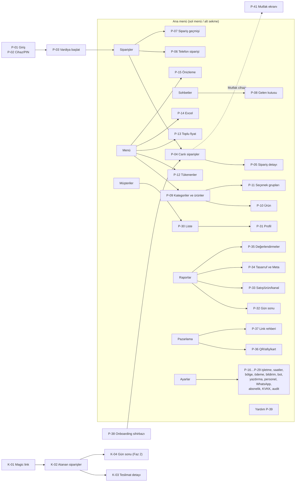
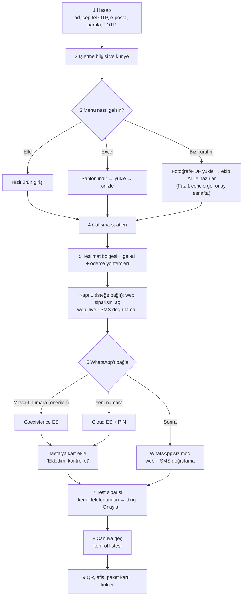

# 04 — İşletme Paneli (ve kurye, mutfak görünümleri)

> **Amaç:** İşletme panelinin (`panel.siparisinonunde.com`), kurye ve mutfak görünümlerinin ekran ekran ürün spesifikasyonunu vermek. Tasarımcı, frontend geliştirici ve test ekibi bu dokümandan doğrudan çalışabilmelidir.
> **Tarih:** 2026-09-24 · **Durum:** Taslak (düzeltme turu sonrası) · **Bağlayıcı kaynak:** [00-kararlar-ve-sozluk.md](00-kararlar-ve-sozluk.md) §4 (roller, müşteri verisi yetkisi, oturum süreleri, SMS kotası), §5 (durum makinesi, sebep kodları, enum'lar), §7 (akışlar, mesaj koruma kuralları, ret geri alma, `ordering_state`), §10 (kademeli alarm zamanlaması), §11 (fazlar). Çelişkide 00 geçerlidir.

**Kapsam:** Panel ilkeleri, bilgi mimarisi ve rol matrisi, onboarding sihirbazı, canlı sipariş ekranı (alarm, onay, ret, durum, düzenleme, telefon siparişi, yazdırma, kurye atama), WhatsApp gelen kutusu, menü yönetimi, işletme ayarları, müşteriler (CRM), kurye görünümü, mutfak görünümü, raporlar, pazarlama araçları, Faz 2–3 panel özellikleri, ekran listesi ve mikro metin sözlüğü.

**Kapsam dışı (bağlantı verilir):**
- Son müşteriye giden WhatsApp mesajlarının ve storefront'un Türkçe metinleri → [03 Müşteri deneyimi](03-musteri-deneyimi-ve-storefront.md)
- Embedded Signup teknik akışı, şablon kataloğu, konuşma motoru kuralları, hata kodları → [02 WhatsApp](02-whatsapp-entegrasyonu.md)
- SSE, olay günlüğü, alarm işlerinin altyapısı, yazdırma protokolü, kimlik oturumları → [06 Teknik mimari](06-teknik-mimari.md)
- Tablo alanları, API uç noktaları → [07 Veri modeli ve API](07-veri-modeli-ve-api.md)
- KVKK, İYS, saklama süreleri, dunning hukuku → [08 Mevzuat](08-mevzuat-kvkk-odeme-fatura.md)
- Admin paneli (impersonation, sağlık tablosu, AI menü çıkarma kuyruğu) → [05 Admin paneli](05-admin-paneli-ve-pazarlama-sitesi.md)

**Atıf biçimi:** `A05 §4.2` = [arastirma/05-urun-ux.md](arastirma/05-urun-ux.md) bölüm 4.2 (kaynak URL'leri araştırma raporlarında). `A02`, `A04`, `A06` aynı biçimde. `D02 §3.8`, `D06 §7.6` = ilgili plan dokümanının (02, 06…) bölümü. `[T]` = bizim tasarım önerimiz; `(teyit edilmeli)` = canlıdan önce doğrulanacak.

**Faz etiketleri:** **[Faz 1]** MVP · **[Faz 2]** Ticari lansman · **[Faz 3]** Ölçek (tanımlar [00-kararlar-ve-sozluk.md](00-kararlar-ve-sozluk.md) §11). Paket kapıları (Esnaf/Pro/Zincir) ayrı karardır; öneri matrisi [01](01-vizyon-pazar-is-modeli.md) §6.3'te. Kapılar feature flag ile uygulanır.

---

## 1. Panel ilkeleri

### 1.1 Temel kurallar

| # | İlke | Kural | Dayanak |
|---|---|---|---|
| 1 | **Sipariş kaçmaz** | Her ekranın üst barında bağlantı, ses ve sipariş alma durumu görünür. Yeni sipariş başka bir ekrandayken de tam ekran bant ve sesle duyurulur. Ses kilitliyse panel bunu gizlemez, kırmızı bantla söyler. | [00-kararlar-ve-sozluk.md](00-kararlar-ve-sozluk.md) §10, D06 §7 |
| 2 | **Büyük dokunma hedefleri** | Ana aksiyonlar ("Onayla", "Hazır", "Yola çıkar", "Teslim edildi") tablette **56–64 px** yükseklikte, kart genişliğinde. Diğer tüm dokunulabilir öğeler ≥ 48×48 px. Yan yana aksiyonlar arasında ≥ 8 px boşluk. | Android 48 dp, WCAG 2.5.5 AAA 44 px (A05 §8.1); 56–64 px [T] |
| 3 | **Tek birincil aksiyon** | Her kartta tek büyük buton. "Onayla" ile "Reddet" aynı büyüklükte ve bitişik olmaz. | A05 §8.1 |
| 4 | **Renk + ikon + kelime** | Durum asla yalnız renkle anlatılmaz: "🟢 Hazır", "🔴 Bağlantı yok", "⏱ 2:14". | WCAG 1.4.1 (A05 §8.1) |
| 5 | **Onay penceresi yerine "Geri al"** | Geri alınabilir işlemler hemen yapılır, alt şeritte "Geri al" çıkar (ret: 30 sn, diğer durum geçişleri: 5 sn). Onay penceresi yalnız geri alınamaz işlemlerde: onay sonrası iptal, müşteri verisini silme, toplu mesaj gönderimi [Faz 2], WhatsApp bağlantısını kaldırma. | [00-kararlar-ve-sozluk.md](00-kararlar-ve-sozluk.md) §7; A05 §8.1 |
| 6 | **Klavyesiz akış** | Süre, sebep, para üstü, adet ve ödeme için çip ve stepper. Serbest metin yalnız "Diğer" sebebi, not ve sohbet için. | A05 §8.1, A02 §10.2 |
| 7 | **Esnafın dili** | "Onayla, Reddet, Hazır, Yola çıkar, Teslim edildi, Tükendi, Sipariş almayı durdur". Ekranda *checkout, fulfillment, SKU, tenant, webhook* yazmaz. | A05 §8.4 |
| 8 | **Hata ne yapılacağını söyler** | "Yazıcı bulunamadı. Yazıcının açık ve kablosunun takılı olduğundan emin olun. [Tekrar dene]" | A05 §8.4 |
| 9 | **Türkçe biçim** | "1.250,50 TL", saat "20.35", tarih "24 Eylül Çar". Büyük harf dönüşümü `tr-TR` (SOĞANSIZ, İ/ı). Arama aksan duyarsız ("lahmacun/lamacun", "cig kofte"). | A05 §8.7 |
| 10 | **Hover yok** | Hover'a bağlı işlev yoktur. Kaydırma (swipe) yalnız kısayoldur, her aksiyonun görünür butonu vardır. | A05 §8.2 |
| 11 | **Fiyatı sunucu hesaplar** | Panelde gösterilen her tutar API'den gelir. Telefon siparişinde bile istemci toplamı yalnız önizlemedir. | [00-kararlar-ve-sozluk.md](00-kararlar-ve-sozluk.md) §10 |

### 1.2 Cihazlar ve düzenler

| Cihaz | Düzen | Not |
|---|---|---|
| **8–10" Android tablet, yatay (önerilen)** | Sol dar menü + 4 sütunlu kanban + sağdan açılan detay çekmecesi | Sürekli şarjda, kasada. Pilot cihaz önerisi (A04 §3.7) |
| Tablet, dikey | 2 sütun ("Yeni" + "Devam eden"), "Tamamlanan" sekmede; detay tam ekran alt sayfa | Mutfak duvar tableti için uygun |
| Telefon | Alt sekmeli (Siparişler · Sohbetler · Menü · Diğer); siparişler durum sekmeli liste | Sahibin cebinden takip, kurye görünümü |
| Masaüstü / PC kasa | Tablet yatay düzeni, daha geniş kartlar; klavye kısayolları (Enter = birincil aksiyon) | Chrome'da kurulu PWA; kiosk yazdırma (D06 §9.1) |
| iPad / iPhone | Desteklenir; ses ve push için "Ana ekrana ekle" şart, Wake Lock iOS 18.4+ | D06 §7.8 |

- **Uzaktan okunabilirlik:** sipariş no ve geçen süre ≥ 24 px; mutfak ekranında kalem adları ≥ 20 px (A05 §8.2).
- **Kiosk modu:** tam ekran PWA, ekran açık (Wake Lock), "şarja takılı değil" uyarısı (Battery API destekleyen cihazlarda) [T].
- **Karanlık mod:** varsayılan **açık tema** (dükkân ışığı ve güneş alan vitrinde okunurluk); karanlık mod isteğe bağlıdır, sistem ayarını izler; **mutfak görünümünde varsayılan karanlık** (A05 §8.3). İki temada da metin kontrastı ≥ 4,5:1; durum renkleri iki temada ayrı test edilir.

### 1.3 Düşük dijital okuryazarlık
- **Görselli boş durumlar:** "Henüz sipariş yok. Test siparişi vermek için QR'ı telefonunuzla okutun."
- **Bağlamsal yardım:** her ana ekranda "?" → 30 sn'lik video + "WhatsApp'tan bize sorun" butonu (A05 §8.4).
- **Hataya dayanıklılık:** yanlış reddedilen sipariş 30 sn içinde geri alınır; yanlışlıkla "Teslim edildi" 5 sn içinde geri alınır.
- **Ses ve görsel birlikte:** her sesli uyarının görsel karşılığı vardır (işitme engelli personel, gürültülü mutfak) (A05 §8.6).
- **Eğitim hedefi kasiyerdir** ("Operatör Elif", A02 §10.2): ilk kullanımda 3 adımlı ipucu turu (kart → Onayla · süre → Hazır/Yola çıkar).

---

## 2. Bilgi mimarisi ve roller

### 2.1 Navigasyon haritası



### 2.2 Üst bar (her ekranda)

| Öğe | Görünüm | Dokununca |
|---|---|---|
| Şube adı | "Kardeşler Döner · Kadıköy" (Faz 2'de şube seçici) | — |
| **Sipariş alma durumu** (`ordering_state`) | 🟢 Sipariş alıyor · 🟠 Yoğun (+15 dk) · ⏸ Durduruldu (20.15'e kadar) · ⚫ Kapalı (11.00'de açılır) | Durum sayfası (§4.10) |
| Ses | 🔊 Açık / 🔇 **Ses kapalı** (kırmızı) | Vardiya başlat ekranı |
| Bağlantı | ● Canlı / ◐ Bağlanıyor / 🔴 Bağlantı yok | Bağlantı ayrıntısı (§4.17) |
| WhatsApp | Yalnız sorun varsa: ⚠ WhatsApp | P-25 sağlık kartı |
| Gün özeti | "Bugün 42 sip · 14.380 TL" (yalnız `owner`/`manager`/`cashier`) | P-32 |
| Bildirim zili | Okunmamış sayısı | P-40 bildirim merkezi |
| Kullanıcı | Ad; paylaşılan cihazda "PIN ile değiştir" | Hesap / PIN ekranı |

### 2.3 Rol bazlı ekran görünürlüğü

Roller [00-kararlar-ve-sozluk.md](00-kararlar-ve-sozluk.md) §4'ten. ✓ tam, ◐ kısıtlı (kısıt hücrede yazılı), — görünmez. İzinler API'de `authorize()` ile uygulanır; UI yalnız gizler (D06 §6.5).

| Ekran | owner | manager | cashier | kitchen | courier |
|---|---|---|---|---|---|
| P-04 Canlı siparişler, P-05 detay | ✓ | ✓ | ✓ | — (P-41 kullanır) | — (K-02) |
| P-06 Telefon siparişi | ✓ | ✓ | ✓ | — | — |
| P-07 Sipariş geçmişi | ✓ | ✓ | ◐ bugün + dün | — | — |
| P-08 Gelen kutusu | ✓ | ✓ | ✓ | — | — |
| P-09…P-11, P-13, P-14 Menü düzenleme | ✓ | ✓ | — | — | — |
| P-12 Tükenenler | ✓ | ✓ | ✓ | ✓ | — |
| P-15 Menü önizleme | ✓ | ✓ | ✓ | — | — |
| P-16…P-22 Şube ayarları | ✓ | ✓ | ◐ yalnız `ordering_state` | — | — |
| P-23 Personel ve cihazlar | ✓ | ◐ `owner` ekleyemez/değiştiremez | — | — | — |
| P-24 Kuryeler | ✓ | ✓ | ◐ liste | — | — |
| P-25 WhatsApp bağlantısı ve sağlık | ✓ | ◐ salt okunur | — | — | — |
| P-26 İşletme bilgileri ve künye | ✓ | ✓ | — | — | — |
| P-27 Abonelik ve faturalar | ✓ | — | — | — | — |
| P-28 Yasal metinler, KVKK | ✓ | ✓ | — | — | — |
| P-29 Denetim kaydı | ✓ | ◐ şube | — | — | — |
| P-30/P-31 Müşteriler | ✓ | ✓ | ◐ dışa aktarma/silme yok | — | ◐ atanan siparişte ad + adres |
| P-32 Gün sonu kasa | ✓ | ✓ | ◐ bugün | — | ◐ K-04 kendi özeti [Faz 2] |
| P-33, P-34 Raporlar | ✓ | ✓ | — | — | — |
| P-35 Değerlendirmeler | ✓ | ✓ | ◐ bugün | — | — |
| P-36, P-37 Pazarlama | ✓ | ✓ | — | — | — |
| P-38 Onboarding | ✓ | ◐ menü/saat/bölge adımları | — | — | — |
| P-41 Mutfak ekranı | ✓ | ✓ | ✓ | ✓ | — |

### 2.4 Rol bazlı aksiyon matrisi

| Aksiyon | owner | manager | cashier | kitchen | courier |
|---|---|---|---|---|---|
| Onayla / Reddet (`new`) | ✓ | ✓ | ✓ | — | — |
| "Telefonla doğruladım" (`awaiting_customer → new`) | ✓ | ✓ | ✓ | — | — |
| Hazırlanıyor / Hazır | ✓ | ✓ | ✓ | ✓ | — |
| Kurye ata, Yola çıkar | ✓ | ✓ | ✓ | — | — |
| Yola çıktım / Teslim ettim | ✓ | ✓ | ✓ | — | ✓ yalnız atanan |
| Onay sonrası iptal (sebep zorunlu) | ✓ | ✓ | ✓ | — | — |
| Sipariş düzenleme (§4.12) | ✓ | ✓ | ✓ | — | — |
| Fiyat görme | ✓ | ✓ | ✓ | — (hiçbir yanıtta fiyat alanı yok) | ◐ tahsil edilecek tutar |
| Tükendi aç/kapa | ✓ | ✓ | ✓ | ✓ | — |
| Menü/fiyat düzenleme, toplu fiyat | ✓ | ✓ | — | — | — |
| "WhatsApp'ta satma" bayrağını kaldırma | ✓ | ✓ (audit) | — | — | — |
| `ordering_state` (Yoğun/Durdur) | ✓ | ✓ | ✓ | — | — |
| Saat, bölge, ödeme, bildirim, bot ayarı | ✓ | ✓ | — | — | — |
| Sohbet yanıtla, devral, bota devret | ✓ | ✓ | ✓ | — | — |
| Müşteri notu, kara liste | ✓ | ✓ | ✓ (kara liste sebep zorunlu) | — | — |
| Müşteri verisi dışa aktar / sil-anonimleştir | ✓ | ✓ | — | — | — |
| Personel ekle, cihaz eşleştir | ✓ | ✓ (`owner` hariç) | — | — | — |
| WhatsApp bağla/yeniden bağla/kaldır | ✓ | — | — | — | — |
| Abonelik, fatura, plan | ✓ | — | — | — | — |
| Kampanya gönder [Faz 2] | ✓ | ✓ (İYS kapısı açıksa) | — | — | — |

- **Taze oturum:** WhatsApp bağlantısı, abonelik, personel/rol değişikliği, müşteri verisi dışa aktarma ve silme için son 10 dk içinde parola/TOTP yeniden istenir (D06 §6.1).
- **Paylaşılan cihaz [Faz 1]:** mutfak/kasa tableti cihaz oturumuyla çalışır; aksiyonlar personel PIN'i ister, sipariş listesi ve alarm PIN'siz görünür kalır (D06 §6.3). Oturum türleri (e-posta + parola, `owner` için zorunlu TOTP, cihaz PIN'i, kurye magic link) → D06 §6.2.
- **Oturum süreleri (kanonik, [00-kararlar-ve-sozluk.md](00-kararlar-ve-sozluk.md) §4):** işletme paneli kişisel kullanıcı oturumu **30 gün** (kayıtlı cihaz); paylaşımlı kasa/mutfak tableti **cihaz kaydı 90 gün**, personel bu cihazda PIN ile girer; kurye magic link oturumu **12 saat** (vardiya; link tek kullanımlık, 15 dk içinde açılmalı). Personel PIN oturumu vardiya boyudur (en çok 12 sa, D06 §6.2). Süresi dolan kurye, işletmeden yeni giriş linki ister (§9.1).

---

## 3. Onboarding sihirbazı: "10 dakikada ilk sipariş" **[Faz 1]**

### 3.1 Hedef ve ilkeler
- **Hedef:** Kayıttan ilk test siparişinin "ding" sesine kadar 10 dk [T]. Bu hedef yalnız **menü hazır geldiğinde** (ekip concierge ile hazırladıysa ya da ≤ 15 ürünlük menü elle girildiyse) gerçekçidir. Asıl süre riski Meta bağlantısı ve kart ekleme adımındadır (A05 §8.5; D02 §3.8 kabul kriteri: ES başlangıcından "Canlıya hazır"a < 15 dk).
- **İki kapılı canlıya geçiş:** (1) storefront + panel + telefon siparişi hemen canlı olabilir ("WhatsApp'sız mod", §3.6); (2) WhatsApp bağlantısı hazır olunca devreye girer. Meta gecikmesi aktivasyonu durdurmaz (A06 §5.7).
- Her adımda ilerleme çubuğu, "Sonra devam et" ve **"Biz kuralım"** butonu (ilk 100 işletmeye ücretsiz, sonra 1.990 TL + KDV; [00-kararlar-ve-sozluk.md](00-kararlar-ve-sozluk.md) §8). Pilotta sihirbazı ekip doldurur, esnaf yalnız WhatsApp adımında telefonundan onay verir (A02 §9.2).
- İlerleme `onboarding_step` alanına yazılır; kodlar ve tamamlanma koşulları [05](05-admin-paneli-ve-pazarlama-sitesi.md) §A.2.2 ile aynıdır, admin panelindeki "takılan adım" hunisi bundan beslenir. **Kapı 1** (`web_live`) adım 5'ten sonra açılabilir; **Kapı 2** (`live`) WhatsApp sağlık kontrolü ve test siparişiyle açılır.

### 3.2 Akış



### 3.3 Adımlar

| # | Adım | Ekran içeriği | Süre hedefi [T] | `onboarding_step` |
|---|---|---|---|---|
| 1 | **Hesap** | Ad soyad, cep telefonu (SMS OTP), e-posta, parola; kullanım koşulları + abonelik sözleşmesi + DPA click-wrap (sürümlü, [08](08-mevzuat-kvkk-odeme-fatura.md) §7.5); **TOTP kurulumu** (QR + 6 haneli kod + yedek kodlar; `owner` için zorunlu, D06 §6.6) | 2 dk | `account_created` |
| 2 | **İşletme bilgisi** | Görünen ad, işletme türü (çip: dönerci, pideci, kebap, burger, pizza, ev yemeği, kafe, diğer), adres (haritada pin + yazılı), müşteriye gösterilecek telefon, logo (opsiyonel); **künye**: unvan veya ad-soyad, VKN/TCKN, vergi dairesi, MERSİS no (varsa), meslek odası, işletme kayıt no (5996, opsiyonel). Slug önerisi: `kardeslerdoner` → `kardeslerdoner.siparisinonunde.com` | 2 dk | `profile_done` |
| 3 | **Menü** | Kartlar: **Elle gir** (kategori + ürün + fiyat, seçenek grubu şablonları: Porsiyon, Ekmek, Acı, Çıkarılacaklar, İçecek) · **Excel ile yükle** (§6.6; Faz 1 temel sürümü kesilebilir "C" maddesidir, kesilirse Excel dosyası "Biz kuralım" ile ekibe gönderilir) · **Biz kuralım** (menü fotoğrafı/PDF yükle; ekip AI aracıyla taslak çıkarır, esnaf fiyatları onaylar; A05 §8.5, D06 §11.7) | 3 dk (hazır menüyle) | `menu_done` |
| 4 | **Çalışma saatleri** | Hazır şablonlar ("Her gün 11–23", "Hafta içi 10–22, hafta sonu 11–24"); gün bazında düzenleme; gece yarısını geçen kapanış | 30 sn | — |
| 5 | **Bölge ve ödeme** | Haritada şube çevresinde **3 km yarıçaplı hazır bölge**; ücret, min. sepet, tahmini süre alanları; "Poligon çiz" seçeneği; gel-al aç/kapa; ödeme çipleri (Kapıda nakit · Kapıda kart · Yemek kartı + markalar · Kasada öde) | 1,5 dk | `ops_done` (+ isteğe bağlı `web_live`) |
| 6 | **WhatsApp'ı bağla** | Yol seçimi, geçmiş aktarımı tercihi (varsayılan kapalı), Meta penceresi, **Meta'ya kart ekle** rehberi, "Başka telefondan TEST yaz" sağlık kontrolü. Metinler D02 §3.10'da | 3–5 dk | `wa_connected`, `meta_payment_ok` |
| 7 | **Test siparişi** | "Kendi telefonunuzla bu QR'ı okutun, 1 ürün seçip sipariş verin." Panel "ding" çalar, kart belirir, esnaf **Onayla · 30 dk**'ya basar, telefonuna "Onaylandı" mesajı düşer. Test siparişi raporlara ve faturalamaya girmez (`test_kind = 'onboarding_test'`, [00-kararlar-ve-sozluk.md](00-kararlar-ve-sozluk.md) §5) | 1 dk | `wa_test_done` |
| 8 | **Canlıya geç** | Kontrol listesi (§3.4.4) + "Canlıya geç" butonu; WhatsApp hazır değilse web siparişiyle (Kapı 1) devam | 30 sn | `live` (veya `web_live`) |
| 9 | **Müşterine duyur** | QR/afiş/paket kartı oluşturucuya kısayol, Instagram/Google/WhatsApp profil linklerini kopyala (§12) | 1 dk | — |

### 3.4 Adım ayrıntıları

#### 3.4.1 Menü adımı
- **Elle hızlı giriş:** tek ekranda satır satır "Ürün adı · Fiyat · Kategori" tablosu; Enter yeni satır açar. Seçenek grupları sonradan bağlanabilir; "Bu kategorideki tüm ürünlere 'Porsiyon: Yarım/Tam' ekle" kısayolu.
- **Biz kuralım (Faz 1 concierge):** esnaf fotoğrafı yükler ve "Ekibimiz menünüzü hazırlıyor (genelde aynı gün)" durumunu görür. Ekip admin panelindeki AI aracıyla taslağı çıkarır ([05](05-admin-paneli-ve-pazarlama-sitesi.md)). Taslak panele "Onayınızı bekliyor" olarak gelir: esnaf fiyat sütununu gözden geçirir, **"Fiyatlar doğru, yayınla"** der. Fiyatlar insan onayı olmadan asla yayına çıkmaz ([00-kararlar-ve-sozluk.md](00-kararlar-ve-sozluk.md) §10). Self-servis AI **[Faz 2]** (§13).
- **Alkol/tütün kelimeleri** (bira, rakı, şarap, sigara, nargile…) girişte otomatik "WhatsApp'ta satılamaz" bayrağı alır (§6.8).

#### 3.4.2 WhatsApp adımı ve Meta kartı
- **Yol seçimi** (D02 §3.2): **[Mevcut WhatsApp Business numaramı kullan (önerilen)]** (Coexistence) · [Sipariş için yeni numara bağla] · "Normal (yeşil) WhatsApp mı kullanıyorsunuz? → Önce WhatsApp Business'a geçin (2 dk'lık rehber)".
- **Ön kontrol listesi** (A06 §3.6): "Numaranız başka bir programa (bot, eski sağlayıcı) bağlı mı?", "WhatsApp Business uygulamanız güncel mi?", "Telefonunuz yanınızda mı?". "Emin değilim" → destek.
- **Kişi (contact book) ayarı:** açık tutulması önerilir: "Kapatırsanız kuryeniz bazı müşterilerin numarasını göremeyebilir" (D02 §8.1).
- **Meta kartı adımı (zorunlu):** 4 ekranlık görselli rehber + Billing Hub derin bağlantısı (URL teyit edilmeli) + **[Ekledim, kontrol et]**. Açıklama: "WhatsApp, müşterilerinize giden mesajlar için çok küçük bir ücret alır: mesaj başına yaklaşık 4 kuruş, ayda ilk 1.000 mesaj ücretsiz. Bu ücret bize değil doğrudan Meta'ya ödenir." "Kartsız deneme" yalnız **bize** kart vermemek demektir ([00-kararlar-ve-sozluk.md](00-kararlar-ve-sozluk.md) §8). Kart eklenmezse canlıya geçiş engellenir (D02 §3.8).
- **Sağlık kontrolü sonucu:** yeşil tik listesi (bağlantı, webhook, gelen mesaj, giden mesaj + faturalama, görünen ad) ve "Canlıya hazır". Şablon onayı ve kalite engel değildir, uyarıdır (D02 §3.8).

#### 3.4.3 Test siparişi
- Test sırasında ses kilidi açılmamışsa önce vardiya başlat ekranı (§4.1) gösterilir; bu, esnafa ses kilidini ilk günden öğretir.
- Ekranda üç adım animasyonu: "1 Telefonla sipariş ver · 2 Sesi duy · 3 Onayla'ya bas". Kart geldiğinde "İşte bu kadar! Müşteriniz şimdi 'Onaylandı' mesajını aldı." WhatsApp'sız modda test, SMS doğrulamalı web siparişiyle yapılır.

#### 3.4.4 "Canlıya geç" kontrol listesi
| Kontrol | Kapı 1 `web_live` | Kapı 2 `live` |
|---|---|---|
| Künye tam (unvan/ad, adres, telefon, VKN/TCKN); eksikse storefront yayına alınmaz ([08](08-mevzuat-kvkk-odeme-fatura.md) §4.7) | Engel | Engel |
| ≥ 1 kategori, ≥ 5 fiyatlı aktif ürün, yasaklı ürün taraması temiz | Engel | Engel |
| Çalışma saatleri, ≥ 1 teslimat bölgesi **veya** gel-al, ≥ 1 ödeme yöntemi | Engel | Engel |
| Sözleşme kabulleri ve `owner` TOTP | Engel | Engel |
| WhatsApp canlı kapısı (token, webhook, gelen/giden mesaj, Meta faturalama, görünen ad; D02 §3.8) | — | Engel |
| Test siparişi panele sesli düştü ve onaylandı | Önerilir | Engel (pilotta ekip atlatabilir, audit) |
| Bir cihazda vardiya başlatıldı (ses açık) | Uyarı | Uyarı |

### 3.5 Takılma noktaları ve kurtarma

| Adım | Takılma | Tespit | Kurtarma |
|---|---|---|---|
| 1 | SMS OTP gelmiyor | 60 sn geri sayım bitti | "Tekrar gönder" (en çok 3), "Sesli arama ile kod" (sağlayıcı destekliyorsa, teyit edilmeli), destek butonu |
| 1 | TOTP uygulaması yok / anlaşılmıyor | 3 dk bu ekranda | Videolu rehber (Google Authenticator), "Destek ekibi sizi arasın" talebi |
| 2 | Künye bilgisi bilinmiyor | Alan boş bırakıldı | "Sonra tamamla" izinli; storefront yayına alınmaz, panelde sarı kart |
| 3 | Menü büyük, elle girilmiyor | 5 dk'da < 5 ürün | "Biz kuralım" önerisi + fotoğraf yükleme |
| 3 | Excel hatalı | Doğrulama hatası | Hatalı satırlar kırmızı, satır bazında düzelt; hatasızlar içe aktarılabilir |
| 5 | Harita pini yanlış | Esnaf "adresim bu değil" der | Pini sürükle; yazılı adres ters geocoding ile güncellenir |
| 6 | ES penceresi kapatıldı | `CANCEL` + `current_step` | "Bağlantı yarıda kaldı. Kaldığınız yerden devam edebilirsiniz." + 24 sa sonra e-posta (D02 §3.9) |
| 6 | Numara başka yerde kayıtlı | ES hatası | "Bu numara başka bir yerde kullanılıyor." + ayrılma rehberi + yeni numara seçeneği |
| 6 | İki adımlı doğrulama PIN'i | `/register` hatası | PIN giriş ekranı, deneme sayacı (72 sa'te 10 sınırı), 5. denemede destek |
| 6 | Görünen ad reddi | `DECLINED` | "Tabela adı + ilçe" örneğiyle "Adı düzelt" rehberi |
| 6 | Kart eklenmedi | Test mesajı 131042 | Kırmızı kart, platform WhatsApp'ından `isletme_meta_odeme_v1` hatırlatması; bu arada WhatsApp'sız mod |
| 6 | Meta tarafı genel hata | `ERROR` | "Meta bağlantıyı tamamlayamadı: {kısa sebep}" + destek kaydı otomatik açılır |
| 7 | Ses gelmiyor | "Ding'i duydunuz mu? Hayır" | Ses rehberi: cihaz sesini aç, sessiz modu kapat, tabletin hoparlörünü test et |
| Hepsi | Sihirbaz yarıda bırakıldı | 24 sa hareketsiz | E-posta + (izin varsa) platform WhatsApp hatırlatması; admin hunisinde görünür |

### 3.6 "WhatsApp'sız mod" (web siparişine erken başlama)
- **Ne zaman:** WhatsApp bağlantısı henüz yok, kart eklenmedi ya da WhatsApp kanalı arızalı ([00-kararlar-ve-sozluk.md](00-kararlar-ve-sozluk.md) §7 Akış B yedeği). **[Faz 1]**
- **Nasıl çalışır:** storefront siparişi `awaiting_customer` olur; müşteri telefonuna gelen **SMS OTP** ile doğrular ve sipariş `new` olur. Durum bilgisi takip sayfasından; kritik durumlarda (onaylandı, iptal) SMS ile verilir. Telefon siparişi (Akış E) normal çalışır. Aynı SMS yolu, işletme bağlıyken WhatsApp'ı olmayan müşteri için de açıktır (storefront tarafı [03](03-musteri-deneyimi-ve-storefront.md)); panelde bu siparişler "SMS ile doğrulandı" rozeti taşır.
- **Kill-switch etkisi ([00-kararlar-ve-sozluk.md](00-kararlar-ve-sozluk.md) §4):** WhatsApp'sız mod tenant bazında otomatik devreye girer (bağlantı yok, token 190, ödeme 131042) ya da Meta kesintisinde admin olay kaydından toplu açılır. Admin `sms_fallback` kill-switch'ini kapatırsa (ör. SMS pompalama saldırısı) SMS yedeği tamamen durur ve Akış B yalnız WhatsApp ile çalışır; WhatsApp'ı bağlı olmayan işletmede storefront "Şu an online sipariş alınamıyor, lütfen arayın" gösterir, siparişler telefonla (Akış E) alınır ve panelde bilgi bandı çıkar.
- **Panelde:** üst barda gri rozet "WhatsApp'sız mod · Siparişler web ve SMS ile" + [WhatsApp'ı bağla]. Gelen kutusu yerine "WhatsApp bağlanınca sohbetler burada görünecek" boş durumu.
- **SMS maliyeti ve kotası ([00-kararlar-ve-sozluk.md](00-kararlar-ve-sozluk.md) §4):** SMS OTP ve kritik durum SMS'leri (onaylandı/iptal) **platform maliyetidir** (SMS başına ≈ 0,16–0,43 TL, A04 §3.8) ve aboneliğe **adil kullanım kotasıyla** dahildir: **Esnaf 100, Pro 300, Zincir şube başına 300 SMS/ay**. Kota aşımında işletme uyarılır; ek SMS paketi **[Faz 2]**. SMS'ler Faz 1'de platformun onaylı alfanümerik başlığıyla gider, gövdede işletme adı yer alır; işletmeye özel başlık **[Faz 3]** ([00-kararlar-ve-sozluk.md](00-kararlar-ve-sozluk.md) §7).
- **SMS kotası göstergesi [Faz 1]:** WhatsApp'sız mod rozetinin yanında ve P-27 abonelik ekranında "Bu ay SMS: 64 / 100" çubuğu (kaynak: `tenant_usage_monthly.sms_count` / `sms_quota`, [07](07-veri-modeli-ve-api.md)). %80'de sarı bant + `owner`'a bildirim ("SMS kotanızın %80'i kullanıldı. WhatsApp'ı bağlayarak SMS ihtiyacını azaltabilirsiniz."), %100'de kırmızı bant ve e-posta; **kota aşımında SMS kesilmez**, yalnız uyarı gider. Kotaya yalnız müşteriye giden SMS'ler (OTP, kritik durum) sayılır; işletme sahibine giden alarm SMS'leri (§4.5 t=5 dk, panel çevrimdışı uyarısı) ve kurye giriş SMS'i kotadan bağımsızdır ve kesilmez. Pilot işletmelerde kota uygulanmaz, sayım sürer.
- WhatsApp bağlanınca mod otomatik kapanır; yeni web siparişleri WhatsApp doğrulamasına döner.

### 3.7 Kabul kriterleri (onboarding)
- [ ] Menüsü hazır bir işletme, kayıttan test siparişi onayına kadar tüm adımları 15 dk'nın altında tamamlar (pilotta 10 işletmede ölçülür; hedef medyan 10 dk).
- [ ] Her adım kaydedilir; tarayıcı kapanıp açıldığında kalınan adımdan devam edilir.
- [ ] Künye eksikken storefront yayına alınmaz ve panel sebebini söyler.
- [ ] WhatsApp adımı atlandığında işletme WhatsApp'sız modda web siparişi alabilir; SMS ile doğrulanan sipariş panelde sesli uyarıyla düşer.
- [ ] Meta kartı eklenmeden WhatsApp "canlı" durumuna geçmez; "Ekledim, kontrol et" sağlık kontrolünü yeniden çalıştırır ve sonucu 60 sn içinde gösterir.
- [ ] Test siparişi raporlara, tasarruf hesabına ve müşteri listesine girmez.

---

## 4. Canlı sipariş ekranı (P-04) **[Faz 1]**

### 4.1 Vardiya başlat (P-03)
Tarayıcılar sesli oynatmayı kullanıcı jesti olmadan engeller ve Wake Lock sayfa gizlenince düşer (A04 §3.4–3.5). Bu yüzden panel her açılışta ve ses bağlamı askıya alındığında tam ekran vardiya ekranı gösterir.

```
┌──────────────────────────────────────────────────────────────────┐
│                  Kardeşler Döner · Kadıköy                       │
│                                                                  │
│        ┌──────────────────────────────────────────────┐          │
│        │        >  SİPARİŞLERİ ALMAYA BAŞLA           │  (64 px) │
│        └──────────────────────────────────────────────┘          │
│                                                                  │
│   ✓ Ses açık (ding çaldı)      ✓ Ekran açık kalacak              │
│   ✓ Bildirim izni verildi      ✓ İnternet bağlı                  │
│   ! Şarja takılı değil: tableti şarja takın                      │
│                                                                  │
│   Ding sesini duydunuz mu?   [ Evet ]   [ Hayır, duymadım ]      │
└──────────────────────────────────────────────────────────────────┘
```

- Dokunuş: `AudioContext.resume()` + kısa, duyulur test sesi + Wake Lock isteği + Web Push izni (ilk sefer) + cihaz durumunun sunucuya bildirimi (`audio_unlocked`, `wake_lock_active`) (D06 §7.8).
- "Hayır, duymadım" → ses rehberi (cihaz sesi, sessiz mod, hoparlör testi).
- iOS'ta ana ekrana eklenmemişse: "Bildirimler için paneli ana ekrana ekleyin" rehberi.
- Ekran atlanırsa panel açılır ama üstte kırmızı bant kalır: **"Ses kapalı — yeni siparişleri duyamazsınız. [Sesi aç]"**. 5 dk sürerse aynı uyarı `owner`'a gider (D06 §7.7).
- Wake Lock düşerse (sekme gizlendi) sayfa görünür olunca yeniden istenir; alınamazsa üst barda "Ekran kapanabilir" ikonu.
- **"Günü kapat"** (kullanıcı menüsü): açık saatteyken ve başka aktif cihaz yoksa uyarır: "Başka açık panel yok. Sipariş gelirse duyulmaz. Sipariş almayı durdurmak ister misiniz?" [Durdur ve kapat] [Yine de kapat] [T].

### 4.2 Düzen ve sütunlar

| Sütun | İçerdiği durumlar | Sıralama | Not |
|---|---|---|---|
| **Yeni** | `new` | En eski üstte | Kırmızı çerçeve, sayaç; sütun başlığında sayı |
| **Hazırlanıyor** | `accepted`, `preparing` | Tahmini saate göre | "Hazırlanıyor" adımı kapalıysa `accepted` burada "Onaylandı" etiketiyle durur |
| **Hazır / Yolda** | `ready`, `on_the_way` | Önce `ready` | Paket ve gel-al ayrı rozetle |
| **Tamamlanan** (katlanır) | Bugün `delivered`, `rejected`, `cancelled` | En yeni üstte | Varsayılan kapalı; sayı görünür |

- **Müşteri onayı bekleniyor şeridi:** `awaiting_customer` siparişler "Yeni" sütununun üstünde **soluk, sessiz** ince satırlar: "#1052 · Web · 285 TL · Müşteri onayı bekleniyor · 12 dk kaldı". Aksiyon: **[Telefonla doğruladım]** (`verification_method = staff`, audit log'a yazılır, sipariş `new` olur ve normal akışa girer) (A05 §2.4). 30 dk içinde doğrulanmayan sipariş `cancelled` / `customer_timeout` olur ve şeritten düşer.
- **Planlı sipariş şeridi [Faz 2]:** "Bugün 19.30 için 3 sipariş" (A05 P-LIVE-13).
- **Telefon (dikey):** üstte durum sekmeleri "Yeni (2) · Hazırlanıyor (5) · Hazır/Yolda (3) · Tamam"; yeni sipariş geldiğinde "Yeni" sekmesi otomatik açılır ve titreşir (destekleyen cihazda).

### 4.3 Tel kafes (tablet, yatay)

```
┌───┬───────────────────────────────────────────────────────────────────────────────────────────────────────────┐
│ ≡ │ Kardeşler Döner · Kadıköy  [● Sipariş alıyor ▾]  Ses: Açık  ● Canlı  Bugün 42 sip · 14.380 TL  Zil(2)     │
├───┼──────────────────────────┬──────────────────────────┬──────────────────────────┬──────────────────────────┤
│Sip│ YENİ (2)                 │ HAZIRLANIYOR (5)         │ HAZIR / YOLDA (3)        │ TAMAMLANAN (32) ▸        │
│Soh│ ┄ #1052 · Web · 285 TL   │ ┌──────────────────────┐ │ ┌──────────────────────┐ │                          │
│Men│   Müşteri onayı bekl.    │ │#1049  Paket   12 dk  │ │ │#1041  Paket · Yolda  │ │ [+ Telefon siparişi]     │
│Müş│   [Telefonla doğruladım] │ │Mehmet · 2. sipariş   │ │ │Kurye: Burak · 20.31  │ │                          │
│Rap│ ┌──────────────────────┐ │ │4 ürün · 520 TL       │ │ │Kapıda nakit          │ │ Hızlı arama: [______]    │
│Paz│ │#1051  WA    01:12 (!)│ │ │Hedef 20.35           │ │ │[   TESLİM EDİLDİ    ]│ │                          │
│Ayr│ │Ayşe K. · 5. sipariş  │ │ │[       HAZIR        ]│ │ └──────────────────────┘ │                          │
│   │ │Paket · Caferağa      │ │ └──────────────────────┘ │ ┌──────────────────────┐ │                          │
│   │ │2× Tavuk Dürüm        │ │ ┌──────────────────────┐ │ │#1043  Gel-al · Hazır │ │                          │
│   │ │   ACISIZ             │ │ │#1050  Gel-al   4 dk  │ │ │Hazır · 20.20         │ │                          │
│   │ │1× Ayran  [not]       │ │ │Can · Yeni müşteri    │ │ │[   TESLİM EDİLDİ    ]│ │                          │
│   │ │285 TL · Kapıda kart  │ │ │[       HAZIR        ]│ │ └──────────────────────┘ │                          │
│   │ │┌────────────────────┐│ │ └──────────────────────┘ │                          │                          │
│   │ ││   ONAYLA · 30 dk   ││ │                          │                          │                          │
│   │ │└────────────────────┘│ │                          │                          │                          │
│   │ │[15][20][45][60][…]   │ │                          │                          │                          │
│   │ │           Reddet  ⋯  │ │                          │                          │                          │
│   │ └──────────────────────┘ │                          │                          │                          │
└───┴──────────────────────────┴──────────────────────────┴──────────────────────────┴──────────────────────────┘
  ▲ Yeni sipariş gelince üstte kırmızı tam genişlik bant: "YENİ SİPARİŞ #1051 · 285 TL · Gördüm" (dokununca karta gider)
  Sol ray: Siparişler · Sohbetler · Menü · Müşteriler · Raporlar · Pazarlama · Ayarlar. (!) = 2 dk aşıldı, kırmızı.
```

### 4.4 Sipariş kartı

| Bölge | İçerik | Kural |
|---|---|---|
| Başlık | **#1051** (≥ 24 px), kanal rozeti, teslim türü ikonu, **geçen süre sayacı** | Sayaç `new`'de oluşturmadan, diğerlerinde onaydan beri; `new` 2 dk'yı geçince kırmızı + "⏱ 2:14" |
| Müşteri | Ad (profil adı; yoksa "Müşteri …12"), **"Yeni müşteri"** veya **"5. sipariş"** rozeti | Kara listedeyse **"⚠ Şüpheli"** kırmızı rozet |
| Teslim | 🛵 Paket · mahalle / 🛍 Gel-al · hazır olma saati / [Faz 3] 🍽 Masa | Planlı ise "🕒 19.30 için" |
| Kalemler | İlk 3 kalem + "ve 2 ürün daha"; seçenekler kısa; **çıkarılacaklar BÜYÜK HARF, kalın** | Kalem notu varsa 📝 |
| Not | 📝 ikonu; dokununca sipariş notu | Not içeriği kartta kısaltılmış |
| Tutar ve ödeme | "285,00 TL · 💵 Kapıda nakit · 500 TL'ye para üstü" / "💳 Kapıda kart" / "🍽 Multinet" / "Kasada" | `kitchen` görmez |
| Durum satırı | "Onaylandı · Hedef 20.35", "Yolda · Burak", "Süre aşıldı · +5 dk" (kırmızı) | — |
| Uyarı rozetleri | "📱 Sohbette yanıtlandı — onaylamayı unutmayın" (Coexistence echo, A06 §5.1), "⚠ WhatsApp'a ulaşılamadı, arayın" (131026, D02 §10.1), "Müşteri iptal istiyor", "Sahibine bildirildi · 14.04" | Rozet metni + ikon + renk |
| Birincil buton | Duruma göre tek büyük buton (§4.8) | 56–64 px |
| İkincil | "Reddet" (yalnız `new`), "⋯" menüsü: Detay, Yazdır, Sohbete git, Ara, Kurye ata, Gecikme bildir, İptal et | ≥ 48 px, birincilden ≥ 8 px ayrık |

**Kanal rozetleri:** 🟢 WhatsApp (`wa_link`) · 🌐 Web (`web`, alt etiket kaynak: QR/Instagram/Google/Paket) · ☎ Telefon (`manual`) · 🤖 AI [Faz 2] (`wa_ai`) · 🔁 Sohbetten tekrar [Faz 2] (`wa_reorder`) · 🧾 Flows [Faz 3] (`wa_flow`) · 🍽 Masa [Faz 3] (`table_qr`) ([00-kararlar-ve-sozluk.md](00-kararlar-ve-sozluk.md) §5).

### 4.5 Yeni sipariş uyarısı ve hatırlatma merdiveni

Zamanlamalar [00-kararlar-ve-sozluk.md](00-kararlar-ve-sozluk.md) §10'daki **kanonik kademeli alarm zinciriyle birebir aynıdır** (altyapı D06 §7.6); eşikler platform varsayılanıdır, işletme P-19'dan min/maks sınırları içinde ayarlar. "Otomatik reddet" yoktur.

| Zaman | Koşul | Panelde görünen | Panel dışı kanal |
|---|---|---|---|
| **t = 0** | `new` | Döngüsel alarm sesi (yalnız lider sekme çalar), üstte kırmızı bant, başlık/favicon yanıp söner, uygulama rozeti; kart "Yeni" sütunda | **Web Push** tüm kayıtlı cihazlara ("Yeni sipariş #1051", PII yok) |
| **t + 60 sn** | Hâlâ `new` | **Ses tekrarı, yükselen** ton/seviye | — |
| **t + 2 dk** | Hâlâ `new` | Sayaç kırmızı; rozet "Sahibine bildirildi · 14.04" | **Platform WhatsApp numarasından** `owner`'a (ve ayarda seçiliyse `manager`'a) uyarı şablonu `isletme_yeni_siparis_v1` (D02 §5.3) |
| **t + 5 dk** | Hâlâ `new` | Rozet "SMS gönderildi" | **SMS** (`owner`'ın uyarı telefonuna) |
| **t + 10 dk** (varsayılan; ayar: otomatik iptalden en az 5 dk önce, ör. iptal 10 dk ise en geç t + 5 dk) | Hâlâ `new` | Kart: "Müşteriye bilgi verildi · Bekliyor" | Müşteriye **"işletme henüz onaylamadı"** bilgisi (M13, pencere açıksa; butonlar **[Beklerim] [Siparişi iptal et]**, metin [03](03-musteri-deneyimi-ve-storefront.md)); müşteri iptal ederse `cancelled` (`cancelled_by=customer`, `customer_request`) |
| **t + 15 dk** (varsayılan; ayar 10–30 dk) | Hâlâ `new` | Kart "Tamamlanan"a düşer: "Zaman aşımıyla iptal edildi" + kırmızı bildirim | Otomatik iptal: `cancelled_by=system`, sebep `tenant_no_response`; müşteriye özür + işletme telefonu ([00-kararlar-ve-sozluk.md](00-kararlar-ve-sozluk.md) §5); `owner`'a bildirim |

- Otomatik sesli arama (TTS) kanonik zincirde **yoktur**; ancak [00-kararlar-ve-sozluk.md](00-kararlar-ve-sozluk.md) §10 güncellenirse [Faz 2]'de eklenebilir (§15 #21).

- **"Gördüm" (sessize al):** karta dokunmak ya da banttaki "Gördüm" butonu o siparişin döngüsel sesini susturur ve ack kaydı (`order_acks`) oluşturur (D06 §7.4). Sipariş `new` kaldıkça 30 sn'de bir kısa hatırlatma tonu çalar; panel dışı eskalasyon **onay/ret olana kadar sürer** (görüldü ≠ onaylandı).
- **Ayrı sesler:** yeni sipariş (döngüsel), yetkili talebi (farklı ton), müşteri iptali / iptal talebi, olumsuz değerlendirme, planlı sipariş (kısa) (A05 §8.1). Ayarlarda her birinin testi var.
- **Başka ekrandayken:** menü, sohbet veya ayar ekranında da kırmızı bant ve ses çalışır; banda dokununca ilgili karta gidilir.
- **[Faz 2]** Planlı sipariş geldiğinde kısa ses çalar, hazırlık zamanında tam alarm yeniden kurulur; otomatik kabul açıksa zincir `ack` üzerine kurulur, görülmeyen sipariş yine eskale edilir (D06 §7.6, §13).

### 4.6 Onay: "Onayla · 30 dk" tek dokunuş
- Birincil buton varsayılan süreyi taşır. Varsayılan: **paket** = bölgenin tahmini süresi + şube hazırlık süresi (+ yoğun mod ek süresi), 5'e yuvarlanır; **gel-al** = hazırlık süresi. Yoğun moddayken buton "Onayla · 45 dk" olur.
- Butonun altında süre çipleri **[15] [20] [30] [45] [60] […]**; bir çipe dokunmak da **tek dokunuşla** o süreyle onaylar. "[…]" özel süre stepper'ı açar (5 dk adımlı, 5–180).
- Onay: sipariş `accepted`, `prep_eta_minutes` = seçilen süre, tahmini saat = şimdi + süre (`estimated_delivery_at` paket / `estimated_ready_at` gel-al, [07](07-veri-modeli-ve-api.md) `orders`); müşteriye "Onaylandı · Tahmini 20.35". 60 sn debounce **yalnız Akış A'da** uygulanır: onay 60 sn içinde gelirse "alındı" ve "onaylandı" tek mesaj olur; Akış B'de "alındı" doğrulama koduna anında gitmiştir ([00-kararlar-ve-sozluk.md](00-kararlar-ve-sozluk.md) §7). Ses tüm cihazlarda susar; diğer cihazlarda kart üstünde "Elif onayladı · 14.02" (D06 §7.3).
- Ayarda açıksa yazdırma penceresi açılır (§4.14).
- Onayın "Geri al"ı yoktur (müşteriye mesaj gider); yanlış süre için "Gecikme bildir" (§4.10), yanlış sipariş için "İptal et" kullanılır.

### 4.7 Ret ve "Geri al"
1. Kartta **Reddet** → alt sayfa: sebep çipleri (tek seçim, büyük):

| Çip | Kod (`rejection_reason`) | Ek alan |
|---|---|---|
| Kapalıyız | `closed` | — |
| Bölge dışı | `out_of_zone` | — (müşteri mesajında "Gel-al sipariş ver" butonu) |
| Ürün kalmadı | `item_unavailable` | Siparişteki kalemlerden seçim (çoklu) + **"Bugün tükendi yap"** kutusu (varsayılan işaretli) |
| Çok yoğunuz | `too_busy` | Opsiyonel: "Sipariş almayı 30 dk durdur" kutusu |
| Mükerrer sipariş | `duplicate` | Opsiyonel: geçerli siparişin no'su (müşteri mesajında "Diğer siparişiniz geçerlidir") |
| Şüpheli / sahte | `suspected_fake` | **"Müşteriyi kara listeye al"** kutusu (işaretlenirse kara liste sebebi otomatik dolar); müşteriye nötr metin |
| Diğer | `other` | Serbest metin **zorunlu** (≤ 140 karakter, müşteriye gider) |

2. Alt sayfada **müşteriye gidecek mesajın önizlemesi** görünür (metin [03](03-musteri-deneyimi-ve-storefront.md)).
3. **[Reddet]** → kart "Reddediliyor · 30 sn **[Geri al]**" durumuna geçer; alarm ve eskalasyon durur; diğer cihazlarda "Elif reddediyor · 27 sn".
4. 30 sn dolunca ret kesinleşir: `new → rejected`, müşteri mesajı outbox'a yazılır ([00-kararlar-ve-sozluk.md](00-kararlar-ve-sozluk.md) §7 "Ret geri alma"). "Geri al" basılırsa sipariş `new` olarak kalır, alarm zinciri kaldığı yerden devam eder (sayaç sıfırlanmaz).
- **Uygulama notu ("bekleyen ret", [00-kararlar-ve-sozluk.md](00-kararlar-ve-sozluk.md) §7):** Bekleyen ret ayrı bir durum değildir; sipariş 30 sn boyunca `new` kalır, sebep ve `rejection_scheduled_at` alanı yazılır ve iptal edilebilir gecikmeli iş (`order.finalize_rejection`, +30 sn) kurulur ([07](07-veri-modeli-ve-api.md) `orders`, §4.1). "Geri al" bu işi iptal eder ve alanı temizler. `rejected → new` geçişi **yoktur**.
- Mükerrer veya sahte görünen `new` sipariş artık doğrudan `duplicate` / `suspected_fake` sebebiyle reddedilir; kara liste kutusu yalnız `suspected_fake`'te çıkar. Onay sonrası aynı durumlar iptal sebebidir (§4.9).

### 4.8 Durum geçişleri (birincil buton)

| Mevcut durum | Paket (`delivery`) | Gel-al (`pickup`) | Geri al |
|---|---|---|---|
| `awaiting_customer` | [Telefonla doğruladım] → `new` | Aynı | — |
| `new` | **[Onayla · 30 dk]** → `accepted`; [Reddet] | Aynı | Ret: 30 sn |
| `accepted` | "Hazırlanıyor" adımı açıksa **[Hazırlanıyor]** → `preparing`; kapalıysa **[Hazır]** → `ready`. ⋯ menüsünde [Yola çıkar] → `on_the_way` | [Hazırlanıyor] / **[Hazır]** | 5 sn |
| `preparing` | **[Hazır]** → `ready` | **[Hazır]** → `ready` (müşteriye "Hazır" mesajı) | 5 sn |
| `ready` | **[Yola çıkar]** → kurye seçimi → `on_the_way`; ya da kurye atanmışsa "Kurye bekleniyor · Burak" + [Yola çıkar] | **[Teslim edildi]** → `delivered` (müşteri aldı) | 5 sn |
| `on_the_way` | **[Teslim edildi]** → `delivered` (ya da kurye kendi ekranından) | — | 5 sn |
| `delivered`, `rejected`, `cancelled` | Birincil buton yok; ⋯ Yazdır (KOPYA), Detay | Aynı | — |

- **5 sn geri al:** istemci aksiyonu 5 sn bekletir, alt şeritte "Hazır olarak işaretlendi · **[Geri al]**" görünür; süre dolunca API çağrılır. Böylece `delivered → on_the_way` gibi kanonik olmayan geçişe gerek kalmaz. Bağlantı yoksa buton pasiftir (§4.17).
- Her geçiş iyimser kilitle (`version`) gönderilir; çakışmada (409) kart güncel durumla yenilenir ve "Bu siparişi Elif az önce Hazır yaptı" gösterilir (D07 §1.9).
- Müşteri mesajları durum geçişinin yan etkisidir; hangilerinin gideceği P-20 ayarındadır (§7.8).

### 4.9 Onay sonrası iptal ve müşteri iptal talebi
- **İşletme iptali** (`accepted` ve sonrası): ⋯ → **İptal et** → sebep çipleri → **onay penceresi** (geri alınamaz):

| Çip | `cancel_reason` |
|---|---|
| Müşteri istedi | `customer_request` |
| Ürün kalmadı | `item_unavailable` |
| Kurye sorunu | `courier_issue` |
| Mükerrer sipariş | `duplicate` |
| Sahte / şüpheli | `suspected_fake` (+ "Müşteriyi kara listeye al" kutusu) |
| Diğer | `other` (serbest metin zorunlu) |

  `customer_timeout`, `tenant_no_response` ve `payment_timeout` [Faz 2, online ödeme] yalnız sistemindir, panelde seçilemez. Sonuç: `cancelled`, `cancelled_by=tenant` ("Müşteri istedi" seçilirse `cancelled_by=customer`, `customer_request` ve onaylayan personel audit log'a yazılır; [00-kararlar-ve-sozluk.md](00-kararlar-ve-sozluk.md) §7 "Müşteri iptali"), müşteriye iptal mesajı; [Faz 2] online ödemede iade tetiklenir ve pencerede "Ödeme iade edilecek" yazar.
- **Müşteri iptali** (`awaiting_customer`, `new`; takip sayfası veya WhatsApp; müşteri doğrudan iptal eder, `cancelled_by=customer`, `customer_request`): kart kaybolmaz, "Müşteri iptal etti" etiketiyle Tamamlanan'a düşer; ayrı ses + bant.
- **Müşteri iptal talebi** (`accepted` ve sonrası): kartta turuncu rozet "Müşteri iptal istiyor" + ses. Müşteri bu durumlarda doğrudan iptal edemez, yalnız talep gönderir ([00-kararlar-ve-sozluk.md](00-kararlar-ve-sozluk.md) §7). Aksiyonlar: **[İptal et (müşteri istedi)]** → `cancelled`, `cancelled_by=customer`, `customer_request`; onaylayan personel audit log'a yazılır; **[Hazırlık başladı, iptal edilemez]** → müşteriye sohbetten hazır cevap önerisi açılır (A05 §3.11).

### 4.10 Gecikme, yoğunluk ve sipariş alma durumu
- **Süre aşımı:** şimdiki zaman tahmini saati (`estimated_delivery_at` / `estimated_ready_at`) geçince kart "Süre aşıldı · +5 dk" (kırmızı ⏱). Kendiliğinden müşteri mesajı gitmez.
- **Gecikme bildir** (⋯): çipler [+10] [+15] [+20] [+30] dk → tahmini saat güncellenir (`order_events.type = eta_updated`), müşteriye gecikme bilgisi gider ([03](03-musteri-deneyimi-ve-storefront.md) M34; yalnız pencere açıksa serbest mesaj, şablonu yoktur; pencere kapalıysa veya WhatsApp'sız modda yeni saat yalnız takip sayfasına yansır ve panel "Müşteriyi arayın" önerir). Bu, olağan dışı durum mesajıdır ve 4 mesajlık bütçenin dışındadır ([00-kararlar-ve-sozluk.md](00-kararlar-ve-sozluk.md) §6.5; D02 §4.3); sipariş başına en çok 2 kez [T] (`orders.delay_notice_count`).
- **Sipariş alma durumu** (üst bar anahtarı, `ordering_state`, [00-kararlar-ve-sozluk.md](00-kararlar-ve-sozluk.md) §7):

| Seçim | `ordering_state` | Seçenekler | Etki |
|---|---|---|---|
| 🟢 Sipariş alıyor | `open` | — | Normal |
| 🟠 Yoğun | `busy` | +15 / +30 dk; süre: 30 dk / 1 sa / bugün | Storefront ve karşılama mesajında uzatılmış süre + "Yoğunuz, süre uzayabilir"; varsayılan onay süresi uzar; sipariş alınır |
| ⏸ Sipariş almayı durdur | `paused` | 15 / 30 / 60 dk / bugün | Storefront checkout kapanır, sayaç görünür; bot durdurma mesajı (12 sa'te en çok 1); süre bitince otomatik `open` + panel bildirimi "Sipariş alma yeniden açıldı" |
| ⚫ Kapalı | `closed` | Elle seçilmez; saatlerden ve özel günlerden hesaplanır | "Bugün kapalıyız" = `paused` bugün sonuna kadar [T] |

- **Yoğunluk önerisi [T]:** "Yeni" sütununda ≥ 4 sipariş bekliyorsa ya da son 30 dk'da ortalama onay süresi > 2 dk ise panel kısa öneri çıkarır: "Yoğun moda geçilsin mi? (+15 dk)" [Evet] [Hayır].
- **Kabul kriterleri (durdurma):** seçilen süre boyunca storefront checkout'u ve bot "sipariş alınmıyor" moduna geçer, sayaç gösterilir; süre bitince otomatik açılır ve panelde bildirim çıkar (A05 §4.3).

### 4.11 Sipariş detay çekmecesi (P-05)
Tablette sağdan açılır (kanban görünür kalır), telefonda tam ekran.

| Bölüm | İçerik |
|---|---|
| Başlık | #1051 · durum etiketi · kanal · teslim türü · oluşturma saati · hedef saat |
| Müşteri | Ad, rozet ("5. sipariş"), **[Ara]** (teslimat telefonu), **[Sohbete git]**, işletme notu ("acısız sever"), kısa geçmiş (§4.16) |
| Adres | Yapılandırılmış adres (mahalle, sokak, bina no, kat, daire), **adres tarifi** (vurgulu), bölge adı, **[Haritada aç]**; gel-alda şube bilgisi |
| Kalemler | Adet × ürün, tüm seçenekler, **ÇIKARILACAKLAR** büyük/kalın, kalem notu; ara toplam, teslimat ücreti, [Faz 2] indirim, **KDV dahil toplam** |
| Sipariş notu | Kalın; alt satırda küçük "Not 30 gün sonra silinir" ([08](08-mevzuat-kvkk-odeme-fatura.md) §2.7) |
| Ödeme | Yöntem, yemek kartı markası, para üstü ("500 TL'ye → 215 TL para üstü"), `payment_status` |
| Kurye | Atanan kurye, çıkış saati; [Kurye değiştir] |
| Zaman çizelgesi | Oluşturuldu 14.01 · Görüldü (Kasa tableti) 14.01 · Onaylandı (Elif, 30 dk) 14.02 · "Onaylandı" mesajı ✓✓ · Yazdırıldı · Yola çıktı (Burak) 14.31 … |
| Mesaj durumu | Her durum mesajının teslim durumu; "WhatsApp'a ulaşılamadı" / "Pencere dışı, şablonla gönderildi" / "Bildirim kapalı (müşteri durdurdu)" |
| Aksiyonlar | Birincil buton + Yazdır, Düzenle, Gecikme bildir, İptal et |

### 4.12 Sipariş düzenleme

| Değişiklik | Hangi durumlarda | Müşteri etkisi | Faz |
|---|---|---|---|
| Adres tarifi, kat/daire, teslimat telefonu düzeltme | `new`'den `on_the_way`'e kadar (dahil) | Mesaj yok; takip sayfası güncellenir | 1 |
| Ödeme yöntemi değişikliği (nakit ↔ kart ↔ yemek kartı, para üstü) | `new`'den `on_the_way`'e kadar (dahil); `delivered` sonrası yalnız kurye/kasiyer "farklı yöntemle ödendi" kaydı | Mesaj yok | 1 |
| İşletme iç notu ekleme ("zili çalma dedi") | Her durumda | Yok | 1 |
| **Kalem çıkarma** (ürün kalmadı) | `new`, `accepted`, `preparing` | Önce müşteriyle sohbetten mutabakat (hazır cevap); kasiyer "Müşteri onayladı" kutusunu işaretlemeden kaydedilmez. Toplam sunucuda yeniden hesaplanır, fişte "DÜZELTİLDİ", audit log | 1 |
| Kalem ekleme / değiştirme, seçenek değiştirme | `new`, `accepted`, `preparing` | Müşteriye butonlu onay mesajı ("Onsuz devam et / Yerine X / İptal"), cevapla sipariş güncellenir (A05 M14) | 2 |
| Teslim türü değişikliği (paket ↔ gel-al) | — | Faz 1'de yok: `out_of_zone` ile reddedilir, müşteri "Gel-al sipariş ver" ile yeniden verir | 2 (değerlendirme) |

- Düzenleme sonrası toplam minimum sepetin altına düşerse uyarı çıkar, engellemez.
- Her düzenleme `order_events` ve `audit_log`'a önce/sonra ile yazılır; `version` artar.

### 4.13 Telefon siparişi (Akış E, P-06)
Kasiyer **[+ Telefon siparişi]** der; hedef: sık müşteride 60 sn'nin altında kayıt [T].

| Adım | Ekran | Kural |
|---|---|---|
| 1 Müşteri | Telefon numarası alanı (tuş takımı, "0 (5xx) xxx xx xx"); yazarken eşleşen müşteriler; bulunursa ad, kayıtlı adresler, son 3 sipariş (**[Aynısını ekle]**); yoksa ad + telefon | Telefonla bulunan BSUID'siz kayıt, aynı kişi WhatsApp'tan yazınca birleşir (D02 §8.3) |
| 2 Teslim türü | [🛵 Paket] [🛍 Gel-al] | — |
| 3 Ürünler | Arama (aksan duyarsız) + **sık satılanlar ızgarası** + kategori sekmeleri; seçenekli üründe alt sayfa (zorunlu gruplar işaretli); adet stepper; tükenenler gri ve seçilemez; "WhatsApp'ta satılamaz" bayraklı ürün listelenmez | Toplamı sunucu hesaplar; ekrandaki toplam önizlemedir |
| 4 Adres | Kayıtlı adres kartları veya yeni: haritada pin / yazılı adres + bina no, kat, daire, **adres tarifi**; bölge otomatik bulunur, ücret ve min. sepet gelir | Bölge dışı: uyarı + personel (`cashier` dahil) uyarıyı görerek **"Yine de kaydet (özel ücret)"** diyebilir; istisna audit log'a yazılır ([00-kararlar-ve-sozluk.md](00-kararlar-ve-sozluk.md) §4). İstisna yalnız `manual` kanalındadır |
| 5 Ödeme | Kapıda nakit (para üstü çipleri: Tam para / 200 / 500 / 1.000 / Diğer), kapıda kart, yemek kartı (yalnız kabul edilen markalar), kasada öde | — |
| 6 Süre ve bildirim | Süre çipleri (varsayılan onay süresi); **"Müşteri WhatsApp'tan bilgilendirilmeyi kabul etti"** kutusu (varsayılan **işaretsiz**; yanında sorulacak cümle: "Siparişinizin durumunu WhatsApp'tan bildirelim mi?") | Kutu işaretsizse şablon gitmez (D02 §9.1) |
| 7 Kaydet | **[Siparişi kaydet · 485,00 TL]** | Sipariş tek transaction'da `new` → `accepted` olur (alarm çalmaz); kanal `manual`, `verification_method = staff`; bildirim açıksa ayrı "alındı" gitmez, tek "onaylandı + takip linki" mesajı gider (pencere açıksa serbest mesaj, kapalıysa `siparis_onaylandi_v1` şablonu) |

- **"Bu sohbetten sipariş oluştur"** (gelen kutusundan) aynı ekranı müşteri ve varsa son konum pini dolu açar (§5.6).
- Kabul: kayıtlı müşteride "Aynısını ekle" ile sipariş 4 dokunuşta kaydedilir; kaydedilen sipariş diğer cihazlarda 3 sn içinde "Hazırlanıyor" sütununda görünür.

### 4.14 Yazdırma
- **[Faz 1] Tarayıcıdan yazdırma** (D06 §9.1–9.2): 80 mm ve 58 mm şablon, iki fiş türü:
  - **Mutfak fişi:** büyük sipariş no, teslim türü, planlı saat, kalemler ve seçenekler, **ÇIKARILACAKLAR** büyük/kalın, notlar; **fiyat yok**.
  - **Kasa/kurye fişi:** + işletme adı, tarih, müşteri adı, teslimat telefonu, adres + adres tarifi, tutarlar, KDV dahil toplam, ödeme yöntemi ve para üstü, takip/harita QR'ı, **"Mali değeri yoktur"** (mali müşavir teyidi).
- **Ne zaman:** ayara göre "Onaylanınca yazdırma penceresini otomatik aç" (varsayılan açık) veya elle ⋯ → Yazdır. Yeniden baskıda **"KOPYA"** ibaresi.
- **Diyalogsuz yazdırma:** Chrome `--kiosk-printing` kısayolu kurulum rehberinde adım adım (teyit edilmeli).
- **Ayarlar (P-22):** kağıt genişliği, hangi fişler, kopya sayısı, yazı boyutu (Normal/Büyük), **[Test fişi yazdır]** (Türkçe karakter kontrol satırı: "ĞÜŞİÖÇ ğüşıöç").
- **[Faz 2]** Android/Sunmi uygulamasında ve Windows ajanında **otomatik sessiz baskı**, yazıcı yönlendirme (mutfak/bar/kasa), yazıcı hatası uyarısı: "Yazıcı hatası: kağıt bitti olabilir. [Tekrar bas]" (D06 §9.4–9.5). **[Faz 3]** Star CloudPRNT.

### 4.15 Kurye atama
- **[Yola çıkar]** veya ⋯ → **Kurye ata** alt sayfası: kurye listesi (ad, durum: 🟢 Müsait / 🛵 Yolda · 2 sipariş / ⚫ Pasif), seçenekler:
  - **Ata ve yola çıkar:** sipariş hemen `on_the_way`; müşteriye "Yolda" mesajı (kurye adı ayara göre).
  - **Yalnız ata:** sipariş durumunu değiştirmez; kurye K-02'de görür ve kendisi "Yola çıktım" der (push bildirimi gider).
  - **Kuryesiz / kendim götürüyorum:** `on_the_way`, kurye adı yerine işletme adı.
- Birden çok siparişi aynı turda götürme ve sıra önerisi **[Faz 2]** (A05 P-CUR-04).
- Kurye telefonu müşteriye paylaşılmaz; varsayılan olarak işletme telefonu verilir (A05 M09 notu).

### 4.16 Müşteri geçmişi kısa görünümü
Detay çekmecesinde müşteri bölümü: "**5. sipariş** · ilk: 3 Ağu · son: 12 Eyl · ort. sepet 310 TL · genelde Paket, Kapıda kart" + son 3 siparişin tek satırlık özeti + işletme notu. "⚠ Kara listede: 'Sahte sipariş, 2 kez'" varsa kırmızı. Profil için **[Tüm geçmiş]** → P-31.

### 4.17 Bağlantı, cihaz ve çevrimdışı göstergeleri

| Durum | Tespit (D06 §7.3–7.4) | Görünüm | Davranış |
|---|---|---|---|
| ● Canlı | SSE açık, son olay/ping < 45 sn | Yeşil nokta | — |
| ◐ Yeniden bağlanıyor | SSE koptu, < 45 sn | Sarı nokta "Bağlanıyor…" | Otomatik yeniden bağlanma, `Last-Event-ID` ile telafi |
| 🔴 Bağlantı yok | ≥ 45 sn sessizlik veya `offline` | Tam genişlik kırmızı bant: "Bağlantı yok — yeni siparişler gelmeyebilir. İnterneti kontrol edin (Wi-Fi yoksa telefondan internet paylaşın). Son güncelleme 14.02" | Aksiyon butonları pasif ("Bağlantı gelince tekrar deneyin"); emniyet sorgusu denemeleri sürer |
| Geri geldi | Bağlantı kuruldu | "Bağlantı geri geldi · 2 yeni sipariş" | Kaçırılan olaylar sırayla uygulanır; kaçırılan `new` siparişler için alarm çalar |
| 🔇 Ses kilitli | `audio_unlocked=false` | Kırmızı bant "Ses kapalı" | 5 dk sonra `owner`'a uyarı |
| Ekran kapanabilir | Wake Lock alınamadı | Üst barda ikon | Görünürlükte yeniden istenir |
| Panel çevrimdışı (sunucu tarafı) | Açık saatte, ses açık ve son 3 dk'da nabız gönderen hiç cihaz yok | — (cihazlar kapalı) | `owner`'a platform WhatsApp + SMS (30 dk'da en çok 1); ayar açıksa 10 dk sonra storefront "Şu an sipariş alınmıyor" (varsayılan kapalı) (D06 §7.7) |

- **Aksiyon kuyruğu yok (panel):** onay/ret gibi aksiyonlar çevrimdışıyken kuyruğa alınmaz; iki cihazın çakışmasını ve geç giden mesajı önler. Kurye görünümü farklıdır (§9.4).
- **Çok cihaz / çok sekme:** yalnız lider sekme ses çalar (Web Locks), sekmeler `BroadcastChannel` ile eşitlenir; bir cihazdaki aksiyon tüm cihazlarda ≤ 3 sn içinde görünür ve alarmı susturur; aynı sipariş iki cihazdan aynı anda onaylanırsa yalnız biri geçer, diğeri "Elif onayladı" görür (D06 §7.3, A05 §4.3).

### 4.18 Sipariş geçmişi ve arama (P-07)
- Filtreler: tarih (iş günü; bugün, dün, son 7 gün, aralık), durum, kanal, teslim türü, ödeme yöntemi, kurye, iptal/ret sebebi.
- Arama: sipariş no, ad, telefonun son 4 hanesi. Sonuç satırı → detay çekmecesi (salt okunur; KOPYA yazdır).
- `owner`/`manager` için CSV dışa aktarma (salt-okunur abonelik modunda kapalı, [08](08-mevzuat-kvkk-odeme-fatura.md) §6.3). `cashier` bugün ve dünü görür.

### 4.19 Kabul kriterleri (canlı sipariş ekranı)
- [ ] Yeni sipariş, oluşturulduktan sonra panelde p95 < 3 sn içinde görünür ve ses çalar ([00-kararlar-ve-sozluk.md](00-kararlar-ve-sozluk.md) §12).
- [ ] Ses, "Gördüm", "Onayla" veya "Reddet"e basılana kadar döngüde çalar; ses kilitliyse kırmızı bant ve başlık uyarısı görünür.
- [ ] Onay **tek dokunuşta** tamamlanır (birincil buton veya süre çipi); müşteriye onay mesajı gider.
- [ ] Zincir [00-kararlar-ve-sozluk.md](00-kararlar-ve-sozluk.md) §10 ile birebir çalışır (sahte saatle E2E testi): t=0 ses + Web Push; 60 sn'de yükselen ses tekrarı; 2 dk'da `owner` platform WhatsApp'ından uyarı alır (± 15 sn); 5. dk'da SMS; 10. dk'da müşteriye "henüz onaylanmadı" bilgisi; onaylanmış, reddedilmekte olan (bekleyen ret) veya iptal edilmiş siparişe hiçbir eskalasyon gitmez.
- [ ] 15 dk (varsayılan) yanıtsız sipariş `cancelled` / `tenant_no_response` olur, müşteriye özür + telefon gider, `owner` bildirim alır.
- [ ] Ret sonrası 30 sn boyunca sipariş `new` kalır (`rejection_scheduled_at` dolu); "Geri al" bekleyen reddi iptal eder ve müşteriye hiçbir mesaj gitmez; 30 sn sonunda `new → rejected` olur ve ret mesajı gider. `duplicate` ve `suspected_fake` sebepleri seçilebilir.
- [ ] "Ürün kalmadı" ile ret, seçilen ürünü "Bugün tükendi" yapar; storefront'ta ≤ 5 sn içinde görünür.
- [ ] Bağlantı 45 sn koparsa bant görünür; yeniden bağlanınca arada oluşan siparişler listeye gelir ve ses çalar.
- [ ] `kitchen` rolündeki cihazda hiçbir ekranda ve API yanıtında fiyat görünmez.
- [ ] Telefon siparişinde "WhatsApp bildirimi" kutusu işaretsizken hiçbir şablon gönderilmez.
- [ ] Tüm ana aksiyon butonları ≥ 56 px yüksekliktedir (görsel regresyon testi, 800×1280 tablet).

---

## 5. WhatsApp gelen kutusu (P-08) **[Faz 1]**

### 5.1 Konuşma listesi
- **Filtre sekmeleri:** Tümü · **Yanıt bekleyen** · **Yetkili istiyor** (kırmızı sayaç) · Siparişi olan · Okunmamış.
- **Satır içeriği:** ad (profil adı, yoksa maskeli telefon ya da "WhatsApp kullanıcısı"), son mesaj özeti, saat, okunmamış sayısı, mod rozeti (🤖 Bot / 👤 Siz), **pencere göstergesi** ("⏳ 18 sa kaldı" / "🔒 Pencere kapalı"), aktif sipariş rozeti ("#1051 · Yolda"), "📱 Telefondan yanıtlandı".
- **Sıralama:** yetkili isteyenler en üstte, sonra son mesaj zamanı.
- "Yetkiliyle görüş" talebi **ayrı sesle** uyarır; ayarda açıksa 5 dk içinde yanıt verilmezse `owner`'a bildirim gider (A05 §4.3).

### 5.2 Sohbet görünümü ve medya
- Mesaj balonları kaynağıyla etiketlenir: müşteri · 🤖 Bot · 👤 Panel (Elif) · 📱 Telefon (Coexistence echo). Panel ve bot mesajlarında teslim/okundu işaretleri; telefondan gidenlerde durum ikonu gösterilmez (D02 §6.10).
- **Medya:** görsel önizleme (dokununca büyür), video/belge indirme, **sesli mesaj oynatıcı**, konum → küçük harita + "Siparişe adres olarak kullan". Altında küçük not: "Medya 30 gün sonra silinir" ([08](08-mevzuat-kvkk-odeme-fatura.md) §2.8).
- Sağ panelde (tablet) müşteri özeti: sipariş sayısı, açık sipariş kartı (birincil aksiyonu burada da basılabilir), işletme notu, "Bildirimleri durdurdu" uyarısı (`opt_out_all`).
- Sistem satırları: "Sipariş #1051 oluşturuldu", "Bot 30 dk susturuldu", "Elif sohbeti devraldı".

### 5.3 Bot/insan modu, devralma ve echo
| Olay | Sonuç | Panelde |
|---|---|---|
| Kasiyer **[Sohbeti devral]** | `conversations.mode = human`; bot bu sohbette yanıt vermez | Başlık "👤 Siz yanıtlıyorsunuz · [Bota devret]" |
| Müşteri "yetkili / insan" yazar veya butona basar | `human` + ayrı ses; müşteriye aktarım mesajı | "Yetkili istiyor" kuyruğunda kırmızı |
| **[Bota devret]** veya 60 dk mesajlaşma yok | `mode = bot` | Sistem satırı |
| İşletme panelden yazdı | `bot_muted_until = şimdi + 30 dk` | "🤖 Bot susturuldu · 27 dk · [Botu şimdi aç]" |
| İşletme **telefondan** yazdı (Coexistence `smb_message_echoes`) | Aynı susturma (ayar 10–120 dk, varsayılan 30) | "📱 Telefondan yanıt verildi" + sayaç; aktif siparişte kart rozeti "Sohbette yanıtlandı — onaylamayı unutmayın" |

- Susturma yalnız **konuşma yanıtlarını** (karşılama, kapalı, AI) durdurur; sipariş durum mesajları gitmeye devam eder (D02 §6.10).
- İşletme botu tamamen kapatabilir (P-21); mesajlar yalnız panele düşer. "Yetkiliyle görüş" yolu her zaman açıktır ve kapatılamaz ([00-kararlar-ve-sozluk.md](00-kararlar-ve-sozluk.md) §6.9).

### 5.4 24 saatlik pencere
- Başlıkta geri sayım: "Serbest yazabilirsiniz · 18 sa 12 dk kaldı". Son 1 saatte turuncu.
- Pencere kapalıyken yazma alanı kilitlidir: **"24 saat geçti, serbest mesaj gönderilemez. [Şablonla yaz]"** → `yanit_bekliyor_v1` gönderilir; müşteri butona basınca pencere açılır ve yazma alanı açılır (D02 §5.2).
- Gönderilemeyen mesajlarda neden yazılır: "Müşteri WhatsApp'a ulaşılamıyor (131026). Telefonla arayın."

### 5.5 Hazır cevaplar ve hızlı aksiyonlar
- **Hazır cevaplar:** yazma alanının üstünde çip satırı; "/" kısayolu. Varsayılan 8 adet, düzenlenebilir, en çok 20 [T]: "Siparişiniz 20 dk içinde yola çıkacak", "Adresinizi teyit eder misiniz?", "Maalesef bu ürün bugün kalmadı", "Menü linkimiz: {menü}", "Kapıda kart geçerli", "Şu an yoğunuz, anlayışınız için teşekkürler", "Siparişiniz hazırlanıyor", "Çalışma saatlerimiz: {saatler}". Değişkenler (`{menü}`, `{saatler}`) otomatik dolar.
- **Hızlı aksiyonlar** (pencere açıkken): [Menü linki gönder] (imzalı CTA), [Konum iste], [Telefon iste] (REQUEST_CONTACT_INFO; yükü teyit edilmeli, D02 §6.8), [Görsel gönder].
- Hazır cevaplar promosyon filtresine takılmaz (tek sohbete giden, esnafın kendi yazışmasıdır), ama **toplu gönderim yoktur**: bir hazır cevap aynı anda birden çok sohbete gönderilemez (İYS riski, [08](08-mevzuat-kvkk-odeme-fatura.md) §3).

### 5.6 Sohbetten siparişe dönüştür
- **[Bu sohbetten sipariş oluştur]** → P-06 ekranı müşteri (BSUID bağlı), telefon (varsa), son paylaşılan konum ve kayıtlı adreslerle dolu açılır; sağda sohbet görünür kalır (tablet). Faz 1'de AI'nın yerini tutar (A05 P-INB-06).
- Kanal: `manual`; müşteri pencereyi açtığı için durum mesajları serbest mesaj olarak gider (bildirim kutusu varsayılan işaretli gelir, çünkü müşteri kendisi yazmıştır) [T].
- **[Faz 2]** AI siparişlerinde "insan onayı" kuyruğu (§13).

### 5.7 Kabul kriterleri (gelen kutusu)
- [ ] Gelen mesaj panel sohbetinde ≤ 3 sn içinde görünür.
- [ ] Telefondan yazılan (echo) mesaj sonrası ayarlı süre boyunca bot yanıt vermez; durum mesajları gider; panelde sayaç görünür.
- [ ] "Yetkili istiyor" talebi ayrı sesle uyarır ve kuyruğun başına çıkar.
- [ ] Pencere kapalıyken serbest mesaj gönderilemez; "Şablonla yaz" tek dokunuşta gönderilir.
- [ ] Sohbetten oluşturulan sipariş müşteri kaydına bağlanır ve sohbette sistem satırı olarak görünür.

---

## 6. Menü yönetimi **[Faz 1]**

### 6.1 Yapı ve liste ekranı (P-09)
- Hiyerarşi: menü → kategori → ürün → seçenek grupları → seçenekler ([00-kararlar-ve-sozluk.md](00-kararlar-ve-sozluk.md) §3). Faz 1'de şube başına tek menü; zincirde merkezi menü + şube farkı **[Faz 2]**.
- Liste: kategoriler sürükle-bırak sıralı; her ürün satırında görsel küçük resmi, ad, fiyat, **satış anahtarı** (🟢 Satışta / 🟠 Bugün tükendi / ⚫ Kapalı), 🚫 "WhatsApp'ta satılamaz" ikonu, seçenek grubu sayısı.
- Satır içi düzenleme: fiyata dokun → sayısal tuş takımı → kaydet (fiyat geçmişine yazılır).
- Değişiklikler anında canlıdır (taslak yok); storefront'a ≤ 5 sn içinde yansır.

### 6.2 Ürün formu (P-10)

| Alan | Kural |
|---|---|
| Ad* | ≤ 60 karakter |
| Açıklama | ≤ 300 karakter |
| Fiyat* | **KDV dahil** TL; kuruş hassasiyeti; 0 TL yalnız "ikram" işaretiyle [T] ([08](08-mevzuat-kvkk-odeme-fatura.md) §4.5) |
| KDV oranı | Varsayılan %10 (restoran hizmeti; mali müşavir teyidi); ürün bazında değişir |
| Porsiyon / gramaj | Opsiyonel metin ("200 gr", "1,5 porsiyon") |
| Alerjen etiketleri | 14 ana alerjen çipi (gluten, süt, yumurta, fıstık, susam…); ürün özelliğidir, müşteri verisi değildir |
| Görsel | Opsiyonel; yükleme, kare kırpma, otomatik küçültme (WebP/AVIF); yoksa kategori ikonu |
| Seçenek grupları | Kütüphaneden bağla; sıralama |
| Satış durumu | Satışta / Bugün tükendi / Süresiz kapalı |
| Kanal | [Faz 2] "Yalnız telefon siparişinde" gibi kanal kısıtı [T] |
| WhatsApp'ta satılamaz | Bayrak + sebep (`alcohol`, `tobacco`, `pharma`, `hazardous`, `other`) (§6.8) |

### 6.3 Seçenek grupları (P-11)
- Grup: ad, tür (**tek seçim** / **çoklu seçim**), **min**, **max**, zorunlu (min ≥ 1), seçenekler (ad, fiyat farkı ±, varsayılan, tükendi).
- Hazır şablonlar: Porsiyon (1/1), Ekmek (1/1), Ekstralar (0/5), **Çıkarılacaklar** (0/10, fiyat 0, fişte büyük harf), Acı (0/1), Menü içeceği (1/1) (A05 §3.5).
- Bir grup birden çok ürüne bağlanır; grupta yapılan değişiklik bağlı tüm ürünlere yansır ("Bu grup 12 üründe kullanılıyor").
- Doğrulama: `min ≤ max`, zorunlu grupta en az 1 aktif seçenek; tüm seçenekleri tükenen zorunlu grup ürünü otomatik satış dışı yapar ve uyarır.
- İç içe grup ve menü kombinasyonları **[Faz 2]**.

### 6.4 Tükendi (P-12)
- **Bugün tükendi:** ertesi iş günü ilk açılışta otomatik geri gelir (iş günü sınırı `business_day_cutoff`, D07 §1.3). **Süresiz kapalı:** elle açılana kadar.
- Erişim: menü listesi, **canlı sipariş ekranındaki ⋯ → Tükenenler** (2 dokunuş), ret akışı (§4.7), mutfak ekranı. Seçenek düzeyinde de tükendi (örn. "Tombik ekmek").
- P-12 hızlı liste: arama + büyük anahtarlar; üstte "Şu an tükenenler (3)" ve tek dokunuşla geri açma.
- **Kabul kriterleri:** ürün sipariş ekranından 2 dokunuşla "Bugün tükendi" yapılır ve storefront'ta ≤ 5 sn içinde görünür; sepetinde bu ürün olan müşteri checkout'ta uyarılır; ertesi gün ilk açılışta ürün satışa döner (A05 §4.3).

### 6.5 Toplu fiyat güncelleme (P-13)
Enflasyon ortamında esnafın paneli her gün açmasının ikinci nedeni (A05 §11 #6).

1. **Kapsam:** Tüm menü / kategori(ler) / seçili ürünler; "Seçenek fiyat farklarını da güncelle" kutusu.
2. **Değişim:** % veya TL; artış/azalış (örn. +%12, +15 TL).
3. **Yuvarlama:** Yok / 0,50 / 1 / 5 / 10 TL; yukarı veya en yakın.
4. **Önizleme tablosu:** ürün, eski fiyat, yeni fiyat, fark; filtre "Yalnız değişenler". Uyarılar: 0 veya negatif fiyat engellenir; %50'yi aşan değişimde ikinci onay.
5. **[Uygula]** → tek işlem; her değişiklik fiyat geçmişine yazılır; audit log.
6. **Geri al:** 24 saat içinde tek tuşla ("Son toplu değişikliği geri al · 142 ürün"). Arada elle değiştirilen ürünler geri alınmaz ve listede gösterilir.
- Aktif sepetlerde fiyat değiştiyse storefront checkout'ta "Fiyatlar güncellendi" uyarısı çıkar (A05 §4.3).
- Fiyat geçmişi, ileride üstü çizili fiyatın "son 30 günün en düşük fiyatı" kuralıyla otomatik hesaplanmasına veri sağlar **[Faz 2]** ([08](08-mevzuat-kvkk-odeme-fatura.md) §4.5).

### 6.6 Excel içe/dışa aktarma (P-14)
- **Faz kararı:** [00-kararlar-ve-sozluk.md](00-kararlar-ve-sozluk.md) ve D06 bu konuda faz vermez; Faz 1 kapsamıyla ([00-kararlar-ve-sozluk.md](00-kararlar-ve-sozluk.md) §11 "menü") çelişmeyecek şekilde **Faz 1 temel** (düz ürün listesi, seçenek grupsuz; [09](09-yol-haritasi-ve-sprint-plani.md) S6-16, "C" önceliği: kapasite yetmezse Faz 2'ye kayar, bu arada Excel dosyası "Biz kuralım" ile ekibe gönderilir), **Faz 2 tam** (seçenek gruplarıyla; [09](09-yol-haritasi-ve-sprint-plani.md) F2-04).
- **[Faz 1] temel:** şablon indir (.xlsx/.csv): kategori, ürün adı, açıklama, fiyat, KDV, porsiyon, alerjenler, WhatsApp'ta satılamaz, satış durumu, ürün kodu. Yükle → doğrulama önizlemesi (hatalı satırlar kırmızı, sebep yazılı) → mod seçimi: **Yeni ekle** / **Ürün koduyla güncelle** → içe aktar. Dışa aktar: aynı biçim.
- Alkol/tütün kelimeleri içe aktarmada bayrak önerir (D02 §9.2).
- **[Faz 2]** seçenek gruplarıyla tam içe/dışa aktarma; **[Faz 2]** "Pazaryeri menümü getir" (işletmenin **kendi** ekran görüntüsü/PDF'i, AI ile; kazıma yok, A05 P-MNU-10).

### 6.7 Zamanlı menüler **[Faz 2]**
- Kategori veya ürüne zaman planı: "Kahvaltı 08.00–12.00", "Yalnız Cuma", "Ramazan'da iftar menüsü" (tarih aralığı).
- Plan dışındaki ürün storefront'ta "12.00'ye kadar" etiketiyle gri görünür veya gizlenir (ayar).

### 6.8 "WhatsApp'ta satılamaz" bayrağı
- Alkol, tütün/nargile, ilaç ve tehlikeli madde WhatsApp akışında ve storefront'ta **satılamaz** ([00-kararlar-ve-sozluk.md](00-kararlar-ve-sozluk.md) §6.10, §9). Bayraklı ürün hiçbir akışta sepete eklenemez, storefront'ta ve WhatsApp mesajlarında gösterilmez, telefon siparişinde listelenmez ([08](08-mevzuat-kvkk-odeme-fatura.md) §4.6).
- Bayrak kategori düzeyinde de konabilir; kategori bayrağı altındaki tüm ürünlere uygulanır.
- Otomatik öneri: ad/açıklamada anahtar kelime (bira, rakı, şarap, viski, sigara, nargile, tüp, LPG, ilaç…) → "Bu ürün WhatsApp'ta satılamaz olarak işaretlendi. [Neden?]".
- Bayrağı kaldırmak `owner`/`manager` yetkisi ister, sebep sorulur ve audit log'a yazılır.

### 6.9 Menü önizleme (P-15)
- **[Müşteri gibi gör]** → storefront telefon çerçevesinde açılır ("Önizleme" bandı); saat/durum simülasyonu: "Şu an kapalıymış gibi göster", "Yoğun mod".
- **[Telefonumda aç]** → QR; işletme kendi telefonunda gerçek görünümü kontrol eder.

### 6.10 Kabul kriterleri (menü)
- [ ] Fiyat alanına KDV hariç fiyat girilemez (etiket ve yardım metni "KDV dahil"); checkout'ta teslimat ücreti dışında ek kalem tanımlanamaz.
- [ ] Toplu fiyat güncellemesi önizlemeyle gösterilir, yuvarlama uygulanır, 24 saat içinde tek tuşla geri alınır; her değişiklik fiyat geçmişindedir.
- [ ] Zorunlu seçenek grubu seçilmeden ürün sepete eklenemez (storefront ve telefon siparişinde).
- [ ] Bayraklı ürün hiçbir akışta sepete eklenemez (API testi); bayrak kaldırma audit log'a yazılır.
- [ ] 200 ürünlük Excel dosyası 30 sn içinde doğrulanıp içe aktarılır; hatalı satırlar ayrı listelenir.

---

## 7. İşletme ayarları

### 7.1 Ayarlar haritası

| Ekran | İçerik | Rol | Faz |
|---|---|---|---|
| P-16 Çalışma saatleri | Haftalık saatler, özel günler, son sipariş saati | owner, manager | 1 |
| P-17 Teslimat bölgeleri | Harita, bölge başına ücret/min. sepet/süre, gel-al | owner, manager | 1 |
| P-18 Ödeme yöntemleri | Kapıda nakit/kart/yemek kartı, kasada; [Faz 2] online kart | owner, manager | 1 / 2 |
| P-19 Sipariş ve alarm | Varsayılan süreler, "Hazırlanıyor" adımı, alarm eşikleri, otomatik iptal süresi | owner, manager | 1 |
| P-20 Müşteri bildirimleri | Hangi durum mesajları gitsin, metin düzenleme | owner, manager | 1 |
| P-21 Bot ve hazır cevaplar | Bot aç/kapa, karşılama, susturma süresi, hazır cevaplar | owner, manager | 1 |
| P-22 Yazdırma | Kağıt, fiş türleri, otomatik pencere; [Faz 2] cihazlar/ajanlar | owner, manager | 1 / 2 |
| P-23 Personel ve cihazlar | Kullanıcılar, roller, PIN, eşleşmiş cihazlar | owner, manager | 1 |
| P-24 Kuryeler | Kurye listesi, magic link, oturum kapatma | owner, manager | 1 |
| P-25 WhatsApp bağlantısı ve sağlık | Sağlık kartı, yeniden bağlan | owner | 1 |
| P-26 İşletme bilgileri ve künye | Ad, logo, adres, telefon, slug, künye | owner, manager | 1 |
| P-27 Abonelik ve faturalar | Plan, deneme, faturalar | owner | 1 / 2 |
| P-28 Yasal metinler ve KVKK | Metinler, saklama ayarı, başvuru kutusu, veri dışa aktarma | owner, manager | 1 |
| P-29 Denetim kaydı | Kim, neyi, ne zaman değiştirdi | owner, manager (şube) | 1 |

Salt-okunur abonelik modunda (G+10) menü, fiyat, ayar, bölge, personel ekranları kilitlenir; sipariş alma, onay, durum, sohbet, tükendi ve yazdırma açık kalır ([08](08-mevzuat-kvkk-odeme-fatura.md) §6.3). Kilitli ekranda bant: "Ödemeniz alınamadı. Siparişleriniz alınmaya devam ediyor; ayarlar kilitli. [Ödeme yap]".

### 7.2 İşletme bilgileri ve künye (P-26)
- Görünen ad, logo, kapak görseli, kısa tanıtım, müşteriye gösterilen telefon, şube adresi (harita pini + yazılı), gel-al tarifi.
- **Künye** (6563 m.3): unvan veya ad-soyad, VKN/TCKN, vergi dairesi, MERSİS no, meslek odası, e-posta, işletme kayıt no (opsiyonel). Eksikse storefront yayında değildir ve kırmızı kart gösterilir ([08](08-mevzuat-kvkk-odeme-fatura.md) §4.7).
- **Slug** değişikliği uyarılı: "Adresiniz değişecek; basılı QR'lar eski adrese yönlenir (30 gün yönlendirme) ve WhatsApp şablonları yeniden onaya girer" (D02 §5.1) [T].

### 7.3 Çalışma saatleri ve özel günler (P-16)
- Haftalık tablo: her gün birden çok aralık (11.00–15.00, 17.00–23.30), gece yarısını geçen kapanış (02.00), "Tüm günlere kopyala".
- **Son sipariş saati** (opsiyonel): kapanıştan N dk önce storefront siparişi kapanır [T].
- **Özel günler:** resmi tatil ve bayram listesi (öneri olarak gelir, işletme onaylar), tarih aralığıyla "kapalı" veya "özel saat"; geçici kapanış ("Tadilat: 1–5 Ekim").
- `closed` durumu buradan hesaplanır; kapalıyken WhatsApp'a yazana otomatik kapalı mesajı gider (D02 §6.6).

### 7.4 Sipariş alma durumu
§4.10'daki anahtarın ayar karşılığı: varsayılan yoğun ek süresi (+15), durdurma seçenekleri, "Panel çevrimdışıyken storefront'u otomatik durdur" (varsayılan kapalı, 10 dk eşik; D06 §7.7), "Durdurma bitince bildir".

### 7.5 Teslimat bölgeleri (P-17)
- **Harita** (MapLibre + Terra Draw, D06 §10.2): **yarıçap** (varsayılan 3 km) veya **poligon** çizimi; bölgeler renkli ve isimli ("Yakın", "Moda", "Uzak").
- Bölge alanları: ad, teslimat ücreti, **min. sepet**, **ücretsiz teslimat eşiği** (opsiyonel), **tahmini süre (dk)**, öncelik, aktif.
- Örtüşen bölgelerde öncelik uygulanır; örtüşme görsel olarak uyarılır.
- **"Bu adrese teslimat var mı?"** test kutusu: adres yaz veya pin bırak → "Evet · Moda bölgesi · 25 TL · min. 200 TL · 35 dk".
- Gel-al: aç/kapa, hazırlık süresi.
- Paket kapısı: Esnaf'ta en çok 3 bölge (öneri, [01](01-vizyon-pazar-is-modeli.md) §6.3).
- **[Faz 2]** mesafe bantları, saat bazlı ücret.
- **Kabul kriterleri:** ilk bölge onboarding'de 2 dk'dan kısa sürede çizilir; bölge dışı adres checkout'ta yakalanır ve gel-al önerilir; örtüşen bölgelerde öncelik uygulanır (A05 §4.3).

### 7.6 Ödeme yöntemleri (P-18)
- Teslim türüne göre aç/kapa: Paket → Kapıda nakit, Kapıda kart ("Kurye POS cihazı getirecek"), Kapıda yemek kartı (markalar: Multinet, Pluxee, Edenred, Setcard, Metropol — yalnız işaretlenenler müşteriye görünür); Gel-al → Kasada öde.
- Nakit para üstü çipleri: varsayılan "Tam para / 200 / 500 / 1.000 / Diğer".
- Bilgi satırı: "Kapıda kartla ödemeye ek ücret eklenemez" ([08](08-mevzuat-kvkk-odeme-fatura.md) §4.5).
- **[Faz 2]** Online kart: işletmenin **kendi** PayTR (sonra iyzico) hesabını bağlama; para doğrudan işletmeye gider; taksit kapalı ([00-kararlar-ve-sozluk.md](00-kararlar-ve-sozluk.md) §9; bu dokümanda §13).

### 7.7 Sipariş ve alarm ayarları (P-19)
| Ayar | Varsayılan | Aralık |
|---|---|---|
| Varsayılan hazırlık süresi | 20 dk | 5–120 |
| Onay süre çipleri | 15, 20, 30, 45, 60 | Düzenlenebilir (en çok 6) |
| "Hazırlanıyor" adımını kullan | Kapalı | — |
| Web Push (t=0) ve ses tekrarı (60 sn) | Açık | Kapatılamaz |
| Platform WhatsApp uyarısı (2 dk) | Açık, `owner`; `manager` eklenebilir | Kapatılabilir; kapatılırsa uyarı metni |
| SMS uyarısı (5 dk) | Açık | Kapatılabilir |
| Müşteriye gecikme bilgisi (M13, "işletme henüz onaylamadı") | t=10 dk | Otomatik iptal süresi − 5 dk'ya kadar: bilgi her durumda iptalden en az 5 dk önce gider (ör. iptal 10 dk ise en geç t=5 dk; [00-kararlar-ve-sozluk.md](00-kararlar-ve-sozluk.md) §10) |
| Yanıtsız siparişin otomatik iptali (`tenant_no_response`) | 15 dk | 10–30 dk ([00-kararlar-ve-sozluk.md](00-kararlar-ve-sozluk.md) §10); aralık dışı değer API'de reddedilir |
| "Yetkili istiyor" 5 dk yanıtsız → sahibe bildirim | Açık | — |
| Uyarı telefonu (kişisel WhatsApp/SMS) | `owner` telefonu | Doğrulanmış numara; platform WhatsApp'ı için açık onay kutusu ("Kritik uyarıları WhatsApp'tan almak istiyorum", D02 §5.3) |

### 7.8 Müşteri bildirimleri (P-20)
| Mesaj | Varsayılan | Not |
|---|---|---|
| Alındı + takip linki | Açık (kapatılamaz) | Yalnız Akış A'da: 60 sn içinde onaylanırsa "onaylandı" ile birleşir. Akış B'de doğrulama koduna anında gider |
| Onaylandı + süre | Açık (kapatılamaz) | — |
| Hazırlanıyor | **Kapalı** | Açılırsa 4 mesajlık bütçeyi aşma riski uyarısı ([00-kararlar-ve-sozluk.md](00-kararlar-ve-sozluk.md) §6.5) |
| Hazır (gel-al) | Açık | Pakette gönderilmez |
| Yolda | Açık | Kurye adını paylaş (varsayılan açık); kurye telefonu paylaşılmaz |
| Teslim edildi + değerlendirme butonları | Açık | — |
| Ret / iptal | Açık (kapatılamaz) | — |

- **Metin düzenleme:** karşılama ve durum mesajlarının gövdesi düzenlenebilir; yasal satırlar (aydınlatma linki) kilitlidir. Sunucu, promosyon ifadesi ("indirim", "kampanya", "fırsat", "kupon", "hediye"…), kupon kodu kalıbı ve beyaz liste dışı URL içeren metni **kaydetmez** (D02 §5.1; [00-kararlar-ve-sozluk.md](00-kararlar-ve-sozluk.md) §9). Hata: "Durum mesajlarına kampanya veya indirim yazılamaz. Kampanyalar için izinli müşteri listesi gerekir."
- Metinlerin tam hali ve önizlemesi [03](03-musteri-deneyimi-ve-storefront.md)'te; bu ekran önizlemeyi telefon çerçevesinde gösterir.

### 7.9 Bot ayarları (P-21)
- Bot açık/kapalı (kapalıyken mesajlar yalnız panele düşer, durum bildirimleri sürer).
- Karşılama metni (düzenlenebilir gövde + kilitli satırlar), kapalıyken mesajı, durdurulmuşken mesajı. Karşılama sıklığı ayarlanamaz (kodda sabit, [00-kararlar-ve-sozluk.md](00-kararlar-ve-sozluk.md) §7): tam karşılama aynı müşteriye en fazla 12 saatte bir; arada kısa yanıt + "Menüyü aç" en fazla 30 dk'da bir; açık siparişi olan müşteriye karşılama yerine sipariş durumu kartı gider.
- Susturma süresi (panelden/telefondan yazınca): 10–120 dk, varsayılan 30 (D02 §6.10).
- Hazır cevaplar yönetimi (§5.5).
- "Yetkiliyle görüş" yolu **kapatılamaz** (bilgi satırı).
- **[Faz 2]** AI sipariş anlama aç/kapa (paket kapısı, token kotası göstergesi).

### 7.10 Yazdırma (P-22)
§4.14'teki ayarlar. **[Faz 2]** "Yazıcılar ve cihazlar": Android uygulaması / Windows ajanı eşleştirme kodu (8 hane, 10 dk), yazıcı listesi ve durumu, kategori → yazıcı yönlendirmesi (mutfak/bar/kasa), son hata (D06 §9.5).

### 7.11 Personel, roller, cihazlar ve kuryeler (P-23, P-24)
- **Kullanıcılar:** davet (telefon veya e-posta), rol (`owner`, `manager`, `cashier`, `kitchen`), aktif/pasif, son giriş. `owner` devri yalnız `owner` tarafından ve taze oturumla. Esnaf paketinde 2 kullanıcı (öneri, [01](01-vizyon-pazar-is-modeli.md) §6.3).
- **PIN:** 4–6 hane; paylaşılan cihazda hızlı kullanıcı değiştirme; 5 hatalı denemede 5 dk kilit (D06 §6.3).
- **Cihazlar:** [Cihaz ekle] → rol (Kasa / Mutfak) → 8 haneli kod veya QR (10 dk). Liste: ad, rol, son görülme, 🔊 ses durumu, ekran açık mı, uygulama sürümü, **[İptal et]** (60 sn içinde bağlantı düşer).
- **Kuryeler (P-24):** ad, telefon, aktif; **[Giriş linki gönder]** (platform WhatsApp şablonu, yoksa SMS; link tek kullanımlık ve 15 dk içinde açılmalı, D06 §6.4; kurye oturumu **12 saat**, vardiya, [00-kararlar-ve-sozluk.md](00-kararlar-ve-sozluk.md) §4), **[Oturumu kapat]**, bugünkü teslimat sayısı.

### 7.12 WhatsApp bağlantı sağlığı kartı (P-25)

```
┌─ WhatsApp bağlantısı ──────────────────────────────────────────────────────┐
│ Durum: ● Sağlıklı                                                          │
│ Numara: +90 5** *** **12 · Mevcut numara (Coexistence)                     │
│ Görünen ad: Kardeşler Döner Kadıköy · Onaylı                               │
│ Meta ödeme yöntemi: ✓ Tanımlı         Kalite: Yüksek (yeşil)               │
│ Mesaj limiti: 250 kişi / 24 sa        Son gelen mesaj: 2 dk önce           │
│ Telefondaki uygulama: son kullanım 3 gün önce (en az 14 günde bir açın)    │
│ Şablonlar: 7/8 onaylı · 1 onay bekliyor                                    │
│ Bu ay Meta'ya tahmini ödeme: ≈ 152 TL (3,15 $) · ücretsiz 1.000 kullanıldı │
│ [Ayrıntılar]  [Yeniden bağlan]  [Bağlantıyı kaldır]                        │
└────────────────────────────────────────────────────────────────────────────┘
```

| Alan | Kaynak | Uyarı eşiği ve aksiyon |
|---|---|---|
| Bağlantı durumu | `wa_phone_numbers.connection_status`, token sağlığı | Token 190 / Coexistence kopması → kırmızı "WhatsApp bağlantınız koptu. Siparişler gecikebilir. [Yeniden bağlan]" + `isletme_baglanti_sorunu_v1` (D02 §3.9) |
| Mod | `cloud` / `coexistence` | — |
| Meta ödeme yöntemi | Test mesajı sonucu / 131042 | Eksikse kırmızı + rehber + "Müşterilerinize mesaj gitmiyor" (D02 §3.7) |
| Kalite | `quality_rating` | 🟡 → "İzinsiz toplu mesajdan kaçının"; 🔴 → kampanya modülü kilitli [Faz 2] (D02 §9.4) |
| Mesaj limiti | Portföy limiti | Bilgi |
| Görünen ad | `name_status` | `DECLINED` → "Adı düzelt" rehberi |
| Son gelen mesaj / son webhook | `last_webhook_at` | Açık saatte beklenmedik sessizlik → sarı (D02 §10.2) |
| Telefondaki uygulama (Coexistence) | Son echo zamanı (dolaylı) | > 10 gün → "Telefonunuzdaki WhatsApp Business'ı açın" hatırlatması (D02 §10.2) |
| Şablonlar | `wa_templates.status` | Reddedilen/kategori değişen → "Pencere dışı bildirimler gidemiyor" bilgisi |
| Meta tahmini ödeme | Maliyet defteri (D02 §4.5) | "Kesin tutar Meta faturasındadır" |
| Geçmiş/kişi senkronu | Onboarding tercihi | "Kapalı (önerilen)"; değiştirilemez notu |

- `manager` kartı salt okunur görür; aksiyonlar `owner`'dadır. [Bağlantıyı kaldır] onay penceresi ister ve taze oturum gerektirir.

### 7.13 Abonelik ve faturalar (P-27)
- **[Faz 1]** Plan adı, durum (Deneme · 9 gün kaldı / Pilot · 3 ay ücretsiz / Kurucu üye · %30 indirim oranı, 12 ay; liste fiyatı TÜFE ile güncellenebilir), liste fiyatı KDV hariç ve dahil, "Paket seç" (Faz 1'de havale/EFT veya ekip üzerinden), fatura profili (unvan, VKN/TCKN, vergi dairesi, adres, fatura e-postası), **SMS kotası göstergesi** ("Bu ay SMS: 64 / 100 · Esnaf"; Esnaf 100, Pro 300, Zincir şube başına 300 SMS/ay; [00-kararlar-ve-sozluk.md](00-kararlar-ve-sozluk.md) §4; bu dokümanda §3.6).
- **[Faz 2]** Ek SMS paketi satın alma (kota aşımında).
- **[Faz 2]** Kartla otomatik ödeme, fatura listesi ve indirme (e-Arşiv/e-Fatura, Paraşüt), plan değişikliği (kıst hesap), ödeme bilgisi güncelleme.
- **Deneme bitişi** ([00-kararlar-ve-sozluk.md](00-kararlar-ve-sozluk.md) §9): 14. günden sonra plan seçilmediyse **3 gün uyarı bandı** ("Deneme süreniz bitti. 3 gün içinde paket seçmezseniz online sipariş alma durur.") → ardından askı modu (storefront ve bot "şu an online sipariş alınmıyor, lütfen arayın") → 90 gün içinde plan seçilirse veriler aynen döner, sonra silinir.
- **Dunning bantları** ([00-kararlar-ve-sozluk.md](00-kararlar-ve-sozluk.md) §9, [08](08-mevzuat-kvkk-odeme-fatura.md) §6.3): G (ödeme günü) ve G+1/G+3 yeniden denemelerinde sarı "Kartınızı güncelleyin", G+7 (son yeniden deneme) kırmızı + "Havale ile öde" referans kodu, **G+10 salt-okunur**, **G+21 askı** ("Online sipariş alma durdu. Ödeme yapınca dakikalar içinde açılır."), G+45 kapanış ön bildirimi (hesap G+75'te kapanır): panelde yalnız "Öde ve devam et" + "Verilerimi dışa aktar" (30 günlük dışa aktarma penceresi), **G+75** hesap kapatma ve veri silme süreci.

### 7.14 Yasal metinler, KVKK ve veri (P-28)
- **İşletme adına metinler** (otomatik üretilir, işletme bilgileriyle dolar, önizlenir): son müşteri aydınlatma metni, ön bilgilendirme formu, mesafeli satış sözleşmesi şablonu, künye sayfası. Sürüm ve yayın tarihi görünür ([08](08-mevzuat-kvkk-odeme-fatura.md) §7.4).
- **Bizimle sözleşmeler:** kabul edilen abonelik sözleşmesi, DPA ve alt işleyen listesi, sürüm, kabul tarihi, kabul eden kullanıcı; yeni sürümde click-wrap.
- **Müşteri verisi saklama süresi:** hareketsiz müşteri anonimleştirme süresi 6–24 ay (varsayılan 24) ([08](08-mevzuat-kvkk-odeme-fatura.md) §2.8 satır 6); değişiklik audit log'a.
- **KVKK başvuru kutusu:** başvuru kaydı (tarih, kanal, talep türü, müşteri, **son tarih = başvuru + 30 gün**, durum); son tarihe 7 gün kala uyarı; müşteri profilindeki işlemlere bağlantı ([08](08-mevzuat-kvkk-odeme-fatura.md) §2.10). Storefront'tan self-servis başvuru **[Faz 2]**.
- **İşletme verisini dışa aktar:** menü, müşteriler, siparişler, sohbet meta verisi (JSON + CSV); `owner`, taze oturum. Hesap kapanışından önceki 30 günlük dışa aktarma penceresi (dunning G+45 → G+75, §7.13) bu butonla kullanılır. (Tek müşteriye ait KVKK dışa aktarma/silme talepleri bundan ayrıdır: P-31'de `owner` ve `manager`, [00-kararlar-ve-sozluk.md](00-kararlar-ve-sozluk.md) §4.)
- **Destek erişim kayıtları:** "Destek ekibi 14.02–14.20 arası hesabınızı görüntüledi (Can, talep #482)" (D06 §6.7).

### 7.15 Kabul kriterleri (ayarlar)
- [ ] Çalışma saatleri dışında storefront checkout'u kapalıdır ve kapalı mesajı gider; özel gün tanımı haftalık saatleri ezer.
- [ ] Durum mesajı metnine "indirim" veya kupon kodu yazıldığında kayıt reddedilir ve anlaşılır hata gösterilir.
- [ ] İptal edilen cihaz 60 sn içinde panel bağlantısını kaybeder.
- [ ] Salt-okunur modda menü ve ayar ekranları kilitlidir; yeni sipariş sesli uyarıyla düşer ve onaylanabilir.
- [ ] WhatsApp sağlık kartındaki her kırmızı durum, "ne yapmalıyım" butonuyla birlikte gösterilir.

---

## 8. Müşteriler (CRM) **[Faz 1]**

### 8.1 Liste (P-30)
- Sütunlar: ad, maskeli telefon (`+90 5** *** **12`), sipariş sayısı, son sipariş, toplam harcama, ortalama sepet, kanal, rozetler (Kara liste, Bildirimleri durdurdu, Anonim).
- Arama: ad, telefonun son 4 hanesi. Filtre: son sipariş tarihi aralığı, sipariş sayısı (1 / 2–4 / 5+), kanal.
- `cashier` listeyi görür, dışa aktaramaz. Anonimleştirilmiş müşteri aramada çıkmaz; siparişlerde "Anonim müşteri" yazar ([08](08-mevzuat-kvkk-odeme-fatura.md) §2.10).

### 8.2 Profil (P-31)
| Bölüm | İçerik |
|---|---|
| Özet | Ad, telefon (`owner`/`manager`/`cashier` tam görür; liste maskeli), ilk/son sipariş, sipariş sayısı, toplam, ortalama sepet, tercih edilen teslim ve ödeme |
| Adresler | Kayıtlı adresler; düzelt, sil |
| Sipariş geçmişi | Liste → detay; **[Aynısını telefon siparişi olarak gir]** |
| "Aynısından" verisi | Son sipariş ve en sık sipariş edilen 3 ürün; storefront'taki "Son siparişin" kartının kaynağı ([00-kararlar-ve-sozluk.md](00-kararlar-ve-sozluk.md) §7 Akış D) |
| İşletme notu | ≤ 140 karakter; yardım metni: "Örn: acısız sever, zili çalmayın. **Sağlık bilgisi (alerji, hastalık) yazmayın.**" ([08](08-mevzuat-kvkk-odeme-fatura.md) §2.7) |
| Kara liste | Aç/kapa, **sebep zorunlu**; etkisi: storefront'ta nötr "Şu an çevrimiçi sipariş alamıyoruz, lütfen işletmeyi arayın", WhatsApp siparişinde kartta "⚠ Şüpheli" rozeti (A05 §2.3) |
| Bildirim durumu | "Tüm bildirimleri durdurdu" (`opt_out_all`); panelden de açılıp kapatılabilir (müşteri talebiyle) |
| Sohbet | [Sohbete git] |
| KVKK | **[Verileri dışa aktar]** (JSON + okunur PDF/CSV), **[Düzelt]**, **[Sil / anonimleştir]** (açık siparişi yoksa; onay penceresi; mali sipariş kaydı anonim kalır) — `owner`, `manager` ([08](08-mevzuat-kvkk-odeme-fatura.md) §2.10) |
| Olası aynı kişi | Aynı telefon, farklı BSUID → "Olası aynı kişi: Ayşe K. [Birleştir] [Farklı kişi]" (otomatik birleştirme yok, D02 §8.3 kural 4) |

### 8.3 Faz 2 CRM
- Etiketler (VIP, Ofis), "X gündür sipariş vermedi" listesi, **segmentler** (davranışa göre; profilleme için açık rıza değerlendirmesi, A05 P-CRM-06), pazarlama izni durumu ve geçmişi (İYS), adisyondan rızalı içe aktarma.

---

## 9. Kurye görünümü **[Faz 1]**

### 9.1 Giriş (K-01)
- `owner`/`manager` P-24'ten **[Giriş linki gönder]** der; kurye telefonuna platform WhatsApp şablonu (yoksa SMS) ile `panel.siparisinonunde.com/kurye/giris?t=…` gelir. Link tek kullanımlıktır ve 15 dk içinde açılmalıdır (D06 §6.4); açılan kurye oturumu **12 saat** (vardiya) sürer ([00-kararlar-ve-sozluk.md](00-kararlar-ve-sozluk.md) §4). Süre dolunca kurye ekranında "Oturum süreniz doldu. İşletmenizden yeni giriş linki isteyin." yazar. Şifre yok.
- Kurye görünümü SSE kullanmaz: 30 sn yoklama + atamada Web Push. İlk açılışta "Bildirimlere izin ver" ve "Ana ekrana ekle" rehberi.

### 9.2 Atanan siparişler (K-02) ve detay (K-03)

```
┌──────────────────────────────┐     ┌──────────────────────────────┐
│ Burak · Bugün 9 teslimat   ⟳ │     │ ← #1051 · Ayşe K.            │
├──────────────────────────────┤     │ Caferağa Mah. Moda Cd.       │
│ #1051 · Caferağa             │     │ No 12 · Kat 3 · Daire 7      │
│ NAKİT 285 TL · 500'e 215 üstü│     │ Tarif: Eczanenin üstü,       │
│ Hazır · Sizi bekliyor        │     │        zile 2 kez basın      │
│ [       YOLA ÇIKTIM        ] │     │ [Google] [Yandex] [Apple]    │
├──────────────────────────────┤     │ [    Müşteriyi ara    ]      │
│ #1049 · Moda                 │     │ 2× Tavuk Dürüm · 1× Ayran    │
│ KAPIDA KART 520 TL           │     │ Tahsil: 285,00 TL · NAKİT    │
│ Yolda · 12 dk önce çıktınız  │     │ Para üstü: 215 TL (500'e)    │
│ [      TESLİM ETTİM        ] │     │ [     TESLİM ETTİM     ]     │
└──────────────────────────────┘     │ [ Teslim edilemedi ]         │
                                     └──────────────────────────────┘
```

- **Liste:** yalnız kendine atanan açık siparişler; kart: no, mahalle, ödeme tipi + tahsil edilecek tutar + para üstü, durum, birincil buton.
- **Detay:** tam adres + kat/daire + **adres tarifi** (vurgulu), **navigasyon** (Google Maps / Yandex / Apple Haritalar derin linki; koordinat varsa koordinatla), **[Müşteriyi ara]** (teslimat telefonu), kalemler (fiyatsız liste + toplam tahsilat), ödeme tipi büyük harfle (NAKİT / KART / MULTINET), sipariş notu.
- **Yola çıktım** → `on_the_way`; müşteriye "Yolda" mesajı (kurye adıyla). **Teslim ettim** → `delivered`; ödeme alt sayfası: "285 TL nakit alındı ✓" (varsayılan) / "Farklı yöntemle ödendi" (kart / yemek kartı markası) → `payment_status = paid`. Değerlendirme mesajı tetiklenir.
- **Teslim edilemedi** → sebep çipleri (Müşteri yok / Ulaşılamadı / Adres bulunamadı / Müşteri almadı) → panelde uyarı + ses; karar işletmede (tekrar dene veya `courier_issue` ile iptal).
- **WhatsApp'tan yaz yok (Faz 1):** kuryenin kişisel WhatsApp'ından yazması müşteri numarasını kişisel telefona taşır; yalnız arama sunulur (A06 §5.4) [T].
- **Gizlilik:** teslimden sonra adres ve telefon kurye görünümünde maskelenir; kurye başka kuryenin siparişini açamaz (IDOR testi, D06 §6.6).

### 9.3 Gün sonu özeti (K-04) **[Faz 2]**
- **Faz kararı:** Faz 1 kurye görünümü [00-kararlar-ve-sozluk.md](00-kararlar-ve-sozluk.md) §11'deki "basit kurye görünümü"dür (atanan siparişler, yola çıktım/teslim ettim; K-02 başlığında bugünkü teslimat sayısı). Faz 1'de kuryenin tahsilat özeti kasada, P-32 gün sonu kasa raporunun **kurye kırılımından** alınır (§11.1). Kuryenin kendi ekranındaki gün sonu özeti Faz 2'dedir ([09](09-yol-haritasi-ve-sprint-plani.md) F2-17).
- Bugünkü teslimat sayısı; **tahsilat özeti**: nakit toplam, kapıda kart toplam, yemek kartı (marka bazında), teslim edilemeyenler. "Kasaya teslim edilecek nakit: 3.420 TL".
- Aynı veri panelde gün sonu kasa raporunun kurye kırılımında görünür (§11.1).
- Kurye hesap kapatma (aynı fazda): kasiyer "Nakit teslim alındı" işaretler, fark varsa not; tur (çoklu sipariş) ve sıra önerisi.

### 9.4 Çevrimdışı davranış
- Kurye aksiyonları çevrimdışıyken **kuyruğa alınır** (gerçekleşme zamanıyla), bağlantı gelince gönderilir; ekranda "Gönderilmeyi bekliyor (1)" rozeti. Çakışmada (sipariş bu arada iptal edildi) kurye "Bu sipariş iptal edildi" görür (A05 §4.3).

### 9.5 Faz 3: Kurye uygulaması
Expo tabanlı native uygulama: arka plan konum, müşteriye canlı konum ve "kurye yaklaşıyor" bildirimi (KVKK ve pil değerlendirmesiyle), rota, üçüncü taraf kurye çağırma entegrasyonu ([00-kararlar-ve-sozluk.md](00-kararlar-ve-sozluk.md) §11; A04 §10).

### 9.6 Kabul kriterleri (kurye)
- [ ] Kurye şifresiz magic link ile girer; link ikinci kullanımda reddedilir.
- [ ] Adres tek dokunuşla harita uygulamasında açılır.
- [ ] "Teslim ettim" siparişi `delivered` yapar ve teslim mesajını tetikler; çevrimdışıyken aksiyon kuyruğa alınır ve bağlantı gelince sırayla gönderilir.
- [ ] Atama sonrası kuryenin telefonuna ≤ 30 sn içinde bildirim veya liste güncellemesi ulaşır.
- [ ] Teslimden sonra müşteri telefonu kurye görünümünde görünmez.

---

## 10. Mutfak görünümü (P-41, `kitchen` rolü)

### 10.1 [Faz 1] Temel hazırlık ekranı
- **Faz kararı:** `kitchen` rolü kanoniktir ("yalnız sipariş/hazırlık ekranı, fiyat görmez", [00-kararlar-ve-sozluk.md](00-kararlar-ve-sozluk.md) §4) ve mutfak/kasa tabletinin PIN'li cihaz oturumu Faz 1'dedir ([00-kararlar-ve-sozluk.md](00-kararlar-ve-sozluk.md) §10 Güvenlik; D06 §6.2–6.3). Bu yüzden fiyatsız temel hazırlık ekranı **Faz 1** ([09](09-yol-haritasi-ve-sprint-plani.md) S6-14), tam KDS **Faz 2**'dir (§10.2; [09](09-yol-haritasi-ve-sprint-plani.md) F2-15).
- Mutfak tableti cihaz oturumuyla açılır (rol: Mutfak); varsayılan **karanlık tema**, dikey veya yatay.
- **Fiyat yoktur** (API ve SSE fiyat alanı içermez, D06 §6.5).
- Sütunlar: **Onaylanan** (`accepted`) · **Hazırlanıyor** (`preparing`, adım açıksa) · **Hazır** (son 10 dk).
- Kart: **büyük sipariş no** (≥ 32 px), teslim türü (PAKET / GEL-AL), onaydan beri geçen süre ve hedef saat, kalemler (≥ 20 px): "2× TAVUK DÜRÜM — ACISIZ, SOĞANSIZ", kalem notu ve sipariş notu sarı kutuda, planlı saat.
- Aksiyonlar: **[Hazırlanıyor]** (adım açıksa) ve **[HAZIR]** (tam genişlik); 5 sn "Geri al". Hazır olan paket siparişi kasaya/kuryeye düşer.
- Yeni onaylanan siparişte kısa "ding" (döngüsel değil); yeni `new` alarmı mutfakta çalmaz (onay kasanın işidir) [T]. Tükendi anahtarına erişim vardır (P-12).

### 10.2 [Faz 2] Tam KDS
- Kalem bazlı "hazır" işaretleme, istasyon filtreleri (ızgara / fırın / soğuk), kategori → istasyon yönlendirmesi, **gün boyu toplam** ("Bekleyen: 12 Adana, 8 Lahmacun") [T], birden çok mutfak ekranı, hazırlık süresi istatistiği.

### 10.3 Kabul kriterleri (mutfak)
- [ ] Mutfak cihazında fiyat hiçbir yerde görünmez (sözleşme testi).
- [ ] 2 m mesafeden sipariş no ve kalem adları okunur (pilotta saha testi).
- [ ] "Hazır" basıldığında kasa ekranında kart ≤ 3 sn içinde "Hazır" sütununa geçer.

---

## 11. Raporlar

### 11.1 Gün sonu kasa özeti (P-32) **[Faz 1]**
- İş günü seçimi (gece yarısını geçen işletmede `business_day_cutoff`).
- Kartlar: teslim edilen sipariş sayısı, **ciro (KDV dahil)**, ortalama sepet, teslimat ücreti toplamı, ret ve iptal sayısı/tutarı (sebep kırılımıyla).
- **Ödeme yöntemine göre:** kapıda nakit, kapıda kart, yemek kartı (marka bazında), kasada; [Faz 2] online kart.
- **Kurye bazında:** teslimat sayısı, nakit tahsilat, kart, yemek kartı. Faz 1'de kuryenin gün sonu nakit teslimi kasada bu kırılımla kontrol edilir (K-04 Faz 2, §9.3).
- Kanal kırılımı: WhatsApp / Web / Telefon (adet ve ciro).
- **Operasyon satırı:** ortalama onay süresi, 2 dk'yı aşan sipariş sayısı, `tenant_no_response` iptalleri ("Kaçırılan sipariş: 0").
- **[Gün sonu fişi yazdır]** (80 mm) ve CSV. `cashier` yalnız bugünü görür.
- Günlük özet e-postası (09.00, "Dünün özeti"); WhatsApp özeti **[Faz 2]** (D06 §8.5).

### 11.2 Satış, ürün ve kanal (P-33)
| Rapor | İçerik | Faz |
|---|---|---|
| Sipariş ve ciro | Gün/hafta/ay grafiği, önceki dönemle kıyas | 1 |
| En çok satanlar | Adet ve ciro, gün/hafta | 1 |
| Kanal ve kaynak | `channel` ve `src` (qr, afis, paket, ig, google, wa_profil, ctwa) tablosu | 1 (tablo) / 2 (grafik, dönüşüm) |
| Ürün performansı | Ürün bazında adet, ciro, tükendi sıklığı, iptal payı | 2 |
| **Saat × gün ısı haritası** | Sipariş sayısı; yoğun saat planlaması | 2 |
| Tekrar oranı ve kohort | Yeni/tekrar müşteri, 30/60/90 gün geri dönüş | 2 |
| İptal/ret nedenleri | Sebep kodu kırılımı | 1 (gün sonunda) / 2 (trend) |
| Şube karşılaştırma | Zincir | 2 |

### 11.3 "Bu ay kendi kanalından X sipariş, Y TL tasarruf" (P-34) **[Faz 1]**
Churn'e karşı en güçlü araç (A02 §8; [01](01-vizyon-pazar-is-modeli.md) §6.7 ile aynı formül).

**Girdiler (P-34 ayarı, `owner`/`manager`):**
- `k` = pazaryeri efektif kesinti oranı, KDV hariç. Hazır çipler %15 / %25 / %35 **veya** "Pazaryeri panelimdeki aylık kesinti toplamı ÷ ciro" (Nisan 2026 kalem kalem döküm). Girilmezse kart "Oranınızı girin" der; varsayılan uydurulmaz.
- `t` = doğrudan kanal teşviki oranı (Faz 1: beyan, varsayılan %0; Faz 2: kupon/avantaj kayıtlarından gerçek tutar).
- `c` = kartla tahsilat komisyon oranı (varsayılan %0; işletme POS oranını girebilir).
- `K` = sipariş başı ek kurye maliyeti (yalnız "Pazaryerinde platform kuryesi kullanıyordum" seçiliyse; varsayılan 0).
- "Telefon siparişlerini dahil et" (varsayılan kapalı; telefon siparişi zaten pazaryeri dışıdır).

**Hesap (takvim ayı, yalnız `delivered`, test siparişleri hariç):**
```
X   = kanal siparişi sayısı (channel ∈ {wa_link, wa_ai, wa_reorder, web, table_qr, wa_flow}; ayarla + manual)
Cp  = bu siparişlerin sepet tutarı toplamı (kalemler, indirim sonrası, teslimat ücreti hariç)
Kaçınılan komisyon = Cp × k                   (KDV dahil nakit etkisi: Cp × k × 1,20)
Teşvik             = Cp × t   (Faz 2: gerçek indirim toplamı)
Kart maliyeti      = Σ(kartla ödenen sepet) × c
Ek kurye           = X_paket × K
U = bu ayki abonelik (KDV hariç; pilotta 0, kurucu indirimi uygulanmış)
M = bu ay Meta'ya tahmini ödeme (TL, maliyet defterinden)
Y (net tasarruf) = Cp×k − Teşvik − Kart maliyeti − Ek kurye − U − M
```

**Kart metni:** "Bu ay kendi kanalınızdan **180 sipariş** aldınız. Pazaryerinden gelseydi yaklaşık **15.750 TL** komisyon ödeyecektiniz. Abonelik ve diğer giderler düşünce **net tasarruf: 6.872,50 TL**." (Örnek: [01](01-vizyon-pazar-is-modeli.md) §6.7 senaryo B: Cp = 63.000 TL, k = %25, t = %10, kartla ödeme payı %50 × %2,5, U = 1.790, M ≈ 0.)
- Alt not (her zaman): "Tahmindir. Bu siparişlerin tamamının pazaryerinden geleceği varsayılır; gerçek tasarruf daha düşük olabilir. Oranı sözleşmenize göre güncelleyin."
- Y negatifse dürüstçe negatif gösterilir ve "Teşviki düşürmeyi veya kanal duyurusunu artırmayı deneyin" önerisi çıkar. Kart aylık özet e-postasında ve ay sonu panel bildiriminde de yer alır.

### 11.4 Meta'ya tahmini WhatsApp ödemesi (P-34) **[Faz 1]**
- "Bu ay Meta'ya tahmini ödeme: **≈ 152 TL (3,15 $)**" + kategori kırılımı (service / utility / marketing [Faz 2] / authentication) + "Ücretsiz 1.000 service mesajının 1.000'i kullanıldı" + sipariş başı ortalama maliyet.
- Kaynak: status webhook'larındaki `pricing` nesnesiyle tutulan maliyet defteri ve konfigürasyondaki rate card; kur 1 USD ≈ 48,4 TL ([00-kararlar-ve-sozluk.md](00-kararlar-ve-sozluk.md) §8) (D02 §4.5).
- Alt not: "Kesin tutar Meta faturanızdadır. Bu ücret bize değil, doğrudan Meta'ya ödenir."

### 11.5 Değerlendirmeler (P-35) **[Faz 1]**
- Faz 1 kapsamı ([00-kararlar-ve-sozluk.md](00-kararlar-ve-sozluk.md) §7 "Değerlendirme"): "teslim edildi" mesajındaki butonlarla verilen 3 seçenekli puan + opsiyonel kısa yorum; **yalnız işletme panelinde görünür** (`reviews`).
- Puan listesi (😋 Harika / 🙂 İdare eder / 😕 Beğenmedim), müşterinin kısa yorumu, olumsuz cevaplarda sebep kırılımı (Geç geldi · Soğuk geldi · Eksik/yanlış ürün · Lezzet · Kurye · Diğer), siparişe ve sohbete bağlantı.
- Olumsuz değerlendirme panelde **anlık uyarı** (ayrı ses); [Faz 2] sahibin telefonuna da.
- **[Faz 2]** Herkese açık yayınlama (isimle yayında açık rıza) ve işletme yanıtı; sohbetten cevap şablonu, Google değerlendirme linki **herkese eşit** gösterilir (yalnız memnun müşteriyi yönlendirmek yok, A05 §3.12).

---

## 12. Pazarlama araçları

### 12.1 QR, afiş ve paket kartı oluşturucu (P-36) **[Faz 1]**
GTM'in kilit aracı (A02 §9.2).

| Şablon | Boyut | Hedef link | `src` |
|---|---|---|---|
| **Paket içi kart** | 85×55 mm | WhatsApp: `wa.me/90…?text=Merhaba` (sohbete götürür, Akış A) | `paket` |
| Buzdolabı magneti | 85×55 mm / 90×50 mm | WhatsApp | `magnet` |
| Kapı/vitrin afişi | A5 | İki QR: "Menüye bak" (storefront) + "WhatsApp'tan yaz" | `afis` |
| Kasa standı | A6 | Storefront | `stand` |
| Instagram hikâye görseli | 1080×1920 px | Storefront | `ig` |

- Özelleştirme: logo, ana renk, başlık (hazır seçenekler: "WhatsApp'tan doğrudan sipariş verin", "Menümüz cebinizde"), alt satır (serbest; örn. "Bu kartla siparişe ayran bizden").
- Serbest avantaj satırı için uyarı: "Bu avantajı siparişte siz uygularsınız; otomatik kural Faz 2'de gelecek." Bilgi kutusu: "Pazaryeri paketlerine kart koymadan önce sözleşmenizi kontrol edin" (sözleşme kısıtı teyit edilmeli, A02 §11.2).
- Çıktı: baskıya hazır PDF (taşma payı ve kesim işaretli), PNG. Her QR `src` etiketi taşır; kaynak raporunda ayrışır.
- **Kabul kriterleri:** 3 hazır şablon, işletme logosu ve adıyla 1 dakikada PDF olarak iner; her QR `src` taşır (A05 §4.3).

### 12.2 Link rehberi (P-37) **[Faz 1]**
- Kopyalanabilir linkler (tek dokunuş "Kopyala"): storefront (`?src=ig`, `?src=google`, `?src=wa_profil`), WhatsApp sohbet linki (`wa.me`).
- Adım adım videolu rehber: Instagram bio linki ve hikâye link çıkartması; Google İşletme Profili'ne menü/sipariş linki (seçenekler Türkiye'de teyit edilmeli, A05 §2.10); WhatsApp Business profilinde web sitesi alanı.
- "Biz ekleyelim" (concierge) talebi.

### 12.3 Faz 2 pazarlama modülleri
| Modül | Spesifikasyon |
|---|---|
| **Kupon** (P-42) | Yüzde / TL, min. sepet, tarih aralığı, toplam ve kişi başı kullanım limiti, "ilk sipariş", kanal kısıtı. Storefront'ta kupon alanı yalnız aktif kupon varken görünür |
| **Doğrudan kanal avantajı** (P-42) | Otomatik kural: "WhatsApp/web siparişine 1 ayran" veya %5; sepette satır olarak görünür; tasarruf raporuna gerçek tutar olarak girer |
| **Damga kartı** (P-43) | "Her 10 siparişe 1 lahmacun": N, ödül ürünü, geçerlilik; takip sayfasında ve storefront'ta ilerleme; pazarlama mesajı gerektirmez |
| **Kampanya (İYS uyumlu)** (P-44) | **Aktivasyon kapısı:** İYS numarası + marka kodu. Alıcı yalnız pazarlama onayı olan müşteriler; gönderim öncesi **İYS sorgusu zorunlu**; marketing şablonu seçimi; her mesajda "Kampanyaları durdur" butonu. **Maliyet önizlemesi zorunlu:** "1.240 alıcı × ≈ 0,53 TL ≈ 657 TL — Meta'ya sizin hesabınızdan ödenir" (marketing ≈ $0,0109, [00-kararlar-ve-sozluk.md](00-kararlar-ve-sozluk.md) §6.5). Frekans: müşteri başına haftada ≤ 1, işletme başına günde ≤ 1; bastırılan kişi sayısı (131049/131050, opt-out) gösterilir; kalite 🟡 → manuel onay, 🔴 → kilit. **Onay penceresi** (geri alınamaz). Audit log ([00-kararlar-ve-sozluk.md](00-kararlar-ve-sozluk.md) §9; D02 §9.4) |
| **Değerlendirme yönetimi** | Olumsuz yorumlara cevap, trend, Google linki (herkese eşit) |
| Sepeti terk / geri kazanım | Varsayılan kapalı; yalnız izinli müşteriye, tek sefer, maliyet önizlemeli (A05 §7.5) |

---

## 13. Faz 2–3 panel özellikleri (kısa spesifikasyon)

| Özellik | Faz | Spesifikasyon | Kabul kriteri (özet) |
|---|---|---|---|
| **Çoklu şube** (P-45) | 2 | Üst barda şube seçici; `owner` tüm şubeler + "Tüm şubeler" özet görünümü; merkezi menü + şube fiyat/stok farkı; şubeye özel saat, bölge, numara (şube başına numara mı tek numara mı: D02 açık konu #13); şube bazlı rol (`memberships.branch_id`); şube karşılaştırma raporu | Şube A kasiyeri şube B siparişini göremez (IDOR testi) |
| **Otomatik kabul** | 2 | Kurallı, **varsayılan kapalı**, `owner`: çalışma saatinde + sesi açık en az 1 aktif cihaz + kayıtlı müşteri (≥ 1 teslim edilmiş sipariş) + tutar < X TL + bölge içi + kara listede değil. Kabul edilen sipariş "Otomatik onaylandı" rozetli; alarm `ack`'e bağlı sürer (D06 §7.6) | Aktif cihaz yokken hiçbir sipariş otomatik onaylanmaz |
| **Online ödeme bağlama** (P-46) | 2 | İşletmenin **kendi** PayTR (sonra iyzico) hesabı; anahtarlar zarf şifreli; ödeme durumu (`payment_status`) kartta; iptalde iade tetiklenir; taksit kapalı; müşteri parası platform hesabından geçmez ([00-kararlar-ve-sozluk.md](00-kararlar-ve-sozluk.md) §9) | İptal edilen online ödemeli siparişte iade isteği PSP'ye gider ve kartta "İade edildi" görünür |
| **POS entegrasyonu** (P-46) | 2 | SambaPOS / Adisyo: onaylanan sipariş POS'a aktarılır (mali belge POS'tan), ürün eşleştirme ekranı, aktarım hatası uyarısı | Aktarım başarısızsa kartta "POS'a gitmedi · Tekrar dene" |
| **Android uygulaması** | 2 | Capacitor sarmalayıcı: native bildirim kanalı ve **arka planda da çalan alarm**, ekran açık, kiosk, **otomatik sessiz yazdırma** (Sunmi dahili, LAN 9100, Bluetooth) | Ekran kapalıyken yeni siparişte alarm çalar |
| **Windows yazdırma ajanı** | 2 | Eşleştirme kodu, yazıcı yönlendirme (mutfak/bar/kasa), yazıcı hatası bildirimi, "KOPYA" yeniden baskı (D06 §9.5) | Ajan 5 dk kopup dönünce bekleyen fişler bir kez ve sırayla basılır |
| **AI sipariş onay kuyruğu** (P-47) | 2 | Akış C (`wa_ai`) siparişlerinde kart rozeti "🤖 AI ile alındı" + orijinal mesaj; belirsiz siparişler "İnsan onayı" kuyruğuna düşer: AI taslağı + orijinal metin + [Düzelt ve müşteriye özet gönder] [Sohbeti devral]; müşteriye giden özet her zaman kanonik **[Onayla] [Düzenle] [İptal]** butonlarını taşır ([00-kararlar-ve-sozluk.md](00-kararlar-ve-sozluk.md) §7 Akış C); fiyatı daima sunucu hesaplar; tenant LLM kota göstergesi | Müşteri onayı olmadan AI siparişi `new` olmaz |
| AI self-servis menü çıkarma | 2 | Fotoğraf/PDF → taslak tablo (güven göstergesi, okunamayan fiyat kırmızı), seçenek grubu önerileri, **insan onayı olmadan yayın yok** (A05 §8.5) | Yükleme sonrası 2 dk içinde taslak |
| Ürün değişikliği onayı (M14) | 2 | "Ürün kalmadı" → müşteriye butonlu mesaj (Onsuz devam / Yerine X / İptal); cevapla sipariş güncellenir | — |
| İleri saatli sipariş ve slot kapasitesi | 2 | Planlı şerit, slot başına en çok N sipariş, hazırlık zamanında alarm | — |
| Tam KDS, kurye gün sonu ekranı (K-04) ile mutabakat ve tur, seçenek gruplarıyla tam Excel içe/dışa aktarma (P-14), gelişmiş raporlar | 2 | §10.2, §9.3, §6.6, §11.2 | — |
| Masa QR (`table_qr`, `dine_in`), WhatsApp Flows (`wa_flow`) | 3 | Masa QR seti ve masa numaralı kart, kasada ödeme; yeni kanal rozetleri, panel akışı aynı | — |
| Kurye uygulaması ve kurye çağırma (§9.5); özel alan adı, açık API/webhook, çok dilli menü, Star CloudPRNT | 3 | Ayarlar altında | — |
| MPS / kredi hattı | 3 | "WhatsApp mesajları dahil" paketinde P-25'te mesaj kredisi göstergesi | — |

---

## 14. Ekran listesi ve mikro metinler

### 14.1 Ekran listesi

| Kod | Ekran | Rol | Faz |
|---|---|---|---|
| P-01 | Giriş (e-posta + parola, `owner` TOTP; parola sıfırlama SMS OTP) | owner, manager, cashier | 1 |
| P-02 | Cihaz eşleştirme ve PIN ile kullanıcı değiştirme | cashier, kitchen (cihaz) | 1 |
| P-03 | Vardiya başlat ("Siparişleri almaya başla") | hepsi (panel) | 1 |
| P-04 | Canlı siparişler (kanban) | owner, manager, cashier | 1 |
| P-05 | Sipariş detay çekmecesi | owner, manager, cashier | 1 |
| P-06 | Telefon siparişi (Akış E) | owner, manager, cashier | 1 |
| P-07 | Sipariş geçmişi ve arama | owner, manager, cashier (◐) | 1 |
| P-08 | WhatsApp gelen kutusu | owner, manager, cashier | 1 |
| P-09 | Menü: kategoriler ve ürünler | owner, manager | 1 |
| P-10 | Ürün düzenleme | owner, manager | 1 |
| P-11 | Seçenek grupları | owner, manager | 1 |
| P-12 | Tükenenler (hızlı liste) | owner, manager, cashier, kitchen | 1 |
| P-13 | Toplu fiyat güncelleme | owner, manager | 1 |
| P-14 | Menü içe/dışa aktarma (Excel) | owner, manager | 1 (temel) / 2 |
| P-15 | Menü önizleme | owner, manager, cashier | 1 |
| P-16 | Çalışma saatleri ve özel günler | owner, manager | 1 |
| P-17 | Teslimat bölgeleri | owner, manager | 1 |
| P-18 | Ödeme yöntemleri | owner, manager | 1 / 2 (online) |
| P-19 | Sipariş ve alarm ayarları | owner, manager | 1 |
| P-20 | Müşteri bildirimleri | owner, manager | 1 |
| P-21 | Bot ve hazır cevaplar | owner, manager | 1 |
| P-22 | Yazdırma (Faz 2: yazıcılar ve ajanlar) | owner, manager | 1 / 2 |
| P-23 | Personel, roller ve cihazlar | owner, manager | 1 |
| P-24 | Kuryeler | owner, manager (cashier liste) | 1 |
| P-25 | WhatsApp bağlantısı ve sağlık | owner (manager salt okunur) | 1 |
| P-26 | İşletme bilgileri ve künye | owner, manager | 1 |
| P-27 | Abonelik ve faturalar | owner | 1 (görüntüleme) / 2 (ödeme) |
| P-28 | Yasal metinler, KVKK ve veri | owner, manager | 1 |
| P-29 | Denetim kaydı | owner, manager (şube) | 1 |
| P-30 | Müşteriler (liste) | owner, manager, cashier | 1 |
| P-31 | Müşteri profili ve KVKK işlemleri | owner, manager, cashier (◐) | 1 |
| P-32 | Gün sonu kasa özeti | owner, manager, cashier (bugün) | 1 |
| P-33 | Satış, ürün ve kanal raporları | owner, manager | 1 / 2 |
| P-34 | Tasarruf ve Meta maliyeti | owner, manager | 1 |
| P-35 | Değerlendirmeler | owner, manager | 1 |
| P-36 | QR, afiş ve paket kartı | owner, manager | 1 |
| P-37 | Link rehberi | owner, manager | 1 |
| P-38 | Onboarding sihirbazı | owner (manager ◐) | 1 |
| P-39 | Yardım ve destek (videolar, "WhatsApp'tan bize yazın", sık sorunlar sihirbazı) | hepsi | 1 |
| P-40 | Bildirim merkezi | owner, manager, cashier | 1 |
| P-41 | Mutfak ekranı (Faz 1 temel, Faz 2 KDS) | kitchen (+ owner, manager, cashier) | 1 / 2 |
| P-42 | Kuponlar ve doğrudan kanal avantajı | owner, manager | 2 |
| P-43 | Sadakat (damga kartı) | owner, manager | 2 |
| P-44 | Kampanyalar (İYS) | owner, manager | 2 |
| P-45 | Şubeler | owner | 2 |
| P-46 | Entegrasyonlar (POS, online ödeme) | owner | 2 |
| P-47 | AI onay kuyruğu | owner, manager, cashier | 2 |
| K-01 | Kurye girişi (magic link) | courier | 1 |
| K-02 | Atanan siparişler | courier | 1 |
| K-03 | Teslimat detayı ve aksiyonlar | courier | 1 |
| K-04 | Gün sonu özeti ve hesap kapatma | courier | 2 |

Toplam: Faz 1'de 41 panel + 3 kurye ekranı; Faz 2'de 6 yeni panel ekranı (P-42…P-47) ve 1 kurye ekranı (K-04).

### 14.2 Panel içi bildirim türleri (P-40)

| Tür | Ses | Bant | Push | Kime |
|---|---|---|---|---|
| Yeni sipariş | Döngüsel alarm | Kırmızı | Evet | Şube cihazları |
| Yetkili istiyor | Ayrı ton | Kırmızı | Evet | owner, manager, cashier |
| Müşteri iptal etti / iptal talebi | Ayrı ton | Turuncu | Evet | Şube cihazları |
| Zaman aşımıyla iptal (`tenant_no_response`) | Kısa | Kırmızı | Evet | owner + şube |
| Teslim edilemedi (kurye) | Kısa | Turuncu | Evet | owner, manager, cashier |
| Olumsuz değerlendirme | Ayrı ton | Sarı | Hayır | owner, manager |
| Sipariş alma yeniden açıldı | Yok | Yeşil | Hayır | Şube |
| WhatsApp bağlantı / ödeme / kalite sorunu | Yok | Kırmızı/sarı sabit bant | Hayır (platform WhatsApp + e-posta) | owner (manager bilgi) |
| Ses kapalı / bağlantı yok | Yok | Kırmızı sabit bant | — | O cihaz |
| Yazıcı hatası [Faz 2] | Kısa | Turuncu | Hayır | Şube |
| Abonelik / deneme | Yok | Sarı/kırmızı sabit bant | Hayır | owner |
| SMS kotası %80 / doldu | Yok | Sarı / kırmızı | Hayır (e-posta) | owner (manager bilgi) |
| KVKK başvuru son tarihi yaklaşıyor | Yok | Sarı | Hayır | owner, manager |

### 14.3 Mikro metin sözlüğü (panel)

| Anahtar | Türkçe metin |
|---|---|
| Durum etiketleri | `awaiting_customer` "Müşteri onayı bekleniyor" · `new` "Yeni" · `accepted` "Onaylandı · 20.35" · `preparing` "Hazırlanıyor" · `ready` "Hazır" · `on_the_way` "Yolda · Burak" · `delivered` "Teslim edildi" · `rejected` "Reddedildi · {sebep}" · `cancelled` "İptal edildi · {sebep} · {kim}" |
| Kanal rozetleri | "WhatsApp" · "Web · QR" · "Telefon" · "AI ile" [Faz 2] · "Sohbetten tekrar" [Faz 2] · "Flows" [Faz 3] · "Masa" [Faz 3] |
| Birincil butonlar | "Onayla · 30 dk" · "Hazırlanıyor" · "Hazır" · "Yola çıkar" · "Teslim edildi" · "Telefonla doğruladım" |
| İkincil | "Reddet" · "İptal et" · "Gecikme bildir" · "Kurye ata" · "Yazdır" · "Sohbete git" · "Ara" |
| Vardiya | "Siparişleri almaya başla" · "Ding sesini duydunuz mu?" · "Günü kapat" |
| Yeni sipariş bandı | "🔔 YENİ SİPARİŞ #1051 · 285 TL · Gördüm" |
| Onay tostu | "Onaylandı · Müşteriye 20.35 bildirildi" |
| Ret şeridi | "Reddediliyor · 27 sn · Geri al" → "Reddedildi · Müşteriye bildirildi" / "Geri alındı · Sipariş yeniden Yeni'de" |
| Geri al şeridi | "Hazır olarak işaretlendi · Geri al" |
| Ret sebepleri | "Kapalıyız" · "Bölge dışı" · "Ürün kalmadı" · "Çok yoğunuz" · "Mükerrer sipariş" · "Şüpheli / sahte" · "Diğer (yazın)" |
| İptal sebepleri | "Müşteri istedi" · "Ürün kalmadı" · "Kurye sorunu" · "Mükerrer sipariş" · "Sahte / şüpheli" · "Diğer (yazın)" |
| İptal onay penceresi | "Sipariş #1049 iptal edilsin mi? Müşteriye iptal mesajı gidecek. Bu işlem geri alınamaz. [Vazgeç] [İptal et]" |
| Çakışma | "Bu siparişi Elif az önce Hazır yaptı." |
| Sistem iptali | "Sipariş #1051 15 dakika yanıtlanmadığı için iptal edildi. Müşteriye özür ve telefon numaranız iletildi." |
| Sahibine bildirim rozeti | "Sahibine WhatsApp'tan bildirildi · 14.04" |
| Echo rozeti | "Sohbette yanıtlandı — onaylamayı unutmayın" |
| Ulaşılamadı rozeti | "WhatsApp'a ulaşılamadı — müşteriyi arayın" |
| Ses kapalı bandı | "Ses kapalı — yeni siparişleri duyamazsınız. [Sesi aç]" |
| Bağlantı yok bandı | "Bağlantı yok — yeni siparişler gelmeyebilir. İnterneti kontrol edin. Son güncelleme 14.02" |
| Bağlantı geldi | "Bağlantı geri geldi · 2 yeni sipariş" |
| Durum anahtarı | "Sipariş alıyor" · "Yoğun (+15 dk)" · "Sipariş almayı durdur" · "Durduruldu · 20.15'e kadar" · "Kapalı · 11.00'de açılır" |
| Yoğunluk önerisi | "Siparişler birikiyor. Yoğun moda geçilsin mi? (+15 dk)" |
| Tükendi | "Bugün tükendi" · "Süresiz kapalı" · "Satışa aç" |
| Toplu fiyat | "142 ürünün fiyatı %12 artacak. Önizlemeyi kontrol edin." · "Son toplu değişikliği geri al" |
| WhatsApp bayrağı | "Bu ürün WhatsApp'ta ve online satılamaz (alkol/tütün). [Neden?]" |
| Promosyon engeli | "Durum mesajlarına kampanya veya indirim yazılamaz. Kampanyalar için izinli müşteri listesi gerekir." |
| Pencere kapalı | "24 saat geçti, serbest mesaj gönderilemez. [Şablonla yaz]" |
| Bot susturma | "Bot susturuldu · 27 dk · [Botu şimdi aç]" |
| Devralma | "Siz yanıtlıyorsunuz · [Bota devret]" |
| WhatsApp koptu | "WhatsApp bağlantınız koptu. Siparişler gecikebilir. [Yeniden bağlan]" |
| Meta kartı | "Meta hesabınızda ödeme yöntemi yok. Müşterilerinize mesaj gitmiyor. [Nasıl düzeltirim?]" |
| Uygulama hatırlatması | "Telefonunuzdaki WhatsApp Business'ı 12 gündür açmadınız. Bağlantının kopmaması için açın." |
| Yazıcı hatası | "Yazıcı bulunamadı. Yazıcının açık ve kablosunun takılı olduğundan emin olun. [Tekrar dene]" |
| Boş durum (siparişler) | "Henüz sipariş yok. Test siparişi vermek için QR'ı telefonunuzla okutun." |
| Boş durum (sohbet, WhatsApp'sız) | "WhatsApp bağlanınca sohbetler burada görünecek. [WhatsApp'ı bağla]" |
| Müşteri notu yardımı | "Örn: acısız sever. Sağlık bilgisi (alerji, hastalık) yazmayın." |
| Telefon siparişi bildirimi | "Müşteri WhatsApp'tan bilgilendirilmeyi kabul etti" · "Sorun: 'Siparişinizin durumunu WhatsApp'tan bildirelim mi?'" |
| Salt-okunur | "Ödemeniz alınamadı. Siparişleriniz alınmaya devam ediyor; ayarlar kilitli. [Ödeme yap]" |
| Askı | "Online sipariş alma durdu. Ödeme yapınca dakikalar içinde açılır. [Ödeme yap]" |
| Deneme bitti | "Deneme süreniz bitti. 3 gün içinde paket seçmezseniz online sipariş alma durur. [Paketimi seç]" |
| SMS kotası | "Bu ay SMS: {kullanilan} / {kota}" · "SMS kotanızın %80'i kullanıldı. WhatsApp'ı bağlayarak SMS ihtiyacını azaltabilirsiniz." · "Bu ayki SMS kotanız doldu. [Ayrıntılar]" |
| Kurye oturumu doldu | "Oturum süreniz doldu. İşletmenizden yeni giriş linki isteyin." |
| Tasarruf kartı | "Bu ay kendi kanalınızdan {X} sipariş aldınız. Net tasarruf: {Y} TL. (Tahmindir)" |
| Meta maliyeti | "Bu ay Meta'ya tahmini ödeme: ≈ {TL} TL ({USD} $). Kesin tutar Meta faturanızdadır." |
| Destek erişimi bandı | "Destek ekibi hesabınızı görüntülüyor (Can, 14.05–14.35)" |

---

## 15. Açık konular

Bu düzeltme turunda [00-kararlar-ve-sozluk.md](00-kararlar-ve-sozluk.md) tarafından karara bağlanan maddeler §15.1'de kapatıldı; gerçekten açık kalanlar §15.2'de, proje sahibine sorulacak kararlarla bağlantılar §15.3'tedir.

### 15.1 Karara bağlananlar

| # | Konu | Karar (uygulandığı bölüm) |
|---|---|---|
| 1 | **Mutfak rolü fazı** (A05 KDS'yi Faz 2'ye koyuyordu) | Karara bağlandı: `kitchen` rolü kanonik ([00-kararlar-ve-sozluk.md](00-kararlar-ve-sozluk.md) §4), PIN'li cihaz oturumu Faz 1 ([00-kararlar-ve-sozluk.md](00-kararlar-ve-sozluk.md) §10; D06 §6.2). Faz 1 fiyatsız temel mutfak ekranı, Faz 2 tam KDS (§10). |
| 2 | **Kurye gün sonu özeti** | Karara bağlandı: Faz 1 kurye görünümü [00-kararlar-ve-sozluk.md](00-kararlar-ve-sozluk.md) §11'deki "basit kurye görünümü"dür (atama + yola çıktım/teslim ettim). K-04 ve kurye hesap kapatma **Faz 2** ([09](09-yol-haritasi-ve-sprint-plani.md) F2-17); Faz 1'de tahsilat P-32 kurye kırılımında (§9.3, §11.1). |
| 3 | **Excel içe aktarma** (A05 P-MNU-07 Faz 2 öneriyordu) | Karara bağlandı: [00-kararlar-ve-sozluk.md](00-kararlar-ve-sozluk.md) ve D06 faz vermez; Faz 1 temel (düz ürün listesi; [09](09-yol-haritasi-ve-sprint-plani.md) S6-16, kesilebilir "C" maddesi), Faz 2 seçenek gruplarıyla tam ([09](09-yol-haritasi-ve-sprint-plani.md) F2-04) (§6.6). |
| 4 | **Ret geri alma** | Karara bağlandı ([00-kararlar-ve-sozluk.md](00-kararlar-ve-sozluk.md) §7): 30 sn "bekleyen ret" ayrı durum değildir; `rejection_scheduled_at` + iptal edilebilir gecikmeli iş; `rejected → new` geçişi yoktur (§4.7). |
| 5 | **Yanıtsız sipariş ve alarm zamanlaması** | Karara bağlandı ([00-kararlar-ve-sozluk.md](00-kararlar-ve-sozluk.md) §10): t=0 ses + Web Push · 60 sn ses tekrarı · 2 dk platform WhatsApp · 5 dk SMS · 10 dk müşteriye bilgi · 15 dk `cancelled`/`tenant_no_response`. Otomatik iptal süresi işletme ayarıyla 10–30 dk; müşteri bilgisi otomatik iptalden en az 5 dk önce. "Otomatik reddet" yoktur (§4.5, §7.7). |
| 6 | **Mükerrer/sahte ret sebebi** | Karara bağlandı ([00-kararlar-ve-sozluk.md](00-kararlar-ve-sozluk.md) §5): `duplicate` ve `suspected_fake` ret sebebi olarak eklendi (§4.7, §14.3). |
| 7 | **Telefon siparişinde bölge dışı adres** | Karara bağlandı ([00-kararlar-ve-sozluk.md](00-kararlar-ve-sozluk.md) §4): personel uyarıyı görerek bölge dışına sipariş girebilir; kayıt altına alınır (§4.13). |
| 8 | **Müşteri verisi dışa aktarma/silme yetkisi** | Karara bağlandı ([00-kararlar-ve-sozluk.md](00-kararlar-ve-sozluk.md) §4): `owner` ve `manager` (§2.4, §8.2). |
| 9 | **Deneme bitişi** | Karara bağlandı ([00-kararlar-ve-sozluk.md](00-kararlar-ve-sozluk.md) §9): 14 gün → 3 gün uyarı bandı → askı → 90 gün içinde geri dönüş, sonra silme (§7.13). |
| 11 | **Oturum süreleri ve PIN fazı** | Karara bağlandı ([00-kararlar-ve-sozluk.md](00-kararlar-ve-sozluk.md) §4, §10): işletme paneli kişisel kullanıcı oturumu 30 gün (kayıtlı cihaz), paylaşımlı kasa/mutfak tableti cihaz kaydı 90 gün (personel PIN ile girer), kurye magic link oturumu 12 saat (vardiya); PIN'li cihaz oturumu Faz 1 (§2.4, §7.11, §9.1). |
| 13 | **SMS maliyeti ve SMS OTP fazı** | Karara bağlandı ([00-kararlar-ve-sozluk.md](00-kararlar-ve-sozluk.md) §4, §7): SMS OTP yedeği ("WhatsApp'sız mod") Faz 1; SMS platform maliyeti, aboneliğe adil kullanım kotasıyla dahil (Esnaf 100, Pro 300, Zincir şube başına 300 SMS/ay); aşımda işletme uyarılır; ek SMS paketi Faz 2 (§3.6, §7.13). |
| 15 | **`owner` zorunlu TOTP** | Karara bağlandı ([00-kararlar-ve-sozluk.md](00-kararlar-ve-sozluk.md) §10): zorunlu; pilotta concierge kurar. Alternatif 2FA yalnız güvenlik değerlendirmesiyle ve önce 00 güncellenerek. |
| 16 | **`onboarding_step` kodları** | Karara bağlandı: [05](05-admin-paneli-ve-pazarlama-sitesi.md) §A.2.2 kodları (`account_created` → `profile_done` → `menu_done` → `ops_done` → `web_live` → `wa_connected` → `meta_payment_ok` → `wa_test_done` → `live`); [07](07-veri-modeli-ve-api.md) `tenants.onboarding_step` aynı kodları kullanır. `web_live` isteğe bağlıdır (§3.1). |
| 16a | **Test siparişi işareti** | Karara bağlandı ([00-kararlar-ve-sozluk.md](00-kararlar-ve-sozluk.md) §5): `test_kind = 'onboarding_test'` (rapor/faturalamadan hariç; §3.3). |
| 22 | **SMS kotası ayrıntıları** | Karara bağlandı ([00-kararlar-ve-sozluk.md](00-kararlar-ve-sozluk.md) §4; [07](07-veri-modeli-ve-api.md) `tenant_usage_monthly`): kotaya yalnız müşteriye giden SMS'ler sayılır; alarm, panel çevrimdışı ve kurye giriş SMS'leri sayılmaz; aşımda SMS kesilmez, uyarı gider; ek paket Faz 2 (§3.6). |

### 15.2 Açık kalanlar

| # | Konu | Bu dokümandaki varsayım / öneri |
|---|---|---|
| 10 | **Akış E WhatsApp bildirimi varsayılanı:** A05 §2.7 "varsayılan açık olabilir"; D02 §9.1 "kasiyer kutuyu işaretlemeden şablon gitmez". | D02 uygulandı: kutu varsayılan işaretsiz. Sohbetten dönüştürülen siparişte (müşteri kendisi yazdığı için) işaretli gelir; hukuk teyidi. |
| 12 | **İleri saatli sipariş fazı:** A05 Faz 2; D06 `scheduled-order-release` işi Faz 1. | Panel arayüzü Faz 2 (storefront seçimiyle birlikte); altyapı Faz 1'de hazır olabilir. |
| 14 | **Paket kapıları:** [01](01-vizyon-pazar-is-modeli.md) §6.3 önerisi (Esnaf'ta kurye görünümü yok, ≤ 3 bölge, 2 kullanıcı). Mutfak cihazı kullanıcı limitine sayılır mı? | Cihaz oturumları kullanıcı limitine sayılmaz önerisi; matris onaylanmalı. |
| 17 | **Tasarruf raporu varsayımı:** tüm kanal siparişlerinin pazaryerinden geleceği varsayımı üst sınırdır; "yeni müşteri" (pazaryerinde hiç görülmemiş) ayrımı yapılamıyor. | Karta kalıcı "tahmindir" notu; pilot geri bildirimiyle "yalnız tekrar eden müşteriler" seçeneği değerlendirilir. |
| 18 | **Kurye için "WhatsApp'tan yaz"** (A02 persona ihtiyacı) KVKK açısından kişisel telefona veri taşıyor. | Faz 1'de yalnız arama; Faz 3 native uygulamada maskeli iletişim değerlendirilir. |
| 19 | **Ret/iptal müşteri metinleri:** `too_busy` metni [03](03-musteri-deneyimi-ve-storefront.md) M11'de var; yeni ret sebepleri `duplicate` ve `suspected_fake` için ret (M11) metni yok (yalnız iptal M12e/M12f'de). | Kapandı: [03](03-musteri-deneyimi-ve-storefront.md) M11 tablosu ve D02 §5.2 kısa sebep metinleri yedi `rejection_reason` kodunun tamamını (`duplicate`, `suspected_fake` dahil) kapsıyor. |
| 20 | **Onay sonrası süre değişikliği:** "Gecikme bildir" bütçe dışı olağan dışı mesaj sayıldı; sipariş başına en çok 2 kez [T]. | [00-kararlar-ve-sozluk.md](00-kararlar-ve-sozluk.md) §6.5 istisnasıyla uyumlu; D02 §4.3 ve [03](03-musteri-deneyimi-ve-storefront.md) M34 aynı kuralı uygular. Açık kalan: "2 kez" üst sınırı [T], pilotta onaylanmalı. |
| 21 | **Teyit ve pilot ölçümü:** Chrome `--kiosk-printing`; Meta Billing Hub derin bağlantısı; REQUEST_CONTACT_INFO yükü; Google İşletme Profili sipariş linki seçenekleri; pazaryeri sözleşmelerinde paket içi kart kısıtı; "Mali değeri yoktur" ibaresi (mali müşavir); sesli arama (TTS) sağlayıcısı ve fiyatı (kanonik alarm zincirinde yok; eklenecekse önce [00-kararlar-ve-sozluk.md](00-kararlar-ve-sozluk.md) §10 güncellenmeli); pilot donanım envanteri (tablet/PC/telefon, iOS oranı, yazıcı marka-model; A05 §12 #17) düzen önceliklerini ve Android uygulamasının sırasını belirler. | Faz 1 ilk sprintlerinde ve pilot görüşmelerinde (anket). |

### 15.3 Proje sahibi kararlarıyla bağlantı ([00-kararlar-ve-sozluk.md](00-kararlar-ve-sozluk.md) §13)
- **§13 #7 Kurye modeli** (varsayılan: yalnız işletmenin kendi kuryesi): §9 bu varsayımla yazıldı; kurye çağırma entegrasyonu Faz 3 (§9.5).
- **§13 #8 AI serbest metin siparişi paketleri** (varsayılan: Pro ve üstü, adil kullanım kotası): §7.9'daki AI aç/kapa ve P-47 paket kapısıyla (feature flag) uygulanır.
- **§13 #9 Yemek kartı online tahsilat** (varsayılan: Faz 1 yalnız kapıda): §7.6 ve P-18 buna göre.
- **§13 #10 SLO hedefleri** (varsayılan %99,9): §4.19'daki p95 < 3 sn kabul kriteri ([00-kararlar-ve-sozluk.md](00-kararlar-ve-sozluk.md) §12) bu hedefe bağlıdır.
