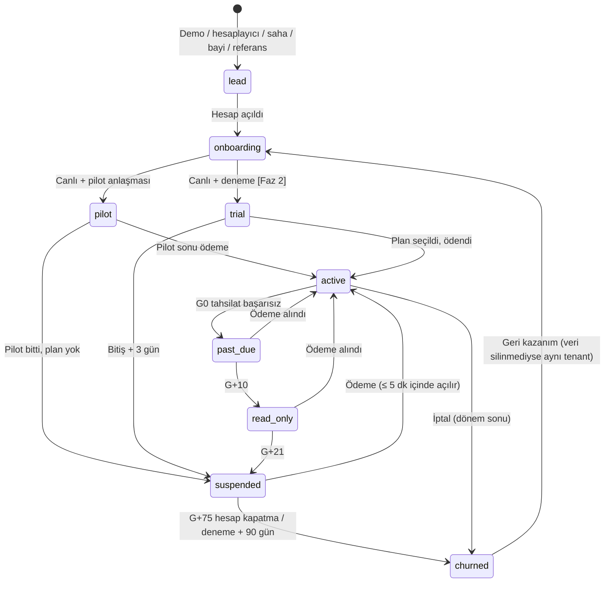
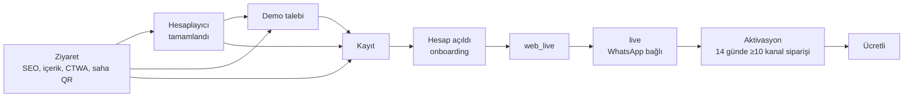

# 05 — Süper Admin Paneli, Bayi Paneli ve Pazarlama Sitesi

> **Amaç:** Platform ekibinin tüm işletmeleri tek yerden izleyip müdahale edebildiği süper admin panelini ("operasyon kulesi"), bayilerin kendi işletmelerini yönettiği bayi panelini ve işletme adayını hesaplayıcıdan aktivasyona taşıyan pazarlama sitesini, geliştiricinin doğrudan uygulayabileceği ayrıntıda tanımlamak.
> **Kapsam:** (A) Süper admin paneli: ilkeler, erişim, rol matrisi, ekranlar, metrik tanımları, runbook bağlantıları, faz kapsamı. (B) Bayi paneli ve referans programı **[Faz 2]**. (C) Pazarlama sitesi: huni, sayfa haritası, sayfa iskeletleri ve metinler, komisyon hesaplayıcı, demo/kayıt akışı, SEO, içerik takvimi, marka tonu, analitik ve çerez uyumu.
> **Kapsam dışı (bağlantı verilir):** paket fiyatları ve hesaplayıcı formüllerinin iş gerekçesi → [01](01-vizyon-pazar-is-modeli.md) · WhatsApp sağlık sinyallerinin teknik kaynağı, şablon metinleri, hata kodları → [02](02-whatsapp-entegrasyonu.md) · storefront ve storefront SEO'su → [03](03-musteri-deneyimi-ve-storefront.md) · işletme paneli ve onboarding sihirbazı ekranları → [04](04-isletme-paneli.md) · kuyruk, gözlemlenebilirlik, kimlik altyapısı → [06](06-teknik-mimari.md) · tablo alanları → [07](07-veri-modeli-ve-api.md) · dunning, fatura, KVKK süreçlerinin hukuki dayanağı → [08](08-mevzuat-kvkk-odeme-fatura.md) · SLO, KPI hedefleri, olay yönetimi → [10](10-riskler-operasyon-ve-metrikler.md).
> **İlgili dokümanlar:** [00 Kararlar ve sözlük](00-kararlar-ve-sozluk.md) (bağlayıcı) · [01](01-vizyon-pazar-is-modeli.md) · [02](02-whatsapp-entegrasyonu.md) · [04](04-isletme-paneli.md) · [06](06-teknik-mimari.md) · [07](07-veri-modeli-ve-api.md) · [08](08-mevzuat-kvkk-odeme-fatura.md) · [10](10-riskler-operasyon-ve-metrikler.md)
> **Kaynaklar:** [arastirma/05-urun-ux.md](arastirma/05-urun-ux.md) §5–6 (ana kaynak); [arastirma/02-pazar-rakipler-is-modeli.md](arastirma/02-pazar-rakipler-is-modeli.md) §7, §9, §10.5–10.6; [arastirma/01-whatsapp-platform.md](arastirma/01-whatsapp-platform.md) §9.7, §10; [arastirma/06-riskler-kirmizi-takim.md](arastirma/06-riskler-kirmizi-takim.md) §5.6, §6, §9.3.
> **Tarih:** 2026-09-24 · **Durum:** Taslak (düzeltme turu sonrası; 00 ile hizalandı)

**Okuma notları**
- **Atıf biçimi:** `A05 §5.2` = arastirma/05 bölüm 5.2 (URL'ler orada); `D01 §6.7` = 01 numaralı plan dokümanı; yalnız `§A.4` = bu doküman. Bağlayıcı kararlar [00-kararlar-ve-sozluk.md](00-kararlar-ve-sozluk.md)'dedir; çelişkide o geçerlidir. **[T]** bizim önerimiz veya tahminimizdir; **(teyit edilmeli)** doğrulanmamış bilgidir.
- Fiyatlar aksi yazılmadıkça **KDV hariçtir** (KDV %20). Kur varsayımı 1 USD ≈ 48,4 TL.
- Rol kısaltmaları: **PO** `platform_owner`, **PA** `platform_admin`, **SA** `support_agent`, **F** `finance`, **SR** `sales_rep`. Bayi rolleri **[Faz 2]**: **RA** `reseller_admin` (bayi yöneticisi), **RT** `reseller_technician` (kurulum teknisyeni) ([00-kararlar-ve-sozluk.md](00-kararlar-ve-sozluk.md) §4).

---

# BÖLÜM A — SÜPER ADMİN PANELİ ("OPERASYON KULESİ")

Admin paneli sıradan bir CRUD ekranı değildir. Üç soruya saniyeler içinde cevap vermelidir: **Şu an sipariş kaçıran işletme var mı? Hangi işletme churn'e gidiyor? Para ve Meta tarafında ne bozuk?** Churn'ün ve destek yükünün ana kaynakları WhatsApp bağlantı sağlığı ve takılan onboarding adımlarıdır (A05 §11.13, A06 R03/R07). Bu yüzden bu iki görünüm ilk günden vardır.

## A.1 İlkeler ve erişim **[Faz 1]**

| # | İlke | Kural |
|---|---|---|
| 1 | **Ayrı alan adı, ayrı kimlik** | `admin.siparisinonunde.com`; ayrı Better Auth örneği (`adminAuth`), ayrı kullanıcı tablosu ve çerez. Platform ve işletme kimlikleri karışmaz ([06](06-teknik-mimari.md) §6.1). Pazarlama sitesinden link verilmez, `noindex`. |
| 2 | **Ağ kısıtı** | Cloudflare Access (şirket kimliği) + IP izin listesi (ofis, şirket VPN). **Yurt dışı IP'lerden erişim kapalıdır:** yurt dışından uzaktan erişim KVKK m.9 anlamında aktarım sayılabilir ([08](08-mevzuat-kvkk-odeme-fatura.md) §2.11). İstisna yalnız PO onaylı, süreli ve kayıtlıdır. |
| 3 | **Zorunlu 2FA** | E-posta + parola + TOTP (yedek kodlar). Oturum 8 saat, 30 dk hareketsizlikte kilit ([06](06-teknik-mimari.md) §6.2). Passkey/WebAuthn **[Faz 2]** seçenek olarak eklenir. |
| 4 | **Taze doğrulama** | Hassas aksiyonlar son 5 dk içinde yeniden TOTP ister: yazma modlu impersonation, askıya alma, kill-switch, rol değişikliği, iade, tenant verisi silme, toplu dışa aktarma. |
| 5 | **En az yetki** | İzinler `resource:action` kümeleridir (§A.3). Varsayılan salt-okunur. DB'de `app_admin` rolü RLS'yi atlamaz; tenant adına yazma yalnız impersonation bağlamında `app_user` ile yapılır ([06](06-teknik-mimari.md) §5.3). |
| 6 | **Her şey audit'li** | Tüm yazmalar ve hassas okumalar (tenant detayı, sipariş listesi, telefon açma, dışa aktarma) `audit_log`'a yazılır: `actor_type` = `admin` veya `admin_impersonation`, gerekçe, önce/sonra (PII maskeli), IP. Audit kaydı yazılamazsa işlem tamamlanmaz (aynı transaction). |
| 7 | **Dört göz** | Tenant verisi silme, platform kullanıcısına PO/PA rolü verme, plan liste fiyatı değişikliği ve eşik üstü iade ikinci bir PO/PA onayı ister. Kill-switch hız gerektirdiği için tek kişiyle değiştirilir (kapatılır veya yeniden açılır), 1 saat içinde ikinci kişi gözden geçirir. |
| 8 | **Sırlar görünmez** | Meta token'ı, PSP anahtarı, App Secret hiçbir rolde düz metin gösterilmez; API yanıtında alan olarak da bulunmaz. Yalnız durum (geçerli, bitiş tarihi) ve "iptal et / yenile" aksiyonu (PO) vardır. (A05 §5.3 "yalnız PO görür" diyordu; daha sıkı kural uygulandı.) |
| 9 | **Son müşteri verisi ihtiyaç kadar** | Son müşteri verisinde biz veri işleyeniz. Admin listelerinde sipariş sayısı ve tutarı görünür; müşteri adı, telefonu, adresi görünmez. Destek için yalnız impersonation içinde, maskeli ve loglu açılır (§A.4 A-09). |

**Kabul kriterleri (erişim)**
- İzin listesi dışındaki IP'den ya da yurt dışı IP'den gelen istek Cloudflare Access'te 403 alır (test).
- TOTP'si olmayan platform kullanıcısı giriş yapamaz. 5 dk'dan eski doğrulamayla hassas aksiyon reddedilir.
- Admin API'nin hiçbir yanıtında token, anahtar veya parola alanı yoktur (sözleşme testi).
- Audit kaydı üretmeyen admin yazma isteği yoktur (CI'da rota başına test).

## A.2 İşletme yaşam döngüsü ve onboarding adımları **[Faz 1]**

### A.2.1 `lifecycle_stage`

`lifecycle_stage` ([00-kararlar-ve-sozluk.md](00-kararlar-ve-sozluk.md) §7) admin görünümüdür ve **elle değiştirilmez**. Abonelik durumu (`subscription.status`), onboarding adımı ve program bayraklarından (`is_pilot`) türetilir; her değişiklik `tenant_lifecycle_events` geçmişine yazılır. Huni ve churn metrikleri bu geçmişten hesaplanır. Admin yalnız aksiyonlarla (deneme uzatma, pilot atama, askıya alma, geri açma) etki eder.

**Abonelik durumu → `lifecycle_stage` eşlemesi** (değer listeleri [00-kararlar-ve-sozluk.md](00-kararlar-ve-sozluk.md) §7 ile birebir): `subscription.status` ∈ {`trialing`, `active`, `past_due`, `read_only`, `suspended`, `cancelled`} sırasıyla `trial`, `active`, `past_due`, `read_only`, `suspended`, `churned` aşamasını verir. `lead` (henüz tenant yok), `onboarding` (canlı kapısı geçilmedi) ve `pilot` (`is_pilot`) abonelik durumundan değil, onboarding adımı ve program bayrağından türetilir.

| Kod | Etiket | Giriş koşulu | Hizmet davranışı |
|---|---|---|---|
| `lead` | Aday | Demo formu, hesaplayıcı, saha ziyareti, bayi, referans. Kayıt `leads` tablosunda; henüz tenant yok | — |
| `onboarding` | Kurulumda | Tenant açıldı; tam canlı kapısı (`live`) geçilmedi | Panel açık. Künye eksikse storefront yayında değil. `web_live` sonrası web siparişi alınır |
| `pilot` | Pilot | `is_pilot` ve pilot süresi dolmadı (3 ay ücretsiz, [00-kararlar-ve-sozluk.md](00-kararlar-ve-sozluk.md) §8) | Tam hizmet |
| `trial` | Deneme | `subscription.status = trialing` ve canlı **[Faz 2]** | Tam hizmet; bitişte 3 gün uyarı bandı |
| `active` | Aktif | `active` | Tam hizmet |
| `past_due` | Ödeme gecikti | G0–G+9 (dunning) | Tam hizmet + panel bandı |
| `read_only` | Salt-okunur | G+10 | Sipariş alma sürer; menü, ayar, personel düzenleme kapalı ([08](08-mevzuat-kvkk-odeme-fatura.md) §6.3) |
| `suspended` | Askıda | G+21 (`suspension_reason = payment`); deneme bitişi + 3 gün uyarı bandı (`trial_ended`); pilot bitişi + 3 gün, plan yok (`pilot_ended`); admin askısı (`policy`, `abuse`, `legal`) | Yeni online sipariş kapalı; storefront ve bot "şu an online sipariş alınmıyor, lütfen arayın". Ödeme veya plan seçimiyle veri aynen geri döner |
| `churned` | Kayıp | Abonelik `cancelled`: iptal (dönem sonu); dunning G+75 hesap kapatma; deneme bitişinde plan seçilmeden 90 gün | Hizmet kapalı. Gönüllü iptalde dönem sonundan itibaren 30 günlük dışa aktarma penceresi; dunning ve deneme bitişinde bu pencere askı süresince işlemiştir (dışa aktarma hakkı hatırlatılır). Ardından veri silme (`retention.tenant_offboarding`, [08](08-mevzuat-kvkk-odeme-fatura.md) §2.8) |

**Türetme önceliği:** `churned` > `suspended` > `read_only` > `past_due` > `onboarding` > `pilot` > `trial` > `active`. Örnek: kurulumu bitmemiş pilot işletme `onboarding` görünür.



- **Dunning takvimi** kanoniktir ([00-kararlar-ve-sozluk.md](00-kararlar-ve-sozluk.md) §9): G (ödeme günü) başarısız → G+1/G+3/G+7 yeniden deneme + e-posta/WhatsApp hatırlatma → **G+10 salt-okunur** (ayar değiştirilemez, sipariş alma sürer) → **G+21 askı** (storefront ve bot "şu an online sipariş alınmıyor, lütfen arayın") → **G+75 hesap kapatma ve veri silme süreci** (dışa aktarma hakkı hatırlatılarak). Bildirim metinleri, salt-okunur modda açık/kapalı işlevler ve sözleşme eki [08](08-mevzuat-kvkk-odeme-fatura.md) §6.3'tedir.
- **Deneme bitişi ([00-kararlar-ve-sozluk.md](00-kararlar-ve-sozluk.md) §9):** 14 gün dolunca (D0) plan seçilmediyse 3 gün uyarı bandı → D+3 askı (sipariş alma durur) → 90 gün içinde plan seçilirse veriler aynen döner → sonra silme. Deneme bitişinde salt-okunur ara aşama yoktur.
- **Pilot bitişi [T]:** Pilot bitiminden 14 gün önce admin'de görev açılır (SR + F). Plan seçilmezse deneme bitişiyle aynı kural (3 gün bant → askı) uygulanır.

### A.2.2 Onboarding adımları (`onboarding_step`)

İki kapılı canlıya geçiş (A06 §5.7; [00-kararlar-ve-sozluk.md](00-kararlar-ve-sozluk.md) §7 Akış B): işletme Meta adımları bitmeden web siparişi alabilir. Adım kodları [04](04-isletme-paneli.md)'teki sihirbazla aynı olmalıdır.

| Sıra | Kod | Tamamlanma koşulu | Kapı |
|---|---|---|---|
| 1 | `account_created` | Owner telefonu OTP ile doğrulandı, sözleşme seti kabul edildi | — |
| 2 | `profile_done` | Künye zorunlu alanları dolu: unvan/ad, adres, telefon, VKN/TCKN ([08](08-mevzuat-kvkk-odeme-fatura.md) §4.7) | — |
| 3 | `menu_done` | ≥ 1 kategori, ≥ 5 ürün; yasaklı ürün taraması temiz | — |
| 4 | `ops_done` | Çalışma saatleri, ≥ 1 teslimat bölgesi, ≥ 1 ödeme yöntemi | — |
| 5 | `web_live` | Storefront yayında; web siparişi WhatsApp'sız modda (SMS OTP doğrulaması) alınabiliyor | **Kapı 1** |
| 6 | `wa_connected` | Embedded Signup tamamlandı, token alındı, webhook aboneliği var | — |
| 7 | `meta_payment_ok` | Test mesajı `delivered` + `pricing` geldi, 131042 yok ([02](02-whatsapp-entegrasyonu.md) §3.7) | — |
| 8 | `wa_test_done` | Gelen "TEST" mesajı görüldü, test siparişi panele sesli düştü ve onaylandı (sipariş `test_kind = onboarding_test`; rapor ve faturalamadan hariç) | — |
| 9 | `live` | [02](02-whatsapp-entegrasyonu.md) §3.8 canlı kapısının tüm engelleyici kontrolleri geçti | **Kapı 2** |

- **Takılan adım [T]:** Canlı olmayan bir işletme aynı adımda 48 saatten uzun kalırsa "takıldı" sayılır. Embedded Signup'ta `CANCEL` + `current_step` olayları da huniye yazılır ([02](02-whatsapp-entegrasyonu.md) §3.8).
- **Aktivasyon** bir adım değil kilometre taşıdır: `live` sonrası ilk 14 günde ≥ 10 kanal siparişi ([00-kararlar-ve-sozluk.md](00-kararlar-ve-sozluk.md) §12; tanım §A.5).

## A.3 Rol × ekran/aksiyon matrisi **[Faz 1]**

Gösterim: **✓** tam · **O** okuma · **K** kısıtlı (not sütununda) · **—** erişim yok. Bayi rolleri (`reseller_admin`, `reseller_technician`) admin paneline giremez; yalnız bayi panelini kullanır (Bölüm B).

| Ekran / aksiyon | PO | PA | SA | F | SR | Not |
|---|---|---|---|---|---|---|
| A-02 Kontrol paneli | ✓ | ✓ | O | O | O | Kartlar role göre süzülür |
| A-03/A-04 İşletme listesi ve detayı | ✓ | ✓ | O | O | K | SR: kendi lead'lerinden dönen ve atanmamış işletmeler |
| Profil/künye düzeltme | ✓ | ✓ | — | — | — | Gerekçe zorunlu; işletmeye bildirim |
| Not ve etiket ekleme | ✓ | ✓ | ✓ | ✓ | ✓ | |
| Pilot atama, deneme uzatma | ✓ | ✓ | — | ✓ | K | SR: tek sefer, en fazla 14 gün [T] |
| Askıya alma (admin askısı) / askıyı kaldırma | ✓ | ✓ | — | K | — | F yalnız ödeme kaynaklı askıyı kaldırır |
| Tenant verisi silme (fesih sonrası erken silme) | ✓ | — | — | — | — | Dört göz |
| A-05 Onboarding hunisi | ✓ | ✓ | ✓ | O | ✓ | |
| A-06 WhatsApp sağlığı: görüntüleme / sağlık kontrolünü yeniden çalıştır | ✓ | ✓ | ✓ | — | O | |
| Tenant gönderimini duraklat/sürdür, şablonları yeniden gönder | ✓ | ✓ | — | — | — | `sending_paused_reason = admin` |
| A-07 Maliyet defteri / rate card ve kur düzenleme | ✓ | ✓ | O | O | — | Rate card satırı değişmez, yenisi eklenir |
| A-08 Plan liste fiyatı tanımı | ✓ | — | — | O | — | Dört göz |
| Abonelik değişikliği, kurucu üye atama, havale eşleştirme, iade, hesap alacağı | ✓ | — | — | ✓ | K | SR yalnız teklif taslağı hazırlar; eşik üstü iade dört göz |
| A-09 Impersonation salt-okunur | ✓ | ✓ | ✓ | — | — | Gerekçe + destek kaydı no |
| Impersonation yazma modu | ✓ | ✓ | K | — | — | SA talep eder, PA onaylar |
| Müşteri telefonunu açma (impersonation içinde) | ✓ | ✓ | K | — | — | SA: gerekçe + destek kaydı; her açma loglu |
| A-10 Destek notları / talepler | ✓ | ✓ | ✓ | O | K | SR yalnız not |
| A-11 DLQ görüntüleme / yeniden işleme / atma | ✓ | ✓ | O | — | — | `wa-inbound` mesaj işini atmak PA + gerekçe |
| A-12 Sistem sağlığı | ✓ | ✓ | O | — | — | |
| A-13 Feature flag / kill-switch | ✓ | ✓ | — | — | — | Kill-switch gerekçeli, taze doğrulamalı |
| A-14 Duyuru yayınlama | ✓ | ✓ | K | — | — | SA taslak hazırlar |
| A-15 Şablon kütüphanesi | ✓ | ✓ | O | — | — | |
| A-16 Kötüye kullanım, içerik kaldırma (5651) | ✓ | ✓ | K | — | — | SA işaretler, PA karar verir |
| A-17 KVKK talepleri | ✓ | ✓ | ✓ | — | — | |
| A-17 Veri ihlali kaydı | ✓ | ✓ | — | — | — | |
| A-18 Audit log | ✓ | O | K | K | — | SA kendi kayıtları; F finans kayıtları |
| A-19 Metrikler | ✓ | O | K | ✓ | K | SA destek metrikleri; SR satış hunisi |
| A-20 Lead yönetimi | ✓ | O | — | O | ✓ | |
| A-21 Platform kullanıcıları ve roller | ✓ | — | — | — | — | PO/PA rolü vermek dört göz |
| A-22 AI menü çıkarma kuyruğu | ✓ | ✓ | ✓ | — | — | |
| A-23 Bayiler, komisyonlar, referanslar **[Faz 2]** | ✓ | ✓ | O | ✓ | O | Komisyon ödemesi yalnız F |
| A-24 İçerik yönetimi **[Faz 2]** | ✓ | ✓ | — | — | K | SR vaka taslağı girer |
| Toplu dışa aktarma (CSV) | ✓ | ✓ | — | ✓ | — | Son müşteri verisi içermez; taze doğrulama |

**Kabul kriteri:** Matris `packages/auth/permissions.ts` içinde tek kaynaktan üretilir. Her hücre için "yetkisiz rol 403 alır" testi CI'da koşar. UI yalnız gizler, karar API'dedir.

## A.4 Ekranlar

### A-01 Giriş ve oturum **[Faz 1]**
- Cloudflare Access → e-posta + parola → TOTP. Başarısız denemeler hesap başına ve IP başına sınırlıdır.
- "Oturumlarım" listesi (cihaz, IP, son etkinlik) ve "tüm oturumları kapat". Platform kullanıcısı işten ayrıldığında A-21'den tek tıkla erişim kapatılır.

### A-02 Kontrol paneli **[Faz 1]**
Tek ekranda "şu an ne bozuk" ve "iş nasıl gidiyor".

| Blok | İçerik | Rol |
|---|---|---|
| Canlı operasyon | Bugünkü kanal siparişi (canlı sayaç, dünün aynı saatine göre %), şu an `new` bekleyen sipariş, 2 dk'yı aşan onaysız sipariş, çevrimdışı panelli açık şube sayısı | PO, PA, SA |
| Alarmlar | Açık P1/P2/P3 ve işletme alarmları; kaynak, süre, sorumlu, runbook linki (§A.6) | PO, PA, SA |
| WhatsApp | Kırmızı/sarı sağlıklı işletme sayısı (131042, 190, kopuk bağlantı, kalite `RED`), tenant sessizliği | PO, PA, SA |
| Onboarding | Takılan işletmeler (adım bazında), bu hafta canlıya geçen, Meta onboarding kotası kullanımı (10/hafta → 200/hafta) | PO, PA, SA, SR |
| Gelir | MRR, bu ay net yeni MRR, ücretli / pilot / deneme işletme sayısı, dunning'deki işletme ve tutar, bugün biten denemeler, kurucu üye sayacı (x/100) | PO, F |
| Uyum | Son tarihi 7 günden az kalan KVKK başvurusu, açık ihlal kaydı, 48 saattir koşmamış saklama işi | PO, PA |
| Kuyruk | DLQ kayıt sayısı, en eski `wa-inbound`/`notify` işi | PO, PA |

**Kabul kriterleri:** Canlı bloklar ≤ 30 sn gecikmeyle güncellenir (SSE). Her kart ilgili listeye süzülmüş olarak açılır. Sayfa p95 < 2 sn [T].

### A-03 İşletmeler listesi **[Faz 1]**
- **Sütunlar:** işletme adı + slug, `lifecycle_stage`, plan, şehir/ilçe, sağlık skoru (renk), onboarding adımı, WhatsApp modu (`cloud`/`coexistence`), son 7 gün kanal siparişi, son sipariş zamanı, pilot/kurucu üye rozeti, satış sorumlusu, bayi **[Faz 2]**.
- **Filtreler:** her sütun; ayrıca "takılan", "dunning'de", "aktivasyon riski" (canlı ≥ 7 gün ve < 5 kanal siparişi [T]) hazır görünümleri.
- **Arama:** ad, slug, VKN, owner telefonu (tam eşleşme; sonuç maskeli).
- **Sağlık skoru (0–100; tanım, ağırlıklar ve bantlar [10](10-riskler-operasyon-ve-metrikler.md) §5.6'da kanoniktir):** günlük hesaplanır (`tenant_health_scores`, son değer `tenants.health_score` / `health_band`, [07](07-veri-modeli-ve-api.md) §3.7). Listede sayı + bant rengi gösterilir: **≥ 75 yeşil · 50–74 sarı · < 50 kırmızı**; 10 §5.6'daki skordan bağımsız kırmızı tetikleyiciler bandı doğrudan kırmızı yapar. Aşağıdaki sinyaller (A06 §9.3 KRI'larından) skorun bileşenlerini besler ve A-04'te "nedenler" olarak gösterilir; ayrı bir renk kuralı değildir:
  - **Kırmızı:** WhatsApp kırmızı (131042, 190, kopuk, kalite `RED`); canlı ≥ 14 gün ve 7 günde < 2 kanal siparişi; `read_only`/`suspended`; son 7 günde ≥ 3 panel çevrimdışı alarmı.
  - **Sarı:** 7 günde < 5 kanal siparişi; son 4 haftanın ortalamasına göre %40'tan fazla düşüş; `new → accepted` p95 > 2 dk; ayda > 3 destek teması; `past_due`; kalite `YELLOW`; canlıya geçişin 8. haftasında kanal payı < %5 [T].
  - **Yeşil:** diğerleri.

### A-04 İşletme detayı (360°) **[Faz 1]**
Destek uzmanının bir işletmenin sorununu tek sayfada teşhis etmesi için.

| Sekme | İçerik |
|---|---|
| **Özet** | Lifecycle ve geçmişi, plan, sağlık skoru ve nedenleri, son 30 gün sipariş grafiği, kanal karması (`wa_link`, `wa_ai`, `wa_reorder`, `web`, `table_qr`, `wa_flow`, `manual`; [00-kararlar-ve-sozluk.md](00-kararlar-ve-sozluk.md) §5), açık alarmlar, son destek notu |
| **Profil** | Künye, VKN, adres, dikey, slug, `food_registration_no`, sözleşme kabul sürümleri, platform WhatsApp uyarı izni |
| **Şubeler** | `ordering_state` (`open`, `busy`, `paused`, `closed`), çalışma saatleri, çevrimiçi panel cihazları, ses kilidi durumu, son nabız |
| **Onboarding** | Adımlar ve zaman damgaları, takılı adım ve süresi, Embedded Signup olayları, concierge görevleri |
| **WhatsApp** | [02](02-whatsapp-entegrasyonu.md) §10.2 sağlık kartı: mod, kalite, messaging limit, görünen ad, token ve bitişi, son gelen/giden webhook, son echo, şablon durumları, duraklatma sebebi |
| **Siparişler** | Son 50 sipariş: no, kanal, durum, tutar, onay süresi, ret/iptal sebebi, mesaj teslim durumu. Müşteri bilgisi maskeli; ayrıntı yalnız impersonation ile |
| **Kullanım ve maliyet** | Bu ay ve önceki aylar: tahmini Meta maliyeti (kategori kırılımı), ücretsiz 1.000 servis mesajı kullanımı, SMS adedi ve **SMS kotası kullanımı** (Esnaf 100, Pro 300, Zincir şube başına 300 SMS/ay; amaç kırılımı: OTP / kritik durum / alarm), platform WABA uyarıları, LLM **[Faz 2]** |
| **Abonelik** | Durum, plan, dönem, indirimler, faturalar, ödemeler, dunning aşaması, hesap alacağı |
| **Kullanıcılar** | Üyeler, roller, 2FA durumu, son giriş. "Owner 2FA sıfırlama" yalnız kimlik doğrulama prosedürüyle (görüntülü veya kayıtlı telefondan arama [T]) ve dört gözle |
| **Destek** | Notlar, etiketler, temas geçmişi (`admin_notes`), görevler (`admin_tasks`); talepler (`support_tickets`) **[Faz 2]** |
| **Zaman çizelgesi** | Lifecycle, onboarding, WhatsApp olayları, abonelik olayları, admin aksiyonları tek akışta |

**Kabul kriterleri:** WhatsApp durumu, son webhook zamanı, çevrimiçi cihaz, son 10 siparişin durumu ve abonelik durumu Özet sekmesinde kaydırmadan görünür. Siparişler sekmesinde hiçbir API yanıtı tam telefon veya adres içermez (sözleşme testi).

### A-05 Onboarding hunisi **[Faz 1]**
- Adım bazlı huni (§A.2.2): adımdaki işletme sayısı, bir sonrakine geçiş oranı, medyan süre, "takılan" sayısı. Zaman aralığı, kanal (saha, self-servis, bayi), satış sorumlusu ve dikey filtreleri.
- **Embedded Signup alt hunisi:** başladı → `FINISH` → token takası → webhook aboneliği → test mesajı → ödeme OK. `CANCEL` olaylarının `current_step` dağılımı. ES terki > %30 erken uyarıdır (A06 R03).
- **Aksiyonlar:** "Ara" görevi oluştur (sorumlu + tarih), "Biz kuralım" randevusu, işletmeye rehber gönder (e-posta; WhatsApp yalnız owner'ın uyarı izni varsa).
- **Kabul kriteri:** Takılan her işletme için açık bir görev veya "görev gereksiz" gerekçesi bulunur. Görevsiz takılı işletme sayısı kontrol panelinde kırmızı görünür.

### A-06 WhatsApp sağlık tablosu **[Faz 1]**
Tüm numaralar; kırmızılar üstte (A05 §5.5). Sinyallerin kaynağı ve eşikleri [02](02-whatsapp-entegrasyonu.md) §7.8, §9.4, §10.

| Sütun | Değerler | Kırmızı / sarı |
|---|---|---|
| İşletme / şube / numara | Numara maskeli | — |
| Mod | `cloud` / `coexistence` | — |
| Kalite | `GREEN` / `YELLOW` / `RED` | `RED` kırmızı, `YELLOW` sarı |
| Messaging limit | 250 / 2.000 / 10.000 / 100.000 / sınırsız (portföy seviyesi) | — |
| Görünen ad | `APPROVED` / `PENDING_REVIEW` / `DECLINED` | `DECLINED` kırmızı |
| Meta ödeme yöntemi | OK / **131042** | 131042 kırmızı |
| Token | Geçerli, bitiş tarihi / **190** | 190 kırmızı; bitişe < 7 gün sarı |
| Coexistence | Son echo (gün önce) | > 10 gün sarı (14 gün kuralı) |
| Son gelen webhook / son `delivered` | Zaman | Tenant sessizliği alarmı sarı |
| Şablonlar | `APPROVED` / toplam; `REJECTED`, `PAUSED`, kategori değişimi | Herhangi biri sarı |
| Gönderim | Aktif / duraklatıldı (`token_invalid`, `payment_missing`, `disconnected`, `subscription_suspended`, `admin`) | Duraklatma kırmızı |
| Bu ay tahmini Meta maliyeti | TL (USD) | Anomali sarı (A-07) |

- **Aksiyonlar:** sağlık kontrolünü yeniden çalıştır (`debug_token`, `subscribed_apps`, test gönderimi), şablonları yeniden gönder, gönderimi duraklat/sürdür (PA), işletmeye "Yeniden bağlan" veya "Meta'ya kart ekle" rehberini gönder, impersonation başlat.
- **Sahipsiz numaralar:** tenant'a çözülemeyen `phone_number_id` (`orphan`) ve ikinci bir tenant'a bağlanmaya çalışılan numara ayrı listede ve kırmızıdır ([06](06-teknik-mimari.md) §5.2).

**Kabul kriterleri:** 131042 veya 190 ile düşen ilk gönderimden sonra ≤ 1 dk içinde satır kırmızıya döner. "Sağlık kontrolünü yeniden çalıştır" ≤ 60 sn içinde sonuç verir. Tablo yalnız kırmızıları gösteren tek tıklık görünüme sahiptir.

### A-07 Meta maliyet defteri, rate card ve kur **[Faz 1]**
- **Defter:** `wa_message_costs` verisinden tenant × ay × kategori (`service`, `utility`, `marketing`, `authentication`) tahmini maliyet, ücretli/ücretsiz ayrımı (`free_customer_service`, `free_entry_point`, ayın ilk 1.000 servis mesajı). Kaynak, işletme panelindeki "bu ay Meta'ya tahmini ödeme" ile aynıdır; iki ekran farklı sayı göstermez.
- **Uyarı metni:** "Tahmindir; kesin tutar işletmenin Meta faturasındadır. Meta ücreti işletmenin kendi hesabından çekilir."
- **Anomali [T]:** Bir tenant'ın günlük tahmini maliyeti son 4 haftanın aynı gün ortalamasının 3 katını ve 1 $'ı aşarsa sarı işaret ve A-16 kaydı (token kötüye kullanımı veya izinsiz toplu gönderim şüphesi, A06 §6.6).
- **Rate card yönetimi:** `wa_rate_cards` satırları değişmez; yeni satır ileri tarihli `effective_from` ile eklenir ve kaynak alanı zorunludur (Meta rate card CSV'si). Geçmiş defter satırları kendi `rate_card_id`'lerini korur. Güncel TR değerleri: service/utility/authentication ≈ $0,0009, marketing ≈ $0,0109 (teyit edilmeli, [02](02-whatsapp-entegrasyonu.md) §4.2).
- **Kur:** `fx_rates` günlük TCMB işi; son güncelleme 26 saati geçerse sarı.
- **Bizim maliyetlerimiz** (`tenant_usage_daily`): platform WABA uyarı şablonları, SMS, LLM **[Faz 2]**; tenant ve paket bazında. Paketleme ve adil kullanım kararları bu veriye dayanır ([06](06-teknik-mimari.md) §17).
- **SMS kotası ([00-kararlar-ve-sozluk.md](00-kararlar-ve-sozluk.md) §4):** SMS OTP ve kritik durum SMS'leri platform maliyetidir; aboneliğe adil kullanım kotasıyla dahildir: **Esnaf 100, Pro 300, Zincir şube başına 300 SMS/ay**. Kota aşımında işletme panelde ve e-postayla uyarılır (sipariş doğrulaması durmasın diye gönderim kesilmez [T]); aşım listesi bu ekranda görünür. Ek SMS paketi **[Faz 2]**. Kısa sürede olağandışı SMS artışı (SMS pompalama şüphesi) A-16'ya düşer [T].

### A-08 Abonelikler, faturalar, tahsilat ve dunning **[Faz 1 manuel · Faz 2 otomatik]**
**[Faz 1] (pilot, tahsilat motoru yok, [08](08-mevzuat-kvkk-odeme-fatura.md) §6.1):**
- Abonelik kaydı: plan, `is_pilot`, pilot bitiş tarihi, kurucu üye bayrağı ve sırası (`founding_seq`, ilk 100), indirim oranı ve bitişi.
- Pilot bitiş takvimi (14 gün kala görev), kurucu üye sayacı.
- İlk ücretli işletme Faz 2 motorundan önce gelirse manuel akış: havale kaydı (referans kodu `SO-2026-000123` biçimi) + Paraşüt web arayüzünde kesilen faturanın numarasının girilmesi.

**[Faz 2] (ticari lansman):**
- **Faturalar:** durum (`draft`, `issued`, `paid`, `void`, `refunded`), e-Fatura/e-Arşiv durumu (`pending`, `sent`, `formalized`, `failed`), PDF. **e-fatura hata kuyruğu** (VKN hatası, Paraşüt kesintisi) ve yeniden deneme.
- **Dunning panosu:** aşama sütunları [00-kararlar-ve-sozluk.md](00-kararlar-ve-sozluk.md) §9 takvimiyle birebir (G0, G+1, G+3, G+7 yeniden denemeler, G+10 salt-okunur, G+21 askı, G+75 hesap kapatma ve silme süreci), her işletmenin sonraki otomatik adımı ve tarihi, "bugün aranacaklar" listesi (G+7'de F'ye arama görevi, [08](08-mevzuat-kvkk-odeme-fatura.md) §6.3), "ödeme sözü" notu.
- **Aksiyonlar (F):** havale eşleştirme (referans kodu araması), "ödendi" işaretleme (hizmet ≤ 5 dk içinde normale döner), ek süre verme (en fazla 7 gün [T], gerekçeli, tek sefer), plan değişikliği (yükseltmede kıst fark, düşürmede hesap alacağı), iade (eşik üstü dört göz), deneme uzatma, kurucu üye atama.
- **Sözleşme uyumu:** güncel abonelik sözleşmesi sürümünü kabul etmemiş owner listesi.

**Kabul kriterleri:** Dunning geçişleri konfigürasyondaki takvimle ve sözleşme ekindeki tabloyla birebir aynıdır. Elle yapılan her müdahale (ek süre, ödendi, iade) gerekçesiyle `audit_log`'dadır. Başarılı ödemeden sonra ≤ 15 dk içinde resmi fatura görünür ([08](08-mevzuat-kvkk-odeme-fatura.md) §6.5).

### A-09 Impersonation (destek erişimi) **[Faz 1]**
Kurallar [06](06-teknik-mimari.md) §6.7 ile aynıdır; UI ve süreç burada.

| Kural | Ayrıntı |
|---|---|
| Başlatma | Tenant, **gerekçe** (en az 20 karakter), destek notu/kaydı no, mod ve süre zorunlu |
| Mod | Varsayılan **salt-okunur**. Yazma modu: SA talep eder, PA onaylar (PA ve PO kendi gerekçesiyle başlatabilir); taze doğrulama |
| Süre | **En fazla 30 dk** ([00-kararlar-ve-sozluk.md](00-kararlar-ve-sozluk.md) §4; [07](07-veri-modeli-ve-api.md) `impersonation_sessions.expires_at`). Uzatma yoktur; ihtiyaç sürerse yeni gerekçeyle yeni oturum açılır (yeni audit kaydı ve işletmeye yeni bildirim) |
| İşletmeye görünürlük | Panelde kırmızı üst bant: **"Destek ekibi hesabınızı görüntülüyor (Can, 14.05–14.35)"**. Başlangıçta owner'a e-posta ve panel bildirimi. Owner kendi audit ekranında kaydı görür |
| PII | Müşteri telefonu ve adresi maskeli. "Telefonu göster" ayrı aksiyondur; gerekçe ister, her açma loglanır |
| Yasak işlemler | Abonelik ve ödeme işlemleri, WhatsApp bağlantısını değiştirme (Embedded Signup), kullanıcı/rol değişikliği, parola/2FA, müşteri dışa aktarma veya silme, toplu işlemler |
| Kayıt | Her istek `audit_log`'a `actor_type = admin_impersonation`, `actor_platform_user_id` (impersonation yapan platform kullanıcısı) ile yazılır; oturum `impersonation_sessions` tablosunda tutulur ([07](07-veri-modeli-ve-api.md) §3.7) |

- **[Faz 2] "Onaylı erişim" ayarı:** Owner isterse destek erişimini "her seferinde onayımı iste" yapar; talep panelde ve e-postayla onaylanır. P1 (sipariş alamıyorum) durumunda salt-okunur erişim onaysız açılabilir; bu istisna DPA'da yazılır (teyit edilmeli).

**Kabul kriterleri:** Süre dolunca oturum sunucu tarafında kapanır (istemci yenilemesiyle uzamaz). Salt-okunur modda hiçbir yazma rotası 2xx dönmez (test). Yasak işlemler yazma modunda da 403 döner. Bant ve owner bildirimi olmadan oturum başlamaz.

### A-10 Destek **[Faz 1 basit · Faz 2 tam]**
**[Faz 1]:**
- İşletme detayında **not + etiket + temas kaydı** (`admin_notes`; `kind` = `note` / `contact`) ve görevler (`admin_tasks`) ([00-kararlar-ve-sozluk.md](00-kararlar-ve-sozluk.md) §7 "Destek kayıtları"; [07](07-veri-modeli-ve-api.md) §3.7). **Etiket sözlüğü tektir ve İngilizce snake_case'tir** (tek kaynak `packages/core/support-tags.ts`; [10](10-riskler-operasyon-ve-metrikler.md) §5.3 aynı değerleri kullanır):
  - Temas kanalı (`contact_channel`): `p1_line`, `whatsapp`, `panel_form`, `email`, `visit`.
  - Konu (`tags`): `order_not_received`, `sound_alarm`, `device_network`, `wa_connect`, `meta_payment`, `coexistence`, `template_quality`, `menu_pricing`, `zone_fee`, `courier`, `printer`, `status_message`, `fake_order`, `billing`, `kvkk`, `training`, `feature_request`, `bug`.
  - Kök neden (`root_cause`): `product_bug`, `usage_knowledge`, `device_network`, `meta`, `third_party`, `infrastructure`, `tenant_config`.
  - Önlenebilir mi (`preventable`): `yes_product`, `yes_training`, `no`.
  - Öncelik etiket değil, ayrı alandır (`priority`: `p1`–`p4`).
- **Destek WhatsApp hattı = platform WhatsApp numarası** ([00-kararlar-ve-sozluk.md](00-kararlar-ve-sozluk.md) §4 "Destek hattı ve P1"): uyarı şablonlarını gönderen aynı platform WABA'dır ([02](02-whatsapp-entegrasyonu.md) §5.3). İşletmelerden gelen mesajlar ve işletme sahibinin uyarı şablonlarına verdiği yanıtlar admin panelindeki **destek gelen kutusuna** düşer; bu kutu işletme panelindeki gelen kutusunun aynı konuşma motorunu kullanır (platform kendi "platform" tenant'ıdır). Her konuşma işletmeye bağlanır ve temas `admin_notes` (`kind = contact`, `contact_channel = whatsapp`) olarak kaydedilir.
- **Harici helpdesk aracı kullanılmaz** ([00-kararlar-ve-sozluk.md](00-kararlar-ve-sozluk.md) §7): yurt dışı alt işleyen (m.9) ve maliyet getirir; destek aracına son müşteri verisi aktarılmaz ([08](08-mevzuat-kvkk-odeme-fatura.md) §2.11).
- **P1** = "sipariş alamıyorum / panel çalışmıyor". P1 hattı ([00-kararlar-ve-sozluk.md](00-kararlar-ve-sozluk.md) §4, §11): pilot boyunca her gün 10:00–02:00 canlı yanıt; gece (02:00–10:00) sesli mesaj + nöbetçiye bildirim ve en geç 30 dk içinde geri dönüş; nöbetçiler kuruculardır ([10](10-riskler-operasyon-ve-metrikler.md) §5.1, §5.9; A06 §5.6). Diğer her şey mesai saatinde.
- Haftalık rapor: en sık 5 etiket; her sprintte bir ürün iyileştirmesine dönüşür (A06 §5.6).

**[Faz 2]:**
- `support_tickets` tabanlı talep sistemi: durum, öncelik, atanan, SLA sayacı, hazır cevaplar. Etiketler Faz 1 sözlüğüyle aynıdır; Faz 1'deki `admin_notes` temas kayıtları talep geçmişine bağlanır.
- **Paket bazında SLA** ([01](01-vizyon-pazar-is-modeli.md) §6.3): Esnaf panel içi yardım + WhatsApp hattı; Pro akşam yoğun saatlerinde canlı destek; Zincir öncelikli yanıt ve atanmış hesap sorumlusu. Süre hedefleri [10](10-riskler-operasyon-ve-metrikler.md)'da.
- Destek gelen kutusu (Faz 1'den beri platform WhatsApp numarası, ürünün gelen kutusu bileşeniyle) talep sistemine bağlanır: konuşmadan tek tıkla talep açılır.
- Bayi 1. seviye destek eskalasyonları (Bölüm B) aynı kuyruğa düşer.

**Kabul kriteri (Faz 1):** Her destek teması işletme zaman çizelgesinde en az bir etiketle görünür. "İşletme başına aylık temas" metriği bu kayıtlardan hesaplanır (KRI > 3, A06 §9.3).

### A-11 Kuyruklar ve DLQ **[Faz 1]**
- Kanonik kuyruklar (`wa-inbound`, `wa-outbound`, `wa-media`, `notify`, `llm`, `print`, `images`, `cron`): derinlik, en eski iş yaşı, işlem hızı, başarısız (DLQ) sayısı.
- **DLQ listesi:** kuyruk, iş tipi, tenant, hata, deneme sayısı, maskeli yük. Aksiyonlar: **yeniden işle** (idempotent), filtreyle toplu yeniden işle, **at** (gerekçeli; `wa-inbound` mesaj işi için PA).
- **Webhook replay:** ham olay tablosundan ID veya zaman aralığıyla yeniden işleme ([02](02-whatsapp-entegrasyonu.md) §11). PO/PA; taze doğrulama.
- **Outbox:** en eski bekleyen kayıt, tenant bazında duraklatılmış gönderimler.

**Kabul kriterleri:** Aynı DLQ işi iki kez yeniden işlendiğinde yan etki tekrarlanmaz (test). `wa-inbound` DLQ'suna düşen `message` işi A-02'de P2 olarak görünür ([06](06-teknik-mimari.md) §8.4).

### A-12 Sistem sağlığı **[Faz 1]**
- Mühendislik ayrıntısı Grafana'dadır. Admin ekranı özet ve bağlantı sunar:
  - SLO kutuları: aylık erişilebilirlik, webhook→panel p95, ingress p99, kaçırılan sipariş, hata bütçesi tüketimi ([06](06-teknik-mimari.md) §14.5).
  - Sentetik canary gecikmesi, platform geneli son webhook, SSE bağlantıları ve çevrimiçi cihazlar.
  - Yedek yaşı, son geri yükleme tatbikatı, disk.
  - Açık alarmlar (P1/P2/P3).
  - Meta, Anthropic, Cloudflare durum sayfası bağlantıları.
- **Deploy yasağı göstergesi:** Cuma 17:00–23:00 ve ilan edilmiş maç/iftar akşamlarında kırmızı "deploy yok" bandı (A06 §5.5).
- **[Faz 2]** Olay kaydı açma → `status.siparisinonunde.com` yayını + panel duyurusu (A-14) tek akışta.

### A-13 Feature flag ve kill-switch **[Faz 1]**
- **Flag'ler** ([06](06-teknik-mimari.md) §16.6): anahtar, açıklama, sahibi, kural (plan, yüzde, tenant listesi), tenant override (gerekçe + bitiş tarihi), `expires_at` geçmiş flag uyarısı. **Paket hakları flag değildir**; `plan_features` üzerinden yönetilir.
- **Kill-switch'ler (kanonik liste, [00-kararlar-ve-sozluk.md](00-kararlar-ve-sozluk.md) §4; yenisi önce 00'a eklenir):**

| Anahtar | Kapsam | Etki | Faz |
|---|---|---|---|
| `signup_open` | Platform | Kapatılınca kayıt formu "bekleme listesi" moduna geçer (örn. Meta onboarding kotası dolunca, sahte kayıt dalgasında) | 1 |
| `wa_onboarding` | Platform | Kapatılınca yeni Embedded Signup başlatılamaz; mevcut bağlantılar etkilenmez. İşletme web siparişiyle (Kapı 1) devam eder | 1 |
| `sms_fallback` | Platform | SMS yedeğinin ana anahtarı (varsayılan açık). **Kapatılırsa SMS yedeği tamamen durur** (ör. SMS pompalama saldırısı, SMS sağlayıcısı arızası): SMS OTP ve kritik durum SMS'leri gitmez, Akış B yalnız WhatsApp ile çalışır; WhatsApp'ı bağlı olmayan işletmede storefront "lütfen arayın" gösterir ([02](02-whatsapp-entegrasyonu.md) §6.11, [03](03-musteri-deneyimi-ve-storefront.md) §3.2.1). "WhatsApp'sız mod"un kendisi bu anahtar değildir: tenant bazında otomatik devreye girer (bağlantı yok, token 190, ödeme 131042) ya da Meta kesintisinde olay kaydından (A-12, [10](10-riskler-operasyon-ve-metrikler.md) §6.2) toplu açılır | 1 |
| `ordering_enabled` | Tenant bazında | Kapatılınca o işletmenin storefront'u ve botu "şu an online sipariş alınmıyor, lütfen arayın" moduna geçer; `lifecycle_stage` değişmez (olay, kötüye kullanım, hukuki talep) | 1 |
| `llm_parsing` | Platform | AI serbest metin ayrıştırmayı (Akış C) kapatır; müşteri menü linki akışına düşer. LLM devre kesicisi bunu otomatik kapatabilir | 2 |
| `campaigns_global` | Platform | Tüm kampanya/toplu mesaj gönderimlerini durdurur (kalite düşüşü, İYS sorgusu arızası) | 2 |

- **Kill-switch'ler varsayılan açıktır; kapatmak ilgili yeteneği durdurur** ([00-kararlar-ve-sozluk.md](00-kararlar-ve-sozluk.md) §4).
- Bot, otomatik yazdırma, platform WABA uyarıları gibi diğer operasyonel anahtarlar kill-switch değil, normal feature flag'dir (yukarıdaki flag kuralları geçerli).
- **Kill-switch arayüzü:** ayrı sekmede büyük anahtarlar. Kapatmadan önce etki özeti gösterilir ("412 işletmede AI sipariş kapanacak, menü linki akışına düşülecek"). Gerekçe zorunlu, taze doğrulama, her değişiklikte ekip kanalına otomatik bildirim, kapatıldıktan 1 saat sonra "hâlâ kapalı kalmalı mı?" hatırlatması.

**Kabul kriterleri:** Kill-switch değişikliği ≤ 60 sn içinde tüm süreçlerde etkili olur (30 sn cache + yayılma). Her değişiklik önce/sonra değeriyle `audit_log`'dadır. LLM devre kesicisi `llm_parsing`'i otomatik kapattığında bu da aynı ekranda "sistem tarafından" etiketiyle görünür.

### A-14 Duyurular **[Faz 1 banner · Faz 2 tam]**
- **[Faz 1]** Panel içi banner: başlık, metin, önem (`info`, `warning`, `critical`), hedef kitle (tümü, plan, tenant listesi, rol), başlangıç ve bitiş. Bakım bildirimi şablonu. Okunma oranı.
- **[Faz 2]** Sürüm notları sayfası, e-posta gönderimi, durum sayfasıyla bağlantı. WhatsApp'tan duyuru yalnız kritik kesinti için ve utility şablon onaylıysa gönderilir (teyit edilmeli); tanıtım amaçlı duyuru WhatsApp'tan gitmez.
- **Kabul kriterleri:** `critical` banner bitiş zamanına kadar kapatılamaz. Yayından önce hedef kitle önizlemesi gösterilir ("X işletme, Y kullanıcı").

### A-15 Global şablon kütüphanesi **[Faz 1]**
- **Ana set:** işletme WABA'larına gönderilen `siparis_*` utility şablonları ve platform WABA'sının `isletme_*`, `abonelik_*`, `deneme_*` şablonları ([02](02-whatsapp-entegrasyonu.md) §5.2–5.3). Sürüm, kategori, dil (`tr`), gövde, butonlar.
- **Yayın öncesi denetim:** karakter sınırları (reply buton ≤ 20, liste satırı ≤ 24 vb., A05 §7.7) ve **promosyon denetimi** (indirim, kampanya, kupon ifadeleri engellenir, [08](08-mevzuat-kvkk-odeme-fatura.md) §3.2.1).
- **Dağıtım matrisi:** tenant × şablon durumu (`PENDING`, `APPROVED`, `REJECTED`, `PAUSED`, `DISABLED`). Yeni sürüm kademeli dağıtılır (%10 → %100 [T]). "Tüm tenant'larda yeniden senkronize et" aksiyonu vardır.
- **Alarmlar:** `REJECTED` (birden çok tenant'ta ise metin sorunu), `template_category_update` (utility → marketing), `PAUSED`, kalite düşüşü ([02](02-whatsapp-entegrasyonu.md) §5.4).
- **Kabul kriteri:** Kategorisi marketing'e dönen şablonla hiçbir durum bildirimi gönderilmez ve şablon matriste kırmızı görünür.

### A-16 Kötüye kullanım, sahte sipariş ve içerik kaldırma **[Faz 1 temel · Faz 2 pano]**

| Sinyal | Kaynak | Aksiyon | Faz |
|---|---|---|---|
| Yasaklı ürün şüphesi | Menüde anahtar kelime taraması (alkol, tütün/nargile, ilaç, tüp) ve `wa_restricted` bayrağı eksikliği | İşletmeye düzeltme bildirimi; ürün WhatsApp akışından gizlenir; tekrarında admin askısı (`policy`) | 1 |
| Sahte işletme / taklit | Aynı adla çok kayıt, künye tutarsızlığı, marka taklidi | Faz 1'de kayıtlar zaten onaylı (§C.5); şüphede storefront yayından alınır | 1 |
| Sahte sipariş örüntüsü | IP başına açık `awaiting_customer`, aynı IP/ASN'den çok tenant'a sipariş, `suspected_fake` iptal oranı ([06](06-teknik-mimari.md) §15.5) | IP/ASN kötüye kullanım listesi (kısa saklama; platform geneli müşteri profili **tutulmaz**) | 1 |
| Kalite düşüşü / engellenme artışı | `phone_number_quality_update`, 131048, 131049 artışı | İşletmeyle görüşme; `RED`'de kampanya kilidi ([02](02-whatsapp-entegrasyonu.md) §9.4) | 1 |
| Olağandışı gönderim hacmi | A-07 anomali, outbox patlaması | Tenant gönderimini duraklat, token'ı iptal et/yenile runbook'u | 1 |
| Olağandışı kampanya hacmi | Kampanya modülü | Manuel onaya düşürme | 2 |
| İçerik bildirimi (5651) | Sitedeki içerik bildirim formu | Kayıt → inceleme → "yayından kaldır" / "geri yükle"; işletmeye bildirim; karar gerekçesi | 1 |

**Kabul kriteri:** İçerik kaldırma aksiyonu ürünü veya storefront'u ≤ 5 dk içinde yayından alır; kayıt, bildiren, karar ve süre `audit_log`'dadır.

### A-17 KVKK ve uyum **[Faz 1]**
| Alt ekran | İçerik |
|---|---|
| **İlgili kişi talepleri** | Bizim veri sorumlusu olduğumuz veriler (işletme yetkilisi, personel hesabı, site ziyaretçisi, lead) için talep kaydı ve 30 gün sayacı. **Son müşteri talebi** bize gelirse SA başvurucuya işletmenin iletişim bilgisini verir ve talebi **2 iş günü** içinde işletmeye iletir ([08](08-mevzuat-kvkk-odeme-fatura.md) §2.10). Son tarihe 7 gün kala uyarı |
| **Veri ihlali kayıtları** | Olay: tespit zamanı, sınıflandırma, etkilenen tenant'lar, veri kategorileri, tahmini kişi sayısı. **T+24 sa** işletme bildirimi ve **T+72 sa** Kurul bildirimi için geri sayım, kök neden, kapanış raporu ([08](08-mevzuat-kvkk-odeme-fatura.md) §2.9). Tenant bazlı etki raporu audit ve erişim loglarından üretilir |
| **Saklama işleri** | `retention.*` işlerinin son koşusu, silinen/anonimleşen kayıt sayısı, hata. 48 saattir koşmamış iş alarmdır |
| **Alt işleyen envanteri** | Ülke, veri kategorisi, m.9 dayanağı, sözleşme ve bildirim tarihi; kamuya açık alt işleyen sayfasının kaynağı |
| **Yasal belge sürümleri** | `legal_documents` yayınlama (PO), kabul istatistikleri, yeniden kabul gerektiren sürüm |

### A-18 Audit log **[Faz 1]**
- Filtreler: aktör, tenant, aksiyon, zaman, `admin_impersonation`, gerekçe metni. Önce/sonra farkı (PII maskeli).
- Değiştirilemez (append-only), 2 yıl saklanır ([08](08-mevzuat-kvkk-odeme-fatura.md) §2.8). Dışa aktarma yalnız PO ve kendisi de loglanır.
- Hassas okuma kayıtları (kim hangi tenant detayını, hangi telefonu açtı) ayrı sekmede.

### A-19 Metrikler **[Faz 1 temel · Faz 2 tam]**
- **[Faz 1]:** §A.5'teki tanımlarla MRR, işletme sayıları, aktivasyon, kanal siparişi, onay süresi, kaçırılan sipariş, panel DAU, Meta/SMS maliyetleri, onboarding hunisi, satış hunisi (A-20). Günlük toplama (`report-daily-rollup`) + canlı sayaçlar.
- **[Faz 2]:** kohort (canlıya geçiş ayına göre elde tutma), gelir churn ve net gelir churn, LLM maliyeti, NPS, bayi ve referans kanalı performansı, CAC ve geri ödeme süresi (pazarlama/satış gideri elle girilir).

### A-20 Satış ve lead yönetimi **[Faz 1 basit CRM]**
**Karar:** Faz 1'de harici CRM kullanılmaz; admin içinde basit lead listesi yapılır [T]. Gerekçe: (1) lead → tenant dönüşümü ve huni tek veri kaynağında kalır, (2) veri Türkiye'de kalır, yeni yurt dışı alt işleyen ve m.9 yükü doğmaz, (3) pilot ölçeğinde ihtiyaç basittir. Satış ekibi 3 kişiyi aşarsa **[Faz 2]** harici CRM, KVKK standart sözleşmesiyle yeniden değerlendirilir.

| Alan / işlev | Ayrıntı |
|---|---|
| Kaynak | `demo_form`, `calculator`, `field` (saha), `reseller`, `referral`, `chamber` (esnaf odası), `event`, `inbound_call`; UTM ve giriş sayfası |
| İşletme bilgisi | Ad, işletme adı, WhatsApp telefonu, il/ilçe, işletme türü, günlük paket sipariş aralığı, kullandığı pazaryerleri, hesaplayıcı sonucu (girdiler ve çıktı anlık görüntüsü) |
| Aşama | `new` → `contacted` → `demo_scheduled` → `demo_done` → `proposal` → `won` (tenant'a bağlanır) / `lost` (sebep: fiyat, "zaten WhatsApp'tan alıyorum", zamanlama, ulaşılamadı, uygun değil, Commerce Policy) |
| Sahiplik | `sales_rep`; yeni lead ilçe eşleşmesiyle sırayla dağıtılır; sonraki adım + tarih zorunlu |
| İletişim izinleri | WhatsApp opt-in (Meta), ret kaydı (B2B ret hakkı, [08](08-mevzuat-kvkk-odeme-fatura.md) §3.7) |
| Tekrar kontrolü | Aynı telefon veya VKN ile açık lead/tenant varsa uyarı |
| Saha ziyareti | Mobil uyumlu hızlı kayıt: işletme, görüşülen kişi, itiraz, sonraki adım |
| Saklama | 12 ay hareketsizlikte silinir (`retention.leads`, [08](08-mevzuat-kvkk-odeme-fatura.md) §2.8) |

**Kabul kriterleri:** Demo formu ve hesaplayıcı lead'i ≤ 1 dk içinde listede `new` olarak görünür ve bir SR'ye atanır. `won` aşaması yalnız bir tenant'a bağlanarak kapanır; aynı kimlik lifecycle geçmişinde `lead → onboarding` olarak görünür.

### A-21 Platform kullanıcıları ve roller **[Faz 1]**
- Davet (e-posta), rol atama, 2FA durumu, son giriş, oturumları sonlandırma, erişimi kapatma.
- İşten ayrılma kontrol listesi: oturum iptali, Cloudflare Access'ten çıkarma, açık impersonation'ların kapatılması, atanmış lead ve görevlerin devri.
- **Üç ayda bir erişim gözden geçirmesi [T]:** PO, rollerin hâlâ gerekli olduğunu onaylar; kayıt `audit_log`'a düşer.

### A-22 AI menü çıkarma kuyruğu (concierge iç aracı) **[Faz 1]**
- Menü fotoğrafı/PDF yükleme → Sonnet 5 vision ile taslak (kategori, ürün, seçenek grupları, fiyat) → ekip incelemesi → tenant'a **taslak menü** olarak aktarım. Owner panelde "Menüyü yayınla" ile onaylar. **Fiyatlar her zaman insan onayından geçer** ([00-kararlar-ve-sozluk.md](00-kararlar-ve-sozluk.md) §10).
- Kuyruk: yükleme zamanı, sorumlu, durum, düzeltme sayısı. Hata tipleri Faz 2 self-servis için etiketlenir (A05 §11.12). Menü görselleri kişisel veri değildir; yine de yalnız menü içeren dosya kabul edilir.

### A-23 Bayiler, komisyonlar ve referanslar **[Faz 2]**
- Bayi hesabı: unvan, VKN, sözleşme sürümü, komisyon modeli ve oranı (`commission_bp`), durum, bayi kullanıcıları.
- Tenant ↔ bayi ataması ve değişikliği (PO/F; gerekçe ve işletme talebi kaydı).
- Komisyon tahakkuk listesi, bayi faturası eşleştirme, ödeme (F), mahsup (clawback).
- Bayi performansı: getirilen işletme, 90. günde aktif kalma oranı, destek eskalasyonu sayısı.
- Referans kayıtları ve ödül durumu (§B.6).

### A-24 İçerik yönetimi (pazarlama sitesi) **[Faz 2]**
- Faz 1'de içerik repo içinde MDX'tir. Faz 2'de blog, vaka, SSS ve şehir sayfaları için başlıksız (headless) CMS kullanılır; yerli barındırılan veya self-host bir araç tercih edilir [T].
- **Şehir sayfası yayın kapısı:** §C.6.3 kriterleri karşılanmadan "Yayınla" düğmesi pasiftir.
- Vaka çalışmasında işletmenin yazılı izin belgesi yüklenmeden yayın yapılamaz.

## A.5 Metrik tanımları **[Faz 1]**

KPI hedefleri ve eşikler [10](10-riskler-operasyon-ve-metrikler.md)'dadır; burada hesap kuralı tanımlanır. Tüm tutarlar KDV hariçtir.

| Metrik | Tanım |
|---|---|
| **MRR** | `active`, `past_due` ve `read_only` aboneliklerin aylık normalize net tutarı: yıllık plan ÷ 12, indirimler (kurucu üye dahil) düşülmüş. `trialing`, pilot ve `suspended` hariç |
| **Risk altındaki MRR** | `past_due` + `read_only` aboneliklerin MRR'ı; ayrıca `suspended` olanların son MRR'ı |
| **Net yeni MRR** | Yeni + genişleme (plan yükseltme, şube ekleme) + yeniden kazanım − daralma (plan düşürme) − churn MRR |
| **Logo churn (aylık)** | Ay içinde `churned` olan ücretli işletme ÷ ay başındaki ücretli işletme. Pilot ve deneme hariç (ayrı izlenir: deneme → ücretli dönüşüm) |
| **Gelir churn (brüt / net)** | Brüt: (churn MRR + daralma MRR) ÷ ay başı MRR. Net: (churn + daralma − genişleme − yeniden kazanım) ÷ ay başı MRR |
| **Kanal siparişi** | `channel ∈ {wa_link, wa_ai, wa_reorder, web, table_qr, wa_flow}` olan ve `rejected` veya `cancelled` ile bitmeyen sipariş. `manual` ayrı izlenir. Test siparişleri (`test_kind` = `onboarding_test` veya `canary`) tüm metriklerden hariçtir. Kuzey yıldızı = platform genelinde aylık kanal siparişi ([01](01-vizyon-pazar-is-modeli.md) §2.1) |
| **Aktivasyon** | `live` tarihinden sonraki ilk 14 günde ≥ 10 kanal siparişi ([00-kararlar-ve-sozluk.md](00-kararlar-ve-sozluk.md) §12). Oran = aktive olan ÷ o dönemde canlıya geçen |
| **Aktif işletme** | Son 7 günde ≥ 1 kanal siparişi olan `pilot`, `trial`, `active`, `past_due` veya `read_only` işletme |
| **Kendi kanal payı** | Kanal siparişi ÷ (kanal + `manual` + işletmenin beyan ettiği pazaryeri siparişi). Beyan yoksa hesaplanmaz. Pilot hedefi: her işletmenin kendi pilotunun 8. haftasında ≥ %10 ([00-kararlar-ve-sozluk.md](00-kararlar-ve-sozluk.md) §12) |
| **Geç onay oranı** | `new` durumunda 2 dk'dan uzun bekleyen sipariş ÷ tüm `new` sipariş |
| **Kaçırılan sipariş** | `cancelled` + `cancel_reason = tenant_no_response` olan sipariş sayısı. Hedef %0 |
| **Onay süresi** | `new → accepted` medyanı ve p95 (planlı siparişler hariç) |
| **Panel DAU** | Gün içinde ses kilidi açık en az bir cihazla ≥ 1 saat nabız gönderen şube ÷ o gün açık olan şube [T]. Pilot kriteri "panel günlük aktif" bununla ölçülür |
| **Meta maliyeti / sipariş** | Tenant'ın aylık tahmini Meta maliyeti ÷ aylık sipariş (bilgi amaçlı; ödeyen işletmedir) |
| **SMS maliyeti** | SMS adedi × birim fiyat (tenant, amaç: OTP / alarm / WhatsApp'sız mod kritik durum). Platform maliyetidir; kota kullanımı = işletme SMS'i ÷ paket kotası (Esnaf 100, Pro 300, Zincir şube başına 300/ay) |
| **LLM maliyeti [Faz 2]** | `llm_usage.cost_usd` toplamı; tenant, paket ve sipariş başına |
| **Destek teması** | İşletme başına aylık destek kaydı (ilk ay hariç). KRI > 3 (A06 §9.3) |
| **Deneme → ücretli** | Deneme bitişinden sonraki 3 gün içinde ücretli plana geçen ÷ bitişi gelen deneme. Erken uyarı eşiği < %40 (A06 R04) |
| **GMV (kendi kanal cirosu)** | Kanal siparişlerinin toplam tutarı. Bilgi amaçlı; "komisyon almadığımız ciro" olarak pazarlamada toplu ve anonim kullanılabilir |

## A.6 Operasyon runbook bağlantıları

Her alarmın runbook'u `infra/runbooks/` altındadır ([06](06-teknik-mimari.md) §14.4). Admin, alarmdan doğrudan ilgili ekrana ve runbook'a gider.

| Alarm / tetik | Seviye | Ekran | İlk aksiyon | Sorumlu |
|---|---|---|---|---|
| Platform geneli webhook sessizliği (11:00–23:00, 5 dk) | P1 | A-12 → A-11 | Meta durum sayfası; ingress ve `subscribed_apps` kontrolü; gerekirse A-14 duyurusu | Nöbetçi mühendis |
| `wa-inbound`/`notify` en eski iş > 60 sn | P1 | A-11 | Worker ölçekle veya yeniden başlat; DLQ'yu incele | Nöbetçi |
| 5xx > %2 (5 dk) / SSE bağlantılarında ani düşüş | P1 | A-12 | Son deploy'u geri al; yük dengeleyici | Nöbetçi |
| Canary uçtan uca gecikme > 60 sn | P1 | A-12 | Zinciri izle (ingress → kuyruk → SSE) | Nöbetçi |
| Tenant 131042 | İşletme | A-06 → A-04 | Gönderim otomatik duraklatıldı; storefront doğrulaması WhatsApp'sız moda (SMS OTP) geçti ([03](03-musteri-deneyimi-ve-storefront.md)); işletmeyi ara, Meta kart rehberi; kart eklenince sağlık kontrolünü yeniden çalıştır | SA |
| Tenant 190 / token bitişine < 7 gün | İşletme | A-06 → A-04 | Owner'a "Yeniden bağlan"; gerekirse salt-okunur impersonation ile doğrula | SA |
| Coexistence kopması / son echo > 10 gün | İşletme | A-06 | Hatırlatma; kopmuşsa yeniden bağlama | SA |
| Kalite `YELLOW` / `RED` | İşletme + admin | A-06 → A-16 | Şablon ve gönderim geçmişini incele; `RED`'de kampanya kilidi ve görüşme | PA |
| Tenant sessizliği (açık saatte 15 dk) | P2 | A-06 | Otomatik kontroller; sonuç temizse işletmeyi ara | SA |
| Platform geneli onaysız sipariş artışı | P2 | A-02 → A-12 | SSE/`notify` sistemik mi, tek işletme mi ayır | Nöbetçi |
| Panel çevrimdışı (yoğun saatte ≥ 10 dk) | İşletme | A-02 → A-04 | Alarm zinciri otomatik; pilotta SA işletmeyi arar | SA |
| DLQ > 0 (10 dk) | P3 (`wa-inbound` P2) | A-11 | İncele, yeniden işle veya gerekçeyle at | PA |
| Şablon `REJECTED` / kategori değişimi | Admin | A-15 | Yeni sürüm hazırla, kademeli dağıt | PA |
| Saklama işi 48 saattir koşmadı | Admin | A-17 | İşi yeniden çalıştır; hata varsa düzelt | PA |
| Yedek yaşı > 26 sa | P2 | A-12 | Yedekleme runbook'u | Nöbetçi |
| LLM devre kesicisi açıldı **[Faz 2]** | P3 | A-13 | Sağlayıcı durumu; hata oranı düşünce `llm_parsing`'i geri aç | PA |
| Tenant SMS kotası aşıldı / olağandışı SMS artışı | İşletme | A-07 → A-04 | İşletmeye otomatik uyarı gitti; artış olağandışıysa SMS pompalama şüphesiyle A-16 kaydı | SA |
| Maliyet anomalisi / gönderim patlaması | Admin | A-07 → A-16 | Gönderimi duraklat; token kötüye kullanımı şüphesinde iptal/yenile | PA |
| Sahipsiz / çift bağlanan numara | Admin | A-06 | Tenant eşleşmesini doğrula; güvenlik kaydı | PA |
| Dunning G+7 | Finans | A-08 | Arama görevi, havale seçeneği | F |
| Aktivasyon riski (canlı ≥ 7 gün, < 5 kanal siparişi) | Başarı | A-03 → A-04 | Paket kartı/QR kullanımını kontrol et; ziyaret veya arama (R01) | SR / SA |
| KVKK başvurusu son tarihe < 7 gün | Uyum | A-17 | Sorumluyu ata, işletmeye hatırlat | SA |
| Veri ihlali şüphesi | P1 | A-17 | İhlal kaydı aç, T+24/T+72 sayaçları başlar | PO + teknik lider |

## A.7 Faz kapsamı ve kabul kriterleri

| Faz | Kapsam | Çıkış (kabul) kriterleri |
|---|---|---|
| **[Faz 1]** MVP (Hafta 1–12) | A-01…A-07, A-08 (manuel), A-09, A-10 (not + etiket), A-11…A-13, A-14 (banner), A-15, A-16 (temel), A-17, A-18, A-19 (temel), A-20, A-21, A-22 | §A.1 erişim kriterleri; rol matrisi testleri yeşil; pilot boyunca her P1'in ≤ 15 dk içinde admin'den teşhis edilebilmesi [T]; kırmızı WhatsApp durumlarının ≤ 1 dk'da görünmesi; impersonation'ın bant, bildirim ve audit olmadan başlayamaması; onboarding hunisinin pilot işletmelerin tamamını göstermesi |
| **[Faz 2]** Ticari lansman (Ay 4–9) | A-08 otomatik tahsilat, e-fatura, dunning panosu; A-10 talep sistemi ve SLA; A-14 tam; A-16 pano; A-19 kohort ve gelir churn; A-23 bayiler; A-24 CMS; onaylı erişim ayarı; durum sayfası | Dunning geçişlerinin sözleşme ekiyle birebir aynı olduğunu gösteren testler; ilk 100 işletmede havale eşleştirmenin ≤ 1 iş günü sürmesi [T]; bayi komisyonlarının otomatik tahakkuku; harici pentest'in admin ve impersonation bulgularının kapanması ([06](06-teknik-mimari.md) §15.8) |
| **[Faz 3]** Ölçek (Ay 9–18) | MPS/kredi hattı faturalaması ve kredi bakiyesi görünümü; özel alan adı yönetimi; açık API anahtarları; ikinci şehir için bölgesel görünümler; sertifikalı kurulum ortağı yönetimi | Kredi bakiyesi ile Meta faturasının aylık mutabakatı; 1.000 işletmede liste ve detay ekranlarının p95 < 2 sn kalması [T] |

---

# BÖLÜM B — BAYİ PANELİ VE REFERANS PROGRAMI **[Faz 2]**

## B.1 Program, roller ve sınırlar
- **Kim:** POS bayileri ve teknik servisler (Adisyo, SambaPOS, robotPOS), yerel reklam ajansları; ileride sertifikalı kurulum ortakları ([01](01-vizyon-pazar-is-modeli.md) §5.6, §8.5). Persona: "Bayi Serkan", tek seferlik değil yinelenen gelir ister, kurulumda mahcup olmak istemez.
- **Adres:** `panel.siparisinonunde.com/bayi` ([00-kararlar-ve-sozluk.md](00-kararlar-ve-sozluk.md) §2). Kimlik `panelAuth`; **TOTP zorunlu** [T] (bayi birden çok işletmenin ticari verisini görür).
- **Roller ([00-kararlar-ve-sozluk.md](00-kararlar-ve-sozluk.md) §4, kanonik):**
  - `reseller_admin` (**RA**, bayi yöneticisi): bayinin getirdiği tüm işletmeler, komisyon raporu, bayi kullanıcılarını yönetme, teknisyeni işletmeye atama.
  - `reseller_technician` (**RT**, kurulum teknisyeni): yalnız kendisine atandığı işletmelerin kurulum kontrol listesi (§B.4) ve onboarding adımı; owner onay verirse kurulum erişimi (B-06). Komisyon, ödeme durumu ve işletme özet metrikleri görmez.
  - İkisi de yalnız kendi bayisinin getirdiği işletmeleri görür.
- **Görebildikleri (RA):** yalnız `tenants.reseller_id` kendi bayisi olan işletmeler (RLS `app.reseller_id`, [07](07-veri-modeli-ve-api.md) §3.8); RT için bu küme ayrıca atama kaydıyla daralır. İşletme düzeyinde özet: lifecycle, paket, canlıya geçiş tarihi, onboarding adımı, WhatsApp sağlık rengi, son 7 gün kanal siparişi **sayısı**, ödeme durumu (güncel / gecikmede).
- **Göremedikleri:** son müşteri verisi, sipariş ayrıntısı, sohbetler, işletmenin raporları. Bayi sözleşmesi gizlilik ve KVKK hükümleri içerir ([08](08-mevzuat-kvkk-odeme-fatura.md) §7.4 #20).

## B.2 Ekranlar

| ID | Ekran | İçerik | Rol |
|---|---|---|---|
| B-01 | Giriş | Telefon/e-posta + OTP + TOTP | RA, RT |
| B-02 | Özet | Aktif işletme, kurulum bekleyen, bu ay tahakkuk eden komisyon, sağlık uyarısı olan işletmeler. RT yalnız "atandığım kurulumlar" kartını görür | RA (RT kısıtlı) |
| B-03 | İşletmelerim | §B.1'deki özet sütunları; filtre: lifecycle, sağlık, kurulum adımı | RA |
| B-04 | Yeni işletme | Bayi kodlu kayıt linki veya ön kayıt: bayi işletme adı ve owner telefonunu girer, owner'a davet gider. **Sözleşmeyi owner kendisi kabul eder** (sözleşme işletme ile bizim aramızdadır). RA, işletmeye bir RT atar | RA |
| B-05 | Kurulum kontrol listesi | §B.4; işletme başına ilerleme | RA (tümü), RT (yalnız atandığı işletmeler) |
| B-06 | Kurulum erişimi | Owner'ın panelden verdiği onayla, süreli (en fazla 7 gün [T]) ve yalnız kurulum ekranlarına (menü, saatler, bölgeler, ödeme yöntemleri, QR) erişim. Siparişler, müşteriler ve sohbetler kapalı. Her işlem `audit_log`'da `actor_type = user` + bayi etiketiyle | RA, RT (atandığı işletmede) |
| B-07 | Demo hesabı | §B.5 | RA, RT |
| B-08 | Komisyon raporu | Ay × işletme: tahsil edilen net abonelik (KDV hariç), oran, kaçıncı ay (1–12), komisyon, durum (`accrued`, `invoiced`, `paid`, `clawed_back`); bayi faturası yükleme; CSV | RA |
| B-09 | Eğitim materyali | Kısa videolar (kurulum, Coexistence, Meta kartı, "Siparişleri almaya başla"), satış sunumu, broşür PDF, bayi kodlu hesaplayıcı linki, itiraz karşılama rehberi ([01](01-vizyon-pazar-is-modeli.md) §8.7), reklam dili kuralları (§C.8) | RA, RT |
| B-10 | Destek | 1. seviye destek bayidedir (A06 §5.6). Çözemediği sorun için eskalasyon formu → A-10 kuyruğu. P1 doğrudan platform hattına yönlendirilir | RA, RT |
| B-11 | Bayi kullanıcıları | Kullanıcı daveti, rol (`reseller_admin` / `reseller_technician`) ve işletme ataması | RA |

## B.3 Komisyon mekaniği ([01](01-vizyon-pazar-is-modeli.md) §7.3, §11 #12 ile tutarlı; onay bekler)

| Kural | Ayrıntı |
|---|---|
| Varsayılan model | İşletmenin **ilk 12 ücretli ayında**, tahsil edilen aylık abonelik ücretinin (KDV hariç, indirimler sonrası net) **%30'u**. Örnek: Pro liste fiyatında ~537 TL/ay; kurucu üye indirimiyle (bugünkü liste fiyatında 1.253 TL) ~376 TL/ay |
| Alternatif model | Tek seferlik 2 aylık ücret. Bayi sözleşmesinde biri seçilir; aynı bayide iki model birlikte kullanılmaz |
| Matrah | Yalnız **tahsil edilen** tutar. Pilot, deneme ve referans ödülüyle ücretsiz geçen ay komisyon doğurmaz; 12 aylık sayaç ücretli aylarla ilerler |
| Yıllık peşin | Tahakkuk aylık 1/12 olarak yapılır (iade riskine karşı) [T] |
| İade ve churn | İade edilen dönemin komisyonu sonraki ödemeden mahsup edilir. İşletme churn olursa tahakkuk durur |
| Ödeme | Aylık; ay kapanışından sonra bayi faturasıyla (e-Fatura/e-Arşiv veya serbest meslek makbuzu). Stopaj ve belge düzeni mali müşavirle belirlenir ([08](08-mevzuat-kvkk-odeme-fatura.md) §9.3) |
| Müşteri sahipliği | Kayıttaki ilk geçerli kod (bayi veya referans) kazanır. Değişiklik yalnız işletmenin yazılı talebiyle ve PO/F onayıyla yapılır |
| Kalite | 90. günde aktif kalma oranı düşük bayinin programı gözden geçirilir [T] (eşik [10](10-riskler-operasyon-ve-metrikler.md)'da) |

**Tavsiye ortağı (muhasebeci, esnaf odası) [T]:** Kurulum yapmaz, yalnız yönlendirir. Bayi paneline "yalnız kod ve rapor" modunda alınması önerilir; ödül modeli açık konudur ([01](01-vizyon-pazar-is-modeli.md) §8.5).

## B.4 Kurulum kontrol listesi (bayi ve concierge ortak)
1. Owner kaydı ve sözleşme kabulü (owner yapar).
2. Künye alanları eksiksiz; yasaklı ürün yok (dikey Commerce Policy'ye uygun).
3. Menü: kategoriler, ürünler, seçenek grupları, fotoğraflar; fiyatlar KDV dahil; owner "Menüyü yayınla" ile onayladı.
4. Çalışma saatleri, teslimat bölgeleri (ücret, minimum sepet, süre), ödeme yöntemleri (yemek kartı markaları dahil).
5. Normal WhatsApp kullanıyorsa aynı numarayla WhatsApp Business uygulamasına geçiş; güncel sürüm.
6. Embedded Signup (Coexistence varsayılan) **owner'ın kendi Meta/Facebook hesabıyla ve kendi telefonunda**; geçmiş senkronu kapalı bırakıldı (varsayılan).
7. Meta'ya ödeme yöntemi eklendi; sağlık kontrolü yeşil.
8. Test siparişi: başka bir telefondan sipariş, "ding" sesi, "Onayla", müşteri telefonuna "Onaylandı" mesajı.
9. Vardiya eğitimi: "Siparişleri almaya başla" butonu, ses, tablet uyku ayarı, kurye linki.
10. Owner'a iki uyarı anlatıldı: WhatsApp Business uygulamasını en az 2 haftada bir açmak; izinsiz kampanya mesajı atmamak.
11. Kanal materyali: kasa QR standı, paket içi kart, magnet; Google İşletme Profili ve Instagram bio linki.
12. Pazaryeri sözleşmesini kontrol etmesi hatırlatıldı (hukuki görüş verilmez).
13. İlk 14 gün takibi: 3. ve 10. günde arama; aktivasyon hedefi (≥ 10 kanal siparişi).

## B.5 Demo hesabı
- Bayi başına ayrı **sandbox tenant**: örnek menü ("Demo Dürüm"), örnek bölge, demo WhatsApp numarasına bağlı. Gerçek müşteri verisi içermez; her gece sıfırlanır.
- "Demo sipariş gönder" düğmesi tablette sesli uyarıyı tetikler. Satış konuşmasındaki canlı demo akışını ([01](01-vizyon-pazar-is-modeli.md) §8.6) bayi de yapabilir: esnaf kendi telefonundan demo numarasına yazar, tablette "ding" duyar.
- Demo tenant'ların Meta maliyeti ve SMS'i bize aittir; A-07'de "demo" etiketiyle ayrı izlenir. Demo numarası kötüye kullanıma karşı gün başına mesaj sınırıyla korunur [T].

## B.6 Referans programı ([01](01-vizyon-pazar-is-modeli.md) §8.5)
| Kural | Ayrıntı |
|---|---|
| Ödül | Getiren ve gelen işletmeye **1'er ay ücretsiz**; kendi paketinin o ayki net tutarı kadar **hesap alacağı** olarak (nakit değil) |
| Tetik | Gelen işletme ilk ücretli faturasını ödedikten ve 30 gün `active` kaldıktan sonra [T] |
| Mekanik | Owner panelinde "Arkadaşını davet et": kişisel kod ve `siparisinonunde.com/r/{kod}` linki; kayıt formunda kod alanı |
| Sınırlar [T] | Getiren işletme yılda en fazla 12 ay alacak biriktirir. Aynı VKN, telefon veya adresle kendini davet engellenir. Bayi kodlu kayıtta referans ödülü doğmaz (ilk geçerli kod kuralı) |
| Kayıt | `referrals` tablosu; A-23'te ödül durumu (`pending`, `earned`, `applied`, `void`) |

## B.7 Kabul kriterleri (Bölüm B)
- Bayi, başka bayinin işletmesini ID ile açamaz (IDOR testi); hiçbir bayi API yanıtı son müşteri alanı içermez (sözleşme testi).
- `reseller_technician` atanmadığı işletmenin kurulum listesini açamaz ve komisyon/ödeme uç noktalarından 403 alır (rol testi).
- Komisyon tahakkuku yalnız `payments_subscription.status = succeeded` kayıtlarından üretilir; iade sonrası mahsup otomatik oluşur.
- Kurulum erişimi süresi dolunca veya owner geri alınca ≤ 60 sn içinde kapanır.
- Referans ödülü koşullar sağlanmadan hesap alacağına dönüşmez; her ödül `audit_log`'dadır.

---

# BÖLÜM C — PAZARLAMA WEB SİTESİ (`siparisinonunde.com`)

## C.1 Hedefler ve dönüşüm hunisi

**Hedefler**
1. **Nitelikli lead:** paket servis yapan, kendi kuryesi olan, günde ≥ 10 paket çıkaran bağımsız restoran (A06 R04 segmentasyonu).
2. **Acıyı sayıya dökmek:** komisyon hesaplayıcı birincil satış aracıdır (A02 §13.6).
3. **Güven:** resmi Meta altyapısı, numaranın ve uygulamanın yerinde kalması, verinin Türkiye'de barındırılması, taahhütsüzlük.
4. **Sürtünmeyi önceden anlatmak:** Meta'ya kart ekleme zorunluluğu ve Meta ücretinin abonelik dışında olması fiyat sayfasında ve SSS'de açıkça yazılır ([01](01-vizyon-pazar-is-modeli.md) §6.5).
5. **Meta doğrulaması için ön koşul (Faz 0):** Business Verification ve App Review, künyesi şirket belgeleriyle birebir aynı bir web sitesi ve gizlilik politikası URL'si ister ([08](08-mevzuat-kvkk-odeme-fatura.md) §7.2). Bu yüzden **Faz 0'da tek sayfalık site + yasal sayfalar** yayında olur.



| Adım | Ölçüm kaynağı | Erken uyarı eşiği |
|---|---|---|
| Ziyaret → hesaplayıcı tamamlama | Çerezsiz toplu sayım (§C.9) | Pilotta ölçülür; hedef sonra konur |
| Hesaplayıcı → lead (demo/kayıt) | Lead kaydındaki `source = calculator` | Pilotta ölçülür |
| Demo → deneme/kayıt | A-20 aşamaları | < %30 (A06 R04) |
| Embedded Signup terki | Onboarding hunisi (A-05) | > %30 (A06 R03) |
| Canlı → aktivasyon | A.5 aktivasyon tanımı | 14 günde < 10 kanal siparişi (A06 R01) |
| Deneme → ücretli **[Faz 2]** | A.5 | < %40 (A06 R04) |

Ürün hunisinin (hesap açıldıktan sonrası) kaynağı analitik aracı değil, kendi veritabanımızdır (A-05, A-19). Lead kaydı `lead_id` ile tenant'a bağlanır; site → aktivasyon hunisi uçtan uca tek yerde görülür.

## C.2 Sayfa haritası

```
siparisinonunde.com
├─ /                          Ana sayfa                                        [Faz 0 tek sayfa → Faz 1 tam]
├─ /nasil-calisir             3 adım + kurulum + 60 sn video                   [Faz 1]
├─ /fiyatlar                  Esnaf / Pro / Zincir; KDV hariç + dahil           [Faz 1]
├─ /komisyon-hesaplayici      Birincil satış aracı (§C.4)                       [Faz 1]
├─ /demo                      Demo talebi (§C.5)                                [Faz 1]
├─ /kayit                     Faz 1: onaylı kayıt · Faz 2: 14 gün deneme        [Faz 1]
├─ /giris                     → panel.siparisinonunde.com                       [Faz 1]
├─ /sss                       12–15 soru                                        [Faz 1]
├─ /kunye                     6563 m.3 künyesi                                  [Faz 0]
├─ /yasal/…                   kullanim-kosullari, abonelik-sozlesmesi, gizlilik-ve-aydinlatma,
│                             cerez-politikasi, veri-isleme-sozlesmesi, alt-isleyenler,
│                             kvkk-basvuru, icerik-bildirimi (5651)             [Faz 0–1]
├─ /blog                      Rehber yazıları (§C.7)                            [Faz 2]
├─ /musteri-hikayeleri        İzinli vaka çalışmaları                           [Faz 2]
├─ /bayi-ol                   Bayi başvurusu (Bölüm B)                          [Faz 2]
├─ /referans                  Referans programı koşulları                       [Faz 2]
├─ /gloriafood-gecis          Geçiş rehberi (kapanış 30.04.2027)                [Faz 2, zaman sınırlı]
├─ /yardim                    Videolu yardım merkezi                            [Faz 2]
├─ status.siparisinonunde.com Sistem durumu                                     [Faz 2]
├─ /sektorler/{restoran|pastane|su-bayi|…}   Dikey landing'ler                  [Faz 3]
└─ /sehirler/{il}[/{ilce}]    Yalnız §C.6.3 kuralını geçen yerler               [Faz 3]
```

- A05 §6.1 blog'u Faz 1'e, şehir sayfalarını Faz 2'ye koyuyordu. Bu plan kapsamı daraltır (A06 R02: "pazarlama sitesi sade"): blog Faz 2, şehir ve sektör sayfaları Faz 3 (Açık konular #7).
- Ayrılmış alt alan adları listesine `status` zaten eklidir; `demo` da eklenmelidir ([06](06-teknik-mimari.md) §3.4).

## C.3 Sayfa iskeletleri ve ana metinler

**Dil kuralı:** Site esnafa "sen" diye hitap eder (slogan "sadakat sende" ile tutarlı, samimi esnaf dili). Yasal metinler "siz" kullanır. Ziyaretçiye faz adı söylenmez; gelecek özellikler "yakında" etiketiyle gösterilir.

### C.3.1 Ana sayfa `/`
| Bölüm | İçerik |
|---|---|
| **Hero** | Başlık: **"Keşif pazaryerinde, sadakat sende."** · Alt başlık: **"Müşterin sana zaten WhatsApp'tan yazıyor. Siparişini komisyonsuz al, panelde sesli uyarıyla yönet; müşterine 'Onaylandı' ve 'Yolda' mesajı kendiliğinden gitsin."** · Birincil CTA: **[Ne kadar tasarruf ederim?]** → hesaplayıcı · İkincil CTA: **[Demo iste]** · Faz 2'de üçüncü CTA: **[14 gün ücretsiz dene]** · CTA altı mikro metin: **"Sipariş başına ücret yok. Ciro yüzdesi yok. Taahhüt yok."** |
| Güven şeridi | "Resmi WhatsApp Business Platform altyapısı" · "Numaran ve WhatsApp Business uygulaman yerinde kalır" · "Verilerin Türkiye'de barındırılır". Pilot işletme sayısı yalnız gerçek sayı olduğunda gösterilir |
| Problem | "Seni zaten tanıyan müşterin için de her siparişte komisyon ödüyorsun." Kaynaklı bant: "%15–40 arası kesinti (sözleşmeye ve kurye modeline göre değişir)", marka adı yok |
| Nasıl çalışır | §C.3.2'deki 3 adımın kısa hâli + [Nasıl çalışır?] linki |
| Mini hesaplayıcı | 3 girdi (günlük pazaryeri siparişi, ortalama sepet, komisyon çipi) → aylık kesinti + başa baş; [Ayrıntılı hesapla] |
| Özellik kartları | Sesli uyarı ve 2 dk alarmı · Otomatik WhatsApp bildirimleri ve takip linki · Fotoğraflı web menü ve QR · Kurye ekranı (uygulama indirmeden) · Müşteri listesi · Fiş yazdırma |
| "Numaran güvende" | Coexistence anlatımı: "Telefonundaki WhatsApp Business'tan yazmaya devam edersin; siparişler aynı anda panele düşer." |
| Fiyat özeti | Esnaf 990 TL + KDV (KDV dahil 1.188 TL) · Pro 1.790 TL + KDV (KDV dahil 2.148 TL) · "WhatsApp (Meta) mesaj ücretleri abonelik fiyatına dahil değildir." |
| SSS (5 soru) | Numaram gider mi? · Komisyon var mı? · Meta ücreti? · Uygulama gerekir mi? · Taahhüt var mı? |
| Son CTA | "Sadık müşterin için komisyon ödemeyi bırak. Kendi kanalını bugün aç." [Demo iste] [Hesapla]. "10 dakikada ilk sipariş" gibi süre iddiaları pilotta ölçülmeden kullanılmaz (Açık konular #9) |
| Altbilgi | Künye özeti, yasal linkler, çerez tercihleri, iletişim, "Meta ücretleri dahil değildir" notu |

### C.3.2 Nasıl çalışır `/nasil-calisir`
**3 adım (müşteri ve esnaf gözünden):**
1. **Müşterin yazar.** "WhatsApp'tan 'Merhaba' der ya da paketteki QR'ı okutur. Menü linki saniyeler içinde gelir."
2. **Sepetini kendisi yapar.** "Fotoğraflı menüden porsiyonunu, ekstrasını seçer, adresini haritada işaretler, siparişi onaylar. Uygulama indirmez, üye olmaz."
3. **Sen tek dokunuşla onaylarsın.** "Sipariş panele sesli düşer. 'Onayla · 30 dk'ya basarsın; müşterine 'Onaylandı', kurye çıkınca 'Yolda' mesajı kendiliğinden gider."

Ardından: 60 sn'lik video · **Kurulum 4 adım** (hesabını aç → menünü ekle ya da biz ekleyelim → WhatsApp'ını bağla ve Meta'ya kart ekle → deneme siparişi ver) · **Müşteriyi kendi kanalına taşı** (paket içi kart, magnet, kasa QR'ı, Google ve Instagram linki; "pazaryeri sözleşmeni kontrol et" notu) · **"Siparişim nerede?" araması azalır** (takip linki ve kurye butonları; takip linki teslimden 7 gün sonra kendiliğinden geçersizleşir) · CTA.

### C.3.3 Fiyatlar `/fiyatlar`
Aylık/yıllık anahtarı. Büyük rakam KDV hariç, hemen altında KDV dahil ([00-kararlar-ve-sozluk.md](00-kararlar-ve-sozluk.md) §8–§9).

| | **Esnaf** | **Pro** (önerilen) | **Zincir** |
|---|---|---|---|
| Kimin için | Günde 5–20 sipariş, tek şube | Günde 20–80 sipariş, tek şube | 2+ şube (Faz 2'ye kadar "Yakında"; 5+ şube "Bize ulaş") |
| Aylık (KDV hariç / dahil) | **990 TL** / 1.188 TL | **1.790 TL** / 2.148 TL | **2.990 TL** / 3.588 TL (şube başı) |
| Yıllık peşin, %20 indirim (KDV hariç / dahil) | **9.504 TL** / 11.404,80 TL (aylık 792 TL) | **17.184 TL** / 20.620,80 TL (aylık 1.432 TL) | **28.704 TL** / 34.444,80 TL (şube başı; aylık 2.392 TL) |
| Kurucu üye (%30 indirim, 12 ay), bugünkü liste fiyatıyla (KDV hariç / dahil) | 693 TL / 831,60 TL | 1.253 TL / 1.503,60 TL | 2.093 TL / 2.511,60 TL |
| SMS doğrulama ve kritik durum SMS'leri (adil kullanım, aboneliğe dahil) | Ayda 100 SMS | Ayda 300 SMS | Şube başına ayda 300 SMS (paket **[Faz 2]**'de satışa çıkar) |
| Öne çıkanlar ([01](01-vizyon-pazar-is-modeli.md) §6.3, öneri) | WhatsApp sipariş hattı, web menü, sesli uyarı, bildirimler, fiş, 3 teslimat bölgesi, 2 kullanıcı | Esnaf'ın tümü + kurye ekranı, sınırsız bölge ve kullanıcı; yakında: online ödeme, AI sipariş, kupon ve sadakat, POS entegrasyonu | Pro'nun tümü + merkezi menü ve şube raporları |

**Tablo altı zorunlu notlar**
- "Fiyatlara KDV (%20) dahil değildir; KDV dahil tutar her fiyatın altında yazar."
- "**WhatsApp (Meta) mesaj ücretleri abonelik fiyatına dahil değildir; işletmenin kendi Meta hesabından tahsil edilir.** Her numarada ayda ilk 1.000 servis mesajı ücretsizdir. Günde 30 siparişte tahmini tutar ayda yaklaşık 113–152 TL'dir (kura ve Meta tarifesine göre değişir)." ([01](01-vizyon-pazar-is-modeli.md) §6.5)
- "**Kurucu üye (ilk 100 işletme):** 12 ay boyunca liste fiyatından %30 indirim. İndirim oranı sabittir; liste fiyatı yıllık TÜFE güncellemesine tabidir." ([00-kararlar-ve-sozluk.md](00-kararlar-ve-sozluk.md) §8; sabit TL fiyat vaadi verilmez.) Kalan kontenjan yalnız gerçek sayaçtan (A-08) gösterilir; sahte aciliyet kullanılmaz.
- "**Biz kuralım:** menün, WhatsApp bağlantın, QR stand ve paket kartı tasarımın bizden. 1.990 TL + KDV (2.388 TL) tek sefer; ilk 100 işletmeye ücretsiz."
- "Sipariş başına ücret, ciro yüzdesi, ödemelerinden pay yok. Aylık planda taahhüt yok. Fiyatlar yıllık TÜFE'ye göre güncellenir."
- "**SMS:** Müşteri doğrulama (SMS kodu) ve kritik durum SMS'leri aboneliğe dahildir: Esnaf'ta ayda 100, Pro'da 300, Zincir'de şube başına 300 SMS'e kadar (adil kullanım). Aşımda seni uyarırız." ([00-kararlar-ve-sozluk.md](00-kararlar-ve-sozluk.md) §4)
- Faz 2: "14 gün ücretsiz dene, bize kart verme. WhatsApp mesajlarının gitmesi için Meta hesabına kart eklemen gerekir; bu Meta'nın kuralıdır."
- **Faz 1 CTA:** [Kurucu üye listesine katıl] (onaylı kayıt) · [Demo iste]. **Faz 2 CTA:** [14 gün ücretsiz dene].

### C.3.4 SSS `/sss` (15 soru; kısa cevaplar)
1. **Numaram gider mi?** Hayır. Mevcut WhatsApp Business numaranı bağlarız. Telefonundaki uygulamadan yazmaya devam edersin, siparişler aynı anda panele düşer. İstersen sipariş için yeni bir numara da bağlayabilirsin.
2. **Normal (yeşil) WhatsApp kullanıyorum, olur mu?** Olur. Önce aynı numarayla ücretsiz WhatsApp Business uygulamasına geçersin; kurulumda adım adım gösteriyoruz.
3. **Sipariş başına komisyon alıyor musunuz?** Hayır. Sabit aylık ücret ödersin. Sipariş başına ücret, ciro yüzdesi ya da ödemelerinden pay almayız.
4. **WhatsApp mesaj ücreti var mı, kim öder?** Var. Meta, müşterine giden mesajlar için küçük bir ücret alır ve bunu senin Meta hesabına tanımladığın karttan çeker; aboneliğe dahil değildir. Her numarada ayda ilk 1.000 servis mesajı ücretsizdir. Tutarı panelinde her ay görürsün.
5. **Neden Meta'ya kart eklemem gerekiyor? Denemede de mi?** Evet, denemede de. 1 Ekim 2026'dan itibaren Meta, müşterilerine WhatsApp mesajı gönderen her işletmeden kendi Meta hesabına ödeme yöntemi eklemesini istiyor. Bu yüzden WhatsApp bağlantısını kurarken kart ekleme adımı zorunludur. Kartı Meta'ya sen tanımlarsın; biz görmeyiz, bize kart vermezsin. WhatsApp bağlantın tamamlanana kadar web siparişlerini SMS doğrulamasıyla almaya başlayabilirsin.
6. **Müşterim uygulama indirmek ya da üye olmak zorunda mı?** Hayır. WhatsApp'tan yazar ya da QR'ı okutur; menü telefonunun tarayıcısında açılır.
7. **Müşterimin WhatsApp'ı yoksa?** Web menüden sipariş verir, telefonuna gelen SMS koduyla siparişini doğrular. Siparişin durumunu takip linkinden izler; "onaylandı" ve "iptal" gibi önemli durumlar ona SMS ile de gider. WhatsApp bağlantın henüz tamamlanmadıysa ya da WhatsApp'ta bir arıza olursa aynı yol kendiliğinden devreye girer (WhatsApp'sız mod), yani siparişin durmaz. Bu SMS'ler aboneliğine dahildir (Esnaf'ta ayda 100, Pro'da 300, Zincir'de şube başına 300 SMS'e kadar).
8. **Pazaryerinden çıkmam mı gerekiyor?** Hayır. Keşif pazaryerinde kalsın; seni zaten tanıyan müşterin kendi kanalından sipariş versin. Paketine kart koymadan önce pazaryeri sözleşmendeki yönlendirme maddelerine bakmanı öneririz.
9. **Siparişi kaçırırsam ne olur?** Yeni sipariş panelde sesli uyarıyla düşer. 2 dakikada onaylanmazsa telefonuna WhatsApp'tan, 5. dakikada SMS'le uyarı gelir. 10. dakikada müşterine "işletme henüz onaylamadı" bilgisi gider; 15 dakikada yanıt verilmezse sipariş iptal edilir ve müşterine özürle birlikte telefon numaran iletilir. İptal süresini 10–30 dakika arasında ayarlayabilirsin; müşteriye bilgi her zaman iptalden en az 5 dakika önce gider.
10. **Ödemeyi nasıl alırım?** Kapıda nakit, kapıda kart (kendi POS cihazınla) ve kapıda yemek kartı; gel-alda kasada. Online kartla ödeme yakında, kendi ödeme kuruluşu hesabınla. Müşterinin parası bize hiç uğramaz.
11. **Kurye veriyor musunuz?** Hayır, kurye senin. Kuryen uygulama indirmeden siparişlerini görür, "Yola çıktım" ve "Teslim ettim"e basar; müşterine mesaj kendiliğinden gider.
12. **Kurulum ne kadar sürer?** WhatsApp bağlantısı kısa bir adımdır; asıl süreyi menünün büyüklüğü belirler. Web siparişini WhatsApp bağlantısı bitmeden de almaya başlayabilirsin. İstersen biz kurarız. (Süre rakamı pilot ölçümünden sonra eklenir.)
13. **Taahhüt var mı, nasıl bırakırım?** Aylık planda taahhüt yok; dönem sonunda iptal edersin. Müşteri listeni ve sipariş geçmişini istediğin zaman dışa aktarırsın.
14. **Müşteri verileri kimin?** Senin. Biz yalnız hizmeti sağlamak için işleriz. Verilerin Türkiye'deki sunucularda barındırılır, başka işletmelerle paylaşılmaz, müşterilerine biz pazarlama yapmayız.
15. **Bot müşterilerimle kendi kafasına göre konuşur mu?** Hayır. Bot selam verir, menü linkini ve sipariş bilgisini yollar. Müşteri "Yetkiliyle görüş" dediğinde sen devralırsın; istersen botu tamamen kapatırsın. Alkol, tütün ve ilaç ise WhatsApp'tan satılamaz.

### C.3.5 Demo `/demo`
Başlık: **"15 dakikada kendi telefonunda gör."** · Alt metin: "Kendi telefonundan demo işletmemize sipariş ver, tablette 'ding' sesini duy, 'Onaylandı' mesajı telefonuna gelsin. Sonra kendi rakamlarınla ne kadar tasarruf edeceğini birlikte hesaplayalım." · Form (§C.5.1) · "Ne olacak?" 3 madde: "1 iş günü içinde arıyoruz" · "Yüz yüze ya da görüntülü 15 dakikalık demo" · "Kendi rakamlarınla hesap" · Yan kutu: [Demo menüye göz at] → `demo.siparisinonunde.com` (demo tenant; üst bant "Bu bir demo işletmedir, sipariş teslim edilmez").

### C.3.6 Kayıt `/kayit`
- **[Faz 1] "Kurucu üye listesine katıl":** Hesap açılır, ekip onayından sonra kurulum açılır (§C.5.2). Metin: "İlk 100 işletmeden biri ol: 12 ay %30 indirim, kurulum bizden. Başvurunu aldıktan sonra seni arayıp kurulumu birlikte planlıyoruz."
- **[Faz 2] "14 gün ücretsiz dene":** Self-servis; onay yalnız risk kurallarına takılan kayıtlarda.

### C.3.7 Künye ve yasal sayfalar
- **Künye (6563 m.3):** unvan, MERSİS no, adres, e-posta, telefon, meslek odası, VKN (teyit edilmeli: tam zorunlu alan listesi, [08](08-mevzuat-kvkk-odeme-fatura.md) §4.7). Bilgiler Meta Business Verification belgeleriyle birebir aynıdır.
- **Yasal set** ([08](08-mevzuat-kvkk-odeme-fatura.md) §7.4): kullanım koşulları, abonelik sözleşmesi, gizlilik politikası ve aydınlatma metni (Meta App gizlilik URL'si bu sayfadır), çerez politikası, DPA, alt işleyen listesi (A-17 envanterinden), KVKK başvuru formu, içerik bildirim formu (A-16'ya düşer). Hepsi sürümlü, sayfada sürüm ve yürürlük tarihi yazılı. Metinleri avukat yazar.

### C.3.8 Faz 2–3 sayfaları (iskelet)
- **Müşteri hikâyeleri [Faz 2]:** işletme, ilçe, önce/sonra (kanal siparişi, "Siparişim nerede?" araması, tahmini tasarruf), esnafın kendi sözleri, video. Rakamlar panel verisinden, yazılı izinle ve tarihle.
- **Bayi ol [Faz 2]:** program özeti (§B.3), kimler başvurabilir, başvuru formu (unvan, VKN, il, faaliyet alanı, ziyaret ettiği işletme sayısı).
- **GloriaFood geçiş [Faz 2]:** kapanış tarihi (30.04.2027, kaynaklı), menü taşıma desteği, SambaPOS entegrasyonu durumu. GloriaFood markası yalnız olgusal bilgi için kullanılır.
- **Sektör ve şehir [Faz 3]:** §C.6.3 kuralına bağlı.

## C.4 Komisyon hesaplayıcı `/komisyon-hesaplayici` **[Faz 1]**

Formüller [01](01-vizyon-pazar-is-modeli.md) §6.7 ile **birebir aynıdır**; aynı kod (`packages/core/savings.ts` [T]) işletme panelindeki aylık "tahmini tasarruf" raporunda da kullanılır.

### C.4.1 Girdiler ve varsayılanlar

| Sembol | Girdi | Varsayılan | Aralık / seçenek [T] |
|---|---|---|---|
| `S` | Günlük pazaryeri siparişi (kaydırıcı + sayı kutusu) | 30 | 1–500 |
| `B` | Ortalama sepet (TL) | 350 | 50–5.000 |
| `g` | Aylık gün | 30 | 20–31 (gelişmiş) |
| `k` | Efektif kesinti oranı, KDV hariç. Çipler: %15 "kendi kuryemle, iyi sözleşme" · %25 "kendi kuryemle, tipik" · %35 "platform kuryesiyle" · elle giriş | %25 | %0–60 |
| — | **"Kesinti dökümümü gir" modu:** aylık pazaryeri cirosu + kalemler (komisyon, reklam/görünürlük, kampanya katılımı, teslimat/kurye bedeli, ödeme hizmeti, diğer); "tutarlar KDV dahil" anahtarı | — | `k` = kalemler toplamı (KDV hariç) ÷ ciro; `S × B × g` yerine ciro kullanılır |
| — | Kurye modeli: kendi / platform | Kendi | Platform seçilirse `K` açılır |
| `K` | Sipariş başı ek kurye maliyeti (yalnız platform kuryesinden geçişte) | 40 TL | 25–45 bandı ipucu ([01](01-vizyon-pazar-is-modeli.md) §6.7) |
| `p` | Kendi kanala geçiş oranı (çipler %10 / %20 / %30) | %20 | %0–100 |
| `t` | Doğrudan kanala teşvik (çipler %0 / %5 / %10) | %10 | %0–30 |
| `o` | Kartla ödenen sipariş payı (gelişmiş) | %50 | %0–100 |
| `c` | Kart/POS komisyon oranı (gelişmiş) | %2,5 | %0–5 |
| `U` | Abonelik (KDV hariç): önerilen paketin liste fiyatı; kullanıcı Esnaf/Pro değiştirebilir, "kurucu üye indirimi" anahtarı (güncel liste fiyatı × 0,70; oran sabit, TL değil) | Pro 1.790 | `plans` konfigürasyonundan |
| `M` | Meta'ya aylık tahmini ödeme | Hesaplanır | `max(0, N × m − 1.000) × r × kur`; `m` = sipariş başı mesaj (5: 4 durum + 1 karşılama), `r` = rate card service/utility ($0,0009), kur `fx_rates`'ten |
| — | "KDV indirebiliyorum" anahtarı | Açık | Kapalıysa (basit usul) kaçınılan komisyon ve abonelik KDV dahil hesaplanır |
| — | Toplam günlük paket sipariş (pazaryeri + telefon + WhatsApp; gelişmiş) | = `S` | Paket önerisi için |

Varsayılanlar [01](01-vizyon-pazar-is-modeli.md) §6.7 **B senaryosunu** üretir: ziyaretçi hiçbir şeye dokunmadan gerçekçi bir sonuç görür.

### C.4.2 Formüller

```
Bugün
  C    = S × B × g                    aylık pazaryeri cirosu
  Kes  = C × k                        aylık kesinti (gerçek maliyet, KDV hariç)
  Nakit= Kes × 1,20                   aylık nakit çıkışı (komisyon KDV'si dahil)
  Yıllık: Kes × 12 ve Nakit × 12

Geçişten sonra
  N    = S × g × p                    taşınan sipariş / ay
  Cp   = N × B                        taşınan ciro / ay
  M    = max(0, N × m − 1.000) × r × kur        Meta tahmini (m = 5: 4 durum + 1 karşılama; r = $0,0009)
  Net  = Cp×k − Cp×t − Cp×o×c − N×K − U − M
  N*   = (U + M) / (B × (k − t − o×c) − K)      başa baş sipariş / ay (yukarı yuvarlanır)
```

- `N*` hesaplanırken `M`, önce `M = 0` ile bulunan `N*` değeri için hesaplanır, sonra `N*` bir kez yeniden hesaplanır (çoğu senaryoda `M = 0`: 180 × 5 = 900 < 1.000).
- **Paydada sıfır veya negatif** (`B × (k − t − o×c) − K ≤ 0`): başa baş gösterilmez. Uyarı çıkar: "Bu varsayımlarla kendi kanal kendini amorti etmez. Teşviki düşürmeyi dene."
- **Yuvarlama:** hesap kuruş hassasiyetinde yapılır; ≥ 1.000 TL tutarlar tam TL'ye yuvarlanarak gösterilir; **`N*` her zaman yukarı yuvarlanır** (amorti için gereken en az tam sipariş sayısı; [01](01-vizyon-pazar-is-modeli.md) §6.7 kanonik kuralı) ve "ayda X sipariş, yani günde yaklaşık Y" olarak yazılır.

### C.4.3 Çıktılar
1. **Bugün pazaryerine ödediğin:** aylık ve yıllık; "gerçek maliyet (KDV hariç)" ve "nakit çıkışı (KDV dahil)" iki ayrı satır.
2. **Seçilen geçiş oranında net aylık ve yıllık kazanç**; kalem kalem döküm (kaçınılan komisyon, teşvik, kart maliyeti, ek kurye, abonelik, Meta tahmini ayrı satırda).
3. **%10 / %20 / %30 geçiş karşılaştırma şeridi.**
4. **Başa baş:** "Ayda N* sipariş kendi kanalına geçerse Siparişin Önünde kendini amorti eder."
5. **Önerilen paket:** toplam günlük sipariş < 20 → Esnaf; ≥ 20 → Pro; 2+ şube → Zincir (Faz 2; öncesinde "Bize ulaş"); 5+ şube → özel teklif.
6. **Paylaşılabilir sonuç kartı:** PNG/PDF indir (esnafın ortağına veya muhasebecisine göndermesi için). Kartta kişisel veri yoktur.

### C.4.4 Uyarılar (sonuç alanında her zaman görünür)
- "Oranlar sözleşmene, şehrine ve kurye modeline göre değişir. Hazır oranlar kamuya açık kaynaklardaki bantlardır; resmi bir tarife yoktur." (Kaynak linkleri açılır kutuda; platform marka adı sonuç kartında kullanılmaz, §C.8.)
- "Kesinti dökümünü pazaryeri panelinden alabilirsin: Nisan 2026 düzenlemesiyle kalemler ayrı gösteriliyor." (A02 §2.5; yürürlük tarihi teyit edilmeli)
- "Geçiş oranı bir tahmindir, garanti değildir. Müşteri paket içi kart, QR ve doğrudan kanala özel avantajla taşınır."
- "KDV mükellefiysen gerçek maliyetin KDV hariç kesintidir; basit usuldeysen KDV dahil tutardır."
- "WhatsApp (Meta) mesaj ücreti abonelik dışındadır; tahmini tutarı ayrı satırda gösterdik."
- Platform kuryesi seçildiyse: "Kurye sağlamıyoruz; kendi kurye maliyetini ekledik."
- Net kazanç negatifse sonuç kırmızı ve dürüstçe gösterilir; öneri: "Teşviki %5'e ya da ücretsiz içeceğe düşür."
- "Paketine kart koymadan önce pazaryeri sözleşmendeki yönlendirme maddelerini kontrol et."

### C.4.5 Lead yakalama
- **Sonuç e-posta veya telefon duvarının arkasına saklanmaz.**
- **[Bu hesabı WhatsApp'ıma gönder]:** ad, WhatsApp numarası, işletme adı (isteğe bağlı); aydınlatma linki (bilgilendirme, onay değil); işaretsiz kutu: **"Siparişin Önünde'nin bana WhatsApp'tan yazmasını kabul ediyorum. İstediğim zaman DUR yazarak çıkabilirim."** Bu kutu yalnız WhatsApp gönderimi için zorunludur (Meta opt-in); işaretlenmezse e-posta seçeneği sunulur. Gönderim platform WABA'mızdan ayrı bir şablonla (`hesap_sonucu_v1` [T]; kategori riski teyit edilmeli) yapılır.
- **[Demo iste]:** hesaplayıcı girdileri demo formuna taşınır.
- Her iki yol da A-20'de `source = calculator` lead'i ve hesap anlık görüntüsü oluşturur.
- **Paylaşım linki:** girdiler URL parametresinde (kişisel veri yok); parametreli URL `noindex`, kanonik adres hesaplayıcı sayfası.

### C.4.6 Kabul kriterleri
- Birim testleri [01](01-vizyon-pazar-is-modeli.md) §6.7'deki üç senaryonun net kazancını aynen üretir: **3.722,5 / 6.872,5 / 5.972,5 TL**. Başa baş (yukarı yuvarlama): **59 / 38 / 42** sipariş/ay (ham değerler 58,4 / 37,2 / 41,5). Kısa referans (`k = %25`, `t = o = K = 0`): **21** sipariş/ay (ham 20,5). Bu test seti 01 §6.7 kabul kriterleriyle birebir aynıdır; biri değişirse diğeri aynı değişiklikte güncellenir.
- Varsayılan girdilerle sayfa açıldığında B senaryosu (6.872,5 TL/ay) görünür. JavaScript kapalıyken de varsayılan sonuç sunucuda üretilmiş olarak görünür.
- Paket fiyatı, KDV oranı, rate card ve kur konfigürasyondan okunur; kodda sabit değildir. Liste fiyatı değişince hesaplayıcı yeniden deploy gerektirmez.
- Payda ≤ 0 ve negatif net kazanç durumları test edilir ve uyarı gösterir.
- 360 px genişlikte yatay kaydırma yoktur. Her kaydırıcının klavyeyle kullanılabilir sayı kutusu alternatifi vardır. Sayı biçimi Türkçedir (1.234,56). Kontrast ≥ 4,5:1 (A05 §8.6).
- Metin ve bantlar yayından önce avukat kontrolünden geçer ([08](08-mevzuat-kvkk-odeme-fatura.md) §9.1).

## C.5 Demo talebi ve kayıt akışı

### C.5.1 Demo formu **[Faz 1]**
| Alan | Zorunlu | Not |
|---|---|---|
| Ad soyad | Evet | |
| İşletme adı | Evet | |
| WhatsApp telefonu | Evet | E.164'e normalize edilir |
| İl / ilçe | Evet | Pilot ilçelerindeyse lead "sıcak" etiketi [T] |
| İşletme türü | Evet | Liste: dönerci, pide/lahmacun, kebap, çiğ köfte, pizza/burger, ev yemekleri, kafe, pastane, su bayi, diğer. Tüp bayi, eczane, tekel, nargile kafe seçilirse: "Şu an bu işletme türüne hizmet veremiyoruz" (Commerce Policy); kayıt `lost` + sebep |
| Günlük paket sipariş aralığı | Evet | 0–10, 10–20, 20–40, 40–80, 80+ |
| Kullandığı pazaryerleri | Hayır | Çoklu seçim |
| Uygun arama zamanı | Hayır | |

- **KVKK ve izinler:** aydınlatma metni linki (onay değil); işaretsiz, isteğe bağlı kutu: "Demo ve teklif için WhatsApp'tan yazılmasını kabul ediyorum." İşaretlenmezse satış ekibi telefonla arar. Esnaf ve tacirlere ticari ileti için önceden onay gerekmez ama **ret hakkı** tanınır ve kaydedilir; WhatsApp'tan yazmak için Meta opt-in'i ayrıca gerekir ([08](08-mevzuat-kvkk-odeme-fatura.md) §3.7).
- **Bot koruması:** Cloudflare Turnstile + honeypot alanı; IP başına hız sınırı.
- **Satış ekibine bildirim:** lead A-20'de `new` olarak açılır, ilçe eşleşmesiyle SR'ye atanır, SR'ye e-posta ve admin bildirimi gider. **Hedef [T]:** mesai içinde 2 iş saati içinde ilk temas; 24 saatte temas edilmeyen lead A-02'de sarı görünür.
- **Lead'e otomatik yanıt:** ekranda teşekkür + "1 iş günü içinde arıyoruz"; WhatsApp izni varsa kısa bir onay mesajı, yoksa e-posta.

### C.5.2 Kayıt akışı
**[Faz 1] Onaylı kayıt ("Kurucu üye listesine katıl"):**
1. Ad soyad, cep telefonu (OTP), e-posta.
2. İşletme adı, türü (Commerce Policy filtresi), il/ilçe; slug önerisi.
3. Click-wrap: abonelik sözleşmesi + kullanım koşulları + DPA kabulü (sürüm kaydı, [08](08-mevzuat-kvkk-odeme-fatura.md) §7.5); aydınlatma metni bilgilendirmesi; Commerce Policy beyanı ("Alkol, tütün, ilaç ve tüp gazı WhatsApp ve web üzerinden satmayacağım"); işaretsiz kutu: platform WhatsApp kritik uyarı izni ([02](02-whatsapp-entegrasyonu.md) §5.3).
4. Owner TOTP kurulumu (owner için zorunlu, [00-kararlar-ve-sozluk.md](00-kararlar-ve-sozluk.md) §10).
5. Durum: **"Başvurun alındı."** Tenant açılır (`onboarding`, `account_created`). SR, 1 iş günü içinde arar. **Onay kontrolü:** sahte işletme, Commerce Policy ve Meta onboarding kotası sırası (10/hafta → 200/hafta). Onay sonrası sihirbaz açılır ([04](04-isletme-paneli.md)); `web_live` için de onay gerekir (A06 R30).
6. "Biz kuralım" seçeneği her adımda görünür.

**[Faz 2] Self-servis deneme:** Aynı adımlar; onay yalnız risk kurallarına takılan kayıtlarda istenir (yinelenen VKN/telefon, yasaklı dikey anahtar kelimeleri, şüpheli IP). Deneme süresi hesap açılışında başlar (`trialing`), 14 gün. Meta onboarding kotası dolarsa `signup_open` kill-switch'i kaydı "bekleme listesi" moduna alır.

**Kabul kriterleri:** Kayıt 3 dakikadan kısa sürede tamamlanır [T]. Önceden işaretli kutu yoktur. Her kabul `legal_acceptances`'a sürüm, zaman ve IP ile yazılır. Referans veya bayi kodu (URL `?r=` / `?b=`) kayıt boyunca korunur ve tenant'a yazılır **[Faz 2]**.

## C.6 SEO stratejisi

### C.6.1 Teknik SEO **[Faz 1]**
- `apps/web` (Next.js 16) içinde statik üretim (SSG); `lang="tr"`, ASCII slug'lar (`/nasil-calisir`).
- Sayfa başına başlık ve açıklama, kanonik URL, Open Graph görselleri; `sitemap.xml` ve `robots.txt` (`/api`, parametreli hesaplayıcı URL'leri ve demo storefront `noindex`).
- Yapılandırılmış veri [R schema.org, A05 §13]: `Organization`, `WebSite`, `SoftwareApplication` (`offers` içinde fiyatlar TRY; KDV hariç olduğu `priceSpecification.valueAddedTaxIncluded = false` ile belirtilir), `FAQPage` (SSS), `BreadcrumbList`, blogda `Article`. FAQ zengin sonuçlarının Google'da sınırlı gösterildiği bilinir [E]; işaretleme yine de zararsızdır.
- Core Web Vitals "iyi" eşikleri hedeflenir: LCP < 2,5 sn, INP < 200 ms, CLS < 0,1 [E]. Sistem yazı tipleri, AVIF/WebP görseller, rıza öncesi üçüncü taraf script yok.
- Google Search Console, Bing Webmaster Tools ve Yandex Webmaster (Türkiye'de Yandex payı nedeniyle [E]) kaydı.
- Storefront SEO'su (`Restaurant` + `Menu` işaretlemesi, `/t/` ve `/s/` yollarının `noindex` olması, altbilgi marka linki; takip linki `/t/{token}` teslimden 7 gün sonra geçersizleşir, [00-kararlar-ve-sozluk.md](00-kararlar-ve-sozluk.md) §7) [03](03-musteri-deneyimi-ve-storefront.md)'tedir. Altbilgi linki tüm storefront'larda şablon olarak tekrarlandığı için `rel="nofollow"` önerilir; toplu link şeması izlenimi verilmez [E] (teyit edilmeli).

### C.6.2 Anahtar kelime kümeleri (arama hacimleri doğrulanamadı, A05 §6.4)
| Küme | Örnek sorgular | Hedef sayfa | Faz |
|---|---|---|---|
| Çözüm | "whatsapp sipariş sistemi", "whatsapp business api sipariş", "whatsapp sipariş botu" | Ana sayfa, nasıl çalışır | 1 |
| Komisyon / tasarruf | "komisyonsuz sipariş sistemi", "yemek siparişi komisyon hesaplama", "pazaryeri kesinti dökümü" | Hesaplayıcı, blog | 1–2 |
| Operasyon | "restoran sipariş programı", "paket servis programı", "kurye takip programı", "sipariş fişi yazdırma" | Nasıl çalışır, blog | 1–2 |
| Menü / QR | "qr menü sipariş", "online menü oluşturma" | Nasıl çalışır | 1 |
| Dikey | "dönerci sipariş programı", "pastane ön sipariş sistemi" | Sektör sayfaları | 3 |
| Geçiş | "gloriafood alternatifi" | `/gloriafood-gecis` | 2 |
| Yerel | "{il} restoran sipariş sistemi" | Şehir sayfaları (§C.6.3 kuralıyla) | 3 |

Rakip marka adları yalnız bilgi amaçlı blog içeriğinde ve §C.8 kurallarıyla geçer; rakip markası üzerine landing sayfası ("X alternatifi") avukat görüşü olmadan açılmaz (GloriaFood kapanış rehberi olgusal bilgi olduğu için istisnadır).

### C.6.3 İnce içerik riskine karşı şehir/ilçe sayfası kuralı **[Faz 3]**
Şablonla çoğaltılmış ince içerik arama motorlarında değer kaybeder [E] (A05 §6.4). Bir il/ilçe sayfası **yalnız şu koşulların hepsi** sağlandığında yayınlanır ve site haritasına girer:
1. O ilçede ≥ 3 aktif işletme [T] (sayı gösterilecekse işletmeleri tanımlanabilir kılmayacak biçimde).
2. En az 1 izinli yerel vaka (isim, rakam, fotoğraf veya video).
3. Sayfaya özgü içerik: yerel esnaf odası iş birliği, ilçeye özgü sorular ve cevaplar; şablon metin sayfanın küçük bir kısmıdır.
4. **İşletme listesi veya dizini yoktur.** "İlçedeki restoranlar" gibi keşif listesi [00-kararlar-ve-sozluk.md](00-kararlar-ve-sozluk.md) §9 gereği yapılmaz (ETAHS/pazaryeri sayılma riski). Vakadan tek işletmenin storefront'una link yalnız yazılı izinle verilir.
5. Kriterler üç ayda bir yeniden kontrol edilir. Sağlanmazsa sayfa `noindex` olur veya il sayfasına 301 ile yönlenir. Yayın kapısı CMS'te zorunludur (A-24).

## C.7 Blog: ilk 10 konu ve içerik takvimi **[Faz 2]**

| # | Başlık | Küme | Not |
|---|---|---|---|
| 1 | Pazaryeri kesinti dökümü nasıl okunur? | Komisyon | Nisan 2026 düzenlemesi (A02 §2.5); hesaplayıcıya bağlanır |
| 2 | Bir dönercinin aylık komisyon faturası: gerçek hesap | Komisyon | [01](01-vizyon-pazar-is-modeli.md) §6.7 örneği; marka adı yok |
| 3 | WhatsApp Business'tan gelen siparişleri kaybetmeden yönetmek | Çözüm | |
| 4 | Paket içi kartla müşteriyi kendi kanalına taşımanın 7 yolu | Operasyon | Sözleşme kontrolü uyarısı |
| 5 | "Numaram kapanır mı?" Resmi WhatsApp altyapısı ile gayriresmi botların farkı | Çözüm | Kötüleme yok; olgusal |
| 6 | Kapıda yemek kartı: hangi markalar, hangi cihaz? | Operasyon | |
| 7 | Enflasyonda menü fiyatını doğru güncellemek | Operasyon | Toplu fiyat güncelleme |
| 8 | KVKK: Esnafın müşteri verisiyle ilgili bilmesi gereken 5 şey | Güven | Avukat kontrolü |
| 9 | Google İşletme Profili'nden sipariş almak | Operasyon | Türkiye'deki seçenekler teyit edilmeli (A05 §12.14) |
| 10 | GloriaFood kapanıyor: 30 Nisan 2027'den önce ne yapmalı? | Geçiş | `/gloriafood-gecis` ile |

**Takvim [T]**
- **Faz 1 (Hafta 1–12):** 10 yazının taslağı; pilot işletmelerden vaka izni, fotoğraf ve video çekimi.
- **Faz 2 açılışı (Ay 4):** blog 5 yazıyla açılır (1, 2, 3, 5, 10); `/gloriafood-gecis` aynı gün yayında.
- **Faz 2 boyunca:** iki haftada bir yazı, ayda bir vaka. Takvim çapaları: Ramazan 2027 öncesi "iftar yoğunluğuna hazırlık" (Şubat 2027 başı, tarih teyit edilmeli); yıl başı fiyat güncellemesi (yazı 7); GloriaFood son tarihinden 8 hafta önce hatırlatma kampanyası.
- Yazılar Instagram, TikTok ve YouTube Shorts için kısa videolara dönüştürülür ([01](01-vizyon-pazar-is-modeli.md) §8.5); bayi eğitim materyaline (B-09) eklenir.

## C.8 Marka tonu, mesaj ve reklam kuralları

**Ana mesaj:** *"Keşif pazaryerinde, sadakat sende. Komisyonsuz, WhatsApp'tan."* ([00-kararlar-ve-sozluk.md](00-kararlar-ve-sozluk.md) §1)

**Ton:** Esnafın yanında duran, rakamla konuşan, abartısız, kısa cümleli. Teknik terim yerine esnafın dili ("Cloud API" değil "resmi WhatsApp altyapısı"; "coexistence" değil "numaran ve uygulaman yerinde kalır").

| Kullan | Kullanma |
|---|---|
| "Pazaryerine bağımlı kalma." | "Yemeksepeti'ni bırak." / herhangi bir platformu bırakma çağrısı |
| "Sipariş başına ücret, ciro yüzdesi yok." | Yalın "tamamen ücretsiz", "sıfır maliyet" |
| "Resmi WhatsApp Business Platform altyapısı." | "Ban riski sıfır", "Meta onaylı" (Tech Provider statüsü alınmadan ve Meta marka kurallarına uyulmadan) |
| "Verilerin Türkiye'de barındırılır." | "%100 KVKK uyumlu" ([08](08-mevzuat-kvkk-odeme-fatura.md) §2.11) |
| "WhatsApp mesaj ücretleri Meta'ya ayrıca ödenir." | "Mesajlar dahil", "sınırsız ücretsiz mesaj" (MPS Faz 3'e kadar) |
| "Bot yalnız menü ve sipariş için; istediğin an sen devralırsın." | "WhatsApp'ta ChatGPT", "yapay zekâ asistanın" ([00-kararlar-ve-sozluk.md](00-kararlar-ve-sozluk.md) §6 madde 9) |
| "Ayda ~21 sipariş kendi kanalına geçerse kendini amorti eder (%25 kesintide)." | Koşulsuz "kesin tasarruf", "en ucuz" |

**Karşılaştırmalı reklam kuralları** (Ticari Reklam Yönetmeliği [O]; [08](08-mevzuat-kvkk-odeme-fatura.md) §4.5; A03 §4.8):
1. Rakip marka adı ve logosu site ve reklamlarda karşılaştırma amacıyla kullanılmaz. Avukat görüşü alınana kadar karşılaştırma nesnel bantlarla ve marka adı olmadan yapılır.
2. Her rakam kaynaklıdır (kaynak ve tarih) ve bant olarak verilir. "Sözleşmene göre değişir" notu rakamın yanındadır.
3. Karşılaştırma nesnel ve ölçülebilirdir; kötüleme, alay ve "onlar sizi sömürüyor" dili yoktur.
4. Tanıklar gerçek, yazılı izinli ve tarihlidir; rakamlar panel verisinden gelir. Uydurma veya "temsili" tanıklık kullanılmaz.
5. "Komisyonsuz" iddiası her yerde Meta ücreti notuyla birlikte kullanılır.
6. Kurucu üye kontenjanı ve süreli teklifler gerçek sayaç ve tarihe dayanır.
7. WhatsApp adı ve logosu yalnız tanımlayıcı olarak ve Meta marka yönergelerine göre kullanılır; kendi logomuzda WhatsApp logosu veya ona benzeyen konuşma balonu kullanılmaz (yönergeler teyit edilmeli).
8. Tüm site metinleri, hesaplayıcı ve reklam kreatifleri yayından önce avukat kontrolünden geçer (MVP öncesi kontrol listesi, [08](08-mevzuat-kvkk-odeme-fatura.md) §9.1).

## C.9 Analitik ve çerez uyumu **[Faz 1]**

**İlke:** Zorunlu olmayan çerez ve benzeri teknolojiler için açık rıza gerekir; rıza olmadan yüklenmez, "Reddet" "Kabul et" kadar kolaydır, önceden işaretli seçenek yoktur ([08](08-mevzuat-kvkk-odeme-fatura.md) §2.13).

| Katman | Nasıl | Rıza |
|---|---|---|
| **1. Sunucu tarafı toplu sayım (tercih edilen)** | Sayfa görüntüleme ve huni olayları (`calc_complete` vb.) sunucu tarafında, çerezsiz ve kimliksiz toplanır. IP saklanmaz (günlük tuzla hash'lenip yalnız tekilleştirmede kullanılır). Araç TR'de self-host (Umami veya Plausible CE [T]) | Rıza gerektirmediği varsayılır; **avukat teyidi gerekir** (Açık konular #10). Gizlilik politikasında açıklanır |
| **2. İstemci tarafı olay analizi** | Oturum bazlı huni ve ısı haritası gibi ayrıntılar | Yalnız "Analitik" rızasından sonra |
| **3. Reklam etiketleri** | Meta Pixel/Conversions API, Google Ads; yalnız Faz 2'de reklam kampanyalarıyla | Yalnız "Pazarlama" rızasından sonra; Faz 1'de hiç yok |

- **Rıza paneli (CMP):** "Kabul et", "Reddet" ve "Tercihler" eşit ağırlıkta; kategoriler: zorunlu, analitik, pazarlama. Rıza kaydı (metin sürümü, tercih, zaman) tutulur; altbilgideki "Çerez tercihleri" linkiyle her an değiştirilebilir.
- **Olay sözlüğü:** `page_view`, `calc_start`, `calc_complete`, `calc_share`, `calc_send_wa`, `demo_submit`, `signup_start`, `signup_otp_ok`, `signup_complete`. Hesap açıldıktan sonraki olaylar analitik aracında değil ürün veritabanında izlenir (A-05, A-19).
- **UTM ve kaynak:** Form gönderiminde `utm_*`, giriş sayfası ve yönlendiren alanları lead kaydına yazılır. Analitik rızası varsa kaynak birinci taraf çerezde 30 gün saklanır [T]; yoksa yalnız aynı ziyaretteki URL'den form gizli alanına taşınır.
- Admin ve panelde yalnız zorunlu oturum ve güvenlik çerezleri kullanılır. Storefront analitiği [03](03-musteri-deneyimi-ve-storefront.md)'tedir.

**Kabul kriterleri:** Rıza verilmeden sayfa yüklendiğinde hiçbir üçüncü taraf isteği ve zorunlu olmayan çerez oluşmaz (otomatik tarayıcı testi). "Reddet" ile "Kabul et" aynı tıklama sayısındadır. Katman 1 verisi IP veya kalıcı tanımlayıcı içermez.

## C.10 Site geneli kabul kriterleri **[Faz 1]**
- Tüm sayfalar 360 px genişlikte yatay kaydırmasız; metin kontrastı ≥ 4,5:1; dokunma hedefleri ≥ 48 px (A05 §8.6).
- Mobil Lighthouse performans puanı ≥ 90 [T]; CWV hedefleri §C.6.1.
- Fiyat görünen her yerde KDV hariç ve dahil tutar birlikte ve Meta ücreti notu vardır (otomatik içerik testi).
- Künye ve gizlilik politikası Faz 0'da yayındadır; künye Meta Business Verification belgeleriyle aynıdır.
- Formlar Turnstile korumalıdır; başarısız doğrulamada kullanıcıya açık hata mesajı gösterilir.
- Site kesintisi panel ve storefront'u etkilemez (ayrı deploy; [06](06-teknik-mimari.md)).

---

## Açık konular

**00 ile hizalama ve diğer dokümanlarla çelişkiler** (numaralar metindeki atıflar için korunmuştur)
1. **Deneme bitişi — Karara bağlandı ([00-kararlar-ve-sozluk.md](00-kararlar-ve-sozluk.md) §9):** 14 gün → 3 gün uyarı bandı → askı → 90 gün içinde plan seçilirse veri aynen döner → silme. Salt-okunur ara aşama yoktur (§A.2.1). [08](08-mevzuat-kvkk-odeme-fatura.md) §6.2 buna göre hizalandı.
2. **Kurucu üye — Karara bağlandı ([00-kararlar-ve-sozluk.md](00-kararlar-ve-sozluk.md) §8):** 12 ay boyunca sabit %30 indirim **oranı**; sabit TL fiyat değil, liste fiyatı TÜFE ile güncellenebilir (fiyat sayfası §C.3.3, hesaplayıcı `U`).
3. **Başa baş yuvarlaması — Karara bağlandı ([01](01-vizyon-pazar-is-modeli.md) §6.7 kanonik kuralı):** `N*` her zaman yukarı yuvarlanır; test değerleri 59 / 38 / 42 ve kısa referans 21, 01 ile birebir (§C.4.6).
4. **Veri modeli ([07](07-veri-modeli-ve-api.md)) — Karşılandı:** `tenants.lifecycle_stage` + `tenant_lifecycle_events`, `onboarding_step` (bu dokümandaki kodlarla) + `tenant_onboarding_steps`, `suspension_reason`, `leads`, `admin_notes`, `admin_tasks`, `data_breach_incidents`, `content_takedowns`, `ordering_enabled`, `plan_features.sms_monthly_quota`, `reseller_users.role`, `referrals.reward_status` 07'de tanımlı.
5. **Impersonation süresi ve admin oturumu — Karara bağlandı ([00-kararlar-ve-sozluk.md](00-kararlar-ve-sozluk.md) §4):** admin oturumu 8 saat + 30 dk hareketsizlikte kilit; impersonation en fazla 30 dk, uzatma yok, varsayılan salt-okunur, gerekçe zorunlu, işletmeye bildirim (§A.1, A-09).
6. **Bayi alt rolleri — Karara bağlandı ([00-kararlar-ve-sozluk.md](00-kararlar-ve-sozluk.md) §4):** `reseller_admin` ve `reseller_technician` (§B.1, §B.2). Önceki `reseller_users.is_admin` önerisi kaldırıldı.
7. **Site fazları:** A05 §6.1 blog'u Faz 1'e, şehir sayfalarını Faz 2'ye, `/sektorler/restoran`'ı Faz 1'e koyuyor. Bu plan görev tanımına ve kapsam riskine (A06 R02) göre blog'u Faz 2'ye, şehir ve sektör sayfalarını Faz 3'e aldı. SEO'nun geç başlaması ödünleşimdir; istenirse 2–3 temel rehber Faz 1 sonunda statik sayfa olarak yayınlanabilir.
8. **Faz 1 kaydı:** [00-kararlar-ve-sozluk.md](00-kararlar-ve-sozluk.md) §8 14 gün kartsız denemeyi tanımlıyor; abonelik tahsilatı §11'e göre Faz 2'de geldiği için [01](01-vizyon-pazar-is-modeli.md) §6.4 self-servis denemeyi Faz 2 ticari lansmana bağlıyor. Faz 1 `/kayit` bu yüzden "onaylı kayıt / kurucu üye listesi" olarak tanımlandı. Proje sahibince onaylanmalı.
9. **"10 dakikada ilk sipariş" iddiası:** A05 §4.5 sihirbaz hedefidir; pilotta ölçülmeden reklam iddiası olarak kullanılmaz.
10. **Çerezsiz sunucu tarafı analitiğin rıza gerektirip gerektirmediği** avukat tarafından teyit edilmeli (Çerez Rehberi benzeri teknolojileri de kapsıyor olabilir [O]).

**Karar bekleyenler**
11. **Bayi komisyonu:** %30 × 12 ay mı, tek seferlik 2 aylık ücret mi (ikisi birlikte sunulacak mı)? Bayinin "biz kuralım" kurulum bedelinden pay alıp almayacağı. Tavsiye ortağı (muhasebeci, esnaf odası) ödül modeli.
12. **Referans ödülünün tetiklenme koşulu** (ilk ödeme + 30 gün aktif) ve yıllık üst sınır (12 ay) önerisi onaylanmalı.
13. **Kill-switch listesi — Karara bağlandı ([00-kararlar-ve-sozluk.md](00-kararlar-ve-sozluk.md) §4):** `signup_open`, `wa_onboarding`, `campaigns_global`, `llm_parsing`, `sms_fallback`, tenant bazında `ordering_enabled` (A-13). Kill-switch'ler varsayılan açıktır, kapatmak ilgili yeteneği durdurur. [07](07-veri-modeli-ve-api.md) `feature_flags` bu listeyle hizalı; [06](06-teknik-mimari.md) §16.6 ve [09](09-yol-haritasi-ve-sprint-plani.md) da hizalandı: eski adlardan `bot_global` ve `auto_print` artık kill-switch değil olağan feature flag'dir; `ai_ordering` kill-switch anlamında kullanılmaz (yalnız konuşma durumu adıdır, [02](02-whatsapp-entegrasyonu.md) §6.1); `platform_wa_alerts` yalnız izin amacı (`consents.purpose`) olarak kalır.
14. **Hesaplayıcı sonucunu WhatsApp'tan gönderme şablonu** (`hesap_sonucu_v1`) [02](02-whatsapp-entegrasyonu.md) §5.3 platform şablonları listesine eklendi. Açık kalan: Meta'da utility mi marketing mi sınıflanacağı; marketing olursa e-posta varsayılan yapılır.
15. **Faz 2 onaylı destek erişimi** ("her seferinde onayımı iste") ve P1 istisnası DPA'ya nasıl yazılacak?
16. **Harici CRM ve helpdesk:** Faz 2'de satış ekibi büyürse hangi araç ve hangi m.9 dayanağıyla?
17. **Sağlık skoru ve takılan adım eşikleri:** Sağlık skoru karara bağlandı ([00-kararlar-ve-sozluk.md](00-kararlar-ve-sozluk.md) §7): 0–100 skor ve bantlar [10](10-riskler-operasyon-ve-metrikler.md) §5.6'da tanımlı, A-03 buna bağlandı. Açık kalan: ağırlıklar ve A-03'teki sinyal eşikleri ile takılan adım eşiği ([T] 48 saat, %40 düşüş vb.) pilot verisiyle kalibre edilir.
18. **Site hitap dili:** Pazarlama sitesinde "sen", yasal metinlerde "siz" önerildi; panelin hitap dili ([04](04-isletme-paneli.md)) ile birlikte onaylanmalı.
19. **SMS OTP fazı ve SMS kotası — Karara bağlandı ([00-kararlar-ve-sozluk.md](00-kararlar-ve-sozluk.md) §4, §7):** müşteri SMS OTP yedeği ("WhatsApp'sız mod") **Faz 1**; SMS platform maliyetidir, aboneliğe adil kullanım kotasıyla dahildir (Esnaf 100, Pro 300, Zincir şube başına 300 SMS/ay; ek paket Faz 2). SSS #7, fiyat sayfası ve `web_live` kapısı buna göre yazıldı. [06](06-teknik-mimari.md) de SMS OTP'yi Faz 1 olarak hizaladı. `sms_fallback` kill-switch'i kapatılırsa SMS yedeği tamamen durur (A-13).

**Teyit edilecekler**
20. Meta marka kullanım yönergeleri (WhatsApp adı/logosu), Tech Provider statüsünün sitede nasıl ifade edilebileceği (Meta modeli açık kararı: [00-kararlar-ve-sozluk.md](00-kararlar-ve-sozluk.md) §13 #5).
21. Künyede zorunlu alanların güncel listesi; Nisan 2026 yemek sipariş düzenlemesinin yürürlük tarihi (1 / 13 Nisan).
22. Anahtar kelime hacimleri (hiçbiri doğrulanmadı); Türkiye'de Yandex payı; FAQ zengin sonuç politikası.
23. Ramazan 2027 tarihleri (içerik takvimi çapası).

**Proje sahibi kararları ([00-kararlar-ve-sozluk.md](00-kararlar-ve-sozluk.md) §13; bu doküman varsayılanla yazıldı)**
24. **Marka ve alan adı (00 §13 #6):** site, admin ve bayi adresleri `siparisinonunde.com` varsayımıyla yazıldı; marka değişirse §C.2 sayfa haritası, §C.8 metinleri ve künye güncellenir.
25. **Pilot şehir/ilçeler (00 §13 #2):** demo formundaki "sıcak lead" kuralı (§C.5.1) ve lead dağıtımı (A-20) bu karara bağlıdır.
26. **Barındırma sağlayıcısı (00 §13 #4):** "Verilerin Türkiye'de barındırılır" iddiası (§C.3.1, SSS #14) sağlayıcı seçimi ve alt işleyen envanteriyle (A-17) teyit edilmeden yayınlanmaz.
27. **AI siparişin paketi ve kotası (00 §13 #8):** fiyat sayfasında AI sipariş varsayılan olarak Pro'da "yakında" gösterilir.
28. **SLO hedefleri (00 §13 #10):** A-12 SLO kutuları varsayılan %99,9 aylık erişilebilirlik, RPO ≤ 5 dk, RTO ≤ 1 saat ile kurulur.
