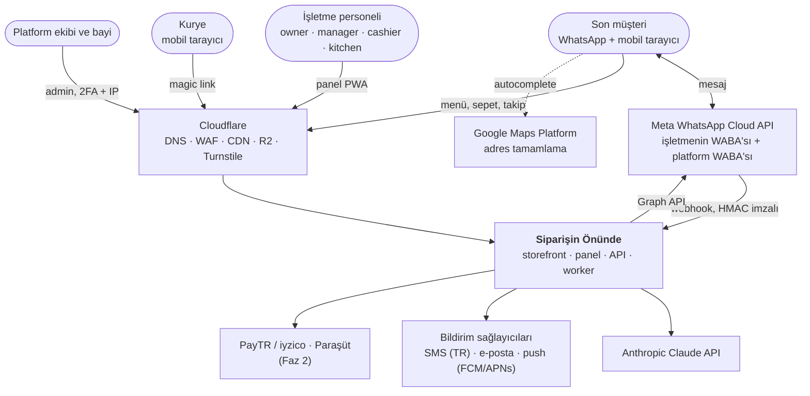
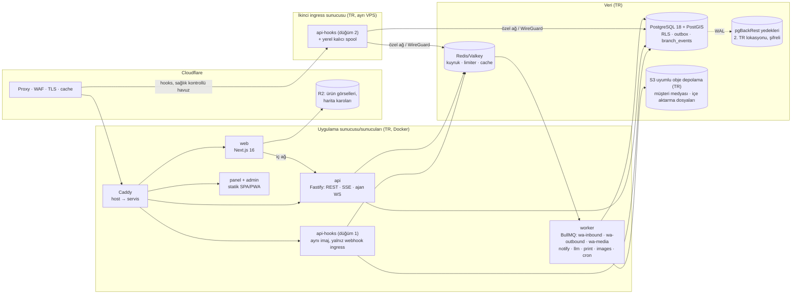
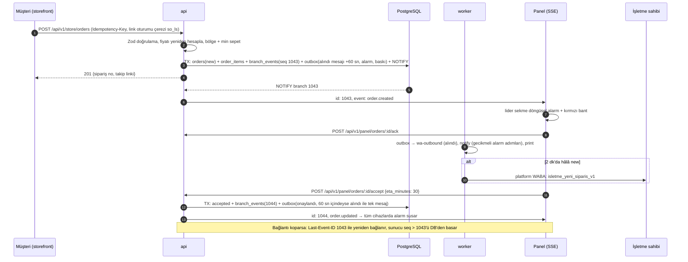
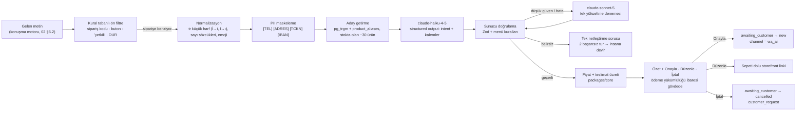

# 06 — Teknik Mimari
> **Amaç:** Ekibin ilk sprintten itibaren referans alacağı teknik mimariyi tek yerde tanımlamak: stack, servisler, multi-tenancy, gerçek zamanlılık ("sipariş kaçmaz"), asenkron işleme, yazdırma, harita, AI, barındırma, güvenlik, gözlemlenebilirlik, CI/CD ve maliyet.
> **Tarih:** 2026-09-24 · **Durum:** Taslak v1 · **Bağlayıcı kaynak:** [Kararlar ve sözlük](00-kararlar-ve-sozluk.md) §10 (teknik kararlar, kanonik alarm zamanlaması), §3 (sözlük), §4 (roller, oturum süreleri, kill-switch'ler, SMS maliyeti), §5 (durum makinesi, sebep kodları, adlandırma, kuyruklar, SSE), §7 (akışlar, WhatsApp'sız mod, mesaj koruma kuralları), §11 (fazlar, pilot öncesi zorunlu "sipariş kaçmaz" paketi). Tablo adları, alanlar ve API yolları [07](07-veri-modeli-ve-api.md) ile hizalıdır.

**Kapsam:** Mimari ilkeler, stack ve gerekçesi, sistem/konteyner görünümü, repo yapısı ve kod kuralları, multi-tenancy, kimlik ve yetki, SSE + olay günlüğü + kademeli alarm, kuyruklar/outbox/cron, yazdırma, PostGIS ve geocoding, LLM boru hattı ve menü içe aktarma, storefront performansı, barındırma ve felaket kurtarma, gözlemlenebilirlik, güvenlik mimarisi, ortamlar/CI/CD/test, ölçek ve maliyet.

**Kapsam dışı (bağlantı verilir):**
- WhatsApp onboarding, şablon kataloğu, konuşma motoru, webhook/gönderim davranış sözleşmesi, hata kodları → [02 WhatsApp entegrasyonu](02-whatsapp-entegrasyonu.md). Bu doküman yalnız altyapısını tanımlar.
- Tabloların alan listesi, ERD, API uç noktaları, olay (event) ve webhook sözleşmeleri → [07 Veri modeli ve API](07-veri-modeli-ve-api.md). Buradaki SQL'ler desen örneğidir.
- Ekranlar ve UX → [03 Storefront](03-musteri-deneyimi-ve-storefront.md), [04 İşletme paneli](04-isletme-paneli.md), [05 Admin paneli](05-admin-paneli-ve-pazarlama-sitesi.md).
- KVKK hukuki değerlendirmesi, saklama sürelerinin kesin değerleri, sözleşmeler → [08 Mevzuat](08-mevzuat-kvkk-odeme-fatura.md).
- Sprint planı ve ekip → [09](09-yol-haritasi-ve-sprint-plani.md); olay yönetimi süreci, KPI'lar → [10](10-riskler-operasyon-ve-metrikler.md).

**Kaynaklar ve atıf biçimi:** `A04 §3.2` = [arastirma/04-mimari-teknoloji.md](arastirma/04-mimari-teknoloji.md) bölüm 3.2 (URL'ler orada). `A01` = [arastirma/01-whatsapp-platform.md](arastirma/01-whatsapp-platform.md), `A03` = [arastirma/03-mevzuat-odeme-fatura.md](arastirma/03-mevzuat-odeme-fatura.md). `[T]` = tahmin/önerimiz; `(teyit edilmeli)` = canlıdan önce resmi kaynaktan doğrulanacak. Paket sürümleri npm/Packagist'ten 24.09.2026'da okundu (A04 §1.1).

## 1. Mimari ilkeler
| # | İlke | Pratikte anlamı |
|---|---|---|
| 1 | **Sipariş kaçmaz.** | Her sipariş olayı şube başına sıralı bir DB günlüğüne yazılır. SSE yalnız hızlandırıcıdır; kaçan olay DB'den telafi edilir. Onaylanmayan sipariş kademeli alarmla bir insana ulaşır (§7). |
| 2 | **Önce kalıcı yaz, sonra işle.** | Webhook ve sipariş önce PostgreSQL'e yazılır, sonra 200/201 döner. PostgreSQL'e ulaşılamazsa webhook ingress düğümü olayı kendi yerel kalıcı spool'una yazar ve 200 döner (§13.3). Yan etkiler (mesaj, alarm, baskı) aynı transaction'da outbox'a yazılır (§8.2). Redis kaybı veri kaybı değildir. |
| 3 | **Tenant yalıtımı iki katmanlı.** | Uygulamada her sorgu tenant bağlamında çalışır; DB'de FORCE RLS + NOBYPASSRLS rol + bileşik FK vardır (§5). Yalıtım testi geçmeyen PR birleşmez. |
| 4 | **Fiyat sunucuda hesaplanır.** | İstemci, LLM veya fiş şablonu fiyat üretmez. Tutarlar `packages/core`'daki tek fonksiyonla kuruş (integer) olarak hesaplanır ve sipariş anında kopyalanır (snapshot). |
| 5 | **Her dış girdi idempotent.** | Webhook (olay hash'i, `wamid`), sipariş gönderimi (`Idempotency-Key`), giden mesaj (`dedupe_key`), kuyruk işi (`jobId`), baskı işi. Tekrar teslim = no-op (§8.3). |
| 6 | **Durum makineleri tablo güdümlü ve saf.** | Sipariş ve konuşma FSM'leri `packages/core`'da yan etkisiz `transition(state, event, ctx) → {next, effects[]}` fonksiyonlarıdır; %100 birim testlidir. Effect'ler outbox'a yazılır. |
| 7 | **Veri minimizasyonu varsayılan.** | Gereksiz veri toplanmaz; toplanan veri süresi dolunca otomatik silinir (§8.5). Log, LLM, push ve hata izleme PII görmez. |
| 8 | **Kişisel veri Türkiye'de.** | PostgreSQL, yedekler ve müşteri medyası yurt içinde barınır. Yurt dışı alt işleyenler aktarım envanterindedir ve PII görmeyecek şekilde yapılandırılır (§13.1). |
| 9 | **Basit başla, ölçerek ölçekle.** | Pilotta tek uygulama sunucusu + Docker Compose ve modüler monolit (bir `api`, bir `worker` imajı) kullanılır. Tek istisna webhook alımıdır: en az iki ayrı sunucu/VM üzerinde çalışır (pilotta ucuz ikinci VPS, §13.3). Mikroservis ve Kubernetes yoktur. Ayrıştırmayı metrik (kuyruk derinliği, p95) tetikler (§13.3). Metriği ve alarmı olmayan akış canlıya çıkmaz (§14). |
| 10 | **Resmi ve değiştirilebilir entegrasyonlar.** | Yalnız resmi WhatsApp Cloud API kullanılır. Graph API, SMS, geocoding, LLM ve PSP çağrıları adaptör arayüzlerinin arkasındadır (örn. `WaTransport`, [02](02-whatsapp-entegrasyonu.md) §7.10). |
| 11 | **Esnafın donanımı ve ağı tasarım sınırıdır.** | Ucuz Android tablet, zayıf Wi-Fi, 4G'ye düşme ve termal yazıcı koşullarında test edilir (§7.8, §12). |

## 2. Stack kararı
### 2.1 Seçilen stack **[Faz 1]**
| Katman | Seçim (sürüm, 24.09.2026) | Rol |
|---|---|---|
| Dil / çalışma zamanı | TypeScript (strict), Node.js 24 LTS | Tüm servisler, tek dil |
| Monorepo | pnpm workspaces + Turborepo 2.11 | Görev grafiği, build cache |
| Storefront + pazarlama sitesi | Next.js 16.3 (`proxy.ts`, eski adıyla middleware), React 19.3 | SEO, ISR, host → tenant çözümleme |
| İşletme paneli + admin | Vite 8.3 + React 19 + TanStack Router/Query + shadcn/ui; PWA: vite-plugin-pwa 1.3 veya Serwist 9.5 | Statik SPA + PWA |
| API | Fastify 5.12 + Zod 4 (tipli route şemaları) | REST, SSE, WhatsApp webhook ingress, yazıcı ajanı WS |
| Kuyruk | BullMQ 6.3 (açık kaynak) + Redis/Valkey | İşler, gecikmeli işler, zamanlayıcılar, limiter |
| Veritabanı | PostgreSQL 18 + PostGIS + `pg_trgm` + `unaccent` + ICU `tr-TR` collation | Tek doğruluk kaynağı |
| ORM / migration | Drizzle ORM 0.45 (1.0 kararlı çıkınca geçiş değerlendirilir) + drizzle-kit (SQL migration) | RLS politikası ve PostGIS doğrudan yazılabilir |
| Kimlik | Better Auth 1.7 (organization, twoFactor, phoneNumber, magicLink, admin eklentileri) | §6 |
| Diğer | rate-limiter-flexible 11.2, web-push 3.6, MapLibre GL 6.11, Terra Draw 1.35, pmtiles 4.5, receipt-printer-encoder 4.0, @anthropic-ai/sdk 0.128 | §7–§11, §15 |
| Mobil | Capacitor 8.5 Android sarmalayıcı **[Faz 2]**, Expo SDK 57 kurye uygulaması **[Faz 3]** | §9, §7.8 |
| Gözlemlenebilirlik | Sentry, OpenTelemetry (`@opentelemetry/sdk-node` 0.222), Prometheus, Grafana, Loki, Pino, Uptime Kuma | §14 |
| Altyapı | Docker Compose, Caddy (reverse proxy, TLS), pgBackRest, Cloudflare | §13 |

Sürümler lockfile ile sabitlenir. Major yükseltme ayrı PR ile yapılır ve staging'de 1 hafta bekler.

### 2.2 Gerekçe (A04 §1.2–1.5)
- **Tek dil:** Storefront, panel, API, worker ve mobil sarmalayıcı aynı dilde yazılır. Zod şemaları ve tipler `packages/*` üzerinden paylaşılır. Derleyici hataları AI destekli geliştirmede hızlı geri bildirim sağlar.
- **Fastify** (NestJS/Hono yerine): Uzun ömürlü Node süreci, SSE, imza doğrulama için ham gövde (raw body) ve olgun eklenti ekosistemi sunar. NestJS'in DI/modül töreni küçük ekip için fazladır. Hono edge için güzeldir, ama bizim yükümüz uzun süreli bağlantı ve worker'dır.
- **Drizzle** (Prisma yerine): SQL'e yakındır. `pgPolicy`, PostGIS ve `SET LOCAL` desenleri sarmalayıcısız yazılır. Migration'lar okunabilir SQL'dir.
- **SSE + REST** (Socket.IO yerine): Panel sunucudan akış alır, aksiyonlar REST ile gider. Kaçırılan olayın telafisi zaten DB'den yapılacağı için WebSocket'in çift yönlülüğü gereksizdir (§7).
- **BullMQ** (pg-boss yerine): Redis zaten rate limit ve cache için var; pg-boss "yalnız Postgres" B planıdır. **Vite SPA** (panel için Next.js yerine): Panelin SEO/SSR ihtiyacı yoktur. Statik deploy edilir ve PWA olur. Next.js yalnız SEO ve çok host'lu yönlendirme gereken storefront + pazarlama sitesinde kullanılır.

### 2.3 Alternatif: Laravel 13 + Filament 5 (açık karar, ilk hafta verilir)
| Bu doküman (TS) | Laravel karşılığı |
|---|---|
| Next.js storefront | Laravel + Inertia/React veya Livewire 4 |
| Vite panel + admin | Filament 5 (çok kiracılı panel desteği var); canlı sipariş ekranı için Inertia/React sayfası |
| SSE + `branch_events` | Reverb (WebSocket) + Echo; `branch_events.seq` ve yeniden oynatma deseni **aynen** korunur |
| BullMQ | Horizon + Redis kuyrukları (aynı kuyruk adları) |
| Better Auth | Fortify (2FA) + Sanctum; RBAC: Spatie Permission |
| Drizzle | Eloquent + RLS/PostGIS için ham SQL migration'lar |

**Ne zaman seçilir:** Çekirdek ekipte en az 2 kıdemli Laravel geliştiricisi varsa ve React/Node deneyimi zayıfsa (Filament admin paneli daha hızlı çıkarır). Karar ilk hafta verilir ve sonra değişmez. §1'deki ilkeler, §5 RLS deseni, §7 olay günlüğü ve §8 outbox iki yığında da aynıdır.

### 2.4 BaaS (Supabase/Firebase) neden çekirdek değil
- Webhook ingress, sıralı/idempotent işleme, yazıcı ajanı ve uzun süreli worker'lar BaaS'ın zayıf olduğu alanlardır. Sonuç yine "BaaS + ayrı backend" olur ve karmaşıklık artar (A04 §1.4).
- Supabase Realtime kotası (Pro'da 500 eşzamanlı bağlantı dahil) ölçekte ücrete döner. Asıl sorun ise "kaçan olayın telafisi"nin yine bize kalmasıdır.
- Supabase bölgeleri arasında Türkiye yok (teyit edilmeli). Bu, KVKK barındırma kararıyla (§13.1) çelişir. Firestore ilişkisel sipariş/menü verisine ve PostGIS'e uymaz.

### 2.5 Bilinçli olarak kullanılmayanlar
Socket.IO (Connection State Recovery bellek içidir, klasik Redis adaptörüyle çalışmaz, A04 §3.1) · Kubernetes (Faz 3'e kadar gereksiz) · Vercel/Supabase barındırma (veri yeri) · Lucia (npm'de deprecated) · BullMQ Pro (grup sıralama yerine advisory lock, §8.1) · WebUSB'yi ana yazdırma yolu yapmak (yalnız Chromium) · resmi olmayan WhatsApp kütüphaneleri ([00-kararlar-ve-sozluk.md](00-kararlar-ve-sozluk.md) §6.1).

## 3. Sistem görünümü
### 3.1 Sistem bağlam diyagramı


### 3.2 Konteyner diyagramı


### 3.3 Servis listesi
| Servis | Sorumluluk | Teknoloji | Ölçekleme | Faz |
|---|---|---|---|---|
| `web` | Pazarlama sitesi; storefront (menü, sepet, adres, checkout); takip sayfası `/t/{token}`; host → tenant | Next.js 16 | Yatay, stateless; ISR + CDN | 1 |
| `api` | Panel/admin/storefront REST; SSE akışı; yetki; yazıcı ajanı WS **[Faz 2]** | Fastify 5, Zod 4, Better Auth | Yatay; SSE bağlantısı başına düşük bellek | 1 |
| `api-hooks` | `hooks.siparisinonunde.com/wa`: imza → ham olay → 200 ([02](02-whatsapp-entegrasyonu.md) §7.2) | Aynı imaj, `ROLE=hooks` | **En az iki ayrı sunucu/VM** üzerinde (pilotta ana sunucu + ucuz ikinci VPS, §13.3); storefront trafiğinden yalıtılmış | 1 |
| `worker` | Kuyruk tüketicileri (§8.1) | BullMQ | Pilotta tek süreç; Faz 2'de kuyruk grubuna göre ayrılır | 1 |
| `panel` | İşletme paneli + kurye görünümü (`/kurye`) + bayi (`/bayi`, **[Faz 2]**) | Vite SPA/PWA | Statik | 1 |
| `admin` | Süper admin: tenant, abonelik, WABA sağlığı, DLQ, impersonation, feature flag | Vite SPA | Statik; Cloudflare Access + IP kısıtı | 1 |
| `mobile-business` | Panelin Android sarmalayıcısı: native alarm, otomatik ESC/POS, Sunmi, kiosk | Capacitor 8 | Mağaza sürümü | 2 |
| `print-agent` | Windows yerel yazdırma ajanı | Go, tek exe | İşletme başına 1 | 2 |
| `courier` | Arka plan konumlu kurye uygulaması | Expo SDK 57 | Mağaza sürümü | 3 |
| Veri ve operasyon | PostgreSQL, Redis/Valkey, Caddy, pgBackRest, Prometheus/Grafana/Loki, Uptime Kuma | Docker | §13.3 | 1 |

### 3.4 Alan adları ve yönlendirme
| Host | Hedef | Not |
|---|---|---|
| `siparisinonunde.com` | `web` (pazarlama) | ISR, CDN cache |
| `{slug}.siparisinonunde.com` | `web` (storefront) + `/api/v1/store/*` → `api` | Wildcard DNS ve sertifika (Cloudflare). Ayrılmış alt adlar: `www, panel, admin, api, hooks, status, cdn, static, mail, blog, destek, app` |
| `panel.siparisinonunde.com` | `panel` SPA + `/api/v1/panel/*`, `/api/v1/courier/*` → `api` | **Aynı kaynaktan (same-origin)** API: çerez host'a özel (`__Host-` önekli), CORS yok |
| `admin.siparisinonunde.com` | `admin` SPA + `/api/v1/admin/*` → `api` (admin route grubu) | Ayrı çerez, ayrı Better Auth örneği (§6.1) |
| `api.siparisinonunde.com` | `api` (`/v1/…`) | Sunucudan sunucuya çağrılar, yazıcı ajanı **[Faz 2]**, açık API **[Faz 3]** |
| `hooks.siparisinonunde.com` | `api-hooks` (iki düğüm, §13.3) | Meta webhook'u, SMS teslim raporu (Faz 1) ve Faz 2'de PSP callback'leri ([07](07-veri-modeli-ve-api.md) §6.6) |
| Özel alan adı (`siparis.isletme.com`) **[Faz 3]** | `web` | Cloudflare for SaaS: ilk 100 hostname ücretsiz, sonra $0,10/ay (A04 §2.4) |

Panel çerezinin `.siparisinonunde.com` üst alanına yazılmaması bilinçli bir karardır. Aksi halde oturum çerezi her tenant storefront'una da gönderilir.

## 4. Repo yapısı ve kod kuralları
### 4.1 Klasör yapısı (pnpm + Turborepo)
```
siparisinonunde/
├─ apps/
│  ├─ web/              # Next.js 16: app/(marketing), app/(store)/_s/[tenant]/..., proxy.ts
│  ├─ api/              # Fastify: routes/v1/{panel,courier,admin,store,hooks,sse,agent}, plugins/{auth,tenant,raw-body,rate-limit}
│  ├─ worker/           # BullMQ: queues/{wa-inbound,wa-outbound,wa-media,notify,llm,print,images,cron}
│  ├─ panel/            # Vite SPA/PWA: features/{orders,chat,menu,zones,printers,staff,reports,courier}
│  ├─ admin/            # Vite SPA: features/{tenants,waba-health,dlq,impersonation,flags,billing}
│  └─ mobile-business/ · print-agent/ · courier/   # [Faz 2] Capacitor 8 (escpos, sunmi, alarm) · [Faz 2] Go · [Faz 3] Expo
├─ packages/
│  ├─ core/             # Domain: sipariş FSM, konuşma FSM, fiyat/sepet, bölge/ücret, çalışma saatleri (saf, I/O yok)
│  ├─ db/               # Drizzle şema, SQL migration'lar, RLS politikaları, withTenant(), seed, test fixture'ları
│  ├─ auth/             # Better Auth yapılandırması, izin tanımları, authorize()
│  ├─ whatsapp/         # WaTransport, Graph istemcisi, webhook tipleri, imza, şablon kayıt defteri, hata kodları
│  ├─ notifications/    # Kademeli alarm politikası; kanal adaptörleri (push, platform WABA, SMS, e-posta)
│  ├─ llm/              # Prompt'lar, şemalar, normalizasyon, aday getirme, PII maskeleme, eval seti + runner
│  ├─ receipt/          # Fiş modeli → HTML / ESC/POS / raster
│  ├─ geo/              # PostGIS yardımcıları, geocoding adaptörleri (google/photon), mesafe
│  ├─ contracts/        # Zod şemaları: API istek/yanıt, SSE olayları, iş (job) yükleri → OpenAPI
│  ├─ ui/ · i18n/ · config/   # shadcn bileşenleri; tr (varsayılan)/en; tsconfig/eslint/vitest ortak ayarları
├─ infra/
│  ├─ compose/          # docker-compose.{dev,staging,prod}.yml
│  ├─ caddy/            # Caddyfile (host yönlendirme, wildcard)
│  ├─ postgres/         # roller, uzantılar, postgresql.conf, pgbackrest.conf
│  ├─ observability/    # prometheus kuralları, grafana panoları, loki
│  └─ runbooks/         # DR, restore tatbikatı, olay müdahale, anahtar rotasyonu
├─ .github/workflows/   # ci.yml, deploy-staging.yml, deploy-prod.yml, nightly.yml
└─ CLAUDE.md
```

### 4.2 Paket sorumlulukları ve bağımlılık kuralları
- `core` hiçbir pakete bağımlı değildir (Zod hariç): DB, ağ ve saat yoktur. Saat parametre olarak verilir. Tüm iş kuralları buradadır.
- `db` yalnız `withTenant()`, `withSystem()` ve depo (repository) fonksiyonlarını dışa açar. Uygulama kodunun ham `db` nesnesini import etmesi ESLint `no-restricted-imports` kuralıyla yasaktır.
- `apps/*` birbirini import etmez; ortak kod `packages/*`'tadır. `contracts` hem `api` hem `panel` tarafından kullanılır; panelin API tipleri buradan gelir.
- Dış servis çağrıları (Graph API, SMS, Google, Anthropic, PSP) yalnız ilgili paketin adaptöründen yapılır. Testlerde adaptör sahte (fake) uygulamayla değiştirilir.

### 4.3 Kod kuralları
- **Para:** Her zaman kuruş cinsinden `integer` kullanılır, alan adı `*_kurus` olur. Float yasaktır. KDV dahil/hariç alanlar açıkça adlandırılır.
- **Zaman:** DB'de `timestamptz` (UTC) kullanılır. İş kuralları (çalışma saati, rapor günü) `Europe/Istanbul` ile hesaplanır. `new Date()` domain kodunda yasaktır, saat enjekte edilir.
- **Kimlikler:** `uuid` kullanılır. PostgreSQL 18'in `uuidv7()` fonksiyonu zaman sıralı olduğu için indeks dostudur. Müşteriye görünen sipariş no ve takip token'ı ayrı alanlardır.
- **Adlandırma:** Tablo ve sütunlar `snake_case`'tir; **tablo adları çoğuldur** (`tenants`, `branches`, `orders`, `order_items`, `branch_events`; `audit_log` ve `tenant_usage_daily` kütle adı istisnasıdır). Sözlükteki tekil adlar (`tenant`, `order`…) varlık adıdır; `order` SQL'de ayrılmış kelime olduğundan tablo `orders`'tır ([00-kararlar-ve-sozluk.md](00-kararlar-ve-sozluk.md) §5, [07](07-veri-modeli-ve-api.md) §1.1). Tam tablo ve alan listesi 07 §3'tedir; bu dokümandaki SQL'ler 07'deki adları kullanır. TS'de `camelCase` kullanılır. Durum ve sebep kodları, enum değerleri ve kuyruk adları [00-kararlar-ve-sozluk.md](00-kararlar-ve-sozluk.md) §5'teki gibi aynen yazılır.
- **Sınırlar:** Her HTTP girdisi, iş yükü, SSE olayı ve LLM çıktısı Zod ile doğrulanır. Hatalar RFC 9457 `application/problem+json` biçiminde döner.
- **Loglama:** Pino JSON kullanılır. Telefon, adres, mesaj metni ve token loglanmaz (§14.2). Her log satırı `request_id`, `tenant_id` ve `trace_id` taşır.
- **Test ve PR:** Test dosyası kodun yanında durur (`*.test.ts`); domain değişikliği testsiz birleşmez. Conventional Commits kullanılır; PR şablonunda "tenant/RLS etkisi", "migration geriye uyumlu mu", "yeni metrik/alarm" kutuları vardır.

### 4.4 `CLAUDE.md` içeriği (öneri, repo kökü)
1. Proje özeti (3 satır) ve sözlük bağlantısı (`docs/00-kararlar-ve-sozluk.md`). Durum kodları, roller ve kanal adları oradan aynen kullanılır.
2. **Tenant kuralı:** DB'ye yalnız `withTenant(ctx, tx => …)` ile erişilir. `tenant_id` asla istek gövdesinden alınmaz. Yeni tabloda `tenant_id` + RLS politikası + bileşik FK zorunludur ve CI kataloğu kontrol eder.
3. **Fiyat kuralı:** Fiyat ve toplam yalnız `packages/core/pricing` ile hesaplanır. İstemciden veya LLM'den gelen tutar yok sayılır.
4. **FSM kuralı:** Durum yalnız `transition()` ile değişir. Yeni geçiş önce tabloya ve teste eklenir. Durum değişikliği + `branch_events` + outbox aynı transaction'dadır.
5. **Outbox ve idempotency kuralı:** Transaction içinden dış servis çağrılmaz; yan etki `dedupe_key`'li outbox kaydıdır. Her tüketici tekrar teslime dayanıklı yazılır, testte aynı iş iki kez çalıştırılır.
6. **PII kuralı:** Log, Sentry, LLM ve push yüküne telefon, adres, ad ve mesaj metni girmez. Maskeleme yardımcıları `packages/core/pii` içindedir.
7. **Yasaklar:** Resmi olmayan WhatsApp kütüphaneleri, `float` para, ham `db` import'u, transaction içinde ağ çağrısı, `SET` (yalnız `set_config(..., true)` serbest).
8. Komutlar (`pnpm dev`, `pnpm test`, `pnpm test:tenant`, `pnpm test:e2e`, `pnpm db:migrate`, `pnpm eval:llm`), migration kuralları (§16.5) ve "yoğun saatte deploy yok" kuralı.

## 5. Multi-tenancy
### 5.1 Model
Tek paylaşımlı veritabanı kullanılır, her tenant tablosunda `tenant_id` bulunur. Şema başına veya DB başına kiracı modeli önerilmez (migration ve operasyon yükü, A04 §2.1). Hiyerarşi: `tenant → branch → (menü override'ları, delivery_zone, wa_phone_number, printer, device, order)`. Tek şubeli işletmede şube arayüzde görünmez (varsayılan şube). Menü tenant seviyesinde tanımlanır, şube farkları override tablosunda tutulur.

### 5.2 Tenant çözümleme
| Giriş noktası | Tenant kaynağı | Kontrol |
|---|---|---|
| Storefront (`web`) | `Host` → `storefront_hosts` → `(tenant_id, branch_id)` (`sys_resolve_host()`) | Redis'te 60 sn cache. Bilinmeyen host → 404. Askıdaki tenant → "geçici olarak sipariş alınmıyor" sayfası |
| Storefront API | Host + link oturumu çerezi (`so_ls`; imzalı menü token'ından `POST /api/v1/store/link-session` ile üretilir, [02](02-whatsapp-entegrasyonu.md) §6.3) | Token'daki tenant ≠ host tenant'ı → 403 |
| Panel API | Oturum → aktif organizasyon (`tenant_id`) + `X-Branch-Id` başlığı | Üyelik (`memberships`) ve şube kapsamı kontrol edilir. Gövdedeki `tenant_id` yok sayılır |
| Cihaz (PIN) oturumu | Cihaz kaydı (`devices`) → sabit `(tenant_id, branch_id)` | Cihaz iptal edildiyse 401 |
| Kurye | Kurye oturumu → `(tenant_id, branch_id, user_id)` | Yalnız kendine atanan siparişler |
| WhatsApp webhook | `phone_number_id` → `wa_phone_numbers` → `(tenant_id, branch_id)` (`sys_wa_route()`) | `entry[].id` (WABA) çapraz kontrol; bilinmeyen numara → `wa_webhook_events.status = 'orphan'` + admin alarmı |
| Yazıcı ajanı **[Faz 2]** | Ajan token'ı → şube (`branch_id`) | Token iptal edilebilir |
| Worker işi | İş yükündeki `tenant_id` | Varlık yüklendikten sonra `tenant_id` eşleşmesi yeniden doğrulanır |
| Platform geneli cron | `SECURITY DEFINER` fonksiyon yalnız `(tenant_id, id)` listesi döner | Her kayıt ayrı tenant transaction'ında işlenir (§5.5) |

### 5.3 RLS deseni
```sql
-- infra/postgres/roles.sql
CREATE ROLE app_owner  NOLOGIN;                -- tabloların sahibi; migration'lar bu rolle
CREATE ROLE app_user   LOGIN NOBYPASSRLS;      -- api + worker; tablo sahibi DEĞİL
CREATE ROLE app_admin  LOGIN NOBYPASSRLS;      -- admin API; yalnız okuma politikaları
CREATE ROLE app_system NOLOGIN BYPASSRLS;      -- yalnız sys_* SECURITY DEFINER fonksiyonlarının sahibi
REVOKE UPDATE, DELETE ON audit_log FROM app_user;   -- denetim kaydı yalnız INSERT

-- Her tenant tablosu için (migration şablonu, CI kataloğu doğrular)
ALTER TABLE order_items ENABLE ROW LEVEL SECURITY;
ALTER TABLE order_items FORCE  ROW LEVEL SECURITY;   -- sahip de tabi
CREATE POLICY tenant_isolation ON order_items TO app_user
  USING      (tenant_id = nullif(current_setting('app.tenant_id', true), '')::uuid)
  WITH CHECK (tenant_id = nullif(current_setting('app.tenant_id', true), '')::uuid);
CREATE POLICY platform_read ON order_items FOR SELECT TO app_admin USING (true);
```

- `current_setting(..., true)` ayar yoksa NULL, transaction-yerel ayar düştükten sonra boş dize döner. `nullif` iki durumda da **hiç satır göstermez** (fail-closed) ve `''::uuid` hatasını önler.
- Oturum değişkeni **yalnız** `set_config('app.tenant_id', $1, true)` (transaction-yerel) ile verilir. PgBouncer transaction modunda `SET` başka isteğe sızabilir (A04 §2.2).
- `app_admin` tenant verisini değiştiremez. Admin'in tenant adına yaptığı her yazma impersonation bağlamında `app_user` + tenant ayarıyla yapılır ve audit'e düşer (§6.7).

### 5.4 Bileşik FK ve indeksler
```sql
ALTER TABLE orders ADD CONSTRAINT orders_tenant_id_id_uk UNIQUE (tenant_id, id);
ALTER TABLE order_items
  ADD CONSTRAINT order_items_order_fk FOREIGN KEY (tenant_id, order_id) REFERENCES orders (tenant_id, id);
ALTER TABLE orders
  ADD CONSTRAINT orders_branch_fk FOREIGN KEY (tenant_id, branch_id) REFERENCES branches (tenant_id, id);
CREATE INDEX orders_open_idx ON orders (tenant_id, branch_id, status)
  WHERE status IN ('awaiting_customer','new','accepted','preparing','ready','on_the_way');
```

Bileşik FK, başka tenant'ın şubesine veya siparişine referansı DB seviyesinde imkânsız kılar. İndekslerde `tenant_id` ilk sütundur.

### 5.5 Uygulama katmanı ve arka plan işleri
```ts
// packages/db/src/tenant.ts
export function withTenant<T>(ctx: { tenantId: string; branchId?: string; actor: string }, fn: (tx: Tx) => Promise<T>) {
  return db.transaction(async (tx) => {
    await tx.execute(sql`select set_config('app.tenant_id', ${ctx.tenantId}, true),
                                set_config('app.actor', ${ctx.actor}, true)`);   // audit trigger'ı actor'ü okur
    return fn(tx);
  });
}
```

- **Worker:** Her iş `withTenant(job.data.tenantId, …)` içinde çalışır. Webhook işlerinde tenant, `phone_number_id` eşlemesinden çözülür ([02](02-whatsapp-entegrasyonu.md) §7.3).
- **Platform geneli işler** (zaman aşımı taraması, outbox dağıtıcı, silme işleri): `app_system` sahipli `sys_due_awaiting_timeouts(now)` gibi fonksiyonlar yalnız kimlik listesi döner. İşlem her tenant için ayrı `withTenant` transaction'ında yapılır. Hiçbir iş "tüm tenant'larda toplu UPDATE" yapmaz.
- **Gürültülü komşu:** Tenant başına API rate limit, LLM bütçesi (§11.5) ve kampanya gönderim hızı sınırlanır. Rapor sorguları Faz 3'te okuma replikasına gider.

### 5.6 Yalıtım testleri **[Faz 1]**
1. **Katalog testi:** `tenant_id` sütunu olan her tablo için `relrowsecurity` ve `relforcerowsecurity` açık olmalı ve `tenant_isolation` politikası bulunmalı (`pg_class`, `pg_policies` sorgusu). Yeni tablo eklenip politika unutulursa CI kırmızı olur.
2. **Fail-closed testi:** `set_config` yapılmadan her tabloda `SELECT` 0 satır dönmeli, `INSERT` hata vermeli.
3. **Otomatik IDOR testi:** Fastify route tablosu gezilir. `:id` parametreli her uç nokta, tenant A'nın kaynağı için tenant B kullanıcısının oturumuyla çağrıldığında 404 dönmeli. Yeni route testsiz kalamaz (kapsam listesi snapshot'lanır).
4. **SSE ve ajan testi:** Başka tenant'ın şube akışına abonelik 403 dönmeli. Başka şubenin yazıcı işi ajana gönderilmemeli.
5. **Worker testi:** Yükte tenant A, varlıkta tenant B olan iş reddedilmeli ve alarm üretmeli.

**Kabul kriterleri:** 5 test grubu CI'da zorunlu adımdır ve atlanamaz. Katalog testi tüm tenant tablolarını kapsar. Harici pentestte (§15.8) tenant yalıtımı bulgusu "kritik" sayılır ve sürüm durdurulur.

## 6. Kimlik doğrulama ve yetkilendirme
### 6.1 Better Auth yapılandırması
- **İki ayrı örnek:** `panelAuth` (işletme kullanıcıları, kurye, bayi) ve `adminAuth` (platform kullanıcıları). Kullanıcı tabloları, çerezler ve oturum süreleri ayrıdır. Platform ve işletme kimlikleri karışmaz.
- **Eklentiler:** `organization` (tenant = organizasyon; üyelik rolü + şube kapsamı), `twoFactor` (TOTP, yedek kodlar, 30 gün güvenilir cihaz), `phoneNumber` (OTP; `sendOTP` await edilmez, A04 §8.2), `magicLink` (kurye), `admin` (impersonation, kullanıcı engelleme). Eklenti adları ve impersonation davranışı 1.7 dokümanından teyit edilmeli.
- **Oturum deposu:** PostgreSQL, sıcak okuma için Redis ikincil depo. Çerez `__Host-` önekli, `Secure; HttpOnly; SameSite=Lax`.
- **Parola:** Minimum 10 karakter, sızmış parola kontrolü (k-anonimlik; eklenti teyit edilmeli), hesap kilidi Better Auth rate limit + uygulama limiti ile (§15.4).
- **Taze oturum:** WhatsApp bağlantısı, abonelik, personel/rol değişikliği, müşteri verisi dışa aktarma ve silme için son 10 dk içinde parola/TOTP yeniden istenir.

### 6.2 Oturum türleri
| Oturum | Kim | Giriş | Süre | 2FA | Kapsam |
|---|---|---|---|---|---|
| Panel kullanıcısı (kişisel oturum) | `owner`, `manager`, `cashier` | E-posta + parola | **Kişisel kullanıcı oturumu 30 gün** (kayıtlı cihaz); kayıtsız cihazda tarayıcı oturumu | `owner` **zorunlu TOTP**; `manager` önerilir | Tenant; şube üyeliği |
| Paylaşımlı cihaz (PIN) **[Faz 1]** | Paylaşımlı kasa/mutfak tableti; `kitchen`, `cashier` | Eşleştirme kodu → **cihaz kaydı** (cihaz token'ı); personel o cihazda PIN ile girer | **Cihaz kaydı 90 gün** (kişisel oturum değildir; iptal edilebilir); PIN oturumu vardiya boyu (en çok 12 sa) | — | Tek şube, rolü cihaz belirler |
| Kurye **[Faz 1]** | `courier` | Magic link (platform WABA veya SMS) | Link tek kullanımlık (15 dk içinde açılmalı); oturum **12 saat (vardiya)** | — | Yalnız kendine atanan siparişler |
| Bayi **[Faz 2]** | `reseller_admin`, `reseller_technician` | E-posta + parola | 7 gün | Zorunlu | Yalnız getirdiği işletmeler: `reseller_admin` özet + komisyon raporu; `reseller_technician` yalnız atandığı işletmelerin kurulum kontrol listesi |
| Platform | `platform_owner`, `platform_admin`, `support_agent`, `finance`, `sales_rep` | E-posta + parola + TOTP; Cloudflare Access + IP izin listesi | **8 sa**; 30 dk hareketsizlikte kilit | **Zorunlu** | Platform |

Süreler [00-kararlar-ve-sozluk.md](00-kararlar-ve-sozluk.md) §4 "Oturum süreleri"ndeki kanonik değerlerdir (bayi oturumu 00'da tanımlı değildir, varsayılan 7 gün). **Ayrım:** 90 günlük süre yalnız paylaşımlı kasa/mutfak tabletinin **cihaz kaydına** aittir; o cihazda işlem yapan personel kimliğini PIN ile verir. Bir kişinin kendi e-posta + parolasıyla açtığı **kişisel kullanıcı oturumu** 30 gündür.

### 6.3 Cihaz / PIN oturumu
1. `owner` veya `manager` panelde "Cihaz ekle" der ve rolü (mutfak/kasa) seçer. 8 haneli kod veya QR 10 dk geçerli olur.
2. Tablet kodu girer ve `devices` kaydı (cihaz kaydı) oluşur. Cihaz token'ı 90 gün geçerlidir, httpOnly çerezde tutulur, DB'de hash'i saklanır. Bu bir kişisel oturum değildir; kişisel kullanıcı oturumu (30 gün) ayrıdır (§6.2).
3. Personel 4–6 haneli PIN ile hızlı giriş yapar ve kullanıcı değiştirir (argon2id hash; 5 hatalı denemede 5 dk kilit). PIN, kimin işlem yaptığını audit'e yazmak içindir. Ekran kilitlense bile **sipariş alarmı ve liste görünür kalır**, yalnız aksiyonlar (onay, iptal) PIN ister.
4. Cihazlar panelde listelenir (son görülme, ses durumu, sürüm) ve tek tıkla iptal edilir.

### 6.4 Kurye magic link
Kurye kullanıcısı telefon numarasıyla eklenir. Giriş linki platform WABA şablonuyla (yoksa SMS) gider: `panel.siparisinonunde.com/kurye/giris?t=…`. Token 15 dk geçerli ve tek kullanımlıktır, açılan oturum 12 saat (bir vardiya) sürer ([00-kararlar-ve-sozluk.md](00-kararlar-ve-sozluk.md) §4); ertesi vardiyada yeni link gönderilir. Kurye görünümü SSE kullanmaz: 30 sn yoklama + atamada Web Push. `owner` kuryenin oturumunu anında kapatabilir.

### 6.5 RBAC izin matrisi
İzinler kodda `resource:action` olarak tanımlanır (`packages/auth/permissions.ts`), roller izin kümesidir. Kontrol API'deki tek `authorize(ctx, perm, resource)` ile yapılır; UI yalnız gizler. Kısmi görünürlük alan projeksiyonuyla sağlanır: `kitchen` rolüne giden sipariş yanıtları ve SSE olayları fiyat alanı içermez.

| İzin | owner | manager | cashier | kitchen | courier |
|---|---|---|---|---|---|
| `order:read` | ✓ | ✓ | ✓ | ✓ (fiyatsız) | yalnız atanan |
| `order:accept` / `order:reject` / `order:set_status` | ✓ | ✓ | ✓ | `preparing`, `ready` | `on_the_way`, `delivered` (atanan) |
| `order:cancel` (onay sonrası) | ✓ | ✓ | ✓ (sebep zorunlu) | — | — |
| `order:create_manual` (Akış E) | ✓ | ✓ | ✓ | — | — |
| `order:read_prices` | ✓ | ✓ | ✓ | — | ✓ (tahsil edilecek tutar) |
| `delivery:assign` | ✓ | ✓ | ✓ | — | — |
| `conversation:read` / `conversation:reply` / `conversation:handoff` | ✓ | ✓ | ✓ | — | — |
| `customer:read` | ✓ | ✓ | ✓ | — | ad + adres (atanan) |
| `customer:export` / `customer:erase` (KVKK talepleri, taze oturum) | ✓ | ✓ | — | — | — |
| `menu:update`, `branch:settings` (saatler, bölgeler, yazıcılar) | ✓ | ✓ | stok aç/kapa | stok aç/kapa | — |
| `report:read` | ✓ | ✓ | günlük özet | — | — |
| `staff:manage`, `device:pair` | ✓ | ✓ (owner hariç) | — | — | — |
| `wa:connect`, `billing:manage` | ✓ | — | — | — | — |
| `audit:read` | ✓ | şube | — | — | — |

Platform rolleri: `platform_owner` her şey; `platform_admin` operasyon (tenant askıya alma, DLQ, flag, yazma yetkili impersonation); `support_agent` okuma + loglu impersonation; `finance` abonelik/fatura/tahsilat; `sales_rep` lead ve deneme yönetimi. Bayi rolleri **[Faz 2]**: `reseller_admin` (kendi getirdiği işletmeler, komisyon raporu) ve `reseller_technician` (yalnız atandığı işletmelerin kurulum kontrol listesi); ikisi de yalnız kendi getirdiği işletmeleri görür ([00-kararlar-ve-sozluk.md](00-kararlar-ve-sozluk.md) §4). Ayrıntılı ekran yetkileri [04](04-isletme-paneli.md) ve [05](05-admin-paneli-ve-pazarlama-sitesi.md)'te.

### 6.6 Kabul kriterleri (kimlik)
- `owner` TOTP kurmadan panelde sipariş ekranı dışında işlem yapamaz. Platform kullanıcısı TOTP ve izinli IP olmadan giriş yapamaz.
- `kitchen` cihaz oturumunda hiçbir API yanıtında veya SSE olayında fiyat alanı bulunmaz (sözleşme testi).
- Kurye başka kuryenin siparişini ID ile açamaz (IDOR testi). Magic link ikinci kullanımda reddedilir.
- İptal edilen cihaz 60 sn içinde SSE bağlantısını kaybeder ve yeniden bağlanamaz.

### 6.7 Impersonation (destek erişimi)
- `support_agent` bir tenant için impersonation'ı **gerekçe (zorunlu) + destek kaydı no** ile başlatır (`impersonation_sessions`). Süre **en fazla 30 dk**'dır; uzatma yoktur, gerekirse yeni gerekçeyle yeni oturum açılır ([00-kararlar-ve-sozluk.md](00-kararlar-ve-sozluk.md) §4). Varsayılan **salt okunur**dur. Yazma modu `platform_admin` onayı gerektirir.
- Oturum `impersonated_by` taşır. Tüm istekler `audit_log.actor_type = 'admin_impersonation'` ile yazılır. Panelde kırmızı bant görünür. Oturum başladığında işletmeye (`owner`) bildirim gider (`notifications`); işletme sahibi kendi audit ekranında "Destek ekibi 14:02–14:20 arası hesabınızı görüntüledi" kaydını da görür.
- Impersonation görünümünde müşteri telefonu ve adresi **maskeli** gelir, açmak ayrı ve loglu bir aksiyondur. DPA'daki destek erişimi maddesiyle uyumludur ([08](08-mevzuat-kvkk-odeme-fatura.md)).

## 7. Gerçek zamanlılık ve "sipariş kaçmaz" tasarımı
### 7.1 Katmanlar
Dört katman birbirini yedekler: (1) **DB olay günlüğü** (`branch_events.seq`) doğruluk kaynağıdır; (2) **SSE + `Last-Event-ID`** saniyenin altında iletir ve yeniden bağlanınca kaldığı yerden oynatır; (3) **emniyet sorgusu** (30–60 sn) SSE sessizce ölse bile eşitler; (4) **ack + kademeli alarm** görülmeyen/onaylanmayan siparişi panel dışı kanallarla bir insana ulaştırır. Hiçbir cihaz bağlı değilse panel çevrimdışı dedektörü (§7.7) devreye girer.

### 7.2 `branch_events`
```sql
-- Sipariş durumu değiştiren her transaction içinde (packages/db/orderEvents.ts)
WITH s AS (UPDATE branches SET event_seq = event_seq + 1 WHERE id = $1 RETURNING tenant_id, id, event_seq),
     e AS (INSERT INTO branch_events (tenant_id, branch_id, seq, type, order_id, payload)
           SELECT tenant_id, id, event_seq, $2, $3, $4 FROM s RETURNING branch_id, seq)
SELECT pg_notify('branch_events', branch_id || ':' || seq) FROM e;   -- NOTIFY yalnız COMMIT'te teslim edilir
```

- `seq` şube başına kesintisiz artan `bigint` değeridir. Satır kilidi şube içi yazmaları sıralar; yük bu desen için küçüktür (1.000 işletmede zirve ~1,7 sipariş/sn, A04 §12).
- `pg_notify` transactional olduğu için "commit oldu ama bildirim gitmedi" ikiliği oluşmaz. Her `api` örneği PgBouncer dışından **tek bir LISTEN bağlantısı** tutar, bağlantı koparsa yeniden bağlanır ve aktif şubeler için telafi sorgusu çalıştırır. Faz 3'te çok sayıda `api` örneğinde fan-out Redis pub/sub'a taşınabilir.
- Olay tipleri (başlıcaları): `order.created`, `order.updated`, `order.acked`, `conversation.message`, `conversation.handoff`, `alarm.escalated`, `device.presence`, `branch.settings_changed`, `menu.availability`, `print.job`. Yük küçüktür (id, durum, sürüm, özet). Ayrıntı gerekiyorsa REST ile çekilir. Tam liste ve sözleşme [07](07-veri-modeli-ve-api.md) §6.7'dedir. Canary olayları `is_canary` işaretlidir (§7.10).
- Saklama: 30 gün (aylık partition). Daha eski `Last-Event-ID` gelirse `event: resync` gönderilir ve istemci anlık görüntüyü (snapshot) yeniden çeker.

### 7.3 SSE akışı
```ts
app.get('/api/v1/panel/branches/:branchId/stream', { preHandler: [auth, requireBranchPerm('order:read')] }, async (req, reply) => {
  reply.hijack();
  reply.raw.writeHead(200, { 'content-type': 'text/event-stream', 'cache-control': 'no-store', 'x-accel-buffering': 'no' });
  const last = BigInt((req.headers['last-event-id'] as string) ?? '0');
  const sub = hub.subscribe(req.params.branchId, projectionFor(req.session), reply.raw); // role göre alan projeksiyonu
  await sub.catchUp(last);            // seq > last olayları DB'den; boşluk > 500 ise "event: resync"
  const ping = setInterval(() => reply.raw.write(': ping\n\n'), 20_000);   // CF/proxy boşta kalma limitine karşı
  req.raw.on('close', () => { clearInterval(ping); sub.close(); });
});
```

- Her NOTIFY'da sunucu yalnız "dürtülür" ve `seq > lastSent` olayları DB'den okur. Bildirim kaybı boşluk yaratmaz.
- İstemci 45 sn sessizlik görürse bağlantıyı kendisi yeniler. `EventSource` yeniden bağlanırken `Last-Event-ID`'yi otomatik gönderir.
- Aynı kaynaktan (`panel.…/api`) ve HTTP/2 üzerinden gelir; tarayıcının HTTP/1.1'deki alan adı başına 6 bağlantı sınırı sorun olmaz (A04 §3.1).
- **Çok sekme / çok cihaz:** Sesi yalnız lider sekme çalar (`navigator.locks`, Safari 15.4+), sekmeler `BroadcastChannel` ile senkronlanır. Bir cihazda "Onayla" basılınca `order.updated` tüm cihazlarda alarmı susturur ("Ayşe onayladı · 14:02").

### 7.4 Emniyet sorgusu ve ack
- **Emniyet sorgusu:** Panel her 30–60 sn'de (rastgele sapmalı) `GET /api/v1/panel/branches/:id/snapshot?since_seq=` çağırır. Dönen yanıt açık siparişler + güncel `max_seq`'tir. İstemcinin `seq`'i gerideyse eksik olaylar uygulanır ve SSE yeniden kurulur.
- **Ack (görüldü):** Sipariş kartı ekranda göründüğünde `POST /api/v1/panel/orders/:id/ack {device_id}` çağrılır ve `order_acks` kaydı + `order.acked` olayı oluşur. **Görüldü** ile **onaylandı** (`accepted`) ayrıdır. Panel sesi "Gördüm/Onayla" ile durur. Panel dışı eskalasyon ise durum `new` kaldıkça sürer (§7.6).
- **Cihaz nabzı:** SSE bağlantısı ve 60 sn'de bir `POST /api/v1/panel/devices/heartbeat {audio_unlocked, wake_lock_active, visible, app_version, last_event_seq}` kaydı `devices.last_seen_at` alanını günceller.

### 7.5 Sequence diyagramı (Akış A siparişi)


### 7.6 Kademeli alarm zinciri **[Faz 1]**
Zamanlama [00-kararlar-ve-sozluk.md](00-kararlar-ve-sozluk.md) §10'daki **kanonik** zincirdir. Sipariş `new` olduğunda outbox → `notify` kuyruğuna deterministik `jobId` ile gecikmeli işler eklenir (`alarm:{order_id}:{adım}`, `alarm_escalations` kaydı). Her adım çalışmadan önce siparişin hâlâ `new` olduğunu ve bekleyen ret (`rejection_scheduled_at` dolu) olmadığını kontrol eder. Böylece iş iptal edilmese bile yanlış alarm gitmez. Onay, ret veya iptalde işler temizlik için ayrıca kaldırılır.

| Zaman (varsayılan) | Koşul | Kanal | Not |
|---|---|---|---|
| t = 0 | `new` | Panel: döngüsel ses, kırmızı bant, başlık/favicon, `setAppBadge`; **Web Push** tüm kayıtlı cihazlara | Push yükünde PII yok: "Yeni sipariş #1234" |
| t + 60 sn | Henüz ack yok | **Ses tekrarı (yükselen):** ton/seviye artar; push tekrarlanır | |
| t + 2 dk | Hâlâ `new` | **Platform WhatsApp numarasından** `owner`'a (ve ayarda seçili `manager`'a) `isletme_yeni_siparis_v1` ([02](02-whatsapp-entegrasyonu.md) §5.3) | Şablon `failed` olursa veya opt-in yoksa SMS hemen gider |
| t + 5 dk | Hâlâ `new` | **Yalnız SMS** (`owner`); platform WhatsApp uyarısı bu adımda tekrarlanmaz | SMS ≈ 0,16–0,43 TL (A04 §3.8); platform maliyeti, adil kullanım kotasına sayılır (§17) |
| t + 10 dk (işletme ayarı; otomatik iptalden en az 5 dk önce) | Hâlâ `new` | **Müşteriye gecikme bilgisi:** "İşletme henüz onaylamadı" + [Bekle] [İptal] | Metin [03](03-musteri-deneyimi-ve-storefront.md)'te; bütçe dışı istisna. [İptal] → `new → cancelled` (`cancelled_by = customer`, `customer_request`) |
| **t + 15 dk** (işletme ayarı 10–30 dk) | Hâlâ `new` | **Otomatik iptal:** `new → cancelled` (`cancelled_by = system`, `cancel_reason = tenant_no_response`) + müşteriye özür ve işletme telefonu + `owner`'a bildirim | `order-new-watch` işi (§8.5) çalıştırır; müşteri mesajı bütçe dışı istisnadır. "Otomatik reddet" yoktur; sistem `rejected` üretmez |
| **[Faz 2, değerlendirme]** t + 6 dk | Hâlâ `new` | Otomatik sesli arama (TTS) | Kanonik zincirde yoktur; eklenirse önce 00 güncellenir. Sağlayıcı API'si ve fiyatı teyit edilmeli |

- **Otomatik kabul [Faz 2]** (kurallı, varsayılan kapalı; `branches.auto_accept_rules`): Kurala uyan sipariş hemen `accepted` olur. Alarm zinciri bu durumda `ack` üzerine kurulur (görülmeyen sipariş yine eskale edilir).
- **Planlı sipariş** (`new` + `scheduled_for`): Geldiği anda kısa bir "planlı sipariş" sesi çalar. Hazırlık zamanında (`scheduled_for − hazırlık süresi`) ses, push, platform WhatsApp ve SMS adımları yeniden kurulur; müşteriye gecikme bilgisi ve 15 dk otomatik iptal planlı siparişe uygulanmaz ([07](07-veri-modeli-ve-api.md) §4.1).
- Tüm eşikler platform varsayılanıdır; işletme panelden sınırlar içinde ayarlar ([04](04-isletme-paneli.md)): otomatik iptal 10–30 dk; müşteri bilgisi otomatik iptalden en az 5 dk önce gider (sunucu doğrular) ([00-kararlar-ve-sozluk.md](00-kararlar-ve-sozluk.md) §10). Ayarlar `branches.alarm_policy` ve `branches.new_order_timeout_min` alanlarındadır.

### 7.7 Panel çevrimdışı dedektörü **[Faz 1]**
- **Kural (her dakika):** Şube açık saatteyse ve sipariş alıyorsa, `audio_unlocked = true` olan ve son 3 dk içinde nabız gönderen **hiç cihaz** yoksa uyarı üretilir.
- **Aksiyon:** `owner`'a platform WABA şablonu + SMS gider (30 dk'da en fazla 1). Admin panelinde şube sarıya döner. **İsteğe bağlı** (işletme ayarı, varsayılan kapalı): 10 dk sonra storefront "Şu an sipariş alınmıyor" moduna geçer, bot karşılama metni buna göre değişir.
- Cihaz bağlı ama sesi kilitliyse (vardiya başında "Siparişleri almaya başla" basılmamışsa) panelde tam ekran uyarı gösterilir, 5 dk sürerse aynı uyarı `owner`'a gider.

### 7.8 Tarayıcı ve cihaz kısıtları
Vardiya başındaki **"Siparişleri almaya başla"** düğmesi zorunludur. Bu kullanıcı jesti `AudioContext.resume()` + sessiz test sesi + Wake Lock isteği + push izni kontrolü yapar ve cihaz durumunu sunucuya bildirir.

| Özellik | Android Chrome (PWA) | iOS/iPadOS Safari | Masaüstü Chrome | Capacitor Android **[Faz 2]** |
|---|---|---|---|---|
| Sesli uyarı | Jest sonrası çalar; sekme arka planda/ekran kapalıyken güvenilir değil | Jest sonrası; arka planda güvenilir değil | Jest sonrası | Native bildirim kanalı + özel alarm sesi, arka planda da çalar |
| Ekranı açık tutma (Wake Lock) | Chrome 84+ | **iOS 18.4+** | Chrome 84+ | Native |
| Web Push | Var | **Yalnız ana ekrana eklenmiş web app'te, iOS 16.4+** | Var | Native push (FCM) |
| Uygulama rozeti | — | iOS 16.4+ (ana ekran) | Chrome 81+ | Native |
| Tekrarlayan özel alarm sesi (push ile) | Yok (teyit edilmeli) | Yok | Yok | Var |

Kaynak: MDN BCD üzerinden A04 §3.4–3.6. Wake Lock sayfa gizlenince düşer ve `visibilitychange`'de yeniden istenir. **Öneri:** Mutfak/kasa cihazı sürekli şarjda 8–10" Android tablet olsun. iOS desteklenir ama "ana ekrana ekle" ve açık ekran koşuluyla. Dükkân Wi-Fi'ı düşerse 4G yedeği önerilir (A04 §3.7).

### 7.9 Kabul kriterleri (gerçek zamanlılık)
- Webhook alımından panelde sesli uyarıya **p95 < 3 sn** ([00-kararlar-ve-sozluk.md](00-kararlar-ve-sozluk.md) §12). Storefront siparişinden panele p95 < 2 sn [T].
- SSE bağlantısı 10 dk koparılıp geri verildiğinde arada oluşan tüm olaylar sırayla ve tekrarsız uygulanır (e2e testi).
- NOTIFY dinleyicisi zorla öldürüldüğünde sipariş en geç 60 sn içinde emniyet sorgusuyla panelde görünür.
- `new` sipariş 2 dk onaylanmazsa platform WABA uyarısı 2 dk ± 15 sn içinde gönderilir. Onaylanmış, reddedilmiş veya bekleyen retteki siparişe hiçbir eskalasyon gitmez (sahte saatle test).
- 5. dakikada yalnız SMS gider, platform WhatsApp uyarısı tekrarlanmaz. 15 dk (varsayılan; ayar 10–30 dk) yanıtsız kalan sipariş en geç 1 dk gecikmeyle `cancelled` / `tenant_no_response` olur, müşteriye özür + işletme telefonu gider; hiçbir yolda sistem `rejected` üretmez (sahte saatle test).
- Açık saatte tüm cihazlar kapatıldığında `owner` 4 dk içinde uyarı alır.
- Tenant canary'si (§7.10), paneli "çevrimiçi" görünen ama olay almayan şube için 30 dk içinde işletme uyarısı üretir.

### 7.10 Sentetik canary **[Faz 1]** (pilot öncesi zorunlu paket)
[00-kararlar-ve-sozluk.md](00-kararlar-ve-sozluk.md) §11 gereği her tenant için periyodik, uçtan uca test siparişi çalışır. Amaç "webhook 200 dönüyor ama sipariş panelde yok" türü sessiz arızaları gerçek müşteri siparişinden önce yakalamaktır. Operasyonel eşikler ve SLO'lar [10](10-riskler-operasyon-ve-metrikler.md) §7.1 ve §7.3'te, veri modeli [07](07-veri-modeli-ve-api.md) §4.1'dedir.

| Katman | Nasıl çalışır | Sıklık [T] | Ölçüm / başarısızlıkta alarm |
|---|---|---|---|
| **Tenant canary** (her tenant'ın her şubesi, Meta hariç) | `cron` kuyruğundaki `canary-tenant` işi, şubenin storefront API'sine (`POST /api/v1/store/orders`, Cloudflare üzerinden) platform imzalı `X-Canary` başlığıyla sentetik sipariş gönderir. Sipariş `test_kind = 'canary'` ile gerçek yoldan geçer: fiyat hesabı → DB → `branch_events` (`is_canary`) → SSE → panel cihazı. Panel canary'yi göstermez, ses çalmaz, yalnız sessizce ack'ler. Outbox'taki mesaj niyeti `wa-outbound`'dan geçer ama Graph API çağrısı dry-run'dır (mock taşıyıcı) | Şubenin açık saatlerinde 15 dk (sapmalı) | `canary_ack_seconds{branch}`. Şubede "çevrimiçi" cihaz varken 60 sn içinde ack gelmezse "bayat panel": SSE'ye `resync` gönderilir; 2 ardışık başarısızlıkta `owner`'a panel çevrimdışı akışıyla (§7.7) uyarı. Sipariş oluşturma adımı hata verirse platform alarmı (birden çok tenant'ta → P1) |
| **Platform canary** (Meta dahil) | `canary-platform` işi `sandbox` tenant'ında canary siparişi açar (`awaiting_customer`); platformun ayrı canary numarası sipariş kodunu WhatsApp'tan gönderir → Meta → iki ingress düğümünden biri → `wa-inbound` → sipariş `new` → SSE → başsız (headless) panel istemcisi ack'ler → "alındı" yanıtı Graph API ile canary numarasına döner | Açık saatlerde (10:00–02:00) 5 dk, gece 15 dk | `canary_e2e_seconds`, başarı oranı. > 60 sn veya 2 ardışık kayıp → **P1** ([10](10-riskler-operasyon-ve-metrikler.md) S5) |

- **Hariç tutma:** `test_kind = 'canary'` (ve `onboarding_test`) siparişleri raporlardan, rollup'lardan (`report_daily_*`), aylık değer raporundan, `tenant_usage_daily` sayaçlarından, müşteri istatistiklerinden ve faturalama/kota hesaplarından hariçtir; işletmenin gördüğü sipariş numarası sayacını tüketmez. Alarm zinciri (§7.6) canary için çalışmaz; gerçek WhatsApp gönderimi yalnız platform canary'sinde, `sandbox` tenant'ı ile canary numarası arasında yapılır.
- **Temizlik:** Canary kaydı ack alınınca veya en geç 10 dk sonra `sys_purge_canary()` ile kalıcı silinir (FSM'de iptal geçişi kullanılmaz); ölçüm yalnız metriklerde kalır.
- **Güvenlik:** `X-Canary` imzası platform sırrıyla HMAC'lidir ve Turnstile'ı yalnız bu istek için atlatır; imzasız istekte `test_kind` alanı yok sayılır. Canary sabit sentetik sepet kullanır; şubenin `paused` durumu, stok ve min sepet kuralları yanlış alarm üretmesin diye canary'de atlanır, ama fiyat hesabı ve DB yazımı gerçek yoldan geçer.
- Canary numaraları arası otomatik mesajlaşmanın Meta politikasına uygunluğu ve aylık maliyeti teyit edilmeli ([10](10-riskler-operasyon-ve-metrikler.md) §7.3).

**Kabul kriterleri (canary):** Ingress durdurulduğunda platform canary ≤ 10 dk içinde P1 üretir; SSE katmanı bozulup ingress sağlamken de P1 üretir; canary siparişleri hiçbir işletme ekranında, raporunda ve faturasında görünmez (sözleşme testi).

## 8. Asenkron işleme
### 8.1 Kuyruklar ve iş tipleri
| Kuyruk | İş tipleri | Eşzamanlılık / sıra | Deneme (backoff) |
|---|---|---|---|
| `wa-inbound` | `split` (ham olay → alt işler), `message`, `status`, `template_event`, `account_event` | 20; **konuşma başına sıralı**: `pg_advisory_xact_lock(hashtext(conversation_key))` (BullMQ grupları Pro özelliği olduğu için, A04 §5.2) | 10, üstel 2 sn'den |
| `wa-outbound` | `send` (outbox kaydı → Graph API) | Numara başı token bucket (80/sn; Coexistence 20/sn) + alıcı başı ~6 sn ([02](02-whatsapp-entegrasyonu.md) §7.6) | 6, `min(1s×2ⁿ, 60s)` + jitter |
| `wa-media` | `download` (5 dk geçerli URL → TR obje depolama) | 5 | 5, üstel |
| `notify` | `alarm_step`, `push`, `platform_wa`, `sms` (alarm, kurye girişi, SMS OTP, WhatsApp'sız mod durum SMS'i), `email`, `finalize_rejection` (30 sn bekleyen retin kesinleşmesi) | 10; en yüksek öncelik | 5, 5 sn sabit (alarm geç kalmasın) |
| `llm` | `parse_order` **[Faz 2]**, `menu_import` (**[Faz 1]** ekip içi concierge aracı, **[Faz 2]** self-servis) | Global 5, tenant başı 1; zaman aşımı 20 sn / 180 sn | 2 |
| `print` | `render` (fiş → raster/ESC/POS), `dispatch` | 5 | 3 |
| `images` | `variants` (EXIF temizleme, AVIF/WebP 320/640/1080 px) | 2; düşük öncelik | 3 |
| `cron` | Zamanlanmış işler (§8.5) | BullMQ job scheduler; her çalıştırma tek worker'da | İşe göre |

Kuyruk adları [00-kararlar-ve-sozluk.md](00-kararlar-ve-sozluk.md) §5'teki kanonik listedir (`wa-inbound`, `wa-outbound`, `wa-media`, `notify`, `llm`, `print`, `images`, `cron`); yeni kuyruk önce 00'a eklenir. Pilotta tek `worker` süreci tüm kuyrukları tüketir. **Faz 2'de** `QUEUES` ortam değişkeniyle üç sürece ayrılır: `worker-wa` (wa-*), `worker-rt` (notify, print), `worker-bg` (llm, images, cron). Böylece LLM veya görsel işleme yükü alarm gecikmesine yol açmaz.

### 8.2 Outbox deseni
```sql
CREATE TABLE outbox (                      -- tam alan listesi: 07 §3.4
  id uuid PRIMARY KEY DEFAULT uuidv7(),
  tenant_id uuid NOT NULL,
  branch_id uuid,
  topic text NOT NULL,                      -- 'wa.send' | 'sms.send' | 'notify.alarm' | 'order.finalize_rejection' | 'print.job' ...
  dedupe_key text NOT NULL UNIQUE,          -- 'order:{id}:accepted'
  aggregate_type text NOT NULL,             -- 'order' | 'conversation' | 'tenant' ...
  aggregate_id uuid NOT NULL,
  payload jsonb NOT NULL,
  status text NOT NULL DEFAULT 'pending',   -- pending | dispatched | done | dead | cancelled
  available_at timestamptz NOT NULL DEFAULT now(),   -- ileri tarih: 60 sn debounce (Akış A), 30 sn bekleyen ret
  attempts int NOT NULL DEFAULT 0,
  last_error text
);
```

- **Konu → kuyruk eşlemesi** [07](07-veri-modeli-ve-api.md) §7.2'dedir (`wa.send` → `wa-outbound`; `sms.send`, `notify.*`, `order.finalize_rejection` → `notify`; `print.job` → `print` …).
- **Ret geri alma (30 sn "bekleyen ret"):** Ret aksiyonu durumu değiştirmez; `orders.rejection_scheduled_at` yazılır, alarm adımları durur ve `available_at = now + 30 sn` ile `order.finalize_rejection` kaydı açılır. "Geri al" bu kaydı `cancelled` yapar. Süre dolunca `notify` işçisi `new → rejected` geçişini ve müşteri mesajını aynı transaction'da yazar. `rejected → new` geçişi yoktur ([00-kararlar-ve-sozluk.md](00-kararlar-ve-sozluk.md) §7).

- İş olayı ve outbox kaydı **aynı transaction'da** yazılır. Transaction içinden dış servis çağrılmaz.
- **Dağıtıcı:** Transaction içinde `pg_notify('outbox')` gönderilir. Dağıtıcı bildirimle uyanır, ayrıca her 1 sn'de bir `sys_claim_outbox(100)` çağırır (`FOR UPDATE SKIP LOCKED`, `app_system` sahipli). Kayıtlar BullMQ'ya `jobId = outbox.id` ile eklenir ve `dispatched` olur.
- **Süpürücü (1 dk):** 30 sn'den eski `pending` kayıtlarla, işi Redis'te kaybolmuş `dispatched` kayıtları yeniden kuyruğa atar. Teslim en az bir kez (at-least-once) yapılır, tüketiciler idempotenttir.
- Webhook ingress de aynı mantıkla çalışır: ham olay `wa_webhook_events`'te, kuyruğa eklenemeyenleri süpürücü toplar ([02](02-whatsapp-entegrasyonu.md) §7.1). DB'ye ulaşılamadığında ingress düğümünün yerel spool'u devreye girer ve DB dönünce aynı idempotent yazımla boşaltılır (§13.3).

### 8.3 Idempotency anahtarları
| Nokta | Anahtar | Davranış |
|---|---|---|
| Webhook ingress (iki düğüm + spool) | `sha256(ham gövde)` → `wa_webhook_events.id` | `ON CONFLICT DO NOTHING`; 30 gün saklanır |
| Gelen mesaj | `messages.wamid` UNIQUE | Tekrar → işlem yok |
| Kuyruk işi | BullMQ `jobId` (olay hash'i, `outbox.id`, `alarm:{order}:{adım}`) | Aynı iş ikinci kez eklenmez |
| Storefront sipariş gönderimi, OTP, manuel sipariş, kurye aksiyonları | `Idempotency-Key` başlığı (istemci UUID'si) → `idempotency_keys(tenant_id, scope, key, request_hash, response_body)` | 24 sa. Aynı anahtar + aynı gövde → ilk yanıt; farklı gövde → 422 |
| Panel durum aksiyonları | FSM + `orders.version` (iyimser kilit, `If-Match`) | Hedef duruma zaten geçilmişse 200 (no-op); eski sürüm → 409 |
| Giden WhatsApp | `outbox.dedupe_key` (`order:{id}:{event}`, `conv:{id}:{wamid}:{kind}`) | İkinci kayıt oluşmaz; belirsiz sonuçta körlemesine tekrar gönderilmez |
| Baskı işi | `print:{order}:{printer}:{template}:{kopya_no}` | Ajan tarafında son 500 iş ID'si ile çift baskı engeli |
| PSP callback **[Faz 2]**, menü içe aktarma (**[Faz 1]** iç araç, **[Faz 2]** self-servis) | Sağlayıcı işlem no UNIQUE; `menu_import_drafts (tenant_id, file_sha256)` UNIQUE | Tekrar → aynı yanıt / yeniden ayrıştırma yok |

### 8.4 Retry, backoff ve DLQ
- Kalıcı hatalar (şema hatası, bilinmeyen `phone_number_id`, 131047 gibi yeniden denenmeyecek kodlar) **hemen** sonuçlandırılır. Geçici hatalar tablodaki backoff'la denenir.
- Denemesi tükenen işler BullMQ `failed` kümesinde kalır (`removeOnFail: false`) ve **DLQ** işlevi görür. Admin panelinde kuyruk, hata, maskeli yük ve "yeniden işle" düğmesi bulunur. Yeniden işleme idempotent olduğu için güvenlidir.
- 10 dk'dan uzun süre DLQ'da bekleyen kayıt P3 alarmıdır. `wa-inbound` DLQ'suna düşen `message` işi ise P2'dir (sipariş olabilir).

### 8.5 Zamanlanmış işler (cron, `Europe/Istanbul`)
| İş | Sıklık | Ne yapar | Faz |
|---|---|---|---|
| `wa-webhook-sweeper`, `outbox-sweeper` | 1 dk | İşlenmemiş ham olay/outbox kayıtlarını yeniden kuyruğa atar | 1 |
| `order-awaiting-timeout` | 1 dk | `awaiting_customer` 30 dk → `cancelled` (`cancelled_by = system`, sebep `customer_timeout`); pencere açıksa müşteriye bilgi | 1 |
| `order-new-watch` | 1 dk | Alarm işi eksik `new` siparişleri yakalar (emniyet); `new_order_timeout_min` (varsayılan 15 dk) dolan siparişi `cancelled` yapar (`cancelled_by = system`, `tenant_no_response`) ve müşteriye özür + işletme telefonu mesajını outbox'a yazar (§7.6). Planlı siparişe uygulanmaz | 1 |
| `scheduled-order-release` | 1 dk | Hazırlık zamanı gelen planlı siparişleri öne çıkarır, alarmı kurar | 1 |
| `branch-pause-expiry` | 1 dk | `paused_until` dolan şubeyi `open`'a döndürür, `branch.settings_changed` üretir | 1 |
| `panel-offline-detector` | 1 dk | §7.7 | 1 |
| `canary-tenant` | 1 dk (zamanlayıcı; şube başına açık saatte 15 dk) | Tenant canary siparişi (§7.10) | 1 |
| `canary-platform` | 5 dk (gece 15 dk) | Meta dahil uçtan uca platform canary'si (§7.10) | 1 |
| `wa-tenant-silence` | 5 dk | Mesai saatinde beklenmedik webhook sessizliği ([02](02-whatsapp-entegrasyonu.md) §10.2) | 1 |
| `partition-maintenance`, `idempotency-cleanup` | Günlük 02:00 / saatlik | `branch_events`, `audit_log` (aylık) ve `wa_webhook_events` (günlük) için gelecek partition'ları açar, süresi dolanı düşürür; süresi dolan `idempotency_keys` kayıtlarını siler | 1 |
| `retention.*` (veri silme ve anonimleştirme) | Günlük 03:00 (`retention.customer_inactive` haftalık) | [08](08-mevzuat-kvkk-odeme-fatura.md) §2.8 saklama tablosunun her satırı bir iştir: `retention.order_notes`, `retention.media`, `retention.locations`, `retention.wa_messages`, `retention.tracking_pages`, `retention.customer_inactive`, `retention.tenant_offboarding`, `retention.audit`, `retention.access_logs`, `retention.users`, `retention.leads`, `retention.technical` (Faz 1); `retention.consents` (Faz 2); `retention.courier_locations` (Faz 3). Tenant başına ayrı transaction, 1.000'lik gruplar, her koşu `retention_runs` kaydı (imha tutanağı); 48 saattir koşmamış veya başarısız iş admin alarmı ([07](07-veri-modeli-ve-api.md) §9) | 1 |
| `wa-token-health`, `wa-template-sync` | Günlük 04:00 / 04:30 | [02](02-whatsapp-entegrasyonu.md) §7.8, §5.4 | 1 |
| `report-daily-rollup` | Günlük 04:15 (+ final sipariş olaylarında artımlı) | Rollup tablolarını (`report_daily_branch`, `report_daily_products`; `report_hourly` Faz 2) ve `tenant_usage_daily`'yi günceller; son 3 günü idempotent yeniden hesaplar; yalnız test olmayan siparişler (`test_kind`) sayılır ([07](07-veri-modeli-ve-api.md) §8) | 1 |
| `tenant-health-score` | Günlük 05:30 | İşletme sağlık skoru ve kırmızı tetikleyiciler (06:00'a kadar hazır; [10](10-riskler-operasyon-ve-metrikler.md) §5.6) | 1 |
| `report-digest` | Günlük 09:00, Pzt 09:00 | "Dünün/geçen haftanın özeti" (panel + e-posta); WhatsApp özeti **[Faz 2]** | 1 / 2 |
| `report-monthly-value` | Aylık 1'i 08:00 | **Aylık değer raporu:** kendi kanal sipariş sayısı ve cirosu, tahmini komisyon tasarrufu (`tenants.savings_commission_bp`), tekrar eden müşteri, ortalama onay süresi; panel + e-posta **[Faz 1]**, WhatsApp özeti **[Faz 2]**. Test siparişleri ve `manual` kanalı kanal siparişine katılmaz ([10](10-riskler-operasyon-ve-metrikler.md) §5.6) | 1 / 2 |
| `backup-check`, `restore-drill-auto` | Günlük 06:00 / haftalık Pzr 05:00 | pgBackRest `check` + yedek yaşı metriği; son yedeği izole sunucuya geri yükleyip smoke test (§13.5) | 1 |
| `ingress-spool-drain` | 1 dk (her ingress düğümünde) | Yerel spool'daki olayları `wa_webhook_events`'e idempotent aktarır (§13.3) | 1 |
| `trial-reminders`, `subscription-lifecycle` | Günlük 10:00 | Deneme: 14 gün dolunca 3 gün uyarı bandı → askı → 90 gün içinde plan seçilmezse silme süreci; hatırlatma e-posta **[Faz 1]**, `deneme_bitiyor_v1` **[Faz 2]**. `subscriptions.status` ve `tenants.lifecycle_stage` senkronu | 1 / 2 |
| `subscription-renewal`, `dunning` | Günlük 10:00 | Yenilemeden 3 gün önce hatırlatma; dunning: G+1/G+3/G+7 yeniden deneme + hatırlatma → G+10 salt-okunur → G+21 askı → G+75 kapanış ve silme süreci ([00-kararlar-ve-sozluk.md](00-kararlar-ve-sozluk.md) §9) | 2 |
| `llm-budget-reset` | Aylık 1'i 00:00 | Tenant LLM kotalarını sıfırlar | 2 |

**Saklama süreleri:** Kanonik tablo [08](08-mevzuat-kvkk-odeme-fatura.md) §2.8'dir ([00-kararlar-ve-sozluk.md](00-kararlar-ve-sozluk.md) §9); iş eşlemesi [07](07-veri-modeli-ve-api.md) §9'dadır. Özet (varsayılanlar): sipariş serbest notu final durumdan 30 gün sonra boşaltılır · gelen konum koordinatı 30 gün (adres metni ve bölge kalır) · WhatsApp medyası 30 gün · WhatsApp mesaj içeriği 6 ay (meta veri ve sipariş özeti kalır) · takip sayfasındaki kişisel alanlar final durumdan 30 gün sonra gizlenir · hareketsiz müşteri 24 ay sonra anonimleştirilir (tenant 6–24 ay arasında kısaltabilir) · ham webhook olayı, `branch_events`, terminal outbox ve `print_jobs` 30 gün, `idempotency_keys` 24 sa · `audit_log` 2 yıl, erişim logları 1 yıl · kurye konumu 30 gün (Faz 3) · yedekler 35 gün rotasyon · imha kaydı (`retention_runs`) ≥ 3 yıl.

## 9. Yazdırma mimarisi
### 9.1 Faz faz
| Faz | Yol | Nasıl |
|---|---|---|
| **[Faz 1]** | Tarayıcı yazdırma | `packages/receipt` → HTML. `@page { size: 80mm auto; margin: 0 }` ve 58 mm şablonu. Kabulde yazdırma penceresi açılır. Diyalogsuz yazdırma için Chrome `--kiosk-printing` kısayolu kurulum rehberinde anlatılır (teyit edilmeli). |
| **[Faz 2]** | Android/Sunmi (Capacitor) | Native eklenti: Sunmi dahili yazıcı (Printer Interface Library), LAN 9100, Bluetooth, USB. Sipariş kabulünde (veya ayara göre gelişte) **otomatik** baskı |
| **[Faz 2]** | Windows yerel ajanı | Go, tek exe, kod imzalı, otomatik güncellemeli. USB/LAN/BT yazıcılara ham ESC/POS/raster. Mutfak/bar/kasa yönlendirmesi |
| **[Faz 3]** | Star CloudPRNT (premium) | Yazıcı sunucumuzu yoklar, yerel ajan gerekmez. Talebe göre değerlendirilir |

WebUSB (yalnız Chromium) ve QZ Tray (imza sertifikası maliyeti teyit edilmemiş) ana yol değildir (A04 §4.1).

### 9.2 Fiş şablonu
Tek veri modelinden (`ReceiptDoc`) üç çıktı üretilir: `toHtml()`, `toEscPos()`, `toRaster()`. Şablon türleri:

| Bölüm | Mutfak fişi | Kasa/kurye fişi |
|---|---|---|
| Başlık | Şube adı, **büyük sipariş no**, teslim türü (Paket/Gel-al), planlı saat | Aynı + işletme adı, tarih/saat |
| Kalemler | Adet × ürün, seçenekler, "çıkarılacaklar" vurgulu, kalem notu | Aynı + birim fiyat ve tutar |
| Not | Sipariş notu (kalın) | Sipariş notu |
| Müşteri | — | Ad, teslimat telefonu, adres + **adres tarifi**, bölge |
| Tutar | **Fiyat yok** (`kitchen` fiyat görmez) | Ara toplam, teslimat ücreti, indirim, **KDV dahil toplam**, ödeme yöntemi (kapıda nakit/kart/yemek kartı markası) |
| Alt bilgi | Kanal rozeti (WA/Web/Telefon), "KOPYA" (yeniden baskıda) | "Mali değeri yoktur" (mali müşavir teyidi), takip/harita QR'ı (kurye) |

### 9.3 ESC/POS ve raster
- **Varsayılan raster:** Fiş, sunucuda veya uygulamada 1 bit görüntüye çevrilip basılır. Türkçe karakterler (ğ, ş, ı, İ) her yazıcıda aynı görünür. Biraz yavaştır.
- **Hızlı metin modu** (opsiyonel): PC857/WPC1254 kod sayfası seçilir. Kod sayfası numaraları üreticiye göre değiştiği için yazıcı profiline bağlıdır (A04 §4.2).
- Kütüphane: `@point-of-sale/receipt-printer-encoder` 4.0 (kesme, çekmece açma, QR komutları). Yazıcı profilleri (`xprinter-80`, `epson-tm-t20`, `sunmi-v2`…) pilot envanterine göre eklenir.

### 9.4 `print_jobs` yaşam döngüsü
`queued → sent → printed | failed | cancelled`. İşler sipariş onayında (veya ayara göre gelişte) outbox üzerinden, yazıcı yönlendirme kurallarına göre (kategori → mutfak/bar yazıcısı) oluşur. 30 sn içinde ack gelmezse iş en çok 3 kez yeniden gönderilir, sonra `failed` olur. Panelde "Yazıcı hatası, tekrar bas" gösterilir. Yeniden baskı yeni `kopya_no` ile yapılır ve "KOPYA" ibaresi taşır.

### 9.5 Yazıcı ajanı protokolü **[Faz 2]**
- **Eşleştirme:** Panelde "Yazıcı ajanı ekle" 8 haneli kod üretir (10 dk geçerli). Ajan `POST https://api.siparisinonunde.com/v1/agent/pair {code, machine_id}` çağırır ve şubeye bağlı, iptal edilebilir `agent_token` alır. Token Windows DPAPI ile saklanır.
- **Bağlantı:** Ajan **dışarıya** `wss://api.siparisinonunde.com/v1/agent/ws` bağlantısı açar (`Authorization: Bearer`). Platformdaki tek WebSocket kullanımı budur ([00-kararlar-ve-sozluk.md](00-kararlar-ve-sozluk.md) §5). NAT/port açma gerekmez. Bloklanırsa HTTP uzun yoklama (`GET /v1/agent/jobs?wait=25`) kullanılır.

| Yön | Mesaj | Alanlar |
|---|---|---|
| Ajan → Sunucu | `hello` | `agent_id, version, printers[{local_id, name, conn: usb/lan/bt, status}]` |
| Sunucu → Ajan | `config` | Yazıcı eşlemesi (`printer_id ↔ local_id`), profil, şablon sürümü |
| Sunucu → Ajan | `job` | `job_id, printer_id, format: raster/escpos, data_b64, copies, cut, open_drawer` |
| Ajan → Sunucu | `ack` | `job_id, status: printed/failed, error_code?` (kağıt yok, kapak açık: destekleyen modellerde durum sorgusuyla) |
| İki yön | `ping` / `pong` | 20 sn |
| Sunucu → Ajan | `update` | `version, url, sha256, signature`. Ajan yalnız imzası doğrulanmış sürümü kurar |

- **Garantiler:** En az bir kez teslim yapılır. Ajan son 500 `job_id`'yi yerelde tuttuğu için tekrar gelen işi basmaz, yalnız `ack` döner. Yeniden bağlanınca sunucu `sent` durumundaki (ack'siz) işleri tekrar gönderir.
- **Sürüm:** Semver kullanılır. Sunucu desteklenmeyen sürüme `update_required` döner.

**Kabul kriterleri (yazdırma):** Faz 1'de 80 ve 58 mm şablonlar pilot envanterindeki yazıcılarda Türkçe karakter hatasız basılır. Faz 2'de ajan bağlantısı 5 dk kesilip dönünce bekleyen fişler bir kez ve sırayla basılır. Mutfak fişinde fiyat bulunmaz (snapshot testi).

## 10. Harita ve konum
### 10.1 Adres modeli
Resmi UAVT API'sine bağımlı olunmaz, ticari erişim teyit edilmedi (A04 §6.1). `customer_addresses` ve siparişteki adres kopyası (`orders.delivery_address` + `orders.delivery_location`) şu alanlardan oluşur ([07](07-veri-modeli-ve-api.md) §3.3): `city` (il), `district` (ilçe), `neighbourhood` (mahalle), `street` (sokak/cadde), `building_no` (bina no), `apartment_no` (daire no), `floor` (kat), `is_detached` (müstakil), `directions` (adres tarifi; kurye için en değerli alan, zorunlu önerilir), `address_text`, `location geography(Point, 4326)`, `uavt_code` (opsiyonel), `location_source` (`wa_pin` / `map_pin` / `autocomplete` / `manual`). Sipariş, adresin o anki kopyasını saklar (snapshot). Kayıtlı adres sonraki siparişte önerilir ("Ev · Caferağa").

### 10.2 Bölge hesaplama
```sql
CREATE INDEX delivery_zones_area_gix ON delivery_zones USING gist (area);   -- area geography(MultiPolygon, 4326)

SELECT id, fee_kurus, min_basket_kurus, free_over_kurus, eta_minutes
FROM delivery_zones
WHERE tenant_id = $1 AND branch_id = $2 AND is_active AND deleted_at IS NULL
  AND ST_Covers(area, ST_SetSRID(ST_MakePoint($lng, $lat), 4326)::geography)
ORDER BY priority DESC LIMIT 1;
```

- İşletme poligonu panelde MapLibre + Terra Draw ile çizer. Sınır üstündeki nokta `ST_Covers` ile bölgenin içinde sayılır.
- **Ücret kuralları (sırayla):** (1) bölge sabit ücreti, (2) opsiyonel mesafe bantları (kuş uçuşu `ST_Distance` × yol katsayısı ~1,3 [T]), (3) minimum sepet ve "X TL üstü ücretsiz". Hesap `packages/core/delivery` içindedir, sonuç kuruştur. Aynı fonksiyon storefront önizlemesinde ve sipariş oluşturmada çalışır.
- **Bölge dışı:** Storefront "Bu adrese teslimat yok, gel-al ister misiniz?" der. Sunucu, istemci ne gönderirse göndersin storefront'tan gelen bölge dışı teslimat siparişini reddeder (`out_of_delivery_area`). **İstisna — manuel (telefon) sipariş (Akış E):** personel uyarıyı görerek bölge dışına sipariş girebilir; istek açık bir override işareti taşır ve işlem `audit_log`'a yazılır ([00-kararlar-ve-sozluk.md](00-kararlar-ve-sozluk.md) §4).
- Gerçek yol mesafesi (OSRM) **[Faz 3]** ve yalnız ücret/süre isabeti gerektirirse kullanılır.

### 10.3 Geocoding stratejisi ve maliyet
| Kaynak | Ne zaman | Maliyet |
|---|---|---|
| WhatsApp konum pini | Sohbette "Konum gönder" | $0; lat/lng hazır gelir, geocoding yok |
| Storefront harita pini | Checkout'ta "Haritada işaretle" (MapLibre + R2'de Protomaps `pmtiles` karoları) | Yalnız R2 depolama; `tile.openstreetmap.org` ticari yoğun kullanımda kullanılmaz |
| Adres otomatik tamamlama **[Faz 1]** | Storefront adres alanı; Google Places Autocomplete, oturum token'lı, yalnız TR, şube çevresine eğilimli | Mart 2025'ten beri SKU başına aylık ücretsiz kota (Essentials 10.000, Pro 5.000, Enterprise 1.000), **platform geneli**. Autocomplete'in hangi SKU'da olduğu ve aşım fiyatı teyit edilmeli (A04 §6.3) |
| Kayıtlı adres | Tekrar sipariş | $0; çağrı yok |
| Ters geocoding (panel etiketi "Kadıköy, Caferağa") | Pin gelince | Faz 1'de Google kotası; ileride mahalle sınırı açık verisiyle yerel PostGIS sorgusu (lisans/güncellik teyit edilmeli) |
| Self-host Photon (autocomplete) + OSRM | **300+ işletmede** veya Google kotası aşılınca | Türkiye extract'ı ile tek sunucu ~$50–150/ay [T] |

- Google'a ad/telefon gönderilmez, yalnız yazılan adres metni gider. Autocomplete müşteri tarayıcısından çağrılır. Bu bir yurt dışı veri akışıdır ve aktarım envanterine girer (§13.1).
- Geocoding adaptörü (`packages/geo`) sağlayıcı değişimini kod değişikliği olmadan (konfigürasyonla) yapar. Pilotta Google ile Photon kalitesi A/B karşılaştırılır.

**Kabul kriterleri (harita):** Poligonun içindeki, sınırındaki ve dışındaki noktalar için ücret/min sepet sonucu birim testlidir. İstemcinin gönderdiği ücret yok sayılır. Storefront'tan bölge dışı adresle teslimat siparişi 422 döner; panelden manuel siparişte override işaretiyle kabul edilir ve audit kaydı oluşur.

## 11. AI/LLM mimarisi **[Faz 2]**
### 11.1 Kapsam ve ilkeler
- LLM yalnız **serbest metin siparişinde** (Akış C) ve **menü içe aktarmada** kullanılır. Varsayılan akış LLM'siz web sepetidir (Akış A).
- **Fiyatı asla LLM hesaplamaz.** LLM yalnız aday listesindeki ürün/seçenek kimliklerini ve adetleri döner. Fiyat `packages/core/pricing` ile hesaplanır.
- **Müşteri onayı olmadan sipariş oluşmaz.** Özet mesajı kanonik 3 butonla gönderilir: **[Onayla] [Düzenle] [İptal]** ([00-kararlar-ve-sozluk.md](00-kararlar-ve-sozluk.md) §7 Akış C, §10). Buton kimlikleri `order:{id}:confirm|edit|cancel` ([07](07-veri-modeli-ve-api.md) §4.2); başlıklar ≤ 20 karakter. "Onayla'ya bastığınızda siparişiniz kesinleşir ve ödeme yükümlülüğü doğar" ibaresi ve ön bilgilendirme linki **mesaj gövdesindedir**. [Düzenle] sepeti dolu storefront linkini gönderir (`storefront_link_tokens.prefill_cart`); [İptal] `awaiting_customer → cancelled` (`customer`, `customer_request`) yapar. Özet aşamasında sipariş `awaiting_customer` durumundadır.
- Bot yalnız menü/sipariş/adres/çalışma saati konularında çalışır. Konu dışı mesaja kibar ret + menü butonu döner, "Yetkiliyle görüş" her zaman açıktır ([00-kararlar-ve-sozluk.md](00-kararlar-ve-sozluk.md) §6.9, [02](02-whatsapp-entegrasyonu.md) §6.5). Model araç çağırmaz ve yan etki üretmez. Müşteri metni talimat değil **veri** olarak işlenir (prompt injection'a karşı). Çıktı yalnız şemadır.

### 11.2 Sipariş ayrıştırma boru hattı


- **Niyet sınıflandırma** ayrı bir LLM çağrısı değildir. Aynı yapılandırılmış çıktının `intent` alanıdır (`new_order`, `modify_order`, `question`, `other`). Böylece çağrı sayısı ve maliyet yarıya iner. Ucuz kural tabanlı ön filtre konuşma motorundadır.
- **Aday getirme:** `pg_trgm` benzerliği + `product_aliases` (eş anlamlılar: "lamacun", "sarma/dürüm") ile şubede satışta olan en fazla ~30 ürün. Tüm menü prompt'a konmaz: küçük restoranlarda cache çoğunlukla yazma olur, retrieval hem ucuz hem isabetlidir (A04 §9.4).
- **Sunucu doğrulama:** `product_id` aday kümesinde ve satışta mı, adet 1–50 aralığında mı (structured outputs `minimum/maximum` desteklemediği için Zod'da, A04 §9.5), seçenek bu ürüne mi ait, zorunlu seçenek grupları dolu mu, alkol/tütün bayraklı ürün var mı (varsa reddedilir).
- **Sonnet 5'e yükseltme:** Doğrulama başarısızsa, ≥ 2 kalem `low` güvendeyse veya `unmatched` doluyken benzer aday varsa mesaj başına en fazla 1 kez yapılır.
- Panelde siparişte "AI ile ayrıştırıldı" rozeti ve orijinal mesaj gösterilir.

### 11.3 Çağrı (özet)
```ts
const res = await anthropic.messages.parse({
  model: 'claude-haiku-4-5', max_tokens: 1024, system: ORDER_PARSER_SYSTEM,        // sabit talimat
  messages: [{ role: 'user', content: renderParseInput({ candidates, text: maskedText }) }], // müşteri metni = veri
  output_config: { format: zodOutputFormat(ParsedOrderSchema) },                   // @anthropic-ai/sdk/helpers/zod
});
const draft = validateAgainstMenu(res.parsed_output, candidates, branchMenu);      // geçersiz → yükseltme veya soru
const quote = priceCart(draft, branchMenu, deliveryZone);                          // fiyat YALNIZ burada
```

Şema A04 §9.5'teki JSON şemasıdır; alan adları 07'deki tablolarla hizalanmıştır (`intent, items[{product_id, quantity, option_ids, note, confidence}], unmatched, needs_clarification, clarification_question, fulfillment`). Şema dosyası `packages/llm/schemas` içindedir, sürümlüdür ve eval'e bağlıdır.

### 11.4 PII maskeleme ve veri akışı
- LLM'e **yalnız sipariş metni** gider. Müşteri adı, BSUID, telefon ve kayıtlı adres gönderilmez.
- Metin içindeki kalıplar regex ile değiştirilir: telefon (`+90`/`0` + 5xx, boşluklu biçimler) → `[TEL]`, 11 haneli TCKN (checksum ile) → `[TCKN]`, `TR` + 24 hane IBAN → `[IBAN]`, e-posta → `[EPOSTA]`, adres ifadeleri ("mah.", "sok.", "cad.", "no:", "daire", "kat") içeren cümle parçası → `[ADRES]`.
- Anthropic API'de işleme yeri yalnız `us`/`global`dir, **Haiku 4.5 `inference_geo` desteklemez** (A04 §9.3). Bu nedenle akış bir yurt dışı aktarımdır: aydınlatma metnine ve aktarım envanterine girer ([08](08-mevzuat-kvkk-odeme-fatura.md)). API içerikleri varsayılan olarak saklamaz ve eğitimde kullanmaz (A04 §9.7).
- LLM logları (maskeli girdi, çıktı, doğrulama sonucu, müşteri düzeltmesi) eval setini besler ve 90 gün [T] tutulur. Eval'e alınanlar ayrıca anonimleştirilir.

### 11.5 Maliyet ve bütçe koruması
| Kalem | Değer (A04 §9.3–9.4) |
|---|---|
| Fiyat (MTok, girdi/çıktı) | Haiku 4.5 $1/$5; Sonnet 5 $2/$10 (Sonnet 5 yeni tokenizer ile aynı metinde ~%30 fazla token) |
| Sipariş başı | Haiku ≈ $0,005 (≈ 0,24 TL); Sonnet ≈ $0,013 (≈ 0,63 TL) [T] |
| AI kullanan işletme başı/ay | 900 sipariş × %30 serbest metin × $0,005–0,012 ≈ **$1,35–3,24** (≈ 65–157 TL) [T] |

TL karşılıkları 1 USD ≈ 48,4 TL varsayımıyla yaklaşıktır ([00-kararlar-ve-sozluk.md](00-kararlar-ve-sozluk.md) §8).

- **Sayaç:** `llm_usage(tenant_id, date, model, purpose, input_tokens, output_tokens, cost)` + `llm_calls` ([07](07-veri-modeli-ve-api.md) §3.7). Anlık sayaç Redis'te, günlük özet PostgreSQL'de tutulur. Süper admin tenant bazında görür.
- **Tenant kotası (adil kullanım):** Paket bazında aylık AI ayrıştırma sayısı sınırlanır (paket kararı [00-kararlar-ve-sozluk.md](00-kararlar-ve-sozluk.md) §13.8: varsayılan Pro ve üstü). Kota dolunca AI modu kapanır, bot Akış A menü linkine düşer ve `owner` bilgilendirilir.
- **Global devre kesici:** Günlük platform LLM harcaması eşiği [T] aşılırsa veya hata oranı 5 dk boyunca > %20 olursa AI tüm platformda geçici kapanır (kill-switch `llm_parsing`, [00-kararlar-ve-sozluk.md](00-kararlar-ve-sozluk.md) §4) ve menü linki akışı devreye girer.
- **Konuşma limiti:** 10 dk'da en fazla 3 LLM çağrısı, mesaj başına en fazla 1.000 karakter, zaman aşımı 20 sn. Zaman aşımında menü linki gönderilir.

### 11.6 Eval seti
- Pilotta 300–500 gerçek mesaj anonimleştirilerek toplanır (etiketler: ürün, adet, seçenek, not, niyet). Türkçe Anthropic'in çok dillilik tablosunda olmadığı için kendi setimiz şarttır (A04 §9.2). Zorlayıcı örnekler: yazım hataları, yöresel adlar, "yarım/1,5 porsiyon", "soğansız", "ikişer", emoji, konu dışı istek, prompt injection, alkol isteği.
- **Metrikler ve eşikler [T]:** şema geçerliliği %100, kalem bazında doğruluk ≥ %95, yanlış ürün ≤ %1, gereksiz netleştirme sorusu ≤ %10, konu dışı doğru ret ≥ %98.
- `pnpm eval:llm` prompt, şema, model veya aday getirme değişen her PR'da CI'da çalışır. Bir metrikte 2 puandan fazla gerileme birleştirmeyi engeller. Maliyet ve p95 gecikme de raporlanır.

### 11.7 Menü içe aktarma **[Faz 1 iç araç · Faz 2 self-servis onboarding]**
Faz 1'de yalnız ekip içi concierge aracıdır: platform ekibi admin panelinden (`/api/v1/admin/menu-imports`) çalıştırır, işletme sonucu onaylar. Self-servis yükleme Faz 2'dedir ([00-kararlar-ve-sozluk.md](00-kararlar-ve-sozluk.md) §11).

1. İşletme (Faz 1'de ekip) menü fotoğraflarını veya PDF'ini yükler. Dosya TR obje depolamaya gider, EXIF temizlenir.
2. `llm` kuyruğunda `menu_import` işi çalışır: **`claude-sonnet-5` vision** (görseller veya PDF belge bloğu) + structured output → `categories[{name, products[{name, description, price_kurus, option_hints[], confidence, source_page}]}]`.
3. Sunucu doğrulaması: fiyat pozitif tam sayı mı, kopya ürün adı var mı, alkol/tütün anahtar kelimesi var mı (varsa "WhatsApp'ta gösterme/satma" bayrağı önerilir, [00-kararlar-ve-sozluk.md](00-kararlar-ve-sozluk.md) §6.10), kategori boş mu.
4. Sonuç `menu_import_drafts` tablosunda saklanır, yayındaki menüye dokunulmaz.
5. **İnsan onayı:** Panelde görsel ve tablo yan yana gösterilir, düşük güvenli satırlar sarı olur. İşletme her fiyatı görüp onaylar, düzeltir, sonra "Yayınla" der. Fiyatlar LLM'in *hesabı* değil, basılı menüden *okumasıdır*; bu yüzden onaysız yayınlanmaz.
6. Maliyet menü başına ≈ $0,05–0,30 [T] (4–10 sayfa varsayımı, doğrulanmadı). Aynı dosya tekrar ayrıştırılmaz (§8.3). Seçenek grupları (porsiyon, ekstralar) yalnız öneri olarak gelir, işletme tamamlar.

**Kabul kriterleri (AI):** Onaysız hiçbir AI siparişi `new` olmaz. LLM çıktısında aday dışı bir kimlik varsa kalem `unmatched`'e düşer. LLM'e giden hiçbir istekte telefon/TCKN/IBAN kalıbı bulunmaz (maskeleme birim testi + üretimde örneklemeli denetim). Kota dolan tenant'ta bot menü linkine düşer. Menü içe aktarmada onaysız ürün yayına çıkmaz.

## 12. Storefront performansı
- **Çok host'lu yönlendirme:** `proxy.ts` `Host` başlığını okur, `storefront_hosts` eşlemesini (Redis, 60 sn) çözer ve `/_s/{tenantSlug}/…` iç yoluna rewrite eder. Ayrılmış alt adlar ve bilinmeyen host'lar 404 döner. Faz 3'te özel alan adları da aynı tablodan çözülür.
- **Render stratejisi:** Menü sayfası statiktir (ISR) ve menü yayınlanınca `revalidateTag('menu:{branchId}')` ile anında yenilenir. Açık/kapalı durumu, tahmini süre ve stok küçük bir JSON'dan istemcide çekilir (`/api/v1/store/status`, 15 sn cache), böylece sayfa statik kalır. Sepet istemcide (localStorage), checkout dinamiktir. Takip sayfası `/t/{token}` cache'lenmez, `noindex` taşır ve 15 sn'de bir yoklar; WhatsApp'sız modda (SMS OTP ile doğrulanan sipariş) müşterinin durum bilgisini aldığı ana yer burasıdır.
- **Cache:** HTML `s-maxage=60, stale-while-revalidate=600` [T]. Statik varlıklar değişmez (immutable) hash'li dosyalardır. Ürün görselleri R2 + Cloudflare CDN'den gelir.
- **Görseller:** Yüklemede `images` kuyruğu EXIF'i temizler ve AVIF/WebP 320/640/1080 px varyantları üretir. ``, `loading="lazy"`, sabit en-boy oranı (CLS) ve düşük çözünürlüklü yer tutucu kullanılır. Cloudflare Images opsiyoneldir (Free'de 5.000 benzersiz dönüşüm/ay, A04 §7.6).
- **Düşük bant genişliği:** Sistem yazı tipleri kullanılır, üçüncü taraf script yoktur (analitik yalnız çerez rızasıyla). MapLibre yalnız adres adımında tembel yüklenir. `Save-Data` veya yavaş bağlantıda görseller kapalı "hafif menü" gösterilir. HTTP/3 + Brotli Cloudflare'de açıktır.
- **Hedefler (mobil, p75; CrUX ve kendi RUM'umuz) [T]:**

| Metrik | Hedef |
|---|---|
| LCP | ≤ 2,5 sn (hedef 2,0) |
| INP | ≤ 200 ms |
| CLS | ≤ 0,1 |
| TTFB (CDN'den) | ≤ 0,8 sn |
| İlk JS yükü (gzip) | ≤ 120 KB |
| Menü ilk görünüm (görseller hariç) | ≤ 150 KB |
| Lighthouse mobil ("Yavaş 4G" profili) | ≥ 90 |

**Kabul kriterleri:** Menü değişikliği storefront'a 10 sn içinde yansır. Lighthouse CI bütçesi aşıldığında PR uyarı alır, 2 sürüm üst üste aşılırsa birleştirme engellenir. 3G profilinde checkout tamamlanabilir (Playwright ağ kısıtlamalı testi).

## 13. Barındırma ve altyapı
### 13.1 Türkiye'de kişisel veri kararı ve veri akış haritası
[00-kararlar-ve-sozluk.md](00-kararlar-ve-sozluk.md) §10 bağlayıcıdır: **PostgreSQL, yedekler ve müşteri medyası Türkiye'de** tutulur, ikinci yedek başka bir TR lokasyonundadır. KVKK genel bir yerelleştirme zorunluluğu getirmez. Ancak yurt dışı aktarım (m.9, 2024 değişikliği) için pratik tek yol standart sözleşme + 5 iş günü içinde bildirimdir. Kendi altyapımızı yurt içinde tutmak bu yükü ortadan kaldırır (A03 §2.10–2.12).

| Veri / akış | Konum | Yurt dışı? | Önlem |
|---|---|---|---|
| PostgreSQL, WAL, yedekler | TR sağlayıcı, 2 lokasyon | Hayır | Şifreli yedek |
| Müşteri medyası, menü içe aktarma dosyaları | TR S3 uyumlu obje depolama | Hayır | Tenant önekli anahtar, şifreli |
| Redis/Valkey | TR (uygulama sunucusu) | Hayır | Kalıcı sipariş verisi tutmaz |
| Ingress spool (ham webhook olayları, kesinti anında) | TR (her iki ingress düğümünün yerel diski) | Hayır | Şifreli disk; DB'ye aktarılınca silinir, en çok 7 gün |
| Ürün görselleri, harita karoları | Cloudflare R2 | Evet (kişisel veri değil) | EXIF temizlenir |
| TLS trafiği (storefront, panel, webhook) | Cloudflare edge | Evet (geçiş) | Aktarım envanteri. Hukuk olumsuzsa `api`/`hooks`/`panel` DNS-only + origin'de Caddy TLS'e geçilir (mimari değişmez) |
| WhatsApp mesajları | Meta | Evet | İşletmenin WABA'sı; rol ve sözleşme [08](08-mevzuat-kvkk-odeme-fatura.md) |
| LLM metni | Anthropic (`us`/`global`) | Evet | PII maskeleme (§11.4) |
| Hata izleme | Sentry SaaS veya TR'de self-host GlitchTip | Seçime bağlı | PII scrub (§14.3); Açık konular #12 |
| Push | FCM/APNs/Mozilla | Evet | Yükte PII yok |
| Adres tamamlama | Google | Evet | Ad/telefon gönderilmez |
| E-posta, SMS | TR sağlayıcı tercih edilir | Tercihen hayır | — |

Yurt dışından üretim verisine **uzaktan erişim de aktarım sayılır** (A03 §2.10). Üretim DB'sine yalnız TR'deki bastion üzerinden, kayıtlı ve kişiye özel erişim verilir.

### 13.2 Sağlayıcı değerlendirme kriterleri (teklif aşaması, [00-kararlar-ve-sozluk.md](00-kararlar-ve-sozluk.md) §13.4)
Adaylar: Turkcell Bulut, Türk Telekom, Huawei Cloud İstanbul, Radore, Bulutistan (fiyatlar doğrulanmadı, teklif alınacak).

| Kriter | Eşik |
|---|---|
| Lokasyon | TR'de en az 2 ayrı veri merkezi (birincil + yedek) |
| Sözleşme | DPA, alt işleyen listesi, veri ihlali bildirim taahhüdü, ISO 27001 |
| Hesaplama | NVMe diskli VM/dedicated; 4–8 vCPU/16 GB ile başlayıp dikey büyüme; saatlik/aylık esnek faturalama (TL) |
| Obje depolama | TR'de S3 uyumlu, sürümleme/immutability (object lock) destekli |
| Ağ | Cloudflare'e düşük gecikme, IPv4 + IPv6, özel ağ (VLAN) sunucular arası, DDoS koruması |
| SLA ve destek | ≥ %99,9 SLA, 7/24 Türkçe destek, yazılı müdahale süreleri |
| Otomasyon ve çıkış | API/Terraform, snapshot; egress ücreti ve veri taşıma kolaylığı (kilitlenme yok) |

### 13.3 Faz faz topoloji
| Aşama | Ölçek | Topoloji |
|---|---|---|
| **Pilot / Faz 1** | ≤ 30 işletme | **Ana sunucu + Docker Compose:** Caddy, `web`, `api` ×2, `api-hooks` (düğüm 1), `worker`, PostgreSQL 18 + PostGIS, Valkey (AOF), pgBackRest. **İkinci ucuz VPS** (TR, tercihen farklı sağlayıcı veya lokasyon): Caddy + `api-hooks` (düğüm 2) + yerel spool. WAL ve yedekler 2. TR lokasyonuna gider. Ayrı küçük staging sunucusu |
| **Faz 2** | 30–300 | **3 sunucu + ingress:** (A) uygulama (web/api/hooks/worker, ×2 kopya), (B) PostgreSQL primary, (C) PostgreSQL hot standby (streaming replikasyon) + Valkey replika + `api-hooks` (düğüm 2). Faz 2 başında worker'lar üç sürece ayrılır |
| **Faz 3** | 300–1.000+ | N uygulama düğümü; PG primary + senkron standby + raporlar için okuma replikası; Valkey Sentinel (3 düğüm); kuyruk türüne göre ayrılmış worker'lar; self-host Photon/OSRM. Orkestrasyon için Kubernetes şart değil (Kamal, Nomad vb.) |

Yük küçüktür: 1.000 işletmede zirvede ~1,7 sipariş/sn ve ~15–20 WhatsApp olayı/sn (A04 §12). Ölçekleme tetikleyicileri metriklerdir: DB CPU > %60 sürekli, p95 webhook→panel > 2 sn, kuyruk en eski iş > 10 sn, SSE bağlantısı > 3.000/düğüm.

**İki düğümlü webhook alımı [Faz 1, pilot öncesi zorunlu]:** [00-kararlar-ve-sozluk.md](00-kararlar-ve-sozluk.md) §11'deki "en az iki ayrı sunucu/VM üzerinde webhook alımı" kuralı aynı makinede iki süreçle karşılanmaz; pilotta ikinci düğüm ucuz bir VPS'tir (~$5–15/ay [T]).
- **Yönlendirme:** `hooks.siparisinonunde.com` Cloudflare'de iki origin'li, sağlık kontrollü bir havuza bağlanır (Cloudflare Load Balancing; plan ve fiyat teyit edilmeli). Sağlık kontrolü `GET /health` (imza doğrulama anahtarı yüklü + disk yazılabilir). Bir düğüm düşerse trafik 1 dk içinde diğerine geçer; Meta'nın yeniden denemeleri de ([02](02-whatsapp-entegrasyonu.md) §7.2) sağlıklı düğüme düşer.
- **Yazma yolu:** Her düğüm imzayı doğrular → ham olayı özel ağ/WireGuard üzerinden `wa_webhook_events`'e yazar (`ON CONFLICT DO NOTHING`) → 200. DB 150 ms [T] içinde yanıt vermezse veya erişilemezse olay düğümün **yerel kalıcı spool'una** (fsync'li, şifreli diskte, olay hash'iyle adlandırılmış dosya) yazılır ve yine 200 döner. `ingress-spool-drain` işi DB dönünce spool'u aynı idempotent yazımla boşaltır; süpürücü (§8.5) olayları kuyruğa alır. Spool da yazılamıyorsa 503 döner ve Meta'nın yeniden denemesine güvenilir.
- **İzleme:** `ingress_spool_pending` ve `ingress_node_up{node}` metrikleri (§14.1); spool'da 5 dk'dan eski olay veya tek düğüme düşülmesi P1'dir.
- **Kapsam dışı:** İkinci düğüm yalnız alımı güvenceye alır; ana sunucu düşerse panel, storefront ve işleme durur, ama hiçbir webhook kaybolmaz ve sunucu dönünce işlenir (sıralama ve dedupe kuralları [02](02-whatsapp-entegrasyonu.md) §7.3–7.4).

**Pilotta sıfır kesintili deploy:** Caddy arkasında `api` ikişer kopyadır ve sırayla yenilenir (rolling); `api-hooks` düğümleri de birer birer yenilenir, yenilenen düğüm havuzdan çıkarılır. Webhook alımı dışında ana sunucu tek hata noktasıdır. Bu risk RTO tatbikatıyla ölçülür, hedef tutmazsa 3 sunucuya erken geçilir.

### 13.4 Cloudflare'in rolü
DNS; wildcard sertifika ve TLS; WAF ve DDoS koruması; rate limiting kuralları (§15.4); statik varlık ve görsel CDN'i; R2 (ürün görselleri, harita karoları); Turnstile (storefront bot koruması); Cloudflare Access (admin paneli önünde kimlik + IP); Faz 3'te Cloudflare for SaaS (özel alan adları). Origin sunucuları yalnız Cloudflare IP'lerinden trafik kabul eder ve authenticated origin pulls (mTLS) açıktır. Cloudflare devre dışı kalırsa DNS-only moda geçiş runbook'u vardır.

### 13.5 Yedekleme, PITR, restore tatbikatı
- **pgBackRest:** Sürekli WAL arşivi (`archive_timeout = 60 s`) + haftalık tam + günlük diferansiyel yedek. İki repo kullanılır: `repo1` aynı sağlayıcının farklı TR lokasyonunda, `repo2` farklı bir TR sağlayıcısında (object lock). Repo şifreleme açıktır ve yedek hesabının kimlik bilgileri ayrıdır. Saklama 35 gündür (A03 §2.7).
- **Hedefler ([00-kararlar-ve-sozluk.md](00-kararlar-ve-sozluk.md) §13.10 varsayılanı):** **RPO ≤ 5 dk, RTO ≤ 1 saat.** Faz 2'de hot standby ile RPO saniyeler, RTO ≤ 15 dk olur (standby promote) [T]. **Redis:** Kaynak doğruluk değildir. Kaybında kuyruklar outbox ve ham olay süpürücüleriyle PostgreSQL'den yeniden kurulur. AOF yalnız toparlanmayı hızlandırır.
- **Tatbikat:** Haftalık otomatik geri yükleme (izole sunucuya son yedek + smoke test) ve **aylık elle tatbikat** (rastgele bir zamana PITR). Başarı ölçütü: ölçülen RTO ≤ 1 sa, hedef zamana kadarki veri eksiksiz, tablo satır sayıları ve checksum'lar tutarlı, uygulama smoke testi yeşil. Sonuçlar `infra/runbooks/restore-log.md`'ye yazılır. Yılda 2 tam DR tatbikatı yapılır (tüm bölge kaybı).

### 13.6 Felaket kurtarma senaryoları
| Senaryo | Etki | Müdahale |
|---|---|---|
| Uygulama sunucusu kaybı (pilot) | Panel, storefront ve işleme durur; webhook alımı ikinci düğümde sürer (spool) | Hazır imajla yeni sunucu kurulur, 2. lokasyondan PITR, DNS/origin güncellenir; spool boşaltılır. Meta webhook'ları ayrıca 7 güne kadar yeniden dener (A01 §9.3) |
| Tek ingress düğümü kaybı | Yok (alım diğer düğümde) | Havuz sağlıksız düğümü çıkarır; düğüm yeniden kurulur, P1 kapatılır |
| DB bozulması / yanlış silme | Kısmi veri | Olay öncesi zamana PITR, izole ortamda karşılaştırma, seçici geri yükleme |
| Veri merkezi kaybı | Tam kesinti | 2. TR lokasyonunda altyapı kod olarak kurulur, `repo1`'den geri yükleme |
| Redis kaybı | Kuyruklar boş | Yeniden başlatma; süpürücüler outbox/ham olaydan doldurur |
| Cloudflare kesintisi | Erişim yok | DNS-only moda geçiş (origin TLS hazır) |
| Meta/WhatsApp kesintisi (Anthropic kesintisi → §11.5; anahtar sızıntısı → §15.2) | Mesaj gelmez/gitmez | **"WhatsApp'sız mod" [Faz 1]:** storefront ve telefon siparişi (Akış E) açık kalır; Akış B doğrulaması **SMS OTP**'ye geçer (`otp_verifications`, `verification_method = sms_otp`; `sms_fallback` kill-switch'i ve `tenants.sms_fallback_enabled`). Durum bilgisi takip sayfasından, kritik durumlarda (onaylandı/iptal) SMS ile verilir. Personel ayrıca "Telefonla doğruladım" (`staff`) yolunu kullanabilir ([00-kararlar-ve-sozluk.md](00-kararlar-ve-sozluk.md) §7 Akış B) |

## 14. Gözlemlenebilirlik
### 14.1 Metrikler (Prometheus)
| Metrik | Tip / etiket | Hedef veya eşik |
|---|---|---|
| `wa_webhook_to_panel_seconds` | Histogram (ingress alım → SSE yazımı) | p95 < 3 sn |
| `order_created_to_panel_seconds` | Histogram, `channel` | p95 < 2 sn [T] |
| `order_ack_seconds`, `order_accept_seconds`, `orders_unaccepted_over_2m` | Histogram (`new` → ack / accepted), gauge | KPI [10](10-riskler-operasyon-ve-metrikler.md); onaysız sipariş sayısında platform geneli ani artış → P2 |
| `orders_tenant_no_response_total` | Counter, `branch` | İşletme kaynaklı kaçan sipariş (§14.5); ≥ 1 → aynı gün işletme araması ([10](10-riskler-operasyon-ve-metrikler.md) §5.6) |
| `alarm_step_delay_seconds` | Histogram, `step` (`alarm_escalations.fired_at − scheduled_at`) | Gecikme > 60 sn → P2 |
| `canary_e2e_seconds`, `canary_ack_seconds` | Histogram + başarı sayacı; `layer` (platform/tenant), `branch` | Platform: > 60 sn veya 2 ardışık kayıp → P1; tenant: §7.10 |
| `ingress_node_up`, `ingress_spool_pending` | Gauge, `node` | Tek düğüme düşme veya spool'da 5 dk'dan eski olay → P1 |
| `queue_depth`, `queue_oldest_job_age_seconds` | Gauge, `queue` | `wa-inbound`/`notify` en eski iş > 60 sn → P1 |
| `outbox_oldest_pending_seconds` | Gauge | > 60 sn → P2 |
| `wa_send_total`, `wa_send_errors_total` | Counter, `code`, `category`, `mode` | 131042/190 → anında tenant alarmı; genel hata oranı > %5 → P2 |
| `wa_webhook_last_received_timestamp` | Gauge, platform + tenant | 11:00–23:00 arası 5 dk yok → P1 |
| `sse_connections`, `branch_online_devices` | Gauge | 5 dk'da %50 düşüş → P1 |
| `llm_requests_total`, `llm_cost_usd_total`, `print_jobs_failed_total` | Counter, `model`/`outcome`/`branch` | LLM hata > %20 → devre kesici; baskı hatası → işletmeye panel uyarısı |
| HTTP RED | `http_request_duration_seconds`, route/durum | 5xx > %2 5 dk → P1 |
| Altyapı | PG (bağlantı, replikasyon gecikmesi, şişkinlik), disk, yedek yaşı | Disk > %85, yedek > 26 sa → P2 |

### 14.2 Loglama ve PII
- Pino JSON → Loki. Uygulama logları 30 gün, trafik/erişim logları (5651) 1 yıl, panel güvenlik kayıtları ve `audit_log` 2 yıl tutulur ([08](08-mevzuat-kvkk-odeme-fatura.md) §2.8 satır 10, 11, 13).
- `redact` yolları: `*.phone*`, `*.address*`, `*.text`, `*.body`, `req.headers.authorization`, `req.headers.cookie`, `*.token`. Telefon gerekiyorsa maskeli yazılır (`+90 5** *** ** 12`). WhatsApp mesaj gövdesi ve LLM girdisi loglanmaz.
- Her satır `request_id`, `trace_id`, `tenant_id`, `branch_id` taşır. Tenant bazlı "hangi kayıtlar etkilendi" raporu (veri ihlali hazırlığı, A03 §2.8) bu alanlarla üretilir.

### 14.3 İz, hata izleme, uptime
- **OpenTelemetry:** Trace bağlamı iş yüküne taşınır. Webhook → `wa-inbound` → FSM → outbox → `wa-outbound` → SSE zinciri tek trace'te görünür. Faz 1'de Grafana Tempo (self-host) kullanılır, örnekleme %10 + hata olan tüm trace'ler.
- **Sentry:** `sendDefaultPii: false`, `beforeSend` ile gövde/çerez/başlık temizleme, kullanıcı yalnız `user_id`, istek gövdesi gönderilmez. Seçenek: Sentry SaaS (AB bölgesi, teyit edilmeli) veya TR'de self-host GlitchTip.
- **Uptime Kuma** (self-host) + harici ikinci bir ping servisi izler: `hooks` GET doğrulama (her iki ingress düğümü ayrı ayrı), storefront örnek tenant, panel `/health`, `api` `/ready` (DB + Redis). Uçtan uca doğrulama sentetik canary'dedir (§7.10). Halka açık durum sayfası `status.siparisinonunde.com` **[Faz 2]**.

### 14.4 Alarmlar
| Seviye | Örnekler | Kanal ve süre |
|---|---|---|
| **P1** | Webhook sessizliği, platform canary başarısız, tek ingress düğümüne düşme / eski spool, 5xx > %2, DB erişilemez, `wa-inbound`/`notify` kuyruk yaşı > 60 sn, SSE bağlantılarında ani düşüş | Grafana Alerting → nöbetçiye push + SMS; 11:00–24:00 arası 15 dk içinde müdahale [T] |
| **P2** | p95 webhook→panel > 3 sn, alarm adımı gecikmesi > 60 sn, outbox gecikmesi, yedek yaşı, disk, `wa-inbound` DLQ | Mesai içi 1 sa |
| **P3** | DLQ > 0 (diğer kuyruklar), LLM hata artışı, yazıcı hataları kümelenmesi | Sonraki iş günü |
| **İşletme** | `new` onaysız (§7.6 zinciri), `tenant_no_response` iptali, panel çevrimdışı, tenant canary başarısız ("bayat panel"), 131042/190, kalite düşüşü | Tenant'a (§7.6, §7.7, §7.10, [02](02-whatsapp-entegrasyonu.md) §10.2) |

Her alarmın runbook bağlantısı vardır (`infra/runbooks/`). Nöbet ve olay yönetimi süreci [10](10-riskler-operasyon-ve-metrikler.md)'dadır.

### 14.5 SLO'lar
| SLO | Hedef | Ölçüm |
|---|---|---|
| Aylık erişilebilirlik (storefront, panel API, webhook ingress) | ≥ %99,9 (≈ 43 dk/ay hata bütçesi) | Harici sentetik kontrol |
| Webhook → panel | p95 < 3 sn | `wa_webhook_to_panel_seconds` |
| Kaçan sipariş — **sistem kaynaklı** | 0 | Sipariş oluştu ama (a) 60 sn içinde hiçbir panel cihazına ve hiçbir panel dışı kanala (push, platform WhatsApp, SMS) ulaşmadı, veya (b) alarm zinciri (§7.6) planlandığı gibi çalışmadı (adım atlandı ya da > 60 sn gecikti), veya (c) `awaiting_customer → new` geçişi sistem hatasıyla yapılamadı ([10](10-riskler-operasyon-ve-metrikler.md) §7.2). Kaynak: `orders`, `alarm_escalations`, `order_events` |
| Kaçan sipariş — **işletme kaynaklı** (KPI) | %0 | 15 dk yanıtsız kalıp sistemce iptal edilen sipariş: `cancelled`, `cancelled_by = system`, `cancel_reason = tenant_no_response`. Otomatik `rejected` yoktur. Canary ve test siparişleri hariç |
| Ingress yanıtı | p99 < 300 ms | [02](02-whatsapp-entegrasyonu.md) §7 |
| Durum mesajı (outbox → Graph API kabulü) | p95 < 10 sn [T] | `wa_send` gecikmesi |
| RPO / RTO | ≤ 5 dk / ≤ 1 sa | Aylık tatbikat |

Hata bütçesi ayın %50'sinden fazla tükenirse yeni özellik deploy'u durur, güvenilirlik işi öne alınır.

## 15. Güvenlik mimarisi
### 15.1 Tehdit modeli özeti (STRIDE)
| Tehdit | Örnek senaryo | Kontrol |
|---|---|---|
| **S**poofing (kimlik taklidi) | Sahte Meta webhook'u | `X-Hub-Signature-256` HMAC, ham gövde, `timingSafeEqual` ([02](02-whatsapp-entegrasyonu.md) §7.2) |
| Spoofing | Oturum çalma; sahte sipariş | `__Host-` httpOnly çerez, `owner`/platform için zorunlu TOTP, rate limit; Akış B WhatsApp (veya SMS OTP) doğrulaması + Turnstile (§15.5) |
| **T**ampering (kurcalama) | İstemcide fiyat/ücret değiştirme | Fiyat, ücret ve toplam sunucuda yeniden hesaplanır (ilke 4) |
| Tampering | Menü/takip token'ı değiştirme | HMAC imzalı, `kid`'li, kısa ömürlü token; takip token'ı tahmin edilemez ~128 bit (HMAC türetimli) |
| **R**epudiation (inkâr) | "Siparişi ben iptal etmedim" | `audit_log` yalnız INSERT; aktör, cihaz, IP, `request_id` |
| **I**nformation disclosure (sızıntı) | Tenant'lar arası veri görme (IDOR) | RLS + bileşik FK + otomatik IDOR testleri (§5.6) |
| Information disclosure | Log/LLM/Sentry/push'ta PII; yedek sızıntısı | Maskeleme ve scrub (§11.4, §14.2); şifreli yedek repo, ayrı kimlik bilgisi, object lock |
| **D**enial of service (hizmet engelleme) | Storefront sipariş seli, SMS pompalama | Cloudflare WAF + uygulama limitleri, telefon başına günlük OTP sınırı, kuyruk yalıtımı (`api-hooks` ayrı) |
| **E**levation of privilege (yetki yükseltme) | Kasiyerin rol değiştirmesi, destek personelinin kötüye kullanımı | Merkezi `authorize()`, taze oturum, salt okunur varsayılanlı ve loglu impersonation, admin IP + 2FA |

### 15.2 Gizli anahtar yönetimi ve envelope encryption
- **Altyapı/uygulama sırları** (Meta App Secret, Anthropic, SMS, e-posta, R2, veritabanı parolaları): Repoda SOPS + age ile şifreli dosyalar (`infra/secrets/*.enc.yaml`) tutulur. Deploy anında Docker secret olarak dosyaya bağlanır, imaja veya ortam değişkeni listesine girmez. Prod age anahtarı yalnız deploy ortamında ve 2 kişide bulunur.
- **Tenant sırları** (WABA token'ı, iki adımlı doğrulama PIN'i; Faz 2'de işletmenin PSP anahtarları): **Envelope encryption** uygulanır. Tenant başına veri anahtarı (DEK, AES-256-GCM), DEK de ana anahtarla (KEK) sarılır.

```ts
const dek = randomBytes(32);
const { ciphertext, iv, tag } = aesGcmEncrypt(dek, Buffer.from(accessToken));
const wrapped = await kek.wrap(dek);                    // Faz 1: ayrı dosya/kullanıcı; Faz 2: OpenBao/Vault Transit (TR, self-host)
await saveSecret({ tenantId, kind: 'wa_token', ciphertext, iv, tag, wrapped, kekVersion: kek.version });
// Çözme yalnız wa-outbound/wa-admin kodunda; düz metin loglanmaz, bellekte kısa tutulur
```

- **Rotasyon:** KEK yılda bir ve olay anında döner (`kek_version` ile tembel yeniden sarma). İmza anahtarları (menü token'ı, magic link, ajan token'ı) `kid` ile iki anahtar paralel geçerli olacak şekilde döner. Meta App Secret rotasyonu runbook'tadır.
- GitHub, Meta Business, Cloudflare, sağlayıcı ve registry hesaplarında donanım anahtarı/TOTP zorunludur, erişim kişiye özeldir.

### 15.3 İmzalar ve token'lar
| Token | Biçim | Ömür | Not |
|---|---|---|---|
| Meta webhook | HMAC-SHA256 (App Secret) | — | Doğrulanmayan istek 401 alır, gövde saklanmaz |
| Menü linki (`?wa=`) | HMAC imzalı yük, `kid`, `jti` (`storefront_link_tokens.id`), telefonsuz ([02](02-whatsapp-entegrasyonu.md) §6.3) | 2 sa | **GET isteğinde tüketilmez** (link önizleme/prefetch yakmasın): ilk açılışta `POST /api/v1/store/link-session` ile host'a özel HttpOnly çereze (`so_ls`) çevrilir, URL'den temizlenir; "Ben değilim" kaçışı vardır |
| Takip linki `/t/{token}` | `base62(HMAC-SHA256(tracking_key[kid], order_id))[:22]` (~128 bit), DB'de yalnız SHA-256 hash'i (`orders.tracking_token_hash`) | **Teslimden 7 gün sonra geçersiz** ([00-kararlar-ve-sozluk.md](00-kararlar-ve-sozluk.md) §7) | Sayfa PII'yi maskeli gösterir (ad baş harfi, mahalle düzeyi adres), `noindex` |
| Sipariş kodu (Akış B) | 6 karakter, karışmayan alfabe | 30 dk | BSUID başına 10 dk'da 5 hatalı deneme sınırı ([02](02-whatsapp-entegrasyonu.md) §6.4) |
| SMS OTP (Akış B yedeği, WhatsApp'sız mod) **[Faz 1]** | 6 hane; DB'de yalnız HMAC'i (`otp_verifications.code_hash`) | 5 dk; 5 deneme | Telefon başına günde ≤ 5 OTP, 60 sn yeniden gönderim aralığı |
| Kurye magic link | Tek kullanımlık, hash'li | 15 dk | §6.4 |
| Paylaşımlı cihaz kaydı token'ı / ajan token'ı | Rastgele 256 bit, hash'li | 90 gün / iptale kadar | Panelden iptal edilir; cihazda personel PIN ile girer (§6.3) |

### 15.4 Rate limiting katmanları
| Katman | Anahtar | Örnek limit [T] |
|---|---|---|
| Cloudflare WAF | IP, yol | `POST /api/v1/store/orders` 10/dk/IP; giriş/OTP uç noktaları 20/dk/IP |
| Better Auth dahili | Uç nokta | Giriş, OTP, parola sıfırlama için özel kurallar (varsayılan 60 sn/100 istek, A04 §8.2) |
| Uygulama (`rate-limiter-flexible`, Redis) | IP + kullanıcı + tenant + telefon + BSUID | OTP telefon başına ≤ 5/gün (SMS pompalamaya karşı); tenant başına panel API 50 istek/sn; Akış B kod denemeleri |
| WhatsApp gönderim | `phone_number_id`, alıcı | 80 veya 20 mesaj/sn; alıcı başı ~6 sn ([02](02-whatsapp-entegrasyonu.md) §7.6) |

### 15.5 Bot ve sahte sipariş koruması
1. **Akış B doğrulaması (birincil savunma):** Doğrudan web siparişi, müşteri WhatsApp'tan sipariş kodunu gönderene **veya** SMS OTP'yi doğrulayana kadar (WhatsApp'sız mod **[Faz 1]**: müşterinin WhatsApp'ı yoksa, işletmenin WhatsApp bağlantısı henüz tamamlanmadıysa ya da kanal arızalıysa) `awaiting_customer`'da kalır ve panele düşmez. Böylece işletme Meta adımları bitmeden ilk gün web siparişi alabilir ([00-kararlar-ve-sozluk.md](00-kararlar-ve-sozluk.md) §7 Akış B).
2. **Turnstile (görünmez)** storefront checkout'unda **[Faz 1]** çalışır. Başarısız doğrulamada sipariş reddedilir.
3. **Hız kuralları:** IP başına en çok 3 açık `awaiting_customer`, aynı BSUID'den 15 dk'da 3'ten fazla sipariş "şüpheli" rozeti alır, honeypot alanı kullanılır.
4. **İşletme kontrolleri:** Müşteri engelleme (tenant içi), "ilk sipariş ve tutar > X TL" uyarısı (işletme ayarı).
5. Platform geneli müşteri profili **tutulmaz** ([00-kararlar-ve-sozluk.md](00-kararlar-ve-sozluk.md) §9). Platform düzeyinde yalnız güvenlik amaçlı IP/ASN kötüye kullanım listesi tutulur, kısa saklanır.

### 15.6 OWASP ASVS hedefleri
- **ASVS 5.0.0** (Mayıs 2025): genel olarak **L1**. Kimlik doğrulama, oturum yönetimi, yetkilendirme ve tenant yalıtımı için **L2** ([00-kararlar-ve-sozluk.md](00-kararlar-ve-sozluk.md) §10).
- Öncelikli kontroller: IDOR/BOLA testleri, webhook imzası, güvenli dosya yükleme (tür/boyut sınırı, EXIF temizleme, obje depolamada ayrı alan adı), CSP (storefront'ta `script-src 'self'` + Turnstile), `SameSite` çerezler, CSRF (same-origin + `SameSite=Lax` + değiştiren isteklerde özel başlık), güvenlik başlıkları (HSTS, `X-Content-Type-Options`, `frame-ancestors`), hata mesajlarında iç ayrıntı yok.
- ASVS kontrol listesi `docs/` altında izlenir, her maddenin sorumlusu ve test bağlantısı bulunur.

### 15.7 Bağımlılık ve tedarik zinciri güvenliği
- pnpm lockfile zorunludur. Yeni yayımlanmış paket sürümü belirli bir süre beklemeden alınmaz (`minimumReleaseAge` ayarı, teyit edilmeli). Renovate haftalık toplu PR açar, güvenlik yamalarını anında açar.
- CI'da `pnpm audit` / OSV-Scanner, gitleaks (secret tarama), Trivy (imaj tarama) çalışır, CycloneDX SBOM üretilir. Yüksek önemli bulgu birleştirmeyi engeller.
- Docker temel imajları digest ile, GitHub Actions commit SHA ile sabitlenir. `main` dalı korumalıdır (inceleme + yeşil CI).
- Capacitor uygulaması ve yazıcı ajanı imzalı dağıtılır. Ajan güncellemeleri imza doğrulamasıyla kurulur.

### 15.8 Pentest planı
| Zaman | Kapsam | Kim |
|---|---|---|
| Pilot öncesi (Faz 1 sonu) | ASVS L1 iç kontrol listesi, OWASP ZAP baseline (staging'de gecelik), tenant yalıtım paketi, webhook imza testleri | Ekip |
| Faz 2 ticari lansman öncesi | Gri kutu harici pentest: kimlik/oturum, tenant yalıtımı, storefront sipariş akışı, webhook, admin + impersonation, dosya yükleme; Faz 2 içinde Capacitor uygulaması ve yazıcı ajanı | Bağımsız firma (yazılı rapor, yeniden test dahil) |
| Yıllık ve büyük mimari değişikliklerde | Tam kapsam tekrar | Harici |
| Faz 1'den itibaren | `/.well-known/security.txt` + sorumlu bildirim sayfası; ödül programı **[Faz 3]** | — |

## 16. Ortamlar, CI/CD ve test
### 16.1 Ortamlar
| Ortam | Kurulum | Veri | Meta |
|---|---|---|---|
| `dev` | Lokal Docker Compose (PG18 + PostGIS, Valkey, MailPit), `cloudflared` tüneli | Seed + fixture | Meta test numarası |
| `staging` | Ayrı küçük sunucu (TR), prod ile aynı Compose dosyası | Sentetik/anonim; prod verisi kopyalanmaz | Ayrı Meta App + test WABA, `sandbox` tenant'ı |
| `prod` | §13.3 | Canlı | Canlı Meta App |

Sırlar ortam başına ayrıdır. Staging'den prod'a kimlik bilgisi taşınmaz.

### 16.2 CI/CD boru hattı (GitHub Actions)
1. **PR:** `pnpm install` (Turborepo remote cache) → lint + typecheck → birim testler → entegrasyon testleri (Testcontainers: PG18 + PostGIS, Valkey) → **tenant yalıtım paketi** → ilgili uygulamalarda Playwright e2e → güvenlik taramaları (§15.7) → LLM eval (yalnız ilgili değişiklikte).
2. **`main`'e birleştirme:** Docker imajları (etiket = git SHA) → GHCR → **staging'e otomatik deploy** → migration → smoke testi (`sandbox` tenant'ı: gelen mesaj → karşılama → storefront siparişi → durum mesajları, [02](02-whatsapp-entegrasyonu.md) §11).
3. **Prod:** Elle onay → migration adımı (§16.5) → rolling deploy (`api-hooks`, `api`, `worker`, `web`) → deploy sonrası smoke → sağlık kontrolü başarısızsa otomatik geri dönüş (önceki imaj).
4. **Deploy penceresi:** 11:30–14:00 ve 18:00–22:30 arası (restoran yoğun saatleri) ve cuma 17:00 sonrası acil düzeltme dışında prod deploy yapılmaz. Deploy aracı ilk sprintte seçilir: SSH + Compose tabanlı script veya Kamal (teyit edilmeli).
5. **Gecelik/haftalık:** Tam e2e, ZAP baseline; haftalık yük testi ve restore tatbikatı.

### 16.3 Test stratejisi
| Katman | Araç | Kapsam | Kapı |
|---|---|---|---|
| Birim | Vitest | `packages/core`: sipariş ve konuşma FSM'lerinde **her (durum, olay) çifti** (geçersizler dahil) tablo testiyle; fiyat/KDV/kuruş yuvarlama (fast-check ile özellik tabanlı); bölge/ücret; çalışma saatleri (gece yarısını aşan vardiya) | FSM ve pricing %100 dal kapsamı |
| Entegrasyon | Vitest + Testcontainers + Fastify `inject` | Route'lar, RLS, outbox, idempotency (aynı isteği/işi iki kez çalıştırma), SSE catch-up | Zorunlu |
| Tenant yalıtımı | Özel paket (§5.6) | Katalog, fail-closed, otomatik IDOR, SSE/ajan, worker | Zorunlu, atlanamaz |
| Sözleşme | Zod → OpenAPI; SSE olay şemaları | Panel ↔ API uyumu; geriye uyumsuz değişiklik tespiti | Zorunlu |
| WhatsApp webhook replay | İmzalı fixture kütüphanesi + ham olay yeniden oynatma aracı ([02](02-whatsapp-entegrasyonu.md) §11) | Parse, yönlendirme, dedupe, sırasız status, hata kodları; Graph API sahte sunucusu | Zorunlu |
| E2E | Playwright | Akış A (imzalı token), Akış B (kod ve SMS OTP — WhatsApp'sız mod), Akış E; panelde SSE ile düşen sipariş + onay (iki tarayıcı bağlamı); sahte saatle alarm zinciri ve 15 dk `tenant_no_response` iptali; 30 sn bekleyen ret + geri al; canary siparişinin panelde görünmemesi; kurye magic link; fiş HTML snapshot'ı; 3G ağ profili; storefront'ta axe erişilebilirlik | `main` öncesi ilgili akışlar |
| Yük | k6 | §16.4 | Faz 1 sonu, sonra haftalık |
| Kaos | Compose senaryoları | DB 5 dk kapalı (webhook'lar spool'a düşer), bir ingress düğümünün kapatılması, Redis kaybı, worker çökmesi, NOTIFY dinleyicisi kaybı → kayıpsız toparlanma; canary'nin her senaryoda alarm üretmesi | Pilot öncesi |
| LLM eval | `pnpm eval:llm` | §11.6 | İlgili değişiklikte |
| Geri yükleme | Script | §13.5 | Haftalık |

Playwright'ta ses için Chrome `--autoplay-policy=no-user-gesture-required` bayrağı kullanılır. "Siparişleri almaya başla" akışı ayrıca bayraksız test edilir.

### 16.4 Yük testi hedefleri
| Senaryo | Hedef |
|---|---|
| Webhook ingress (cuma 20:00 senaryosu, 500 tenant) | 200 imzalı olay/sn, 10 dk; p95 webhook→panel < 3 sn; **sıfır kayıp** ([02](02-whatsapp-entegrasyonu.md) §11) |
| Storefront sipariş gönderimi | 20 sipariş/sn (1.000 işletme zirvesinin ~10 katı), p95 < 800 ms [T] |
| SSE | Düğüm başına 3.000 eşzamanlı bağlantı (1.000 işletme × 2–3 cihaz), 20 sn ping ile bellek < 1 GB [T] |
| Menü sayfası (origin, CDN hariç) | 200 istek/sn, p95 < 500 ms [T] |
| Giden mesaj patlaması | Tek tenant'ta 1.000 mesaj: Cloud 80/sn, Coexistence 20/sn, alıcı başı 6 sn sınırı aşılmaz |

### 16.5 Sürüm ve migration politikası
- **Trunk-based:** `main` her an deploy edilebilir, özellikler feature flag arkasında birleşir. **Migration'lar:** drizzle-kit SQL üretir, SQL gözden geçirilip commit edilir. RLS, PostGIS, partition ve trigger'lar elle yazılmış SQL'dir. Migration'lar `app_owner` rolüyle, uygulama rolünden ayrı bir adımda ve **deploy'dan önce** çalışır.
- **Expand/contract:** Sütun kaldırma veya yeniden adlandırma aynı sürümde yapılmaz. (1) ekle, (2) çift yaz + geri doldur (batch işi), (3) okumayı taşı, (4) sonraki sürümde kaldır.
- **Güvenlik ayarları:** Her migration `SET lock_timeout = '5s'` ve makul `statement_timeout` ile çalışır. İndeksler `CREATE INDEX CONCURRENTLY` ile oluşturulur. Büyük tabloda tablo yeniden yazan değişiklik yoğun saatte yapılmaz. Migration geri alınmaz, ileri düzeltme (forward-fix) yapılır. Uygulama imajı bir önceki sürüme dönebilecek şekilde geriye uyumludur.
- **Sürümleme:** Tüm API yolları URL'de `/v1` taşır (`/api/v1/{store|panel|courier|admin}/…`, `api.siparisinonunde.com/v1/…`); kırıcı değişiklik `/v2` ile gelir, kalkacak uçta `Deprecation`/`Sunset` başlıkları kullanılır ([07](07-veri-modeli-ve-api.md) §6.1). Panel API'si SPA ile birlikte deploy edilir. SPA `X-App-Version` farkında "yeni sürüm, yenile" gösterir. Açık API **[Faz 3]** de `/v1` ile başlar. Mobil uygulama ve yazıcı ajanı semver kullanır, sunucu minimum sürümü zorlar.

### 16.6 Feature flag
- `feature_flags(key, description, default_enabled, rules jsonb, owner, expires_at)` + `tenant_feature_overrides` tabloları, 30 sn Redis cache'i ve admin panelinden yönetim ([05](05-admin-paneli-ve-pazarlama-sitesi.md)). Değerlendirme sırası: tenant override → plan → yüzde dağıtımı (`hash(tenant_id)`) → global varsayılan.
- **Paket hakları (entitlement) flag değildir.** Paket içerik matrisi ([01](01-vizyon-pazar-is-modeli.md) §6.3) ayrı `plan_features` tablosundadır. Flag geçici dağıtım ve acil durdurma içindir.
- **Kill-switch'ler (admin; kanonik liste [00-kararlar-ve-sozluk.md](00-kararlar-ve-sozluk.md) §4, yalnız bunlar):** `signup_open` (kayıt formu), `wa_onboarding` (Embedded Signup başlatma), `campaigns_global` (kampanya gönderimi, Faz 2), `llm_parsing` (AI ayrıştırma; §11.5 devre kesicisi otomatik kapatır), `sms_fallback` (SMS OTP / WhatsApp'sız mod) ve tenant bazında `ordering_enabled` (işletmenin sipariş almasını durdurur; storefront ve bot "şu an online sipariş alınmıyor, lütfen arayın" moduna geçer). Değişiklik ≤ 60 sn içinde tüm süreçlerde etkili olur ve `audit_log`'a yazılır.
- **Diğer operasyonel anahtarlar kill-switch değil, olağan feature flag'dir** (aynı değerlendirme sırası, tenant override'ı mümkün): `bot_global` (konuşma botunu platform genelinde susturur), `auto_print` (otomatik baskı, Faz 2), `akis_b_wa_verification` (Akış B WhatsApp doğrulaması), `platform_wa_alerts` (platform WABA uyarı şablonları).
- Geçici flag'ler tam dağıtımdan sonra en geç 2 sprint içinde koddan silinir (`expires_at` geçen flag CI uyarısı üretir).

## 17. Ölçek ve maliyet tahmini
Varsayımlar (A04 §12, tümü [T]): işletme başına 900 sipariş/ay, %30 serbest metin (LLM, Faz 2), %3 SMS yedeği (SMS OTP + WhatsApp'sız mod durum SMS'i + alarm SMS'i, Faz 1). Kur 1 USD ≈ 48,4 TL ([00-kararlar-ve-sozluk.md](00-kararlar-ve-sozluk.md) §8). Meta mesaj ücretleri işletmenin kendi hesabından ödenir ve tabloda yoktur. **Yurt içi sağlayıcı fiyatları doğrulanmadı.** Aralıklar A04'teki (ağırlıkla AB referanslı) tahminlerdir ve yurt içi teklifle yukarı yönlü değişebilir.

| Kalem | Pilot (≤ 10) | 100 işletme | 1.000 işletme |
|---|---|---|---|
| Yük | Önemsiz | Zirve ~0,2 sipariş/sn | Zirve ~1,7 sipariş/sn, ~15–20 WA olayı/sn, ~3.000 SSE bağlantısı |
| Uygulama sunucuları | 1 sunucu (4 vCPU / 8–16 GB): $15–40 + ikinci ingress VPS: $5–15 | 2 × (8 vCPU / 16 GB): $60–150 | 4–6 düğüm: $250–600 |
| PostgreSQL + PostGIS | Aynı sunucuda | Primary + standby: $100–250 | Primary + senkron standby + okuma replikası: $400–1.000 |
| Redis/Valkey | Aynı sunucuda | $0–20 | Sentinel 3 düğüm: $60–150 |
| Staging | $10–20 | $20–40 | $50–100 |
| Yedek depolama (2 TR lokasyonu) | ~$0–10 | $5–20 | $30–100 |
| Görseller (R2 + dönüşüm) | $0 | ~$1–5 + ~$7,5 | $30–80 |
| Cloudflare | $0 (Free) + Load Balancing ~$5 (teyit edilmeli) | $20–250 (teyit edilmeli) | $200–500 (teyit edilmeli) |
| Gözlemlenebilirlik | $0–30 | $50–150 | $200–600 |
| LLM (Faz 2) | ~$14–32 | ~$135–324 | ~$1.350–3.240 |
| SMS yedeği | ~$2 | ~$17 | ~$167 |
| Platform WABA uyarı şablonları | < $1 | ~$2–5 | ~$25–50 |
| Harita / geocoding | $0 (Google kotası) | $0–50 | Self-host Photon/OSRM $50–150 |
| **Toplam (yaklaşık)** | **~$40–100/ay** | **~$600–1.200/ay** (~29–58 bin TL) | **~$3.500–7.000/ay** (~170–340 bin TL) |
| İşletme başı | — | ~$6–12 | ~$3,5–7 |

- **En büyük değişken LLM'dir.** 1.000 işletmede altyapıyı geçebilir. Kaldıraçlar: menü linkini varsayılan tutmak, AI'yı üst pakete/kotaya bağlamak (§11.5).
- **SMS platform maliyetidir:** SMS OTP ve kritik durum SMS'leri aboneliğe adil kullanım kotasıyla dahildir (Esnaf 100, Pro 300 SMS/ay, [00-kararlar-ve-sozluk.md](00-kararlar-ve-sozluk.md) §4; Zincir şube başına 300 SMS/ay, Faz 2). Sayaç `tenant_usage_daily.sms_count` + `sms_messages`; kota aşımında işletme uyarılır (Faz 2'de ek SMS paketi). Alarm SMS'i kota dolsa bile gönderilir [T].
- Tenant başına LLM, SMS ve platform WABA sayaçları süper admin panelinde görünür. Paketleme kararları bu veriye dayanır ([01](01-vizyon-pazar-is-modeli.md) §7).

## 18. Açık konular
Proje sahibi kararları [00-kararlar-ve-sozluk.md](00-kararlar-ve-sozluk.md) §13'tedir; bu doküman o maddelerde 00'daki varsayılanla yazılmıştır.

| # | Konu | Durum / öneri |
|---|---|---|
| 1 | **Rol adları** (A04 `platform_superadmin`, `platform_support`, `operator` kullanıyordu). | **Karara bağlandı:** 00 §4 (`platform_owner`, `support_agent`, `cashier` …; bayi rolleri `reseller_admin`, `reseller_technician`, Faz 2). |
| 2 | **`new` durumunda müşteri iptali** (gecikme mesajındaki [İptal]). | **Karara bağlandı:** 00 §5 `new → cancelled` (müşteri iptali veya sistem zaman aşımı); §7.6'ya işlendi. |
| 3 | **Yanıtsız siparişin sonu** ("N dk'da otomatik reddet"). | **Karara bağlandı:** "Otomatik reddet" yoktur; 15 dk'da `cancelled` / `tenant_no_response` (00 §5, §10); §7.6, §8.5, §14.5'e işlendi. |
| 4 | **AI özet butonları.** | **Karara bağlandı:** [Onayla] [Düzenle] [İptal], ödeme yükümlülüğü ibaresi gövdede (00 §7 Akış C); §11.1–11.2'ye işlendi. |
| 5 | **Faz farkları** (A04 Capacitor, otomatik yazdırma ve LLM'i ara bir faza koyuyordu). | **Karara bağlandı:** Faz 2 (00 §10–11). Star CloudPRNT için Faz 3 önerisi 00'da yoktur (öneri olarak kalır). |
| 6 | **02 ile tutarsızlık/eksik:** [02](02-whatsapp-entegrasyonu.md) §7.1 diyagramında panel bağlantısı "WebSocket". Kurye magic link'i (§6.4) ve panel çevrimdışı uyarısı (§7.7) için platform WABA şablonu 02 §5.3 listesinde yok. | 00 §5: SSE; 02'deki diyagram düzeltilmeli. 02 §5.3'e bir authentication şablonu (kurye girişi) ve `isletme_panel_cevrimdisi_v1` eklenmeli. |
| 7 | **Kuyruk listesi.** | **Karara bağlandı:** 00 §5 kanonik 8 kuyruk (`wa-inbound`, `wa-outbound`, `wa-media`, `notify`, `llm`, `print`, `images`, `cron`); §8.1 ile aynı. |
| 8 | **Tablo adlandırma.** | **Karara bağlandı:** çoğul snake_case (00 §5); adlar [07](07-veri-modeli-ve-api.md) §3'ten alındı (§4.3). |
| 9 | **RTO:** A04 ≤ 2 sa öneriyor; 00 §13.10 varsayılanı ≤ 1 sa (proje sahibi kararı). | 1 sa uygulandı. Pilotta ana sunucu tatbikatla kanıtlanmalı, tutmazsa 3 sunucuya erken geçilir. |
| 10 | **Sesli arama (IVR) adımı** A04'te var, 00'daki kanonik alarm zincirinde yok. | Faz 2 değerlendirme; eklenirse önce 00 güncellenir. Sağlayıcı ve fiyat teyidi. |
| 11 | **Cloudflare TLS sonlandırma** yurt dışında olabilir, kişisel veri edge'den geçer. | Hukuk görüşü ([08](08-mevzuat-kvkk-odeme-fatura.md)). Olumsuzsa `panel/api/hooks` DNS-only + origin TLS. |
| 12 | **Hata izleme yeri:** Sentry SaaS (yurt dışı) mı, TR'de self-host GlitchTip mi? | Varsayılan: PII scrub'lı Sentry. KVKK görüşüne göre değişebilir. |
| 13 | **Barındırma sağlayıcısı** ve fiyatları (proje sahibi kararı, 00 §13.4). | §13.2 kriterleriyle en az 3 teklif; ikinci ingress VPS'i için ayrı, ucuz bir TR sağlayıcısı da değerlendirilir; §17 maliyetleri teklifle güncellenir. |
| 14 | **Teyit edilecek teknik ayrıntılar:** Better Auth `admin`/`magicLink` eklentileri ve impersonation davranışı; Drizzle 1.0 geçiş zamanı; pnpm `minimumReleaseAge`; Chrome `--kiosk-printing`; Google Places SKU/aşım fiyatları; Next.js 16 `proxy.ts` çalışma zamanı; Anthropic'in AB bölgesinde Bedrock/Vertex erişimi; Cloudflare Load Balancing planı/fiyatı (iki düğümlü ingress); canary numaraları arası otomatik mesajlaşmanın Meta politikasına uygunluğu. | Faz 1 ilk sprintinde. |
| 15 | **BullMQ Pro** (grup sıralama) mı, advisory lock mı? (A04 açık soru 12) | Varsayılan advisory lock. Sıralama sorunu ölçülürse Pro değerlendirilir. |
| 16 | **Pilot donanım envanteri** (yazıcı marka/model/bağlantı, tablet/PC, iOS oranı) yazıcı ve alarm stratejisini belirler. | Pilot görüşmelerinde anket. |
| 17 | **Saklama süreleri.** | **Karara bağlandı:** [08](08-mevzuat-kvkk-odeme-fatura.md) §2.8 kanonik (00 §9); §8.5 özeti ve `retention.*` işleri buna göre. |
| 18 | **SLO eşikleri** (`[T]` işaretliler: storefront p95, durum mesajı p95, CWV bütçeleri, yük hedefleri, canary sıklığı); SLO hedefleri proje sahibi kararıdır (00 §13.10). | Pilot verisiyle kalibre edilip [10](10-riskler-operasyon-ve-metrikler.md)'a aktarılır. |
| 19 | **AI kota ve paket** (proje sahibi kararı, 00 §13.8). | Varsayılan: Pro ve üstü + adil kullanım kotası. Kota sayısı pilot maliyet verisiyle belirlenir. |
| 20 | **Stack:** TypeScript monorepo mu, Laravel 13 + Filament 5 mi? (proje sahibi kararı, 00 §13.1) | Varsayılan TypeScript (§2.1); karar ilk hafta verilir, sonra değişmez (§2.3). |
| 21 | **Canary ayrıntılarında 07/10 farkı:** [10](10-riskler-operasyon-ve-metrikler.md) §7.3 tenant canary'sini `is_test` ile işaretleyip 24 saat sonra siliyor; [07](07-veri-modeli-ve-api.md) §4.1 `test_kind = 'canary'` + ack sonrası / ≤ 10 dk kalıcı silme diyor. `test_kind` değerleri de farklı (00: `onboarding_test`, `canary`; 07: `none`, `test`, `canary`). | Bu doküman 00 ve 07'yi izler (`test_kind`, ≤ 10 dk). 10 ve 07'nin değer listesi 00'a göre hizalanmalı. |
| 22 | **İkinci ingress düğümünün spool tasarımı** (§13.3): DB'ye erişilemezken yerel kalıcı spool + 200. | Öneri; kaos testinde (§16.3) doğrulanır. Alternatif: spool yok, 503 + Meta yeniden denemesi (daha basit, ama Meta'nın yeniden deneme davranışına bağımlı). |
