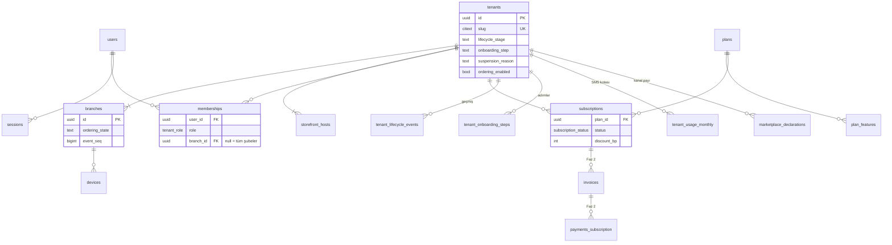
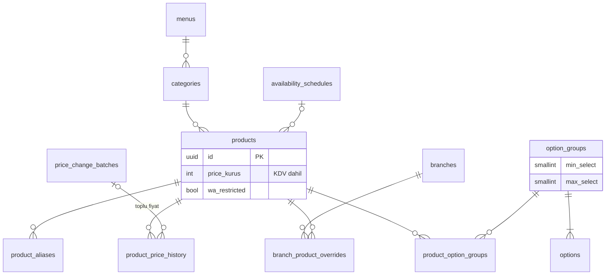
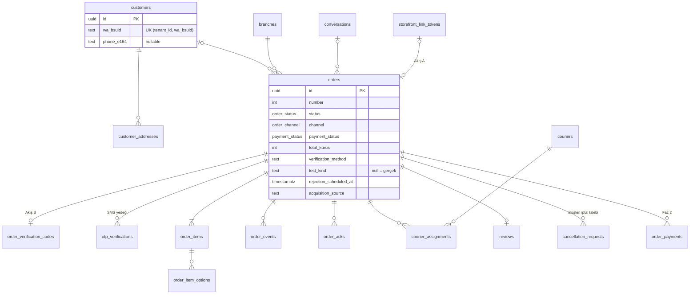
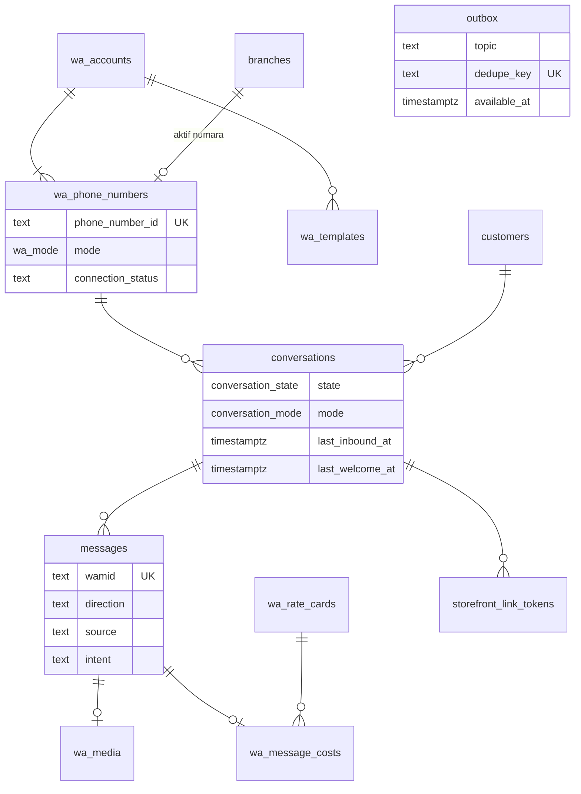
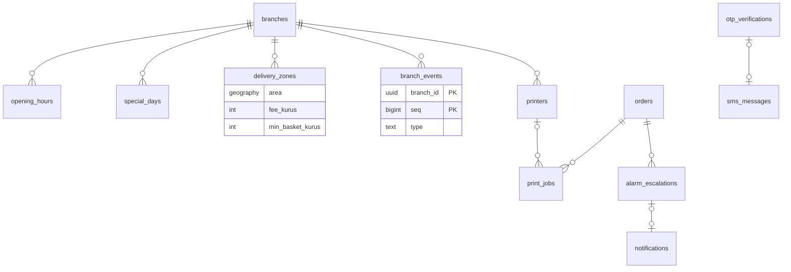
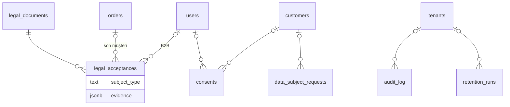
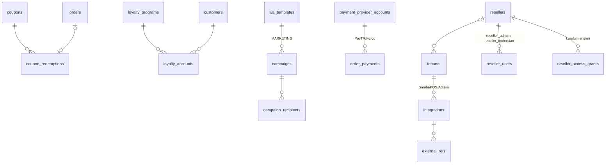
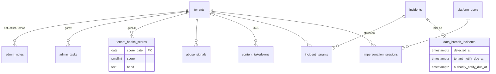
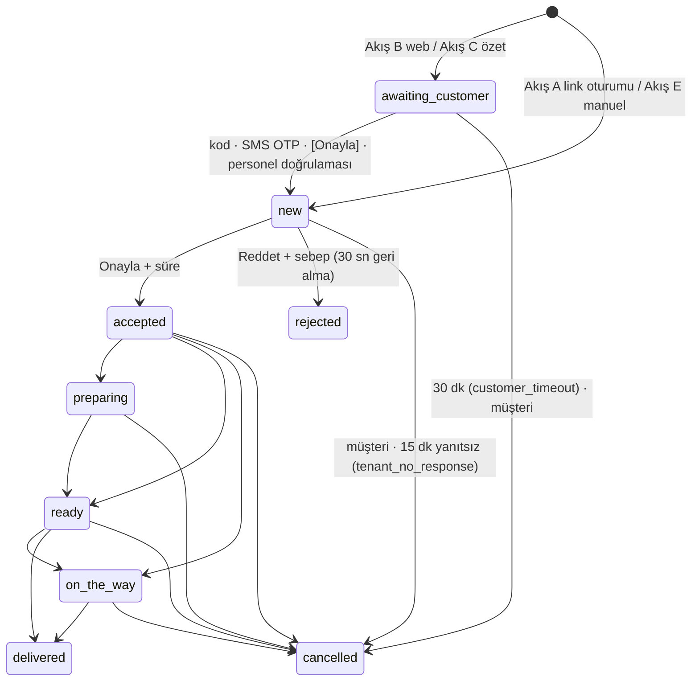
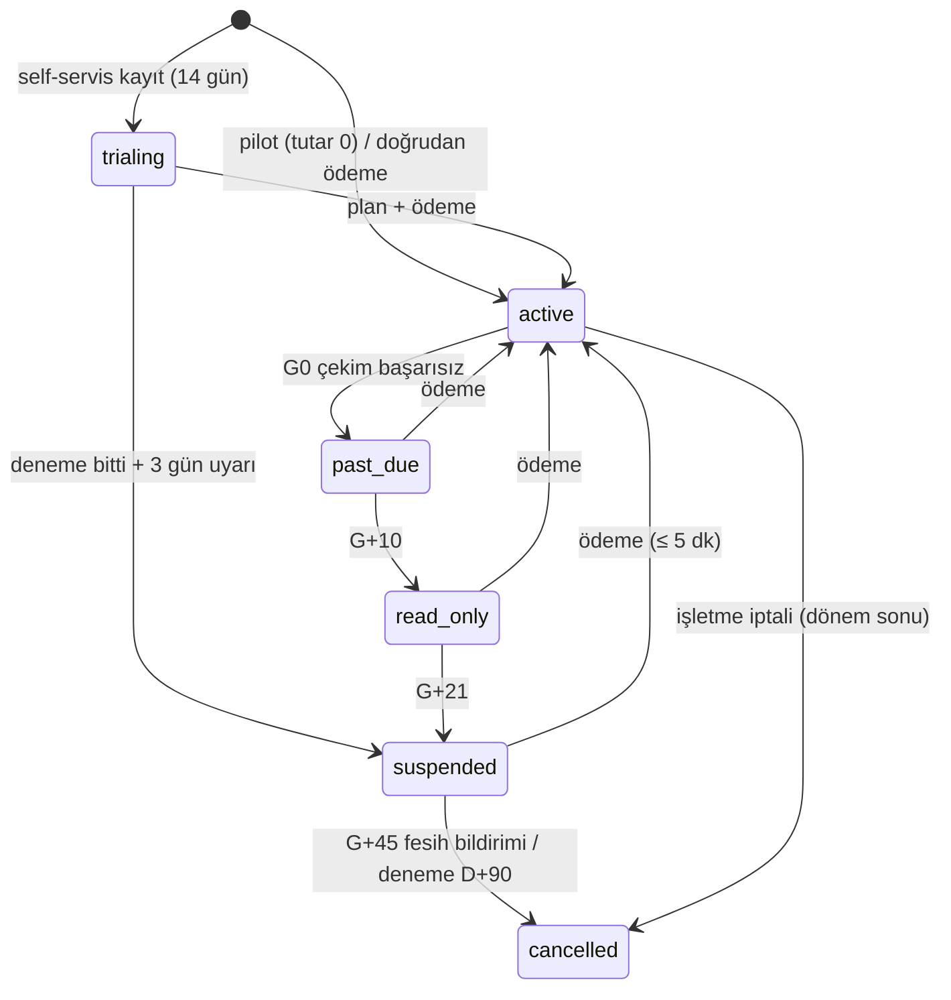

# 07 — Veri Modeli ve API

> **Amaç:** Geliştiricinin Drizzle şemasını, RLS politikalarını ve Fastify route'larını doğrudan çıkarabileceği somutlukta veri modeli, durum makineleri, API sözleşmeleri ve olay kataloğunu tanımlamak.
> **Tarih:** 2026-09-24 · **Durum:** Taslak (düzeltme turu sonrası) · **Bağlayıcı kaynak:** [Kararlar ve sözlük](00-kararlar-ve-sozluk.md) §3–§5 (sözlük, roller, oturum süreleri, kill-switch'ler, SMS kotası, durum makinesi, sebep kodları, `verification_method`, `test_kind`, adlandırma, kuyruklar), §7 (akışlar, mesaj koruma kuralları, `lifecycle_stage`), §9 (dunning, deneme bitişi, saklama), §10 (teknik kararlar). Çelişkide 00 geçerlidir.

**Kapsam:** Tablolar (alanlar, indeksler, RLS, PII/saklama), mermaid ERD, durum makineleri (sipariş, konuşma, abonelik, WhatsApp numarası, yazdırma işi), sepet/fiyat hesabı, REST + SSE + webhook sözleşmeleri, domain olayları ve outbox eşlemesi, rapor türetmeleri, saklama/silme işleri, migration ve seed.

**Kapsam dışı (bağlantı verilir):** WhatsApp davranışı, şablon metinleri, konuşma motoru → [02](02-whatsapp-entegrasyonu.md) · storefront ekranları ve müşteri metinleri → [03](03-musteri-deneyimi-ve-storefront.md) · panel ekranları → [04](04-isletme-paneli.md) · admin ekranları → [05](05-admin-paneli-ve-pazarlama-sitesi.md) · stack, kuyruk işleyişi, RLS rolleri, SSE altyapısı, güvenlik → [06](06-teknik-mimari.md) · saklama sürelerinin ve dunning'in hukuki dayanağı → [08](08-mevzuat-kvkk-odeme-fatura.md).

**Kaynaklar ve atıf:** `A01`, `A03`, `A04`, `A05`, `A06` = [arastirma/01-whatsapp-platform.md](arastirma/01-whatsapp-platform.md), [arastirma/03-mevzuat-odeme-fatura.md](arastirma/03-mevzuat-odeme-fatura.md), [arastirma/04-mimari-teknoloji.md](arastirma/04-mimari-teknoloji.md), [arastirma/05-urun-ux.md](arastirma/05-urun-ux.md), [arastirma/06-riskler-kirmizi-takim.md](arastirma/06-riskler-kirmizi-takim.md); `D01`…`D10` = aynı numaralı plan dokümanları ([01](01-vizyon-pazar-is-modeli.md), [02](02-whatsapp-entegrasyonu.md), [03](03-musteri-deneyimi-ve-storefront.md), [04](04-isletme-paneli.md), [05](05-admin-paneli-ve-pazarlama-sitesi.md), [06](06-teknik-mimari.md), [08](08-mevzuat-kvkk-odeme-fatura.md), [10](10-riskler-operasyon-ve-metrikler.md)); yalnız `§x` = bu doküman.

**Gösterim:** `NN` = NOT NULL, `✓` = nullable, `UK` = unique, `std` = standart kolonlar (§1.3). Roller: O = `owner`, M = `manager`, C = `cashier`, K = `kitchen`, Ku = `courier`; platform: PO = `platform_owner`, PA = `platform_admin`, SA = `support_agent`, F = `finance`, SR = `sales_rep`; bayi (Faz 2): RA = `reseller_admin`, RT = `reseller_technician`.

---

## 1. Genel kurallar **[Faz 1]**

### 1.1 Adlandırma ve tipler
- **Tablolar çoğul `snake_case`** (`tenants`, `orders`, `order_items`, `branch_events`; KARARLAR §5 "Adlandırma"). Sözlükteki tekil adlar varlık adıdır. `audit_log` ve `tenant_usage_daily` kütle adı olarak istisnadır. Kolonlar `snake_case`, Drizzle nesneleri camelCase, API JSON alanları `snake_case`.
- Enum değerleri KARARLAR ile **birebir**. Kararlı listeler `pgEnum`: `order_status`, `payment_status`, `payment_method`, `fulfillment_type`, `order_channel`, `tenant_role`, `platform_role`, `reseller_role`, `subscription_status`, `wa_mode`, `conversation_state`, `conversation_mode`. Değişebilecek listeler (sebep kodları, `verification_method`, `test_kind`, bildirim türleri, `lifecycle_stage`, `onboarding_step`, `suspension_reason`, mesaj niyeti) `text` + `CHECK`. Tek kaynak `packages/core/enums.ts` (Zod); CHECK kısıtları buradan üretilir.
- Son ekler: FK `_id`, an `_at`, tarih `_date`, para `_kurus`, oran `_bp` (baz puan; %10 = 1000), USD `_usd_micros` (1 $ = 1.000.000).
- Uzantılar: `postgis`, `pg_trgm`, `unaccent`, `citext`. Türkçe sıralama `COLLATE "tr-TR-x-icu"` (A04 §7.5).

### 1.2 Kimlikler
- PK `uuid`, **UUIDv7** (zaman sıralı). DB varsayılanı `DEFAULT uuidv7()` (PostgreSQL 18, D06 §4.3); outbox ve idempotency için uygulamada üretim tercih edilir. Better Auth aynı üreteci kullanır (`generateId`, teyit edilmeli).
- İstisnalar: `branch_events` PK `(branch_id, seq)`; `wa_webhook_events.id` = ham gövdenin SHA-256 hex'i; `feature_flags.key` metin.
- Dışa açık kimlikler: `orders.number` (şube bazında artan, 1001'den başlar, ekranda `#1047`); **takip token'ı** = `base62(HMAC-SHA256(tracking_key[kid], order_id))[:22]`. Token her an yeniden üretilebilir (sonraki durum mesajlarındaki link için); DB'de yalnız `tracking_token_hash` tutulur (D06 §15.3). **Takip linki teslimden 7 gün sonra geçersizdir** (KARARLAR §7): `orders.tracking_expires_at` = `delivered_at` (ret/iptalde final an) + 7 gün; sonrasında `/t/{token}` 410 `tracking_link_expired` döner. Sipariş kodu `order_verification_codes.code` (6 karakter, D02 §6.4). Storefront'ta UUID görünmez.

### 1.3 Zaman ve standart kolonlar
- Anlar `timestamptz` (UTC). Gösterim ve iş kuralları `Europe/Istanbul` (`branches.timezone`). Yerel saatler `time`, günler `date`; şubenin saat dilimiyle yorumlanır. Domain kodunda saat enjekte edilir (D06 §4.3).
- **İş günü:** `branches.business_day_cutoff` (varsayılan `05:00`). `orders.business_date = ((placed_at AT TIME ZONE tz) - cutoff)::date`; raporlar bu alanı kullanır.
- `std` = `id uuid PK`, `tenant_id uuid NN`, `created_at timestamptz NN DEFAULT now()`, `updated_at timestamptz NN DEFAULT now()` (Drizzle `$onUpdate` + `set_updated_at` trigger'ı).

### 1.4 Para
- Tutarlar **integer kuruş** (`integer`; rapor toplamlarında `bigint`). Float yok. Para taşıyan ana kayıtlarda `currency char(3) NN DEFAULT 'TRY'`.
- Menü fiyatları **KDV dahil** saklanır ve gösterilir (A03 §4.8). `vat_rate_bp` yalnız KDV kırılımı içindir; restoran hizmetinde varsayılan 1000 (%10, A03 §8.1; mali müşavir teyidi).
- Abonelik tutarlarımız **KDV hariç**; KDV %20 ayrı satır. Meta ücretleri `*_usd_micros`, TL tahmini `*_try_kurus` (`fx_rates`).

### 1.5 Silme politikası

| Varlık sınıfı | Politika |
|---|---|
| Katalog ve yapılandırma (şube, menü, kategori, ürün, seçenek, bölge, yazıcı, kurye profili) | Soft delete: `deleted_at timestamptz ✓`; benzersiz indeksler `WHERE deleted_at IS NULL`. Siparişler snapshot taşıdığı için 180 gün sonra hard delete edilebilir (Faz 2 işi). |
| İşlem kayıtları (sipariş, olay, fatura, ödeme, rıza, kabul, audit) | Silinmez; kişisel veri **anonimleştirilir** (§9). `order_events`, `audit_log`, `consents`, `legal_acceptances` append-only (uygulama rolünde UPDATE/DELETE yok). |
| Müşteri | Soft delete yok. Birleştirmede `merged_into_id`; KVKK silmede anonimleştirme. |
| Geçici/teknik (outbox, ham olay, yazdırma işi, token, kod, OTP) | Süresi dolunca hard delete (§9). |

### 1.6 Çok kiracılık ve RLS
- Kiracıya ait **her tabloda** `tenant_id uuid NN`. **İstisnalar** (platform tabloları; `tenant_id` yok veya nullable): `users` + Better Auth tabloları, `platform_users` + admin auth tabloları, `plans`, `plan_features`, `wa_rate_cards`, `fx_rates`, `feature_flags`, `announcements`, `legal_documents`, `leads`, `wa_webhook_events` (`tenant_id ✓`), `retention_runs` (`tenant_id ✓`), `incidents`, `data_breach_incidents`, `subprocessors`, `abuse_blocklist`, `content_takedowns` (`tenant_id ✓`), `data_subject_requests` (`tenant_id ✓`; `controller = 'platform'` satırlarında boş). Bunlara yalnız ilgili servis yolu erişir.
- **Yalnız admin tabloları** (`tenant_id` taşır ama işletme paneli göremez; `app_user` için politika yoktur, yalnız `app_admin` okur/yazar): `tenant_lifecycle_events`, `admin_notes`, `admin_tasks`, `tenant_health_scores`, `abuse_signals`, `incident_tenants`. İşletme kendi `impersonation_sessions` kayıtlarını görür (D04 §7.14).
- DB rolleri D06 §5.3 ile aynıdır: `app_owner` (tablo sahibi, migration), `app_user` (api + worker, `NOBYPASSRLS`), `app_admin` (admin API; kiracı tablolarında yalnız `platform_read` SELECT politikası, yalnız admin tablolarında yazma; tenant adına yazma impersonation + `app_user` ile), `app_system` (`BYPASSRLS`; yalnız `sys_*` `SECURITY DEFINER` fonksiyonlarının sahibi).
- Politika şablonu (CI kataloğu doğrular):

```sql
ALTER TABLE orders ENABLE ROW LEVEL SECURITY;
ALTER TABLE orders FORCE  ROW LEVEL SECURITY;
CREATE POLICY tenant_isolation ON orders TO app_user
  USING      (tenant_id = nullif(current_setting('app.tenant_id', true), '')::uuid)
  WITH CHECK (tenant_id = nullif(current_setting('app.tenant_id', true), '')::uuid);
CREATE POLICY platform_read ON orders FOR SELECT TO app_admin USING (true);
```

- Her istek/iş `withTenant(ctx, tx => …)` içinde çalışır: `set_config('app.tenant_id', …, true)` ve `set_config('app.actor', …, true)`. Oturum düzeyi `SET` yasaktır.
- Tenant çözümleme: storefront → `sys_resolve_host(host)` (`storefront_hosts`, Redis 60 sn); panel → oturumdaki aktif tenant + üyelik; WhatsApp worker → `sys_wa_route(phone_number_id)` (`tenant_id, branch_id` döner); platform cron → `sys_*` fonksiyonları yalnız kimlik listesi döner, iş tenant başına ayrı transaction'da yapılır (D06 §5.5).
- **Şube yetkisi RLS'de değil**, API'deki `authorize()` içindedir (`memberships.branch_id`). RLS yalnız tenant sınırını korur.
- **Bileşik FK:** her kiracı tablosunda `UNIQUE (tenant_id, id)`; çocuklar `FOREIGN KEY (tenant_id, parent_id) REFERENCES parent (tenant_id, id)`. İndekslerde `tenant_id` ilk sütundur.

```ts
// packages/db/schema/orders.ts (kısaltılmış) — FORCE RLS ve platform_read özel SQL migration'ında
export const orders = pgTable('orders', {
  id: uuid('id').primaryKey().default(sql`uuidv7()`),
  tenantId: uuid('tenant_id').notNull(),
  branchId: uuid('branch_id').notNull(),
  status: orderStatus('status').notNull(),
  totalKurus: integer('total_kurus').notNull(),
  version: integer('version').notNull().default(1),
}, (t) => [
  unique('orders_tenant_id_id_uk').on(t.tenantId, t.id),
  foreignKey({ columns: [t.tenantId, t.branchId], foreignColumns: [branches.tenantId, branches.id] }),
  index('orders_open_idx').on(t.tenantId, t.branchId, t.status)
    .where(sql`status in ('awaiting_customer','new','accepted','preparing','ready','on_the_way')`),
  tenantIsolation(), // pgPolicy: tenant_id = nullif(current_setting('app.tenant_id', true), '')::uuid
]).enableRLS();
```

### 1.7 Snapshot ilkesi
Sipariş anındaki veri kopyalanır; sonraki menü veya ayar değişikliği geçmiş siparişi değiştirmez.
- `order_items`: ürün adı, kategori adı, birim fiyat (şube override'ı uygulanmış), KDV oranı, satır tutarı. `order_item_options`: grup adı, seçenek adı, fiyat farkı, adet.
- `orders`: müşteri adı, teslimat telefonu, adres (yapılandırılmış + metin + nokta), bölge adı ve süresi, teslimat ücreti, uygulanan min sepet, ödeme yöntemi, yemek kartı markası, onay anındaki tutar hash'i. Yasal metin sürümleri `legal_acceptances`'ta siparişe bağlıdır.
- Analiz FK'ları (`product_id`, `delivery_zone_id`, `customer_address_id`) `ON DELETE SET NULL`; tutar asla bunlardan yeniden hesaplanmaz.

### 1.8 PII işaretleme ve saklama kolonları
- Kişisel veri kolonu Drizzle'da `pii('<sınıf>')` ile tanımlanır; migration `COMMENT ON COLUMN … IS 'pii:<sınıf>'` yazar. `packages/db/pii-registry.ts` bu listeden üretilir. Log/Sentry maskesi, KVKK dışa aktarımı, anonimleştirme işi ve staging maskesi bu kayıttan beslenir.
- Sınıflar: `identity` (ad, kullanıcı adı, VKN/TCKN), `contact` (telefon, e-posta, BSUID), `location` (adres, koordinat, tarif), `content` (mesaj, medya, işletme notu), `content-sensitive` (sipariş/kalem notu; sağlık verisi riski, D08 §2.7), `network` (IP, user agent).
- Saklama kolonları: silme işi indeksle çalışsın diye `purge_at` (mesaj, medya, ham olay), `note_purge_at` (sipariş notu), `anonymize_at` (müşteri; her siparişte ve gelen mesajda yeniden hesaplanır). İşlenen kayıtta `content_purged_at`, `anonymized_at`, `pii_scrubbed_at` damgaları tutulur. Süreler D08 §2.8'den gelir (§9).
- **Yapılandırılmış alerji/sağlık alanı yoktur.** Alerjenler yalnız ürün özelliğidir (`products.allergens`); şema testi bunu doğrular.

### 1.9 İyimser kilit
- `version integer NN DEFAULT 1`: `tenants`, `branches`, `products`, `categories`, `option_groups`, `delivery_zones`, `customers`, `orders`, `conversations`, `subscriptions`, `wa_accounts`, `wa_phone_numbers`.
- `UPDATE … SET …, version = version + 1 WHERE id = $1 AND version = $2`; 0 satır → 409 `version_conflict` (yanıtta güncel kayıt). GET yanıtında `ETag: "v7"`; yazmada `If-Match: "v7"` veya gövdede `version`. Sipariş aksiyonlarında zorunludur; hedef duruma zaten geçilmişse 200 no-op döner (D06 §8.3).

---

## 2. ERD

Yalnız anahtar alanlar gösterilir; tam liste §3'te. Kiracı tablolarında `tenant_id` ve bileşik FK örtüktür.

### 2.1 (a) Platform, kiracı, kullanıcı, abonelik



### 2.2 (b) Menü



### 2.3 (c) Müşteri, sipariş, ödeme, kurye



### 2.4 (d) WhatsApp ve mesajlaşma



### 2.5 (e) Operasyon



### 2.6 (f) Uyum



### 2.7 (g) Faz 2–3 modülleri



### 2.8 (h) Admin, destek ve uyum kayıtları



---

## 3. Tablo sözlüğü

Faz 1 tabloları tam ayrıntılı; küçük tablolarda alanlar satır içinde listelenir. RLS notu yoksa politika §1.6'daki `tenant_isolation` + `platform_read`'dir.

### 3.0 Ortak enum ve kodlar

| Ad | Değerler | Kaynak |
|---|---|---|
| `order_status` | `awaiting_customer`, `new`, `accepted`, `preparing`, `ready`, `on_the_way`, `delivered`, `rejected`, `cancelled` | KARARLAR §5 |
| `rejection_reason` | `closed`, `out_of_zone`, `item_unavailable`, `too_busy`, `duplicate`, `suspected_fake`, `other` (not zorunlu) | KARARLAR §5 |
| `cancelled_by` / `cancel_reason` | `customer`, `tenant`, `system` / `customer_request`, `customer_timeout`, `tenant_no_response`, `item_unavailable`, `courier_issue`, `duplicate`, `suspected_fake`, `payment_timeout` (Faz 2 online ödeme), `other` | KARARLAR §5 |
| `payment_status` / `payment_method` | `unpaid`, `pending`, `paid`, `failed`, `refunded`, `partially_refunded` / `cash_on_delivery`, `card_on_delivery`, `meal_card_on_delivery`, `online_card` (Faz 2), `pay_at_counter` | KARARLAR §5 |
| `fulfillment_type` / `order_channel` | `delivery`, `pickup`, `dine_in` (Faz 3) / `wa_link`, `wa_ai` (Faz 2), `web`, `table_qr` (Faz 3), `manual`, `wa_flow` (Faz 3) | KARARLAR §5, §7 |
| `meal_card_brand` | `multinet`, `pluxee`, `edenred`, `setcard`, `metropol`, `other` | KARARLAR §5 |
| `tenant_role` / `platform_role` / `reseller_role` | `owner`, `manager`, `cashier`, `kitchen`, `courier` / `platform_owner`, `platform_admin`, `support_agent`, `finance`, `sales_rep` / `reseller_admin`, `reseller_technician` (Faz 2) | KARARLAR §4 |
| `subscription_status` / `lifecycle_stage` | `trialing`, `active`, `past_due`, `read_only`, `suspended`, `cancelled` / `lead`, `onboarding`, `pilot`, `trial`, `active`, `past_due`, `read_only`, `suspended`, `churned` | KARARLAR §7 |
| `onboarding_step` | `account_created`, `profile_done`, `menu_done`, `ops_done`, `web_live` (Kapı 1), `wa_connected`, `meta_payment_ok`, `wa_test_done`, `live` (Kapı 2) | D05 §A.2.2, D04 §3.3 |
| `suspension_reason` | Otomatik: `payment` (dunning G+21), `trial_ended`, `pilot_ended`; admin: `policy`, `abuse`, `legal` | D05 §A.2.1 |
| `ordering_state` | Saklanan: `open`, `busy`, `paused`; hesaplanan: `closed` (çalışma saati dışı) | KARARLAR §7 |
| `verification_method` / `status_notify_channel` | `wa_link` (Akış A token), `wa_code` (Akış B kod), `sms_otp`, `staff` (manuel sipariş, "Telefonla doğruladım") / `whatsapp`, `sms`, `none` | KARARLAR §5 |
| `test_kind` | `onboarding_test`, `canary`; `NULL` = gerçek sipariş. Test siparişleri rapor, metrik ve faturalamadan hariçtir | KARARLAR §5 |
| `message_intent` | `greeting`, `menu_request`, `order_code`, `order_status_query` ("siparişim nerede"), `cancel_request`, `handoff_request`, `complaint`, `hours_address`, `free_text_order` (Faz 2), `review_reply`, `stop`, `off_topic`, `other` | D10 §8.4, D02 §6 |
| `acquisition_source` | `marketplace_card` (pazaryeri paketine konan kart/QR), `marketplace_declared` (müşteri/işletme "pazaryerinden geldi" dedi), `in_store_qr`, `google`, `instagram`, `word_of_mouth`, `referral`, `returning`, `unknown` | D10 §8.3, D03 §2 |
| `wa_mode` | `cloud`, `coexistence` | KARARLAR §3 |
| `conversation_state` / `conversation_mode` | `idle`, `greeting`, `menu_link_sent`, `order_linking`, `order_active`, `ai_ordering`, `awaiting_confirm` / `bot`, `human` | D02 §6.1 |

### 3.1 Platform, kiracı, kullanıcı, abonelik

#### `tenants` **[Faz 1]**
İşletme (kiracı); Better Auth organization bu tabloya eşlenir. RLS: `id = app.tenant_id`.

| Alan | Tip | Null | Açıklama |
|---|---|---|---|
| `id`, `created_at`, `updated_at`, `version` | | NN | |
| `slug` | citext | NN, UK | Alt alan adı; `^[a-z0-9](-?[a-z0-9]){2,39}$`; ayrılmış adlar D06 §3.4 |
| `display_name` / `legal_name` | text | NN / ✓ | Marka adı / ticari unvan (künye, fatura) |
| `tax_number`, `tax_office`, `billing_address`, `billing_email` | text | ✓ | Fatura profili; şahıs işletmesinde TCKN (`pii:identity`) |
| `contact_phone_e164`, `food_registration_no` | text | ✓ | İletişim; gıda işletme kayıt no (künye) |
| `vertical` | text | NN | `restaurant` (Faz 1); `water`, `patisserie` (Faz 2) |
| `lifecycle_stage`, `lifecycle_changed_at` | text, timestamptz | NN | Admin yaşam döngüsü (KARARLAR §7, D05 §A.2.1). **Elle yazılmaz**, `core.deriveLifecycleStage()` türetir (§4.3); her değişiklik `tenant_lifecycle_events`'e yazılır. `lead` aşaması `leads` tablosunda yaşar (tenant yok) |
| `onboarding_step`, `onboarding_step_at` | text, timestamptz | NN | Son tamamlanan adım (§3.0; D05 §A.2.2 ve D04 §3.3 ile aynı kodlar) ve o adıma giriş anı ("takılan adım": canlı değil ve > 48 sa [T]). Adım geçmişi `tenant_onboarding_steps` |
| `web_live_at`, `live_at` | timestamptz | ✓ | Kapı 1 (web siparişi, WhatsApp'sız mod) ve Kapı 2 (tam canlı); aktivasyon penceresi `live_at` + 14 gün |
| `signup_approved_at`, `signup_approved_by` | timestamptz, uuid | ✓ | Faz 1 onaylı kayıt: sahte işletme, Commerce Policy ve Meta kotası kontrolü (D05 §C.5.2); `web_live` bunu gerektirir |
| `suspension_reason`, `suspended_at`, `suspended_by_platform_user_id`, `suspension_note` | text, timestamptz, uuid, text | ✓ | Askı sebebi (§3.0). `payment`/`trial_ended`/`pilot_ended` abonelik olayından otomatik; `policy`/`abuse`/`legal` admin askısıdır (gerekçe zorunlu, audit) ve abonelik durumundan bağımsız `lifecycle_stage = suspended` yapar |
| `ordering_enabled`, `ordering_disabled_reason` | bool, text | NN / ✓ | Tenant bazında kill-switch (KARARLAR §4); false → storefront ve bot "şu an online sipariş alınmıyor, lütfen arayın"; varsayılan true |
| `storefront_published`, `storefront_unpublished_reason` | bool, text | NN / ✓ | Künye eksik (`imprint_missing`), onay bekliyor (`not_approved`), içerik kaldırma (`takedown`), sahte işletme şüphesi (`fake_business`) |
| `health_score`, `health_band`, `health_computed_at` | smallint, text, timestamptz | ✓ | Son günlük sağlık skoru (0–100; `green`/`yellow`/`red`) denormalize kopyası; geçmiş `tenant_health_scores` (D10 §5.6) |
| `account_manager_platform_user_id` | uuid | ✓ | Satış/başarı sorumlusu (SR; D05 A-03) |
| `is_demo` | bool | NN | Demo/sandbox/iç tenant (D05 §B.5, §10 seed); platform metrikleri, MRR ve faturalamadan hariç; Meta/SMS maliyeti "demo" etiketiyle izlenir |
| `signup_ref_code` | text | ✓ | **[Faz 2]** Kayıttaki ilk geçerli bayi (`?b=`) veya referans (`?r=`) kodu (D05 §B.3) |
| `bot_enabled` / `ai_enabled` | bool | NN | Konuşma botu (true) / AI sipariş (Faz 2, false) |
| `bot_mute_minutes` | smallint | NN | Echo/panel yanıtından sonra bot susması; 10–120, varsayılan 30 (D02 §6.10) |
| `sms_fallback_enabled` | bool | NN | "WhatsApp'sız mod" (SMS OTP) izni; varsayılan true |
| `message_settings` | jsonb | NN | Karşılama metni (promosyon filtresinden geçer), durum bildirimi aç/kapa (`preparing` false), debounce süresi |
| `savings_commission_bp` | int | ✓ | İşletmenin girdiği pazaryeri kesinti oranı; tasarruf kartı ve aylık değer raporu (§8, D10 §5.6) |
| `retention_customer_months` | smallint | NN | 6–24, varsayılan 24 (D08 §2.8 satır 6) |
| `is_pilot`, `is_founding_member`, `reseller_id` | bool, bool, uuid | NN, NN, ✓ | `reseller_id` Faz 2 |
| `closed_at`, `data_export_until` | timestamptz | ✓ | Fesih ve dışa aktarma penceresi sonu (silme günü) |

İndeks `UNIQUE(slug)`, `(lifecycle_stage)`, `(onboarding_step, onboarding_step_at) WHERE live_at IS NULL` (takılan adım), `(health_band)`. `tenants.status` diye bir kolon **yoktur**; yaşam döngüsü yalnız `lifecycle_stage`'dir (KARARLAR §7). Admin kolonları (`health_*`, `account_manager_*`, `suspension_note`) işletme paneli projeksiyonunda yer almaz. Saklama: `retention.tenant_offboarding` (§9); kiracı satırı ve faturalar 10 yıl.

#### `tenant_lifecycle_events`, `tenant_onboarding_steps` **[Faz 1]**
- `tenant_lifecycle_events` (yalnız admin, append-only; D05 §A.2.1 huni ve churn metriklerinin kaynağı): `id`, `tenant_id`, `from_stage ✓` (ilk satırda `lead`, `lead_id ✓` ile), `to_stage NN`, `cause` (`signup`, `onboarding_step`, `subscription_status_changed`, `pilot_assigned`, `pilot_ended`, `trial_extended`, `admin_suspend`, `admin_unsuspend`, `winback`), `subscription_status ✓`, `suspension_reason ✓`, `actor_type` (`system`, `admin`), `actor_platform_user_id ✓`, `note ✓`, `occurred_at`. İndeks `(tenant_id, occurred_at)`, `(to_stage, occurred_at)`. `churned → onboarding` (geri kazanım, veri silinmediyse aynı tenant) desteklenir. Saklama: tenant satırıyla.
- `tenant_onboarding_steps` (panel sihirbazı okur, admin hunisi D05 A-05 bundan beslenir): PK `(tenant_id, step)`; `completed_at`, `completed_by_user_id ✓` / `completed_by_platform_user_id ✓` (concierge), `source` (`wizard`, `concierge`, `reseller`, `system`), `skipped` (`web_live` isteğe bağlıdır, D04 §3.3), `reopened_at ✓` (ör. WhatsApp koptu → `wa_connected` geri açılır). Embedded Signup alt hunisi `wa_onboarding_sessions`'tadır (§3.4).

#### `branches` **[Faz 1]**

| Alan | Tip | Null | Açıklama |
|---|---|---|---|
| std, `version`, `deleted_at` | | | |
| `name`, `slug`, `is_default` | text, text, bool | NN | Tek şubede görünmez varsayılan şube; `UNIQUE(tenant_id) WHERE is_default` |
| `address_text`, `city`, `district`, `location` | text…, geography(Point,4326) | NN | Gel-al adresi, künye, mesafe |
| `phone_e164` | text | ✓ | İşletmenin aranacak numarası (askı ve özür mesajlarında gösterilir) |
| `timezone`, `business_day_cutoff` | text, time | NN | `Europe/Istanbul`, `05:00` |
| `delivery_enabled`, `pickup_enabled`, `dine_in_enabled` | bool | NN | |
| `accepted_payment_methods`, `accepted_meal_card_brands` | payment_method[], text[] | NN | Kurye doğru cihazı alsın diye markalar |
| `default_prep_minutes`, `default_delivery_minutes`, `min_order_pickup_kurus` | smallint, smallint, int | NN | ETA önerisi, gel-al min sepet |
| `ordering_state` | text | NN | `open`, `busy`, `paused` (CHECK); `closed` saklanmaz, `core.effectiveOrderingState()` hesaplar |
| `busy_extra_minutes`, `paused_until`, `pause_reason` | smallint, timestamptz, text | ✓ | Yoğunluk modu (+15/+30 dk); "Sipariş almayı durdur" (15/30/60 dk/bugün) |
| `use_preparing_step` | bool | NN | `preparing` adımı (false) |
| `alarm_policy` | jsonb | NN | Kanonik zamanlama (KARARLAR §10): `{"push_sec":0,"sound_repeat_sec":60,"platform_wa_sec":[120,300],"sms_sec":300,"customer_notice_sec":600,"platform_wa_enabled":true,"sms_enabled":true,"notify_manager":false}`; t=0 ses + Web Push, 60 sn ses tekrarı, 2 dk platform WhatsApp, 5 dk SMS, 10 dk müşteriye bilgi (ayar 8–15), 15 dk iptal. "Otomatik reddet" yoktur (D04 §7.7) |
| `new_order_timeout_min` | smallint | NN | `new` → `cancelled` (`cancelled_by = system`, `tenant_no_response`) süresi; varsayılan 15 (15/20/30) |
| `eta_chips_min`, `last_order_minutes_before_close` | smallint[], smallint | NN / ✓ | Onay süre çipleri (varsayılan `{15,20,30,45,60}`, en çok 6); son sipariş saati (kapanıştan N dk önce checkout kapanır, D04 §7.3) |
| `phone_confirm_rule` | jsonb | ✓ | "İlk sipariş ve tutar > X TL ise telefonla teyit" (`{"first_order_over_kurus":50000}`; D10 §5.7); sipariş kartında rozet, akışı durdurmaz |
| `panel_offline_auto_pause` | bool | NN | Panel çevrimdışıysa storefront'u durdur (D06 §7.7; false) |
| `auto_accept_rules` | jsonb | ✓ | **[Faz 2]** Kurallı otomatik kabul, varsayılan kapalı |
| `scheduled_enabled`, `scheduled_max_days`, `scheduled_min_lead_min` | bool, smallint, smallint | NN | Planlı sipariş |
| `delivery_fee_vat_bp`, `receipt_width_mm` | int, smallint | NN | Teslimat ücreti KDV oranı (teyit edilmeli); 80/58 |
| `order_seq`, `event_seq` | bigint | NN | `orders.number` ve `branch_events.seq` sayaçları (`UPDATE … RETURNING`, aynı tx) |

İndeks `UNIQUE(tenant_id,id)`, `UNIQUE(tenant_id,slug) WHERE deleted_at IS NULL`. PII yok.

#### `storefront_hosts` **[Faz 1]**
std, `hostname citext UK` (`lezzet.siparisinonunde.com`), `branch_id ✓`, `kind` (`subdomain`; Faz 3 `custom`), `is_primary`, `status` (`active`, `pending_verification`, `disabled`), `redirect_to ✓` (slug değişince eski host 90 gün yönlendirir), `cf_custom_hostname_id ✓`, `ssl_status ✓`, `verified_at ✓` (Faz 3). Arama `sys_resolve_host()` ile (D06 §5.2, §12).

#### `users` ve Better Auth tabloları **[Faz 1]** (platform)
- `users` (`panelAuth`; işletme kullanıcıları, kurye, bayi): `id uuid PK`, `email citext UK ✓` (kurye e-postasız olabilir), `email_verified`, `phone_e164 UK ✓`, `phone_verified`, `name NN` (`pii:identity`), `image ✓`, `two_factor_enabled`, `locale`, `last_login_at`, `disabled_at`. RLS: kendi satırı veya aynı tenant'ta üyeliği olanlar.
- `sessions` (`token` hash, `expires_at` — işletme paneli **30 gün** (kayıtlı cihaz), kurye **12 saat** (vardiya) (KARARLAR §4); `kind` (`panel`, `courier`, `impersonation`), `ip_address`, `user_agent` `pii:network`, `active_tenant_id`, `impersonated_by`, `impersonation_session_id ✓`), `accounts` (parola hash'i), `verifications` (kurye magic link tek kullanım, açılmazsa 15 dk'da düşer; OTP), `two_factors` (TOTP sırrı envelope encryption, yedek kodlar hash'li), `invitations` (`tenant_id`, `email`/`phone`, `role`, `branch_id`, `status`, `expires_at` 7 gün).
- `platform_users` (`adminAuth`, ayrı örnek ve çerez; D06 §6.1): `email UK NN`, `name`, `platform_role NN`, `two_factor_enabled` (her zaman true), `last_login_at`, `disabled_at`; oturumlar `platform_sessions` (**8 saat** + 30 dk hareketsizlikte kilit, KARARLAR §4), `platform_accounts`, `platform_two_factors`.
- Adlar Better Auth `modelName`/`fields` ayarıyla eşlenir (organization → `tenants`, member → `memberships`); şema kütüphane CLI'sıyla üretilip Drizzle'a alınır. Saklama: hesap kapanışı + 30 gün (`retention.users`).

#### `memberships` **[Faz 1]**
std, `user_id NN`, `role tenant_role NN`, `branch_id ✓` (null = tüm şubeler; bileşik FK), `status` (`invited`, `active`, `disabled`), `invited_by_user_id`, `joined_at`, `pin_hash ✓` (4–6 haneli personel PIN'i, argon2id), `pin_failed_count`, `pin_locked_until ✓` (5 hatada 5 dk; D06 §6.3). Kısıt `UNIQUE NULLS NOT DISTINCT (tenant_id, user_id, branch_id)`; tenant başına ≥ 1 aktif `owner` (deferred trigger). Plan limiti `plan_features.max_users` (Esnaf 2).

#### `devices` **[Faz 1]**
Panel cihazı: çevrimdışı dedektörü, push, PIN'li cihaz oturumu, tarayıcı yazdırma sahibi.

| Alan | Tip | Null | Açıklama |
|---|---|---|---|
| std, `branch_id`, `label` | | NN | "Kasa tableti" |
| `kind` | text | NN | `browser`, `pwa`, `android_app` (Faz 2), `print_agent` (Faz 2) |
| `role` | tenant_role | ✓ | Paylaşılan cihazın rolü (`kitchen`, `cashier`); kişisel cihazda boş |
| `token_hash`, `paired_by_user_id`, `paired_at` | text, uuid, timestamptz | ✓ | 8 haneli kodla eşleştirme; cihaz token'ı 90 gün (D06 §6.3) |
| `last_user_id` | uuid | ✓ | Son PIN'le giren personel (audit) |
| `push_subscription` | jsonb | ✓ | Web Push endpoint + anahtarlar |
| `app_version`, `user_agent` | text | ✓ | |
| `audio_unlocked`, `wake_lock_active`, `is_print_host` | bool | NN | 60 sn heartbeat ile |
| `last_seen_at`, `sse_connected_at`, `last_event_seq` | timestamptz, timestamptz, bigint | ✓ | |
| `revoked_at` | timestamptz | ✓ | İptal → 60 sn içinde SSE düşer |

İndeks `(tenant_id, branch_id, last_seen_at DESC)`. Saklama: iptal + 90 gün.

#### `plans` ve `plan_features` **[Faz 1]** (platform)
- `plans`: `code UK` (`esnaf`, `pro`, `zincir`), `name`, `price_monthly_kurus` (99000 / 179000 / 299000), `price_yearly_kurus` (950400 / 1718400 / 2870400), `per_branch` (Zincir), `vat_rate_bp` (2000), `is_sellable` (Zincir Faz 2'de true), `sort`. TÜFE güncellemesi satırı değiştirir.
- `plan_features` (paket hakları; feature flag değildir, D06 §16.6): PK `(plan_id, feature_key)`, `enabled`, `limit_value ✓`. Anahtarlar: `max_users` (Esnaf 2), `max_delivery_zones` (Esnaf 3), `courier_view` (Pro+), **`sms_monthly_quota`** (adil kullanım: Esnaf 100, Pro 300 SMS/ay, KARARLAR §4; Zincir değeri Faz 2'de satışla belirlenir), `ai_ordering`, `coupons`, `loyalty`, `campaigns`, `online_payment`, `pos_integration`, `multi_branch`, `advanced_reports`, `custom_domain`, `open_api`. İçerik matrisi D01 §6.3.

#### `tenant_usage_monthly` **[Faz 1]** (SMS kotası sayacı)
PK `(tenant_id, month date)`; `sms_count int NN` (kotaya sayılan: müşteriye giden `otp` + `order_status` SMS'leri), `sms_ops_count` (sayılmayan platform operasyon SMS'leri: `alarm`, `panel_offline`, `courier_login`), `sms_quota` (ay başında `plan_features.sms_monthly_quota`'dan kopyalanır), `sms_quota_warned_at ✓` (%80), `sms_quota_exceeded_at ✓`, `platform_wa_count`, `llm_tokens_in/out` (Faz 2), `updated_at`. Sayaç `sms.send` işinde aynı transaction'da `UPDATE … SET sms_count = sms_count + 1` ile artar (segment sayısı maliyet için `sms_messages.segments`'te). **Kota aşımında SMS kesilmez**: işletmeye panel + e-posta uyarısı gider, admin A-07'de görünür; ek SMS paketi Faz 2 (KARARLAR §4). Pilot ve `is_demo` tenant'larda kota uygulanmaz, sayım sürer.

#### `subscriptions` **[Faz 1 kayıt · Faz 2 tahsilat]**

| Alan | Tip | Null | Açıklama |
|---|---|---|---|
| std, `version`, `plan_id` | | NN | |
| `status` | subscription_status | NN | §4.3 |
| `billing_interval`, `quantity` | text, smallint | NN | `month`/`year`; Zincir'de şube sayısı |
| `unit_price_kurus` | int | NN | Dönem başında plan liste fiyatından (KDV hariç) |
| `discount_bp`, `discount_until` | int, date | ✓ | Kurucu üye: 12 ay sabit **%30 oran** (3000); liste fiyatı TÜFE ile değişebilir (KARARLAR §8) |
| `founding_seq` | int | ✓, UK | İlk 100 sayacı |
| `is_pilot`, `pilot_ends_at`, `trial_ends_at` | bool, timestamptz, timestamptz | | Pilot 3 ay ücretsiz; deneme 14 gün kartsız |
| `current_period_start`, `current_period_end` | timestamptz | ✓ | |
| `past_due_since`, `read_only_at`, `suspended_at`, `cancelled_at`, `cancel_reason`, `cancel_at_period_end` | | ✓ | Dunning damgaları (§4.3); `cancel_reason` burada abonelik iptal sebebidir (çıkış görüşmesi kodu, D10 §5.6), sipariş `cancel_reason`'ından ayrıdır |
| `trial_warning_started_at` | timestamptz | ✓ | Deneme bitti, 3 günlük uyarı bandı başladı (KARARLAR §9) |
| `grace_until`, `grace_reason` | date, text | ✓ | Finans ek süresi (en fazla 7 gün, tek sefer, gerekçeli; D05 A-08) |
| `psp_provider`, `psp_customer_ref`, `psp_card_ref`, `card_last4`, `card_brand` | text | ✓ | Faz 2; yalnız PSP token'ı |

Kısıt `UNIQUE(tenant_id) WHERE status <> 'cancelled'`. Saklama 10 yıl.

#### `invoices`, `payments_subscription` **[Faz 2]**
- `invoices`: `subscription_id`, `number UK` (ödeme referansı `SO-2026-000123`, D08 §6.4), `status` (`draft`, `issued`, `paid`, `void`, `refunded`), `period_start/end`, `lines jsonb`, `subtotal_kurus`, `vat_kurus`, `total_kurus`, `due_at`, `paid_at`, `buyer_snapshot jsonb` (`pii:identity`), `einvoice_type` (`e_fatura`, `e_arsiv`), `einvoice_external_id` (Paraşüt), `einvoice_uuid` (ETTN), `einvoice_status` (`pending`, `sent`, `formalized`, `failed`; D05 A-08), `pdf_storage_key`. Paraşüt idempotency anahtarı = `invoices.id`.
- `payments_subscription`: `invoice_id`, `method` (`card`, `bank_transfer`), `psp_payment_id UK ✓`, `amount_kurus`, `status` (`pending`, `succeeded`, `failed`, `refunded`), `attempt_no`, `failure_code`, `bank_reference ✓`, `matched_by_platform_user_id ✓`, `raw jsonb` (kart verisi yok). İkisi de 10 yıl. Hesap alacağı defteri `account_credits` Faz 2 (D08 §6.6).

#### `leads` **[Faz 1]** (platform)
`source` (`demo_form`, `calculator`, `field`, `reseller`, `referral`, `chamber`, `event`, `inbound_call`; D05 A-20), `business_name`, `contact_name`, `phone_e164`, `email` (`pii:*`), `city`, `district`, `vertical`, `daily_orders_band` (`0-10`, `10-20`, `20-40`, `40-80`, `80+`), `marketplaces text[]`, `calculator_snapshot jsonb ✓` (hesaplayıcı girdi ve çıktıları), `owner_platform_user_id` (SR), `stage` (`new`, `contacted`, `demo_scheduled`, `demo_done`, `proposal`, `won`, `lost`), `lost_reason ✓` (`price`, `already_whatsapp`, `timing`, `unreachable`, `not_fit`, `commerce_policy`), `next_step`, `next_step_at` (açık aşamada NN), `wa_opt_in_at ✓` (Meta opt-in), `b2b_objection_at ✓` (ticari ileti ret kaydı, D08 §3.7), `notes`, `utm jsonb`, `landing_page`, `tenant_id ✓` (`won` yalnız tenant'a bağlanarak kapanır), `last_contact_at`. Tekrar kontrolü: aynı telefon/VKN'li açık lead veya tenant uyarısı. Saklama 12 ay hareketsizlik (`retention.leads`).

### 3.2 Menü

#### `menus` **[Faz 1]**
std, `name`, `is_active`, `revision bigint NN` (menü, fiyat veya stok değişiminde artar → storefront `ETag` ve `revalidateTag('menu:{branchId}')`), `deleted_at`. Faz 1'de tenant başına 1 aktif menü.

#### `categories` **[Faz 1]**
std, `menu_id`, `name`, `description ✓`, `sort_order`, `is_visible`, `availability_schedule_id ✓`, `wa_restricted` + `restricted_reason ✓` (`alcohol`, `tobacco`, `pharma`, `hazardous`, `other`; D02 §9.2; ürünlere miras), `image_key ✓`, `deleted_at`, `version`.

#### `products` **[Faz 1]**

| Alan | Tip | Null | Açıklama |
|---|---|---|---|
| std, `version`, `deleted_at`, `menu_id`, `category_id` | | | |
| `name` | text | NN | trigram indeksli |
| `description`, `portion_info` | text | ✓ | Porsiyon/gramaj |
| `price_kurus`, `vat_rate_bp` | int | NN | KDV dahil, ≥ 0; varsayılan 1000 |
| `image_key` | text | ✓ | R2 (kişisel veri değil); varyantlar `images` kuyruğunda |
| `is_available`, `sort_order` | bool, int | NN | Genel stok anahtarı |
| `allergens`, `tags` | text[] | NN | 14 ana alerjen etiketi (D08 §2.7), rozetler (`spicy`, `vegan`) |
| `wa_restricted`, `restricted_reason` | bool, text | NN / ✓ | Commerce Policy; true ise sepete eklenemez |
| `platform_hidden_at`, `platform_hidden_reason`, `content_takedown_id` | timestamptz, text, uuid | ✓ | Admin gizlemesi: yasaklı ürün taraması (`prohibited_item`) veya içerik kaldırma (`takedown`, D05 A-16); işletme kaldıramaz, yalnız admin geri açar |
| `availability_schedule_id`, `external_ref` | uuid, text | ✓ | "Kahvaltı 08–12"; POS eşlemesi (Faz 2) |

İndeks `(tenant_id, category_id, sort_order)`, GIN `name gin_trgm_ops`. Fiyat değişikliği `product_price_history`'ye ve `audit_log`'a yazılır.

#### `product_aliases` **[Faz 1 tablo · Faz 2 AI]**
std, `product_id`, `alias NN` ("lamacun"), `normalized NN` (Türkçe küçük harf + `unaccent`), `source` (`manual`, `import`, `ai_suggested`). GIN trigram `normalized`; `UNIQUE(tenant_id, product_id, normalized)`. Faz 1'de panel araması, Faz 2'de LLM aday getirme (D06 §11.2'deki `item_alias`).

#### `option_groups`, `options`, `product_option_groups` **[Faz 1]**
- `option_groups`: std, `menu_id`, `name` ("Porsiyon", "Ekstralar", "Çıkarılacaklar"), `internal_name ✓`, `min_select smallint NN` (0 = opsiyonel), `max_select ✓` (null = sınırsız), `max_per_option NN DEFAULT 1`, `sort_order`, `deleted_at`, `version`. CHECK `max_select IS NULL OR max_select >= min_select`.
- `options`: std, `option_group_id`, `name`, `price_delta_kurus NN` (negatif olabilir; satır < 0 olamaz), `is_default`, `is_available`, `sort_order`, `wa_restricted`, `external_ref ✓`, `deleted_at`. İç içe seçenek Faz 2.
- `product_option_groups`: PK `(product_id, option_group_id)`, `tenant_id`, `sort_order`, `min_select_override ✓`, `max_select_override ✓`.

#### `branch_product_overrides`, `branch_option_overrides` **[Faz 1]**
PK `(branch_id, product_id)` / `(branch_id, option_id)`; `tenant_id`, `price_kurus ✓` (yalnız ürün; şube fiyatı Faz 2), `is_hidden`, `is_available ✓`, `sold_out_until ✓` ("Bugün tükendi" → ertesi ilk açılış), `updated_by_user_id`.

#### `availability_schedules` **[Faz 1 tablo · Faz 2 UI]**
std, `name`, `rules jsonb NN` — `[{"days":[1,2,3,4,5],"from":"08:00","to":"12:00"}]` (ISO gün; şube saat dilimi). Kural dışındaki ürün sepete eklenemez; planlı siparişte `scheduled_for` anına göre bakılır.

#### `price_change_batches`, `product_price_history` **[Faz 1]**
- `price_change_batches` (toplu fiyat güncelleme, A05 P-MNU-04): std, `scope` (`menu`, `category`), `category_id ✓`, `mode` (`percent`, `amount`), `value` (bp veya kuruş), `rounding_kurus` (50/100/500), `affected_count`, `applied_by_user_id`, `applied_at`, `revert_until` (+24 sa), `reverted_at ✓`.
- `product_price_history`: std, `product_id`, `branch_id ✓`, `price_kurus`, `valid_from`, `valid_to ✓`, `change_batch_id ✓`, `changed_by_user_id`. "Son 30 gün en düşük fiyat" kuralına veri sağlar (A03 §4.8).

#### `menu_import_drafts` **[Faz 1 iç araç · Faz 2 self-servis]**
std, `source_storage_keys text[]`, `file_sha256` (`UNIQUE(tenant_id, file_sha256)`), `status` (`queued`, `parsed`, `reviewing`, `published`, `discarded`, `failed`), `draft jsonb`, `model`, `cost_usd_micros`, `created_by` (platform veya tenant kullanıcısı), `published_at ✓`. İnsan onayı olmadan yayına çıkmaz (D06 §11.7).

### 3.3 Müşteri, sipariş, doğrulama, kurye

#### `customers` **[Faz 1]**
Kimlik `(tenant_id, wa_bsuid)`, telefon nullable (KARARLAR §6.8, D02 §8). Platform geneli müşteri profili yoktur.

| Alan | Tip | Null | Açıklama |
|---|---|---|---|
| std, `version` | | | |
| `wa_bsuid`, `wa_bsuid_business_id`, `wa_parent_bsuid` | text | ✓ | BSUID (`TR.…`), ait olduğu portföy, parent BSUID (`pii:contact`) |
| `phone_e164`, `phone_source`, `phone_verified_at` | text, text, timestamptz | ✓ | Webhook `wa_id`'si E.164'e normalize edilip buraya yazılır (ayrı `wa_id` kolonu yok); kaynak `wa_webhook`, `wa_shared`, `sms_otp`, `manual`, `import` |
| `wa_username`, `wa_profile_name`, `display_name` | text | ✓ | İlk ikisi yalnız gösterim; `display_name` işletmenin/formun verdiği ad (`pii:identity`) |
| `internal_note` | text | ✓ | İşletme notu; UI sağlık bilgisi yazılmaması uyarısı gösterir (`pii:content`) |
| `marketing_opt_in`, `marketing_opt_in_at`, `marketing_suppressed_until` | bool, timestamptz, timestamptz | | **[Faz 2]** Toplama Faz 1'de yok (KARARLAR §11); kanıt `consents`'te |
| `opt_out_all`, `opt_out_all_at` | bool, timestamptz | | "DUR → hepsini durdur" (D02 §6.9) |
| `first_order_at`, `last_order_at`, `order_count`, `delivered_total_kurus` | | | `order.delivered` ile güncellenir (yalnız `test_kind IS NULL`) |
| `acquisition_source`, `acquisition_marked_by` | text, text | ✓ | İlk kanal siparişindeki edinim kaynağı (§3.0 `acquisition_source`); `marked_by`: `system` (`source_meta`'dan), `customer` (storefront'taki isteğe bağlı "Bizi nereden buldunuz?" sorusu), `staff` (panelde "Bu müşteri pazaryerinden geldi" işareti). Tasarruf ve kanal payı raporları için (D10 §8.3) |
| `last_inbound_at` | timestamptz | ✓ | Son gelen WhatsApp mesajı |
| `blocked_at`, `block_reason` | timestamptz, text | ✓ | Kara liste (sebep zorunlu) |
| `merged_into_id` | uuid | ✓ | Birleştirilen kaynak kayıt |
| `anonymize_at`, `anonymized_at` | timestamptz | ✓ | Son sipariş/mesaj + `retention_customer_months` |

İndeks `UNIQUE(tenant_id, wa_bsuid) WHERE wa_bsuid IS NOT NULL AND merged_into_id IS NULL`, `(tenant_id, phone_e164)`, GIN trigram `display_name`, `(anonymize_at) WHERE anonymized_at IS NULL`. Birleştirme kuralları D02 §8.3.

#### `customer_addresses` **[Faz 1]**
std, `customer_id`, `label` ("Ev", "İş"), `city`, `district`, `neighbourhood`, `street`, `building_no`, `floor ✓`, `apartment_no ✓`, `is_detached`, `directions ✓` (adres tarifi), `address_text NN`, `location geography(Point,4326) NN`, `location_source` (`wa_pin`, `map_pin`, `autocomplete`, `manual`), `uavt_code ✓`, `is_default`, `last_used_at`. Tümü `pii:location`; "adresimi sil" hard delete. (D06 §10.1'deki Türkçe alan adlarının İngilizce karşılıkları.)

<a id="siparis"></a>

#### `orders` **[Faz 1]**

| Alan | Tip | Null | Açıklama |
|---|---|---|---|
| std, `version`, `branch_id` | | NN | |
| `number` | int | NN | `UNIQUE(branch_id, number)` |
| `tracking_token_hash`, `tracking_kid`, `tracking_expires_at` | text, smallint, timestamptz | NN, NN, ✓ | Takip token'ının SHA-256'sı (UK), anahtar sürümü (§1.2); geçersizlik anı = teslim (veya ret/iptal) + 7 gün (KARARLAR §7) |
| `status`, `channel`, `fulfillment_type` | enum | NN | §3.0 |
| `test_kind` | text | ✓ | `onboarding_test` (sihirbaz test siparişi, D04 §3.3), `canary` (sentetik, §4.1); `NULL` = gerçek sipariş. Rapor, KPI, kullanım sayaçları ve faturalamada yalnız `test_kind IS NULL` sayılır (KARARLAR §5) |
| `customer_id`, `conversation_id`, `link_token_id` | uuid | ✓ | Akış B'de doğrulanana kadar `customer_id` boş olabilir; CHECK `channel IN ('wa_link','wa_ai') → customer_id IS NOT NULL` |
| `verification_method`, `verified_at`, `verification_ref` | text, timestamptz, text | ✓ | KARARLAR §5: `wa_link` (Akış A link oturumu), `wa_code` (Akış B sipariş kodu), `sms_otp` (WhatsApp'sız mod), `staff` (Akış E manuel sipariş ve "Telefonla doğruladım"); `awaiting_customer`'da boş, `new`'e geçişte NN. Ref = link token id / wamid / OTP id / user id. Akış C [Onayla] (Faz 2) kodu Açık konular #11 |
| `status_notify_channel` | text | NN | `whatsapp`, `sms` (WhatsApp'sız mod: yalnız onaylandı/red/iptal SMS'i), `none` |
| `wa_notify`, `wa_status_msg_count` | bool, smallint | NN | Sipariş bazında bildirim izni; otomatik durum mesajı sayacı (≤ 4) |
| `source_meta` | jsonb | ✓ | `src` (QR/afiş/ig/google/paket kartı), `utm`, CTWA `referral` |
| `acquisition_source` | text | ✓ | Pazaryeri sipariş beyanı ve edinim kaynağı (§3.0): `source_meta.src`'den türetilir (paket içi kart `src=card` → `marketplace_card`), müşterinin isteğe bağlı cevabı veya personelin "Bu müşteri pazaryerinden geldi" işaretiyle (`marketplace_declared`) güncellenir; değişiklik `order_events`'e yazılır |
| `customer_name`, `delivery_phone_e164` | text | ✓ | Snapshot; teslimat telefonu müşteri kimliğini değiştirmez (`pii:identity`, `pii:contact`) |
| `customer_address_id`, `delivery_zone_id` | uuid | ✓ | Analiz FK'ları |
| `delivery_address`, `delivery_location` | jsonb, geography(Point) | ✓ | `delivery` ise NN (CHECK); konum 30 gün sonra NULL (§9) |
| `zone_name`, `zone_eta_minutes` | text, smallint | ✓ | |
| `out_of_zone_override`, `out_of_zone_override_by`, `out_of_zone_fee_kurus` | bool, uuid, int | NN / ✓ / ✓ | Yalnız `manual` kanalında: personel uyarıyı görerek bölge dışına sipariş girer (KARARLAR §4), özel ücret yazılabilir; `audit_log` + `order_events` |
| `notes` | text | ✓ | ≤ 140 karakter; `pii:content-sensitive`; final + 30 gün silinir |
| `internal_note` | text | ✓ | İşletme iç notu ("zili çalma dedi", D04 §4.12); müşteriye gitmez; `notes` ile aynı silme kuralı |
| `scheduled_for` | timestamptz | ✓ | Planlı sipariş (durum yine `new`) |
| `items_subtotal_kurus`, `delivery_fee_kurus`, `discount_kurus`, `total_kurus` | int | NN | CHECK `total = items_subtotal + delivery_fee − discount` (§5) |
| `vat_included_kurus`, `min_basket_kurus`, `currency` | int, int, char(3) | NN | |
| `payment_method`, `payment_status`, `meal_card_brand`, `paid_at` | | | Marka `meal_card_on_delivery` ise NN |
| `cash_tendered_kurus` | int | ✓ | "Kaç TL ile ödeyeceksiniz?" → para üstü (fişe basılır) |
| `placed_at`, `business_date` | timestamptz, date | NN | Müşteri onay anı / iş günü |
| `first_acked_at` | timestamptz | ✓ | İlk ack (`order_acks`); D10 S4'teki "görüldü" (`first_seen_at`) bu alandır |
| `accepted_at`, `preparing_at`, `ready_at`, `on_the_way_at`, `delivered_at`, `rejected_at`, `cancelled_at` | timestamptz | ✓ | FSM yazar |
| `accepted_by_user_id`, `created_by_user_id` | uuid | ✓ | |
| `prep_eta_minutes`, `estimated_ready_at`, `estimated_delivery_at` | | ✓ | `accept`'te zorunlu (D04'teki `eta_at` = `estimated_delivery_at`, gel-alda `estimated_ready_at`) |
| `delay_notice_count` | smallint | NN | "Gecikme bildir" mesajı sayacı; bütçe dışı, sipariş başına en çok 2 [T] (D04 §4.10) |
| `rejection_reason`, `rejection_note` | text | ✓ | `rejected` ise reason NN; `other` ise not NN (müşteriye gider) |
| `rejection_scheduled_at`, `rejection_requested_by` | timestamptz, uuid | ✓ | **Bekleyen ret** (KARARLAR §7): doluysa sipariş `new` kalır ve bu anda (istek + 30 sn) `rejected` olur; "Geri al" alanları temizler. D04 §4.7'deki `pending_action*` önerisinin karşılığıdır. CHECK `rejection_scheduled_at IS NULL OR status = 'new'` |
| `cancelled_by`, `cancel_reason`, `cancel_note`, `cancel_requested_at` | | ✓ | `cancelled` ise ilk ikisi NN; `other` ise not NN; müşterinin serbest iptal gerekçesi `cancel_note`'a yazılır (D03); talep = müşterinin onay sonrası iptal isteği |
| `customer_confirmed_at`, `confirmation_method`, `confirmation_ref`, `confirmation_amount_hash` | | ✓ | Mesafeli satış onayı: `storefront_button` (ref = request_id), `wa_button` (ref = wamid), `cashier_phone`; tutar hash'i (D08 §4.4) |
| `confirmation_ip`, `confirmation_user_agent` | inet, text | ✓ | `pii:network` |
| `print_count`, `pos_ref`, `ai_parse_id` | | ✓ | Son ikisi Faz 2 |
| `note_purge_at`, `pii_scrubbed_at` | timestamptz | ✓ | §9 |

İndeksler: `UNIQUE(tenant_id,id)`, `UNIQUE(tracking_token_hash)`, açık siparişler `(tenant_id, branch_id, status) WHERE status IN (açık)`, `(tenant_id, branch_id, placed_at DESC)`, `(tenant_id, customer_id, placed_at DESC)`, `(tenant_id, business_date) WHERE test_kind IS NULL`, `(branch_id, scheduled_for) WHERE scheduled_for IS NOT NULL AND status IN ('new','accepted')`, `(rejection_scheduled_at) WHERE rejection_scheduled_at IS NOT NULL` (emniyet süpürücüsü). Kişisel alanlar müşteri anonimleşince temizlenir (ilçe kalır); tutar ve kalemler abonelik süresince kalır.

#### `order_items`, `order_item_options` **[Faz 1]**
- `order_items`: std, `order_id`, `product_id ✓`, `product_name NN`, `category_name ✓`, `unit_price_kurus NN`, `options_unit_kurus NN`, `quantity smallint NN` (1–50), `line_total_kurus NN` (CHECK `= (unit + options) × quantity`, ≥ 0), `vat_rate_bp NN`, `note ✓` (`pii:content-sensitive`), `sort_order`. `kitchen` projeksiyonunda fiyat alanları yoktur.
- `order_item_options`: std, `order_item_id`, `option_id ✓`, `option_group_id ✓`, `group_name NN`, `option_name NN`, `price_delta_kurus NN`, `quantity NN DEFAULT 1`.

#### `order_events` **[Faz 1]** (append-only)
`created_at`, `tenant_id`, `order_id`, `type` (`status_changed`, `rejection_scheduled`, `rejection_undone`, `eta_updated`, `delay_notified`, `payment_updated`, `courier_assigned`, `printed`, `message_failed`, `customer_linked`, `cancel_requested`, `cancel_request_declined`, `alarm_step`, `items_edited`, `details_edited`, `out_of_zone_override`, `acquisition_marked`), `from_status ✓`, `to_status ✓`, `actor_type` (`user`, `device`, `courier`, `customer`, `system`), `actor_user_id ✓`, `actor_device_id ✓`, `reason ✓`, `data jsonb`. İndeks `(tenant_id, order_id, created_at)`. Panel zaman çizelgesi buradan ("Elif onayladı · 14.02").

#### `order_acks` **[Faz 1]**
PK `(order_id, device_id)`; `tenant_id`, `user_id ✓`, `acked_at`. İlk kayıt `orders.first_acked_at`'i yazar ve `order.acked` olayı üretir (D06 §7.4). "Görüldü" ≠ "onaylandı".

#### `order_verification_codes` **[Faz 1]** (Akış B, WhatsApp)
std, `order_id UK`, `branch_id`, `code char(6) NN` (alfabe `ABCDEFGHJKLMNPQRSTUVWXYZ23456789`, ≥ 1 rakam), `status` (`pending`, `used`, `expired`), `expires_at` (+30 dk), `used_at`, `used_by_customer_id`, `used_wamid`. `UNIQUE(tenant_id, code) WHERE status = 'pending'`. BSUID başına hatalı deneme sayacı (10 dk'da 5) Redis'te. Saklama 7 gün.

#### `otp_verifications` **[Faz 1]** (Akış B yedeği, "WhatsApp'sız mod")
Kullanım: müşterinin WhatsApp'ı yoksa, işletmenin WhatsApp bağlantısı tamamlanmadıysa veya kanal arızalıysa (`sms_fallback` kill-switch'i açık, KARARLAR §4, §7). Faz 1 kapsamındadır.

| Alan | Tip | Null | Açıklama |
|---|---|---|---|
| std, `branch_id`, `order_id` | | NN | |
| `purpose` | text | NN | `order_verification` (Faz 2: `customer_login`) |
| `phone_e164` | text | NN | `pii:contact`; doğrulanınca siparişin teslimat telefonu olur |
| `code_hash` | text | NN | 6 haneli kodun HMAC'i; düz kod saklanmaz |
| `status` | text | NN | `pending`, `verified`, `expired`, `failed`, `blocked` |
| `attempts`, `max_attempts`, `resend_count`, `last_sent_at` | | NN | 5 deneme; 60 sn tekrar gönderim aralığı |
| `expires_at`, `verified_at` | timestamptz | | +5 dk |
| `ip`, `sms_message_id` | inet, uuid | ✓ | |

Limitler: telefon başına günde ≤ 5 OTP, IP başına saatlik sınır (D06 §15.4). Doğrulanınca `awaiting_customer → new`, `verification_method = 'sms_otp'`, `status_notify_channel = 'sms'`; müşteri BSUID'siz kayıt olarak telefonla bulunur veya oluşturulur (`phone_source = 'sms_otp'`), sonradan WhatsApp'tan yazarsa D02 §8.3 kural 2 ile birleşir. Saklama 30 gün.

#### `sms_messages` **[Faz 1]**
Tüm SMS gönderimlerinin sağlayıcı kaydı: std, `branch_id ✓`, `order_id ✓`, `purpose` (`otp`, `order_status`, `alarm`, `courier_login`, `panel_offline`), `to_phone_e164` (`pii:contact`), `template_key`, `provider`, `provider_message_id ✓`, `sender_header` (Faz 1'de platformun onaylı alfanümerik başlığı, ≤ 11 karakter; mesaj gövdesinde işletme adı; işletmeye özel başlık Faz 3, KARARLAR §7), `status` (`queued`, `sent`, `delivered`, `failed`), `error ✓`, `segments`, `est_cost_kurus`, `counts_toward_quota bool` (`otp` ve `order_status` true; `tenant_usage_monthly`), `sent_at`, `delivered_at`. SMS maliyeti platformundur (KARARLAR §4). Teslim raporu webhook'la gelir (§6.6). Saklama 90 gün, sonra telefon maskelenir.

#### `storefront_link_tokens` **[Faz 1]** (Akış A)
"Menüyü aç" token'ı durumsuz HMAC'tir (D02 §6.3); tablo oturuma çevirme, iptal ve huni analizi içindir. Token gövdesine `j` (jti) eklenir = bu tablonun `id`'si. **GET'te tüketilmez:** storefront ilk açılışta `POST /store/link-session` ile HttpOnly çereze çevirir ve URL'yi temizler (KARARLAR §7). Alanlar: std, `branch_id`, `customer_id NN`, `conversation_id NN`, `issued_wamid ✓`, `expires_at NN` (2 sa), `first_opened_at ✓` (ilk açılış = oturuma çevrilme; D10 §8.4 huni metriği), `open_count`, `disowned_at ✓` ("Ben değilim" → sipariş Akış B'ye düşer), `order_id ✓`, `revoked_at ✓`, `prefill_cart jsonb ✓` (Faz 2 [Düzenle]). Saklama 30 gün.

#### `couriers`, `courier_assignments` **[Faz 1]**
- `couriers`: kurye bir `user` + `memberships.role = 'courier'`dır (KARARLAR §3); bu tablo yalnız kuryeye özgü profil verisidir. std, `membership_id UK`, `user_id`, `branch_id`, `display_name`, `phone_e164` (`pii:contact`), `vehicle`, `is_on_shift`, `shift_started_at`, `last_seen_at`, `deleted_at`. Pro ve Zincir'de (`courier_view`).
- `courier_assignments`: std, `order_id`, `courier_id`, `branch_id`, `status` (`assigned`, `departed`, `delivered`, `unassigned`, `failed`), `assigned_at`, `assigned_by_user_id`, `departed_at`, `delivered_at`, `unassigned_at`, `failure_reason ✓` (`customer_unreachable`, `address_not_found`, `other`), `collected_payment_method ✓`, `collected_amount_kurus ✓`. `UNIQUE(order_id) WHERE status IN ('assigned','departed')`. Kurye müşteri telefonunu yalnız aktif atamada görür.

#### `reviews` **[Faz 1]**
Teslim mesajındaki 3 butondan veya takip sayfasından (KARARLAR §7, A05 §3.12): std, `order_id UK`, `customer_id ✓`, `rating` (`great`, `ok`, `bad`), `reasons text[]` (`late`, `cold`, `missing_wrong_item`, `taste`, `courier`, `other`), `source` (`wa_button`, `tracking_page`), `wamid ✓`, `comment ✓` (opsiyonel kısa yorum, ≤ 280 karakter, Faz 1; `pii:content`), `is_public` (Faz 2; isimle yayın açık rıza), `reply_text ✓` (Faz 2). **Faz 1'de yalnız işletme panelinde görünür** (KARARLAR §7 "Değerlendirme"); herkese açık yayınlama ve işletme yanıtı Faz 2. `bad` → panelde anlık uyarı.

#### `cancellation_requests` **[Faz 1]**
Müşterinin `accepted` ve sonrasındaki **iptal talebi** (KARARLAR §7 "Müşteri iptali"; `new`'de müşteri doğrudan iptal eder, talep açılmaz). std, `order_id`, `branch_id`, `source` (`tracking_page`, `wa_message`, `wa_button`), `customer_note ✓` (serbest gerekçe, `pii:content`), `order_status_at_request`, `status` (`open`, `approved`, `declined`, `expired`, `withdrawn`), `requested_at`, `decided_at ✓`, `decided_by_user_id ✓`, `decline_reason ✓` (ör. `preparation_started`). `UNIQUE(order_id) WHERE status = 'open'`. Açık talep `orders.cancel_requested_at`'e denormalize edilir (kart rozeti). Onayda aynı transaction'da sipariş `cancelled`, `cancelled_by = customer`, `cancel_reason = customer_request` olur; onaylayan personel `audit_log`'a (`action = order.cancel_request_approved`) yazılır. Sipariş final duruma geçerse açık talep `expired` olur. Saklama: siparişle.

#### `order_payments` **[Faz 2]**
Online kart, işletmenin kendi PSP hesabıyla: std, `order_id`, `provider_account_id`, `provider` (`paytr`, `iyzico`), `provider_payment_id UK`, `payment_link_url`, `amount_kurus`, `refunded_kurus`, `status` (payment_status), `installment_count` (CHECK = 1), `raw jsonb`, `paid_at`, `expires_at` (ödeme linki süresi; dolarsa sipariş `cancelled`/`system`/`payment_timeout`). Para platform hesabına girmez (KARARLAR §9).

### 3.4 WhatsApp ve mesajlaşma

#### `wa_accounts` **[Faz 1]**

| Alan | Tip | Null | Açıklama |
|---|---|---|---|
| std, `version` | | | `UNIQUE(tenant_id)`: tenant başına 1 WABA |
| `waba_id`, `business_id` | text | NN | `waba_id` UK; `business_id` = portföy (BSUID kapsamı) |
| `transport` | text | NN | `meta_direct`, `partner_<ad>` (D02 §7.10); dev/demo'da `mock` |
| `token_ciphertext`, `token_iv`, `token_auth_tag`, `token_dek_encrypted`, `token_kek_version` | bytea/text | NN | Envelope encryption (D06 §15.2) |
| `token_expires_at`, `token_checked_at`, `token_status` | | | `valid`, `expiring`, `invalid` |
| `sending_paused_reason`, `sending_paused_at` | text, timestamptz | ✓ | `token_invalid` (190), `payment_missing` (131042), `disconnected`, `subscription_suspended`, `admin` |
| `messaging_limit_tier` | text | ✓ | |
| `history_sync_enabled`, `contacts_sync_enabled` | bool | NN | Coexistence senkronları; varsayılan false |
| `previous_business_id`, `portfolio_migration_until` | text, timestamptz | ✓ | Portföy geçişi (90 gün, D02 §8.4) |
| `connected_by_user_id`, `connected_at`, `disconnected_at` | | ✓ | |

Token kolonları yalnız `wa-outbound` ve onboarding kodunun ayrı Drizzle projeksiyonunda okunur. Platform WABA'sı (işletmeye uyarı numarası) ortam konfigürasyonundadır; gönderimleri `notifications`'ta loglanır.

#### `wa_phone_numbers` **[Faz 1]**

| Alan | Tip | Null | Açıklama |
|---|---|---|---|
| std, `version`, `wa_account_id`, `branch_id` | | NN | |
| `phone_number_id` | text | NN, **UK (global)** | İkinci tenant'a bağlama reddedilir |
| `display_phone_number`, `verified_name`, `name_status` | text | | Görünen ad durumu (`PENDING_REVIEW`, `DECLINED`…; teyit edilmeli) |
| `mode` | wa_mode | NN | `cloud`, `coexistence` |
| `connection_status` | text | NN | §4.4 |
| `quality_rating`, `throughput_mps` | text, smallint | NN | `GREEN`/`YELLOW`/`RED`/`UNKNOWN`; 80 veya 20 |
| `pin_ciphertext` (+ iv, tag, dek) | bytea | ✓ | Yalnız `cloud` |
| `register_attempts`, `register_window_start` | | | 72 saatte 10 sınırı |
| `last_webhook_at`, `last_inbound_at`, `last_status_at`, `last_echo_at` | timestamptz | ✓ | Sessizlik alarmı; echo = 14 gün kuralı |
| `health`, `health_checked_at`, `live_at` | jsonb, timestamptz, timestamptz | ✓ | D02 §3.8 |

Kısıt `UNIQUE(branch_id) WHERE connection_status <> 'disconnected'`. `sys_wa_route()` bu tablodan okur.

#### `wa_templates` **[Faz 1]**
Tenant WABA'sındaki şablon örneği (D02 §5.4'teki `tenant_template`); ana set kodda sürümlü (`packages/whatsapp`). std, `wa_account_id`, `name`, `language` (`tr`), `category` (`UTILITY`, `MARKETING`, `AUTHENTICATION`), `meta_template_id ✓`, `status` (`PENDING`, `APPROVED`, `REJECTED`, `PAUSED`, `DISABLED`), `rejected_reason ✓`, `quality_score ✓`, `category_changed_at ✓` (utility → marketing olursa durum bildiriminde kullanılmaz), `components jsonb`, `master_key`, `master_version`, `last_synced_at`. `UNIQUE(wa_account_id, name, language)`.

#### `wa_webhook_events` **[Faz 1]** (platform; D02/D06'daki `wa_webhook_event`)
`id text PK` (SHA-256), `received_at NN`, `body jsonb NN`, `waba_id ✓`, `phone_number_ids text[]`, `tenant_id ✓`, `status` (`received`, `queued`, `processed`, `failed`, `orphan`), `attempts`, `last_error ✓`, `processed_at ✓`. İndeks `(status, received_at) WHERE status IN ('received','queued','failed')` (süpürücü). Günlük partition; 30 gün sonra `DROP PARTITION`. Panel erişemez.

#### `wa_pending_statuses` **[Faz 1]**
Gönderim yanıtından önce gelen status'lar (D02 §7.4): `wamid PK`, `tenant_id`, `payload jsonb`, `first_seen_at`, `retry_count`; 10 dk'da eşlenemeyen loglanıp silinir.

#### `conversations` **[Faz 1]**

| Alan | Tip | Null | Açıklama |
|---|---|---|---|
| std, `version`, `branch_id`, `wa_phone_number_id`, `customer_id` | | NN | `UNIQUE(tenant_id, wa_phone_number_id, customer_id)`: müşteri başına tek uzun ömürlü sohbet |
| `state`, `mode` | enum | NN | §4.2 |
| `context` | jsonb | NN | Aktif link token, AI taslağı, `auto_replies` soğuma damgaları |
| `active_order_id` | uuid | ✓ | |
| `last_inbound_at`, `window_expires_at` | timestamptz | ✓ | 24 saat penceresi; ikincisi üretilmiş kolon (+24 sa) |
| `fep_candidate_at`, `bot_muted_until` | timestamptz | ✓ | CTWA; echo/panel yanıtı sonrası susma |
| `last_welcome_at`, `last_nudge_at` | timestamptz | ✓ | Karşılama sıklığı (KARARLAR §7): tam karşılama (menü linkli) en fazla 12 saatte bir; arada kısa yanıt + "Menüyü aç" en fazla 30 dk'da bir; açık siparişi olana karşılama yerine sipariş durumu kartı |
| `handoff_at`, `handoff_by_user_id`, `assigned_user_id` | | ✓ | İnsana devir; atama Faz 2 |
| `last_message_at`, `last_message_preview`, `unread_count` | | | Gelen kutusu (`pii:content`) |

İndeks `(tenant_id, branch_id, last_message_at DESC)`, `(tenant_id, branch_id) WHERE mode = 'human'`. Sıralı işleme için advisory lock anahtarı D02 §7.3.

#### `messages` **[Faz 1]**

| Alan | Tip | Null | Açıklama |
|---|---|---|---|
| std, `conversation_id`, `customer_id`, `wa_phone_number_id` | | NN | |
| `wamid` | text | ✓, **UK** | Gönderilmemiş giden mesajda boş |
| `direction`, `source` | text | NN | `inbound`/`outbound`; `customer`, `bot`, `panel`, `business_app` (echo), `system` (durum bildirimi), `history` |
| `type` | text | NN | `text`, `interactive`, `button`, `location`, `image`, `audio`, `video`, `document`, `sticker`, `reaction`, `contacts`, `template`, `request_welcome`, `unsupported` |
| `text_body`, `payload` | text, jsonb | ✓ | `pii:content`; konum, buton id, şablon değişkenleri |
| `intent`, `intent_source` | text, text | ✓ | Yalnız gelen mesajda niyet etiketi (§3.0 `message_intent`); kaynak `rule` (Faz 1 konuşma motoru: anahtar kelime, buton id, sipariş kodu kalıbı), `llm` (Faz 2), `staff` (panelde düzeltme). "Siparişim nerede?" oranı (D10 §8.4) = `order_status_query` niyetli mesajı olan sipariş ÷ teslim edilen sipariş. İçerik silinse de etiket kalır |
| `order_id`, `outbox_id`, `sent_by_user_id`, `reply_to_wamid` | | ✓ | |
| `status`, `status_at`, `error_code`, `error_title` | | ✓ | Monoton (D02 §7.4) |
| `pricing_category`, `pricing_type`, `wa_timestamp` | | ✓ | Defter `wa_message_costs` |
| `purge_at`, `content_purged_at` | timestamptz | ✓ | İçerik 6 ay; konum 30 gün (§9) |

İndeks `UNIQUE(wamid)`, `(tenant_id, conversation_id, created_at DESC)`, `(purge_at) WHERE content_purged_at IS NULL`, `(tenant_id, intent, created_at) WHERE intent IS NOT NULL`. Faz 1'de partition yok (Açık konular #9).

#### `wa_media`, `wa_message_costs`, `wa_onboarding_sessions`, `quick_replies` **[Faz 1]**
- `wa_media`: std, `message_id`, `meta_media_id`, `mime_type`, `size_bytes`, `sha256`, `storage_key` (TR nesne deposu, tenant önekli, şifreli), `download_status`, `purge_at` (+30 gün), `purged_at`. `wa-media` kuyruğunda indirilir.
- `wa_message_costs` (D02 §4.5): std, `wamid UK`, `message_id ✓`, `wa_phone_number_id`, `category`, `pricing_type` (`regular`, `free_customer_service`, `free_entry_point`), `billable`, `pricing_model ✓`, `source` (`api`, `business_app`), `delivered_at ✓`, `billing_month date NN`, `in_free_tier`, `rate_card_id`, `est_usd_micros`, `est_try_kurus`. İndeks `(tenant_id, billing_month, category)`. Saklama 2 yıl.
- `wa_onboarding_sessions`: std, `user_id`, `branch_id`, `mode`, `history_sync_opt_in`, `status` (`started`, `code_exchanged`, `continuing`, `verifying`, `live`, `failed`, `cancelled`), `steps jsonb` (abonelik, register, şablonlar, ödeme yöntemi, test gelen/giden), `es_events jsonb`, `error ✓`, `completed_at ✓`.
- `quick_replies` (A05 P-INB-04): std, `title`, `body` (promosyon filtresi), `sort_order`, `is_active`.

#### `outbox` **[Faz 1]** (D06 §8.2 ile hizalı)

| Alan | Tip | Null | Açıklama |
|---|---|---|---|
| `id`, `tenant_id`, `branch_id ✓`, `created_at` | | | |
| `topic` | text | NN | §7.2 (ör. `wa.send`, `sms.send`, `notify.alarm`, `print.job`, `order.finalize_rejection`) |
| `dedupe_key` | text | NN, UK | `order:{id}:{event}`, `conv:{id}:{wamid}:{kind}`, `alarm:{order_id}:{step}` |
| `aggregate_type`, `aggregate_id` | text, uuid | NN | `order`, `conversation`, `tenant`… |
| `payload` | jsonb | NN | `wa.send` için `OutboundIntent` (D02 §4.4) |
| `status` | text | NN | `pending`, `dispatched`, `done`, `dead`, `cancelled` |
| `available_at` | timestamptz | NN | İleri tarih: 60 sn debounce, 30 sn ret geri alma, planlı hatırlatma |
| `attempts`, `last_error` | | | |
| `result`, `skip_reason`, `wamid`, `provider_ref`, `done_at` | | ✓ | `sent`, `skipped`, `superseded`, `stale`, `unknown`, `failed` (D02 §7.5) |

İndeks `(status, available_at) WHERE status = 'pending'`, `(tenant_id, aggregate_type, aggregate_id)`. İş olayıyla **aynı transaction'da** yazılır; `sys_claim_outbox()` ile `FOR UPDATE SKIP LOCKED` dağıtılır. Saklama: terminalden 30 gün sonra silinir.

#### `idempotency_keys` **[Faz 1]**
PK `(tenant_id, scope, key)`; `scope` (`store.orders`, `panel.orders`, `conversation.messages`, `courier.actions`, `store.otp`), `request_hash`, `status` (`in_progress`, `completed`), `response_status`, `response_body jsonb`, `created_at`, `expires_at` (+24 sa). Aynı anahtar + farklı gövde → 422 (D06 §8.3).

### 3.5 Operasyon

#### `opening_hours`, `special_days` **[Faz 1]**
- `opening_hours`: std, `branch_id`, `fulfillment_type ✓` (null = tümü), `day_of_week` (1–7), `opens_at`, `closes_at` (`closes_at <= opens_at` → gece yarısını geçer), `sort`. Günde birden çok aralık; API'de toplu değiştirilir.
- `special_days`: std, `branch_id`, `date`, `is_closed`, `opens_at ✓`, `closes_at ✓`, `note`. `UNIQUE(branch_id, date, opens_at)`. Öncelik: `ordering_state = paused` > `special_days` > `opening_hours`.

#### `delivery_zones` **[Faz 1]**
std, `branch_id`, `name`, `area geography(MultiPolygon,4326) NN` (yarıçap girişi poligona çevrilir), `fee_kurus NN`, `min_basket_kurus NN`, `free_over_kurus ✓`, `eta_minutes NN`, `priority`, `is_active`, `color`, `fee_rules jsonb ✓` (Faz 2 mesafe bantları), `deleted_at`, `version`. GIST `(area)`; `ST_Covers` (D06 §10.2). `max_delivery_zones` plan limiti.

#### `branch_events` **[Faz 1]**
PK `(branch_id, seq)`; `tenant_id`, `type` (SSE olay adı, §6.7), `order_id ✓`, `conversation_id ✓`, `payload jsonb` (küçük özet), `min_role` (görünürlük), `is_canary`, `created_at`. `seq` `branches.event_seq`'ten aynı transaction'da alınır; COMMIT'te `pg_notify('branch_events', branch_id:seq)` (D06 §7.2). Aylık partition, 30 gün.

#### `printers`, `print_jobs` **[Faz 1]**
- `printers`: std, `branch_id`, `name`, `station` (`kitchen`, `bar`, `cashier`, `courier`), `connection` (Faz 1 `browser`; Faz 2 `android_builtin`, `lan`, `bluetooth`, `usb`, `agent`; Faz 3 `cloudprnt`), `paper_width_mm`, `render_mode` (`raster`, `text`), `codepage ✓`, `address ✓`, `host_device_id ✓`, `auto_print_on` (`none`, `new`, `accepted`), `templates text[]` (`kitchen_ticket`, `customer_receipt`, `courier_slip`), `category_ids uuid[]` (yönlendirme, Faz 2), `copies`, `is_active`, `deleted_at`.
- `print_jobs`: std, `branch_id`, `printer_id ✓`, `order_id`, `template`, `payload jsonb` (render snapshot'ı; mutfak fişinde fiyat yok; "Mali değeri yoktur"), `copy_no` (> 1 → "KOPYA"), `status` (§4.5), `attempts`, `sent_to_device_id ✓`, `sent_at`, `printed_at`, `error ✓`, `idempotency_key UK` (`print:{order}:{printer}:{template}:{copy_no}`), `created_by_user_id ✓`. Saklama 30 gün.

#### `notifications`, `alarm_escalations` **[Faz 1]**
- `notifications`: işletme kullanıcılarına giden her bildirim: std, `branch_id ✓`, `recipient_user_id ✓`, `channel` (`panel`, `web_push`, `platform_wa`, `sms`, `email`), `kind` (`order_unacknowledged`, `panel_offline`, `stale_panel` (tenant canary ack'i gelmedi, D10 §7.3), `wa_disconnected`, `wa_payment_missing`, `wa_quality`, `review_negative`, `cancel_requested`, `sms_quota_warning`, `sms_quota_exceeded`, `subscription_payment_failed`, `trial_ending`, `support_access_started` (impersonation bildirimi), `incident_notice`, `monthly_value_report`, `announcement`…), `order_id ✓`, `template_name ✓`, `payload jsonb`, `status`, `provider_ref ✓` (wamid / `sms_messages.id`), `error ✓`, `sent_at`, `read_at`. Saklama 90 gün.
- `alarm_escalations` (D06 §7.6): std, `branch_id`, `order_id ✓`, `kind` (`new_order_unacked`, `panel_offline`, `handoff_waiting`), `step` (1–6; `new_order_unacked` için KARARLAR §10 zinciri: 1 = t0 ses + Web Push, 2 = 60 sn ses tekrarı, 3 = 2 dk platform WhatsApp, 4 = 5 dk SMS, 5 = 10 dk müşteriye bilgi, 6 = 15 dk `cancelled`/`tenant_no_response`), `channel`, `scheduled_at`, `fired_at ✓`, `cancelled_at ✓`, `cancel_reason ✓` (`accepted`, `rejected`, `cancelled`, `rejection_scheduled` (bekleyen ret; "Geri al"da zincir kaldığı yerden sürer), `panel_online`), `notification_id ✓`. `UNIQUE(order_id, kind, step)`.

#### `marketplace_declarations` **[Faz 1]** (pazaryeri sipariş beyanı)
Kendi kanal payı paydası için işletmenin beyanı (D10 §8.3, D05 §A.5): std, `branch_id ✓`, `period_month date NN`, `marketplace_orders int NN`, `breakdown jsonb ✓` (platform adı → adet; marka adı yalnız işletme içi), `method` (`panel_form`, `sales_call`, `onboarding`), `declared_by_user_id ✓` / `declared_by_platform_user_id ✓`, `declared_at`. `UNIQUE(tenant_id, branch_id, period_month)`. Ay başında panelde "Geçen ay pazaryerinden kaç sipariş aldınız?" kartı; beyan yoksa kanal payı hesaplanmaz. Sipariş düzeyindeki işaret `orders.acquisition_source`'tadır.

#### `tenant_value_reports` **[Faz 1]** (aylık değer raporu)
D10 §5.6: std, `period_month`, `payload jsonb` (kanal siparişi, önceki ay, ciro, `savings_commission_bp` ile tahmini kesinti, abonelik, tekrar eden müşteri, ortalama onay süresi, öneri), `generated_at`, `sent_channels text[]` (`panel`, `email`; WhatsApp özeti Faz 2), `viewed_at ✓`. `UNIQUE(tenant_id, period_month)`. Her ayın 1'inde `cron` işiyle üretilir; yalnız `test_kind IS NULL` ve kanal siparişleri (`manual` hariç) sayılır.

### 3.6 Uyum

#### `legal_documents` **[Faz 1]** (platform)
`kind` (`subscription_agreement`, `terms_of_use`, `dpa`, `subprocessor_list`, `privacy_notice`, `cookie_policy`, `customer_privacy_notice_tpl`, `pre_information_tpl`, `distance_sales_tpl`, `storefront_terms_tpl`, `etk_consent_tpl` (Faz 2), `profiling_consent_tpl` (Faz 2), `reseller_agreement` (Faz 2)), `version`, `language`, `title`, `body_md` (işletme adına şablonlarda `{{tenant.legal_name}}` gibi değişkenler render anında dolar), `sha256`, `url`, `published_at`, `effective_at`, `requires_reacceptance`, `supersedes_id ✓`. `UNIQUE(kind, version, language)`; yayımlanan satır değişmez (D08 §7.5).

#### `legal_acceptances` **[Faz 1]** (append-only)
Ortak kabul modeli (D08 §2.6, §7.5): kim, hangi metnin hangi sürümünü, ne zaman, hangi kanaldan, hangi kanıtla.

| Alan | Tip | Null | Açıklama |
|---|---|---|---|
| std, `legal_document_id` | | NN | |
| `subject_type` | text | NN | `user` (B2B click-wrap) veya `customer` (son müşteri) |
| `user_id` / `customer_id`, `order_id` | uuid | ✓ | Biri NN; son müşteride sipariş başına ≥ 3 satır (aydınlatma, ön bilgilendirme, mesafeli satış) |
| `accepted_at`, `channel`, `method` | | NN | `storefront`, `whatsapp`, `panel`, `phone`; `button_click`, `wa_button`, `cashier` |
| `evidence` | jsonb | NN | `{ip, user_agent, wamid, request_id, amount_hash}` (`pii:network`) |
| `document_sha256`, `context` | text | NN / ✓ | `signup`, `reacceptance`, `plan_change`, `wa_connect`, `order` |

Kısıt `UNIQUE(legal_document_id, user_id) WHERE subject_type = 'user'`. Saklama 10 yıl (D08 §7.5).

#### `consents` **[Faz 1: operasyonel · Faz 2: ETK]** (append-only)
std, `subject_type` (`customer`, `user`), `customer_id ✓` / `user_id ✓`, `purpose` (`wa_order_notifications` (Akış E kasiyer kutusu), `platform_wa_alerts` (owner'ın kritik uyarı izni, D02 §5.3), `marketing_etk` (Faz 2), `profiling` (Faz 2)), `action` (`granted`, `revoked`), `channels text[]`, `method` (`cashier_checkbox`, `panel`, `storefront_checkbox`, `wa_button`, `wa_keyword`, `iys_sync`), `text_document_id ✓`, `text_sha256 ✓`, `evidence jsonb`, `occurred_at`, `iys_status`, `iys_ref`, `iys_due_at` (3 iş günü) (Faz 2), `retain_until` (sona erme + 3 yıl). Güncel durum `customers.opt_out_all` / `marketing_opt_in`'de denormalizedir; birleştirmede en kısıtlayıcı değer alınır. **Pazarlama izni Faz 1'de toplanmaz** (KARARLAR §11).

#### `audit_log` **[Faz 1]** (append-only)
`id`, `at`, `tenant_id ✓`, `branch_id ✓`, `actor_type` (`user`, `device`, `courier`, `system`, `admin`, `admin_impersonation`), `actor_user_id ✓`, `actor_platform_user_id ✓`, `action` (`order.cancel`, `order.cancel_request_approved`, `order.verify_manually`, `order.out_of_zone_override`, `order.items_edited`, `menu.price_batch`, `wa.connect`, `customer.merge`, `customer.anonymize`, `dsr.export`, `member.role_change`, `impersonation.start`, `impersonation.phone_reveal`, `tenant.suspend`, `tenant.unsuspend`, `killswitch.toggle`, `content.takedown`, `admin.read_tenant`…), `entity_type`, `entity_id`, `before jsonb`, `after jsonb` (PII maskeli), `reason ✓`, `ip`, `user_agent`, `request_id`. Aylık partition, PK `(id, at)`; `app_user`'a yalnız INSERT. Saklama 2 yıl (`retention.audit`).

#### `data_subject_requests`, `retention_runs` **[Faz 1]**
- `data_subject_requests` (D08 §2.10): `id`, `tenant_id ✓`, `controller` (`tenant`: son müşteri, işletme veri sorumlusu; `platform`: işletme yetkilisi, personel, lead, site ziyaretçisi — biz veri sorumlusuyuz, D05 A-17), `subject_type` (`customer`, `user`, `lead`, `visitor`), `customer_id ✓` / `user_id ✓` / `lead_id ✓`, `subject_hint` (maskeli), `request_type` (`access`, `export`, `rectify`, `erase`, `object_marketing`), `received_via`, `status` (`received`, `verifying`, `in_progress`, `forwarded_to_tenant`, `completed`, `rejected`), `due_at` (+30 gün; 7 gün kala uyarı), `forwarded_to_tenant_at ✓` (son müşteri talebi bize gelirse 2 iş günü içinde işletmeye iletilir), `handled_by_user_id ✓` / `handled_by_platform_user_id ✓`, `completed_at`, `result_storage_key ✓` (dışa aktarım, 7 gün), `rejection_reason ✓`. RLS: `controller = 'tenant'` satırları `tenant_isolation`; `platform` satırları yalnız admin. İşlem yetkisi işletmede `owner` ve `manager` (KARARLAR §4). Saklama 3 yıl.
- `data_breach_incidents` (platform; D05 A-17, D08 §2.9, D10 §6): `id`, `incident_id ✓` (§3.7 `incidents`), `detected_at NN`, `classification` (`confidentiality`, `integrity`, `availability`), `severity`, `status` (`open`, `contained`, `notified`, `closed`), `affected_tenant_ids uuid[]`, `data_categories text[]`, `estimated_subjects int ✓`, `tenant_notify_due_at` (= `detected_at` + 24 sa, DPA), `tenants_notified_at ✓`, `authority_notify_due_at` (= `detected_at` + 72 sa, Kurul), `authority_notified_at ✓`, `root_cause ✓`, `containment_actions ✓`, `closure_report_key ✓`, `owner_platform_user_id`, `created_at`, `updated_at`. Tenant bazlı etki raporu `audit_log` ve erişim loglarından üretilir. Yalnız PO/PA. Saklama ≥ 5 yıl [T] (D08 ile teyit).
- `content_takedowns` (5651 içerik bildirimi; D05 A-16, D10 §5.7): `id`, `tenant_id ✓`, `received_at`, `channel` (`site_form`, `email`, `authority`), `reporter_name ✓`, `reporter_contact ✓` (`pii:contact`), `target_type` (`product`, `category`, `storefront`, `image`, `tenant_profile`), `target_id ✓`, `target_url`, `complaint text`, `status` (`received`, `reviewing`, `removed`, `restored`, `rejected`), `decision_reason ✓`, `decided_by_platform_user_id ✓`, `decided_at ✓`, `removed_at ✓` (karar → yayından kaldırma ≤ 5 dk), `restored_at ✓`, `tenant_notified_at ✓`. Kaldırma `products.platform_hidden_*` veya `tenants.storefront_published = false` ile uygulanır; her adım `audit_log`'a. Saklama 3 yıl [T].
- `retention_runs` (imha tutanağı; D08 §2.8, D06'daki `deletion_log`): `id`, `job` (`retention.*`), `tenant_id ✓`, `started_at`, `finished_at`, `affected jsonb` (tablo → satır), `status`, `error ✓`. Saklama ≥ 3 yıl; 48 saattir koşmamış iş admin alarmı.

### 3.7 Platform ve admin

| Tablo | Faz | Alanlar ve kurallar |
|---|---|---|
| `feature_flags` + `tenant_feature_overrides` | 1 | `key PK`, `description`, `kind` (`kill_switch`, `release`, `ops`), `default_enabled`, `rules jsonb` (plan, yüzde, tenant listesi), `owner`, `expires_at`, `changed_by_platform_user_id`, `change_reason`; override `(tenant_id, flag_key, enabled, reason, expires_at)`. **Kanonik kill-switch'ler (KARARLAR §4, `platform` seed'inde):** `signup_open`, `wa_onboarding`, `campaigns_global` (Faz 2 modülü; anahtar Faz 1'den var), `llm_parsing`, `sms_fallback`; tenant bazındaki `ordering_enabled` kill-switch'i `tenants.ordering_enabled` kolonudur. D06 §16.6'daki diğer anahtarlar (`bot_global`, `auto_print`, `akis_b_wa_verification`, `platform_wa_alerts`) `kind = ops` flag'idir. Değişiklik gerekçeli, taze doğrulamalı ve `audit_log`'da (`killswitch.toggle`); ≤ 60 sn'de yayılır (D05 A-13) |
| `announcements` + `announcement_reads` | 1 | `title`, `body_md`, `severity` (`info`, `warning`, `critical`), `audience jsonb` (tümü, plan, tenant listesi, rol), `starts_at`, `ends_at`, `incident_id ✓`; okuma `(user_id, announcement_id, read_at)` |
| `wa_rate_cards` | 1 | Değişmez satır (D02 §4.2): `market` (`TR`), `effective_from`, `currency` (`USD`), `free_service_per_number_per_month` (1000), `marketing_usd_micros` (10900), `utility_usd_micros` (900), `authentication_usd_micros` (900), `service_usd_micros` (900), `source`; `UNIQUE(market, effective_from)` |
| `fx_rates` | 1 | `pair` (`USDTRY`), `rate numeric(12,4)`, `as_of`, `source` (`TCMB`); günlük |
| `impersonation_sessions` | 1 | `platform_user_id`, `tenant_id`, `reason NN` (≥ 20 karakter), `ticket_ref`, `mode` (`read_only` varsayılan; `write` SA talep eder, PA onaylar), `approved_by ✓`, `started_at`, `expires_at` (**en fazla 30 dk**, uzatma yok; gerekirse yeni gerekçeyle yeni oturum, KARARLAR §4), `ended_at`, `end_reason` (`expired`, `ended`, `revoked`), `tenant_notified_at NN` (owner'a panel + e-posta bildirimi gitmeden oturum başlamaz), `phone_reveal_count` (D06 §6.7, D05 A-09). İşletme kendi kayıtlarını görür |
| `admin_notes` | 1 | Destek notu, etiket ve temas kaydı (D05 A-10, D10 §5.3): `tenant_id`, `platform_user_id`, `kind` (`note`, `contact`), `body`, `tags text[]` (sözlük `packages/core/support-tags.ts`; tek kaynak), `contact_channel ✓` (`p1_line`, `whatsapp`, `panel_form`, `email`, `visit`), `priority ✓` (`p1`–`p4`), `root_cause ✓`, `preventable ✓`, `pinned`, `created_at`. "İşletme başına aylık temas" ve sağlık skoru destek sinyali buradan (`kind = contact`) |
| `admin_tasks` | 1 | Görevler (D05 A-05 "takılan adım", A-08 pilot bitişi −14 gün, dunning G+7 araması, D10 §5.6 kırmızıya düşüş): `tenant_id ✓`, `lead_id ✓`, `kind` (`call`, `visit`, `setup`, `pilot_ending`, `dunning_call`, `health_red`, `other`), `title`, `assignee_platform_user_id`, `due_at`, `status` (`open`, `done`, `not_needed`), `not_needed_reason ✓`, `source` (`manual`, `system`), `created_at`, `done_at` |
| `tenant_health_scores` | 1 | Günlük sağlık skoru (D10 §5.6; admin listesi D05 A-03): PK `(tenant_id, score_date)`, `score smallint` (0–100), `band` (`green` ≥ 75, `yellow` 50–74, `red` < 50), `components jsonb` (kanal siparişi eğilimi 30, panel kullanımı 20, operasyon kalitesi 15, WhatsApp sağlığı 15, destek sinyali 10, ticari durum 10), `red_triggers text[]` (7 günde < 2 kanal siparişi, SEV1/SEV2 etkisi, 3 gün panel açılmaması, `past_due`, WhatsApp kırmızı), `computed_at`. 06:00'a kadar `cron` ile; son değer `tenants.health_*`'a kopyalanır; kırmızıya düşüşte `admin_tasks` açılır. Saklama 2 yıl |
| `incidents` + `incident_tenants` | 1 | Olay kaydı (D10 §6): `sev` (`sev1`–`sev4`), `title`, `status` (`open`, `mitigated`, `resolved`), `started_at`, `detected_at`, `resolved_at ✓`, `commander_platform_user_id`, `summary`, `customer_impact`, `status_page_ref ✓`, `postmortem_url ✓`, `is_data_breach`; etkilenen tenant `(incident_id, tenant_id, impact, sla_credit_kurus ✓, notified_at ✓)`. Sağlık skoru "SEV1/SEV2'den etkilenme" tetikleyicisi buradan |
| `abuse_signals` + `abuse_blocklist` | 1 | Kötüye kullanım (D05 A-16, D10 §5.7): sinyal `tenant_id ✓`, `kind` (`prohibited_item`, `fake_business`, `fake_order_pattern`, `quality_drop`, `send_volume_anomaly`, `cost_anomaly`), `source` (`scan`, `metric`, `report`), `details jsonb`, `status` (`open`, `actioned`, `dismissed`), `action ✓`, `decided_by ✓`, `decided_at ✓`. Kara liste: `value` (IP/CIDR/ASN), `kind`, `reason`, `expires_at` (kısa süreli; platform geneli müşteri profili **tutulmaz**, KARARLAR §9), `created_by` |
| `subprocessors` | 1 | Alt işleyen envanteri (D05 A-17, D08): `name`, `service`, `country`, `data_categories text[]`, `transfer_basis` (m.9), `contract_date`, `notified_at ✓`, `is_active`; kamuya açık alt işleyen sayfasının kaynağı |
| `tenant_usage_daily` | 1 | `tenant_id`, `date`, `orders`, `wa_inbound`, `wa_outbound`, `meta_est_usd_micros`, `sms_count`, `platform_wa_count`, `llm_tokens_in/out`, `llm_usd_micros` (yalnız `test_kind IS NULL`); aylık SMS kotası sayacı `tenant_usage_monthly`'dedir (§3.1) |
| `llm_usage` (günlük) + `llm_calls` | 2 | Günlük: `(tenant_id, date, model, purpose)` → token, maliyet (D06 §11.5). Çağrı: `conversation_id`, `order_id ✓`, `model`, token'lar, `latency_ms`, `outcome`, `input_masked` (90 gün, eval seti) |
| `support_tickets` | 2 | `tenant_id`, `opened_by`, `channel`, `subject`, `status`, `priority`, `assignee`, SLA sayacı; Faz 1'de temaslar `admin_notes` (`kind = contact`) olarak tutulur (harici helpdesk yok, D05 A-10) |

### 3.8 Faz 2–3 modülleri (özet)

| Tablo | Faz | Ana alanlar ve kurallar |
|---|---|---|
| `coupons`, `coupon_redemptions` | 2 | `code` (tenant içinde UK), `type` (`percent`, `fixed`, `free_delivery`), `value`, `max_discount_kurus`, `min_basket_kurus`, `starts_at/ends_at`, `max_redemptions`, `per_customer_limit`, `first_order_only`; kullanım `(coupon_id, order_id UK, customer_id, discount_kurus)`, ret/iptalde geri alınır |
| `loyalty_programs`, `loyalty_accounts`, `loyalty_transactions` | 2 | Damga kartı: `stamps_required`, `min_basket_kurus`, `reward_type`, `reward_product_id`; hesap `stamps`; hareket `order_id`, `delta`, `reason`. Profilleme niteliğindeyse açık rıza |
| `campaigns`, `campaign_recipients` | 2 | `wa_template_id` (MARKETING), `audience_filter`, `status` (`draft`, `previewed`, `scheduled`, `sending`, `sent`, `cancelled`, `blocked`), `estimated_recipients`, `estimated_cost_usd_micros`, `iys_checked_at`, `approved_by`; alıcı `status`, `skip_reason` (`no_consent`, `iys_rejected`, `suppressed`, `frequency_cap`, `quality_lock`) |
| `resellers`, `reseller_users`, `reseller_commissions`, `reseller_access_grants` | 2 | Bayi (`legal_name`, `tax_number`, `commission_model` (`recurring_12m`, `one_time_2m`), `commission_bp`, `status`); `reseller_users(reseller_id, user_id, role reseller_role)` — `reseller_admin` (bayi yöneticisi: kendi işletmeleri, kullanıcılar, komisyon raporu) / `reseller_technician` (yalnız atandığı işletmelerin kurulum kontrol listesi; komisyon görmez) (KARARLAR §4); `reseller_commissions(tenant_id, payment_id, month_no 1–12, base_kurus, amount_kurus, status: accrued, invoiced, paid, clawed_back)`, yalnız `payments_subscription.status = succeeded`'dan; `reseller_access_grants(tenant_id, reseller_user_id, granted_by_owner_user_id, scopes: menu, hours, zones, payment_methods, qr, expires_at ≤ 7 gün, revoked_at)` (D05 B-06). `tenants.reseller_id`; RLS `app.reseller_id` ile yalnız kendi tenant'ları; son müşteri verisi hiçbir bayi projeksiyonunda yok |
| `referrals` | 2 | `referrer_tenant_id`, `referred_tenant_id`, `code`, `reward_status` (`pending`, `earned`, `applied`, `void`; D05 §B.6), `earned_at ✓`, `credit_id ✓` (`account_credits`) |
| `integrations`, `external_refs`, `integration_logs` | 2 | SambaPOS/Adisyo; `credentials_*` envelope; `external_refs(entity_type, entity_id, provider, external_id)` UK |
| `payment_provider_accounts` | 2 | İşletmenin PayTR/iyzico hesabı: `provider`, `merchant_id`, `credentials_*`, `status`, `test_mode` |
| `recurring_orders` | 2 | Su bayi: `customer_id`, `schedule_rule`, `template_items`, `next_run_at`; her çalıştırma `awaiting_customer` sipariş |
| `account_credits` | 2 | Hesap alacağı defteri (D08 §6.6) |
| `dining_tables` | 3 | Masa QR: `branch_id`, `label`, `qr_token UK` |
| `courier_locations` | 3 | `courier_id`, `order_id`, `location`, `recorded_at`; 30 gün |
| `api_keys`, `webhook_subscriptions` | 3 | Açık API anahtar hash'i + kapsam; imzalı giden webhook |

---

## 4. Durum makineleri

Tüm makineler `packages/core`'da tablo güdümlü saf fonksiyondur: `transition(state, event, ctx) → { next, effects[] }`, her (durum, olay) çifti birim testlidir (D06 §16.3). Uygulama katmanı aynı transaction'da şunları yazar: kayıt (`version + 1`) + `order_events` + `branch_events` + `outbox`. Geçersiz geçiş 409 `invalid_transition` döner; hedef duruma zaten geçilmişse 200 no-op döner.

### 4.1 Sipariş **[Faz 1]**



| # | Geçiş | Tetikleyen | Koşul / zorunlu alan | Yan etkiler (mesaj · olay · yazdırma · alarm) |
|---|---|---|---|---|
| 1 | ∅ → `awaiting_customer` | Storefront (Akış B: `web` veya link oturumu yok/`disowned`); worker (Akış C, Faz 2) | Onay butonu + yasal kabul kayıtları | Sipariş kodu **veya** SMS OTP; `order.created` (panelde soluk "Doğrulama bekleniyor", ses yok); 30 dk zaman aşımı (`order-awaiting-timeout`) |
| 2 | ∅ → `new` | Storefront (Akış A, geçerli link oturumu → `wa_link`, `verification_method = wa_link`); panel (Akış E `manual`, O/M/C; "sohbetten sipariş"; `verification_method = staff`) | Akış E'de `wa_notify` için kasiyer onay kutusu (`consents`); bölge dışı ise `out_of_zone_override` | Akış A: `order.created` + ses; alarm zinciri; "alındı + takip" mesajı (60 sn debounce, yalnız Akış A). Akış E: ETA seçildiği için aynı transaction'da `new → accepted` (geçiş 5; alarm çalmaz, D04 §4.13); `wa_notify` açıksa tek "onaylandı + takip" mesajı (pencere açıksa serbest, kapalıysa `siparis_onaylandi_v1`). Yazdırma `auto_print_on = new` |
| 3 | `awaiting_customer` → `new` | wa-inbound (geçerli sipariş kodu → `wa_code`), storefront (OTP doğrulandı → `sms_otp`), Akış C [Onayla] (Faz 2), panel "Telefonla doğruladım" (O/M/C, audit → `staff`) | Kod/OTP geçerli ve süresi dolmamış | `verification_method`, `verified_at`; müşteri ve sohbet bağlanır; ses + alarm; kod mesajına "Siparişiniz alındı" service yanıtı **anında** (debounce yok, KARARLAR §7); SMS modunda mesaj yok, takip sayfası |
| 4 | `awaiting_customer` → `cancelled` | System (30 dk); müşteri (takip sayfası, Akış C [İptal]) | `system` + `customer_timeout` / `customer` + `customer_request` | Kod/OTP `expired`; mesaj yok |
| 5 | `new` → `accepted` | O/M/C; system (otomatik kabul, Faz 2, kurallı ve varsayılan kapalı) | `eta_minutes` 5–180, `version`; bekleyen ret yok | "onaylandı + süre" (Akış A'da 60 sn içindeyse "alındı" ile tek mesaj); SMS modunda SMS; alarm iptal; yazdırma `auto_print_on = accepted` |
| 6 | `new` → `rejected` | `notify` işçisi (bekleyen ret süresi doldu); isteği O/M/C verir | `rejection_reason`; `other` ise not; `rejection_scheduled_at` ≤ now (aşağıda) | "reddedildi + sebep" (kalan mesajların yerine); SMS modunda SMS; alarm iptal; audit |
| 7 | `new` → `cancelled` | Müşteri doğrudan (takip sayfası, gecikme mesajındaki [İptal]; talep açılmaz); system (`order-new-watch`, `new_order_timeout_min` = 15) | `customer` + `customer_request` / `system` + `tenant_no_response` | Sistem iptalinde müşteriye özür + işletme telefonu (bütçe dışı istisna); işletmeye bildirim ve ayrı ses; alarm kapanır |
| 8 | `accepted` → `preparing` | O/M/C/K | `use_preparing_step` | Mesaj yok (varsayılan kapalı) |
| 9 | `accepted` / `preparing` → `ready` | O/M/C/K | — | `pickup`: "hazır" mesajı; `delivery`: mesaj yok, panelde "kurye bekliyor" |
| 10 | `accepted` / `ready` → `on_the_way` | O/M/C; Ku (kendine atanmış) | `delivery`; kurye ataması önerilir, zorunlu değil (Esnaf'ta kurye görünümü yok) | "yolda + ödeme yöntemi" (adres/telefon tekrar edilmez); `courier_assignments.departed_at` |
| 11 | `ready` / `on_the_way` → `delivered` | O/M/C; Ku | — | "teslim edildi" + 3 değerlendirme butonu; kapıda/kasada ödemede `payment_status = paid` (işaretleyenle); müşteri istatistikleri |
| 12 | `accepted` … `on_the_way` → `cancelled` | O/M/C: işletme iptali; veya müşterinin açık `cancellation_requests` kaydını onaylama | İşletme: `tenant` + `cancel_reason` (panelde `customer_timeout`/`tenant_no_response`/`payment_timeout` seçilemez); talep onayı: `customer` + `customer_request`, onaylayan personel `audit_log`'a | "iptal + sebep"; bekleyen `print_jobs` iptal; Faz 2 online ödemede iade |

**Kurallar:**
- **Bekleyen ret (30 sn geri alma, KARARLAR §7):** `POST /orders/{id}/reject` durumu değiştirmez; sipariş `new` kalır. Sebep, `rejection_scheduled_at = now + 30 sn` ve `rejection_requested_by` yazılır, alarm adımları duraklar (`alarm_escalations.cancel_reason = rejection_scheduled`) ve `available_at = rejection_scheduled_at` ile `order.finalize_rejection` outbox kaydı (iptal edilebilir gecikmeli iş) açılır. `POST …/reject/undo` 30 sn içinde bu kaydı `cancelled` yapar, alanları temizler, alarm zinciri kaldığı yerden sürer. Süre dolunca `notify` işçisi geçiş 6'yı çalıştırır, müşteri mesajı o transaction'da outbox'a yazılır. `rejected → new` geçişi yoktur. Bekleyen ret sırasında `accept` 409 `rejection_pending` döner; müşteri iptali ve 15 dk sistem iptali önceliklidir (bekleyen ret düşer).
- **Debounce (60 sn, yalnız Akış A):** "alındı" kaydı `available_at = placed_at + 60 sn` ile yazılır. Bu sürede onay gelirse kayıt `superseded` olur ve tek "alındı + onaylandı" mesajı gider (1 mesaj sayılır). Akış B'de doğrulama koduna "alındı" yanıtı anında gider; Akış E'de tek "onaylandı" mesajı gider (KARARLAR §7).
- **Mesaj bütçesi:** sipariş başına ≤ 4 otomatik durum mesajı (`wa_status_msg_count`; Akış A karşılama + "Menüyü aç" buna ek 1 mesajdır, toplam ≤ 5). Red, iptal ve gecikme/özür mesajları istisnadır (KARARLAR §6.5). Yerine geçme ve tazelik kuralları D02 §4.3, §7.7'dedir.
- **Müşteri iptali (KARARLAR §7):** `awaiting_customer` ve `new`'de müşteri doğrudan iptal eder (geçiş 4, 7). `accepted` ve sonrasında yalnız **iptal talebi** açılır: `cancellation_requests` satırı + `orders.cancel_requested_at` + `order.updated` + ayrı ses. İşletme onaylarsa geçiş 12 (`cancelled_by = customer`, `customer_request`, onaylayan `audit_log`'a); reddederse talep `declined` ve `order_events.cancel_request_declined`.
- **Planlı sipariş:** `new` + `scheduled_for`. Geldiğinde kısa "planlı sipariş" sesi çalar; `scheduled_for − hazırlık` anında tam alarm yeniden kurulur (D06 §7.6). Müşteriye gecikme bildirimi ve 15 dk otomatik iptal planlı siparişe uygulanmaz.
- **Sentetik canary (pilot öncesi zorunlu paket, KARARLAR §11; D10 §7.3):** *Tenant canary* — `cron` her şubenin açık saatlerinde 15 dk'da bir [T] `test_kind = 'canary'` sentetik sipariş yazar; kayıt gerçek sipariş yolundan geçer (storefront API → DB → `branch_events` (`is_canary`) → SSE). Panel bunu göstermez ve ses çalmaz, yalnız otomatik ack gönderir. Alarm zinciri, yazdırma ve müşteri mesajı çalışmaz (WA adımı dry-run); FSM'de iptal geçişi kullanılmaz. Ack süresi `canary_ack_seconds{branch}` metriğine yazılır; cihaz "çevrimiçi" görünürken 30 dk içinde ack gelmezse `notifications.kind = stale_panel`. Kayıt 24 saat sonra `sys_purge_canary()` ile kalıcı silinir. *Platform canary* (Meta dahil) yalnız `sandbox` tenant'ında çalışır ve `canary_e2e_seconds`'ı üretir. Canary ve `onboarding_test` siparişleri rapor, KPI, müşteri istatistikleri ve faturalamadan hariçtir.

### 4.2 Konuşma **[Faz 1]** (D02 §6.1)
Kalıcı `state`: `idle` → `greeting` (ilk mesaj veya `request_welcome`) → `menu_link_sent` → `order_active`; `idle` → `order_linking` (sipariş kodu) → `order_active`; Faz 2'de `ai_ordering` → `awaiting_confirm` ([Onayla] [Düzenle] [İptal]) → `order_active`. `order_active` sipariş final olunca `idle`'a döner. Kapalı iş yeri yanıtı (`closed_reply`) kalıcı durum değildir, tek seferlik bir etkidir.
- `mode`: `bot` / `human` (görevdeki "bot_active / human_active" karşılığı). "Yetkiliyle görüş" veya panelden devralma → `human`; "Bota devret" veya 60 dk hareketsizlik → `bot`.
- Bayraklar: `bot_muted_until` (echo/panel yanıtı + `bot_mute_minutes`), `customers.opt_out_all`. Her bot yanıtından önce kontrol edilir; sipariş durum bildirimleri bunlardan etkilenmez.
- Karşılama sıklığı: `greeting` yalnız `last_welcome_at` 12 saatten eskiyse tam karşılama gönderir; arada kısa yanıt + "Menüyü aç" `last_nudge_at` 30 dk'dan eskiyse; `active_order_id` doluysa karşılama yerine sipariş durumu kartı (KARARLAR §7). Gelen her mesaja `messages.intent` yazılır.
- Buton kimlikleri: `order:{id}:confirm|edit|cancel`, `handoff`, `review:{order_id}:great|ok|bad`.

### 4.3 Abonelik ve işletme yaşam döngüsü **[Faz 1 kayıt · Faz 2 tahsilat]**



| `status` | Yeni sipariş | Durum bildirimleri | Panel yönetimi | Not |
|---|---|---|---|---|
| `trialing`, `active`, `past_due` | ✓ | ✓ | ✓ | `past_due`: G+1/G+3/G+7 yeniden deneme + bant |
| `read_only` | ✓ | ✓ | Kapalı: menü/fiyat, ayarlar, bölgeler, personel, rapor dışa aktarma, kampanya, entegrasyon. Açık: sipariş işlemleri, tükendi, fiş, sohbet, KVKK dışa aktarma (D08 §6.3) | API `403 subscription_read_only` |
| `suspended` | ✗: storefront ve bot "Online sipariş geçici olarak alınamıyor. Telefon: …" der | Açık siparişler için ✓ | Yalnız ödeme, dışa aktarma, açık siparişi kapatma, sohbet | `tenant_suspended` |
| `cancelled` | ✗ | ✗ | Yalnız dışa aktarma; silme `data_export_until`'de (G+75 / D+90) | `retention.tenant_offboarding` |

**Deneme bitişi (KARARLAR §9):** 14. gün dolunca plan seçilmediyse `trial_warning_started_at` yazılır ve 3 gün uyarı bandı gösterilir → `suspended` (`suspension_reason = trial_ended`; sipariş alma durur) → 90 gün içinde plan seçilirse veriler aynen döner → D+90 `cancelled` ve silme. Pilot bitişinde plan seçilmezse aynı kural (`pilot_ended`).

**`tenants.lifecycle_stage` türetmesi** (`core.deriveLifecycleStage()`, D05 §A.2.1; elle yazılmaz): girdiler `subscriptions.status`, `tenants.live_at`, `is_pilot`/`pilot_ends_at`, admin askısı (`suspension_reason ∈ {policy, abuse, legal}`). Öncelik: `churned` (`cancelled`) > `suspended` (abonelik `suspended` **veya** admin askısı) > `read_only` > `past_due` > `onboarding` (`live_at IS NULL`) > `pilot` > `trial` (`trialing`) > `active`. `lead` aşaması `leads` tablosundadır; tenant açılınca ilk `tenant_lifecycle_events` satırı `lead → onboarding` olur. Her değişiklik `tenant_lifecycle_events`'e yazılır; tetikler `subscription.status_changed`, onboarding `live`, pilot atama/bitişi ve admin askı aksiyonlarıdır. Admin askısı ve `tenants.ordering_enabled = false`, sipariş kabulünde `suspended` satırıyla aynı davranır (`tenant_suspended` / `ordering_disabled`).

### 4.4 WhatsApp numarası bağlantı durumu **[Faz 1]**

| Durum | Anlam | Giriş | Çıkış |
|---|---|---|---|
| `connecting` | Kod takası bitti; `wa-onboarding-continue` çalışıyor (abonelik, register, şablonlar) | ES `FINISH*` + token doğrulandı | Adımlar bitti → `verifying`; kalıcı hata → `action_required` |
| `verifying` | Sağlık kontrolü: test gelen/giden, ödeme yöntemi, görünen ad | | Tümü geçti → `live`; eksik → `action_required` |
| `action_required` | Esnaf adımı gerekli (131042, `DECLINED` ad, PIN) | | Düzeltme + "kontrol et" → `verifying` |
| `live` | Canlı | | Kalite `RED`, şablon reddi, sessizlik → `degraded`; 190/131042/kopma → `paused` |
| `degraded` | Gönderim sürer, uyarı var | | Düzelince → `live` |
| `paused` | Otomatik gönderim durdu (`wa_accounts.sending_paused_reason`); gelen mesajlar işlenir | | Yeniden bağlan / kart → `live`; bekleyen kuyruk 24 saatten eskiler atılarak boşaltılır |
| `disconnected` | İşletme veya Meta bağlantıyı kaldırdı | Her durumdan | Yeni ES → `connecting` |

Numara `live` değilken tenant `sms_fallback_enabled` ise Akış B SMS OTP ile çalışır ("WhatsApp'sız mod").

### 4.5 Yazdırma işi **[Faz 1]** (D06 §9.4)
`queued → sent → printed | failed | cancelled`. Faz 1 tarayıcı yolunda `sent` = `print.job` SSE olayı `is_print_host` cihazına iletildi; `printed` = cihazın ack'i (yazdırma penceresi onayı). 30 sn içinde ack gelmezse en çok 3 kez yeniden gönderilir, sonra `failed` olur ve panelde "Yazıcı hatası, tekrar bas" görünür. Sipariş iptalinde bekleyen işler `cancelled` olur. Yeniden baskı `copy_no + 1` ile yeni iştir.

---

## 5. Sepet ve fiyat hesaplama (sunucu) **[Faz 1]**

Tek fonksiyon: `packages/core/pricing.priceCart(input, menuSnapshot, branchState, zone, now)`. Storefront teklifi, sipariş oluşturma, manuel sipariş, "Son siparişin" kartı ve AI akışı (Faz 2) aynı fonksiyonu kullanır. İstemciden veya LLM'den gelen tutar yok sayılır.

1. **Açıklık:** tenant askıda değil ve `tenants.ordering_enabled = true` (aksi `tenant_suspended` / `ordering_disabled`); `effectiveOrderingState` `open` veya `busy` olmalı. `paused` → `ordering_paused`, `closed` → `store_closed` (planlı siparişte `scheduled_for` anı kontrol edilir; `last_order_minutes_before_close` uygulanır). `busy` durumunda ETA'ya `busy_extra_minutes` eklenir.
2. **Ürün:** var ve silinmemiş; kategori görünür; `availability_schedule` uygun; şube override'ı gizli veya tükenmiş değil; `platform_hidden_at IS NULL`; `wa_restricted = false` (Faz 1'deki tüm akışlar WhatsApp'a dokunur); adet 1–50 → `item_unavailable`, `restricted_item`.
3. **Seçenek:** seçenek, ürüne bağlı bir gruba ait ve satışta olmalı; grup başına `min ≤ Σ adet ≤ max` (override öncelikli); seçenek adedi ≤ `max_per_option`. Sunucu varsayılanı kendisi doldurmaz → `option_rule_violation` (ihlal eden grup id'siyle).
4. **Birim ve satır:** `birim = override.price_kurus ?? product.price_kurus`; `seçenek_birim = Σ(price_delta × adet)`; `satır = (birim + seçenek_birim) × adet` (≥ 0).
5. **Ara toplam:** `items_subtotal = Σ satır`.
6. **Teslimat:** `delivery` → konum zorunlu; en yüksek öncelikli aktif `ST_Covers` bölgesi; yoksa `out_of_delivery_area` (istisna: `manual` kanalında personel uyarıyı görüp `out_of_zone_override` ile kaydedebilir; ücret `out_of_zone_fee_kurus`, min sepet uygulanmaz; KARARLAR §4). Min sepet indirim öncesi ara toplama uygulanır → `min_basket_not_met` (eksik tutarla). Ücret: `free_over_kurus` varsa ve ara toplam ≥ eşik ise 0, değilse `fee_kurus`. `pickup` → ücret 0, `min_order_pickup_kurus`.
7. **İndirim [Faz 2]:** kupon/kanal avantajı ≤ ara toplam; `free_delivery` ücreti sıfırlar.
8. **Toplam:** `total = items_subtotal + delivery_fee − discount`. Başka kalem yoktur: servis ücreti tanımlanamaz, kapıda kartla ödemeye ek ücret konamaz (A03 §4.8).
9. **KDV kırılımı (bilgi):** satır başına `round_half_up(satır × oran / (10000 + oran))`; teslimat ücreti `delivery_fee_vat_bp` ile; indirim Faz 2'de satırlara orantılı dağıtılır. `vat_included_kurus = Σ`.
10. **Yuvarlama:** her şey tam kuruş; yüzde indirim ve KDV `round_half_up`; toplam her zaman yuvarlanmış satırların toplamıdır.
11. **Teklif:** `POST /store/cart/quote` → `quote_id` + `amount_hash = sha256(kalemler, tutarlar, bölge, fiyat revizyonu)` (15 dk). Sipariş oluşturma yeniden hesaplar; hash farklıysa `409 price_changed` + yeni teklif döner. Onaylanan hash `orders.confirmation_amount_hash`'e yazılır (D08 §4.4).

**Örnek (Akış A, paket, Caferağa bölgesi: ücret 20 TL, min sepet 250 TL, 600 TL üstü ücretsiz):**

| Kalem | Hesap | Kuruş | KDV (%10) |
|---|---|---|---|
| Lahmacun × 2 (Acılı, +0) | (9.000 + 0) × 2 | 18.000 | 1.636 |
| Adana dürüm × 1 (Lavaş +0, Ekstra lavaş +1.500) | (22.000 + 1.500) × 1 | 23.500 | 2.136 |
| Ayran × 2 | 3.000 × 2 | 6.000 | 545 |
| **Ara toplam** | ≥ 25.000 min sepet ✓; < 60.000 → ücret var | **47.500** | 4.317 |
| Teslimat ücreti | bölge | 2.000 | 333 (%20 varsayımı, teyit edilmeli) |
| **Toplam (KDV dahil)** | 47.500 + 2.000 − 0 | **49.500 = 495,00 TL** | **4.650** |

Faz 2 örneği: %10 kupon (üst sınır 50 TL) → indirim `round(47.500 × 0,10)` = 4.750 → toplam 44.750.

---

## 6. API tasarımı

### 6.1 Genel ilkeler
- **Adresler:** Panel ve kurye `https://panel.siparisinonunde.com/api/v1/{panel|courier}/…` (same-origin, `__Host-` çerez; D06 §3.4). Admin `https://admin.siparisinonunde.com/api/v1/admin/…`. Storefront `https://{slug}.siparisinonunde.com/api/v1/store/…` (tenant `Host`'tan çözülür, gövdedeki `tenant_id` yok sayılır). Sunucudan sunucuya, yazdırma ajanı ve açık API (Faz 3) `https://api.siparisinonunde.com/v1/…`. Webhook'lar `https://hooks.siparisinonunde.com/…`. Tablolarda `/api/v1` öneki yazılmaz.
- **Biçim:** REST + JSON, `snake_case`, zamanlar RFC 3339 UTC, para `*_kurus` + `currency`. İstek, yanıt ve SSE şemaları `packages/contracts`'ta Zod 4 ile tanımlıdır; OpenAPI 3.1 buradan üretilir.
- **Versiyonlama:** URL'de `/v1`. Alan eklemek geriye uyumludur. Kırıcı değişiklik `/v2` ile gelir; kalkacak uçta `Deprecation` ve `Sunset` başlıkları kullanılır.
- **Hata:** RFC 9457 `application/problem+json`: `type` (`https://api.siparisinonunde.com/problems/{code}`), `title`, `status`, `detail`, `instance`, `code`, `request_id`, `errors[]` (`path`, `code`, `message`).
- **Sayfalama:** cursor. `?limit=` 1–100 (varsayılan 50) + `cursor`; yanıt `{ "data": [...], "next_cursor": "…" | null }`. Cursor, `(sıralama anahtarı, id)` çiftinin opak base64url kodlamasıdır.
- **Idempotency:** `Idempotency-Key` (UUID) storefront `POST /orders` ve OTP, panel manuel sipariş, sohbet mesajı ve kurye aksiyonlarında zorunludur, diğer POST'larda seçimliktir. `idempotency_keys` tablosunda 24 saat tutulur.
- **Eşzamanlılık:** `ETag` / `If-Match` (§1.9).
- **Rate limit:** Cloudflare + `rate-limiter-flexible` (D06 §15.4). Yanıt başlıkları `RateLimit-Policy` ve `RateLimit` (IETF taslak biçimi, teyit edilmeli); 429'da `Retry-After`. Örnek: storefront sipariş 10/dk/IP, OTP 5/gün/telefon, panel 50 istek/sn/tenant.
- **CSRF:** same-origin + `SameSite=Lax` + değiştiren isteklerde `X-Requested-With` başlığı.

| Kimlik doğrulama | Kim | Taşıma | Not |
|---|---|---|---|
| Panel oturumu (`panelAuth`) | O, M, C (+ RA, RT Faz 2) | `__Host-` HttpOnly çerez, **30 gün** (kayıtlı cihaz; KARARLAR §4) | `owner`, platform ve bayi kullanıcıları için TOTP zorunlu; kritik işlemlerde taze oturum (10 dk) |
| Cihaz oturumu | Paylaşılan tablet (K, C) | Cihaz çerezi (90 gün) + personel PIN'i | Rol cihazdan gelir |
| Kurye oturumu | Ku | Tek kullanımlık magic link → **12 saatlik** vardiya çerezi (KARARLAR §4) | Yalnız `/courier/*` |
| Admin oturumu (`adminAuth`) | Platform rolleri | Ayrı çerez, **8 saat** + 30 dk hareketsizlikte kilit; TOTP + Cloudflare Access + IP | Impersonation `impersonation_sessions` ile, **en fazla 30 dk**, varsayılan salt-okunur, gerekçe zorunlu, işletmeye bildirim |
| Storefront | Son müşteri | Anonim; `so_ls` (link oturumu) ve `so_dev` (son sipariş kartı) çerezleri | Sipariş oluşturmada Turnstile |
| Takip token'ı | Son müşteri | URL `/t/{token}` | Salt-okunur + iptal/iptal talebi/değerlendirme; teslimden 7 gün sonra 410 |
| Webhook | Meta, SMS, PSP, Paraşüt | HMAC / sağlayıcı imzası / IP + gizli anahtar | §6.6 |
| Ajan / API anahtarı | Yazdırma ajanı (Faz 2), açık API (Faz 3) | `Authorization: Bearer` | Hash'li, iptal edilebilir |

**Hata kodları (seçme):**

| `code` | HTTP | Anlam |
|---|---|---|
| `validation_failed` | 422 | Zod hatası (`errors[]`) |
| `unauthenticated` / `forbidden` / `not_found` | 401 / 403 / 404 | Başka tenant'ın kaynağı her zaman 404 |
| `version_conflict` / `invalid_transition` / `rejection_pending` | 409 | İyimser kilit / FSM / bekleyen ret varken onay denemesi |
| `idempotency_key_reused` / `request_in_progress` | 422 / 409 | |
| `store_closed` / `ordering_paused` | 422 | §5 adım 1 |
| `out_of_delivery_area` / `min_basket_not_met` | 422 | Gel-al önerisi / eksik tutar |
| `item_unavailable` / `option_rule_violation` / `restricted_item` | 422 | Kalem düzeyinde |
| `price_changed` | 409 | Yeni teklif döner |
| `link_session_invalid` / `verification_code_invalid` / `otp_invalid` / `otp_locked` | 401 / 422 / 422 / 429 | |
| `turnstile_failed` / `customer_blocked` | 403 | Kara listede nötr mesaj |
| `subscription_read_only` / `tenant_suspended` / `plan_limit_reached` | 403 | §4.3, `plan_features` |
| `rate_limited` | 429 | |

### 6.2 Storefront API (herkese açık) **[Faz 1]**

| Method | Path | Kimlik | Açıklama |
|---|---|---|---|
| GET | `/store` | — | Mağaza: ad, şubeler, etkin `ordering_state`, saatler, teslim türleri, ödeme yöntemleri ve markalar, ücret/min sepet aralığı, künye ve yasal linkler |
| GET | `/store/status` | — | Açık/kapalı/yoğun, ETA, stok değişimleri (15 sn cache; D06 §12) |
| GET | `/store/menu?branch=&fulfillment=` | — | Menü ağacı (override'lar uygulanmış, `wa_restricted` filtreli); `ETag` = `menus.revision` |
| POST | `/store/link-session` | — | `{token}` → HMAC doğrular, `so_ls` çerezi verir; maskeli ad ve kayıtlı adres sayısı döner. GET tüketmez |
| DELETE | `/store/link-session` | `so_ls` | "Ben değilim": çerez silinir, token `disowned` olur |
| GET | `/store/me/last-order` | `so_ls` veya `so_dev` | "Son siparişin" kartı: güncel fiyat ve stokla yeniden hesaplanmış sepet ve değişiklik notları |
| GET | `/store/me/addresses` | `so_ls` | Kayıtlı adresler (maskeli) |
| POST | `/store/delivery/check` | — | `{lat,lng}` → bölge, ücret, min sepet, ETA veya `out_of_delivery_area` |
| GET | `/store/geo/reverse?lat=&lng=` | — (limitli) | Pinden mahalle/sokak önerisi; autocomplete tarayıcıdan (D06 §10.3) |
| POST | `/store/cart/quote` | — | §5 → kalemler, tutarlar, `quote_id`, `amount_hash`, uyarılar |
| POST | `/store/orders` | Idempotency-Key + Turnstile | Sipariş: link oturumu geçerliyse `new` (Akış A), değilse `awaiting_customer` + kod (Akış B) |
| POST | `/store/orders/{token}/otp` | takip token'ı + Idempotency-Key | WhatsApp'sız mod: `{phone}` → SMS OTP |
| POST | `/store/orders/{token}/otp/verify` | takip token'ı | `{code}` → `new` |
| GET | `/store/orders/{token}` | takip token'ı | Takip verisi: durum, ETA, kurye adı, özet, belgeler. Kişisel alanlar maskeli, finalden 30 gün sonra gizli |
| POST | `/store/orders/{token}/cancel` | takip token'ı | `awaiting_customer`/`new` → `cancelled`; sonrası için iptal talebi |
| POST | `/store/orders/{token}/review` | takip token'ı | `{rating, reasons[]}` |
| GET | `/store/legal/{kind}?order={token}` | — | Aydınlatma, ön bilgilendirme, mesafeli satış; siparişte kabul edilen sürümle |

### 6.3 Panel API **[Faz 1 aksi belirtilmedikçe]**

| Method | Path | Rol | Açıklama |
|---|---|---|---|
| * | `/auth/*` | — | Better Auth `panelAuth`: e-posta + parola, TOTP, telefon OTP, magic link |
| GET / POST | `/me`, `/me/active-tenant` | tümü | Kullanıcı, üyelikler, izinler; aktif tenant değişimi |
| POST | `/devices/pairing-codes`, `/devices/pair`, `/devices/pin-login` | O,M / cihaz | Eşleştirme kodu (10 dk) → cihaz çerezi; personel PIN girişi |
| POST | `/devices/heartbeat`, `/devices/push-subscription` | tümü | `{audio_unlocked, wake_lock_active, visible, app_version, last_event_seq}` |
| DELETE | `/devices/{id}` | O,M | Cihaz iptali |
| GET | `/branches/{b}/stream` | O,M,C,K | SSE (§6.7) |
| GET | `/branches/{b}/snapshot?since_seq=` | O,M,C,K | Emniyet sorgusu: açık siparişler + `max_seq` |
| GET | `/branches/{b}/orders?status=&from=&to=&q=&cursor=` | O,M,C,K | Liste ve arama (no, isim, telefonun son 4 hanesi) |
| GET | `/orders/{id}` | O,M,C,K | Detay + zaman çizelgesi (`kitchen` fiyatsız) |
| POST | `/branches/{b}/orders` | O,M,C | Manuel sipariş (Akış E; `conversation_id` ile "sohbetten sipariş") |
| POST | `/orders/{id}/ack` | O,M,C,K | Görüldü |
| POST | `/orders/{id}/accept` | O,M,C | `{eta_minutes}` + `If-Match` |
| POST | `/orders/{id}/reject`, `/orders/{id}/reject/undo` | O,M,C | `{rejection_reason, note?}`; 30 sn geri alma |
| POST | `/orders/{id}/advance` | O,M,C (K: `preparing`, `ready`) | `{to, courier_id?}` |
| POST | `/orders/{id}/cancel` | O,M,C | `{cancelled_by: tenant\|customer, cancel_reason, note?}` |
| POST | `/orders/{id}/cancel-request/decline` | O,M,C | Müşteri iptal talebini reddet |
| POST | `/orders/{id}/verify-manually` | O,M,C | "Telefonla doğruladım" (`awaiting_customer` → `new`, audit) |
| POST | `/orders/{id}/eta`, `/orders/{id}/payment`, `/orders/{id}/courier` | O,M,C | ETA güncelle (otomatik mesaj yok); ödeme alındı; kurye ata |
| POST / GET | `/orders/{id}/print`, `/orders/{id}/receipt?template=&width=` | O,M,C,K | Yazdırma işi; fiş HTML'i |
| GET | `/menus/{id}/tree` | O,M,C,K | Tam menü ağacı |
| POST / PATCH / DELETE | `/categories…`, `/products…`, `/option-groups…`, `/options…` | O,M | CRUD; ürünle birlikte alias ve grup bağları; sıralama `POST /menus/{id}/reorder` |
| PUT | `/branches/{b}/availability/{product_id}` | O,M,C,K | Tükendi: `today`, `indefinite`, `available` |
| POST | `/price-changes/preview`, `/price-changes`, `/price-changes/{id}/revert` | O,M | Toplu fiyat: önizleme, uygula, 24 sa içinde geri al |
| POST | `/uploads/images` | O,M | Ön imzalı yükleme URL'si (`images` kuyruğu) |
| GET / PATCH | `/tenant`, `/branches/{b}` | O (M kısmi) | Profil, bot, mesaj ayarları, saklama süresi, tasarruf oranı; operasyon ayarları |
| POST | `/branches/{b}/ordering-state` | O,M,C | `{state: open\|busy\|paused, minutes?, busy_extra_minutes?}` |
| PUT / CRUD | `/branches/{b}/opening-hours`, `/special-days`, `/delivery-zones`, `/printers` | O,M | Bölgeler GeoJSON; `POST …/delivery-zones/test` nokta testi (C dahil) |
| GET / POST | `/branches/{b}/print-jobs`, `/print-jobs/{id}/ack`, `/print-jobs/{id}/retry` | O,M,C,K / cihaz | |
| GET / PATCH | `/customers?q=&cursor=`, `/customers/{id}` | O,M,C | Maskeli telefon; ad, telefon ve adres düzeltme |
| POST | `/customers/{id}/block`, `/unblock`, `/opt-out`, `/merge` | O,M,C (merge O,M) | |
| POST | `/customers/{id}/export`, `/customers/{id}/anonymize` | O,M (taze oturum) | KVKK dışa aktarım / silme; `CRUD /dsr` başvuru kaydı |
| GET | `/reviews?rating=&cursor=` | O,M,C | |
| GET | `/branches/{b}/conversations?filter=unread\|human\|all`, `/conversations/{id}/messages` | O,M,C | Gelen kutusu, pencere geri sayımı |
| POST | `/conversations/{id}/messages` | O,M,C | Pencere içinde serbest yanıt, dışında `yanit_bekliyor_v1` şablonu |
| POST | `/conversations/{id}/handoff`, `/release`, `/read`, `/send-menu-link`, `/request-contact` | O,M,C | İnsana al / bota devret |
| GET / CRUD | `/media/{id}`, `/quick-replies` | O,M,C / O,M | Kısa ömürlü imzalı URL; hazır cevaplar |
| GET / POST / PATCH / DELETE | `/members`, `/invitations`, `/members/{id}` | O,M | Rol, şube, PIN sıfırlama; plan limiti |
| POST / DELETE | `/couriers`, `/couriers/{id}/login-link`, `/couriers/{id}/sessions` | O,M,C / O,M / O | Telefonla kurye ekle; magic link (platform WABA veya SMS); oturumu kapat |
| GET | `/reports/summary`, `/reports/top-products`, `/reports/savings`, `/reports/wa-costs` | O,M (C günlük) | §8 |
| GET | `/reports/heatmap`, `/reports/channels`, `/reports/export` | O,M | **[Faz 2]** |
| GET | `/wa/status`, `/wa/templates` | O,M | Sağlık kartı, şablon durumları |
| POST | `/wa/onboarding/start`, `/wa/onboarding/complete`, `/wa/onboarding/events`, `/wa/health-check` | O | ES v4 (D02 §3.3–3.8) |
| PATCH / DELETE | `/wa/settings`, `/wa/connection` | O,M / O | Karşılama metni, bildirim aç/kapa, bot susma / bağlantıyı kaldır |
| GET / POST | `/billing/subscription`, `/billing/plans`, `/billing/cancel` | O | |
| POST / GET | `/billing/checkout`, `/billing/invoices`, `/billing/invoices/{id}/pdf` | O | **[Faz 2]** |
| GET / POST | `/legal/pending`, `/legal/acceptances` | O,M | Yeni sözleşme sürümü kabulü |
| GET / POST | `/notifications`, `/notifications/{id}/read`, `/announcements` | tümü | |
| GET | `/audit-log?entity=&cursor=` | O (M şube) | |

### 6.4 Kurye API **[Faz 1]**

| Method | Path | Açıklama |
|---|---|---|
| POST | `/courier/auth/verify` | Magic link token'ı → 7 günlük oturum; ikinci kullanım reddedilir |
| GET | `/courier/assignments` | Aktif ve bugünkü atamalar; 30 sn yoklama + atamada Web Push (SSE yok, D06 §6.4) |
| GET | `/courier/assignments/{id}` | Adres + tarif, harita derin linki, teslimat telefonu (yalnız aktifken), ödeme yöntemi, tutar, para üstü |
| POST | `/courier/assignments/{id}/depart` | `on_the_way` (Idempotency-Key; çevrimdışı kuyruğu) |
| POST | `/courier/assignments/{id}/deliver` | `delivered`, `{collected_payment_method?}` |
| POST | `/courier/assignments/{id}/issue` | `{reason}` → panele uyarı |
| POST | `/courier/shift` | Vardiya aç/kapa |

### 6.5 Admin API **[Faz 1 aksi belirtilmedikçe]**

| Method | Path | Rol | Açıklama |
|---|---|---|---|
| GET / PATCH | `/admin/tenants?stage=&q=`, `/admin/tenants/{id}` | PO,PA,SA,SR (yazma PO,PA) | Liste, detay, `lifecycle_stage`, onboarding adımı; `POST …/notes` |
| POST / DELETE | `/admin/tenants/{id}/impersonations`, `/admin/impersonations/{id}` | SA (yazma modu PA onayı) | `{reason, ticket_ref, mode, minutes ≤ 30}` |
| CRUD | `/admin/leads` | SR,PA | Lead ve demo hunisi |
| GET / PATCH | `/admin/subscriptions/{id}` | F,PA | Deneme uzatma, pilot, indirim |
| POST | `/admin/invoices/{id}/mark-paid` | F | Havale eşleştirme (Faz 1 manuel, Faz 2 motor) |
| GET | `/admin/wa/health?status=`, `/admin/wa/costs?tenant=&month=`, `/admin/wa/onboarding-quota` | PA,SA,F | WABA sağlık tablosu, maliyet defteri, kalan onboarding kotası |
| POST | `/admin/wa/accounts/{id}/pause`, `/resume`, `/health-check`, `/template-sync` | PA | |
| GET / POST | `/admin/dlq?queue=`, `/admin/dlq/{queue}/{job_id}/retry` | PA | BullMQ failed kümesi (maskeli yük) |
| POST / GET | `/admin/wa/webhook-events/replay`, `/admin/wa/orphans` | PA | `{ids[] \| from,to}` idempotent yeniden işleme |
| CRUD | `/admin/announcements`, `/admin/feature-flags`, `/admin/feature-flags/{key}/overrides/{tenant_id}` | PA / PO,PA | Kill switch'ler dahil |
| GET / POST | `/admin/rate-cards`, `/admin/fx-rates`, `/admin/plans`, `/admin/plans/{id}/features` | PO,F | Rate card satırları değişmez; yeni `effective_from` eklenir |
| POST | `/admin/legal-documents`, `/admin/legal-documents/{id}/publish` | PO | Yeni sürüm |
| GET | `/admin/audit-log`, `/admin/dsr?due_before=`, `/admin/retention-runs?failed=` | PO (dsr SA) | |
| GET / POST | `/admin/menu-imports` | PA | Concierge AI menü çıkarma kuyruğu |
| GET | `/admin/metrics/overview`, `/admin/usage?tenant=` | PO,F | MRR, aktif işletme, aktivasyon; LLM/SMS/platform WA sayaçları |
| CRUD | `/admin/platform-users` | PO | |
| * | `/admin/resellers…`, `/admin/support-tickets…` | PA,F / SA | **[Faz 2]** |

### 6.6 Webhook'lar ve ajan

| Method | Adres | Kaynak | Doğrulama → işlem | Faz |
|---|---|---|---|---|
| GET / POST | `hooks…/wa` | Meta | GET: `hub.verify_token` → `hub.challenge`. POST: `X-Hub-Signature-256` (ham gövde HMAC) → `wa_webhook_events` → 200 (p99 < 300 ms) → `wa-inbound` (D02 §7.2) | 1 |
| POST | `hooks…/sms/{provider}/dlr` | SMS sağlayıcısı | IP izin listesi + URL gizli anahtarı → `sms_messages.status` | 1 |
| POST | `hooks…/pay/{provider}/{account_id}` | İşletmenin PSP'si | PayTR hash / iyzico imzası → `order_payments` (`provider_payment_id` UK) | 2 |
| POST | `hooks…/billing/{provider}` | Abonelik PSP'miz | İmza → `payments_subscription`, dunning | 2 |
| POST | `hooks…/parasut` | Paraşüt | Webhook desteği teyit edilmeli; yoksa `cron` yoklaması | 2 |
| POST | `hooks…/iys` | İYS iş ortağı | Ret senkronu → `consents` | 2 |
| POST / WSS / GET | `api…/v1/agent/pair`, `/v1/agent/ws`, `/v1/agent/jobs?wait=25` | Windows yazdırma ajanı | Bearer ajan token'ı (D06 §9.5); tek WebSocket kullanımı budur | 2 |

### 6.7 SSE akışı

`GET /branches/{b}/stream` · `text/event-stream` · her olay `id: {branch_events.seq}` ve `event: {type}` taşır. Bağlantı başında `retry: 3000` gönderilir; 20 sn'de bir `: ping` yorumu yazılır.
- **Last-Event-ID:** Yeniden bağlanan istemci `seq > Last-Event-ID` olayları DB'den sırayla alır, sonra canlıya geçer. Boşluk > 500 olay veya 30 günlük saklama dışına düşülmüşse `event: resync` gider (id'siz) ve istemci `/snapshot`'ı çeker (D06 §7.2–7.3).
- **Emniyet:** Panel 30–60 sn'de bir `/snapshot?since_seq=` çağırır; `max_seq` daha büyükse eksikleri uygular ve akışı yeniden kurar.
- **Projeksiyon:** Olay yükü rol bazında süzülür: `kitchen` fiyat görmez; sohbet olayları yalnız O/M/C'ye gider. Yük küçüktür, ayrıntı REST'le çekilir. Canary olayları `canary: true` taşır.

| Olay | Yük (özet) | Kime |
|---|---|---|
| `order.created` | `order_id, number, status, channel, fulfillment_type, total_kurus*, item_count, placed_at, scheduled_for, customer_label, badges[], version` | O,M,C,K |
| `order.updated` | `order_id, version, status, changed[], rejection_pending_until?, cancel_requested?, by{user_name}, at` | O,M,C,K |
| `order.acked` | `order_id, device_id, user_name, at` | O,M,C,K |
| `alarm.escalated` | `order_id?, kind, step, channel, at` | O,M,C |
| `conversation.message` | `conversation_id, message_id, direction, source, type, preview, unread_count, window_expires_at` | O,M,C |
| `conversation.handoff` | `conversation_id, mode, reason, at` (ayrı ses) | O,M,C |
| `device.presence` | `device_id, online, audio_unlocked, online_device_count` | O,M |
| `branch.settings_changed` | `ordering_state (etkin), paused_until, busy_extra_minutes, changed[]` | tümü |
| `menu.availability` | `product_id \| option_id, is_available, sold_out_until` | tümü |
| `print.job` | `print_job_id, order_id, template, printer_id, copy_no` | yazdırma cihazı |
| `review.submitted` | `order_id, rating, reasons[]` | O,M,C |
| `wa.status` | `connection_status, sending_paused_reason, quality_rating` | O,M |
| `announcement` | `id, severity, title` | tümü |
| `resync` | `reason` | tümü |

`*` `kitchen` projeksiyonunda yoktur.

### 6.8 Örnekler

**Storefront menü** — `GET /store/menu?branch=…&fulfillment=delivery` → `200`, `ETag: "rev-418"` (kısaltılmış):
```json
{ "branch_id": "0192a6f0-…", "revision": 418, "currency": "TRY",
  "categories": [{ "id": "…", "name": "Dürümler", "products": [{
    "id": "…adana", "name": "Adana dürüm", "price_kurus": 22000, "allergens": ["gluten"], "is_available": true,
    "option_groups": [
      { "id": "…ekmek", "name": "Ekmek", "min_select": 1, "max_select": 1,
        "options": [{ "id": "…lavas", "name": "Lavaş", "price_delta_kurus": 0, "is_default": true }] },
      { "id": "…ekstra", "name": "Ekstralar", "min_select": 0, "max_select": 5,
        "options": [{ "id": "…ekstra-lavas", "name": "Ekstra lavaş", "price_delta_kurus": 1500 }] } ] }] }] }
```

**Sipariş oluştur (Akış A)** — `POST /store/orders`, `Idempotency-Key: 0192a6f1-…`, çerez `so_ls`:
```json
{ "branch_id": "0192a6f0-…", "quote_id": "q_0192a6f1-…", "fulfillment_type": "delivery",
  "items": [ { "product_id": "…lahmacun", "quantity": 2, "options": [{ "option_id": "…acili" }] },
             { "product_id": "…adana", "quantity": 1, "options": [{ "option_id": "…lavas" }, { "option_id": "…ekstra-lavas" }] },
             { "product_id": "…ayran", "quantity": 2, "options": [] } ],
  "delivery": { "address": { "district": "Kadıköy", "neighbourhood": "Caferağa", "street": "Moda Cd.", "building_no": "12",
                             "floor": "3", "apartment_no": "7", "directions": "Eczanenin üstü" },
                "location": { "lat": 40.9869, "lng": 29.0265 } },
  "customer_name": "Ayşe", "delivery_phone": "+905550000001", "notes": "Zile basmayın",
  "payment_method": "cash_on_delivery", "cash_tendered_kurus": 50000,
  "legal": { "document_ids": ["…aydinlatma-v3", "…on-bilgi-v2", "…mesafeli-v2"], "amount_hash": "sha256:9f2c…" },
  "turnstile_token": "0.x…" }
```
`201`:
```json
{ "order_id": "0192a6f2-…", "number": 1047, "status": "new", "channel": "wa_link",
  "verification": { "method": "whatsapp", "required": false },
  "totals": { "items_subtotal_kurus": 47500, "delivery_fee_kurus": 2000, "discount_kurus": 0,
              "total_kurus": 49500, "vat_included_kurus": 4650, "currency": "TRY" },
  "eta": { "min_minutes": 35, "max_minutes": 45 },
  "tracking_url": "https://lezzet.siparisinonunde.com/t/7Hq2mZ…" }
```
Akış B'de aynı istek `"status": "awaiting_customer"` ve `"verification": { "method": "whatsapp", "required": true, "code": "K7M2Q9", "wa_url": "https://wa.me/90…?text=Merhaba%2C%20sipari%C5%9F%20kodum%3A%20K7M2Q9", "expires_at": "…", "sms_fallback": true }` döner.

**Hata** — `422 application/problem+json`:
```json
{ "type": "https://api.siparisinonunde.com/problems/min_basket_not_met", "title": "Minimum sepet tutarına ulaşılmadı",
  "status": 422, "code": "min_basket_not_met", "detail": "Bu bölge için minimum sepet 250,00 TL; 65,00 TL eksik.",
  "missing_kurus": 6500, "request_id": "req_01J…" }
```

**Sipariş kabul** — `POST /panel/orders/0192a6f2-…/accept`, `If-Match: "v1"`, gövde `{ "eta_minutes": 30 }` → `200`:
```json
{ "order_id": "0192a6f2-…", "status": "accepted", "version": 2, "estimated_delivery_at": "2026-09-24T17:32:11Z",
  "accepted_by": { "user_id": "…", "name": "Elif" }, "messages": [{ "topic": "wa.send", "kind": "received_and_accepted" }] }
```
Başka cihaz önce onayladıysa `409 invalid_transition` (`current_status: "accepted"`, `by: "Elif"`); sürüm eskiyse `409 version_conflict`.

**SSE**:
```
retry: 3000

id: 1047
event: order.created
data: {"order_id":"0192a6f2-…","number":1047,"status":"new","channel":"wa_link","fulfillment_type":"delivery","total_kurus":49500,"item_count":5,"placed_at":"2026-09-24T17:02:11Z","scheduled_for":null,"customer_label":"Ayşe · 5. sipariş","badges":["cash"],"version":1}

: ping
```

**WhatsApp webhook → iç olay (Akış B kodu):**
```json
// 1) Meta → POST hooks…/wa (kısaltılmış, imza doğrulandı → wa_webhook_events)
{ "entry": [{ "id": "<WABA_ID>", "changes": [{ "field": "messages", "value": {
  "metadata": { "phone_number_id": "<PNID>" },
  "contacts": [{ "profile": { "name": "Ayşe" }, "user_id": "TR.1234567890abcdef" }],
  "messages": [{ "from_user_id": "TR.1234567890abcdef", "id": "wamid.HBgM…", "timestamp": "1790000000",
                 "type": "text", "text": { "body": "Merhaba, sipariş kodum: K7M2Q9" } }] } }] }] }
// 2) wa-inbound "message" işi (jobId = sha256(field|wamid))
{ "tenant_id": "…", "branch_id": "…", "wamid": "wamid.HBgM…", "wa_bsuid": "TR.1234567890abcdef",
  "phone_e164": null, "type": "text", "wa_timestamp": "2026-09-21T14:13:20Z" }
// 3) Tek transaction: messages (wamid UK) + customers upsert + orders awaiting_customer→new + branch_events + outbox
{ "event": "order.updated", "seq": 1048, "order_id": "…", "from": "awaiting_customer", "to": "new",
  "verification_method": "whatsapp", "outbox": [
    { "topic": "wa.send", "dedupe_key": "order:…:received", "available_at": "+60s" },
    { "topic": "notify.alarm", "dedupe_key": "alarm:…:3", "available_at": "+120s" } ] }
```

---

## 7. Domain olayları ve outbox

### 7.1 Olay kataloğu
Olay adları SSE ile ortaktır (D06 §7.2). Her olay, kaynak değişiklikle aynı transaction'da `branch_events` ve/veya `outbox` satırı üretir.

| Olay | Üretici | Tüketiciler ve yan etkiler |
|---|---|---|
| `order.created` | storefront API, panel API, wa-inbound (Faz 2 AI) | SSE + ses (awaiting hariç); alarm zinciri; "alındı" (debounce); yazdırma; rapor rollup |
| `order.updated` (durum geçişleri, doğrulama, ret isteği/geri alma, ETA, ödeme, kurye, iptal talebi) | panel, kurye, wa-inbound, storefront, `cron` | SSE; geçişe göre mesaj (§4.1); alarm iptali; yazdırma; `customers` istatistikleri; iade (Faz 2) |
| `order.acked` | panel | SSE: diğer cihazlarda ses susar ("Elif gördü") |
| `alarm.escalated` | `notify` işçisi | `notifications`; SSE |
| `conversation.message` | wa-inbound, panel | SSE; gelen kutusu; konuşma FSM'i; bot yanıtı |
| `conversation.handoff` | wa-inbound, panel | SSE + ayrı ses; 5 dk yanıtsızsa sahibe bildirim (ayar) |
| `message.status_updated` | wa-inbound | `wa_message_costs`; `failed` → siparişte "mesaj gönderilemedi" rozeti |
| `customer.merged` / `customer.opted_out` / `customer.anonymized` | panel, wa-inbound, `retention.*` | `audit_log`; açık siparişlerde `wa_notify = false` |
| `review.submitted` | storefront, wa-inbound (buton) | SSE; `bad` → `notifications` |
| `branch.settings_changed` | panel, `cron` (`paused_until` bitti) | SSE; storefront `revalidateTag`; bot metni |
| `device.presence` | heartbeat, `panel-offline-detector` | SSE; çevrimdışı alarmı |
| `menu.changed` | panel | `menus.revision++`; storefront yeniden doğrulama |
| `wa.number_status_changed` / `wa.template_status_changed` | wa-inbound, sağlık cron'u | Gönderim duraklatma; `notifications`; admin alarmı |
| `subscription.status_changed` | faturalama cron'u, PSP webhook'u, admin | Erişim kapıları (§4.3); `lifecycle_stage`; bildirim |
| `invoice.paid` **[Faz 2]** | PSP webhook'u, admin | Paraşüt e-Fatura/e-Arşiv |

### 7.2 Outbox konuları → kuyruklar

| `topic` | Kuyruk (KARARLAR §5) | `dedupe_key` | Not |
|---|---|---|---|
| `wa.send` | `wa-outbound` | `order:{id}:{event}` · `conv:{id}:{wamid}:{kind}` | Pencere/şablon kararı, bütçe, supersede (D02 §4.4, §7.5) |
| `sms.send` | `notify` | `sms:{otp_id}:{n}` · `order:{id}:{event}:sms` | OTP ve WhatsApp'sız mod bildirimleri |
| `notify.alarm` | `notify` | `alarm:{order_id}:{step}` | Her adım önce `status = new` ve bekleyen ret yok mu diye bakar |
| `notify.push` / `notify.platform_wa` / `notify.email` | `notify` | `{kind}:{entity}:{window}` | İşletme kullanıcılarına |
| `order.finalize_rejection` | `notify` | `order:{id}:reject:{n}` | `available_at = +30 sn`; geri almada `cancelled` |
| `print.job` | `print` | `print:{order}:{printer}:{template}:{copy_no}` | |
| `wa.media_download` | `wa-media` | `media:{meta_media_id}` | |
| `image.variants` | `images` | `img:{image_key}` | |
| `llm.parse` **[Faz 2]** | `llm` | `llm:{conversation_id}:{wamid}` | |
| `billing.einvoice` **[Faz 2]** | `cron` | `invoice:{id}` | Paraşüt idempotency |

---

## 8. Raporlama ve türetilmiş veriler

PostgreSQL materialized view'larına RLS uygulanamaz. Bu yüzden raporlar `tenant_id` + RLS taşıyan **rollup tablolarından** okunur. Tablolar `report-daily-rollup` işiyle (04:15, D06 §8.5) ve final sipariş olaylarında artımlı güncellenir; son 3 günü idempotent yeniden hesaplar. Tüm rollup'lar yalnız `test_kind = 'none'` siparişleri ve `business_date`'i kullanır.

| Tablo / görünüm | Anahtar | Ölçüler | Kullanım (faz) |
|---|---|---|---|
| `report_daily_branch` | `(tenant_id, branch_id, business_date, channel, fulfillment_type)` | sipariş, teslim, ret, iptal (sebep jsonb), ciro (`delivered` toplamı), teslimat ücreti, indirim, ortalama sepet, ort./p90 ack ve onay süresi, 2 dk'yı aşan onaysız sayısı, ödeme yöntemi kırılımı, yeni/tekrar müşteri | Gün sonu kasa, kanal kırılımı (1); iptal/ret nedenleri (2) |
| `report_daily_products` | `(tenant_id, branch_id, business_date, product_id)` | ürün adı (snapshot), adet, ciro | En çok satanlar (1), ürün performansı (2) |
| `report_hourly` | `(tenant_id, branch_id, business_date, hour)` | sipariş, ciro | Saat × gün ısı haritası (son 8 hafta, ISO gün × saat) (2) |
| `v_monthly_savings` (görünüm, rollup üzerinde) | `(tenant_id, month)` | `N` = teslim edilen sipariş, `Cp` = ciro | Tasarruf kartı (1) |
| `wa_message_costs` üzerinde sorgu | `(tenant_id, billing_month, category)` | ücretli mesaj, `est_usd_micros`, `est_try_kurus` | "Bu ay Meta'ya tahmini ödeme" (1) |
| `tenant_usage_daily` | `(tenant_id, date)` | §3.7 | Admin maliyet ve kullanım (1) |

**Tasarruf kartı:** "Bu ay kendi kanalından **N** sipariş, tahmini **Cp × k** TL komisyon tasarrufu". `k = tenants.savings_commission_bp` işletmece girilir; boşsa kart oran ister. Net satırı `Cp × k − abonelik (aylık eşdeğer, KDV hariç) − Meta tahmini` olarak gösterilir. Formül ve örnekler D01 §6.7'dedir; örneğin 180 sipariş, `Cp` = 63.000 TL ve `k` = %25 ile brüt 15.750 TL. Admin metrikleri (MRR, aktivasyon, sipariş kaçırma oranı) `subscriptions`, `invoices` ve `report_daily_branch`'ten türetilir (A05 §5.4).

---

## 9. Veri saklama ve silme işleri **[Faz 1]**

Kanonik süreler D08 §2.8'dedir; her satır bir `retention.*` işine bağlanır (`cron` kuyruğu, 03:00, tenant başına ayrı transaction, 1.000'lik gruplar). Her koşu `retention_runs`'a yazılır; iş idempotenttir ve sahte saatle test edilir.

| Tablo / alan | Süre (başlangıç) | Yöntem | İş |
|---|---|---|---|
| `orders.notes`, `order_items.note` | 30 gün (final durum) | Alan boşaltılır, `note_purge_at` | `retention.order_notes` |
| `wa_media` + nesne | 30 gün (alınma) | Nesne silinir, `storage_key` NULL | `retention.media` |
| `messages.payload` (konum), `orders.delivery_location` | 30 gün (alınma / final) | Koordinat NULL; adres metni ve bölge kalır | `retention.locations` |
| `messages.text_body`, `payload` | 6 ay (`wa_timestamp`) | İçerik NULL; `wamid`, yön, zaman, maliyet kalır | `retention.wa_messages` |
| Takip sayfası kişisel alanları | 30 gün (final) | API maskeler; özet ve sözleşme erişilebilir kalır | `retention.tracking_pages` |
| `customers`, `customer_addresses`, siparişlerdeki ad/telefon/adres/IP | 24 ay hareketsizlik (6–24, tenant ayarı) | Anonimleştirme (`anonymized_at`, `pii_scrubbed_at`); ilçe kalır | `retention.customer_inactive` (haftalık) |
| `orders` (kalem, tutar, kanal) | Abonelik süresince | Tenant kapanışında silinir | — |
| Kapanan tenant'ın tüm verisi | Dışa aktarma penceresi sonu (dunning G+75, deneme D+90) | Silme; bizim faturalarımız kalır | `retention.tenant_offboarding` |
| `audit_log` | 2 yıl | Partition düşürme | `retention.audit` |
| `users` (panel hesabı) | Kapanış + 30 gün | Silme; `legal_acceptances` kalır | `retention.users` |
| `leads` | 12 ay hareketsizlik | Silme | `retention.leads` |
| `consents` (`marketing_etk`) | Sona erme + 3 yıl | Silme | `retention.consents` (Faz 2) |
| `courier_locations` | 30 gün (teslim) | Silme | `retention.courier_locations` (Faz 3) |
| `legal_acceptances`, `invoices`, `payments_subscription` | 10 yıl | — | — |
| `retention_runs`, `data_subject_requests` | ≥ 3 yıl | — | — |
| Teknik: `wa_webhook_events`, `branch_events`, `outbox` (terminal), `print_jobs`, `storefront_link_tokens`, `otp_verifications` | 30 gün | Partition düşürme / silme | `retention.technical` (bu dokümanın önerisi) |
| Teknik: `idempotency_keys` 24 sa · `order_verification_codes` 7 gün · `notifications`, `sms_messages` 90 gün (telefon maskelenir) · canary siparişleri ack sonrası / ≤ 10 dk · `devices` iptal + 90 gün · DSR dışa aktarım dosyası 7 gün | | Silme | `retention.technical` |
| Yedekler (PITR) | 35 gün rotasyon | Yedek aracı | — |

**Kabul kriterleri:** Final durumdan 30 gün sonra `orders.notes` boştur. Anonimleştirilen müşteri aramada bulunmaz ve siparişlerde "Anonim müşteri" görünür. 48 saattir koşmamış veya başarısız iş admin alarmı üretir. Silinen alan hiçbir log ve hata kaydında görünmez (D08 §2.8).

---

## 10. Migration ve seed stratejisi **[Faz 1]**

- **Migration:** drizzle-kit SQL üretir; SQL gözden geçirilip commit edilir. RLS politikaları, `FORCE RLS`, `sys_*` fonksiyonları, trigger'lar (`set_updated_at`, append-only koruması, deferred "en az bir owner"), partition'lar (`branch_events`, `audit_log`, `wa_webhook_events`), PostGIS indeksleri ve CHECK'ler elle yazılmış SQL'dir. Migration'lar `app_owner` ile, deploy'dan önce, `lock_timeout = 5s` ile çalışır. İndeksler `CONCURRENTLY` oluşturulur; değişiklikler expand/contract düzeniyle yapılır (D06 §16.5).
- **Yardımcı:** `tenantTable(name, cols)` sarmalayıcısı `tenant_id`, `UNIQUE (tenant_id, id)`, bileşik FK'lar, `tenant_isolation`, `platform_read` ve `FORCE RLS` SQL'ini birlikte üretir. Kayıt dışı tablo CI kataloğunda yakalanır.
- **CI:** boş DB'ye migrate → `test` seed → tenant yalıtım paketi (katalog, fail-closed, IDOR) → şema lint'i. Lint şunları kontrol eder: `pii:` yorumlu her kolon kayıtta var mı, tenant tablosunda bileşik FK var mı, sağlık amaçlı kolon adı (`allergy`, `health` vb.) yok mu.
- **Seed profilleri** (`pnpm db:seed --profile=…`, deterministik UUIDv5 kimlikler):
  - `platform` (tüm ortamlar, prod dahil): `plans` + `plan_features`, 01.10.2026 `wa_rate_cards` satırı, `fx_rates` (48,4), `legal_documents` v1 yer tutucuları, feature flag ve kill switch'ler, ilk `platform_owner`.
  - `test`: yalıtım testleri için iki tenant (A/B), her rolden kullanıcı, fixture siparişleri; WhatsApp `transport = 'mock'`.
  - `demo` (dev/staging): **"Lezzet Dürüm Kadıköy"** (`slug = lezzet-demo`). 1 şube (Caferağa); 5 kategori, ~24 ürün, 5 seçenek grubu (Porsiyon, Ekmek, Ekstralar, Çıkarılacaklar, Acı), eş adlar ve 1 alkollü örnek ürün (`wa_restricted`). 3 bölge (Caferağa 20 TL / 250 TL, Moda 25 / 300, Fenerbahçe 30 / 350). Saatler 11:00–02:00 ve 1 özel gün. Her rolden kullanıcı (`owner@lezzet-demo.test` …), 2 kurye, 2 cihaz, tarayıcı yazıcısı. 8 müşteri (sahte BSUID `TR.DEMO0001…`, telefon `+90555000000x`). Son 14 güne yayılmış 40 sipariş (her durum ve kanal; 1 açık `new`, 1 `awaiting_customer`, 1 canary). Sohbetler, mesajlar, maliyet defteri satırları, 3 değerlendirme.
  - `sandbox` (staging): D02 §11'deki Meta test WABA'sına bağlı tenant; her deploy'da smoke testi.
- Demo tenant staging'de her gece sıfırlanır; satış demoları ve App Review videoları (D02 §2.4) bunu kullanır. Prod'a yalnız `platform` profili girer; staging'e prod verisi kopyalanmaz.

---

## 11. Açık konular

| # | Konu | Öneri / durum |
|---|---|---|
| 1 | **Ad farkları (02/06 → 07):** `wa_webhook_event` → `wa_webhook_events` (görevdeki `wa_raw_events` ile aynı tablo), `message` → `messages`, `order_ack` → `order_acks`, `idempotency_key` → `idempotency_keys`, `storefront_host` → `storefront_hosts`, `plan_feature` → `plan_features`, `feature_flag` → `feature_flags`, `item_alias` → `product_aliases`, `tenant_template` → `wa_templates`, `pending_status` → `wa_pending_statuses`, `deletion_log` (06) / `retention_run` (08) → `retention_runs`. D06 §4.3 "tablo adları tekil" kuralı ve §5.4'teki `"order"`/`order_item` örnekleri KARARLAR §5'e göre çoğula çevrilmeli; D06 §10.1'deki Türkçe adres alanları İngilizce karşılıklarıyla (`district`, `directions`…) değişmeli. | 02 ve 06 güncellenmeli. |
| 2 | **API yolları:** D06 örnekleri `/api/panel/…`, `/api/store/…` (sürümsüz); bu doküman `/api/v1/…`. | D06 §7.3–7.5 örneklerine `/v1` eklenmeli. |
| 3 | **Ret geri alma:** KARARLAR "mesaj 30 sn gecikmeli" diyor. Durum hemen `rejected` olursa geri alma için KARARLAR'da olmayan `rejected → new` geçişi gerekir. | "Bekleyen ret" modeli seçildi (durum 30 sn `new` kalır, alarm durur). Onay gerekli. |
| 4 | **Debounce ve Akış B:** Müşteri kodu gönderdikten sonra "alındı" yanıtı 60 sn gecikir; müşteri yanıt alamadığını düşünebilir. | Akış B'de "kodunuz alındı" hemen gitsin, debounce yalnız "alındı" → "onaylandı" birleşiminde uygulansın (öneri). |
| 5 | **AI buton seti:** KARARLAR artık [Onayla] [Düzenle] [İptal]; D02 §6.1/§6.5 ve D06 §11 [Siparişi onayla] [Değiştir] [Menüyü aç] kullanıyor. | Buton kimlikleri `order:{id}:confirm\|edit\|cancel`; 02 ve 06 güncellenmeli. |
| 6 | **Deneme bitişi:** KARARLAR "3 gün uyarı → askı → 90 gün sonra silme"; D08 §6.2 önerisi "D+3 salt-okunur, D+7 askı, D+60 silme". | KARARLAR uygulandı; 08 güncellenmeli. |
| 7 | **Dunning ayrıntısı:** KARARLAR G+1/G+3/G+7 deneme, G+10, G+21, G+75; D08 ek olarak G+5, G+14 denemeleri ve G+45 fesih bildirimi içeriyor. | Uyumlu kabul edildi: `cancelled` = G+45, silme = G+75. |
| 8 | **Kurucu üye:** KARARLAR "12 ay sabit oran, liste fiyatı TÜFE ile değişebilir"; D01 §6.4 ve D08 §6.1 "12 ay sabit fiyat" diyor. | Model oranı saklar (`discount_bp`); 01 ve 08 düzeltilmeli. |
| 9 | **`messages` ölçeği:** partitionlı tabloda `wamid` UNIQUE partition anahtarını gerektirir. | Faz 1'de partition yok; ~1.000 işletmede ayrı `message_wamids(wamid PK)` + aylık partition. |
| 10 | **Takip token'ı ömrü:** D06 §15.3 "teslimden 7 gün", A05 "30 gün", D08 "özet ve sözleşme erişilebilir kalır". | Token süresiz geçerli (özet + belgeler), kişisel alanlar 30 gün sonra gizlenir; 06 güncellenmeli. |
| 11 | **Yeni kodlar:** `verification_method = 'staff'` ("Telefonla doğruladım", A05 §2.4); Faz 2 online ödeme zaman aşımı için `cancel_reason` (şimdilik `other`); `test_kind`; `reviews.rating` 3 düzey. | KARARLAR'a eklenmesi önerilir. |
| 12 | **WhatsApp'sız mod bildirimleri:** Yalnız onay/red/iptal SMS'le gidiyor; SMS maliyeti ve İYS işlemsel ileti istisnası teyit edilmeli. | Sağlayıcı ve maliyet D06/D08'de. |
| 13 | **Canary:** WhatsApp adımı dry-run mı, işletme numarasından platform test alıcısına gerçek gönderim mi? Gerçek gönderim Meta maliyeti ve kalite etkisi yaratır. | Varsayılan dry-run; gerçek uçtan uca test yalnız `sandbox` tenant'ında. |
| 14 | **"Son siparişin" kartı** paylaşılan cihazda başkasının siparişini gösterebilir (`so_dev`). | Kart adres ve telefon göstermez, yalnız kalemleri; KVKK görüşü alınmalı. |
| 15 | **Teyit edilecekler:** PostgreSQL 18 `uuidv7()`; Better Auth `generateId`, iki ayrı örnek ve telefonla (e-postasız) kurye kullanıcısı; teslimat ücreti KDV oranı; Meta ücretsiz kotasında ay sınırının saat dilimi (`billing_month`); `RateLimit` başlık biçimi; Paraşüt webhook desteği. | Faz 1 ilk sprintinde. |
| 16 | **Çok şube (Faz 2):** Şube başına tek aktif numara (`UNIQUE(branch_id)`), müşteri tenant seviyesinde; tek numara + şube seçimi ihtiyacı. | D02 Açık konular #13 ile birlikte karar verilmeli. |
