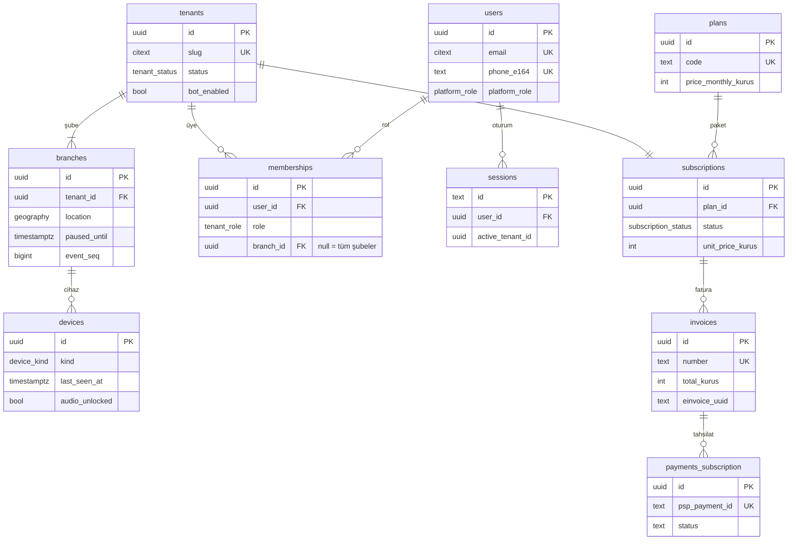
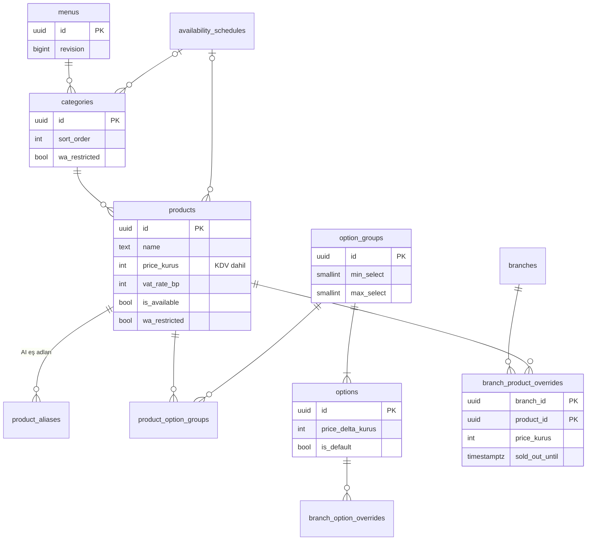
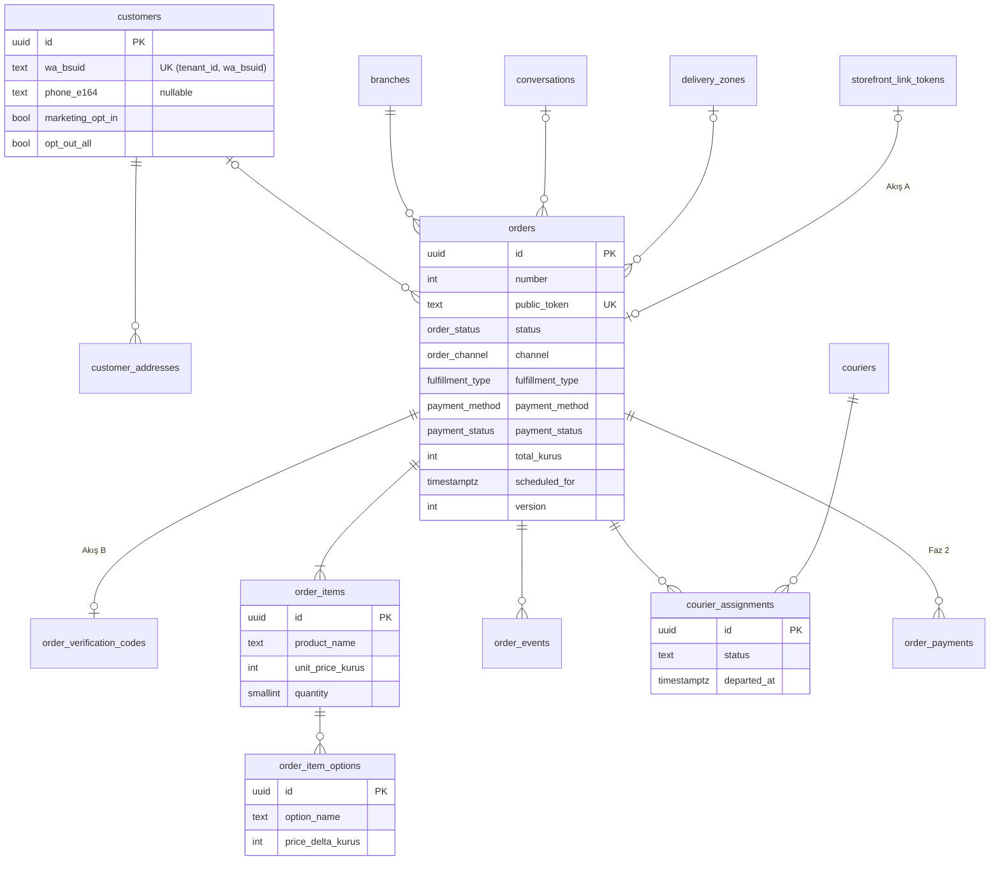
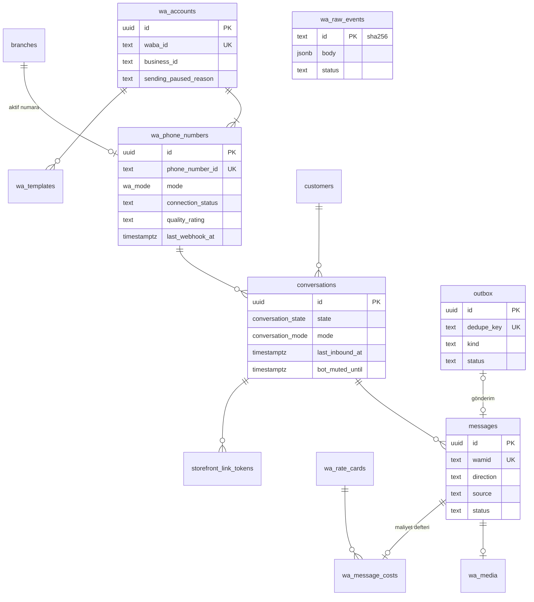
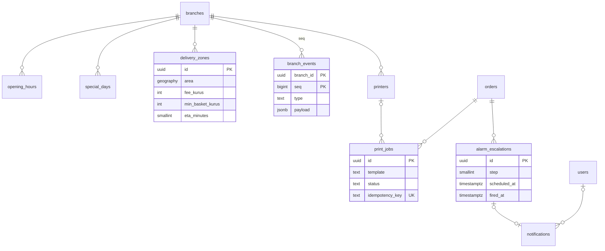
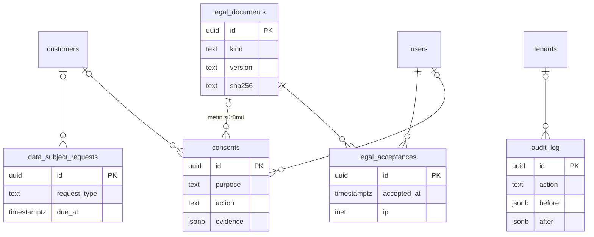
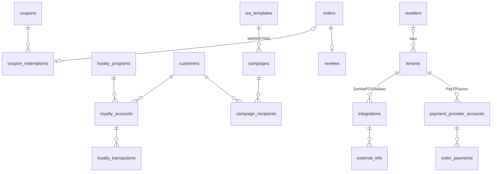

# 07 — Veri Modeli ve API

> **Amaç:** Geliştiricinin Drizzle şemasını, RLS politikalarını ve Fastify route'larını doğrudan çıkarabileceği somutlukta veri modeli, durum makineleri, API sözleşmeleri ve olay kataloğunu tanımlamak.
> **Tarih:** 2026-09-24 · **Durum:** Taslak v1 · **Bağlayıcı kaynak:** [Kararlar ve sözlük](00-kararlar-ve-sozluk.md) §3 (sözlük), §4 (roller), §5 (sipariş durum makinesi ve enum'lar), §10 (teknik kararlar).

**Kapsam:** Tablolar (alanlar, indeksler, RLS, PII/saklama), mermaid ERD, durum makineleri (sipariş, konuşma, abonelik, WhatsApp numarası, yazdırma işi), sepet/fiyat hesap kuralları, REST + SSE + webhook sözleşmeleri, domain olayları ve outbox eşlemesi, rapor türetmeleri, saklama/silme işleri, migration ve seed.

**Kapsam dışı (bağlantı verilir):** WhatsApp davranışı, şablon metinleri, konuşma motoru kuralları → [02](02-whatsapp-entegrasyonu.md) · storefront ekranları ve müşteri metinleri → [03](03-musteri-deneyimi-ve-storefront.md) · panel ekranları ve UX → [04](04-isletme-paneli.md) · admin ekranları → [05](05-admin-paneli-ve-pazarlama-sitesi.md) · kuyruk, KMS, barındırma, gözlemlenebilirlik → [06](06-teknik-mimari.md) · hukuki metinler ve saklama sürelerinin hukuki dayanağı → [08](08-mevzuat-kvkk-odeme-fatura.md).

**Kaynaklar ve atıf biçimi:** `A01`, `A03`, `A04` = [arastirma/01-whatsapp-platform.md](arastirma/01-whatsapp-platform.md), [arastirma/03-mevzuat-odeme-fatura.md](arastirma/03-mevzuat-odeme-fatura.md), [arastirma/04-mimari-teknoloji.md](arastirma/04-mimari-teknoloji.md); `D01`, `D02` = 01 ve 02 numaralı plan dokümanları; yalnız `§x` = bu doküman. Ürün özellik envanteri için KARARLAR §7, §11 ve D01 §6.3 paket matrisi kullanıldı (UX araştırma raporu yazım sırasında mevcut değildi).

**Gösterim:** `NN` = NOT NULL, `✓` = nullable, `UK` = unique, `std` = standart kolonlar (§1.3). Rol kısaltmaları: O = `owner`, M = `manager`, C = `cashier`, K = `kitchen`, Ku = `courier`; platform: PO = `platform_owner`, PA = `platform_admin`, SA = `support_agent`, F = `finance`, SR = `sales_rep`.

---

## 1. Genel kurallar **[Faz 1]**

### 1.1 Adlandırma ve tipler
- Tablolar çoğul `snake_case` (`orders`), kolonlar `snake_case`. KARARLAR §3'teki kod adları **varlık** adıdır (tekil): `order` varlığı `orders` tablosunda durur. Drizzle nesneleri camelCase (`orders.branchId`). API JSON alanları DB ile aynı `snake_case`.
- Enum değerleri KARARLAR §5 ile **birebir**. Kanonik enum'lar `pgEnum`: `order_status`, `payment_status`, `payment_method`, `fulfillment_type`, `order_channel`, `tenant_role`, `platform_role`, `subscription_status`, `wa_mode`, `conversation_state`, `conversation_mode`. Sık değişebilecek listeler (`reject_reason`, `cancel_reason`, bildirim türleri, sebep kodları) `text` + `CHECK`. Tek kaynak `packages/core/enums.ts` (Zod); CHECK kısıtları migration'da buradan üretilir.
- Son ekler: FK `_id`, an `_at`, tarih `_date`, para `_kurus`, oran `_bp` (baz puan; %10 = 1000), USD `_usd_micros` (1 $ = 1.000.000).
- Uzantılar: `postgis`, `pg_trgm`, `unaccent`, `citext`. Türkçe sıralama `COLLATE "tr-TR-x-icu"` (A04 §7.5).

### 1.2 Kimlikler
- PK: `uuid`, **UUIDv7** (zaman sıralı, B-tree dostu). DB varsayılanı `DEFAULT uuidv7()` (PostgreSQL 18 yerleşik fonksiyonu, teyit edilmeli); outbox ve idempotency için uygulamada üretim tercih edilir. Better Auth `advanced.database.generateId` ile aynı üreteci kullanır (teyit edilmeli).
- İstisnalar: `branch_events` PK `(branch_id, seq bigint)`; `wa_raw_events.id` = ham gövdenin SHA-256 hex'i; `feature_flags.key` metin.
- Dışa açık kimlikler: `orders.number` (şube bazında artan, 1001'den başlar, ekranda `#1047`), `orders.public_token` (takip linki; 128 bit rastgele, base62, 22 karakter), `order_verification_codes.code` (6 karakter, D02 §6.4). Storefront'ta UUID görünmez; yalnız `slug`, `public_token` ve imzalı link token'ı.

### 1.3 Zaman ve standart kolonlar
- Anlar `timestamptz` (UTC). Gösterim ve iş kuralları `Europe/Istanbul` (`branches.timezone`). Yerel saatler `time`, günler `date`; şubenin saat dilimiyle yorumlanır.
- **İş günü:** gece yarısını geçen işletmeler için `branches.business_day_cutoff` (varsayılan `05:00`). `orders.business_date = ((placed_at AT TIME ZONE tz) - cutoff)::date`; tüm raporlar bu alanı kullanır.
- `std` = `id uuid PK`, `tenant_id uuid NN`, `created_at timestamptz NN DEFAULT now()`, `updated_at timestamptz NN DEFAULT now()` (Drizzle `$onUpdate` + `set_updated_at` trigger'ı).

### 1.4 Para
- Tutarlar **integer kuruş** (`integer`; toplam/rapor alanlarında `bigint`). Float ve `numeric` yok (kur tablosu hariç). Para taşıyan ana kayıtlarda `currency char(3) NN DEFAULT 'TRY'`.
- Menü fiyatları **KDV dahil** saklanır ve gösterilir (A03 §4.8). `products.vat_rate_bp` yalnız KDV kırılımı içindir; restoran hizmetinde varsayılan 1000 (%10, A03 §8.1; ürün bazında değişir, mali müşavir teyidi).
- Abonelik tutarlarımız **KDV hariç** saklanır; KDV %20 ayrı satır (KARARLAR §8). Meta ücretleri `*_usd_micros bigint`, TL tahmini `*_try_kurus` (`fx_rates`).

### 1.5 Silme politikası

| Varlık sınıfı | Politika |
|---|---|
| Katalog ve yapılandırma (şube, menü, kategori, ürün, seçenek, bölge, yazıcı, kurye profili) | Soft delete: `deleted_at timestamptz ✓`. Benzersiz indeksler `WHERE deleted_at IS NULL`. Siparişler snapshot taşıdığı için 180 gün sonra hard delete edilebilir (Faz 2 işi). |
| İşlem kayıtları (sipariş, olay, fatura, ödeme, rıza, kabul, audit) | Silinmez; kişisel veri **anonimleştirilir** (§9). `order_events`, `audit_log`, `consents`, `legal_acceptances` append-only: uygulama rolünde UPDATE/DELETE yetkisi yok. |
| Müşteri | Soft delete yok. Birleştirmede `merged_into_id`; KVKK silmede anonimleştirme (`anonymized_at`). |
| Geçici/teknik (outbox, ham olay, yazdırma işi, token, kod) | Süresi dolunca hard delete (§9). |

### 1.6 Çok kiracılık ve RLS
- Kiracıya ait **her tabloda** `tenant_id uuid NN`. **İstisnalar** (platform tabloları): `users` ve Better Auth tabloları, `plans`, `wa_rate_cards`, `fx_rates`, `feature_flags`, `announcements`, `legal_documents`, `data_purge_runs`, `wa_raw_events` (tenant çözülmeden yazılır, `tenant_id ✓`). Bunlar uygulama rolüne salt-okunur veya yalnız ilgili servis rolüne açıktır.
- DB rolleri: `app_migrator` (tablo sahibi; yalnız migration), `app_user` (API + worker; `NOBYPASSRLS`, sahip değil), `app_ingress` (yalnız `wa_raw_events` INSERT), `app_admin` (admin API; `BYPASSRLS` yok, platform politikası `app.is_platform = 'on'` ile okur, her erişim `audit_log`'a), `app_report` (rapor replikası, salt-okunur).
- Her istek/iş tek transaction; başında `set_config('app.tenant_id', $1, true)`, `set_config('app.user_id', $2, true)`, `set_config('app.request_id', $3, true)`. Oturum düzeyi `SET` yasak (A04 §2.2).
- Tenant çözümleme: panel → oturumdaki aktif tenant + üyelik kontrolü; storefront → `slug` (Redis, 60 sn); WhatsApp worker → `wa_route(phone_number_id)` `SECURITY DEFINER` fonksiyonu (RLS'siz tek arama noktası; `tenant_id, branch_id` döner); SSE → oturum + şube yetkisi.
- **Şube yetkisi RLS'de değil**, API'deki merkezi `authorize()` içindedir (`memberships.branch_id`). RLS yalnız tenant sınırını korur.
- **Bileşik FK:** her kiracı tablosunda `UNIQUE (tenant_id, id)`; çocuklar `FOREIGN KEY (tenant_id, parent_id) REFERENCES parent (tenant_id, id)`.
- CI kapıları: (1) `tenant_id` kolonu olup `relrowsecurity` veya `relforcerowsecurity` kapalı tablo varsa build kırılır; (2) her uç nokta başka tenant'ın ID'siyle çağrılır ve 404 beklenir (IDOR testi).

```ts
// packages/db/schema/orders.ts (kısaltılmış)
export const orders = pgTable('orders', {
  id: uuid('id').primaryKey().default(sql`uuidv7()`),
  tenantId: uuid('tenant_id').notNull(),
  branchId: uuid('branch_id').notNull(),
  status: orderStatus('status').notNull(),
  totalKurus: integer('total_kurus').notNull(),
  version: integer('version').notNull().default(1),
}, (t) => [
  unique('orders_tenant_id_id_uk').on(t.tenantId, t.id),
  foreignKey({ columns: [t.tenantId, t.branchId], foreignColumns: [branches.tenantId, branches.id] }),
  index('orders_open_idx').on(t.tenantId, t.branchId, t.status)
    .where(sql`status in ('awaiting_customer','new','accepted','preparing','ready','on_the_way')`),
  pgPolicy('tenant_isolation', { for: 'all', to: appUser,
    using: sql`tenant_id = current_setting('app.tenant_id', true)::uuid`,
    withCheck: sql`tenant_id = current_setting('app.tenant_id', true)::uuid` }),
]).enableRLS(); // FORCE ROW LEVEL SECURITY özel SQL migration'ında eklenir
```

### 1.7 Snapshot ilkesi
Sipariş anındaki veri kopyalanır; sonraki menü veya ayar değişikliği geçmiş siparişi değiştirmez.
- `order_items`: ürün adı, kategori adı, birim fiyat (şube override'ı uygulanmış), KDV oranı, satır tutarı.
- `order_item_options`: grup adı, seçenek adı, fiyat farkı, adet.
- `orders`: müşteri adı, teslimat telefonu, adres (yapılandırılmış + metin + nokta), bölge adı/süresi, teslimat ücreti, uygulanan min sepet, ödeme yöntemi ve yemek kartı markası, ön bilgilendirme metni sürümü.
- Analiz FK'ları (`product_id`, `delivery_zone_id`, `customer_address_id`) `ON DELETE SET NULL`; hesaplama asla bunlardan yeniden yapılmaz.

### 1.8 PII işaretleme ve saklama kolonları
- Kişisel veri kolonları Drizzle'da `pii('<sınıf>')` sarmalayıcısıyla tanımlanır; migration `COMMENT ON COLUMN … IS 'pii:<sınıf>'` yazar. `packages/db/pii-registry.ts` bu listeden üretilir ve dört yeri besler: log/Sentry maskesi, KVKK dışa aktarımı, anonimleştirme işi, staging'e kopyalama maskesi.
- Sınıflar: `identity` (ad, kullanıcı adı, VKN/TCKN), `contact` (telefon, e-posta, BSUID), `location` (adres, koordinat, tarif), `content` (mesaj, medya, işletme notu), `content-sensitive` (sipariş/kalem notu; sağlık verisi riski, A03 §2.6), `network` (IP, user agent).
- Saklama kolonları: yüksek hacimli tablolarda silme işi indeksle çalışsın diye `purge_at` (mesaj, medya, ham olay), notlarda `note_purge_at`, müşteride `anonymize_at` (her siparişte yeniden hesaplanır), işlenen kayıtta `content_purged_at` / `anonymized_at` / `pii_scrubbed_at`. Süreler §9 ve `tenants.retention_*` ayarları.
- **Yapılandırılmış alerji/sağlık alanı yoktur** (KARARLAR §9). Alerjenler yalnız ürün özelliğidir (`products.allergens`).

### 1.9 İyimser kilit
- `version integer NN DEFAULT 1`: `tenants`, `branches`, `products`, `categories`, `option_groups`, `delivery_zones`, `customers`, `orders`, `conversations`, `subscriptions`, `wa_accounts`, `wa_phone_numbers`.
- `UPDATE … SET …, version = version + 1 WHERE id = $1 AND version = $2`; 0 satır → HTTP 409 `version_conflict` (yanıtta güncel kayıt).
- API: GET yanıtında `ETag: "v7"`; yazmada `If-Match: "v7"` veya gövdede `version`. Sipariş aksiyonlarında zorunludur (iki kasiyerin aynı anda onay/red basması).

---

## 2. ERD

Diyagramlarda yalnız anahtar alanlar var; tam alan listesi §3'te. Tüm kiracı tablolarında `tenant_id` ve bileşik FK örtüktür.

### 2.1 (a) Platform, kiracı, kullanıcı, abonelik



### 2.2 (b) Menü



### 2.3 (c) Müşteri, sipariş, ödeme, kurye



### 2.4 (d) WhatsApp ve mesajlaşma



### 2.5 (e) Operasyon



### 2.6 (f) Uyum



### 2.7 (g) Faz 2–3 modülleri



---

## 3. Tablo sözlüğü

Faz 1 tabloları tam ayrıntılı; küçük tablolarda alanlar satır içi listelenir. RLS notu yoksa politika §1.6'daki standart `tenant_isolation`'dır.

### 3.0 Ortak enum'lar

| Enum | Değerler | Kaynak |
|---|---|---|
| `order_status` | `awaiting_customer`, `new`, `accepted`, `preparing`, `ready`, `on_the_way`, `delivered`, `rejected`, `cancelled` | KARARLAR §5 |
| `payment_status` | `unpaid`, `pending`, `paid`, `failed`, `refunded`, `partially_refunded` | KARARLAR §5 |
| `payment_method` | `cash_on_delivery`, `card_on_delivery`, `meal_card_on_delivery`, `online_card` (Faz 2), `pay_at_counter` | KARARLAR §5 |
| `fulfillment_type` | `delivery`, `pickup`, `dine_in` (Faz 3) | KARARLAR §5 |
| `order_channel` | `wa_link`, `wa_ai` (Faz 2), `web`, `table_qr` (Faz 3), `manual` | KARARLAR §5 |
| `reject_reason` | `closed`, `out_of_zone`, `out_of_stock`, `other` | KARARLAR §5 |
| `cancelled_by` / `cancel_reason` | `customer`, `tenant`, `system` / `customer_timeout`, `customer_request`, `out_of_stock`, `courier_issue`, `address_issue`, `duplicate`, `suspected_fraud`, `payment_failed` (Faz 2), `other` | KARARLAR §5 + bu doküman |
| `meal_card_brand` | `multinet`, `pluxee`, `edenred`, `setcard`, `metropol`, `other` | KARARLAR §5 |
| `tenant_role` / `platform_role` | `owner`, `manager`, `cashier`, `kitchen`, `courier` / `platform_owner`, `platform_admin`, `support_agent`, `finance`, `sales_rep` (+ `reseller`, Faz 2) | KARARLAR §4 |
| `subscription_status` | `trialing`, `active`, `past_due`, `read_only`, `suspended`, `cancelled` | §4.3 |
| `wa_mode` | `cloud`, `coexistence` | KARARLAR §3 |
| `conversation_state` / `conversation_mode` | `idle`, `greeting`, `menu_link_sent`, `order_linking`, `order_active`, `ai_ordering`, `awaiting_confirm` / `bot`, `human` | D02 §6.1 |

### 3.1 Platform, kiracı, kullanıcı, abonelik

#### `tenants` **[Faz 1]**
İşletme (kiracı); Better Auth organization modeli bu tabloya eşlenir. `tenant_id` yerine `id` kiracı kimliğidir; RLS `id = app.tenant_id`.

| Alan | Tip | Null | Açıklama |
|---|---|---|---|
| `id`, `created_at`, `updated_at`, `version` | | NN | §1.3, §1.9 |
| `slug` | citext | NN, UK | Storefront alt alan adı; `^[a-z0-9](-?[a-z0-9]){2,39}$`; rezerve liste (`panel`, `api`, `admin`, `hooks`, `www`, `kurye`…) |
| `display_name` / `legal_name` | text | NN / ✓ | Marka adı / ticari unvan (fatura, künye) |
| `tax_number`, `tax_office` | text | ✓ | VKN; şahıs işletmesinde TCKN (`pii:identity`) |
| `billing_address`, `contact_email`, `contact_phone_e164` | text | ✓ | Şahıs işletmesinde `pii:contact` |
| `food_registration_no` | text | ✓ | Gıda işletme kayıt no (künye, A03 §4.9) |
| `vertical` | text | NN | `restaurant` (Faz 1); `water`, `patisserie` (Faz 2) |
| `status` | text | NN | `onboarding`, `live`, `offboarding`, `closed`. Erişimi abonelik belirler (§4.3) |
| `bot_enabled` / `ai_enabled` | bool | NN | Konuşma botu (true) / AI sipariş (Faz 2, false) |
| `bot_mute_minutes` | smallint | NN | Echo veya panel yanıtından sonra bot susma süresi; 10–120, varsayılan 30 (D02 §6.10) |
| `savings_commission_bp` | int | ✓ | İşletmenin pazaryeri kesinti oranı; "tasarruf" raporu için (§8) |
| `retention_customer_months`, `retention_message_months` | smallint | NN | Varsayılan 24 / 12 (§9) |
| `is_pilot`, `is_founding_member` | bool | NN | Program bayrakları |
| `reseller_id` | uuid | ✓ | Faz 2 |
| `closed_at`, `data_export_until` | timestamptz | ✓ | Fesih ve 30 günlük dışa aktarma penceresi |

İndeks: `UNIQUE(slug)`, `(status)`. Saklama: fesihten 30 gün sonra müşteri ve mesaj verisi silinir; kiracı satırı ve faturalar 10 yıl.

#### `branches` **[Faz 1]**
Şube; sipariş, numara, bölge, yazıcı ve olay günlüğü buna bağlanır. Tek şubeli işletmede görünmez varsayılan şube.

| Alan | Tip | Null | Açıklama |
|---|---|---|---|
| std, `version`, `deleted_at` | | | |
| `name`, `slug` | text | NN | Slug Faz 2'de çok şubeli storefront yolu |
| `is_default` | bool | NN | Tenant başına 1 (kısmi UK) |
| `address_text`, `city`, `district` | text | NN | Gel-al adresi, künye |
| `location` | geography(Point,4326) | NN | Mesafe ve harita |
| `phone_e164` | text | ✓ | İşletmenin aranacak numarası (herkese açık) |
| `timezone`, `business_day_cutoff` | text, time | NN | `Europe/Istanbul`, `05:00` |
| `delivery_enabled`, `pickup_enabled`, `dine_in_enabled` | bool | NN | Teslim türleri |
| `accepted_payment_methods` | payment_method[] | NN | Şubede açık yöntemler |
| `accepted_meal_card_brands` | text[] | NN | Kuryenin doğru cihazı alması için |
| `default_prep_minutes`, `default_delivery_minutes` | smallint | NN | Onay ekranında ETA önerisi |
| `min_order_pickup_kurus` | int | NN | Gel-al min sepet (0 olabilir) |
| `delivery_fee_vat_bp` | int | NN | Teslimat ücretinin KDV oranı; yalnız kırılım (teyit edilmeli, 08) |
| `auto_accept` | bool | NN | Opsiyonel otomatik kabul (false) |
| `use_preparing_step`, `notify_preparing` | bool | NN | `preparing` adımı ve bildirimi (ikisi false) |
| `alarm_policy` | jsonb | NN | `{"reminders_sec":[120,300],"push_sec":60,"platform_wa_sec":[120,300],"sms_sec":300,"customer_notice_sec":600}` (D02 §10.3) |
| `scheduled_enabled`, `scheduled_max_days`, `scheduled_min_lead_min` | bool, smallint, smallint | NN | Planlı sipariş kuralları |
| `paused_until`, `pause_reason` | timestamptz, text | ✓ | "Geçici olarak kapalı/meşgul" |
| `order_seq`, `event_seq` | bigint | NN | `orders.number` ve `branch_events.seq` sayaçları (`UPDATE … RETURNING`, aynı tx) |
| `receipt_width_mm` | smallint | NN | 80 / 58 |

İndeks: `UNIQUE(tenant_id,id)`, `UNIQUE(tenant_id,slug) WHERE deleted_at IS NULL`, `UNIQUE(tenant_id) WHERE is_default`. PII yok.

#### `users` **[Faz 1]** (platform; `tenant_id` yok)
Better Auth `user` modeli. Alanlar: `id uuid PK`, `email citext UK ✓` (kurye e-postasız olabilir), `email_verified bool`, `phone_e164 text UK ✓`, `phone_verified bool`, `name text NN` (`pii:identity`), `image ✓`, `two_factor_enabled bool`, `platform_role ✓` (yalnız platform ekibi), `locale` (`tr`), `last_login_at`, `disabled_at`, zaman damgaları. RLS: kendi satırı (`id = app.user_id`) veya aynı tenant'ta üyeliği olanlar (`EXISTS memberships`). Saklama: hesap silinince 30 gün sonra ad/e-posta/telefon anonimleşir; audit referansları kalır.

#### Better Auth tabloları **[Faz 1]** (platform)
- `sessions`: `id`, `user_id`, `token` (hash), `expires_at`, `ip_address`, `user_agent` (`pii:network`), `active_tenant_id` (organization eklentisinin aktif organizasyonu), `impersonated_by` (admin eklentisi). Panel oturumu 30 gün kayar; admin oturumu 12 saat.
- `accounts` (parola hash'i, sağlayıcı kimliği), `verifications` (magic link, e-posta, telefon OTP; kısa ömürlü), `two_factors` (TOTP sırrı envelope encryption ile, yedek kodlar hash'li; A04 §8.6), `invitations` (`tenant_id`, `email`/`phone`, `role`, `branch_id`, `status`, `expires_at` 7 gün, `invited_by`).
- Tablo ve alan adları Better Auth `modelName`/`fields` ayarıyla bu dokümandaki adlara eşlenir (organization → `tenants`, member → `memberships`); şema kütüphane CLI'sıyla üretilip Drizzle'a alınır.

#### `memberships` **[Faz 1]**
std, `user_id NN`, `role tenant_role NN`, `branch_id ✓` (null = tüm şubeler; bileşik FK), `status` (`invited`, `active`, `disabled`), `invited_by_user_id`, `joined_at`, `quick_pin_hash ✓` (paylaşılan tablette hızlı kullanıcı değişimi, Faz 2). Kısıt `UNIQUE NULLS NOT DISTINCT (tenant_id, user_id, branch_id)`; tenant başına ≥ 1 aktif `owner` (deferred trigger). Plan limiti: Esnaf'ta aktif üye ≤ 2 (`plans.limits.max_users`, D01 §6.3).

#### `devices` **[Faz 1]**
Panel cihazı; "panel çevrimdışı" dedektörü, push, PIN'li cihaz oturumu ve tarayıcı yazdırma sahibi.

| Alan | Tip | Null | Açıklama |
|---|---|---|---|
| std, `branch_id` | | NN | |
| `kind` | text | NN | `browser`, `pwa`, `android_app` (Faz 2), `print_agent` (Faz 2) |
| `label` | text | NN | "Kasa tableti" |
| `user_id` | uuid | ✓ | Son giriş yapan |
| `token_hash`, `pin_hash`, `allowed_roles` | text, text, tenant_role[] | ✓ | PIN'li cihaz oturumu; `allowed_roles ⊆ {kitchen, cashier}` |
| `push_subscription` | jsonb | ✓ | Web Push endpoint + anahtarlar (VAPID) |
| `app_version`, `user_agent` | text | ✓ | |
| `audio_unlocked`, `wake_lock_active`, `is_print_host` | bool | NN | Heartbeat ile güncellenir |
| `last_seen_at`, `sse_connected_at`, `last_event_seq` | timestamptz, timestamptz, bigint | ✓ | 30 sn heartbeat, SSE durumu |
| `revoked_at` | timestamptz | ✓ | O/M iptali |

İndeks `(tenant_id, branch_id, last_seen_at DESC)`. Saklama: iptalden 90 gün sonra silinir.

#### `plans` **[Faz 1]** (platform)
`code UK` (`esnaf`, `pro`, `zincir`), `name`, `price_monthly_kurus` (99000 / 179000 / 299000), `price_yearly_kurus` (950400 / 1718400 / 2870400), `per_branch bool` (Zincir), `vat_rate_bp` (2000), `features jsonb` (`courier_view`, `ai_ordering`, `coupons`, `loyalty`, `campaigns`, `pos_integration`, `online_payment`, `multi_branch`…), `limits jsonb` (`max_users`, `max_delivery_zones`, `llm_monthly_tokens`), `is_sellable` (Zincir Faz 2'de true), `sort`. Fiyat güncellemesi (TÜFE) satırı değiştirir; mevcut abonelik kendi snapshot'ını korur. İçerik matrisi D01 §6.3.

#### `subscriptions` **[Faz 1 kayıt · Faz 2 tahsilat]**

| Alan | Tip | Null | Açıklama |
|---|---|---|---|
| std, `version`, `plan_id` | | NN | |
| `status` | subscription_status | NN | §4.3 |
| `billing_interval` | text | NN | `month`, `year` |
| `quantity` | smallint | NN | Zincir'de şube sayısı |
| `unit_price_kurus` | int | NN | Sözleşme anındaki liste fiyatı (KDV hariç) snapshot'ı |
| `discount_bp`, `discount_until` | int, date | ✓ | Kurucu üye 3000 (%30), 12 ay sabit |
| `founding_seq` | int | ✓, UK | İlk 100 sayacı |
| `is_pilot`, `pilot_ends_at` | bool, timestamptz | | Pilot 3 ay ücretsiz |
| `trial_ends_at` | timestamptz | ✓ | 14 gün kartsız deneme |
| `current_period_start`, `current_period_end` | timestamptz | ✓ | |
| `cancel_at_period_end`, `cancelled_at`, `cancel_reason` | bool, timestamptz, text | | |
| `past_due_since`, `read_only_at`, `suspended_at` | timestamptz | ✓ | Dunning damgaları |
| `psp_provider`, `psp_customer_ref`, `psp_card_ref`, `card_last4`, `card_brand` | text | ✓ | Faz 2; yalnız PSP token'ı, kart numarası asla |

Kısıt `UNIQUE(tenant_id) WHERE status <> 'cancelled'`. Saklama 10 yıl.

#### `invoices` **[Faz 2]**
`subscription_id`, `number UK` (ödeme referansı `SO-2026-000123`; havale açıklamasında aranır, A03 §6.3), `status` (`draft`, `issued`, `paid`, `void`, `refunded`), `period_start/end`, `lines jsonb` (plan, adet, kurulum, indirim), `subtotal_kurus`, `vat_kurus`, `total_kurus`, `currency`, `due_at`, `paid_at`, `buyer_snapshot jsonb` (unvan, VKN/TCKN, vergi dairesi, adres; `pii:identity`), `einvoice_provider` (`parasut`), `einvoice_type` (`e_fatura`, `e_arsiv`), `einvoice_external_id`, `einvoice_uuid` (ETTN), `einvoice_status` (`pending`, `sent`, `formalized`, `failed`), `pdf_storage_key`. Saklama 10 yıl (A03 §2.7). Pilotta fatura kesilmez.

#### `payments_subscription` **[Faz 2]**
`invoice_id`, `method` (`card`, `bank_transfer`), `psp_provider`, `psp_payment_id UK ✓`, `amount_kurus`, `status` (`pending`, `succeeded`, `failed`, `refunded`), `attempt_no`, `failure_code`, `failure_message`, `bank_reference ✓`, `matched_by_user_id ✓` (havaleyi elle eşleştiren F/PA), `raw jsonb` (PSP bildirimi; kart verisi yok), `attempted_at`, `succeeded_at`. Saklama 10 yıl.

### 3.2 Menü

#### `menus` **[Faz 1]**
std, `name`, `is_active`, `revision bigint NN` (her menü, fiyat veya stok değişikliğinde artar → storefront `ETag` ve cache anahtarı), `deleted_at`. Faz 1'de tenant başına 1 aktif menü; Faz 2'de zaman/şube bazlı çoklu menü.

#### `categories` **[Faz 1]**
std, `menu_id`, `name`, `description ✓`, `sort_order`, `is_visible`, `availability_schedule_id ✓`, `wa_restricted bool` + `restricted_reason ✓` (`alcohol`, `tobacco`, `pharma`, `hazardous`, `other`; D02 §9.2), `image_key ✓`, `deleted_at`, `version`. Kategori bayrağı ürünlere miras geçer.

#### `products` **[Faz 1]**

| Alan | Tip | Null | Açıklama |
|---|---|---|---|
| std, `version`, `deleted_at` | | | |
| `menu_id`, `category_id` | uuid | NN | |
| `name` | text | NN | `tr-TR-x-icu`; trigram indeksli |
| `description`, `portion_info` | text | ✓ | Açıklama, gramaj/porsiyon |
| `price_kurus` | int | NN | KDV dahil satış fiyatı, ≥ 0 |
| `vat_rate_bp` | int | NN | Varsayılan 1000 |
| `image_key` | text | ✓ | R2 anahtarı (kişisel veri değil) |
| `is_available` | bool | NN | Genel stok anahtarı |
| `sort_order` | int | NN | |
| `allergens`, `tags` | text[] | NN | Alerjen etiketleri (`gluten`, `peanut`…) ve rozetler (`spicy`, `vegan`) |
| `wa_restricted`, `restricted_reason` | bool, text | NN / ✓ | Commerce Policy; true ise sepete eklenemez |
| `availability_schedule_id` | uuid | ✓ | |
| `external_ref` | text | ✓ | POS eşlemesi (Faz 2) |

İndeks `(tenant_id, category_id, sort_order)`, GIN `name gin_trgm_ops`. Fiyat değişikliği `audit_log`'a yazılır; `product_price_history` Faz 2 (30 gün en düşük fiyat kuralı, A03 §4.8).

#### `product_aliases` **[Faz 1 tablo · Faz 2 AI]**
std, `product_id`, `alias NN` ("lamacun"), `normalized NN` (Türkçe küçük harf + `unaccent`), `source` (`manual`, `import`, `ai_suggested`). GIN trigram `normalized`; `UNIQUE(tenant_id, product_id, normalized)`. Faz 1'de panel araması ve menü içe aktarımında; Faz 2'de LLM aday getirmede.

#### `option_groups` **[Faz 1]**
std, `menu_id`, `name` ("Porsiyon", "Ekstralar", "Çıkarılacaklar"), `internal_name ✓`, `min_select smallint NN` (0 = opsiyonel), `max_select smallint ✓` (null = sınırsız), `max_per_option smallint NN DEFAULT 1`, `sort_order`, `deleted_at`, `version`. CHECK `max_select IS NULL OR max_select >= min_select`. Grup ürünler arasında paylaşılır.

#### `options` **[Faz 1]**
std, `option_group_id`, `name`, `price_delta_kurus int NN` (negatif olabilir; satır < 0 olamaz), `is_default` (storefront ön seçimi), `is_available`, `sort_order`, `wa_restricted`, `external_ref ✓`, `deleted_at`. İç içe seçenek yok.

#### `product_option_groups` **[Faz 1]**
PK `(product_id, option_group_id)`; `tenant_id`, `sort_order`, `min_select_override ✓`, `max_select_override ✓`.

#### `branch_product_overrides` / `branch_option_overrides` **[Faz 1]**
PK `(branch_id, product_id)` / `(branch_id, option_id)`; `tenant_id`, `price_kurus ✓` (yalnız ürün; şube fiyatı Faz 2), `is_hidden bool`, `is_available ✓`, `sold_out_until timestamptz ✓` ("bugünlük tükendi" → iş günü sonu), `updated_by_user_id`. Faz 1'de şube başına stok için kullanılır.

#### `availability_schedules` **[Faz 1]**
std, `name` ("Kahvaltı"), `rules jsonb NN` — `[{"days":[1,2,3,4,5],"from":"08:00","to":"12:00"}]` (ISO gün, 1 = Pazartesi; şube saat dilimi). Kural dışındaki ürün "şu an satışta değil" görünür; planlı siparişte `scheduled_for` anına göre değerlendirilir.

### 3.3 Müşteri, sipariş, ödeme, kurye

#### `customers` **[Faz 1]**
Kimlik `(tenant_id, wa_bsuid)`, telefon nullable (KARARLAR §6.8, D02 §8). Platform geneli müşteri profili yoktur.

| Alan | Tip | Null | Açıklama |
|---|---|---|---|
| std, `version` | | | |
| `wa_bsuid` | text | ✓ | BSUID (`TR.…`); WhatsApp müşterisinde dolu, Akış E/içe aktarım kaydında boş (`pii:contact`) |
| `wa_bsuid_business_id` | text | ✓ | BSUID'nin portföyü (portföy geçişi, D02 §8.4) |
| `wa_parent_bsuid` | text | ✓ | Açılmışsa |
| `phone_e164` | text | ✓ | Webhook `wa_id`'si E.164'e normalize edilip buraya yazılır (ayrı `wa_id` kolonu yok); yalnız doğrulanmış kaynaktan (`pii:contact`) |
| `phone_source` | text | ✓ | `wa_webhook`, `wa_shared`, `manual`, `import` |
| `wa_username`, `wa_profile_name` | text | ✓ | Yalnız gösterim, eşlemede kullanılmaz (`pii:identity`) |
| `display_name` | text | ✓ | İşletmenin/formun verdiği ad, ekranda öncelikli (`pii:identity`) |
| `email` | citext | ✓ | Faz 2 (sipariş özeti PDF) |
| `internal_note` | text | ✓ | İşletme notu ("zil çalışmıyor"); UI sağlık bilgisi yazılmaması uyarısı gösterir (`pii:content`) |
| `marketing_opt_in`, `marketing_opt_in_at` | bool, timestamptz | NN / ✓ | Güncel pazarlama izni; kanıt `consents`'te |
| `marketing_suppressed_until` | timestamptz | ✓ | 131049 sonrası 7 gün |
| `opt_out_all`, `opt_out_all_at` | bool, timestamptz | NN / ✓ | "DUR → hepsini durdur" (D02 §6.9) |
| `first_order_at`, `last_order_at` | timestamptz | ✓ | |
| `order_count`, `delivered_total_kurus` | int, bigint | NN | `order.delivered` olayında güncellenir |
| `last_inbound_at` | timestamptz | ✓ | Son gelen WhatsApp mesajı |
| `blocked_at`, `block_reason` | timestamptz, text | ✓ | Sahte sipariş engeli (storefront + bot) |
| `merged_into_id` | uuid | ✓ | Birleştirilen kaynak kayıt |
| `anonymize_at`, `anonymized_at` | timestamptz | ✓ | Son sipariş/etkileşim + `retention_customer_months` |

İndeks: `UNIQUE(tenant_id, wa_bsuid) WHERE wa_bsuid IS NOT NULL AND merged_into_id IS NULL`; `(tenant_id, phone_e164)`; GIN trigram `display_name`; `(anonymize_at) WHERE anonymized_at IS NULL`. Birleştirme ve çatışma kuralları D02 §8.3.

#### `customer_addresses` **[Faz 1]**
std, `customer_id`, `label` ("Ev", "İş"), `city`, `district`, `neighbourhood`, `street`, `building_no`, `floor ✓`, `apartment_no ✓`, `directions ✓` (adres tarifi; kurye için en değerli alan), `address_text NN`, `location geography(Point,4326) NN`, `location_source` (`wa_pin`, `map_pin`, `geocode`, `manual`), `uavt_code ✓`, `is_default`, `last_used_at`, `deleted_at` (müşteri "adresimi sil" → hemen hard delete). Tümü `pii:location`. İndeks `(tenant_id, customer_id, last_used_at DESC)`.

#### `orders` **[Faz 1]** {#siparis}

| Alan | Tip | Null | Açıklama |
|---|---|---|---|
| std, `version` | | | |
| `branch_id` | uuid | NN | Bileşik FK |
| `number` | int | NN | `branches.order_seq`'ten; `UNIQUE(branch_id, number)` |
| `public_token` | text | NN, UK | Takip linki `/t/{token}` |
| `status` | order_status | NN | §4.1 |
| `channel` | order_channel | NN | |
| `fulfillment_type` | fulfillment_type | NN | |
| `customer_id` | uuid | ✓ | Akış B'de kod eşleşene kadar boş; CHECK `channel IN ('wa_link','wa_ai') → customer_id IS NOT NULL` |
| `conversation_id`, `link_token_id` | uuid | ✓ | Sohbet; Akış A link token'ı |
| `source_meta` | jsonb | ✓ | `utm`, QR kaynağı, CTWA `referral` |
| `is_test` | bool | NN | Onboarding test siparişi; raporlara girmez |
| `customer_name` | text | ✓ | Snapshot (`pii:identity`) |
| `delivery_phone_e164` | text | ✓ | "Teslimat telefonu"; müşteri kimliğini değiştirmez (`pii:contact`) |
| `customer_address_id`, `delivery_zone_id` | uuid | ✓ | Analiz FK'ları |
| `delivery_address` | jsonb | ✓ | Yapılandırılmış adres + `directions` + `address_text` (`pii:location`) |
| `delivery_location` | geography(Point,4326) | ✓ | `delivery` ise NN (CHECK) |
| `zone_name`, `zone_eta_minutes` | text, smallint | ✓ | Bölge snapshot'ı |
| `notes` | text | ✓ | Müşteri notu (`pii:content-sensitive`) |
| `scheduled_for` | timestamptz | ✓ | Planlı sipariş; durum yine `new` |
| `items_subtotal_kurus`, `delivery_fee_kurus`, `discount_kurus`, `total_kurus` | int | NN | CHECK `total = items_subtotal + delivery_fee − discount` (§5) |
| `vat_included_kurus`, `min_basket_kurus` | int | NN | KDV kırılımı (bilgi) ve uygulanan min sepet |
| `currency` | char(3) | NN | `TRY` |
| `payment_method`, `payment_status` | enum | NN | Faz 1: `unpaid` → `paid` (kasiyer/kurye işaretler) |
| `meal_card_brand` | text | ✓ | `meal_card_on_delivery` ise NN |
| `paid_at` | timestamptz | ✓ | |
| `placed_at`, `business_date` | timestamptz, date | NN | Oluşma/müşteri onayı anı; iş günü |
| `first_seen_at`, `first_seen_device_id` | | ✓ | İlk ack |
| `accepted_at`, `preparing_at`, `ready_at`, `on_the_way_at`, `delivered_at`, `rejected_at`, `cancelled_at` | timestamptz | ✓ | FSM yazar |
| `accepted_by_user_id`, `created_by_user_id` | uuid | ✓ | Manuel siparişte kasiyer |
| `prep_eta_minutes`, `estimated_ready_at`, `estimated_delivery_at` | smallint, timestamptz | ✓ | `accept`'te zorunlu, sonradan güncellenebilir |
| `reject_reason`, `reject_note` | text | ✓ | `rejected` ise reason NN (CHECK) |
| `cancelled_by`, `cancel_reason`, `cancel_note` | text | ✓ | `cancelled` ise ilk ikisi NN (CHECK) |
| `cancel_requested_at` | timestamptz | ✓ | Müşteri iptal talebi (§4.1) |
| `wa_notify` | bool | NN | Sipariş bazında durum bildirimi izni |
| `wa_status_msg_count` | smallint | NN | Otomatik durum mesajı sayacı (≤ 4, D02 §4.3) |
| `customer_confirmed_at`, `confirmation_method`, `confirmation_ref` | timestamptz, text, text | ✓ | Mesafeli satış onayı: `storefront_button` (ref = request_id), `wa_code` / `wa_button` (ref = wamid), `cashier_phone` |
| `confirmation_ip`, `confirmation_user_agent` | inet, text | ✓ | Web onayı kanıtı (`pii:network`) |
| `pre_info_document_id` | uuid | ✓ | Gösterilen ön bilgilendirme sürümü |
| `print_count`, `pos_ref`, `ai_parse_id` | | ✓ | `pos_ref`, `ai_parse_id` Faz 2 |
| `note_purge_at`, `pii_scrubbed_at` | timestamptz | ✓ | §9 |

İndeksler: `UNIQUE(tenant_id,id)`, `UNIQUE(public_token)`, `UNIQUE(branch_id,number)`, açık siparişler `(tenant_id, branch_id, status) WHERE status IN (açık)`, `(tenant_id, branch_id, placed_at DESC)`, `(tenant_id, customer_id, placed_at DESC)`, `(tenant_id, business_date)`, `(branch_id, scheduled_for) WHERE scheduled_for IS NOT NULL AND status IN ('new','accepted')`. PII/saklama: notlar kapanıştan 60 gün sonra boşaltılır; müşteri anonimleşince ad, telefon, adres, konum ve IP snapshot'ları temizlenir; tutar ve kalemler abonelik süresince kalır (§9).

#### `order_items` **[Faz 1]**
std, `order_id`, `product_id ✓`, `product_name NN`, `category_name ✓`, `unit_price_kurus NN`, `options_unit_kurus NN` (birim başına seçenek toplamı), `quantity smallint NN` (1–50), `line_total_kurus NN` (CHECK `= (unit + options) × quantity` ve ≥ 0), `vat_rate_bp NN`, `note ✓` ("acısız"; `pii:content-sensitive`), `sort_order`. `kitchen` rolüne fiyat alanları döndürülmez.

#### `order_item_options` **[Faz 1]**
std, `order_item_id`, `option_id ✓`, `option_group_id ✓`, `group_name NN`, `option_name NN`, `price_delta_kurus NN`, `quantity smallint NN DEFAULT 1`.

#### `order_events` **[Faz 1]** (append-only)
std (yalnız `created_at`), `order_id`, `type` (`status_changed`, `eta_updated`, `seen`, `payment_updated`, `courier_assigned`, `printed`, `message_failed`, `customer_linked`, `cancel_requested`, `alarm_step`), `from_status ✓`, `to_status ✓`, `actor_type` (`user`, `device`, `courier`, `customer`, `system`), `actor_user_id ✓`, `actor_device_id ✓`, `reason ✓`, `data jsonb`. İndeks `(tenant_id, order_id, created_at)`. Panelde zaman çizelgesi ("Ayşe onayladı · 14:02").

#### `order_verification_codes` **[Faz 1]** (Akış B)
std, `order_id UK`, `branch_id`, `code char(6) NN` (alfabe `ABCDEFGHJKLMNPQRSTUVWXYZ23456789`, ≥ 1 rakam), `channel` (`whatsapp`; Faz 2 `sms`), `status` (`pending`, `used`, `expired`), `expires_at` (+30 dk), `used_at`, `used_by_customer_id`, `used_wamid`. `UNIQUE(tenant_id, code) WHERE status = 'pending'`. BSUID başına hatalı deneme sayacı (10 dk'da 5) Redis'te. Saklama 7 gün.

#### `storefront_link_tokens` **[Faz 1]** (Akış A)
"Menüyü aç" token'ı durumsuz HMAC'tir (D02 §6.3); tablo iptal, huni analizi ve tek kullanımlık bağlama içindir. Token gövdesine `j` (jti) eklenir = bu tablonun `id`'si. Alanlar: std, `branch_id`, `customer_id NN`, `conversation_id NN`, `issued_wamid ✓`, `expires_at NN` (2 saat, konfigürasyon), `first_opened_at ✓`, `open_count`, `order_id ✓`, `revoked_at ✓`, `prefill_cart jsonb ✓` (Faz 2 [Düzenle] linki). Saklama 30 gün.

#### `couriers` **[Faz 1]**
Kurye bir `user` + `memberships.role = 'courier'`dır (KARARLAR §3); bu tablo yalnız kuryeye özgü profil/vardiya verisidir. std, `membership_id UK`, `user_id`, `branch_id`, `display_name`, `phone_e164` (`pii:contact`), `vehicle` (`motorcycle`, `bicycle`, `car`, `foot`), `is_on_shift`, `shift_started_at`, `last_seen_at`, `deleted_at`. Kurye görünümü Pro ve Zincir'de (D01 §6.3).

#### `courier_assignments` **[Faz 1]**
std, `order_id`, `courier_id`, `branch_id`, `status` (`assigned`, `departed`, `delivered`, `unassigned`, `failed`), `assigned_at`, `assigned_by_user_id`, `departed_at`, `delivered_at`, `unassigned_at`, `failure_reason ✓` (`customer_unreachable`, `address_not_found`, `other`), `collected_payment_method ✓`, `collected_amount_kurus ✓`. `UNIQUE(order_id) WHERE status IN ('assigned','departed')`.

#### `order_payments` **[Faz 2]**
Online kart, işletmenin kendi PSP hesabıyla: std, `order_id`, `provider_account_id`, `provider` (`paytr`, `iyzico`), `provider_payment_id UK`, `payment_link_url`, `amount_kurus`, `refunded_kurus`, `status` (payment_status), `installment_count` (CHECK = 1; gıdada taksit yok), `raw jsonb`, `paid_at`. Para platform hesabına hiç girmez (KARARLAR §9).

### 3.4 WhatsApp ve mesajlaşma

#### `wa_accounts` **[Faz 1]**

| Alan | Tip | Null | Açıklama |
|---|---|---|---|
| std, `version` | | | `UNIQUE(tenant_id)`: tenant başına 1 WABA |
| `waba_id` | text | NN, UK | |
| `business_id` | text | NN | Meta portföyü (BSUID kapsamı) |
| `transport` | text | NN | `meta_direct`, `partner_<ad>` (D02 §7.10) |
| `token_ciphertext`, `token_iv`, `token_auth_tag`, `token_dek_encrypted`, `token_kms_key_id` | bytea / text | NN | BISU token, envelope encryption (D02 §3.4) |
| `token_expires_at`, `token_checked_at` | timestamptz | ✓ | Günlük `debug_token` |
| `token_status` | text | NN | `valid`, `expiring`, `invalid` |
| `sending_paused_reason`, `sending_paused_at` | text, timestamptz | ✓ | `token_invalid` (190), `payment_missing` (131042), `disconnected`, `subscription_suspended`, `admin` |
| `messaging_limit_tier` | text | ✓ | `business_capability_update`'ten |
| `history_sync_enabled`, `contacts_sync_enabled` | bool | NN | Coexistence senkronları; varsayılan false |
| `previous_business_id`, `portfolio_migration_until` | text, timestamptz | ✓ | Portföy geçişi (90 gün) |
| `connected_by_user_id`, `connected_at`, `disconnected_at` | | ✓ | |

Token kolonları yalnız `wa-sender` ve `wa-onboarding` servislerinin ayrı Drizzle projeksiyonunda okunur; API yanıtına asla girmez. Platform WABA'sı (işletmeye uyarı numarası) bu tabloda değil, ortam konfigürasyonundadır; gönderimleri `notifications`'ta loglanır.

#### `wa_phone_numbers` **[Faz 1]**

| Alan | Tip | Null | Açıklama |
|---|---|---|---|
| std, `version` | | | |
| `wa_account_id`, `branch_id` | uuid | NN | Numara şubeye bağlanır |
| `phone_number_id` | text | NN, UK (global) | İkinci tenant'a bağlama reddedilir |
| `display_phone_number` | text | NN | E.164 |
| `verified_name`, `name_status` | text | ✓ | Görünen ad; `AVAILABLE_WITHOUT_REVIEW`, `PENDING_REVIEW`, `APPROVED`, `DECLINED` (teyit edilmeli) |
| `mode` | wa_mode | NN | `cloud`, `coexistence` |
| `connection_status` | text | NN | §4.4 |
| `quality_rating` | text | NN | `GREEN`, `YELLOW`, `RED`, `UNKNOWN` |
| `throughput_mps` | smallint | NN | 80 (cloud) / 20 (coexistence); limiter kapasitesi |
| `pin_ciphertext` (+ iv, tag, dek) | bytea | ✓ | Yalnız `cloud`; iki adımlı doğrulama PIN'i |
| `register_attempts`, `register_window_start` | smallint, timestamptz | | 72 saatte 10 sınırı |
| `last_webhook_at`, `last_inbound_at`, `last_status_at`, `last_echo_at` | timestamptz | ✓ | Sessizlik alarmı; echo = Coexistence 14 gün kuralı |
| `health`, `health_checked_at` | jsonb, timestamptz | ✓ | Son sağlık kontrolü (D02 §3.8) |
| `live_at` | timestamptz | ✓ | |

Kısıt `UNIQUE(branch_id) WHERE connection_status <> 'disconnected'` (Faz 1: şube başına 1 aktif numara). `wa_route()` bu tablodan okur.

#### `wa_templates` **[Faz 1]**
Tenant WABA'sındaki şablon örneği (D02 §5.4'teki `tenant_template`). Ana set kodda sürümlü tutulur (`packages/whatsapp/templates.ts`). std, `wa_account_id`, `name` (`siparis_alindi_v1`), `language` (`tr`), `category` (`UTILITY`, `MARKETING`, `AUTHENTICATION`), `meta_template_id ✓`, `status` (`PENDING`, `APPROVED`, `REJECTED`, `PAUSED`, `DISABLED`), `rejected_reason ✓`, `quality_score ✓`, `category_changed_at ✓` (utility → marketing olursa durum bildiriminde kullanılmaz), `components jsonb`, `master_key`, `master_version`, `last_synced_at`. `UNIQUE(wa_account_id, name, language)`.

#### `wa_raw_events` **[Faz 1]** (platform; D02 §7.1'deki `wa_webhook_event`)
`id text PK` (ham gövde SHA-256), `received_at NN`, `body jsonb NN`, `waba_id ✓`, `phone_number_ids text[]`, `tenant_id ✓` (yönlendirmeden sonra), `status` (`received`, `queued`, `processed`, `failed`, `orphan`), `attempts`, `last_error ✓`, `processed_at ✓`, `purge_at NN` (+30 gün). İndeks `(status, received_at) WHERE status IN ('received','queued','failed')` (süpürücü). Yalnız `app_ingress` ve worker'ın platform bağlamı erişir. Günlük partition; silme `DROP PARTITION`.

#### `wa_pending_statuses` **[Faz 1]**
Gönderim yanıtından önce gelen status'lar (D02 §7.4): `wamid PK`, `tenant_id`, `payload jsonb`, `first_seen_at`, `retry_count`. 10 dk'da eşlenemeyen loglanıp silinir.

#### `conversations` **[Faz 1]**

| Alan | Tip | Null | Açıklama |
|---|---|---|---|
| std, `version` | | | |
| `branch_id`, `wa_phone_number_id`, `customer_id` | uuid | NN | `UNIQUE(tenant_id, wa_phone_number_id, customer_id)`: müşteri başına tek uzun ömürlü sohbet |
| `state` | conversation_state | NN | §4.2 |
| `mode` | conversation_mode | NN | `bot`, `human` |
| `context` | jsonb | NN | Akış verisi: aktif link token, AI taslağı, `auto_replies` soğuma damgaları (`greeting`, `closed`…) |
| `active_order_id` | uuid | ✓ | |
| `last_inbound_at` | timestamptz | ✓ | 24 saat penceresi (CSW) |
| `window_expires_at` | timestamptz | ✓ | Üretilmiş: `last_inbound_at + interval '24 hours'` |
| `fep_candidate_at` | timestamptz | ✓ | CTWA `referral` |
| `bot_muted_until` | timestamptz | ✓ | Echo/panel yanıtı sonrası |
| `handoff_at`, `handoff_by_user_id`, `assigned_user_id` | | ✓ | İnsana devir; atama Faz 2 |
| `last_message_at`, `last_message_preview`, `unread_count` | timestamptz, text, int | | Gelen kutusu listesi (`pii:content`) |

İndeks `(tenant_id, branch_id, last_message_at DESC)`, `(tenant_id, branch_id) WHERE mode = 'human'`. Sıralı işleme kilidi `pg_advisory_xact_lock(hashtextextended(tenant_id || ':' || wa_bsuid, 0))` (D02 §7.3).

#### `messages` **[Faz 1]**

| Alan | Tip | Null | Açıklama |
|---|---|---|---|
| std | | | |
| `conversation_id`, `customer_id`, `wa_phone_number_id` | uuid | NN | |
| `wamid` | text | ✓, **UK** | Henüz gönderilmemiş giden mesajda boş |
| `direction` | text | NN | `inbound`, `outbound` |
| `source` | text | NN | `customer`, `bot`, `panel`, `business_app` (echo), `system` (durum bildirimi), `history` |
| `type` | text | NN | `text`, `interactive`, `button`, `location`, `image`, `audio`, `video`, `document`, `sticker`, `reaction`, `contacts`, `template`, `unsupported` |
| `text_body` | text | ✓ | Arama/önizleme (`pii:content`) |
| `payload` | jsonb | ✓ | Normalize içerik (konum, buton id, şablon değişkenleri) |
| `order_id`, `outbox_id`, `sent_by_user_id` | uuid | ✓ | |
| `reply_to_wamid` | text | ✓ | |
| `status`, `status_at`, `error_code`, `error_title` | text, timestamptz, int, text | ✓ | Monoton (D02 §7.4) |
| `pricing_category`, `pricing_type` | text | ✓ | Özet; defter `wa_message_costs` |
| `wa_timestamp` | timestamptz | ✓ | Meta zamanı (sıralama) |
| `purge_at`, `content_purged_at` | timestamptz | ✓ | §9 |

İndeks `UNIQUE(wamid)`, `(tenant_id, conversation_id, created_at DESC)`, `(purge_at) WHERE content_purged_at IS NULL`. Faz 1'de partition yok (partitionlı tabloda `wamid` UNIQUE partition anahtarını gerektirir); ölçekte ayrı `message_wamids(wamid PK)` + aylık partition (Açık konular #7).

#### `wa_media` **[Faz 1]**
std, `message_id`, `meta_media_id`, `mime_type`, `size_bytes`, `sha256`, `storage_key` (Türkiye'deki nesne deposu, tenant önekli, şifreli), `download_status` (`pending`, `stored`, `failed`), `purge_at` (+60 gün), `purged_at`. `pii:content`.

#### `wa_message_costs` **[Faz 1]**
Maliyet defteri (D02 §4.5): std, `wamid UK`, `message_id ✓`, `wa_phone_number_id`, `category`, `pricing_type` (`regular`, `free_customer_service`, `free_entry_point`), `billable`, `pricing_model ✓`, `source` (`api`, `business_app`), `delivered_at ✓`, `billing_month date NN`, `in_free_tier bool` (numara başına ayın ilk 1.000 service mesajı), `rate_card_id`, `est_usd_micros bigint`, `est_try_kurus int`. İndeks `(tenant_id, billing_month, category)`. Saklama 2 yıl.

#### `outbox` **[Faz 1]**

| Alan | Tip | Null | Açıklama |
|---|---|---|---|
| std, `branch_id` | | | |
| `kind` | text | NN | `wa_message`, `web_push`, `platform_wa`, `sms`, `email`, `print` |
| `dedupe_key` | text | NN, UK | `order:{id}:{event}`, `conv:{id}:{inbound_wamid}:{kind}`, `alarm:{order_id}:{step}` (D02 §7.5) |
| `aggregate_type`, `aggregate_id` | text, uuid | NN | `order`, `conversation`, `customer`, `tenant` |
| `recipient` | jsonb | NN | `{customer_id}` / `{user_id}` / `{device_id}` |
| `intent` | jsonb | NN | `OutboundIntent` (D02 §4.4): şablon adı, kategori, değişkenler, serbest gövde |
| `status` | text | NN | `pending`, `dispatched`, `sent`, `skipped`, `superseded`, `stale`, `unknown`, `failed`, `dead` |
| `skip_reason` | text | ✓ | `order_budget`, `no_notify_consent`, `window_closed_no_template`… |
| `attempts`, `next_attempt_at`, `last_error_code`, `last_error` | | | Retry (D02 §7.7) |
| `wamid`, `sent_at` | text, timestamptz | ✓ | |

İndeks `(status, next_attempt_at) WHERE status IN ('pending','unknown')`, `(tenant_id, aggregate_type, aggregate_id)`. İş olayıyla **aynı transaction'da** yazılır. Saklama: terminal durumdan 30 gün sonra silinir.

#### `wa_onboarding_sessions` **[Faz 1]**
ES hunisi ve `wa-onboarding-continue` adımları: std, `user_id`, `branch_id`, `mode`, `history_sync_opt_in`, `status` (`started`, `code_exchanged`, `continuing`, `verifying`, `live`, `failed`, `cancelled`), `steps jsonb` (`subscribed_apps`, `register`, `templates`, `payment_method`, `test_inbound`, `test_outbound` → ok/hata/zaman), `es_events jsonb` (`FINISH*`, `CANCEL` + `current_step`, `ERROR`), `error ✓`, `completed_at ✓`.

### 3.5 Operasyon

#### `opening_hours` **[Faz 1]**
std, `branch_id`, `fulfillment_type ✓` (null = tümü; paket servis saati ayrı olabilir), `day_of_week smallint` (1–7), `opens_at time`, `closes_at time` (`closes_at <= opens_at` → gece yarısını geçer), `sort`. Aynı güne birden çok aralık. API'de toplu değiştirilir (replace-all).

#### `special_days` **[Faz 1]**
std, `branch_id`, `date`, `is_closed`, `opens_at ✓`, `closes_at ✓`, `note` ("Kurban Bayramı 1. gün"). `UNIQUE(branch_id, date, opens_at)`. Açıklık önceliği: `paused_until` > `special_days` > `opening_hours`.

#### `delivery_zones` **[Faz 1]**
std, `branch_id`, `name`, `area geography(MultiPolygon,4326) NN`, `fee_kurus NN`, `min_basket_kurus NN`, `free_delivery_threshold_kurus ✓`, `eta_minutes NN`, `priority smallint` (çakışmada yüksek olan), `is_active`, `color`, `fee_rules jsonb ✓` (Faz 2 mesafe bantları), `deleted_at`, `version`. GIST `(area)`; sorgu `ST_Covers(area, point)` (A04 §6.2). Esnaf'ta ≤ 3 aktif bölge.

#### `branch_events` **[Faz 1]**
PK `(branch_id, seq)`; `tenant_id`, `type` (SSE olay adı, §6.7), `entity_id`, `payload jsonb` (küçük özet; tam kayıt REST'ten), `min_role` (görünürlük), `created_at`. `seq` `branches.event_seq`'ten aynı transaction'da alınır → şube içinde boşluksuz ve sıralı. COMMIT sonrası Redis `PUBLISH branch:{id} {seq}`. Saklama 30 gün.

#### `printers` **[Faz 1]**
std, `branch_id`, `name`, `station` (`kitchen`, `bar`, `cashier`, `courier`), `connection` (Faz 1 `browser`; Faz 2 `android_builtin`, `lan`, `bluetooth`, `usb`, `agent`; premium `cloudprnt`), `paper_width_mm` (58/80), `render_mode` (`raster` varsayılan, `text`), `codepage ✓` (`PC857`, `WPC1254`), `address ✓` (`192.168.1.50:9100`), `host_device_id ✓`, `auto_print_on` (`none`, `new`, `accepted`), `templates text[]` (`kitchen_ticket`, `customer_receipt`, `courier_slip`), `copies`, `is_active`, `deleted_at`.

#### `print_jobs` **[Faz 1]**
std, `branch_id`, `printer_id ✓`, `order_id`, `template`, `payload jsonb` (render verisi snapshot'ı; `kitchen_ticket`'ta fiyat yok; fişte "Mali değeri yoktur"), `is_copy` ("KOPYA"), `status` (§4.5), `attempts`, `claimed_by_device_id ✓`, `claimed_at`, `printed_at`, `error ✓`, `idempotency_key UK` (`order:{id}:{template}:{printer_id}:{n}`), `created_by_user_id ✓`. Saklama 30 gün.

#### `notifications` **[Faz 1]**
İşletme kullanıcılarına giden her bildirim ve teslim kaydı: std, `branch_id ✓`, `recipient_user_id ✓`, `channel` (`panel`, `web_push`, `platform_wa`, `sms`, `email`), `kind` (`order_unacknowledged`, `panel_offline`, `wa_disconnected`, `wa_payment_missing`, `wa_quality`, `subscription_payment_failed`, `trial_ending`, `announcement`…), `order_id ✓`, `template_name ✓`, `payload jsonb`, `status` (`pending`, `sent`, `delivered`, `failed`, `skipped`), `provider_ref ✓` (wamid/SMS id), `error ✓`, `sent_at`, `read_at`. Telefon burada tutulmaz, kullanıcıdan çözülür. Saklama 90 gün.

#### `alarm_escalations` **[Faz 1]**
Kademeli alarm planı (D02 §10.3): std, `branch_id`, `order_id ✓`, `kind` (`new_order_unacked`, `panel_offline`), `step smallint` (1–5), `channel`, `scheduled_at`, `fired_at ✓`, `cancelled_at ✓`, `cancel_reason ✓` (`accepted`, `rejected`, `cancelled`, `panel_online`), `notification_id ✓`. `UNIQUE(order_id, kind, step)`; BullMQ gecikmeli iş kimliği `alarm:{order_id}:{step}`.

### 3.6 Uyum

#### `consents` **[Faz 1]** (append-only)

| Alan | Tip | Null | Açıklama |
|---|---|---|---|
| std | | | |
| `subject_type` | text | NN | `customer`, `user` |
| `customer_id` / `user_id` | uuid | ✓ | Biri NN (CHECK) |
| `purpose` | text | NN | `marketing_etk` (Faz 1'de toplanır, kullanım Faz 2), `wa_order_notifications` (Akış E kasiyer onayı), `platform_wa_alerts` (owner'ın kritik uyarı izni, D02 §5.3), `profiling` (Faz 2) |
| `action` | text | NN | `granted`, `revoked` |
| `channels` | text[] | NN | `whatsapp`, `sms`, `email`, `call` |
| `method` | text | NN | `storefront_checkbox`, `wa_button`, `wa_keyword` ("DUR"), `panel`, `cashier_checkbox`, `import`, `iys_sync` |
| `text_document_id` | uuid | ✓ | Onay metni sürümü (`legal_documents`) |
| `evidence` | jsonb | NN | `{ip, user_agent, wamid, order_id, request_id}` (A03 §3.4) |
| `occurred_at` | timestamptz | NN | |
| `iys_status`, `iys_synced_at`, `iys_ref` | | ✓ | Faz 2 (3 iş günü içinde İYS'ye) |
| `retain_until` | timestamptz | ✓ | İznin sona ermesi + 3 yıl |

Güncel durum `customers.marketing_opt_in` / `opt_out_all`'da denormalizedir; birleştirmede en kısıtlayıcı değer alınır.

#### `legal_documents` **[Faz 1]** (platform)
`kind` (`subscription_agreement`, `terms_of_use`, `dpa`, `subprocessor_list`, `privacy_notice`, `cookie_policy`, `customer_privacy_notice_tpl`, `pre_information_tpl`, `distance_sales_tpl`, `storefront_terms_tpl`, `etk_consent_text_tpl`, `profiling_consent_tpl`, `reseller_agreement`), `version` (`2026-10-01`), `language`, `title`, `body_md` (işletme adına şablonlarda `{{tenant.legal_name}}` gibi değişkenler render anında doldurulur), `sha256`, `published_at`, `effective_at`, `requires_reacceptance`, `supersedes_id ✓`. `UNIQUE(kind, version, language)`; yayımlanan satır değişmez. Belge seti A03 §7.5.

#### `legal_acceptances` **[Faz 1]** (append-only)
Click-wrap kabul kaydı: std, `legal_document_id`, `accepted_by_user_id`, `accepted_at`, `ip inet`, `user_agent`, `context` (`signup`, `reacceptance`, `plan_change`, `wa_connect`), `document_sha256`. `UNIQUE(tenant_id, legal_document_id, accepted_by_user_id)`. Son müşterinin ön bilgilendirme onayı siparişte tutulur (`orders.pre_info_document_id` + onay alanları). Saklama: sözleşme bitişi + 10 yıl (teyit edilmeli).

#### `audit_log` **[Faz 1]** (append-only)
`id`, `at`, `tenant_id ✓` (platform işleminde boş), `branch_id ✓`, `actor_type` (`user`, `device`, `courier`, `system`, `admin`, `admin_impersonation`), `actor_user_id ✓`, `impersonator_user_id ✓`, `action` (`order.cancel`, `menu.product.price_update`, `wa.connect`, `customer.merge`, `customer.anonymize`, `dsr.export`, `consent.revoke`, `member.role_change`, `impersonation.start`…), `entity_type`, `entity_id`, `before jsonb`, `after jsonb` (PII maskeli), `reason ✓`, `ip`, `user_agent`, `request_id`. Aylık partition, PK `(id, at)`; uygulama rolüne yalnız INSERT. Owner kendi tenant kayıtlarını görür. Saklama 2 yıl.

#### `data_subject_requests` **[Faz 1]**
KVKK m.11 başvuruları (veri sorumlusu işletme; biz teknik destek): std, `customer_id ✓`, `subject_hint` (maskeli telefon/BSUID), `request_type` (`access`, `export`, `rectify`, `erase`, `object_marketing`), `received_via` (`panel`, `email`, `whatsapp`, `platform_support`), `status` (`received`, `verifying`, `in_progress`, `completed`, `rejected`), `due_at` (+30 gün), `handled_by_user_id`, `completed_at`, `result_storage_key ✓` (dışa aktarım ZIP, 7 gün), `rejection_reason ✓`, `notes`. Saklama 3 yıl.

#### `data_purge_runs` **[Faz 1]** (platform)
İmha tutanağı karşılığı: `job`, `tenant_id ✓`, `started_at`, `finished_at`, `affected jsonb` (tablo → satır sayısı), `status`, `error`. Saklama 3 yıl (A03 §2.7).

### 3.7 Platform ve admin

| Tablo | Faz | Alanlar ve kurallar |
|---|---|---|
| `feature_flags` + `tenant_feature_overrides` | 1 | `key PK`, `description`, `default_enabled`, `rules jsonb` (plan, yüzde, tenant listesi); override: `tenant_id`, `flag_key`, `enabled`, `reason`, `expires_at` |
| `announcements` + `announcement_reads` | 1 | `title`, `body_md`, `severity` (`info`, `warning`, `critical`), `audience jsonb` (tümü/plan/tenant/rol), `starts_at`, `ends_at`, `created_by`; okuma: `user_id`, `announcement_id`, `read_at` |
| `wa_rate_cards` | 1 | Değişmez satırlar (D02 §4.2): `market` (`TR`), `effective_from date`, `currency` (`USD`), `free_service_per_number_per_month` (1000), `marketing_usd_micros` (10900), `utility_usd_micros` (900), `authentication_usd_micros` (900), `service_usd_micros` (900), `source`, `created_by`; `UNIQUE(market, effective_from)` |
| `fx_rates` | 1 | `pair` (`USDTRY`), `rate numeric(12,4)`, `as_of date`, `source` (`TCMB`); günlük iş |
| `impersonation_sessions` | 1 | `admin_user_id`, `tenant_id`, `reason NN`, `read_only` (varsayılan true), `started_at`, `expires_at` (≤ 60 dk), `ended_at`; her istek `audit_log`'a `admin_impersonation` |
| `tenant_usage_daily` | 1 | `tenant_id`, `date`, `orders`, `wa_inbound`, `wa_outbound`, `meta_est_usd_micros`, `sms_count`, `platform_wa_count`, `llm_tokens_in`, `llm_tokens_out`, `llm_usd_micros`; admin maliyet görünümü |
| `llm_usage` | 2 | `conversation_id`, `order_id ✓`, `purpose` (`order_parse`, `intent`, `menu_import`), `model`, `input_tokens`, `output_tokens`, `cache_read_tokens`, `cost_usd_micros`, `latency_ms`, `outcome` (`ok`, `needs_clarification`, `unmatched`, `handoff`, `error`), `input_masked` (telefon/adres maskeli; eval seti, 90 gün). Bütçe `plans.limits.llm_monthly_tokens` |
| `support_tickets` | 2 | `tenant_id`, `opened_by_user_id`, `channel`, `subject`, `status`, `priority`, `assignee_user_id`; mesajlar `support_ticket_messages`. Faz 1'de destek WhatsApp hattı + e-posta |

### 3.8 Faz 2–3 modülleri (özet)

| Tablo | Faz | Ana alanlar ve kurallar |
|---|---|---|
| `coupons` | 2 | `code` (tenant içinde UK), `type` (`percent`, `fixed`, `free_delivery`), `value`, `max_discount_kurus`, `min_basket_kurus`, `starts_at`, `ends_at`, `max_redemptions`, `per_customer_limit`, `first_order_only`, `channels[]` |
| `coupon_redemptions` | 2 | `coupon_id`, `order_id UK`, `customer_id`, `discount_kurus`; `rejected`/`cancelled`'da geri alınır |
| `loyalty_programs` | 2 | Damga kartı: `stamps_required`, `min_basket_kurus`, `reward_type` (`free_product`, `fixed_discount`), `reward_product_id`, `reward_kurus`, `is_active` |
| `loyalty_accounts`, `loyalty_transactions` | 2 | `customer_id`, `stamps`, `lifetime_stamps`; hareket: `order_id`, `delta`, `reason` (`order_delivered`, `reward_redeemed`, `order_cancelled`). Profilleme niteliğinde segment → açık rıza (A03 §2.5) |
| `campaigns` | 2 | `wa_template_id` (MARKETING), `audience_filter jsonb`, `status` (`draft`, `previewed`, `scheduled`, `sending`, `sent`, `cancelled`, `blocked`), `estimated_recipients`, `estimated_cost_usd_micros`, `iys_checked_at`, `approved_by_user_id`, `scheduled_at`; önizleme ve İYS sorgusu olmadan `sending`'e geçemez |
| `campaign_recipients` | 2 | `campaign_id`, `customer_id`, `status`, `skip_reason` (`no_consent`, `iys_rejected`, `suppressed`, `frequency_cap`, `quality_lock`), `outbox_id`, `wamid` |
| `reviews` | 2 | `order_id UK`, `rating` 1–5, `comment` (`pii:content`), `is_public` (isimle yayın için açık rıza), `reply_text`, `replied_at` |
| `product_price_history` | 2 | `product_id`, `branch_id ✓`, `price_kurus`, `valid_from`, `valid_to` |
| `resellers`, `reseller_users`, `reseller_commissions` | 2 | Bayi: `legal_name`, `tax_number`, `commission_bp`, `status`; `tenants.reseller_id`; RLS `app.reseller_id` ile yalnız kendi tenant'ları |
| `referrals` | 2 | `referrer_tenant_id`, `referred_tenant_id`, `code`, `reward_status` |
| `integrations`, `external_refs`, `integration_logs` | 2 | SambaPOS/Adisyo: `provider`, `credentials_*` (envelope), `status`, `settings`, `last_sync_at`; `external_refs(entity_type, entity_id, provider, external_id)` UK; log 30 gün |
| `payment_provider_accounts` | 2 | İşletmenin PayTR/iyzico hesabı: `provider`, `merchant_id`, `credentials_*` (envelope), `status`, `test_mode` |
| `recurring_orders` | 2 | Su bayi: `customer_id`, `schedule_rule`, `template_items jsonb`, `next_run_at`; her çalıştırma `awaiting_customer` sipariş + onay mesajı |
| `custom_domains` | 3 | `hostname UK`, `cf_custom_hostname_id`, `ssl_status`, `verified_at` |
| `dining_tables` | 3 | Masa QR: `branch_id`, `label`, `qr_token UK` |
| `courier_locations` | 3 | `courier_id`, `order_id`, `location`, `recorded_at`; ≤ 30 gün |
| `api_keys`, `webhook_subscriptions` | 3 | Açık API: anahtar hash'i + kapsam; imzalı giden webhook, retry |
