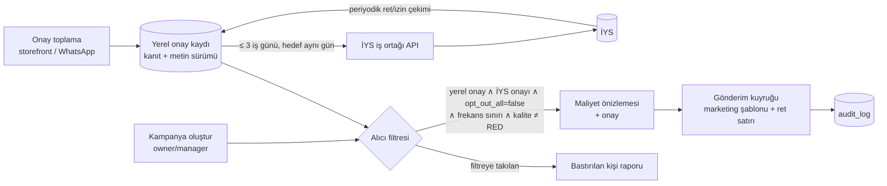
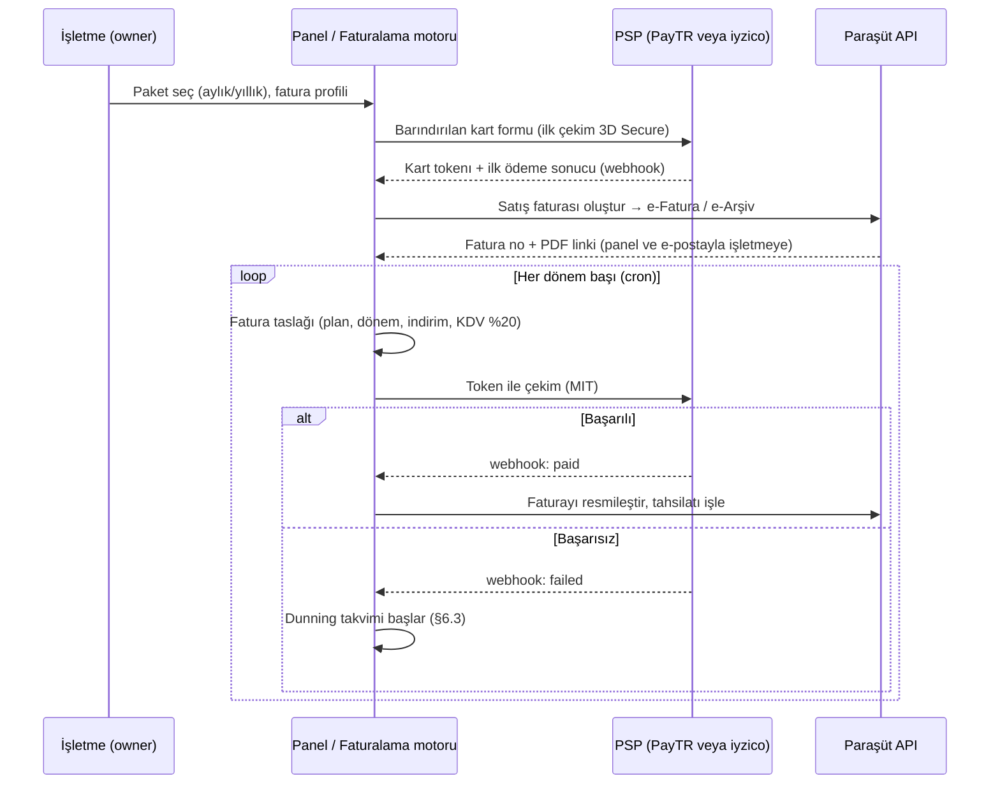

# 08 — Mevzuat, KVKK, Ödeme ve Faturalama

> **UYARI: Bu doküman hukuki veya mali müşavirlik tavsiyesi değildir.** Ürün ve operasyon planlaması için hazırlandı. Buradaki yorumlar ve süreler, canlıya çıkmadan önce KVKK/e-ticaret alanında çalışan bir avukat ve bir mali müşavir tarafından teyit edilmelidir. Kaynak araştırma, mevzuat sitelerine canlı erişim olmadan yapıldı (A03 §0). Bu yüzden tutarlar, eşikler ve yürürlük tarihleri birincil kaynaktan yeniden okunmalıdır.

> **Amaç:** Siparişin Önünde'nin KVKK, ticari elektronik ileti (İYS), e-ticaret, ödeme, abonelik tahsilatı, e-fatura ve vergi yükümlülüklerini ürün kararlarına ve iş listelerine çevirmek.
> **Kapsam:** KVKK rolleri ve süreçleri, ETK/İYS, ETHS/ETAHS ve mesafeli satış, 6493 ve son müşteri ödemesi, abonelik tahsilatı ve e-Fatura/e-Arşiv, şirket/marka/sözleşme seti, vergi, uyum kontrol listesi.
> **Kapsam dışı (bağlantı verilir):** mesaj metinleri ve checkout ekranları → [03](03-musteri-deneyimi-ve-storefront.md); panel ekranları → [04](04-isletme-paneli.md); admin/finans ekranları ve pazarlama sitesi → [05](05-admin-paneli-ve-pazarlama-sitesi.md); barındırma, şifreleme ve log mimarisi → [06](06-teknik-mimari.md); tablo alanları → [07](07-veri-modeli-ve-api.md); takvim → [09](09-yol-haritasi-ve-sprint-plani.md); olay yönetimi ve SLO → [10](10-riskler-operasyon-ve-metrikler.md).
> **İlgili dokümanlar:** [00 Kararlar](00-kararlar-ve-sozluk.md) (özellikle bölüm 9, bağlayıcı) · [01 İş modeli](01-vizyon-pazar-is-modeli.md) · [02 WhatsApp](02-whatsapp-entegrasyonu.md) · [06 Mimari](06-teknik-mimari.md) · [07 Veri modeli](07-veri-modeli-ve-api.md)
> **Kaynaklar:** [arastirma/03-mevzuat-odeme-fatura.md](arastirma/03-mevzuat-odeme-fatura.md) (ana kaynak), [arastirma/01-whatsapp-platform.md](arastirma/01-whatsapp-platform.md) (politikalar), [arastirma/02-pazar-rakipler-is-modeli.md](arastirma/02-pazar-rakipler-is-modeli.md) (Nisan 2026 düzenlemesi), [arastirma/04-mimari-teknoloji.md](arastirma/04-mimari-teknoloji.md) (alt işleyenler).
> **Tarih:** 2026-09-24 · **Durum:** Taslak (düzeltme turunda [00-kararlar-ve-sozluk.md](00-kararlar-ve-sozluk.md) ile hizalandı)

---

## 1. Uyarı notu ve özet

### 1.1 Okuma notları

**Güven etiketleri** (araştırmadan aynen korunur):

| Etiket | Anlamı |
|---|---|
| **[Y]** | Yüksek güven: köklü düzenleme veya bilinen Kurul kararı. Madde metni yine de teyit edilir. |
| **[O]** | Orta güven: ayrıntı (madde no, tarih, eşik) değişmiş veya yanlış hatırlanmış olabilir. |
| **[D?]** | Doğrulanamadı / tahmin → **(teyit edilmeli)**. Karar vermeden önce birincil kaynaktan okunur. |
| **[T]** | Bizim yorumumuz veya ürün önerimiz. |
| **[K01] / [K02] / [K04]** | Kardeş araştırma raporundan (arastirma/01, 02, 04) alınan bulgu; kaynak URL orada. |

- **Atıf biçimi:** `A03 §2.7` = arastirma/03 bölüm 2.7 (birincil kaynak adresleri A03 §14'te). `00 §9` = [00-kararlar-ve-sozluk.md](00-kararlar-ve-sozluk.md) bölüm 9 (bağlayıcı; çelişkide 00 geçerlidir). Yalnız `§2.7` = bu dokümanın bölümü. Fiyatlar KDV hariçtir (KDV %20); kur varsayımı 1 USD ≈ 48,4 TL.
- Süreler (saklama, dunning) aksi yazılmadıkça **[T]** varsayılanıdır. Sözleşmeye ve politikaya girmeden önce avukatla netleşir.

### 1.2 En kritik 10 madde

1. **Roller:** Son müşteri verisinde **işletme veri sorumlusu (VS), biz veri işleyeniz (Vİ)**; bu ilişki DPA ile kurulur. İşletme yetkilisi, personel hesabı, abonelik ve site ziyaretçisi verisinde **biz VS'yiz**. Bu ayrımı bozan özellikler yapılmaz: platform geneli müşteri profili, işletmeler arası pazarlama, keşif sayfası (§2.1).
2. **Kişisel veri Türkiye'de barındırılır.** Yurt dışı alt işleyenler envanterde tutulur ve kişisel veri görmeyecek biçimde yapılandırılır. **En büyük gri alan Meta akışıdır** (KVKK m.9; Meta'nın Türk standart sözleşmesini imzaladığı doğrulanamadı [D?] (teyit edilmeli)). Karşılığında yazılı risk değerlendirmesi, veri minimizasyonu, WhatsApp dışı web kanalı ve avukat görüşü (§2.11).
3. **Veri minimizasyonu varsayılandır, otomatik silme işleri [Faz 1]'de gelir:** Coexistence geçmiş senkronu kapalı, yapılandırılmış alerji alanı yok, sipariş notu 30 gün, medya ve konum 30 gün, mesaj içeriği 6 ay, hareketsiz müşteri 24 ay sonra anonimleştirilir (§2.8).
4. **Olay ve başvuru süreleri:** Veri ihlalinde işletmeye **24 saat**, Kurul'a **72 saat**; ilgili kişi başvurusuna **30 gün**. Panelde dışa aktar, düzelt ve sil/anonimleştir var (§2.9, §2.10).
5. **Sipariş durum mesajları saf bilgilendirmedir.** Şablon editörü promosyon içeriğini engeller. Kampanya modülü **[Faz 2]**'de gelir: işletmenin İYS kaydı, önceden onay, her mesajda ret yolu, gönderim öncesi İYS sorgusu ve audit log şartıyla. WhatsApp, SMS gibi operatörün İYS filtresinden geçmez (§3).
6. **Pazaryeri değiliz.** Vitrin işletmenin künyesiyle yayınlanır, satıcı işletmedir. ETAHS sayılma riskini doğuran özellikler "kırmızı çizgi"dir (§4.2).
7. **Her siparişte mesafeli satış onay adımı var:** özet, KDV dahil toplam, teslimat ücreti, cayma hakkı istisnası notu, ön bilgilendirme linki ve onay eylemi: storefront'ta "Siparişi onayla" butonu ve hemen altında "ödeme yükümlülüğü doğar" ibaresi; WhatsApp AI özetinde [Faz 2] **[Onayla] [Düzenle] [İptal]** butonları ve gövdede aynı ibare. Onay kanıtı saklanır (§4.4).
8. **Müşteri parası hiçbir koşulda bizim hesabımıza girmez (6493).** [Faz 1]'de ödeme kapıda alınır. [Faz 2]'de işletme kendi PayTR hesabını, ardından iyzico hesabını bağlar. [Faz 3]'te Craftgate gelir. Gıdada taksit yok; alkol ve tütün teknik olarak engellidir (§4.6, §5).
9. **Abonelik:** Faturalama motoru bizde, kart tokenı tek PSP'de, yıllık planda havale/EFT seçeneği var, e-Fatura/e-Arşiv Paraşüt API ile kesilir. Dunning kademelidir ve **sipariş alma hemen kesilmez**: G+1/G+3/G+7 yeniden deneme, G+10'da salt-okunur mod, G+21'de askı, G+75'te hesap kapanışı ve veri silme (§6.3). Deneme bitişinde 3 gün uyarı bandı, ardından askı; 90 gün içinde plan seçilirse veri aynen döner, sonra silinir (§6.2). SMS OTP ve kritik durum SMS'lerinin maliyeti platformdadır (§8.6).
10. **Faz 0 kritik yolu:** şirket kuruluşu → Meta Business Verification → MVP öncesi belge seti; marka başvurusu paralel yürür ve isim duyurulmadan önce yapılır. Vergi düzeni ilk aydan kurulur (2 No'lu KDV, stopaj sınıflandırması, Teknokent değerlendirmesi). Tüm [O] ve [D?] maddeler **ilk ücretli işletmeden önce** teyit edilir (§7–§9).

---

## 2. KVKK (6698 sayılı Kanun)

Dayanak: 6698 sayılı Kanun (RG 07.04.2016) [Y]; 7499 sayılı Kanun'la yapılan 2024 değişikliği (RG 12.03.2024, yürürlük 01.06.2024) [O]. Ayrıntı: A03 §2.

### 2.1 Roller: kim veri sorumlusu, kim veri işleyen?

| Veri / işleme | VS | Vİ (ve alt işleyenler) | Hukuki sebep | Not |
|---|---|---|---|---|
| Son müşterinin adı, BSUID/telefonu, adresi, konumu, sipariş içeriği, sipariş notu, WhatsApp yazışmaları (siparişi almak ve teslim etmek için) | **İşletme** | **Biz**. Alt işleyenler: TR barındırma, Meta (Cloud API), SMS sağlayıcısı (SMS OTP ve WhatsApp'sız mod durum SMS'i, Faz 1), e-posta sağlayıcısı, harita (Google Maps), Cloudflare, [Faz 2] LLM (§2.11) | m.5/2-c sözleşmenin kurulması/ifası [Y] | Kimlik `(tenant_id, wa_bsuid)`; WhatsApp'sız modda (SMS OTP) doğrulanmış telefon. Veri tenant içinde kalır [K01] |
| Fiş/fatura ve muhasebe kaydı (işletmenin) | İşletme | Biz (panel kaydı) | m.5/2-ç hukuki yükümlülük [Y] | Yasal defter/belge saklama işletmenindir (§2.8) |
| Kayıtlı adresi sonraki siparişte hatırlama; işletme içi sipariş istatistiği | İşletme | Biz | m.5/2-c veya m.5/2-f meşru menfaat [T] | Müşteriye "adresimi sil" yolu verilir |
| Kampanya listesi ve segment [Faz 2] | İşletme | Biz | ETK onayı + gerekiyorsa açık rıza (§2.5) | Onay ve İYS işletmenin yükümlülüğü, kontroller yazılımda (§3.6) |
| Kurye ve personelin iş verisi (atama, teslim süreleri, kasiyer işlemleri) | İşletme | Biz | İş ilişkisi, m.5/2-c/f [T] | [Faz 3] canlı kurye konumu ayrıca değerlendirilir |
| İşletme sahibi/yetkilisinin kimlik, iletişim, abonelik, fatura ve ödeme verisi | **Biz** | Paraşüt, PSP, TR barındırma, e-posta | m.5/2-c, ç [Y/T] | |
| Panel hesapları, oturum ve güvenlik logları | Biz (hizmet güvenliği) | — | m.5/2-f [T] | |
| Platform WABA'sından ve SMS ile işletme sahibine/personele giden uyarılar (onaylanmamış sipariş alarmı t=2 dk WhatsApp, t=5 dk SMS; kurye giriş linki; [02](02-whatsapp-entegrasyonu.md) §5.3) | Biz | Meta, SMS sağlayıcısı | m.5/2-c + Meta opt-in | Onboarding'de sahibin onayıyla |
| Pazarlama sitesi ziyaretçisi, demo talebi, çerezler | Biz | Analitik, CRM, e-posta | Zorunlu çerez dışında açık rıza (§2.13) | |
| Anonim platform istatistiği (ortalama sepet, yoğun saat) | Biz | — | Gerçekten anonimse KVKK dışında [Y] | Takma adlı (pseudonymous) veri kişisel veridir [Y] |

**Müşterek sorumluluk:** m.12/2'ye göre VS, kendi adına veri işleyenle birlikte veri güvenliğinden **müştereken sorumludur** [Y]. İşletmeler bizden güçlü güvenlik taahhüdü ister ve istemelidir.

**Rol kayması (yapılmaz) [T]:** Aşağıdakiler bizi son müşteri verisinde de VS yapar ve kendi aydınlatma metnimizi, hukuki sebebimizi ve büyük olasılıkla açık rızayı gerektirir:
- Farklı işletmelerin müşterilerini tek profilde birleştirmek ("bu kişi 3 işletmeden sipariş verdi").
- Son müşteri verisini kendi pazarlamamız veya öneri motorumuz için kullanmak.
- Bir işletmenin müşteri verisini başka bir işletmeye taşımak (tenant'lar arası; aynı tenant'ın şubeleri bu kapsamda değildir).

### 2.2 Veri İşleme Sözleşmesi (DPA)

KVKK, GDPR m.28 gibi maddeleri tek tek saymaz. Ancak m.12/2 ve Kurum uygulaması yazılı sözleşmeyi fiilen zorunlu kılar [O/T]. DPA, abonelik sözleşmesinin **eki** olarak click-wrap ile kabul edilir [T].

| # | Madde | İçerik (öneri) [T] |
|---|---|---|
| 1 | Kapsam | Konu, süre, nitelik, amaç; veri kategorileri (kimlik, iletişim, adres/konum, sipariş, işlem güvenliği, pazarlama izni); ilgili kişi grupları (son müşteri, işletme personeli, kurye) |
| 2 | Talimat | Veri yalnız işletmenin belgelenmiş talimatıyla işlenir. Panel ayarları talimat sayılır. Hukuka aykırı görünen talimat işletmeye bildirilir |
| 3 | Gizlilik ve güvenlik eki | Personel gizlilik ve KVKK taahhütnamesi. Kurum'un *Kişisel Veri Güvenliği Rehberi*'ne [O] atıf. Tenant izolasyonu (RLS), TLS ve disk şifreleme, WhatsApp token'ları için envelope encryption, RBAC ve zorunlu 2FA, `audit_log`, telefon maskeleme, PITR yedek ve aylık geri yükleme tatbikatı, yıllık sızma testi, çalışan eğitimi ([06](06-teknik-mimari.md)) |
| 4 | Destek erişimi | `support_agent` tenant verisini yalnız işletme talebiyle veya olay müdahalesinde görür. Her erişim `audit_log`'a yazılır |
| 5 | Alt işleyenler | Güncel liste kamuya açık sayfada yayınlanır (§2.11). Değişiklik **30 gün önceden** bildirilir [T]; işletmenin itiraz ve fesih hakkı olur |
| 6 | Yurt dışına aktarım | Alt işleyenin ülkesi, kullanılan m.9 mekanizması, standart sözleşmeyi kimin imzalayıp Kurum'a kimin bildireceği (§2.11) |
| 7 | İlgili kişi başvuruları | m.11 başvurularına teknik destek (dışa aktarma, düzeltme, silme). Cevap süresi 30 gün [Y] |
| 8 | İhlal bildirimi | Tespitten itibaren **en geç 24 saat** içinde işletmeye bildirim. İşletmenin 72 saatlik Kurul bildirimini yapabilmesi buna bağlıdır [T] |
| 9 | Denetim ve sorumluluk | Makul bilgi talebi hakkı (rapor, anket veya sertifika ile karşılanır); sorumluluk dağılımı, tazmin, üst sınır |
| 10 | Sözleşme sonu | Silmeden önce en az 30 günlük dışa aktarma penceresi: gönüllü iptalde dönem sonundan itibaren 30 gün; dunning'de G+45 bildiriminden G+75 kapanışına kadar; deneme bitişinde askı süresince D+90'a kadar (§6.2, §6.3). Ardından silme; yedeklerden rotasyonla düşme süresi (§2.8). Yasal saklama istisnaları ayrıca yazılır |
| 11 | İşletmenin yükümlülükleri | Aydınlatma metnini yayınlamak (şablon bizden), ETK/İYS yükümlülükleri, hukuka uygun talimat, VERBİS kaydı varsa güncel tutmak |

### 2.3 VERBİS

- **Dayanak:** Veri Sorumluları Sicili Hakkında Yönetmelik (RG 30.12.2017) [Y]. **Muafiyet:** Kurul'un 2018/87 sayılı kararı. Üç koşul birlikte aranır: yıllık çalışan < 50, yıllık mali bilanço < 25 milyon TL, ana faaliyet özel nitelikli veri işleme değil [Y]. Bilanço eşiğinin sonradan yükseltildiği (100 milyon TL gibi) hatırlanıyor [D?] (teyit edilmeli).
- **Biz [T]:** Başlangıçta büyük olasılıkla muafız. "Ana faaliyet özel nitelikli veri değil" koşulunu korumak için sağlık verisi toplayan alan açılmaz (§2.7). Muafiyet değerlendirmesi **yazılı olarak** kayda alınır; çalışan sayısı ve bilanço yıllık uyum takviminde izlenir. **İşletmelerin** çoğu muaftır, zincirler istisna olabilir; onboarding'de "VERBİS kaydınız var mı?" sorusu (opsiyonel) sorulur.
- **Muafiyet yükümlülüksüzlük değildir [Y]:** Aydınlatma, güvenlik, başvuru, ihlal bildirimi ve m.9 yükümlülükleri aynen geçerlidir. Saklama-imha politikası VERBİS'e kayıtlı olanlar için zorunludur, bizim için iyi uygulamadır [O].

### 2.4 Aydınlatma metinleri

Dayanak: m.10 ve Aydınlatma Tebliği (RG 10.03.2018) [Y]. Zorunlu içerik: VS kimliği, amaçlar, aktarılan taraflar ve amacı, toplama yöntemi ve hukuki sebep, m.11 hakları [Y]. Metinde "vb.", "gibi" türünden belirsiz ifadeler kullanılmaz; aydınlatma ile açık rıza aynı metinde birleştirilmez [O].

| Metin | Kim adına | Nerede yayınlanır | Faz |
|---|---|---|---|
| A. Kurumsal aydınlatma metni + gizlilik politikası (ziyaretçi, demo talebi, işletme yetkilisi, abonelik) | Biz | `siparisinonunde.com` altbilgisi, kayıt formu, panel. **Meta App için gizlilik politikası URL'si de bu sayfadır** (A01 §1.3) | Faz 0 |
| B. Son müşteri aydınlatma metni **şablonu**. İşletme unvanı, adresi ve iletişim bilgisi otomatik dolar; sürümlüdür | İşletme (VS) | Storefront altbilgisi ve checkout, takip sayfası, WhatsApp karşılama mesajındaki kısa satır + link, SMS OTP kod ekranındaki (WhatsApp'sız mod) kısa satır + link | Faz 1 |
| C. Panel kullanıcıları (personel, kurye) için kısa bilgilendirme. Web Push aboneliği (tarayıcı push servisleri FCM/APNs/Mozilla, yurt dışı) ile SMS ve platform WhatsApp alarmlarında işlenen iletişim verisi dahil | Hesap güvenliği için biz, personel yönetimi için işletme | Panel girişi, kurye magic link ekranı | Faz 1 |

**Son müşteri şablonunun iskeleti (avukat metni yazar) [T]:**
1. **Veri sorumlusu** {işletme unvanı, adres, telefon, e-posta, varsa MERSİS}; **işlenen veriler**: ad, WhatsApp kullanıcı kimliği/telefon, SMS doğrulaması için cep telefonu numarası ve doğrulama kaydı, teslimat adresi ve konum, sipariş ve ödeme yöntemi, sipariş notu, WhatsApp yazışmaları, işlem güvenliği (IP, cihaz); **amaçlar ve hukuki sebepler** (m.5/2-c, ç, f; siparişin doğrulanması ve sahte siparişin önlenmesi dahil); **toplama yöntemi** (WhatsApp, web vitrini, SMS doğrulaması, telefon).
2. **Aktarılan taraflar:** yazılım sağlayıcısı Siparişin Önünde (veri işleyen) ve onun alt işleyenleri: yurt içi barındırma; **SMS hizmet sağlayıcısı (yurt içi; doğrulama kodu ve WhatsApp'sız modda onay/iptal SMS'i) [Faz 1]**; Meta/WhatsApp (**yurt dışı**, ülke ve dayanak açıkça); harita hizmeti (Google Maps, **yurt dışı**; adres otomatik tamamlama, ad ve telefon gönderilmez); işletmenin kuryesi; [Faz 2] ödeme kuruluşu ve yapay zekâ hizmet sağlayıcısı (yurt dışı); yetkili kurumlar. Güncel alt işleyen listesine link verilir (§2.11).
3. **Saklama süreleri** (§2.8 özetle). Sipariş notunda paylaşılan bilgilerin (sağlık bilgisi dahil) yalnız o sipariş için kullanıldığı ve 30 gün sonra silindiği (§2.7).
4. **m.11 hakları ve başvuru yolu:** işletmenin iletişim kanalı; [Faz 2] storefront başvuru formu.

**WhatsApp'ta ilk temas [T]:** Karşılama mesajının gövdesine tek satır eklenir (ayrı mesaj değildir, maliyet getirmez): *"Kişisel verileriniz siparişinizi almak ve teslim etmek amacıyla {İşletme} tarafından işlenir. Ayrıntı: {link}"*. Satır yalnız müşterinin ilk konuşmasında veya metin sürümü değiştiğinde gönderilir. Metnin nihai hali [03](03-musteri-deneyimi-ve-storefront.md)'te.

### 2.5 Hukuki sebepler ve açık rıza gereken durumlar

| İşleme | Hukuki sebep | Açık rıza gerekir mi? |
|---|---|---|
| Siparişi almak, hazırlamak, teslim etmek, müşteriyle iletişim | m.5/2-c [Y] | Hayır |
| Siparişi doğrulamak (WhatsApp kodu veya SMS OTP, [Faz 1]) ve sahte siparişi önlemek | m.5/2-c, f [T] | Hayır |
| Fiş/fatura, muhasebe | m.5/2-ç [Y] | Hayır |
| Adresi hatırlamak, işletme içi basit istatistik | m.5/2-c/f [T] | Genelde hayır [T] |
| Kampanya/duyuru mesajı [Faz 2] | 6563 kapsamında **önceden onay** (§3). KVKK açısından ETK onayının yeterliliği tartışmalı [O/D?] (teyit edilmeli) | ETK onayı şart; profilleme varsa ayrıca açık rıza önerilir [T] |
| Kişiye özel profil/segment ("sadık müşteri", davranışa göre teklif) [Faz 2] | Kurul'un pazarlama profillemesinde açık rızaya yöneldiği biliniyor [O] | **Evet** (öneri) |
| Doğum günü mesajı için doğum tarihi toplamak [Faz 2] | Pazarlama amaçlı ek veri [T] | **Evet** (öneri), ayrıca ETK onayı |
| Alerji/sağlık bilgisi, inanç çıkarımı (helal/koşer tercihi) | m.6 özel nitelikli veri; sözleşmenin ifası **dayanak değildir** [Y] | **Evet** ya da hiç toplanmaz (§2.7) |
| Yurt dışına aktarım (arızi yol) | m.9/6-a | Yalnız arızi aktarım için; düzenli akış için kullanılmaz (§2.11) |
| Zorunlu olmayan çerezler | Açık rıza (Çerez Rehberi) [O] | **Evet** |
| Müşteri yorumunu isimle yayınlamak [Faz 2] | Açık rıza ya da anonim yayın [T] | İsim varsa evet |

Genel kurallar: açık rıza hizmet şartına bağlanamaz, yani "onay vermezsen sipariş veremezsin" denemez [O]. Önceden işaretlenmiş kutu kullanılamaz [Y]. Rıza belirli bir konuya ilişkin, bilgilendirmeye dayalı ve özgür iradeyle verilmiş olmalıdır [Y].

### 2.6 Rıza ve kabul kayıtlarının ortak modeli

Açık rıza, ETK onayı (§3.4), mesafeli satış onayı (§4.4) ve sözleşme kabulü (§7.5) aynı ilkeyle saklanır: **kim, hangi metnin hangi sürümünü, ne zaman, hangi kanaldan ve hangi kanıtla kabul etti.** Metinler `legal_documents` tablosunda sürüm olarak tutulur ve içerik hash'i saklanır; kabuller `legal_acceptances`, onay ve retler `consents` tablosuna yazılır. Alan listesi → [07](07-veri-modeli-ve-api.md).

### 2.7 Özel nitelikli veri: alerji kuralı

- 7499 ile değişen m.6'daki işleme şartları: açık rıza, kanunda öngörülme, fiili imkânsızlıkta hayati koruma, alenileştirme, hakkın tesisi, kamu sağlığı, istihdam/sosyal güvenlik, vakıf/dernek [O]. **Sözleşmenin ifası bu listede yoktur** [Y/O]. "Fıstık alerjim var" veya "çölyak hastasıyım" notu **sağlık verisidir** [Y]. Aşağıdaki yaklaşım yine de gri alandır; avukata sorulur (§11.1).

**Ürün kuralları [Faz 1] ([00-kararlar-ve-sozluk.md](00-kararlar-ve-sozluk.md) §9):**
1. Müşteri profilinde yapılandırılmış **alerji/sağlık alanı yoktur**. Serbest sipariş notu yalnız o siparişte kullanılır: sipariş kartında ve mutfak fişinde görünür, müşteri profiline ve raporlara taşınmaz, **30 gün** sonra silinir (§2.8).
2. Not alanının yardım metni sağlık bilgisi istemez ("zili çalmayın, soğansız" gibi örnekler verir). Aydınlatma metni notun kısa saklandığını söyler.
3. Alerjen bilgisi **menü ürün özelliği** olarak gösterilir ("içinde fıstık var", 14 ana alerjen etiketi). Bu kişisel veri değildir ve gıda mevzuatı açısından da faydalıdır (§4.6).
4. **[Faz 2] AI akışı:** LLM'e giden metinde sağlık ifadeleri (alerji, hastalık adları) maskelenir. Maskelenemeyen belirsiz durumda sipariş panelde insan onayına düşer [T].

**Kabul kriterleri:** Müşteri tablosunda sağlık amaçlı alan bulunmadığı şema testinde doğrulanır. Final durumdan 30 gün sonra `orders.notes` boştur. Not içeriği hiçbir log ve hata kaydında yer almaz.

### 2.8 Saklama ve imha (ürüne otomatik silme işi olarak yansır)

Dayanak: Silme, Yok Etme veya Anonim Hale Getirme Yönetmeliği (RG 28.10.2017) [Y]. Periyodik imha en fazla 6 ay aralıkla yapılır [O]. İmha kayıtları en az 3 yıl saklanır [O]. Aşağıdaki işler `apps/worker` içindeki `cron` kuyruğunda günlük veya haftalık çalışır. Böylece 6 aylık üst sınır fazlasıyla karşılanır.

| # | Veri türü | Varsayılan süre | Süre başlangıcı | Silme / anonimleştirme yöntemi | İş adı | Faz | Dayanak |
|---|---|---|---|---|---|---|---|
| 1 | Sipariş notu (serbest metin) | 30 gün | Sipariş final durumu (`delivered`, `cancelled`, `rejected`) | Alan kalıcı olarak boşaltılır | `retention.order_notes` | 1 | [T]; A03 30–90 gün; §2.7 |
| 2 | WhatsApp medyası (ses, fotoğraf, belge) | 30 gün | Alınma | Nesne depodan kalıcı silme, referans NULL | `retention.media` | 1 | [T]; A03 30–90 gün |
| 3 | Gelen konum mesajının ham koordinatı | 30 gün | Alınma | Koordinat silinir; siparişteki adres metni kalır | `retention.locations` | 1 | [T]; A03 ≤30 gün |
| 4 | WhatsApp mesaj içeriği (Coexistence geçmiş senkronu açıksa o mesajlar da) | 6 ay | Mesajın zaman damgası | Metin silinir. `wamid`, yön, zaman ve maliyet kalır; sipariş özeti siparişte durur | `retention.wa_messages` | 1 | [T]; A03 6–12 ay |
| 5 | Takip sayfası linki (`/t/{token}`) ve sayfadaki kişisel alanlar (adres, telefon) | Teslimden (veya iptal/ret final durumundan) 7 gün | Final durum | Link geçersizleşir; kişisel alanlar artık gösterilmez. Siparişe bağlı ön bilgilendirme ve sözleşme metni sürümü, kişisel veri içermeyen kalıcı adreste (`legal_documents` URL'si) erişilebilir kalır | `retention.tracking_pages` | 1 | [00-kararlar-ve-sozluk.md](00-kararlar-ve-sozluk.md) §7 (takip linki 7 gün) |
| 6 | Müşteri kimlik ve iletişim verisi (ad, telefon, BSUID, kullanıcı adı, adres defteri) | 24 ay hareketsizlik; işletme 6–24 ay arasında kısaltabilir | Son sipariş veya son gelen mesaj | **Anonimleştirme:** kişi kaydı anonim kimliğe döner; siparişlerdeki ad, telefon ve adres anlık görüntüleri temizlenir, ilçe düzeyi kalır | `retention.customer_inactive` (haftalık) | 1 | [T]; A03 24 ay |
| 7 | Sipariş kaydı (kalemler, tutar, tarih, ödeme yöntemi, kanal) | Abonelik süresince | — | Hesap kapanınca satır 12 | — | 1 | Defter/belge saklama işletmenindir (VUK m.253: 5 yıl, TTK m.82: 10 yıl) [O]; işletme kendi kopyasını alır |
| 8 | Kurye canlı konumu | 30 gün | Teslim | Silme | `retention.courier_locations` | 3 | [T]; A03 ≤30 gün |
| 9 | ETK onay ve ret kayıtları | Onayın sona ermesinden itibaren 3 yıl | Ret / sona erme | Silme | `retention.consents` | 2 | Yönetmelik [O] |
| 10 | Trafik ve erişim logları (yer sağlayıcı) | 1 yıl | Kayıt | Silme | `retention.access_logs` | 1 | 5651 m.5, 1–2 yıl aralığı [O]; kesin süre (teyit edilmeli) |
| 11 | Uygulama logları (telefon maskeli) ve hata izleme olayları | 30 gün | Kayıt | Log sisteminin ve Sentry'nin saklama ayarı | (altyapı ayarı) | 1 | [T] |
| 12 | Kapanan tenant'ın tüm verisi | Silmeden önce en az 30 günlük dışa aktarma penceresi. Gönüllü iptal: dönem sonu + 30 gün. Dunning: **G+75** (pencere G+45 bildirimiyle başlar, §6.3). Deneme bitişi: **D+90** (bu süre içinde plan seçilirse veri aynen döner, §6.2) | İptalde dönem sonu; dunning'de başarısız ödeme günü (G); denemede deneme bitişi (D0) | Tenant verisinin tamamı silinir; bizim fatura kayıtlarımız kalır. Yedeklerden 35 gün içinde düşer (satır 17) | `retention.tenant_offboarding` | 1 | DPA m.10; [00-kararlar-ve-sozluk.md](00-kararlar-ve-sozluk.md) §9 |
| 13 | Panel güvenlik ve `audit_log` kayıtları | 2 yıl | Kayıt | Silme | `retention.audit` | 1 | [T] |
| 14 | Panel kullanıcı hesabı (işletme yetkilisi, personel) | Hesap kapanışından 30 gün sonra | Kapanış | Silme. Kabul kayıtları ve faturadaki bilgiler 10 yıl kalır | `retention.users` | 1 | [T] (teyit edilmeli) |
| 15 | Pazarlama sitesi talepleri (demo, lead) | 12 ay hareketsizlik | Son temas | Silme | `retention.leads` | 1 | [T] |
| 16 | Bizim faturalarımız ve muhasebe belgelerimiz | 10 yıl | Belge tarihi | — | — | 2 | TTK m.82, VUK m.253 [O] |
| 17 | Yedekler (PITR) | 35 gün rotasyon | — | Eski yedek otomatik silinir. Silinen veri en geç 35 günde yedeklerden de düşer | Yedek aracı politikası | 1 | [T]; A03 35–90 gün |
| 18 | İmha kayıtları (bu işlerin çıktısı) | En az 3 yıl | Koşu | — | — | 1 | [O] |
| 19 | SMS OTP doğrulama kayıtları (`otp_verifications`) ve SMS gönderim kayıtları (`sms_messages`: müşteri OTP'si, WhatsApp'sız mod durum SMS'i, işletme alarmı) | OTP kaydı 30 gün; SMS gönderim kaydı 90 gün | Kayıt | OTP kaydı silinir; SMS kaydında telefon maskelenir, durum ve maliyet kalır | `retention.technical` | 1 | [T]; Akış B SMS OTP yedeği ([00-kararlar-ve-sozluk.md](00-kararlar-ve-sozluk.md) §7), [07](07-veri-modeli-ve-api.md) §9 |

**Kabul kriterleri (otomatik silme) [Faz 1]:**
- Her iş idempotenttir, tenant bazında çalışır ve sonucu `retention_runs` tablosuna yazar: iş adı, tenant, silinen/anonimleşen kayıt sayısı, süre, hata. Bu kayıt imha tutanağı yerine geçer.
- Başarısız veya 48 saattir koşmamış iş admin panelinde alarm üretir.
- İşletme süre ayarını (satır 6) değiştirince yeni süre bir sonraki koşuda uygulanır. Ayar değişikliği `audit_log`'a yazılır.
- Staging'de zaman yolculuğu (sahte saat) testiyle her iş doğrulanır. CI'da "silinmiş alan logda görünmez" testi çalışır.
- Saklama-imha politikası (iç doküman) bu tabloyu birebir içerir; tablo değişirse politika sürümü de değişir.

### 2.9 Veri ihlali müdahale süreci (72 saat)

Dayanak: m.12/5; Kurul'un 2019/10 sayılı kararı [Y/O]. Kurul'a bildirim 72 saat içinde yapılır; ilgili kişilere, etkilenenler belirlenince makul en kısa sürede bildirilir; gecikme gerekçelendirilir; ihlal kayıtları tutulur; **veri işleyen, ihlali gecikmeksizin VS'ye bildirir**. Kurum'un çevrimiçi Veri İhlali Bildirim Formu kullanılır [O].

**Çok kiracılı yapıda anlamı [T]:** Etkilenen **her işletme ayrı bir VS'dir** ve Kurul'a ayrı bildirim yapar. Kendi VS olduğumuz veriler için (işletme yetkilileri, abonelik) biz de bildirim yaparız.

| Zaman | Adım | Sorumlu |
|---|---|---|
| T0 | Tespit (alarm, dış ihbar, alt işleyen bildirimi). Olay kaydı açılır, olay sorumlusu atanır | Nöbetçi mühendis |
| T0 + 1 saat | Sınırlama (anahtar iptali, erişim kapatma), delil koruma (log anlık görüntüsü), ilk sınıflandırma: kişisel veri etkileniyor mu? | Teknik lider |
| T0 + 4 saat | Etki analizi: hangi tenant'lar, hangi veri kategorileri, yaklaşık kaç kişi (`audit_log` ve erişim loglarından tenant bazlı rapor) | Teknik lider, `platform_admin` |
| **T0 + 24 saat (en geç)** | Etkilenen işletmelere ilk bildirim (DPA taahhüdü): bilinenler, bilinmeyenler, alınan önlemler ve Kurul formuna hazır veri paketi | Kurucu (`platform_owner`), `support_agent` |
| **T0 + 72 saat** | Bizim VS olduğumuz veriler için Kurul'a bildirim; işletmelerin bildirimleri için destek; gecikme varsa gerekçe | Kurucu, avukat |
| Etkilenenler belirlenince | İlgili kişilere bildirim. Son müşteriye bildirimi işletme yapar; biz hazır metin ve iletişim listesi dışa aktarımı sağlarız | İşletme; biz (destek) |
| Kapanış (≤ 30 gün) | Kök neden, düzeltici önlemler, ihlal envanterine kayıt, işletmelere kapanış raporu | Teknik lider |

- **Hazırlık [Faz 1]:** Tenant bazlı etki raporu üretebilen log altyapısı ([06](06-teknik-mimari.md)), işletmelere gidecek hazır bildirim şablonları, 7/24 iletişim zinciri, **yılda bir tatbikat**. Olay yönetimi süreciyle birleşik çalışır → [10](10-riskler-operasyon-ve-metrikler.md). **7545 sayılı Siber Güvenlik Kanunu** (RG 19.03.2025) izlenir [O]; siber olay bildirimi yükümlülüğünün bize uygulanıp uygulanmadığı belirsizdir [D?] (teyit edilmeli).

### 2.10 İlgili kişi başvuruları (30 gün) ve panel desteği

Dayanak: m.11, m.13 ve Başvuru Tebliği (RG 10.03.2018). Cevap süresi en geç **30 gün** [Y]; başvuru kural olarak ücretsizdir [O].

**Akış [T]:** Son müşteri işletmeye başvurur. Başvuru bize gelirse `support_agent` başvurucuya işletmenin iletişim bilgisini verir, işletmeye 2 iş günü içinde iletir ve DPA kapsamında teknik destek sağlar.

**Yetki ([00-kararlar-ve-sozluk.md](00-kararlar-ve-sozluk.md) §4):** Müşteri verisine ilişkin KVKK talepleri (başvuru kaydı, dışa aktarma, başvuruya bağlı düzeltme, silme/anonimleştirme) yalnız `owner` ve `manager` tarafından yürütülür.

| Panel işlevi | Kim kullanır | Faz |
|---|---|---|
| Müşteri detayında **"Verileri dışa aktar"**: kimlik, iletişim, adresler, siparişler, mesajlar, onaylar (JSON + okunur PDF/CSV) | `owner`, `manager` | 1 |
| **"Düzelt"** (KVKK başvurusuna bağlı düzeltme, başvuru kaydına işlenir): ad, telefon, adres. Kasiyerin sipariş sırasında yaptığı olağan adres/ad güncellemesi KVKK talebi sayılmaz | `owner`, `manager` | 1 |
| **"Sil / anonimleştir"**: açık siparişi yoksa çalışır; mali sipariş kaydı anonim kalır (§2.8 satır 6 yöntemi) | `owner`, `manager` | 1 |
| **"Tüm bildirimleri durdur"** (`opt_out_all`, [02](02-whatsapp-entegrasyonu.md) §6.9) | `owner`, `manager`, `cashier` | 1 |
| **Başvuru kaydı**: tarih, kanal, talep türü, son tarih (başvuru + 30 gün), durum. Son tarihe 7 gün kala uyarı | `owner`, `manager` | 1 |
| "Pazarlama iznini geri al" + İYS'ye ret kaydı | `owner`, `manager`, `cashier` | 2 |
| Storefront'ta self-servis "KVKK başvurusu" formu → işletmenin başvuru kutusu | Son müşteri | 2 |
| Bizim VS olduğumuz veri: hesap ayarlarında dışa aktarım ve hesap silme talebi | İşletme kullanıcıları | 1 |

**Kabul kriterleri:** Anonimleştirilen müşteri aramada bulunmaz; siparişlerde "Anonim müşteri" görünür. Her işlem `audit_log`'a yazılır. `cashier`, `kitchen` ve `courier` KVKK talebi işlemlerini (dışa aktarma, silme/anonimleştirme, başvuru kaydı) göremez ve yapamaz (yetki testi). Başvuru yanıt şablonu, verinin yedeklerden 35 gün içinde düşeceğini söyler.

### 2.11 Yurt dışına aktarım (m.9) ve alt işleyen envanteri

**Çerçeve [O]:** 7499 ile m.9 baştan yazıldı; ayrıntılar Yurt Dışına Aktarım Yönetmeliği'nde (RG 10.07.2024). Mekanizmalar sırasıyla şunlardır:
1. **Yeterlilik kararı:** Bilgi kesimi itibarıyla hiçbir ülke için yayınlanmadı [O] (teyit edilmeli).
2. **Uygun güvence:** Pratikte tek yol, **Kurul'un standart sözleşmesi** (VS→VS, VS→Vİ, Vİ→Vİ, Vİ→VS modülleri) [O]. Metin değiştirilmeden kullanılır ve imzadan itibaren **5 iş günü içinde Kurum'a bildirilir** [Y]. Bildirim yapılmazsa m.18 cezası uygulanır: 2024 nominal tutarı 50.000–1.000.000 TL, her yıl yeniden değerlenir [O]. Bildirim yöntemi (KEP, e-imza vb.) [D?] (teyit edilmeli).
3. **Arızi aktarım:** Açık rıza dahil. Yalnız düzenli olmayan, bir veya birkaç kez gerçekleşen, olağan iş akışı dışındaki aktarımlar için geçerlidir [O]. **WhatsApp üzerinden sürekli sipariş akışı arızi değildir** [T]. Düzenli akış açık rızayla meşrulaştırılmaya çalışılmaz.

Yurt dışından **uzaktan erişim** de aktarım sayılır [O]. Bu yüzden üretim veritabanına yalnız Türkiye'deki bastion üzerinden erişilir; yurt dışından erişim yasaktır ya da istisna kaydıyla açılır [T].

**Aktarım envanteri** (admin panelinde ve kamuya açık alt işleyen sayfasında tutulur; kolonlar: ülke, veri kategorisi, m.9 dayanağı, sözleşme tarihi, bildirim tarihi). **Yurt dışı alt işleyen ve araçlar:** Meta, Anthropic, Cloudflare, Sentry (SaaS seçilirse), e-posta sağlayıcısı (yurt dışı seçilirse), **Google Maps Platform, Web Push servisleri (FCM, APNs, Mozilla), GitHub ve iş araçları**. Bu tablo, [00-kararlar-ve-sozluk.md](00-kararlar-ve-sozluk.md) §10'un "tam liste 08 §2.11" diye atıf yaptığı kanonik aktarım envanteridir. **Yurt içi alt işleyenler:** barındırma, SMS sağlayıcısı, PSP, Paraşüt.

| Alt işleyen / araç | Amaç | Kişisel veri | Konum | m.9 yaklaşımı | Minimizasyon | Faz |
|---|---|---|---|---|---|---|
| **Meta (WhatsApp Cloud API)** | Mesaj iletimi | Mesaj içeriği, BSUID/telefon, profil adı | Yurt dışı; sunucu konumu [D?] (teyit edilmeli) | WABA işletmenindir; aktaran büyük olasılıkla işletme (VS→Vİ), biz de akıştayız (Vİ→Vİ yorumu). **Meta'nın Türk standart sözleşmesi modülü var mı [D?] (teyit edilmeli).** Varsa imza ve bildirim sorumluluğu DPA'da netleşir; işletme adına bildirimi bizim yapabilmemiz [D?] (teyit edilmeli). Yoksa: yazılı risk değerlendirmesi, aydınlatmada açık bildirim, avukat görüşü | Şablonlarda adres ve telefon tekrarlanmaz; ayrıntı TR'de barınan takip sayfasında gösterilir. Coexistence geçmiş senkronu kapalıdır. WhatsApp dışı web kanalı her zaman açıktır | 1 |
| **Anthropic (Claude API)** | [Faz 2] serbest metin sipariş ayrıştırma; menü fotoğrafından/PDF'ten çıkarma (Faz 1'de yalnız ekip içi concierge aracı, Faz 2'de self-servis; kişisel veri yok) | Maskelenmiş sipariş metni (Faz 2); menü çıkarmada yok | ABD (inference geo yalnız `us`/`global`) [K04] | Standart sözleşme imzalanabiliyorsa imza + 5 iş günü bildirim; yoksa gönderilen metnin kişisel veri olmaktan çıkarılması. Alternatif: AB bölgesinde Bedrock/Vertex (model uygunluğu [D?]) (teyit edilmeli) | Ad, telefon, adres ve sağlık ifadeleri maskelenir. API verisi varsayılan olarak eğitimde kullanılmaz ve saklanmaz (Covered Models hariç) [K04] | 1 (menü, kişisel veri yok) / 2 (sipariş) |
| **Cloudflare** | DNS, CDN, WAF, TLS sonlandırma; R2'de yalnız ürün görselleri | Geçen HTTP trafiği (form verisi dahil), IP adresi | Global edge | KVKK standart sözleşmesi modülü var mı [D?] (teyit edilmeli). TLS sonlandırmanın yurt dışında olması aktarımdır [K04] | R2'de kişisel veri yok (müşteri medyası TR'de). Alternatif: kişisel veri taşıyan uç noktaları TR origin'e doğrudan yönlendirme ([06](06-teknik-mimari.md)'da değerlendirilir) | 1 |
| **Sentry** (SaaS) | Hata izleme | PII scrub sonrası teknik veri | Sağlayıcı bölgesi [D?] (teyit edilmeli) | Standart sözleşme, ya da TR'de self-host (Sentry/GlitchTip) ile aktarım yok | PII scrub zorunlu, IP maskeleme, request body gönderilmez | 1 |
| **E-posta sağlayıcısı** (fatura, şifre sıfırlama, uyarı, opsiyonel sözleşme PDF'i) | İşlemsel e-posta | Yetkili e-postası ve adı; son müşteri e-postası (varsa) | Seçilecek; **yurt içi tercih edilir** (A03 §2.11) | Yurt dışıysa standart sözleşme + bildirim | Gövdede sipariş ayrıntısı yerine link | 1 |
| **Google Maps Platform** | Storefront'ta adres otomatik tamamlama, geocoding ([00-kararlar-ve-sozluk.md](00-kararlar-ve-sozluk.md) §10) | Adres metni, koordinat, istek IP'si | **Yurt dışı** (ABD) | Standart sözleşme sorgusu; yoksa yazılı risk değerlendirmesi. Son müşteri aydınlatma şablonunda yurt dışı alıcı olarak adıyla yazılır (§2.4) | Ad ve telefon gönderilmez; kayıtlı adres ve poligon kullanımıyla çağrı azaltılır; 300+ işletmede self-host Photon ([00-kararlar-ve-sozluk.md](00-kararlar-ve-sozluk.md) §10) | 1 |
| **Web Push servisleri**: Google FCM (Chrome, Edge, Android), Apple APNs (Safari, iOS'ta ana ekrana eklenmiş PWA), Mozilla Push Service (Firefox) | Personele "yeni sipariş" bildirimi (alarm zinciri t=0) | Müşteri verisi yok (yalnız sipariş no). Personel cihazının push uç noktası ve IP'si servis tarafından görülür | **Yurt dışı** (ABD / servis bölgesi [D?] (teyit edilmeli)) | Payload Web Push şifrelemesiyle uçtan uca şifrelidir [O]; müşteri verisi gönderilmediği için son müşteri açısından aktarım yok sayılır [T]. Personelin teknik verisi tarayıcı üreticisinin şartlarıyla işlenir; panel kullanıcı bilgilendirmesinde (§2.4-C) belirtilir | Payload'da müşteri adı, telefonu ve adresi yok; bildirim metni "Yeni sipariş #1234" düzeyinde | 1 |
| **SMS sağlayıcısı** (Netgsm, İleti Merkezi, Verimor) | **Müşteri SMS OTP doğrulaması ve WhatsApp'sız modda kritik durum SMS'i (onaylandı/iptal) [Faz 1]**; işletmeye alarm SMS'i (t=5 dk); kurye giriş linki; panel girişi OTP | Telefon; mesaj metni (kod, işletme adı, takip linki) | TR | Aktarım yok. DPA'da alt işleyen olarak yer alır; son müşteri aydınlatma şablonunda adıyla yazılır (§2.4) | Mesajda adres ve sipariş ayrıntısı yok, yalnız takip linki; ileti türü "bilgilendirme" olarak işaretlenir (§3.1); maliyeti platform öder (§8.6); gönderim kayıtları 90 gün sonra maskelenir (§2.8 satır 19) | 1 |
| **İş araçları** (kurumsal e-posta ve ofis paketi, CRM, toplantı aracı; Faz 1'de harici destek/yardım masası kullanılmaz, destek kayıtları admin panelinde `admin_notes`'ta tutulur, [00-kararlar-ve-sozluk.md](00-kararlar-ve-sozluk.md) §7) | Satış ve destek | İşletme yetkilisi ve aday verisi (biz VS) | Değişken; çoğu **yurt dışı** | Yurt dışıysa VS→Vİ standart sözleşme + 5 iş günü bildirim; yurt içi alternatif varsa tercih edilir (e-posta sağlayıcısında olduğu gibi) | İş araçlarına son müşteri verisi aktarılmaz; ekran görüntüsünde telefon/adres maskelenir | 1 |
| **GitHub** (kod, GitHub Actions CI) | Geliştirme | Müşteri verisi yok (yalnız ekip üyelerinin geliştirici hesapları) | **Yurt dışı** (ABD) | Müşteri verisi olmadığı için aktarım yok sayılır [T]; ekip hesapları için iş araçlarıyla aynı yaklaşım | Üretim verisi, sırlar ve DB dökümleri issue, repo ve CI loglarına konmaz; test verisi sentetiktir | 1 |
| **TR barındırma, PSP (PayTR/iyzico), Paraşüt** | Altyapı, tahsilat, fatura | Tüm DB; kart tokenı (PSP'de); fatura verisi | TR | Aktarım yok | — | 1–2 |

**Meta için eylem planı [T]:** (a) Meta'nın güncel veri işleme ve aktarım şartlarında KVKK modülü olup olmadığı Tech Provider kanalından ve Türk Solution Partner'lardan **yazılı olarak** sorulur. (b) Cevap gelene kadar yazılı aktarım risk değerlendirmesi hazırlanır ve avukat görüşü alınır. (c) Bu, Türkiye'de WhatsApp Business API kullanan herkesin ortak sorunudur. Pazarlamada "KVKK uyumlu" yerine "Verileriniz Türkiye'de barındırılır" gibi doğrulanabilir ifadeler kullanılır.

### 2.12 Barındırma kararı

- KVKK genel bir yerelleştirme zorunluluğu getirmez [Y]. Yerelleştirme sektöreldir (bankacılık, ödeme kuruluşları, e-belge entegratörleri) ve biz bu sektörlerde değiliz [O/T].
- **Karar ([00-kararlar-ve-sozluk.md](00-kararlar-ve-sozluk.md) §10):** Kişisel veri (PostgreSQL, yedekler, müşteri medyası) **Türkiye'de** barındırılır; ikinci yedek başka bir Türkiye lokasyonunda tutulur; ürün görselleri kişisel veri olmadığı için Cloudflare R2'de olabilir. Teklif alınacaklar: Turkcell Bulut, Türk Telekom, Huawei Cloud İstanbul, Radore, Bulutistan [D?] (özellik ve fiyatlar teyit edilmeli). Sağlayıcı seçimi proje sahibi kararıdır ([00-kararlar-ve-sozluk.md](00-kararlar-ve-sozluk.md) §13.4; varsayılan: yurt içi yerli bulut). Sağlayıcıdan veri merkezi konumu, ISO 27001, yedek lokasyonu, SLA ve KVKK DPA'sı istenir.
- **Gerekçe:** Kendi altyapımız için m.9 yükü kalkar; esnafa "verileriniz Türkiye'de" güven mesajı verilir. Karşılığında yönetilen servis azdır ve DevOps yükü artar (A03 §2.12).

### 2.13 Çerezler

Kaynak: Kurum'un Çerez Uygulamaları Hakkında Rehber'i (2022) [O]. Zorunlu çerezler dışındakiler için açık rıza gerekir. Rıza alınmadan bu çerezler yüklenmez; "Reddet" "Kabul et" kadar kolaydır; önceden işaretli seçenek olmaz.

| Yüzey | Kural | Faz |
|---|---|---|
| Pazarlama sitesi | Rıza paneli (CMP); analitik ve pazarlama etiketleri rızadan sonra yüklenir. Mümkünse birinci taraf, çerezsiz analitik kullanılır | 1 |
| Storefront ve takip sayfası | Varsayılan olarak yalnız zorunlu çerezler (sepet, oturum). Çerezsiz birinci taraf analitik [T] | 1 |
| İşletmenin eklediği Meta Pixel / Google Ads etiketi | Özellik sunulursa CMP zorunlu olur; işletme VS, biz Vİ kalırız | Açık (§12) |
| Panel ve admin | Yalnız zorunlu oturum ve güvenlik çerezleri | 1 |

### 2.14 Yaptırımlar (ölçek)

m.18'deki başlıca yaptırımlar aydınlatma, veri güvenliği, Kurul kararlarına uymama, VERBİS ve 2024'te eklenen m.9/5 standart sözleşme bildirimi ihlalleri içindir [Y/O]. **2026 tutarları doğrulanamadı** [D?] (teyit edilmeli). İtiraz yolu 2024'te idare mahkemesine taşındı [O]. Emsal: Kurul'un WhatsApp LLC hakkındaki 2021 kararı, yaklaşık 1,95 milyon TL [O]. İtibar riski de vardır: Kurul karar özetlerini yayınlar [T].

---

## 3. Ticari Elektronik İleti (ETK) ve İYS

Dayanak: 6563 sayılı Kanun (RG 05.11.2014) [Y]; Ticari İletişim ve Ticari Elektronik İletiler Hakkında Yönetmelik (RG 15.07.2015) [Y]; İYS değişikliği (RG 04.01.2020) [O]. Ayrıntı: A03 §3.

### 3.1 WhatsApp mesajı kapsamda mı?

Kanundaki tanım, araçları "gibi" diyerek açık uçlu sayar. Anlık mesajlaşma üzerinden gönderilen ticari amaçlı içerik de kapsama girer [O/T]. İYS SSS'sine göre kampanya/pazarlama içerikli WhatsApp mesajı için önceden onay, İYS kaydı ve aynı kanaldan ücretsiz ret yolu gerekir; sipariş onayı ve teslimat bildirimi gibi işlemsel mesajlar onaya tabi değildir [K02, https://iys.org.tr/iys/sss]. Onay gerektirmeyen iletiler: kurulmuş sözleşmenin ifasına yönelik bilgilendirme ve tahsilat iletileri, teslimat/değişiklik/kullanım iletileri, alıcının başlattığı talebe cevap, esnaf ve tacir alıcılara gönderilen iletiler [O]. Madde numaraları (teyit edilmeli).

**SMS kanalı [O/T]:** SMS, WhatsApp'tan farklı olarak operatörün İYS filtresinden geçer. Gönderimde her ileti "ticari" veya "bilgilendirme" olarak işaretlenir; ticari işaretli SMS'te alıcının İYS izni sorgulanır [O] (sağlayıcı arayüzündeki alan adı ve kural (teyit edilmeli)). **Müşteri SMS OTP'si (doğrulama kodu), WhatsApp'sız modda onay/iptal SMS'i ve işletmeye giden alarm SMS'i bilgilendirme niteliğindedir**: kurulmuş veya kurulmakta olan sözleşmenin ifasına ya da alıcının talebine yöneliktir. Önceden onay ve İYS kaydı gerektirmez, sağlayıcıda "bilgilendirme" türüyle gönderilir. SMS şablonları da promosyon kontrolünden geçer (§3.2.1); tek bir promosyon satırı ileti türünü ticariye çevirir. Bu SMS'lerin maliyeti platformdadır ([00-kararlar-ve-sozluk.md](00-kararlar-ve-sozluk.md) §4, §8.6).

### 3.2 Mesaj sınıflandırma tablosu

| Mesaj | Örnek | Sınıf | Onay / İYS gerekir mi? | Ürün kuralı | Faz |
|---|---|---|---|---|---|
| Sipariş durum bildirimleri | Alındı, onaylandı, hazır, yolda, teslim edildi | Bilgilendirme (sözleşmenin ifası) | **Hayır** [O] | Utility şablonu; promosyon linting'i (§3.2.1) | 1 |
| Ret, iptal, gecikme, "ürün tükendi, yerine X?" | `siparis_reddedildi_v1`, `siparis_iptal_v1` | Bilgilendirme | **Hayır** [O] | Aynı | 1 |
| Karşılama + "Menüyü aç" (müşteri yazdıktan sonra) | Akış A | Talebe cevap | **Hayır** [O] | Talep dışı promosyon eklenmez | 1 |
| KVKK aydınlatma satırı | Karşılama içinde | Bilgilendirme | Hayır | Yalnız ilk konuşmada | 1 |
| Müşteri SMS OTP'si (Akış B yedeği, "WhatsApp'sız mod") | "Doğrulama kodunuz: 482913. {İşletme}" | Bilgilendirme (sözleşmenin kurulması, müşterinin talebi) | **Hayır** [O/T] | Sağlayıcıda "bilgilendirme" türüyle gönderilir; promosyon içermez; maliyeti platformda | 1 |
| WhatsApp'sız modda kritik durum SMS'i | "Siparişiniz onaylandı, tahmini 35 dk. Takip: {link}" / iptal bilgisi | Bilgilendirme (sözleşmenin ifası) | **Hayır** [O/T] | Yalnız onaylandı ve ret/iptal; adres ve telefon tekrarlanmaz; promosyon linting'i (§3.2.1) | 1 |
| İşletmeye alarm (platform WhatsApp numarası t=2 dk, SMS t=5 dk) ve kurye giriş linki | "Onay bekleyen siparişiniz var" | Bilgilendirme (abonelik hizmetinin ifası) | Hayır | Utility şablonu / bilgilendirme SMS'i | 1 |
| Değerlendirme isteği (teslim mesajındaki "Değerlendir" butonu, teşviksiz) | `siparis_teslim_v1` | **Gri alan**; bilgilendirme lehine yorumlanabilir [T] | [00-kararlar-ve-sozluk.md](00-kararlar-ve-sozluk.md) §7 gereği teslim mesajında kalır | İndirim, hediye veya "tekrar sipariş ver" çağrısı içeremez; ayrı mesaj olarak gönderilmez; işletme kapatabilir. Avukata sorulur (§11.1) | 1 |
| Değerlendirme + teşvik | "Yorum yapana %10 indirim" | Ticari ileti | **Evet** | Yalnız kampanya modülünden | 2 |
| Teslim + indirim kodu | "Bir sonraki siparişe KOD10" | Ticari ileti [O/T] | **Evet** | Utility şablonunda engellenir | — |
| Sepet hatırlatma | "Sepetinde ürün kaldı" | Ticari ileti | **Evet** | Yalnız onaylı müşteriye, marketing şablonuyla, İYS kontrolü ve gönderim öncesi maliyet önizlemesiyle (kampanya modülü) | 2 |
| Geri kazanma | "Seni özledik" | Ticari ileti | **Evet** | Aynı | 2 |
| Kampanya, yeni menü, şube açılışı | "Ramazan menümüz çıktı" | Ticari ileti | **Evet** | Kampanya modülü | 2 |
| Doğum günü mesajı | "Doğum gününe özel tatlı bizden" | Ticari ileti | **Evet** + doğum tarihi için açık rıza (öneri, §2.5) | Sadakat modülüyle | 2 |
| Sadakat/damga bilgisi | "5 damganız oldu, 1 lahmacun bizden" | Gri; teşvik içerir [T] | İhtiyatlı yol: ticari say | Onaylı müşteriye | 2 |
| Toplu duyuru | "Yarın bakım nedeniyle kapalıyız" | Gri alan [T] | İhtiyatlı yol: onaylılara | Kampanya modülünden | 2 |
| Planlı sipariş hatırlatması | "Siparişiniz yarın 12:00'de hazırlanacak" | Bilgilendirme | Hayır | Utility | 2 |
| Tekrar sipariş önerisi (müşteri yazınca bot önerir, Akış D) | "Geçen seferkinin aynısı?" | Talebe cevap [T] | Hayır | İndirim eklenmez; proaktif gönderilirse ticari sayılır | 2 |
| Bizden işletmeye abonelik, fatura, ödeme hatırlatması | `abonelik_odeme_basarisiz_v1` | Bilgilendirme (tahsilat) | Hayır | Utility | 2 |
| Bizden işletmeye satış/tanıtım (B2B) | "Yeni özellik: yazıcı otomasyonu" | Ticari; alıcı tacir/esnaf | **Önceden onay gerekmez, ret hakkı var** [O] | Meta opt-in şartı ayrıca geçerli (§3.7) | 1 |

**Toplu içe aktarılan müşteri listesi** (POS veya defterden) pazarlama onayı sayılmaz. Kampanya alıcısı olabilmesi için önceden alınmış onayın kanıtı ve İYS kaydı gerekir [K02/T].

#### 3.2.1 Şablon promosyon kontrolü [Faz 1]

[00-kararlar-ve-sozluk.md](00-kararlar-ve-sozluk.md) §9 gereği şablon editörü ve serbest durum mesajları promosyon içeremez. Kurallar [T]:
- Utility şablonunda, SMS şablonlarında (OTP, durum, alarm) ve durum mesajı düzenleyicisinde "indirim", "%", "kampanya", "kod", "fırsat", "bedava", "hediye", "kupon" türü kelimeler ve kupon kodu kalıpları engellenir. Kullanıcıya uyarı gösterilir.
- İşletme, platformun ana şablon setini ([02](02-whatsapp-entegrasyonu.md) §5.2) değiştiremez; yalnız izinli değişkenleri doldurur.
- **Kabul kriterleri:** Promosyon kelimesi içeren utility gövdesi kaydedilemez (birim test). Meta'nın utility → marketing kategori değişimi gelirse şablon durum bildiriminde kullanılmaz ([02](02-whatsapp-entegrasyonu.md) §5.4).

### 3.3 İYS kaydı: işletmenin yükümlülüğü

- 2020 değişikliğiyle hizmet sağlayıcılar aldıkları onayları **3 iş günü** içinde İYS'ye kaydetmek zorundadır. İYS'ye kaydedilmemiş onay geçersizdir; gönderimden önce İYS'de durum kontrol edilir [O].
- Küçük işletmeler için genel bir kayıt muafiyeti bilinmiyor; geçiş dönemleri 2020–2021'de doldu [O/D?] (teyit edilmeli). Esnaf/şahıs işletmesi VKN veya TCKN ile e-Devlet üzerinden kaydolabilir [O]. İzin sayısına göre kademeli ücret tarifesi var; küçük kademelerin ücretsiz olduğu hatırlanıyor [D?] (teyit edilmeli).
- **Rol [T]:** İYS nezdinde kendi adına ileti gönderen **hizmet sağlayıcı işletmedir**. Biz gönderimi mümkün kılan teknoloji tarafıyız. Aracı sayılıp sayılmayacağımız teyit edilmeli (§3.6).

### 3.4 Onay alma yöntemleri ve ispat kaydı [Faz 2]

Onay yazılı olarak veya her türlü elektronik araçla alınabilir; **ispat yükü hizmet sağlayıcıdadır** [Y/O]. Onay metni hangi işletme adına alındığını, hangi kanallar için geçerli olduğunu (İYS kanal ayrımına uygun; WhatsApp'ın İYS'deki kanal karşılığı [D?] (teyit edilmeli)) ve hangi içerik türünü kapsadığını söyler [T]. WhatsApp Business Policy'nin opt-in şartı İYS'den **ayrı ve ek** bir yükümlülüktür; opt-in metninde işletme adı açıkça yazılır [K01].

| Toplama noktası | Yöntem | Not |
|---|---|---|
| Storefront checkout | **İşaretlenmemiş** kutu: *"{İşletme}'nin kampanya ve duyurularını WhatsApp ve SMS ile almak istiyorum."* | Sipariş vermek için zorunlu değildir |
| WhatsApp sohbeti | Promosyon içermeyen soru + [Evet, isterim] [Hayır, teşekkürler] butonları: *"{İşletme} kampanya ve duyurularını WhatsApp'tan almak ister misiniz? İstediğiniz zaman "DUR" yazarak ayrılabilirsiniz."* (nihai metin [03](03-musteri-deneyimi-ve-storefront.md) M22) | Ayrı mesaj değildir: değerlendirme cevabına verilen yanıtın içinde gider ([00-kararlar-ve-sozluk.md](00-kararlar-ve-sozluk.md) §7), yani sipariş başına mesaj bütçesini artırmaz. Yalnız işletme kampanya modülünü açtıysa ve müşterinin izni yoksa sorulur; "Hayır" diyene 90 gün sorulmaz [T]. Onay isteyen mesaj tanıtım içermez [O/D?] (teyit edilmeli) |
| Kasada/telefonda sözlü onay | Panelde "onay alındı" işareti + kanıt notu | Zayıf ispat; önerilmez [T] |

**Kaydedilecek kanıt (her onay ve ret için):** tenant, müşteri, kanal, tür (onay/ret), yöntem (checkbox, WhatsApp butonu, yazılı cevap, İYS senkronu), onay metninin sürümü ve hash'i, zaman damgası, IP/cihaz veya `wamid`, İYS'ye iletim durumu ve İYS işlem kimliği, 3 iş günü son tarihi.

### 3.5 Ret hakkı

Alıcı istediği zaman, gerekçe göstermeden reddedebilir. Ret kolay ve ücretsizdir; her iletide ret bilgisi yer alır; ret ulaştıktan sonra **3 iş günü** içinde gönderim durdurulur [O]. Uygulama [T]:
- Her kampanya şablonunda "Kampanyaları durdur" hızlı yanıt butonu ve "DUR yazarak çıkabilirsiniz" satırı bulunur. DUR anahtar kelimesi ve 131050 hatası aynı işlemi yapar ([02](02-whatsapp-entegrasyonu.md) §6.9).
- Ret, yerel kayda **anında**, işletmenin İYS kaydına aynı gün iletilir. İYS üzerinden (e-Devlet, İYS mobil) yapılan retler düzenli olarak çekilir. Engelleme ve "spam" bildirimleri WhatsApp kalite puanını düşürür. Bu, İYS'den bağımsız bir iş riskidir [K01].

### 3.6 Platformun İYS entegrasyon mimarisi [Faz 2]

**Rolümüz:** Yönetmelik'in hizmet sağlayıcı adına gönderime aracılık edenlere (SMS firmaları gibi) yükümlülük getirdiği hatırlanıyor; kavram, madde ve bize uygulanması [O/D?] (teyit edilmeli). **İhtiyatlı varsayım [T]:** Yazılımımız onaysız gönderime izin verirse biz de sorumlu tutulabiliriz.

**Minimum kontrol seti (modül açılmadan önce):**
1. **Aktivasyon kapısı:** İşletme İYS'ye kayıtlı olduğunu beyan eder, İYS numarasını ve marka kodunu girer, bize yetki verir. Eksikse modül kilitlidir.
2. **Onay toplama ve iletim:** §3.4'teki kanıtla saklanır. İşletmenin İYS hesabına iş ortağı API'siyle iletilir [O/D?] (teyit edilmeli).
3. **Gönderim öncesi kontrol (yazılımda zorunlu, [00-kararlar-ve-sozluk.md](00-kararlar-ve-sozluk.md) §9):** Her alıcı için İYS sorgusu yapılır ya da en fazla 24 saatlik senkron kopya kullanılır [T]. **Onayı olmayana gönderilmez.**
4. **Ret senkronizasyonu:** İYS'deki izin değişiklikleri düzenli çekilir [D?, API davranışı] (teyit edilmeli).
5. **Otomatik şablon ekleri:** İşletme kimliği ve ret satırı her kampanya şablonuna otomatik eklenir, silinemez.
6. **Sınırlar:** Müşteri başına haftada en fazla 1 kampanya, işletme başına günde en fazla 1 gönderim ([02](02-whatsapp-entegrasyonu.md) §9.4), sessiz saatler. Bunlar yasal değil, kalite puanı ve itibar korumasıdır [T]. Mevzuatta saat sınırı olup olmadığı [D?] (teyit edilmeli).
7. **Denetim kaydı:** Kim, ne zaman, kime, hangi şablonu gönderdi (`audit_log`).

| İYS entegrasyon seçeneği | Ne zaman |
|---|---|
| (a) Kendimiz İYS entegratörü/iş ortağı olmak (şartlar [D?] (teyit edilmeli)) | Faz 3 (ölçek) |
| (b) Mevcut bir İYS iş ortağının API'si (İYS entegrasyonu olan SMS sağlayıcıları; SMS yedek kanalıyla birlikte alınabilir) | **Faz 2** |
| (c) İşletmenin onayları elle İYS'ye yüklemesi | Önerilmez |

**Kabul kriterleri:** İYS numarası girilmemiş tenant'ta kampanya oluşturulamaz. Onayı olmayan veya reddetmiş alıcı gönderim listesine hiçbir yoldan (içe aktarma, segment, elle ekleme) giremez (entegrasyon testi). Ret, bir sonraki gönderimden önce uygulanır. Her kampanyada gönderilen/bastırılan sayısı ve tahmini Meta maliyeti kaydedilir.

### 3.7 Bizim işletmelere pazarlamamız (B2B)

Esnaf ve tacirlere önceden onay olmadan ticari ileti gönderilebilir, ancak ret hakkı tanınır ve uygulanır [O]. Esnaf ve tacirler de İYS üzerinden ret kaydı yapabildiği için toplu B2B gönderimde bu retler kontrol edilir [O/D?] (teyit edilmeli). Opt-in'siz soğuk WhatsApp pazarlama şablonu numaranın kalitesini düşürür; kendi WhatsApp numaramızda da opt-in toplanır [K01/T].

### 3.8 Yaptırımlar

6563 m.12 kapsamındaki idari para cezalarını Ticaret Bakanlığı il müdürlükleri verir. **Birden fazla alıcıya gönderimde ceza 10 katına kadar artırılabilir** [O]. Tutarlar her yıl yeniden değerlenir; 2026 tutarları [D?] (teyit edilmeli). Ayrıca Meta'nın numara kısıtlaması veya kapatması riski vardır [K01].

---

## 4. E-ticaret mevzuatı

### 4.1 ETHS / ETAHS analizi

Dayanak: 7416 sayılı Kanun'la 6563'te yapılan değişiklik (RG 07.07.2022, yürürlük 01.01.2023) ve ETAHS/ETHS Yönetmeliği (RG 29.12.2022) [O]. **ETAHS**, başkalarının ticari faaliyetine elektronik ortamda aracılık eder (pazaryeri). **ETHS** ise elektronik ortamda satış yapan satıcıdır [O].

| Senaryo | Özellikler | Muhtemel nitelik [T] | Risk |
|---|---|---|---|
| **A. Saf SaaS (seçilen)** | Her işletmenin kendi markalı vitrini, kendi WhatsApp numarası; satış sözleşmesi işletme ile müşteri arasında; fiyatı işletme belirler; tahsilat işletmenin POS/PSP hesabına; biz sabit abonelik alırız | **Biz yazılım/altyapı sağlayıcıyız, işletme ETHS'dir** | Düşük |
| B. A + pasif dizin | Nesnel, ücretsiz sıralı "şehrindeki işletmeler" listesi; ortak sepet, hesap veya ödeme yok | Gri alan | Orta |
| C. Pazaryeri özellikleri | Ortak arama/sepet/hesap, bizim markamızla sipariş, ortak ödeme, ücretli öne çıkarma, sipariş başı ücret | **ETAHS** | Yüksek: ETAHS yükümlülükleri, Nisan 2026 kuralları, son müşteri verisinde VS rolü |

Net işlem hacmi 10 milyar TL'yi aşan ETAHS'ler için lisans ve kademeli yükümlülükler getirildi [O]; 2026 eşikleri [D?] (teyit edilmeli). Bu eşikler bizim için yıllarca ilgisizdir [T].

**Senaryo A'yı güçlendiren önlemler [Faz 1]:** Vitrin altbilgisinde beyan: *"Bu sayfa {İşletme Unvanı} tarafından işletilmektedir. Siparişin Önünde yalnızca yazılım altyapısı sağlar."* Ayrıca vitrinde işletmenin künyesi (§4.7), işletme adına düzenlenen ön bilgilendirme ve sözleşme, işletmenin kendi hesabına ödeme.

### 4.2 Kırmızı çizgiler (yapmayacaklarımız)

| # | Yapmayacağız | Neden | Yerine |
|---|---|---|---|
| 1 | Tüketiciye yönelik ortak uygulama, ortak müşteri hesabı | ETAHS görünümü; son müşteri verisinde VS rolü | Her işletmenin kendi vitrini; kimlik `(tenant_id, wa_bsuid)` |
| 2 | Keşif/dizin sayfası (MVP'de) | Aracılık unsuru tartışmaya açılır [K02] | Sonra yapılacaksa avukat görüşüyle, Senaryo B sınırında: yalnız yönlendirme, ücretsiz sıralama, kişisel veri toplamama |
| 3 | Birden çok işletmeden ortak sepet | Pazaryeri | Tek işletmeli sepet |
| 4 | Müşteri parasını toplama, işletmeye dağıtma | 6493 lisans riski (§5.1) | Para doğrudan işletmenin hesabına |
| 5 | Pazaryeri / alt üye işyeri ödeme modeli | ETAHS görünümü, "komisyonsuz" çelişkisi | Yalnız strateji "platform payı"na dönerse ve hukuki görüşle ([00-kararlar-ve-sozluk.md](00-kararlar-ve-sozluk.md) §9) |
| 6 | Sipariş başı ücret, ciro yüzdesi, ödemeden pay | ETAHS sinyali; konumlandırma | Sabit abonelik |
| 7 | Ücretli öne çıkarma, sıralama, görünürlük ücreti | ETAHS; Nisan 2026 kuralları | — |
| 8 | Checkout'ta veya ekstrede bizim adımızın satıcı gibi görünmesi; son müşteri şikâyetini satıcı gibi karşılamak | Satıcı algısı | İşletme unvanı ve işletmenin PSP'si; teknik destek bizden, sipariş şikâyeti işletmeye yönlendirilir |
| 9 | Fiyat veya kampanyayı bizim belirlememiz | Aracılık/satıcı sinyali | İşletme belirler |
| 10 | Platform geneli müşteri profili, çapraz tenant pazarlama | KVKK rol kayması (§2.1) | Tenant verisi tenant içinde |
| 11 | Alkol, tütün, ilaç satışı | Yasal yasak + Meta Commerce Policy (§4.6) | Ürün bayrağıyla engel |
| 12 | Gizli ek ücret (servis ücreti, kuver), gıdada taksit, promosyonlu utility şablonu | Fiyat, BDDK ve ETK kuralları | §4.5, §4.6, §3.2.1 |

### 4.3 ETBİS

Ticaret Bakanlığı'nın sistemidir. ETHS ve ETAHS'lerin kayıt yükümlülüğü vardır; kayıt e-Devlet üzerinden ücretsiz yapılır ve sonrasında sitede ETBİS karekodu gösterilir [O]. Portal: https://www.eticaret.gov.tr [K02]. Kayıt süresi [D?] (teyit edilmeli). Yalnız WhatsApp veya sosyal medya üzerinden satanların kapsamı [D?] (teyit edilmeli).
- **Biz [Faz 1]:** Abonelik satışını sitemizden online yapıyoruz; kayıt düşük maliyetlidir ve önerilir [O/T].
- **İşletmeler [Faz 1]:** Vitrinle satış yaptıkları için büyük olasılıkla kapsamdadır [T]. Onboarding kontrol listesinde "ETBİS kaydı" adımı ve vitrin alan adıyla kayıt rehberi bulunur. Panelde karekod yükleme alanı vardır ve karekod vitrin altbilgisinde gösterilir. Kayıt zorunlu tutulmaz, eksikse uyarı verilir.

### 4.4 Mesafeli satış: ön bilgilendirme, onay adımı, cayma istisnası

Dayanak: 6502 sayılı Kanun, Mesafeli Sözleşmeler Yönetmeliği (RG 27.11.2014) [Y].
- **Kapsam:** Yönetmelik, satıcının **düzenli teslimatları** çerçevesinde günlük tüketim maddelerinin götürülmesini kapsam dışı sayar [O]. Tek seferlik restoran siparişi için bu istisnaya **güvenilmez** [T]. Büyük platformlar da ön bilgilendirme uygular.
- **Cayma hakkı istisnası (m.15) [O]:** çabuk bozulabilen mallar ve belirli bir tarihte veya dönemde yapılması gereken yiyecek-içecek tedariki. Yemek siparişinde cayma hakkı yoktur, ama bu ön bilgilendirmede **belirtilir**.
- **Ön bilgilendirme içeriği (m.5) [O]:** satıcının kimliği ve iletişim bilgileri, malın temel nitelikleri, vergiler dahil toplam fiyat, teslimat masrafları, ödeme ve teslimat bilgisi, cayma hakkının bulunmadığı bilgisi, şikâyet ve başvuru yolları. Vitrin bu belgeyi işletme verisinden **otomatik üretir** [Faz 1]. **Teyit [O]:** tüketici ön bilgilendirmeyi teyit etmeden sözleşme kurulmaz; sipariş butonu **ödeme yükümlülüğü doğurduğunu** açıkça belirtir; sözleşme kalıcı veri saklayıcısıyla iletilir.

**Onay adımı ([00-kararlar-ve-sozluk.md](00-kararlar-ve-sozluk.md) §9, her siparişte aynı içerik):**

| Unsur | Storefront checkout (Akış A, B) [Faz 1] | WhatsApp özeti (Akış C, AI) [Faz 2] |
|---|---|---|
| Sipariş özeti | Kalemler, seçenekler, adetler | Aynı (mesaj gövdesinde) |
| Tutar | **KDV dahil toplam**, teslimat ücreti ayrı satırda | Aynı |
| Cayma notu | *"Gıda siparişleri çabuk bozulabilen ürünler olduğundan cayma hakkı kapsamı dışındadır."* | Aynı cümle |
| Ön bilgilendirme | "Ön bilgilendirme formu ve mesafeli satış sözleşmesi" linki (checkout'ta açılır metin) | Aynı link (takip sayfası altında, TR'de barınır) |
| Onay | Buton: **"Siparişi onayla · {toplam}"**; butonun hemen altında kilitli metin: *"'Siparişi onayla'ya bastığınızda siparişiniz kesinleşir ve ödeme yükümlülüğü doğar."* | Kanonik 3 buton: **[Onayla] [Düzenle] [İptal]** (reply button başlığı ≤ 20 karakter). Gövdede: *"'Onayla'ya bastığınızda siparişiniz kesinleşir ve ödeme yükümlülüğü doğar."* + ön bilgilendirme linki. [Düzenle] sepeti dolu storefront linkini gönderir; hukuki onay o durumda storefront butonudur ([00-kararlar-ve-sozluk.md](00-kararlar-ve-sozluk.md) §7 Akış C, §9) |
| Kanıt | Metin sürümleri, zaman, IP/cihaz, tutar hash'i (`legal_acceptances`) | Metin sürümleri, zaman, `wamid`, tutar hash'i |

- **Akış B:** Hukuki onay storefront butonudur. Sonraki "WhatsApp ile onayla" adımı (`awaiting_customer` → `new`, `verification_method = wa_code`) ya da **SMS OTP yedeği** (`sms_otp`, "WhatsApp'sız mod", **[Faz 1]**) sahte siparişe karşı **doğrulamadır**; yeni bir sözleşme onayı değildir [T]. WhatsApp'sız modda durum bilgisi takip sayfasından, kritik durumlar (onaylandı, ret/iptal) bilgilendirme SMS'iyle verilir (§3.1).
- **Akış E (telefon siparişi):** Sözleşme telefonda kurulur. Müşteri WhatsApp bildirimine onay verdiyse `siparis_alindi_v1` şablonundaki takip linki ön bilgilendirme ve sözleşme metnini gösterir. Telefonla kurulan sözleşmede ön bilgilendirme yükümlülüğünün nasıl karşılanacağı avukata sorulur (§11.1).
- **Kalıcı veri saklayıcı:** Onaylanan özet ve link WhatsApp sohbetinde kalır (WhatsApp'sız modda onay SMS'indeki takip linki). Takip sayfası sözleşme metnini sipariş boyunca gösterir; link teslimden 7 gün sonra geçersizleşir ([00-kararlar-ve-sozluk.md](00-kararlar-ve-sozluk.md) §7). Sonrasında siparişe bağlı ön bilgilendirme ve sözleşme sürümü kişisel veri içermeyen kalıcı adreste erişilebilir kalır (§2.8 satır 5). Bunun yeterli sayılıp sayılmadığı gri alandır [D?] (teyit edilmeli). İhtiyatlı yol: müşteri e-posta verdiyse PDF e-postayla da gönderilir.
- **Kendi abonelik satışımız:** İşletmeler ticari amaçla hareket ettiği için 6502 anlamında tüketici değildir [O]. Mesafeli Sözleşmeler Yönetmeliği uygulanmaz; B2B click-wrap yeterlidir [T].

**Kabul kriterleri:** Onay butonuna basılmadan `order` oluşmaz (Akış A) veya `awaiting_customer` durumuna geçmez (Akış B). Her siparişte ön bilgilendirme, sözleşme ve aydınlatma metinlerinin sürüm kimlikleri siparişe bağlanır. Toplam tutar sunucuda hesaplanır ve onay ekranındakiyle birebir aynıdır (hash kontrolü). Metin değişirse eski siparişler kendi sürümünü göstermeye devam eder.

### 4.5 Fiyat gösterimi, servis ücreti ve indirim duyuruları

- **Fiyat Etiketi Yönetmeliği:** Fiyat tüm vergiler dahil Türk lirası olarak gösterilir; internet satışında da geçerlidir [O].
- **Restoran/kafe düzenlemesi [O/D?] (teyit edilmeli):** 2024–2025'te fiyat listesinin girişte ve masada bulundurulması, porsiyon/gramaj bilgisi ve **"servis ücreti", "kuver", "masa ücreti" adıyla ek ücret alınamaması** getirildi. Online menüleri doğrudan kapsayıp kapsamadığı belirsizdir.

**Storefront kuralları [Faz 1]:**
- Menü fiyatları KDV dahil gösterilir; ürüne porsiyon/gramaj alanı eklenebilir (opsiyonel).
- Sistem "servis ücreti" türünden ek kalem tanımlanmasına **izin vermez**. Tanımlanabilen tek ek kalem, bölgeye bağlı **teslimat ücreti**dir. Kapıda kartla ödemeye ek ücret konamaz.
- Teslimat ücreti, minimum sepet ve tahmini süre sepet öncesinde ve ön bilgilendirmede gösterilir.
- **İndirimli fiyat [Faz 2]:** "İndirim öncesi fiyat, son 30 gündeki en düşük fiyattır" kuralı hatırlanıyor [O/D?] (teyit edilmeli). Panel fiyat geçmişini tutar; üstü çizili fiyat otomatik hesaplanır ve elle girilemez.
- **Karşılaştırmalı reklam:** "Pazaryerinden %25 ucuz" gibi iddialar Ticari Reklam Yönetmeliği'ne tabidir: nesnel, ölçülebilir ve kötülemesiz olmalı [O]. Pazarlama sitesi metinleri ve komisyon hesaplayıcı avukat kontrolünden geçer ([05](05-admin-paneli-ve-pazarlama-sitesi.md)).

**Kabul kriterleri:** Menüde KDV hariç fiyat girilemez; checkout toplamında teslimat ücreti dışında ek kalem bulunamaz (API şeması bunu reddeder).

### 4.6 Yasak ve kısıtlı ürünler, taksit, gıda bilgileri

| Konu | Kural | Ürün aksiyonu | Faz |
|---|---|---|---|
| Alkollü içki | İnternetten satış yasak (4250'de 2013 değişikliği) [O] | `wa_restricted` bayrağı ([02](02-whatsapp-entegrasyonu.md) §9.2): bayraklı ürün storefront'ta satılamaz, WhatsApp'ta gösterilmez | 1 |
| Tütün, nargile | İnternetten satış yasak [O]; Meta Commerce Policy [K01] | Aynı | 1 |
| İlaç | Eczane dışında yasak [Y] | Aynı; eczane hedeflenmez | 1 |
| Tüp gaz (LPG) | EPDK lisans kuralları [D?] (teyit edilmeli); Meta'da "tehlikeli madde" riski [K01] | Tüp bayi hedeflenmez ([00-kararlar-ve-sozluk.md](00-kararlar-ve-sozluk.md) §6.10) | — |
| **Taksit** | Gıda ve yemek harcamalarında kredi kartıyla taksit yapılamaz (BDDK) [O] | Online ödemede tek çekim; taksit parametresi hiç gönderilmez | 2 |
| Gıda işletmesi kaydı | 5996 sayılı Kanun'a göre kayıt/onay belgesi [O]; online satışta kayıt numarası gösterme zorunluluğu [D?] (teyit edilmeli) | Onboarding'de "İşletme kayıt no" alanı (opsiyonel, önerilir); vitrinde gösterim | 1 |
| Alerjen bilgisi | Gıda Etiketleme Yönetmeliği (2017): uzaktan satışta zorunlu bilgilerin satın alma öncesinde sunulması [O/D?] (teyit edilmeli) | 14 ana alerjen etiketi ürün özelliği olarak (§2.7) | 1 |

**Kabul kriterleri:** Bayraklı ürün hiçbir akışta sepete eklenemez (API testi). Bayrak kaldırma `manager` onayı ister ve `audit_log`'a yazılır. Menü içe aktarımı anahtar kelimeyle bayrak önerir.

### 4.7 Site künyesi ve 5651

- **6563 m.3:** Hizmet sağlayıcı sitede unvan, MERSİS no, adres, e-posta, telefon, meslek odası ve vergi numarasını yayınlar [O]. **Bizim sitemizde [Faz 0]** kendi künyemiz yer alır. **Vitrinde [Faz 1]** işletmenin künyesi yer alır. Onboarding'de zorunlu alanlar: unvan veya ad-soyad, adres, telefon, VKN/TCKN, varsa MERSİS no ve meslek odası. Bu alanlar eksikse vitrin yayına alınmaz.
- **5651 sayılı Kanun [O]:** İşletme içeriğini (menü, fotoğraf) barındırdığımız için **yer sağlayıcı** sayılabiliriz. Hukuka aykırı içerik bildirildiğinde kaldırma yükümlülüğü doğar; trafik bilgisi saklanır (§2.8 satır 10). Ürün aksiyonu [Faz 1]: kamuya açık içerik bildirim formu ve admin panelinde "içeriği yayından kaldır" aracı ([05](05-admin-paneli-ve-pazarlama-sitesi.md)).

### 4.8 Nisan 2026 yemek sipariş düzenlemesi ve bize etkisi

Ticaret Bakanlığı 13 Nisan 2026'da yemek sipariş platformları için yeni kurallar açıkladı [K02; https://ticaret.gov.tr/haberler/elektronik-ticarette-yemek-siparis-hizmetlerine-yonelik-yeni-duzenleme]:
- Pazaryerleri restorandan tahsil ettikleri tüm bedelleri **hizmet kalemi bazında** satıcı panelinde gösterir. Aracılığın doğasında olan hizmetler (sipariş alma, iletme, ödeme, temel altyapı) ve sırf kampanyaya katılım için ayrı bedel alınamaz.
- Komisyon, tüketicinin fiilen ödediği tutar üzerinden hesaplanır. Tüketiciye, ödediği bedelde komisyon ve taşıma gibi kalemler bulunabileceği bildirilir.
- Yürürlük tarihi çelişkili (1 Nisan / 13 Nisan 2026) [D?] (teyit edilmeli).

**Bize etkisi [T]:**
- Senaryo A'da kurallar doğrudan bize değil, pazaryerlerine uygulanır. Senaryo C'ye geçersek (§4.2 kırmızı çizgiler) aynı kurallar bize de uygulanır ve öne çıkarma ücreti gibi gelir modellerini kısıtlar.
- **Pazarlama fırsatı:** Restoranın panelindeki kalem kalem kesinti dökümü, komisyon hesaplayıcının girdisi olur ([01](01-vizyon-pazar-is-modeli.md) §6.7).

---

## 5. Son müşteri ödemesi

### 5.1 6493 çerçevesi: neden tahsilat yapmayız?

6493 sayılı Kanun'a (RG 27.06.2013) göre ödeme işleminin gerçekleştirilmesi ve ödeme aracının **kabulü** gibi hizmetler yalnız izinli kuruluşlarca sunulur. Yetkili kurum 01.01.2020'den beri TCMB'dir; izinsiz ödeme hizmeti için hapis ve adli para cezası öngörülür [Y/O]. "Ticari temsilci" gibi istisnalar dar yorumlanır [O/D?] (teyit edilmeli).

**Kural ([00-kararlar-ve-sozluk.md](00-kararlar-ve-sozluk.md) §9):** Müşteri parası ya doğrudan işletmenin hesabına ya da lisanslı bir kuruluşun yapısına gider. **Bizim hesabımıza hiçbir koşulda girmez.**

### 5.2 Model karşılaştırması

| Model | Nasıl çalışır | Artı | Eksi | Karar |
|---|---|---|---|---|
| **M0. Kapıda ödeme** | Nakit, işletmenin kendi POS'u, yemek kartı cihazı; panel yalnız kayıt tutar | Sıfır regülasyon ve entegrasyon yükü; esnafın alışkanlığı | Online ödeme yok; "gelmedi" riski | **[Faz 1]** |
| **M1. İşletme kendi PSP hesabını bağlar** | İşletme PayTR/iyzico üye işyeri olur, API anahtarlarını panele girer; ödeme linki veya iframe | Para doğrudan işletmeye; "komisyonsuz" korunur; KYC ve ters ibraz PSP ile işletme arasında | İşletme ayrıca başvurur; her PSP ayrı entegrasyon | **[Faz 2]** PayTR, sonra iyzico; **[Faz 3]** Craftgate |
| M2. Pazaryeri / alt üye işyeri | Biz pazaryeri üye işyeri, işletmeler alt üye işyeri | Tek entegrasyon, platform payı imkânı | ETAHS görünümü, "komisyonsuz" algısı zedelenir [K02], risk bize yansır | Yalnız strateji değişirse ve hukuki görüşle |
| M3. Kendi ödeme lisansımız | TCMB izni | — | Sermaye, yerelleştirme, denetim, yıllar | Hayır |

### 5.3 Faz faz ödeme stratejisi

| Faz | Son müşteri ödemesi | `payment_method` | Not |
|---|---|---|---|
| **Faz 1** | Kapıda nakit, kapıda kart (işletmenin POS'u), kapıda yemek kartı; gel-alda kasada | `cash_on_delivery`, `card_on_delivery`, `meal_card_on_delivery` (+ marka), `pay_at_counter` | Panel yalnız `payment_status` kaydı tutar (`unpaid` → `paid`, kurye veya kasiyer işaretler) |
| **Faz 2** | + İşletmenin **kendi PayTR** hesabıyla online kart; ardından iyzico | + `online_card` | Ödeme linki WhatsApp'ta CTA URL ile gider [K01]; iade panelden |
| **Faz 3** | + **Craftgate** (işletme istediği POS'u bağlar); online yemek kartı (1–2 marka görüşmesinden sonra) | Aynı + marka alanı | Online yemek kartı zamanlaması açık karar ([00-kararlar-ve-sozluk.md](00-kararlar-ve-sozluk.md) §13.9) |

### 5.4 Sağlayıcı karşılaştırması

> Güncel komisyon, sabit ücret ve valörler **doğrulanamadı**. Piyasada ödeme kuruluşu tek çekim oranları için %0,59–1,95 bandı görülüyor (A02 §8) [D?] (teyit edilmeli). Karar öncesinde **en az 3 sağlayıcıdan yazılı teklif** alınır. Resmi liste: TCMB ödeme ve e-para kuruluşları, TÖDEB.

| Sağlayıcı | Tür [O] | İlgili ürünler | Entegrasyon | Bizim için rol | Fiyat |
|---|---|---|---|---|---|
| **PayTR** | Lisanslı ödeme kuruluşu | iFrame API, Direkt API, Link API, kart saklama + tekrarlayan ödeme, platform transfer [O] | Token + hash; kolay | **M1 ilk entegrasyon [Faz 2]**; abonelik tahsilatı adayı | (teyit edilmeli) |
| **iyzico** | Lisanslı ödeme kuruluşu | Checkout Form, **Pazaryeri** (alt üye işyeri) [K02], Abonelik API'si, ödeme linki [O] | Resmi SDK'lar, sandbox; kolay | **M1 ikinci entegrasyon [Faz 2]**; abonelik tahsilatı adayı | (teyit edilmeli) |
| **Craftgate** | Ödeme orkestrasyonu; kendi lisans durumu [D?] (teyit edilmeli) | Çoklu banka POS'u ve PSP tek API'de, akıllı yönlendirme, pazaryeri, kart saklama [O] | Modern REST; kolay | **[Faz 3]** "istediğin POS'u bağla"; abonelikte alternatif POS'a düşme | (teyit edilmeli) |
| **Param** | Elektronik para kuruluşu | ParamPOS; tekrarlı ödeme ve pazaryeri [D?] (teyit edilmeli) | Tarihsel olarak SOAP; orta | Yedek aday | (teyit edilmeli) |
| **Sipay** | E-para ve ödeme kuruluşu | Sanal POS, ödeme linki; pazaryeri [D?] (teyit edilmeli) | REST; orta | Yedek aday | (teyit edilmeli) |
| **Paynet / Moka United** | Ödeme kuruluşu / ödeme ve e-para kuruluşu (İş Bankası iştiraki) [O] | B2B bayi tahsilatı, sanal POS; pazaryeri/bayi yapısı [D?] (teyit edilmeli) | REST | Düşük öncelik | (teyit edilmeli) |
| **Papara** | E-para kuruluşu | Cüzdan | — | **Kritik bağımlılık kurulmaz:** Mayıs 2025'te kayyum haberleri [O, haber] (teyit edilmeli) | — |
| Doğrudan banka sanal POS'u | Banka | 3D Secure sanal POS [O] | Banka başına ayrı; zor | Doğrudan değil, Craftgate üzerinden [T] | Genelde daha düşük oran |
| Stripe | — | — | — | **Türkiye'de yerleşik şirketlere hizmet vermiyor** [O] | — |

### 5.5 M1 teknik gereksinimleri [Faz 2]

- API anahtarları tenant bazında, KMS/envelope encryption ile şifreli saklanır ([06](06-teknik-mimari.md)). Callback/webhook imzası tenant anahtarıyla doğrulanır; sipariş-ödeme eşleşmesi idempotenttir.
- **Kart verisine asla dokunulmaz:** yalnız PSP'nin barındırdığı sayfa veya iframe kullanılır. Böylece PCI DSS kapsamı SAQ-A seviyesinde kalır [O].
- İade panelden PSP API'siyle tetiklenir (`payment_status`: `refunded`, `partially_refunded`). Taksit kapalıdır (§4.6).
- Vitrin, PSP başvurusunun istediği sayfaları otomatik üretir: künye, iletişim, gizlilik, mesafeli satış, iade/iptal, teslimat. Bu hem işletmenin PSP onayını hızlandırır hem de satış argümanıdır (A03 §5.4). İşletmeye onboarding belge listesi gösterilir (vergi levhası, kimlik, IBAN; şirketlerde ticaret sicil gazetesi, imza sirküleri). Basit usul esnafın kabulü sağlayıcıya göre değişir [D?] (teyit edilmeli); vergi kaydı olmayan esnafta online ödeme genelde açılamaz [O/T].

**Kabul kriterleri:** Ödeme sayfasında ve ekstrede işletmenin unvanı görünür, bizimki görünmez. Aynı callback iki kez gelirse ikinci ödeme kaydı oluşmaz. Hiçbir log ve hata kaydında kart verisi yoktur. Bizim banka hesaplarımıza son müşteri ödemesi aktarılabilecek bir yapılandırma bulunmaz (kod incelemesi kontrol maddesi).

### 5.6 Kapıda ödeme ve yemek kartları

- **Nakit ve kart:** İşletmenin kendi banka POS'u veya ÖKC-POS'u kullanılır. Panel yöntemi ve "tahsil edildi" durumunu kaydeder.
- **Yemek kartları:** Multinet, Pluxee (Sodexo'nun 2024'teki yeni markası [O]), Edenred, Setcard, Metropol. İşletme her markayla **ayrı üye işyeri sözleşmesi** yapar; kurye o markanın cihazıyla tahsil eder [O]. Markaların uygulamalarında karekodla ödeme olabilir [O/D?] (teyit edilmeli). **[Faz 1]'de** işletme kabul ettiği yöntemleri ve markaları işaretler; müşteri vitrinde seçer, kurye doğru cihazı alır.
- **Online yemek kartı [Faz 3]:** Her markayla ayrı iş ortaklığı gerekir ve işletmenin o markanın online üye işyeri olması şarttır [O]. Toplu sunan bir kuruluş var mı [D?] (teyit edilmeli). Rekabet Kurulu incelemesi ve komisyon tavanı tartışmaları [D?] (teyit edilmeli).

### 5.7 İşletmenin belge (fiş/fatura) yükümlülüğü ve ürünün vaadi

- Satış belgesini (ÖKC fişi veya fatura/e-Arşiv) düzenlemek **işletmenin** yükümlülüğüdür [Y].
- İnternet satışında fatura/e-Arşiv gerektiği ve daha düşük e-belge eşikleri olduğu hatırlanıyor [O/D?] (teyit edilmeli). WhatsApp siparişi + kapıda ödemenin "internet satışı" sayılıp sayılmadığı belirsizdir [D?] (teyit edilmeli).

**Ürünün vaadi [T]:**
- Pazarlamada "fiş/fatura derdi yok" gibi bir vaat **verilmez**. Mali müşavirle esnafa yönelik bir "belge rehberi" hazırlanır ve yardım merkezinde yayınlanır.
- Panel fişi (80/58 mm) sipariş fişidir; üzerinde **"Mali değeri yoktur"** yazar ([00-kararlar-ve-sozluk.md](00-kararlar-ve-sozluk.md) §10; ifade mali müşavirce teyit edilir).
- [Faz 2] SambaPOS/Adisyo entegrasyonuyla sipariş işletmenin POS'una düşer; işletme mali belgeyi kendi sisteminden keser. [Faz 3] İşletme adına e-Arşiv düzenleme (çok kiracılı veya bayi API'si sunan entegratörle [D?] (teyit edilmeli)).

---

## 6. Abonelik tahsilatımız ve faturalama

### 6.1 İlkeler ve fazlar

- **Faz 1 (MVP + pilot):** Pilot işletmeler 3 ay ücretsizdir ([00-kararlar-ve-sozluk.md](00-kararlar-ve-sozluk.md) §8). Bu dönemde tahsilat motoru gerekmez. **Pilot bitip Faz 2 motoru hazır değilse** ilk ücretli işletmeden önce manuel akış kurulur: havale/EFT + Paraşüt web arayüzünden (veya GİB e-Arşiv Portalı'ndan) fatura.
- **Faz 2 (ticari lansman):** Kendi faturalama motorumuz (planlar, kıst hesabı, kupon ve kurucu üye indirimi, deneme, fatura durumu) + kart tokenlama ve çekim için **tek PSP** (M1'de hangisi entegre edilirse: PayTR veya iyzico) + yıllık planda havale/EFT + Paraşüt API ([00-kararlar-ve-sozluk.md](00-kararlar-ve-sozluk.md) §9).
- **3D Secure:** İlk işlemde zorunludur. Sonraki üye işyeri başlatmalı (MIT) çekimler için non-3D yetkisi veya abonelik ürünü gerekebilir [O/D?] (teyit edilmeli). PSP seçiminde **ilk soru** budur. Paddle/Lemon Squeezy gibi Merchant of Record modelleri TL ve e-Fatura düzenine uymaz; Stripe Türkiye'de yoktur [O/T].
- Fiyatlar KDV hariç ve dahil birlikte gösterilir. Liste fiyatlarının yıllık TÜFE endekslemesi sözleşmede yazılır.
- **Kurucu üye (ilk 100 işletme, [00-kararlar-ve-sozluk.md](00-kararlar-ve-sozluk.md) §8):** 12 ay boyunca **sabit %30 indirim oranı** uygulanır. Sabitlenen TL fiyat değil, orandır: liste fiyatı TÜFE ile güncellenirse kurucu üyenin ödediği tutar da yeni liste fiyatının %70'i olur. Faturalama motoru oranı saklar (`discount_bp`, [07](07-veri-modeli-ve-api.md)); abonelik sözleşmesinde ve fatura satırında "Kurucu üye indirimi %30 (bitiş: {tarih})" yazılır. "Biz kuralım" kurulumu kurucu üyede ücretsizdir (normalde 1.990 TL + KDV); bedelsiz hizmetin fatura ve KDV durumu mali müşavire sorulur (§11.2).
- **Deneme:** 14 gün **kartsız** (bize kart verilmez). Bitiş davranışı §6.2'de.

### 6.2 Tekrarlayan ödeme akışı [Faz 2]

- **Fatura profili (onboarding'de, `owner`):** fatura unvanı, VKN veya TCKN, vergi dairesi, adres, fatura e-postası. e-Fatura mükellefiyeti entegratör API'siyle GİB listesinden otomatik sorgulanır [O].
- **Plan değişikliği:** Yükseltmede kıst fark hemen faturalanır. Düşürmede kalan tutar **hesap alacağı** olarak bir sonraki faturadan düşülür [T].
- **Deneme bitişi (14 gün kartsız; kanonik kural [00-kararlar-ve-sozluk.md](00-kararlar-ve-sozluk.md) §9):** 14 gün dolunca plan seçilmediyse **3 gün uyarı bandı** gösterilir → ardından **sipariş alma durur (askı modu)** → **90 gün içinde** plan seçilirse veriler aynen döner → sonra silinir. Deneme bitişinde salt-okunur ara aşama yoktur. D0 = deneme bitişi (14. günün sonu). Ekran davranışı [04](04-isletme-paneli.md) ve [05](05-admin-paneli-ve-pazarlama-sitesi.md) ile aynıdır.

| Gün | Olay | İşletmeye iletişim | Hizmet durumu (`subscription.status` / `lifecycle_stage`) |
|---|---|---|---|
| D−3 | Deneme bitiş hatırlatması [T] | Panel bandı + e-posta + platform WhatsApp uyarısı (`trial_ending`) | Normal (`trialing` / `trial`) |
| D0 | Deneme bitti, plan seçilmedi: **3 gün uyarı bandı** başlar | Panel bandı: "Deneme süreniz bitti. 3 gün içinde paket seçmezseniz online sipariş alma durur." + e-posta + WhatsApp | Normal; sipariş alınır |
| **D+3** | **Askı: sipariş alma durur** | E-posta + WhatsApp | `suspended` / `suspended`. Storefront ve bot "Şu an online sipariş alınmıyor, lütfen arayın" + işletme telefonu gösterir. Açık siparişler tamamlanabilir. Panelde "Paket seç", "Verilerimi dışa aktar" ve okuma açık. **Veri korunur** |
| D+3 → D+90 | Plan seçilirse | Onay e-postası | Veriler (menü, müşteriler, ayarlar, geçmiş) **aynen döner**; dakikalar içinde `active` |
| D+60 | Silme hatırlatması (30 günlük dışa aktarma hatırlatması, DPA m.10) [T] | E-posta + panel bandı; D+83'te son hatırlatma | `suspended` |
| **D+90** | Hesap kapanır, tenant verisi silinir (`retention.tenant_offboarding`, §2.8 satır 12); yedeklerden 35 gün içinde düşer | E-posta (silme teyidi) | `cancelled` / `churned` |

### 6.3 Dunning takvimi (başarısız ödeme)

**İlke ([00-kararlar-ve-sozluk.md](00-kararlar-ve-sozluk.md) §9):** Askıya alma kademelidir. Önce uyarı ve salt-okunur mod gelir. İşletmenin sipariş alması hemen kesilmez, çünkü askı son müşteriyi ve işletmenin itibarını etkiler. **Takvim 00 §9'daki kanonik takvimle birebir aynıdır:** G+1/G+3/G+7 yeniden deneme → **G+10 salt-okunur** → **G+21 askı** → **G+75 hesap kapanışı ve veri silme**. Aşağıdaki tablo yalnız iletişim ve ekran ayrıntısını ekler; G−3, G+14 ve G+45 satırları hatırlatmadır, yeniden deneme değildir. Süreler abonelik sözleşmesinin ekine aynen yazılır. Havale/EFT ile ödeme gelince `finance` "ödendi" işaretler ve hizmet anında normale döner. Kurucu üyelerde aynı takvim uygulanır; pilot süresince tahsilat olmadığı için takvim işlemez.

| Gün | Olay | İşletmeye iletişim | Hizmet durumu (`subscription.status`) |
|---|---|---|---|
| G−3 | Yenileme hatırlatması | E-posta + `abonelik_odeme_hatirlatma_v1` ([02](02-whatsapp-entegrasyonu.md) §5.3) | Normal (`active`) |
| G0 | Çekim başarısız | E-posta + `abonelik_odeme_basarisiz_v1` + panel bandı "Kartınızı güncelleyin" (kart güncelleme linki) | Normal (`past_due`) |
| G+1 | 1. otomatik yeniden deneme (farklı saatte) | E-posta | Normal (`past_due`) |
| G+3 | 2. otomatik yeniden deneme | E-posta + WhatsApp | Normal (`past_due`) |
| G+7 | 3. ve son otomatik yeniden deneme; kırmızı bant; "Havale ile öde" seçeneği ve referans kodu; `finance` rolüne arama görevi açılır | E-posta + WhatsApp + telefon | Normal (`past_due`) |
| **G+10** | **Salt-okunur mod başlar** | "Siparişleriniz alınmaya devam ediyor; yönetim işlevleri kısıtlandı" | **`read_only`. Açık:** sipariş alma, onay/ret, durum güncelleme, WhatsApp bildirimleri, sohbet yanıtlama, ürünü "tükendi" işaretleme, fiş yazdırma, KVKK başvurusu için müşteri verisi dışa aktarma. **Kapalı:** menü ve fiyat düzenleme, ayarlar, teslimat bölgesi, personel ekleme, rapor dışa aktarma, kampanya, entegrasyon ayarları |
| G+14 | Hatırlatma (yeniden deneme yok) | E-posta + WhatsApp: "G+21'de online sipariş alma durur" | `read_only` |
| **G+21** | **Askıya alma** | E-posta + WhatsApp + telefon | **`suspended`. Yeni online sipariş kapanır.** Storefront ve bot "Şu an online sipariş alınmıyor, lütfen arayın" + işletme telefonu gösterir. Açık siparişler tamamlanabilir; panel sohbet kutusu okunur ve yanıtlanır (Coexistence'ta esnaf telefonundan zaten görür). Veri korunur. **Ödeme alınınca dakikalar içinde tam hizmete dönülür** |
| G+45 | Kapanış ön bildirimi: "G+75'te hesabınız kapanacak ve verileriniz silinecek." **30 günlük veri dışa aktarma penceresi** başlar (DPA m.10) | E-posta + WhatsApp | `suspended`. Panelde yalnız "Öde ve devam et" ile "Verilerimi dışa aktar"; vitrin askı mesajını göstermeye devam eder |
| **G+75** | **Hesap kapanışı ve veri silme:** abonelik kapanır, tenant verisi silinir (`retention.tenant_offboarding`, §2.8 satır 12); yedeklerden 35 gün içinde düşer; bizim fatura kayıtlarımız 10 yıl kalır | E-posta (kapanış ve silme teyidi) | `cancelled` (tenant `lifecycle_stage` = `churned`) |

**Kabul kriterleri:** Salt-okunur modda yeni sipariş panelde sesli uyarıyla düşer ve durum mesajları gider (entegrasyon testi). Askıdaki tenant ödeme yapınca ≤ 5 dk içinde vitrin yeniden sipariş alır. Her durum geçişi `audit_log`'a ve işletmeye bildirim kaydına yazılır. `subscription.status` geçişleri `past_due` (G0) → `read_only` (G+10) → `suspended` (G+21) → `cancelled` (G+75) sırasıyla ve yalnız bu günlerde olur; deneme bitişinde `trialing` → `suspended` (D+3) → `cancelled` (D+90) (sahte saat testi). Süreler konfigürasyondadır ve sözleşme ekindeki tabloyla aynıdır.

### 6.4 Havale/EFT

- Yıllık peşin planda (%20 indirimli, [00-kararlar-ve-sozluk.md](00-kararlar-ve-sozluk.md) §8) havale/EFT sunulur; aylık planda yalnız dunning sırasında seçenek olarak çıkar [T]. Her fatura için benzersiz **ödeme referans kodu** üretilir (örnek `SO-2026-000123`); işletmeden açıklamaya yazması istenir.
- [Faz 2] eşleştirme admin panelinden `finance` tarafından elle yapılır. Ölçekte banka hesap hareketi API'si veya açık bankacılık ile otomatik eşleştirme yapılır [D?] (teyit edilmeli).

### 6.5 e-Fatura / e-Arşiv (Paraşüt API) akışı

- **Zorunluluk:** Geçiş eşikleri VUK Genel Tebliğleri (özellikle 509 sıra no'lu) ile belirlenir. İnternet satışı için daha düşük bir eşik olduğu hatırlanıyor [O/D?] (teyit edilmeli). **Gönüllü geçiş** her zaman mümkündür [O]. e-Fatura mükellefine e-Fatura, diğerlerine e-Arşiv düzenlenir [O]. e-Defter tetiklenmesi [D?] (teyit edilmeli). **Başlangıç:** GİB e-Arşiv Portalı ücretsizdir ama API'si yoktur; ilk birkaç müşteri için geçici çözüm olabilir. Resmi olmayan portal otomasyonları **kullanılmaz** [T].
- **Seçim ([00-kararlar-ve-sozluk.md](00-kararlar-ve-sozluk.md) §9):** **Paraşüt API** (REST, JSON:API, OAuth2; https://apidocs.parasut.com [O]). Ön muhasebe, fatura ve tahsilat tek yerde; mali müşavir aynı sistemi görür. API'nin hangi pakette olduğu ve istek limitleri [D?] (teyit edilmeli). Ölçekte doğrudan özel entegratöre geçilir: **Nilvera / QNB eSolutions / Uyumsoft** (teklif karşılaştırmasıyla; alternatifler A03 §6.4).

**Akış [Faz 2]:**
1. PSP webhook'u ödemenin başarılı olduğunu bildirir (veya `finance` havaleyi işaretler). Faturalama motoru faturayı kesinleştirir (plan, dönem, indirim, KDV %20).
2. Paraşüt'te satış faturası oluşturulur ve resmileştirilir (e-Fatura veya e-Arşiv); tahsilat faturaya işlenir.
3. PDF/link panelde "Faturalarım" altında ve e-postada işletmeye iletilir.
4. Hata olursa (API kesintisi, VKN hatası) iş kuyrukta yeniden denenir ve `finance` ekranına düşer; fatura numarası çift oluşmaz (idempotency anahtarı = bizim fatura kimliğimiz).

**Kabul kriterleri:** Başarılı ödemeden sonra ≤ 15 dk içinde resmi fatura panelde görünür. Paraşüt'e erişilemezse ödeme kaydı kaybolmaz, fatura kuyrukta bekler. Her faturanın PSP işlem kimliği ile Paraşüt belge kimliği eşleşmiş olarak saklanır.

### 6.6 İade ve kredi notu

- Türk mevzuatında ayrı bir "kredi notu" belgesi yoktur. Resmi belge, alıcının durumuna göre **iade faturası** veya **fatura iptali**dir. Hangisinin, hangi sürede kullanılacağı mali müşavirle tanımlanır (A03 §6.5) [D?] (teyit edilmeli).
- **Ürün tarafı [T]:** Aylık planda iade yoktur; iptal dönem sonunda geçerli olur ve dönem sonuna kadar hizmet sürer. Yıllık planda kıst iade politikası açık karardır (§12).
- Plan düşürme ve hizmet kesintisi telafisi **hesap alacağı** (iç kredi defteri) olarak tutulur ve sonraki faturadan düşülür. Nakde çevrilmesi gerekirse kart iadesi PSP iade API'siyle yapılır, resmi belge Paraşüt'te oluşturulur; `finance` onayı gerekir ve `audit_log`'a yazılır.

---

## 7. Şirket, marka, Meta doğrulama ve sözleşme seti

### 7.1 Şirket türü [Faz 0]

| Konu | Limited | Anonim |
|---|---|---|
| Asgari sermaye (01.01.2024'ten beri) | 50.000 TL [O] | 250.000 TL [O] |
| Pay devri | Noter onayı, genel kurul, tescil; yatırım turunda hantal [O] | Ciro ve pay defteri; yatırım ve opsiyon için uygun [O] |
| Maliyet | Düşük | Daha yüksek; belirli sermaye üzerinde sözleşmeli avukat zorunluluğu (eşik [D?] (teyit edilmeli)) |

**Varsayılan ([00-kararlar-ve-sozluk.md](00-kararlar-ve-sozluk.md) §13.3):** Ltd; yatırım planı netleşince AŞ'ye tür değiştirme [O]. Her iki durumda da kurucular arası pay sahipleri sözleşmesi (vesting, ayrılan kurucu, rekabet yasağı) ve kurucu ile dış geliştiricilerden **yazılı fikri hak devri** yapılır. FSEK'e göre çalışanın eserindeki mali haklar işverene geçer, ancak kurucu ve serbest çalışan için yazılı devir gerekir [O].

### 7.2 Kuruluş ve operasyon belgeleri

- **Kuruluş [Y]:** ticaret sicil tescili, MERSİS no, ticaret sicil gazetesi, imza sirküleri, vergi levhası, faaliyet belgesi; NACE kodu (yazılım veya veri işleme) mali müşavirle seçilir [O]. Şirket hesabı ve IBAN; **e-Tebligat** (sermaye şirketinde zorunlu [O]); KEP opsiyonel [O/D?] (teyit edilmeli); yetkili için e-imza.
- **Meta Business Verification ve Tech Provider [Faz 0, kritik yol]:** işletme adı, adres, telefon, e-posta ve web sitesi; gerektiğinde belge yüklenir. Türkiye'de pratikte **vergi levhası, ticaret sicil gazetesi veya faaliyet belgesi ve alan adlı e-posta** gerekir [K01, ?] (teyit edilmeli). Belgelerdeki unvan ve adres, web sitesi künyesiyle **birebir aynı** olmalıdır [T]. Meta App için **gizlilik politikası URL'si** gerekir (§2.4-A). Süreç şirket kuruluşunun hemen ardından başlar ([02](02-whatsapp-entegrasyonu.md) §2).
- **PSP üye işyeri başvurusu (bizim tahsilatımız) [O]:** sitede künye, iletişim, gizlilik/aydınlatma, abonelik sözleşmesi, iptal/iade koşulları, "hizmetin ifası" açıklaması ve SSL bulunmalıdır.
- **ETBİS kaydı** (§4.3), **İYS kaydı** (B2B ret kontrolü için, §3.7).

### 7.3 Marka tescili [Faz 0]

Dayanak: 6769 sayılı Sınai Mülkiyet Kanunu [Y]. Adımlar (A03 §7.4):
1. TÜRKPATENT araştırması ve EPATS: "Siparişin Önünde", "Sipariş Önde", "Siparişönünde" ve ş/s, ü/u varyantları.
2. **Sınıflar ([00-kararlar-ve-sozluk.md](00-kararlar-ve-sozluk.md) §9):** 9 (yazılım), 35 (işletme yönetimi, reklam), 38 (telekomünikasyon/mesajlaşma), 42 (SaaS). Kurye hizmeti eklenirse 39. Sınıf 43 bize ait değildir.
3. "Sipariş" kelimesi bu sınıflarda tanımlayıcı olduğu için **kelime + ayırt edici logo** ile başvurulur; marka vekilinden tescil edilebilirlik görüşü alınır [T].
4. Başvuru, **isim kamuya duyurulmadan önce** yapılır. Bültende yayından sonra **2 ay itiraz süresi** işler [O]; toplam süre ve resmi ücret [D?] (teyit edilmeli).
5. Yan kontroller: .com ve .com.tr alan adları (TRABİS ile belgesiz [O]), sosyal medya adları, WhatsApp görünen adı, ticaret unvanı çakışması (MERSİS), WIPO Global Brand Database.

### 7.4 Sözleşme ve politika seti

| # | Belge | Amaç | Taraflar / kim adına | Kim hazırlar | Faz | Kabul ve sürümleme |
|---|---|---|---|---|---|---|
| 1 | **İşletme Abonelik Sözleşmesi + Kullanım Koşulları** | Kapsam, paketler, ücret ve liste fiyatının TÜFE endekslemesi, kurucu üye kuralı (12 ay sabit %30 indirim oranı; sabit TL fiyat değil), deneme bitişi kuralı (§6.2), SMS adil kullanım kotası (Esnaf 100, Pro 300, Zincir şube başına 300 SMS/ay), Meta ücretlerinin dahil olmadığı beyanı ([01](01-vizyon-pazar-is-modeli.md) §6.5), ödeme ve **dunning ekinin tablosu** (§6.3), askı, fesih, veri dışa aktarma, hizmet seviyesi hedefi (taahhüt değil), sorumluluk sınırı, **WhatsApp Business ve Commerce Policy'ye uyum**, içerik sorumluluğu (menü, fiyat, alerjen), ETK/İYS sorumluluğu, üçüncü taraf PSP ilişkisi, yetkili mahkeme | Biz ↔ İşletme | Avukat (uyum paketi) | **Faz 0–1** | Click-wrap; kayıtta ve her yeni sürümde; esaslı değişiklik 30 gün önceden bildirilir [T] |
| 2 | **DPA + alt işleyen listesi + güvenlik eki** | KVKK m.12/2 (§2.2) | Biz (Vİ) ↔ İşletme (VS) | Avukat; güvenlik ekini teknik lider | **Faz 0–1** | Aboneliğin eki, click-wrap; alt işleyen listesi ayrı kamuya açık sayfada |
| 3 | **Kurumsal aydınlatma metni + gizlilik politikası** | §2.4-A; Meta App URL'si | Biz (VS) | Avukat | **Faz 0** | Yayın + sürüm; kayıt formunda bilgilendirme (onay değil) |
| 4 | **Çerez politikası + rıza paneli** | §2.13 | Biz; vitrinde işletme adına | Avukat + geliştirme | **Faz 1** | Rıza kaydı (sürüm, tercih, zaman) |
| 5 | **Son müşteri aydınlatma metni şablonu** | §2.4-B; yurt dışına aktarım bölümü dahil | İşletme (VS) adına | Avukat; otomatik doldurma geliştirme | **Faz 1** | Sipariş başına sürüm kimliği |
| 6 | **Ön bilgilendirme formu + mesafeli satış sözleşmesi şablonu** | §4.4; cayma istisnası, teslimat ücreti, ödeme | İşletme ↔ Son müşteri | Avukat | **Faz 1** | Checkout onayı; sipariş başına sürüm |
| 7 | **Vitrin kullanım koşulları** | "Satıcı işletmedir; Siparişin Önünde altyapı sağlayıcıdır" | İşletme adına, rol beyanımızla | Avukat | **Faz 1** | Vitrin altbilgisi; sürüm |
| 8 | **Site künyesi** (bizim ve vitrin) | 6563 m.3, 5651 (§4.7) | — | Ürün | **Faz 0–1** | Vitrinde işletme verisinden otomatik |
| 9 | **İçerik bildirim ve kaldırma politikası** | 5651 yer sağlayıcı (§4.7) | Biz | Avukat | **Faz 1** | Yayın |
| 10 | **Veri ihlali müdahale planı** (iç) | §2.9 | Biz | Teknik lider + avukat | **Faz 1** | Yıllık gözden geçirme + tatbikat |
| 11 | **Saklama ve imha politikası** (iç) | §2.8 | Biz | Avukat + teknik lider | **Faz 1** | Tablo değişince yeni sürüm |
| 12 | **KVKK m.9 standart sözleşmeleri** + Kurum bildirim kayıtları | Yurt dışı alt işleyenler (§2.11) | Biz / işletme ↔ alt işleyen | Avukat | Faz 1 (varsa) | Islak veya e-imza; 5 iş günü bildirim |
| 13 | **Personel gizlilik ve KVKK taahhütnameleri** | Erişim yetkisi, ihlal yaptırımı | Biz ↔ Çalışan | Avukat | **Faz 0** | İmzalı |
| 14 | **Pay sahipleri sözleşmesi + fikri hak devirleri** | §7.1 | Kurucular, geliştiriciler | Avukat | **Faz 0** | İmzalı |
| 15 | **Platform WhatsApp uyarıları onay metni** | [02](02-whatsapp-entegrasyonu.md) §5.3 | Biz ↔ İşletme sahibi | Ürün | **Faz 1** | Onboarding'de onay kaydı |
| 16 | **Online ödeme ek protokolü** | İşletmenin PSP anahtarlarını bize emanet etmesi; para akışında rolümüzün olmadığı | Biz ↔ İşletme | Avukat | Faz 2 | Click-wrap (özellik açılırken) |
| 17 | **ETK onay metni** (WhatsApp/SMS/e-posta) | §3.4 | İşletme adına | Avukat | Faz 2 | Onay başına sürüm |
| 18 | **Pazarlama/profilleme açık rıza metni** | §2.5 | İşletme adına | Avukat | Faz 2 | Ayrı, işaretsiz kutu |
| 19 | **Kampanya modülü ek koşulları** (İYS beyanı ve yetkilendirme) | §3.6 aktivasyon kapısı | Biz ↔ İşletme | Avukat | Faz 2 | Click-wrap (modül açılırken) |
| 20 | **Bayi / referans sözleşmesi** | Komisyon, stopaj, müşteri sahipliği, KVKK | Biz ↔ Bayi | Avukat + mali müşavir | Faz 2 | İmzalı veya click-wrap |

[00-kararlar-ve-sozluk.md](00-kararlar-ve-sozluk.md) §9'daki **MVP öncesi zorunlu set** 1–6, 8, 10 ve 11 numaralı belgelerdir. 7, 9, 13 ve 14 bu dokümanın (araştırmaya dayanan) eklemesidir ve aynı pakete alınır. Hepsi avukatla **sabit ücretli uyum paketi** olarak hazırlanır.

### 7.5 Click-wrap ve sürümleme kuralları

- Her belge `legal_documents` tablosunda bir kayıttır: tür, sürüm, dil, yayın tarihi, içerik hash'i, URL. Yayınlanmış sürüm değiştirilemez; değişiklik yeni sürümdür.
- Her kabul `legal_acceptances` tablosunda bir kayıttır: kim (kullanıcı ve tenant, ya da sipariş ve son müşteri), hangi sürüm, zaman, IP/cihaz veya `wamid`, kanal, yöntem. Alanlar → [07](07-veri-modeli-ve-api.md).
- B2B'de esaslı değişiklikte kullanıcı bir sonraki girişte yeni sürümü kabul eder. Kabul etmezse mevcut dönem sonunda fesih hakkı doğar [T].
- Son müşteri belgelerinde sürüm siparişe bağlanır; eski sipariş kendi sürümünü gösterir. Kutucuklar önceden işaretli olmaz; kabul düğmesinin yanında belgelere link bulunur.

**Kabul kriterleri:** Sözleşmenin güncel sürümünü kabul etmemiş `owner` abonelik işlemi yapamaz. Her siparişte en az üç belge sürümü (aydınlatma, ön bilgilendirme, sözleşme) kayıtlıdır. Kabul kayıtları hesap silinse de 10 yıl saklanır (§2.8 satır 14).

---

## 8. Vergi (maliyet planlaması)

### 8.1 KDV

- Genel oran **%20** (10.07.2023'ten beri) [O]. SaaS aboneliğimiz %20 KDV'ye tabidir [Y/O]; Teknokent istisnası uygulanırsa durum değişir (§8.5).
- Restoran/yemek hizmeti %10'dur [K02/O]; bu işletmenin konusudur.
- KDV mükellefi işletme faturamızdaki KDV'yi indirebilir. **Basit usul esnaf KDV indiremez** ve gideri kazançtan da düşemez; onun için gerçek maliyet KDV dahil fiyattır [O]. Bu yüzden fiyat sayfası KDV hariç ve dahil tutarı birlikte gösterir ([00-kararlar-ve-sozluk.md](00-kararlar-ve-sozluk.md) §9).

### 8.2 Yurt dışı hizmetlerde sorumlu sıfatıyla KDV

- KDV Kanunu m.9: Türkiye'de işyeri olmayan sağlayıcıdan alınan hizmette (Meta, Anthropic, Cloudflare, Sentry, GitHub, Google Maps vb.) KDV'yi **alıcı hesaplar, 2 No'lu beyannameyle beyan edip öder** [Y]. Süre izleyen ayın 28'idir; ödenen KDV aynı dönemin 1 No'lu beyannamesinde indirilir [O]. **Etkisi [T]:** net yük sıfıra yakın, ama yaklaşık **1 aylık nakit akışı etkisi** ve beyan yükü var; yurt dışı giderler her ay mali müşavire raporlanır.
- **Meta mesaj ücretleri:** Tech Provider modelinde Meta, işletmeden doğrudan USD tahsil eder; sorumlu sıfatıyla KDV yükümlülüğü **işletmeye** düşer [K01/T]. Basit usul esnafta durum ve Meta'nın faturaya KDV ekleyip eklemediği [D?] (teyit edilmeli). Onboarding'de esnafa kısa bir bilgi notu gösterilir. Faturalara dijital hizmet vergisi yansıtması eklenip eklenmediği [D?] (teyit edilmeli).
- **MPS/kredi hattı modelinde (Faz 3):** Partner bize fatura eder; yurt dışı partnerse sorumlu sıfatıyla KDV bizde doğar. İşletmeye %20 KDV'li fatura keseriz [O/T]; kur farkı ve fiyat güncelleme mekanizması gerekir.

### 8.3 Stopaj riski

- KVK m.30: Dar mükellef kurumlara ödenen **gayrimaddi hak bedellerinde** (yazılım lisansı gibi) %20 stopaj öngörülür; çifte vergilendirmeyi önleme anlaşmasıyla (mukimlik belgesiyle) indirilebilir [O]. SaaS, bulut ve API kullanımı çoğu yorumda "hizmet" sayılır ve stopaja tabi olmayabilir; GİB özelgeleri farklı yönlerdedir [O/D?] (teyit edilmeli).
- **Aksiyon:** Her yurt dışı tedarikçi mali müşavirle "hizmet mi, lisans mı?" diye sınıflandırılır. Stopaj varsa brüte tamamlama maliyeti bütçeye eklenir.

### 8.4 Damga vergisi

Belirli parayı içeren imzalı sözleşmelerde oran **binde 9,48**'dir; e-imzalı belgeler de kapsama girer [O]. İmzasız click-wrap sözleşmede uygulamada genelde damga vergisi doğmadığı kabul edilir [O/D?] (teyit edilmeli). Küçük işletmelerle click-wrap kullanılır; zincirlerle ıslak veya e-imzalı sözleşme yapılırsa damga vergisi bütçelenir.

### 8.5 Teknokent, kurumlar vergisi ve diğerleri

- **Teknokent (4691):** Bölgede geliştirilen yazılım kazancına **31.12.2028'e kadar kurumlar vergisi istisnası**, personel ücretlerinde gelir vergisi ve SGK teşvikleri [O]. **KDV Kanunu geçici m.20** ile belirli yazılım teslim ve hizmetlerinde KDV istisnası vardır [O]. SaaS aboneliğine uygulanabilirliği özelgelere göre değişebilir [D?] (teyit edilmeli). Uygulanırsa KDV indiremeyen esnaf için fiyatımız fiilen %20 düşer; ciddi bir rekabet avantajıdır [T].
- Kurumlar vergisi genel oranı %25 [O]. TÜBİTAK BiGG ve KOSGEB destekleri: güncel çağrılar [D?] (teyit edilmeli).
- Gerçek kişi bayilere ödenen komisyonlarda stopaj ve belge düzeni (serbest meslek makbuzu veya fatura) gerekir [O]; bayi programından [Faz 2] önce kurgulanır.

### 8.6 Maliyet planlama tablosu

| Kalem | Para birimi | Vergi / muhasebe etkisi | Not |
|---|---|---|---|
| TR barındırma ve yerli araçlar | TL | Normal KDV (indirilebilir) | Yerli seçim 2 No'lu KDV yükünü azaltır |
| Yurt dışı bulut ve araçlar (Cloudflare, Sentry, GitHub, Google Maps, Anthropic) | USD | 2 No'lu KDV (≈1 ay nakit etkisi), olası stopaj, kur farkı ve banka yurt dışı işlem masrafı | Aylık rapor; LLM en büyük değişken ([00-kararlar-ve-sozluk.md](00-kararlar-ve-sozluk.md) §10) |
| SMS (müşteri SMS OTP, WhatsApp'sız mod durum SMS'i, işletme alarmı t=5 dk, kurye giriş linki) [Faz 1] | TL, **platform öder** | Yurt içi sağlayıcı; normal KDV (indirilebilir) | Aboneliğe adil kullanım kotasıyla dahil: Esnaf 100, Pro 300, Zincir şube başına 300 SMS/ay; kota aşımında işletme uyarılır, Faz 2'de ek SMS paketi ([00-kararlar-ve-sozluk.md](00-kararlar-ve-sozluk.md) §4). İYS açısından bilgilendirme niteliğinde (§3.1) |
| Meta WhatsApp ücretleri (Tech Provider) | USD, **işletme öder** | İşletmenin KDV durumu [D?] (teyit edilmeli) | Bizim maliyetimiz değil ([01](01-vizyon-pazar-is-modeli.md) §6.5) |
| Meta ücretleri (MPS ile biz ödersek, Faz 3) | USD | 2 No'lu KDV; yeniden satışta %20 KDV | Kur riski, endeksleme |
| PSP komisyonu (kendi tahsilatımız) | TL | Kuruluşun faturası; BSMV/KDV ayrımı faturada [D?] (teyit edilmeli) | Tek çekim bandı §5.4; yazılı teklif |
| e-Fatura/ön muhasebe (Paraşüt; ölçekte entegratör) | TL | Normal KDV | Paket veya kontör [D?] (teyit edilmeli) |
| Avukat uyum paketi (belge seti + 4 görüş konusu) | TL | Serbest meslek makbuzu/fatura, stopaj olabilir | Sabit ücretli tek seferlik teklif ([00-kararlar-ve-sozluk.md](00-kararlar-ve-sozluk.md) §9) |
| Mali müşavir | TL | Aylık sözleşme | MVP bütçesine konur |
| Marka başvurusu (4 sınıf) + marka vekili | TL | Resmi ücret + vekil ücreti | TÜRKPATENT tarifesi [D?] (teyit edilmeli) |
| e-İmza, KEP, e-Tebligat | TL | Normal KDV | Faz 0 |
| İYS kaydı; [Faz 2] İYS iş ortağı API'si | TL | Kademeli tarife [D?] (teyit edilmeli); API normal KDV | Küçük kademe ücretsiz olabilir; API SMS sağlayıcısıyla birlikte teklif |
| Sızma testi (yıllık) | TL | Normal KDV | DPA güvenlik eki taahhüdü; teklif |
| Damga vergisi | TL | Binde 9,48 (imzalı sözleşmelerde) | Click-wrap tercih edilir |

---

## 9. Uyum kontrol listesi

**Sorumlu rolleri:** Kurucu (`platform_owner`), Teknik lider, Ürün, Finans (`finance`), Operasyon (`platform_admin`), Avukat (dış), Mali müşavir (dış), Marka vekili (dış).

### 9.1 MVP öncesi zorunlu (ilk ücretli işletmeden ve gerçek son müşteri verisinden önce)

- [ ] Şirket kuruluşu (varsayılan Ltd), vergi levhası, banka hesabı, e-Tebligat, e-imza — *Kurucu, Mali müşavir* — §7.1–7.2
- [ ] Marka araştırması ve başvurusu (9, 35, 38, 42; kelime + logo), alan adları — *Kurucu, Marka vekili* — §7.3
- [ ] Meta Business Verification ve Tech Provider süreçlerinin başlatılması; gizlilik politikası URL'si hazır — *Kurucu, Teknik lider* — §7.2
- [ ] Bizim site künyemiz; vitrinde işletme künyesi alanları zorunlu, eksikse yayın kapalı — *Ürün* — §4.7
- [ ] Kurumsal aydınlatma metni, gizlilik politikası, çerez politikası ve rıza paneli — *Avukat, Ürün* — §2.4, §2.13
- [ ] Abonelik sözleşmesi + kullanım koşulları + DPA + alt işleyen listesi (click-wrap, sürümlü, kabul kayıtları DB'de) — *Avukat, Teknik lider* — §2.2, §7.4–7.5
- [ ] Son müşteri aydınlatma şablonu: vitrin, checkout, takip sayfası ve WhatsApp karşılama satırında — *Avukat, Ürün* — §2.4
- [ ] Ön bilgilendirme + mesafeli satış şablonu; "Siparişi onayla" butonu ve hemen altında "ödeme yükümlülüğü doğar" ibaresi; cayma istisnası notu; onay kanıtı — *Avukat, Ürün, Teknik lider* — §4.4
- [ ] SMS OTP yedeği ("WhatsApp'sız mod"): yurt içi SMS sağlayıcısıyla sözleşme ve DPA, SMS'lerin "bilgilendirme" türüyle gönderimi, SMS şablonlarında promosyon kontrolü, aydınlatma şablonunda SMS sağlayıcısı, adil kullanım kotası sayacı — *Teknik lider, Avukat* — §2.4, §2.11, §3.1, §8.6
- [ ] KDV dahil fiyat, gizli ek ücret engeli, teslimat ücreti ve minimum sepet gösterimi — *Ürün* — §4.5
- [ ] Yasak ürün bayrağı (alkol, tütün, ilaç) ve tüm akışlarda sepet engeli — *Teknik lider* — §4.6
- [ ] Barındırma TR'de (DB, yedekler, müşteri medyası; sağlayıcıdan ISO 27001, lokasyon ve DPA belgeleri); aktarım envanteri (Meta, Cloudflare, Sentry, e-posta, Google Maps, Web Push servisleri, GitHub, iş araçları); Meta için yazılı risk değerlendirmesi; yurt dışı araçlarda PII scrub ve maskeleme — *Teknik lider, Avukat* — §2.11–2.12
- [ ] Teknik güvenlik: RLS tenant yalıtım testleri, şifreleme, RBAC + 2FA, `audit_log`, telefon maskeleme, PITR ve geri yükleme tatbikatı — *Teknik lider* — §2.2
- [ ] Veri ihlali müdahale planı (işletmeye 24 saat, Kurul'a 72 saat) ve bildirim şablonları — *Teknik lider, Avukat* — §2.9
- [ ] Saklama-imha politikası ve §2.8'deki [Faz 1] otomatik silme işleri; Coexistence geçmiş senkronu varsayılan kapalı — *Teknik lider* — §2.8
- [ ] İlgili kişi başvuru kanalı; panelde dışa aktar, düzelt, sil/anonimleştir, başvuru kaydı — *Ürün, Teknik lider* — §2.10
- [ ] Şablon promosyon kontrolü (utility ve durum mesajları) — *Teknik lider* — §3.2.1
- [ ] Yapılandırılmış sağlık alanı yok; sipariş notu 30 günde silinir — *Teknik lider* — §2.7
- [ ] Online tahsilat yok (kapıda ödeme); kart verisine dokunulmaz; bizim hesaplarımıza müşteri parası girmez — *Teknik lider, Kurucu* — §5
- [ ] İlk ücretli işletmeden önce fatura düzeni (Paraşüt veya GİB e-Arşiv Portalı) ve havale referans akışı — *Finans, Mali müşavir* — §6.1, §6.5
- [ ] VERBİS muafiyet değerlendirmesinin yazılı kaydı — *Kurucu, Avukat* — §2.3
- [ ] Personel gizlilik/KVKK taahhütnameleri, pay sahipleri sözleşmesi, fikri hak devirleri — *Kurucu, Avukat* — §7.1
- [ ] Pazarlama sitesi metinleri ve komisyon hesaplayıcı avukat kontrolünden geçti ("komisyonsuz", karşılaştırmalı reklam) — *Ürün, Avukat* — §4.5
- [ ] İçerik bildirim formu ve admin "yayından kaldır" aracı (5651) — *Ürün* — §4.7

### 9.2 MVP'de önerilen (ilk 3 ay)

- [ ] ETBİS kaydı (biz); işletmeler için ETBİS rehberi ve panelde karekod alanı — *Kurucu, Ürün* — §4.3
- [ ] Mali müşavirle KDV, 2 No'lu beyanname, stopaj sınıflandırması ve damga vergisi düzeni — *Finans, Mali müşavir* — §8
- [ ] Yazılı avukat görüşü: Meta aktarımı, İYS'de platformun rolü, ETAHS sınırı, sipariş notu ve sağlık verisi — *Kurucu, Avukat* — §11.1
- [ ] Meta ve Türk Solution Partner'lara KVKK standart sözleşmesi sorusu yazılı iletildi — *Kurucu* — §2.11
- [ ] Menüde alerjen etiketleri, gramaj/porsiyon ve işletme kayıt no alanları — *Ürün* — §4.6
- [ ] Teknokent başvurusu ve KDV geçici m.20 değerlendirmesi — *Kurucu, Mali müşavir* — §8.5
- [ ] Esnafa yönelik "belge (fiş/fatura) rehberi" ve "Meta faturası ve KDV" bilgi notu — *Ürün, Mali müşavir* — §5.7, §8.2
- [ ] İlk veri ihlali tatbikatı (pilot bitmeden) — *Teknik lider* — §2.9

### 9.3 Faz 2–3

- [ ] **[Faz 2]** Abonelik tahsilatı: faturalama motoru, PSP tokenı, dunning takvimi (G+10 / G+21 / G+75) ve deneme bitişi kuralı sözleşme ekinde, kurucu üye indirim oranı, Paraşüt API — *Teknik lider, Finans* — §6
- [ ] **[Faz 2]** Kampanya modülü: aktivasyon kapısı, onay kanıtı, İYS iş ortağı API'si, ret senkronu, frekans sınırı, audit log — *Teknik lider, Avukat* — §3.4–3.6
- [ ] **[Faz 2]** Online ödeme M1: önce PayTR, sonra iyzico; taksit kapalı; ek protokol — *Teknik lider, Avukat* — §5.5
- [ ] **[Faz 2]** AI akışında WhatsApp onay adımı ([Onayla] [Düzenle] [İptal], ibare gövdede) ve LLM maskeleme; Anthropic için m.9 dayanağı — *Teknik lider, Avukat* — §4.4, §2.11
- [ ] **[Faz 2]** Profilleme/doğum günü açık rıza metinleri; storefront KVKK başvuru formu — *Avukat, Ürün* — §2.5, §2.10
- [ ] **[Faz 2]** Bayi sözleşmesi ve komisyon stopaj düzeni — *Avukat, Mali müşavir* — §8.5
- [ ] **[Faz 3]** Craftgate orkestrasyonu; online yemek kartı (marka görüşmeleri sonrası); işletme adına e-Arşiv; MPS modelinde KDV ve kur düzeni — *Teknik lider, Mali müşavir* — §5.3, §5.7, §8.2
- [ ] **[Faz 3]** Kendi İYS entegratörlüğümüz; ISO 27001 (zincir satışları için); VERBİS eşik takibi — *Kurucu* — §3.6, §2.3
- [ ] **[Faz 3]** Keşif/dizin fikri gündeme gelirse önce avukat görüşü, Senaryo B sınırı — *Kurucu, Avukat* — §4.2

---

## 10. Riskli gri alanlar

| # | Gri alan | Risk | Neden | Yaklaşım |
|---|---|---|---|---|
| 1 | Meta/WhatsApp üzerinden yurt dışına aktarım (m.9) | **Yüksek** | Düzenli aktarım standart sözleşme ister; Meta'nın imzaladığı doğrulanamadı; arızi yol uygun değil | TR barındırma, minimizasyon, web alternatifi, Meta'ya yazılı soru, avukat görüşü (§2.11) |
| 2 | Kampanya mesajlarında İYS ve platformun sorumluluğu | **Yüksek** | WhatsApp operatör filtresinden geçmez; toplu onaysız gönderimde ceza 10 katına kadar | MVP'de modül yok; Faz 2'de yazılımda zorunlu kontrol (§3.6) |
| 3 | İşlemsel mesaja promosyon karışması | Orta-Yüksek | Tek satır bile ticari ileti yapar; Meta kategori değiştirir | Şablon kontrolü; promosyon ayrı şablonda (§3.2.1) |
| 4 | Teslim mesajındaki değerlendirme isteği | Orta | Araştırma gri alan diyor; [00-kararlar-ve-sozluk.md](00-kararlar-ve-sozluk.md) §7 teslim mesajına dahil ediyor | Teşviksiz, ayrı mesaj değil, işletme kapatabilir; avukat görüşü (§3.2) |
| 5 | Keşif/dizin sayfası ile ETAHS sınırı | Orta-Yüksek | Pazaryeri yükümlülükleri, Nisan 2026 kuralları, VS rolü | MVP'de yok; sonra Senaryo B sınırında (§4.2) |
| 6 | Sipariş notunda sağlık (alerji) verisi | Orta | m.6'da sözleşmenin ifası dayanak değil | Yapılandırılmış alan yok, 30 gün, avukat görüşü (§2.7) |
| 7 | AI akışında LLM'e sağlık ifadesi gitmesi | Orta | Özel nitelikli veri + yurt dışı aktarım | Maskeleme, belirsizde insan onayı (§2.7) |
| 8 | WhatsApp siparişinde ön bilgilendirme ve kalıcı veri saklayıcı; telefon siparişi (Akış E) | Orta | Teyit şartı ve ispat | Özet + buton + link + takip sayfası + (varsa) e-posta PDF (§4.4) |
| 9 | Online siparişte satış belgesi (ÖKC fişi mi, e-Arşiv mi) | Orta (işletme riski, ürün vaadi) | İnternet satışında fatura zorunluluğu hatırlanıyor | Vaat yok; belge rehberi; POS entegrasyonu; Faz 3 e-Arşiv (§5.7) |
| 10 | Coexistence ile 6 aylık sohbet geçmişi senkronu | Orta | Esnafın kişisel sohbetleri DB'ye gelir | Varsayılan kapalı; açılırsa 6 ay kuralı (§2.8) |
| 11 | Cloudflare TLS sonlandırması ve Google Maps çağrıları | Orta | Kişisel veri geçişi yurt dışında | Envanter, sözleşme sorgusu, minimizasyon, alternatif mimari (§2.11) |
| 12 | Vİ'den VS'ye kayma (çapraz tenant analitik, CRM) | Orta | Kendi hukuki sebebimiz gerekir | Tenant verisi tenant içinde; anonim istatistik tanımı (§2.1) |
| 13 | Ödeme akışının yanlış kurgulanması (6493) | Orta | Lisanssız ödeme hizmeti riski | Para asla bizim hesabımıza girmez (§5.1) |
| 14 | Askıya alma sırasında son müşteri mağduriyeti | Orta (itibar, sözleşme) | Askı işletmenin müşterisini etkiler | Kademeli dunning, sözleşme eki, askıda bilgi mesajı (§6.3) |
| 15 | Yurt dışı yazılım ödemelerinde stopaj | Orta (maliyet) | Hizmet/lisans ayrımı | Tedarikçi bazında sınıflandırma (§8.3) |
| 16 | Esnafın kendi kanalında daha ucuz fiyat vermesi | Orta (işletme riski) | Pazaryeri sözleşmelerinde parite veya yönlendirme maddesi olabilir; 2016 Rekabet kararı MFN'yi sorunlu buldu [K02] | "Kendi kanalına özel avantaj" dili; işletmeye sözleşmesini kontrol etmesi hatırlatılır |
| 17 | Karşılaştırmalı reklam ve "komisyonsuz" iddiası | Düşük-Orta | Ticari reklam mevzuatı | Nesnel ve kaynaklı karşılaştırma (§4.5) |
| 18 | Yemek kartı regülasyonu ve komisyonları | Düşük-Orta | Hareketli alan [D?] (teyit edilmeli) | Faz 1'de yalnız kapıda (§5.6) |
| 19 | Teknokent KDV istisnasının SaaS'a uygulanabilirliği | Fırsat / gri | Özelgeler farklı yönde | Teknokent yönetimi ve mali müşavir (§8.5) |
| 20 | Meta ücretlerinde esnafın KDV durumu | Düşük-Orta | Basit usulde belirsiz | Mali müşavir görüşü, bilgi notu (§8.2) |

---

## 11. Sorulacak sorular

### 11.1 Avukata

1. Meta (Cloud API) aktarımı için m.9'da hangi mekanizma kullanılmalı? Meta'nın şartlarında Türk standart sözleşmesi karşılığı var mı? Yoksa kabul edilebilir risk yönetimi çerçevesi nedir? Aktaran işletme mi, biz mi? Standart sözleşme bildirimini işletmeler adına biz yapabilir miyiz?
2. Kampanya mesajlarında 6563 ve Yönetmelik kapsamında "aracı" sayılır mıyız? Onaysız gönderimde müşterek sorumluluğumuz doğar mı? İYS iş ortağı API'si yeterli mi?
3. Teslim mesajındaki teşviksiz "Değerlendir" butonu, "yarın kapalıyız" duyurusu ve sadakat damgası bilgisi onay gerektirir mi?
4. Pasif dizin (Senaryo B) ETAHS sayılır mı? Hangi özellik eşiği aşar?
5. Müşterinin kendi yazdığı alerji bilgisini "yalnız o sipariş için, 30 gün" işlemek m.6 açısından savunulabilir mi? LLM'e bu metin gidebilir mi?
6. WhatsApp sohbetindeki özet + link + takip sayfası "kalıcı veri saklayıcı" şartını karşılar mı? Telefonla alınan siparişte (Akış E) ön bilgilendirme nasıl yapılır? Tek seferlik restoran siparişi "düzenli teslimat" istisnasına girer mi? Onay kanıtı ne kadar saklanmalı?
7. Dunning takvimi ve askı sırasında vitrinin kapatılması işletmeye karşı sorumluluk doğurur mu? Sözleşmede nasıl yazılmalı?
8. Rakip platform adlarıyla komisyon karşılaştırması yayınlamanın sınırları nelerdir?
9. §2.8'deki saklama süreleri (24 ay hareketsizlik, 6 ay mesaj, kabul kayıtları 10 yıl, takip linki teslimden 7 gün) uygun mu? Deneme bitişinde 90 gün, dunning'de G+75 sonunda silme DPA ve sözleşme açısından yeterli mi?
10. Müşteri SMS OTP'si, WhatsApp'sız modda onay/iptal SMS'i ve işletmeye alarm SMS'i İYS açısından bilgilendirme sayılır mı? SMS'i platformun hesabından ve gönderici başlığıyla (işletme adı gövdede) göndermek rol dağılımını (VS/Vİ) veya ETK sorumluluğunu değiştirir mi?

### 11.2 Mali müşavire

1. Teknokent'te geliştirilen SaaS aboneliğine KDV geçici m.20 ve 4691 kazanç istisnası uygulanır mı?
2. Her yurt dışı hizmet için "hizmet mi, gayrimaddi hak mı?" sınıflandırması nedir? Hangilerinde stopaj doğar?
3. Tech Provider modelinde esnafın Meta'ya yaptığı USD ödemelerinde KDV durumu nedir (özellikle basit usulde)?
4. Bizim e-Fatura/e-Arşiv ve e-Defter yükümlülüğümüz ne zaman başlar? Gönüllü geçişin sonuçları neler?
5. WhatsApp siparişi + kapıda ödeme "internet satışı" sayılır mı? İşletme ÖKC fişi yerine e-Arşiv mi düzenlemeli? Panel fişindeki "Mali değeri yoktur" ifadesi yeterli mi?
6. Click-wrap abonelik sözleşmesinde damga vergisi doğar mı?
7. Pilot (3 ay ücretsiz) ve kurucu üyelere ücretsiz kurulumun fatura ve KDV açısından durumu nedir (bedelsiz hizmet)?
8. Abonelik iadesinde iade faturası mı, fatura iptali mi? Hesap alacağı (iç kredi) nasıl muhasebeleşir?
9. MPS modelinde mesaj kredisi yeniden satışında KDV ve kur farkı nasıl işlenir?

### 11.3 Sağlayıcılara (yazılı teklif ve cevap)

1. **PayTR, iyzico, Craftgate, Param, Sipay:** tek çekim oranı, sabit ücret, valör; üye işyeri onboarding belgeleri (basit usul kabulü dahil); tekrarlayan çekimde 3D Secure/non-3D kuralı; abonelik API'si ücreti; çok kiracılı SaaS için iş ortağı programı; taksiti kapatma parametresi.
2. **Paraşüt, Nilvera, QNB eSolutions, Uyumsoft:** API hangi pakette? Fatura başı/kontör maliyeti? İstek limitleri? İşletme adına e-Arşiv için çok kiracılı veya bayi API'si var mı?
3. **Meta ve Türk Solution Partner'lar:** KVKK standart sözleşmesi, veri merkezi konumu, TL fatura ve kredi hattı.
4. **Yerli barındırma:** yönetilen Postgres, nesne depolama, yedek lokasyonu, SLA, fiyat, ISO 27001, KVKK DPA.
5. **Cloudflare, Sentry, Google Maps, Anthropic, e-posta sağlayıcısı, iş araçları:** Türk standart sözleşmesini imzalıyorlar mı? Veri bölgesi seçimi var mı? (Web Push servisleri ve GitHub müşteri verisi görmediği için sorgu dışıdır, envanterde kalır.)
6. **İYS ve İYS iş ortakları:** entegratör/iş ortağı şartları, API dokümanı (onay yükleme, ret çekme), ücret tarifesi, WhatsApp'ın kanal karşılığı.
7. **Yemek kartı markaları:** online ödeme API'si, küçük işletme için online üye işyeri şartları, komisyon.
8. **SMS sağlayıcıları (Netgsm, İleti Merkezi, Verimor):** SMS başına fiyat, OTP ve "bilgilendirme" ileti türü işaretleme, gönderici başlığı kuralları, teslim raporu webhook'u, veri merkezi konumu ve KVKK DPA'sı, İYS iş ortaklığı (Faz 2 kampanya için).

---

## 12. Açık konular

**Karara bağlananlar ([00-kararlar-ve-sozluk.md](00-kararlar-ve-sozluk.md) son sürümüyle kapandı)**

1. **Onay butonu metni.** Karara bağlandı (00 §9): storefront'ta "Siparişi onayla" butonu ve hemen altında "ödeme yükümlülüğü doğar" ibaresi; WhatsApp özetinde [Onayla] butonu ve gövdede aynı ibare (§4.4). Metnin mevzuata yeterliliği için avukat teyidi yine alınır (§11.1-6).
2. **AI akışı buton seti.** Karara bağlandı (00 §7 Akış C, §10): **[Onayla] [Düzenle] [İptal]**; ibare ve ön bilgilendirme linki mesaj gövdesinde (§4.4).
3. **Dunning süreleri.** Karara bağlandı (00 §9): G+1/G+3/G+7 yeniden deneme, **G+10 salt-okunur, G+21 askı, G+75 hesap kapanışı ve veri silme**. §6.3 birebir bu takvimi uygular; G−3, G+14 ve G+45 yalnız hatırlatmadır (G+45 = 30 günlük dışa aktarma penceresinin başlangıcı). Sözleşme ekine yazım avukatla yapılır (§11.1-7).
4. **Deneme bitişi.** Karara bağlandı (00 §9): 14 gün → 3 gün uyarı bandı → askı (sipariş alma durur) → 90 gün içinde plan seçilirse veri aynen döner, sonra silinir. §6.2 ve §2.8 satır 12 buna göre düzeltildi; eski öneri (D+3 salt-okunur, D+7 askı, D+60 silme) kaldırıldı.
5. **Kurucu üye fiyatı.** Karara bağlandı (00 §8): 12 ay sabit **%30 indirim oranı**; liste fiyatı TÜFE ile güncellenebilir (§6.1).
6. **MPS / kredi hattı fazı.** Karara bağlandı (00 §6.2, §11): **Faz 3**; Solution Partner görüşmeleri Faz 1'de başlar. KDV ve faturalama etkisi §8.2 ve §8.6'da Faz 3 varsayımıyla yazıldı.
7. **Müşteri SMS OTP yedeği.** Karara bağlandı (00 §7 Akış B): **Faz 1** ("WhatsApp'sız mod"). SMS maliyeti platformdadır, aboneliğe adil kullanım kotasıyla dahildir (00 §4). SMS sağlayıcısı alt işleyen envanterine ve aydınlatma şablonuna eklendi (§2.4, §2.11); İYS sınıflandırması §3.1–§3.2'de.
8. **Değerlendirme isteği ve pazarlama izni sorusu.** Karara bağlandı (00 §7): değerlendirme isteği "teslim edildi" mesajının içinde; pazarlama izni sorusu [Faz 2] değerlendirme cevabının içinde, ayrı mesaj değil (§3.2, §3.4). Değerlendirme isteğinin İYS açısından niteliği için avukat görüşü yine alınır (§11.1-3).
9. **Saklama süreleri.** Karara bağlandı (00 §9): §2.8 tablosu kanoniktir, her satır bir `retention.*` işine bağlıdır; alan eşlemesi [07](07-veri-modeli-ve-api.md) §9'da. Sürelerin avukat teyidi §11.1-9'da.
10. **Yedek konumu.** Karara bağlandı (00 §10): yedekler Türkiye'de, ikinci yedek başka bir Türkiye lokasyonunda; [06](06-teknik-mimari.md) ile uyumlu (§2.12).
11. **KVKK talepleri yetkisi.** Karara bağlandı (00 §4): müşteri verisi dışa aktarma/silme `owner` ve `manager` (§2.10).

**00'a eklenmesi önerilenler (00'ın son sürümüyle kapandı)**

12. **Aktarım envanteri.** Karara bağlandı (00 §10): 00'daki yurt dışı alt işleyen listesi Meta, Anthropic, Cloudflare, Sentry, Google Maps, Web Push servisleri (FCM/APNs/Mozilla), GitHub ve iş araçlarını sayar ve tam liste için §2.11'e bağlanır.
13. **E-posta sağlayıcısı.** Karara bağlandı (00 §10): e-posta sağlayıcısında **yurt içi tercih edilir**; yurt dışı seçilirse standart sözleşme + 5 iş günü bildirim ve envanter kaydı (§2.11). Seçim teknik lider ve kurucu tarafından ilk ücretli işletmeden önce yapılır.

**Karar bekleyenler**

14. Yıllık planda kıst iade politikası (iade var mı, hangi sürede?). İşletmenin vitrine Meta Pixel/Google Ads etiketi ekleyebilmesi sunulacak mı, hangi fazda (CMP zorunlu olur)?
15. Sentry SaaS mı, TR'de self-host mu? Cloudflare'de kişisel veri taşıyan uç noktaların TR origin'e doğrudan yönlendirilmesi değerlendirilecek mi ([06](06-teknik-mimari.md))?
16. **Proje sahibi kararları (00 §13):** şirket türü ve Teknokent (§13.3; varsayılan Ltd, §7.1, §8.5); barındırma sağlayıcısı (§13.4; §2.12); Meta modeli: Tech Provider mı, baştan Solution Partner mı (§13.5; Meta aktarım rolünü etkiler, §2.11); yemek kartı online tahsilat zamanlaması (§13.9; §5.3, §5.6).
17. **Pilotların ücretliye geçişi:** Pilotların 3 aylık ücretsiz dönemi Mart 2027'de biter; Faz 2 ticari altyapısı (F2-01) bunun ön koşulu olarak planlandı ([09](09-yol-haritasi-ve-sprint-plani.md)). F2-01 gecikirse §6.1'deki manuel fatura akışı (havale/EFT + Paraşüt web arayüzü) devreye girer.

**Teyit edilecekler (ilk ücretli işletmeden önce)**

18. Tüm [O] ve [D?] maddeler, özellikle: VERBİS bilanço eşiği, 2026 KVKK ve 6563 ceza tutarları, Meta'nın KVKK modülü, İYS ücret tarifesi ve WhatsApp kanal karşılığı, SMS'te "bilgilendirme" ileti türü işaretleme kuralı, e-belge eşikleri, restoran fiyat düzenlemesinin online menülere etkisi, "30 gün en düşük fiyat" kuralı, 5651 trafik log süresi, Nisan 2026 düzenlemesinin yürürlük tarihi, PSP ve entegratör fiyatları. Birincil kaynak listesi: A03 §14.
