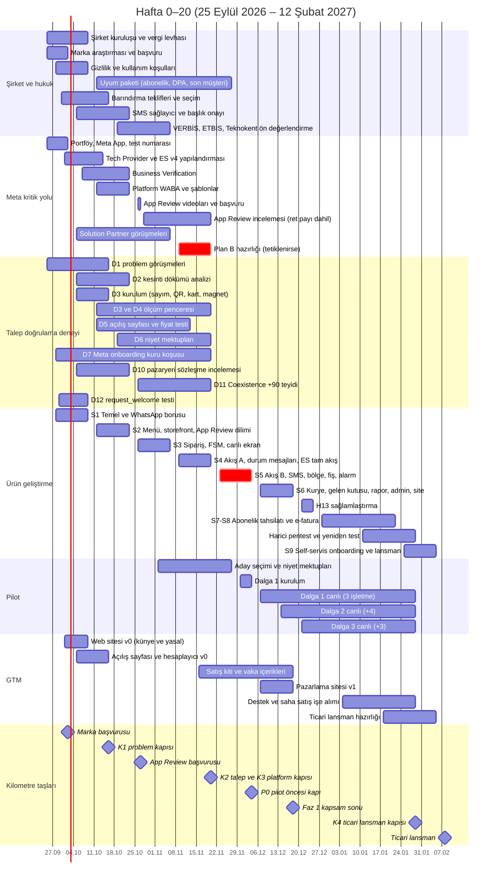
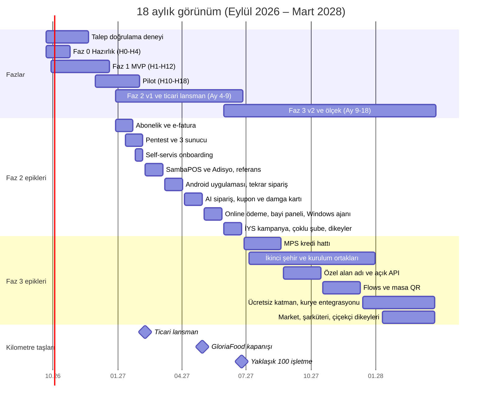
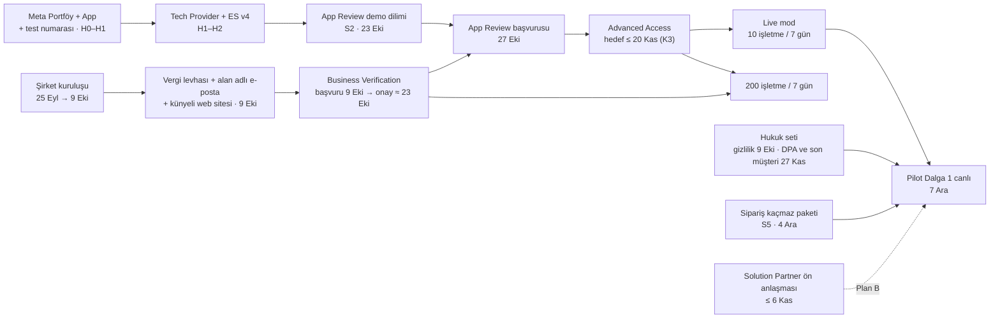

# 09 — Yol Haritası ve Sprint Planı

> **Amaç:** Ekibin 25 Eylül 2026 sabahından itibaren neyi, hangi sırayla ve kimin sahipliğinde yapacağını tek yerde tanımlamak. Doküman kritik yolu, karar kapılarını, sprint sprint iş listesini, pilotu, ekibi, bütçeyi ve lansman kontrol listelerini kapsar.
> **Kapsam:** Fazlar ve takvim (Faz 0 → Faz 3), Meta kritik yolu ve Plan B tetikleri, Faz 0 görev listesi ve ilk 10 iş günü, talep doğrulama deneyi, Faz 1 MVP'nin 6 sprinti, Definition of Done ve kalite kapıları, pilot planı, Faz 2–3 epikleri, ekip ve RACI, bütçe, lansman kontrol listeleri.
> **Kapsam dışı (bağlantı verilir):** Özelliklerin ayrıntılı tasarımı ([03](03-musteri-deneyimi-ve-storefront.md), [04](04-isletme-paneli.md), [05](05-admin-paneli-ve-pazarlama-sitesi.md)); WhatsApp teknik sözleşmesi ([02](02-whatsapp-entegrasyonu.md)); mimari ve test altyapısı ([06](06-teknik-mimari.md)); tablolar ve API ([07](07-veri-modeli-ve-api.md)); hukuki içerik ([08](08-mevzuat-kvkk-odeme-fatura.md)); risk matrisi, deney eşiklerinin kanonik hali, SLO/KPI ve olay yönetimi ([10](10-riskler-operasyon-ve-metrikler.md)).
> **İlgili dokümanlar:** [00 Kararlar ve sözlük](00-kararlar-ve-sozluk.md) · [01 İş modeli](01-vizyon-pazar-is-modeli.md) · [02 WhatsApp](02-whatsapp-entegrasyonu.md) · [06 Mimari](06-teknik-mimari.md) · [07 Veri modeli](07-veri-modeli-ve-api.md) · [08 Mevzuat](08-mevzuat-kvkk-odeme-fatura.md) · [10 Riskler ve metrikler](10-riskler-operasyon-ve-metrikler.md)
> **Kaynaklar ve atıf:** `A0N §x` = `arastirma/0N-….md` raporunun bölümü (URL'ler orada): [A01](arastirma/01-whatsapp-platform.md) WhatsApp, [A02](arastirma/02-pazar-rakipler-is-modeli.md) pazar/GTM, [A03](arastirma/03-mevzuat-odeme-fatura.md) mevzuat, [A04](arastirma/04-mimari-teknoloji.md) mimari, [A05](arastirma/05-urun-ux.md) ürün/UX backlog'u, [A06](arastirma/06-riskler-kirmizi-takim.md) riskler ve deneyler.
> **Tarih:** 2026-09-24 · **Durum:** Taslak v1

**Okuma notları**
- **Takvim:** Hafta 1 (H1) = 28 Eylül 2026 Pazartesi. Hafta 0 (H0) içinde bulunduğumuz haftadır, iş 25 Eylül Cuma başlar. Sprintler 2 haftadır, Pazartesi başlar, ikinci haftanın Cuma günü demo yapılır. Resmi tatiller: 29 Ekim 2026 (28 Ekim öğleden sonra yarım gün) ve 1 Ocak 2027. Ramazan 2027 yaklaşık Şubat–Mart aylarına denk gelir (tarih teyit edilmeli). Restoranlarda iftar saati yoğun geçer.
- **Tahminler:** Süreler ve efor bizim tahminimizdir **[T]**. Meta inceleme süreleri resmi olarak taahhüt edilmez. **(teyit edilmeli)** doğrulanmamış bilgiyi gösterir. Fiyatlar KDV hariçtir, kur **1 USD ≈ 48,4 TL** kabul edilir.
- **Öncelik etiketi (sprintlerde):** **M** = pilot için zorunlu, **S** = olmalı, **C** = kayabilir (kesme çizgisi §5.9).
- **Rol kısaltmaları** (bir kişi birden çok rol taşıyabilir):

| Kısaltma | Rol | Not |
|---|---|---|
| KUR | Kurucu / CEO: şirket, Meta doğrulaması, hukuk, satış, GTM, **ürün sahibi** | Platform rolü `platform_owner` + `sales_rep` |
| OPS | Operasyon ve destek: saha deneyi, concierge kurulum, P1 hattı | 2. kurucu; yoksa ilk işe alım (§9.2). `platform_admin`, `support_agent` |
| TL | Teknik lider (Geliştirici 1): backend, WhatsApp, altyapı, güvenlik | Meta App ve App Review'un teknik sahibi |
| FE | Geliştirici 2: panel, storefront, pazarlama sitesi | |
| DEV3 | Geliştirici 3 (opsiyonel): admin, raporlar, test otomasyonu | Yoksa işleri TL ve FE'ye dağılır, "C" maddeler kayar |
| AI | Claude: kod, test, doküman ve veri girişi yardımcısı | Çıktısı her zaman insan incelemesinden geçer. Prod verisi görmez |
| MM · AV · MV · TAS | Mali müşavir · avukat · marka vekili · serbest tasarımcı | Dış hizmet |

---

## 1. Özet zaman çizelgesi

### 1.1 Kilometre taşları

| Tarih | Hafta | Kilometre taşı | Sahip |
|---|---|---|---|
| 25 Eyl 2026 Cum | H0 | Başlangıç. Açık kararlar verilir: stack, şirket türü, pilot şehir ve ilçeler | KUR, TL |
| 30 Eyl Çar | H1 | Meta: kendi WABA'larımıza ödeme yöntemi eklemenin son günü (A01 §0) | TL, KUR |
| 1 Eki Per | H1 | Meta'nın yeni fiyatlandırması yürürlüğe girer. Rate card konfigürasyona yazılır | TL |
| 2 Eki Cum | H1 | Marka başvurusu yapılır. İsim bu tarihten sonra duyurulur (KARARLAR §9) | KUR, MV |
| 8 Eki Per | H2 | Embedded Signup (ES) v2 kalkar. Biz yalnız v4 kullandığımız için etkilenmeyiz | — |
| 9 Eki Cum | H2 | Şirket tescili ve vergi levhası alınır, Business Verification (BV) başvurusu yapılır. S1 demo | KUR, TL |
| 16 Eki Cum | H3 | **K1 Problem kapısı** (§4.6) | KUR |
| 23 Eki Cum | H4 | S2 demo = App Review videolarının provası. BV onayı için hedef tarih | TL, KUR |
| 27 Eki Sal | H5 | **App Review başvurusu** (hedef; en geç 6 Kasım) | TL |
| 6 Kas Cum | H6 | S3 demo. **Plan B tetik kontrolü T3** (§2.5) | TL, KUR |
| 20 Kas Cum | H8 | S4 demo. **K2 talep go/no-go** ve **K3 platform kapısı** | KUR, TL |
| 4 Ara Cum | H10 | S5 demo. **P0 pilot öncesi kapı** ("sipariş kaçmaz" paketi dahil) | TL, OPS |
| 7 Ara Pzt | H11 | Pilot Dalga 1 (3 işletme) canlıya geçer | OPS |
| 14 Ara Pzt | H12 | Pilot Dalga 2 (+4 işletme) canlıya geçer | OPS |
| 18 Ara Cum | H12 | S6 demo. **Faz 1 (MVP) kapsamı tamamlanır** | TL |
| 21 Ara Pzt | H13 | Pilot Dalga 3 (+3 işletme, toplam 10) canlıya geçer. Sağlamlaştırma haftası | OPS, TL |
| 28 Ara Pzt | H14 | **Faz 2 başlar** (Ay 4): ticari altyapı | TL |
| 29 Oca 2027 Cum | H18 | **K4 pilot çıkışı / ticari lansman kapısı**. Pentestin yeniden testi | KUR |
| 8 Şub 2027 Pzt | H20 | **Ticari lansman** (hedef). Kurucu üye programı açılır | KUR |
| ≈ 8–22 Mar 2027 | H24–26 | Pilotların 3 aylık ücretsiz dönemi biter, işletmeler kurucu üye koşullarıyla ücretliye geçer | KUR, `finance` |
| Mar 2027 | H23–26 | SambaPOS/Adisyo entegrasyonu canlıda (GloriaFood 30 Nisan 2027'de kapanıyor, [01](01-vizyon-pazar-is-modeli.md) §8.3) | TL |
| ≈ Haz 2027 | Ay 9 | Faz 2 sonu: ~100 işletme hedefi. Faz 3 başlar | KUR |
| ≈ Mar 2028 | Ay 18 | Faz 3 sonu: ikinci şehir açılmış, 1.000 işletme yolunda | KUR |

### 1.2 Ayrıntılı çizelge (Hafta 0–20)

### 1.3 18 aylık görünüm

---

## 2. Kritik yol analizi

### 2.1 Kritik yol

Takvimi belirleyen zincir Meta tarafındadır: **şirket → BV → App Review → Live mod ve onboarding kotası**. Pilotun 7 Aralık'ta canlıya geçebilmesi için bu zincirin bugün başlaması gerekir (A01 §14, A06 §11).

| Adım | Ön koşul | Süre (tahmin) | Hedef | En geç (pilot için) | Sahip |
|---|---|---|---|---|---|
| Şirket kuruluşu (Ltd) | Unvan, adres, ana sözleşme, mali müşavir | 1–2 hafta ([02](02-whatsapp-entegrasyonu.md) §2.2) | 9 Eki | 16 Eki | KUR, MM |
| Web sitesi v0 (künye, gizlilik, kullanım koşulları, veri silme talimatı) | Marka başvurusu, avukat taslağı | 2–3 gün | 7 Eki | 16 Eki | FE, AV |
| BV başvurusu ve onayı | Vergi levhası, sicil gazetesi/faaliyet belgesi, alan adlı e-posta; unvan ve adres sitedeki künyeyle birebir aynı | Başvuru 1 gün; inceleme birkaç gün–2 hafta | Onay 23 Eki | Onay 6 Kas | KUR |
| Meta App + Tech Provider + ES v4 | Portföy | 1–3 gün + Meta onayı | 14 Eki | 23 Eki | TL |
| App Review demo dilimi | ES v4 minimal, panelden mesaj, panelden şablon (S2) | 2 hafta | 23 Eki | 30 Eki | TL, FE |
| App Review başvurusu | BV onayı (App Review'dan önce şart olup olmadığı teyit edilmeli), 2 video | 1–2 gün | 27 Eki | 6 Kas | TL |
| Advanced Access | İnceleme: birkaç gün–birkaç hafta; ret olursa +1–2 hafta ([02](02-whatsapp-entegrasyonu.md) §2.2) | 1–4 hafta | 20 Kas | 4 Ara | TL |
| Live mod, onboarding kotası 10/7 gün | Advanced Access | 1 saat | 20 Kas | 4 Ara | TL |
| Kota 200/7 gün | BV + App Review (Access Verification şartı çelişkili, A01 §1.3) | Otomatik | Ara 2026 | Ticari lansman | TL |

**Bolluk (slack):** Hedef tarihlerle en geç tarihler arasında yaklaşık **2 hafta** fark vardır. Bu fark tek bir App Review reddini karşılar. İkinci bir ret veya BV gecikmesi Plan B tetiklerini çalıştırır (§2.5). Onboarding kotası pilot için sorun değildir: 3+4+3 dalgaları 10/7 gün sınırının altında kalır. Ticari lansman sonrası hedeflenen ayda 20–25 yeni işletme de bu kotaya sığar (~40/ay). Faz 3'teki ~100/ay hız için 200/7 gün kotası şarttır ([01](01-vizyon-pazar-is-modeli.md) §8.3–8.4).

### 2.2 Şirket kuruluşunun ön koşulları

- [ ] **Şirket türü:** Varsayılan Ltd; yatırım planı netleşince AŞ'ye tür değiştirilir (KARARLAR §13.3). Asgari sermaye Ltd'de 50.000 TL (tescilden sonra 24 ay içinde ödenebilir), AŞ'de 250.000 TL (A03 §7.1).
- [ ] **Şahıs şirketi kullanılmaz.** Türk bir şahıs şirketinin Meta doğrulamasının reddedildiği vaka var (A06 §3.6, R03).
- [ ] **Unvan ve adres:** Vergi levhası, sicil gazetesi, web sitesi künyesi, Meta portföyü ve alan adlı e-postada **birebir aynı** olmalıdır ([08](08-mevzuat-kvkk-odeme-fatura.md) §7.2).
- [ ] **NACE kodu** (yazılım veya veri işleme) mali müşavirle seçilir. Teknokent ihtimali varsa kodu buna göre seçmek gerekir.
- [ ] Kuruluşun ardından şirket banka hesabı ve IBAN, **e-Tebligat** (sermaye şirketinde zorunlu), yetkili için e-imza ve şirket kartı (Meta ödeme yöntemi ve yurt dışı araçlar için) açılır.
- [ ] Kurucular arasında pay sahipleri sözleşmesi (vesting, ayrılan kurucu, rekabet yasağı) imzalanır. Kurucu ve dış geliştiricilerden **yazılı fikri hak devri** alınır ([08](08-mevzuat-kvkk-odeme-fatura.md) §7.1).
- [ ] Alan adları (.com, .com.tr) ve kurumsal e-posta hazırlanır. Marka başvurusu isim duyurulmadan önce yapılır (KARARLAR §9).

### 2.3 Hukuk belge seti takvimi

Belge listesi ve içerikleri [08](08-mevzuat-kvkk-odeme-fatura.md) §7.4'tedir. Burada yalnız **hangi kilometre taşının ön koşulu olduğu** gösterilir. Tüm belgeler avukatla yapılan sabit ücretli uyum paketinin parçasıdır.

| Belge | Hangi adımın ön koşulu | Hedef | Sahip |
|---|---|---|---|
| Gizlilik politikası, kullanım koşulları, veri silme talimatı | Meta App URL'si, BV, web sitesi v0 | 9 Eki | AV, FE |
| Açılış sayfası, hesaplayıcı ve D5 fiyat varyantlarının metin kontrolü ("komisyonsuz", karşılaştırmalı reklam, fiyat gösterimi) | D5 yayını | 12 Eki | AV |
| Pazaryeri sözleşme incelemesi (D10) | D3'te paket içi kart dağıtımı | 16 Eki (hızlı görüş) | AV |
| Pay sahipleri sözleşmesi, fikri hak devirleri, personel gizlilik taahhütnameleri | İlk kod birleştirmesi; ekibe katılan herkes | 23 Eki | AV, KUR |
| VERBİS muafiyet değerlendirmesi (yazılı) | Gerçek son müşteri verisi | 6 Kas | AV |
| Abonelik sözleşmesi + kullanım koşulları + DPA + alt işleyen listesi (click-wrap, sürümlü) | Pilot kurulumu (pilot ücretsiz olsa da müşteri verisi işlenir) | 20 Kas | AV, TL |
| Son müşteri aydınlatma şablonu, ön bilgilendirme + mesafeli satış şablonu, vitrin kullanım koşulları, künye | İlk canlı sipariş | 27 Kas | AV, FE |
| Veri ihlali müdahale planı, saklama-imha politikası | P0 kapısı | 27 Kas | AV, TL |
| Çerez politikası + rıza paneli | Çerezli analitik kullanılan ilk sayfa. D5 sayfası **çerezsiz** tasarlanır, bu yüzden bu belge S6'ya kadar bekleyebilir | 18 Ara | AV, FE |
| Yazılı görüşler: Meta aktarımı (m.9), İYS'de platformun rolü, ETAHS sınırı, sipariş notu ve sağlık verisi | Ticari lansman (K4) | 15 Oca 2027 | AV |

### 2.4 Diğer kritik bağımlılıklar

| Bağımlılık | Neden kritik | Önlem |
|---|---|---|
| Platform WABA şablon onayları ([02](02-whatsapp-entegrasyonu.md) §5.3) | Kademeli alarmın 3. basamağı (S5) | Şablonlar H3–H4'te gönderilir. Utility onayı çoğunlukla dakikalar sürer (A01 §2.2) |
| SMS başlığı (originator) onayı | SMS OTP yedeği ve alarm SMS'i (S5) | Sağlayıcı seçimi ve başvuru H2'de yapılır. Onay süresi teyit edilmeli |
| Coexistence'ın gerçek +90 numaralarla saha teyidi (D11) | Varsayılan onboarding yolu; A06'da uygulamayı bozan vakalar var | 9 senaryo H5–H8'de koşulur ([10](10-riskler-operasyon-ve-metrikler.md) §4.8), K3'te ve P0'da zorunludur. Başarısızsa pilotta varsayılan yol yeni numara olur |
| `request_welcome` olayının Türkiye'deki davranışı (D12) | Akış A'daki karşılamanın tasarımını belirler | S1'de 5 senaryoyla test edilir (KARARLAR §7, [10](10-riskler-operasyon-ve-metrikler.md) §4.9) |
| Pilot işletmelerin Meta'ya kart eklemesi | 1 Ekim 2026'dan sonra kartsız WABA'nın service mesajları teslim edilmez | Kart adımı kurulum gününde zorunludur ve eklenmeden canlıya geçilmez |
| Barındırma sözleşmesi (TR) | Prod ortamı ve PITR yedek (S5) | 3+ teklif H1–H3'te alınır. Karar verilene kadar staging geçici bir TR VM'de çalışır |

### 2.5 Plan B tetik koşulları

Plan B, pilotun bir **Türk Solution Partner** üzerinden başlatılmasıdır (KARARLAR §6.2). Gönderim katmanı baştan `WaTransport` soyutlamasıyla yazılır, bu yüzden partner adaptörü (`partner_<ad>`) 3–5 günlük bir iştir [T] ([02](02-whatsapp-entegrasyonu.md) §7.10). **Plan A'** ise pilot işletme sahiplerini uygulamaya "tester" rolüyle eklemektir. Standart erişimle çalışıp çalışmadığı D7'de teyit edilir ([02](02-whatsapp-entegrasyonu.md) §2.5).

| Tetik | Tarih | Koşul | Aksiyon | Karar |
|---|---|---|---|---|
| **T1** | 16 Eki (H3) | BV başvurusu hâlâ yapılamadı (örn. şirket belgeleri gecikti) | Solution Partner görüşmeleri hızlandırılır, 2 partnerden yazılı teklif istenir. Pilot takvimi riski kırmızıya çekilir | KUR |
| **T2** | 30 Eki (H5) | BV reddedildi veya "ek belge" istendi | Aynı gün belge revizyonu yapılır ve Meta destek kaydı açılır. App Review başvurusu yine yapılır (sıralama teyit edilmeli) | KUR, TL |
| **T3** | 6 Kas (H6) | App Review onaylanmadı (inceleme sürüyor veya ret geldi) | **Plan B hazırlığı:** partner ön anlaşması imzalanır, `partner_<ad>` adaptörü S5 backlog'una "M" olarak girer, Plan A' D7'de test edilir. Ret varsa düzeltilip 3 iş günü içinde yeniden başvurulur | KUR, TL |
| **T4** | 20 Kas (H8, K3) | Advanced Access yok | **Plan B devreye girer:** pilot Dalga 1–3 partner üzerinden (veya Plan A' çalışıyorsa tester rolüyle) kurulur. App Review paralel sürer | KUR |
| **T5** | 29 Oca 2027 (H18, K4) | Hâlâ kendi Advanced Access'imiz ya da 200/7 gün kotamız yok | Ticari lansman partner üzerinden planlanır. MPS'in (Faz 3) öne çekilmesi değerlendirilir | KUR |
| Sürekli | — | Uygulamamız kısıtlanır veya politika uyarısı alır (tek nokta arızası, A06 R06) | "WhatsApp'sız mod" (web + SMS OTP + telefon siparişi) açılır. Olay prosedürü [10](10-riskler-operasyon-ve-metrikler.md)'dadır | TL |

---

## 3. Faz 0 (Hafta 0–4) görev listesi

### 3.1 Şirket ve hukuk

| ID | Görev | Sahip | Süre | Bağımlılık | Çıktı |
|---|---|---|---|---|---|
| F0-H01 | Açık kararlar: şirket türü (varsayılan Ltd), pilot şehir ve 2–3 ilçe, stack | KUR, TL | Gün 1 | — | Karar kaydı (00'a işlenir) |
| F0-H02 | Mali müşavir seçimi (3 teklif) | KUR | H0 | — | Sözleşme |
| F0-H03 | Ltd kuruluşu: unvan, adres, ana sözleşme, MERSİS, tescil, vergi levhası, imza sirküleri, faaliyet belgesi, NACE | KUR, MM | 1–2 hafta | H01, H02 | Belgeler PDF |
| F0-H04 | Banka hesabı, e-Tebligat, e-imza, şirket kartı | KUR | H2 | H03 | IBAN, kart |
| F0-H05 | Marka araştırması (EPATS) ve başvuru: 9, 35, 38, 42. sınıflar, kelime + logo | KUR, MV, TAS | H0–H1 | Logo taslağı | Başvuru numarası |
| F0-H06 | Alan adları, Cloudflare DNS, kurumsal e-posta | TL | Gün 1 | H01 (isim teyidi) | `@siparisinonunde.com` |
| F0-H07 | Avukat seçimi; uyum paketinin kapsamı ve takvimi (§2.3) | KUR, AV | H0–H1 | — | Sabit ücretli iş emri |
| F0-H08 | Gizlilik politikası, kullanım koşulları, veri silme talimatı | AV | H1–H2 | H07 | Yayında URL'ler |
| F0-H09 | Pay sahipleri sözleşmesi, fikri hak devirleri, personel gizlilik taahhütnameleri | AV, KUR | H1–H4 | H03 | İmzalı belgeler |
| F0-H10 | Pazaryeri sözleşme incelemesi (D10): 3 platform, paket içi materyal, parite, yönlendirme | AV | H1–H3 | D1'den sözleşme örnekleri | Kısa yazılı görüş |
| F0-H11 | Barındırma: [06](06-teknik-mimari.md) §13.2 kriterleriyle 3+ TR sağlayıcıdan teklif, seçim, DPA | TL | H1–H3 | — | Seçim ve sözleşme |
| F0-H12 | SMS sağlayıcı seçimi, başlık onayı, OTP şablonu | TL, KUR | H2–H4 | H03 | Onaylı başlık |
| F0-H13 | VERBİS muafiyet kaydı, ETBİS kayıt planı | AV, KUR | H3–H4 | H03 | Yazılı kayıt |
| F0-H14 | Mali müşavirle 2 No'lu KDV ve stopaj sınıflandırması; Teknokent ön görüşmesi | KUR, MM | H3–H4 | H03 | Karar notu |
| F0-H15 | Meta ve Solution Partner'lara KVKK standart sözleşme sorusu (yazılı) | KUR | H1–H2 | — | Gönderilmiş yazı |
| F0-H16 | Manuel fatura düzeni (GİB e-Arşiv portalı veya Paraşüt) ve havale referans akışı; D6'da ön ödeme gelirse gerekir | KUR, MM | H4 | H04 | İlk faturayı kesebilir durum |

### 3.2 Meta kritik yolu

| ID | Görev | Sahip | Süre | Bağımlılık | Çıktı |
|---|---|---|---|---|---|
| F0-M01 | Meta Business Portfolio (2 yönetici). Resmi unvan tescilden sonra güncellenir | KUR | Gün 1 | — | Portfolio ID |
| F0-M02 | Meta App ("Business" tipi), WhatsApp ürünü, test numarası, webhook (dev tüneli) | TL | H0–H1 | M01 | App ID; App Secret secret manager'da |
| F0-M03 | Kendi WABA'larımıza ödeme yöntemi (son gün 30 Eyl; test numarasında gerekip gerekmediği teyit edilmeli) | KUR, TL | 30 Eyl | M02 | Kayıtlı ödeme yöntemi |
| F0-M04 | Tech Provider kaydı | TL | H1–H2 | M02 | Aktif durum |
| F0-M05 | ES v4 yapılandırması (`config_id`, staging ve prod için Allowed Domains) | TL | H2 | M04 | `config_id` ortam değişkeninde |
| F0-M06 | Web sitesi v0: künye, gizlilik, kullanım koşulları, iletişim | FE | H1–H2 | H05, H08 | Yayında site |
| F0-M07 | **Business Verification başvurusu** | KUR | H2 (en geç 16 Eki) | H03, H06, M06 | Onay hedefi 23 Eki |
| F0-M08 | Platform WABA: numara, görünen ad "Siparişin Önünde", platform şablonları ([02](02-whatsapp-entegrasyonu.md) §5.3); ayrıca platform canary numarası ([10](10-riskler-operasyon-ve-metrikler.md) §7.3) | TL | H3–H4 | H04 | Şablonlar `APPROVED`, canary numarası kayıtlı |
| F0-M09 | App Review demo dilimi (S2), 2 video, inceleyici notları ([02](02-whatsapp-entegrasyonu.md) §2.4) | TL, FE | H3–H5 | M05 | 2 video |
| F0-M10 | **App Review başvurusu**: `whatsapp_business_messaging`, `whatsapp_business_management` | TL | 27 Eki | M07, M09 | Başvuru kaydı |
| F0-M11 | Solution Partner görüşmeleri (3–4 Türk BSP): Plan B pilotu ve Faz 3 MPS | KUR | H2–H6 | — | İmzaya hazır teklif + teknik not |
| F0-M12 | D7 kuru koşusu: 3 dost işletme (tester rolüyle), adım süreleri ve hatalar | OPS, TL | H5–H8 | S2 (ES minimal) | Onboarding süre raporu |

### 3.3 Teknik iskelet (ayrıntısı S1–S2'de)

| ID | Görev | Sahip | Süre | Bağımlılık | Çıktı |
|---|---|---|---|---|---|
| F0-T01 | Stack kararı. Varsayılan TypeScript monorepo; Laravel alternatifi yalnız ekip Laravel'de çok güçlüyse (KARARLAR §10). Karar Gün 1'de verilir, sonra değişmez | TL | Gün 1 | — | Karar kaydı |
| F0-T02 | GitHub organizasyonu, korumalı `main`, secret manager, herkes için 2FA | TL | Gün 1–2 | — | Erişimler |
| F0-T03 | Monorepo, `CLAUDE.md` v1 ([06](06-teknik-mimari.md) §4.4), CI | TL, FE, AI | S1 | T01 | Yeşil CI |
| F0-T04 | Geçici staging VM (TR) | TL | H1 | — | `staging` ortamı |
| F0-T05 | D3: `siparisinonunde.com/q/{kod}` sayım yönlendirmesi (yalnız tarama sayısı) ve statik menü sayfası şablonu (işletmelerin yarısı için, çerezsiz) | FE, AI | H1–H2 | — | Yönlendirme + ~4 menü sayfası |
| F0-T06 | Açılış sayfası ve komisyon hesaplayıcı v0 (D5): 2 değer önerisi × 3 fiyat varyantı, demo formu, çerezsiz ölçüm | FE, AI | H2 | H05, avukat metin kontrolü | Yayında sayfa (H3) |

### 3.4 Talep ve GTM

| ID | Görev | Sahip | Süre | Bağımlılık | Çıktı |
|---|---|---|---|---|---|
| F0-G01 | D1 listesi (25 işletme: 15 paket restoranı, 5 su bayisi, 5 pastane) ve görüşme kılavuzu ([10](10-riskler-operasyon-ve-metrikler.md) §4.3) | OPS | Gün 1–2 | H01 (ilçeler) | Randevu takvimi |
| F0-G02 | D1 görüşmeleri: en az 20, hedef 25 (KARARLAR §11: 20+ esnaf) | KUR, OPS | H0–H2 | G01 | Notlar, acı sıralaması, Van Westendorp yanıtları |
| F0-G03 | D2: 10 restorandan izinli ve anonim kesinti dökümü | OPS | H1–H3 | G02 | Efektif kesinti oranı |
| F0-G04 | D3: 8 işletme seçimi (5–6 restoran + 2 su bayisi), 1 haftalık başlangıç sayımı, kodlu QR'lar, menü sayfaları, kart ve magnet baskısı (§4.3) | OPS, FE, TAS | H1–H3 | G02, T05 | 8 kurulu işletme |
| F0-G05 | D3/D4 ölçüm defteri ve kasiyer günlük formu | OPS | H2 | G04 | Paylaşılan tablo |
| F0-G06 | D5 trafiği: B2B hedefli reklam, saha kartvizitindeki QR, oda ve derneklerin onaylı duyuruları | KUR | H2–H6 | T06 | Lead listesi |
| F0-G07 | Pilot aday havuzu (30–40 işletme, [01](01-vizyon-pazar-is-modeli.md) §8.2) | KUR | H2–H6 | G02 | Aday listesi |
| F0-G08 | Esnaf odası ve TÜRES şubesiyle ilk temas | KUR | H3–H4 | H01 | Toplantı notu |
| F0-G09 | K1 problem kapısı değerlendirmesi | KUR | 16 Eki | G02, G03 | Karar notu |

### 3.5 İlk 10 iş günü: "yarın sabah ne yapıyoruz?"

**Gün 1 — Cuma 25 Eylül (H0)**
- **09:00–10:30 başlangıç toplantısı (herkes):** KARARLAR ve bu doküman birlikte okunur. Üç açık karar bugün verilir: stack (varsayılan TypeScript), şirket türü (varsayılan Ltd), pilot şehir ve 2–3 ilçe. RACI onaylanır (§9.3).
- **KUR:** 3 mali müşavirle görüşme ve Ltd belge listesi. 2 avukattan uyum paketi teklifi (kapsam: [08](08-mevzuat-kvkk-odeme-fatura.md) §7.4 + 4 görüş + D10). Marka vekili teklifleri. EPATS ön araştırması.
- **TL:** Alan adlarının müsaitliği kontrol edilir ve satın alınır (KARARLAR açık karar 6). Cloudflare, kurumsal e-posta, GitHub organizasyonu, secret manager. Meta Business Portfolio ve Meta App açılır, WhatsApp ürünü eklenir ve test numarası alınır.
- **FE + AI:** Monorepo iskeleti (pnpm + Turborepo, `apps/*`, `packages/*`), `CLAUDE.md` v0.
- **OPS:** 25 işletmelik D1 listesi (15 paket restoranı, 5 su bayisi, 5 pastane) ve görüşme kılavuzu. Pazartesi–Çarşamba için ilk 6 randevu.
- **TAS:** Logo brifi (marka başvurusu kelime + logo olarak yapılacak).
- **Gün sonu çıktısı:** Karar kaydı, alan adı, Meta App ID, randevular.

**Gün 2 — Pazartesi 28 Eylül (H1, S1 başlar)**
- **09:00 S1 planlama (90 dk).** Bundan sonra her gün 09:30'da 15 dakikalık stand-up yapılır.
- **KUR:** Mali müşavir seçilir ve kuruluş başvurusu başlatılır. Unvan ve adres künyede ve Meta'da birebir kullanılacak şekilde belirlenir. 15:00–17:00 arası 2 D1 görüşmesi (restoranların sakin saati).
- **TL:** Dev Compose (PG18 + PostGIS, Valkey), CI iskeleti, webhook GET doğrulaması (tünelle), test numarasına ilk mesaj.
- **FE:** `packages/db` şema v0 (`tenants`, `branches`, `users`, `memberships`) ve RLS politikaları.
- **OPS:** 2 D1 görüşmesi. D2 için kesinti dökümü izni istenir.

**Gün 3 — Salı 29 Eylül**
- **KUR:** Avukat seçilir. Öncelik gizlilik politikası, kullanım koşulları ve veri silme talimatıdır (hedef 9 Ekim). Logo taslağı marka vekiline gider.
- **TL:** Webhook POST: imza doğrulama, `wa_raw_events`, hemen 200, `wa-inbound` kuyruğu (jobId = olay hash'i). **D12 `request_welcome` testi** başlar: +90 telefonlarla W1–W5 senaryoları ([10](10-riskler-operasyon-ve-metrikler.md) §4.9).
- **FE:** Better Auth, organization eklentisi, TOTP, rol tanımları (KARARLAR §4).
- **OPS:** 2–3 D1 görüşmesi.

**Gün 4 — Çarşamba 30 Eylül (Meta ödeme yöntemi için son gün)**
- **KUR + TL:** Kendi portföyümüzdeki WABA'lara ödeme yöntemi eklenir. Şirket kartı gelene kadar geçici olarak kurucu kartı kullanılır.
- **KUR:** 3–4 Türk Solution Partner belirlenir, ilk e-postalar gider (Plan B + Faz 3 MPS + KVKK standart sözleşme sorusu).
- **TL:** Barındırma teklif talepleri gönderilir. Geçici staging VM siparişi verilir.
- **FE:** Panel iskeleti (Vite + React 19 + TanStack + shadcn), giriş ekranı, tenant/şube API'si.
- **OPS:** D1 görüşmeleri; D3 adayları işaretlenir.

**Gün 5 — Perşembe 1 Ekim (Meta'nın yeni fiyatlandırması yürürlükte)**
- **TL:** Rate card konfigürasyon tablosu. İlk `pricing` nesnesi kaydedilir. Tech Provider kayıt adımları.
- **KUR:** Marka başvurusu yapılır (hedef bugün veya yarın). Kuruluş takibi.
- **FE:** Tenant yalıtım paketinin ilk iki grubu (katalog + fail-closed) CI'a eklenir.
- **OPS:** D3 materyal brifi TAS'a gider: statik menü sayfası, 3 kart varyantı (D4), magnet, kasa standı. Baskı teklifi alınır.

**Gün 6 — Cuma 2 Ekim**
- **FE:** Web sitesi v0 (künye ve yasal sayfa yer tutucuları). Marka başvurusu yapıldıysa yayına alınır.
- **TL:** Outbox ve `wa-outbound` iskeleti; test numarasından otomatik yanıt.
- **OPS:** D3 için ilk 3–4 işletmeyle anlaşılır; kasiyerlere başlangıç sayımı çetelesi verilir.
- **16:00 ilk haftanın durum toplantısı (30 dk):** D1 (hedef ≥ 8 görüşme), şirket, marka, Meta, D12 ara sonucu. Risk listesi güncellenir. Sonraki haftalarda bu toplantı Pazartesi 11:00 metrik toplantısına taşınır (§5.2).

**Gün 7 — Pazartesi 5 Ekim (H2)**
- **KUR:** Tescilden sonra banka hesabı, e-Tebligat, e-imza. Vergi levhası takibi. D1 görüşmeleri.
- **OPS:** D3'te 1 haftalık başlangıç sayımı başlar (pazaryeri, WhatsApp/telefon, kaçan sipariş). D2 kesinti dökümlerinden en az 3'ü toplanır.
- **TL:** Staging'e ilk deploy (Compose), Sentry (PII scrub), pgBackRest WAL arşivi.
- **FE + AI:** `siparisinonunde.com/q/{kod}` sayım yönlendirmesi ve ilk işletmeler için statik menü sayfaları (kodlu `wa.me` linkleri).

**Gün 8 — Salı 6 Ekim**
- **KUR:** Meta portföyü resmi unvan ve adresle güncellenir. Avukatın gizlilik ve kullanım koşulları taslağı gözden geçirilir.
- **TL:** ES v4 yapılandırması (staging Allowed Domains), Tech Provider durumu.
- **FE:** Tenant/şube panel ekranları, kullanıcı daveti.
- **OPS:** D3 kartları baskıya gider. Açılış sayfası ve hesaplayıcı metni avukata iletilir.

**Gün 9 — Çarşamba 7 Ekim**
- **KUR:** Vergi levhası ve sicil gazetesi geldiyse **Business Verification başvurusu** yapılır. Gelmediyse T1 izlenir (en geç 16 Ekim).
- **FE:** Web sitesi v0 yayında: künye, gizlilik, kullanım koşulları, veri silme talimatı.
- **TL:** Gizlilik URL'si Meta App'e girilir. Webhook DLQ. S1 demo senaryosu hazırlanır.
- **OPS:** D3 materyal yerleşim planı hazırlanır. Mağaza içi materyal (kasa standı, magnet, Instagram ve Google linki) ve paket içi kartlar, başlangıç sayımı bitince ve D10'un ilk okumasından sonra 12 Ekim haftasında yerleştirilir.

**Gün 10 — Perşembe 8 Ekim (ES v2 kalkıyor; bizi etkilemez)**
- **TL + FE:** S1 kabul kriterleri kontrol edilir, demo provası yapılır. D12 raporu yazılır ve [02](02-whatsapp-entegrasyonu.md) §6.3'e işlenir (S4 tasarımına girdi).
- **KUR:** K1 için görüşme sentezinin taslağı (acı sıralaması, hacim, ödeme isteği). Pilot aday havuzu açılır.
- **OPS:** D3'ün kalan işletmeleri için anlaşma ve başlangıç sayımı. Deney panosu hazırlanır.
- *(Cuma 9 Ekim: 14:00 S1 demo, 15:00 retro. S2 planlaması Pazartesi 12 Ekim 09:00'da, ilk haftalık metrik toplantısı aynı gün 11:00'de.)*

---

## 4. Talep doğrulama deneyi (Hafta 0–8)

KARARLAR §11'deki "Seviye 0 concierge" deneyidir. En büyük risk talep tarafındadır (R01): **pazaryeri müşterisi işletmenin kendi kanalına geçiyor mu?** Deney yazılım beklemeden, geliştirmeyle paralel yürür. **Deney tasarımı, eşikler ve karar kuralı [10 Riskler ve metrikler](10-riskler-operasyon-ve-metrikler.md) §4'te kanoniktir.** Bu bölüm takvimi, sorumlulukları ve sonucun plana etkisini verir. Aşağıdaki eşikler 10 §4.3–4.5'ten aynen alınmıştır; çelişki olursa 10 geçerlidir.

### 4.1 Deneyler ve takvim

| Deney | Hipotez | Ne yapılır | Zaman | Sahip |
|---|---|---|---|---|
| D1 Problem görüşmeleri | H1, H2 | En az 20 (hedef 25) yüz yüze görüşme: 15 paket restoranı, 5 su bayisi, 5 pastane. Geçmiş sorulur, ürün anlatılmaz ("Mom Test"). Sonda 4 Van Westendorp sorusu | H0–H2 | KUR, OPS |
| D2 Kesinti dökümü | H1 | 10 restorandan izinli ve anonim 1–3 aylık pazaryeri kesinti dökümü | H1–H3 | OPS |
| D3 Seviye 0 concierge | H3, H4, H12 | Yazılımsız kodlu QR, kart, magnet ve teşvik (§4.2–4.4) | H0–H8 (ölçüm H2–H8) | KUR, OPS |
| D4 Teşvik A/B | H3 | D3 içinde 3 kart varyantı | D3 ile | OPS |
| D5 Açılış sayfası + fiyat testi | H5 | 2 değer önerisi × 3 Pro fiyatı (1.290 / 1.790 / 2.290 TL) rastgele; hesaplayıcı dahil; kayıt olana gerçek fiyat ve kurucu üye koşulu açıkça bildirilir (10 §4.6) | H3–H7 (yayın marka başvurusunu ve avukat kontrolünü bekler) | KUR, FE |
| D6 Ön satış / niyet mektubu | H5 | İmzalı niyet mektubu (varsayılan) veya iade garantili kurucu üye ön ödemesi (havale + elle fatura) | H4–H8 | KUR |
| D7 Meta onboarding kuru koşusu | H6, H7 | Şirket tarafı adım süreleri; 3 dost işletmeyle tester rolünde kurulum (10 §4.7) | Şirket tarafı H0–H6; işletme tarafı H5–H8 (ES hazır olunca) | TL, OPS |
| D10 Sözleşme incelemesi | H10 | 3 güncel pazaryeri sözleşmesi avukata. İlki kartlar pakete girmeden okunur | H1–H4 | KUR, AV |
| D11 Coexistence +90 teyidi | H13 | 2 gerçek +90 WhatsApp Business numarasıyla 9 senaryo, 15 günlük hareketsizlik testi dahil (10 §4.8) | H5–H8 (ES minimal S2'de hazır olunca) | TL |
| D12 `request_welcome` testi | H14 | +90 numarayla 5 senaryo (W1–W5, 10 §4.9) | S1 (H1–H2) | TL |

D8 (panel dayanıklılık gözlemi) ve D9 (destek yükü) pilotta yapılır (§7).

### 4.2 İşletme seçimi

- **Sayı:** 5–10 işletme, hedef 8: 5–6 paket restoranı (döner, pide/lahmacun, kebap, pizza/burger) + 2 su bayisi (tüp/LPG satanlar hariç). Seviye 0 adayları pilot aday havuzundan seçilir.
- **Kriterler:** Pilot ilçelerde; kendi kuryesi var; günde ≥ 10 paket; en az bir pazaryerinde aktif; WhatsApp Business kullanıyor ya da geçmeye istekli.
- **Hariç tutulanlar:** Zincirler, tamamen platform kuryesine bağlı olanlar, tüp bayi, tekel ve nargile (KARARLAR §6.10).
- **Anlaşma:** Tek sayfalık katılım notu yazılır. Deney ücretsizdir. İşletme kasiyer çetelesini tutmayı ve haftalık 15 dakikalık görüşmeyi kabul eder. Teşvik bedeli işletmeye aittir. Pazaryeri siparişlerinden gelen numaralara hiçbir koşulda mesaj atılmaz. Ekip yalnız sayıları görür (10 §4.4 kuralları).

### 4.3 Materyaller

| Materyal | Ayrıntı | Hazırlayan | Hazır |
|---|---|---|---|
| Kodlu QR'lar | Kod şeması: işletme no + malzeme (K kart, M magnet, S kasa standı, I Instagram, G Google) + teşvik varyantı (A/B/C). QR `siparisinonunde.com/q/{kod}` kısa yönlendirmesinden geçer ve `wa.me/<numara>?text=Merhaba, sipariş vermek istiyorum (K1A)` açar. Yönlendirme yalnız tarama **sayısını** tutar; IP ve cihaz bilgisi saklanmaz. Resmi olmayan hiçbir araç kullanılmaz (KARARLAR §6.1) | FE, AI | H2 |
| Paket içi kart (D4, 3 varyant) | (a) ücretsiz içecek, (b) %10 indirim, (c) "10. sipariş bedava" kâğıt damga kartı. Metin nötrdür: pazaryeri adı ve karşılaştırma yoktur. Varyantlar eşit sayıda dağıtılır | TAS, OPS | Baskı H2, dağıtım H3 (D10 ilk okumasından sonra) |
| Buzdolabı magneti, kasa QR standı | Ayrı kodlar | TAS | H2 |
| Statik menü sayfası (işletmelerin yarısında; H4 testi) | Fotoğraf + fiyat, sepet yok, "WhatsApp'tan sipariş ver" butonu. Çerez kullanılmaz | FE, AI | H2 |
| Instagram bio ve Google İşletme Profili linkleri | Kodlu linkler | OPS | H2–H3 |
| Kasiyer çetelesi ve WhatsApp Business etiketleri | 1 haftalık başlangıç sayımı (pazaryeri, WhatsApp/telefon, kaçan/geciken sipariş); kodlu siparişler "Kanal-yeni" ve "Kanal-tekrar" etiketleriyle işaretlenir (özelliğin adı teyit edilmeli) | OPS | H1 |
| Deney panosu | İşletme × hafta tablosu, PII yok (10 §4.4 alanları, §9.1) | OPS | H1 |

### 4.4 Ölçüm yöntemi

- **Başlangıç sayımı (1 hafta):** Kanal payının paydası ve satış argümanı olur.
- **Huni:** dağıtılan kart → QR taraması (yönlendirme sayacı) → kodlu ilk mesaj (etiket) → kanal siparişi (ilk ve tekrar) → kanal payı.
- **Türetilen metrikler (10 §4.4):** kart→sipariş = kart kodlu kanal siparişi / dağıtılan kart; tarama→mesaj; mesaj→sipariş; tekrar oranı = 21 gün içinde 2. siparişi veren müşteri / ilk siparişi veren müşteri; kanal payı = kanal siparişi / (kanal + pazaryeri siparişi).
- **Toplama:** OPS her gün 5 dakikalık kontrol araması yapar veya akşam etiket sayılarının ekran görüntüsünü alır. Haftada bir ziyaret edilir. Sipariş metni örnekleri yalnız işletme rızasıyla ve anonimleştirilerek alınır (ileride AI eval seti için).
- **Pencere:** "Son 4 hafta" = H5–H8 (10 §4.5).

### 4.5 Haftalık ritim ve takvim

- **Her gün:** Kasiyer çetelesi; OPS 5 dakikalık kontrol.
- **Pazartesi 11:00:** Haftalık metrik toplantısında deney panosu ve G1–G8 durumu gözden geçirilir (10 §9.3). Karar günlüğü güncellenir.
- **Salı–Perşembe:** Saha ziyaretleri: kartlar pakete giriyor mu, magnet ve stand yerinde mi, kasiyere hatırlatma.
- **Cuma:** İşletmelere WhatsApp'tan kısa haftalık rapor.

| Hafta | Deney işleri |
|---|---|
| H0–H1 | D1 görüşmeleri; D3 aday seçimi; materyal tasarımı; D10 için sözleşme örnekleri; D12 |
| H2 | D3 başlangıç sayımı (1 hafta); D2 dökümleri; baskı; D5 hazırlığı |
| H3 | D3 materyali (kasa standı, magnet, dijital linkler) ve paket içi kartlar (D10 ilk okumasından sonra); D5 yayında. **K1 (16 Eki)** |
| H4 | D6 görüşmeleri başlar; D10 tamamlanır |
| H5–H8 | "Son 4 hafta" ölçüm penceresi; D11 başlar; D7 işletme tarafı; D6 imzaları |
| H8 | Sentez. **K2 + K3 (20 Kas)** |

### 4.6 Karar kapıları ve go/no-go ölçütleri

**K1 — Problem kapısı (16 Ekim):** Görüşülenlerin **≥ %40'ı** komisyonu ilk 3 sorundan biri sayıyorsa ve uygun işletme oranı **≥ %30** ise geçilir. D2'de medyan efektif kesinti **< %12** çıkarsa ana mesaj "düzen / sipariş kaçmasın" tarafına kaydırılır. Geçilemezse segment veya mesaj değiştirilir ve 10 görüşme daha yapılır (10 §4.10).

**K2 — Talep ve ödeme go/no-go (20 Kasım, [10](10-riskler-operasyon-ve-metrikler.md) §4.5):**

| # | Kriter | GO | KOŞULLU | NO-GO |
|---|---|---|---|---|
| G1 | İşletme başı haftalık kendi kanal siparişi (son 4 hafta ortalaması, işletmeler arası medyan) | ≥ 5 | 3–4,9 | < 3 |
| G2 | Dağıtımdan sonraki ilk 4 haftada ≥ 10 kanal siparişi alan işletme oranı | ≥ %60 | %40–59 | < %40 |
| G3 | Kart→sipariş dönüşümü | ≥ %3 | %2–2,9 | < %2 |
| G4 | Tekrar oranı (21 günde 2. sipariş) | ≥ %30 | %20–29 | < %20 |
| G5 | Eğilim: H7–H8 kanal siparişi ≥ H3–H4 | Düşüş yok | %0–20 düşüş | > %20 düşüş |
| G6 | Ödeme niyeti (10 aday) | ≥ 3 ön ödeme veya ≥ 6 imza | 2 ön ödeme veya 4–5 imza | Daha azı |
| G7 | D5: 1.790 TL varyantının lead oranı / 1.290 TL varyantınınki | ≥ %50 | %35–49 | < %35 |
| G8 | D1: komisyonu ilk 3'e koyan oran ve uygun işletme oranı | ≥ %40 ve ≥ %30 | Biri eşiğin altında | İkisi de altında |

**Karar kuralı (10 §4.5):** **GO** = G1, G2, G3 ve G6 GO; diğerlerinde NO-GO yok. **KOŞULLU GO** = hiçbir kriter NO-GO değil ve en fazla üç kriter KOŞULLU. **NO-GO** = G1, G2 veya G6'dan biri NO-GO ya da toplam üç NO-GO. Eşikler kapı tarihinden önce değiştirilmez. Karar kurucular tarafından birlikte verilir ve gerekçesiyle yazılı kaydedilir.

**K3 — Platform kapısı (20 Kasım):** Advanced Access var mı, D11 ve D12 sonuçlandı mı? Advanced Access yoksa §2.5'teki T4 çalışır. K2 GO + K3 başarısız → pilot Plan A' veya Plan B ile başlar.

### 4.7 Sonuç senaryoları ve plana etkisi

| Sonuç | Koşul | Ürün planı | Pilot | GTM ve bütçe |
|---|---|---|---|---|
| **Devam (GO)** | Karar kuralına göre GO | S5–S6 planlandığı gibi | 10 işletme, 3+4+3 dalga | Basılı materyal siparişi ve işe alım planı sürer |
| **Daralt (KOŞULLU GO)** | NO-GO yok, en fazla 3 KOŞULLU | S6'nın "S" ve "C" maddeleri kesilir (§5.9). Faz 2 işlerine kaynak ayrılmaz | 6 işletme (3+3). En zayıf kriter için tek değişken (teşvik, segment veya mesaj) değiştirilir, 4 hafta sonra ara ölçüm yapılır | Reklam harcaması durur |
| **Pivot (NO-GO)** | NO-GO, ama D1'de operasyon acısı güçlü ya da H12 (su bayisi) olumlu | Pilot başlamaz, ağır geliştirme durur: S5–S6 askıya alınır. 2 hafta içinde pivot seçilir (10 §4.5): (a) POS/adisyon yazılımlarına WhatsApp modülü (B2B2B), (b) su bayisi dikeyi, (c) "sipariş kaçmasın" operasyon aracı, (d) günde ≥ 20 paket alan işletmelere daralma | Yeni hipotezle yeniden kurgulanır | Basılı materyal ve reklam dondurulur, işe alım yapılmaz |
| **Durdur (NO-GO)** | NO-GO ve 2 haftalık değerlendirmede hiçbir pivot desteklenmiyor | Kod ve dokümanlar arşivlenir; şirket ve Meta varlıkları korunur | — | Kurucular 30 gün içinde yeni problem alanına ya da kapanışa karar verir |

**Neden S1–S4 kapıdan önce yazılıyor?** KARARLAR Faz 1'in paralel başlamasını ister. 10 §4.1, Hafta 1–8 arasında önceliğin iskelet, webhook, ES v4 ve "sipariş kaçmaz" paketinde tutulmasını önerir. Bu plandaki S1–S4 bu çekirdeği (ingress, outbox, FSM, olay günlüğü + SSE + ack, ES) içerir ve bunlar pivot seçeneklerinin hepsinde yeniden kullanılır. S2'deki menü/storefront ve S4'teki Akış A ise App Review videosu ve K2 demosu için gereklidir. Kademeli alarm, canary ve iki düğümlü ingress sipariş ve panel üzerine kurulduğu için S5'tedir; NO-GO'da S5 başlamaz.

---

## 5. **[Faz 1]** MVP sprint planı (Hafta 1–12)

**Faz 1 kapsamı** (KARARLAR §11): Akış A, B ve E; panel çekirdeği; basit kurye görünümü; WhatsApp gelen kutusu; storefront ve takip sayfası; admin çekirdeği; pazarlama sitesi v1. **Bilinçli olarak Faz 1'de olmayanlar:** AI serbest metin siparişi, kampanya/toplu mesaj, pazarlama izni toplama, sepeti terk hatırlatması, online ödeme, çoklu şube, bayi paneli, AI ile self-servis menü çıkarma (Faz 1'de yalnız ekip içi concierge aracı var).

### 5.1 Önerilen sıralamada yapılan düzeltmeler

| # | Görev tanımındaki öneri | Düzeltme | Gerekçe |
|---|---|---|---|
| 1 | ES/Coexistence S4'te | **App Review dilimi S2'ye alındı:** ES v4 minimal, panelden serbest yanıt, panelden şablon oluşturma. Sihirbazın WhatsApp adımı, Coexistence tam akışı ve canlı kapısı S4'te kaldı | App Review video kanıtı bu üç yeteneği ister ([02](02-whatsapp-entegrasyonu.md) §2.4). S4'te kalsaydı başvuru ~H9'a kayardı. İnceleme ve olası bir ret (+1–2 hafta) pilotun önüne geçerdi. D11 de ES'ye bağlı |
| 2 | Çalışma saatleri ve durdurma belirtilmemiş | **S3**'e (canlı ekranın üst barı) | Storefront'un "kapalı" durumu ve M03/M04 cevapları buna bağlı |
| 3 | Cihaz oturumu belirtilmemiş | Cihaz eşleştirme ve PIN (P-02) **S3**'e | Nabız, ack ve panel çevrimdışı dedektörü `devices` kaydına dayanır. Paylaşılan tablette PIN, KARARLAR §10'un güvenlik kararıdır |
| 4 | Gelen kutusunun tamamı S6'da | Bot/insan modu (Coexistence echo) ve "Yetkiliyle görüş" **S4**'e alındı. Tam gelen kutusu S6'da | Coexistence kullanan ilk pilotta bot ile esnafın aynı müşteriye yazması güven kaybettirir. İnsana devir Meta politikası gereğidir (KARARLAR §6.9) |
| 5 | "Sipariş kaçmaz" paketi dağınık | PITR **S1**'de. İki katmanlı canary, en az iki bağımsız ingress düğümü, kaos testi ve restore tatbikatı **S5**'te, P0 kapısının maddesi olarak | KARARLAR §11: pilot öncesi zorunlu paket; tasarım [10](10-riskler-operasyon-ve-metrikler.md) §7.3 ve açık konu 1 |
| 6 | KVKK talepleri S6'da (CRM) | Admin aracı (A-17) ve manuel prosedür **S5**'te, panel ekranı (P-31) S6'da | Gerçek son müşteri verisi pilotla başlar; [08](08-mevzuat-kvkk-odeme-fatura.md) §9.1 bunu MVP öncesi zorunlu sayar |
| 7 | Pazarlama sitesinin tamamı S6'da | Tek sayfalık ana sayfa, künye ve yasal sayfalar **H1–H2**, açılış sayfası ve hesaplayıcı v0 **H2**. S6'da v1 ([05](05-admin-paneli-ve-pazarlama-sitesi.md) C.2) | BV web sitesi ister. D5 talep testi hesaplayıcıyla H2'de başlamalı |
| 8 | Admin çekirdeğinin tamamı S6'da | Feature flag ve kill switch (A-13) **S2**; DLQ (A-11) ve WhatsApp sağlığı (A-06) **S4**; KVKK (A-17) ve AI menü kuyruğu (A-22) **S5**; kalan ekranlar S6'da | Pilotta uzaktan tanı ve acil durdurma ilk günden gerekir (A06 R07) |
| 9 | Pilot H10'da başlar | H10 = Dalga 1 **kurulumu** (bot ve storefront flag'le kapalı). Canlı sipariş P0 kapısından sonra, **7 Aralık (H11)**. Dalgalar 3+4+3 | P0 kapısı S5'in sonunda (4 Ara). S6 özellikleri Dalga 2–3'e yetişir. Meta kotası 10/7 gün |
| 10 | H13 tanımsız | **Sağlamlaştırma haftası**: pilot geri bildirimi ve S6'dan kayan maddeler | Pilotun ilk iki haftasında hataları aynı gün düzeltme sözü verildi ([01](01-vizyon-pazar-is-modeli.md) §8.2) |

### 5.2 Kapasite ve sprint ritüelleri

- **Kapasite varsayımı:** 2 tam zamanlı geliştirici (TL, FE) + AI. Sprint başına ≈ 18 geliştirici-günü; S3'te 29 Ekim tatili nedeniyle ≈ 16 [T]. Plan kapasitenin ~%80'iyle yapılır. Pilot başladıktan sonra (S6) destek için %30 ayrılır [T]. DEV3 varsa "C" maddeleri ve S6'nın admin ve rapor işleri ona verilir.
- **İş bölümü:** TL WhatsApp, ingress, FSM, altyapı ve güvenlikten sorumludur. FE storefront, panel ve siteden sorumludur. `packages/core` (fiyat, FSM) çift inceleme ister.
- **Ritüeller:** Sprint başındaki Pazartesi 09:00 planlama. Her gün 09:30'da 15 dakikalık stand-up. Her Pazartesi 11:00 haftalık metrik ve iş kolu toplantısı (45 dk; Faz 0'da deney, Meta ve hukuk durumu da burada; [10](10-riskler-operasyon-ve-metrikler.md) §9.3). Çarşamba 16:00 backlog incelemesi (KUR + TL, 30 dk). Sprint sonu Cuma 14:00 demo (staging'de, gerçek telefonla; pilot döneminde bir pilot işletme video ile katılır), 15:00 retro. Pilotta her Cuma 16:00 hafta sonu hazırlığı ve her gün 10 dakikalık kurucu toplantısı yapılır (10 §9.2).
- **Takip:** GitHub Projects. Hikâye kimlikleri bu dokümandakilerdir (S1-01…). Epikler A05 §9'daki E1–E12'dir; **E0** (platform ve altyapı) bu dokümanın eklemesidir. Ekran ve mesaj kimlikleri plan dokümanlarındandır: storefront ve mesajlar [03](03-musteri-deneyimi-ve-storefront.md) (S-xx, Mxx), panel ve kurye [04](04-isletme-paneli.md) (P-xx, K-xx), admin [05](05-admin-paneli-ve-pazarlama-sitesi.md) (A-xx).

### 5.3 S1 — Temel ve WhatsApp borusu (H1–H2 · 28 Eyl – 9 Eki)

**Sprint hedefi:** Güvenli çok kiracılı iskelet ayakta. Meta test numarasına yazılan mesaj imzası doğrulanıp kalıcı olarak kaydediliyor ve yanıt gidiyor.

| ID | Epik → hikâye | Kabul kriteri (kısa) | Ö. |
|---|---|---|---|
| S1-01 | E0 Platform → Monorepo, CI, dev Compose | `pnpm dev` tek komutla tüm servisleri açar. PR'da lint, typecheck, test ve tenant paketi zorunlu | M |
| S1-02 | E0 → Staging ortamı ve deploy scripti | `main`'e birleşen commit otomatik olarak staging'e çıkar, smoke testi koşar | M |
| S1-03 | E0 → DB şeması v0 + RLS | `tenants`, `branches`, `users`, `memberships`, `audit_log`. FORCE RLS, NOBYPASSRLS uygulama rolü, `withTenant()`. Katalog ve fail-closed testleri yeşil ([06](06-teknik-mimari.md) §5.6) | M |
| S1-04 | E0 → Kimlik: Better Auth + organization + RBAC (P-01, A-01 çekirdeği) | 5 işletme rolü ve platform rolleri tanımlı. `owner` ve platform kullanıcılarında TOTP zorunlu. Yetkisiz route 403 döner | M |
| S1-05 | E0 → Tenant, şube ve kullanıcı daveti (A-03/A-04 çekirdeği) | Admin yeni tenant açar, her tenant'ta en az 1 şube olur, `owner` davet edilir. `lifecycle_stage = lead` | M |
| S1-06 | E2 WhatsApp → Webhook ingress iskeleti | GET doğrulaması. POST'ta imza doğrulanır, geçersiz imza 401 alır. Ham olay DB'ye yazılır, hemen 200 döner. Aynı olay 5 kez gelirse tek kayıt oluşur | M |
| S1-07 | E2 → Test WABA'dan metin gönderme (`WaTransport.meta_direct`) | Test numarasına yazan telefona yanıt gider. `messages.wamid` UNIQUE. Sırasız gelen status'lar monoton işlenir | M |
| S1-08 | E2 → D12 `request_welcome` testi ([10](10-riskler-operasyon-ve-metrikler.md) §4.9) | W1–W5 senaryoları koşulur. En az 4'ünde olay gelir ve serbest yanıt teslim edilirse karşılama `request_welcome` ile tetiklenir; değilse yalnız ilk mesajla. Sonuç [02](02-whatsapp-entegrasyonu.md) §6.3'e işlenir | M |
| S1-09 | E0 → Gözlemlenebilirlik v0 | Sentry (PII scrub), Pino JSON log (telefon maskeli), harici uptime kontrolü | S |
| S1-10 | E0 → PITR v0 | pgBackRest WAL arşivi çalışıyor; staging'de ilk geri yükleme denemesi | S |

**Teknik işler:** Stack kararının kaydı; `CLAUDE.md` v1; `packages/core` ve `contracts` (Zod) iskeleti; secret manager; rate card konfigürasyon tablosu; `cloudflared` tüneli; Conventional Commits ve PR şablonu ("tenant/RLS etkisi", "migration geriye uyumlu mu" kutuları).
**Demo:** Telefondan test numarasına "Merhaba" yazılır → kayıt staging DB'de görünür → otomatik yanıt gelir. İki tenant ile RLS gösterilir: B'nin oturumu A'nın şubesini 404 olarak görür.
**Riskler:** Stack kararının gecikmesi (Gün 1'de kesinleşmeli). Staging sağlayıcısının gecikmesi (geçici VM). Meta test numarasının alıcı sınırı (teyit edilmeli).

### 5.4 S2 — Menü, storefront ve App Review dilimi (H3–H4 · 12–23 Eki)

**Sprint hedefi:** İşletmenin menüsü storefront'ta seçenekleriyle görünüyor ve sepet sunucuda doğru fiyatlanıyor. App Review videoları kesintisiz çekilebiliyor.

| ID | Epik → hikâye | Kabul kriteri (kısa) | Ö. |
|---|---|---|---|
| S2-01 | E4 Menü → Kategori, ürün ve seçenek grubu yönetimi (P-09, P-10, P-11) | min/max, zorunlu, fiyat farkı; bir grup birden çok ürüne bağlanır; alerjen ve gramaj alanları var | M |
| S2-02 | E4 → Tükenenler (P-12) | Storefront'ta en geç 5 sn içinde "Tükendi" görünür. "Bugün tükendi" ertesi açılışta otomatik geri gelir | M |
| S2-03 | E4 → Satış engeli bayrağı | Alkol ve tütün kategorileri storefront'ta ve WhatsApp'ta satılamaz, sepete eklenemez | M |
| S2-04 | E1 Storefront → Host çözümleme, menü, ürün detayı, işletme bilgisi (S-01, S-02, S-14) + künye (P-26) | `{slug}.siparisinonunde.com` doğru tenant'ı açar, bilinmeyen host 404 döner. Menü değişikliği 10 sn içinde yansır. Künye eksikse vitrin yayına çıkmaz | M |
| S2-05 | E1 → Sepet ve fiyat motoru (`packages/core/pricing`, S-03) | Tutarlar kuruş cinsinden `integer`. KDV dahil gösterim ve min sepet çubuğu. İstemciden gelen tutar yok sayılır. Özellik tabanlı testlerle %100 dal kapsamı | M |
| S2-06 | E2 → ES v4 minimal | Staging'de test işletmesi ES ile bağlanır (`FINISH` ve `FINISH_WHATSAPP_BUSINESS_APP_ONBOARDING`). Kod takası sunucuda yapılır, token envelope encryption ile saklanır. `subscribed_apps` çağrılır | M |
| S2-07 | E7 Gelen kutusu → Minimal sohbet görünümü ve serbest yanıt (P-08 çekirdeği) | Gelen mesaj panelde görünür. Panelden yazılan yanıt telefona ulaşır (App Review Video 1) | M |
| S2-08 | E2 → Şablon oluşturma ve durum webhook'u (A-15 çekirdeği) | Panelden utility şablonu gönderilir, durum "İncelemede" → "Onaylandı" olarak güncellenir (Video 2) | M |
| S2-09 | E2 → Outbox, `wa-outbound` worker, numara ve alıcı limiter'ı | Transaction içinde ağ çağrısı yok. Aynı iş iki kez çalışınca tek mesaj gider | M |
| S2-10 | E11 → Feature flag ve kill switch (A-13) | Kanonik kill switch'ler (KARARLAR §4): `signup_open`, `wa_onboarding`, `sms_fallback`, tenant bazında `ordering_enabled` (Faz 2: `campaigns_global`, `llm_parsing`). Değişiklik tüm süreçlerde ≤ 60 sn'de etkili olur ve audit'e yazılır | S |
| S2-11 | E4 → Menü önizleme (P-15) | Storefront görünümü panelden açılır | C |

**Teknik işler:** Next.js 16 `proxy.ts`; `images` kuyruğu (EXIF temizleme, varyantlar); R2; App Review videoları için test kullanıcısı ve inceleyici notları (İngilizce).
**Demo:** App Review senaryolarının ([02](02-whatsapp-entegrasyonu.md) §2.4) kesintisiz kuru provası. Menüden seçenekli ürünle sepet ve doğru toplam.
**Riskler:** ES v4 `extras` alanları teyit edilmeli ([02](02-whatsapp-entegrasyonu.md) açık konu 10). Geliştirme modunda ES'yi yalnız uygulama rolündeki kullanıcılar tamamlayabilir. Sprintte iki büyük iş paralel ilerler: WhatsApp işleri TL'de, menü ve storefront FE'de.

### 5.5 S3 — Sipariş, durum makinesi ve canlı ekran (H5–H6 · 26 Eki – 6 Kas; 29 Eki tatil)

**Sprint hedefi:** Storefront'tan veya telefondan gelen sipariş tablette sesle düşüyor. İki dokunuşla onaylanıyor ve sonuna kadar ilerletilebiliyor. Bağlantı kopsa da sipariş kaçmıyor.

| ID | Epik → hikâye | Kabul kriteri (kısa) | Ö. |
|---|---|---|---|
| S3-01 | E3 → Sipariş durum makinesi (`packages/core`) | KARARLAR §5'teki tüm geçişler ve sebep kodları uygulanmış. Her (durum, olay) çifti tablo testiyle sınanır, %100 dal kapsamı | M |
| S3-02 | E3 → `branch_events.seq`, SSE, `Last-Event-ID`, emniyet sorgusu, ack | SSE 10 dk kopup geri gelince olaylar sırayla ve tekrarsız uygulanır. NOTIFY dinleyicisi ölürse sipariş en geç 60 sn'de görünür ([06](06-teknik-mimari.md) §7.9) | M |
| S3-03 | E1 → Checkout: teslimat bilgisi, kapıda ödeme, onay adımı (S-04, S-05, S-06A) + ödeme yöntemleri ayarı (P-18) | Teslimat telefonu alınır. `cash_on_delivery`, `card_on_delivery`, `meal_card_on_delivery`, `pay_at_counter` seçenekleri var. "Siparişi onayla" butonu, "ödeme yükümlülüğü doğar" ibaresi ve ön bilgilendirme linki görünür. Toplam KDV dahil | M |
| S3-04 | E3 → Canlı siparişler (P-04) | Yeni sipariş p95 < 3 sn'de görünür. Ses onay veya ret gelene kadar çalar. Onay en fazla 2 dokunuş ("Onayla · 30 dk"). İki cihaz aynı anda onaylarsa yalnız biri geçer. Bağlantı bandı görünür. Ret mesajı 30 sn "Geri al" penceresinden sonra gider | M |
| S3-05 | E3 → Vardiya başlat (P-03) | Ses kilidi açılır, Wake Lock alınır, push izni kontrol edilir. Bayraksız Playwright testi var. Ses kilitliyse kırmızı bant çıkar | M |
| S3-06 | E0 → Cihaz eşleştirme ve PIN (P-02), cihaz nabzı | Her panel cihazı eşleştirilir ve nabız gönderir. Paylaşılan tablette PIN ile kullanıcı değiştirilir (KARARLAR §10) | M |
| S3-07 | E3 → Detay çekmecesi, iptal, durum ilerletme (P-05) | İptal sebebi zorunlu ve `audit_log`'a yazılır | M |
| S3-08 | E3 → Akış E: telefon siparişi (P-06) | Kanal `manual`. Hızlı ürün ızgarası var. Fiyat sunucuda hesaplanır | M |
| S3-09 | E5 → Çalışma saatleri ve sipariş alma durumu (P-16, `ordering_state`, S-09) | Kapalıyken checkout kapanır. "Durdur" süresi bitince otomatik açılır. Yoğunluk modunda ETA +15/+30 dk olur | M |
| S3-10 | E3 → İşletme yanıtsızlığında sistem iptali (KARARLAR §5, §10) | 15 dk yanıtsız kalan `new` sipariş `cancelled` olur (`cancelled_by = system`, `tenant_no_response`) ve müşteriye özür + telefon bilgisi gider; otomatik ret yoktur; sahte saatle test edilir | M |
| S3-11 | E3 → Sipariş geçmişi ve arama (P-07) | Sipariş no, isim, telefonun son 4 hanesiyle arama | C |

**Paralel iş:** App Review başvurusu (TL, 27 Ekim). İnceleyiciden soru gelirse aynı gün yanıtlanır. D11 başlar (ES minimal S2'de hazır).
**Demo:** Storefront siparişi → tablette ses → "Onayla · 30 dk" → Hazır → Teslim. Telefon siparişi. SSE bağlantısını koparıp geri verme. İki tablette onay yarışı.
**Riskler:** Tatil kapasiteyi azaltır. iOS'ta ses ve Wake Lock sınırlı (Wake Lock iOS 18.4+). App Review soruları TL'nin zamanını alabilir.

### 5.6 S4 — Akış A uçtan uca, durum mesajları, ES tam akış (H7–H8 · 9–20 Kas)

**Sprint hedefi:** Müşteri WhatsApp'tan yazıyor, menü linkiyle sipariş veriyor ve durumları WhatsApp'tan alıyor. Gerçek bir +90 WhatsApp Business numarası Coexistence ile 15 dakikada bağlanıyor.

| ID | Epik → hikâye | Kabul kriteri (kısa) | Ö. |
|---|---|---|---|
| S4-01 | E2 → Konuşma durum makinesi ve kural tabanlı niyetler | Tablo güdümlü. Konuşma başına sıralı işleme (advisory lock). %100 birim test | M |
| S4-02 | E2 → Akış A: karşılama, "Menüyü aç" CTA, imzalı token (M01, M01K, M02) | Karşılama D12 sonucuna göre `request_welcome` veya ilk mesajla gider. Token GET'te tüketilmez; oturum çerezine çevrilir, URL temizlenir, "Ben değilim" çalışır. Sipariş doğrudan `new` olur, kanal `wa_link`, müşteri kimliği `(tenant_id, wa_bsuid)`. Tam karşılama aynı müşteriye en fazla 12 saatte bir, kısa yanıt en fazla 30 dk'da bir gider; açık siparişi olana durum kartı (M26) gider (KARARLAR §7) | M |
| S4-03 | E2 → Durum mesajları (M05, M06, M08, M09, M10 ve M10a–d, M11, M12) + müşteri bildirimleri ayarı (P-20) | Sipariş başına en fazla 4 durum + 1 karşılama mesajı. 60 sn debounce yalnız Akış A'da. "Hazırlanıyor" (M07) varsayılan kapalı. Gel-alda "hazır" gider. Pencere dışında utility şablonu kullanılır. Değerlendirme butonları teslim mesajının içinde | M |
| S4-04 | E1 → Sipariş takip sayfası ve değerlendirme (S-07, S-08) | `/t/{public_token}` tahmin edilemez, `noindex`, 15 sn'de bir yoklanır ve teslimden 7 gün sonra geçersizleşir. Adres ve telefon mesajlarda tekrar edilmez. Değerlendirme Faz 1'de basit: 3 seçenek + isteğe bağlı kısa yorum, yalnız panelde görünür (KARARLAR §7) | M |
| S4-05 | E10 Onboarding → ES tam akış ve sihirbazın WhatsApp adımı (P-25, P-38 adım 6; [02](02-whatsapp-entegrasyonu.md) §3) | Coexistence varsayılan, yeni numara her zaman görünür. `wa-onboarding-continue` işi idempotent. Görünen ad ve canlı kapısı kontrol edilir. Gerçek +90 numara 15 dk içinde "Canlıya hazır" olur. Aynı `phone_number_id` ikinci bir tenant'a bağlanamaz. Geçmiş ve kişi senkronu varsayılan kapalı | M |
| S4-06 | E10 → Meta ödeme yöntemi adımı, 131042 uyarısı, bağlantı sağlığı kartı (P-25) | Kart eklenmeden canlıya geçilmez. 131042'de panelde kırmızı kart çıkar ve platform şablonu gider. "Uygulamayı en son ne zaman açtınız" hatırlatması var | M |
| S4-07 | E7 → Bot/insan modu (Coexistence echo), "Yetkiliyle görüş" kuyruğu, bot ayarı (P-08, P-21, M20) | İşletme telefondan yazınca bot o sohbette 30 dk susar. Panelde "Bot durduruldu · 27 dk" görünür. İnsana devir talebi ayrı sesle uyarır | M |
| S4-08 | E2 → Kural tabanlı cevaplar (M03, M04, M26, M27a/b, M28a–d, M29, M30, M31 "DUR") | Sıklık sınırları [03](03-musteri-deneyimi-ve-storefront.md)'teki gibi. Aktif siparişi olan müşteriye M26 gider. Opt-out kaydedilir | M |
| S4-09 | E2 → Tenant WABA'larına şablon kataloğu (A-15), promosyon kontrolü | `siparis_*` şablonları `tr` dilinde oluşturulur. İndirim veya kupon içeren gövde reddedilir ([08](08-mevzuat-kvkk-odeme-fatura.md) §3.2.1) | M |
| S4-10 | E9 → Maliyet defteri v0 (A-07 çekirdeği) | Her status'taki `pricing` kaydedilir; tenant, gün ve kategori toplamları hesaplanır | S |
| S4-11 | E11 → Kuyruklar ve DLQ (A-11), WhatsApp sağlık tablosu (A-06) | DLQ'daki iş yeniden oynatılabilir. Kırmızı tenant'lar listenin üstünde | S |

**Paralel iş:** D11 Coexistence senaryoları (C1–C9) ve D7 işletme tarafı (3 dost işletme, tester rolü). **K2 ve K3 toplantısı** demo ile aynı gün (20 Kasım).
**Demo:** Gerçek telefondan "Merhaba" → karşılama ve "Menüyü aç" → storefront'ta sepet → panelde ses → Onayla → müşterinin telefonuna "Onaylandı" ve takip linki gelir. Esnaf telefondan yazınca bot susar.
**Riskler:** Coexistence vakaları (uygulamanın bozulması, iPhone mesajlarının düşmesi; A06 §12). D11'in C1–C4 veya C7 senaryosu başarısız olursa pilotta varsayılan yol yeni numara olur (10 §4.8). Şablon onay süreleri.

### 5.7 S5 — Akış B, SMS yedeği, bölgeler, fiş, kademeli alarm (H9–H10 · 23 Kas – 4 Ara)

**Sprint hedefi:** "Sipariş kaçmaz" paketi tamam ve pilot öncesi kapı (P0) geçiliyor. Web'den gelen sipariş WhatsApp veya SMS ile doğrulanıyor. Teslimat bölgesi doğru ücretlendiriliyor. Fiş basılıyor.

| ID | Epik → hikâye | Kabul kriteri (kısa) | Ö. |
|---|---|---|---|
| S5-01 | E2 → Akış B: `awaiting_customer`, sipariş kodu, `wa.me` doğrulaması (M17, M17b–d, S-06B) | Kanal `web`, `verification_method = wa_code`. Müşterinin mesajı gelince BSUID bağlanır, sipariş `new` olur ve "Siparişiniz alındı" yanıtı anında gider (debounce yok). 30 dk'da `cancelled` (`customer_timeout`) | M |
| S5-02 | E2 → SMS OTP yedeği ve "WhatsApp'sız mod" (S-06C) | WhatsApp'ı olmayan müşteri veya bağlantısı tamamlanmamış işletme OTP ile `new` sipariş oluşturur (`verification_method = sms_otp`). Durum takip sayfasında görünür; onay ve iptal SMS ile gider. Platformun onaylı SMS başlığı kullanılır. SMS kota sayacı çalışır (Esnaf 100, Pro 300 SMS/ay; aşımda uyarı; KARARLAR §4). `sms_fallback` kill switch çalışır. Onboarding "Kapı 1" (web + panel) bununla canlıya geçebilir | M |
| S5-03 | E5 → Teslimat bölgeleri (P-17) | Poligon veya yarıçap çizilir; ücret, min sepet, süre ve öncelik tanımlanır. İlk bölge 2 dakikadan kısa sürede çizilir. Bölge dışı adres checkout'ta yakalanır ve gel-al önerilir (`ST_Covers`). Telefon siparişinde personel uyarıyı görerek bölge dışına sipariş girebilir, kayıt altına alınır (KARARLAR §4) | M |
| S5-04 | E1 → Adres: harita pini, otomatik tamamlama, WhatsApp konum pini | MapLibre yalnız adres adımında yüklenir. Google kotası izlenir | M |
| S5-05 | E6 → Tarayıcıdan fiş (P-22) | 58/80 mm mutfak fişi (fiyatsız) ve kasa/kurye fişi. "Mali değeri yoktur" ibaresi. Yeniden basımda "KOPYA". Türkçe karakter testi | M |
| S5-06 | E3 → Kademeli alarm ([06](06-teknik-mimari.md) §7.6), panel çevrimdışı dedektörü (§7.7), sipariş ve alarm ayarları (P-19), müşteriye gecikme bilgisi (M13, M13a) | Platform WABA uyarısı 2 dk ± 15 sn'de gider; 5. dakikada SMS; 10. dakikada müşteriye M13. Onaylanmış siparişe eskalasyon gitmez | M |
| S5-07 | E3 → Web Push, PWA, bildirim merkezi (P-40) | Push yükünde PII yok. Ana ekrana ekleme rehberi var | M |
| S5-08 | E0 → İki katmanlı sentetik canary ([10](10-riskler-operasyon-ve-metrikler.md) §7.3) | Platform canary (ayrı canary numarası, açık saatte 5 dk) ve tenant canary (15 dk, `test_kind = canary` görünmez sentetik sipariş). Ingress durunca en geç 10 dk içinde P1 üretir. Canary kayıtları hiçbir işletme ekranında ve raporunda görünmez | M |
| S5-09 | E0 → En az iki bağımsız ingress düğümü ve kaos testi | `api-hooks` en az iki ayrı sunucu/VM'de çalışır; pilotta ikinci düğüm ucuz bir VPS olabilir (KARARLAR §11, [06](06-teknik-mimari.md) §13.3). Rolling deploy'da sıfır kayıp. DB 5 dk kapalı, Redis kaybı ve worker çökmesi senaryoları kayıpsız atlatılır | M |
| S5-10 | E0 → Geri yükleme tatbikatı #1, yük testi v0 | İzole sunucuda PITR, ölçülen RTO ≤ 1 sa. Webhook yük hedefi karşılanır ([06](06-teknik-mimari.md) §16.4) | M |
| S5-11 | E11 → KVKK talep aracı (A-17) ve manuel prosedür | Dışa aktarma ve anonimleştirme audit'li yapılır. Başvuru 30 gün içinde yanıtlanır | M |
| S5-12 | E4 → AI menü çıkarma iç aracı (A-22) | Fotoğraf veya PDF'ten taslak tablo çıkar. İnsan onayı olmadan yayına çıkmaz | S |
| S5-13 | E2 → Plan B adaptörü `partner_<ad>` | Yalnız T3 tetiklendiyse "M" olur | koşullu |

**Paralel iş:** Son müşteri hukuk seti storefront'ta yayında (S-10). Runbook'lar ([10](10-riskler-operasyon-ve-metrikler.md) §6.6) ve her nöbetçi için bir runbook tatbikatı. Pilot Dalga 1 kurulumu (H10, flag kapalı).
**Demo = P0 kapısı (4 Aralık):** §11.1 kontrol listesi madde madde gözden geçirilir.
**Riskler:** SMS başlık onayının gecikmesi (başvuru H2'de yapılmış olmalı). İkinci ingress düğümü için ek VPS gerekir (barındırma sözleşmesine eklenir). Sprint çok yüklü: S5-12 kayabilir, bu durumda Dalga 1 menüleri elle girilir.

### 5.8 S6 — Kurye, gelen kutusu, raporlar, admin, site, güvenlik (H11–H12 · 7–18 Ara)

**Sprint hedefi:** MVP kapsamı tamamlanıyor: kurye ekranı, tam gelen kutusu, raporlar, admin çekirdeği ve pazarlama sitesi v1. Pilot Dalga 1–2 canlıda destekleniyor.

| ID | Epik → hikâye | Kabul kriteri (kısa) | Ö. |
|---|---|---|---|
| S6-01 | E6 → Kuryeler (P-24) ve kurye görünümü (K-01…K-03) | Kurye şifresiz magic link ile girer, oturum en fazla 12 sa sürer. "Teslim ettim" siparişi `delivered` yapar ve M10'u tetikler. Çevrimdışıyken aksiyon kuyruğa alınır | M (kesilirse Faz 2 başı) |
| S6-02 | E7 → Tam gelen kutusu (P-08) ve hazır cevaplar (P-21) | Pencere geri sayımı, hazır cevaplar. Pencere dışında serbest yazma kilitli, "Şablonla yaz" var. Sohbetten sipariş oluşturulabilir | M |
| S6-03 | E8 → Müşteriler ve müşteri profili, KVKK işlemleri (P-30, P-31) | Telefon maskeli. Sağlık verisi için uyarı metni. Dışa aktarma ve silme panelden yalnız `owner` ve `manager` tarafından yapılır (KARARLAR §4) | M |
| S6-04 | E9 → Gün sonu kasa (P-32), temel raporlar (P-33), tasarruf ve Meta maliyeti (P-34), değerlendirmeler (P-35) | "Bu ay kendi kanalından X sipariş, tahmini Y TL tasarruf" ve "bu ay Meta'ya tahmini ödeme" kartları | M |
| S6-05 | E11 → Admin ekranları (A-02…A-05, A-07…A-10, A-12, A-14, A-16, A-18…A-21) | 2FA ve IP kısıtı; oturum 8 saat, 30 dk hareketsizlikte kilit. Impersonation (A-09) en fazla 30 dk, varsayılan salt okunur, gerekçe zorunlu, işletmeye bildirim ve audit kaydı (KARARLAR §4). A-08 Faz 1'de manuel | M |
| S6-06 | E10 → QR, afiş ve paket kartı (P-36), link rehberi (P-37), yardım (P-39) | 3 şablon, logo ile 1 dakikada PDF. Her QR `src` taşır | M |
| S6-07 | E12 → Pazarlama sitesi v1 ([05](05-admin-paneli-ve-pazarlama-sitesi.md) C.2'deki Faz 1 sayfaları; blog Faz 2) | Fiyatlar KDV hariç ve dahil. Hesaplayıcı sonucu e-posta duvarı arkasında değil. Demo formu en fazla 6 alan. Yasal sayfalar ve çerez rıza paneli var | M |
| S6-08 | E0 → Güvenlik sertleştirme | ASVS L1 iç kontrol listesi tamam. ZAP baseline temiz. Rate limit ve Turnstile, `security.txt`, bağımlılık taraması | M |
| S6-09 | E8 → Otomatik saklama ve silme işleri (`retention.*`) | Süreler [08](08-mevzuat-kvkk-odeme-fatura.md) §2.8'e göre uygulanır. `data_purge_runs` kaydı tutulur. Pilotun 30. gününden önce çalışıyor olmalı | M |
| S6-10 | E0 → Personel ve cihazlar (P-23), yasal metinler ve KVKK ayarları (P-28), denetim kaydı (P-29) | Rol atama KARARLAR §4'e uyar; `owner`'ı yalnız `owner` değiştirir | S |
| S6-11 | E4 → Toplu fiyat güncelleme (P-13) | Önizleme, yuvarlama, 24 sa içinde geri alma, fiyat geçmişi | S |
| S6-12 | E10 → Onboarding sihirbazı (P-38, 9 adım, [04](04-isletme-paneli.md) §3) | "Sonra devam et" çalışır. `onboarding_step` hunisi A-05'te görünür | S |
| S6-13 | E11 → Abonelik görüntüleme (P-27) ve manuel abonelik kaydı (A-08) | Pilot durumu ve deneme sayacı görünür. D6 ön ödemesi elle kaydedilir | S |
| S6-14 | E3 → Mutfak ekranı temel (P-41) | Fiyatsız, büyük yazılı liste (KDS Faz 2) | C |
| S6-15 | E1 → Storefront'ta "Son siparişin" kartı (S-01, Akış D Faz 1) | Tanınan müşteri tek dokunuşla aynı sepeti oluşturur | C |
| S6-16 | E4 → Excel içe/dışa aktarma temel (P-14) | Şablon indir, yükle, önizle, hatalı satırı düzelt | C |

**Demo:** Faz 1'in kapanışı. Uçtan uca: WhatsApp → storefront → panel → kurye → teslim → değerlendirme → rapor. Pilotlardan ilk veriler gösterilir.
**Riskler:** Pilot desteği kapasiteyi yer (%30 tampon). "S" ve "C" maddeler H13'e veya S7'ye kayar (§5.9).

### 5.9 Hafta 13 (sağlamlaştırma) ve kesme çizgisi

- **H13 (21–25 Ara):** Dalga 3 canlıya geçer. Pilotun ilk iki haftasındaki hatalar ve S6'dan kayan "S" maddeler kapatılır. Yeni özellik başlatılmaz.
- **Kesme sırası** (kapasite yetmezse veya K2 "KOŞULLU GO" çıkarsa): (1) S6-14, S6-15, S6-16, S3-11, S2-11 → Faz 2; (2) S6-12 sihirbaz → S9 (self-servis onboarding ile birlikte); (3) S6-11 toplu fiyat ve S6-13 → S7; (4) S6-07 site v1 → tek sayfa + hesaplayıcı + yasal sayfalarda kalınır; (5) S6-01 kurye görünümü → Faz 2 başı (A05 §4.2.4: "kesilirse 2").
- **Asla kesilmeyenler:** Sipariş kaçmaz paketi (S5-06…S5-10), hukuk onay adımı ve belgeleri, tenant yalıtımı, KVKK talep aracı ve saklama işleri, şablon promosyon kontrolü.

---

## 6. Definition of Done ve kalite kapıları

### 6.1 Definition of Ready (hikâye sprinte alınmadan önce)

Hikâyenin kabul kriteri, faz etiketi ve ilgili doküman bağlantısı yazılmış olmalıdır. Türkçe metinleri hazır olmalıdır ([03](03-musteri-deneyimi-ve-storefront.md) veya mikro metin sözlüğü). Dış bağımlılıkları (Meta, avukat, sağlayıcı) çözülmüş veya takvime bağlanmış olmalıdır. Tenant/RLS ve KVKK etkisi not edilmiş olmalıdır.

### 6.2 Definition of Done (her hikâye)

- [ ] Kabul kriterleri staging'de gösterildi (demo veya otomatik test).
- [ ] En az 1 insan kod incelemesi yapıldı; AI'nın ürettiği kod dahil. `CLAUDE.md` kurallarına uyuluyor: `withTenant()`, fiyat yalnız `core/pricing`'de, durum yalnız `transition()` ile, yan etki outbox'ta, PII yasağı.
- [ ] **Test:** Domain değişikliği testsiz birleşmez. FSM ve pricing'de %100 dal kapsamı. Entegrasyon testinde idempotency sınanır (aynı iş iki kez). İlgili akış için Playwright e2e var.
- [ ] **Tenant yalıtımı:** Yeni tablo `tenant_id` + RLS + bileşik FK ile gelir (katalog testi). Yeni `:id` route'u IDOR testine girer. SSE ve worker testleri yeşil.
- [ ] **Güvenlik:** Girdiler Zod ile doğrulanır. `authorize()` ve rate limit var. Kodda sır yok (gitleaks). Log, Sentry ve push yükünde PII yok.
- [ ] **Erişilebilirlik (WCAG 2.2 AA):** Kontrast ≥ 4,5:1. Dokunma hedefi storefront'ta ≥ 44 px, panelde ana aksiyon 56–64 px (en az 48 dp). Renk tek başına anlam taşımaz (renk + ikon + kelime). Form etiketleri var. Sesli uyarının görsel karşılığı var. axe hatasız (A05 §8.6).
- [ ] **Performans:** Storefront bütçesi korunur (LCP ≤ 2,5 sn, ilk JS ≤ 120 KB gzip, Lighthouse mobil ≥ 90; [06](06-teknik-mimari.md) §12). Webhook→panel p95 < 3 sn'de gerileme yok.
- [ ] **Gözlemlenebilirlik:** Yeni kritik yolun metriği, alarmı ve runbook bağlantısı var.
- [ ] Riskli değişiklik feature flag arkasında. Migration expand/contract kuralına uyar ve geriye uyumlu.
- [ ] **Doküman:** İlgili plan dokümanı (00–10) güncellendi veya "değişiklik yok" notu düşüldü. OpenAPI (`contracts`) yeniden üretildi. Sürüm notu yazıldı.
- [ ] **Türkçe metin:** Mikro metin sözlüğüne uygun. Müşteri mesajlarında promosyon yok. Buton başlıkları ≤ 20 karakter (teyit edilmeli).

### 6.3 Kalite kapıları

| Kapı | Ne zaman | Araç | Eşik | Engeller mi? |
|---|---|---|---|---|
| Lint, typecheck | PR | ESLint, tsc | 0 hata | Evet |
| Birim test | PR | Vitest (+ fast-check) | FSM ve pricing %100 dal | Evet |
| Entegrasyon | PR | Testcontainers, Fastify `inject` | Yeşil | Evet |
| Tenant yalıtım paketi (5 grup) | PR | [06](06-teknik-mimari.md) §5.6 | Yeşil, atlanamaz | Evet |
| Sözleşme | PR | Zod → OpenAPI | Geriye uyumsuz değişiklik yok | Evet |
| Webhook replay | WhatsApp kodu değişen PR | İmzalı fixture kütüphanesi | Yeşil | Evet |
| E2E | `main` öncesi | Playwright (3G profili dahil) | İlgili akışlar yeşil | Evet |
| Erişilebilirlik | Storefront/panel PR'ı | axe | 0 ciddi ihlal | Evet |
| Performans | PR | Lighthouse CI | Aşım uyarı verir; 2 sürüm üst üste aşılırsa engeller | Kısmen |
| Bağımlılık ve sır taraması | PR + gecelik | OSV / `pnpm audit`, gitleaks, Trivy | Yüksek önemli bulgu yok | Evet |
| DAST | Gecelik (staging) | OWASP ZAP baseline | Yüksek bulgu yok | Sürüm kapısı |
| Yük | S5 sonu, sonra haftalık | k6 | [06](06-teknik-mimari.md) §16.4 hedefleri | P0 kapısı |
| Kaos | S5 | Compose senaryoları | Kayıpsız toparlanma | P0 kapısı |
| Geri yükleme | Haftalık otomatik, aylık elle | Script | RTO ≤ 1 sa, veri eksiksiz | P0 kapısı |
| Staging smoke | Her deploy | `sandbox` tenant'ı | Yeşil | Prod deploy'u engeller |
| Deploy penceresi | Prod | Deploy aracı | 11:30–14:00, 18:00–22:30 ve Cuma 17:00 sonrası deploy yok ([06](06-teknik-mimari.md) §16.2) | Evet (acil düzeltme hariç) |

### 6.4 Sprint ve sürüm düzeyinde DoD

- **Sprint:** Demo yapıldı. Sprint hedefi karşılandı veya sapma kararı yazıldı. Açık P1/P2 hata yok. Backlog, risk listesi ve bu dokümandaki takvim güncellendi.
- **Sürüm (P0, K4):** §11'deki kontrol listeleri kapandı. Harici pentest bulgularından kritik ve yüksek olanlar kapatıldı (K4). SLO panosu yeşil.

---

## 7. Pilot planı (Hafta 10–18)

Destek, nöbet, olay yönetimi ve concierge kurulum süreçleri [10](10-riskler-operasyon-ve-metrikler.md) §5–§6'da kanoniktir. Bu bölüm pilotun takvimini, seçimini ve çıkış kapısını verir.

### 7.1 Pilot işletme seçim kriterleri

| Kriter | Tür | Kaynak |
|---|---|---|
| Öncelik 1 segmenti: kendi kuryesi olan, paket ağırlıklı bağımsız restoran | Zorunlu | KARARLAR §11 |
| Günde ≥ 10 paket sipariş | Zorunlu | A06 R04 |
| Pazaryerinde aktif (kanal taşıma ölçülebilsin) | Zorunlu | [01](01-vizyon-pazar-is-modeli.md) §8.2 |
| Karar vericiye doğrudan ulaşım; haftalık geri bildirim ve vaka izni kabulü | Zorunlu | KARARLAR §8 |
| Menü Commerce Policy'ye uygun (alkol, tütün, nargile ağırlıklı değil) | Zorunlu | KARARLAR §6.10 |
| Tek şube (Zincir paketi Faz 2'de) | Zorunlu | KARARLAR §8 |
| Pilot ilçelerde (tek şehir, 2–3 ilçe) | Zorunlu | KARARLAR §11 |
| Sürekli şarjda Android tablet veya PC, stabil internet (4G yedeği tercih edilir) | Zorunlu (yoksa kurulumda önerilir) | [06](06-teknik-mimari.md) §7.8 |
| Pazaryeri sözleşmesini kendisi kontrol etti (biz hatırlatırız, hukuki görüş vermeyiz) | Zorunlu | [01](01-vizyon-pazar-is-modeli.md) §9 |
| İmzalı niyet mektubu (D6) | Tercih | [10](10-riskler-operasyon-ve-metrikler.md) §4.6 |
| D3'e katılmış ve kanal siparişi almış | Tercih | §4 |
| Dağılım: çoğunluk WhatsApp Business (Coexistence), 1–2 normal WhatsApp veya yeni numara; POS'u olan ve olmayan; Esnaf ve Pro ölçeği | Dağılım hedefi | [01](01-vizyon-pazar-is-modeli.md) §8.2 |

### 7.2 Dalgalar

| Dalga | İşletme | Kurulum | Canlı | Seçim |
|---|---|---|---|---|
| 1 | 3 | 30 Kas – 4 Ara (flag kapalı) | 7 Ara (P0 kapısından sonra) | D3'ten, ekibe en yakın ve en toleranslı işletmeler |
| 2 | 4 | 7–11 Ara | 14 Ara | Coexistence ağırlıklı, 1 yeni numara |
| 3 | 3 | 14–18 Ara | 21 Ara | POS'lu işletme ve Esnaf ölçeği dahil |

**Neden dalga?** Concierge kapasitesi günde en fazla 1–2 kurulumdur [T]. Meta kotası 10/7 gündür. S6 özellikleri sonraki dalgalara yetişir. Dalga 1'in hataları diğerlerine yansımadan düzeltilir. **K2 KOŞULLU GO çıkarsa** pilot 6 işletmeyle (3+3) yapılır (10 §4.5).

### 7.3 Kurulum günü kontrol listesi

Kanonik liste [10](10-riskler-operasyon-ve-metrikler.md) §5.5'tir: **(A)** ziyaret öncesi, **(B)** Kapı 1 (web + panel, hedef ≤ 2 saat), **(C)** Kapı 2 (WhatsApp), **(D)** ilk 72 saat ve 14 gün. Pilot kurulumlarında o listeye ek olarak şunlar yapılır:

- [ ] **T–3 gün:** Menü A-22 aracıyla (veya elle) girildi; fiyatları işletme sahibi yazılı olarak onayladı (WhatsApp mesajı yeterli). Künye alanları (P-26) eksiksiz. D4'te kazanan teşvik materyale uygulandı. Meta durumu netleşti: Live mod, Plan A' (tester) veya Plan B (partner).
- [ ] **T0, Kapı 1'den önce:** Click-wrap kabul: abonelik sözleşmesi, DPA ve pilot katılım koşulları (3 ay ücretsiz + concierge karşılığında haftalık geri bildirim ve vaka izni). Kabuller `legal_acceptances`'a yazıldı.
- [ ] **T0, Kapı 1:** `cashier` ve `courier` hesapları açıldı, kasa tableti P-02 ile eşleştirildi ve PIN verildi. Yazıcıdan test fişi basıldı (58/80 mm, Türkçe karakterler, kiosk yazdırma ayarı). Kasaya 1 sayfalık "kasiyer kartı" ve P1 hattı etiketi bırakıldı.
- [ ] **T0, Kapı 2:** Uçtan uca test (`test_kind = onboarding_test`, raporlara girmez): sahibin telefonundan Akış A, ardından Akış B ve Akış E. Kurye magic link'i kuryenin telefonunda (S6'dan sonra).
- [ ] **T0, kapanış:** Bot ve storefront "yayında" flag'i açıldı (yalnız P0 geçildiyse). `lifecycle_stage = pilot`. İşletme admin'deki pilot panosuna eklendi.

### 7.4 İlk 14 günün takip ritmi

| Gün | Ne yapılır | Kim | Çıktı |
|---|---|---|---|
| 0 | Kurulum ve ilk akşamın yoğun saatinin uzaktan izlenmesi (canary, onay süresi) | OPS, TL | Kurulum raporu |
| 1–3 | 10 §5.5'teki 1. ve 3. gün aramalarına ek olarak her sabah 5 dakikalık kontrol: önceki günün siparişleri ve sorunlar. Hatalar aynı gün düzeltilir | OPS | Hata listesi |
| 0–3 | 72 saatlik Coexistence gözlemi (echo, "son gelen mesaj" sessizliği, esnafın telefonu) | TL | Gözlem notu |
| İlk Cuma ve Cumartesi akşamı | Yerinde gözlem, 1–2 saat (D8): ekran nerede, ses açık mı, kim onaylıyor, telefondan mı yanıtlanıyor? | KUR / OPS | Gözlem notu |
| 7 | Haftalık geri bildirim görüşmesi (30 dk) ve işletmeye kısa metrik raporu | KUR | Görüşme notu |
| 8–13 | Günlük asenkron kontrol (WhatsApp); her destek teması etiketlenir (D9, 10 §5.3) | OPS | Temas kaydı |
| 14 | **Aktivasyon değerlendirmesi:** ≥ 10 kanal siparişi var mı? | KUR, OPS | Devam veya müdahale (teşvik değişimi, ek materyal, Instagram/Google) |

**Ekip ritmi (10 §9.2):** Pilotta her gün 10 dakikalık kurucu toplantısı (dünün olayları, kırmızı işletmeler, bugünkü kurulumlar). Pazartesi haftalık metrik toplantısı. Cuma 16:00 hafta sonu hazırlığı. Pilot geri bildirimi sprint demosuna taşınır. Her sprintte en sık görülen 5 destek nedeni backlog'a girer.

### 7.5 P1 hattı ve nöbet

Tanımlar, süreler ve nöbet düzeni [10](10-riskler-operasyon-ve-metrikler.md) §5.1, §5.2 ve §5.9'dadır. Pilot için özet:
- **P1 tanımı:** İşletme sipariş alamıyor; siparişler panele düşmüyor veya kaybolma riski var; açık saatte WhatsApp bağlantısı koptu; durum mesajları duruyor (131042/190); güvenlik veya veri ihlali şüphesi (örn. başka işletmenin verisi görünüyor).
- **Kanal ve saatler:** Tek numara, nöbetçiye yönlendirilir. Panelde "Acil destek" butonu ve kasada etiket bulunur. Her gün 10:00–02:00 canlı yanıt verilir; 02:00–10:00 arası sesli mesaj + nöbetçiye SMS, 30 dakika içinde geri dönüş.
- **Hedefler [T]:** İlk yanıt ≤ 5 dk. Geçici çözüm ≤ 30 dk (WhatsApp'sız mod, Akış E ile manuel sipariş, başka cihaz). Kalıcı çözüm ≤ 4 sa veya olay sürecine devir (SEV1–SEV4, 10 §6).
- **Nöbet:** 2–3 kurucu (TL kurucuysa dahil) haftalık rotasyonla birincil + ikincil nöbet tutar. Birincil 5 dakikada onaylamazsa 10. dakikada ikincil, 20. dakikada tüm ekip aranır. Cuma–Cumartesi 18:00–23:00 birincil nöbetçi bilgisayar başındadır. Çizelge en az 2 hafta ileriye doludur.
- **Deploy dondurma:** 11:30–14:00, 18:00–22:30 ve Cuma 17:00 sonrası prod deploy yapılmaz ([06](06-teknik-mimari.md) §16.2).

### 7.6 Başarı metrikleri

Kanonik liste [10](10-riskler-operasyon-ve-metrikler.md) §8.7'deki **pilot başarı kartıdır** (K4 kapısı):

| # | Kriter | Eşik | Kaynak |
|---|---|---|---|
| P1 | İşletme başına ilk 14 günde kanal siparişi | ≥ 10 | KARARLAR §12 |
| P2 | Pilotun 8. haftasında (pilot sonu) kendi kanal payı | ≥ %10 | KARARLAR §12 |
| P3 | Panelin günlük aktif kullanımı | Açık günlerin ≥ %90'ında [T] | 10 §8.7 |
| P4 | Sistem kaynaklı kaçan sipariş (tanım 10 §7.2) | 0 | KARARLAR §12 |
| P5 | Webhook → panel p95 | < 3 sn | KARARLAR §12 |
| P6 | Aylık erişilebilirlik | ≥ %99,9 | KARARLAR §12 |
| P7 | Pilotun 2. haftasında 2 dk içinde onay oranı (H8) | ≥ %80 | A06 |
| P8 | 2. ayda temas / işletme (H9) | ≤ 4 | A06 |
| P9 | Pilot sonrası ödemeye geçiş | ≥ %60 | A06 §10.4 |
| P10 | 14 gün boyunca DLQ'ya düşen durum mesajı; 131042/190 kaynaklı kesinti | < %0,5; yok veya ≤ 1 sa'te çözülmüş | [02](02-whatsapp-entegrasyonu.md) §11 |

Ürün hunisi hipotezleri (karşılama → link ≥ %60, link → sipariş ≥ %35, Akış B doğrulaması ≥ %85, onay medyanı < 60 sn, "siparişim nerede" mesajı / sipariş < %5; A05 §11) pilotun 2. haftasında gerçek veriyle güncellenir. Kurulum süresi hedefi ≤ 1 gündür (H6).

### 7.7 Çıkış kriterleri: ticari lansman kapısı (K4, Hafta 18–19)

**Geçiş koşulu:** Pilot başarı kartı (§7.6) tutuyor. §11.2'deki ticari lansman kontrol listesi kapandı.

**Takvim ve dalga notu:** K4 toplantısı 29 Ocak 2027'dedir (H18). P2 her dalganın kendi 8. haftasında ölçülür: Dalga 1 H18'de, Dalga 2 H19'da, Dalga 3 H20'de (lansman haftası). Bu yüzden lansman kararı 5 Şubat'ta Dalga 1–2 verisiyle kesinleşir; Dalga 3'ün sonucu lansman haftasında eklenir ([10](10-riskler-operasyon-ve-metrikler.md) açık konu 7).

**Geçemezse (10 §4.10):** Ticari lansman ertelenir. En büyük 3 sorun çözülür, pilot 6 hafta uzatılır. Metrikler tuttuğu halde yalnız abonelik tahsilatı hazır değilse lansman havale/EFT ve manuel faturayla yapılır ([08](08-mevzuat-kvkk-odeme-fatura.md) §6.1).

---

## 8. Faz 2 (Ay 4–9) ve Faz 3 (Ay 9–18) epikleri

**Efor ölçeği [T]:** **S** ≤ 1 sprint, 1 kişi · **M** ≈ 1 sprint, 2 kişi · **L** ≥ 2 sprint, 2+ kişi.

### 8.1 **[Faz 2]** v1 ve ticari lansman (28 Ara 2026 – ≈ 27 Haz 2027)

| # | Epik | Kapsam | Efor | Bağımlılık | İş gerekçesi | Dönem |
|---|---|---|---|---|---|---|
| F2-01 | **Ticari altyapı** | Paket hakları (`plan_feature`), PSP kart saklama ve tekrarlayan çekim, faturalama motoru, Paraşüt e-Arşiv/e-Fatura, havale/EFT, dunning (G+1/3/7 → G+10 salt-okunur → G+21 askı → G+75), deneme bitişi, kurucu üye sayacı, SMS kotası için ek paket | L | PSP üye işyeri başvurusu (site şartları [08](08-mevzuat-kvkk-odeme-fatura.md) §7.2), Paraşüt API paketi, sözleşmenin dunning eki | Ticari lansmanın ve pilotların Mart 2027'de ücretliye geçişinin ön koşulu | S7–S8 (H14–17) |
| F2-02 | Harici pentest, düzeltmeler, yeniden test | Gri kutu ([06](06-teknik-mimari.md) §15.8) | M | Faz 1 kapsamı sabit; firma teklifi H10'da | KARARLAR: ticari lansmandan önce zorunlu; pre-mortem #5 | H16–H18 |
| F2-03 | 3 sunucu topolojisi | PG primary + hot standby, Valkey replikası ([06](06-teknik-mimari.md) §13.3) | M | Barındırma sözleşmesi | %99,9 SLO ve RTO; pre-mortem #3 | S8 |
| F2-04 | Self-servis onboarding v1 | Sihirbazın (P-38) iyileştirilmesi, AI menü çıkarma self-servis (insan onayıyla), Excel içe/dışa aktarmanın tamamı (P-14), Meta kart video rehberi, 14 gün kartsız deneme ile self-servis kayıt | M | A-22 iç aracının pilot hata verisi | CAC ≤ 4.000 TL hedefi ve destek maliyeti (R03) | S9 |
| F2-05 | SambaPOS/Adisyo entegrasyonu + GloriaFood geçiş kampanyası | Sipariş aktarımı, entegrasyonlar ekranı (P-46), `/gloriafood-gecis` sayfası | M–L | Partnerlerin API erişimi (teyit edilmeli) | GloriaFood 30.04.2027'de kapanıyor; Pro paketine dahil ([01](01-vizyon-pazar-is-modeli.md) §6.3) | S10–S11 (Mart 2027'ye hazır) |
| F2-06 | Referans programı | Panelde davet linki, getiren ve gelene 1'er ay ücretsiz ([05](05-admin-paneli-ve-pazarlama-sitesi.md) B.6) | S | F2-01 | En ucuz edinme kanalı ([01](01-vizyon-pazar-is-modeli.md) §7.3) | S10 |
| F2-07 | Capacitor 8 Android uygulaması | Güvenilir alarm (native bildirim kanalı), otomatik ESC/POS (USB/BT/LAN), Sunmi, raster fiş | L | Pilot cihaz ve yazıcı envanteri | R05 sipariş kaçırma; esnafın fiş ihtiyacı. **D8 PWA alarm sorunu gösterirse S10'a çekilir** | S12–S13 |
| F2-08 | Tekrar sipariş ve sipariş esnekliği | Akış D sohbet içi "aynısından", otomatik kabul (kurallı, varsayılan kapalı), ileri saatli sipariş, ürün değişikliği onayı (M14), kalem düzenleme | M | Faz 1 FSM | Tekrar sipariş kanal alışkanlığı yaratır; en güçlü churn savunması | S12–S13 |
| F2-09 | Akış C: AI serbest metin siparişi | Haiku 4.5 + structured outputs + aday getirme + sunucu doğrulaması; özet (M18) + [Onayla][Düzenle][İptal]; AI onay kuyruğu (P-47); pilottan toplanan Türkçe eval seti; tenant token bütçesi; `llm_parsing` kill switch; Pro ve üstü + adil kullanım (varsayılan) | L | Eval seti, Anthropic için m.9 dayanağı (avukat), PII maskeleme | "Yazarak sipariş" alışkanlığı; Pro'yu farklılaştırır | S14–S15 |
| F2-10 | Kupon, doğrudan kanal avantajı, damga kartı | P-42, P-43, S-12 | M | F2-01 (paket hakları), D4 sonucu | R01 kanal taşıma teşviki | S14–S15 |
| F2-11 | Online ödeme M1 | İşletmenin kendi PayTR hesabı (sonra iyzico), ödeme linki (CTA URL), iade, taksit kapalı, ek protokol | M–L | PSP iş ortağı programı, avukatın ek protokolü | Sahte siparişe karşı koruma (R21), Pro değeri | S16–S17 |
| F2-12 | Bayi paneli ve bayi programı | `reseller_admin` ve `reseller_technician` rolleri (KARARLAR §4), müşteri atama, komisyon hesabı (A-23), sözleşme ve stopaj düzeni | M | Avukat + mali müşavir | 100'den 1.000'e dağıtım; birinci seviye destek bayide | S16–S17 |
| F2-13 | Windows yazdırma ajanı (Go) | Çok yazıcı yönlendirmesi, WebSocket bağlantısı (KARARLAR §5) | M | F2-07'nin fiş modeli | PC kullanan işletmeler | S16–S17 |
| F2-14 | İYS uyumlu kampanya modülü (P-44) | Aktivasyon kapısı, İYS iş ortağı API'si, maliyet önizlemesi, frekans sınırı, ret senkronu, audit; pazarlama izni toplama (M22); izinli müşteriye tek sepeti terk hatırlatması | L | İYS entegrasyonu, avukat görüşü, ETK onay metni | Pro/Zincir değeri. Numara kalitesi için en riskli modül olduğundan sona konur | S18–S19 |
| F2-15 | Çoklu şube ve Zincir paketi | Şubeler (P-45), şube seçici, merkezi menü ve şube fiyatı, mutfak ekranının KDS kısmı (P-41, `kitchen`) | L | Şube başına numara kararı ([02](02-whatsapp-entegrasyonu.md) açık konu 13) | Zincir paketi Faz 2'de satışa çıkar (KARARLAR §8) | S18–S19 |
| F2-16 | Dikey uyarlamalar | Su bayisi (depozito, tekrarlayan sipariş), pastane (ön sipariş, özel pasta formu) | M | D3'teki su bayisi verisi | Segment 2 (KARARLAR §11) | S18–S19 |
| F2-17 | Gelişmiş raporlar, "Verilerim" (S-11), "Siparişlerim" (S-15), kurye gün sonu | P-33'ün Faz 2 kısmı, K-04 | S–M | — | Değer raporu (churn), KVKK self-servis | Aralarda |
| F2-18 | Pazarlama sitesi v2 ([05](05-admin-paneli-ve-pazarlama-sitesi.md) C.2) | Blog, yardım merkezi, durum sayfası, müşteri hikâyeleri, bayi başvurusu, referans sayfası, CMS (A-24) | M | Pilot vakaları, içerik sorumlusu | SEO ve destek yükü | Aralarda |
| F2-19 | Güvenilir cihaz, OTP iyileştirmesi, sesli arama (IVR) alarmı değerlendirmesi | — | S | Pilot ölçümü: Akış B'deki kopma > %15 ise öne alınır | R05, dönüşüm | Koşullu |

**Fiyat revizyonu:** Esnaf paketinin marjı mevcut varsayımlarla %29–67'dir (KARARLAR §12, açık karar 11). Pilot verisiyle fiyat ve kota revizyonu kararı K4'te (H18) verilir ve F2-01'deki paket haklarına işlenir.

**Sıralama mantığı:** Önce gelir (F2-01), güvenlik (F2-02) ve güvenilirlik (F2-03) gelir. Ardından edinme maliyeti (F2-04, F2-06) ve takvime bağlı fırsat (F2-05, GloriaFood) sıralanır. Sonra sipariş kaçırma (F2-07) ve tutundurma (F2-08) gelir. Farklılaştırıcılar (F2-09…F2-11) ve dağıtım (F2-12) bunları izler. Hukuki ve kalite riski en yüksek modül (F2-14) ile en büyük kapsam (F2-15) en sona konur.

### 8.2 **[Faz 3]** v2 ve ölçek (≈ Haz 2027 – Mar 2028)

| # | Epik | Efor | Bağımlılık | İş gerekçesi |
|---|---|---|---|---|
| F3-01 | **MPS / kredi hattı** (Türk Solution Partner ile) | L | Faz 1'de başlayan görüşmeler; KDV ve kur muhasebesi ([08](08-mevzuat-kvkk-odeme-fatura.md) §8.2) | Meta'ya kart ekleme sürtünmesi kalkar; TL fatura ve "mesaj dahil" paket mümkün olur |
| F3-02 | İkinci şehir ve sertifikalı kurulum ortağı programı | L (organizasyon) | F2-12, F2-04 | 100'den 1.000'e büyüme |
| F3-03 | Meta Tech Partner başvurusu, 200+/7 gün onboarding | S (organizasyon) | Hacim | Ayda ~100 yeni işletme hızı |
| F3-04 | Özel alan adı (Cloudflare for SaaS; ilk 100 hostname ücretsiz) | S–M | — | Zincir paketinin değeri |
| F3-05 | Açık API ve webhook (`/v1`) | M | Sürümleme politikası | Zincirler ve entegrasyon ortakları |
| F3-06 | WhatsApp Flows (`wa_flow`): adres ve değerlendirme formları, küçük menüler | M | Türkiye'de kullanılabilirlik teyidi | Sohbet içi deneyim |
| F3-07 | Masa QR (`dine_in`, `table_qr`) | M | — | Salon kullanımı, kafe dikeyi |
| F3-08 | Ücretsiz "Menü" katmanı | M | Self-servis olgunluğu, maliyet koruması | Huninin üst kısmı |
| F3-09 | Kurye çağırma entegrasyonu ve Expo kurye uygulaması (canlı konum) | L | Partner API'si, KVKK ve pil değerlendirmesi | Kendi kuryesi olmayan işletmelere açılım |
| F3-10 | Craftgate, online yemek kartı, işletme adına e-Arşiv | L | Marka görüşmeleri, entegratör | Ödeme derinliği |
| F3-11 | Yeni dikeyler: market, şarküteri, çiçekçi | M (her biri) | Commerce Policy kontrolü | Segment 3 (KARARLAR §11) |
| F3-12 | Ölçek altyapısı: senkron standby, okuma replikası, Valkey Sentinel, self-host Photon/OSRM (300+ işletme) | M | Metrik tetikleri ([06](06-teknik-mimari.md) §13.3) | 1.000 işletme |
| F3-13 | Uyum olgunluğu: ISO 27001, kendi İYS entegratörlüğümüz, VERBİS eşik takibi | L (organizasyon) | — | Zincir satışları |
| F3-14 | Sektör ve şehir sayfaları (yalnız gerçek müşterisi ve içeriği olan yerler, [05](05-admin-paneli-ve-pazarlama-sitesi.md) C.2) | S–M | Vaka içerikleri | SEO |
| F3-15 | Küçük işler: çok dilli menü, puan sistemi ve doğum günü, MM Lite değerlendirmesi, Star CloudPRNT | S (her biri) | — | Niş talepler |

---

## 9. Ekip ve roller

### 9.1 Minimum ekip

| Dönem | Ekip | Not |
|---|---|---|
| Faz 0–1 (H0–H12) | 1–2 kurucu (KUR, OPS) + 2 geliştirici (TL, FE) + AI; dış: MM, AV, MV, TAS | DEV3 opsiyonel. Tek geliştiriciyle S3–S6 bu takvime sığmaz |
| Pilot (H10–H18) | Aynı ekip + kurucular ve TL'nin P1 nöbeti | Destek için yarı zamanlı yardım opsiyonel |
| Ticari lansman (H19+) | + destek/onboarding uzmanı + saha satış temsilcisi | §9.2 tetikleri |
| Faz 2 ortası | + 3. geliştirici (mobil/Capacitor) + yarı zamanlı içerik | |
| Faz 3 | + 2. saha, 2. destek, bayi/partner yöneticisi, ikinci şehir saha ekibi, yarı zamanlı SRE | |

### 9.2 İşe alım tetikleri

| Rol | Varsayılan zaman | Tetik (hangisi önce gelirse) | Tahmini maliyet | Kaynak |
|---|---|---|---|---|
| 2. geliştirici (ekip tek geliştiriciyle başlıyorsa) | H3'ten önce | Zorunlu | Varsayım (§10.1) | — |
| Destek/onboarding uzmanı | H19 (ticari lansman) | Aktif işletme ≥ 20 [T]; kurucuların geliştirme/satış saati < %50'ye düştü (R07 KRI); haftada 5'ten fazla kurulum | ~60.000 TL/ay (işverene maliyet) | A02 §8 |
| Saha satış temsilcisi | H19–H20 | K4 geçti ve kurucunun haftalık demo kapasitesi doldu | ~70.000 TL/ay (maaş, prim, yol) | A02 §8 |
| 3. geliştirici (mobil ağırlıklı) | Faz 2 başı (H14) | Capacitor, ticari altyapı ve entegrasyonun paralel yürümesi gerekiyor; ya da iki sprint üst üste hedefin %60'ından azı tamamlandı (R02 KRI) | Varsayım | A06 R02 |
| Yarı zamanlı içerik/pazarlama | Ay 5–6 | Vaka videoları, blog, reklam rehberleri | Teklif | [01](01-vizyon-pazar-is-modeli.md) §8.5 |
| 2. saha satış | Ay 8 | 1. temsilcide CAC ≤ 5.000 TL ve ayda ~20 kapanış | ~70.000 TL/ay | A02 §8 |
| Bayi/partner yöneticisi | Ay 8–9 | Bayi paneli (F2-12) hazır | Varsayım | — |
| 2. destek uzmanı | ~150 aktif işletme | Uzman başına 150–300 işletme; işletme başına aylık temas > 3 | ~60.000 TL/ay | A02 §8, A06 R07 |
| Yarı zamanlı SRE/DevOps | 300+ işletme | Faz 3 topolojisi | Varsayım | [06](06-teknik-mimari.md) §13.3 |

### 9.3 Sorumluluk matrisi (RACI özeti)

R = yapar, A = hesap verir (tek kişi), C = danışılır, I = bilgilendirilir.

| Faaliyet | KUR | OPS | TL | FE / DEV3 | Dış (AV, MM, MV) |
|---|---|---|---|---|---|
| Stack ve mimari kararları | C | I | **A/R** | C | — |
| Şirket kuruluşu, banka, vergi düzeni | **A/R** | I | I | — | C (MM) |
| Marka ve alan adı | **A/R** | I | R (alan adı) | — | C (MV) |
| Hukuk belge seti ve click-wrap | **A** | C | C (teknik ekler, kabul kaydı) | R (yayın) | R (AV) |
| Meta BV | **A/R** | I | C | — | — |
| Meta App, Tech Provider, ES, App Review | I | I | **A/R** | C | — |
| Solution Partner ve Plan B | **A/R** | I | C (adaptör) | — | C (AV) |
| Talep doğrulama deneyi | **A** | R | C (menü sayfaları) | R (sayfalar) | C (AV: D10) |
| Backlog önceliği ve sprint kapsamı | **A** (ürün sahibi) | C | R | C | — |
| Kod kalitesi, güvenlik, tenant yalıtımı | I | — | **A/R** | R | — |
| Altyapı, yedek, alarmlar | I | C | **A/R** | C | — |
| Pilot seçimi ve kurulumu | **A** | R | R (Meta/cihaz) | C | — |
| P1 hattı ve nöbet | **A** | R | R | R (nöbette) | — |
| Karar kapıları (K1–K4) | **A/R** | C | C | I | — |
| Bütçe ve harcama | **A/R** | I | C (altyapı) | — | C (MM) |
| Plan dokümanlarının güncelliği (00–10) | **A** | C | R | R | — |

---

## 10. Bütçe (tahmini)

### 10.1 Varsayımlar

- Tüm tutarlar **tahmindir [T]** ve KDV hariçtir. Kur 1 USD ≈ 48,4 TL'dir.
- **"Teklif"** yazan kalemler için kaynaklarda rakam yoktur; her biri için en az 2–3 yazılı teklif alınır. Yeni rakam uydurulmamıştır.
- Yurt dışı hizmetlerde (Meta, Anthropic, GitHub, Sentry vb.) sorumlu sıfatıyla KDV (2 No'lu beyanname) yaklaşık 1 aylık nakit etkisi yaratır. Yazılım lisansı sayılan ödemelerde stopaj riski vardır (A03 §8.2–8.3).
- Maaşlar işverene maliyettir. 2026'da asgari ücretin işverene maliyeti 40.214 TL/ay'dır (A02 §8). Ocak 2027 asgari ücret artışı maliyetleri yükseltir (tutar teyit edilmeli).
- **Geliştirici ve kurucu maaşları kaynaklarda yoktur.** Ayrı satırda parametre olarak gösterilir: **G** geliştirici sayısı × **M** aylık işverene maliyet × ay.

### 10.2 Faz 0–1 (Eylül – Aralık 2026, ≈ 3 ay)

| # | Kalem | Tahmin | Kaynak / not | Zamanlama |
|---|---|---|---|---|
| 1 | Şirket kuruluşu (Ltd) | Sermaye 50.000 TL (gider değildir; tescilden sonra 24 ay içinde ödenebilir). Tescil, noter ve harç masrafları: teklif | A03 §7.1 | H0–H2 |
| 2 | Mali müşavir | Aylık ücret: teklif | A03 §12 madde 11 | H0'dan itibaren |
| 3 | Avukat uyum paketi (sabit ücret) | Teklif. Kapsam: [08](08-mevzuat-kvkk-odeme-fatura.md) §7.4 belge 1–11, 13, 14 + 4 yazılı görüş + D10 sözleşme incelemesi | A03 §12 madde 11 | Teklif H0, teslim H1–H9 |
| 4 | Marka tescili (4 sınıf, kelime + logo) | TÜRKPATENT resmi ücretleri + vekil ücreti (tarife teyit edilmeli) | A03 §7.4 | H1 |
| 5 | Logo, basılı materyal ve site görsel tasarımı | Teklif (serbest tasarımcı) | — | H0–H2 |
| 6 | Alan adları, kurumsal e-posta | Düşük (teyit edilmeli) | — | H0 |
| 7 | Altyapı: prod + staging (pilot ölçeği) | ~$40–100/ay ≈ 1.936–4.840 TL/ay → 3 ayda ≈ 5.800–14.500 TL. İkinci webhook düğümü için ucuz VPS ~$5–15/ay [T] ([06](06-teknik-mimari.md) §13.3) | A04 §12; yurt içi teklifle yukarı yönlü değişebilir | H1'den |
| 8 | SMS (OTP, alarm, yedek) | 0,16–0,43 TL/SMS; pilotta ~$2/ay. Platform maliyetidir, aboneliğe kotayla dahildir (Esnaf 100, Pro 300 SMS/ay; KARARLAR §4) | A02 §8, A04 §12 | S5'ten |
| 9 | Platform WABA mesajları | Pilotta < $1/ay | A04 §12 | S5'ten |
| 10 | Google Maps, Cloudflare, gözlemlenebilirlik | $0–30/ay (ücretsiz katmanlar) | A04 §12 | H1'den |
| 11 | Geliştirme araçları (GitHub, Claude, tasarım araçları) | Teklif / liste fiyatı (teyit edilmeli); yurt dışı → 2 No'lu KDV | A03 §8.2 | H0'dan |
| 12 | Basılı materyal: D3 + pilot (≈ 18 işletme × 500–1.000 TL) | ≈ 9.000–18.000 TL | A02 §8 (CAC tablosu) [T, türetilmiş] | H2, H10–H13 |
| 13 | D5 reklam bütçesi (B2B hedefli Meta reklamı) | Kurucu kararı; üst sınır baştan konur | A06 D5 | H2–H6 |
| 14 | Pilot teşvikleri | **Nakit değil:** 3 ay ücretsiz = liste fiyatıyla 10 × 3 × 1.790 = 53.700 TL gelir feragati; ücretsiz kurulum = 10 × 1.990 = 19.900 TL değerinde emek. Müşteri teşviki (ikram, indirim) işletmeye aittir | KARARLAR §8 | H10–H26 |
| 15 | Pilot cihaz desteği (opsiyonel ödünç Android tablet) | Teklif | [06](06-teknik-mimari.md) §7.8 | H9–H13 |
| 16 | Saha ve yol giderleri (D1, D3, pilot) | Kurucu kararı | — | H0–H18 |
| 17 | Harici pentest (Faz 2 başı; teklif H10'da alınır) | Teklif | [06](06-teknik-mimari.md) §15.8 | H16–H18 |
| 18 | **Maaşlar** | Kurucular: varsayım. Geliştiriciler: G × M × 3 ay | Kaynaklarda rakam yok | Sürekli |
| 19 | Beklenmeyen gider tamponu | Toplamın %10–15'i [T] (öneri) | — | — |

### 10.3 İlk 12 ay (Ekim 2026 – Eylül 2027)

| Kalem | 12 aylık tahmin | Hesap | Kaynak |
|---|---|---|---|
| Altyapı (LLM ve SMS dahil) | **~130–270 bin TL** | Ay 1–4 pilot ölçeği (1.936–4.840 TL/ay); Ay 5–12 arasında 100 işletme ölçeğine (29.040–58.080 TL/ay) doğrusal artış | A04 §12 [T, türetilmiş] |
| LLM (AI sipariş, Faz 2; yukarıdaki toplama dahil) | 100 işletmede ~$135–324/ay ≈ 6.500–15.700 TL/ay | Siparişlerin %30'u serbest metin varsayımıyla | A04 §12 |
| Harici pentest ve yeniden test | Teklif | Ticari lansman öncesi | [06](06-teknik-mimari.md) §15.8 |
| Paraşüt / e-fatura entegratörü | Teklif | — | A03 §6.4 |
| PSP komisyonu (abonelik tahsilatı) | Tahsil edilen aboneliğin ~%2–3'ü | — | A02 §8 |
| Basılı materyal (ilk ~100 ücretli işletme) | ≈ 50–100 bin TL | 500–1.000 TL/işletme | A02 §8 [T, türetilmiş] |
| Referans programı | Nakit değil: getiren ve gelene 1'er ay ücretsiz | — | [01](01-vizyon-pazar-is-modeli.md) §7.3 |
| Bayi gelir paylaşımı (Faz 2 sonu) | İlk 12 ay aylık ücretin %30'u (öneri) | — | [01](01-vizyon-pazar-is-modeli.md) §7.3 |
| Destek/onboarding uzmanı | ≈ 480 bin TL | ~60.000 TL/ay × 8 ay (Şub–Eyl 2027) | A02 §8 |
| Saha satış temsilcisi | ≈ 560 bin TL | ~70.000 TL/ay × 8 ay | A02 §8 |
| 2. saha satış (koşullu, Ay 8'den) | ≈ 350 bin TL | ~70.000 TL/ay × 5 ay | A02 §8 |
| Geliştiriciler | G × M × 12 | Varsayım | — |
| Kurucular | Varsayım | — | — |
| Mali müşavir ve sürekli hukuk (bayi sözleşmesi, kampanya modülü ekleri, görüşler) | Teklif | — | A03 §13 |
| Teşvik ve kaynak (gelir tarafı) | Teknokent (kurumlar vergisi istisnası; KDV geçici m.20'nin SaaS'a uygulanabilirliği teyit edilmeli), TÜBİTAK BiGG, KOSGEB (güncel çağrılar teyit edilmeli) | — | A03 §7.3 |

**Gelir tarafına dair uyarı [T]:** Lansmandan sonra ayda 20–25 yeni işletme ile Ay 9'da ~100 işletmeye ulaşılır ([01](01-vizyon-pazar-is-modeli.md) §8.3). Hepsi kurucu üye Pro (1.253 TL) olsa MRR ≈ 125 bin TL olur. Bu tutar yalnız destek ve saha satış maaşlarını (~130 bin TL/ay) karşılayabilir. İlk 12 ayda geliştirici maaşları ve Esnaf paketi ağırlığı için dış finansman veya kurucu kaynağı gerekir. Kurucu üye döneminin brüt marjı düşüktür ([01](01-vizyon-pazar-is-modeli.md) §7.2); karma brüt marj hedefi ≥ %70 ancak 1.000 işletme ölçeğinde beklenir, Esnaf'ta CAC tavanı ≈ 2.800 TL'dir (KARARLAR §12).

---

## 11. Lansman kontrol listeleri

### 11.1 Pilot öncesi (P0 kapısı, 4 Aralık 2026)

**Teknik**
- [ ] Akış A, B ve E uçtan uca staging'de ve prod smoke testinde (`sandbox` tenant'ı) yeşil.
- [ ] Kademeli alarm (ses → push → platform WABA → SMS → müşteriye gecikme bilgisi) sahte saatle test edildi. Platform şablonları `APPROVED`.
- [ ] Panel çevrimdışı dedektörü ve "Siparişleri almaya başla" akışı çalışıyor.
- [ ] İki katmanlı sentetik canary çalışıyor: platform canary (ayrı numara, Meta dahil) ve her pilot tenant için tenant canary; P1 alarmına bağlı ([10](10-riskler-operasyon-ve-metrikler.md) §7.3).
- [ ] Webhook alımı en az iki bağımsız düğümde (ayrı makine, tercihen farklı TR lokasyonu). Rolling deploy'da kayıp yok. Ingress p99 < 300 ms.
- [ ] PITR iki TR lokasyonunda. Restore tatbikatı #1 başarılı, RTO ≤ 1 sa ölçüldü.
- [ ] Kaos testleri (DB 5 dk kapalı, Redis kaybı, worker çökmesi) kayıpsız. Yük testi v0 hedefleri karşılandı.
- [ ] Tenant yalıtım paketi yeşil. ASVS L1 iç kontrol listesi ve ZAP baseline temiz. gitleaks temiz. Token'lar envelope encryption ile saklanıyor.
- [ ] `owner` ve platform kullanıcılarında TOTP zorunlu. Admin IP kısıtlı.
- [ ] Sentry'de PII scrub açık, loglarda telefon maskeli.
- [ ] D11 Coexistence saha teyidi geçti (C1–C4 ve C7 zorunlu; aksi halde varsayılan yol yeni numara). D12 sonucu Akış A'ya işlendi. Geçmiş ve kişi senkronu varsayılan kapalı.
- [ ] Kill switch'ler çalışıyor (KARARLAR §4): `signup_open`, `wa_onboarding`, `sms_fallback`, tenant bazında `ordering_enabled`.
- [ ] Rate card konfigürasyonda. Maliyet defteri kayıt tutuyor.
- [ ] Runbook'lar hazır ([10](10-riskler-operasyon-ve-metrikler.md) §6.6): webhook kesintisi, Meta kesintisi ve WhatsApp'sız mod, DB geri yükleme, token iptali. Her nöbetçi en az bir runbook tatbikatı yaptı.

**Hukuki**
- [ ] Şirket, vergi levhası ve e-Tebligat tamam. Marka başvurusu yapıldı.
- [ ] Gizlilik politikası ve aydınlatma metni, kullanım koşulları ve künye yayında.
- [ ] Abonelik sözleşmesi, DPA ve alt işleyen listesi click-wrap olarak hazır; kabul kayıtları DB'de (`legal_acceptances`).
- [ ] Son müşteri aydınlatma şablonu, ön bilgilendirme ve mesafeli satış şablonu, vitrin kullanım koşulları hazır. Vitrin, checkout, takip sayfası ve karşılama mesajında bağlantıları var.
- [ ] Onay adımında "Siparişi onayla" ve "ödeme yükümlülüğü doğar" ibaresi var. Fiyatlar KDV dahil gösteriliyor. Yasak ürün bayrağı engelliyor.
- [ ] Veri ihlali müdahale planı ve saklama-imha politikası hazır. Otomatik silme işleri pilotun 30. gününden önce çalışacak.
- [ ] KVKK başvuru prosedürü ve admin aracı hazır.
- [ ] Pilot katılım koşulları (3 ay ücretsiz + concierge ↔ haftalık geri bildirim + vaka izni) yazılı.
- [ ] Meta için yazılı risk değerlendirmesi başladı. KVKK standart sözleşme sorusu Meta'ya iletildi. Barındırma TR'de, sağlayıcı DPA'sı imzalı.
- [ ] Pay sahipleri sözleşmesi, fikri hak devirleri ve personel gizlilik taahhütnameleri imzalı. VERBİS muafiyet kaydı hazır.

**Operasyon**
- [ ] P1 numarası panelde, onboarding kitinde ve kasa etiketinde. Test araması canlı saatlerde 5 dk içinde yanıtlandı. Nöbet çizelgesi en az 2 hafta ileriye dolu. Alarmlar nöbetçiye gidiyor ([10](10-riskler-operasyon-ve-metrikler.md) §5.1, §5.9).
- [ ] Olay iletişim şablonları (`platform_hizmet_bildirimi_v1`, `platform_hizmet_duzeldi_v1`) onaylı; basit durum sayfası yayında (10 §6.4 önerisi).
- [ ] Kurulum kiti hazır: ses testi, yazıcı test fişi, basılı materyal, kasiyer kartı.
- [ ] 3 adet 30 saniyelik eğitim videosu: onay, tükendi, sipariş almayı durdur.
- [ ] Destek teması etiketleme şablonu (D9) hazır. Pilot metrik panosu admin'de.
- [ ] D8 gözlem planı yapıldı (her işletmede bir Cuma, bir Cumartesi akşamı).
- [ ] Meta durumu netleşti: Live mod ve 10/7 gün kotası, ya da Plan A'/Plan B aktif.

### 11.2 Ticari lansman öncesi (K4: 29 Ocak 2027 · lansman: 8 Şubat 2027)

- [ ] K4 metrikleri tuttu (§7.6–7.7). Pilotların en az %60'ı ödemeye geçmeyi kabul etti.
- [ ] Harici gri kutu pentest yapıldı; kritik ve yüksek bulgular kapatıldı, yeniden test raporu alındı.
- [ ] Abonelik tahsilatı (PSP), faturalama motoru, Paraşüt e-Arşiv/e-Fatura, havale/EFT hazır. Dunning takvimi sözleşme ekinde. Deneme bitişi akışı çalışıyor.
- [ ] Fiyat sayfası KDV hariç ve dahil. Kurucu üye koşulu (12 ay sabit %30 indirim **oranı**) ve TÜFE endeksleme maddesi sözleşmede. "Meta'nın mesaj ücreti ayrıdır" notu görünür.
- [ ] Esnaf paketi fiyat/kota revizyonu kararı verildi (KARARLAR açık karar 11) ve fiyat sayfasına işlendi.
- [ ] Pazarlama sitesi metinleri ve hesaplayıcı avukattan geçti.
- [ ] Self-servis kayıt, onboarding sihirbazı ve Meta kart adımının video rehberi hazır.
- [ ] 200/7 gün onboarding kotası açık, ya da Plan B partnerinin kapasitesi yazılı olarak teyit edildi.
- [ ] Altyapı 3 sunucuda (primary + standby), ya da RTO tatbikatla kanıtlandı. SLO panosu ve durum sayfası yayında.
- [ ] Destek/onboarding uzmanı ve saha satış temsilcisi işe başladı. Destek saatleri ve paket bazlı destek seviyesi yayında. Satış kiti (demo tableti, hesaplayıcı, itiraz kartı, [01](01-vizyon-pazar-is-modeli.md) §8.6–8.7) hazır.
- [ ] ETBİS kaydı yapıldı. Mali müşavirle 2 No'lu KDV ve stopaj düzeni kuruldu.
- [ ] Yazılı avukat görüşleri alındı: Meta aktarımı, İYS'de platformun rolü, ETAHS sınırı, sipariş notu ve sağlık verisi.
- [ ] 2–3 izinli pilot vakası (rakamlar ve video) hazır.
- [ ] İlk KVKK veri ihlali masa başı tatbikatı pilot bitmeden yapıldı ([10](10-riskler-operasyon-ve-metrikler.md) §10, [08](08-mevzuat-kvkk-odeme-fatura.md) §9.2).
- [ ] Ramazan döneminde (tarih teyit edilmeli) iftar saatleri deploy dondurma penceresine eklendi.

---

## 12. Açık konular

**KARARLAR ve diğer dokümanlarla gerilimler (uygulanan tercih)**
1. **Pilot başlangıcı:** KARARLAR pilotu Hafta 10–18 olarak tanımlıyor. P0 kapısı S5'in sonunda (4 Ara) olduğu için H10 kurulum haftası, ilk canlı sipariş H11 (7 Ara) olarak planlandı. Onay gerekli.
2. **Dalgalı pilot ve "8. hafta" ölçümü:** KARARLAR §12 kanal payını "pilotun 8. haftasında (pilot sonu)" ölçüyor. Dalgalar 3+4+3 olduğu için Dalga 2'nin 8. haftası H19'a, Dalga 3'ünki H20'ye (lansman haftası) düşer. Bu plan K4 toplantısını 29 Ocak'ta yapıp lansman kararını Dalga 1–2 verisiyle 5 Şubat'ta kesinleştiriyor (§7.7).
3. **Plan B tetik tarihi:** Görev tanımındaki örnek "Hafta 6", [02](02-whatsapp-entegrasyonu.md) §2.5 ve 10 §4.10 ise "Hafta 8" diyor. İki aşamalı tetik uygulandı: H6'da hazırlık (T3), H8'de devreye alma (T4).
4. **Kapıdan önceki geliştirme kapsamı:** A06 ağır geliştirmenin K2'ye bağlanmasını, 10 §4.1 ise Hafta 1–8'de önceliğin iskelet, webhook, ES ve "sipariş kaçmaz" paketinde tutulmasını öneriyor. Bu plan bunlara ek olarak S2'de menü/storefront ve S4'te Akış A'yı K2'den önce yapıyor, çünkü App Review videosu ve K2 demosu bunları gerektiriyor (§4.7). NO-GO'da S5–S6 başlamaz. Proje sahibi onayı gerekli.
5. **D11 zamanlaması:** 10 §4.3 D11'i "Hafta 1–6" olarak veriyor. ES minimal S2 sonunda (23 Ekim) hazır olduğu için D11 H5'te başlıyor ve 15 günlük hareketsizlik testiyle birlikte K3'e (20 Kasım) yetişiyor. Daha erken başlamak için S1'e bir ES v4 denemesi (spike) eklenmesi gerekir.
6. **Pentest zamanı:** KARARLAR "ticari lansmandan önce" diyor, A06 "pilot öncesi dış güvenlik incelemesi" öneriyor. Plan 10 §10 ile aynı: pilot öncesi iç inceleme (ASVS L1, ZAP, yalıtım paketi), tam harici pentest H16–H18. Bütçe varsa pilot öncesine dar kapsamlı bir harici tenant yalıtımı incelemesi eklenebilir.
7. **SLO %99,9 ve pilot topolojisi:** A06 tek uygulama sunucusuyla %99,9'un tutturulamayabileceği uyarısında bulunuyor. RTO tatbikatı tutmazsa 3 sunucuya erken geçilir (F2-03 öne alınır).
8. **Ekran ve mesaj kimlikleri:** Sprint tabloları [03](03-musteri-deneyimi-ve-storefront.md), [04](04-isletme-paneli.md) ve [05](05-admin-paneli-ve-pazarlama-sitesi.md) kimliklerini kullanır. A05'teki kimlikler farklıdır (örn. vardiya başlatma A05'te P-02, 04'te P-03; AI menü kuyruğu A05'te A-14, 05'te A-22).
9. **Faz farkları:** 04, cihaz eşleştirme ve PIN'i (P-02) ve temel mutfak ekranını (P-41) Faz 1 sayıyor; bu plan 04'ü izledi (S3; S6 "C"). 03, konum ve telefon isteme mesajlarını (M15, M16) Faz 2'ye koyuyor; S4'e alınmadı. 05, blog'u Faz 2'ye, şehir ve sektör sayfalarını Faz 3'e aldı; Faz 1 GTM çizelgesinde blog yok.

**Karar bekleyenler**
10. Stack (TypeScript varsayılan), şirket türü (Ltd varsayılan), pilot şehir ve ilçeler: Gün 1'de verilecek (KARARLAR §13).
11. Ekip büyüklüğü: 2 geliştirici varsayımı doğru mu, DEV3 var mı? Tek geliştirici varsa takvim en az 4 hafta kayar [T].
12. Kurucuların pilot boyunca P1 nöbetini (10:00–02:00 canlı yanıt, 10 §5.1) üstlenmesi.
13. **Esnaf paketi ekonomisi** (KARARLAR açık karar 11): varsayılan, pilot verisiyle Faz 2 fiyat revizyonunda karar. Bu plan revizyonu ticari lansman öncesine (K4, H18) koyar; lansman fiyat sayfası bu karara bağlıdır.
14. Pilot cihaz desteği: tablet ödünç verilecek mi, bütçesi ne olacak?
15. D5 reklam bütçesinin ve saha yol giderlerinin üst sınırı.
16. Pilotta 2+ şubeli işletmeye teklif. Varsayılan: pilota alınmaz ([01](01-vizyon-pazar-is-modeli.md) açık konu 8).

**Teyit edilecekler**
17. BV'nin App Review başvurusundan önce şart olup olmadığı; Meta portföyünün şirket tescilinden önce açılıp sonra güncellenmesinin BV'yi etkileyip etkilemediği.
18. Test WABA/test numarası için 30 Eylül ödeme yöntemi şartının geçerli olup olmadığı.
19. WhatsApp Business uygulamasındaki sohbet etiketi özelliğinin adı (D3 sayımı); canary numaraları arasındaki otomatik mesajlaşmanın Meta politikasına uygunluğu (10 açık konu 2); platform SMS başlığının onay süresi (KARARLAR §7).
20. Ramazan ve Kurban Bayramı 2027 tarihleri. Lansman sonrası kurulum ziyaretlerini ve deploy pencerelerini etkiler.
