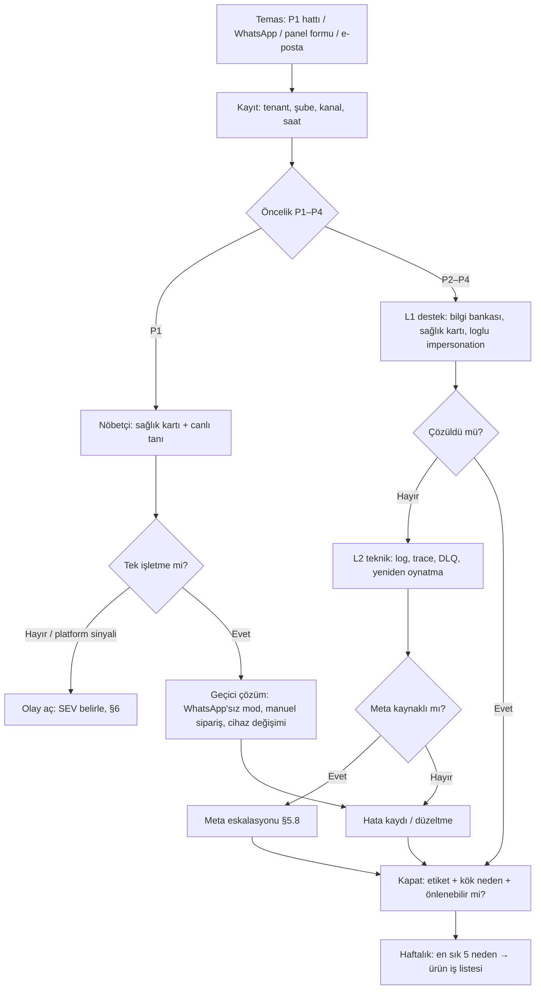
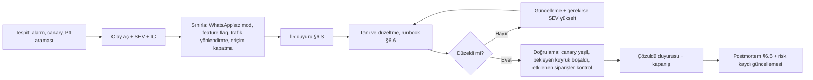
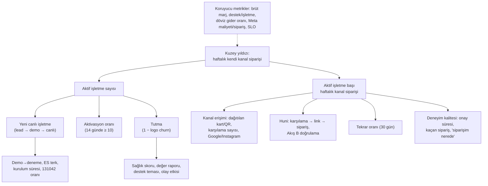

# 10 — Riskler, Operasyon ve Metrikler

> **Amaç:** Siparişin Önünde'yi neyin öldürebileceğini erken görmek, en pahalı varsayımları ürünü tam yazmadan test etmek ve pilottan itibaren işi yürütecek destek, olay yönetimi, SLO ve metrik düzenini tek yerde tanımlamak.
> **Tarih:** 2026-09-24 (Hafta 0) · **Durum:** Taslak (1. sürüm; düzeltme turu uygulandı) · **Bağlayıcı kaynak:** [00-kararlar-ve-sozluk.md](00-kararlar-ve-sozluk.md) (özellikle §5 durum ve sebep kodları, §10 kademeli alarm zamanlaması, §11 fazlar ve talep deneyi, §12 başarı metrikleri, §13.10 SLO varsayılanları).

**Kapsam:** Risk kaydı (risk register) ve pre-mortem; "önce doğrula" hipotezleri ve deney tasarımları (Seviye 0 concierge talep deneyi, Hafta 8 go/no-go kapısı, fiyat, onboarding, Coexistence ve `request_welcome` testleri); destek ve onboarding operasyonu; işletme sağlık skoru ve churn önleme; sahte sipariş süreci; Meta eskalasyonu; olay yönetimi (SEV1–SEV4, iletişim şablonları, postmortem, runbook'lar); SLO/SLI ve hata bütçesi; KPI ağacı ve metrik sözlüğü; dashboard'lar ve yönetim ritmi; güvenlik operasyonları takvimi.

**Kapsam dışı (bağlantı verilir):**
- Alarm zincirinin, metriklerin ve altyapının teknik tasarımı → [06 Teknik mimari](06-teknik-mimari.md) §7, §13, §14, §15. Bu doküman o metrikleri **kullanır**, süreçleri tanımlar.
- WhatsApp hata kodları, sağlık kartı, şablon kataloğu, onboarding teknik akışı → [02 WhatsApp](02-whatsapp-entegrasyonu.md) §3, §5, §10.
- Veri ihlali hukuki süreci ve süreleri (24 sa / 72 sa), dunning takvimi → [08 Mevzuat](08-mevzuat-kvkk-odeme-fatura.md) §2.9, §6.3.
- Fiyat, birim ekonomi varsayımları, GTM → [01 İş modeli](01-vizyon-pazar-is-modeli.md) §6–§8. Tablo alanları → [07 Veri modeli](07-veri-modeli-ve-api.md). Ekranlar → [04](04-isletme-paneli.md), [05](05-admin-paneli-ve-pazarlama-sitesi.md). Sprint takvimi ve ekip → [09](09-yol-haritasi-ve-sprint-plani.md).

**Kaynaklar ve atıf biçimi:** Ana kaynak `A06` = [arastirma/06-riskler-kirmizi-takim.md](arastirma/06-riskler-kirmizi-takim.md) (vaka URL'leri orada). Destek: `A01` [WhatsApp platformu](arastirma/01-whatsapp-platform.md) §13, `A02` [pazar ve iş modeli](arastirma/02-pazar-rakipler-is-modeli.md) §8, `A04` [mimari](arastirma/04-mimari-teknoloji.md) §7–§8, `A05` [ürün/UX](arastirma/05-urun-ux.md) §5.4, §11. Diğer plan dokümanlarına `[06](06-teknik-mimari.md) §14.5` biçiminde bağlantı verilir. **[T]** = tahminimiz veya önerimiz (pilot verisiyle kalibre edilir); **(teyit edilmeli)** = birincil kaynaktan doğrulanmadı. Kur varsayımı 1 USD ≈ 48,4 TL.

---

## 1. Özet: Bu fikri ne öldürür?

**Kısa cevap:** Büyük olasılıkla teknoloji ya da Meta değil, **talep tarafı** öldürür (A06 §1). İşletme müşterisini kendi kanalına taşıyamazsa panel boş kalır, esnaf "işe yaramadı" der ve 2–3 ay içinde bırakır. Olgun bir WhatsApp pazarı olan Brezilya'da bile paket servis cirosunun %54'ü pazaryerinden, %26'sı WhatsApp'tan geliyor (Abrasel, Mart 2025; A02). Keşfi pazaryeri yapar; bizim işimiz sadakati işletmeye geri kazandırmaktır.

**Öldürücü riskler (skor sırasıyla, ayrıntı §3):**

| # | Risk | Skor | Neden öldürür |
|---|---|---|---|
| R01 | Kanal taşıma başarısız | 20 | Pazaryeri müşterisi kendi kanala geçmezse işletme ödediğinin karşılığını görmez |
| R02 | Ekip kapasitesi / kapsam şişmesi | 16 | 1–3 geliştirici beş bileşen + concierge + destek yükünü taşıyamaz |
| R03 | Onboarding sürtünmesi (Meta) | 16 | Doğrulama, ES, Coexistence, Meta'ya kart, görünen ad: bir adım takılırsa aktivasyon düşer |
| R04 | Düşük ödeme isteği | 16 | "Zaten WhatsApp'tan alıyorum" + 20'den fazla ucuz yerli rakip |
| R05 | Sipariş kaçırma | 16 | Cuma akşamı kaçan tek sipariş güveni aylarca kaybettirir |
| R06 | Meta uygulamamız tek hata noktası | 15 | Uygulama kısıtlanırsa tüm işletmeler aynı anda WhatsApp'sız kalır |
| R07 / R08 | Destek yükü / kiracılar arası sızıntı | 15 / 15 | Marjı ve itibarı yer |

**En kritik 5 tavsiye:**
1. **Talebi ürün bitmeden ölç (R01, R04).** Seviye 0 concierge deneyi (Hafta 0–8, §4.4) ve fiyat/ödeme isteği testleri (§4.6) sayısal eşikli **Hafta 8 go/no-go kapısına** (§4.5) bağlanır. NO-GO çıkarsa pilot başlamaz, ağır geliştirme durur.
2. **Meta kritik yolunu bugün başlat, tek hata noktasını kır (R06, R03, R28).** Şirket doğrulaması Ltd/AŞ belgeleriyle; imzalı Solution Partner ön anlaşması (Plan B); ürün "WhatsApp'sız modda" (web + manuel sipariş + SMS OTP doğrulaması **[Faz 1]**) çalışır; canlıya geçiş iki kapılıdır: önce web + panel, sonra WhatsApp ([02](02-whatsapp-entegrasyonu.md) §2.5).
3. **Pilot öncesi zorunlu "sipariş kaçmaz" paketi eksiksiz olsun (R05, R13, R14).** Kademeli alarm, sentetik canary (§7.3), en az iki ayrı sunucu/VM üzerinde webhook alımı (pilotta ucuz ikinci VPS yeterli), PITR yedek ve kurucuların üstlendiği P1 telefon hattı (§5.1). Bunlardan biri eksikse pilot başlamaz.
4. **Güvenliği baştan kur, riskli modülleri ertele (R08, R11, R19).** Kampanya ve AI Faz 1'de yok; şablon promosyon denetimi, tenant yalıtım testleri CI'da zorunlu; ticari lansmandan önce dış pentest (§10).
5. **Değeri görünür kıl, birim ekonomiyi koru (R07, R17, R18).** Aylık değer raporu ve işletme sağlık skoru (§5.6), destek temaslarını etiketleyip her sprintte ilk 5 nedeni ürüne çevirme (§5.3), döviz bazlı giderlerin brüt gelire oranına %15 tavan [T] (§8.6).

---

## 2. Pre-mortem: "18 ay sonra kapandık, neden?"

Proje başarısız olmuş varsayılır ve en olası beş hikâye yazılır (A06 §2). Her hikâyenin önleyicisi bu dokümanda bir süreç veya metriğe bağlıdır.

| # | Senaryo | Hikâye (kısa) | Önleyen | Erken sinyal (bu dokümanda) |
|---|---|---|---|---|
| 1 | **Boş panel** | 10 pilotun 7'si ilk ay günde 1–2 kanal siparişi aldı; kartlar basılmadı ya da pakete konmadı; pilot sonrası 2 işletme ödemeye geçti | Seviye 0 deneyi, pazarlama kiti, teşvik, kanal payı metriği | İşletme başı haftalık kanal siparişi (§8.4), sağlık skoru (§5.6) |
| 2 | **Onboarding bataklığı** | Meta doğrulaması 7 hafta sürdü, App Review bir kez reddedildi, esnafın üçte biri Meta'ya kart eklemedi (131042) | Faz 0'ı hemen başlatmak, Plan B, concierge kontrol listesi | K3 kapısı (§4.10), ES terk oranı, 131042 oranı (§8.5) |
| 3 | **Cuma akşamı felaketi** | Tek sunucuda disk doldu, webhook'lar 40 dk 500 döndü, siparişler geç düştü; iki büyük müşteri ayrıldı ve esnaf grubunda kötü yorum yaptı | İki ayrı sunucu/VM'de webhook alımı, alarm, canary, müşteriye gecikme mesajı, deploy penceresi | Hata bütçesi (§7.4), runbook'lar (§6.6) |
| 4 | **Destek ekibi tükendi** | 60 işletmede haftada 150+ arama; kurucular geliştirme yapamadı; brüt marj %40'ta kaldı | Self-servis, uzaktan tanı, etiket→ürün döngüsü, bayi L1 (Faz 2) | Temas/işletme/ay (§8.5), kurucu geliştirme saati |
| 5 | **Kiracı sızıntısı** | Takip linkindeki tahmin edilebilir ID ile başka işletmelerin müşteri adresleri görüldü; 40 işletmeye ayrı ihlal bildirimi yapıldı; haber oldu | RLS, 128 bit token, yalıtım testleri, pentest, ihlal tatbikatı | Pentest bulguları, 404 artışı (§3.3 R08), tatbikat (§10) |

---

## 3. Risk kaydı (risk register)

### 3.1 Ölçek ve sahip rolleri

**Olasılık (önümüzdeki 18 ay) ve etki ölçeği** (A06 §0; puanlar yargıdır [T], pilot verisiyle güncellenir):

| Puan | Olasılık | Etki |
|---|---|---|
| 1 | Çok düşük (< %5) | İhmal edilebilir |
| 2 | Düşük (%5–20) | Küçük: tek işletme, saatler |
| 3 | Orta (%20–50) | Orta: birkaç işletme veya gün; gelirin < %10'u |
| 4 | Yüksek (%50–80) | Büyük: platformun tamamı veya çok işletme; aylarca gecikme; ciddi churn |
| 5 | Çok yüksek (> %80) | Ölümcül: iş modelini bitirir |

**Skor = O × E.** 15–25 **Kritik**, 8–14 **Yüksek**, 4–7 **Orta**, 1–3 **Düşük**.

**Sahip rolleri** (ekip küçükken bir kişi birden fazla rolü taşır; platform rolleri KARARLAR §4):

| Sahip rolü | Kim (pilot) | Platform rolü | Sorumluluk |
|---|---|---|---|
| Kurucu-İş | Kurucu (CEO) | `platform_owner` | Talep, fiyat, satış, Meta ilişkisi, hukuk koordinasyonu, nakit |
| Teknik lider | Kurucu (CTO) | `platform_owner` / `platform_admin` | Altyapı, güvenlik, SLO, olay komutanlığı (teknik) |
| Operasyon lideri | Pilotta kurucu; Faz 2'de ilk destek/operasyon işe alımı | `platform_admin`, `support_agent` | Destek, onboarding, sağlık skoru, churn önleme |
| Finans | Kurucu + mali müşavir | `finance` | Tahsilat, maliyet, döviz gider oranı |
| Avukat | Dış avukat | — | KVKK, sözleşmeler, pazaryeri sözleşme incelemesi |

### 3.2 Isı haritası

| Etki ↓ / Olasılık → | 1 | 2 | 3 | 4 | 5 |
|---|---|---|---|---|---|
| **5 Ölümcül** | R35 | R19, R20 | R06, R08 | **R01** | |
| **4 Büyük** | | R24, R25, R29, R30, R40 | R10, R11, R12, R13, R14, R15, R37, R39 | **R02, R03, R04, R05** | |
| **3 Orta** | | R32, R33, R34 | R21, R22, R23, R38, R41 | R09, R16, R17, R18 | **R07** |
| **2 Küçük** | | R36 | R31 | R26, R27, R28 | |

### 3.3 Risk kaydı tablosu

R01–R36 kimlikleri A06 §9.2 ile aynıdır (diğer dokümanlar bu kimliklere atıf yapar); R37–R41 bu dokümanda eklendi. Kategoriler: talep/pazar, Meta, operasyon, teknik, güvenlik, hukuk, finans, ekip.

| ID | Kat. | Risk | O | E | Skor | Erken uyarı sinyali (ölçülebilir) | Azaltma (önleyici) | Olursa ne yaparız | Sahip | Faz |
|---|---|---|---|---|---|---|---|---|---|---|
| R01 | Talep/pazar | **Kanal taşıma başarısız:** müşteri kendi kanala geçmez, panel boş kalır | 4 | 5 | **20** | İşletme başı haftalık kanal siparişi < 5; kart→sipariş < %2; pilotun 8. haftasında (pilot sonu) kanal payı < %5 | Seviye 0 deneyi (§4.4); pazarlama kiti (kart, magnet, stand, Google, Instagram); kanala özel teşvik; "Son siparişin" kartı; segment: ≥ 10 paket/gün | Hafta 8 NO-GO → pilot başlamaz, pivot seçenekleri (§4.5); pilotta işletme bazında teşvik/kart yenileme + kurucu ziyareti | Kurucu-İş | Faz 0 → Pilot |
| R02 | Ekip | **Ekip kapasitesi / kapsam şişmesi** | 4 | 4 | **16** | Sprint hedefinin < %60'ı tamamlanıyor; pilot tarihi ≥ 2 hafta kayıyor; kurucu geliştirme saati < %50 | "Faz 1'de olmayanlar" listesine sadakat; haftalık kapsam gözden geçirme; Hafta 1–8'de öncelik iskelet + webhook + ES + "sipariş kaçmaz" paketi | Kapsam dondurma; pilotu 10 yerine 6 işletmeyle başlat; Faz 2 işlerini ertele | Teknik lider | Faz 0–1 |
| R03 | Meta | **Onboarding sürtünmesi** (ES, Coexistence, Meta'ya kart, görünen ad) | 4 | 4 | **16** | ES terk > %30; kurulum medyanı > 1 gün; canlı tenant'larda 131042 > 0; görünen ad reddi | Concierge kontrol listesi (§5.5); iki kapılı canlıya geçiş; kart adımı olmadan WhatsApp canlıya geçmez; yeni numara alternatifi | Takılan adıma göre runbook; Plan B (Solution Partner); MPS'i (Faz 3) öne çekme değerlendirmesi | Operasyon lideri | Faz 1 |
| R04 | Talep/pazar | **Düşük ödeme isteği** / "zaten WhatsApp'tan alıyorum" | 4 | 4 | **16** | Demo→deneme < %30; deneme→ücretli < %40; D6'da < 3 ön ödeme ve < 6 niyet mektubu; pilot sonrası ödemeye geçiş < %60 | Segmentasyon; hesaplayıcı; kaçırma çetelesi; aylık değer raporu; D5/D6 testleri | Mesajı "sipariş kaçmasın / düzen" tarafına kaydır; paket içeriğini yeniden kurgula; Esnaf paketini self-servise çevir | Kurucu-İş | Faz 0 → Faz 2 |
| R05 | Operasyon | **Sipariş kaçırma** (panel kapalı, ses kilitli, internet, telefondan yanıt) | 4 | 4 | **16** | `new` > 2 dk oranı > %5; `tenant_no_response` iptali ≥ 1; açık saatte panel çevrimdışı dakikası; "siparişim nerede" > %5 | Pilot öncesi zorunlu paket; Android tablet önerisi; vardiya başı "Siparişleri almaya başla"; kasiyer eğitimi | Aynı gün işletme araması, kök neden (cihaz/ses/ağ/davranış), telafi; tekrarında yerinde ziyaret | Operasyon lideri | Faz 1 |
| R06 | Meta | **Meta uygulamamızın gecikmesi, reddi veya kısıtlanması** (tek hata noktası) | 3 | 5 | **15** | Business Verification > 2 hafta; App Review "daha fazla bilgi"; Hafta 8'de Advanced Access yok; Meta politika uyarı e-postası | Faz 0 hemen; imzalı Solution Partner ön anlaşması; `WaTransport` ([02](02-whatsapp-entegrasyonu.md) §7.10); **WhatsApp'sız mod** (storefront + manuel sipariş + SMS OTP doğrulaması **[Faz 1]**; durum bilgisi takip sayfası ve kritik durum SMS'i, KARARLAR §7) | Hafta 8'de Plan A'/B; kısıtlamada SEV1, tenant bazında partner taşıyıcısına geçiş | Kurucu-İş + Teknik lider | Faz 0 |
| R07 | Operasyon | **Destek yükü** (gece, hafta sonu, telefonla) | 5 | 3 | **15** | Temas/işletme/ay > 3 (ilk ay hariç); 22:00 sonrası temas payı > %20 [T]; haftalık P1 sayısı artıyor | Bilgi bankası (§5.4); uzaktan tanı kartı; etiket→ürün döngüsü; bayi L1 **[Faz 2]** | Destek işe alımını öne çek; ilk 5 nedene "SSS sprinti"; Esnaf paketinde self-servis zorunlu | Operasyon lideri | Pilot → Faz 2 |
| R08 | Güvenlik | **Kiracılar arası sızıntı / güvenlik ihlali** | 3 | 5 | **15** | IDOR testi kırmızı; pentest yüksek bulgu; takip/storefront uçlarında 404 artışı (tarama); anormal erişim logu | RLS + yalıtım testleri; 128 bit rastgele token; ASVS L2 (kimlik, yalıtım); pentest (§10) | Veri ihlali runbook'u (§6.6), [08](08-mevzuat-kvkk-odeme-fatura.md) §2.9 süreleri | Teknik lider | Faz 1 |
| R09 | Talep/pazar | **Fiyat savaşı / ücretsiz alternatifler** (`wa.me`, 680 TL'den başlayan rakipler; A02) | 4 | 3 | **12** | "X firması daha ucuz" itirazı > %30; kayıp nedeni #1 fiyat; rakip ücretsiz bot katmanı | Sipariş başı maliyet ve operasyon anlatımı; resmî API güvencesi; yıllık peşin | Ücretsiz "Menü" katmanını (Faz 3) öne çekme değerlendirmesi | Kurucu-İş | Faz 2 |
| R10 | Talep/pazar | **Pazaryeri karşı hamlesi** (sözleşme kısıtı, kendi doğrudan kanal ürünü, satın alma) | 3 | 4 | **12** | Sözleşme maddesi değişikliği; esnafın "uyarı aldım" demesi; pazaryerinden doğrudan kanal ürünü duyurusu | "Bağımlı kalma" mesajı; D10 sözleşme incelemesi; kart dışı taşıma yolları | Kart dışı kanallara ağırlık (telefonla arayan, Google, Instagram, magnet); hukuki görüş | Kurucu-İş | Sürekli |
| R11 | Meta | **İşletme numarasının kısıtlanması/banı** | 3 | 4 | **12** | Kalite YELLOW/RED; 368, 131031, 131064, 131048, 132015; engelleme artışı | Faz 1'de kampanya yok; şablon promosyon denetimi; commerce filtresi; "toplu mesaj atma" eğitimi | Kalite düşüşü runbook'u (§6.6); web + telefon modu; Meta itirazı; yeni numara | Operasyon lideri | Faz 1 |
| R12 | Meta | **Coexistence kopması / uygulamanın bozulması** | 3 | 4 | **12** | Son echo > 10 gün; tenant sessizliği (P2); `account_update`; esnaf şikâyeti | Bağlanmadan önce sohbet yedeği; ilk 72 saat gözlem; 14 gün hatırlatması; geçmiş senkronu kapalı | "Yeniden bağlan" akışı; yeni numara; Meta eskalasyonu (§5.8) | Operasyon lideri | Faz 1 |
| R13 | Teknik | **Webhook kaybı, gecikmesi, işleme hatası** | 3 | 4 | **12** | Canary > 60 sn; `wa-inbound` en eski iş > 60 sn; `wa-inbound` DLQ > 0; p95 > 3 sn | Ham olay + hızlı 200; dedupe; outbox; canary; öncelikli kuyruklar | "Webhook durdu" ve "kuyruk birikti" runbook'ları; ham olay yeniden oynatma | Teknik lider | Faz 1 |
| R14 | Teknik | **Altyapı kesintisi** (tek sunucu, disk, DB) | 3 | 4 | **12** | Aylık erişilebilirlik < %99,9; disk > %85; restore tatbikatı RTO > 1 sa | En az iki ayrı sunucu/VM'de webhook alımı (KARARLAR §11); PITR; rolling deploy; yoğun saat deploy yasağı | DB arızası runbook'u; 3 sunucuya erken geçiş | Teknik lider | Pilot öncesi |
| R15 | Hukuk | **KVKK** (m.9 aktarım, ihlal, aydınlatma) | 3 | 4 | **12** | Avukat görüşü gecikmesi; ilgili kişi başvurusunda 30 gün sınırına 7 gün kalması; Kurul duyurusu | Yurt içi barındırma; veri minimizasyonu; DPA; m.9 yazılı görüş | İhlal süreci; Cloudflare DNS-only moda geçiş; alt işleyen değişikliği | Kurucu-İş + Avukat | Faz 0 |
| R16 | Meta | **Meta fiyat/politika değişikliği** (işletmenin Meta faturası artar) | 4 | 3 | **12** | Rate card değişimi; `wa_message_costs` ile sipariş başı Meta maliyeti çeyrekte +%50; changelog duyurusu | Pass-through; rate card konfigürasyonda; sipariş başına ≤ 4 durum mesajı; panelde maliyet görünümü | İşletmelere proaktif bilgi; mesaj bütçesini takip sayfasına kaydır; MPS değerlendirmesi | Kurucu-İş | Sürekli |
| R17 | Finans | **Enflasyon + kur** (USD giderler, TL gelir) | 4 | 3 | **12** | Brüt marj < %60; döviz bazlı gider / brüt gelir > %15 [T] | Kurucu indirimi sabit **oran** (KARARLAR §8); TÜFE endeksi; yıllık peşin; TL faturalı yurt içi barındırma | Liste fiyatı güncellemesi; LLM kotası; USD araçlarını azalt | Finans | Faz 2 |
| R18 | Talep/pazar | **Churn:** restoran kapanışları, mevsimsellik | 4 | 3 | **12** | Sağlık skoru kırmızı; kanal siparişi 2 haftada −%40; `past_due` | Aylık değer raporu; proaktif arama (§5.6); yıllık plan | Geri kazanım görüşmesi; çıkış görüşmesi; dondurma seçeneği (açık konu) | Operasyon lideri | Faz 2 |
| R19 | Güvenlik | **Token/sır sızıntısı** (WABA token, App Secret) | 2 | 5 | **10** | gitleaks uyarısı; olağandışı gönderim hacmi; ingress imza hatası > 10/dk | Envelope encryption; SOPS; log maskeleme; ortam başına ayrı Meta App | "Token toplu iptal" runbook'u; KEK ve App Secret rotasyonu | Teknik lider | Faz 1 |
| R20 | Teknik | **Veri kaybı** | 2 | 5 | **10** | Yedek yaşı > 26 sa; WAL arşiv hatası; restore tatbikatı başarısız | pgBackRest, iki TR repo; haftalık otomatik + aylık elle restore | PITR; etkilenen işletmelere bilgi; olay kaydı | Teknik lider | Faz 1 |
| R21 | Operasyon | **Sahte / trol sipariş** (kapıda ödeme) | 3 | 3 | **9** | `suspected_fake` iptal oranı > %1 [T]; Akış B'de doğrulanmayan sipariş artışı; Turnstile ret artışı | Akış B WhatsApp doğrulaması; Turnstile; hız kuralları; kara liste | Sahte sipariş süreci (§5.7) | Operasyon lideri | Faz 1 |
| R22 | Operasyon | **Yoğun saat** (Cuma akşamı, maç, iftar; insan + sistem) | 3 | 3 | **9** | Cuma 19–22 p95 gecikme; kuyruk yaşı; "yolda/teslim" işaretlenmeden kapanan sipariş payı | Yük testi; deploy penceresi; yoğun mod (`busy`); durum butonları kuryede | "Yoğun saat yükü" runbook'u | Teknik lider | Faz 1 |
| R23 | Meta | **WhatsApp/Meta global kesintisi** | 3 | 3 | **9** | Canary başarısız; Graph API 5xx oranı; platform geneli webhook sessizliği | WhatsApp'sız mod (SMS OTP doğrulaması **[Faz 1]**); takip sayfası + kritik durum SMS'i | "Meta kesintisi" runbook'u (RB-2) | Teknik lider | Faz 1 |
| R24 | Talep/pazar | **Meta'nın kendi sipariş/AI özellikleri** değeri metalaştırır | 2 | 4 | **8** | Meta duyuruları (Business Agent, katalog seçenekleri, Türkiye'de ödeme) | Değer = operasyon + çok kanal + CRM + POS; Meta özelliklerini taşıyıcı olarak benimse (Flows Faz 3) | Konumlandırma revizyonu | Kurucu-İş | Sürekli |
| R25 | Hukuk | **İYS / 6563** (kampanya) | 2 | 4 | **8** | Kampanya talebi; şablon denetiminin promosyon reddi sayısı | Faz 1'de kampanya yok; Faz 2'de yazılımda zorunlu İYS kontrolü | Gönderimi durdur (kill switch); avukat | Kurucu-İş + Avukat | Faz 2 |
| R26 | Operasyon | **Yanlış sipariş / adres** | 4 | 2 | **8** | `courier_assignments.failure_reason = address_not_found`; "yanlış ürün" şikâyeti | Yapılandırılmış sepet; konum pini; onay adımı | Düzelt ve müşteriye bildir; ürün iyileştirmesi | Operasyon lideri | Faz 1 |
| R27 | Finans | **Tahsilat sorunları** | 4 | 2 | **8** | Başarısız çekim > %10; havale eşleşme gecikmesi | Dunning ([08](08-mevzuat-kvkk-odeme-fatura.md) §6.3); yıllık peşin; 3DS uyumlu PSP | `finance` arama görevi; havale seçeneği | Finans | Faz 2 |
| R28 | Meta | **Onboarding kotası** (7 günde 10) | 4 | 2 | **8** | Bekleyen kurulum sayısı > haftalık kota | Doğrulama ve App Review hemen | Kurulumları sıraya al; Plan B | Teknik lider | Faz 0 |
| R29 | Meta | **Yanlış dikey / Commerce Policy** (tüp, alkol, nargile, eczane) | 2 | 4 | **8** | Yasaklı ürün taraması eşleşmesi; bu dikeylerden satış talebi | Dikey beyaz listesi; ürün bayrakları | Ürünü gizle; kötüye kullanım süreci (§5.7) | Operasyon lideri | Sürekli |
| R30 | Güvenlik | **Dolandırıcılık** (sahte işletme, numara taklidi) | 2 | 4 | **8** | Aynı adla birden çok kayıt; müşteri şikâyeti | İşletme onay akışı (admin); "Resmî sipariş hattımız" rozeti; ön ödeme yok | Hesabı askıya al; içerik kaldırma; bildirim | Operasyon lideri | Faz 1 |
| R31 | Meta | **BSUID / kullanıcı adı: telefon eksik** | 3 | 2 | **6** | Telefonsuz sipariş oranı > %10 [T] | "Teslimat telefonu" alanı; REQUEST_CONTACT_INFO; contact book açık | Kurye akışı düzeltmesi | Teknik lider | Faz 1 |
| R32 | Hukuk | **Pazaryeri sözleşmesi nedeniyle esnafa yaptırım** | 2 | 3 | **6** | Esnafın uyarı alması | D10 incelemesi; "kendi sözleşmeni kontrol et" uyarısı | Kart dışı yollara geç; hukuki yönlendirme | Kurucu-İş | Faz 0 |
| R33 | Hukuk | **Kesinti sonrası tazminat talebi** | 2 | 3 | **6** | SEV1/SEV2 sonrası şikâyet | Sorumluluk sınırı; SLA kredisi (§7.5); olay kaydı | Postmortem özetini paylaş; kredi | Kurucu-İş | Faz 1 |
| R34 | Operasyon | **AI yanlış anlama / politika** (Akış C) | 2 | 3 | **6** | Düzeltme ve insana devir oranı | Kapsam sınırı; [Onayla] [Düzenle] [İptal]; kill switch | `llm_parsing` kill switch'ini kapat (KARARLAR §4) | Teknik lider | Faz 2 |
| R35 | Hukuk | **6493 ödeme aracılığına kayma** | 1 | 5 | **5** | Ekipten "tahsil edelim, aktaralım" fikirleri | Müşteri parası bize girmez; ödeme özelliklerinde hukuk kapısı | Özelliği geri çek | Kurucu-İş | Sürekli |
| R36 | Hukuk | **Marka / alan adı çakışması** | 2 | 2 | **4** | TÜRKPATENT araştırma sonucu | Erken başvuru (9, 35, 38, 42) | Yeniden adlandırma | Kurucu-İş | Faz 0 |
| R37 | Ekip | **Anahtar kişi bağımlılığı ve nöbet yorgunluğu** | 3 | 4 | **12** | Tek kişinin bildiği sistem sayısı > 0; kişi başı haftalık nöbet > 3 akşam [T]; P1 sonrası dinlenme kuralı ihlali | Runbook'lar; prod erişimi en az 2 kişide ([06](06-teknik-mimari.md) §15.2); nöbet rotasyonu (§5.9) | P1 hattı saatlerini daralt; dış destek; işe alımı öne çek | Kurucu-İş | Pilot |
| R38 | Teknik | **Yurt içi barındırma kalitesi/fiyatı** (teklifler netleşmedi) | 3 | 3 | **9** | Teklifler [06](06-teknik-mimari.md) §17 aralığının üstünde; sağlayıcı kesintisi; destek yanıt süresi | ≥ 3 teklif; çıkış kolaylığı kriteri; altyapı kod olarak | Sağlayıcı değişimi; ikinci lokasyona DR | Teknik lider | Faz 0–1 |
| R39 | Finans | **Nakit pisti:** pilot 3 ay ücretsiz, tahsilat Faz 2'de başlıyor | 3 | 4 | **12** | Kalan nakit < 6 aylık yakım [T]; pilot sonrası ödemeye geçiş < %60 | D6 niyet mektubu; yıllık peşin; maliyet disiplini | Harcama kesintisi; yatırım/hibe; Teknokent | Kurucu-İş + Finans | Faz 0–2 |
| R40 | Güvenlik | **İçeriden kötüye kullanım** (impersonation, destek erişimi, paylaşılan tablet) | 2 | 4 | **8** | Gerekçesiz impersonation; mesai dışı admin erişimi; maskesiz telefon görüntüleme sayısı | Salt okunur varsayılanlı, en fazla 30 dk süreli, gerekçeli ve loglu impersonation (KARARLAR §4); aylık log incelemesi; PIN'li cihaz oturumu | Erişimi kapat; ihlal değerlendirmesi | Teknik lider | Faz 1 |
| R41 | Operasyon | **Ölçüm hatası:** kanal siparişi yanlış atfedilir, kuzey yıldızı güvenilmez olur | 3 | 3 | **9** | `orders.source_meta` boş oranı > %20; `manual` payında açıklanamayan artış; işletme beyanıyla fark > %20 | QR/UTM kodu zorunlu; `manual` ayrı sayılır; pazaryeri sipariş sayısı aylık beyan | Metriği yeniden tanımla, geçmişi düzelt, raporlara not düş | Teknik lider | Faz 1 |

### 3.4 Risk yönetimi ritmi

- **Haftalık** (metrik toplantısı, §9.3): kritik ve yüksek risklerin erken uyarı sinyalleri (KRI) gözden geçirilir. Eşiği aşan her KRI için sahip ve tarih yazılır.
- **Aylık:** tüm kayıt yeniden puanlanır, kapanan risk "kapalı" işaretlenir (silinmez), yeni riskler R42'den devam eder. İlk 5 değişiklik aylık rapora girer (§9.4).
- **Olay sonrası:** her SEV1/SEV2 postmortem'i ilgili riskin olasılık/etki puanını ve azaltma listesini günceller.
- **Kapılarda** (K1–K4, §4.10): kapı kararı risk kaydıyla birlikte verilir; pilot sonunda (K4) tüm puanlar pilot verisiyle kalibre edilir.
- Admin panelinde KRI listesi A06 §9.3'teki eşiklerle izlenir ([05](05-admin-paneli-ve-pazarlama-sitesi.md)); metrik tanımları §8'dedir.

---

## 4. "Önce doğrula": hipotezler ve deney tasarımları

### 4.1 İlke ve takvim

En ucuz ve en hızlı öğrenilecek şey **talep ve ödeme isteğidir**. Meta kritik yolu (doğrulama, App Review) uzun sürdüğü için hemen ve paralel başlar. KARARLAR §11 gereği Faz 1 geliştirmesi de Hafta 1'de paralel başlar. Ancak Hafta 1–8 arasında geliştirme önceliği teknik iskelet, webhook altyapısı, ES v4 ve pilot öncesi zorunlu "sipariş kaçmaz" paketinde tutulur [T]. **Hafta 8 kapısında NO-GO çıkarsa pilot başlamaz ve ağır geliştirme durur** (§4.5).

| Hafta (tarih) | Talep ve ödeme | Meta ve platform | Karar |
|---|---|---|---|
| 0–2 (24.09–08.10) | D1 problem görüşmeleri (≥ 20, hedef 25 esnaf); Seviye 0 adaylarının seçimi ve 1 haftalık başlangıç sayımı | Şirket, Business Verification başvurusu, Meta App, Tech Provider; D12 `request_welcome` testi (Sprint 1) | **K1** (Hafta 2–3): problem |
| 1–4 | D2 kesinti dökümü; D3 kart/magnet basımı ve dağıtım başlangıcı; D5 landing + fiyat testi; D10 sözleşme incelemesi | ES v4 demo, App Review videoları; D7 kuru koşu; D11 Coexistence saha testi başlar | — |
| 4–8 (22.10–19.11) | D3/D4 ölçüm; D6 ön satış ve niyet mektubu | App Review sonucu; D11 tamamlanır | **K2 + K3** (Hafta 8): go/no-go ve platform |
| 10–18 (03.12.2026–28.01.2027) | Pilot (10 işletme); D8 panel gözlemi (ilk 2 hafta); D9 destek ölçümü | Pilot öncesi zorunlu paket canlıda | **K4** (Hafta 18–19): pilot sonu |

### 4.2 Hipotez listesi

| # | Hipotez | Bağlı risk | Öldürme / pivot eşiği [T] | Deney |
|---|---|---|---|---|
| H1 | Hedef işletmelerin çoğu pazaryeri komisyonunu ilk 3 sorunundan biri sayıyor | R01, R04 | Görüşülenlerin < %40'ı komisyonu ilk 3'e koyuyor | D1, D2 |
| H2 | Hedef işletmelerde günde ≥ 5 WhatsApp/telefon siparişi **veya** taşınabilir tekrar eden müşteri kitlesi var | R04 | Uygun işletme oranı < %30 | D1 |
| H3 | Pazaryeri müşterisi paket kartı + teşvikle kendi kanala geçiyor | **R01** | §4.5 eşikleri | D3, D4 |
| H4 | Web sepeti (menü linki), "yazarak sipariş"ten daha çok tercih ediliyor veya en azından kabul görüyor | R01 | Menü sayfasını açanların < %40'ı siparişi WhatsApp'a gönderiyor | D3 (menü sayfalı varyant), pilot |
| H5 | Esnaf 990 / 1.790 TL'yi ödemeye hazır | R04, R39 | §4.6 eşikleri | D5, D6 |
| H6 | Onboarding ≤ 1 günde bitiyor; esnaf Meta'ya kart ekliyor | R03 | 3 kuru koşudan 2'sinde > 1 gün veya kart eklemeyi reddetme | D7 |
| H7 | Şirketimizin Meta doğrulaması ve App Review ≤ 6 haftada tamamlanıyor | R06 | Hafta 8'de Advanced Access yok → Plan A'/B ([02](02-whatsapp-entegrasyonu.md) §2.5) | D7 |
| H8 | Esnaf yoğun saatte paneli kullanıyor (telefona dönmüyor) | R05 | Pilotun 2. haftasında siparişlerin < %80'i 2 dk içinde panelde onaylanıyor | D8 |
| H9 | Destek yükü yönetilebilir | R07 | 2. ayda temas/işletme/ay > 4 | D9 |
| H10 | Pazaryeri sözleşmeleri paket içi kartı ve kanala özel avantajı yasaklamıyor ya da fiilen yaptırım yok | R32, R01 | Avukat "açık yasak + yaptırım" diyor | D10 |
| H11 | Satış kanalları karma CAC ≤ 4.000 TL üretebiliyor | Birim ekonomi | İlk 20 kapanışta karma CAC > 6.000 TL | Pilot + Faz 2 |
| H12 | Su bayisi daha kolay satılır, daha az churn eder | Segment sırası | Su bayisinde kanal siparişi restorandan düşük | D3'e 2 su bayisi |
| H13 | Coexistence +90 numarada güvenilir çalışıyor (echo, iPhone gönderenler, 24 saat sonrası şablon) | R12, R03 | §4.8 kriterlerinden biri başarısız | D11 |
| H14 | `request_welcome` olayı Türkiye numaralarında geliyor ve serbest yanıt açıyor | R01 (huni) | §4.9 kriteri tutmuyor → karşılama yalnız ilk mesajla | D12 |

### 4.3 Deney özeti

| Deney | Hipotez | Tasarım (kısa) | Ana metrik | Başarı eşiği | Süre | Maliyet [T] | Sahip |
|---|---|---|---|---|---|---|---|
| **D1** Problem görüşmeleri | H1, H2 | Pilot ilçelerde ≥ 20 (hedef 25) yüz yüze görüşme: 15 paket restoranı, 5 su bayisi, 5 pastane; geçmişi sor, ürünü anlatma ("Mom Test"); sonda 4 Van Westendorp sorusu | Komisyonu ilk 3'e koyan oran; uygun işletme oranı | ≥ %40 ve ≥ %30 | Hafta 0–2 | Kurucu zamanı (~25 × 1,5 sa) + yol | Kurucu-İş |
| **D2** Kesinti dökümü | H1 | 10 restorandan izinle, anonim 1–3 aylık pazaryeri kesinti dökümü (Nisan 2026 düzenlemesiyle kalem kalem, A02) | Medyan efektif kesinti oranı; tekrar eden müşteri oranı | Medyan ≥ %12 (altındaysa mesaj "düzen / kaçmasın"a kayar) | Hafta 1–3 | Zaman | Kurucu-İş |
| **D3** Seviye 0 concierge | H3, H4, H12 | Yazılımsız; `wa.me` QR'lı kart + magnet + teşvik; siparişler işletmenin kendi WhatsApp'ına düşer (§4.4) | Haftalık kanal siparişi / işletme; kart→sipariş; tekrar oranı | §4.5 | Hafta 0–8 (ölçüm Hafta 2–8) | Baskı (teklif alınacak), teşvik (işletme), kurucu ~1 sa/işletme/hafta | Kurucu-İş |
| **D4** Teşvik A/B | H3 | D3 içinde 3 kart varyantı: (a) ücretsiz içecek, (b) %10 indirim, (c) damga kartı "10. sipariş bedava" (Seviye 0'da kâğıt; dijitali ürünle gelir) | Varyant başına kart→sipariş ve işletmeye maliyet | En iyi varyant pilot kitine girer (küçük örneklem: yön gösterir, istatistiksel kanıt değildir) | D3 ile | Teşvik bedeli (işletme) | Kurucu-İş |
| **D5** Landing + fiyat testi | H5 | İki değer önerisi × üç Pro fiyatı (1.290 / 1.790 / 2.290 TL) rastgele; CTA "Kurucu üye listesine katıl" / "Demo iste"; hesaplayıcı dahil | Varyant başına lead oranı; hesaplayıcı tamamlama | 1.790 varyantının lead oranı ≥ 1.290 varyantının %50'si | Hafta 1–6 | Landing 1–2 kişi-gün + reklam (tavanı kurucu belirler) | Kurucu-İş |
| **D6** Ön satış / niyet mektubu | H5 | Pilot adaylarına (a) iade garantili kurucu üye ön ödemesi, (b) imzalı niyet mektubu (§4.6) | Ön ödeme ve imza sayısı | 10 adaydan ≥ 3 (a) **veya** ≥ 6 (b) | Hafta 4–8 | Zaman; sözleşme şablonu (avukat) | Kurucu-İş |
| **D7** Meta onboarding kuru koşusu | H6, H7 | Şirket tarafı: doğrulama, Tech Provider, ES v4, App Review; işletme tarafı: 3 dost işletmeyle tester rolünde kurulum (§4.7) | Adım süreleri, `current_step` terkleri, kart ekleme | §4.7 | Hafta 0–6 | 3 işletme × 0,5 gün + ekip zamanı | Teknik lider |
| **D8** Panel dayanıklılık gözlemi | H8 | Her pilot işletmede bir Cuma ve bir Cumartesi akşamı 1–2 saat yerinde gözlem | 2 dk içinde panelde onay oranı; telefondan yanıt oranı | ≥ %80 (2. hafta) | Pilotun ilk 2 haftası | Kurucu zamanı | Operasyon lideri |
| **D9** Destek yükü ölçümü | H9 | Her temas etiketlenir (§5.3) | Temas/işletme/ay | 2. ayda ≤ 4 | Pilot boyunca | — | Operasyon lideri |
| **D10** Sözleşme incelemesi | H10 | Pilot adaylarından 3 güncel pazaryeri sözleşmesi avukata; paket içi materyal, müşteri yönlendirme, parite, veri, yaptırım | Avukat görüşü | "Açık yasak + yaptırım" yok | Hafta 1–4 (ilk sözleşme Hafta 1'de, kart dağıtımından önce) | Avukat ücreti | Kurucu-İş + Avukat |
| **D11** Coexistence +90 teyidi | H13 | 2 gerçek +90 WhatsApp Business numarasıyla saha testi (§4.8) | Test senaryolarının geçme oranı | Tümü geçer | Hafta 1–6 (15 günlük hareketsizlik testi dahil) | 2 hat + 2 cihaz, ~3 kişi-gün | Teknik lider |
| **D12** `request_welcome` testi | H14 | Sprint 1'de +90 numara, 5 senaryo (§4.9) | Olayın gelmesi, serbest yanıtın teslimi | 5 senaryodan ≥ 4'ü | Hafta 1–2 | ~1 kişi-gün | Teknik lider |

### 4.4 Seviye 0 concierge talep deneyi (ayrıntılı tasarım)

**Soru:** Pazaryeri müşterisi, işletmenin kendi WhatsApp kanalına **yazılım olmadan** da geçiyor mu? Geçmiyorsa ürün bunu tek başına değiştiremez; geçiyorsa ürünün işi bu akışı düzenlemek ve ölçeklemektir.

**Katılımcılar (KARARLAR §11: 5–10 işletme; hedef 8):**
- Pilot ilçelerden, **kendi kuryesi olan**, günde ≥ 10 paket siparişi alan, en az bir pazaryerinde aktif, WhatsApp Business uygulaması kullanan (ya da geçmeye istekli) işletmeler.
- Karma: 5–6 paket restoranı (döner, pide/lahmacun, kebap, pizza/burger), 2 su bayisi (H12; tüp/LPG satanlar hariç, Commerce Policy). Seviye 0 adayları pilot adaylarıyla aynı havuzdan seçilir.

**Kurulum (yazılım yok; resmî olmayan hiçbir araç yok):**
1. **Başlangıç sayımı (1 hafta):** Kasiyer günlük çetele tutar: pazaryeri sipariş sayısı, WhatsApp/telefon sipariş sayısı, kaçan/geciken sipariş (kaçırma çetelesi, A06 §4.4). Bu, kanal payının paydası ve satış argümanıdır.
2. **Kodlu QR'lar:** Her malzeme ve teşvik varyantı ayrı QR taşır. QR, `wa.me/<işletme numarası>?text=Merhaba, sipariş vermek istiyorum (K1A)` bağlantısını açar. Kod şeması: işletme no (1–9) + malzeme (K kart, M magnet, S kasa standı, I Instagram, G Google) + teşvik varyantı (A/B/C). QR'lar sayım için `siparisinonunde.com/q/{kod}` kısa yönlendirmesinden geçer; yalnız kod başına tarama **sayısı** tutulur, IP veya cihaz bilgisi saklanmaz [T].
3. **Malzeme:** Paket içi kart (D4 varyantları eşit sayıda), buzdolabı magneti, kasa QR standı; Google İşletme Profili ve Instagram bio'ya kodlu link. Kart metni nötrdür: "Bir dahaki siparişinizde bize WhatsApp'tan doğrudan yazın" + teşvik. Pazaryeri adı ve karşılaştırma içermez ([08](08-mevzuat-kvkk-odeme-fatura.md) karşılaştırmalı reklam notu).
4. **Menü sayfası varyantı (H4, işletmelerin yarısında):** Tek sayfalık statik menü (fotoğraf + fiyat) ve "WhatsApp'tan sipariş ver" butonu. Diğer yarıda QR doğrudan sohbeti açar.
5. **Sayım:** İşletme, WhatsApp Business uygulamasının sohbet etiketleriyle ("Kanal-yeni", "Kanal-tekrar") kodlu siparişleri işaretler (özelliğin sürümdeki adı teyit edilmeli). Kurucu her gün 5 dk arar veya akşam etiket sayılarının ekran görüntüsünü alır; haftada bir ziyaret eder.
6. **D10 önkoşulu:** Kartlar pakete konmadan önce en az bir pazaryeri sözleşmesinin ilk okuması yapılır. "Açık yasak" bulunursa kart yalnız telefon/WhatsApp siparişlerine konur, ağırlık magnet, stand ve dijital kanallara kayar.

**Kurallar:**
- Pazaryeri siparişlerinden elde edilen (çoğunlukla maskeli) numaralara **hiçbir koşulda** mesaj atılmaz; taşıma yalnız müşterinin kendi başlattığı sohbetle olur (A06 §4.5).
- Müşteri kişisel verisi ekibe aktarılmaz. Ekip yalnız sayıları görür (işletme × hafta × kod). Sipariş metni örnekleri (AI eval seti için) yalnız işletmenin rızasıyla ve anonimleştirilerek alınır ([08](08-mevzuat-kvkk-odeme-fatura.md)).
- Teşvik bedelini işletme karşılar. Teşviki komisyon oranına göre ayarlamak için D2 verisi kullanılır.

**Ölçüm hunisi ve veri tablosu** (işletme × hafta; paylaşılan tabloda, PII yok):

| Alan | Kaynak |
|---|---|
| Dağıtılan kart (varyant bazında), magnet, stand | İşletme beyanı + teslim tutanağı |
| QR tarama (kod bazında) | Kısa yönlendirme sayacı |
| Kodlu ilk mesaj | Etiket sayısı / kurucu kontrolü |
| Kanal siparişi (ilk / tekrar) | Etiket + kasiyer çetelesi |
| Pazaryeri ve telefon siparişi (aynı hafta) | Kasiyer çetelesi |
| Teşvik maliyeti (TL) | İşletme beyanı |
| Esnaf memnuniyeti (1–5) ve "bunun için para öder misin?" | Haftalık görüşme |

**Türetilen metrikler:** kart→sipariş = kanal siparişi (kart kodlu) / dağıtılan kart; tarama→mesaj; mesaj→sipariş; tekrar oranı = 21 gün içinde 2. siparişi veren müşteri / ilk siparişi veren müşteri; kanal payı = kanal siparişi / (kanal + pazaryeri siparişi).

### 4.5 Hafta 8 go/no-go kapısı (K2)

Ölçüm penceresi: kart dağıtımının başladığı haftadan itibaren; "son 4 hafta" = Hafta 5–8. Eşikler [T]'dir, ancak kapı tarihinden önce değiştirilmez.

| # | Kriter | GO | KOŞULLU | NO-GO |
|---|---|---|---|---|
| G1 | İşletme başı haftalık kendi kanal siparişi (son 4 hafta ortalaması, işletmeler arası medyan) | ≥ 5 | 3–4,9 | < 3 |
| G2 | Dağıtımdan sonraki ilk 4 haftada ≥ 10 kanal siparişi alan işletme oranı (KARARLAR §12 pilot eşiğinin deneydeki karşılığı) | ≥ %60 | %40–59 | < %40 |
| G3 | Kart→sipariş dönüşümü (tüm işletmeler) | ≥ %3 | %2–2,9 | < %2 |
| G4 | Tekrar oranı (21 günde 2. sipariş) | ≥ %30 | %20–29 | < %20 |
| G5 | Eğilim: Hafta 7–8 kanal siparişi ≥ Hafta 3–4 (düşüş yok) | Evet | %0–20 düşüş | > %20 düşüş |
| G6 | Ödeme niyeti (D6): iade garantili ön ödeme **veya** imzalı niyet mektubu (10 aday) | ≥ 3 ön ödeme veya ≥ 6 imza | 2 ön ödeme veya 4–5 imza | Daha azı |
| G7 | Fiyat testi (D5): 1.790 TL varyantının lead oranı / 1.290 TL varyantının lead oranı | ≥ %50 | %35–49 | < %35 |
| G8 | Problem (D1): komisyonu ilk 3'e koyan oran ve uygun işletme oranı | ≥ %40 ve ≥ %30 | Biri eşiğin altında | İkisi de altında |

**Karar kuralı:**
- **GO:** G1, G2, G3 ve G6 GO; diğerlerinde NO-GO yok → pilot Hafta 10'da başlar, Faz 1 planı aynen sürer.
- **KOŞULLU GO:** Hiçbir kriter NO-GO değil, ama en fazla üç kriter KOŞULLU → pilot başlar, ancak (1) pilot 6 işletmeyle sınırlanır, (2) en zayıf kriter için tek değişken değiştirilir (teşvik, segment, mesaj) ve 4 hafta sonra ara ölçüm yapılır, (3) Faz 2 işlerine kaynak ayrılmaz.
- **NO-GO:** G1, G2 veya G6'dan biri NO-GO, ya da toplam üç NO-GO → pilot başlamaz, ağır geliştirme durur. Aşağıdaki pivot seçenekleri 2 hafta içinde değerlendirilir.
- **Pivot seçenekleri (A06 §10.4):** (a) POS/adisyon yazılımlarına WhatsApp sipariş modülü satmak (B2B2B), (b) su bayisi dikeyiyle başlamak (H12 olumluysa), (c) "sipariş kaçmasın" operasyon aracı (pazaryeri + telefon + WhatsApp tek ekran) konumlandırması, (d) segmenti günde ≥ 20 paket alan işletmelere daraltmak.
- **Kararı kim verir:** Kurucular birlikte; karar ve gerekçe risk kaydıyla birlikte yazılı kaydedilir. K3 (Meta, Advanced Access) aynı hafta ayrı değerlendirilir: K2 GO + K3 başarısız → pilot Plan A' veya Plan B ile başlar ([02](02-whatsapp-entegrasyonu.md) §2.5).

### 4.6 Fiyat ve ödeme isteği testi (D5, D6, Van Westendorp)

**D5 — Landing + fiyat testi:**
- İki değer önerisi varyantı: "Pazaryerine bağımlı kalma, sadık müşterin senin olsun" ve "Sipariş kaçmasın, WhatsApp siparişin düzene girsin". "Yemeksepeti'ni bırak" dili kullanılmaz (KARARLAR §1).
- Pro fiyatı ziyaretçiye rastgele üç varyanttan biriyle gösterilir: 1.290 / 1.790 / 2.290 TL (KDV hariç, KDV dahil fiyat da yazılır). Kayıt olan herkese gerçek fiyat ve kurucu üye koşulu (12 ay boyunca sabit %30 indirim **oranı**; sabit TL fiyat değildir, liste fiyatı TÜFE ile güncellenebilir, KARARLAR §8) açıkça bildirilir. Düşük varyanttan taahhüt verilmez; test yalnız ilgiyi ölçer.
- Trafik: pilot ilçede işletme sahiplerine hedefli reklam (B2B iletişimde ret yolu sağlanır, [08](08-mevzuat-kvkk-odeme-fatura.md) §3.7), saha ziyaretinde bırakılan kartvizit QR'ı, esnaf odası/derneklerin onaylı duyuru kanalları.
- Metrikler: ziyaretçi → hesaplayıcıyı tamamlama → lead → demo randevusu; varyant başına lead oranı. Örneklem küçük kalırsa sonuç "yön" olarak okunur; G7 KOŞULLU sayılır.

**D1 sonu — Van Westendorp (4 soru):** "Hangi fiyatta bu kadar ucuz olur ki kalitesinden şüphe edersiniz? / ucuz ama makul? / pahalı ama yine de düşünürsünüz? / hiç düşünmeyeceğiniz kadar pahalı?" Yanıtlar paket fiyatlarının (990 / 1.790 TL) kabul aralığında olup olmadığını gösterir; kapıya bilgi olarak girer.

**D6 — Ön satış / niyet mektubu ([00-kararlar-ve-sozluk.md](00-kararlar-ve-sozluk.md) §8 ile uyumlu):**
- Pilot 3 ay ücretsizdir (KARARLAR §8). Bu nedenle ödeme isteği sinyali ayrıca toplanır:
  - **(b) Niyet mektubu (varsayılan):** "Pilot hedefleri (ilk 14 günde ≥ 10 kanal siparişi, pilotun 8. haftasında (pilot sonu) kanal payı ≥ %10) tutarsa pilot bitiminde kurucu üye aylık planına geçeceğim." İmzalı, bağlayıcı olmayan, tek sayfa.
  - **(a) İsteğe bağlı ön ödeme:** Pilot sonrasında başlayacak 12 aylık kurucu üye Pro ön ödemesi (1.790 TL liste fiyatına %30 indirimle 1.253 × 12 = 15.036 TL + KDV; ön ödemeyle 12 aylık tutar sabitlenir; yıllık peşin indirimiyle birleşmez, [01](01-vizyon-pazar-is-modeli.md) §6.4 açık konusu). Pilot hedefi tutmazsa tam iade. Tahsilat altyapısı Faz 2'de geldiği için havale ile alınır ve elle faturalanır ([08](08-mevzuat-kvkk-odeme-fatura.md)).
- Başarı: G6.

### 4.7 Onboarding sürtünme testi (D7; Meta kartı dahil)

**Şirket tarafı (Hafta 0–6):** Business Verification (Ltd/AŞ belgeleriyle; şahıs şirketiyle red vakası var, A06 §3.6), Tech Provider kaydı, ES v4 demosu, App Review videoları ([02](02-whatsapp-entegrasyonu.md) §2.2–2.4). Her adımın başlangıç ve bitiş günü kaydedilir. Erken uyarı: doğrulama > 2 hafta veya App Review "daha fazla bilgi" → Plan B görüşmesi hızlandırılır.

**İşletme tarafı (3 dost işletme, geliştirme modunda tester rolüyle):**

| Profil | Senaryo |
|---|---|
| 1 | Şahıs şirketi + WhatsApp Business uygulaması → Coexistence |
| 2 | Ltd + normal WhatsApp → önce WhatsApp Business'a geçiş, sonra Coexistence |
| 3 | Yeni numara (Cloud API) |

**Ölçülenler:** adım adım süre (ES başlangıç → "Canlıya hazır"); ES olayları (`FINISH*`, `CANCEL` + `current_step`, `ERROR`); **Meta'ya kart ekleme** (esnaf ekliyor mu, hangi kartla, kart yurt dışı/internet işlemlerine açık mı, kaç denemede); görünen ad sonucu; ilk test mesajında 131042 alınıp alınmadığı; esnafın "zorluk" puanı (1–5) ve kendi sözleriyle en zor adım.

**Başarı eşikleri:**
- 3 kurulumdan en az 2'si ES başlangıcından canlıya **≤ 1 gün**; ES bölümü ≤ 15 dk ([02](02-whatsapp-entegrasyonu.md) §3.8 kabul kriteri).
- Kart ekleme 3/3. 2/3 ise kart adımı için yeni rehber (video + yerinde destek) hazırlanır ve pilotta ölçülür. 1/3 veya altı → H6 başarısız; Plan B / MPS seçeneği öne çekilir.
- Pilotta sürekli izlenen hedefler: ES terk oranı < %30; canlıya geçen tenant'ların %100'ünde ödeme yöntemi sağlık kontrolü yeşil; kurulum medyanı ≤ 1 gün.

### 4.8 Coexistence +90 saha teyidi (D11)

**Neden:** Coexistence varsayılan onboarding yoludur (KARARLAR §6.4). Ancak senkronun işletme uygulamasını bozduğu (Chatwoot #12469), iPhone gönderenlerin mesajlarının düştüğü (#13464) ve 24 saat sonra şablon gönderilemediği (#14800) vakalar var (A06 §3.6). Türkiye'de bizzat teyit edilmeden pilotta kullanılmaz ([02](02-whatsapp-entegrasyonu.md) §11: pilot öncesi zorunlu).

**Kurulum:** Ekibe ait 1 ve dost işletmeye ait 1 gerçek +90 WhatsApp Business numarası; bağlanmadan önce uygulamada sohbet yedeği; geçmiş ve kişi senkronu kapalı.

| # | Senaryo | Geçme kriteri |
|---|---|---|
| C1 | ES Coexistence akışıyla bağlanma | ≤ 15 dk, hatasız; telefon uygulaması çalışmaya devam ediyor |
| C2 | Android ve iPhone'dan 100'er test mesajı | 200/200 webhook, her biri ≤ 60 sn |
| C3 | Esnafın telefondan yazdığı mesaj (echo) | Panelde görünüyor; bot susuyor ([02](02-whatsapp-entegrasyonu.md) §6.10) |
| C4 | Pencere dışı utility şablon (bağlantıdan 24 saat sonra) | `delivered` |
| C5 | WhatsApp Business uygulamasının kendi karşılama/uzakta mesajı açıkken botla çakışma | Çakışma varsa onboarding kontrol listesine "kapat" adımı eklenir (teyit edilmeli) |
| C6 | Telefondan alıntılı (yanıtla) mesaj | Metin eksiksiz geliyor (alıntı bilgisi kaybı kabul edilebilir, not edilir) |
| C7 | 7 gün kesintisiz kullanım | Telefon uygulamasında gönderme/alma sorunu yok |
| C8 | 15 gün uygulamayı açmama (yalnız ekip numarasında) | Kopma olup olmadığı ve nasıl algılandığı kayda geçer; hatırlatma eşiği (10 gün) buna göre ayarlanır |
| C9 | Windows/WearOS eşlik eden istemciden gönderim | Webhook üretmiyorsa esnafa "bu cihazlardan yazmayın" notu |

**Sonuç:** C1–C4 ve C7'den biri başarısızsa pilotta varsayılan yol **yeni numara** olur, Coexistence yalnız isteyen işletmeye ve ek gözlemle sunulur. Bu, [00-kararlar-ve-sozluk.md](00-kararlar-ve-sozluk.md) §6.4'teki "varsayılan Coexistence" kararından sapmadır: önce 00 güncellenir, kurucu kararı ve açık konu kaydı gerekir (§11 #18).

### 4.9 `request_welcome` testi (D12)

**Neden:** Olay geliyorsa müşteri sohbeti açtığı anda (yazmadan) karşılama ve "Menüyü aç" linkini görür; QR'ın dönüşümü artar (A05 §11). Türkiye numaralarında davranış teyit edilmedi (KARARLAR §7: Sprint 1'de test edilir).

| # | Senaryo | Ölçüm |
|---|---|---|
| W1 | Numarayla hiç yazışmamış Android kullanıcısı, `wa.me` linki (ön dolu metinsiz) | Olay geliyor mu, kaç saniyede |
| W2 | Aynısı, iPhone | Aynı |
| W3 | QR'dan ön dolu metinli açılış, müşteri Gönder'e basmadan bekliyor | Olay geliyor mu |
| W4 | Daha önce yazışmış kullanıcı | Olay gelmemesi beklenir; davranış kaydedilir |
| W5 | Aynı testler Coexistence numarasında | Cloud numarasıyla fark |

**Her senaryoda:** olaydan sonra serbest interactive (CTA URL) mesaj 131047 almadan `delivered` oluyor mu; `pricing` nesnesinde kategori ve ücretlendirme tipi. Olayın açılması için gereken hesap ayarı (karşılama mesajı etkinleştirme) resmi dokümandan teyit edilir.

**Başarı:** W1–W3 ve W5'ten en az 4'ünde olay geliyor ve serbest yanıt teslim ediliyor → Akış A'da karşılama `request_welcome` ile tetiklenir. Değilse karşılama yalnız müşterinin ilk mesajıyla tetiklenir; QR'lar ön dolu metinle kalır (müşteri yalnız "Gönder"e basar). Sonuç [02](02-whatsapp-entegrasyonu.md) §6.3'e işlenir.

### 4.10 Karar kapıları özeti

| Kapı | Zaman | Geçiş koşulu | Geçemezse |
|---|---|---|---|
| **K1 Problem** | Hafta 2–3 | H1 ve H2 (D1, D2) | Segment veya mesaj değişir (su bayisi, "düzen" mesajı); 10 görüşme daha |
| **K2 Talep ve ödeme** | Hafta 8 | §4.5 karar kuralı | Pilot başlamaz; pivot değerlendirmesi |
| **K3 Platform** | Hafta 8 | H7: Advanced Access var; D11 ve D12 sonuçlandı | Plan A' (tester rolü) veya Plan B (Solution Partner) ile pilot |
| **K4 Pilot sonu** | Hafta 18–19 | §8.7 pilot başarı kartı + H8, H9 + pilotların ≥ %60'ı ödemeye geçiyor | Ticari lansman (Faz 2) ertelenir; en büyük 3 sorun çözülür; pilot 6 hafta uzatılır |

---

## 5. Operasyon modeli

### 5.1 Destek kanalları ve saatleri

Esnaf gece yarısına kadar ve hafta sonu açıktır; e-posta yazmaz, arar veya WhatsApp'tan yazar (A06 §5.6). Bu yüzden **P1 hattı ile genel destek ayrıdır**: P1 hattı yalnız "sipariş alamıyorum" türü acil durumlar içindir.

| Kanal | Ne için | Pilot (Hafta 10–18) | Faz 2+ | Faz |
|---|---|---|---|---|
| **P1 acil telefon hattı** (tek numara, nöbetçiye yönlendirilir; panelde "Acil destek" butonu ve kasa tabletinin yanında etiket) | Yalnız P1 (§5.2) | Her gün 10:00–02:00 canlı yanıt [T]; 02:00–10:00 sesli mesaj + nöbetçiye SMS, 30 dk içinde geri dönüş | Nöbet rotasyonu; saatler pilot işletmelerinin kapanış saatlerine göre ayarlanır | **[Faz 1]** |
| **WhatsApp destek hattı** (platform numarası; mesajlar destek gelen kutusuna düşer) | P2–P4, ekran görüntüsü, sesli mesaj | Her gün 10:00–22:00 | Her gün 09:00–23:00 [T] | **[Faz 1]** |
| **Panel içi "Yardım"**: bilgi bankası + "Sorun bildir" formu (tenant, şube, cihaz tanı verisi otomatik eklenir) | Self-servis ve kayıt | 7/24 (yanıt destek saatlerinde) | Aynı; `support_tickets` ile | **[Faz 1]** / kayıt **[Faz 2]** |
| **E-posta** (`destek@siparisinonunde.com`) | Fatura, sözleşme, KVKK başvurusu, P4 | İş günü 09:00–18:00 | Aynı | **[Faz 1]** |
| **Yerinde ziyaret / uzaktan ekran paylaşımı** | Onboarding, çözülemeyen P2 | Randevuyla (kurucu) | Randevuyla; bayi **[Faz 2]** | **[Faz 1]** |
| **Panel duyuru bandı + durum sayfası** | Olay iletişimi | Bant (duyurular); durum sayfası §6.4 | `status.siparisinonunde.com` | Bant **[Faz 1]** / sayfa **[Faz 2]** |

- Faz 1'de destek kayıtları harici basit bir araçta (tenant bağlantısıyla) tutulur; `support_tickets` tablosu **[Faz 2]** ([07](07-veri-modeli-ve-api.md)).
- Paket bazlı öncelik **[Faz 2]**: Zincir paketi için genel destek ilk yanıt süreleri yarıya iner [T].

**Kabul kriterleri (P1 hattı):** Pilot başlamadan önce P1 numarası panelde, onboarding kitinde ve kasa etiketinde yer alır; test araması canlı saatlerde 5 dk içinde yanıtlanır; nöbet çizelgesi (§5.9) en az 2 hafta ileriye doludur; nöbetçi telefonu yönlendirmesi haftalık test edilir.

### 5.2 Öncelik tanımları (P1–P4)

Tek bir öncelik ölçeği hem destek temaslarında hem [06](06-teknik-mimari.md) §14.4 / [02](02-whatsapp-entegrasyonu.md) §10.2 teknik alarmlarında kullanılır. Olay (incident) açılıp açılmayacağı ve önem derecesi §6.1'dedir. Süreler [T]'dir, pilotta ölçülür.

| Öncelik | Tanım | Örnekler | İlk yanıt | Güncelleme | Hedef (geçici çözüm / kalıcı çözüm) |
|---|---|---|---|---|---|
| **P1 Acil** | İşletme sipariş alamıyor, siparişler panele düşmüyor veya kaybolma riski var; güvenlik/veri ihlali şüphesi | "Siparişler gelmiyor", panel açılmıyor, ses gelmiyor ve düzelmiyor, açık saatte WhatsApp bağlantısı koptu, tüm durum mesajları duruyor (131042/190), başka işletmenin verisini görüyorum | ≤ 5 dk (P1 hattı canlı saatlerinde) | 30 dk'da bir | Geçici çözüm ≤ 30 dk (WhatsApp'sız mod, manuel sipariş, başka cihaz); kalıcı ≤ 4 sa veya olay sürecine devir |
| **P2 Yüksek** | Sipariş alınıyor ama önemli işlev bozuk; geçici çözüm zahmetli | Durum mesajları tek işletmede gitmiyor, fiş yazdırma çalışmıyor, kurye linki açılmıyor, teslimat bölgesi yanlış hesaplıyor, menüde yanlış fiyat görünüyor | ≤ 30 dk (destek saatlerinde) | 2 sa'de bir | ≤ 1 iş günü |
| **P3 Normal** | İşlev hatası veya yapılandırma yardımı; kolay geçici çözüm var | Menü düzenleme, çalışma saatleri, rapor sorusu, tek seferlik bildirim hatası | ≤ 4 sa (destek saatlerinde) | Gerekirse | ≤ 3 iş günü |
| **P4 Düşük** | Soru, eğitim, özellik isteği, fatura sorusu | "Kampanya atabilir miyim?", yeni kullanıcı ekleme, fatura kopyası | ≤ 1 iş günü | — | ≤ 5 iş günü; özellik istekleri ürün listesine |

**Sınıflandırma kuralları:** Şüphede bir üst öncelik seçilir. Yoğun saatte (Cuma–Cumartesi 18:00–23:00, maç akşamları, Ramazan'da iftar öncesi) gelen P2, "sipariş akışını yavaşlatıyorsa" P1'e yükseltilir. Aynı sorun ≥ 2 işletmeden gelirse olay açılır (§6.1).

### 5.3 Destek iş akışı ve katmanlar



| Katman | Kim | Araçlar | Çözer |
|---|---|---|---|
| **L0 Self-servis** | İşletme | Bilgi bankası, panel içi bağlama duyarlı uyarılar ("ses kilitli" bandının yanında ilgili makale) | Bilinen kullanım sorunları |
| **L1 Destek** | `support_agent` (pilotta kurucu) | Admin: işletme detayı, WhatsApp sağlık kartı, cihaz nabzı, sipariş zaman çizelgesi, loglu ve süreli impersonation ([05](05-admin-paneli-ve-pazarlama-sitesi.md)) | Yapılandırma, eğitim, cihaz/ses/ağ sorunları |
| **L2 Teknik** | Nöbetçi mühendis / teknik lider | Grafana, Loki, Sentry, DLQ ekranı, ham olay yeniden oynatma ([06](06-teknik-mimari.md) §8.4) | Hata, veri düzeltme, altyapı |
| **L3 Dış** | Meta, SMS sağlayıcısı, barındırma, Solution Partner | Destek kayıtları | Platform dışı kök nedenler |
| **Bayi L1** **[Faz 2]** | `reseller_admin`, `reseller_technician` (yalnız kendi getirdiği işletmeler) | Bayi paneli | Kurulum ve ilk seviye soru |

**Etiketleme (her temas zorunlu):**

| Boyut | Değerler |
|---|---|
| Kanal | `p1_hat`, `whatsapp`, `panel_form`, `eposta`, `ziyaret` |
| Konu | `siparis_dusmuyor`, `ses_alarm`, `cihaz_ag`, `wa_baglanti`, `meta_odeme`, `sablon_kalite`, `menu_fiyat`, `bolge_ucret`, `kurye`, `yazdirma`, `durum_mesaji`, `sahte_siparis`, `fatura_abonelik`, `kvkk`, `egitim`, `ozellik_istegi` |
| Kök neden | `urun_hatasi`, `kullanim_bilgisi`, `cihaz_ag`, `meta`, `ucuncu_taraf`, `altyapi`, `isletme_ayari` |
| Önlenebilir mi? | `evet_urun`, `evet_egitim`, `hayir` |

**Kural:** Her sprint başında önceki iki haftanın en sık 5 "önlenebilir" nedeni ürün iş listesine (düzeltme, uyarı, SSS makalesi veya onboarding adımı olarak) girer. Hedef: temas/işletme/ay ≤ 3 (ilk ay hariç; A06 §5.6).

### 5.4 Bilgi bankası ve SSS **[Faz 1]**

**Biçim:** Her makale ≤ 30 sn video + en fazla 5 adım + ekran görüntüsü; esnafın dilinde başlık ("Ses gelmiyor"), teknik terim yok. Panelde ilgili ekrandan bağlantı verilir. Sahip: Operasyon lideri; her ürün sürümünde ilgili makaleler gözden geçirilir.

| # | Başlık (esnafın dili) | Bağlı risk / konu |
|---|---|---|
| 1 | Vardiya başında "Siparişleri almaya başla": ses neden gelmiyor? | R05 |
| 2 | Tablet uykuya geçiyor, ekran kapanıyor (Android ayarı, iPad'de ana ekrana ekleme) | R05 |
| 3 | Siparişi onaylama, reddetme ve 30 sn içinde geri alma | R05 |
| 4 | Çok yoğunum: "Yoğun" modu ve sipariş almayı geçici durdurma | R22 |
| 5 | Meta'ya ödeme yöntemi (kart) ekleme — "mesajlarım gitmiyor" (131042) | R03 |
| 6 | WhatsApp Business uygulamasını en az 14 günde bir açın | R12 |
| 7 | "WhatsApp bağlantınız koptu": yeniden bağlanma | R12 |
| 8 | Telefondan yazınca bot susar mı? Bot ve insan modu | R05 |
| 9 | Toplu fiyat güncelleme ve "Bugün tükendi" | R26 |
| 10 | Teslimat bölgesi, minimum sepet ve teslimat ücreti | R26 |
| 11 | Tarayıcıdan fiş yazdırma (80 / 58 mm) | Yazdırma |
| 12 | Kuryeye link gönderme: "Yola çıktım", "Teslim ettim" | R22 |
| 13 | Telefonla gelen siparişi panele girme | Akış E |
| 14 | Sahte sipariş şüphesi: müşteriyi engelleme, kontrol | R21 |
| 15 | Paket kartı, magnet ve QR'ları kullanma; Google ve Instagram linki | R01 |
| 16 | WhatsApp'ta genel kesinti olursa ne yapmalıyım? | R23 |
| 17 | Müşteri verisini dışa aktarma, düzeltme, silme (KVKK) | R15 |
| 18 | Numaranızı korumak için: izinsiz toplu mesaj atmayın | R11 |

### 5.5 Onboarding operasyonu: concierge kurulum kontrol listesi **[Faz 1]**

Pilot ve ilk 100 işletmede kurulum ekip tarafından yapılır (KARARLAR §8: "biz kuralım"). Canlıya geçiş **iki kapılıdır**: Kapı 1'de web storefront + panel hemen canlı olur (QR, telefon, manuel sipariş; Akış B doğrulaması WhatsApp bağlanana kadar **SMS OTP** ile, durum bilgisi takip sayfasından ve kritik durumlarda SMS ile; KARARLAR §7); Kapı 2'de WhatsApp devreye girer. Böylece Meta gecikmesi aktivasyonu durdurmaz (A06 §5.7).

**A. Ziyaret öncesi (uzaktan, 1–3 gün önce)**
- [ ] Numara durumu: hangi uygulamada (normal WhatsApp / WhatsApp Business / başka sağlayıcı)? İki adımlı doğrulama PIN'i biliniyor mu?
- [ ] WhatsApp Business sürümü güncel mi; normal WhatsApp ise Business'a geçiş rehberi gönderildi mi?
- [ ] Esnafın Facebook/Meta hesabı ve Meta'ya eklenecek kart hazır mı (kart internet ve yurt dışı işlemlerine açık)?
- [ ] Menü fotoğrafları / PDF'i alındı; ekip içi AI aracıyla taslak menü çıkarıldı, **fiyatlar insan kontrolünden geçti**.
- [ ] Cihaz envanteri: tablet/PC/telefon, işletim sistemi, yazıcı marka-model, internet ve 4G yedeği ([06](06-teknik-mimari.md) Açık konular #16).
- [ ] Teslimat bölgeleri, minimum sepet, ücret ve çalışma saatleri bilgisi.
- [ ] Başlangıç sayımı: 1 haftalık kaçırma çetelesi ve kanal dağılımı (Seviye 0'a katılmadıysa).
- [ ] Görünen ad: tabela adı + ilçe ("Usta Dönerci Kadıköy"); tek kelimelik jenerik ad yok.

**B. Kurulum günü — Kapı 1 (hedef ≤ 2 saat)**
- [ ] Tenant, şube, `owner` hesabı; `owner` için TOTP 2FA kuruldu (zorunlu).
- [ ] Menü, seçenek grupları, bölgeler, saatler yayında; "WhatsApp'ta satma" bayrakları kontrol edildi (Commerce Policy).
- [ ] Kasa cihazı: panel açık, "Siparişleri almaya başla" basıldı, ses testi, Wake Lock, bildirim izni; Android'de ana ekrana ekleme; şarj ve ses seviyesi.
- [ ] Kasiyer ("Elif") 20 dk eğitim: onayla/reddet, süre ver, fiş, kurye linki, manuel sipariş. İşletme sahibi 10 dk: raporlar, alarm zinciri.
- [ ] `owner`'dan kritik uyarıların platform WhatsApp numarasından gelmesi için açık onay (`platform_wa_alerts`).
- [ ] Test siparişi (`test_kind = 'onboarding_test'`; rapor ve faturalamadan hariç, KARARLAR §5): storefront → panelde ses → onay → takip sayfası.

**C. Kurulum günü — Kapı 2 (WhatsApp)**
- [ ] **Bağlanmadan önce WhatsApp sohbet yedeği** alındı (uygulamanın kendi yedeği).
- [ ] ES v4 ile bağlantı (Coexistence varsayılan; yeni numara alternatifi her zaman gösterilir); geçmiş ve kişi senkronu kapalı.
- [ ] Meta'ya ödeme yöntemi eklendi; sağlık kontrolünün tüm engelleyici maddeleri yeşil ([02](02-whatsapp-entegrasyonu.md) §3.8).
- [ ] Uygulamadaki otomatik karşılama/uzakta mesajı ile bot çakışması kontrol edildi (D11 C5 sonucu).
- [ ] Başka telefondan "TEST" mesajı → karşılama + "Menüyü aç" → sipariş → durum mesajları.
- [ ] Pazarlama kiti teslim edildi: paket kartları, magnet, kasa standı; Google İşletme Profili ve Instagram bio linki eklendi.

**D. İlk 72 saat ve ilk 14 gün**
- [ ] 72 saat Coexistence gözlemi: echo geliyor mu, "son gelen mesaj" alarmı sessiz mi, esnaf telefonunda sorun var mı?
- [ ] İlk Cuma veya Cumartesi akşamı yerinde gözlem (D8).
- [ ] 1., 3., 7. ve 14. gün kısa arama; 14. günde aktivasyon kontrolü (≥ 10 kanal siparişi).

**Kabul kriterleri (onboarding operasyonu):** Kapı 1 kurulum günü tamamlanır; Kapı 2 medyanı ≤ 1 gün; her kurulum `onboarding_step` hunisinde izlenir ve takılan adım admin panelinde görünür ([05](05-admin-paneli-ve-pazarlama-sitesi.md)); kontrol listesi eksiksiz işaretlenmeden işletme "canlı" sayılmaz.

### 5.6 İşletme sağlık skoru ve churn önleme

**Sağlık skoru (0–100) [T]** — günlük hesaplanır (günlük rollup, [06](06-teknik-mimari.md) §8.5); admin işletme listesinde filtrelenir. Ağırlıklar pilot verisiyle kalibre edilir.

| Bileşen | Ağırlık | Ölçüm | Tam puan |
|---|---|---|---|
| Kanal siparişi eğilimi | 30 | Son 7 gün kanal siparişi / önceki 4 haftanın haftalık ortalaması | ≥ 1,0 |
| Panel kullanımı | 20 | Açık saatlerde ses açık, çevrimiçi cihaz bulunan dakika oranı (`devices`) | ≥ %95 |
| Operasyon kalitesi | 15 | Onay süresi p95 ≤ 2 dk ve son 30 günde `tenant_no_response` iptali yok | İkisi de sağlanıyor |
| WhatsApp sağlığı | 15 | Kalite GREEN, 131042/190 yok, son echo ≤ 10 gün (Coexistence) | Hepsi |
| Destek sinyali | 10 | Son 30 günde P1/P2 temas sayısı ve olumsuz geri bildirim | 0 P1, ≤ 1 P2 |
| Ticari durum | 10 | `past_due` / `read_only` değil; deneme/pilot sonu yaklaşırken kullanım | Normal |

**Bantlar:** ≥ 75 **yeşil** · 50–74 **sarı** · < 50 **kırmızı**. Ayrıca skordan bağımsız **kırmızı tetikleyiciler**: 7 günde < 2 kanal siparişi (A06 §9.3), SEV1/SEV2 olayından etkilenmiş olmak, açık saatte 3 gün üst üste panel açılmaması, `past_due`.

**Proaktif müdahale:**

| Tetik | Aksiyon | Süre | Sahip |
|---|---|---|---|
| Kırmızıya düşüş veya kırmızı tetikleyici | Telefonla arama: neden, engel, çözüm; gerekirse ziyaret | 2 iş günü | Operasyon lideri |
| Sarıda 2 hafta | Kısa arama + ilgili SSS/eğitim; kart/QR yenileme önerisi | 1 hafta | `support_agent` |
| SEV1/SEV2'den etkilenme | Özür + ne olduğunu sade dille anlatma + SLA kredisi değerlendirmesi | 24 saat | Kurucu-İş |
| `tenant_no_response` iptali | Aynı gün arama: cihaz/ses/personel kontrolü | Aynı gün | Operasyon lideri |
| Yıllık plan yenilemesi | Değer özeti + yenileme görüşmesi | Yenilemeden 30 gün önce | `sales_rep` |
| İptal talebi | Çıkış görüşmesi (neden kodu), geri kazanım seçeneği, veri dışa aktarma hatırlatması | Talep günü | Operasyon lideri |

**Aylık değer raporu [Faz 1: panel + e-posta; WhatsApp özeti Faz 2]** — "en güçlü churn önleyici" (A02 §8). Her ayın 1'inde üretilir. Tasarruf hesabı işletmenin girdiği pazaryeri kesinti oranını kullanır (`tenants.savings_commission_bp`); oran girilmemişse tasarruf satırı gösterilmez.

> **{Ay} ayında {işletme adı} özeti**
> Kendi kanalınızdan **{n} sipariş** aldınız (geçen ay {m}). Bu siparişlerin toplamı **{ciro} TL**.
> Aynı siparişler pazaryerinden gelseydi, girdiğiniz %{oran} kesinti oranıyla yaklaşık **{kesinti} TL** kesinti ödeyecektiniz. Siparişin Önünde aboneliğiniz: {ücret} TL.
> Bu ay **{k} müşteriniz** size ikinci kez sipariş verdi. Siparişleri ortalama **{s} saniyede** onayladınız.
> Önümüzdeki ay için önerimiz: {öneri — ör. "Paket kartlarınız azalmış olabilir; yeni kart için bize yazın."}

**Kabul kriterleri (sağlık skoru ve rapor):** Skor her gün 06:00'a kadar hesaplanır ve admin listesinde bant renkleriyle görünür; kırmızıya düşen işletme için otomatik görev açılır; değer raporu test siparişlerini (`test_kind` = `onboarding_test` veya `canary`), `sandbox` tenant'ını ve `manual` kanalını kanal siparişine katmaz; rapordaki sipariş sayısı panel raporuyla birebir tutar.

### 5.7 Sahte sipariş ve kötüye kullanım süreci

**A. Sahte / trol sipariş (son müşteri kaynaklı, R21)**
1. **Önleme** ([06](06-teknik-mimari.md) §15.5): Akış B WhatsApp doğrulaması, Turnstile, IP başına açık `awaiting_customer` sınırı, aynı BSUID'den 15 dk'da > 3 sipariş için "şüpheli" rozeti, işletme ayarı "ilk sipariş ve tutar > X TL ise telefonla teyit".
2. **Tespit:** Kurye teslim edemedi (`courier_assignments.failure_reason` = `customer_unreachable` / `address_not_found`); işletmenin siparişi `cancel_reason = suspected_fake` ile iptal etmesi; platform anomali sinyalleri (aynı IP/cihazdan çok işletmeye sipariş, doğrulanmayan web siparişlerinde ani artış).
3. **İşletme aksiyonu:** Müşteriyi tenant içinde engeller (panelden); gerekirse telefonla teyit kuralını açar.
4. **Platform aksiyonu:** 24 saatte ≥ 3 işletmede `suspected_fake` görülen IP/ASN kısa süreli kötüye kullanım listesine alınır (platform geneli müşteri profili tutulmaz, KARARLAR §9); Cloudflare kuralı; etkilenen işletmelere bilgi.
5. **Ölçüm:** `suspected_fake` iptal oranı (§8.5); > %1 → R21 KRI.

**B. İşletme kaynaklı kötüye kullanım**

| Durum | Tespit | 1. seviye | Tekrarında |
|---|---|---|---|
| Yasaklı ürün (alkol, tütün/nargile, ilaç, tüp/LPG) WhatsApp akışında | Admin yasaklı kelime taraması, şikâyet | Ürün otomatik gizlenir, işletmeye açıklama | Yazılı uyarı → sözleşmeye göre askı |
| İzinsiz toplu mesaj (Coexistence'ta telefondan) → kalite düşüşü | Kalite YELLOW/RED, 131048 | Arama + eğitim (SSS #18) | Otomatik gönderimlerin kısıtlanması |
| Utility şablonuna promosyon ekleme girişimi | Şablon denetimi reddi | Editör engeller, açıklama | — |
| Sahte işletme / başka işletmenin adıyla kayıt (R30) | Aynı ad/adres ile birden çok kayıt; müşteri veya gerçek işletme şikâyeti | Storefront yayından kalkar, belge istenir (vergi levhası) | Hesap kapatma, gerekirse resmi bildirim |
| İçerik kaldırma talebi (5651) | E-posta / form | Kayıt, 24 saat içinde değerlendirme | Hukuk |

Tüm kararlar `audit_log`'a gerekçesiyle yazılır. Askıya alma yetkisi `platform_admin`'dedir; kalıcı kapatma `platform_owner` onayı ister.

### 5.8 Meta tarafı sorunlarda eskalasyon

Meta'nın kararları şeffaf değildir ve destek süreleri garanti değildir (A06 §3.1). Bu yüzden eskalasyon **paralel iki kolla** yürür: bir kol Meta'yla sorunu çözer, diğer kol işletmeyi hemen WhatsApp'sız çalıştırır.

| Seviye | Ne | Kim | Süre hedefi |
|---|---|---|---|
| **E0 Otomatik tanı** | Sağlık kartı: token (`debug_token`), `subscribed_apps`, numara durumu, kalite, son webhook, hata kodu ([02](02-whatsapp-entegrasyonu.md) §10) | Sistem + L1 | Anında |
| **E1 İşletmeyle çözüm** | Kart ekleme (131042), uygulamayı açma (14 gün), görünen ad düzeltme, "Yeniden bağlan" | L1 + işletme | Aynı gün |
| **E2 Meta destek kaydı** | Business Support Home üzerinden kayıt; kısıtlamada (368, 131031) itiraz rehberiyle işletmenin kendi portföyünden itiraz; Tech Provider'lara açık destek kanalı varsa oradan (teyit edilmeli) | Teknik lider | Kayıt ≤ 2 sa; takip günlük |
| **E3 Solution Partner** | İmzalı ön anlaşma varsa partner'ın Meta ilişkisi üzerinden eskalasyon; gerekirse tenant'ın `WaTransport`'u partner'a alınır ([02](02-whatsapp-entegrasyonu.md) §7.10) | Kurucu-İş | Anlaşmadaki süre |
| **Paralel kol** | İşletme WhatsApp'sız moda: storefront + telefon + manuel sipariş; Akış B doğrulaması SMS OTP'ye geçer; durum bilgisi takip sayfasından ve kritik durumlarda SMS ile (KARARLAR §7) | L1 + işletme | ≤ 30 dk |

- Her Meta vakası `meta` etiketiyle kaydedilir: hata kodu, Meta kayıt no, açılış/yanıt/çözüm zamanları. Çeyrek sonunda Meta yanıt süreleri özetlenir; Plan B kararına veri olur.
- **Meta değişiklik takibi:** Kurucu-İş her ay Meta geliştirici changelog'unu, fiyat (rate card) duyurularını ve politika sayfalarını kontrol eder; etkileri risk kaydına (R16, R24) ve [02](02-whatsapp-entegrasyonu.md)'ye işler. Bilinen yaklaşan tarihler: 30.09.2026 ödeme yöntemi son günü, 01.10.2026 service mesajlarının ücretli olması, 08.10.2026 ES v2'nin kalkması (A06 §3.3).

### 5.9 Nöbet (on-call) düzeni

| Konu | Pilot (Hafta 10–18) | Faz 2+ |
|---|---|---|
| Kapsam | P1 hattı + [06](06-teknik-mimari.md) §14.4 P1 alarmları | Aynı |
| Rotasyon | 2–3 kurucu, haftalık; **birincil + ikincil** nöbetçi | Birincil nöbetçi mühendis + ikincil (teknik lider); destek ekibi P1 hattının ilk yanıtını verir |
| Yanıt | Alarm/arama → birincil 5 dk'da onaylar; onaylamazsa 10. dk'da ikincil, 20. dk'da tüm ekip aranır | Aynı; eskalasyon aracıyla otomatik |
| Yoğun saat takviyesi | Cuma–Cumartesi 18:00–23:00 birincil nöbetçi bilgisayar başında | Aynı |
| Dinlenme | Gece 02:00 sonrası müdahale eden nöbetçi ertesi gün öğlene kadar serbest [T] | Aynı; nöbet ek ödemesi/izin politikası |
| Devir | Haftalık 15 dk devir: açık olaylar, riskli işletmeler (kırmızı liste), bekleyen Meta vakaları | Aynı |

**Kabul kriterleri (nöbet):** Nöbetçinin prod erişimi, runbook'lar ve iletişim şablonları telefonundan erişilebilir; her nöbetçi pilot öncesi en az bir runbook tatbikatı (ör. "webhook durdu") yapmıştır; P1 alarmlarının %100'ü 15 dk içinde onaylanır ([06](06-teknik-mimari.md) §14.4).

---

## 6. Olay yönetimi (incident management)

### 6.1 Önem dereceleri (SEV1–SEV4)

"Olay", bir veya daha fazla işletmenin sipariş almasını, müşterisine bilgi vermesini veya verisinin güvenliğini etkileyen, plansız her durumdur. Tek işletmenin kullanım sorunu destek kaydıdır (§5); aynı belirti ≥ 2 işletmede görülürse veya bir P1 alarmı platform genelindeyse olay açılır.

| SEV | Tanım | Örnekler | Olay komutanı atanması | İlk duyuru | Güncelleme | Postmortem |
|---|---|---|---|---|---|---|
| **SEV1 Kritik** | Sipariş alma/iletme platform genelinde ya da işletmelerin ≥ %25'inde durdu; doğrulanmış kişisel veri ihlali veya kiracılar arası sızıntı; RPO'yu aşan veri kaybı; Meta uygulamamızın kısıtlanması | Webhook ingress çöktü; DB erişilemez; tüm token'lar geçersiz; takip linkinden başka işletmenin verisi görünüyor | ≤ 5 dk | ≤ 15 dk | 30 dk'da bir | Zorunlu, 5 iş günü içinde |
| **SEV2 Yüksek** | Birkaç işletmede (< %25) sipariş alma durdu; ya da platform genelinde ciddi bozulma; ihlal şüphesi (doğrulanmamış); Meta/WhatsApp global kesintisi | Webhook→panel p95 > 30 sn; durum mesajları platform genelinde gitmiyor; SMS sağlayıcısı + platform WABA birlikte arızalı (alarm zinciri kör) | ≤ 15 dk | ≤ 30 dk | 60 dk'da bir | Zorunlu, 5 iş günü içinde |
| **SEV3 Orta** | Kısmi bozulma, geçici çözümü var; sipariş alma sürüyor | Fiş yazdırma birkaç işletmede bozuk; kurye linki açılmıyor; bir işletmede kalite RED; yedek işi bir kez başarısız | ≤ 1 sa (destek saatinde) | Etkilenen işletmeye destek kanalından | Gerektikçe | Kısa not (isteğe bağlı tam inceleme) |
| **SEV4 Düşük** | Müşteri etkisi yok | Staging arızası; DLQ'da tek iş; iç araç hatası | Gerekmez | Yok (iç) | — | Gerekmez |

**Alarm ve öncelik eşlemesi:** [06](06-teknik-mimari.md) §14.4 **P1** alarmı → en az SEV2 adayı; kapsam doğrulanınca SEV1'e yükseltilir. **P2** alarmı → SEV3 adayı, etki büyürse yükseltilir. **P3** → destek/iş kaydı. Şüphede yüksek SEV seçilir; düşürmek her zaman serbesttir.

**Yoğun saat kuralı:** Cuma–Cumartesi 18:00–23:00, maç akşamları ve iftar öncesinde başlayan bir SEV3, sipariş akışını yavaşlatıyorsa SEV2 kabul edilir.

### 6.2 Müdahale rolleri ve akış

| Rol | Görev | Kim (pilot) |
|---|---|---|
| **Olay komutanı (IC)** | SEV'i belirler, kararları verir, görev dağıtır, kapanışı ilan eder; kendisi mümkünse klavyeye dokunmaz | İlk yanıtlayan nöbetçi; SEV1'de teknik lider veya kurucu devralır |
| **Teknik müdahale** | Tanı, sınırlama, düzeltme; komutları olay kanalına yazar | Nöbetçi / teknik lider |
| **İletişim sorumlusu** | İşletmelere duyuru (§6.3), panel bandı, durum sayfası; P1 hattını karşılar | Diğer kurucu / `support_agent` |
| **Kayıtçı** | Zaman çizelgesini tutar (saat, olay, karar, kişi) | İletişim sorumlusu ile birleşebilir |

- SEV1'de en az iki kişi çalışır: IC/iletişim ve teknik müdahale ayrı kişilerdir. Tek kişi varsa önce ikinci kişi aranır, sonra müdahaleye başlanır (en fazla 5 dk).
- Her olayın tek bir yazılı kanalı vardır (ekip sohbetinde `#olay-AAAAGG-kısa-ad`); karar ve komutlar oraya yazılır.



### 6.3 İletişim kuralları ve şablonlar

**Kanal seçimi:** Varsayılan kanal platform WhatsApp numarasıdır (onay veren `owner`'lara). **Meta/WhatsApp kesintisinde WhatsApp kullanılmaz**; SMS + e-posta + panel bandı kullanılır. SEV1'de SMS her durumda WhatsApp'a ek olarak gider. Metinler sade Türkçedir; teknik terim, suçlama ve kesin olmayan süre vaadi içermez.

**Şablon onayı:** Platform WABA'sında olay duyurusu için iki utility şablonu **önceden** onaylatılır ([02](02-whatsapp-entegrasyonu.md) §5.3'e eklenmeli; kategori kararı Meta'dadır, teyit edilmeli):

| Ad | Değişkenler | Buton |
|---|---|---|
| `platform_hizmet_bildirimi_v1` | 1 başlangıç saati, 2 sorun, 3 siparişlere etkisi, 4 sonraki bilgi saati | URL "Durumu gör" |
| `platform_hizmet_duzeldi_v1` | 1 sorun, 2 çözülme saati, 3 yapılması gereken | URL "Paneli aç" |

**1. WhatsApp — ilk duyuru (dolu örnek, `platform_hizmet_bildirimi_v1`):**
> Siparişin Önünde bilgilendirme: Bugün 19:40'tan beri müşterilerinize giden WhatsApp durum mesajlarında gecikme var. Siparişleriniz panele düşmeye devam ediyor; siparişleri her zamanki gibi panelden onaylayın. Ekibimiz sorunu çözmek için çalışıyor. Bir sonraki bilgiyi en geç 20:15'te vereceğiz.

**2. WhatsApp — çözüldü (`platform_hizmet_duzeldi_v1`):**
> Siparişin Önünde bilgilendirme: Durum mesajlarındaki gecikme 20:05 itibarıyla giderildi. Bekleyen mesajlar müşterilerinize gönderildi. Panelde onay bekleyen sipariş kalmadığını kontrol etmenizi rica ederiz. Yaşattığımız aksaklık için özür dileriz.

**3. SMS — WhatsApp genel kesintisi (WhatsApp kullanılamazken):**
> Siparişin Önünde: WhatsApp genelinde kesinti var (19:40'tan beri). Web menünüzden gelen siparişler panele düşüyor, paneli açık tutun. Telefon siparişlerini panele girin. Bilgi 20:15'te.

**4. SMS — SEV1 kesinti (sipariş alma etkilendi):**
> Siparişin Önünde: 19:40'tan beri online siparişler panele ulaşmıyor. Lütfen telefonla sipariş almaya devam edin. Çözüm için çalışıyoruz; acil hat: {P1 numarası}. Bilgi 20:10'da.

SMS'te Türkçe karakterler segment sayısını artırabilir; sağlayıcının Türkçe karakter ayarı pilot öncesi test edilir (teyit edilmeli). Metinler 2 segmenti geçmeyecek biçimde kısaltılır.

**5. E-posta — SEV1/SEV2 ilk duyuru:**
> **Konu:** [Siparişin Önünde] Hizmet aksaklığı — {tarih} {saat}
>
> Merhaba {ad},
>
> {saat} itibarıyla {sade dille sorun} yaşıyoruz.
> **Siparişlerinize etkisi:** {ör. "Online siparişler panele gecikmeli düşüyor; telefon siparişlerini panelden girebilirsiniz."}
> **Sizden ricamız:** {ör. "Paneli açık tutun, onay bekleyen siparişleri kontrol edin."}
> **Bir sonraki bilgilendirme:** en geç {saat}. Acil durumda {P1 numarası} numaralı hattı arayabilirsiniz.
>
> Siparişin Önünde ekibi

**6. E-posta — olay özeti (SEV1/SEV2 kapanışından sonra ≤ 24 saat; postmortem'den sade özet 5 iş günü içinde):**
> **Konu:** [Siparişin Önünde] {tarih} aksaklığı: ne oldu, ne yapıyoruz?
>
> {Tarih} {başlangıç}–{bitiş} arasında {sorun} yaşandı. Bu sürede {etki: ör. "12 işletmede 37 sipariş panele ortalama 9 dakika gecikmeyle düştü; kaybolan sipariş olmadı"}. Nedeni {sade kök neden}. Tekrarlanmaması için {1–3 somut önlem}. İşletmenize özel etki raporunu panelinizde bulabilirsiniz. {Varsa: "Bu ayki faturanıza {x} günlük hizmet kredisi yansıtılacaktır."}

**7. İşletmenin kendi müşterisine iletebileceği hazır metin** (işletme isterse Instagram hikâyesi veya WhatsApp durumu olarak paylaşır):
> Online siparişimizde kısa süreli bir aksaklık var. Siparişleriniz için bizi {işletme telefonu} numarasından arayabilirsiniz. Anlayışınız için teşekkür ederiz!

**8. Veri ihlali — işletmeye ilk bildirim (DPA gereği en geç 24 saat; [08](08-mevzuat-kvkk-odeme-fatura.md) §2.9):** Metin önceden avukat onaylı şablondan üretilir; **avukat ve kurucu onayı olmadan gönderilmez**. İçerik başlıkları: tespit zamanı; bilinenler (etkilenen veri kategorileri, yaklaşık kişi sayısı, işletmeye özel etki); henüz bilinmeyenler; alınan sınırlama önlemleri; işletmenin Kurul bildirimi için hazır veri paketi; son müşterilere bildirim için hazır metin; irtibat kişisi ve sonraki bilgilendirme zamanı.

**Kabul kriterleri (olay iletişimi):** İki platform şablonu pilot öncesi `APPROVED`; SMS ve e-posta şablonları admin panelinde değişkenli hazır; panel duyuru bandı etkilenen tenant'lara hedeflenebiliyor; tatbikatta ilk duyuru SEV1 için 15 dk içinde çıkıyor.

### 6.4 Durum sayfası

- **[Faz 2]** `status.siparisinonunde.com` ([06](06-teknik-mimari.md) §14.3). **Öneri [T]:** Basit bir sürümü pilot öncesinde açılsın (Uptime Kuma'nın durum sayfası özelliği), çünkü olay duyurularındaki "Durumu gör" butonu buraya bağlanır (açık konu).
- **Ana altyapıdan bağımsız barındırılır** (farklı sağlayıcı/lokasyon); bizim kesintimizde de erişilebilir olmalıdır.
- **Bileşenler:** Online sipariş (storefront) · İşletme paneli · WhatsApp mesajları (Meta dahil) · SMS bildirimleri · Fiş yazdırma **[Faz 2 otomatik]** · Online ödeme **[Faz 2]**.
- **Durumlar:** Çalışıyor · Yavaşlama · Kısmi kesinti · Kesinti · Bakım. Otomatik sentetik kontroller "yavaşlama/kesinti" önerir; yayını IC veya iletişim sorumlusu onaylar.
- Geçmiş olaylar 90 gün görünür; SEV1/SEV2 kayıtlarına sade dilde özet eklenir. Planlı bakım en az 48 saat önce ve yoğun saat dışında duyurulur.

### 6.5 Olay sonrası inceleme (blameless postmortem)

**İlkeler:** Kişi değil sistem incelenir ("kim hata yaptı" değil "sistem bu hatayı neden mümkün kıldı"); zaman çizelgesi gerçeklere dayanır; her aksiyonun sahibi ve tarihi vardır. SEV1/SEV2 için zorunlu, SEV3 için isteğe bağlıdır. İnceleme toplantısı ≤ 45 dk; doküman `docs/postmortem/AAAA-AA-GG-kisa-ad.md` altında saklanır.

```markdown
# Postmortem: {kısa başlık}  —  SEV{n}  —  {tarih}
**Durum:** Taslak / Gözden geçirildi · **IC:** {ad} · **Yazan:** {ad}

## Özet (3 cümle)
Ne oldu, kimi ne kadar etkiledi, nasıl düzeldi.

## Etki
- Süre: {başlangıç} – {bitiş} ({dk}); tespit süresi: {dk}; düzeltme süresi: {dk}
- Etkilenen işletme: {sayı} / {toplam}; etkilenen sipariş: {sayı}; gecikme dağılımı: {medyan / en uzun}
- Kaybolan sipariş / veri: {yok / ayrıntı}; kişisel veri etkilendi mi? {evet/hayır → 08 §2.9}
- Hata bütçesinden harcanan: {dk} (aylık kalan: {dk})

## Zaman çizelgesi (Europe/Istanbul)
| Saat | Olay / karar | Kim |

## Kök neden ve katkıda bulunan etkenler
- Tetikleyici:
- Neden erken yakalanmadı? (alarm, canary, test)
- Neden daha hızlı düzelmedi? (runbook, erişim, bilgi)

## Ne iyi gitti / ne kötü gitti / nerede şanslıydık

## Aksiyonlar
| # | Aksiyon | Tür (önle / tespit / müdahale) | Sahip | Tarih | Durum |

## İletişim
- İlk duyuru saati, kanal; işletmelerden gelen temas sayısı; SLA kredisi kararı

## Risk kaydı güncellemesi
- İlgili risk(ler): R.. — yeni O/E puanı, eklenen azaltma
```

**Kural:** Postmortem aksiyonlarının "önle" türündekiler bir sonraki sprintte planlanır; 30 günü geçen açık aksiyon aylık rapora (§9.4) kırmızı olarak girer.

### 6.6 Runbook'lar: ilk 15 dakika

Runbook'ların tam hâli `infra/runbooks/` altında tutulur ve her alarm kendi runbook bağlantısını taşır ([06](06-teknik-mimari.md) §14.4). Aşağıdaki "ilk 15 dakika" bölümleri nöbetçinin ezbere bilmesi gereken kısımdır. Her runbook'ta ortak ilk adım: **olay aç, SEV belirle, IC ol veya IC çağır.**

**RB-1 · Webhook durdu** (platform geneli; 11:00–23:00 arasında 5 dk hiç webhook yok, ya da canary başarısız) — varsayılan **SEV1**
- **0–5 dk:** `hooks` GET doğrulaması ve harici uptime sonucunu kontrol et (her iki ingress sunucusu/VM'i için ayrı); `wa_webhook_events` son `received_at`; ingress 5xx ve imza hatası oranları. Canary sonucu ve Meta'nın durum sayfası (adres teyit edilmeli). Son deploy ve App Secret değişikliği var mı?
- **5–10 dk:** Ingress sunucularımızdan birinde çökmüşse trafiği ikinci sunucu/VM'deki sağlıklı ingress'e ver (KARARLAR §11: webhook alımı en az iki ayrı sunucu/VM'de) / son sağlam imaja geri dön. İmza hatası patlaması varsa App Secret uyuşmazlığını kontrol et (rotasyon sonrası mı?). Ingress sağlamsa örnek tenant'ta `GET /{waba_id}/subscribed_apps` ile abonelik kontrol et. Sorun Meta tarafındaysa RB-2'ye geç.
- **10–15 dk:** Etkilenen işletmelere ilk duyuru (§6.3 #1/#4). Meta 200 dışı yanıtlarda 7 güne kadar yeniden dener; olaylar kaybolmaz, gecikir (A01 §9.3). Toparlanınca ham olayların sırayla işlendiğini, `new` siparişlerin alarm zincirine girdiğini (KARARLAR §10) doğrula.

**RB-2 · Meta / WhatsApp kesintisi** (Graph API 5xx, birden çok tenant'ta gönderim hatası, canary'de Meta adımı başarısız) — varsayılan **SEV2**
- **0–5 dk:** Kesintinin bizde olmadığını doğrula (ingress, kuyruk, token toplu hatası değil). Meta durum kaynaklarını ve birden çok tenant'ın hata kodlarını karşılaştır.
- **5–10 dk:** **WhatsApp'sız moda geç (KARARLAR §7; SMS OTP yedeği Faz 1):** Akış B doğrulaması SMS OTP'ye geçer (`sms_fallback` kill switch'i, KARARLAR §4; tabloları `otp_verifications`, `sms_messages`, [07](07-veri-modeli-ve-api.md) §3.3); müşteriye durum bilgisi takip sayfasından, kritik durumlarda (onaylandı/iptal) SMS ile verilir; storefront'ta bilgi bandı; alarm zincirinin t = 2 dk basamağında platform WhatsApp yerine **SMS** gönderilir (platform WABA basamağı `platform_wa_alerts` bayrağıyla kapatılır, [07](07-veri-modeli-ve-api.md) §3.7); giden WhatsApp mesajları outbox'ta bekler.
- **10–15 dk:** İşletmelere **SMS + e-posta** duyurusu (§6.3 #3). Toparlanınca outbox boşaltılırken artık anlamsız durum mesajları atlanır (ör. teslim edilmiş siparişin "yolda" mesajı); kill switch'ler geri açılır.

**RB-3 · Veritabanı arızası** (`/ready` başarısız, DB bağlantı hatası, disk > %95) — varsayılan **SEV1**
- **0–5 dk:** PostgreSQL süreci, disk doluluğu, bağlantı sayısı, replikasyon (Faz 2) kontrolü. Ingress 500 döner; Meta yeniden dener (kayıp yok). Storefront sipariş gönderimi başarısız → işletmeler telefonla sipariş almalı: ilk duyuru hazırla.
- **5–10 dk:** Disk doluysa: log/geçici dosya temizliği, hacim büyütme; **WAL dosyalarını elle silme.** Süreç çökmüşse yeniden başlat; bozulma belirtisi varsa yeniden başlatmayı zorlamadan PITR kararına geç. Faz 2'de standby'ı promote et.
- **10–15 dk:** 15 dk içinde düzelmeyecekse PITR ile yeni sunucuya geri yükleme başlat (hedef RTO ≤ 1 sa, [06](06-teknik-mimari.md) §13.5–13.6); işletmelere §6.3 #4 SMS'i. Toparlanınca süpürücülerin ham olay ve outbox'ı kuyruğa aldığını, sipariş sayılarının tutarlı olduğunu doğrula.

**RB-4 · Kuyruk birikti** (`wa-inbound` veya `notify` en eski iş > 60 sn) — varsayılan **SEV2**
- **0–5 dk:** Worker süreçleri canlı mı, Redis/Valkey bellek ve bağlantı; hangi kuyruk, hangi iş tipi takılı; tek bir "zehirli" iş sürekli mi başarısız oluyor?
- **5–10 dk:** Worker'ı yeniden başlat veya kopya sayısını artır; düşük öncelikli kuyrukları (`images`, kritik olmayan `cron`) geçici durdur; zehirli işi DLQ'ya al. Redis kaybolduysa yeniden başlat; süpürücüler outbox ve ham olaylardan kuyruğu yeniden kurar.
- **10–15 dk:** `notify` gecikiyorsa alarm zinciri ve müşteri gecikme bilgisi geç gidiyor demektir: `new` durumundaki siparişleri listele, gerekirse işletmeleri telefonla ara. Kuyruk yaşı < 10 sn'ye inince izlemeye devam et.

**RB-5 · Token toplu iptal** (çok sayıda tenant'ta 190; ya da App Secret / token sızıntısı şüphesi) — varsayılan **SEV1**
- **0–5 dk:** Ayrım yap: (a) Meta uygulamamızı kısıtladı/izinleri geri aldı mı (uygulama panosu, Meta e-postası)? (b) Bizim sızıntımız mı (gitleaks uyarısı, olağandışı gönderim hacmi)? (c) Tek bir yapılandırma hatası mı (yanlış ortam anahtarı)?
- **5–10 dk:** (b) ise: etkilenen token'larla gönderimi durdur, App Secret'ı ve KEK'i döndür ([06](06-teknik-mimari.md) §15.2), şüpheli erişimi kapat, delil koru → RB-7'yi de başlat. (a) ise: R06 → SEV1, Kurucu-İş Meta eskalasyonu ve Plan B (partner taşıyıcısı) kararına geçer.
- **10–15 dk:** Tüm tenant'lar WhatsApp'sız moda (RB-2 adımları); işletmelere `isletme_baglanti_sorunu_v1` veya SMS; "Yeniden bağlan" gerekiyorsa concierge yeniden bağlama listesi (öncelik: yoğun işletmeler) hazırlanır.

**RB-6 · Kalite düşüşü / numara kısıtlaması** (tenant kalitesi YELLOW/RED; 131048, 131064, 132015; 368 veya 131031) — varsayılan **SEV3** (368/131031 ise SEV2)
- **0–5 dk:** Tenant'ın son 7 günkü giden mesajlarını incele: kategori, hacim, şablon, pencere dışı gönderimler; Coexistence'ta telefondan toplu gönderim belirtisi var mı?
- **5–10 dk:** Zorunlu olmayan otomatik mesajları durdur (değerlendirme isteği vb.); şablon sorunluysa yedek sürüme geç; 368/131031'de numara durumunu Health Status ile ayır (PIN hatası mı, kısıtlama mı?).
- **10–15 dk:** İşletmeyi telefonla ara; kısıtlama varsa WhatsApp'sız moda al, Meta itiraz adımlarını birlikte başlat (§5.8 E2), yeni numara seçeneğini anlat. Tenant'ı admin "kırmızı" listesine ekle.

**RB-7 · Veri ihlali şüphesi** — varsayılan **SEV1** (doğrulanana kadar SEV2 olabilir; KVKK saati tespitle başlar)
- **0–5 dk:** Olay aç, T0 = tespit zamanını yaz ([08](08-mevzuat-kvkk-odeme-fatura.md) §2.9: işletmeye ≤ 24 sa, Kurul'a ≤ 72 sa). IC ve teknik müdahale ayrı kişiler. **Hiçbir log veya kaydı silme.**
- **5–10 dk:** Sınırla: ilgili uç noktayı WAF kuralı veya feature flag ile kapat, şüpheli oturum/anahtarları iptal et, impersonation'ı durdur. Delil koru: log anlık görüntüsü, ilgili DB satırlarının salt okunur kopyası.
- **10–15 dk:** Kurucu ve avukata haber ver. İlk sınıflandırma: kişisel veri etkilendi mi, hangi tenant'lar (`tenant_id`'li loglardan etki raporu, [06](06-teknik-mimari.md) §14.2)? Dışarıya hiçbir açıklama IC + kurucu onayı olmadan yapılmaz; işletme bildirimi §6.3 #8 şablonuyla.

**RB-8 · Yoğun saat yükü** (Cuma 19:00–22:00, maç, iftar; p95 > 3 sn, kuyruk yaşı artıyor) — varsayılan **SEV3**, sipariş gecikiyorsa **SEV2**
- **Önceden (o gün 17:00):** Deploy dondurması ([06](06-teknik-mimari.md) §16.2), kapasite ve disk kontrolü, nöbetçi bilgisayar başında.
- **0–5 dk:** Darboğazı bul: API gecikmesi, DB CPU/kilit, `wa-outbound` hız sınırı (130429/131056), SSE bağlantı sayısı.
- **5–10 dk:** `api`/`worker` kopya sayısını artır; `images` ve kritik olmayan `cron` işlerini durdur; ağır rapor sorgularını engelle. Tek tenant kaynaklıysa (ör. işletme içi yoğunluk) işletmeye "Yoğun" modunu öner.
- **10–15 dk:** Kod değiştirme; yalnız yapılandırma ve ölçek. Durum düzelmezse SEV2'ye yükselt ve §6.3 #1 duyurusunu yap. Gece bitince yük verisini kapasite planına ekle.

**Ek runbook'lar (kısa):**
- **RB-9 · Cloudflare kesintisi:** DNS-only moda geçiş ve origin TLS ([06](06-teknik-mimari.md) §13.4); storefront erişimi kontrol; SEV1/SEV2.
- **RB-10 · Deploy sonrası gerileme:** Otomatik geri dönüş çalışmadıysa önceki imaja elle dön; migration geri alınmaz, ileri düzeltme yapılır ([06](06-teknik-mimari.md) §16.5).
- **RB-11 · SMS sağlayıcısı arızası:** Alarm zincirinin t = 5 dk SMS basamağı ve WhatsApp'sız moddaki SMS OTP kör olur; yedek SMS sağlayıcısına geçiş (öneri: ikinci sağlayıcıyla hazır hesap [T]); arıza sürerken nöbetçi `new` > 5 dk siparişleri izler.

---

## 7. SLO / SLI tanımları

### 7.1 SLI ve SLO tablosu

KARARLAR §12 ve §13.10 hedefleri bağlayıcıdır: **aylık uptime ≥ %99,9**, **webhook → panel p95 < 3 sn**, **sipariş kaçırma %0** (§12); **RPO ≤ 5 dk, RTO ≤ 1 saat** (§13.10 varsayılanı). [06](06-teknik-mimari.md) §14.5 ile aynı değerler kullanılır. [T] işaretli eşikler pilotun ilk 4 haftasında gerçek veriyle kalibre edilir.

| # | SLI (ne ölçülür) | Ölçüm / kaynak | SLO | Alarm |
|---|---|---|---|---|
| S1 | **Erişilebilirlik:** storefront (örnek tenant sipariş sayfası), panel API `/ready`, webhook ingress GET; başarılı kontrol / toplam kontrol | Uptime Kuma + harici ikinci kontrol, 1 dk aralık, 2 lokasyon | **Aylık ≥ %99,9** (≈ 43,2 dk/ay bütçe) | 3 ardışık başarısız kontrol → P1 |
| S2 | **Webhook → panel gecikmesi:** ingress alımından SSE yazımına | `wa_webhook_to_panel_seconds` | **p95 < 3 sn**; açık saatlerdeki 5 dk pencerelerin ≥ %99'unda [T] | p95 > 3 sn (5 dk) → P2 |
| S3 | **Storefront siparişi → panel** | `order_created_to_panel_seconds` | p95 < 2 sn [T] | p95 > 3 sn (5 dk) → P2 |
| S4 | **Sipariş ack (görüldü) süresi:** `first_acked_at − placed_at`, şubede en az bir çevrimiçi cihaz varken | `orders.first_acked_at` (`order_acks`), `order_ack_seconds` | p95 < 5 sn [T] | p95 > 15 sn → P2 |
| S5 | **Platform canary (Meta dahil, uçtan uca)** | `canary_wa_e2e_seconds`, başarı oranı (§7.3) | Başarı ≥ %99,5; p95 < 10 sn [T] | > 60 sn veya 2 ardışık kayıp → P1 |
| S6 | **Tenant canary (her tenant, Meta hariç; `test_kind = 'canary'`)** | `canary_e2e_seconds{branch}` ([07](07-veri-modeli-ve-api.md) §4.1; §7.3) | Açık saatte ≥ %99 başarı [T] | Başarısız + cihaz "çevrimiçi" → işletme alarmı |
| S7 | **Durum mesajı gönderimi:** outbox → Graph API kabulü | `wa_send` gecikmesi | p95 < 10 sn [T] | Outbox en eski > 60 sn → P2 |
| S8 | **Durum mesajı teslim oranı:** `delivered` / Graph API'nin kabul ettiği (131026 gibi alıcı kaynaklı kalıcı hatalar hariç), 24 saat içinde | `messages` durumları | ≥ %97 [T]; DLQ'ya düşen durum mesajı < %0,5 ([02](02-whatsapp-entegrasyonu.md) §11) | Günlük oran < %95 → P2 |
| S9 | **Alarm zinciri zamanlaması:** kanonik basamakların (KARARLAR §10: t = 60 sn, 2 dk, 5 dk, 10 dk) planlanan zamandan ± 15 sn içinde çalışması; en kritik ölçüm t = 2 dk platform WhatsApp basamağı | `alarm_escalations.fired_at − scheduled_at` | ≥ %99 [T] | Gecikme > 60 sn → P2 |
| S10 | **Kaçan sipariş (sistem kaynaklı)** (§7.2) | `orders`, `alarm_escalations`, `order_events` | **0** | Herhangi biri → olay (SEV2+) |
| S11 | **Ingress yanıtı** | `http_request_duration_seconds{route="hooks"}` | p99 < 300 ms | p99 > 1 sn → P2 |
| S12 | **RPO / RTO** | Aylık elle restore tatbikatı, haftalık otomatik restore | **RPO ≤ 5 dk, RTO ≤ 1 sa** | Tatbikat başarısız → P2 + aksiyon |

### 7.2 "Kaçan sipariş" tanımı

KARARLAR §12 "sipariş kaçırma oranı %0" hedefini koyar ("yeni sipariş 2 dk içinde onaylanmazsa alarm"). Aşağıdaki tanım KARARLAR §5 ve §10'daki kanonik zincire dayanır ve kanoniktir; [06](06-teknik-mimari.md) §14.5 ve [09](09-yol-haritasi-ve-sprint-plani.md) §7 buna atıf yapar. "Kapanışta `new` kalmış sipariş" ölçütü kullanılmaz: 15 dk otomatik iptal nedeniyle bu durum oluşmaz.

**Kanonik alarm zinciri (`new` durumundaki sipariş; KARARLAR §10, süreler işletme ayarıyla min/maks sınırlı değişebilir):** t = 0 panel sesi + Web Push → t = 60 sn ses tekrarı (yükselen) → t = 2 dk platform WhatsApp numarasından işletme sahibine uyarı şablonu → t = 5 dk SMS → t = 10 dk müşteriye "işletme henüz onaylamadı" bilgisi → t = 15 dk otomatik `cancelled` (`cancelled_by = system`, `cancel_reason = tenant_no_response`) + müşteriye özür ve işletme telefonu. **"Otomatik reddet" yoktur;** yanıtsız sipariş hiçbir koşulda `rejected` olmaz.

Operasyonel tanım iki parçalıdır; ikisi ayrı sahiplere ve ayrı aksiyonlara bağlanır.

| Tür | Tanım | Sahip | Hedef | Aksiyon |
|---|---|---|---|---|
| **Sistem kaynaklı** (SLO S10) | Sipariş oluştu ama (a) `new` olduktan sonra 60 sn içinde hiçbir panel cihazına **ve** hiçbir panel dışı kanala (Web Push, platform WhatsApp, SMS) ulaşmadı, **veya** (b) yukarıdaki alarm zinciri planlandığı gibi çalışmadı (basamak atlandı ya da > 60 sn gecikti; 15 dk otomatik iptal çalışmadı), **veya** (c) doğrulanmış sipariş `awaiting_customer` → `new` geçişini sistem hatası yüzünden yapamadı | Teknik lider | 0 | Olay + postmortem |
| **İşletme kaynaklı** (KPI) | Zincir eksiksiz çalıştı, sipariş işletmeye ulaştı ama 15 dk yanıtsız kaldı ve sistem iptal etti (`cancelled`, `cancelled_by = system`, `cancel_reason = tenant_no_response`) | Operasyon lideri | %0 | Aynı gün arama (§5.6) |

"Geç onay" (sipariş `new` durumunda 2 dk'dan uzun kaldı, yani t = 2 dk basamağı çalıştı) kaçırma değildir, **erken uyarı** sinyalidir (R05 KRI): oranı §8.4'te izlenir. Müşterinin 30 dk içinde doğrulamadığı Akış B siparişi (`awaiting_customer` → `cancelled`, `customer_timeout`) de kaçan sipariş sayılmaz; huni metriğidir (§8.4 Akış B doğrulama oranı).

### 7.3 Sentetik canary **[Faz 1]** (pilot öncesi zorunlu paket)

KARARLAR §11'deki "sentetik canary sipariş (her tenant için periyodik uçtan uca test)" tanımının uygulamasıdır. Canary siparişi `orders.test_kind = 'canary'` ile işaretlenir (KARARLAR §5; [07](07-veri-modeli-ve-api.md) §4.1). İki katmanlıdır. Chatwoot vakasındaki gibi "webhook 200 dönüyor ama mesaj arayüzde yok" durumunu (A06 §6.1) yalnız uçtan uca kontrol yakalar.

| Katman | Ne yapar | Sıklık | Ölçer |
|---|---|---|---|
| **Tenant canary (her tenant, Meta hariç; zorunlu paket)** | Her tenant'ın her şubesi için `test_kind = 'canary'` sentetik sipariş gerçek sipariş yolundan geçer (storefront API → DB → `branch_events` (`is_canary`) → SSE). Panel bunu göstermez ve ses çalmaz, yalnız sessizce ack'ler. Alarm zinciri ve müşteri mesajı çalışmaz (WhatsApp adımı dry-run). Ack alınınca veya en geç 10 dk sonra kayıt kalıcı silinir ([07](07-veri-modeli-ve-api.md) §4.1) | Şubenin açık saatlerinde 15 dk [T] | Sipariş → cihaz ack süresi (`canary_e2e_seconds{branch}`); cihaz "çevrimiçi" görünürken ack gelmiyorsa "bayat panel" |
| **Platform canary (Meta dahil)** | Platformun ayrı canary numarası `sandbox` tenant'ının numarasına mesaj gönderir; mesaj Meta → ingress (iki sunucu/VM) → `wa-inbound` → konuşma motoru → SSE ile başsız (headless) bir panel istemcisine ulaşır; bot yanıtı canary numarasına geri döner. Gerçek WhatsApp gönderimi yalnız `sandbox` tenant'ında yapılır | Açık saatlerde (10:00–02:00) 5 dk, gece 15 dk | Gönderim → panel ve gönderim → yanıt süresi (`canary_wa_e2e_seconds`); başarı oranı |
| **Tenant WhatsApp sağlığı** | `debug_token`, `subscribed_apps`, numara ve kalite durumu | Günlük ([02](02-whatsapp-entegrasyonu.md) §7.8) + tenant sessizliği alarmı | Token/abonelik/kalite |

- Canary numaraları arasındaki otomatik mesajlaşmanın Meta politikalarına uygunluğu ve aylık maliyeti (service mesajları, numara başına ilk 1.000 ücretsiz) teyit edilmeli; beklenen maliyet ayda birkaç dolardır [T].
- Canary siparişleri (`test_kind = 'canary'`) tüm raporlardan, faturalamadan, kullanım metriklerinden ve kuzey yıldızından hariçtir (KARARLAR §5).

**Kabul kriterleri:** Webhook ingress durdurulduğunda platform canary ≤ 10 dk içinde P1 üretir; SSE katmanı bozulup ingress sağlamken de P1 üretir; tenant canary, bir şubenin paneli "açık" görünürken olayları almıyorsa 30 dk içinde işletme uyarısı üretir; canary kayıtları hiçbir işletme ekranında ve raporunda görünmez.

### 7.4 Hata bütçesi politikası

- **Bütçe:** S1 için aylık %0,1 = **43,2 dk** (30 günlük ay). S2 için açık saatlerdeki 5 dk pencerelerin %1'i.
- **Yoğun saat ağırlığı [T]:** Cuma–Cumartesi 18:00–23:00'te yaşanan kesinti dakikaları bütçeden **iki kat** düşülür (Cuma akşamı felaketi senaryosu, §2).

| Aylık harcanan bütçe | Politika |
|---|---|
| < %50 | Normal geliştirme ve deploy |
| %50–100 | **Yeni özellik deploy'u durur** ([06](06-teknik-mimari.md) §14.5); yalnız güvenilirlik düzeltmeleri ve güvenlik yamaları; haftalık toplantıda kök neden gözden geçirmesi |
| > %100 (SLO ihlali) | Dondurma ay sonuna kadar sürer; sonraki sprintin ≥ %50'si güvenilirlik işi; etkilenen işletmeler için SLA kredisi değerlendirmesi; olay postmortem'leri kurucu toplantısında |
| Üst üste 2 ay ihlal | Mimari gözden geçirme: 3 sunucu topolojisine erken geçiş ([06](06-teknik-mimari.md) §13.3) |

- İç SLO'da planlı bakım da sayılır. Deploy penceresi kuralı ([06](06-teknik-mimari.md) §16.2) bütçeyi korumanın ilk aracıdır.

### 7.5 Dış SLA önerisi (sözleşme) [T]

İç SLO (%99,9) ile sözleşmede taahhüt edilen SLA ayrı tutulur; aradaki fark güvenlik payıdır. **Öneri:** abonelik sözleşmesinde aylık **%99,5** erişilebilirlik; altında hizmet kredisi (%99,0–99,5 → aylık ücretin %10'u; < %99,0 → %25'i); Meta, işletmenin interneti/cihazı ve mücbir sebepler hariç; 48 saat önceden duyurulan 02:00–09:00 bakımları hariç; toplam sorumluluk sınırı (ör. son 3 ayın abonelik bedeli; A06 §7.8). Rakamlar avukatla ve [08](08-mevzuat-kvkk-odeme-fatura.md) §7.4 sözleşme setiyle netleşir (açık konu). Pilotta ücret alınmadığı için kredi uygulanmaz; olay raporu yine paylaşılır.

---

## 8. KPI ağacı ve metrik sözlüğü

### 8.1 Kuzey yıldızı metriği

**Haftalık kendi kanal siparişi:** Bir hafta içinde (Pazartesi 00:00 – Pazar 23:59, `Europe/Istanbul`) **teslim edilmiş** (`status = delivered`), test siparişi olmayan (`test_kind` `onboarding_test` veya `canary` değil; KARARLAR §5) ve kanalı `wa_link` veya `web` olan siparişlerin sayısı (Faz 2'de `wa_ai`, Faz 3'te `table_qr` ve `wa_flow` eklenir).

- **Neden bu metrik:** Ürünün tek vaadi olan "işletmenin kendi kanalından komisyonsuz sipariş" doğrudan sayılır; R01'i (en büyük risk) ölçer; işletmenin gördüğü değerle (tasarruf) ve churn'le doğrudan ilişkilidir.
- **Neden haftalık:** Pilot ve deney kararları haftalık ritimle verilir; aylık toplamı [01](01-vizyon-pazar-is-modeli.md) §2.1'deki kuzey yıldızı ifadesidir.
- **`manual` ayrı izlenir:** Telefon siparişinin panele girilmesi değerlidir ama kanal taşıma değildir.
- **İki görünüm:** platform toplamı ve **aktif işletme başına medyan** (birkaç büyük işletme ortalamayı yanıltmasın).
- **Hedef:** Pilotta aktif işletme başına medyan ≥ 5/hafta (KARARLAR §12'deki "14 günde ≥ 10" eşiğiyle uyumlu). Faz 2 büyüme hedefi K4 kapısında pilot verisiyle konur.

### 8.2 KPI ağacı



### 8.3 İş metrikleri

Sahip: Kurucu-İş (Finans ile). "Ödeyen işletme" = `subscription.status IN ('active','past_due','read_only')` ve ücret > 0. Pilot işletmeler ücretsiz olduğu için MRR'a girmez; pilot döneminde "taahhüt edilen MRR" (niyet mektubu + ön ödeme) ayrıca raporlanır.

| Metrik | Formül | Veri kaynağı | Hedef | Sıklık |
|---|---|---|---|---|
| **MRR** | Σ ödeyen aboneliklerin aylık normalize KDV hariç ücreti (yıllık / 12; indirimler düşülmüş) | `subscriptions`, `plans` | Büyüme hedefi K4'te | Aylık (haftalık izleme) |
| **Net yeni MRR** | Yeni + genişleme − daralma − kayıp MRR | `subscriptions` + `subscription.status_changed` ve plan değişikliği olayları (ayrı abonelik geçmişi tablosu [07](07-veri-modeli-ve-api.md)'de yok; §11 #12) | > 0 | Aylık |
| **Logo churn (aylık)** | Ay içinde ayrılan ödeyen işletme / ay başındaki ödeyen işletme | `subscriptions` (`status = cancelled`), `tenants.lifecycle_stage = churned` | İlk yıl %5–7, sonra < %3 (KARARLAR §12) | Aylık |
| **Gelir churn / NRR** | Kayıp + daralma MRR / ay başı MRR; NRR = (ay başı MRR + genişleme − daralma − kayıp) / ay başı MRR | `subscriptions` | Gelir churn ≤ logo churn | Aylık |
| **Aktivasyon oranı** | Canlıya geçtikten sonraki 14 günde ≥ 10 kanal siparişi alan işletme / dönemde canlıya geçen işletme | `orders` (`channel`, `test_kind`), canlıya geçiş tarihi (`tenants.onboarding_step = live`; WhatsApp için `wa_phone_numbers.live_at`) | Pilot ≥ %70 [T] | Haftalık (kohort) |
| **Demo → deneme / pilot** | Denemeye veya pilota geçen / demo yapılan | Lead listesi (admin) | ≥ %30 (A06 KRI eşiği) | Aylık |
| **Deneme → ücretli** **[Faz 2]** | 14 gün sonunda plan seçen / denemesi biten | `subscriptions` | ≥ %40 (A06 KRI eşiği) | Aylık (kohort) |
| **Pilot → ücretli** | Pilot sonrası ödemeye geçen / pilot işletme | `subscriptions`, `tenants.is_pilot` | ≥ %60 (K4) | Pilot sonu |
| **CAC** | (Satış + pazarlama giderleri + concierge/onboarding emeği + basılı materyal) / dönemde yeni ödeyen işletme | Muhasebe, zaman kaydı, CRM | Karma ≤ 4.000 TL; Esnaf ≤ ~2.770 TL ([01](01-vizyon-pazar-is-modeli.md) §7.3) | Aylık, kanal bazında |
| **Geri ödeme süresi** | CAC / (ARPA × brüt marj) | Yukarıdakiler | < 4 ay | Aylık |
| **LTV** | ARPA × brüt marj / aylık logo churn | Yukarıdakiler | LTV/CAC ≥ 3 [T] | Çeyreklik |
| **Brüt marj** | (Abonelik geliri − COGS) / abonelik geliri; COGS kalemleri [01](01-vizyon-pazar-is-modeli.md) §7.1 | Muhasebe + maliyet metrikleri (§8.6) | ≥ %70 | Aylık |
| **Kanal payı** | Kanal siparişi / (kanal siparişi + işletmenin beyan ettiği pazaryeri siparişi) | `orders` + aylık beyan (açık konu) | 60. günde ≥ %10 (KARARLAR §12) | Aylık |

### 8.4 Ürün metrikleri

Sahip: Teknik lider (ürün). Hedefler A05 §11'deki hipotez hedefleridir [T]; pilotun ilk 2 haftasında gerçek veriyle güncellenir.

| Metrik | Formül | Veri kaynağı | Hedef | Sıklık |
|---|---|---|---|---|
| **İşletme başı haftalık kanal siparişi** | Kuzey yıldızı / aktif işletme (medyan) | `orders` | Pilot ≥ 5 | Haftalık |
| **Karşılama → link açma** | İlk açılışı olan link token'ı / verilen link token'ı | `storefront_link_tokens` (`first_opened_at`) | ≥ %60 | Haftalık |
| **Link → sipariş** | Siparişe bağlanan token / açılan token | `storefront_link_tokens` (`order_id`) | ≥ %35 | Haftalık |
| **Akış B doğrulama oranı** | `used` doğrulama kodu / oluşturulan kod (`awaiting_customer` → `new`) | `order_verification_codes` | ≥ %85; < %85 ise "güvenilir cihaz" (Faz 2) öne alınır | Haftalık |
| **Onay süresi** | `accepted_at − placed_at` (medyan, p95; otomatik kabul hariç) | `orders` | Medyan < 60 sn; p95 ≤ 2 dk | Haftalık, şube bazında |
| **Geç onay oranı** | `new` durumunda > 2 dk kalan / tüm `new` | `orders`, `alarm_escalations` (basamak ≥ 3) | < %5 [T]; pilot 2. hafta ≥ %80'i 2 dk içinde (H8) | Haftalık |
| **"Siparişim nerede?" oranı** | Kabul ile teslim arasında "nerede / ne zaman gelir" niyetli gelen mesajı olan sipariş / teslim edilen sipariş | `messages` + konuşma motoru niyet etiketi (açık konu) | < %5 | Haftalık |
| **Tekrar sipariş oranı** | 30 gün içinde 2. kanal siparişini veren müşteri / ilk kanal siparişini veren müşteri | `orders` (`customer_id`) | ≥ %30 [T] | Aylık (kohort) |
| **Ret ve iptal oranları** | `rejected` ve `cancelled` / tüm siparişler; sebep kodu kırılımıyla | `orders` (`reject_reason`, `cancel_reason`) | İzleme; `too_busy` artışı yoğunluk sinyali | Haftalık |
| **Telefonsuz sipariş oranı** | Teslimat telefonu olmayan teslimat siparişi / teslimat siparişi | `orders` (`delivery_phone_e164`), `customers` | < %10 [T] (R31) | Aylık |
| **Kanal karışımı** | Kanal bazında sipariş payı (`wa_link`, `web`, `manual`…) ve `source_meta` kaynağı (QR kodu, Google, Instagram) | `orders` | İzleme; boş `source_meta` < %20 (R41) | Haftalık |

### 8.5 Operasyon metrikleri

Sahip: Operasyon lideri (sistem metrikleri için teknik lider).

| Metrik | Formül | Veri kaynağı | Hedef | Sıklık |
|---|---|---|---|---|
| **Kaçan sipariş (sistem / işletme)** | §7.2 | `orders`, `alarm_escalations`, `order_events` | 0 / %0 | Günlük |
| **Açık saatte panel çevrimdışı dakikası** | Şube açıkken ses açık cihazı olmayan dakika (şube başına) | `devices` nabızları, `notifications` (`panel_offline`) | < 15 dk/hafta [T] | Haftalık |
| **Destek teması / işletme / ay** | Temas sayısı / aktif işletme (ilk ay hariç ayrı) | Destek aracı → `support_tickets` [Faz 2] | ≤ 3; 2. ayda > 4 → H9 başarısız | Haftalık |
| **İlk yanıt SLA uyumu** | Öncelik süresinde ilk yanıt verilen temas / temas | Destek aracı | ≥ %90 [T]; P1'de %100 | Haftalık |
| **P1 ve olay sayısı** | Haftalık P1 temas; SEV1/SEV2 olay sayısı ve süresi | Destek aracı, olay kaydı | Azalan eğilim | Haftalık |
| **Onboarding süresi** | Kapı 1 ve Kapı 2 tamamlanma süresi (medyan) | `wa_onboarding_sessions`, onboarding adımları | Kapı 1 aynı gün; Kapı 2 ≤ 1 gün | Haftalık |
| **ES terk oranı** | `CANCEL`/`ERROR` ile biten ES / başlatılan ES; `current_step` kırılımı | `wa_onboarding_sessions` | < %30 | Haftalık |
| **Meta ödeme hatası oranı** | 131042 durumundaki canlı tenant / canlı tenant | `wa_accounts` sağlık durumu, `messages` hata kodları | 0 | Günlük |
| **Kalite uyarısı** | YELLOW/RED numara sayısı | `wa_phone_numbers` | 0 | Günlük |
| **Sahte sipariş oranı** | `cancel_reason = suspected_fake` / sipariş | `orders` | < %1 [T] | Haftalık |
| **Sağlık skoru dağılımı** | Yeşil / sarı / kırmızı işletme sayısı; kırmızıda ortalama kalış süresi | Günlük rollup (§5.6) | Kırmızı ≤ %10 [T] | Haftalık |

### 8.6 Maliyet metrikleri

Sahip: Finans. Kur: aylık ortalama (`fx_rates`). Meta mesaj ücretleri işletmenin kendi Meta hesabından ödendiği için bizim COGS'umuzda yoktur; ancak işletmenin toplam maliyeti ve churn riski için izlenir (R16).

| Metrik | Formül | Veri kaynağı | Hedef / tavan | Sıklık |
|---|---|---|---|---|
| **Altyapı / işletme** | Aylık altyapı faturası (sunucu, depolama, Cloudflare, gözlemlenebilirlik) / aktif işletme | Faturalar | ≤ 120 TL/ay ([01](01-vizyon-pazar-is-modeli.md) §7.1 üst sınırı) | Aylık |
| **LLM / işletme** **[Faz 2]** | `llm_cost_usd_total` × kur / AI kullanan işletme | Prometheus, tenant LLM sayacı | Pakete göre kota; tenant bütçe koruması | Aylık |
| **SMS / işletme** | SMS sağlayıcı faturası / aktif işletme | `notifications` (`sms`), fatura | ≤ 80 TL/ay | Aylık |
| **Platform WhatsApp uyarı maliyeti** | Platform WABA şablon ücretleri | Kendi `wa_message_costs` kayıtlarımız | İzleme | Aylık |
| **Destek maliyeti / işletme** | Destek + onboarding personel maliyeti / aktif işletme | Bordro, zaman kaydı | ≤ 200 TL/ay (≥ %70 marj için, [01](01-vizyon-pazar-is-modeli.md) §7.2) | Aylık |
| **Döviz bazlı gider / brüt gelir** | USD/EUR faturalı giderler (LLM, SaaS araçları, Cloudflare, platform Meta ücretleri) × kur / abonelik geliri | Muhasebe | **≤ %15** [T] (A06 §7.5) | Aylık |
| **İşletmenin Meta maliyeti / sipariş** (bilgi) | Tenant'ın aylık tahmini Meta ücreti / teslim edilen sipariş | `wa_message_costs` (`est_try_kurus`) | İzleme; çeyrekte +%50 → R16 KRI | Aylık |
| **Sipariş başı durum mesajı** | Otomatik durum mesajı / sipariş | `orders.wa_status_msg_count` | ≤ 4 (KARARLAR §6.5) | Haftalık |

### 8.7 Pilot başarı kartı (K4 kapısı)

| # | Kriter | Kaynak | Eşik |
|---|---|---|---|
| P1 | İşletme başına ilk 14 günde kanal siparişi | `orders` | ≥ 10 (KARARLAR §12) |
| P2 | 60. günde kendi kanal payı | `orders` + pazaryeri beyanı | ≥ %10 (KARARLAR §12) |
| P3 | Panelin günlük aktif kullanımı | `devices` | İşletmelerin açık günlerinin ≥ %90'ında [T] |
| P4 | Kaçan sipariş (sistem) | §7.2 | 0 |
| P5 | Webhook → panel p95 | S2 | < 3 sn |
| P6 | Aylık erişilebilirlik | S1 | ≥ %99,9 |
| P7 | Pilotun 2. haftasında 2 dk içinde onay (H8) | `orders` | ≥ %80 |
| P8 | 2. ayda temas / işletme (H9) | Destek | ≤ 4 |
| P9 | Pilot sonrası ödemeye geçiş | `subscriptions` | ≥ %60 |
| P10 | 14 gün boyunca DLQ'ya düşen durum mesajı; 131042/190 kaynaklı kesinti | [02](02-whatsapp-entegrasyonu.md) §11 | < %0,5; yok veya ≤ 1 sa'te çözülmüş |

---

## 9. Dashboard'lar ve yönetim ritmi

### 9.1 Dashboard listesi

Faz 1'de ayrı bir BI aracı kurulmaz: sistem metrikleri Grafana'da, iş ve ürün metrikleri admin panelinin "Metrikler" ekranında ([05](05-admin-paneli-ve-pazarlama-sitesi.md)) günlük rollup tablolarından ([06](06-teknik-mimari.md) §8.5 `report-daily-rollup`) okunur. Ayrı BI aracı Faz 2'de değerlendirilir.

| Dashboard | İçerik | Kullanan | Yenilenme | Faz |
|---|---|---|---|---|
| **Operasyon (canlı)** | S1–S12, canary, kuyruk derinliği/yaşı, son webhook zamanı, `new` > 2 dk siparişler, şube başına çevrimiçi cihaz, hata bütçesi kalan dakika | Nöbetçi, teknik lider | Gerçek zamanlı (Grafana) | 1 |
| **İşletme sağlığı** | Sağlık skoru listesi (kırmızılar üstte), WhatsApp sağlık tablosu, 131042/190/kalite, takılan onboarding adımı, açık proaktif görevler | Operasyon lideri, `support_agent` | Günlük + anlık alarmlar | 1 |
| **Ürün hunisi** | Kuzey yıldızı, işletme başı medyan, karşılama → link → sipariş, Akış B doğrulama, onay süresi, "siparişim nerede", tekrar oranı, kanal karışımı | Kurucular | Günlük | 1 |
| **İş ve finans** | MRR, net yeni MRR, churn, aktivasyon kohortları, CAC (kanal), geri ödeme, brüt marj, nakit pisti | Kurucular, `finance` | Aylık (haftalık özet) | 1 (temel) / 2 |
| **Destek** | Temas/işletme, öncelik dağılımı, SLA uyumu, en sık 5 etiket, gece temasları | Operasyon lideri | Haftalık | 1 |
| **Maliyet** | Altyapı, SMS, LLM, platform WhatsApp, döviz gider oranı, işletmenin Meta maliyeti/sipariş | `finance` | Aylık | 1 |
| **Deney panosu (Seviye 0)** | İşletme × hafta tablosu (§4.4), G1–G8 durumu | Kurucular | Haftalık (Hafta 0–8) | Faz 0 |

### 9.2 Ritim takvimi

| Ritim | Ne | Kim | Süre |
|---|---|---|---|
| **Günlük (pilotta)** | 10 dk: dünün olayları, kırmızı işletmeler, bugünkü kurulumlar, yoğun saat hazırlığı | Kurucular | 10 dk |
| **Haftalık — Pazartesi** | Metrik toplantısı (§9.3) | Kurucular (+ Faz 2'de ekip liderleri) | 45 dk |
| **Haftalık — Cuma 16:00** | Hafta sonu hazırlığı: nöbet çizelgesi, deploy dondurması, riskli işletmeler | Nöbetçiler | 15 dk |
| **Aylık — ilk iş günü** | Aylık rapor (§9.4); risk kaydının yeniden puanlanması; hata bütçesi kapanışı; güvenlik takvimi maddeleri (§10) | Kurucular | 90 dk |
| **Çeyreklik** | Strateji ve fiyat gözden geçirmesi (Meta rate card, TÜFE, rakipler), SLO eşiklerinin kalibrasyonu, pentest/tatbikat planı | Kurucular + danışmanlar | Yarım gün |
| **Kapılarda** | K1–K4 kararları (§4.10) | Kurucular | — |

### 9.3 Haftalık metrik toplantısı gündemi (45 dk)

1. **Kuzey yıldızı ve girdileri (10 dk):** haftalık kanal siparişi (toplam ve işletme başı medyan), yeni canlı işletme, aktivasyon kohortu, huni oranları. Hedeften sapma varsa "neden" sorusu tek cümleyle yanıtlanır.
2. **Güvenilirlik (10 dk):** SLO durumu, hata bütçesi kalan dakika, geçen haftanın olayları ve açık postmortem aksiyonları, kaçan sipariş (sistem/işletme).
3. **İşletme sağlığı (10 dk):** kırmızı ve sarı liste, geçen haftanın proaktif aramalarının sonucu, churn riski olan işletmeler, pilot/deneme bitişleri.
4. **Destek (5 dk):** temas/işletme, en sık 5 önlenebilir neden → bu sprintte hangisi ürüne giriyor?
5. **Riskler ve deneyler (5 dk):** eşiği aşan KRI'lar (§3.3), deney durumu (Hafta 0–8'de G1–G8).
6. **Kararlar (5 dk):** her kararın sahibi ve tarihi yazılır; bir sonraki toplantıda ilk iş kontrol edilir.

### 9.4 Aylık kurucu / yatırımcı raporu şablonu

```markdown
# Siparişin Önünde — {Ay Yıl} raporu
## 1. Üç cümlede ay
- En iyi gelişme / en büyük sorun / önümüzdeki ayın tek önceliği

## 2. Kuzey yıldızı
| | Bu ay | Geçen ay | Değişim |
| Kendi kanal siparişi (aylık toplam) | | | |
| Aktif işletme başı haftalık medyan | | | |

## 3. İş metrikleri
| MRR | Net yeni MRR | Ödeyen işletme | Logo churn | Aktivasyon | CAC | Geri ödeme | Brüt marj | Nakit pisti (ay) |

## 4. Ürün ve operasyon
- Huni: karşılama→link / link→sipariş / Akış B doğrulama / onay süresi medyanı
- SLO: erişilebilirlik, webhook→panel p95, kaçan sipariş (sistem / işletme), olaylar (SEV1/SEV2 sayısı, toplam dakika)
- Destek: temas/işletme, SLA uyumu, en sık 3 neden ve yapılan iyileştirme

## 5. Maliyet
- Altyapı / SMS / LLM / destek (işletme başı); döviz gider oranı (tavan %15)

## 6. Riskler
- Puanı değişen ilk 5 risk (R.., eski → yeni skor, neden); yeni riskler

## 7. Deneyler ve öğrenimler
- Ne test ettik, sonuç, karar

## 8. Önümüzdeki ay hedefleri (en fazla 3, ölçülebilir)

## 9. Yardım istenen konular
```

---

## 10. Güvenlik operasyonları

Teknik kontroller [06](06-teknik-mimari.md) §15'tedir; bu bölüm **takvimi ve sorumlulukları** tanımlar. Her maddenin sonucu kısa bir kayıtla (tarih, yapan, bulgu, aksiyon) `docs/guvenlik/` altında saklanır.

| Faaliyet | Sıklık | Kapsam | Sahip | Başarı ölçütü |
|---|---|---|---|---|
| **Platform erişim gözden geçirme** | Aylık | Admin paneli rolleri (`platform_*`, `support_agent`, `finance`, `sales_rep`), prod sunucu/DB/bastion erişimi, GitHub, Meta Business, Cloudflare, sağlayıcı hesapları; donanım anahtarı/TOTP zorunluluğu | Teknik lider | Gereksiz erişim 0; tüm hesaplarda 2FA |
| **Impersonation ve hassas erişim log incelemesi** | Aylık (örneklem) | Gerekçe metinleri, süreler, maskesiz telefon açma kayıtları, mesai dışı admin erişimi (R40) | Kurucu-İş | Gerekçesiz erişim 0 |
| **Personel çıkışı (offboarding)** | Olay anında (≤ 24 sa) | Tüm hesaplar, anahtarlar, cihazlar; kişinin bildiği sırların rotasyonu | Teknik lider | Kontrol listesi eksiksiz |
| **Sır rotasyonu** | Meta App Secret ve SMS/e-posta/R2 API anahtarları: 6 ayda bir [T] ve sızıntı şüphesinde anında; KEK: yılda bir ([06](06-teknik-mimari.md) §15.2); imza anahtarları (`kid`): yılda bir; DB parolaları: 6 ayda bir [T] | Tüm prod sırları | Teknik lider | Rotasyon kesintisiz (çift anahtar dönemi); runbook güncel |
| **Bağımlılık ve imaj taraması** | Her PR (`pnpm audit`/OSV, gitleaks, Trivy) + Renovate haftalık | [06](06-teknik-mimari.md) §15.7 | Teknik lider | Yüksek/kritik bulgu birleşmeyi engeller |
| **Zafiyet düzeltme süreleri [T]** | Sürekli | Kritik ≤ 72 sa (aktif istismar varsa ≤ 24 sa); yüksek ≤ 7 gün; orta ≤ 30 gün; düşük sonraki çeyrek | Teknik lider | SLA dışı açık bulgu 0 |
| **OWASP ZAP baseline** | Gecelik (staging) | Storefront, panel, API | Teknik lider | Yeni yüksek bulgu 0 |
| **Tenant yalıtım paketi** | Her PR (atlanamaz) | [06](06-teknik-mimari.md) §5.6, §16.3 | Teknik lider | %100 yeşil |
| **Pentest** | Pilot öncesi: ASVS L1 iç kontrol listesi + tenant yalıtımı + webhook imza testleri (ekip); **ticari lansman (Faz 2) öncesi: bağımsız gri kutu pentest** (KARARLAR §11); sonra yılda bir ve büyük mimari değişiklikte | [06](06-teknik-mimari.md) §15.8 | Teknik lider | Yüksek/kritik bulgular lansmandan önce kapalı, yeniden test raporu var |
| **Yedek geri yükleme tatbikatı** | Haftalık otomatik (izole sunucuya son yedek + smoke test); **aylık elle** (rastgele zamana PITR); yılda 2 tam DR tatbikatı | [06](06-teknik-mimari.md) §13.5 | Teknik lider | Ölçülen RTO ≤ 1 sa, RPO ≤ 5 dk, satır sayısı ve checksum tutarlı; sonuç `restore-log`'da |
| **KVKK veri ihlali tatbikatı** | İlki **pilot bitmeden** ([08](08-mevzuat-kvkk-odeme-fatura.md) §9.2), sonra yılda bir | Masa başı senaryo (ör. takip linkinden sızıntı): tespit → sınırlama → tenant bazlı etki raporu → işletme bildirimi (24 sa) → Kurul formu taslağı (72 sa) | Teknik lider + Kurucu-İş + avukat | Etki raporu ≤ 4 sa'te üretilebiliyor; bildirim şablonları güncel |
| **Olay müdahale tatbikatı (runbook)** | Çeyreklik; her yeni nöbetçi için bir kez | RB-1…RB-8'den biri, staging'de kaos senaryosu ([06](06-teknik-mimari.md) §16.3) | Teknik lider | İlk duyuru ≤ 15 dk; runbook boşlukları kapatıldı |
| **Güvenlik farkındalığı** | İşe girişte + yılda bir | Oltalama, paylaşılan tablet, KVKK gizlilik taahhüdü ([08](08-mevzuat-kvkk-odeme-fatura.md) §7.4) | Kurucu-İş | Tüm ekip tamamladı |
| **`security.txt` ve sorumlu bildirim** | Sürekli, çeyreklik kontrol | Bildirim adresi, yanıt süresi (≤ 3 iş günü [T]) | Teknik lider | Güncel |

---

## 11. Açık konular

| # | Konu | Durum / öneri |
|---|---|---|
| 1 | **"En az iki düğümlü webhook alımı" (KARARLAR §11) ile [06](06-teknik-mimari.md) §13.3 pilot topolojisi çelişiyor:** 06'da pilot tek sunucu, `api-hooks` ×2 aynı makinede. | Bu doküman KARARLAR'ı uygular: pilot öncesi ingress için en az iki bağımsız düğüm (farklı makine, tercihen farklı TR lokasyonu). 06 §13.3 güncellenmeli; DB tek sunucudayken ikinci düğümün davranışı (kalıcı ara kayıt veya 500 + Meta yeniden denemesi) 06'da tasarlanmalı. |
| 2 | **Sentetik canary [06](06-teknik-mimari.md)'da tanımlı değil** (pilot öncesi zorunlu paket). | §7.3'teki iki katmanlı tasarım 06 §8.5 (cron işi), §14.1 (`canary_e2e_seconds`, `canary_ack_seconds`) ve [07](07-veri-modeli-ve-api.md) (`orders` canary işareti) dokümanlarına işlenmeli. Canary numaraları arası otomatik mesajlaşmanın Meta politikasına uygunluğu teyit edilmeli. |
| 3 | **"Kaçan sipariş" tanımı:** [06](06-teknik-mimari.md) §14.5 "kapanışta `new` kalmış sipariş" diyor; KARARLAR §5'teki 15 dk `tenant_no_response` otomatik iptali nedeniyle bu durum artık oluşmaz. Ayrıca 06 §7.6 "N dk'da otomatik reddet (`rejected`)" seçeneği KARARLAR'daki `cancelled` + `tenant_no_response` kuralıyla çelişiyor. | §7.2'deki iki parçalı tanım önerilir; 06 §7.6 ve §14.5 KARARLAR'a göre düzeltilmeli. |
| 4 | **Alarm zinciri zamanlaması** [02](02-whatsapp-entegrasyonu.md) §10.3 (Web Push T+1 dk) ile [06](06-teknik-mimari.md) §7.6 (Web Push t=0) farklı. | Tekilleştirilmeli; S9 SLI'ı 2. dk basamağını ölçtüğü için bu dokümanı etkilemez. |
| 5 | **Öncelik adları:** 06 §14.4 ve 02 §10.2 teknik alarmlarda P1–P3 kullanıyor; bu doküman destek için P1–P4 ve olaylar için SEV1–SEV4 tanımlıyor. | Aynı P ölçeği kullanılır (§5.2); eşleme §6.1'de. Diğer dokümanlarda değişiklik gerekmez, 06 §14.4'e bu dokümana bağlantı yeterli. |
| 6 | **Kurucu üye fiyatı:** [01](01-vizyon-pazar-is-modeli.md) §6.4 "12 ay sabit, TÜFE uygulanmaz" diyor; KARARLAR §8 "12 ay boyunca sabit %30 indirim **oranı**, liste fiyatı TÜFE ile güncellenebilir" diyor. | KARARLAR uygulandı (R17, §4.6); 01 güncellenmeli. |
| 7 | **Pilot süresi ile 60. gün metriği:** Pilot Hafta 10–18 (56 gün); KARARLAR §12'deki "60. günde kanal payı ≥ %10" pilot bitiminden sonra ölçülebilir. | K4 kapısı Hafta 18–19 olarak yazıldı; işletme bazında 60. gün ölçümü pilot sonrasına sarkar. Karar: K4'ü 1 hafta kaydırmak veya kriteri "56. gün" okumak. |
| 8 | **Talep deneyi ile geliştirmenin paralelliği:** Araştırma (A06 §10.1) ağır geliştirmenin K2'ye bağlanmasını öneriyor; KARARLAR §11 Faz 1'in Hafta 1'de paralel başlamasını söylüyor. | KARARLAR uygulandı; §4.1'de Hafta 1–8 geliştirme önceliği iskelet + webhook + ES + "sipariş kaçmaz" paketi olarak önerildi ve NO-GO'da durdurma kuralı eklendi. Proje sahibi onayı gerekli. |
| 9 | **Pilot 3 ay ücretsiz** ödeme isteği sinyali üretmiyor. | D6 niyet mektubu (varsayılan) + isteğe bağlı iade garantili ön ödeme (§4.6); kurucu indirimi ile yıllık peşin indiriminin birleşip birleşmeyeceği [01](01-vizyon-pazar-is-modeli.md)'de açık. |
| 10 | **Olay iletişim şablonları:** `platform_hizmet_bildirimi_v1` ve `platform_hizmet_duzeldi_v1` [02](02-whatsapp-entegrasyonu.md) §5.3 kataloğunda yok. | 02'ye eklenmeli ve pilot öncesi onaylatılmalı; kategori (utility) kararı Meta'da (teyit edilmeli). |
| 11 | **Durum sayfası** [06](06-teknik-mimari.md) §14.3'te Faz 2. | Öneri: basit, ayrı barındırılan sürüm pilot öncesi (§6.4). |
| 12 | **Veri modeli eksikleri ([07](07-veri-modeli-ve-api.md)):** "siparişim nerede" için mesaj niyet etiketi; kanal payı için aylık pazaryeri sipariş beyanı; canary işareti; sağlık skoru rollup'ı; olay kaydı (incident) ve etkilenen tenant ilişkisi. | 07'ye eklenmeli. Ayrıca 07'deki `tenants.status` değerleri (`onboarding`, `live`, `offboarding`, `closed`) KARARLAR §7 `lifecycle_stage` listesiyle aynı değil; metrikler `lifecycle_stage`'e göre tanımlandı. |
| 13 | **Aylık değer raporu işi** [06](06-teknik-mimari.md) §8.5 cron listesinde yok (yalnız günlük/haftalık özet var). | `report-monthly-value` işi eklenmeli (§5.6). |
| 14 | **Hesap dondurma (sezonluk işletme)** A06 §4.6'da öneriliyor, KARARLAR'da yok. | Ürün/fiyat kararı gerekli (R18). |
| 15 | **Dış SLA ve hizmet kredisi** (§7.5: %99,5 + kredi + sorumluluk sınırı) | Avukat ve [08](08-mevzuat-kvkk-odeme-fatura.md) §7.4 sözleşme setiyle netleşmeli. |
| 16 | **Döviz bazlı gider tavanı (%15)** ve **nakit pisti** metriği KARARLAR §12'de yok. | Başarı metriklerine koruyucu metrik olarak eklenmesi önerilir. |
| 17 | **P1 hattı saatleri ve kurucu nöbeti** (10:00–02:00 canlı yanıt) kurucuların kabulüne bağlı (A06 açık soru 1). | Pilot başlamadan nöbet çizelgesi imzalanmalı; kabul edilmezse P1 hattı saatleri daraltılır ve bu R37'nin olasılığını yükseltir. |
| 18 | **Pilotta Coexistence mi, yeni numara mı?** (A06 açık soru 5) | Varsayılan Coexistence (KARARLAR); D11 başarısızsa varsayılan yeni numaraya döner (§4.8) — bu sapma kurucu kararı gerektirir. |
| 19 | **Teyit edilmesi gerekenler:** Meta'nın Tech Provider'lara açık destek kanalı ve yanıt süreleri; Meta durum sayfası adresi; Health Status API alanları; `request_welcome`'ın açılış ayarı; WhatsApp Business uygulamasındaki sohbet etiketi özelliğinin adı; SMS'te Türkçe karakter ve segment davranışı; Seviye 0 baskı maliyetleri. | Faz 0–1'de birincil kaynaktan ve testle doğrulanır; ilgili bölümler (§4.4, §4.9, §5.8, §6.3) güncellenir. |
| 20 | **WhatsApp'sız modda Akış B yedeği:** KARARLAR §7 "SMS OTP doğrulaması **Faz 1**" diyor; [06](06-teknik-mimari.md) §13.6 Meta kesintisinde doğrulamayı "işletme onayına" devrediyor ve SMS OTP'yi Faz 2 yazıyor; [01](01-vizyon-pazar-is-modeli.md) §7.1 de "SMS OTP [Faz 2]" diyor. | KARARLAR uygulandı (§5.5 Kapı 1, §5.8, RB-2): SMS OTP Faz 1. 06 ve 01 düzeltilmeli; SMS maliyeti (§8.6) ve SMS pompalama limitleri ([06](06-teknik-mimari.md) §15.4) buna göre gözden geçirilmeli. |
