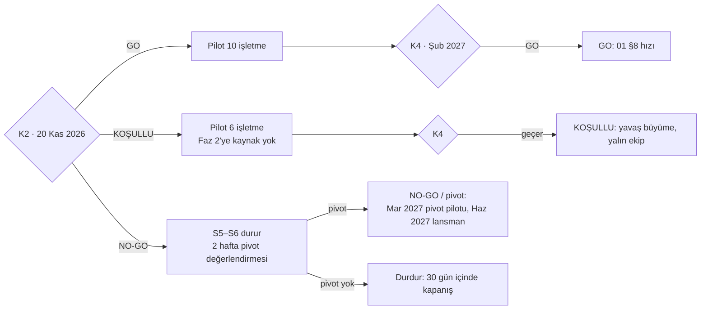

# 11 — Finansal Model ve Finansman

> **Amaç:** Siparişin Önünde'nin önümüzdeki 24 ayda (Ekim 2026 – Eylül 2028) ne kadar para yakacağını, ne zaman başa baş noktasına geleceğini ve bunun için ne kadar, hangi kaynaktan, hangi kilometre taşında sermaye gerektiğini tek, yeniden hesaplanabilir bir modelle göstermek.
> **Kapsam:** Model varsayımları ve kaynakları, K2/K4 kapılarına bağlı üç senaryo, 24 aylık projeksiyon, sermaye ihtiyacı ve başa baş, duyarlılık, birim ekonomi özeti ve Esnaf paketi seçenekleri, finansman yolu ve takvimi, şirket yapısı ve hisse, fiyat revizyon politikası, koruyucu metriklerin izlenmesi.
> **Kapsam dışı:** Fiyat ve paket kararları ([00](00-kararlar-ve-sozluk.md) §8; bu doküman yalnız finansal etkisini gösterir), paket içerikleri ve GTM ([01](01-vizyon-pazar-is-modeli.md)), vergi ve sözleşme hukuku ([08](08-mevzuat-kvkk-odeme-fatura.md)), takvim ve işe alım tetiklerinin tanımı ([09](09-yol-haritasi-ve-sprint-plani.md)), KPI tanımları ([10](10-riskler-operasyon-ve-metrikler.md)).
> **İlgili dokümanlar:** [00 Kararlar ve sözlük](00-kararlar-ve-sozluk.md) (bağlayıcı) · [01 İş modeli](01-vizyon-pazar-is-modeli.md) §6–§8 · [06 Teknik mimari](06-teknik-mimari.md) §17 · [08 Mevzuat](08-mevzuat-kvkk-odeme-fatura.md) §7–§8 · [09 Yol haritası](09-yol-haritasi-ve-sprint-plani.md) §4, §9–§10 · [10 Riskler ve metrikler](10-riskler-operasyon-ve-metrikler.md) §8–§9
> **Model dosyaları:** [finans/model.py](finans/model.py) · [finans/senaryo-go.csv](finans/senaryo-go.csv) · [finans/senaryo-kosullu.csv](finans/senaryo-kosullu.csv) · [finans/senaryo-nogo.csv](finans/senaryo-nogo.csv) · [finans/senaryo-ozet.csv](finans/senaryo-ozet.csv)
> **Tarih:** 2026-09-24 · **Durum:** Taslak (1. sürüm)

**Okuma notları**
- Bu dokümandaki **bütün sayılar `model.py` çıktısıdır**; elle hesaplanmış rakam yoktur. Varsayım değişince tablolar betikten yeniden alınır.
- **[T — kurucu güncellemeli]** (kısaca **[T]**): kaynağı olmayan, makul örnek değerdir. Kurucu kendi rakamıyla değiştirmelidir. **(teyit edilmeli)**: doğrulanmamış genel bilgidir.
- Tutarlar **KDV hariç, nominal TL**'dir. "mn TL" milyon TL, "bin TL" bin TL demektir. Kur başlangıcı **1 USD = 48,4 TL** ([00](00-kararlar-ve-sozluk.md) §8).
- **Ay numarası:** Ay 1 = Ekim 2026, Ay 24 = Eylül 2028. [09](09-yol-haritasi-ve-sprint-plani.md)'daki "Faz 2 = Ay 4–9, Faz 3 = Ay 9–18" numaralandırmasıyla aynıdır.

---

## 1. Amaç, kullanım ve uyarı

**Ne için:** (1) Kurucunun bugün (25 Eylül) şirket türü ve kurucu katkısı kararlarını vermesi, (2) K2 (20 Kasım 2026) ve K4 (29 Ocak / 12 Şubat 2027) kapılarında finansman adımını seçmesi, (3) yatırımcı ve hibe başvurularına sayısal zemin, (4) aylık gerçekleşen–model karşılaştırması (§11).

**Kullanım**

```
# 1) Varsayımı değiştir: docs/finans/model.py başındaki VARSAYIMLAR (ve gerekirse SENARYOLAR) sözlüğü
# 2) Çalıştır (repo kökünden, yalnız Python 3 standart kütüphanesi):
python3 docs/finans/model.py            # CSV'leri yazar + özet tabloları Markdown olarak ekrana basar
python3 docs/finans/model.py --sessiz   # yalnız CSV'leri yazar
# 3) Ekrandaki tabloları bu dokümandaki ilgili bölüme yapıştır; aylık ayrıntı CSV'lerdedir
```

- **VARSAYIMLAR** GO senaryosunun değerlerini tutar; **SENARYOLAR** yalnız farklılaşan anahtarları ezer. Duyarlılık, Esnaf seçenekleri ve fiyat politikası varyantları aynı modelin tek parametreli çalıştırmalarıdır.
- **CSV sütunları (aylık):** aktif/ödeyen/yeni/churn işletme, paket adetleri, MRR, ARPU, gelir kalemleri, COGS kalemleri (altyapı, LLM, SMS, platform WABA, PSP, e-fatura, destek personeli), opex kalemleri (kurucular, Ar-Ge personeli, satış-pazarlama — `opex_bayi_komisyonu` bunun içindedir, bilgi amaçlı ayrıca gösterilir —, genel yönetim, beklenmeyen), EBITDA, yıllık peşin nakit farkı, net nakit akışı, kümülatif nakit, gerekli sermaye alındığında kasa ve nakit pisti, döviz bazlı gider ve oranı, kişi sayısı, kur.
- **Mekanik:** Kohort tabanlı. Her ayın yeni işletmeleri paket × ödeme tipi (aylık/yıllık) × kurucu üye × bayi kanalı kohortlarına ayrılır. 14 günlük deneme nedeniyle ödeme katılımdan sonraki ay başlar. Aylık abonelikte churn her ay, yıllık abonelikte yalnız yenilemede uygulanır. Yıllık peşin tutar nakitte peşin, gelirde 12 aya yayılarak görünür.

> **Uyarı:** Bu bir **tahmindir**, taahhüt veya bütçe onayı değildir. Maaşlar, TÜFE, kur, büyüme hızı ve kanal karması kaynaksız ya da doğrulanmamış varsayımlardır. Model kurumlar vergisini (zarar dönemi), KDV ve 2 No'lu KDV'nin yaklaşık 1 aylık nakit etkisini ([08](08-mevzuat-kvkk-odeme-fatura.md) §8.2), tahsil edilemeyen alacağı, hibe girişlerini ve faiz gelirini içermez. Yatırımcıya sunulmadan önce mali müşavirle gözden geçirilmelidir.

---

## 2. Varsayımlar

Anahtar adı `model.py`'deki sözlük anahtarıdır. Değerler GO senaryosunundur; senaryo farkları §3'te.

### 2.1 Makro ve fiyat

| Varsayım | Anahtar | Değer | Kaynak |
|---|---|---|---|
| Kur başlangıcı | `kur_usd_try` | 48,4 TL/USD | [00](00-kararlar-ve-sozluk.md) §8 (TCMB, 24.09.2026) |
| TL'nin yıllık değer kaybı | `kur_yillik_artis` | %20 | **[T — kurucu güncellemeli]** |
| Yıllık TÜFE | `tufe_yillik` | %25 | **[T — kurucu güncellemeli]** planlama varsayımıdır, enflasyon tahmini değildir. Vekil veri: 2026 yeniden değerleme oranı %25,49 (arastirma/06 §7.6) |
| Maaş artışı | `maas_artisi_ocak` | Her Ocak %25 (Oca 2027, Oca 2028) | **[T]**; Ocak 2027 asgari ücret artışı tutarı teyit edilmeli ([09](09-yol-haritasi-ve-sprint-plani.md) §10.1) |
| TL bazlı diğer giderler | — | TÜFE ile aylık bileşik artar | **[T]** |
| Liste fiyatı (aylık) | `liste_fiyat` | Esnaf 990, Pro 1.790, Zincir 2.990/şube | [00](00-kararlar-ve-sozluk.md) §8 |
| Zincir ortalama şube sayısı | `zincir_ort_sube` | 3 | **[T]** |
| Yıllık peşin indirimi | `yillik_indirim` | %20 | [00](00-kararlar-ve-sozluk.md) §8 |
| Kurucu üye | `kurucu_uye_*` | %30 indirim oranı, 12 ay, ilk 100 ücretli işletme (pilotlar dahil), yalnız aylık ödeme | [00](00-kararlar-ve-sozluk.md) §8; "pilotlar dahil" ve "yıllıkla birleşmez" [01](01-vizyon-pazar-is-modeli.md) §6.4 önerisidir |
| "Biz kuralım" kurulum ücreti | `kurulum_ucreti` | 1.990 TL, ilk 100'e ücretsiz | [00](00-kararlar-ve-sozluk.md) §8 |
| Ücretli kurulumu seçen pay (100. işletmeden sonra) | `kurulum_alan_payi` | %30 | **[T]** |
| TÜFE fiyat güncellemesi | `fiyat_guncelleme_aylari` | Yılda 1, Ocak 2028 (+%25) | [00](00-kararlar-ve-sozluk.md) §8 "yıllık TÜFE endeksli"; ay seçimi **[T]** (§10) |
| Deneme | `deneme_ay` | 14 gün → ödeme ertesi ay başlar | [00](00-kararlar-ve-sozluk.md) §8; modelleme basitleştirmesi |

### 2.2 Pilot, büyüme, churn ve kanal

| Varsayım | Anahtar | Değer | Kaynak |
|---|---|---|---|
| Pilot | `pilot_*` | Aralık 2026'da 10 işletme (3+4+3), 3 ay ücretsiz → Mart 2027'de kurucu üye koşuluyla ücretli | [00](00-kararlar-ve-sozluk.md) §8, §11; [09](09-yol-haritasi-ve-sprint-plani.md) §1.1 |
| Pilot → ücretli dönüşüm | `pilot_donusum` | %80 | **[T]**; K4 eşiği ≥ %60 ([10](10-riskler-operasyon-ve-metrikler.md) §8.7 P9) |
| Pilot paket karması | `pilot_paket` | %30 Esnaf, %70 Pro | **[T]** |
| Ticari lansman | `lansman_ay` | Ay 5 (15 Şubat 2027) | [00](00-kararlar-ve-sozluk.md) §11 |
| Aylık **brüt** yeni ödeyen işletme | `yeni_isletme` | Şub 2027: 12 · Mar–Haz: 25 · Tem: 50 · Ağu: 80 · Eyl: 100 · Eki: 120 · Kas 2027'den: 140 | Hız [01](01-vizyon-pazar-is-modeli.md) §8.3–8.4 (Faz 2'de ayda 20–25, Faz 3'te ~100 net); brüt değerler **[T]**, Ay 9 ≈ 100 ve Ay 18 ≈ 1.000 aktif işletmeye kalibre edildi |
| Paket karması | `paket_karmasi` | Esnaf %35, Pro %60, Zincir %5 (Zincir Temmuz 2027'den) | Karma **[T]**; Zincir zamanı [00](00-kararlar-ve-sozluk.md) §8, [09](09-yol-haritasi-ve-sprint-plani.md) §8.1 F2-15 |
| Yıllık peşin ödeme payı | `yillik_odeme_payi` | Kurucu üye dışındakilerin %25'i | **[T]** |
| Aylık logo churn | `churn_*` | Lansmandan itibaren 12 ay %5, Şubat 2028'den %2,5 | [00](00-kararlar-ve-sozluk.md) §12 (ilk yıl %5–7, sonra < %3) |
| Kanal karması | `kanal_*` | Bayi öncesi: saha %70, referans %10, organik %20 · Bayi sonrası: saha %45, bayi %20, referans %15, organik %20 | Kanallar [01](01-vizyon-pazar-is-modeli.md) §8.5; oranlar **[T]** |
| Bayi kanalı başlangıcı | `bayi_baslangic_ay` | Haziran 2027 | [09](09-yol-haritasi-ve-sprint-plani.md) §8.1 F2-12 |
| Saha satış kapasitesi ve maliyeti | `saha_*` | Kişi başı ayda 20 kapanış; 70.000 TL/ay (maaş, prim, yol) | [01](01-vizyon-pazar-is-modeli.md) §7.3, [09](09-yol-haritasi-ve-sprint-plani.md) §9.2 |
| Bayi komisyonu | `bayi_komisyon` | İlk 12 ay aylık ücretin %30'u | [01](01-vizyon-pazar-is-modeli.md) §7.3 (öneri) |
| Referans | `referans_ucretsiz_ay` | Getiren ve gelen işletmeye 1'er ay ücretsiz (gelir indirimi) | [01](01-vizyon-pazar-is-modeli.md) §7.3 |
| Basılı materyal | `basili_materyal` | 750 TL / yeni işletme | [01](01-vizyon-pazar-is-modeli.md) §7.3 (500–1.000) |
| Organik kanalda reklam | `organik_reklam_cac` | 1.500 TL / organik işletme | **[T]**; hedef < 2.000 ([01](01-vizyon-pazar-is-modeli.md) §7.3) |
| Etkinlik (oda, dernek) | `etkinlik_aylik` | 10.000 TL/ay, lansmandan sonra | **[T]** |
| İkinci şehir açılışı | `ikinci_sehir_*` | Temmuz 2027, 150.000 TL tek seferlik | Zaman [09](09-yol-haritasi-ve-sprint-plani.md) §1.3 F3-02; tutar **[T]** |

### 2.3 Personel (işverene maliyet, Eylül 2026 fiyatıyla)

[09](09-yol-haritasi-ve-sprint-plani.md) §10.1'e göre geliştirici ve kurucu maaşları kaynaklarda yoktur ve **G × M × ay** parametresiyle gösterilir. Aşağıdaki değerler bu parametrenin **örnek doldurmasıdır**.

| Rol | Anahtar | Değer | Zaman / tetik | Kaynak |
|---|---|---|---|---|
| Kurucular (KUR, OPS) | `kurucu_*` | 2 × 75.000 TL/ay | Ay 1'den | **[T — kurucu güncellemeli]**; piyasanın altında tutulmuş kurucu maaşı |
| Geliştiriciler (TL, FE) | `G_gelistirici`, `M_gelistirici_maas` | **G = 2**, **M = 175.000 TL/ay** | Ay 1'den | G [09](09-yol-haritasi-ve-sprint-plani.md) §9.1; M **[T — kurucu güncellemeli]** (orta-kıdemli geliştirici) |
| 3. geliştirici (mobil) | `gelistirici3_ay` | M | Ocak 2027 (H14) | [09](09-yol-haritasi-ve-sprint-plani.md) §9.2 |
| Destek/onboarding uzmanı | `destek_*` | 60.000 TL/ay; uzman başına 150 işletme, Şubat 2028'den 250 | Lansmandan itibaren en az 1 | Maaş ve 150 [09](09-yol-haritasi-ve-sprint-plani.md) §9.2, [01](01-vizyon-pazar-is-modeli.md) §7.1 (150–300); 250 **[T]** (self-servis + bayi 1. seviye destek) |
| Saha satış | `saha_*` | 70.000 TL/ay | Kapasiteden türetilir: ⌈saha kanalı yeni işletme / 20⌉ | [09](09-yol-haritasi-ve-sprint-plani.md) §9.2 |
| İçerik (yarı zamanlı) | `icerik_*` | 30.000 TL/ay | Mart 2027 | Zaman [09](09-yol-haritasi-ve-sprint-plani.md) §9.2; tutar **[T]** |
| Bayi/partner yöneticisi | `bayi_yon_*` | 90.000 TL/ay | Haziran 2027 | Zaman [09](09-yol-haritasi-ve-sprint-plani.md) §9.2; tutar **[T]** |
| SRE (yarı zamanlı) | `sre_*` | 75.000 TL/ay | 300+ aktif işletme | Tetik [09](09-yol-haritasi-ve-sprint-plani.md) §9.2; tutar **[T]** |

### 2.4 COGS ve genel yönetim

| Kalem | Anahtar | Değer | Kaynak |
|---|---|---|---|
| Altyapı (LLM, SMS, WABA hariç) | `altyapi_usd_egri` | Aktif işletmeye göre parça parça doğrusal: 0 → $60, 30 → $150, 100 → $650, 300 → $1.300, 1.000 → $2.750/ay; üstünde işletme başı $2,2 | [06](06-teknik-mimari.md) §17 ve [01](01-vizyon-pazar-is-modeli.md) §7.1 aralıklarının orta noktaları; yurt içi teklif yukarı yönlü değiştirebilir |
| Altyapının yurt dışı faturalı payı | `altyapi_yurtdisi_payi` | %40 (Cloudflare, Sentry vb.) | **[T]**; yalnız koruyucu metrik için |
| LLM (AI sipariş) | `llm_*` | Pro ve Zincir şubesi başına $2,3/ay, Mayıs 2027'den | [06](06-teknik-mimari.md) §17 ($1,35–3,24); zaman [09](09-yol-haritasi-ve-sprint-plani.md) §8.1 F2-09; kapsam [00](00-kararlar-ve-sozluk.md) §13.8 varsayılanı |
| SMS | `sms_*` | Kota (Esnaf 100, Pro 300, Zincir şube başı 300) × %20 kullanım × 0,30 TL | Kota [00](00-kararlar-ve-sozluk.md) §4; birim fiyat [01](01-vizyon-pazar-is-modeli.md) §7.1 (0,16–0,43); kullanım **[T]** ([06](06-teknik-mimari.md) §17'deki tipik değerden yüksek, temkinli) |
| Platform WABA uyarıları | `waba_usd_isletme` | $0,04 / işletme / ay | [06](06-teknik-mimari.md) §17 |
| Meta mesaj ücretleri | — | 0 (işletme öder) | [00](00-kararlar-ve-sozluk.md) §6.6 |
| PSP komisyonu | `psp_oran`, `kart_payi_*` | %2,5; aylıkta kartla %100, yıllıkta %50 | Oran [01](01-vizyon-pazar-is-modeli.md) §7.1; kart payı **[T]** |
| e-Fatura (Paraşüt) | `efatura_*` | 1.500 TL/ay, Ocak 2027'den | **[T]** (teklif) |
| Yazılım araçları | `arac_usd_kisi` | Kişi başı $80/ay (yurt dışı) | **[T]** |
| Mali müşavir · sürekli hukuk | `mali_musavir`, `hukuk_surekli` | 8.000 TL/ay · lansmandan sonra 15.000 TL/ay | **[T]** (teklif) |
| Avukat uyum paketi | `hukuk_uyum_*` | 150.000 TL, Ekim–Aralık 2026'ya bölünmüş | **[T]** (teklif; kapsam [08](08-mevzuat-kvkk-odeme-fatura.md) §7.4) |
| Kuruluş · marka tescili · tasarım | `sirket_kurulus`, `marka_tescil`, `tasarim` | 20.000 · 30.000 · 40.000 TL (Ay 1) | **[T]** (teklif; [09](09-yol-haritasi-ve-sprint-plani.md) §10.2 #1, #4, #5) |
| Harici pentest | `pentest*` | 250.000 TL, Ocak 2027 ve yıllık tekrar | **[T]** (teklif; [06](06-teknik-mimari.md) §15.8) |
| Pilot tabletleri · D5 reklamı · D3 basılı | `pilot_tablet`, `d5_reklam`, `d3_basili` | 37.500 · 20.000 · 6.000 TL | **[T]**; D3 + pilot basılı toplamı [09](09-yol-haritasi-ve-sprint-plani.md) §10.2 #12 bandında |
| Kurucu saha ve yol (Faz 0–1) | `kurucu_saha_yol` | 10.000 TL/ay, Ocak 2027'ye kadar | **[T]** |
| Beklenmeyen gider | `beklenmeyen_orani` | Personel dışı opex'in %10'u | [09](09-yol-haritasi-ve-sprint-plani.md) §10.2 #19 (%10–15) |
| Sermaye kuralı | `tampon`, `pist_ay` | %20 tampon + 9 ay pist | [00](00-kararlar-ve-sozluk.md) §12 (pist ≥ 9 ay); tampon eleştiri önerisi |

---

## 3. Senaryolar

Senaryolar Hafta 8 talep kapısına (**K2**, 20 Kasım 2026; eşikler [10](10-riskler-operasyon-ve-metrikler.md) §4.5) ve ticari lansman kapısına (**K4**, 29 Ocak / 12 Şubat 2027; [09](09-yol-haritasi-ve-sprint-plani.md) §7.7) bağlıdır.



| Parametre | NO-GO / pivot | KOŞULLU | GO |
|---|---|---|---|
| K2 sonucu ve plan etkisi ([09](09-yol-haritasi-ve-sprint-plani.md) §4.7) | Hafta 8'de ağır geliştirme (S5–S6) durur; 2 hafta pivot değerlendirmesi; ekip korunur, işe alım yok | Pilot yalnız eşiği karşılayan segmentle; Faz 2'ye kaynak ayrılmaz; K4 geçer | Plan aynen sürer |
| Pilot | Mart 2027, 5 işletme, dönüşüm %60 | Aralık 2026, 6 işletme, dönüşüm %60 | Aralık 2026, 10 işletme, dönüşüm %80 |
| Ticari lansman | Haziran 2027 (Ay 9) | Şubat 2027 (Ay 5) | Şubat 2027 (Ay 5) |
| Aylık brüt yeni işletme | 4 → 8 → 12 → 15 | 6 → 10 → 20 → 35 → 45 | 12 → 25 → 50–120 → 140 |
| Paket karması (Esnaf/Pro/Zincir) | 40 / 60 / 0 | 45 / 52 / 3 (Zincir Ekim 2027'den) | 35 / 60 / 5 (Zincir Temmuz 2027'den) |
| Yıllık peşin payı | %15 | %20 | %25 |
| Churn (ilk yıl → sonra) | %7 → %4 | %6 → %3 | %5 → %2,5 |
| Bayi kanalı | Yok | Eylül 2027'den (%15) | Haziran 2027'den (%20) |
| 3. geliştirici · bayi yöneticisi · ikinci şehir | Yok · yok · yok | Yok · yok · yok (yalın ekip) | Oca 2027 · Haz 2027 · Tem 2027 |
| AI sipariş (LLM maliyeti) | Eylül 2027 | Temmuz 2027 | Mayıs 2027 |

---

## 4. 24 aylık projeksiyon (çeyreklik özet)

Aylık ayrıntı CSV'lerdedir. Tutarlar **bin TL**. "Aktif" = ödeyen + pilot + deneme; parantez içi ödeyen işletme. MRR, [10](10-riskler-operasyon-ve-metrikler.md) §8.3 tanımıyla (indirimler düşülmüş, yıllık/12). Marj −%100'ün altındaysa gösterilmez.

### 4.1 GO

| Çeyrek | Dönem sonu aktif (ödeyen) | Dönem sonu MRR | Gelir | COGS | Brüt kâr (marj) | Opex | EBITDA | Kümülatif nakit (dönem sonu) |
|---|---|---|---|---|---|---|---|---|
| 2026 Ç4 | 10 (0) | 0 | 0 | 11 | −11 | 1.955 | −1.965 | −1.965 |
| 2027 Ç1 | 45 (20) | 21 | 19 | 181 | −162 | 3.258 | −3.420 | −5.385 |
| 2027 Ç2 | 113 (88) | 93 | 206 | 349 | −144 (%−70) | 3.353 | −3.497 | −8.882 |
| 2027 Ç3 | 327 (227) | 338 | 718 | 822 | −104 (%−14) | 4.531 | −4.635 | −12.947 |
| 2027 Ç4 | 688 (548) | 915 | 2.147 | 1.656 | 490 (%23) | 5.317 | −4.826 | −16.576 |
| 2028 Ç1 | 1.060 (920) | 1.928 | 4.973 | 2.488 | 2.485 (%50) | 7.130 | −4.644 | −19.826 |
| 2028 Ç2 | 1.422 (1.282) | 2.754 | 7.466 | 3.163 | 4.303 (%58) | 7.005 | −2.702 | −21.721 |
| 2028 Ç3 | 1.752 (1.612) | 3.501 | 9.790 | 3.945 | 5.845 (%60) | 7.221 | −1.376 | −22.327 |

### 4.2 KOŞULLU

| Çeyrek | Dönem sonu aktif (ödeyen) | Dönem sonu MRR | Gelir | COGS | Brüt kâr (marj) | Opex | EBITDA | Kümülatif nakit (dönem sonu) |
|---|---|---|---|---|---|---|---|---|
| 2026 Ç4 | 6 (0) | 0 | 0 | 10 | −10 | 1.951 | −1.961 | −1.961 |
| 2027 Ç1 | 20 (10) | 10 | 9 | 171 | −162 | 2.522 | −2.684 | −4.645 |
| 2027 Ç2 | 46 (36) | 36 | 77 | 268 | −190 | 2.386 | −2.576 | −7.221 |
| 2027 Ç3 | 98 (78) | 77 | 178 | 344 | −165 (%−93) | 2.479 | −2.645 | −9.866 |
| 2027 Ç4 | 186 (151) | 193 | 456 | 589 | −133 (%−29) | 2.655 | −2.788 | −12.441 |
| 2028 Ç1 | 273 (238) | 416 | 1.080 | 881 | 199 (%18) | 3.638 | −3.439 | −15.596 |
| 2028 Ç2 | 387 (342) | 634 | 1.691 | 1.001 | 690 (%41) | 4.078 | −3.388 | −18.735 |
| 2028 Ç3 | 495 (450) | 863 | 2.377 | 1.213 | 1.164 (%49) | 4.146 | −2.982 | −21.562 |

### 4.3 NO-GO / pivot

| Çeyrek | Dönem sonu aktif (ödeyen) | Dönem sonu MRR | Gelir | COGS | Brüt kâr (marj) | Opex | EBITDA | Kümülatif nakit (dönem sonu) |
|---|---|---|---|---|---|---|---|---|
| 2026 Ç4 | 0 (0) | 0 | 0 | 9 | −9 | 1.905 | −1.914 | −1.914 |
| 2027 Ç1 | 5 (0) | 0 | 0 | 10 | −10 | 2.039 | −2.049 | −3.963 |
| 2027 Ç2 | 7 (3) | 3 | 3 | 91 | −88 | 2.422 | −2.510 | −6.473 |
| 2027 Ç3 | 29 (21) | 22 | 40 | 256 | −217 | 2.391 | −2.608 | −9.081 |
| 2027 Ç4 | 59 (47) | 49 | 110 | 300 | −190 | 2.543 | −2.733 | −11.814 |
| 2028 Ç1 | 84 (72) | 92 | 240 | 406 | −166 (%−69) | 3.121 | −3.287 | −15.101 |
| 2028 Ç2 | 115 (100) | 145 | 389 | 460 | −71 (%−18) | 3.544 | −3.615 | −18.640 |
| 2028 Ç3 | 147 (132) | 211 | 585 | 507 | 78 (%13) | 3.171 | −3.093 | −21.655 |

### 4.4 Kontrol noktaları ve okuma

| Senaryo | Aktif işletme Ay 9 / 18 / 24 | Kişi sayısı Ay 24 | ARPU Ay 24 | Aylık gider Ay 24 | Brüt marj Ay 24 | Ay 36 (uzatma): aktif, EBITDA/ay |
|---|---|---|---|---|---|---|
| NO-GO / pivot | 7 / 84 / 147 | 6,5 | 1.599 TL | 1,2 mn TL | %20 | 246; −1,1 mn TL |
| KOŞULLU | 46 / 273 / 495 | 10,0 | 1.918 TL | 1,9 mn TL | %45 | 832; −0,7 mn TL |
| GO | 113 / 1.060 / 1.752 | 19,0 | 2.172 TL | 3,8 mn TL | %60 | 2.847; 1,5 mn TL |

- **GO**, [01](01-vizyon-pazar-is-modeli.md) §8 hedefleriyle uyumludur (Ay 9 ≈ 100, Ay 18 ≈ 1.000). Aylık gider ilk 4 ayda ~0,6–1,2 mn TL'dir; kurucu + 2 geliştirici maaşı bunun büyük kısmıdır.
- **Brüt marj Ay 24'te %60'ta kalır**, [00](00-kararlar-ve-sozluk.md) §12'deki "1.000 işletmede karma ≥ %70" hedefinin altındadır. Neden: maaşlar (destek) ve kur her yıl artar, liste fiyatı ise ilk kez Ocak 2028'de güncellenir. Bugünün fiyatlarıyla 1.000 işletme ölçeğinde Pro %69, Esnaf %59 marj verir (§7). Kaldıraçlar: fiyat güncelleme zamanı (§10), uzman başına ≥ 300 işletme, LLM kotası.
- **Ocak ayları** her yıl bir sıçrama yaratır: maaş artışı + yıllık pentest + fiyat güncellemesi aynı aya düşer. Başa baş ayları bu yüzden Ocak–Şubat çevresinde toplanır.

---

## 5. Sermaye ihtiyacı ve başa baş

**Kural (her ay sağlanır):** kasa ≥ o güne kadarki açığın %20'si + 9 × son 3 ayın ortalama net nakit çıkışı. Buna göre:

> **Gerekli başlangıç sermayesi = max(ay) [ 1,2 × açık(ay) + 9 × yakım₃(ay) ]**
> açık = max(0, −kümülatif nakit); yakım₃ = son 3 ayın ortalama net nakit çıkışı. Böylece hem %20 tampon hem 9 ay pist ([00](00-kararlar-ve-sozluk.md) §12) her ay korunur. Açık yalnız Ay 1–24 için hesaplanır; Ay 24'te hâlâ yakım varsa 9 aylık pist sonrası dönemi de karşılar.
> **Başa baş:** EBITDA ≥ 0. "Kalıcı" = o aydan sonra negatife dönmeyen ilk ay. 24 ayda oluşmayanlar için model aynı kurallarla **36 aya uzatılır** (Ay 25–36'da son büyüme hızı sürer, Ocak 2029'da fiyat ve maaş güncellenir).

| Senaryo | En düşük kümülatif nakit, Ay 1–24 (ay) | Açık + %20 tampon | Gerekli başlangıç sermayesi (tampon + 9 ay pist) | Bağlayan ay | İlk EBITDA ≥ 0 | Kalıcı başa baş (EBITDA ≥ 0) | En düşük kümülatif nakit, 36 aylık uzatma | Ay 24 aktif işletme | Ay 24 MRR | Ay 24 ARR |
|---|---|---|---|---|---|---|---|---|---|---|
| NO-GO / pivot | −21,7 mn TL (Eyl 2028) | 26,0 mn TL | **35,0 mn TL** | Eyl 2028 | 36 ayda yok | **36 ayda yok** | −34,8 mn TL (Eyl 2029) | 147 | 211 bin TL | 2,5 mn TL |
| KOŞULLU | −21,6 mn TL (Eyl 2028) | 25,9 mn TL | **34,4 mn TL** | Eyl 2028 | 36 ayda yok | **36 ayda yok** | −31,0 mn TL (Eyl 2029) | 495 | 863 bin TL | 10,4 mn TL |
| GO | −22,3 mn TL (Ağu 2028) | 26,8 mn TL | **33,5 mn TL** | Mar 2028 | Ay 27 (Ara 2028) | **Ay 29 (Şub 2029)** | −22,3 mn TL (Ağu 2028) | 1.752 | 3.501 bin TL | 42,0 mn TL |

Gerekli sermayenin 48,4 kurla USD karşılığı: NO-GO / pivot ≈ 724 bin USD; KOŞULLU ≈ 710 bin USD; GO ≈ 693 bin USD.

**NO-GO için gerçekçi tutarlar:**
- **Durdur kolu** (NO-GO + desteklenen pivot yok, Ay 3 sonunda kapanış): Ay 1–3 kümülatif nakit −1,9 mn TL + kapanış gideri ≈ 0,6 mn TL (1 ay maaş/ihbar + 50.000 TL tasfiye [T]) → **toplam ≈ 2,5 mn TL**.
- **Pivot doğrulama dilimi** (pivot pilotunun sonucuna, Ay 8 = Mayıs 2027 sonuna kadar): kümülatif nakit −5,6 mn TL; %20 tampon + kapanış gideriyle **≈ 7,4 mn TL**.

**Okuma**
1. **Üç senaryonun sermaye ihtiyacı birbirine yakındır (33,5–35,0 mn TL), ama nedeni farklıdır.** GO'da para büyümeye gider ve geri döner (36 ayda kümülatif nakit Ağustos 2028'de dibi görür). KOŞULLU ve NO-GO'da para sabit ekibi taşır ve geri dönmez: iki senaryoda da 36 ayın sonunda EBITDA hâlâ negatiftir.
2. **GO'da nakit başa başı EBITDA başa başından önce gelir.** Yıllık peşin tahsilatlar sayesinde kümülatif nakit Ağustos 2028'de dibi görür; EBITDA ise ilk kez Aralık 2028'de, kalıcı olarak Şubat 2029'da pozitife döner.
3. **KOŞULLU senaryo mevcut maliyet yapısıyla finanse edilmemelidir.** 36 ayda başa baş yoktur. Ancak §10'daki önlem paketiyle (lansman öncesi fiyat güncellemesi + Teknokent + Esnaf self-servis) Ay 36'da başa başa gelir ve sermaye ihtiyacı 27,0 mn TL'ye iner. K2 KOŞULLU çıkarsa bu paket ve işe alım dondurma aynı hafta kararlaştırılır.
4. **NO-GO'da 24 aylık rakam (35,0 mn TL) bir finansman hedefi değil, bir uyarıdır.** Doğru kurgu dilimlidir: pivot için en fazla ≈ 7,4 mn TL ayrılır, Ay 8'de pivot pilotu yeni bir K2 kapısından geçmezse durdurulur.

### 5.1 Kilometre taşlarında kümülatif ihtiyaç

"O tarihe kadar gereken" aynı kuralla (tampon + 9 ay pist) yalnız o aya kadarki dönem için hesaplanır. Finansman dilimlerinin (§8) büyüklüğü buradan okunur.

| Kilometre taşı | Ay | GO: kümülatif nakit | GO: gereken sermaye (o tarihe kadar) | KOŞULLU: kümülatif nakit | KOŞULLU: gereken sermaye |
|---|---|---|---|---|---|
| K2 go/no-go | Ay 2 (Kas 2026) | −1,3 mn TL | 7,5 mn TL | −1,3 mn TL | 7,5 mn TL |
| Pilot başlar | Ay 3 (Ara 2026) | −2,0 mn TL | 8,3 mn TL | −2,0 mn TL | 8,2 mn TL |
| K4 + ticari lansman | Ay 5 (Şub 2027) | −4,2 mn TL | 13,8 mn TL | −3,8 mn TL | 11,9 mn TL |
| ≈100 işletme (Faz 2 sonu) | Ay 9 (Haz 2027) | −8,9 mn TL | 21,1 mn TL | −7,2 mn TL | 16,4 mn TL |
| Faz 3 ilk çeyreği | Ay 12 (Eyl 2027) | −12,9 mn TL | 27,7 mn TL | −9,9 mn TL | 19,8 mn TL |
| ≈1.000 işletme hedefi | Ay 18 (Mar 2028) | −19,8 mn TL | 33,5 mn TL | −15,6 mn TL | 28,2 mn TL |
| Model sonu | Ay 24 (Eyl 2028) | −22,3 mn TL | 33,5 mn TL | −21,6 mn TL | 34,4 mn TL |

**Önemli sonuç:** 9 ay pist kuralı Ay 1'den uygulanırsa K2'den önce kasada **7,5 mn TL** bulunmalıdır, çünkü ilk aylarda yakım ~0,6–0,7 mn TL/ay'dır. Kurucu bu tutarı karşılayamıyorsa önerilen istisna şudur: K2'ye kadar yalnız "durdur" tutarı (≈ 2,5 mn TL) kasada tutulur, pist kuralı K2 GO kararından itibaren uygulanır. Bu bir karar gerektirir (§12).

---

## 6. Duyarlılık

Her satır tek bir değişkeni değiştirir, diğer varsayımlar bazdadır. Churn ±2 puan her iki döneme uygulanır (taban %1). CAC ±%30 tüm satış-pazarlama giderlerini ölçekler: saha, içerik ve bayi yöneticisi maaşları, basılı materyal, reklam, bayi komisyonu, etkinlik ve ikinci şehir. Kur ±%20 tüm döviz bazlı maliyetlere (altyapı, LLM, araçlar, platform WABA) seviye şokudur. Fiyat ±%15 tüm liste fiyatlarına uygulanır.

| Değişken | GO: en büyük açık | GO: gerekli sermaye | GO: başa baş ilk / kalıcı | KOŞULLU: en büyük açık | KOŞULLU: gerekli sermaye | KOŞULLU: başa baş ilk / kalıcı |
|---|---|---|---|---|---|---|
| Baz | 22,3 mn TL | 33,5 mn TL | Ay 27 / Ay 29 | 21,6 mn TL | 34,4 mn TL | yok / yok |
| Churn +2 puan | 23,2 mn TL | 33,9 mn TL | Ay 29 / Ay 29 | 21,6 mn TL | 34,5 mn TL | yok / yok |
| Churn −2 puan | 21,6 mn TL | 33,8 mn TL | Ay 25 / Ay 25 | 21,3 mn TL | 33,8 mn TL | yok / yok |
| CAC +%30 | 26,5 mn TL | 38,9 mn TL | Ay 29 / Ay 29 | 22,9 mn TL | 37,1 mn TL | yok / yok |
| CAC −%30 | 18,6 mn TL | 29,1 mn TL | Ay 24 / Ay 24 | 20,2 mn TL | 31,6 mn TL | yok / yok |
| Kur +%20 (döviz bazlı maliyetler) | 23,5 mn TL | 34,8 mn TL | Ay 29 / Ay 29 | 22,0 mn TL | 35,3 mn TL | yok / yok |
| Kur −%20 | 21,3 mn TL | 32,5 mn TL | Ay 26 / Ay 26 | 21,1 mn TL | 33,4 mn TL | yok / yok |
| Fiyat +%15 | 19,0 mn TL | 30,4 mn TL | Ay 24 / Ay 24 | 20,6 mn TL | 32,1 mn TL | yok / yok |
| Fiyat −%15 | 26,5 mn TL | 38,7 mn TL | Ay 32 / Ay 32 | 22,5 mn TL | 36,6 mn TL | yok / yok |
| Yeni işletme hızı +%30 | 20,5 mn TL | 33,2 mn TL | Ay 24 / Ay 24 | 21,3 mn TL | 33,0 mn TL | yok / yok |
| Yeni işletme hızı −%30 | 25,1 mn TL | 36,6 mn TL | Ay 32 / Ay 32 | 21,3 mn TL | 33,9 mn TL | yok / yok |

**Okuma**
- **En güçlü kaldıraçlar CAC ve fiyattır.** GO'da ±%30 CAC sermaye ihtiyacını 29,1–38,9 mn TL, ±%15 fiyat 30,4–38,7 mn TL aralığında oynatır. Fiyat politikası (§10) ve kanal karması (§7) bu yüzden birinci öncelikli kararlardır.
- **Kurun etkisi sınırlıdır** (±1–1,3 mn TL). Meta ücretinin pass-through olması ve barındırmanın yurt içinde olması döviz riskini zaten azaltır.
- **Churn 24 ayda sermayeyi az, başa başı çok etkiler** (GO'da Ay 25 ile Ay 29 arası). Etkisi ancak kohortlar biriktikçe büyür.
- **Monoton olmayan küçük farklar** (ör. GO'da churn −2 puan sermayeyi 0,3 mn TL artırır; KOŞULLU'da hız ±%30'un ikisi de açığı azaltır) tam sayı işe alım basamaklarından kaynaklanır. Daha çok işletme, destek ya da saha kadrosunu bir ay erken büyütür ve pist kuralının bağlandığı ayda yakımı artırır. "En büyük açık" sütunu bu etkiden arındırılmış yönü gösterir.

---

## 7. Birim ekonomi özeti

[01](01-vizyon-pazar-is-modeli.md) §7 ile aynı kalemler ve aynı yöntem kullanılır, ancak modelin **nokta** varsayımlarıyla hesaplanır. Fiyatlar bugünkü seviyededir, enflasyon uygulanmaz. Faz 2 (AI dahil). Destek uzmanı başına 100 işletme ölçeğinde 150, 1.000 işletme ölçeğinde 250 işletme alınır.

| Paket | Ölçek | ARPU liste / kurucu üye / yıllık (TL/ay) | COGS (liste) | Brüt marj liste / kurucu / yıllık |
|---|---|---|---|---|
| Esnaf | 100 işletme | 990 / 693 / 792 | 762 (altyapı 315, destek 400, LLM 0, SMS 6) | %23 / %−9 / %6 |
| Pro | 100 işletme | 1.790 / 1.253 / 1.432 | 906 (altyapı 315, destek 400, LLM 111, SMS 18) | %49 / %29 / %39 |
| Zincir (3 şube) | 100 işletme | 8.970 / 6.279 / 7.176 | 2.144 (altyapı 315, destek 1.200, LLM 334, SMS 54) | %76 / %67 / %72 |
| Esnaf | 1000 işletme | 990 / 693 / 792 | 407 (altyapı 133, destek 240, LLM 0, SMS 6) | %59 / %42 / %50 |
| Pro | 1000 işletme | 1.790 / 1.253 / 1.432 | 551 (altyapı 133, destek 240, LLM 111, SMS 18) | %69 / %57 / %63 |
| Zincir (3 şube) | 1000 işletme | 8.970 / 6.279 / 7.176 | 1.469 (altyapı 133, destek 720, LLM 334, SMS 54) | %84 / %78 / %81 |

Modelin ima ettiği karma CAC (lansmandan Ay 24'e; satış-pazarlama + referans indirimi / yeni ödeyen): **GO 7.310 TL nominal = 5.415 TL (2026 fiyatlarıyla)**; KOŞULLU 8.008 TL nominal = 5.949 TL (2026 fiyatlarıyla).

| Paket (1.000 işletme ölçeği, liste fiyatı) | CAC | Aylık brüt kâr | Geri ödeme | LTV (churn %5) | LTV/CAC | LTV (churn %2,5) | LTV/CAC |
|---|---|---|---|---|---|---|---|
| Esnaf | 2.800 | 583 | 4,8 ay | 11.654 | 4,2× | 23.309 | 8,3× |
| Pro | 4.000 | 1.239 | 3,2 ay | 24.788 | 6,2× | 49.576 | 12,4× |
| Zincir | 4.000 | 7.501 | 0,5 ay | 150.025 | 37,5× | 300.050 | 75,0× |
| Pro (GO model CAC'ı, 2026 TL) | 5.415 | 1.239 | 4,4 ay | 24.788 | 4,6× | 49.576 | 9,2× |

4 aylık geri ödeme için CAC tavanı (1.000 işletme ölçeği, modelin brüt marjıyla): Esnaf liste 2.331 TL, kurucu üye 1.173 TL; Pro liste 4.958 TL, kurucu üye 2.863 TL; Zincir liste 30.005 TL, kurucu üye 19.510 TL.

**01 ile tutarlılık ve farklar**
- Marjlar [01](01-vizyon-pazar-is-modeli.md) §7.2 aralıklarının içindedir: Esnaf %59 (01: %29–67), Pro %69 (01: %46–77). 100 işletme ölçeğinde altyapı ve destek payı yaklaşık iki kattır ([01](01-vizyon-pazar-is-modeli.md) §7.1 ölçek notu). **Kurucu üye Esnaf bu ölçekte zarar eder (%−9).**
- 01 geri ödemeyi %70 hedef marjla hesaplar. Burada modelin marjı kullanılır. Pro'da sonuç aynıdır (3,2 ay). Esnaf'ta modelin marjıyla 4 aylık geri ödeme için CAC tavanı 2.331 TL'dir; [00](00-kararlar-ve-sozluk.md) §12'deki ~2.800 TL tavanı 4,8 ay verir.
- **Model CAC'ı hedefin üstündedir: 2026 fiyatlarıyla 5.415 TL, [00](00-kararlar-ve-sozluk.md) §12 hedefi ≤ 4.000 TL.** Nedenleri: [01](01-vizyon-pazar-is-modeli.md) §7.3'teki kanal maliyetleri (saha ~5.000, bayi ~3.600–6.400, referans iki aylık ücret) zaten 4.000'in üstündedir; buna içerik, bayi yöneticisi, etkinlik ve ikinci şehir gibi sabit satış-pazarlama giderleri eklenir. Hedefe inmek için organik ve referans payı artırılmalı, bayi komisyonu 12 aydan kısa tutulmalıdır (§12).

### 7.1 Esnaf paketinin marj sorunu: seçeneklerin finansal etkisi ([00](00-kararlar-ve-sozluk.md) §13.11)

GO senaryosunda tek değişkenli çalıştırmalardır. Talep kaybı oranları **[T]**'dir ve D5/Van Westendorp verisiyle ([10](10-riskler-operasyon-ve-metrikler.md) §4.6) güncellenmelidir. B+ seçeneği 00'daki listede yoktur; [01](01-vizyon-pazar-is-modeli.md) §7.2'deki "Esnaf self-servis ağırlıklı" önerisinin sayısallaştırılmış halidir.

| Seçenek | Esnaf brüt marjı (1.000 işl.; liste/yıllık) | Esnaf brüt marjı (100 işl.) | GO gerekli sermaye | Kalıcı başa baş | Ay 24 MRR | Ay 24 aktif |
|---|---|---|---|---|---|---|
| Baz: düşük marjı kabul (giriş paketi) | %59 | %23 | 33,5 mn TL | Ay 29 (Şub 2029) | 3.501 bin TL | 1.752 |
| A: Esnaf fiyatı 1.190 TL (+%20), Esnaf talebi −%10 [T] | %65 | %36 | 32,7 mn TL | Ay 29 (Şub 2029) | 3.555 bin TL | 1.690 |
| B: Esnaf SMS kotası 100 → 50 | %59 | %23 | 33,5 mn TL | Ay 29 (Şub 2029) | 3.501 bin TL | 1.752 |
| B+: B + Esnaf self-servis destek (destek yükü ×0,5) [T] | %71 | %44 | 32,4 mn TL | Ay 26 (Kas 2028) | 3.501 bin TL | 1.752 |
| C: Esnaf yalnız yıllık peşin (9.504 TL), Esnaf talebi −%25 [T] | %50 | %6 | 29,6 mn TL | Ay 29 (Şub 2029) | 3.292 bin TL | 1.640 |

- **B (SMS kotasını düşürmek) marjı değiştirmez.** SMS maliyeti Esnaf'ta ~6 TL/ay'dır. Asıl kaldıraç **destek yüküdür** (B+): marj %59'dan %71'e çıkar, başa baş 3 ay öne gelir.
- **A** marjı artırır ama sermayeye etkisi sınırlıdır, çünkü Esnaf talebi düşer.
- **C** marjı düşürür (yıllık fiyat 792 TL/ay), ama sermaye ihtiyacını en çok o azaltır: peşin nakit gelir ve daha az Esnaf edinmek için daha az satış-pazarlama harcanır. Bu da Esnaf'ın bugünkü kanal maliyetiyle edinildiğinde kısa vadede nakit tükettiğini gösterir.
- **Öneri:** Varsayılan B+ olsun (self-servis kurulum, video rehber, panel içi yardım; "biz kuralım" Esnaf'ta ücretli). Karar K4'te §10.3 ölçütleriyle verilsin.

---

## 8. Finansman yolu ve takvimi

### 8.1 Kaynaklar

Tutar aralıkları ve süreç ayrıntıları çağrıya ve yıla göre değişir. Bu tablo genel bilgidir, **her satır başvurudan önce resmi çağrı metninden teyit edilmelidir.** Uydurma kesin rakam verilmez.

| Kaynak | Nitelik | Tipik tutar | Süreç | Dikkat | Ne zaman |
|---|---|---|---|---|---|
| **Kurucu sermayesi** | Özkaynak | Asgari sermaye: Ltd 50.000 TL (tescilden sonra 24 ay içinde ödenebilir), AŞ 250.000 TL (en az 1/4'ü tescilden önce) ([08](08-mevzuat-kvkk-odeme-fatura.md) §7.1, arastirma/03 §7.1). Asıl ihtiyaç: durdur tutarı ≈ 2,5 mn TL | Tescil H2 (9 Ekim 2026) | Kurucu maaşı düşük tutulursa ihtiyaç azalır (modelde 2 × 75.000 TL [T]) | H0 |
| **TÜBİTAK BiGG (1812)** | Hibe, erken aşama teknoloji girişimi | Üst sınır ve kapsam çağrıya göre (teyit edilmeli) | Uygulayıcı kuruluş (teknopark, TTO, kuluçka merkezi) üzerinden başvuru → iş planı değerlendirmesi → sunum. Ödeme çoğunlukla harcama belgelendikçe yapılır; nakit önce şirketten çıkar (teyit edilmeli) | Başvuru sahibinin şirket kurmuş olup olmaması ve kuruluş tarihiyle ilgili koşullar çağrıya göre değişir (teyit edilmeli). **Şirket tescilinden (9 Ekim) önce uygunluk kontrol edilmeli** | H0–H2 kontrol; açık çağrıya göre başvuru |
| **TÜBİTAK 1507 (KOBİ Ar-Ge Başlangıç)** | Hibe, şirketin Ar-Ge projesi | Çağrıya göre (teyit edilmeli) | Proje önerisi → hakem değerlendirmesi; sonuç birkaç ay sürebilir (teyit edilmeli) | Ar-Ge içeriği gösterilmeli: AI sipariş (F2-09), "sipariş kaçmaz" olay altyapısı | K2 GO sonrası (Ara 2026 – Oca 2027) |
| **KOSGEB** | Hibe ve geri ödemeli destek karışımı | Program ve yıla göre (teyit edilmeli) | KOSGEB kaydı; girişimcilik programlarında Uygulamalı Girişimcilik Eğitimi sertifikası ön koşul olabilir (teyit edilmeli) | Aynı gider için birden çok kamu desteği alınamayabilir (teyit edilmeli) | Faz 0'da eğitim ve kayıt; K2 sonrası başvuru |
| **Teknokent (4691)** | Vergi ve SGK teşviki (nakit değil, gider azaltımı), olası KDV istisnası | Model: sermaye ihtiyacı GO 33,5 → 30,4 mn TL; KOŞULLU 34,4 → 31,6 mn TL (§10.2; Ar-Ge personeli −%20 [T], kira 20.000 TL/ay [T]) | Proje başvurusu → bölge yönetimi değerlendirmesi → bölgede ofis (süre teyit edilmeli) | Ar-Ge personelinin bölgede çalışma koşulu ve uzaktan çalışma sınırı (teyit edilmeli); kurumlar vergisi istisnası 31.12.2028'e kadar, ama zarar döneminde etkisi yok; KDV geçici m.20'nin SaaS'a uygulanması (teyit edilmeli, [08](08-mevzuat-kvkk-odeme-fatura.md) §8.5) | Başvuru H4–H8; hedef Ocak 2027 |
| **Melek / pre-seed** | Özkaynak | Piyasa koşuluna bağlı; bu doküman değerleme varsaymaz | Görüşme → niyet mektubu / term sheet → inceleme (due diligence) → AŞ'ye tür değiştirme → kapanış; birkaç ay (teyit edilmeli) | Veri odası: bu model, pilot başarı kartı ([10](10-riskler-operasyon-ve-metrikler.md) §8.7), sözleşmeler, fikri hak devirleri ([08](08-mevzuat-kvkk-odeme-fatura.md) §7.1) | Hazırlık K2 GO sonrası; kapanış hedefi K4 civarı |
| **Paya dayalı kitle fonlaması** | Özkaynak (SPK lisanslı platform) | Mevzuat üst sınırları (teyit edilmeli) | Platform değerlendirmesi → kampanya | Kamuya duyuru gerekir; marka tescili ve AŞ önce | Opsiyon, Faz 2 |
| **Seed** | Özkaynak | Piyasa koşuluna bağlı | Kohort verisiyle | ≈ 100 işletme, churn ve CAC verisi | Hazırlık Ay 9–12 |
| **Banka / KGF kefaletli kredi, gelir bazlı finansman** | Borç | (teyit edilmeli) | Teminat, kefalet | Zarardaki erken girişimde zor; ARR oluştuktan sonra | Faz 3 |
| **Müşteri finansmanı** | İşletme sermayesi | Yıllık peşin payı (modelde %25) | Lansmanla | Kurucu üye indirimiyle birleşmez | Lansmandan |

### 8.2 Dilimli finansman önerisi (GO planına göre)

Tutarlar §5.1'deki kümülatif "o tarihe kadar gereken sermaye"dir.

| Dilim | Kilometre taşı ve karar | Kaynak | Kümülatif hedef |
|---|---|---|---|
| 0 | Bugün (H0): Faz 0–1 ve K2 deneyi | Kurucu sermayesi; hibe uygunluk kontrolü | En az durdur tutarı ≈ 2,5 mn TL; pist kuralı Ay 1'den uygulanırsa 7,5 mn TL |
| 1 | K2 GO (20 Kas 2026) → K4 (Şub 2027) | Pre-seed (melek); TÜBİTAK/KOSGEB başvuruları; Teknokent | K4'te 13,8 mn TL; ≈ 100 işletmeye (Ay 9) kadar 21,1 mn TL |
| 2 | ≈ 100 işletme ve kohort verisi (Haz–Eyl 2027) | Seed | Ay 12'de 27,7 mn TL; ≈ 1.000 işletmeye (Ay 18) kadar 33,5 mn TL |
| — | K2 KOŞULLU | Dilim 1 yalnız §10.2 önlem paketi kararlaştırılırsa | Önlem paketiyle toplam 27,0 mn TL |
| — | K2 NO-GO | Pivot doğrulama dilimi; Ay 8'de yeni kapı | ≈ 7,4 mn TL, fazlası yok |

- **Kural:** Bir sonraki dilim için görüşmeler pist **12 ayın altına** düştüğünde başlar, 9 ayın altına düşmeden kapanır. Kapanmazsa §11'deki kesinti listesi uygulanır.
- **Hibe ve Teknokent** özkaynak ihtiyacını azaltır ama nakit zamanlaması belirsizdir. Model bu yüzden hibeyi gelir olarak saymaz; gelirse bir sonraki dilim küçültülür.

### 8.3 Fon kullanımı (use of funds) — GO, Ay 1'den nakit dibine (Ağustos 2028)

| Kalem | Tutar | Pay |
|---|---|---|
| Ürün geliştirme (geliştiriciler, SRE) | 16,8 mn TL | %35 |
| Kurucu maaşları | 4,6 mn TL | %9 |
| Satış ve pazarlama (saha, basılı, reklam, bayi, etkinlik) | 12,5 mn TL | %26 |
| Destek ve onboarding personeli | 6,6 mn TL | %14 |
| Altyapı, LLM, SMS, PSP, e-fatura | 4,6 mn TL | %9 |
| Hukuk, muhasebe, pentest, araçlar, kuruluş, beklenmeyen | 3,5 mn TL | %7 |
| **Toplam nakit gider** | **48,6 mn TL** | %100 |
| Eksi: aynı dönemde tahsilat | −26,2 mn TL | |
| **= En büyük açık** | **22,3 mn TL** | |
| Artı: %20 tampon ve 9 ay pist koşulu | 11,2 mn TL | |
| **= Gerekli sermaye** | **33,5 mn TL** | |

KOŞULLU senaryoda aynı tablo (nakit dibi Eylül 2028): ürün geliştirme 11,9 mn TL (%42), kurucular 4,8 (%17), satış-pazarlama 4,5 (%16), destek 2,8 (%10), altyapı 1,7 (%6), genel yönetim 2,6 (%9); toplam gider 28,3, tahsilat 6,8, açık 21,6, gerekli sermaye 34,4 mn TL. Yani KOŞULLU'da para büyümeye değil, sabit ürün ekibine gider.

---

## 9. Şirket yapısı ve hisse

### 9.1 Ltd → AŞ geçiş tetiği

[00](00-kararlar-ve-sozluk.md) §13.3 varsayılanı: **Ltd ile başla, yatırım planı netleşince AŞ'ye dönüş.** Tür değiştirme şu tetiklerden **ilki** gerçekleşince başlatılır:
1. K2 GO çıktı ve pre-seed görüşmesi resmen başladı (≈ Aralık 2026);
2. Yatırımcıyla niyet mektubu veya term sheet imzalandı;
3. Opsiyon havuzundan ilk pay tahsisi gerekti (ör. 3. geliştirici, Ocak 2027).

Tür değiştirme yatırım kapanışından **önce** tamamlanır. Süre ve maliyet avukat ve mali müşavirden alınır (teyit edilmeli). AŞ'de belirli sermaye üzerinde sözleşmeli avukat zorunluluğu vardır, eşik teyit edilmeli ([08](08-mevzuat-kvkk-odeme-fatura.md) §7.1).

> **Model bulgusu:** Durdur kolu dışındaki her senaryo 24 ayda dış sermaye gerektirir. arastirma/03 §7.1'deki "12–18 ayda yatırım görüşmesi olasıysa AŞ" önerisi bu durumda geçerlidir. Kurucunun 25 Eylül kararında **doğrudan AŞ kuruluşunu** yeniden değerlendirmesi önerilir; karar 00 §13.3'te kalır (§12).

### 9.2 Hisse yapısı örneği [T]

Oranlar örnektir; kurucu katkısı, rol ve risk üzerinden kurucular arasında belirlenir. Teknik lider kurucu ortak olmazsa payı havuza eklenir.

| Pay sahibi | Kuruluş | Pre-seed sonrası (örnek %15 seyrelme) |
|---|---|---|
| Kurucu 1 (KUR) | %45,0 | %38,25 |
| Kurucu 2 (OPS) | %30,0 | %25,50 |
| Teknik lider (kurucu ortak olarak katılırsa) | %10,0 | %8,50 |
| Opsiyon havuzu (ayrılmış) | %15,0 | %12,75 |
| Pre-seed yatırımcı(lar)ı | — | %15,0 |
| **Toplam** | %100 | %100 |

- **Opsiyon havuzu önerisi: %10–15** [T]. Havuz yatırımdan önce ayrılır, yatırımcı genelde havuzun pre-money içinde olmasını ister. İlk 10 çalışana (3. geliştirici, destek, saha, bayi yöneticisi) tahsis edilir.
- **Vesting ve cliff önerisi [T]:** 4 yıl, 1 yıl cliff, sonra aylık hak kazanım. **Kurucular da dahil** (ters vesting): kuruluştan itibaren işler. Hızlandırma çift tetiklidir: şirket satışı + görevden ayrılma. İyi ayrılan hak kazandığı payı korur; hak kazanılmamış paylar nominal bedelle geri alınır. Kötü ayrılanın (rekabet ihlali, ağır kusur) hak kazanılmış payları da düşük bedelli alım opsiyonuna tabidir.
- **Ltd'de uygulama zorluğu:** Pay devri noter onayı, genel kurul ve tescil ister ([08](08-mevzuat-kvkk-odeme-fatura.md) §7.1). Vesting pay sahipleri sözleşmesindeki alım opsiyonu ve devir taahhüdüyle kurulur. AŞ'de pay defteri üzerinden daha kolaydır. Opsiyonların vergilendirmesi (ücret sayılması, zamanlama) mali müşavirle teyit edilmeli.

### 9.3 Pay sahipleri sözleşmesi maddeleri

Belge seti [08](08-mevzuat-kvkk-odeme-fatura.md) §7.4 satır 14'tedir (Faz 0, avukat). Sözleşmede şunlar bulunmalıdır:

| Madde | İçerik |
|---|---|
| Pay ve sermaye taahhüdü | Kimin ne kadar sermaye koyacağı ve ödeme takvimi (Ltd'de 24 ay) |
| Vesting ve ayrılan kurucu | §9.2'deki kurallar; iyi/kötü ayrılan tanımı; geri alım bedeli |
| Fikri haklar | Kurucu ve dış geliştiricilerden **yazılı fikri hak devri** (FSEK) — kuruluştan önce yazılmış kod dahil ([08](08-mevzuat-kvkk-odeme-fatura.md) §7.1) |
| Rekabet yasağı ve gizlilik | Süre, coğrafya, müşteri ve çalışan ayartmama |
| Yönetim ve kilit kararlar | Müdür/yönetim kurulu yapısı; oy birliği gereken kararlar (yeni pay ihracı, borçlanma üst sınırı, bütçe dışı harcama, işe alım eşiği, şirket satışı) |
| Pay devri kısıtları | Önalım hakkı, birlikte satış (tag-along), birlikte satma zorunluluğu (drag-along) |
| Opsiyon havuzu | Büyüklük, tahsis yetkisi, havuzun seyrelmeden kimi etkilediği |
| Yatırım turu hazırlığı | AŞ'ye tür değiştirme taahhüdü (§9.1 tetikleri), seyrelme ve öncelikli hak hükümlerine açık olma |
| Kilitlenme ve çıkış | Anlaşmazlık çözüm yolu (arabuluculuk → tahkim/mahkeme), kilitlenmede çıkış mekanizması |
| Kurucu maaşı ve harcama yetkisi | Maaşların pist kuralına bağlanması (§11); harcama onay eşikleri |

---

## 10. Fiyat revizyon politikası

### 10.1 Kurallar (öneri)

1. **Endeks:** Liste fiyatı **yılda bir kez, Ocak ayında**, TÜİK'in açıkladığı son 12 aylık TÜFE değişimi kadar güncellenir. Tutar 10 TL'ye yukarı yuvarlanır [T]. Dayanak: [00](00-kararlar-ve-sozluk.md) §8 "yıllık TÜFE endeksli", sözleşme maddesi [08](08-mevzuat-kvkk-odeme-fatura.md) §7.4 satır 1.
2. **Yüksek enflasyon seçeneği (yılda 2):** 12 aylık TÜFE %30'u aşarsa [T] ya da döviz bazlı gider oranı iki ay üst üste %15'i aşarsa **Temmuz'da** 6 aylık TÜFE kadar ara güncelleme yapılabilir (arastirma/06 §7.6). Karar çeyreklik fiyat gözden geçirmesinde verilir ([10](10-riskler-operasyon-ve-metrikler.md) §9.2).
3. **30 gün önceden bildirim:** Panel bandı ve e-posta ile yapılır. Esaslı sözleşme değişikliği kuralı [08](08-mevzuat-kvkk-odeme-fatura.md) §7.4 satır 1 ve §7.5'tedir. Kabul etmeyen işletme dönem sonunda cezasız ayrılabilir.
4. **Mevcut müşteriyi koruma (grandfathering):**
   - **Yıllık peşin ödeyen:** dönem sonuna kadar eski fiyat, yenilemede o günkü liste.
   - **Aylık ödeyen:** TÜFE güncellemesi uygulanır; bu bir endekslemedir, zam değildir.
   - **TÜFE'nin üstünde yapısal fiyat değişikliği** (ör. Esnaf seçeneği A): yalnız yeni müşterilere uygulanır, mevcut müşteriye en erken 12 ay sonra ve 60 gün önceden bildirimle [T].
5. **Kurucu üye indirim oranı korunur:** 12 ay boyunca **yeni** liste fiyatının %30 eksiği ödenir. Sabitlenen TL tutarı değil orandır ([00](00-kararlar-ve-sozluk.md) §8). 12. ay sonunda o günkü liste fiyatına geçilir. Geçişin "birden %40–70 zam" gibi algılanmaması için (arastirma/06 §7.6) bildirim 60 gün önce yapılır ve geçişte yıllık peşin ödeme seçeneği öne çıkarılır [T].
6. **Lansman öncesi güncelleme (karar gerektirir):** Ocak 2027'de henüz ödeyen müşteri yoktur (pilotlar ücretsizdir). Bu tarihteki bir TÜFE güncellemesi modeldeki **en büyük tek kaldıraçtır** (§10.2). Ancak [00](00-kararlar-ve-sozluk.md) §8'deki lansman fiyatlarını değiştirir; karar 00'da verilmelidir (§12).

### 10.2 Politika varyantlarının etkisi

| Varyant | GO: gerekli sermaye | GO: başa baş ilk / kalıcı | KOŞULLU: gerekli sermaye | KOŞULLU: başa baş ilk / kalıcı | KOŞULLU: Ay 36 EBITDA/ay |
|---|---|---|---|---|---|
| Baz: TÜFE güncellemesi yılda 1 (Ocak 2028) | 33,5 mn TL | Ay 27 / Ay 29 | 34,4 mn TL | yok / yok | −0,7 mn TL |
| Yılda 2 güncelleme (Tem 2027, Oca 2028, Tem 2028) | 33,0 mn TL | Ay 24 / Ay 29 | 33,0 mn TL | yok / yok | −0,5 mn TL |
| Lansman öncesi güncelleme (Oca 2027) + Oca 2028 | 28,4 mn TL | Ay 22 / Ay 22 | 30,7 mn TL | yok / yok | −0,2 mn TL |
| Hiç güncelleme yok | 40,5 mn TL | yok / yok | 37,1 mn TL | yok / yok | −1,3 mn TL |
| Teknokent (Oca 2027'den; Ar-Ge personeli −%20 [T], kira +20 bin TL/ay [T]) | 30,4 mn TL | Ay 26 / Ay 26 | 31,6 mn TL | yok / yok | −0,6 mn TL |
| Önlem paketi: lansman öncesi güncelleme + Teknokent + Esnaf self-servis (B+) | 24,4 mn TL | Ay 21 / Ay 21 | 27,0 mn TL | Ay 36 / Ay 36 | 0,0 mn TL |

Hiç güncelleme yapılmazsa GO'nun sermaye ihtiyacı 7 mn TL artar ve 36 ayda kalıcı başa baş oluşmaz. Endeksleme bu yüzden fiyat listesinin ayrılmaz parçasıdır.

### 10.3 Esnaf paketi kararı: K4 ölçütleri

[09](09-yol-haritasi-ve-sprint-plani.md) §8.1: fiyat ve kota revizyonu K4 ön-onayında (H18, 29 Ocak 2027) verilir, K4 kesinleşmesinde (H20) teyit edilir ve F2-01 paket haklarına işlenir. Pilotta Esnaf örneklemi küçük olacağından (GO'da ~3 işletme) D1 görüşmeleri ve D5 fiyat testi de kullanılır. Eşikler **[T]**'dir.

| Ölçüt | Veri kaynağı | Eşik [T] | Yönlendirdiği seçenek |
|---|---|---|---|
| Esnaf destek teması / işletme / ay (2. ay) | `admin_notes` ([10](10-riskler-operasyon-ve-metrikler.md) §8.5) | ≤ 1,5 → B+ yeterli; > 3 → B+ ile birlikte A | B+ / A |
| Esnaf self-servis kurulum oranı (Kapı 1 yardımsız) | Onboarding metrikleri ([10](10-riskler-operasyon-ve-metrikler.md) §8.5) | ≥ %50 | B+ uygulanabilir |
| Van Westendorp "pahalı ama düşünürüm" sınırı (Esnaf ölçeği) | D1 ([10](10-riskler-operasyon-ve-metrikler.md) §4.6) | ≥ 1.190 TL | A uygulanabilir; altındaysa A elenir |
| Yıllık peşin ödeme istekliliği (Esnaf) | D6 niyet mektupları, görüşmeler | ≥ %40 | C uygulanabilir |
| Esnaf'ın yeni işletme içindeki payı | Lead listesi | > %50 | Karma marj riski: A veya C zorunlu |
| Esnaf SMS kota kullanımı | `tenant_usage_monthly` | < %30 | B gereksiz (model: marj etkisi yok) |

**Varsayılan karar:** B+ (self-servis ağırlıklı Esnaf, "biz kuralım" ücretli). A ve C yalnız eşik tetiklenirse eklenir. Karar 00 §13.11'e işlenir.

---

## 11. Koruyucu metriklerin izlenmesi ve aylık finans raporu

### 11.1 Model değerleri

| Senaryo | Döviz gider / gelir: Ay 8 | Ay 12 | Ay 18 | Ay 24 | En düşük nakit pisti (Ay 1–24) | Ay 24 kasa |
|---|---|---|---|---|---|---|
| NO-GO / pivot | — | %163 | %60 | %35 | 13,3 ay | 13,4 mn TL |
| KOŞULLU | %117 | %70 | %23 | %18 | 13,6 ay | 12,8 mn TL |
| GO | %81 | %42 | %15 | %13 | 11,9 ay | 11,2 mn TL |

Pist değerleri, §5'teki gerekli sermaye Ay 1'de tek seferde kasaya girmiş varsayımıyla hesaplanmıştır. Gerçekte sermaye dilimlerle gelir, pist her dilimden önce düşer (§8.2 kuralı).

- **Döviz bazlı gider / gelir ≤ %15** ([00](00-kararlar-ve-sozluk.md) §12; Meta hariç: LLM, yurt dışı faturalı bulut, SaaS araçları, platform WABA): GO'da eşik ancak **Ay 18 civarında** tutar. Öncesinde gelir küçük, araç ve altyapı gideri sabittir. Öneri: oran lansmandan 12 ay sonrasına kadar izlenir ama eşik uygulanmaz. Bu dönemde döviz bazlı gider **mutlak aylık tavanla** yönetilir ([09](09-yol-haritasi-ve-sprint-plani.md) §10.4'teki pilot dönemi yaklaşımının uzatılması; §12). Aşımda sırasıyla LLM kotası ve model seçimi, araç lisansları, yurt içi alternatifler gözden geçirilir.
- **Nakit pisti ≥ 9 ay** (eldeki nakit / son 3 ayın ortalama net nakit çıkışı; [10](10-riskler-operasyon-ve-metrikler.md) §8.6). Eşik altına düşerse sırasıyla: (1) bekleyen işe alım tetikleri ertelenir ([09](09-yol-haritasi-ve-sprint-plani.md) §10.4); (2) reklam, basılı materyal ve etkinlik bütçesi durur; (3) ikinci şehir ertelenir; (4) kurucu maaşları dondurulur; (5) finansman dilimi öne çekilir.
- **Ek izlenenler:** brüt marj (paket kırılımlı), kanal bazında CAC (nominal ve 2026 TL), geri ödeme, destek uzmanı başına işletme ve model sapması. Sapma = gerçekleşen / model − 1; MRR, yakım ve yeni işletmede ±%15'i aşarsa model güncellenir.

### 11.2 Aylık finans raporu şablonu

Bu şablon [10](10-riskler-operasyon-ve-metrikler.md) §9.4'teki aylık kurucu raporunun "5. Maliyet" bölümünün ekidir. Sahip: KUR (`finance`). Ayın ilk iş günü hazırlanır.

```markdown
# Finans raporu — {Ay Yıl}   (senaryo: GO / KOŞULLU / NO-GO; model sürümü: {git kısa hash})

## 1. Özet (3 madde)
- Nakit ve pist: {kasa} TL, {pist} ay (eşik ≥ 9) · Döviz gider/gelir: %{x} (eşik ≤ 15, Meta hariç)
- Modelden en büyük sapma ve nedeni
- Bu ay alınacak finansman/harcama kararı

## 2. Gelir ve kârlılık (bu ay | model | sapma)
| MRR | Net yeni MRR | Ödeyen işletme | ARPU | Gelir | COGS | Brüt marj | Opex | EBITDA |
- Paket kırılımı: Esnaf / Pro / Zincir adet, MRR, brüt marj
- Kurucu üye sayacı: {n}/100 · Yıllık peşin payı: %{y}

## 3. Nakit
| Açılış kasası | Tahsilat (aylık / yıllık peşin / kurulum) | Ödemeler (personel / COGS / opex) | Hibe-teşvik | Sermaye girişi | Kapanış kasası |
- Ertelenmiş gelir (yıllık peşin) bakiyesi · 2 No'lu KDV ve stopaj nakit etkisi (mali müşavirden)

## 4. Edinme ve tutma
- Kanal bazında yeni işletme ve CAC (nominal + 2026 TL): saha / bayi / referans / organik
- Geri ödeme (ay) · Logo churn · Gelir churn / NRR · Pilot→ücretli, deneme→ücretli

## 5. Maliyet ve koruyucu metrikler
- Altyapı / LLM / SMS / platform WABA / destek — işletme başı
- Döviz bazlı gider (USD ve TL) ve gelire oranı · Destek uzmanı başına işletme
- Kişi sayısı ve bekleyen işe alım tetikleri (09 §9.2): tetik geldi mi, pist izin veriyor mu?

## 6. Varsayım güncellemeleri
- Değişen varsayım (anahtar, eski → yeni, kanıt) · Yeniden çalıştırılan model çıktısı: sermaye ihtiyacı, başa baş ayı

## 7. Kararlar ve sahipleri
```

---

## 12. Açık konular

1. **Şirket türü (00 §13.3):** Model, durdur kolu dışındaki her senaryoda dış sermaye gerektirir. Tescilden (9 Ekim 2026) önce doğrudan AŞ kuruluşu yeniden değerlendirilmeli (§9.1).
2. **BiGG uygunluğu ve şirket tescili:** BiGG'nin başvuru anında şirket kurulmuş olmasına ilişkin koşulları teyit edilmeden tescil yapılmamalı (§8.1). Uygunluk kaybı riski varsa tescil sırası kurucu kararıdır.
3. **Pist kuralının başlangıcı:** 9 ay pist kuralı Ay 1'den uygulanırsa K2'den önce 7,5 mn TL gerekir. Öneri: K2'ye kadar "durdur tutarı" (≈ 2,5 mn TL), K2 GO'dan itibaren 9 ay kuralı (§5.1). 00 §12'ye not düşülmeli.
4. **Döviz gider oranı eşiği:** ≤ %15, GO'da bile Ay 18'e kadar yapısal olarak aşılır. Öneri: eşik lansman + 12 aydan itibaren; öncesinde mutlak USD tavanı (§11.1). 00 §12 ve 09 §10.4 güncellenmeli.
5. **Lansman öncesi TÜFE güncellemesi (Ocak 2027):** En büyük tek kaldıraçtır (GO 33,5 → 28,4 mn TL), ama 00 §8'deki lansman fiyatlarını değiştirir. Karar K4 ön-onayında Esnaf kararıyla birlikte (§10.1 madde 6).
6. **CAC hedefi:** Model CAC'ı 2026 TL ile 5.415 TL; [00](00-kararlar-ve-sozluk.md) §12 hedefi ≤ 4.000 TL. Ya kanal karması (organik/referans payı ↑, bayi komisyon süresi ↓) ya da hedef revize edilmeli (§7).
7. **Karma brüt marj ≥ %70:** GO'da Ay 24'te %60. Maaş ve kur artışı fiyat güncellemesinden hızlı. Kaldıraçlar: uzman başına ≥ 300 işletme, LLM kotası, güncelleme zamanı (§4.4).
8. **KOŞULLU senaryonun finansmanı:** Mevcut maliyet yapısıyla 36 ayda başa baş yok. K2 KOŞULLU çıkarsa önlem paketi ve işe alım dondurma aynı hafta kararlaştırılmalı (§5, §10.2).
9. **Maaş varsayımları [T]:** M = 175.000 TL, kurucu 2 × 75.000 TL, içerik, bayi yöneticisi ve SRE ücretleri kaynaksız. Sermaye ihtiyacının %40'ından fazlası bu kalemlerdir (§8.3). Kurucu kendi rakamlarıyla güncellemeli.
10. **Yurt içi barındırma teklifleri** (00 §13.4) ve TL/USD fatura para birimi: altyapı eğrisi ve döviz oranı bu tekliflere göre güncellenmeli.
11. **Kurucu üye + yıllık peşin birleşmez** ([01](01-vizyon-pazar-is-modeli.md) §6.4 açık konusu): model birleşmez varsayar. Birleşirse erken nakit artar, ARPU düşer.
12. **Vergi ve teşvik etkileri modelde yok:** 2 No'lu KDV nakit etkisi, stopaj ([08](08-mevzuat-kvkk-odeme-fatura.md) §8.2–8.3), bayi komisyonu stopajı, Teknokent KDV istisnası. Mali müşavirle modele eklenmeli.
13. **Referans programı maliyeti:** "Getiren ve gelen 1'er ay" (2 aylık ücret) CAC'ı yükseltir. Getirene yalnız ödeme yapan işletme için kredi verilmesi değerlendirilmeli.
14. **Zincir varsayımları [T]:** Ortalama 3 şube, destek ağırlığı şube sayısı kadar. Faz 2'de ilk Zincir müşterileriyle güncellenmeli.
15. **Pilot → ücretli dönüşüm %80 [T]:** K4 eşiği %60. %60'ta GO'nun ilk 100 kurucu üye kotası birkaç hafta geç dolar; etkisi küçüktür, ama K4'te gerçek değerle güncellenmeli.
