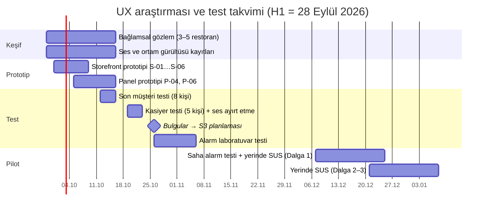

# 12 — Marka, Tasarım ve Kullanılabilirlik

> **Amaç:** Siparişin Önünde'nin marka platformunu, görsel kimliğini, `packages/ui` tasarım sistemini, alarm seslerini ve basılı şablonları tek yerde tanımlamak. Ayrıca kasiyerin ve son müşterinin ürünü gerçekten kullanabildiğini pilottan önce kanıtlayacak araştırma, test, cihaz kabulü ve eğitim içeriği planını vermek.
> **Tarih:** 2026-09-24 (Hafta 0) · **Durum:** Taslak v1 · **Bağlayıcı kaynak:** [00](00-kararlar-ve-sozluk.md) §1 (konumlandırma, ana mesaj), §2 (alan adları), §4 (roller, P1 hattı), §5 (durum kodları), §6 (WhatsApp kararları), §9 (marka başvurusu), §10 (kademeli alarm, stack), §11 (fazlar, pilot). Çelişkide 00 geçerlidir.

**Kapsam:** Marka platformu (misyon, kişilik, ses tonu, isim riski, alan adı, Meta/WhatsApp marka kuralları); görsel kimlik (logo brifi, renk, durum renkleri, tipografi, ikon, fotoğraf); tasarım token'ları, tema ve bileşen envanteri; storefront tema kuralı; ses tasarımı; basılı materyal şablonları; UX araştırması ve kullanılabilirlik testi (D13, [10](10-riskler-operasyon-ve-metrikler.md) §4.3); cihaz/tarayıcı destek matrisi ve kabul testi (UAT); eğitim ve destek içeriği üretimi; erişilebilirlik ve yerelleştirme ilkeleri.

**Kapsam dışı (bağlantı verilir):** Ekranların içeriği ve akışları → [03](03-musteri-deneyimi-ve-storefront.md) (S-xx), [04](04-isletme-paneli.md) (P-xx, K-xx), [05](05-admin-paneli-ve-pazarlama-sitesi.md) (A-xx, site). Müşteri mesaj metinleri → [03](03-musteri-deneyimi-ve-storefront.md) §9. Pazarlama sitesi metinleri ve reklam kuralları → [05](05-admin-paneli-ve-pazarlama-sitesi.md) C.3, C.8. Alarm zincirinin altyapısı, test altyapısı, yazdırma → [06](06-teknik-mimari.md) §7, §9, §16. Tablo alanları → [07](07-veri-modeli-ve-api.md). Aydınlatma metinleri → [08](08-mevzuat-kvkk-odeme-fatura.md). Sprint takvimi ve bütçe → [09](09-yol-haritasi-ve-sprint-plani.md). Deneylerin kanonik listesi, bilgi bankası ve concierge kurulum → [10](10-riskler-operasyon-ve-metrikler.md) §4, §5.4, §5.5.

**Atıf ve işaretler:** `A05 §8` = [arastirma/05-urun-ux.md](arastirma/05-urun-ux.md) bölüm 8 (URL'ler araştırma dosyalarında). `A03` = [arastirma/03-mevzuat-odeme-fatura.md](arastirma/03-mevzuat-odeme-fatura.md). `D04 §4.5` = 04 numaralı plan dokümanı. **[T]** = bizim önerimiz veya tahminimiz (pilotta kalibre edilir). **(teyit edilmeli)** = birincil kaynaktan doğrulanmadı. Faz etiketleri: **[Faz 1]** MVP, **[Faz 2]** ticari lansman, **[Faz 3]** ölçek ([00](00-kararlar-ve-sozluk.md) §11).

**Okuma notları:** "H3" 09'daki gibi **Hafta 3**'tür (H1 = 28 Eylül 2026). 10'daki hipotezlerle (H1–H15) karışmasın diye hipotez "hipotez H15" diye yazılır; H15 bu dokümanın önerisiyle [10](10-riskler-operasyon-ve-metrikler.md) §4.2'ye eklendi. Bu dokümanın kimlikleri: `UI-xx` bileşen, `SES-xx` ses, `BM-xx` basılı materyal, `PT-xx`/`MT-xx` panel/müşteri test görevi, `EK-xx` elle keşif maddesi, `UAT-xx` kabul senaryosu, `EG-xx` eğitim içeriği. Renk kontrast oranları WCAG 2.x göreli parlaklık formülüyle hesaplandı.

---

## 1. Amaç, kapsam ve ilkeler

### 1.1 Neden ayrı bir doküman
Eksiksizlik eleştirisi dört boşluk buldu: ürün tasarımı kapasitesi ve kullanılabilirlik testi yok; marka kimliği ve tasarım sistemi dağınık; eğitim içeriğinin üretimi planlanmamış; cihaz test matrisi ve kabul testi tanımsız. Bu doküman dördünü birlikte kapatır, çünkü hepsi aynı soruya bağlanır: **Kasiyer Elif yoğun Cuma akşamı siparişi duyuyor, anlıyor ve tek dokunuşla onaylıyor mu?** ([01](01-vizyon-pazar-is-modeli.md) §5.2; R05 "Sipariş kaçırma", [10](10-riskler-operasyon-ve-metrikler.md) §3.3).

### 1.2 Tasarım ilkeleri (03 §1 ve 04 §1'in üst kümesi)

| # | İlke | Bu dokümandaki karşılığı |
|---|---|---|
| T1 | **Önce duyulur, sonra görülür, sonra anlaşılır.** Alarm, bant ve kart aynı anda aynı şeyi söyler | §6 ses seti, UI-09 bantlar |
| T2 | **Renk + ikon + kelime.** Hiçbir durum yalnız renkle anlatılmaz | §3.3 |
| T3 | **İşletmenin markası önde, bizimki arkada.** Storefront'ta ve basılıda işletme görünür; biz yalnız altbilgide | §5.3, §7 |
| T4 | **Parmak, ıslak el, güneş ışığı.** Ana aksiyon 56–64 px, açık tema varsayılan, yüksek kontrast | §4.2, §3.2 |
| T5 | **Ölçmeden iddia yok.** "10 sn'de onay", "3 dk'da sipariş" pilottan önce testle kanıtlanır | §8 |
| T6 | **Tek kaynak.** Token, bileşen ve metin `packages/ui` ve `packages/i18n`'dedir; Figma bunların aynasıdır | §4 |

### 1.3 Sahiplik
**A:** KUR (ürün sahibi). **R:** TAS (serbest ürün ve marka tasarımcısı, §8.1), FE (`packages/ui` uygulaması), OPS (eğitim içeriği, UAT). **C:** TL (ses, cihaz, PWA kısıtları), MV (marka vekili), AV (basılıdaki KVKK notu). Rol kısaltmaları [09](09-yol-haritasi-ve-sprint-plani.md) "Okuma notları"ndadır.

---

## 2. Marka platformu

### 2.1 Misyon, vaat ve kanıt noktaları
- **Misyon:** Mahallenin işletmesiyle kendi müşterisinin arasına kimse girmesin. Esnaf siparişini komisyonsuz, kendi WhatsApp'ından ve hiçbirini kaçırmadan alsın.
- **Ana mesaj (kanonik, [00](00-kararlar-ve-sozluk.md) §1):** *"Keşif pazaryerinde, sadakat sende. Komisyonsuz, WhatsApp'tan."*
- **Marka sözü (iç kullanım):** *"Siparişin önünde ol."* Müşterin senin, numaran güvende, sipariş sesle gelir.

| Kanıt noktası | Dayanak | Dikkat |
|---|---|---|
| Resmi WhatsApp altyapısı, "numaran güvende" | [00](00-kararlar-ve-sozluk.md) §6.1 | "Ban riski sıfır" denmez ([05](05-admin-paneli-ve-pazarlama-sitesi.md) C.8) |
| Numara ve WhatsApp Business uygulaması yerinde kalır | Coexistence, [00](00-kararlar-ve-sozluk.md) §6.4 | D11 sonucuna bağlı ([10](10-riskler-operasyon-ve-metrikler.md) §4.8) |
| Sipariş başı ücret, ciro yüzdesi yok | [00](00-kararlar-ve-sozluk.md) §8 | Her zaman Meta ücreti notuyla |
| Siparişi kaçırmamanız için 4 kademeli uyarı (ses, bildirim, WhatsApp, SMS) | [00](00-kararlar-ve-sozluk.md) §10 | "Hiçbir sipariş kaçmaz **garantisi**" denmez; "sipariş kaçmaz" iç adıdır |
| Veriler Türkiye'de | [00](00-kararlar-ve-sozluk.md) §10 | Sağlayıcı seçilmeden yayınlanmaz ([05](05-admin-paneli-ve-pazarlama-sitesi.md) açık konu 26) |

### 2.2 Kişilik

| Özellik | Öyleyiz | Öyle değiliz |
|---|---|---|
| **Esnafın yanında** | "Biz kuralım" diyen, dükkâna gelen, akşam telefonu açan | Tepeden bakan "dijital dönüşüm" danışmanı |
| **Sade** | Tek büyük buton, esnafın kelimeleri ("Onayla", "Tükendi") | Jargon (*checkout, fulfillment, tenant*), süs, animasyon gösterisi |
| **Güvenilir** | Rakamla konuşur, sınırını söyler ("Meta ücreti ayrıdır") | Abartılı vaat, "en ucuz", "%100 uyumlu" |
| **Uyanık** | Sorunu önce kendisi söyler (kırmızı bant, sahibine WhatsApp) | Panik dili, ünlem yağmuru, suçlayıcı hata mesajı |

### 2.3 Ses tonu (05 C.8 ile tutarlı)

| Bağlam | Hitap | Ton | Örnek |
|---|---|---|---|
| Pazarlama sitesi, reklam, satış kiti | **sen** ([05](05-admin-paneli-ve-pazarlama-sitesi.md) C.3) | Samimi, rakamla, kısa cümle | "Sadık müşterin için komisyon ödemeyi bırak." |
| İşletme paneli | **siz**; butonlar kısa emir kipi | Sakin, işi söyleyen | "Bağlantı yok — yeni siparişler gelmeyebilir. İnterneti kontrol edin." |
| Alarm ve hata | siz | Önce ne yapılacağı, sonra neden | "Ses kapalı — yeni siparişleri duyamazsınız. [Sesi aç]" |
| Son müşteri (storefront, WhatsApp) | siz; **işletme adına** konuşur | Nazik, kısa; bizim markamız görünmez | [03](03-musteri-deneyimi-ve-storefront.md) §9 |
| Destek (platform WhatsApp numarası) | siz [T] | Sorumluluk alan, süre veren | "Hemen bakıyorum, 5 dk içinde döneceğim." |
| Yasal metin | siz | Resmi, açık | [08](08-mevzuat-kvkk-odeme-fatura.md) |

**Yazım kuralları:** Marka metinde her zaman **"Siparişin Önünde"** yazılır (Türkçe karakterli, iki kelime, baş harfler büyük). `siparisinonunde` yalnız alan adında ve kodda geçer. "SÖ", "SiparişÖnde" gibi kısaltma yoktur. Panel ve müşteri metinlerinde ünlem en fazla bir tanedir ve emoji kullanılmaz (WhatsApp mesajlarındaki emoji kuralları [03](03-musteri-deneyimi-ve-storefront.md) §9.1'dedir).

### 2.4 İsim riski ve yedek isimler (R36)
**Risk:** R36 "Marka / alan adı çakışması" ([10](10-riskler-operasyon-ve-metrikler.md) §3.3; olasılık 2, etki 2). Ek bir risk daha var: "sipariş" kelimesi 35 ve 42. sınıflarda tanımlayıcıdır. Bu yüzden "Siparişin Önünde" **ayırt edici değil** gerekçesiyle TÜRKPATENT tarafından reddedilebilir (A03 §7.4.3). Öneri kelime + logo başvurusudur. Başvuru 2 Ekim'de yapılacak ([09](09-yol-haritasi-ve-sprint-plani.md) §1.1, F0-H05).

**İsim değişirse etkilenenler:** marka başvurusu, alan adları ve e-posta, platform WABA görünen adı "Siparişin Önünde" (değişiklik Meta incelemesine girer, [02](02-whatsapp-entegrasyonu.md) §3.6), SMS başlığı ("SIPARISNDE", ≤ 11 karakter, [00](00-kararlar-ve-sozluk.md) §7), Business Verification'daki web sitesi, künye, basılı materyal. **İsim kilidi H1 sonudur.** Marka vekilinin tescil edilebilirlik görüşü 1 Ekim'e kadar olumsuz gelirse başvuru yedek isimle yapılır.

**Eleme ölçütleri:** (1) "WhatsApp", "Whats", "WA" içermez (§2.6). (2) Pazaryeri markalarına ve "Sipariş Ustası" gibi mevcut sektör adlarına benzemez (A02 §3). (3) Telefonda harf harf söylemeden yazılır; ASCII karşılığı tektir. (4) SMS başlığına sığar (≤ 11 ASCII karakter). (5) Olumsuz argo çağrışımı yoktur.

| Aday | Mantık | ASCII / SMS başlığı | Tescil riski [T] | Müsaitlik |
|---|---|---|---|---|
| **Siparişin Önünde** (birincil) | Konumlandırmayı anlatır | `siparisinonunde` / `SIPARISNDE` | Orta-yüksek (tanımlayıcı unsur); kelime + logo şart | 00 §13 #6, **(teyit edilmeli)** |
| **Tıkır** | "İşler tıkırında": sorunsuz akan dükkân | `tikir` / `TIKIR` | Orta (gündelik kelime, yazılım için keyfi) | **(teyit edilmeli)**: EPATS, `.com.tr`, sosyal medya, MERSİS |
| **Tamamdır** | Esnafın onay sözü; ürünün çekirdek eylemi "Onayla" | `tamamdir` / `TAMAMDIR` | Orta-yüksek (yaygın ifade) | **(teyit edilmeli)** |
| **Sipaş** | Türetilmiş ad ("sipariş" + "-aş"); en ayırt edici | `sipas` / `SIPAS` | Düşük-orta | **(teyit edilmeli)** |

Aramalar A03 §7.4'teki yöntemle yapılır: TÜRKPATENT araştırması, EPATS, sesli benzerlik (ş/s, ı/i), WIPO Global Brand Database, alan adı, sosyal medya kullanıcı adları, ticaret unvanı. Sonuç 00 §13 #6'ya işlenir.

### 2.5 Alan adı stratejisi
- **Ana:** `siparisinonunde.com` ([00](00-kararlar-ve-sozluk.md) §2). **Savunma:** `siparisinonunde.com.tr` (TRABİS ile belgesiz alınabiliyor, A03 §7.4) ve en olası 2 yazım hatası (ör. `siparisonunde.com`). Bunlar 301 ile ana adrese yönlenir [T]. Türkçe karakterli IDN (`siparişinönünde.com`) yalnız yönlendirme olarak kullanılabilir. Basılıda ve linklerde asla yer almaz, çünkü önizlemede punycode görünür.
- **Yedek isimler:** Aday isimlerin `.com.tr` adresleri Gün 1'de düşük maliyetle alınır [T]. Marka görüşü olumsuz çıkarsa gün kaybedilmez.
- **Kısa alan adı (opsiyonel) [T]:** ≤ 10 karakterlik ikinci bir alan adı `/q/{kod}` yönlendirmesi ve takip linki için kullanılabilir. İki kazancı vardır: QR içeriği kısalır, modüller büyür ve eski telefonlar daha kolay okur; SMS kısalır. Türkçe karakterli SMS 70 karakterlik segmentlere bölünür ve uzun link segment sayısını, dolayısıyla maliyeti artırır ([03](03-musteri-deneyimi-ve-storefront.md) açık konu 13, **teyit edilmeli**).
- **Koruma:** Kayıt kuruluşu kilidi, otomatik yenileme, en az 2 yönetici ve donanım anahtarı (iş sürekliliği; eklendi: [10](10-riskler-operasyon-ve-metrikler.md) §10.1 kritik hesap envanteri "Alan adı kayıt kuruluşu" satırı, risk R42). E-posta alanında SPF, DKIM ve DMARC (`p=reject` hedefi) kurulur. Esnafa "Meta kartınızı güncelleyin" gibi sahte e-posta gelmesi marka riski olduğundan pazarlama sitesinde bir **"Resmi kanallarımız"** sayfası bulunur: platform WhatsApp numarası, P1 hattı, e-posta alan adı ve "Sizden asla parola veya kart bilgisi istemeyiz" notu [T].

### 2.6 Meta/WhatsApp marka kullanım kuralları (genel ilkeler, **teyit edilmeli**)
Kaynak: WhatsApp Brand Resources ve Meta marka yönergeleri. Güncel sürüm yayından önce okunur ve avukat kontrolünden geçer ([05](05-admin-paneli-ve-pazarlama-sitesi.md) C.8 #7, açık konu 20).

1. **Yazım:** "WhatsApp" (W ve A büyük, bitişik). "Whatsapp", "Whats App", "WA" yazılmaz. Türkçe ek kesme işaretiyle eklenir: "WhatsApp'tan" (Meta'nın yerelleştirme kuralıyla teyit edilmeli).
2. **Yalnız tanımlayıcı kullanım:** Ad ve logo yalnız hizmete atıf için kullanılır ("WhatsApp'tan sipariş ver"). Ürün adımızda, logomuzda, alan adımızda, uygulama adımızda ve sosyal medya kullanıcı adımızda "WhatsApp", "Whats" veya "WA" geçmez.
3. **Logo ve glif:** Yalnız resmi varlık setinden alınır. Rengi, oranı ve yönü değiştirilmez; gölge ve efekt eklenmez, çevresinde boşluk bırakılır. Glif, bizim veya işletmenin markasından daha baskın olmaz.
4. **İlişki iması yok:** "Meta onaylı", "WhatsApp'ın resmi ortağı" gibi ifadeler kullanılmaz. "Resmi WhatsApp Business Platform altyapısı" tanımlayıcıdır ve kullanılabilir. Meta rozeti yalnız ilgili statü alınırsa ve rozet kurallarına uyularak kullanılır.
5. **Arayüz görselleri:** WhatsApp ekranını gösteren mockup'larda kurgusal kişi ve numara kullanılır, "temsilidir" notu eklenir. Meta'nın ürün görseli kuralları teyit edilir.
6. **Renk ve motif:** WhatsApp yeşili bizim marka rengimiz olamaz. Logomuzda konuşma balonu + telefon ahizesi motifi kullanılmaz. Yeşil yalnız WhatsApp CTA'sında kullanılır (§5.1 kural 8).
7. **Panel içi kanal rozeti:** WhatsApp glifi yerine genel mesaj ikonu + "WhatsApp" kelimesi kullanılır (§3.5). Bu hem kural riskini hem görsel gürültüyü azaltır.

---

## 3. Görsel kimlik

### 3.1 Logo brifi (TAS'a verilecek; Gün 1, [09](09-yol-haritasi-ve-sprint-plani.md) §3.5)
- **Teslim takvimi:** 25 Eyl brif → 28 Eyl 3 yön → 29 Eyl KUR + MV seçimi ve benzerlik ön kontrolü → 1 Eki son vektör → **2 Eki marka başvurusu** (kelime + logo). Takvim sıkıdır. Logo yetişmezse kelime markası 2 Ekim'de, şekil markası 2–3 hafta sonra ayrı başvurulabilir (marka vekiliyle **teyit edilmeli**).
- **Anlatması gereken:** "önünde olmak" (ileri ok, sıranın başı) ve/veya "zil" (sipariş sesi). Esnaf sıcaklığı (tabela, tente) da düşünülebilir. Mizah yok, teknoloji klişesi (devre, bulut) yok.
- **Kaçınılacaklar:** Konuşma balonu + ahize, WhatsApp yeşili, motor kuryesi ve paket çantası (pazaryeri çağrışımı; kurye filosu işletmiyoruz, [00](00-kararlar-ve-sozluk.md) §1), çatal-bıçak klişesi, pazaryeri logolarına benzeyen renk ve biçimler.
- **Çıktılar:** (1) yatay kilit (işaret + yazı), (2) dikey kilit, (3) yalnız işaret. İşaret 16 px favicon'da, 192/512 px PWA ikonunda ve maskelenebilir ikonda okunur olmalıdır. (4) Tek renk: siyah, beyaz ve **1 bit raster** (58 mm termal fişte titremeden basılmalı). (5) 640×640 px daire kırpmaya uygun WhatsApp profil fotoğrafı (platform WABA için, boyut **teyit edilmeli**). (6) Marka başvurusu için siyah-beyaz görsel. (7) SVG, PDF ve PNG kaynak dosyaları, kullanım kılavuzu (1 sayfa: boşluk alanı, en küçük boyut, yasaklar).
- **Kabul kriteri:** İşaret 16 px'te ve 1 bit baskıda tanınır. İsim 24 px yükseklikte, 2 m mesafeden okunur. Renkli sürüm beyaz ve mürekkep zemin üzerinde ≥ 3:1 (WCAG 1.4.11).

### 3.2 Renk sistemi: marka ve nötr

| Token | Açık tema | Koyu tema | Kullanım | Kontrast (hesaplanan) |
|---|---|---|---|---|
| `ink-900` (marka birincil, "mürekkep") | `#14233A` | — | Logo, birincil buton, başlık | Beyazla 15,77:1 |
| `saffron-500` (marka vurgu, "safran") | `#F5A524` | `#F5A524` | Logo vurgusu, pazarlama sitesi vurgusu, koyu temada odak halkası | Mürekkep metinle 7,73:1; **beyaz zeminde metin olarak kullanılmaz** (2,04:1) |
| `bg` | `#FFFFFF` | `#0F1419` | Sayfa zemini | — |
| `surface` | `#F5F6F8` | `#18202A` | Sütun ve alan zemini | — |
| `surface-raised` | `#FFFFFF` | `#1E2732` | Kart | Koyu: metin 13,71:1 |
| `text` | `#111827` | `#F3F4F6` | Gövde metni | 17,74:1 / 16,82:1 |
| `text-muted` | `#4B5563` | `#A7B0BA` | İkincil metin, altbilgi | 7,56:1 (beyaz), 6,99:1 (`surface`) / 8,43:1 |
| `border` | `#D9DDE3` | `#2C3640` | Dekoratif ayırıcı (bilgi taşımaz) | — |
| `border-strong` | `#6B7280` | `#6B7785` | Form alanı, seçilebilir öğe kenarı (≥ 3:1) | 4,83:1 / 4,06:1 |

**Neden mürekkep + safran [T]:** Panelde renkler durumlara ayrılmıştır (§3.3). Marka rengi hiçbir durum rengiyle çakışmamalı. Koyu, doygunluğu düşük bir birincil renk güneş alan vitrinde en yüksek okunurluğu verir. Ayrıca pazaryerlerinin kırmızı/pembe, mor/sarı ve turuncu renk alanlarından uzak durur (rakip logoların güncel renkleri **teyit edilmeli**). Nihai değerler TAS ile kesinleşir. Kesinleşen değerler bu kontrast eşiklerini korumalıdır.

### 3.3 Durum renkleri (renk + ikon + kelime)
Kural: Rozet her zaman **ikon + Türkçe etiket** taşır, renk yalnız pekiştirir (WCAG 1.4.1). Etiketler [04](04-isletme-paneli.md) §14.3 mikro metin sözlüğündendir. İkonlar Lucide setindendir (§3.5, eşleme [04](04-isletme-paneli.md) §14.5; adlar sürümde **teyit edilmeli**, [13](13-varsayim-ve-teyit-kaydi.md) V-089). Açık tema: yazı rengi (fg) açık zemin (bg) üzerinde. Koyu tema: açık tonlu yazı, koyu renkli zemin üzerinde.

| Kod ([00](00-kararlar-ve-sozluk.md) §5) | Etiket | İkon | Açık fg / bg | Kontrast | Koyu fg / bg | Kontrast | Not |
|---|---|---|---|---|---|---|---|
| `awaiting_customer` | Müşteri onayı bekleniyor | `hourglass` | `#4B5563` / `#F3F4F6` | 6,87 | `#C4CBD4` / `#232B35` | 8,74 | Soluk, sessiz şerit ([04](04-isletme-paneli.md) §4.2) |
| `new` | Yeni | `bell-ring` | `#B91C1C` / `#FEE2E2` | 5,30 | `#FCA5A5` / `#3A1416` | 8,57 | Kart kırmızı çerçeveli; bant zemini `#C81E1E` + beyaz (5,74) |
| `accepted` | Onaylandı · 20.35 | `check` | `#1D4ED8` / `#DBEAFE` | 5,49 | `#93C5FD` / `#15233F` | 8,66 | |
| `preparing` | Hazırlanıyor | `chef-hat` | `#6D28D9` / `#EDE9FE` | 5,98 | `#C4B5FD` / `#261A45` | 8,64 | Adım isteğe bağlı |
| `ready` | Hazır | `package-check` | `#15803D` / `#F0FDF4` | 4,79 | `#86EFAC` / `#0F2E1C` | 10,47 | `#DCFCE7` zemin 4,57'de sınırda kalıyor, kullanılmaz |
| `on_the_way` | Yolda · Burak | `bike` | `#0F766E` / `#CCFBF1` | 4,86 | `#5EEAD4` / `#0B2E2B` | 9,86 | |
| `delivered` | Teslim edildi | `check-check` | `#166534` / `#F0FDF4` | 6,81 | `#86EFAC` / `#18202A` | 11,69 | Terminal: dolgusuz, sönük |
| `rejected` | Reddedildi · {sebep} | `circle-x` | `#991B1B` / `#FEF2F2` | 7,60 | `#FCA5A5` / `#18202A` | 8,65 | Terminal |
| `cancelled` | İptal edildi · {sebep} · {kim} | `ban` | `#374151` / `#F3F4F6` | 9,37 | `#A7B0BA` / `#18202A` | 7,48 | Terminal |
| Bekleyen ret (durum değil) | Reddediliyor · 27 sn | `undo-2` | `new` renkleri + kesikli kenar | 5,30 | aynı | 8,57 | [00](00-kararlar-ve-sozluk.md) §7 |

**Diğer anlam renkleri:** Yoğun (`busy`), müşteri iptal talebi ve uyarılar için turuncu: `#C2410C` / `#FFF7ED` (4,88). Yeniden bağlanma ve "Ekran kapanabilir" için amber bant: `#FBBF24` zemin + `#111827` metin (10,63). Sipariş notu kutusu `#FEF9C3` + `#111827` (16,52). Bağlantı yok ve ses kapalı bantları `new` bandıyla aynı kırmızıdır, ama ikon (`wifi-off`, `volume-x`) ve metin farklıdır. `ordering_state` anahtarı: `open` yeşil nokta + "Sipariş alıyor", `busy` turuncu + "Yoğun (+15 dk)", `paused` gri + "Durduruldu · 20.15'e kadar", `closed` koyu gri + "Kapalı · 11.00'de açılır".
**Kabul kriteri:** Storybook'taki durum rozeti hikâyesi iki temada da 9 durumu gösterir. Otomatik kontrast testi her fg/bg çiftinde ≥ 4,5:1 bulur. Gri tonlamalı ekran görüntüsünde her durum yalnız ikon ve etiketle ayırt edilir (elle kontrol).

### 3.4 Tipografi
- **Yazı tipi yığını (panel, storefront, admin):** `system-ui, -apple-system, "Segoe UI", Roboto, "Noto Sans", "Helvetica Neue", Arial, sans-serif, "Apple Color Emoji", "Noto Color Emoji"`. Sistem yazı tipleri Android (Roboto/Noto), iOS (SF) ve Windows (Segoe UI) üzerinde Türkçe glifleri (ğ, ı, İ, ş) destekler ve indirme maliyeti yoktur ([06](06-teknik-mimari.md) §12). Yeni cihaz ve tarayıcıda "ĞÜŞİÖÇ ğüşıöç" test satırıyla kontrol edilir (EK-12).
- **Pazarlama sitesi başlıkları [T]:** İstenirse tek bir değişken yazı tipi kullanılabilir. Bu yazı tipi `latin-ext` alt kümesiyle **kendi sunucumuzdan** sunulur. Google Fonts CDN'i kullanılmaz, çünkü ziyaretçi IP'sini yurt dışına aktarır ([08](08-mevzuat-kvkk-odeme-fatura.md) §2.11 aktarım envanteri).
- **Rakamlar:** Sayaç, tutar ve sipariş no `font-variant-numeric: tabular-nums` ile yazılır; titreşim olmaz. Sipariş kodu (K7M2Q9) harf aralıklı ve karışabilen karakterler (0/O, 1/I) olmadan üretilir ([07](07-veri-modeli-ve-api.md) ile **teyit edilmeli**).
- **Boyut kuralları:** Panel kart gövdesi 18 px. Sipariş no ve geçen süre ≥ 24 px. Birincil buton etiketi 20 px kalın. Mutfak sipariş no ≥ 32 px, kalem ≥ 20 px ([04](04-isletme-paneli.md) §1.2, §10.1). Storefront gövdesi 16 px'tir. **Form alanları ≥ 16 px** olmalı, yoksa iOS Safari odakta sayfayı yakınlaştırır. Hiçbir işlev metni 12 px'in altına inmez; 12 px yalnız yasal altbilgide kullanılır.
- **Büyük harf:** Yalnız `lang="tr"` altında ve `toLocaleUpperCase('tr-TR')` ile yazılır ("SOĞANSIZ", "İPTAL"). CSS `text-transform` yalnız `lang="tr"` kapsayıcıda kullanılır (§11.2).

### 3.5 İkonografi
- **Set:** Lucide (shadcn/ui varsayılanı): 24 px ızgara, 2 px çizgi, yuvarlak uç. Panelde ikon **her zaman kelimeyle** birliktedir. Yalnız ikonlu tek istisna "⋯ Diğer işlemler"dir ve `aria-label` taşır. Hover olmadığı için ipucu (tooltip) ile anlam taşınmaz ([04](04-isletme-paneli.md) §1.1 #10).
- **Emoji yok** ([00](00-kararlar-ve-sozluk.md) §7): Arayüzde emoji değil Lucide SVG ikonu kullanılır. 04'teki tel kafes ve mikro metinler `[… ikonu]` / `[… nokta]` gösterimine çevrildi; gösterim → Lucide eşlemesi [04](04-isletme-paneli.md) §14.5'tedir. Emoji çizimi Android sürümleri arasında farklıdır; eski cihazlar yeni emojileri kutu olarak gösterir.
- **Kanal rozetleri:** `message-circle` + "WhatsApp", `globe` + "Web · QR", `phone` + "Telefon", **[Faz 2]** `sparkles` + "AI ile" ve `repeat` + "Sohbetten tekrar", **[Faz 3]** `list` + "Flows" ve `utensils` + "Masa". Teslim türü: `bike` Paket, `shopping-bag` Gel-al.

### 3.6 Fotoğraf ve illüstrasyon dili
- **Fotoğraf:** Gerçek esnaf, gerçek dükkân, gerçek tablet kasada. Yalnız yazılı izinle ([05](05-admin-paneli-ve-pazarlama-sitesi.md) C.8 #4). Stok "gülümseyen şef" fotoğrafı, pazaryeri çantası veya logosu kullanılmaz. **Alkol, tütün ve nargile hiçbir görselde yer almaz** (Commerce Policy, [00](00-kararlar-ve-sozluk.md) §6.10). Kadın ve erkek esnaf dengeli gösterilir. Müşteri yüzü ve ekrandaki kişisel veri bulanıklaştırılır.
- **İllüstrasyon:** Boş durumlar ve eğitim görselleri için düz çizgi stili, 2 renk (mürekkep + safran), insan figürü sade. Yalnız bilgi taşıyan illüstrasyon kullanılır; süs illüstrasyonu yoktur.
- **İşletmenin ürün fotoğrafı rehberi (EG-12):** Gün ışığı, 45° açı, sade tabak, tek ürün, filtresiz. Görsel yoksa storefront kategori ikonunu gösterir (A05 §8.5).

---

## 4. Tasarım sistemi (`packages/ui`)

### 4.1 Yapı ve kurallar
- **Konum:** `packages/ui` ([06](06-teknik-mimari.md) §4.1): `tokens/` (CSS değişkenleri + TS sabitleri), `theme/` (shadcn eşlemesi, `brandPalette()` §5.1), `components/` (shadcn tabanlı + alan bileşenleri), `sounds/` (§6), `stories/`. Hem `apps/panel` ve `apps/admin` (Vite) hem `apps/web` (Next.js) aynı paketi kullanır.
- **Kurallar:** Uygulama kodunda ham renk (`#hex`) ve ham piksel boşluk yazılmaz. Bunu stylelint/ESLint kuralı engeller [T]. Kenar boşlukları CSS mantıksal özellikleriyle yazılır (`margin-inline-start`, `padding-inline`); böylece Faz 3'te RTL (Arapça) ucuz olur (§11.3). Bileşen metinleri prop olarak `packages/i18n` anahtarlarından gelir.
- **Figma ↔ kod:** Figma'daki token adları koddakiyle aynıdır. Çelişkide kod geçerlidir, Figma düzeltilir.

### 4.2 Design token listesi

| Grup | Token'lar (değer) | Not |
|---|---|---|
| Renk | §3.2 nötr/marka, §3.3 durum: `--status-{kod}-fg/-bg/-border`, `--band-alarm`, `--band-warn`, `--note-bg` | Açık/koyu çift değer |
| Boşluk (4 px ızgara) | `--space-0` 0 · `-1` 4 · `-2` 8 · `-3` 12 · `-4` 16 · `-5` 20 · `-6` 24 · `-8` 32 · `-10` 40 · `-12` 48 · `-16` 64 px | Yan yana aksiyon arası ≥ `--space-2` |
| Köşe yarıçapı | `--radius-sm` 6 · `--radius` 10 (shadcn `--radius`) · `--radius-lg` 14 · `--radius-xl` 20 · `--radius-pill` 9999 px | |
| Gölge | `--shadow-sm` 0 1 2 / %6 · `--shadow-md` 0 4 12 / %8 · `--shadow-lg` 0 12 32 / %12 | Koyu temada gölge yerine `surface-raised` + kenar |
| Tipografi ölçeği (boyut/satır) | `--text-xs` 12/16 · `-sm` 14/20 · `-base` 16/24 · `-lg` 18/28 · `-xl` 20/28 · `-2xl` 24/32 · `-3xl` 30/36 · `-4xl` 36/40 · `-5xl` 48/52 | Ağırlık 400/500/600/700 |
| **Dokunma hedefi** | `--hit-min` 48 px (panel, her dokunulabilir öğe) · `--hit-sf` 44 px (storefront) · `--hit-primary` **56 px** (telefon) / **64 px** (tablet, PC) · `--hit-keypad` 64 px · `--hit-gap` 8 px | [04](04-isletme-paneli.md) §1.1 #2, [03](03-musteri-deneyimi-ve-storefront.md) §10.3 |
| Hareket | `--dur-fast` 120 · `--dur-base` 200 · `--dur-slow` 320 ms · `--ease-standard` `cubic-bezier(.2,0,0,1)` | `prefers-reduced-motion`: 0 ms, yanıp sönme yok |
| Katman (z) | `--z-sticky` 10 · `--z-drawer` 40 · `--z-modal` 50 · `--z-toast` 60 · `--z-banner` 80 | Alarm bandı pencerelerin de üstündedir |
| Kesme noktası | Tailwind varsayılanları; test görüntü alanları 360×640, 800×1280, 1280×800, 1366×768 | §4.5 |

### 4.3 Açık/koyu tema ve shadcn/ui eşlemesi
- **Varsayılanlar:** Panel **açık** temadadır; sistem ayarını izleyen koyu tema isteğe bağlıdır. Mutfak görünümü **koyu** temadadır ([04](04-isletme-paneli.md) §1.2). Storefront işletme temasıyla açık gelir ve sistem koyu temasını isteğe bağlı izler ([03](03-musteri-deneyimi-ve-storefront.md) §10.3). Admin açık temadadır. Tema `<html data-theme>` ile seçilir. Alarm bandı iki temada da aynı doygun kırmızıdır.

| shadcn değişkeni | Açık | Koyu | Not |
|---|---|---|---|
| `--background` / `--foreground` | `bg` / `text` | `bg` / `text` | |
| `--card`, `--popover` (+ `-foreground`) | `surface-raised` / `text` | `surface-raised` / `text` | |
| `--primary` / `--primary-foreground` | `ink-900` / `#FFFFFF` | `#F3F6FA` / `ink-900` (14,55:1) | Storefront'ta `--brand` / `--brand-contrast` (§5.1) |
| `--secondary`, `--muted` / `--muted-foreground` | `surface` / `text-muted` | `surface` / `text-muted` | |
| `--accent` / `--accent-foreground` | `ink-50` `#F3F6FA` / `ink-900` | `#232B35` / `text` | shadcn'deki "accent" hover zeminidir; marka safranı değildir |
| `--destructive` | `#B91C1C` | `#FCA5A5` | Yalnız geri alınamaz işlem ve hata |
| `--border` / `--input` | `border` / `border-strong` | `border` / `border-strong` | |
| `--ring` | `ink-900` | `saffron-500` (9,07:1) | Odak halkası 2 px + 2 px boşluk |
| `--radius` | 10 px | 10 px | |

### 4.4 Bileşen envanteri
Her bileşenin Storybook'ta **tüm durumları × iki tema × gerçek Türkçe metin** hikâyesi vardır. Kabul kriterleri 04 §4.19'u tamamlar, onun yerine geçmez.

| ID | Bileşen | Durumlar | Kabul kriteri | Faz |
|---|---|---|---|---|
| UI-01 | **Sipariş kartı** (P-04) | `new` (alarm, sayaç), `new` > 2 dk (kırmızı sayaç), bekleyen ret, onaylı/hazırlanıyor (hedef saat), süre aşıldı, hazır (paket/gel-al), yolda, terminal (sönük), `awaiting_customer` ince şerit, mutfak varyantı, telefon varyantı, iskelet, çakışma (409), çevrimdışı (butonlar pasif) | Birincil buton 56–64 px ve tek; ilk 3 kalem + "ve N ürün daha"; çıkarılacaklar `tr-TR` büyük harf ve kalın; mutfak varyantında fiyat **DOM'da yok**; 800×1280'de metin kesilmez | 1 |
| UI-02 | **Durum rozeti** | 9 durum + bekleyen ret; `sm`/`md` boyut | §3.3 eşikleri; `aria-label` = etiket; ikon + kelime her boyutta | 1 |
| UI-03 | **Sebep çipi grubu** (ret, iptal, teslim edilemedi) | Seçisiz, seçili, pasif, "Diğer" + zorunlu metin (≤ 140) | Her çip ≥ 48 px, `radiogroup` semantiği, klavye ile gezilir; seçim kenarlık + onay ikonu ile de gösterilir; "Diğer" boşken gönder pasif | 1 |
| UI-04 | **"Geri al" şeridi** | 5 sn (durum geçişi), 30 sn (ret; sunucudaki `rejection_scheduled_at` ile eşzamanlı), üst üste 2 şerit, çevrimdışı | Geri sayım metin olarak görünür, `aria-live="polite"`; sayfa yenilense de bekleyen ret şeridi sunucudan geri gelir; dokunma hedefi ≥ 48 px | 1 |
| UI-05 | **Stepper** (adet, özel süre 5–180 dk) | min, max, pasif, basılı tutunca hızlanma | +/− ≥ 48 px; sınırda pasif ve gerekçe metni; değer `aria-live` | 1 |
| UI-06 | **Süre çipleri + büyük onay butonu** ("Onayla · 30 dk") | Varsayılan, basılı, yükleniyor (etiket korunur), pasif (çevrimdışı), başarılı | **Tek dokunuş** onaylar; çift dokunuş tek istek üretir (idempotency anahtarı + 800 ms kilit [T]); etikette süre yazar; yoğun modda "· 45 dk" | 1 |
| UI-07 | **Boş durum** | Sipariş yok, sohbet yok (WhatsApp'sız), arama sonucu yok, kapalı | En çok 2 cümle + 1 aksiyon; illüstrasyon dekoratif (`alt=""`) | 1 |
| UI-08 | **Hata durumu** (satır içi, tam ekran) | Alan hatası, işlem hatası, ağ hatası, yetki | Ne oldu + ne yapmalı + [Tekrar dene]; teknik kod yalnız "Ayrıntı" altında (destek için); engelleyici hata `role="alert"` | 1 |
| UI-09 | **Bantlar**: yeni sipariş, bağlantı koptu, ses kapalı, WhatsApp/Meta sorunu, abonelik | Canlı, yeniden bağlanıyor (amber), yok (kırmızı), geri geldi (yeşil, 5 sn) | Tam genişlik, **her ekranda** görünür; odaklı öğeyi örtmez, içeriği aşağı iter (WCAG 2.4.11); yanıp sönme ≤ 1 Hz (WCAG 2.3.1); 45 sn eşiği ([04](04-isletme-paneli.md) §4.17) | 1 |
| UI-10 | **Sayısal tuş takımı** (telefon, PIN, para üstü, özel süre) | Boş, girişte, hatalı, maskeli (PIN) | Tuşlar 64 px, sil + tamam; fiziksel klavye çalışır; telefon biçimi "0 (5xx) xxx xx xx" canlı maskelenir | 1 |
| UI-11 | **Üst bar durum şeridi** (bağlantı, ses, sipariş alma anahtarı, bugün özeti) | §3.3 anahtar durumları | Her ekranda aynı yerde; sesin durumu metinle ("Ses: Açık") | 1 |
| UI-12 | **Vardiya başlat ekranı** (P-03) | İlk açılış, ses kilitli, iOS ana ekrana eklenmemiş, şarjda değil | "Siparişleri almaya başla" 64 px; kontrol listesi ikon + metin; "Hayır, duymadım" ses rehberini açar | 1 |
| UI-13 | Alt sayfa / çekmece (shadcn Sheet) | Açık, kapanıyor, içerik uzun | Odak tuzağı, ESC ve geri tuşuyla kapanır; tablette sağdan, telefonda alttan | 1 |
| UI-14 | Onay penceresi (yalnız geri alınamaz işlem) | Varsayılan, işlemde | Yıkıcı buton fiille etiketlenir ("İptal et"), "Vazgeç" ile aynı boyutta ve ≥ 8 px ayrıktır; varsayılan odak "Vazgeç"tedir [T]; metin sonucu söyler ([04](04-isletme-paneli.md) §14.3) | 1 |
| UI-15 | Kanal ve teslim rozeti, geçen süre sayacı | 2 dk eşiği | `tabular-nums`; eşikte kırmızı + ikon | 1 |
| UI-16 | Storefront: ürün kartı, yapışkan sepet çubuğu, seçenek grubu, OTP alanı, yardım menüsü, WhatsApp CTA | Tükendi, zorunlu eksik, max'a ulaşıldı | [03](03-musteri-deneyimi-ve-storefront.md) §4 ve §10.3 kriterleri; hedef ≥ 44 px | 1 |
| UI-17 | İpucu turu (3 adım, [04](04-isletme-paneli.md) §1.3) | Adım 1–3, atla, bitti | Kartın üstünü örtmez; "Atla" her adımda; kullanıcı başına bir kez | 1 |
| UI-18 | KDS kalem satırı, istasyon filtresi | — | [04](04-isletme-paneli.md) §10.2 | 2 |

### 4.5 Storybook ve görsel regresyon önerisi
- **Storybook** (Vite oluşturucu; sürüm **teyit edilmeli**) `packages/ui` içinde durur. Her hikâye bir durumdur. Hikâyeler hem tasarım incelemesinin hem testin tek kaynağıdır. Erişilebilirlik eklentisi (axe) her hikâyede çalışır ([09](09-yol-haritasi-ve-sprint-plani.md) §6.3 "Erişilebilirlik" kapısı).
- **Görsel regresyon:** Harici SaaS yerine Playwright ekran görüntüsü karşılaştırması (`toHaveScreenshot`) Storybook hikâyeleri üzerinde koşar. Böylece ek bir yurt dışı alt işleyen gerekmez. Sabit yazı tipi ve render için CI'da Docker kullanılır. Görüntü alanları: 360×640 (storefront), 800×1280 ve 1280×800 (tablet), 1366×768 (PC). Eşik: piksel farkı > %0,1 → PR incelemesi zorunlu [T]. [04](04-isletme-paneli.md) §4.19'daki "ana aksiyon ≥ 56 px" kriteri burada ayrıca DOM ölçümüyle test edilir.
- **Kapı:** `packages/ui`'a dokunan PR'da görsel fark onaylanmadan birleştirme yapılmaz (eklendi: [09](09-yol-haritasi-ve-sprint-plani.md) §6.3 "Görsel regresyon" kalite kapısı).

---

## 5. Storefront tema kuralı

### 5.1 İşletme ana rengi ve otomatik kontrast düzeltmesi **[Faz 1]**
**Girdi:** P-26'da (ve onboarding 2. adımında isteğe bağlı) "Ana renk" alanı bulunur: [04](04-isletme-paneli.md) §7.2 "Marka görünümü" ve §3.3 adım 2; veri [07](07-veri-modeli-ve-api.md) `tenants.brand_color` (türetilmiş palet `brand_palette`; şube geçersiz kılması `branches`, Faz 2) (§13 #3). Seçenekler: 12 hazır renk (her biri önceden doğrulanmış) veya serbest renk seçici. Logo yüklenmişse logodaki baskın renk önerilir [T]. Seçim yapılmazsa hazır paletteki ilk renk kullanılır. Mürekkep kullanılmaz, çünkü storefront bizim markamız gibi görünmemeli.

**Algoritma (`packages/ui/theme/brandPalette()`, saf fonksiyon; OKLCH uzayında ton ve kroma korunur, yalnız açıklık L değişir):**
1. `--brand` = girdi. Beyaz ve `#111827` (ink metin) ile kontrastı hesaplanır.
2. `--brand-contrast` (buton metni): ≥ 4,5:1 sağlayan ve kontrastı daha yüksek olan seçilir. **İkisi de 4,5'in altındaysa** (orta tonlu renkler) `--brand` L değeri 0,02 adımlarla düşürülür, ta ki beyaz metinle ≥ 4,5:1 olana kadar. Örnek: `#E53935` beyazla 4,23, ink ile 4,20 → koyulaştırılır. `#FFD400` → ink metin (12,39). `#8E24AA` → beyaz metin (7,04).
3. `--brand-strong` (beyaz zeminde bağlantı, etkin sekme metni, fiyat vurgusu): `--brand` beyaz zeminde ≥ 4,5:1 olana kadar koyulaştırılır. Çoğu marka rengi bu eşiği tutmaz (ör. `#FF7A00` 2,61:1), bu yüzden gövde metni asla doğrudan `--brand` olmaz.
4. `--brand-ui` (seçili çip kenarı, sekme alt çizgisi): beyaz zeminde ≥ 3:1 (WCAG 1.4.11).
5. `--brand-subtle` (seçili çip zemini): L ≈ 0,96 açık ton. Üstündeki metin `text` rengidir.
6. **Koyu tema:** `--brand` koyu zeminde ≥ 3:1 değilse L artırılır, buton metni 2. adımla yeniden seçilir.
7. **Ayrım:** Marka rengi durum rozetinde, hata ve uyarıda kullanılmaz. Marka tonu kırmızıya yakınsa (ör. OKLCH ton 15–40°) hata durumları ikon, kenarlık ve metinle ayrışır [T].
8. **WhatsApp CTA** (S-06B "WhatsApp'ta onayla") işletme renginden bağımsızdır. WhatsApp yeşili `#25D366` zemin + `#111827` metin (8,94:1) + resmi glif kullanılır (§2.6). Beyaz metin bu yeşilde 1,98:1 kalır ve kullanılamaz.

**Uygulama:** Palet P-26 kaydında sunucuda hesaplanır ve `brand_palette` alanında saklanır ([07](07-veri-modeli-ve-api.md) `tenants`). SSR sırasında `<style>:root{…}</style>` olarak satır içine yazılır; istemci JS'i gerekmez, performans bütçesi korunur ([06](06-teknik-mimari.md) §12). Koyulaştırma yapıldıysa panelde önizleme ve not gösterilir: "Renginiz okunabilirlik için hafif koyulaştırıldı." Aynı fonksiyon P-36 baskı üreticisinde de kullanılır.
**Kabul kriterleri:** (1) 200 rastgele renkle özellik tabanlı test: tüm çıktılar 2–6. adımlardaki eşikleri sağlar. (2) Storefront'ta axe kontrast ihlali 0. (3) Renk değişikliği storefront'a 10 sn içinde yansır ([06](06-teknik-mimari.md) §12 kabul kriteri).

### 5.2 Logo, kapak görseli ve ürün görseli

| Varlık | Önerilen | En az | Biçim [T] | Kullanıldığı yer ve güvenli alan |
|---|---|---|---|---|
| Logo | 1024×1024 px (1:1), şeffaf PNG veya SVG | 256×256 px | PNG, SVG, JPEG ≤ 5 MB | S-01 başlığı (40–48 px), storefront favicon'u, P-36 baskısı. İçerik merkezdeki %80 alanda kalır (daire kırpmaya uygun). Baskıda 1024 px ≈ 87 mm @ 300 dpi |
| Kapak | **1200×630 px (1,91:1)** | 800×420 px | JPEG, PNG, WebP ≤ 5 MB | S-01 üst görseli, link önizlemesi (`og:image`), M01 karşılama mesajının isteğe bağlı üst görseli ([03](03-musteri-deneyimi-ve-storefront.md) §9.2; WhatsApp oranı **teyit edilmeli**). Görselde yazı olmamalı; önemli içerik merkezde kalmalı |
| Ürün görseli | 1080×1080 px (1:1) | 640×640 px | JPEG, PNG, WebP ≤ 5 MB | Ürün kartında 72–96 px kare, S-02'de geniş. `images` kuyruğu EXIF'i temizler, 320/640/1080 px AVIF ve WebP üretir ([06](06-teknik-mimari.md) §12) |

Yüklemede boyut yetersizse görsel reddedilmez, "Bu görsel bulanık görünebilir" uyarısı çıkar. Esnaf engellenmez [T].

### 5.3 "Altyapı: Siparişin Önünde" imzası kuralı
- **Metin (kanonik):** "Altyapı: Siparişin Önünde" ([00](00-kararlar-ve-sozluk.md) §7 "Storefront imzası"; [03](03-musteri-deneyimi-ve-storefront.md) §1 İ5 ve §4.0). A05 §6.4 ve görev tanımındaki "Siparişin Önünde ile" kullanılmaz (§13 #1).
- **Yer:** Yalnız storefront altbilgisinde ve takip sayfasının altbilgisinde. Checkout başlığında, onay butonu çevresinde, WhatsApp mesajlarında ve müşteriye giden SMS'te yer almaz. Gerekçe: "sipariş ekranında platform markasının öne çıkması" ETAHS (pazaryeri) sayılma riskini artıran bir sinyaldir (A03 §4.2).
- **Biçim:** 12–13 px, `text-muted` (≥ 4,5:1), logosuz, tek satır. Pazarlama sitesine `rel="nofollow"` bağlantıyla gider ve `?src=sf_footer` taşır. Toplu link şeması görüntüsü verilmez (A05 §6.4).
- **Basılı materyalde imza yoktur.** Kart, magnet, afiş ve fişte platform adı Faz 1'de ve pilotta **kullanılmaz** (§7.2). Gerekçeler: isim henüz güvende değil (R36), işletmenin markası önde olmalı (T3), isim değişirse yeniden baskı maliyeti doğar.
- **[Faz 3]** Özel alan adında imza kalır. Zincir paketinde imzanın kaldırılması bir paket hakkı olarak değerlendirilir. Ücretsiz "Menü" katmanında imza zorunludur (A02 §7.2; §13 #9).

---

## 6. Ses tasarımı

### 6.1 Ses seti
Zamanlamalar kanonik alarm zinciridir ([00](00-kararlar-ve-sozluk.md) §10, [04](04-isletme-paneli.md) §4.5). Bu bölüm yalnız sesleri tanımlar. SES-03 zincire yeni kanal eklemez; 60 sn'deki "yükselen tekrar"ın panel içindeki üçüncü kademesidir. Aynı dosyalar Faz 2 Capacitor uygulamasında bildirim kanalı sesi olarak yeniden kullanılır.

| ID | Olay | Kademe | Karakter [T] | Döngü |
|---|---|---|---|---|
| SES-01 | Yeni sipariş, t = 0 | 1 | Üç notalı yükselen imza motifi (tahta vurmalı / marimba tınısı), ~1,2 sn | 3 sn arayla, onay/ret/"Gördüm"e kadar |
| SES-02 | Yeni sipariş, t = 60 sn ("ses tekrarı, yükselen") | 2 | Aynı motif, daha hızlı tempo, üstüne bir oktav harmonik, +6 dB | 2 sn arayla |
| SES-03 | Yeni sipariş, t ≥ 2 dk (sayaç kırmızı, sahibine bildirildi) | 3 **kritik** | Motif + kesik ikinci darbe, en yüksek seviye | 1,5 sn arayla; "Gördüm" sonrası 30 sn'de bir kısa hatırlatma ([04](04-isletme-paneli.md) §4.5) |
| SES-04 | Yetkili istiyor | — | Farklı iki nota (inen) | Tek, 60 sn'de tekrar |
| SES-05 | Müşteri iptal etti / iptal talebi | — | Kısa, alçak iki darbe | Tek |
| SES-06 | Teslim edilemedi (kurye), zaman aşımıyla iptal | — | SES-05 ile aynı aile, üç darbe | Tek |
| SES-07 | Olumsuz değerlendirme | — | Yumuşak tek nota | Tek |
| SES-08 | Mutfak "ding" (yeni onaylanan), planlı sipariş geldi | — | Tek parlak nota | Tek ([04](04-isletme-paneli.md) §10.1) |
| SES-09 | **Bağlantı koptu** (yerel, sunucu gerekmez) | Sistem | Alçalan üç nota | 45 sn eşiğinde bir kez, sonra 2 dk'da bir |
| SES-10 | Vardiya başlat test sesi ("ding") | — | SES-08 | Tek |

### 6.2 Ses tasarım ilkeleri [T]
- **Pazaryeri tabletlerinden ayırt edilebilir olmalı.** H1–H3 bağlamsal gözleminde, işletme izniyle pazaryeri tabletlerinin alarm sesleri kaydedilir (§8.3). Bizim motifimiz ritim imzası (3 nota, yükselen) ve tını (vurmalı) ile ayrışır. Hedef: kasiyer 4 ses arasından bizimkini ≥ %90 doğru tanır (§6.4).
- **Frekans:** Temel enerji 1–3 kHz bandında olmalı. 500 Hz altı tablet hoparlöründe çıkmaz ve aspiratör gürültüsünde maskelenir. Yalnız 4 kHz üstüne dayanan ses de kullanılmaz, çünkü yaşlı personelde yüksek frekans işitme kaybı yaygındır.
- **Dosya:** Kısa, önceden çözülmüş Web Audio tamponları kullanılır. Tepe normalizasyonu −1 dBFS'dir. Safari uyumu için birden çok biçim sunulur (**teyit edilmeli**). Toplam boyut < 150 KB, PWA önbelleğindedir.
- **Seviye:** Tarayıcı cihazın ses düzeyini okuyamaz. Bu yüzden vardiya başındaki "Ding sesini duydunuz mu?" sorusu tek güvencedir ([04](04-isletme-paneli.md) §4.1). Android'de Web Audio medya ses düzeyini kullanır, zil sesi düzeyini değil; bu fark EG-01 makale 1'de anlatılır.
- **Susturma yolu:** Otomatik çalan ve 3 sn'den uzun süren sesin durdurma yolu olmalıdır (WCAG 1.4.2). Bu yol "Gördüm" ya da karta dokunmaktır. Ses susar, eskalasyon sürer ([04](04-isletme-paneli.md) §4.5).
- **Ayarlar (P-19):** Her ses için "Dinle" butonu vardır. SES-01…03 kapatılamaz ([04](04-isletme-paneli.md) §7.7).

### 6.3 Titreşim ve görsel eşlik
- **Titreşim:** Telefon düzeninde ve kurye görünümünde `navigator.vibrate` kullanılır (Android Chrome'da çalışır, iOS Safari'de yoktur; **teyit edilmeli**). Desenler: yeni sipariş `[400,200,400,200,800]`, kurye ataması `[300,150,300]` [T]. Tabletlerin çoğunda titreşim motoru yoktur, bu yüzden titreşime güvenilmez.
- **Her sesin görsel karşılığı vardır** ([04](04-isletme-paneli.md) §1.3). Yeni sipariş: kırmızı bant + kart çerçevesi + `document.title` önekli sayaç ("(2) Yeni sipariş") + favicon rozeti + `setAppBadge`. Yanıp sönme ≤ 1 Hz'dir; `prefers-reduced-motion` açıkken yanıp sönme olmaz, sabit bant kalır.
- **Ses kapalı uyarısı:** Kırmızı UI-09 bandı gösterilir: "Ses kapalı — yeni siparişleri duyamazsınız. [Sesi aç]". Üst barda `volume-x` + "Ses: Kapalı" görünür, sekme başlığı metin önekini alır: "Ses kapalı · …" (UI'da emoji kullanılmaz, [00](00-kararlar-ve-sozluk.md) §7). 5 dk sürerse aynı uyarı `owner`'a gider ([06](06-teknik-mimari.md) §7.7). PWA güncellemesi veya sayfa yenilemesi sonrası ses kilidi düşerse aynı bant anında görünür; güncelleme politikası ve kurtarma adımları [06](06-teknik-mimari.md) §16.7'dedir (elle kontrol EK-06).

### 6.4 Duyulabilirlik test protokolü (gürültülü mutfak)

| Adım | Ne | Ölçüt [T] | Zaman |
|---|---|---|---|
| 1. Ortam ölçümü | 3 restoranda yoğun saatte (Cuma/Cumartesi 19–22) kasa, ocak ve paketleme noktalarında 5 dk LAeq ve tepe ölçümü. Ölçüm kalibre edilmiş uygulama veya ses seviye ölçerle yapılır (cihaz parkı, §9.2). Pazaryeri alarm kayıtları alınır | Ölçüm tablosu | H1–H3 (§8.3) |
| 2. Laboratuvar | Kaydedilen mutfak gürültüsü ölçülen seviyede çalınır. Hedef tabletler en yüksek medya sesinde 1, 3 ve 5 m'den ölçülür | Alarm, personel konumunda ortamın **≥ 10 dB** üstünde. ISO 7731 tehlike sinyali referansı daha yüksek bir fark öngörüyor olabilir (**teyit edilmeli**) | S3 (H5–H6) |
| 3. Ayırt etme | 5 kasiyer, gürültü altında 4 sesi (bizimki + 3 pazaryeri) rastgele sırayla dinler | ≥ %90 doğru tanıma | H4 testiyle birlikte (§8.6) |
| 4. Saha | Pilot Dalga 1'de, personel habersizken 2 saatte 10 rastgele tetik (test siparişi) verilir | 10 tetiğin ≥ 9'u 10 sn içinde, 10'u 60 sn içinde (SES-02 ile) fark edilir | H11–H12, D8 gözlemiyle |
| 5. Rahatsızlık | 1–5 ölçeğinde "sinir bozucu mu?" sorulur | Medyan ≤ 3; aşılırsa tını değişir, seviye değişmez | 3 ve 4 ile |

**Başarısızlıkta [T]:** Tabletin yeri değiştirilir (ocaktan uzağa, personele dönük). Kablolu harici hoparlör kullanılır (Bluetooth hoparlör uykuya geçip bağlantıyı düşürdüğü için önerilmez). Android uygulaması (F2-07) öne çekilir; D8 PWA alarm sorununu gösterirse bu zaten [09](09-yol-haritasi-ve-sprint-plani.md) F2-07'deki tetiktir.

---

## 7. Basılı materyal şablonları

### 7.1 Şablonlar (P-36 üreticisi + Seviye 0 elle baskısı)
Boyutlar [04](04-isletme-paneli.md) §12.1 ile aynıdır. Seviye 0 deneyi (D3) için ilk sürümler TAS tarafından H1–H2'de elle hazırlanır ([09](09-yol-haritasi-ve-sprint-plani.md) §4.3). Aynı düzen S6'da P-36'ya şablon olarak girer.

| ID | Materyal | Net ölçü (+ 3 mm taşma) | QR hedefi | QR en az [T] | Kâğıt/malzeme [T] |
|---|---|---|---|---|---|
| BM-01 | Paket içi kart | 85×55 mm | `wa.me` (Akış A), `src=paket` | 22 mm | 350 g mat kuşe, mat selefon |
| BM-02 | Buzdolabı magneti | 85×55 veya 90×50 mm | `wa.me`, `src=magnet` | 22 mm | 0,6–0,8 mm magnet, mat yüzey (**matbaayla teyit**) |
| BM-03 | Kasa QR standı | A6 (105×148 mm) | Storefront, `src=stand` | 35 mm | Akrilik stand veya 350 g kuşe + dayanak |
| BM-04 | Kapı/vitrin afişi | A5 (A4 seçeneği) | İki QR: "Menüye bak" (storefront) + "WhatsApp'tan yaz" | 40 mm | 170 g kuşe; vitrinde iç yüze bakan baskı |
| BM-05 | Instagram hikâye görseli | 1080×1920 px (dijital) | Storefront bağlantı çıkartması | — | Üst/alt 250 px güvenli alan (**teyit edilmeli**) |
| BM-06 | Fiş üst/alt bilgisi | 58 ve 80 mm termal | §7.4 | 20 mm (yalnız 80 mm) | Termal rulo |

### 7.2 Zorunlu içerik (her basılı materyalde)
1. **İşletmenin adı ve logosu** en baskın öğedir (T3). Platform adı yer almaz (§5.3).
2. **QR** + altında **okunur kısa adres**. QR okutamayan için WhatsApp numarası ("0 5xx xxx xx xx") ya da kısa storefront adresi yazılır. Hazır mesaj ASCII karakterlerle yazılır (ör. `Merhaba`), çünkü Türkçe karakterler URL kodlamasında uzar ve QR yoğunlaşır. Seviye 0'da QR `/q/{kod}` sayım yönlendirmesinden geçer ([09](09-yol-haritasi-ve-sprint-plani.md) §4.3).
3. **Teşvik metni** (varsa) işletmenin taahhüdüdür: "Bu kartla WhatsApp siparişine ayran bizden." Pazaryeri adı ve karşılaştırma yoktur. Kartın üstünde değil, P-36 ekranında "Pazaryeri sözleşmenizi kontrol edin" uyarısı gösterilir ([04](04-isletme-paneli.md) §12.1).
4. **WhatsApp glifi ve adı** yalnız işletmenin kendi hattını tanımlar, işletme logosundan küçüktür (§2.6).
5. **KVKK kısa notu** (≥ 7 pt, **metin avukat onayından geçer**, [08](08-mevzuat-kvkk-odeme-fatura.md)): *"WhatsApp'tan yazdığınızda numaranız yalnız {işletme adı} tarafından siparişiniz için kullanılır. Aydınlatma metni: {kısa adres}/yasal/aydinlatma"*. Afiş ve standda da bulunur. Fişteki not §7.4'tedir.
6. Seviye 0 kartlarında D4 teşvik varyantı ve kod (K1A…) okunur biçimde basılır ([09](09-yol-haritasi-ve-sprint-plani.md) §4.3).

### 7.3 Paket kartı tel kafesi (BM-01, ön yüz)

```text
┌───────────────────────────────────────────────┐  85×55 mm
│ [İŞLETME LOGOSU]   Lezzet Dürüm Kadıköy       │
│                                               │
│  WhatsApp'tan doğrudan          ┌──────────┐  │
│  sipariş verin                  │ ▓▓ ▓ ▓▓  │  │
│  Bu kartla ayran bizden.        │ ▓ ▓▓ ▓   │  │  QR ≥ 22 mm
│                                 │ ▓▓ ▓▓ ▓  │  │  sessiz bölge 4 modül
│  (glif) 0 532 000 00 00         └──────────┘  │
│  Numaranız yalnız Lezzet Dürüm tarafından     │  ≥ 7 pt
│  siparişiniz için kullanılır.                 │
│  Aydınlatma: {kısa adres}/yasal/aydinlatma    │
└───────────────────────────────────────────────┘
 Arka yüz (isteğe bağlı): öne çıkan 3 ürün ya da kâğıt damga kartı (D4-c, 10 kutu)
```

### 7.4 Fiş üst/alt bilgisi (BM-06; fiş şablonu [06](06-teknik-mimari.md) §9.2)
- **Üst bilgi:** İşletme logosu (1 bit, en çok 384 px genişlik 58 mm için, 576 px 80 mm için; tipik baskı genişliği, yazıcıya göre değişir), işletme adı (kalın), şube, telefon. Satır genişliği tipik olarak 58 mm'de ~32, 80 mm'de ~48 karakterdir (**yazıcı profiliyle teyit edilmeli**).
- **Alt bilgi (kasa/kurye fişi):** "Bir sonraki siparişinizi WhatsApp'tan verin: 0 5xx …" satırı. 80 mm'de isteğe bağlı `wa.me` QR'ı eklenir; 58 mm'de QR yoktur, çünkü kurye harita QR'ıyla karışır ve yer dar. Ardından KVKK kısa notu (1–2 satır), zorunlu "Mali değeri yoktur" satırı (mali müşavir teyidi, [00](00-kararlar-ve-sozluk.md) §10) ve yeniden baskıda "KOPYA".
- **Mutfak fişi:** Alt bilgi yoktur (yalnız kanal rozeti ve KOPYA). Müşteri adı, telefonu ve adresi mutfak fişinde **hiç yer almaz** ([00](00-kararlar-ve-sozluk.md) §7 "Fişte kişisel veri"; [06](06-teknik-mimari.md) §9.2).
- **Fişte kişisel veri (kanonik, [00](00-kararlar-ve-sozluk.md) §7; [06](06-teknik-mimari.md) §9.2):** Paket (kurye) fişi pakete iliştirilir ve üçüncü kişilerin eline geçebilir. Bu yüzden telefon, ayrı bir "müşteri nüshası" varyantına gerek kalmadan, paket fişinde **her zaman** maskelidir (son 4 hane, ör. "0 5•• ••• •• 12"); kurye tam numarayı yalnız kurye görünümünden arar. Adres ve adres tarifi teslimat için tam basılır. Gel-al fişinde adres yoktur. (Önceki taslaktaki "müşteri nüshası" önerisi bu kuralla karşılandı, §13 #10.)

### 7.5 Baskı ipuçları
- PDF/X (matbaanın istediği profille; **teyit edilmeli**), CMYK, 300 dpi, 3 mm taşma, 4 mm güvenli kenar. Yazılar eğriye çevrilir; Türkçe karakterler böylece korunur.
- QR vektör olmalı, **tek renk %100 siyah (K100)** basılmalı; zengin siyah kullanılmaz. Hata düzeltme M; logolu QR kullanılmaz. Sessiz bölge ≥ 4 modül (ISO/IEC 18004). QR kıvrım, katlama ve parlak yüzeye gelmez; parlama okumayı bozar, mat selefon tercih edilir.
- **Toplu baskıdan önce okuma testi:** 3 telefonla (biri eski ve ucuz Android) kart 20–30 cm'den, afiş 1 m'den okutulur. Link doğru işletmeye ve doğru `src`'ye gider.
- Marka rengi CMYK'da ekrandan farklı çıkar. P-36 önizlemesinde "Baskı rengi ekrandan farklı olabilir" notu yer alır.
- Başlangıç kiti ve maliyet: basılı materyal için işletme başına ≈ 500–1.000 TL ([09](09-yol-haritasi-ve-sprint-plani.md) §10.2 satır 12; A02 §8). Adet dağılımı OPS ile kalibre edilir [T].

---

## 8. UX araştırması ve kullanılabilirlik testi planı

### 8.1 Tasarım kapasitesi (09 bütçesine öneri)
09'da tasarım yalnız "serbest tasarımcı (TAS): logo, basılı materyal, site görseli"dir ([09](09-yol-haritasi-ve-sprint-plani.md) §10.2 satır 5). Öneri: **S1–S6 boyunca yarı zamanlı/serbest bir ürün tasarımcısı** (TAS rolü genişletilir ya da ikinci bir kişi alınır). Eklendi: [09](09-yol-haritasi-ve-sprint-plani.md) §10.2 satır 20 (teklif), F0-D04 (sözleşme) ve §9.4 iş tanımı.

| Dönem | Yoğunluk [T] | Çıktılar |
|---|---|---|
| H0–H4 | ~3 gün/hafta | Logo ve marka platformu (§2–3), token v1, Figma bileşen seti v1, storefront ve panel tıklanabilir prototipi, test senaryoları, iki test turu ve bulgu raporu |
| H5–H10 | ~1,5 gün/hafta | Bileşen durumlarının tamamlanması, ses seti yönetimi (SES-xx), basılı şablonların P-36'ya aktarımı, eğitim görselleri |
| H11–H13 | ~1 gün/hafta | Pilot yerinde test ve SUS, bulguların işlenmesi |
| **Toplam** | **~25–30 kişi-gün** | Bütçe: **teklif** (en az 2–3 teklif; [09](09-yol-haritasi-ve-sprint-plani.md) §10.1 kuralı). Katılımcı teşviki (13 kişi): küçük hediye çeki, tutarı kurucu belirler |

### 8.2 Araştırma takvimi



Storefront S2'de (H3–H4) yapılırken test H3'te koşar; bulgular aynı sprintte uygulanır. Panelin canlı ekranı S3'te (H5–H6) yapılır; kasiyer testi H4'tedir ve bulgular 26 Ekim S3 planlamasına girer.

### 8.3 Bağlamsal gözlem (H1–H3)
- **Nerede:** 3–5 restoran (D1 görüşme listesinden, [09](09-yol-haritasi-ve-sprint-plani.md) F0-G01). En az 2 Cuma/Cumartesi akşamı ve 1 öğle yoğunluğu, her biri 2 saat. Gözlem D1 görüşmesiyle aynı ziyarette yapılabilir.
- **Ne gözlenir:** Kaç tablet ve telefon var, nerede duruyor; kim onaylıyor; pazaryeri siparişinde onay süresi; kesintiler (telefon, kasa, paket); ışık (parlama); el durumu (ıslak, eldivenli, yağlı); gürültü (§6.4 adım 1); yazıcı kullanımı; siparişin kâğıda yazılıp yazılmadığı.
- **Kurallar:** Önce işletme sahibinin izni alınır. Müşteri yüzü ve ekrandaki kişisel veri fotoğraflanmaz. Notlarda müşteri adı ve telefonu yer almaz.
- **Çıktılar:** Gözlem notları, yerleşim fotoğrafları, ortam gürültüsü tablosu, pazaryeri alarm kayıtları. Ayrıca "yoğun saat" persona eki ve prototip görevleri için gerçek senaryo örnekleri çıkar.

### 8.4 Katılımcılar

| Grup | Sayı | Profil | Nereden |
|---|---|---|---|
| Kasiyer | **5** | [01](01-vizyon-pazar-is-modeli.md) §5.2 "Elif"; en az 1'i 40 yaş üstü; en az 3'ü pazaryeri tableti kullanan | Seviye 0 ve D1 işletmeleri (sahibin izniyle, mesai dışında) |
| Son müşteri | **8** | Ayda ≥ 1 yemek siparişi veren; **≥ 2'si 55+**; **≥ 3'ü ucuz Android'de** (≤ 3 GB RAM, ≥ 3 yaşında cihaz [T]); en az 1 iPhone | İşletme müşterileri (sahibin aracılığıyla) + ekip çevresi. Yazılımcı, tasarımcı ve ekip yakını hariç |

Beş kullanıcıyla kullanılabilirlik sorunlarının büyük kısmı yakalanır (Nielsen Norman Group'un yaygın kıyası; **teyit edilmeli**). 55+ ve ucuz Android alt grupları ayrıca raporlanır.

### 8.5 Görev senaryoları ve başarı ölçütleri

| ID | Görev (panel prototipi, tablet 10") | Başarı ölçütü [T] |
|---|---|---|
| PT-01 | Katılımcı başka bir işle meşgulken alarm çalar (moderatör ikinci cihazdan tetikler); siparişi 30 dk ile onaylar | **Alarm → onay < 10 sn (medyan)**, hiçbir katılımcı > 15 sn değil; tek dokunuş |
| PT-02 | Aynı siparişi 45 dk ile onaylar | Süre çipini ilk denemede bulur |
| PT-03 | "Ürün kalmadı" ile reddeder ve ürünü "Bugün tükendi" yapar | Yardımsız tamamlar; müşteri mesajı önizlemesini fark eder |
| PT-04 | Yanlış reddi geri alır | 30 sn içinde "Geri al" |
| PT-05 | Hazır → Yola çıkar → kurye seçer | ≤ 3 dokunuş |
| PT-06 | Kayıtlı müşteriye telefon siparişi girer ("Aynısını ekle") | < 60 sn ([04](04-isletme-paneli.md) §4.13) |
| PT-07 | Ekranda "Ses kapalı" bandını fark eder ve sesi açar | Bandı ≤ 5 sn'de görür |
| PT-08 | Sipariş almayı 30 dk durdurur | Yardımsız |

| ID | Görev (storefront prototipi, katılımcının telefonu + ucuz Android test cihazı) | Başarı ölçütü [T] |
|---|---|---|
| MT-01 | WhatsApp linkinden menüyü açar; "Tavuk Dürüm, tam porsiyon, soğansız" ve ayran ekler; siparişi onaylar | **Sipariş < 3 dk (medyan)**; 8 kişiden ≥ 7'si yardımsız |
| MT-02 | Min. sepetin altında kalır ve tamamlar | Uyarıyı anlar |
| MT-03 | Yeni adres girer (tarif dahil) | Hatasız |
| MT-04 | Kapıda yemek kartı (Multinet) seçer | İlk denemede |
| MT-05 | Web siparişini WhatsApp'ta onaylar (S-06B) | "Gönder"e basması gerektiğini anlar |
| MT-06 | "Aynısını sipariş ver" ile tekrar sipariş verir | 3 dokunuş ([03](03-musteri-deneyimi-ve-storefront.md) §1 İ2) |
| MT-07 | Takip sayfasından işletmeyi arar | ≤ 10 sn |

**Ortak ölçütler:** Görev başarısı (yardımsız tamamlama) ≥ %85. **Kritik hata = 0** (yanlış siparişi onaylama/reddetme, yanlış süre, yanlış adresle sipariş). Toplam hata oranı (yanlış dokunuş veya yanlış yol / görev denemesi) ≤ %10. **SUS ≥ 70**, panel ve storefront için ayrı. SUS için Türkçe geçerlenmiş çeviri kullanılır (**teyit edilmeli**). Yaygın kıyas ortalaması 68'dir (**teyit edilmeli**). Her görevden sonra tek soruluk zorluk puanı (SEQ) alınır.

### 8.6 Test protokolü
- **Biçim:** Moderatörlü, yüz yüze, sesli düşünme. Kasiyerle 45 dk (işletmede, sakin saatte, kayıtlı mutfak gürültüsü eşliğinde), müşteriyle 30 dk. Bir moderatör (TAS) ve bir not alan (KUR/OPS) bulunur. Önce bir deneme oturumu yapılır.
- **Prototip:** Figma tıklanabilir prototipi kullanılır. Alarm, döngüsel ses prototipte güvenilir çalmadığı için ikinci bir cihazdan moderatör tarafından tetiklenir (Wizard-of-Oz). Menü kurgusaldır ("Lezzet Dürüm"); gerçek kişisel veri yoktur.
- **KVKK:** Katılımcıya aydınlatma yapılır, ekran ve ses kaydı için açık rıza alınır. Kayıtlar Türkiye'de şifreli depoda tutulur ve 90 gün sonra silinir [T]. Raporda yalnız anonim alıntı yer alır ([08](08-mevzuat-kvkk-odeme-fatura.md)).
- **Ses ayırt etme** (§6.4 adım 3) kasiyer oturumunun sonunda 5 dk'da yapılır.

### 8.7 Bulguların işlenmesi
1. Her bulgu Nielsen 0–4 ölçeğiyle derecelendirilir. **4 (felaket) ve 3 (büyük)** P0/P1 sayılır ve sprinte alınmadan ilgili ekran "hazır" sayılmaz.
2. Bulgular GitHub Projects'te `ux-finding` etiketiyle, ekran ID'si (S-xx/P-xx) ve kanıt (klip, zaman damgası) ile açılır.
3. Test turunun bitiminden sonra 3 iş günü içinde KUR + TAS + FE her bulgu için karar verir: şimdi düzelt / sprint / backlog / yapma (gerekçeli).
4. Açık hataları oturumlar arasında düzeltmek serbesttir (RITE yaklaşımı [T]). Düzeltme sonraki katılımcıyla doğrulanır.
5. 2 sayfalık rapor hazırlanır: ölçütler tablosu, ilk 5 sorun, kararlar. Rapor sprint demosunda sunulur, D13 sonucu olarak [10](10-riskler-operasyon-ve-metrikler.md)'a işlenir.

### 8.8 Pilotta tekrar
- **Dalga 1–3'ün 2. haftası:** Her pilot işletmenin kasiyerleriyle yerinde SUS ve PT-01 benzeri canlı gözlem yapılır (D8 gözlemiyle aynı akşam). Ürün verisinden `new→accepted` medyanı (hedef < 60 sn, [03](03-musteri-deneyimi-ve-storefront.md) §11) ve P7 (2 dk içinde onay oranı ≥ %80, [09](09-yol-haritasi-ve-sprint-plani.md) §7.6) alınır.
- **Storefront:** Huni verisi ([03](03-musteri-deneyimi-ve-storefront.md) §11) + işletme başına 2–3 müşteriyle 5 dk'lık görüşme (işletme aracılığıyla).
- **K4 öncesi (H17–H18):** İkinci SUS turu yapılır. Sonuç K4 ön-onay dosyasına eklenir. SUS ilk turdan düşükse K4'te gerekçe istenir.
- **[Faz 2]** Üç ayda bir SUS (panel), yeni ekran başına 5 kişilik hızlı test.

### 8.9 10'a önerilen deney: D13 (10'u bu doküman düzenlemez)
**Eklendi:** H15 [10](10-riskler-operasyon-ve-metrikler.md) §4.2'de, D13 §4.3'te, takvim §4.1'de, "Tasarım kontrolü" §4.10'da; R05 azaltmasına bağlandı (10 §11 #23). Aşağıdaki satırlar kaynak olarak korunur; kanonik metin 10'dakidir.

**Hipotez satırı ([10](10-riskler-operasyon-ve-metrikler.md) §4.2'ye önerilen):**

| # | Hipotez | Bağlı risk | Öldürme / pivot eşiği [T] | Deney |
|---|---|---|---|---|
| H15 | Kasiyer yoğun saatte yeni siparişi duyar, anlar ve tek dokunuşla onaylar. Son müşteri (55+ ve ucuz Android dahil) ilk siparişini yardımsız tamamlar | R05, R01, R03 | Kasiyerlerden ≥ 2'si onayı 10 sn'de yapamazsa ya da panel SUS < 60 ise S3 başlamadan P-04 yeniden tasarlanır. 55+ katılımcıların yarısı 3 dk'da tamamlayamazsa checkout sadeleştirilir ve büyük yazı modu öne alınır. Saha alarm testi < 9/10 ise F2-07 öne çekilir | D13 |

**Deney satırı ([10](10-riskler-operasyon-ve-metrikler.md) §4.3'e önerilen):**

| Deney | Hipotez | Tasarım (kısa) | Ana metrik | Başarı eşiği | Süre | Maliyet [T] | Sahip |
|---|---|---|---|---|---|---|---|
| **D13** Kullanılabilirlik ve alarm duyulabilirlik testi | H15 | 3–5 restoranda bağlamsal gözlem; tıklanabilir prototiple 5 kasiyer (P-04, P-06) ve 8 son müşteri (S-01…S-06, ≥ 2'si 55+); laboratuvar ve saha alarm testi; pilotta yerinde SUS (12 §8) | Alarm→onay süresi, görev başarısı, kritik hata, SUS, alarm fark etme oranı | Onay medyanı < 10 sn; storefront siparişi < 3 dk; SUS ≥ 70; kritik hata 0; saha alarmı ≥ 9/10 | Hafta 1–4; laboratuvar H5–H6; pilot H11–H14 | TAS ~25–30 kişi-gün + katılımcı teşviki (teklif) | Kurucu-İş (ürün sahibi) + TAS |

**Takvim ve kapı önerisi:** [10](10-riskler-operasyon-ve-metrikler.md) §4.1 tablosunun "1–4" satırına D13 eklenir. §4.10'a ara kontrol eklenir: "Tasarım kontrolü (26 Ekim, S3 planlaması): H15'in prototip ölçütleri". P0 kontrol listesine ([09](09-yol-haritasi-ve-sprint-plani.md) §11.1) "Alarm laboratuvar testi geçti" maddesi eklenir. (Üçü de eklendi: 10 §4.1, §4.10; 09 §11.1.)

---

## 9. Cihaz ve tarayıcı destek matrisi ve kabul testi (UAT)

### 9.1 Destek matrisi [T] (pilot donanım envanteriyle kalibre edilir, [06](06-teknik-mimari.md) açık konu 16)

| Yüzey | Tam destek | Sınırlı destek (uyarıyla) | Desteklenmez |
|---|---|---|---|
| **İşletme paneli (PWA)** | Android 10+ tablet ve telefonda Chrome'un son 2 ana sürümü (Wake Lock Chrome 84+). Windows 10/11'de Chrome veya Edge güncel sürüm | **iPadOS/iOS 16.4+:** Web Push yalnız ana ekrana eklenmiş web uygulamasında çalışır. **Wake Lock yalnız 18.4+**; altındaki sürümde "Otomatik Kilit: Asla" ayarı rehberi gösterilir ([06](06-teknik-mimari.md) §7.8). macOS Chrome/Safari ve Firefox en iyi çabayla desteklenir (**teyit edilmeli**) | Uygulama içi tarayıcıda açılan panel (WhatsApp/Instagram WebView): "Chrome'da aç" ekranı gösterilir |
| **Storefront, takip sayfası** | Android 8+ Chrome ve WebView (WhatsApp, Instagram, Google uygulama içi tarayıcıları, [03](03-musteri-deneyimi-ve-storefront.md) §10.4), iOS 15+ Safari/WKWebView, Samsung Internet güncel | Google servisleri olmayan Huawei cihazlar ve tarayıcıları: en iyi çaba | Browserslist dışı (`defaults and > 0.2% in TR` önerisi) |
| **Kurye görünümü** | Android 9+ Chrome | iOS 16.4+ (push için ana ekran şartı) | — |
| **Admin** | Masaüstü Chrome/Edge güncel | — | Mobil |
| **Sunmi POS** | — | Chrome, Google servisleri ve dolayısıyla Web Push varlığı modele göre değişir (**teyit edilmeli**). Faz 1'de "sınırlı"; Faz 2 Capacitor uygulamasıyla tam destek | — |
| **Yazıcı** | Windows + USB/LAN 80/58 mm termal (tarayıcı yazdırma, kiosk-printing **teyit edilmeli**) | Android + Bluetooth termal: sistem yazdırma hizmeti eklentisi gerekir (**teyit edilmeli**) | — |

### 9.2 Fiziksel test cihaz parkı [T] (bütçe: [09](09-yol-haritasi-ve-sprint-plani.md) §10.2 satır 21, teklif; görev S3-15)

| # | Cihaz | Neden |
|---|---|---|
| 1 | Ucuz 8–10" Android tablet × 2 (pilot önerisi sınıfı, 2–3 GB RAM) | Ana hedef; çift cihaz ve lider sekme testi |
| 2 | iPad (iPadOS 18.4+) × 1 ve iPadOS 16.4–18.3 arası eski iPad × 1 | Wake Lock var/yok senaryoları |
| 3 | Sunmi POS × 1 (pilot envanterindeki model) | Chrome/Web Push davranışı, Faz 2 hazırlığı |
| 4 | Ucuz Android telefon (≤ 3 GB RAM) × 1, orta sınıf Android × 1, iPhone (iOS 18) × 1 | Storefront (MT görevleri), kurye, 55+ testi |
| 5 | Windows 10/11 mini PC veya dizüstü × 1 | PC kasa, kiosk yazdırma |
| 6 | 80 mm USB/LAN termal yazıcı × 1, 58 mm Bluetooth termal yazıcı × 1 | Fiş, Türkçe karakter, raster logo |
| 7 | 4G mobil modem/hotspot, akıllı priz (Wi-Fi kesmek için), kablolu harici hoparlör, ses seviye ölçer | Ağ ve ses testleri |

### 9.3 Her sürümde elle keşif kontrol listesi (≈ 2 saat [T]; FE + OPS dönüşümlü; sonuç sürüm notuna yazılır)

| ID | Kontrol | Cihaz |
|---|---|---|
| EK-01 | Vardiya başlat: ses kilidi açılır, "ding" duyulur, Wake Lock alınır, ekran 10 dk dokunmadan açık kalır | Android tablet, iPad 18.4+, PC |
| EK-02 | Ekran kapalı/uyku: kapalı ekranda sipariş → Web Push gelir; ekran açılınca alarm çalar ve SSE telafi eder | Android tablet, iPad |
| EK-03 | Başka uygulamaya geçip dönme: Wake Lock yeniden alınır, ses kilidi bandı doğru görünür | Tüm tabletler |
| EK-04 | Wi-Fi kopması (akıllı prizle 60 sn): bant ≤ 45 sn'de çıkar, SES-09 çalar; geri gelince "N yeni sipariş" görünür ve alarm çalar | Android tablet |
| EK-05 | Wi-Fi → 4G hotspot geçişi: SSE yeniden bağlanır, kayıp olay yoktur | Android tablet |
| EK-06 | Sayfa yenileme ve PWA güncellemesi sonrası ses kilitli bandı + [Sesi aç] görünür; güncelleme yalnız güvenli anda veya vardiya başlat ekranında uygulanır, açık `new` sipariş varken sayfa yenilenmez (sürüm yönetimi, [06](06-teknik-mimari.md) §16.7) | Tüm |
| EK-07 | Çift cihaz: yalnız lider sekme çalar; onay yarışında biri geçer, diğeri "Elif onayladı" görür | 2 tablet |
| EK-08 | Yazdırma: 58 ve 80 mm test fişi, "ĞÜŞİÖÇ ğüşıöç", KOPYA, mutfak fişinde fiyat ve kişisel veri yok, paket fişinde telefon maskeli (§7.4) | PC + yazıcılar |
| EK-09 | Açık/koyu tema, %200 yazı büyütme, 320 px genişlik: yatay kaydırma yok | Telefon, tablet |
| EK-10 | TalkBack ve VoiceOver ile menü → sipariş → takip akışı ([03](03-musteri-deneyimi-ve-storefront.md) §10.3) | Android telefon, iPhone |
| EK-11 | Storefront WhatsApp ve Instagram uygulama içi tarayıcısında: token, "Ben değilim", çerez; 3G kısıtlamasında checkout | Ucuz Android, iPhone |
| EK-12 | Türkçe: "İ/ı" büyük harf, aksansız arama ("lamacun"), "1.250,50 TL", "20.35" | Tüm |
| EK-13 | Kurye: magic link, çevrimdışı kuyruk, "Teslim ettim" | Ucuz Android |
| EK-14 | iPad 16.4–18.3: "Otomatik Kilit" rehberi görünür; ana ekrana eklenmemiş iOS'ta push uyarısı görünür | Eski iPad |

### 9.4 Pilot dalgası UAT senaryoları ve imza formu
Kurulum günü ([10](10-riskler-operasyon-ve-metrikler.md) §5.5 Kapı 1–2, [09](09-yol-haritasi-ve-sprint-plani.md) §7.3) işletmenin **kendi cihazlarında ve kendi personeliyle** koşulur. Test siparişleri `test_kind = 'onboarding_test'` işaretlidir ([00](00-kararlar-ve-sozluk.md) §5).

| ID | Senaryo | Geçme ölçütü |
|---|---|---|
| UAT-01 | Vardiya başlat, ses testi, bildirim izni, ana ekrana ekleme | Personel "ding"i kasadan ve mutfaktan duyar |
| UAT-02 | Akış B: sahibin telefonundan QR → sipariş → doğrulama → panelde alarm → onay → takip sayfası | Uçtan uca ≤ 3 dk |
| UAT-03 | Akış A (Kapı 2 sonrası): "Merhaba" → menü → sipariş → durum mesajları | Mesaj sayısı ≤ 4 + karşılama |
| UAT-04 | Akış E: kasiyer telefon siparişi girer (bölge dışı uyarısı dahil) | < 60 sn |
| UAT-05 | Ret "Ürün kalmadı" + 30 sn "Geri al"; tükendi storefront'ta görünür | ≤ 5 sn yansıma |
| UAT-06 | Hazır → Yola çıkar → kurye magic link → Teslim ettim (S6 sonrası dalgalarda) | Müşteriye "Yolda" ve "Teslim edildi" gider |
| UAT-07 | Fiş: mutfak ve kasa/kurye, işletmenin yazıcısında | Türkçe karakterler doğru |
| UAT-08 | Modem 60 sn kapatılır | Bant çıkar; geri gelince kaçan sipariş alarmı çalar |
| UAT-09 | Tablet ekranı kapatılır, sipariş verilir | Push gelir, açılınca alarm çalar |
| UAT-10 | Sipariş almayı 15 dk durdur | Storefront kapalı görünür, süre sonunda açılır |
| UAT-11 | Bir test siparişi 2 dk bekletilir | Sahibin telefonuna platform WhatsApp uyarısı "TEST #1001" etiketiyle gelir. `onboarding_test` siparişinde kısaltılmış zincir çalışır: ses, Web Push ve 2 dk platform WhatsApp uyarısı (yalnız `owner`'ın platform WhatsApp onayı varsa); SMS, müşteri adımları ve otomatik iptal yoktur ([00](00-kararlar-ve-sozluk.md) §7, [06](06-teknik-mimari.md) §7.6, [07](07-veri-modeli-ve-api.md) §4.1, [02](02-whatsapp-entegrasyonu.md) §5.3) |
| UAT-12 | Kasiyer 3 dk videoyu izlemiş, mini yoklamadan ≥ 4/5 almış; kasa kartı asılı; P1 test araması 5 dk içinde yanıtlanmış | Hepsi evet |

```text
┌──────────────────── KABUL TESTİ (UAT) İMZA FORMU ────────────────────┐
│ İşletme: ____________  Şube: ________  Dalga: 1 / 2 / 3  Tarih: ____ │
│ Cihazlar (model / işletim sistemi / tarayıcı): _____________________ │
│ Yazıcı (model / 58-80 mm / bağlantı): ______________________________ │
│ ┌────────┬───────────────────────────┬────────┬──────────────────┐   │
│ │ UAT-01 │ Vardiya başlat            │ ✓ / ✗  │ Not:             │   │
│ │  …     │  …                        │        │                  │   │
│ │ UAT-12 │ Eğitim, kasa kartı, P1    │ ✓ / ✗  │                  │   │
│ └────────┴───────────────────────────┴────────┴──────────────────┘   │
│ Açık bulgular (ID, öncelik, sahip, hedef tarih): ___________________ │
│ [ ] Tüm "M" senaryolar geçti → canlıya geçiş (flag açılır)           │
│ İşletme sahibi (ad, imza): ________   OPS (ad, imza): ________       │
│ Form admin'de işletme notlarına (admin_notes) PDF olarak eklenir.    │
└──────────────────────────────────────────────────────────────────────┘
```
UAT-01…05, 07, 08 ve 12 "M"dir (geçmezse canlıya geçilmez). Diğerleri "S"dir (bulgu açılır, canlıya geçilebilir). Form sözleşme değildir, kurulumun kaydıdır. Müşteri verisi içermez.

### 9.5 P0 öncesi "30 siparişli Cuma akşamı" provası
- **Ne zaman:** P0 kapısından (Cuma 4 Aralık) önceki akşam, **Perşembe 3 Aralık 19:00–21:00**, Cuma yoğunluğu senaryosuyla. S5 özellikleri ancak bu tarihte tamamlanır. **Kuru prova:** Cuma 27 Kasım 19:00–20:00'de S4 kapsamıyla 10 sipariş [T].
- **Nerede:** Prod ortamı, `sandbox` tenant'ı ([09](09-yol-haritasi-ve-sprint-plani.md) S4-13) ve gerçek cihazlar (§9.2). Mümkünse bir Seviye 0 işletmesinin kasiyeri katılır.
- **Roller:** Kasiyer, mutfak, 2 kurye, 6–8 gönüllü "müşteri" (kendi +90 numaralarıyla). TL panoları izler (webhook→panel p95, alarm işleri, DLQ). OPS P1 hattını yönetir. TAS gözlem notu tutar.

| Blok | Sipariş | Enjekte edilen olay |
|---|---|---|
| 19:00–19:30 | 6 (Akış A 4, B 2) | — |
| 19:30–20:00 | 8 (A 4, B 2, E 2) | 19:40 Wi-Fi 2 dk kesilir |
| 20:00–20:30 (zirve) | 10 (A 4, B 3 [1'i SMS OTP], E 2, 1 bölge dışı) | 20:05 kasa tableti yeniden başlatılır (ses kilidi); 20:20 yazıcı kâğıdı biter |
| 20:30–21:00 | 6 (A 2, B 1 [SMS OTP], E 1, 1 mükerrer → `duplicate` ret, 1 müşteri iptal talebi) | 20:35 bir sipariş 3 dk bekletilir (60 sn ve 2 dk uyarıları); 20:50 iki cihazdan eşzamanlı onay |

- **Geçme ölçütleri:** Kaçan sipariş 0. Webhook→panel p95 < 3 sn. Her siparişte durum mesajı ≤ 4 (+ Akış A karşılaması). 2 dk uyarısı ± 15 sn içinde. 30 fişin tamamı basıldı. Onay medyanı < 60 sn. Açık P1/P2 hata yok. Sonuç P0 kontrol listesine madde olarak yazılır (eklendi: [09](09-yol-haritasi-ve-sprint-plani.md) §11.1 "30 siparişli Cuma akşamı provası geçti"; görev S5-14). Kalınırsa P0 kapısı aynı gün "koşullu" değerlendirilir.
- **21:15 değerlendirme (30 dk):** Bulgular `ux-finding` ve hata olarak açılır, H13'e ya da P0 engeline atanır.

---

## 10. Eğitim ve destek içeriği üretimi

### 10.1 İçerik listesi

| ID | İçerik | Biçim | Kitle | Eşleşme | Hazır olma |
|---|---|---|---|---|---|
| EG-01 | Yardım makaleleri 1–18 | Her biri ≤ 30 sn video + ≤ 5 adım + ekran görüntüsü; panelde ilgili ekranın "?" düğmesi ve P-39 | Kasiyer, sahip | [10](10-riskler-operasyon-ve-metrikler.md) §5.4 birebir | S3–S6 (§10.3) |
| EG-02 | **Kasa kartı** "5 adım + P1 numarası" | A5, lamine, iki yüz (§10.2) | Kasiyer | 09 §7.3, §11.1 | S5 (P0) |
| EG-03 | **3 dk kasiyer videosu + mini yoklama** | Video + panel içinde 5 soruluk yoklama (geçme ≥ 4/5) | Kasiyer | UAT-12 | S5 v1, H13 v2 |
| EG-04 | 3 × 30 sn mikro video: onay, tükendi, sipariş almayı durdur | Dikey video, altyazılı | Kasiyer | [09](09-yol-haritasi-ve-sprint-plani.md) §11.1 (P0 zorunlu) | S5 |
| EG-05 | İşletme sahibi onboarding videosu | ≤ 5 dk: alarm zinciri, raporlar, tasarruf kartı, müşteriye duyuru, destek | Sahip | [10](10-riskler-operasyon-ve-metrikler.md) §5.5 B | S6 |
| EG-06 | **Meta'ya kart ekleme videosu** | ≤ 2 dk, ekran kaydı | Sahip | Makale 5; [09](09-yol-haritasi-ve-sprint-plani.md) §11.2 | S4 v1; Meta arayüzü değişince yenilenir |
| EG-07 | **Son müşteri: "WhatsApp'tan nasıl sipariş verilir?"** | 20 sn video + 3 kareli görsel (1080×1920 hikâye; afiş arka yüzü) | Son müşteri (işletme paylaşır) | BM-04, BM-05 | S5 (Dalga 1 öncesi) |
| EG-08 | Yeni personel ipucu turu | 3 adım metni + görsel (UI-17) | Yeni kasiyer | [04](04-isletme-paneli.md) §1.3 | S6 |
| EG-09 | Kurye kartı + 30 sn video | A6 kart: link → Yola çıktım → Teslim ettim | Kurye | Makale 12 | S6 |
| EG-10 | Kurulum kiti | Ses testi yönergesi, yazıcı test fişi, basılı materyal, EG-02, P1 etiketi | OPS | [09](09-yol-haritasi-ve-sprint-plani.md) §11.1 | S5 |
| EG-11 | Normal WhatsApp'tan WhatsApp Business'a geçiş rehberi | Makale + 60 sn video | Sahip | [00](00-kararlar-ve-sozluk.md) §6.4 | S4 |
| EG-12 | Ürün fotoğrafı çekim rehberi | 1 sayfa | Sahip | §3.6 | S2 |

**Biçim kuralları:** Videolar **altyazılıdır** (WCAG 1.2.2). Anlatım ekrandaki eylemi sözle de söyler; böylece ayrı sesli betimleme gerekmez (1.2.5). Videolar kendi CDN'imizde (R2) barındırılır. Panelde YouTube gibi üçüncü taraf oynatıcı kullanılmaz; çerez ve yurt dışı aktarım doğmaz. Kurgusal işletme verisi kullanılır, gerçek müşteri verisi görünmez. Başlıklar esnafın dilindedir ("Ses gelmiyor").

### 10.2 Kasa kartı (EG-02, ön yüz)

```text
┌──────────────────────────────────────────────┐  A5, lamine
│ KASA KARTI · Lezzet Dürüm                    │
│ 1  Vardiya başında "SİPARİŞLERİ ALMAYA       │
│    BAŞLA"ya basın, "ding"i duyun             │
│ 2  Zil çalınca karta dokunun, kontrol edin   │
│ 3  "ONAYLA · 30 DK"ya basın                  │
│    (başka süre için süre düğmeleri)          │
│ 4  HAZIR → YOLA ÇIKAR → TESLİM EDİLDİ        │
│ 5  Yanlış mı bastınız? Ret: 30 sn,           │
│    diğerleri: 5 sn içinde GERİ AL            │
│ ──────────────────────────────────────────── │
│ Kırmızı bant = sorun var. Bandı okuyun.      │
│ ACİL (sipariş gelmiyor, panel açılmıyor):    │
│   P1 hattı 0 ___ ___ __ __ (10.00–02.00)     │
│ Diğer sorular: WhatsApp destek 0 5__ …       │
└──────────────────────────────────────────────┘
 Arka yüz: "Ses gelmiyor · Bağlantı yok · Yazıcı basmıyor" için 3 adımlık hızlı çözüm
```
P1 saatleri ve destek numarası [00](00-kararlar-ve-sozluk.md) §4'e göredir: pilot boyunca 10:00–02:00 canlı yanıt, gece sesli mesaj + 30 dk içinde geri dönüş. Destek WhatsApp'ı platform numarasıdır.

### 10.3 Üretim takvimi ve sahiplik

| Sprint | Üretilen | Not |
|---|---|---|
| S1–S2 (H1–H4) | Makale ve video şablonu, çekim rehberi, ton kılavuzu (§2.3), EG-12, kasa kartı taslağı | Ekran yokken metin iskeleti |
| S3 (H5–H6) | Makale 1, 2, 3 (vardiya, uyku, onay/ret/geri al) | P-03/P-04 staging'de |
| S4 (H7–H8) | Makale 5, 6, 7, 8; EG-06, EG-11 | ES ve Coexistence tam akışı |
| S5 (H9–H10) | Makale 4, 10, 11, 14, 16; **EG-02, EG-03 v1, EG-04, EG-07, EG-10** | P0 kontrol listesi maddeleri |
| S6 (H11–H12) | Makale 9, 12, 13, 15, 17, 18; EG-05, EG-08, EG-09 | Dalga 2–3'e yetişir |
| H13 | Pilot geri bildirimiyle tüm içerikler gözden geçirilir; EG-03 v2 | En sık 5 destek nedeni ([09](09-yol-haritasi-ve-sprint-plani.md) §7.4) |
| **[Faz 2]** S9 | Self-servis onboarding video seti, EG-06 v2, `/yardim` yayını ([09](09-yol-haritasi-ve-sprint-plani.md) F2-04, F2-18) | |

**Sahiplik:** A = OPS (10 §5.4 ile uyumlu). R = TAS (görsel şablonlar, kartlar), FE (ekran kayıtları, panel içi entegrasyon, yoklama), AI (metin taslakları; insan incelemesinden geçer). C = KUR (ton onayı), AV (KVKK notlu içerik).

### 10.4 Güncelleme kuralı
- Her içerik bir **ekran ID'sine** (S-/P-/K-) bağlıdır. Eşleme `packages/i18n/help-map.ts` dosyasında tutulur [T].
- Bir PR bağlı ekranın metnini, buton yerini veya akışını değiştirirse PR şablonunda **"Yardım içeriği etkisi"** kutusu işaretlenir (eklendi: [09](09-yol-haritasi-ve-sprint-plani.md) §6.2 Definition of Done, "Doküman" maddesi). Etkilenen içerik aynı sürümde metin olarak, **en geç bir sonraki sprintte** video olarak güncellenir.
- Her içerikte "son doğrulandığı sürüm" alanı bulunur. OPS ayda bir Meta'nın ödeme ve Embedded Signup ekranlarını kontrol eder (EG-06 en hızlı eskiyen içeriktir).
- Destekte aynı soru bir haftada ≥ 3 kez gelirse yeni makale açılır ya da mevcut makale düzeltilir ([10](10-riskler-operasyon-ve-metrikler.md) §5.3 etiketleriyle).

---

## 11. Erişilebilirlik ve yerelleştirme ilkeleri

### 11.1 WCAG 2.2 AA: panel ve ortak kurallar
Storefront tablosu [03](03-musteri-deneyimi-ve-storefront.md) §10.3'tedir. Panel ve ortak bileşenler için ek kurallar:

| Kriter | Kural |
|---|---|
| 1.4.1 / 1.4.3 / 1.4.11 | Renk + ikon + kelime (§3.3); metin ≥ 4,5:1, arayüz öğesi ve odak ≥ 3:1 (§3.2, §5.1) |
| 1.4.2 Ses denetimi | Döngüsel alarm "Gördüm" ile susar (§6.2) |
| 2.3.1 Üç parlama | Bant, başlık ve favicon yanıp sönmesi ≤ 1 Hz; `prefers-reduced-motion` açıkken yok |
| 2.4.11 Odak gizlenmez | Bantlar ve yapışkan çubuklar içeriği iter, odaklı öğeyi örtmez |
| 2.5.7 Sürükleme | Kaydırma yalnız kısayol; her aksiyonun görünür butonu var ([04](04-isletme-paneli.md) §1.1 #10) |
| 2.5.8 Hedef boyutu | AA alt sınırı 24 px; bizim hedefimiz panelde 48 px, ana aksiyonda 56–64 px |
| 1.3.4 Yönlendirme | Tablet yatay ve dikey düzen desteklenir |
| 1.4.4 / 1.4.10 | %200 yazı büyütmede kanban 2 sütuna, sonra listeye düşer |
| 3.3.8 Kimlik doğrulama | PIN tuş takımı ve OTP yapıştırmayı destekler; bilişsel test yok |
| 4.1.3 Durum mesajları | Yeni sipariş `role="alert"`, "Geri al" geri sayımı `aria-live="polite"` |
| 1.2.2 / 1.2.5 | Eğitim videoları altyazılı, anlatım eylemi betimler (§10.1) |

**Test:** CI'da axe ([09](09-yol-haritasi-ve-sprint-plani.md) §6.3), Storybook a11y eklentisi, her sürümde EK-09 ve EK-10.

### 11.2 Türkçe biçimler (`packages/i18n` yardımcıları)
- **Büyük/küçük harf:** `<html lang="tr">`. JS'te `toLocaleUpperCase('tr-TR')` / `toLocaleLowerCase('tr-TR')`. Sıralama `Intl.Collator('tr')`; DB'de `tr-TR-x-icu` ([07](07-veri-modeli-ve-api.md)). UI kodunda yerelsiz `.toUpperCase()`/`.toLowerCase()` ESLint kuralıyla yasaktır [T]. Slug ASCII'ye çevrilir (ş→s, ı/İ→i, ğ→g, ü→u, ö→o, ç→c).
- **Para:** Tutarlar kuruş `integer`'dan `formatTL()` ile biçimlenir: "1.250,50 TL" ([03](03-musteri-deneyimi-ve-storefront.md) İ12). `Intl.NumberFormat('tr-TR', {style:'currency'})` "₺1.250,50" ürettiği için doğrudan kullanılmaz. Sayı ile "TL" arasında bölünmez boşluk (U+00A0) bulunur; eksi işareti "−40 TL" biçimindedir.
- **Saat ve tarih:** Saat "20.35" biçimindedir. `Intl` iki nokta üst üste ("20:35") üretir, bu yüzden `formatSaat()` sarmalayıcısı kullanılır. Tarih "24 Eylül Çar". Saat dilimi her zaman `Europe/Istanbul` ([06](06-teknik-mimari.md) §4.3). Göreli süre "12 dk önce".
- **Telefon:** Giriş "0 (5xx) xxx xx xx", saklama E.164, gösterim maskeli ([03](03-musteri-deneyimi-ve-storefront.md) §10.2).
- **Ekler:** Değişkene ek getirilmez ("{işletme}'den" yazılmaz; cümle yeniden kurulur, [03](03-musteri-deneyimi-ve-storefront.md) §9.1).

### 11.3 i18n altyapısı ve Faz 3 hazırlığı
- **[Faz 1]** Tüm UI metinleri koddan ayıklanır. ICU mesaj biçimi ve FormatJS (`react-intl`, Next.js'te aynı katalog) kullanılır [T]. Kaynak katalog `tr.json`'dur; anahtar biçimi `panel.orders.accept_button`. Metin birleştirme (`"Sepette " + n + " ürün"`) yasaktır. JSX içinde çıplak metin lint ile yakalanır (ilgili eslint kuralının adı **teyit edilmeli**).
- **Çoğul:** Türkçede sayıdan sonra ad tekildir ("3 ürün"); CLDR Türkçe kategorileri `one`/`other`'dır. Yine de her sayılı metin ICU `plural` ile yazılır. Faz 3 dilleri daha zengin çoğul kategorileri ister: Rusça `one/few/many/other`, Arapça `zero/one/two/few/many/other`.
- **Sözde yerel ayar testi [T]:** CI'da `tr-XA` (uzatılmış, aksanlı) sözde dili ile Storybook görüntüsü alınır; taşan ve kesilen metin yakalanır. Almanca metinlerin daha uzun olmasına hazırlıktır.
- **[Faz 3]** EN, RU, AR, DE: önce storefront ve müşteri mesajları, panel Türkçe kalır. Ürün çevirileri `product_translations` tablosunda tutulur ([07](07-veri-modeli-ve-api.md) §3.8, Faz 3; kategori ve seçenek adları için desen 07 §11 #28'de açık). Dil seçimi tarayıcı diline göre yapılır, elle değiştirilebilir. WhatsApp şablonları dil koduyla ayrı onaylanır ([02](02-whatsapp-entegrasyonu.md)). Arapça için `dir="rtl"`: mantıksal CSS özellikleri Faz 1'den beri kullanıldığı için maliyet düşüktür (§4.1). Yabancı numaralara SMS: Faz 1'de SMS OTP yalnız `+90` numaralara gider; yurt dışı teslim ve fiyat Faz 3'te teyit edilir ([06](06-teknik-mimari.md) §4.3, [13](13-varsayim-ve-teyit-kaydi.md) V-087).

---

## 12. Faz etiketleri ve 09'a önerilen görevler

### 12.1 Faz özeti
- **[Faz 0–1]** Marka platformu, logo ve isim kilidi (H1); token'lar ve bileşen seti v1; storefront tema kuralı; ses seti; Seviye 0 ve pilot basılı şablonları; D13 (prototip testi + alarm testi); cihaz parkı, elle keşif listesi, UAT, "Cuma akşamı" provası; P0 eğitim paketi ve 18 makale.
- **[Faz 2]** Capacitor'da native alarm sesleri; üç ayda bir SUS; self-servis onboarding video seti; `/yardim`; KDS bileşenleri; ICU kapsamının %100'e çıkması ve sözde yerel ayar testi.
- **[Faz 3]** EN/RU/AR/DE storefront + RTL; özel alan adında imza ve Zincir paketinde imza kaldırma kararı; ücretsiz "Menü" katmanında zorunlu imza.

### 12.2 Önerilen görevler (kimlikler 09'un biçimindedir; 09'u bu doküman düzenlemez)
**Eklendi:** Aşağıdaki görevler [09](09-yol-haritasi-ve-sprint-plani.md)'a birebir işlendi (F0-D01…D06 §3.6'da; S1-11…S6-20 sprint tablolarında UX epiği olarak, §5.2 kapasite notu; F2-20, F2-21, F3-16 §8'de). Kanonik görev tanımı ve takvim 09'dadır.


| Önerilen ID | Görev | Sahip | Zaman | Bağımlılık | Ö. |
|---|---|---|---|---|---|
| F0-D01 | Marka platformu v1 + logo brifi → 3 yön → son vektör (§2, §3.1) | KUR, TAS | Gün 1 – 1 Eki | — | M (F0-H05'in girdisi) |
| F0-D02 | Marka vekili tescil edilebilirlik görüşü + yedek isim ön araştırması (§2.4) | KUR, MV | H0–H1 | — | M |
| F0-D03 | Alan adı paketi: `.com.tr`, yazım hataları, yedek isimler; kayıt kuruluşu kilidi; SPF/DKIM/DMARC (§2.5) | TL | Gün 1–2 | F0-H06'nın genişletilmesi | S |
| F0-D04 | Ürün tasarımcısı sözleşmesi, S1–S6 (§8.1) | KUR | H0 | — | M |
| F0-D05 | Bağlamsal gözlem: 3–5 restoran, gürültü ölçümü, pazaryeri alarm kayıtları (§8.3) | TAS, OPS | H1–H3 | F0-G01 | M |
| F0-D06 | Seviye 0 basılı şablonları: markasız, işletme logolu (BM-01…04) | TAS, OPS | H1–H2 | F0-G04 | M |
| S1-11 | Token v1, `packages/ui` teması (shadcn eşlemesi, açık/koyu), Storybook iskeleti | FE, TAS | S1 | F0-T03 | S |
| S2-12 | Storefront prototip testi (8 son müşteri, MT-01…07) + bulguların S2'ye uygulanması | TAS, FE | H3 | Prototip H2 | M |
| S2-13 | Storefront tema kuralı `brandPalette()` + P-26 "Ana renk" alanı (§5.1) | FE | S2 | S2-04 | M |
| S2-14 | Panel prototip testi (5 kasiyer, PT-01…08) + ses ayırt etme testi | TAS, KUR | H4 | Panel prototipi H3 | M |
| S3-13 | Bileşen seti v1 (UI-01…15) + Storybook hikâyeleri + görsel regresyon CI kapısı | FE, TAS | S3 | S1-11 | M |
| S3-14 | Alarm ses seti SES-01…10 + P-19 "Dinle" düğmeleri + laboratuvar duyulabilirlik testi (§6.4 adım 2) | TAS, TL | S3 | F0-D05 | M |
| S3-15 | Fiziksel test cihaz parkı + elle keşif listesi v1 (EK-01…14) | TL, OPS | S3 | Bütçe onayı | S |
| S4-14 | EG-06 (Meta kart videosu), EG-11; makale 5–8 | OPS, FE | S4 | S4-05, S4-06 | S |
| S5-14 | **"30 siparişli Cuma akşamı" provası** (3 Ara; kuru prova 27 Kas) + UAT senaryoları ve imza formu (§9.4–9.5) | OPS, TL | S5 | S5-01…S5-10 | M (P0 maddesi) |
| S5-15 | P0 eğitim paketi: EG-02, EG-03 v1, EG-04, EG-07, EG-10 | OPS, TAS | S5 | S3-13 | M |
| S6-19 | Makale 9, 12, 13, 15, 17, 18; EG-05, EG-08, EG-09; P-36'ya BM şablonları | OPS, FE, TAS | S6 | S6-06 | S |
| S6-20 | Pilotta yerinde SUS + saha alarm testi (§6.4 adım 4, §8.8) | TAS, OPS | H11–H14 | Dalga 1 | S |
| F2-20 | Native alarm sesleri ve bildirim kanalı (F2-07 ile), KDS bileşenleri, üç ayda bir SUS | FE, TAS | Faz 2 | F2-07, F2-15 | — |
| F2-21 | i18n: ICU kapsamı %100, sözde yerel ayar CI testi, yardım içeriği eşlemesi | FE | Faz 2 | — | — |
| F3-16 | EN/RU/AR/DE storefront, RTL, `product_translations` | FE, TL | Faz 3 | F2-21 | — |

**P0 kontrol listesine ([09](09-yol-haritasi-ve-sprint-plani.md) §11.1) eklenmesi önerilen maddeler:** alarm laboratuvar testi geçti (S3-14); "Cuma akşamı" provası geçti (S5-14); Dalga 1 için UAT formu hazır; EG-02/03/04/07 hazır. **09 §6.3 kalite kapılarına:** görsel regresyon (PR, `packages/ui`). (Alarm laboratuvar testi ve prova 09 §11.1'e, görsel regresyon kapısı 09 §6.3'e eklendi.)

### 12.3 09 bütçesine öneri ([09](09-yol-haritasi-ve-sprint-plani.md) §10.2)
Üç yeni satır, üçü de **teklif**le belirlenir (rakam uydurulmadı). **Eklendi:** 09 §10.2 satır 20–22. (1) Ürün tasarımcısı, yarı zamanlı/serbest, S1–S6, ~25–30 kişi-gün [T] (satır 20). (2) Test cihaz parkı (§9.2; satır 21, satır 15 "pilot cihaz desteği" ile birleştirilebilir). (3) Kullanılabilirlik testi katılımcı teşviki, 13 kişi (satır 22). Mevcut satır 5 (logo, basılı materyal, site görseli) marka tasarımını kapsamaya devam eder.

---

## 13. Açık konular

| # | Konu | Bu dokümandaki varsayım / öneri |
|---|---|---|
| 1 | ~~**İmza metni:** Görev tanımı ve A05 §6.4 "Siparişin Önünde ile", 03 §1 İ5 ve §4.0 "Altyapı: Siparişin Önünde" diyor.~~ | **Karara bağlandı:** tek metin "Altyapı: Siparişin Önünde" ([00](00-kararlar-ve-sozluk.md) §7 "Storefront imzası"; [03](03-musteri-deneyimi-ve-storefront.md) §4.0). İşletme ayarıyla kaldırılamaz ([04](04-isletme-paneli.md) §7.2). §5.3 buna göre güncellendi. |
| 2 | **Marka ve alan adı müsaitliği** (00 §13 #6, R36). "Sipariş" unsuru tanımlayıcı; ret riski var. | İsim kilidi H1 sonu. Yedek adaylar (Tıkır, Tamamdır, Sipaş) **teyit edilmeli**. Sonuç 00'a işlenir; isim değişirse platform WABA görünen adı, SMS başlığı, alan adı ve künye birlikte değişir. |
| 3 | ~~**Marka rengi alanı yok:** [04](04-isletme-paneli.md) §3.3 adım 2 ve P-26'da "Ana renk" alanı, [07](07-veri-modeli-ve-api.md) `tenants`'ta marka rengi, türetilmiş palet, logo ve kapak görseli alanları tanımlı değil.~~ | **Eklendi:** P-26 "Marka görünümü" (ana renk, logo, kapak) [04](04-isletme-paneli.md) §7.2'de; [07](07-veri-modeli-ve-api.md) `tenants` ve `branches` (şube geçersiz kılması, Faz 2) tablolarında `brand_color`, `brand_palette` (jsonb), `logo_url`, `cover_url`. Bu dokümanın eski önerisindeki `logo_image_id`/`cover_image_id` adları kullanılmaz. Açık kalan: R2 anahtarı mı URL mi saklanacağı deseni ([07](07-veri-modeli-ve-api.md) §11 #24). |
| 4 | ~~**D13 ve hipotez H15** 10'da yok; §8.9'daki satırlar 10'a eklenmeli. 09'a §12.2'deki görevler ve §12.3'teki bütçe satırları eklenmeli.~~ | **Eklendi:** H15 ve D13 [10](10-riskler-operasyon-ve-metrikler.md) §4.2, §4.3, §4.1 takvimi ve §4.10 "Tasarım kontrolü"nde; R05 azaltmasına bağlandı. Görevler [09](09-yol-haritasi-ve-sprint-plani.md) §3.6 (F0-D01…D06), sprint tablolarındaki UX epiği (S1-11…S6-20) ve §8'de (F2-20, F2-21, F3-16); bütçe §10.2 satır 20–22; alarm laboratuvar testi ve prova §11.1 P0 listesinde. |
| 5 | **Meta/WhatsApp marka yönergeleri** (§2.6), WhatsApp CTA buton biçimi, WhatsApp profil ve üst görsel oranları. | Genel ilkeler **(teyit edilmeli)**; yayından önce avukat kontrolü ([05](05-admin-paneli-ve-pazarlama-sitesi.md) açık konu 20). |
| 6 | **"Onayla" butonunun rengi:** Mürekkep (sabit birincil renk) mi, yeşil mi? | Mürekkep varsayıldı (renk durumlara ayrılmış). PT-01'de iki varyant denenebilir [T]; karar 26 Ekim'de. |
| 7 | ~~**Emoji → ikon:** 04'teki tel kafes ve mikro metinlerde emoji vardı.~~ | **Karara bağlandı:** UI'da emoji yok ([00](00-kararlar-ve-sozluk.md) §7). 04 metinleri `[… ikonu]` gösterimine çevrildi; Lucide eşlemesi [04](04-isletme-paneli.md) §14.5'te (§3.5). Sekme başlığındaki ses kapalı öneki de metindir (§6.3). İkon adlarının Lucide sürümünde teyidi: [13](13-varsayim-ve-teyit-kaydi.md) V-089. |
| 8 | **Hitap dili:** Site "sen", panel ve müşteri "siz" ([05](05-admin-paneli-ve-pazarlama-sitesi.md) açık konu 18). | §2.3'teki matris önerildi; proje sahibi onayı gerekir. |
| 9 | **İmza ve paketler:** Zincir paketinde imzayı kaldırma hakkı, Menü katmanında zorunlu imza ([01](01-vizyon-pazar-is-modeli.md) §6.3 paket matrisi). | Faz 3 kararı. |
| 10 | ~~**Fişte kişisel veri:** Kasa/kurye fişi tam telefon ve adres içeriyor; pakete girerse üçüncü kişiye ulaşabilir.~~ | **Karara bağlandı:** mutfak fişinde kişisel veri yok; paket (kurye) fişinde adres ve tarif tam, telefon her zaman maskeli (son 4 hane) ([00](00-kararlar-ve-sozluk.md) §7 "Fişte kişisel veri"; [06](06-teknik-mimari.md) §9.2, snapshot testiyle). Ayrı "müşteri nüshası" gerekmez (§7.4). Açık kalan: fiş alt bilgisindeki KVKK kısa notunun metni avukat onayına bağlıdır. |
| 11 | ~~**Test siparişinde alarm zinciri:** UAT-11 ve prova, `onboarding_test` siparişinde 2 dk platform WhatsApp uyarısının çalışmasını varsayıyor.~~ | **Karara bağlandı:** `onboarding_test` siparişinde kısaltılmış zincir çalışır: ses + Web Push + 60 sn tekrar + 2 dk platform WhatsApp uyarısı "TEST #1001" etiketiyle (yalnız `owner`'ın platform WhatsApp onayı varsa); SMS, müşteri adımları ve otomatik iptal yok ([00](00-kararlar-ve-sozluk.md) §7; [06](06-teknik-mimari.md) §7.6, [07](07-veri-modeli-ve-api.md) §4.1, [02](02-whatsapp-entegrasyonu.md) §5.3). Ayrı bayrak gerekmez; UAT-11'in ve provanın (§9.5) 60 sn ve 2 dk kontrolleri bu zincirle karşılanır. Açık kalan: şablon parametresinin "TEST #1001" biçimine izin verdiği (02 §5.3, teyit edilmeli). |
| 12 | **Teknik teyitler:** Sunmi'de Chrome ve Web Push, Android Bluetooth termal yazıcıya tarayıcı yazdırma, `navigator.vibrate` iOS desteği, Firefox Wake Lock, ISO 7731 eşiği, Türkçe SUS çevirisi, Storybook ve eslint kural adları. | S1–S3'te cihaz parkıyla doğrulanır; sonuç ilgili bölüme işlenir. |
| 13 | **Tasarımcı bütçesi ve katılımcı teşviki** tutarları kaynaklarda yok. | Teklif ve kurucu kararı (§12.3). |
| 14 | ~~**PWA güncellemesinde ses kilidinin düşmesi** (eleştiri #5) bu dokümanda yalnız test edilir (EK-06).~~ | **Karara bağlandı:** güncelleme politikası [06](06-teknik-mimari.md) §16.7'de (güvenli an / vardiya başlat, açık `new` sipariş varken yenileme yok, kilitli ses için bant + Web Push + 5 dk sonra `owner` uyarısı, `app_releases` ile asgari sürüm, sürüm treni ve öncü halka) ve işletme tarafı görünümü [04](04-isletme-paneli.md) §4.1'de tanımlandı. Bu doküman EK-06 ile elle kontrol eder. Açık kalan teknik teyitler (service worker "prompt" modu, iOS ana ekran PWA davranışı): [13](13-varsayim-ve-teyit-kaydi.md) V-086. |
