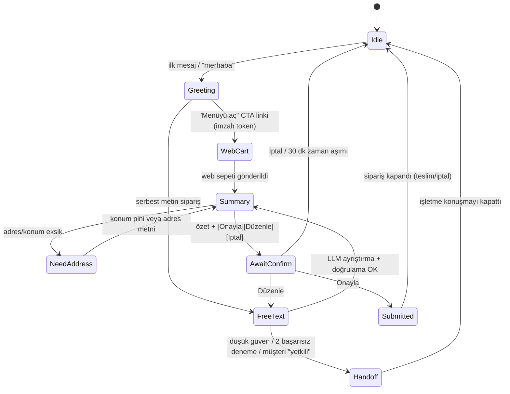
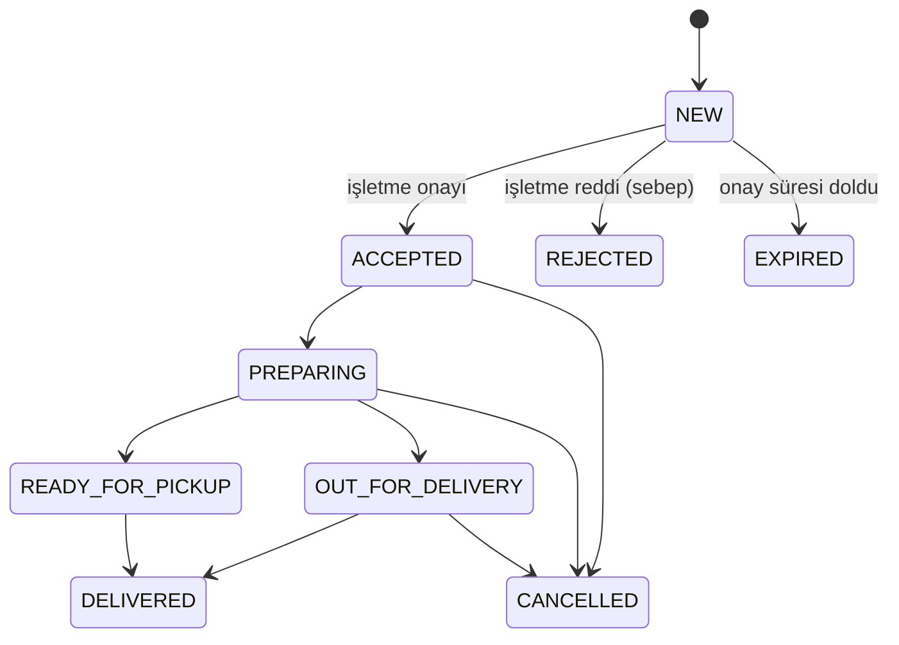
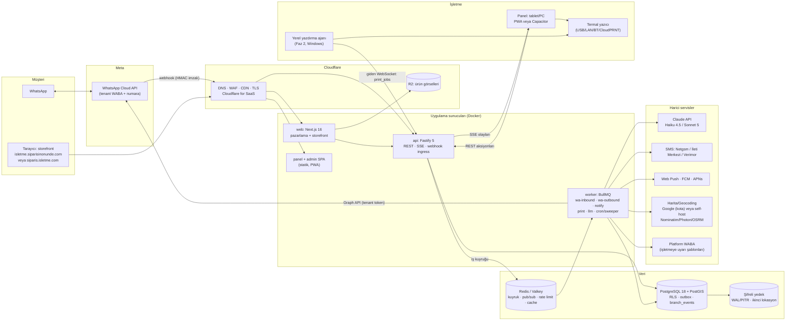

# 04 — Teknik Mimari ve Teknoloji Yığını (2026 güncel)

**Proje:** siparisinonunde ("Siparişin Önünde"), WhatsApp üzerinden komisyonsuz sipariş alma SaaS'ı
**Tarih:** 24 Eylül 2026
**Kapsam:** Stack seçimi, multi-tenancy, alan adları ve SSL, gerçek zamanlı bildirim, termal yazıcı, WhatsApp webhook mimarisi, konuşma durum makinesi, harita ve konum, barındırma, güvenlik, LLM ile sipariş anlama, mobil, mimari diyagram, servis listesi, klasör yapısı, 0-100-1000 işletme maliyet tahmini.

---

## Metodoloji ve güvenilirlik notu (önce bunu okuyun)

- Bu oturumda **WebSearch kotası dolmuştu** (paralel oturumlar 200/200 aramayı kullanmış). Ayrıca ağ proxy'si birçok alan adını engelledi: hetzner.com, aws.amazon.com, developers.google.com, mapsplatform.google.com, vercel.com, caddyserver.com, developer.mozilla.org, supabase.com, kvkk.gov.tr, mevzuat.gov.tr, netgsm.com.tr, better-auth.com, laravel.com ve diğerleri.
- Doğrulama bu yüzden şu yollarla yapıldı:
  - Erişilebilen resmi sayfalar: `platform.claude.com`, `cloud.google.com`.
  - Resmi dokümanların **GitHub'daki kaynak dosyaları**: Cloudflare, Caddy, MDN, Laravel, Filament, Better Auth, Socket.IO, BullMQ, Supabase, OWASP, PostgreSQL, Next.js, Nominatim, Photon, OSRM, Star, Sunmi, QZ.
  - Paket kayıtları: npm registry, Packagist. Sürüm numaraları buradan, **24.09.2026** itibarıyla okundu.
  - Kardeş raporlar: `01-whatsapp-platform.md` [S01] ve `02-pazar-rakipler-is-modeli.md` [S02].
- Etiketler:
  - **[R]** Resmi kaynak. Bu oturumda okundu. Bazıları resmi dokümanın GitHub kaynağından okundu.
  - **[K]** Resmi paket kaydı veya resmi kod deposu (npm, Packagist, GitHub).
  - **[3P]** Üçüncü taraf kaynak.
  - **[S01]/[S02]** Kardeş rapor. Oradaki kaynak zinciri geçerli.
  - **[E] DOĞRULANAMADI.** Eğitim bilgisi. Bu oturumda resmi kaynaktan teyit edilemedi. Canlıya çıkmadan önce kontrol edilmeli.
  - **[T] Tahmin.** Varsayımlar yanında yazılı.
- Kur varsayımı: **1 USD ≈ 48,4 TL** (TCMB, 24.09.2026, [S01] üzerinden). TL karşılıkları yaklaşıktır.

---

## 0. Yönetici özeti (TL;DR)

1. **Stack önerisi: TypeScript monorepo.** pnpm ve Turborepo kullanılır. Bileşenler:
   - Next.js 16: pazarlama sitesi ve storefront.
   - React + Vite 8: işletme ve admin panelleri (SPA + PWA).
   - Fastify 5: API, SSE ve webhook ingress.
   - BullMQ 6 worker'ları.
   - PostgreSQL 18 + PostGIS, Drizzle ORM.
   - Redis veya Valkey.
   - Better Auth 1.7.

   Gerekçeler: frontend, backend ve mobil tek dilde yazılır. AI destekli geliştirmede verim yüksektir. Gerçek zamanlılık ve PWA/mobil ihtiyacı güçlüdür. **İstisna:** Ekip zaten Laravel'de uzmansa Laravel 13 + Filament 5 + Reverb + Horizon eşit derecede meşru bir seçimdir. Admin paneli daha hızlı çıkar. BaaS (Supabase/Firebase) çekirdek olarak **önerilmez**.
2. **Multi-tenancy:** Tek paylaşımlı veritabanı kullanılır. Her tabloda `tenant_id` bulunur. PostgreSQL Row Level Security **ikinci savunma hattı** olarak açılır. Hiyerarşi: `tenant (işletme) → branch (şube) → menü/bölge/numara/yazıcı`. Şema başına kiracı önerilmez (migration ve operasyon yükü).
3. **Alan adları:**
   - Alt alan adları (`isletme.siparisinonunde.com`): Cloudflare'de wildcard DNS ve sertifika ile.
   - Özel alan adları: **Cloudflare for SaaS**. İlk **100 hostname ücretsiz**, sonrası **$0,10/hostname/ay** [R].
   - Alternatif: Caddy On-Demand TLS. Ücretsiz, ancak "ask" endpoint'i **zorunlu** [R].
4. **Gerçek zamanlılık:** Siparişin kaçmaması bir **veri tasarımı** meselesidir:
   - Her şube için sıralı bir olay günlüğü tutulur (`branch_events.seq`).
   - Panel **SSE + Last-Event-ID** ile yeniden bağlandığında kaçan olayları yeniden oynatır.
   - 30-60 sn'de bir "emniyet sorgusu" (açık siparişleri çek) yapılır.
   - Her sipariş için **onay (ack)** alınır. Onaylanmayan sipariş için kademeli alarm devreye girer: ses, push, platform numarasından işletme sahibine WhatsApp, SMS, arama/müşteriye bilgi.
5. **Ses ve ekran:**
   - Tarayıcı autoplay kuralları gereği vardiya başında "**Sesli uyarıyı başlat**" düğmesi zorunludur [R].
   - Wake Lock: Chrome 84+, Firefox 126+, Safari 16.4+, **iOS 18.4+** [R].
   - iOS'ta Web Push yalnızca **ana ekrana eklenmiş web app'te** çalışır (16.4+) [R].
   - Güvenilir alarm için **Android + Capacitor uygulaması** önerilir.
6. **Termal yazıcı:**
   - MVP: tarayıcı yazdırma (80 mm CSS).
   - Faz 1.5: Android/Sunmi uygulamasında **otomatik ESC/POS** (USB/Bluetooth/LAN 9100).
   - Faz 2: Windows için küçük bir **yerel yazdırma ajanı** (Go veya Tauri). Premium alternatif: Star CloudPRNT.
   - WebUSB yalnız Chromium'da çalışır [R]. Ana yol yapılmamalı.
   - Türkçe karakterler için CP857/CP1254 veya raster baskı gerekir.
7. **WhatsApp webhook:**
   - İmza doğrulanır, ham olay DB'ye yazılır, **hemen 200** dönülür.
   - Kuyruk (jobId = olay hash'i ile tekilleştirme) → worker. `wamid` UNIQUE tutulur.
   - Konuşma başına sıralı işleme (advisory lock) yapılır. **BullMQ "group" özelliği Pro'ya özeldir** [R].
   - Giden mesajlar için outbox deseni ve numara/alıcı başı hız sınırlayıcı kullanılır.
   - Konuşma ve sipariş için **iki ayrı durum makinesi** kurulur.
8. **Harita:**
   - Teslimat bölgesi PostGIS poligonlarıyla tanımlanır (`ST_Covers`).
   - WhatsApp konum pini zaten lat/lng verir, geocoding gerekmez.
   - Google Maps'te Mart 2025'ten beri **SKU başına aylık ücretsiz kota** var: Essentials 10.000, Pro 5.000, Enterprise 1.000 [S02]. Kota platform geneli için geçerlidir.
   - Ölçekte Nominatim/Photon/OSRM self-host düşünülmeli.
9. **Barındırma ve KVKK:**
   - **AWS'nin Türkiye bölgesi yok.** botocore bölge listesi, Eylül 2026 [K].
   - **Google Cloud lokasyon sayfasında Türkiye yok.** Sayfa 23.09.2026'da güncellenmiş [R].
   - Azure DOĞRULANAMADI.
   - Kişisel verinin yurt dışında işlenmesi KVKK m.9 kapsamındadır. 2024 değişikliğiyle standart sözleşme ve bildirim rejimi geldi [E].
   - **Yurt içi mi, AB mi** kararı hukuk raporuyla verilmeli (bkz. §7.2).
   - Teknik öneri: Docker Compose ile tek sunucudan başlanır, 2-3 sunucuya ölçeklenir.
   - PITR yedek: pgBackRest veya WAL-G.
   - Görseller: Cloudflare R2. Egress ücretsiz, $0,015/GB-ay, 10 GB ücretsiz [R].
10. **Güvenlik:**
    - Better Auth (organization, 2FA/TOTP, phone OTP, rate limit eklentileri) [R].
    - **Auth.js artık Better Auth'un parçası**, yeni projelere Better Auth öneriliyor [R].
    - **Lucia v3 npm'de deprecated** [K].
    - Hedef OWASP **ASVS 5.0.0** (Mayıs 2025) [R]. Tenant yalıtımı ve kimlik için L2.
    - WhatsApp token'ları envelope encryption ile saklanır.
11. **LLM:**
    - Yalnızca serbest metin siparişlerde kullanılır. Varsayılan akış web sepet linkidir.
    - Model: **Claude Haiku 4.5** ($1/$5 per MTok). Zor vakalarda **Sonnet 5**'e yükseltilir ($2/$10) [R].
    - Retrieval ile küçültülmüş prompt'ta sipariş başı maliyet **≈ $0,005 (≈0,25 TL)** [T].
    - Her zaman "özet + Onayla/Düzenle/İptal butonları" gösterilir. Fiyat **sunucuda** hesaplanır.
    - Anthropic API'de yalnızca `us`/`global` inference geo var. **Haiku 4.5 `inference_geo` desteklemiyor** [R]. Bu bir yurt dışı aktarımıdır. PII maskeleme yapılmalı.
12. **Mobil:**
    - İşletme uygulaması: önce PWA, ardından **Capacitor 8** ile Android sarmalayıcı (yazıcı ve native alarm için).
    - Kurye: v1 PWA, v2 **Expo SDK 57 / React Native 0.87** (arka plan konum).
13. **Altyapı maliyeti [T]:**

    | Ölçek | Aylık maliyet | İşletme başı |
    |---|---|---|
    | Pilot | ~$40-100 | - |
    | 100 işletme | ~$600-1.200 | ~$6-12 |
    | 1.000 işletme | ~$3.500-7.000 | ~$3,5-7 |

    **En büyük değişken kalem LLM'dir.** Sunucu maliyeti düşük kalır, çünkü yük küçük: 1.000 işletmede zirve ~2 sipariş/sn.

---

## 1. Stack karşılaştırması

### 1.1 Adaylar ve güncel sürümler (24.09.2026)

| Bileşen | Güncel sürüm | Kaynak |
|---|---|---|
| Next.js | 16.3.6 (middleware → **`proxy.ts`** olarak yeniden adlandırıldı) | [K] npm; [R] https://nextjs.org/docs/app/api-reference/file-conventions/proxy |
| React | 19.3.0 | [K] npm |
| Vite | 8.3.1 | [K] npm |
| Fastify | 5.12.5 | [K] npm |
| Hono | 4.13.9 | [K] npm |
| NestJS (@nestjs/core) | 12.1.0 | [K] npm |
| Prisma | 7.10.0 stabil (7.0: 19.11.2025). `latest` etiketi 8.0.0-rc.15 | [K] npm |
| Drizzle ORM | 0.45.3 stabil. 1.0.0-rc.5 sürüyor | [K] npm |
| BullMQ | 6.3.8 | [K] npm |
| Socket.IO | 4.8.3 | [K] npm |
| Better Auth | 1.7.6 | [K] npm |
| Turborepo | 2.11.3 | [K] npm |
| Laravel | 13.33.0. 13.x çıkışı 17.03.2026, PHP ≥ 8.3, güvenlik desteği 17.03.2028'e kadar | [K] Packagist; [R] https://laravel.com/docs/13.x/releases |
| Filament | 5.8.4 (20.09.2026). Livewire v4 | [K] Packagist; [R] github.com/filamentphp/filament |
| Laravel Reverb / Horizon | 1.12.0 / 5.50.0 | [K] Packagist |
| Expo / React Native | SDK 57 / 0.87.1 | [K] npm |
| Capacitor | 8.5.2 | [K] npm |
| PostgreSQL | master dalı "20devel". 18 kararlı (Eylül 2025), 19'un çıkış durumu teyit edilmedi | [K] github.com/postgres/postgres; [E] |

### 1.2 Üç yaklaşımın kıyası

| Kriter | (a) TypeScript monorepo | (b) Laravel 13 + Filament 5 | (c) Supabase/Firebase BaaS |
|---|---|---|---|
| **Dil birliği** | Tek dil: storefront, panel, API, worker, mobil (Expo/Capacitor), paylaşılan tipler ve Zod şemaları | Backend PHP, storefront ve panelde Inertia+React ise iki dil | Frontend TS. İş mantığı Edge Functions (Deno) ve SQL'e dağılır |
| **Admin panel üretme hızı** | Orta. shadcn/ui + TanStack Table veya Refine 5 / React-Admin 5.15 [K] ile birkaç gün-hafta | **En hızlı.** Filament'te CRUD, filtre, aksiyon ve widget'lar dakikalar içinde çıkar. Çok kiracılı panel desteği var [R] | Studio veri düzenler, ama ürün paneli yine yazılmalı |
| **Gerçek zamanlılık** | Socket.IO veya SSE. Tam kontrol, yeniden oynatma desenleri kolay | Reverb (first-party WebSocket) + Echo. İyi entegre | Supabase Realtime hazır. Kota: Free 200 eşzamanlı bağlantı, Pro 500 dahil sonrası $10/1000. Mesaj: 2M / 5M dahil, sonrası $2,50/M [R] |
| **Kuyruk ve arka plan işleri** | BullMQ (Redis). Olgun. Grup başı rate limit **yalnız Pro'da** [R] | Horizon + Redis kuyrukları. Çok olgun | Edge Functions + pg_cron/pgmq. Uzun süreli worker zayıf [E] |
| **WhatsApp webhook ve ham gövde imzası** | Kolay (Fastify raw body) | Kolay (middleware) | Edge Function ile mümkün. Soğuk başlatma ve süre limitleri riskli [E] |
| **AI destekli geliştirme (Claude vb.)** | Çok iyi. Tip güvenliği, derleyici hataları modele geri bildirim sağlar | Çok iyi. Laravel konvansiyonları güçlü. Laravel 13 first-party **AI SDK** içeriyor [R] | İyi, ama RLS politikaları ve SQL hataları sessizce veri sızdırabilir |
| **Türkiye'de geliştirici bulma** | React/Node havuzu geniş [E, istatistik doğrulanamadı] | PHP/Laravel havuzu geniş, özellikle ajans/KOBİ projelerinde [E] | Supabase deneyimi nadir [E] |
| **Performans** | Node + Fastify ile bu iş yükü için fazlasıyla yeterli | PHP-FPM/Octane ile yeterli | Yönetilen, ama kontrol az |
| **Vendor lock-in** | Düşük | Düşük | Orta-yüksek (Auth, Realtime, Storage) |
| **Veri yeri (KVKK)** | Serbest | Serbest | Supabase bölgeleri arasında Türkiye yok [E]. Free projeler 1 hafta hareketsizlikte duraklatılır [R] |
| **Maliyet (başlangıç)** | Tek VPS | Tek VPS | Free → Pro "$25'ten başlayan" (Micro compute dahil). PITR ayrı: **$100/ay / 7 gün** [R] |

Kaynaklar: Supabase plan verisi https://github.com/supabase/supabase/blob/master/packages/shared-data/plans.ts ve `pricing.ts` [R]; Filament tenancy https://filamentphp.com/docs/5.x/users/tenancy [R]; Laravel 13 sürüm notları [R].

### 1.3 TypeScript içindeki alt seçimler

| Karar | Seçenekler | Öneri ve gerekçe |
|---|---|---|
| API framework | NestJS 12 / **Fastify 5** / Hono 4 | **Fastify.** Uzun ömürlü Node süreci, SSE, raw-body ile imza doğrulama ve plugin ekosistemi var. Zod type-provider ile tipli route yazılır. NestJS'in DI/modül yapısı küçük ekip için fazla tören getirir. Hono edge/Workers için güzeldir, ancak bizim yük uzun süreli worker ve bağlantı içeriyor. |
| ORM | Prisma 7 / **Drizzle** | **Drizzle.** SQL'e yakın. PostGIS, `pg_trgm` ve RLS politikaları (`pgPolicy`, [K] `drizzle-orm/src/pg-core/policies.ts`) doğrudan yazılabilir. Migration'lar SQL olarak okunur. Prisma 7'nin DX'i iyi, ancak RLS ve `SET LOCAL` deseni için ek sarmalayıcı gerekir [E]. |
| Gerçek zamanlı | Socket.IO / **SSE** | **SSE + REST.** Panelde sunucudan istemciye akış yeterli, aksiyonlar REST ile gider. Detay §3.1. |
| Kuyruk | **BullMQ** / pg-boss 12 / Graphile Worker | **BullMQ.** Redis zaten pub/sub ve rate limit için gerekli. pg-boss "yalnız Postgres" sadeliği için iyi bir B planı. |
| Panel UI | Next.js / **Vite SPA** | Panel ve admin: **Vite + React + TanStack Router/Query + shadcn/ui**. Statik deploy edilir, PWA olur, SSR gerekmez. Storefront ve pazarlama sitesi: **Next.js 16** (SEO, ISR, çok host'lu yönlendirme `proxy.ts` ile). |
| Monorepo | **pnpm + Turborepo** / Nx | Turborepo: basit ve cache'li. |
| Doğrulama ve sözleşme | **Zod 4** + OpenAPI / tRPC 11 | Zod şemaları `packages/core`'da paylaşılır. Dış API (ileride entegrasyonlar) için OpenAPI üretilir. |

### 1.4 BaaS (Supabase/Firebase) neden çekirdek olarak önerilmiyor?

- **WhatsApp webhook, sıra ve idempotency, yazıcı ajanı ve uzun süreli worker'lar** BaaS'ın zayıf olduğu alanlar. Hepsi özel backend gerektiriyor. Sonuç yine "BaaS + ayrı backend" olur ve karmaşıklık artar.
- Supabase Realtime'ın eşzamanlı bağlantı ve mesaj kotası (Pro: 500 bağlantı dahil) [R], 1.000 işletme × 2-3 cihazda ek ücrete döner. Asıl risk bağlantı sayısı değil, "kaçırılan olayın telafisi"nin yine bize kalmasıdır.
- Firebase Firestore'un NoSQL modeli; sipariş, menü, seçenek ve rapor gibi ilişkisel veriye uymaz. PostGIS de yoktur. **Fiyatları bu oturumda doğrulanamadı [E].**
- **Uygun kullanım:** Supabase yalnızca "yönetilen PostgreSQL + PITR" olarak kullanılabilir (Auth/Realtime kullanılmadan). Bölge ve KVKK kararı buna izin veriyorsa bu makul bir alternatiftir.

### 1.5 Karar kuralı

- **Varsayılan:** (a) TypeScript monorepo. Storefront, panel ve mobil aynı dilde yazılır. SSE/PWA/Capacitor/Expo ekosistemi tek elde toplanır. Claude ile uçtan uca tipli kod yazılır.
- **Ekip Laravel ustasıysa:** (b). Karşılıkları:
  - Filament 5: süper admin ve işletme paneli.
  - Inertia + React veya Livewire 4: storefront.
  - Reverb: gerçek zamanlılık.
  - Horizon: kuyruk.
  - Fortify: kimlik doğrulama ve 2FA.
  - Spatie Permission: RBAC.

  Mimari ilkeler (§2-§9) iki yığında da aynıdır.
- **(c) BaaS'ı çekirdek yapmayın.**

---

## 2. Multi-tenancy

### 2.1 Modeller

| Model | Artı | Eksi | Karar |
|---|---|---|---|
| **Paylaşımlı DB + `tenant_id` + RLS** | Tek migration, basit operasyon. Çapraz tenant raporlar (süper admin) kolay. Bağlantı havuzu verimli | Uygulama hatası sızıntı riski taşır, RLS ile hafifletilir. "Gürültülü komşu" riski var | **Önerilen** |
| Şema başına kiracı | Mantıksal yalıtım | 1.000 şemada migration süresi, `search_path` hataları ve katalog şişmesi. PgBouncer ile uyumsuzluk riski | Önerilmez |
| DB başına kiracı | Güçlü yalıtım, kurumsal müşteriye cazip | Maliyet ve operasyon çok yüksek | Yalnız ileride "kurumsal zincir" planı için |

### 2.2 RLS uygulaması (savunma derinliği)

PostgreSQL resmi dokümanına göre [R, https://www.postgresql.org/docs/current/ddl-rowsecurity.html, GitHub `doc/src/sgml/ddl.sgml`]:
- Süper kullanıcılar ve `BYPASSRLS` rolleri RLS'yi **her zaman atlar**.
- Tablo sahibi de normalde atlar. Bunu engellemek için `FORCE ROW LEVEL SECURITY` kullanılır.

```sql
-- Uygulama rolü: tablo sahibi DEĞİL, BYPASSRLS YOK
CREATE ROLE app_user LOGIN PASSWORD '...' NOBYPASSRLS;

ALTER TABLE orders ENABLE ROW LEVEL SECURITY;
ALTER TABLE orders FORCE ROW LEVEL SECURITY;

CREATE POLICY tenant_isolation ON orders
  USING      (tenant_id = current_setting('app.tenant_id', true)::uuid)
  WITH CHECK (tenant_id = current_setting('app.tenant_id', true)::uuid);
-- current_setting(..., true) ayar yoksa NULL döner → hiçbir satır görünmez (fail-closed)
```

```ts
// Her istek bir transaction içinde; SET LOCAL transaction bitince düşer.
await db.transaction(async (tx) => {
  await tx.execute(sql`select set_config('app.tenant_id', ${tenantId}, true)`);
  // ... sorgular
});
```

Kurallar:
- `SET` değil **`SET LOCAL` / `set_config(..., true)`** kullanılmalı. PgBouncer transaction modunda oturum değişkeni başka isteğe sızabilir [E].
- `tenant_id` ilk sütun olacak şekilde **bileşik indeksler** kurulmalı: `(tenant_id, branch_id, created_at DESC)`.
- **Bileşik yabancı anahtar** kullanılmalı: `FOREIGN KEY (tenant_id, branch_id) REFERENCES branches(tenant_id, id)`. Bu, farklı tenant'ın şubesine referansı DB seviyesinde imkânsız kılar.
- **Süper admin** ayrı bir DB rolüyle ve ayrı bir servis yolunda çalışır. Her erişimi audit log'a yazılır.
- **Worker'lar** (webhook, bildirim) her iş için tenant'ı olaydan çözer. `phone_number_id` → branch → tenant eşlemesi yapılır ve aynı `set_config` uygulanır.
- CI'da "tenant yalıtım testi" koşulur. Her endpoint, başka tenant'ın ID'siyle çağrıldığında 404/403 dönmelidir (IDOR testi).

### 2.3 Hiyerarşi ve şube modeli

```
platform
 └─ tenant (işletme / marka; abonelik, fatura, KVKK sorumlusu)
     ├─ users ↔ memberships (rol: owner, manager, operator, kitchen, courier; kapsam: tenant veya branch)
     ├─ menu (tenant seviyesinde katalog)
     │    └─ branch_menu_overrides (şubeye özel fiyat, stokta yok, gizle)
     └─ branch (şube)
          ├─ whatsapp_number (phone_number_id, WABA; genellikle şube başına 1)
          ├─ storefront_host (alt alan / özel alan; şube veya marka seviyesinde)
          ├─ delivery_zones (PostGIS poligon, ücret, min. sepet, tahmini süre)
          ├─ opening_hours, holidays, "şu an kapalı" anahtarı
          ├─ printers (mutfak / bar / kasa yönlendirmesi)
          ├─ devices (panel oturumları, push abonelikleri, son görülme)
          └─ orders → order_items → order_item_options, order_events
```

- Tek şubeli esnaf için şube görünmez tutulur (varsayılan şube).
- Menü tenant seviyesinde tanımlanır, şube override'ları ayrı tutulur. Zincirlerde fiyat farkları bu şekilde yönetilir.
- WhatsApp numarası **şube başına** önerilir, çünkü müşteri hangi şubeye yazdığını bilir. Tek numaralı çok şubeli marka için "konuma göre şube seçimi" (en yakın veya poligon içindeki şube) akışı eklenir.

### 2.4 Storefront alan adları ve otomatik SSL

| Seçenek | Nasıl çalışır | Maliyet | Artı / eksi |
|---|---|---|---|
| **Alt alan adı** `*.siparisinonunde.com` | Cloudflare'de wildcard DNS (proxied). Tek wildcard sertifika. Uygulama `Host` başlığından tenant'ı çözer | Cloudflare Free'de universal SSL birinci seviye wildcard'ı kapsar [E] | En basit. MVP'de yalnız bu olsun |
| **Cloudflare for SaaS (Custom Hostnames)** | Müşteri `siparis.isletme.com` için CNAME'i bizim fallback origin'e yönlendirir. CF sertifikayı otomatik alır ve yeniler | Free/Pro/Business planlarında **100 hostname dahil**, sonrası **$0,10/hostname/ay**. Üst limit 50.000, Enterprise'da özel [R] | Edge'de WAF, DDoS ve cache. Sertifika operasyonu yok. **Önerilen** |
| **Caddy On-Demand TLS** | İlk TLS el sıkışmasında sertifika alır. "Ask" endpoint'i ile alan adını doğrular | Ücretsiz (Let's Encrypt/ZeroSSL) | "**On-demand TLS must be both enabled and restricted to prevent abuse**" [R]. Dahili limit: ACME hesabı başına 10 deneme/10 sn [R]. Kendi edge'imizi yönetiriz. CF'siz senaryoda iyi |
| **Vercel Domains API** | Proje başına özel alan adı ekleme API'si | **DOĞRULANAMADI** (vercel.com erişilemedi) [E] | Next.js'i Vercel'de barındırmayı ve KVKK/maliyet kararını beraberinde getirir. Önerilmez |

Kaynaklar: https://developers.cloudflare.com/cloudflare-for-platforms/cloudflare-for-saas/plans/ (GitHub: cloudflare/cloudflare-docs) [R]; https://caddyserver.com/docs/automatic-https#on-demand-tls (GitHub: caddyserver/website) [R].

**Uygulama:**
- Next.js 16'da `proxy.ts` (eski middleware) `Host` → `tenant/branch` çözümler. Eşleme Redis'te 60 sn cache'lenir.
- Bilinmeyen host için 404 döner.
- Özel alan adı ekleme akışı: işletme panelde alan adını girer → CNAME talimatı gösterilir → CF API ile hostname oluşturulur → doğrulama durumu gösterilir.

---

## 3. Gerçek zamanlı sipariş bildirimi

### 3.1 WebSocket ve SSE

| Özellik | WebSocket (Socket.IO) | SSE (EventSource) |
|---|---|---|
| Yön | Çift yönlü | Sunucudan istemciye (aksiyonlar REST) |
| Yeniden bağlanma | Socket.IO otomatik. **Connection State Recovery** Redis Streams adaptörüyle çalışır, klasik Redis adaptörüyle **çalışmaz**. `maxDisconnectionDuration` sonlu olmalı [R] | Tarayıcı otomatik bağlanır. **`Last-Event-ID`** başlığıyla kaldığı yerden devam eder |
| Çok sekme | Sorun yok | HTTP/1.1'de **tarayıcı + alan adı başına 6 bağlantı** sınırı var. HTTP/2'de akış sayısı müzakere edilir (varsayılan 100) [R] |
| Ölçekleme | Long-polling fallback'te sticky session gerekir [E] | Durumsuz. Redis pub/sub ile fan-out |
| Proxy/CDN | Cloudflare WebSocket'i proxy'ler [E] | Nginx'te `X-Accel-Buffering: no`. CF'de ~100 sn boşta kalma limitine karşı 15-25 sn heartbeat [E] |

Kaynaklar: https://socket.io/docs/v4/connection-state-recovery (GitHub: socketio/socket.io-website) [R]; https://developer.mozilla.org/en-US/docs/Web/API/EventSource (GitHub: mdn/content) [R].

**Öneri: SSE + REST + DB olay günlüğü.** Hangi taşıma seçilirse seçilsin, **kaçırılan olayın telafisi DB'den yapılmalıdır**. Bellek içi recovery pencereleri (Socket.IO CSR) yalnızca kısa kopmaları kapsar.

### 3.2 Kaçırılmaz olay deseni

```
Sipariş oluştu (tx) ──► orders INSERT + branch_events INSERT (seq = şube başına artan bigint)
                        + outbox INSERT (bildirim/yazdırma işleri)
COMMIT ──► Redis PUBLISH branch:{id} {seq}
SSE sunucusu ──► bağlı panellere "id: {seq}\ndata: {...}\n\n"
Panel koptu ──► yeniden bağlanırken Last-Event-ID: 1042 → sunucu seq>1042 olayları DB'den basar
Emniyet ağı ──► panel her 30-60 sn'de GET /branches/:id/open-orders?since=... (SSE sessizce ölmüşse)
Ack ──► panel siparişi görünce POST /orders/:id/seen (cihaz, kullanıcı); "onayla" ayrı aksiyon
```

- **Görüldü (seen)** ile **onaylandı (accepted)** ayrı tutulur. Kademeli alarm (§3.8) "onaylanmadı" durumuna bakar.
- `branch_events` 7-30 gün tutulur, sonrası arşivlenir (aylık partition).
- Sunucu, SSE üzerinden 20 sn'de bir `: ping` gönderir. İstemci 45 sn sessizlik görürse bağlantıyı kendisi yeniler.

### 3.3 Çoklu sekme ve çoklu cihaz

- **Sekme lideri seçimi:** `navigator.locks.request('siparis-alarm', ...)`. Web Locks desteği: Chrome 69, Firefox 96, Safari 15.4 [R, MDN BCD]. Yalnız lider sekme ses çalar.
- Sekmeler arası durum paylaşımı `BroadcastChannel` ile yapılır (Chrome 54, Firefox 38, Safari 15.4) [R].
- **Cihazlar arası:** Bir cihazda "onayla" basılınca SSE olayı tüm cihazlarda alarmı susturur ve "Ayşe onayladı · 14:02" gösterir.
- **Cihaz kaydı:** `devices(last_seen_at, push_subscription, app_version, audio_unlocked, wake_lock_active)`. Admin panelinde ve işletme sahibi uyarılarında kullanılır.

### 3.4 Sesli uyarı ve autoplay kısıtları

- MDN'nin genel kuralı: sesli medya, kullanıcı siteyle **etkileşime girmişse** (tık, dokunma, tuş) otomatik çalabilir. Programatik başlatılan sesli oynatma, etkileşim olmamış sekmede **genellikle engellenir** [R, https://developer.mozilla.org/en-US/docs/Web/Media/Guides/Autoplay].
- Web Audio `AudioContext` de aynı kurallara tabidir [R].
- `navigator.getAutoplayPolicy()` yalnız **Firefox 112+**'da var. Chrome ve Safari'de yok [R, BCD]. Tespit için `audio.play()` promise'inin `NotAllowedError` ile reddedilmesi yakalanır [R].
- **Uygulama:**
  1. Vardiya başında tam ekran "**Siparişleri almaya başla**" düğmesi gösterilir. Bu jest `AudioContext.resume()` çağırır ve sessiz bir test sesi çalar.
  2. Yeni siparişte döngüsel alarm çalar, "Gördüm/Onayla" basılana kadar sürer.
  3. Ses kilitliyse ekranda kırmızı bant ve titreşen başlık/favicon gösterilir. Uygulama rozeti `navigator.setAppBadge()`: Chrome 81 masaüstü, Safari 17, iOS 16.4 (ana ekran app'i) [R, BCD].
  4. Ayarlarda "Ses testi" ve seviye göstergesi olur. Cihaz sesi kısıksa algılanamaz, bu yüzden eğitimle desteklenir.

### 3.5 Ekranın kapanmasını engelleme (Screen Wake Lock)

- Destek: Chrome 84, Firefox 126, Safari 16.4, **Safari iOS 18.4** [R, MDN BCD].
- Kilit düşük pil, güç tasarrufu veya **sayfa görünmez olduğunda** sistem tarafından serbest bırakılır. Serbest bırakılan sentinel tekrar kullanılamaz, **yeniden istenmelidir** [R, MDN Screen Wake Lock API].
- Uygulamada `visibilitychange` → `visible` olduğunda yeniden istenir. Durum panelde ikonla gösterilir.

### 3.6 PWA + Web Push

- `PushManager` desteği [R, BCD]:
  - Chrome 42, Firefox 44, Safari 16 (macOS Ventura+).
  - **iOS/iPadOS 16.4:** "Notifications are supported in web apps saved to the home screen." Yani iOS'ta kullanıcı paneli **Ana Ekrana Ekle** yapmalı, izin kullanıcı jestiyle istenmeli.
- Web Push, sekme kapalıyken de uyarır. Ancak **tekrarlayan ve özel alarm sesi** web bildiriminde pratikte yok [E]. Bu yüzden push "ikinci kanal" olarak kalır.
- Kütüphaneler: `web-push` 3.6.7 (VAPID), Serwist 9.5 veya `vite-plugin-pwa` 1.3 [K].

### 3.7 Mutfak ve kasa cihazı önerisi

- **Önerilen cihaz:** 8-10" Android tablet veya Sunmi benzeri POS.
  - Sürekli şarjda.
  - Capacitor uygulamasıyla çalışır: ekranı açık tutar, native bildirim kanalı ve özel alarm sesi kullanır, ESC/POS yazdırır.
- **PC kasada:** Chrome'da kurulu PWA. Yazdırma için kiosk-printing veya yerel ajan (§4).
- **Ağ:** Dükkân Wi-Fi'ı kesilirse tablet 4G'ye düşmeli. SIM'li tablet veya telefon hotspot'u önerilir.

### 3.8 Katmanlı "sipariş kaçmasın" güvenliği

| Süre (varsayılan, işletme ayarlar) | Kanal | Not |
|---|---|---|
| t=0 | Panel sesi + görsel alarm + Web/native push | Tüm cihazlara |
| t+60 sn | Ses yükselir veya tekrar eder, push tekrar edilir | |
| t+2 dk | **Platformun kendi WhatsApp numarasından** işletme sahibine utility şablonu ("#1234 2 dk'dır onay bekliyor") | Türkiye utility ≈ **$0,0009** [S01]. İşletmenin kendi numarasından değil, ayrı platform WABA'sından gönderilir |
| t+4 dk | SMS (Netgsm, İleti Merkezi, Verimor) | Toplu SMS ≈ **0,16-0,43 TL** [S02, 3P] |
| t+6 dk | Otomatik sesli arama (TTS). Sağlayıcının API'si varsa | **DOĞRULANAMADI** [E]. Faz 2 |
| t+8-10 dk | Müşteriye bilgi: "İşletme henüz onaylamadı, beklemek ister misiniz?" (Bekle / İptal butonları) | Müşteri deneyimini korur. Otomatik red veya iptal işletme ayarıdır |

**Ek önlemler:**
- **Panel çevrimdışı alarmı:** Açık saatlerde bir şubenin hiçbir aktif cihazı yoksa (SSE bağlantısı veya heartbeat 3 dk yok) sahibine WhatsApp veya SMS gider. İsteğe bağlı olarak storefront "şu an sipariş alınmıyor" moduna geçer.
- **Webhook sessizliği alarmı:** Bir numaradan N saattir webhook gelmiyorsa ve mesai saatindeysek admin uyarısı üretilir. Meta 7 güne kadar retry yapar, sipariş kaybolmaz ama **gecikir** [S01].
- **SLO metrikleri:**
  - Webhook → panel p95 < 3 sn.
  - "Onaylanmamış > 2 dk" sipariş oranı.
  - Şube başına çevrimiçi cihaz sayısı.

---

## 4. Termal yazıcı ve otomatik fiş

### 4.1 Seçenekler

| Yöntem | Nasıl | Sessiz ve otomatik mi? | Platform | Değerlendirme |
|---|---|---|---|---|
| **Tarayıcı yazdırma + CSS** | `@page { size: 80mm auto; margin: 0 }`, `window.print()` | Hayır, diyalog açılır. Chrome `--kiosk-printing` bayrağıyla diyalogsuz olur [E] | Her yer | **MVP.** Sıfır kurulum. Kiosk kısayolu belgelenir |
| **QZ Tray** | Yerel Java uygulaması. JS kütüphanesi WebSocket ile ham ESC/POS gönderir | Evet. İmza sertifikası olmadan her işte onay ister [E] | Windows, macOS, Linux | Kaynak **LGPL-2.1** [R, github.com/qzind/tray]. Ücretli destek ve sertifika fiyatı **DOĞRULANAMADI** (qz.io erişilemedi). npm `qz-tray` 2.3.0 [K] |
| **Kendi yerel ajanımız** (Go veya Tauri) | Ajan **dışarıya** WebSocket açar, buluttan iş çeker. USB/LAN(9100)/Bluetooth yazıcıya ham ESC/POS gönderir | Evet | Windows önce | **Faz 2 önerisi.** NAT/port sorunu yok. Mutfak, bar ve kasa yönlendirmesi ve yeniden baskı tek yerde. Kod imzalama sertifikası gerekir [E] |
| **WebUSB** | Tarayıcıdan USB yazıcıya doğrudan | Evet (ilk eşleştirmeden sonra) | **Chrome 61+ masaüstü ve Android.** Firefox ve Safari yok [R, BCD] | Windows'ta sürücü çakışması (WinUSB) yaşanabilir [E]. Ana yol değil |
| **Web Serial** | Seri/USB-seri/Bluetooth SPP yazıcı | Evet | Chrome 89 masaüstü, **Chrome Android 148**, **Firefox 151**. Safari yok [R, BCD] | Android'de Bluetooth yazıcı için yeni bir seçenek. Test edilmeli |
| **Epson ePOS SDK for JavaScript / Server Direct Print** | Yazıcının dahili web sunucusu veya yazıcının sunucumuzu periyodik sorgulaması | Evet | Uyumlu Epson modelleri | Model listesi ve Türkiye bulunabilirliği **DOĞRULANAMADI** [E] |
| **Star CloudPRNT** | "Yazıcıdan uzak sunucudaki back-end servisine" HTTP protokolü. Yazıcı sunucuyu sorgular. SDK durum çözme, format dönüştürme ve Star Document Markup sağlar [R] | Evet, **yerel ajan yok** | Uyumlu Star modelleri | En temiz bulut deneyimi. Yazıcılar pahalı ve daha az yaygın [E]. Premium seçenek. https://github.com/star-micronics/cloudprnt-sdk |
| **Sunmi / Android POS** | Dahili yazıcı: `com.sunmi:printerlibrary` (AIDL yerine Printer Interface Library) [R, github.com/shangmisunmi/SunmiPrinterDemo] | Evet | Sunmi cihazları | Capacitor eklentisiyle (kendi yazacağımız ince native köprü) **Faz 1.5** |
| **Android uygulamasından LAN 9100 / Bluetooth** | Capacitor native eklenti, ham ESC/POS | Evet | Android | Faz 1.5 |

**ESC/POS üretimi:** `@point-of-sale/receipt-printer-encoder` 4.0.1 veya `node-thermal-printer` 4.6.1 [K]. Şablonlar `packages/receipt` içinde tek kaynaktan yönetilir. HTML önizleme ve ESC/POS çıktısı aynı veri modelinden üretilir.

### 4.2 Türkçe karakter sorunu

- ESC/POS yazıcılarda "ğ, ş, ı, İ, ç, ö, ü" için yazıcının **PC857 (Türkçe) veya WPC1254** kod sayfasını desteklemesi ve seçilmesi gerekir. Ucuz yazıcılarda kod sayfası numaraları üreticiye göre değişir [E].
- **Güvenli yol:** Fişi **raster görüntü olarak** basmak. Biraz yavaştır, ama her yazıcıda aynı görünür. Varsayılan raster olmalı, "hızlı metin modu" opsiyonel kalmalı.

### 4.3 Türkiye'de yaygın yazıcılar

- Gözlem, **DOĞRULANAMADI [E]:**
  - Xprinter (XP-58/XP-80 serisi, USB/LAN/BT).
  - Rongta.
  - Epson TM-T20 serisi / TM-m30.
  - Star TSP100/TSP143.
  - Sunmi V2/T2 gibi Android POS'lar.
- Ayrıca **ÖKC** (yeni nesil yazarkasa POS: Hugin, Beko, Ingenico vb.) var. Bunlar mali cihazdır, bizim fişimizi basmazlar.
- Pilot işletmelerde envanter anketi yapılmalı (açık soru).

### 4.4 Mali belge notu

Bizim bastığımız fiş **sipariş/hazırlık fişidir, mali belge değildir**. Yasal fiş ve fatura ÖKC'den veya e-Arşiv'den kesilir. Fişe "Mali değeri yoktur" ibaresi eklenmesi yaygın uygulamadır [E]. Mali müşavirle teyit edilmeli. ÖKC entegrasyonu (GMP3 vb.) ayrı bir büyük konudur. MVP dışında tutulmalı.

### 4.5 Yazdırma iş akışı

`print_jobs(id, branch_id, printer_id, order_id, template, payload, status, attempts, idempotency_key)` tablosu kullanılır:
- Sipariş **onaylandığında** (veya ayara göre geldiğinde) mutfak fişi, bar fişi ve kasa fişi işleri oluşur.
- Ajan veya uygulama iş çeker, "basıldı" ack'i döner. Başarısız olursa panelde "Yazıcı hatası, tekrar bas" gösterilir.
- Yeniden baskıda "KOPYA" ibaresi yer alır.

### 4.6 Öneri

| Faz | Çözüm |
|---|---|
| MVP | Tarayıcı yazdırma (80 mm ve 58 mm şablon) |
| Faz 1.5 | Android/Sunmi uygulamasında otomatik baskı (dahili, LAN, BT) |
| Faz 2 | Windows ajanı (Go, tek exe, otomatik güncelleme) |
| Premium | Star CloudPRNT desteği |

---

## 5. WhatsApp webhook alımı ve konuşma motoru

Platform detayları (Embedded Signup, Coexistence, fiyatlar, BSUID, hata kodları) [S01]'de. Burada yalnız **güvenilir işleme mimarisi** var.

### 5.1 Ingress (alım): imza → kalıcı kayıt → hemen 200

```ts
// apps/api/src/routes/whatsapp-webhook.ts (Fastify + fastify-raw-body)
app.get('/webhooks/whatsapp', async (req, reply) => {
  const q = req.query as Record<string, string>;
  if (q['hub.mode'] === 'subscribe' && q['hub.verify_token'] === env.WA_VERIFY_TOKEN)
    return reply.type('text/plain').send(q['hub.challenge']);
  return reply.code(403).send();
});

app.post('/webhooks/whatsapp', { config: { rawBody: true } }, async (req, reply) => {
  const ok = verifyMetaSignature(req.rawBody as Buffer, req.headers['x-hub-signature-256'] as string, env.META_APP_SECRET);
  if (!ok) return reply.code(401).send();              // HMAC-SHA256, ham gövde, timingSafeEqual [S01]
  const eventId = sha256Hex(req.rawBody as Buffer);    // aynı teslimat tekrar gelirse aynı id
  await db.insert(waRawEvents).values({ id: eventId, body: req.body, receivedAt: new Date() })
          .onConflictDoNothing();
  await inboundQueue.add('wa-inbound', { eventId }, {
    jobId: eventId, attempts: 10, backoff: { type: 'exponential', delay: 2000 },
    removeOnComplete: 10_000, removeOnFail: false,
  });
  return reply.code(200).send();                       // işleme asenkron
});
```

- **Sweeper (süpürücü):** DB'ye yazılıp kuyruğa eklenemeyen olaylar için (Redis anlık çöküşü) her dakika bir cron çalışır. `processed_at IS NULL AND received_at < now()-30s` olan olayları yeniden kuyruğa atar. Bu, **ingress için transactional outbox** işlevi görür.
- Meta'nın zaman aşımı değeri resmi olarak doğrulanamadı. Retry'lar **7 güne kadar** üstel geri çekilmeyle yapılır [S01].

### 5.2 Idempotency ve sıralama

- **Mesaj seviyesi:** `messages.wamid UNIQUE`. Aynı mesaj ikinci kez işlenmez.
- **İş seviyesi:** BullMQ özel `jobId` ile aynı işi tekrar eklemez. Ayrıca "deduplication" seçenekleri var [R, https://docs.bullmq.io/guide/jobs/deduplication].
- **Konuşma içi sıra:**
  - BullMQ'da grup bazlı işleme ve grup başı rate limit **BullMQ Pro** özelliği (`WorkerPro`, `group.limit`) [R, https://docs.bullmq.io/bullmq-pro/groups/rate-limiting].
  - Açık kaynak sürümde çözüm: worker konuşmayı işlerken `pg_advisory_xact_lock(hashtext(conversation_id))` alır. Mesajlar `timestamp` ve `wamid`'e göre sıralanır, konuşmanın "son işlenen zaman damgası"ndan eski olanlar durum makinesine "geç gelen" olarak verilir.
  - Alternatif: BullMQ Pro lisansı. Fiyat **DOĞRULANAMADI** [E].
- **Durum (status) webhook'ları:** `sent < delivered < read` monoton tutulur, `failed` terminaldir. Eski durum yenisinin üzerine yazılmaz [S01].

### 5.3 Retry, DLQ ve tekrar oynatma

- Kalıcı hatalar (geçersiz payload, bilinmeyen `phone_number_id`) **hemen** `failed`'a gider. Geçici hatalar üstel geri çekilmeyle tekrar denenir.
- BullMQ `failed` kümesi **DLQ** işlevi görür. Admin panelinde "Başarısız webhook olayları" ekranı olur: payload, hata, "yeniden işle" butonu.
- Sentry'ye hata ve bağlam gönderilir: tenant, `phone_number_id`, `wamid`.

### 5.4 Giden mesajlar: outbox + hız sınırlama

```
iş olayı (sipariş onaylandı) ──tx──► outbox(id, tenant_id, branch_id, to_bsuid, kind, template?, payload,
                                           dedupe_key UNIQUE (order_id, event), status, attempts, wamid)
wa-sender worker ──► pencere kontrolü (24 sa açık mı? değilse utility template)
                 ──► numara başı token bucket (varsayılan 80 msg/sn; Coexistence 20 msg/sn) [S01]
                 ──► alıcı başı aralık (~6 sn'de 1; 131056 hatası) [S01] → ardışık durum mesajlarını birleştir
                 ──► Graph API → wamid kaydet → status webhook'larıyla eşle
```

- Rate limiter: Redis tabanlı `rate-limiter-flexible` 11.2.1 [K]. Anahtarlar `wa:num:{phone_number_id}` ve `wa:pair:{phone_number_id}:{bsuid}`.
- Zaman aşımında **körlemesine yeniden gönderim yapılmaz**. Graph API'de idempotency anahtarı doğrulanamadı [S01]. Önce "bu dedupe_key için wamid var mı" kontrol edilir.
- Token'lar worker içinde çözülür ve bellekte kısa süre tutulur (§8.6).

### 5.5 Konuşma durum makinesi

**İlke:** Konuşma (sohbet akışı) ve sipariş (iş yaşam döngüsü) **ayrı makinelerdir**. Konuşma, siparişi *oluşturur*. Sipariş ondan sonra kendi yolunda ilerler.





**Uygulama detayları:**
- Durum makinesi **tablo güdümlü, saf fonksiyon** olarak yazılır: `transition(state, event, ctx) → {nextState, effects[]}`. `packages/core` içinde durur ve birim testlidir.
  - Effect'ler (mesaj gönder, sipariş oluştur, alarm kur) outbox'a yazılır.
  - XState 5.33 [K] modelleme ve görselleştirme için kullanılabilir, ancak zorunlu değil.
- `conversations(id, tenant_id, branch_id, customer_bsuid, state, context JSONB, version, window_expires_at, updated_at)`. Güncellemede `version` ile **iyimser kilit** kullanılır.
- **Her durumda geçerli global olaylar:**
  - "iptal" / "yetkili" / "insan" anahtar kelimeleri.
  - İşletmenin panelden devralması (Handoff).
  - 24 saat pencere bitişi.
  - Coexistence'ta işletmenin telefondan yazdığı `smb_message_echoes` gelirse bot susar ve konuşma Handoff'a geçer [S01].
- Sipariş durum değişiklikleri müşteriye şablonlu metinlerle gider: onay (tahmini süre), yola çıktı, teslim edildi, iptal (sebep).

---

## 6. Harita, konum ve teslimat bölgeleri

### 6.1 Türkiye adres yapısı

- Hiyerarşi: **il → ilçe → mahalle/köy → cadde/sokak → dış kapı (bina) no → iç kapı (daire) no**. NVİ'nin **UAVT**'sinde her bağımsız bölümün **adres kodu** (10 haneli) vardır.
- Ticari kullanıma açık resmi bir UAVT API'si olup olmadığı bu oturumda **DOĞRULANAMADI** [E]. adres.nvi.gov.tr erişilemedi.
- **Öneri:** UAVT'ye bağımlı olunmamalı. Saklanacak alanlar:
  - `il, ilçe, mahalle, sokak, bina_no, daire_no, kat`.
  - `adres_tarifi` (serbest metin, kurye için en değerli alan).
  - `location geography(Point)`.
  - `adres_kodu` (opsiyonel).
- İl/ilçe/mahalle açılır listeleri için açık veri setleri var, ancak güncellik ve lisans kontrol edilmeli [E].

### 6.2 Teslimat bölgeleri (PostGIS)

```sql
CREATE TABLE delivery_zones (
  id uuid PRIMARY KEY, tenant_id uuid NOT NULL, branch_id uuid NOT NULL,
  name text, area geography(Polygon, 4326) NOT NULL,
  fee_kurus integer NOT NULL, min_basket_kurus integer, eta_minutes int, priority int DEFAULT 0,
  active boolean DEFAULT true
);
CREATE INDEX ON delivery_zones USING gist (area);

-- Nokta hangi bölgede? (öncelik en yüksek olan)
SELECT * FROM delivery_zones
WHERE branch_id = $1 AND active AND ST_Covers(area, ST_SetSRID(ST_MakePoint($lng, $lat), 4326)::geography)
ORDER BY priority DESC LIMIT 1;
```

- İşletme poligonu panelde harita üstünde çizer. Önerilen araçlar: Terra Draw 1.35 veya Leaflet 1.9 + çizim eklentisi, MapLibre GL 6.11 [K].
- **Ücret kuralları** (sırasıyla):
  1. Bölge sabit ücreti.
  2. Mesafe bantları (0-2 km, 2-4 km ...).
  3. Min. sepet ve "şu tutarın üstü ücretsiz".
- Para birimi **kuruş (integer)** olarak tutulur, float kullanılmaz.
- Mesafe iki yolla ölçülebilir:
  - **Kuş uçuşu:** `ST_Distance(geography)` × yol katsayısı (~1,3) [T]. Hızlı ve bedava.
  - **Gerçek yol:** OSRM `route`/`table` servisi. Türkiye extract'ı ile self-host edilir. OSRM Nearest, Table, Match ve Trip servisleri sunar [R, https://github.com/Project-OSRM/osrm-backend].

### 6.3 Geocoding ve harita seçenekleri

| Seçenek | Fiyat ve kota | Not |
|---|---|---|
| **Google Maps Platform** | Mart 2025'ten beri **SKU başına aylık ücretsiz kota**: Essentials 10.000, Pro 5.000, Enterprise 1.000 çağrı. **Kota platform hesabı geneli için geçerli**, işletme başına değil [S02, kaynak: https://developers.google.com/maps/billing-and-pricing/march-2025]. Aşım birim fiyatları **DOĞRULANAMADI** (sayfa erişilemedi) [E] | Türkiye'de adres kalitesi ve Places Autocomplete güçlü [E]. Storefront adres otomatik tamamlamasında cazip. 1.000 işletme × her siparişte çağrıda kota hızla aşılır |
| Mapbox / HERE / Yandex | **DOĞRULANAMADI** (siteler erişilemedi) [E] | Türkiye adres kapsamı pilotta A/B test edilmeli. Yandex'in Türkiye verisi güçlü olabilir [E] |
| **Nominatim (self-host)** | Lisans ücreti yok. Kurulum için min. **2 GB RAM**. Tam gezegen için 128 GB+ RAM ve 1 TB+ disk önerilir [R, https://nominatim.org/release-docs/latest/admin/Installation/] | Yalnız **Türkiye extract'ı** ile çok daha küçük sunucu yeter [T]. Adres kalitesi OSM'ye bağlı, mahalle ve bina no eksik olabilir [E] |
| **Photon (self-host)** | OpenSearch tabanlı, yazarken tamamlama (autocomplete). Gezegen ~95 GB disk, ~64 GB RAM önerilir. **Ülke dump'ları hazır** [R, https://github.com/komoot/photon] | Nominatim'e göre autocomplete için daha uygun |
| **Harita karoları** | MapLibre + Protomaps `pmtiles` 4.5 [K] ile R2'de statik karo | `tile.openstreetmap.org` ticari yoğun kullanım için uygun değil. OSMF karo politikası **DOĞRULANAMADI** [E] |

### 6.4 WhatsApp konum pininin işlenmesi

1. Müşteriye **Location request message** ("Konum gönder" butonu) gönderilir [S01].
2. Gelen `type: "location"` mesajında `latitude, longitude, (name, address)` alanları var [S01]. **Geocoding gerekmez.**
3. `ST_Covers` ile bölge bulunur → ücret, min. sepet ve tahmini süre hesaplanır. Bölge dışıysa "Bu adrese teslimat yok, gel-al ister misiniz?" denir.
4. İsteğe bağlı ters geocoding yapılır (Nominatim veya Google). Panelde "Kadıköy, Caferağa Mah." gibi okunur bir etiket gösterir.
5. **Mutlaka** "Bina no, daire, kat ve tarif" metni istenir. Kurye için en kritik veri budur.
6. Adres `customer_addresses` olarak kaydedilir. Sonraki siparişte "Kayıtlı adresinize mi (Ev · Caferağa)?" sorulur.

**Öneri:** MVP'de konum pini + poligon + kuş uçuşu mesafe kullanılır. Storefront'ta Google Places Autocomplete ücretsiz kota içinde kullanılır, kayıtlı adreslerle çağrı sayısı düşürülür. 300+ işletmede Photon/Nominatim/OSRM Türkiye self-host'u maliyet açısından değerlendirilir [T].

---

## 7. Barındırma, KVKK, depolama, gözlemlenebilirlik, CI/CD

### 7.1 Büyük bulutların Türkiye bölgesi var mı? (Eylül 2026)

| Sağlayıcı | Durum | Kaynak |
|---|---|---|
| **AWS** | **Yok.** En yakınlar: eu-central-1 Frankfurt, eu-south-1 Milano, il-central-1 Tel Aviv, me-central-1 BAE, me-south-1 Bahreyn. (botocore yalnız açılmış bölgeleri listeler, duyurulmuş ama açılmamışları göstermez.) | [K] https://github.com/boto/botocore/blob/develop/botocore/data/endpoints.json |
| **Google Cloud** | Lokasyon sayfasında (son güncelleme **23.09.2026**) Türkiye/İstanbul **yok**. En yakınlar: europe-west3 Frankfurt, europe-central2 Varşova, me-central1 Doha, me-central2 Dammam, me-west1 Tel Aviv. Turkcell-Google Cloud iş birliğine dair haberler olabilir, ancak bu oturumda **DOĞRULANAMADI** | [R] https://cloud.google.com/about/locations; [E] |
| **Azure** | **DOĞRULANAMADI** (erişim yok). Bildiğimiz kadarıyla Türkiye bölgesi yok [E] | - |

### 7.2 KVKK ve yurt içi barındırma

> Bu bölüm teknik bakış açısıdır. mevzuat.gov.tr ve kvkk.gov.tr bu oturumda **erişilemedi**. Aşağıdakiler **[E]**'dir ve hukuk raporuyla teyit edilmelidir.

- **7499 sayılı Kanun** (RG 12.03.2024, yürürlük 01.06.2024) KVKK m.9'u değiştirdi. Yurt dışı aktarım yolları:
  - Yeterlilik kararı.
  - Uygun güvenceler: Kurul'un ilan ettiği **standart sözleşme**, bağlayıcı şirket kuralları, taahhütname.
  - Arızi (istisnai) durumlar.
- **Standart sözleşme imzalandıktan sonra 5 iş günü içinde Kurum'a bildirilmelidir** [E].
- **Açık rıza** artık düzenli/sistematik aktarım için dayanak olarak zayıf. Yalnız arızi aktarımlarda istisna olarak kullanılabilir [E].
- Özel sektör gıda siparişi için genel bir **veri yerelleştirme zorunluluğu bilinmiyor** [E]. Bankacılık ve ödeme gibi sektörel düzenlemeler ayrıdır. 2025'te çıkan Siber Güvenlik Kanunu'nun (7545) etkisi hukuk raporunda değerlendirilmeli [E].
- **Pratik sonuç (teknik öneri):**
  1. WhatsApp zaten Meta'ya (yurt dışı) veri taşıyor. Bunun sorumluluk ilişkisi (işletme = veri sorumlusu, biz = veri işleyen, Meta = alt işleyen/ayrı sorumlu) hukukçuyla netleştirilmeli.
  2. **Bizim veritabanımız** (müşteri adı, telefon, adres, sipariş geçmişi) için iki meşru yol var:
     - **Türkiye'de barındırma.** Yurt dışı aktarım yükü en aza iner. Yönetilen servis azdır, operasyon bizde kalır.
     - **AB'de barındırma** (Hetzner, AWS Frankfurt vb.) + sağlayıcıyla **KVKK standart sözleşmesi** + bildirim. Kritik soru: yabancı sağlayıcı Türk standart sözleşmesini imzalıyor mu? **Açık soru.**
  3. Cloudflare (TLS sonlandırma) ve LLM sağlayıcısı da veri işler. Aktarım envanterinde listelenmeli.
- **Öneri:** Kişisel veri içeren birincil DB ve yedeklerin **Türkiye'de** tutulduğu mimari varsayılan olsun. Statik görseller (kişisel veri değil) R2/CDN'de tutulabilir. Hukuk AB'yi onaylarsa aynı Docker tabanlı kurulum Hetzner'e taşınabilir, maliyet düşer [T].

### 7.3 Sağlayıcı seçenekleri

> **Fiyatların hiçbiri bu oturumda doğrulanamadı** (hetzner.com, digitalocean.com, aws.amazon.com ve Türk sağlayıcı siteleri erişilemedi). Aşağıdaki aralıklar **[E/T]**'dir. Teklif ve fiyat sayfasıyla teyit edilmeli.

| Sağlayıcı | Tip | Aylık fiyat aralığı [E/T] | Artı / eksi |
|---|---|---|---|
| Hetzner (DE/FI) | Cloud VPS, dedicated | 4 vCPU/8 GB VPS ~€10-20. Güçlü dedicated ~€40-120 | En iyi fiyat/performans. Yönetilen PG yok. AB (KVKK aktarım) |
| DigitalOcean (FRA/AMS) | VPS + yönetilen PG/Redis | Yönetilen PG başlangıç ~$15-60 | Yönetilen servisler kolay. AB |
| AWS / GCP (Frankfurt vb.) | Tam bulut | RDS/Cloud SQL küçük örnek ~$50-200+ | En zengin servis. Pahalı egress. AB |
| **Türk sağlayıcılar** (Turkcell Bulut, Türk Telekom Bulut, Radore, Natro, Veridyen vb.) | VPS, dedicated, colocation, bazılarında obje depolama | **DOĞRULANAMADI**, teklif alınmalı | **Yurt içi veri.** Yönetilen PG/obje depolama/otomasyon sınırlı olabilir. SLA ve ağ kalitesi sağlayıcıya göre değişir |
| Cloudflare | DNS, WAF, CDN, R2, Images, Tunnel, Access | Free ile başlanır (R2 ve Images kotaları aşağıda) | Edge güvenliği ve TLS. TLS sonlandırma yurt dışında olabilir [E] |

### 7.4 Önerilen başlangıç topolojisi ve ölçekleme

**Faz 0-1 (pilot, ≤ 30 işletme):** Tek sunucu + Docker Compose.
```
[Cloudflare] ─► [Sunucu A: Caddy/Traefik → web(Next) · api(Fastify) · worker(BullMQ) · panel(statik)
                           PostgreSQL 18 + PostGIS · Redis/Valkey (AOF açık) · pgBackRest]
                 └─► WAL + günlük yedek → ikinci lokasyon (şifreli)
[Staging sunucusu] ayrı, küçük; Meta test numarası ve ayrı WABA
```

**Faz 2 (30-300 işletme):**
- Sunucu A: app (web/api/worker) × 2 replika.
- Sunucu B: PostgreSQL primary.
- Sunucu C: PostgreSQL hot standby (streaming replication) + Redis replika.
- Yük dengeleme Cloudflare Load Balancing ile veya Caddy ile yapılır. Oturumsuz (stateless) API sayesinde yatay ölçekleme kolaydır.

**Faz 3 (300-1.000+ işletme):**
- App düğümleri N adet.
- PG primary + senkron standby + okuma replikası (raporlar).
- Redis Sentinel (3 düğüm).
- Worker'lar kuyruk türüne göre ayrılır: wa-inbound, wa-outbound, notify, print, llm.
- Orkestrasyon için Kubernetes şart değildir. Kamal, Coolify, Dokploy veya Nomad yeterlidir [E].

### 7.5 PostgreSQL, yedekleme ve felaket kurtarma

- **PITR:**
  - pgBackRest veya WAL-G ile sürekli WAL arşivi + günlük tam/diferansiyel yedek.
  - Hedef: **RPO ≤ 5 dk, RTO ≤ 2 sa** [T].
  - Referans: Supabase'de PITR eklentisi "$100/ay, 7 gün saklama" [R]. Kendi kurulumumuzda maliyet disk ve depolamadan ibaret.
- Yedekler **şifreli** tutulur (pgBackRest repo şifreleme).
- Yedek hesabı **ayrı kimlik bilgileriyle** yönetilir, mümkünse object lock/immutability kullanılır.
- **Ayda bir geri yükleme tatbikatı** yapılır, runbook yazılır.
- Uzantılar:
  - `postgis`.
  - `pg_trgm` (menü bulanık arama).
  - `unaccent`.
  - **ICU `tr-TR` collation** (Türkçe sıralama ve `İ/ı` büyük-küçük harf sorunları için) [E].
- Zaman: DB `timestamptz`. İş kuralları `Europe/Istanbul` (UTC+3) ile çalışır.

### 7.6 Görseller ve CDN

- **Cloudflare R2:** Standard depolama **$0,015/GB-ay**, Class A **$4,50/milyon**, Class B **$0,36/milyon**, **egress ücretsiz**. Ücretsiz katman: 10 GB-ay, 1M Class A, 10M Class B [R, https://developers.cloudflare.com/r2/pricing/].
- **Cloudflare Images (dönüşüm):** Free planda ayda **5.000 benzersiz dönüşüm**. Aşımda yeni dönüşümler hata verir, ücret alınmaz. Paid planda 5.000 dahil, sonrası **$0,50/1.000 benzersiz dönüşüm** [R, https://developers.cloudflare.com/images/pricing/]. Alternatif: self-host `imgproxy` [E].
- **Akış:**
  1. Panelden yükleme → presigned URL ile doğrudan R2'ye gider.
  2. Worker EXIF'i temizler, AVIF/WebP varyantları üretir (320/640/1080 px).
  3. Storefront `` ile CDN'den sunar.
- Backblaze B2 fiyatları **DOĞRULANAMADI** [E].

### 7.7 Gözlemlenebilirlik

| Katman | Araç | Not |
|---|---|---|
| Hata izleme | Sentry (`@sentry/nextjs` 11.0.0 [K]) veya self-host GlitchTip [E] | Fiyatlar **DOĞRULANAMADI** [E] |
| İz ve metrik | OpenTelemetry (`@opentelemetry/sdk-node` 0.222 [K]) → Grafana Tempo/Prometheus veya Grafana Cloud | Webhook → worker → SSE zinciri tek trace olarak izlenir |
| Log | Pino JSON → Loki (self-host) | Log'lara PII maskeleme uygulanır (telefon, adres) |
| Uptime | Uptime Kuma (self-host) + harici bir ping servisi | Webhook endpoint'i, storefront ve panel izlenir |
| İş metrikleri | Grafana dashboard | Aktif şube/cihaz, onaylanmamış sipariş, webhook gecikmesi, LLM başarı oranı, WA hata kodları |

### 7.8 CI/CD ve ortamlar

- **GitHub Actions:** lint, typecheck, test (tenant yalıtım testleri dahil) → Docker image → GHCR → staging'e otomatik deploy → prod'a manuel onayla deploy.
- Migration'lar ayrı bir adımda ve **geriye uyumlu** (expand/contract) çalışır.
- **Ortamlar:**

  | Ortam | Kurulum |
  |---|---|
  | `dev` | Lokal Docker Compose, Meta test numarası ve ngrok/cloudflared tunnel |
  | `staging` | Ayrı sunucu, ayrı Meta App/WABA, anonim veri |
  | `prod` | Canlı |

- Secret'lar ortam başına ayrılır (Doppler, 1Password veya SOPS+age [E]).

---

## 8. Güvenlik

### 8.1 Kimlik doğrulama yöntemleri

| Yöntem | Kimin için | Not |
|---|---|---|
| E-posta + şifre | İşletme kullanıcıları | Argon2id/bcrypt. Sızmış şifre kontrolü |
| **TOTP 2FA** | **İşletme sahibi ve platform adminleri için zorunlu**, diğerleri için opsiyonel | Yedek kodlar ve güvenilir cihaz |
| Magic link | Düşük sürtünmeli giriş (kasiyer) | Kısa ömürlü, tek kullanımlık |
| SMS OTP | Telefon doğrulama, şifre sıfırlama | Netgsm, İleti Merkezi, Verimor. Toplu SMS ≈ 0,16-0,43 TL [S02, 3P]. OTP özel tarifeleri **DOĞRULANAMADI** [E] |
| WhatsApp authentication şablonu | OTP alternatifi | Türkiye ≈ $0,0009 (~0,044 TL) [S01]. SMS'ten ucuz. Platform numarasından gönderilir |
| Cihaz eşleştirme (PIN/QR) | Mutfak tableti | Tablet uzun ömürlü "cihaz oturumu" alır. Kısıtlı rol (yalnız sipariş ekranı), panelden iptal edilebilir |

### 8.2 Kütüphaneler (2026 durumu)

- **Better Auth 1.7.6 [K]:**
  - Organization eklentisi: üyeler, davetler, takımlar, aktif organizasyon, hook'lar [R].
  - 2FA eklentisi: OTP, TOTP, yedek kodlar, güvenilir cihazlar [R].
  - Phone number eklentisi: `sendOTP` bizim SMS sağlayıcımızı çağırır. Doküman `sendOTP`'nin **await edilmemesini** öneriyor (zamanlama saldırısı ve gecikme) [R].
  - Dahili rate limit: varsayılan 60 sn / 100 istek, endpoint bazlı kural ve depolama seçenekleri [R].
  - Kaynak: https://github.com/better-auth/better-auth (docs/content/docs/plugins/...).
- **Auth.js (NextAuth):** "Auth js is now part of Better Auth. We recommend new projects to start with Better Auth…" [R, https://github.com/nextauthjs/next-auth README]. npm `latest` hâlâ 4.24.15, v5 beta.32'de [K].
- **Lucia:** npm paketi 3.2.2 **deprecated** ("This package has been deprecated. Please see https://lucia-auth.com/lucia-v3/migrate") [K]. Yeni projede kullanılmamalı.
- **Laravel tarafı:** Fortify (headless auth + 2FA), Sanctum (SPA/token), Spatie Permission [E].

### 8.3 RBAC

| Rol | Kapsam | Yetkiler (özet) |
|---|---|---|
| `platform_superadmin` | Platform | Her şey. Impersonation (kayıtlı, gerekçeli, süreli) |
| `platform_support` | Platform | Tenant görüntüleme, WABA sağlığı, webhook DLQ. Finans ve silme yok |
| `owner` | Tenant | Abonelik, faturalar, kullanıcılar, tüm şubeler, menü, raporlar, WhatsApp bağlantısı |
| `manager` | Şube | Menü override, saatler, bölgeler, yazıcılar, siparişler, raporlar (şube) |
| `operator` (kasa) | Şube | Sipariş onay/red/durum, müşteriyle yazışma, yeniden baskı |
| `kitchen` | Şube | Mutfak ekranı, "hazır" işaretleme |
| `courier` | Şube | Atanan teslimatlar, durum güncelleme, müşteriyi arama |

İzinler kodda `resource:action` olarak tanımlanır (`order:accept`, `menu:update`...). Roller bu izinlerin kümesidir. Kontrol API'de merkezi bir `authorize()` ile yapılır, UI sadece gizler.

### 8.4 Audit log

`audit_log(id, at, actor_user_id, actor_type[user|system|admin_impersonation], tenant_id, branch_id, action, entity, entity_id, before JSONB, after JSONB, ip, user_agent, request_id)`:
- Uygulama rolüne yalnız `INSERT` yetkisi verilir, `UPDATE/DELETE` verilmez.
- Aylık partition kullanılır, saklama süresi politikası belirlenir.
- İşletme sahibi kendi tenant'ının log'unu panelde görür (kim fiyat değiştirdi, kim siparişi iptal etti).

### 8.5 Rate limiting katmanları

1. Cloudflare WAF ve rate limiting kuralları: login, OTP, storefront sipariş gönderimi.
2. Better Auth dahili limitleri (auth endpoint'leri).
3. Uygulama: `rate-limiter-flexible` (Redis). IP + kullanıcı + tenant anahtarları. OTP için telefon başına günlük üst sınır (SMS pompalama saldırısına karşı).
4. Storefront sipariş formunda bot koruması (Cloudflare Turnstile [E]).

### 8.6 WhatsApp token'ları: envelope encryption

```ts
// Yazma: tenant başına DEK (AES-256-GCM); DEK, KEK ile sarılır.
const dek = crypto.randomBytes(32);
const { ciphertext, iv, tag } = aesGcmEncrypt(dek, Buffer.from(accessToken));
const wrappedDek = await kms.wrap(dek);             // KMS / Vault Transit / yerelde age anahtarı (HSM yoksa)
save({ tenantId, ciphertext, iv, tag, wrappedDek, kekVersion });

// Okuma: yalnızca wa-sender/wa-admin servislerinde; düz metin loglanmaz, bellekte kısa süre tutulur.
```

- KEK uygulama sunucusunda **düz dosya olarak durmaz**. Yönetilen KMS yoksa ayrı bir "secret" servisi (Vault/OpenBao Transit [E]) veya en azından ayrı bir sistem kullanıcısıyla korunan anahtar dosyası kullanılır.
- KEK rotasyonu için `kek_version` tutulur.
- Aynı desen Meta App Secret, PSP anahtarları ve SMS API anahtarları için de uygulanır.

### 8.7 OWASP ASVS

- **ASVS 5.0.0** (Mayıs 2025) güncel kararlı sürüm [R, https://github.com/OWASP/ASVS].
- Hedef: genel olarak **L1**. Kimlik doğrulama, oturum, erişim kontrolü ve tenant yalıtımı için **L2**.
- Öncelikli kontroller:
  - IDOR/BOLA testleri.
  - Webhook imzası.
  - Güvenli dosya yükleme (tip ve boyut, EXIF temizleme).
  - CSP.
  - `SameSite` çerezler.
  - Bağımlılık taraması (Dependabot/Renovate).
  - Secret taraması.

### 8.8 Yedek ve felaket kurtarma

- 3-2-1 kuralı: 3 kopya, 2 farklı ortam, 1 farklı lokasyon.
- PITR (§7.5) uygulanır.
- Altyapı kod olarak tutulur: Compose dosyaları ve provisioning script'leri.
- DR runbook'u: "Sunucu A gitti → B'de standby promote → DNS/LB → worker'ları başlat".
- Yılda 2 tam tatbikat yapılır.
- WhatsApp tarafında kesinti olursa Meta 7 güne kadar retry yapar [S01]. Uzun kesintide storefront "WhatsApp dışı" siparişe (web + telefon) yönlendirilir.

---

## 9. LLM ile serbest metin sipariş anlama

### 9.1 Ne zaman LLM?

- **Varsayılan akış LLM'siz:** Müşteriye **imzalı web sepet linki** gönderilir. Menü, seçenek ve ekstralar web'de, sepet deterministiktir [S01 önerisiyle uyumlu].
- LLM yalnızca müşteri **serbest metin** yazdığında devreye girer. Örnek: "2 adana 1 ayran, biri acısız olsun, kapıda kartla".
- LLM ayrıca soru ve niyet sınıflandırmasında kullanılabilir: "kaça kadar açıksınız", "siparişim nerede".

### 9.2 Türkçe performans

- Anthropic'in çok dillilik tablosu 14 dili kapsıyor, **Türkçe tabloda yok** [R, https://platform.claude.com/docs/en/build-with-claude/multilingual-support].
- Tablodaki benzer diller için Haiku 4.5, İngilizceye göre %92-96 düzeyinde. Örnekler: Almanca %94,3, Arapça %92,5 [R].
- **Sonuç:** Türkçe için **kendi eval setimiz şart.**
  - Pilot işletmelerden 300-500 gerçek mesaj toplanır (anonimleştirilmiş).
  - Etiketlenecek alanlar: ürün, adet, seçenek, not, niyet.
  - Ölçütler: satır bazında doğruluk, "gereksiz soru sorma" oranı, yanlış ürün oranı.
- Dikkat edilecek Türkçe olgular:
  - Yazım hataları ("lahmacun/lamacun"), yöresel adlar ("dürüm/sarma").
  - "Yarım/tam/1,5 porsiyon", "az pişmiş", "soğansız".
  - Emoji ve sayı yazımı ("iki", "2", "ikişer").

### 9.3 Güncel fiyatlar (per MTok, USD)

| Model | Girdi | Çıktı | Cache okuma | Batch (%50) | Kaynak |
|---|---|---|---|---|---|
| **Claude Haiku 4.5** | $1 | $5 | $0,10 | $0,50 / $2,50 | [R] https://platform.claude.com/docs/en/about-claude/pricing |
| **Claude Sonnet 5** | $2 | $10 | $0,20 | $1 / $5 | [R] Lansmandaki "tanıtım fiyatı" artık standart. 1 Eylül 2026'daki $3/$15'e artış **yapılmayacak** |
| Claude Opus 5.5 | $4 | $20 | $0,20 | $2 / $10 | [R] Bu iş için gereksiz |
| GPT-5.4 mini / nano | $0,75 / $0,20 | $4,50 / $1,25 | - | - | [3P] LiteLLM fiyat veri seti, https://github.com/BerriAI/litellm/blob/main/model_prices_and_context_window.json. OpenAI sayfası erişilemedi |
| Gemini 3.1 Flash-Lite / 2.5 Flash | $0,25 / $0,30 | $1,50 / $2,50 | - | - | [3P] aynı veri seti. Google sayfası erişilemedi |

**Notlar [R]:**
- Claude 4.7 ve sonrası modeller yeni tokenizer kullanır, aynı metinde **~%30 daha fazla token** üretir. Sonnet 5 buna dahil, Haiku 4.5 eski tokenizer'da.
- Prompt cache için minimum önek uzunluğu: Haiku 4.5'te **4.096 token**, Sonnet 5'te 1.024 token. Daha kısa önekler sessizce cache'lenmez (Anthropic prompt caching dokümanı).
- `inference_geo: "us"` 1,1× fiyatlıdır. **Haiku 4.5 `inference_geo` desteklemez (400 döner).** Seçenekler yalnız `us` ve `global` [R, data residency].

### 9.4 Sipariş başı maliyet [T]

Varsayımlar:
- Retrieval ile daraltılmış prompt: sistem talimatı + **ilgili ~30 menü satırı** ≈ 1.500 token + mesaj 150 token.
- Yapılandırılmış çıktı ≈ 350 token.
- Sipariş başına ortalama **1,5 çağrı** (bir düzeltme turu olasılığı).

| Model | Sipariş başı | TL (48,4) |
|---|---|---|
| Claude Haiku 4.5 | **≈ $0,005** | ≈ 0,25 TL |
| Claude Sonnet 5 (tokenizer +%30 dahil) | ≈ $0,013 | ≈ 0,64 TL |
| GPT-5.4 mini [3P fiyat] | ≈ $0,004 | ≈ 0,20 TL |
| Gemini 3.1 Flash-Lite [3P fiyat] | ≈ $0,0014 | ≈ 0,07 TL |

- **Tüm menüyü prompt'a koyup cache'lemek (Haiku, 5.000 token menü):**
  - Cache okunursa ≈ $0,0036/sipariş.
  - Her seferinde cache yazılırsa ≈ $0,012/sipariş.
  - Küçük restoranlarda siparişler 5 dk'dan seyrek geldiği için çoğu çağrı **yazma** olur. **Retrieval yaklaşımı daha ucuz ve daha doğru** [T].
- **Aylık [T]** (işletme başı 900 sipariş/ay [S02], %30'u serbest metin, $0,005-0,012/sipariş):

  | Ölçek | Aylık LLM maliyeti |
  |---|---|
  | 100 işletme | ≈ $135-324 |
  | 1.000 işletme | ≈ $1.350-3.240 |

- Karşılaştırma: Meta Business Agent 1M token için $2, mesaj başı ~4-5 cent [S01]. Bizim yaklaşım sipariş başı ~0,5 cent.

### 9.5 Pipeline ve yapılandırılmış çıktı

1. **Normalizasyon:** Küçük harf (Türkçe `İ→i`, `I→ı` kuralına dikkat), sayı sözcükleri → rakam, emoji temizliği.
2. **Aday getirme:** Menü öğeleri ve eş anlamlılar (`aliases`) için `pg_trgm` benzerliği + kısa bir eşanlamlı sözlük. Sonuç şubede **stokta olan** ilk ~30 aday.
3. **LLM çağrısı:** Claude Haiku 4.5 + **structured outputs** (`output_config.format` ile JSON schema). Haiku 4.5 destekleniyor [R].
4. **Sunucu tarafı doğrulama:** Kontroller:
   - `menu_item_id` şubede var ve satışta mı?
   - `quantity` 1-50 aralığında mı?
   - Seçenekler bu ürüne ait mi?
   - Zorunlu seçenek grupları dolu mu?

   **Fiyat ve toplam her zaman sunucuda hesaplanır.** LLM fiyat üretmez.
5. **Belirsizlik yönetimi:** `unmatched` veya `needs_clarification` varsa müşteriye **tek bir** netleştirme sorusu sorulur ("Adana dürüm mü porsiyon mu?"). İki başarısız turdan sonra insana devredilir.
6. **Özet + onay:** Müşteriye özet (ürünler, seçenekler, teslimat ücreti, toplam, adres) ve **reply butonları** gönderilir: [Onayla] [Düzenle] [İptal]. Reply butonları en fazla 3 adettir [E]. Onaysız sipariş panele **düşmez**.
7. **Loglama:** Girdi (maskelenmiş), çıktı, doğrulama sonucu ve müşteri düzeltmesi kaydedilir. Bu veri eval setini sürekli besler.

```json
{
  "type": "object",
  "additionalProperties": false,
  "required": ["intent", "items", "unmatched", "needs_clarification", "clarification_question", "fulfillment"],
  "properties": {
    "intent": { "type": "string", "enum": ["new_order", "modify_order", "question", "other"] },
    "fulfillment": { "type": "string", "enum": ["delivery", "pickup", "unknown"] },
    "items": {
      "type": "array",
      "items": {
        "type": "object",
        "additionalProperties": false,
        "required": ["menu_item_id", "quantity", "option_ids", "note", "confidence"],
        "properties": {
          "menu_item_id": { "type": "string" },
          "quantity": { "type": "integer" },
          "option_ids": { "type": "array", "items": { "type": "string" } },
          "note": { "type": "string" },
          "confidence": { "type": "string", "enum": ["high", "medium", "low"] }
        }
      }
    },
    "unmatched": { "type": "array", "items": { "type": "string" } },
    "needs_clarification": { "type": "boolean" },
    "clarification_question": { "type": "string" }
  }
}
```

**Şema kısıtları [R]:** Structured outputs; `minimum/maximum`, `minLength/maxLength` ve `minItems`'ın 0/1 dışındaki değerlerini **desteklemez**. Bu sınırlar sunucu tarafında Zod ile doğrulanmalıdır. Enum'lar yalnız ilkel tip içerebilir. Menü ID'lerini enum yapmak yerine string alıp doğrulamak daha esnektir.

### 9.6 Halüsinasyona karşı önlemler (özet)

- Yalnız aday listesindeki ID'ler kabul edilir. Listede olmayan ürün `unmatched`'e düşer.
- Fiyat ve stok LLM'e sorulmaz.
- **Müşteri onayı olmadan sipariş oluşmaz.** Onaylanan özet, siparişin "sözleşme metni" olarak saklanır.
- Düşük güvende soru sorulur, tahmin edilmez. Panelde "AI ile ayrıştırıldı" rozeti ve orijinal mesaj gösterilir.
- Prompt injection'a karşı kullanıcı mesajı talimat olarak değil veri olarak işlenir. Çıktı yalnız şemadır. Model araç çağırmaz, yan etki üretmez.

### 9.7 KVKK açısından LLM

- **Anthropic API [R]:**
  - Saklanan veri açık izin olmadan **model eğitimine kullanılmaz**.
  - Konuşma içeriği **varsayılan olarak saklanmaz**. İstisna: 30 gün saklama gerektiren "Covered Models" (üst segment Fable/Mythos) [R, https://platform.claude.com/docs/en/manage-claude/api-and-data-retention].
  - Güven ve güvenlik sistemlerinin işaretlediği içerik 2 yıla kadar tutulabilir [R].
  - Inference geo yalnız `global`/`us`. Workspace geo yalnız `us` [R]. **Türkiye/AB içinde işleme seçeneği yok**, yani yurt dışı aktarım söz konusu.
- **Önlemler:**
  - LLM'e **yalnız sipariş metni** gönderilir. Ad, telefon ve adres gönderilmez. Metin içindeki telefon numarası, TCKN ve adres kalıpları regex ile maskelenir.
  - Aydınlatma metnine "yapay zekâ ile sipariş ayrıştırma ve yurt dışı hizmet sağlayıcısı" maddesi eklenir.
  - Standart sözleşme veya alternatif güvenceler hukukça değerlendirilir.
- **Alternatifler:**
  - Claude'u Google Cloud Vertex AI veya Amazon Bedrock üzerinden AB bölgesinde çağırmak. Hangi modellerin hangi AB bölgesinde olduğu **DOĞRULANAMADI** (docs.cloud.google.com erişilemedi) [E]. AB de yurt dışıdır, ama sözleşme çerçevesi farklı olabilir.
  - İleride yerel (TR-hosted) açık model ile "PII hiç çıkmasın" modu.

---

## 10. Mobil

| Seçenek | Güncel | Artı | Eksi |
|---|---|---|---|
| **PWA** | Serwist 9.5 / vite-plugin-pwa 1.3 [K] | Sıfır mağaza süreci. Anında güncelleme | iOS'ta push yalnız ana ekran app'inde [R]. Arka planda ses ve yazıcı erişimi yok |
| **Capacitor** | 8.5.2 [K] | **Mevcut web paneli sarılır.** Native eklentilerle ESC/POS (USB/BT/LAN), Sunmi SDK, native bildirim kanalı ve özel alarm sesi, ekranı açık tutma | Native eklenti bakımı. Mağaza yayını |
| **React Native / Expo** | Expo SDK 57, RN 0.87.1 [K] | Kurye için arka plan konum, harita ve kamera gibi native ağırlıklı uygulamalar. EAS build | Paneli yeniden yazmak gerekir. EAS fiyatları **DOĞRULANAMADI** [E] |
| TWA (Trusted Web Activity) | [E] | PWA'yı Play Store'a koymanın en ucuz yolu | Native API yok |

**Öneri:**
- **İşletme uygulaması:** Önce PWA. İlk pilot geri bildiriminden sonra **Capacitor ile Android** sürümü çıkar. Motivasyon: güvenilir alarm, otomatik yazdırma, kiosk modu. iOS sürümü talebe göre gelir. Kod tabanı tek (panel), native kısım ince eklentilerden ibaret.
- **Kurye:**
  - v1: panelin **kurye görünümü** (PWA). Atanan siparişler, "yola çıktım/teslim ettim", Google Maps/Yandex yol tarifi deep link'i, müşteriyi ara/WhatsApp.
  - v2: **Expo** uygulaması. Arka plan konum ile canlı takip ve müşteriye "kurye yaklaşıyor" bildirimi.
  - Müşteriye canlı konum paylaşımı KVKK ve pil açısından ayrıca değerlendirilir.
- **Müşteri uygulaması yok.** WhatsApp ve storefront yeterli. Bu, ürünün ana tezidir.

---

## 11. Önerilen mimari

### 11.1 Diyagram



### 11.2 Servis listesi

| Servis | Sorumluluk | Teknoloji | Ölçekleme |
|---|---|---|---|
| `web` | Pazarlama sitesi, blog/SEO. Storefront (menü, sepet, adres, ödeme linki). Host → tenant çözümleme (`proxy.ts`) | Next.js 16 | Yatay, stateless, CDN cache |
| `api` | REST (panel, admin, storefront). SSE akışı. WhatsApp webhook ingress. Özel alan adı doğrulama. Yazdırma ajanı uç noktası | Fastify 5, Zod, Better Auth | Yatay. SSE için bağlantı başı az bellek |
| `worker-wa-inbound` | Ham olay → mesaj/konuşma → durum makinesi → sipariş | BullMQ | Kuyruk derinliğine göre |
| `worker-wa-outbound` | Outbox → Graph API. Pencere/şablon kararı, rate limit | BullMQ + Redis limiter | Numara başı limitlerle sınırlı |
| `worker-notify` | Push, platform WABA uyarıları, SMS, kademeli alarm zamanlayıcıları | BullMQ (delayed jobs) | Düşük |
| `worker-llm` | Serbest metin ayrıştırma ve niyet sınıflandırma | Anthropic SDK (`@anthropic-ai/sdk` 0.128 [K]) | Eşzamanlılık limiti ve bütçe koruması |
| `worker-print` | `print_jobs` üretimi, ESC/POS/raster render | receipt-printer-encoder | Düşük |
| `cron` | Sweeper, panel-çevrimdışı dedektörü, rapor özetleri, abonelik/fatura hatırlatmaları, partition bakımı | BullMQ repeatable | Tek lider |
| `panel` (SPA) | İşletme paneli: siparişler, menü, bölgeler, yazıcılar, kullanıcılar, raporlar, sohbet kutusu | React + Vite + TanStack + shadcn/ui | Statik |
| `admin` (SPA) | Süper admin: tenant'lar, abonelikler, WABA sağlığı, DLQ, impersonation, duyurular, feature flag | Aynı stack. Ayrı alan adı + Cloudflare Access [E] + zorunlu 2FA | Statik |
| `print-agent` (Faz 2) | Yerel yazıcılara ESC/POS | Go (tek binary) veya Tauri 2 | İşletme başına 1 |
| `mobile-business` (Faz 1.5) | Panelin Capacitor sarmalayıcısı + yazıcı ve alarm eklentileri | Capacitor 8 | - |
| `courier` (Faz 3) | Kurye uygulaması | Expo SDK 57 | - |
| Altyapı | PostgreSQL 18 + PostGIS, Redis/Valkey, Caddy/Traefik, pgBackRest, Prometheus/Grafana/Loki, Uptime Kuma, Sentry | Docker Compose → çoklu sunucu | §7.4 |

### 11.3 Klasör yapısı (pnpm + Turborepo)

```
siparisinonunde/
├─ apps/
│  ├─ web/                 # Next.js 16 — pazarlama + storefront (app/(marketing), app/(store)/[...]); proxy.ts
│  ├─ api/                 # Fastify — routes/{panel,admin,store,webhooks,sse,agent}, plugins/{auth,tenant,rawBody}
│  ├─ worker/              # BullMQ işçileri — queues/{wa-inbound,wa-outbound,notify,llm,print,cron}
│  ├─ panel/               # Vite + React — işletme paneli (PWA); features/{orders,menu,zones,printers,chat,reports}
│  ├─ admin/               # Vite + React — süper admin
│  ├─ mobile-business/     # Capacitor 8 — panel build'ini sarar; android/, ios/, plugins/{escpos,sunmi,alarm}
│  ├─ courier/             # (Faz 3) Expo
│  └─ print-agent/         # (Faz 2) Go
├─ packages/
│  ├─ db/                  # Drizzle şema, migrations (SQL), RLS politikaları, seed, test fixtures
│  ├─ core/                # Domain: order FSM, conversation FSM, fiyat/sepet hesaplama, bölge/ücret, saatler
│  ├─ whatsapp/            # Graph API istemcisi, webhook tipleri, imza doğrulama, şablon kayıt defteri, hata kodları
│  ├─ auth/                # Better Auth konfigürasyonu, RBAC izin tanımları, authorize()
│  ├─ llm/                 # Prompt'lar, JSON şemaları, normalizasyon, aday getirme, eval seti + runner
│  ├─ receipt/             # Fiş şablonları → HTML önizleme + ESC/POS/raster
│  ├─ notifications/       # Kademeli alarm politikası, kanal adaptörleri (push, platform WABA, SMS)
│  ├─ geo/                 # PostGIS yardımcıları, geocoding adaptörleri (google/nominatim/photon), OSRM
│  ├─ ui/                  # shadcn/ui bileşenleri, tema, ikonlar
│  ├─ i18n/                # tr (varsayılan), en
│  └─ config/              # tsconfig, eslint, prettier, vitest ortak ayarlar
├─ infra/
│  ├─ compose/             # docker-compose.{dev,staging,prod}.yml
│  ├─ caddy/ | traefik/    # reverse proxy
│  ├─ postgres/            # postgresql.conf, pgbackrest.conf, init SQL (roller, uzantılar)
│  ├─ observability/       # prometheus, grafana dashboards, loki
│  └─ runbooks/            # DR, olay müdahale, restore tatbikatı
├─ .github/workflows/      # ci.yml, deploy-staging.yml, deploy-prod.yml
├─ turbo.json · pnpm-workspace.yaml · package.json
└─ CLAUDE.md               # AI destekli geliştirme için mimari kurallar (tenant, RLS, outbox, FSM)
```

### 11.4 Çekirdek veri modeli (özet)

- **Kiracı ve kullanıcılar:** `tenants`, `branches`, `users`, `memberships`, `devices`, `sessions` (Better Auth tabloları), `audit_log`.
- **Menü:** `menus`, `categories`, `items`, `item_aliases`, `option_groups`, `options`, `branch_item_overrides`.
- **Müşteri:** `customers` (tenant başına; `bsuid`, `wa_id?`, `phone?`), `customer_addresses` (geography point).
- **Sipariş:** `orders`, `order_items`, `order_item_options`, `order_events`, `branch_events` (seq).
- **WhatsApp:** `wa_accounts` (WABA, numara, şifreli token), `wa_raw_events`, `messages` (wamid UNIQUE), `conversations`, `outbox`, `wa_templates`.
- **Operasyon:** `delivery_zones`, `opening_hours`, `printers`, `print_jobs`.
- **Platform:** `subscriptions`, `invoices`, `feature_flags`.

---

## 12. Altyapı maliyet tahmini (0 - 100 - 1.000 işletme)

> **Tümü [T].** Sunucu fiyatları doğrulanamadı [E]. Varsayımlar:
> - İşletme başı **900 sipariş/ay** [S02].
> - Siparişlerin **%30'u** serbest metin (LLM).
> - **%3'ünde** SMS yedeği tetiklenir.
> - WhatsApp mesaj ücretleri **işletmenin kendi Meta hesabından** ödenir (Tech Provider modeli [S01]), bu yüzden tabloda yok. Yalnız platform uyarı şablonları var.
>
> Yük hesabı: 1.000 işletme × 30 sipariş/gün = 30.000 sipariş/gün. Zirve 2 saatte %40 → ~1,7 sipariş/sn, ~15-20 WhatsApp olayı/sn. Tek güçlü DB sunucusu için bile küçük bir yük.

| Kalem | Pilot (0-10 işletme) | 100 işletme | 1.000 işletme |
|---|---|---|---|
| Uygulama sunucuları | 1 VPS (4 vCPU/8-16 GB): $15-40 | 2 × (8 vCPU/16 GB): $60-150 | 4-6 düğüm: $250-600 |
| PostgreSQL (+PostGIS) | Aynı sunucuda | Primary + standby (dedicated/VPS): $100-250 | Primary + sync standby + okuma replikası: $400-1.000 |
| Redis/Valkey | Aynı sunucuda | Aynı veya küçük VPS: $0-20 | Sentinel 3 düğüm: $60-150 |
| Staging | $10-20 | $20-40 | $50-100 |
| Yedek depolama (PITR) | R2 ücretsiz katman (10 GB) ≈ $0 | $5-20 | $30-100 |
| Görseller (R2 + dönüşüm) | $0 (ücretsiz kotalar) | R2 ~$1-5 + Images (ör. 20k benzersiz dönüşüm → ~$7,5) [R birim fiyat] | $30-80 |
| Cloudflare | Free: $0 | Pro/Business + SaaS hostname: $20-250 [E] | $200-500 [E] |
| Özel alan adları | ≤100 ücretsiz [R] | ≤100 ücretsiz | Örn. 300 özel alan → 200 × $0,10 = $20 [R birim fiyat] |
| Gözlemlenebilirlik | Free katmanlar/self-host: $0-30 | $50-150 | $200-600 |
| **LLM** (Haiku 4.5, $0,005-0,012/sipariş) | ~$14-32 | ~$135-324 | ~$1.350-3.240 |
| SMS yedek (%3 sipariş × 0,30 TL) | ~$2 | ~$17 | ~$167 |
| Platform WABA uyarı şablonları | <$1 | ~$2-5 | ~$25-50 |
| Harita/geocoding | Google ücretsiz kota: $0 | $0-50 | Self-host Photon/OSRM sunucusu $50-150 veya Google aşımı ([E] fiyat) |
| **Toplam (yaklaşık)** | **~$40-100/ay** | **~$600-1.200/ay** (~29-58 bin TL) | **~$3.500-7.000/ay** (~170-340 bin TL) |
| İşletme başı | - | ~$6-12 | ~$3,5-7 |

**Yorum:**
- Birim maliyet ölçekle düşer.
- **LLM maliyeti, altyapıyı 1.000 işletmede geçebilir.** İki çözüm var: web sepet linkini varsayılan tutmak, ya da AI ayrıştırmayı üst pakete koymak veya adil kullanım kotasıyla sınırlamak.
- Yurt içi barındırma seçilirse sunucu kalemleri Hetzner'e göre daha yüksek olabilir. **Teklif alınmalı [E].**

---

## 13. Teknik yol haritası (özet) [T]

| Faz | Süre (2-3 geliştirici + Claude) | Teslimatlar |
|---|---|---|
| 0: Temel | 2 hafta | Monorepo, CI, Compose, DB şeması + RLS, Better Auth + org/RBAC, tenant/şube CRUD, Meta Tech Provider başvurusu ve test WABA |
| 1: MVP | 6-8 hafta | Embedded Signup (+Coexistence), webhook ingress/worker/outbox, konuşma FSM (web sepet linki akışı), storefront (menü/sepet/adres/pin/bölge), panel (siparişler, SSE, ses, wake lock, onay/durumlar), tarayıcı yazdırma, durum mesajları, kademeli alarm (ses + push + platform WABA + SMS), süper admin çekirdeği, yedek/PITR, Sentry |
| 1.5 | 4-6 hafta | Capacitor Android (otomatik yazdırma, Sunmi, alarm), LLM serbest metin ayrıştırma + eval seti, özel alan adı (CF for SaaS), raporlar |
| 2 | 6-10 hafta | Windows yazdırma ajanı, çok şube/zincir özellikleri, online ödeme linki (PSP), kurye görünümü, kampanyalar (İYS uyumlu) |
| 3 | - | Expo kurye uygulaması (canlı konum), WhatsApp Flows, ÖKC/e-Arşiv entegrasyon araştırması |

---

## 14. Net tavsiyeler

1. **TypeScript monorepo ile başlayın** (Next.js 16 + Vite React SPA + Fastify 5 + Drizzle + PostgreSQL/PostGIS + Redis + BullMQ + Better Auth). Ekipte güçlü Laravel uzmanlığı varsa Laravel 13 + Filament 5 + Reverb + Horizon'a geçmek meşrudur. Karar **ilk hafta** verilmeli ve değiştirilmemeli.
2. **Paylaşımlı DB + `tenant_id` + RLS (FORCE, NOBYPASSRLS rolü, `set_config(..., true)`) + bileşik FK** kullanın. CI'da tenant yalıtım testleri zorunlu olsun.
3. **Olay günlüğü (`branch_events.seq`) + SSE/Last-Event-ID + emniyet sorgusu + ack** üçlüsünü ilk sprintte kurun. "Sipariş kaçmaz" garantisi ürünün kalbidir.
4. **Kademeli alarm zincirini MVP'ye koyun:** ses → push → platform WABA → SMS → müşteriye bilgi. Ayrıca "panel çevrimdışı" uyarısı ekleyin. Uyarılar **ayrı bir platform WhatsApp numarasından** gitsin.
5. Vardiya başında **"Siparişleri almaya başla"** düğmesi olsun (ses kilidi + wake lock). Mutfak için **Android tablet + Capacitor** uygulamasını Faz 1.5'e planlayın.
6. **Yazdırma:** MVP'de tarayıcı yazdırma, Faz 1.5'te Android/Sunmi otomatik ESC/POS, Faz 2'de Windows ajanı. Varsayılan **raster** fiş kullanın (Türkçe karakter sorunu). Fişe "mali değeri yoktur" ibaresini mali müşavirle teyit edin.
7. **Webhook:** imza → ham olay DB → 200 → kuyruk (jobId=hash) → worker. `wamid` UNIQUE. Konuşma başına advisory lock. Giden mesajlarda outbox + numara/alıcı limiter. DLQ ekranını admin panelde ilk günden kurun.
8. **Konuşma ve sipariş için iki ayrı, tablo güdümlü durum makinesi** yazın (`packages/core`, %100 birim testli). Effect'leri outbox'a yazın.
9. **Menü ve sepet web'de, WhatsApp'ta link** kullanın. LLM yalnız serbest metin için devreye girsin: Haiku 4.5 + structured outputs + retrieval + sunucu doğrulaması + özet/onay butonu. Fiyatı asla LLM'e hesaplatmayın.
10. **LLM'e PII göndermeyin** (regex maskeleme). Aydınlatma metnine ekleyin. Türkçe eval setini pilotta toplayın.
11. **Harita:** WhatsApp konum pini + PostGIS poligon + kuş uçuşu ücret ile başlayın. Google'ın ücretsiz kotasını storefront autocomplete için kullanın. 300+ işletmede self-host Photon/OSRM'yi değerlendirin.
12. **Alan adları:** MVP'de wildcard alt alan adı, ardından Cloudflare for SaaS (100 ücretsiz, sonra $0,10/ay).
13. **Barındırma:** Docker Compose tek sunucu → 3 sunucu (app, pg primary, pg standby). pgBackRest/WAL-G ile PITR ve aylık geri yükleme tatbikatı. **Yurt içi mi AB mi** kararını KVKK hukuk raporuna bağlayın. Teknik mimari iki durumda da aynı kalsın.
14. **Güvenlik:** Owner ve admin için zorunlu TOTP. Kiosk tabletler için PIN'li cihaz oturumu. Envelope encryption ile token saklama. Audit log. Cloudflare + uygulama rate limit. ASVS 5.0 L1 (kimlik/tenant için L2).
15. **Maliyet takibi:** Tenant başına LLM token, SMS ve WABA uyarı sayacı tutun, süper admin panelinde gösterin. Paketleme kararları bu veriye dayansın.
16. Repo köküne **CLAUDE.md** koyun. İçinde tenant/RLS kuralları, outbox ve FSM desenleri, "fiyat sunucuda hesaplanır", test komutları olsun. AI destekli geliştirmede tutarlılığı bu dosya sağlar.

---

## 15. Açık sorular

1. **Ekip yetkinliği:** Geliştiriciler TypeScript/React mi, PHP/Laravel mi daha güçlü? Stack kararını bu cevap belirler.
2. **Barındırma yeri:** Hukuk raporu, kişisel verinin AB'de (Hetzner/AWS Frankfurt) standart sözleşmeyle tutulmasına onay veriyor mu? Veriyorsa sağlayıcı KVKK standart sözleşmesini imzalıyor mu? Vermiyorsa hangi Türk sağlayıcı (teklif, SLA, yedek lokasyonu)?
3. **Cloudflare ve LLM sağlayıcısı** aktarım envanterine nasıl girecek? Aydınlatma ve sözleşme metinleri kim tarafından hazırlanacak?
4. **Pilot işletmelerin donanımı:** Hangi yazıcılar (marka/model/bağlantı), tablet mi PC mi, ÖKC markası? Bu envanter yazıcı stratejisini belirler.
5. **Sesli arama (IVR) ile yedek bildirim** hangi sağlayıcıyla, hangi maliyetle? (Netgsm, Verimor vb. API ve fiyat teyidi.)
6. **SMS sağlayıcısı:** OTP ve bildirim tarifeleri, İYS gereklilikleri (işlemsel mesaj istisnası [S02]), başlık (originator) onayı.
7. **Tek numara çok şube** senaryosu MVP'de gerekli mi, yoksa şube başına numara mı zorunlu?
8. **Online ödeme** MVP'de var mı (iyzico/PayTR link)? Yoksa yalnız kapıda nakit/kart mı?
9. **AI ayrıştırma** tüm paketlerde mi, yoksa üst pakette veya kotalı mı? LLM maliyetinin fiyatlandırmaya yansıması.
10. **Kurye:** İşletmelerin kendi kuryesi mi var, yoksa üçüncü taraf kurye firmalarıyla entegrasyon mu beklenecek? Canlı konum paylaşımı isteniyor mu?
11. **UAVT/adres kodu** kullanımına ticari erişim mümkün mü, gerekli mi?
12. **BullMQ Pro** (grup sıralama ve rate limit) lisansı mı, yoksa advisory lock deseni mi? Pro fiyatı teyit edilmeli.
13. **Google Maps** ücretsiz kotalarının güncel değeri ve aşım fiyatları, Mapbox/HERE/Yandex'in Türkiye adres kalitesi: pilotta A/B testi yapılacak mı?
14. **Hedef SLO'lar:** webhook→panel gecikmesi, aylık erişilebilirlik (%99,5 mi %99,9 mu?), RPO/RTO değerleri iş tarafıyla netleştirilmeli.

---

## 16. Başlıca kaynaklar (erişim: 24.09.2026)

**Resmi, bu oturumda okundu:**
- Claude fiyatları: https://platform.claude.com/docs/en/about-claude/pricing
- Claude veri yerleşimi: https://platform.claude.com/docs/en/manage-claude/data-residency
- Claude veri saklama: https://platform.claude.com/docs/en/manage-claude/api-and-data-retention
- Structured outputs: https://platform.claude.com/docs/en/build-with-claude/structured-outputs
- Çok dillilik: https://platform.claude.com/docs/en/build-with-claude/multilingual-support
- Google Cloud lokasyonları: https://cloud.google.com/about/locations (son güncelleme 23.09.2026)
- Cloudflare for SaaS planları: https://developers.cloudflare.com/cloudflare-for-platforms/cloudflare-for-saas/plans/ (kaynak: github.com/cloudflare/cloudflare-docs)
- Cloudflare R2 fiyatları: https://developers.cloudflare.com/r2/pricing/
- Cloudflare Images fiyatları: https://developers.cloudflare.com/images/pricing/
- Caddy On-Demand TLS: https://caddyserver.com/docs/automatic-https#on-demand-tls (kaynak: github.com/caddyserver/website)
- MDN: Autoplay https://developer.mozilla.org/en-US/docs/Web/Media/Guides/Autoplay ; Screen Wake Lock https://developer.mozilla.org/en-US/docs/Web/API/Screen_Wake_Lock_API ; EventSource https://developer.mozilla.org/en-US/docs/Web/API/EventSource (kaynak: github.com/mdn/content)
- MDN Browser Compat Data (WakeLock, PushManager, USB, Serial, setAppBadge, LockManager, BroadcastChannel, getAutoplayPolicy): https://github.com/mdn/browser-compat-data
- Socket.IO Connection State Recovery: https://socket.io/docs/v4/connection-state-recovery
- BullMQ: https://docs.bullmq.io/bullmq-pro/groups/rate-limiting ; https://docs.bullmq.io/guide/jobs/deduplication
- Supabase planları: https://github.com/supabase/supabase/tree/master/packages/shared-data (plans.ts, pricing.ts)
- Laravel sürüm notları: https://laravel.com/docs/13.x/releases (kaynak: github.com/laravel/docs)
- Filament tenancy: https://filamentphp.com/docs/5.x/users/tenancy
- Next.js proxy (eski middleware): https://nextjs.org/docs/app/api-reference/file-conventions/proxy
- Better Auth: https://github.com/better-auth/better-auth (organization, 2fa, phone-number, rate-limit dokümanları)
- Auth.js README: https://github.com/nextauthjs/next-auth
- OWASP ASVS 5.0.0: https://github.com/OWASP/ASVS
- PostgreSQL RLS: https://www.postgresql.org/docs/current/ddl-rowsecurity.html
- Nominatim kurulum: https://nominatim.org/release-docs/latest/admin/Installation/
- Photon: https://github.com/komoot/photon ; OSRM: https://github.com/Project-OSRM/osrm-backend
- Star CloudPRNT SDK: https://github.com/star-micronics/cloudprnt-sdk ; QZ Tray: https://github.com/qzind/tray ; Sunmi: https://github.com/shangmisunmi/SunmiPrinterDemo
- AWS bölgeleri (botocore): https://github.com/boto/botocore/blob/develop/botocore/data/endpoints.json

**Paket kayıtları [K]:** https://registry.npmjs.org (next, react, vite, fastify, hono, @nestjs/core, prisma, drizzle-orm, bullmq, socket.io, better-auth, next-auth, lucia, expo, react-native, @capacitor/core, xstate, maplibre-gl, terra-draw, pmtiles, serwist, web-push, rate-limiter-flexible, @point-of-sale/receipt-printer-encoder, node-thermal-printer, qz-tray, @sentry/nextjs, @opentelemetry/sdk-node, @anthropic-ai/sdk) ; https://packagist.org (laravel/framework, filament/filament, laravel/reverb, laravel/horizon)

**Üçüncü taraf [3P]:** LiteLLM model fiyat veri seti: https://github.com/BerriAI/litellm/blob/main/model_prices_and_context_window.json

**Kardeş raporlar:** `01-whatsapp-platform.md` (webhook imzası, retry, rate limit, BSUID, Coexistence, WhatsApp fiyatları, TCMB kuru) ; `02-pazar-rakipler-is-modeli.md` (Google Maps Mart 2025 ücretsiz kotaları, SMS fiyat aralığı, işletme başı sipariş varsayımı, İYS)

**Erişilemeyen ve teyit bekleyen:** hetzner.com, digitalocean.com, aws.amazon.com (fiyatlar), azure.microsoft.com, developers.google.com / mapsplatform.google.com (Maps fiyatları), mapbox.com, here.com, yandex.com, vercel.com, qz.io, sentry.io, backblaze.com, expo.dev, netgsm.com.tr, iletimerkezi.com, verimor.com.tr, kvkk.gov.tr, mevzuat.gov.tr, resmigazete.gov.tr, adres.nvi.gov.tr, Türk bulut sağlayıcıları.
