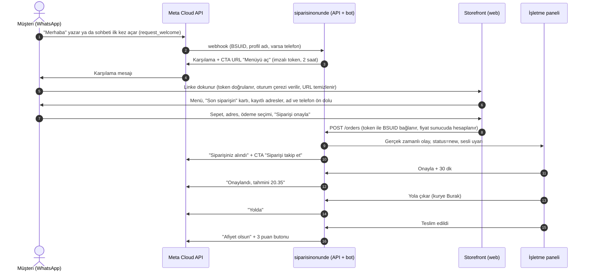
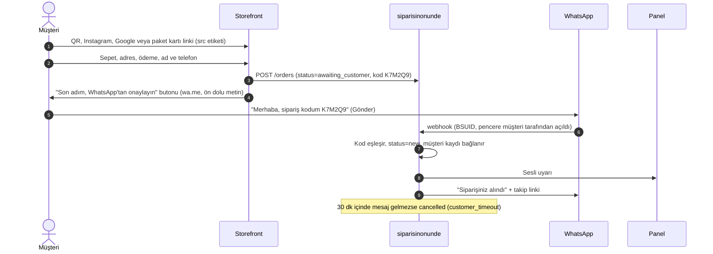
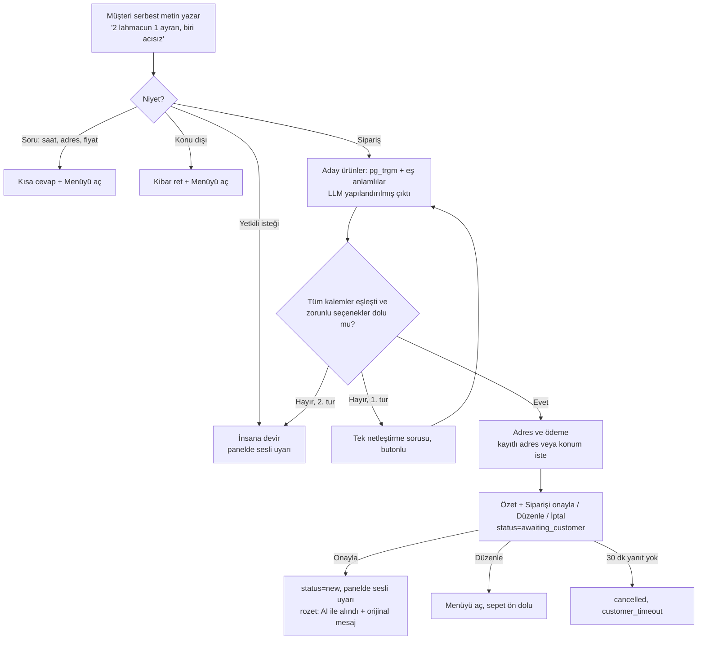
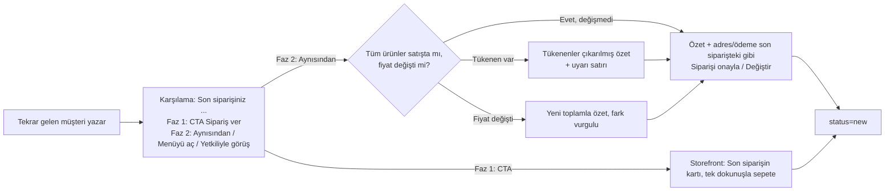
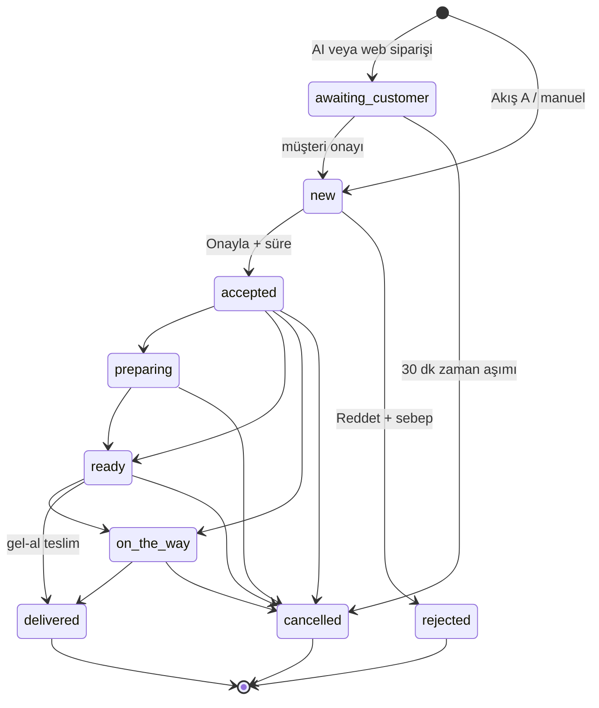
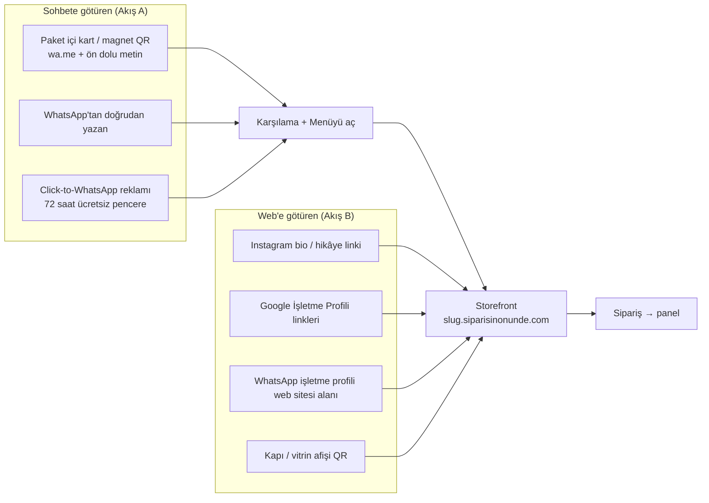
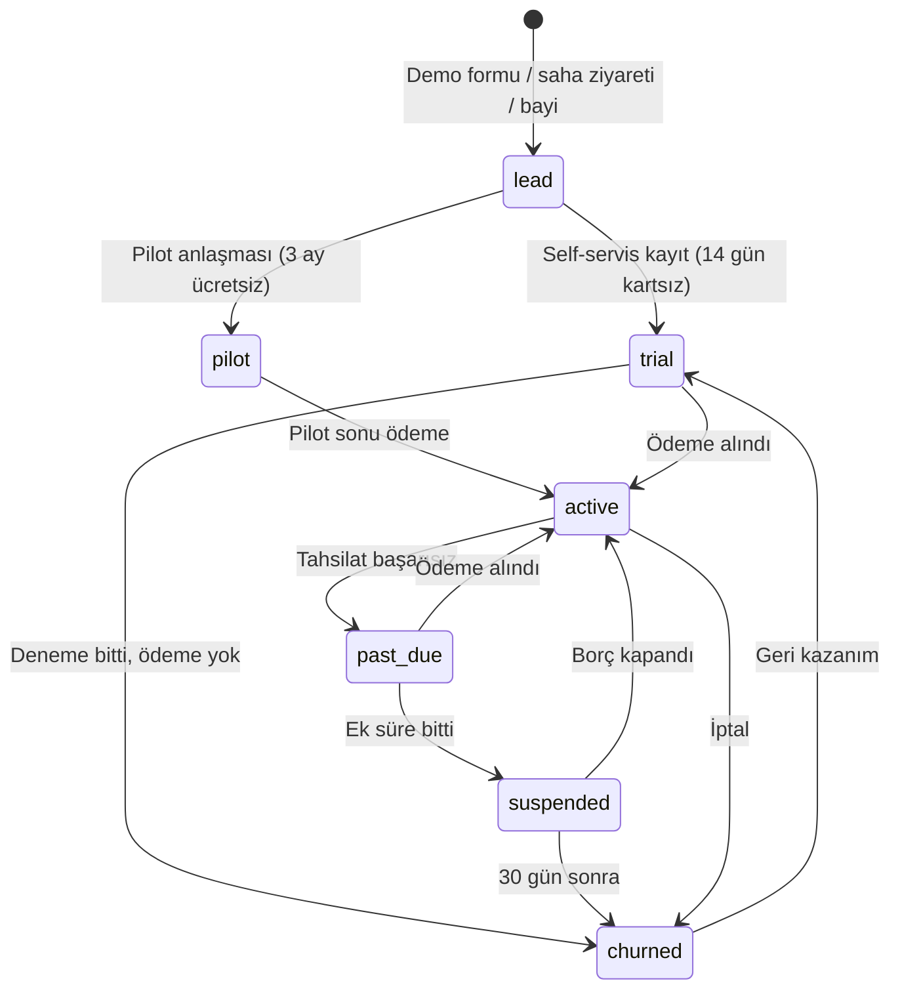

# 05 — Ürün ve UX Araştırması: Sipariş Akışları, Panel ve Admin Özellik Envanteri, Mesaj Metinleri

**Proje:** siparisinonunde (Siparişin Önünde): WhatsApp üzerinden komisyonsuz sipariş SaaS'ı
**Rapor tarihi:** 24 Eylül 2026
**Kapsam:** Müşteri sipariş akışları (A–E) ve kıyası, storefront ve checkout ayrıntıları, işletme paneli özellik envanteri (Faz 1/2/3), süper admin paneli, pazarlama sitesi, tüm WhatsApp mesaj metinleri (Türkçe), UX ilkeleri, ekran listesi.
**Bağlayıcı belge:** `KARARLAR.md` (durum kodları, roller, kanal ve ödeme kodları, faz adları). Bu rapor oradaki isimleri aynen kullanır. Faz eşlemesi: **[Faz 1] = MVP**, **[Faz 2] = v1**, **[Faz 3] = v2**.
**Kardeş raporlar:** `01-whatsapp-platform.md` [S01], `02-pazar-rakipler-is-modeli.md` [S02], `03-mevzuat-odeme-fatura.md` [S03], `04-mimari-teknoloji.md` [S04].

---

## 0. Metodoloji ve güvenilirlik notu (önce bunu okuyun)

- **Web araması yapılamadı.** Oturumun WebSearch kotası (200/200) bu rapora başlanmadan önce dolmuştu.
- **Doğrudan erişim büyük ölçüde engelli.** Egress proxy şu alan adlarını engelledi: `developers.facebook.com`, `business.whatsapp.com`, `whatsapp.com`, `anota.ai`, `olaclick.com`, `owner.com`, `gloriafood.com`, `toasttab.com`, `squareup.com`, `deliverect.com`, `support.google.com`, `help.instagram.com`, `iys.org.tr`, `w3.org`, `schema.org`, `developer.mozilla.org`, `web.dev`.
- **Bu oturumda canlı okunan kaynaklar:**
  - `raw.githubusercontent.com`: Meta Cloud API'sini uygulayan açık kaynak kütüphaneler (**pywa**, **whatsapp-api-js**). Mesaj tiplerinin sınırları bu kütüphanelerin doğrulama kodundan ve Meta dokümanına verdikleri linklerden okundu. Ayrıca W3C WCAG deposu ve schema.org deposu.
  - `developer.apple.com` (Human Interface Guidelines), `developer.android.com`, `platform.claude.com`.
- **Etiketler:**

| Etiket | Anlamı |
|---|---|
| **[R]** | Resmi/birincil kaynak, bu oturumda canlı okundu (W3C, Apple, Android, Anthropic, schema.org) |
| **[K]** | Açık kaynak kod/doküman. Meta API alan adları ve sınırlar, kütüphanenin doğrulama kodundan okundu. İlgili Meta doküman linki kodda geçiyor, ama link bu oturumda açılamadı |
| **[S01]–[S04]** | Kardeş rapor bulgusu. Kaynak URL'si o raporda |
| **[E]** | Eğitim verisine dayanan bilgi. Bu oturumda doğrulanamadı |
| **[T]** | Bizim çıkarımımız, tasarım önerimiz veya tahminimiz |
| **[D?]** | DOĞRULANAMADI. Karar vermeden önce teyit edilmeli |

- **Uydurma rakam yok.** WhatsApp sipariş akışlarının dönüşüm oranlarına dair güvenilir, kamuya açık bir veri bulunamadı. Bu nedenle rakam yerine **ölçüm planı** ve **hipotez hedefleri** [T] verildi.
- Emsal ürünlerin (Yemeksepeti partner paneli, Toast, Square, Deliverect, GloriaFood) özellik listeleri bu oturumda açılamadı. Bu listeler [E] olarak işaretlendi ve yalnızca "ders çıkarma" amacıyla kullanıldı.

---

## 1. Yönetici özeti (TL;DR)

1. **Birincil akış "sohbet + web sepeti" olmalı** (görevdeki A, KARARLAR'daki Akış A). Gerekçeler:
   - Restoran menüsü seçenek (modifier) ister: porsiyon, acı, çıkarılacaklar, ekstralar. WhatsApp Catalog bunu desteklemiyor [S01]. `order` webhook'u yalnız ürün kimliği, adet ve fiyat taşıyor [K].
   - WhatsApp Flows bileşenleri dar: gezinme listesi en fazla 20 öğe, çoklu seçim en fazla 20, açılır liste en fazla 200, görsel karusel en fazla 3 görsel [K].
   - Türkiye'de WhatsApp içi ödeme yok [S01]. Sohbet içi (native) akışın Brezilya ve Hindistan'daki asıl avantajı burada geçersiz.
   - Brezilya'da ölçeğe ulaşan örnekler (Anota AI, Brendi) aynı "karşıla, link yolla, web'de sepet, WhatsApp'tan bildirim" desenini kullanıyor [S02].
   - Aynı storefront QR, Instagram, Google ve paket kartından gelen trafiğe de hizmet ediyor. Tek geliştirme, iki giriş kapısı.
2. **İkincil akışlar:**
   - Doğrudan web + WhatsApp doğrulaması (KARARLAR Akış B) ve manuel/telefon siparişi (Akış E): **[Faz 1]**.
   - AI ile serbest metin siparişi (Akış C) ve sohbet içi "aynısından tekrar" (Akış D): **[Faz 2]**.
   - Flows: **[Faz 3]**. Catalog: **önerilmez**.
   - **Öneri (açık karar):** Storefront'ta "Son siparişin" kartı **[Faz 1]**'e alınsın. Maliyeti düşük, tekrar siparişi hızlandırır.
3. **Az bilinen ama kritik üç ayrıntı:**
   - (a) Kullanıcı sohbeti ilk kez açtığında gelen `request_welcome` olayı [K]. Karşılama, müşteri "merhaba" yazmadan gönderilebilir.
   - (b) Storefront token'ı **GET isteğinde tüketilmemeli**. Link önizleme veya prefetch token'ı yakmamalı.
   - (c) Durum mesajlarında "debounce" uygulanmalı: 60 sn içinde onaylanan siparişte "alındı" ve "onaylandı" tek mesajda birleşir.
4. **Mesaj bütçesi (KARARLAR ile uyumlu):**
   - 1 karşılama + en fazla 4 durum mesajı.
   - Değerlendirme isteği "teslim edildi" mesajının içinde, 3 butonla gider.
   - Pazarlama izni sorusu [Faz 2], değerlendirme cevabının içine gömülür.
   - Adres ve telefon WhatsApp mesajlarında tekrar edilmez. Ayrıntı Türkiye'de barındırılan takip sayfasında durur [S03].
5. **Sepeti terk hatırlatması:**
   - İçerik ticari iletidir. ETK/İYS onayı gerekir [S03].
   - Pencere dışında gönderilecekse Meta'nın "marketing" tanımına ("retargeting") girer [K].
   - Karar: **Faz 1'de yok.** Faz 2 ve sonrasında yalnız izinli müşteriye, tek hatırlatma olarak.
6. **İşletme panelinde MVP çekirdeği:**
   - Canlı sipariş ekranı: sesli uyarı, tek dokunuşla "Onayla · 30 dk", hatırlatma merdiveni.
   - Menü: seçenek grupları, "Bugün tükendi", **toplu fiyat güncelleme** (enflasyon ortamında çok önemli).
   - Çalışma saatleri ve "Sipariş almayı durdur".
   - Teslimat bölgesi haritası.
   - Tarayıcıdan fiş yazdırma.
   - Basit kurye görünümü (magic link).
   - WhatsApp gelen kutusu (bot/insan modu).
   - Müşteri listesi, günlük kasa özeti, QR ve afiş oluşturucu.
   - Onboarding sihirbazı ve WhatsApp bağlantı sağlığı kartı.
7. **Esnafın gözünde en değerli özellikler** [T]:
   1. Sipariş kaçırmamak.
   2. "Siparişim nerede?" telefonlarının azalması.
   3. Tükendi ve fiyatı saniyeler içinde değiştirebilmek.
   4. Fiş.
   5. Günlük kasa ve "bu ay ne kadar tasarruf ettim" raporu.
   6. Müşteri listesi ve "aynısından".

   Gelişmiş rapor, segment ve entegrasyon ilk aylarda ikinci planda kalır.
8. **Süper admin paneli bir "operasyon kulesi" olarak tasarlanmalı.** Sıradan bir CRUD ekranı yetmez. İçermesi gerekenler:
   - İşletme yaşam döngüsü: `lead → trial/pilot → active → past_due → suspended → churned`
   - Tenant başına WABA sağlığı: kalite, limit, ödeme yöntemi, Coexistence, son webhook
   - Meta maliyet defteri
   - Loglu ve süreli impersonation
   - Feature flag ve kill-switch'ler
   - MRR/churn/aktivasyon hunisi
9. **Pazarlama sitesinin merkezinde komisyon hesaplayıcı olmalı** [S02]. Site MVP'de sade tutulmalı: ana sayfa, nasıl çalışır, fiyatlar, hesaplayıcı, demo, kayıt, SSS, yasal. Şehir/ilçe landing sayfaları **yalnız gerçek müşteri ve içerik olduğunda** açılmalı (ince içerik riski [E]).
10. **UX ilkeleri:**
    - Dokunma hedefleri Android'de en az 48×48 dp [R], Apple'da varsayılan 44×44 pt [R]. WCAG 2.2 AA alt sınırı 24×24 CSS px [R], AAA hedefi 44×44 CSS px [R]. Panelde ana aksiyonlar için 56–64 px öneriyoruz [T].
    - Metin kontrastı en az 4,5:1 [R].
    - Renk tek başına anlam taşımamalı: renk + ikon + kelime birlikte.
    - Onay pencereleri yerine "Geri al" kullanılmalı.
    - **AI ile menü çıkarma teknik olarak uygun.** Görsel 8000×8000 px ve 10 MB'a kadar, PDF 32 MB'a kadar kabul ediliyor [R]. Faz 1'de ekip içi (concierge) araç olarak başlamalı, Faz 2'de self-servis olmalı. Fiyatlar her zaman insan onayından geçmeli.

---

## 2. Müşteri sipariş akışları

### 2.1 Beş seçeneğin kıyası

| Seçenek | Müşteri deneyimi ve sürtünme | WhatsApp kısıtları | Restoran menüsüne uygunluk | Geliştirme maliyeti [T] | Karar |
|---|---|---|---|---|---|
| **(A) Karşılama + "Menüyü aç" CTA → imzalı web menü → sepet → adres/ödeme → WhatsApp'tan durum** | Tek dokunuşla web'e geçilir. Menüde gezinme, seçenek ve sepet, pazaryeri alışkanlığıyla aynı. Tekrar gelen müşteride ad, telefon ve adres ön dolu olduğu için 4–6 dokunuş yeter. Kopma noktası: uygulamadan tarayıcıya geçiş. | CTA URL mesajı tek butonlu, buton metni en fazla 20 karakter [K]. Gövde en fazla 1.024, üst başlık ve alt bilgi en fazla 60 karakter [K]. Serbest mesaj 24 saatlik pencere içinde gider. 1 Ekim 2026'dan itibaren numara başına ayda 1.000 mesaj ücretsiz, sonrası ≈ $0,0009 [S01]. | **Tam.** Seçenek grupları, görsel, stok, saat bazlı menü ve kupon destekler | Orta: 4–6 kişi-hafta. Storefront zaten gerekli (QR, Instagram ve Google girişleri için). | **Birincil, [Faz 1]** |
| **(B) Native Catalog + sepet → `order` mesajı → adres/ödeme için Flow veya link** | Sohbetten çıkmadan ürün kartı ve sepet. Ama adres ve ödeme için ikinci bir arayüz gerekir (Flow veya web). | Katalog Commerce Manager'da tutulur. Multi-product mesajı en fazla 30 ürün ve 10 bölüm içerir [K]. `order` webhook'unda yalnız `product_retailer_id`, `quantity`, `item_price`, `currency` var [K]. Commerce Policy geçerli [S01]. Türkiye'de katalog mesajının kullanılabilirliği [D?] [S01]. | **Zayıf.** "Acısız, soğansız, yarım porsiyon, ekstra kaşar" ifade edilemez. Her kombinasyon ayrı ürün olur. | Orta, artı **sürekli katalog senkronu**. Menü her değiştiğinde Meta kataloğu da güncellenmeli. Web yine gerekli, yani çift iş. | **Önerilmez.** Seçeneksiz dikeylerde (su damacanası) Faz 3'te yeniden değerlendirilebilir. Orada da çoğu zaman list message yeter [T]. |
| **(C) WhatsApp Flows ile tamamen sohbet içi menü** | Sohbet içinde tam ekran form, uygulamadan çıkış yok. Ama 80 ürünlü bir menüde kategori ve ürün arasında gezinmek zahmetli. Görsel sınırlı. | NavigationList 1–20 öğe, CheckboxGroup en fazla 20 seçim, Dropdown en fazla 200 öğe, ImageCarousel en fazla 3 görsel, ekran başına en fazla 5 OptIn [K]. Dinamik menü için `data_exchange` endpoint'i gerekir [S01][K]. Flow CTA metni 1–20 karakter ve emojisiz [K]. Türkiye kullanılabilirliği [D?] [S01]. | **Orta.** Küçük menüye uygun. Seçenekli büyük menüde ağırlaşır. | **Yüksek:** 6–10 kişi-hafta, artı Flow yayını/versiyonlama. İki ayrı menü arayüzünün (web ve Flow) bakımı gerekir. | **[Faz 3]** (KARARLAR). Aday kullanımlar: adres formu, değerlendirme formu |
| **(D) Serbest metin → AI ayrıştırma → özet + onay butonları; belirsizlikte insan** | En az sürtünme: "abi 2 lahmacun 1 ayran". Yanlış anlama riski var, bu yüzden özet ve onay turu şart. | Genel amaçlı AI yasağı, işletmeye özel sipariş botunu kapsamıyor. Kapsam sınırı ve insana devir şart [S01]. Reply buton en fazla 3, başlık en fazla 20 karakter [K]. | **İyi**, sunucu tarafı doğrulama ile [S04] | Orta: 3–5 kişi-hafta, artı Türkçe değerlendirme seti (300–500 gerçek mesaj) [S04]. LLM maliyeti ≈ $0,005/sipariş (Haiku 4.5) [S04]. | **[Faz 2]** (KARARLAR Akış C) |
| **(E) "Son siparişimi tekrarla"** | Tekrar gelen müşteri için tek dokunuş | Pencere içinde reply buton. Fiyat değişikliği ve tükenen ürün kontrolü gerekir. | **İyi.** Geçmiş siparişin kopyasından güncel fiyatla yeniden kurulur. | Düşük: A'nın üstüne 1–2 kişi-hafta | Storefront'taki "Son siparişin" kartı **[Faz 1]** (öneri). Sohbet içi "Aynısından" butonu **[Faz 2]** (KARARLAR Akış D). |

**Görevdeki harflerle KARARLAR akışlarının eşlemesi:**

| Görevdeki seçenek | KARARLAR akışı | Faz | `channel` kodu |
|---|---|---|---|
| (A) Karşılama + CTA + web | Akış A (birincil) | Faz 1 | `wa_link` |
| – (QR/Instagram/Google'dan doğrudan web) | Akış B (web + WhatsApp doğrulaması) | Faz 1 | `web` |
| (B) Catalog | – | Önerilmez | – |
| (C) Flows | "Flows ile sohbet içi sipariş" | Faz 3 | (yeni kod gerekecek, ör. `wa_flow`) |
| (D) AI serbest metin | Akış C | Faz 2 | `wa_ai` |
| (E) Tekrar sipariş | Akış D | Faz 2 (storefront kartı Faz 1 önerisi) | Sohbetten tetiklenirse `wa_link`, web'den tetiklenirse `web` |
| – (telefon siparişi) | Akış E (manuel) | Faz 1 | `manual` |

### 2.2 Neden A birincil? (karar gerekçesi)

1. **Seçenek (modifier) zorunlu.** Dönerci, pideci ve burgercide siparişlerin çoğunda en az bir seçenek var: porsiyon, ekmek, acı, çıkarılacaklar [T]. Catalog bunu taşıyamaz [S01][K].
2. **Tek storefront, çok giriş.** QR, Instagram, Google, paket kartı ve WhatsApp aynı web menüye iner. Flows ise yalnız WhatsApp içinden çalışır.
3. **Ödeme WhatsApp dışında.** Türkiye'de WhatsApp Pay yok [S01]. Online ödeme her durumda PSP linkiyle (CTA URL) yapılacak. Native akış bu yüzden "sohbetten hiç çıkmama" vaadini zaten tutamaz.
4. **Deterministik veri.** Sepet yapılandırılmış veri olarak oluşur, AI'ya bağımlılık yoktur. AI (Akış C) sonradan bir "kısayol" olarak eklenir.
5. **Platform riskine dayanıklılık.** Meta fiyat ya da politika değiştirse bile storefront, sipariş takip sayfası ve panel WhatsApp'sız da çalışır [S01, risk 9].
6. **Emsal.** Brezilya'da WhatsApp paket servis cirosunun %26'sını oluşturuyor. Otomasyon kullananların önemli kısmı "bot + insan" hibriti kullanıyor [S02]. Anota AI, Brendi ve OlaClick sohbeti karşılayıp web menüsüne yönlendiriyor [S02].

### 2.3 Akış A: sohbet + web sepeti (ayrıntılı)



**Tasarım kuralları [T]:**

- **İlk temas.** Kullanıcı sohbeti ilk kez açtığında Cloud API bir `request_welcome` mesaj tipi üretebiliyor [K]. Bu olay gelince karşılama gönderilir; müşteri yazmadan menü linkini görür.
  - Bu olayın 24 saatlik pencere açıp açmadığı ve "hoş geldin mesajı" ayarının nasıl açıldığı [D?]. Pilotta test edilmeli.
  - Test sonucu olumsuz çıkarsa müşterinin ilk mesajı beklenir.
- **İkinci karşılama yok.** Aynı müşteriye 12 saat içinde ikinci kez tam karşılama gönderilmez. Sonraki "merhaba"lara kısa bir yanıt ve CTA gider. Böylece mesaj bütçesi korunur.
- **Serbest metin (Faz 1'de AI yok).** Kural tabanlı niyet eşleşmesi kullanılır: "kaça kadar açıksınız", "adres", "min sepet", "yetkili". Tanınan niyete kısa cevap ve CTA gider. Tanınmayan mesaj panel gelen kutusuna "yanıt bekliyor" olarak düşer.
- **Tekrar gelen müşteri.** Karşılamada "Son siparişiniz: …" satırı gösterilir. CTA metni "Sipariş ver" olur. Storefront, sepeti tek dokunuşla doldurabilecek "Son siparişin" kartıyla açılır. Böylece sohbet içi reorder'a (Faz 2) gerek kalmadan ek mesaj harcamadan tekrar sipariş mümkün olur.
- **Token tasarımı:**

| Konu | Öneri [T] |
|---|---|
| Biçim | `https://{slug}.siparisinonunde.com/s/{token}`. Token HMAC-SHA256 ile imzalanır, base64url kodlanır. İçerik: `tenant_id`, `branch_id`, `conversation_id`, `iat`, `exp`. **Kişisel veri (PII) yok.** BSUID'nin kendisi linke konmaz. |
| Ömür | 2 saat. Süresi dolmuşsa storefront normal açılır ve sipariş Akış B'ye (WhatsApp doğrulaması) düşer. |
| Tek kullanımlık mı? | **Hayır.** GET isteğinde tüketilmez, çünkü önizleme veya prefetch token'ı yakmamalı. İlk açılışta httpOnly oturum çerezine çevrilir ve adres çubuğu `history.replaceState` ile temizlenir. Sipariş POST'unda token başına saatlik sipariş sınırı konur. |
| Ön dolum | Ad (webhook'taki `contacts[].profile.name` [K]; emoji veya takma ad gibi görünüyorsa kullanılmaz). Telefon (webhook'ta `wa_id` varsa [S01]). Kayıtlı adresler, son sipariş. |
| Link başkasına iletilirse | Checkout'ta "Bu sipariş WhatsApp'ta **Ayşe (…45 12)** adına verilecek · *Ben değilim*" satırı gösterilir. "Ben değilim" oturumu düşürür ve akışı B'ye çevirir. |
| Güvenlik | Token yalnız ilgili tenant'ın alt alan adında geçerli. Rate limit uygulanır, loglarda token maskelenir. |

- **Kenar durumları:**

| Durum | Davranış |
|---|---|
| İşletme kapalı | M03 mesajı. Storefront'ta "Şu an kapalı · 11:00'de açılıyor" ve menüye göz atma. İleri saatli sipariş açıksa (Faz 2) o seçenek. |
| "Sipariş almayı durdur" aktif | M04 mesajı. Storefront'ta checkout kapalı, sayaç gösterilir. |
| Adres bölge dışı | Checkout'ta "Bu adrese teslimat yok. Gel-al ister misiniz?" |
| Kara listedeki müşteri | Nötr metin: "Şu an çevrimiçi sipariş alamıyoruz, lütfen işletmeyi arayın". Suçlayıcı ifade kullanılmaz. |
| Müşteri linke dokunup sipariş vermeden döner | Faz 1'de hiçbir şey yapılmaz. Sepeti terk hatırlatması yalnız izinli müşteriye ve Faz 2+ (bkz. §7.5). |

### 2.4 Akış B: doğrudan web + WhatsApp doğrulaması (KARARLAR)



**UX ayrıntıları [T]:**

- **Sonuç ekranı (S-06B).** Tek ve büyük bir yeşil buton gösterilir: **"WhatsApp'ta onayla"**. Altında bir görselle anlatım: "WhatsApp açılacak, yalnızca **Gönder**'e basın."
- **Ön dolu metin.** Metin kısa ve anlaşılır olmalı: `Merhaba, sipariş kodum: K7M2Q9`. Kod 6 karakterdir ve karışan karakterler (0/O, 1/I) kullanılmaz.
- **Panel görünümü.** `awaiting_customer` siparişler panelde soluk bir "Doğrulama bekleniyor" satırı olarak görünür. Ses çalmaz. İşletme isterse "Telefonla doğruladım" diyerek siparişi `new`'e alabilir. Bu aksiyon audit log'a yazılır.
- **Neden bu adım?** Sahte siparişi eler. 24 saatlik pencereyi **müşteri** açar, böylece sonraki durum mesajları ucuz serbest mesaj olarak gider ve 250 tekil kullanıcılık messaging limit'e takılmaz [S01]. Ayrıca müşteri kaydı BSUID'ye bağlanır.
- **Risk: bu adımda kopma.** Kopma oranı bilinmiyor [D?]. Ölçülecek metrik: `awaiting_customer → new` dönüşümü. Hipotez hedefi ≥ %85 [T].
  - Hedef tutmazsa ilk seçenek: daha önce doğrulanmış cihaza "güvenilir cihaz" çerezi (Faz 2). Bu durumda sipariş doğrudan `new` olur ve durum mesajları utility template ile gider. Template başına ≈ $0,0009, 1.000'lik ücretsiz kotaya girmez [S01].
  - İkinci seçenek: WhatsApp'ı olmayan müşteri için SMS OTP (KARARLAR, Faz 2).

### 2.5 Akış C: AI ile serbest metin [Faz 2]



Kurallar [S04]:
- Fiyat ve toplamı her zaman sunucu hesaplar.
- Onaysız sipariş panele düşmez.
- Emin olunamayan durumda tahmin yapılmaz, soru sorulur.
- Netleştirme en fazla iki tur. İkinci başarısız turda insana devredilir.
- LLM'e yalnız sipariş metni gider. Ad, telefon ve adres maskelenir [S03][S04].
- Bot konu dışı sorulara girmez, "Yetkiliyle görüş" her zaman erişilebilir kalır, işletme botu kapatabilir [S01].

### 2.6 Akış D: aynısından tekrar



### 2.7 Akış E: manuel / telefon siparişi [Faz 1]

- Kasiyer panelde **"+ Telefon siparişi"** der ve telefon numarasıyla müşteriyi arar. Kayıtlıysa adresler ve son sipariş gelir. Menüden hızlı ekleme yapılır (arama + sık satılanlar ızgarası), ödeme seçilir, sipariş doğrudan `accepted` olabilir. Hazırlık süresi bu adımda seçilir [T].
- Müşterinin WhatsApp'ı varsa bilgilendirme gider. Pencere kapalı olduğu için **utility template** (`siparis_alindi`) kullanılır [S01].
  - Template'teki takip linki, aydınlatma metnine de erişim sağlar [S03 §2.4].
  - İşletme ayarı olarak "Telefon siparişlerinde WhatsApp bildirimi gönder" varsayılan açık olabilir. Bunun KVKK açısından sözleşmenin ifası kapsamında kaldığı değerlendiriliyor [S03 §2.5].

### 2.8 Kanonik durum makinesi ve müşteriye yansıması



| Durum (kod) | Panel etiketi | Takip sayfası etiketi (müşteri) | WhatsApp mesajı (§7) | Varsayılan |
|---|---|---|---|---|
| `awaiting_customer` | Doğrulama bekleniyor (soluk, sessiz) | "WhatsApp onayınız bekleniyor" | – (web: S-06B ekranı; AI: M18) | – |
| `new` | **Yeni** (sesli, sayaçlı) | "İşletme onayı bekleniyor" | M05 "alındı" (60 sn debounce) | Açık |
| `accepted` | Onaylandı · 20.35 | "Onaylandı · Tahmini 20.35" | M06 | Açık |
| `preparing` | Hazırlanıyor | "Hazırlanıyor" | M07 | **Kapalı** (KARARLAR) |
| `ready` | Hazır | Paket: "Hazır, kurye bekleniyor" / Gel-al: "Hazır, gelip alabilirsiniz" | Gel-al: M08. Paket: mesaj yok | Açık (gel-al) |
| `on_the_way` | Yolda · Burak | "Yolda · Kurye: Burak" | M09 | Açık |
| `delivered` | Teslim edildi | "Teslim edildi" + puanlama | M10 (puan butonlu) | Açık |
| `rejected` | Reddedildi · sebep | "Sipariş alınamadı · sebep" | M11 | Açık |
| `cancelled` | İptal · sebep · kim | "İptal edildi · sebep" | M12 | Açık |

### 2.9 Emsaller: Brezilya, Hindistan, Endonezya

| Pazar | Emsal | Akış deseni | Kaynak / güven | Bizim için ders |
|---|---|---|---|---|
| Brezilya | **Anota AI** | WhatsApp'ta AI ile karşılama, dijital menü linki, sipariş, PIX ile ödeme. iFood şirketi ~60 milyon R$'a satın aldı. Satın alma anında 15 bin+ restoran ve yılda 40 milyon+ sipariş vardı; satın almadan sonra sipariş hacmi 4 katına çıktı. | [S02] | Link-to-web deseni ölçekte çalışıyor. Pazaryeri bile bu kanalı satın aldı: hem tehdit hem çıkış yolu [S02]. |
| Brezilya | **Brendi** (8.500+ restoran), **OlaClick** (120 bin+ işletme; menüden WhatsApp'a sipariş; Premium planda chatbot ve otomatik yazdırma), **Goomer**, **Cardápio Web** | Web menü + WhatsApp | [S02] | Otomatik yazdırma ve düşük giriş fiyatı değer görüyor. Otomasyon ve mesaj gönderimi ayrı modül olarak satılıyor. |
| Brezilya | **Abrasel araştırması** (Mart 2025, 2.176 işletme) | Paket servis cirosunun %26'sı WhatsApp'tan geliyor. İşletmelerin %63'ü WhatsApp'ı satış kanalı olarak kullanıyor. %38'i otomasyon kullanıyor: %21'i bot + insan, %17'si yalnız AI. | [S02] | Bot + insan hibriti norm. "Bot/insan modu" MVP'de olmalı. |
| Brezilya | iFood'un kendi WhatsApp sipariş akışları | – | [D?] | Teyit edilemedi |
| Brezilya | WhatsApp içi ödeme (`order_details`, Pix) | Sohbet içi ödeme var | [S01] | Türkiye'de yok. Native checkout avantajı bizde oluşmuyor. |
| Hindistan | **JioMart on WhatsApp** (2022) | Katalog, sepet ve ödeme uçtan uca sohbet içinde | [E] | Native akış, WhatsApp içi ödemenin olduğu pazarda ve büyük perakendecide işe yaradı. Bizim koşullarımız farklı. |
| Hindistan | **DotPe / Petpooja** | WhatsApp ve sosyal medyada paylaşılan sipariş linki | [S02] | KOBİ tarafında link deseni yaygın |
| Hindistan | Payments API (ödeme ağ geçitleri); yalnız bazı pazarlarda sunulan yerel "adres mesajı" | Sohbet içi ödeme ve adres formu | [S01] / [E] | Türkiye için geçerli değil. Adres toplamayı storefront'ta ya da konum isteme mesajıyla yapmalıyız. |
| Endonezya | KOBİ'lerin WhatsApp Business uygulamasında katalog + elle sohbetle satış yapması | Elle yürüyen sohbet | [E] | Esnafın elle sipariş alma alışkanlığı güçlü. Coexistence ve "telefondan yazmaya devam" kritik [S01]. |
| Endonezya | Yemek odaklı WhatsApp SaaS emsali | – | [D?] | Bu oturumda doğrulanamadı |
| Global | **Take App** | Ücretsiz planda ayda 50 sipariş; Business planda ayda 1.000 otomatik WhatsApp mesajı | [S02] | Mesaj kotası paket özelliği olarak satılabiliyor |

**Sentez [T]:** Ödeme WhatsApp içinde yapılamadığı sürece en iyi pratik "sohbette karşıla ve bildir, web'de seç ve öde"dir. Sohbet içi (native) akışlar, WhatsApp Pay'in olduğu pazarlarda ve basit ürün yelpazelerinde öne çıkıyor.

### 2.10 Diğer giriş noktaları: aynı storefront



| Giriş | Link / tetik | Akış | `channel` + `src` | Not |
|---|---|---|---|---|
| Müşteri WhatsApp'tan yazar ya da sohbeti açar | Numara, `wa.me/90…`, `request_welcome` [K] | A | `wa_link` | Pencere müşteri tarafından açılır |
| **Paket içi kart / buzdolabı magneti** | `wa.me/90…?text=Merhaba` (QR) | A | `wa_link`, `src=paket` | **Tercih edilen yol: sohbete götürmek.** Kazanılanlar: BSUID, açık pencere, izin sorusu fırsatı (Faz 2). Pazaryeri sözleşmesindeki "materyal koyma" kısıtı kontrol edilmeli [S02 D?]. |
| Kapı / vitrin afişi | Storefront `?src=afis` (veya wa.me) | B veya A | `web` | Afiş iki QR içerebilir: "Menüye bak" ve "WhatsApp'tan yaz" [T] |
| Instagram bio, hikâye link çıkartması | Storefront `?src=ig` | B | `web` | Instagram'ın "Yemek siparişi" eylem butonu yalnız anlaşmalı sağlayıcılarla çalışıyor [E/D?]. Güvenilir yol bio linki. |
| Google İşletme Profili | Web sitesi / menü bağlantısı, gönderi butonu | B | `web`, `src=google` | Profile kendi sipariş linkini ekleme ülkeye ve sağlayıcıya bağlı [E/D?]. Pilotta bizzat denenmeli. |
| WhatsApp işletme profili | "Web sitesi" alanı (en fazla 2 site, her biri en fazla 256 karakter [K]) | B | `web`, `src=wa_profil` | Onboarding'de otomatik doldurulabilir mi [D?] |
| Click-to-WhatsApp reklamı | Webhook'ta `referral` nesnesi (`ctwa_clid`, reklam başlığı) [K] | A | `wa_link`, `src=ctwa` | 72 saat ücretsiz pencere (FEP) [S01] |
| Masa QR | Storefront `?masa=12` | Faz 3 | `table_qr` | `dine_in`, kasada ödeme |
| Telefonla arayan | Kasiyer manuel girer | E | `manual` | Müşteriye "sipariş linkiniz" gönderilerek kanala çekilir [S02] |

**Ölçüm:** Her girişte `src` parametresi kaydedilir. Panelde "Kaynak" raporu gösterilir [Faz 2]. QR oluşturucu bu parametreyi otomatik ekler [Faz 1].

---

## 3. Müşteri tarafı detaylar (storefront, checkout, takip)

### 3.1 Storefront ekranları

| ID | Ekran | İçerik | Faz |
|---|---|---|---|
| S-01 | **Menü (ana)** | Üst bölüm: logo, ad, açık/kapalı rozeti, tahmini süre, min. sepet, teslimat ücreti aralığı, **Teslimat / Gel-al** anahtarı. "Son siparişin" kartı. Yapışkan kategori sekmeleri, arama, ürün kartları (görsel opsiyonel), yapışkan sepet çubuğu ("Sepeti gör · 3 ürün · 485,00 TL"). | 1 |
| S-02 | Ürün detayı (alt sayfa) | Görsel, açıklama, **alerjen etiketleri**, porsiyon/gramaj, seçenek grupları (zorunlular işaretli), ürün notu, adet, "Sepete ekle · 145,00 TL" | 1 |
| S-03 | Sepet | Kalemler (düzenle/sil), sipariş notu, kupon (**yalnız aktif kupon varsa görünür**), ara toplam, teslimat ücreti, toplam, **min. sepet ilerleme çubuğu** | 1 (kupon 2) |
| S-04 | Teslimat bilgileri | Mod, adres (kayıtlı adres veya yeni: konum → harita pini → alanlar), ad, **teslimat telefonu**, ileri saat seçimi (Faz 2) | 1 |
| S-05 | Ödeme ve onay | Ödeme yöntemi kartları, para üstü, özet, yasal satır, "Siparişi onayla · 485,00 TL" | 1 |
| S-06A | Sonuç (Akış A) | "Siparişiniz alındı. Durumu WhatsApp'tan bildireceğiz." + **"WhatsApp'a dön"** butonu + takip linki | 1 |
| S-06B | Sonuç (Akış B) | "Son adım: WhatsApp'ta onaylayın" (bkz. §2.4) | 1 |
| S-07 | **Sipariş takip sayfası** `/t/{token}` | Bkz. §3.10 | 1 |
| S-08 | Değerlendirme | Takip sayfası içinde, teslimden sonra | 1 |
| S-09 | Kapalı / durdurulmuş durumu | S-01'in varyantı: sayaç, "Menüye göz at", ileri saatli sipariş (Faz 2) | 1 |
| S-10 | Yasal sayfalar | İşletme künyesi, son müşteri aydınlatma metni, ön bilgilendirme formu, mesafeli satış sözleşmesi şablonu, çerez bilgisi [S03 §2.4, §4.7, §4.10] | 1 |
| S-11 | Verilerim | Kayıtlı adresleri silme, pazarlama iznini geri alma, veri talebi formu. Takip linkinden veya WhatsApp'tan erişilir. | 2 |
| S-12 | Damga kartı / sadakat | "8/10 · 2 sipariş sonra lahmacun bizden" | 2 |
| S-13 | Masa modu | Masa numarası, kasada ödeme, "garson çağır" yok | 3 |

### 3.2 Teslim modları (`fulfillment_type`)

| Mod | Kural | Faz |
|---|---|---|
| `delivery` (paket) | Adres, bölge kontrolü, ücret ve min. sepet zorunlu | 1 |
| `pickup` (gel-al) | Adres yok. Şube adresi ve harita linki gösterilir. Ödeme kasada ya da online (Faz 2). Hazır olunca M08. | 1 |
| `dine_in` (masaya) | Masa QR, kasada ödeme, WhatsApp opsiyonel | 3 |

### 3.3 Adres toplama

**Storefront (S-04) alan sırası [T]:**
1. **"Konumumu kullan"** (tarayıcı Geolocation) ya da haritada pin. Adres araması (autocomplete) ikinci seçenektir. Google'ın ücretsiz kotası platform geneline uygulanıyor [S04 §6.3].
2. Pin doğrulanır: "Pin doğru yerde mi? Gerekirse sürükleyin." Mahalle ve sokak ters geocoding ile otomatik dolar (düzenlenebilir).
3. **Bina no\***, **Kat**, **Daire\*** (ya da "Müstakil ev" kutusu), **Adres tarifi** (yer tutucu: *"Örn: Eczanenin üstü, zile 2 kez basın"*). Adres tarifi kurye için en değerli alandır [S04].
4. Adres adı: Ev / İş / Diğer.
5. **Teslimat telefonu.** BSUID nedeniyle webhook'ta telefon gelmeyebilir [S01]. Telefon biliniyorsa ön dolu ve maskeli gösterilir ("…45 12 · değiştir").

**Veri modeli** [S04]: `il, ilçe, mahalle, sokak, bina_no, kat, daire_no, adres_tarifi, location(Point), adres_kodu?`. UAVT'ye bağımlı olunmaz.

**Bölge kontrolü:** Pin bir `delivery_zone` poligonuna düşer ve bölgenin ücreti, min. sepeti ve tahmini süresi alınır [S04]. Bölge dışında kalırsa "Bu adrese teslimat yok. **Gel-al** ile devam etmek ister misiniz?" sorulur.

**WhatsApp içinde (Akış C ve adres güncelleme):** Önce "Konum gönder" butonlu mesaj (`location_request_message` [K]). Ardından serbest metinle "bina no, kat, daire ve tarif" istenir [S04 §6.4]. Canlı konum Coexistence'ta kapalı [S01]; tek seferlik konum yeterli.

**KVKK:** Kayıtlı adres, sonraki siparişler için sözleşmenin ifası veya meşru menfaat kapsamında tutulur. Aydınlatma metninde belirtilir ve "adresimi sil" seçeneği sunulur (S-11) [S03 §2.5].

### 3.4 Minimum sepet, teslimat ücreti, tahmini süre

- **Min. sepet ve ücret bölge bazlıdır** [S04]. Adres girilmeden önce menü üstünde aralık gösterilir: "Teslimat 0–25 TL · Min. sepet 150 TL'den". Adres girilince kesin değer görünür.
- **Min. sepet çubuğu.** "Minimum sepete **65 TL** kaldı". Tutar altındayken checkout butonu pasif olur ve nedeni yazılır.
- **Ücretsiz teslimat eşiği** (opsiyonel): "**40 TL** daha ekleyin, teslimat ücretsiz".
- **Tahmini süre** [T]:
  - Sipariş öncesi: `bölge.eta_minutes + şube.varsayılan_hazırlık (+ yoğunluk modu ek süresi)` bir aralık olarak gösterilir ("30–40 dk").
  - Onaydan sonra: işletmenin seçtiği hazırlık süresiyle **kesin saat** gösterilir ("Tahmini 20.35").
- **Gizli ücret yok.** "Servis ücreti" ve benzeri kalemler sistemde tanımlanamaz. Kapıda kart ödemesine ek ücret konamaz [S03 §4.8].

### 3.5 Ürün seçenekleri modeli (`option_group`, `option`)

| Grup | Tür | min | max | Zorunlu | Örnek seçenekler (fiyat farkı) |
|---|---|---|---|---|---|
| Porsiyon | Tek seçim | 1 | 1 | Evet | Yarım (−40 TL), Tam (0), 1,5 porsiyon (+60 TL) |
| Ekmek | Tek seçim | 1 | 1 | Evet | Lavaş, Tombik, Ekmek arası |
| Ekstralar | Çoklu | 0 | 5 | Hayır | Ekstra kaşar (+25), Ekstra et (+70) |
| Çıkarılacaklar | Çoklu | 0 | 10 | Hayır | Soğansız, Domatessiz, Turşusuz (0 TL) |
| Acı | Tek seçim | 0 | 1 | Hayır | Acısız, Az acılı, Acılı |
| Menü içeceği | Tek seçim | 1 | 1 | Evet (menü ürününde) | Ayran, Kola (+10), Şalgam |

**Kurallar [T]:**
- Fiyat sunucuda hesaplanır. Sipariş anında ürün ve seçenek adıyla fiyatı kopyalanır (snapshot, KARARLAR).
- **Mutfak fişinde** çıkarılacaklar büyük harfle ve kalın basılır: **SOĞANSIZ**. Türkçe büyük harf dönüşümüne dikkat edilmeli (§8.7).
- Zorunlu grup seçilmeden "Sepete ekle" pasif kalır ve eksik grup vurgulanır.
- İç içe grup ("menüdeki burgerin de seçenekleri") **[Faz 2]**. MVP'de menü ürünleri düz grup olarak modellenir.
- **Alerjen bilgisi ürün özelliğidir** ("içinde fıstık var"). Müşteri profiline sağlık verisi yazılmaz [S03 §2.6].

### 3.6 Not alanları

- **Ürün notu** (S-02) ve **sipariş notu** (S-03). Her biri en fazla 140 karakter [T]. Yer tutucu: *"Örn: Ketçap mayonez ayrı olsun"*.
- Mikro metin: "Alerjiniz varsa lütfen işletmeyi arayarak teyit edin." Böylece sağlık verisinin serbest metinde birikmesi azaltılır [S03 §2.6].
- Notlar yalnız o siparişte kullanılır ve 30–90 gün sonra silinir [S03 §2.7]. Müşteri profiline taşınmaz.

### 3.7 Ödeme (`payment_method`)

| Seçenek (müşteri metni) | Kod | Ek alan / mikro metin | Faz |
|---|---|---|---|
| Kapıda nakit | `cash_on_delivery` | **"Kaç TL ile ödeyeceksiniz?"** çipleri: Tam para / 200 / 500 / 1.000 / Diğer. Kurye para üstünü hazırlar, fişe basılır. | 1 |
| Kapıda kredi/banka kartı | `card_on_delivery` | "Kurye POS cihazı getirecek" | 1 |
| Kapıda yemek kartı | `meal_card_on_delivery` | Marka çipleri, **yalnız işletmenin kabul ettikleri**: Multinet, Pluxee, Edenred (Ticket), Setcard, Metropol. Açıklama: "Kurye doğru cihazı getirsin" [S03 §5.5]. | 1 |
| Kasada öde (gel-al) | `pay_at_counter` | – | 1 |
| Online kart | `online_card` | İşletmenin kendi PSP sayfası, CTA URL ile [S01][S03]. **Taksit kapalı** (gıda) [S03 §4.9]. | 2 |
| Online yemek kartı | – | Markalarla ayrı iş ortaklığı gerekir | 3 [S03] |

### 3.8 Kupon, kampanya ve sadakat (müşteri görünümü)

- **Kupon alanı yalnız işletmenin aktif kuponu varsa görünür.** Her zaman görünen boş kupon alanının kullanıcıyı sepetten çıkıp kod aramaya ittiği bilinen bir checkout sorunudur [E]. **[Faz 2]**
- **Doğrudan kanal avantajı** [S02 §11.2]: "WhatsApp siparişine ayran bizden" gibi otomatik kural. Sepette satır olarak görünür. **[Faz 2]**
- **Damga kartı:** "Her 10 siparişe 1 lahmacun". Takip sayfasında ve storefront üst bölümünde görünür. Pazarlama mesajı gerektirmez. **[Faz 2]**
- **İndirim gösterimi:** Üstü çizili fiyat yalnız sistemin fiyat geçmişinden otomatik hesaplanır ("son 30 günün en düşük fiyatı" kuralı [S03 §4.8, O/D?]). Elle girilemez.

### 3.9 Onay adımı ve yasal metinler (S-05)

**Önerilen düzen [T, S03 §4.7 ve §2.5'e dayanarak]:**

```
[ Özet: 3 ürün · Ara toplam 465,00 · Teslimat 20,00 · Toplam 485,00 TL ]
[ Ödeme: Kapıda nakit · 500 TL'ye para üstü ]

  ( Siparişi onayla · 485,00 TL )        ← büyük birincil buton

  "Siparişi onayla"ya bastığınızda siparişiniz kesinleşir ve ödeme
  yükümlülüğü doğar. Gıda siparişlerinde cayma hakkı bulunmaz.
  Ön bilgilendirme formu · Mesafeli satış sözleşmesi · Aydınlatma metni
```

- **Aydınlatma bir bilgilendirmedir, onay kutusu gerektirmez.** Link vermek yeterlidir. Aydınlatma ile açık rıza aynı metinde birleştirilmez [S03 §2.4].
- **Ön bilgilendirmenin teyidi.** Buton metni ve altındaki linklerle (click-wrap) mi, ayrı bir onay kutusuyla mı yapılmalı? Sürtünme açısından birincisi tercih edilir. **Avukat teyidi gerekli** [S03 §4.7, O/D?].
- **Pazarlama izni kutusu** (işaretsiz, opsiyonel):
  - Metin: *"☐ {İşletme}'nin kampanya ve duyurularını WhatsApp'tan almak istiyorum. İstediğim zaman çıkabilirim."*
  - **[Faz 1]'de gösterilmemeli.** İYS'ye 3 iş günü içinde kaydedilmeyen onay geçersiz sayılır [S03 §3.3]. Kampanya modülü ve İYS entegrasyonu Faz 2'de geliyor [S03 §3.6].
  - Faz 2'de hizmet şartına bağlanmadan (sipariş onu işaretlemeden de verilebilmeli) ve kanıtı kaydedilerek sunulur [S03 §3.4].
- **Çerez.** Storefront varsayılan olarak çerezsiz veya yalnız zorunlu çerezlerle çalışır. İşletme Pixel veya Ads etiketi eklerse rıza paneli zorunlu olur [S03 §2.13].

### 3.10 Sipariş takip sayfası (S-07)

- **Adres:** `https://{slug}.siparisinonunde.com/t/{token}` (KARARLAR). Token uzun ömürlüdür (30 gün, salt okunur) [T].
- **İçerik:**
  - Büyük tahmini saat.
  - Adım çubuğu: Alındı → Onaylandı → (Hazırlanıyor) → Yolda/Hazır → Teslim edildi.
  - Yoldayken kurye adı.
  - **"İşletmeyi ara"** ve **"WhatsApp'tan yaz"** butonları.
  - Sipariş özeti: kalemler, ücretler, ödeme.
  - Maskeli adres (link iletilebilir olduğu için): "Caferağa Mah. … No 12".
  - Belgeler: ön bilgilendirme ve sözleşme PDF'i.
- **Aksiyonlar:**
  - **İptal et:** yalnız `awaiting_customer` ve `new` durumlarında. Tek dokunuş + "Emin misiniz?" alt sayfası. Bu sayfada iki adım kabul edilir, çünkü geri alınamaz.
  - **İptal talebi:** `accepted` ve sonrası.
  - **Değerlendir:** teslimden sonra.
  - **"Aynısını tekrar sipariş et":** teslimden sonra.
- **Güncelleme:** Sayfa açıkken SSE ya da 20 sn'de bir sorgu ile yenilenir [T].
- **Veri minimizasyonu:** Sayfa Türkiye'de barındırılır. Ayrıntı WhatsApp mesajlarında değil burada tutulur [S03 §2.11].
- **Canlı kurye konumu yok** [Faz 3]. Değerlendirme için bkz. [S04 §10].

### 3.11 İptal akışı

| Kim | Hangi durumda | Nasıl | Sonuç |
|---|---|---|---|
| Müşteri | `awaiting_customer`, `new` | Takip sayfası "İptal et" veya WhatsApp'ta "İptal et" butonu | `cancelled` (`cancelled_by=customer`), işletmeye sesli uyarı, M12 |
| Müşteri | `accepted` ve sonrası | "İptal talebi" | Panelde uyarı. İşletme kabul ederse `cancelled`; hazırlık başladıysa reddedebilir [T] |
| İşletme | `new` | "Reddet" + **sebep zorunlu** | `rejected`, M11 |
| İşletme | `accepted` ve sonrası | "İptal et" + sebep zorunlu | `cancelled` (`cancelled_by=tenant`), M12 |
| Sistem | `awaiting_customer`, 30 dk | Otomatik | `cancelled` (`customer_timeout`) |
| Sistem / müşteri | `new`, 8–10 dk onaysız | M13: "Beklemek ister misiniz?" [S04 §3.8] | "İptal et" seçilirse `cancelled` (`customer`) |

- **Önerilen sebep kodları [T]:**
  - Ret: `closed`, `out_of_zone`, `item_unavailable`, `other` (KARARLAR) + **öneri:** `busy`, `suspicious`.
  - Müşteri iptali: `wrong_order`, `too_slow`, `other`.
- Online ödemede (Faz 2) iptal edilen sipariş için PSP üzerinden iade tetiklenir [S03 §5.3].
- **Şüpheli sipariş** tek dokunuşla kara listeye alınabilir (bkz. §4.2 CRM).

### 3.12 Değerlendirme

- **Nerede:** M10 "teslim edildi" mesajındaki 3 reply buton (**😋 Harika / 🙂 İdare eder / 😕 Beğenmedim**) ve takip sayfası. Ayrı bir mesaj harcanmaz.
- **Olumsuz cevapta:** "Ne ters gitti?" sorusu list message olarak gelir: Geç geldi · Soğuk geldi · Eksik/yanlış ürün · Lezzet · Kurye · Diğer. Seçim **işletmeye anlık uyarı** olarak düşer (Faz 1: panel; Faz 2: sahibin telefonu).
- **Google yorumuna yönlendirme:** Yalnız memnun müşteriyi yönlendirmek ("review gating") Google politikasına aykırıdır [E]. Öneri: Faz 2'de takip sayfasında **herkese aynı** "Google'da değerlendir" linki gösterilsin ya da hiç gösterilmesin.
- **Yayın:** Müşteri yorumu isimle yayımlanacaksa açık rıza gerekir. Varsayılan anonimdir [S03 §2.5].
- **İYS açısından:** Promosyonsuz değerlendirme isteği gri alandadır ve bilgilendirme lehine yorumlanabilir [S03 §3.2]. Teslim bildiriminin içinde ve promosyonsuz gönderilmesi en güvenli yoldur.
- **Pencere dışında değerlendirme istenmez.** Utility şablonuna anket konmasının kategori riski [D?].

### 3.13 Storefront performans ve erişilebilirlik bütçesi [T]

- **İlk yükleme:** 4G/3G mobilde LCP < 2,5 sn hedeflenir. JS < 150 KB (gzip). Görseller CDN ile yeniden boyutlandırılır ve WebP/AVIF verilir.
- **Anlamsal HTML:** Her form alanının etiketi olur. `lang="tr"`. Dinamik yazı boyutuna uyum. `prefers-reduced-motion` desteklenir.
- **Kontrast ve dokunma hedefi:** Metin kontrastı ≥ 4,5:1 [R]. Dokunma hedefi ≥ 44×44 CSS px (WCAG 2.5.5 AAA [R]; AA alt sınırı 24 px [R]).
- **Menü SEO:** schema.org `Restaurant` + `hasMenu` → `Menu`/`MenuSection`/`MenuItem`, `menuAddOn`, `suitableForDiet` tipleri mevcut [R, schema.org deposu]. Google'ın bunları sipariş için nasıl kullandığı [D?].

---

## 4. İşletme paneli

### 4.1 Emsaller ve esnafın gözündeki değer

| Emsal | Öne çıkan özellikler (hatırlanan) | Güven | Bizim için ders |
|---|---|---|---|
| **Yemeksepeti partner paneli / uygulaması** | Sipariş kabul/ret, restoranı geçici kapatma, ürünü stokta yok yapma, çalışma saatleri, raporlar, kampanya (Joker), yorumlar. Nisan 2026'dan itibaren kesintilerin kalem kalem gösterimi zorunlu. | [E]; düzenleme [S02] | Esnaf bu kavramlara alışık. **Aynı kelimeler kullanılmalı:** "Restoranı kapat/durdur", "Stokta yok/Tükendi". Kesinti dökümü, hesaplayıcımız için girdi olabilir. |
| **Uber Eats Trendyol Go / GetirYemek satıcı paneli** | Benzer; GetirYemek panelleri Eylül 2026'dan itibaren taşınıyor | [S02] / [E] | Taşınma döneminde esnafta "panel yorgunluğu" var. Bizim panel **öğrenmeye gerek bırakmayacak kadar basit** olmalı. |
| **Toast** | KDS (mutfak ekranı), online sipariş, hazırlık süresi ayarı, sipariş hızını sınırlama (throttling), sadakat, pazarlama | [E] | "Yoğunluk modu" ve "sipariş almayı durdur" |
| **Square for Restaurants** | KDS, online sipariş, otomatik kabul, ürün müsaitliği | [E] | Otomatik kabul, ancak kurallı ve varsayılan kapalı |
| **Deliverect** | Tüm kanalları tek ekranda (POS'a) toplama, merkezi menü, ürün "snooze", "busy mode" | [S02] / [E] | "Tükendi (bugün)" ve yoğunluk modu esnafın günlük aracı |
| **Owner.com** | Web sitesi + SEO + uygulama + pazarlama otomasyonu. Uygulama kullanan müşteri 2 kat daha sık tekrar sipariş veriyor. | [S02] | "Aynısından tekrar" ve sadakat, ciroyu en çok artıran kaldıraç |
| **GloriaFood** | Ücretsiz sipariş alma. Sipariş alma uygulamasında restoran siparişi hazırlık süresiyle kabul ediyor, kabul edilmeyen siparişte alarm çalıyor. **30.04.2027'de kapanıyor.** | [S02] / [E] | Göç fırsatı [S02]. "Kabul + süre" deseni esnafın bildiği bir kalıp. |

**Esnafın gözünde değer sıralaması** [T, S02 personaları (§10.1–10.3) ve emsallerden sentez]:

| Sıra | Değer | Karşılayan özellik | Faz |
|---|---|---|---|
| 1 | "Sipariş kaçmasın" | Sesli uyarı, tek dokunuşla onay, hatırlatma merdiveni, çevrimdışı alarmı | 1 |
| 2 | "Telefon susmuyor" azalsın | Otomatik durum mesajı, takip linki, kurye "yola çıktım" butonu | 1 |
| 3 | "Fiyat ve tükendi hemen değişsin" | Tek dokunuş tükendi, toplu fiyat artışı | 1 |
| 4 | "Fiş çıksın" | Mutfak ve kurye fişi | 1 (otomatik: 2) |
| 5 | "Ne kazandım?" | Günlük kasa özeti, aylık "kendi kanalın ve tasarrufun" kartı | 1 (basit) / 2 |
| 6 | "Müşterimi tanıyayım" | Müşteri listesi, geçmiş, not, aynısından | 1 / 2 |
| 7 | "Numaram gitmesin" | Coexistence, telefondan yazmaya devam [S01] | 1 |
| Sonra | Isı haritası, segment, kampanya, entegrasyonlar | – | 2–3 |

### 4.2 Özellik envanteri ve önceliklendirme

> Faz etiketleri: **[Faz 1]** MVP, **[Faz 2]** v1, **[Faz 3]** v2. Roller KARARLAR'daki kanonik listeden: `owner`, `manager`, `cashier`, `kitchen`, `courier`.
> **Paket kapıları** ayrı bir karardır (Esnaf/Pro/Zincir [S02 §7.2]). Aşağıdaki tablo teknik fazı gösterir. Paket kısıtları feature flag ile uygulanır (§5.2).

#### 4.2.1 Canlı sipariş ekranı

| ID | Özellik | Faz | Rol | Not |
|---|---|---|---|---|
| P-LIVE-01 | Kanban: **Yeni** / **Hazırlanıyor** (accepted+preparing) / **Hazır & Yolda** (ready+on_the_way) / **Bugün tamamlanan** (katlanır). Telefonda sekmeli görünüm. | 1 | owner, manager, cashier | Tablet yatay düzen öncelikli |
| P-LIVE-02 | Döngüsel **sesli uyarı** + "Siparişleri almaya başla" ile ses kilidi açma, ses testi, ekranı açık tutma (Wake Lock) | 1 | hepsi | Tarayıcıların autoplay kısıtı [S04 §3.4–3.5] |
| P-LIVE-03 | **Onayla + süre çipleri** (10/15/20/30/45/60 + özel). Varsayılan süre ayardan gelir. | 1 | cashier+ | En fazla 2 dokunuş |
| P-LIVE-04 | **Reddet + sebep çipleri** + isteğe bağlı not | 1 | cashier+ | Sebep müşteri mesajına yansır |
| P-LIVE-05 | Hatırlatma merdiveni: 60 sn ses artışı, 2 dk'da platform numarasından sahibine WhatsApp, 4 dk'da SMS, 8–10 dk'da müşteriye "bekle/iptal" sorusu | 1 (SMS ve sesli arama: 2) | sistem | [S04 §3.8] |
| P-LIVE-06 | Durum ilerletme tek butonla: "Hazır", "Yola çıkar" (kurye seçimi), "Teslim edildi" | 1 | cashier+, courier | |
| P-LIVE-07 | Kart rozetleri: kanal (WhatsApp/Web/Manuel/AI), teslim türü, ödeme, "Yeni müşteri" / "5. sipariş", not ikonu, geçen süre sayacı (2 dk sonra kırmızı) | 1 | – | |
| P-LIVE-08 | Çok cihaz senkronu: "Elif onayladı · 14.02"; aynı sipariş iki kez onaylanamaz | 1 | – | [S04 §3.3] |
| P-LIVE-09 | Bağlantı göstergesi, "Bağlantı yok" bandı, kaçırılan olayların telafisi | 1 | – | [S04 §3.2] |
| P-LIVE-10 | Hızlı arama: sipariş no, isim, telefonun son 4 hanesi | 1 | – | |
| P-LIVE-11 | **Otomatik kabul** (kurallı: çalışma saatinde + en az bir aktif panel cihazı + kayıtlı müşteri + tutar < X + bölge içi). Varsayılan kapalı. | 2 | owner | Ortamda kimse yokken "onaylandı" gitmesin |
| P-LIVE-12 | **Mutfak ekranı (KDS) modu**: fiyatsız, büyük yazı, kalem bazlı "hazır" | 2 | kitchen | KARARLAR: kitchen fiyat görmez |
| P-LIVE-13 | İleri saatli siparişler şeridi ("Bugün 19.30 için 3 sipariş") | 2 | – | `scheduled_for` |

#### 4.2.2 Sipariş detayı ve düzenleme

| ID | Özellik | Faz | Not |
|---|---|---|---|
| P-ORD-01 | Detay çekmecesi: kalemler, seçenekler (çıkarılacaklar vurgulu), notlar, adres + harita linki, telefonu ara, ödeme + para üstü, zaman çizelgesi, kanal, sohbete git | 1 | |
| P-ORD-02 | İptal (sebep zorunlu, kim/ne zaman audit'e yazılır) | 1 | |
| P-ORD-03 | "Ürün yok" hızlı aksiyonu: M14 mesajı (Onsuz devam / Yerine X / İptal) ve müşterinin cevabıyla sipariş güncellenir | 2 | Faz 1'de hazır cevap + elle düzenleme |
| P-ORD-04 | Kalem düzenleme (ekle/çıkar/değiştir), müşteri onayıyla fiyat kopyasının yeniden hesaplanması | 2 | |
| P-ORD-05 | **Manuel/telefon siparişi** (Akış E): müşteri arama, hızlı ürün ızgarası, adres, ödeme | 1 | |
| P-ORD-06 | Siparişi yeniden yazdır ("KOPYA" ibareli) | 1 | [S04 §4.5] |

#### 4.2.3 Fiş yazdırma

| ID | Özellik | Faz | Not |
|---|---|---|---|
| P-PRN-01 | Tarayıcıdan yazdırma, 58/80 mm şablon: **mutfak fişi** (fiyatsız, büyük seçenekler) + **kurye/kasa fişi** (adres, tarif, telefon, ödeme, para üstü, takip QR'ı). Fişte "Mali değeri yoktur" ibaresi. | 1 | [S04 §4.1, §4.4] |
| P-PRN-02 | "Onaylanınca otomatik yazdır" (Chrome kiosk yazdırma kısayolu rehberiyle) | 1 | Kurulum rehberi gerekir |
| P-PRN-03 | Android/Sunmi uygulamasında sessiz otomatik baskı (dahili, LAN, Bluetooth) | 2 ("Faz 1.5" [S04]) | |
| P-PRN-04 | Windows ajanı, çok yazıcı yönlendirmesi (mutfak/bar/kasa), yazıcı hatası uyarısı | 2 | |
| P-PRN-05 | Star CloudPRNT premium desteği | 3 | |

#### 4.2.4 Kurye

| ID | Özellik | Faz | Not |
|---|---|---|---|
| P-CUR-01 | Kurye listesi (ad, telefon), "Yola çıkar"da kurye seçimi, kurye adı müşteri mesajında | 1 | |
| P-CUR-02 | **Link tabanlı kurye görünümü** (`panel.siparisinonunde.com/kurye`, magic link): atanan siparişler, adres + tarif, **haritada aç** (Google/Yandex/Apple), müşteriyi ara, ödeme tipi + para üstü, **"Yola çıktım" / "Teslim ettim"** | 1 (MVP'nin son sprinti; kesilirse 2) | Durum mesajlarını otomatikleştirir, telefon trafiğini azaltır [T] |
| P-CUR-03 | Gün sonu tahsilat özeti (nakit/kart/yemek kartı, kurye bazında) | 2 | |
| P-CUR-04 | Birden çok siparişi aynı turda götürme, sıra önerisi | 2 | |
| P-CUR-05 | Müşteriye canlı konum ve "kurye yaklaşıyor" bildirimi (native uygulama) | 3 | KVKK ve pil değerlendirmesi [S04 §10] |
| P-CUR-06 | Üçüncü taraf kurye çağırma entegrasyonu | 3 | KARARLAR Faz 3 |

- **Telefon görünürlüğü:** Kurye müşteri telefonunu yalnız aktif sipariş boyunca görür. Teslimden sonra numara maskelenir [T].
- **BSUID durumu:** Telefonu olmayan (yalnız BSUID bilinen) müşteride kurye doğrudan arayamaz. Bu yüzden checkout'ta teslimat telefonu istenir (§3.3).

#### 4.2.5 Menü yönetimi

| ID | Özellik | Faz | Not |
|---|---|---|---|
| P-MNU-01 | Kategori, ürün (ad, açıklama, fiyat, görsel, porsiyon/gramaj, **alerjen etiketleri**), sürükle-bırak sıralama | 1 | [S03 §4.9] |
| P-MNU-02 | **Seçenek grupları** (min/max, zorunlu, fiyat farkı, varsayılan), grubu birden çok ürüne bağlama | 1 | §3.5 |
| P-MNU-03 | **Tükendi anahtarı:** "Bugün tükendi" (ertesi açılışta otomatik geri gelir) / "Süresiz kapalı". Sipariş ekranından da erişilir. | 1 | |
| P-MNU-04 | **Toplu fiyat güncelleme:** kategori veya tüm menüde % ya da TL, yuvarlama (0,5/1/5 TL), önizleme, 24 saat içinde geri alma, fiyat geçmişi | 1 | Enflasyon ortamında sık kullanılır; "30 gün en düşük fiyat" kuralına veri sağlar [S03 §4.8] |
| P-MNU-05 | **"WhatsApp'ta/online satma" bayrağı**, alkol/tütün kategorisi engeli | 1 | KARARLAR §6.10 |
| P-MNU-06 | **AI ile fotoğraf/PDF'ten menü çıkarma**: Faz 1'de ekip içi (admin) araç, Faz 2'de işletmenin self-servis sihirbazı | 1 (iç) / 2 (self-servis) | §8.5 |
| P-MNU-07 | Excel/CSV içe ve dışa aktarma (şablonlu) | 2 | |
| P-MNU-08 | Saat bazlı menü (kahvaltı 08–12), gün bazlı ürün | 2 | |
| P-MNU-09 | İç içe seçenek, menü kombinasyonları | 2 | |
| P-MNU-10 | "Pazaryeri menümü getir": işletmenin **kendi** ekran görüntüsü veya PDF'inden AI ile. **Kazıma (scraping) yok.** Pazaryeri fotoğraflarının telif durumu belirsiz; görseller işletmece yeniden yüklenir. | 2 | ToS ve telif riski [T/D?] |
| P-MNU-11 | Zincir için merkezi menü, şube fiyat farkı | 2 | |
| P-MNU-12 | Çok dilli menü (turistik bölgeler) | 3 | |

#### 4.2.6 Çalışma saatleri ve durum

| ID | Özellik | Faz | Not |
|---|---|---|---|
| P-HRS-01 | Haftalık saatler (günde birden çok aralık), resmi tatil ve özel gün, geçici kapanış | 1 | |
| P-HRS-02 | **"Sipariş almayı durdur"** (15/30/60 dk/bugün) + otomatik açılış + panel bildirimi | 1 | |
| P-HRS-03 | **Yoğunluk modu:** tahmini süreye +15/+30 dk, storefront'ta "Yoğunuz, süre uzayabilir" | 1 | |
| P-HRS-04 | Kapalıyken otomatik cevap (M03) ve durdurulmuşken otomatik cevap (M04) | 1 | |
| P-HRS-05 | Panel çevrimdışıyken storefront'u otomatik "sipariş alınmıyor" moduna alma (opsiyonel) | 1 | [S04 §3.8] |
| P-HRS-06 | İleri saatli sipariş, slot kapasitesi | 2 | |

#### 4.2.7 Teslimat bölgeleri ve ücretleri

| ID | Özellik | Faz | Not |
|---|---|---|---|
| P-ZON-01 | Harita üzerinde **poligon veya yarıçap** çizme; bölge başına ücret, min. sepet, tahmini süre, öncelik | 1 | [S04 §6.2] |
| P-ZON-02 | Ücretsiz teslimat eşiği | 1 | |
| P-ZON-03 | "Bu adrese teslimat var mı?" test kutusu | 1 | |
| P-ZON-04 | Mesafe bantları, saat bazlı ücret | 2 | |

#### 4.2.8 Ödeme yöntemleri

| ID | Özellik | Faz |
|---|---|---|
| P-PAY-01 | Kapıda nakit/kart/yemek kartı (marka seçimi), kasada ödeme; mod bazında aç/kapa | 1 |
| P-PAY-02 | İşletmenin kendi PSP hesabını bağlama (PayTR, iyzico), ödeme linki, iade | 2 [S03 §5.2] |

#### 4.2.9 Müşteri CRM

| ID | Özellik | Faz | Not |
|---|---|---|---|
| P-CRM-01 | Müşteri listesi: ad, maskeli telefon, sipariş sayısı, son sipariş, toplam harcama | 1 | |
| P-CRM-02 | Müşteri detayı: geçmiş, adresler, **işletme notu** ("acısız sever"), kanal | 1 | Sağlık verisi yazılmaması için uyarı metni [S03 §2.6] |
| P-CRM-03 | **Kara liste** (sebep zorunlu): storefront'ta nötr mesaj; WhatsApp siparişi panelde "şüpheli" rozeti | 1 | |
| P-CRM-04 | **KVKK talepleri:** müşteri verisini dışa aktar, düzelt, sil/anonimleştir | 1 | 30 gün cevap süresi [S03 §2.9] |
| P-CRM-05 | Etiketler, "X gündür sipariş vermedi" listesi | 2 | |
| P-CRM-06 | Segmentler (davranışa göre). Profilleme için **açık rıza** önerilir. | 2 | [S03 §2.5] |
| P-CRM-07 | Adisyondan müşteri içe aktarma (rızalı) | 2 | [S02 §11.2] |

#### 4.2.10 Kampanya, kupon, sadakat

| ID | Özellik | Faz |
|---|---|---|
| P-PRM-01 | Kupon (yüzde/TL, min. sepet, tarih, kullanım limiti, ilk sipariş) | 2 |
| P-PRM-02 | Doğrudan kanal avantajı kuralı ("WhatsApp siparişine ayran") | 2 |
| P-PRM-03 | **Damga kartı** (N siparişte 1 ürün) | 2 |
| P-PRM-04 | Puan sistemi, doğum günü | 3 |

#### 4.2.11 Toplu mesaj (İYS uyumlu)

| ID | Özellik | Faz | Not |
|---|---|---|---|
| P-CMP-01 | Aktivasyon kapısı: İYS numarası ve marka kodu, yetkilendirme | 2 | [S03 §3.6] |
| P-CMP-02 | Segment seçimi, **yalnız onaylı alıcılar**, gönderim öncesi İYS kontrolü | 2 | |
| P-CMP-03 | Marketing şablonu seçimi/oluşturma, otomatik ret satırı ve işletme kimliği | 2 | |
| P-CMP-04 | **Maliyet önizlemesi** ("1.240 alıcı × ≈0,53 TL ≈ 657 TL, Meta'ya ödenir") | 2 | KARARLAR §6.6 |
| P-CMP-05 | Frekans sınırı (müşteri başına haftada ≤1), sessiz saatler, 131049/131050 hatası alanları bastırma | 2 | [S01 §6.4] |
| P-CMP-06 | Meta "kullanıcı pazarlama tercihi" (stop/resume) olayını dinleme ve ret kaydıyla senkronize etme | 2 | `UserMarketingPreferences` olayı [K] |
| P-CMP-07 | Marketing Messages Lite API değerlendirmesi | 3 | API var [K]; Türkiye'de uygunluk [D?] |

#### 4.2.12 WhatsApp gelen kutusu

| ID | Özellik | Faz | Not |
|---|---|---|---|
| P-INB-01 | Sohbet listesi (okunmamış, **pencere geri sayımı** "18 sa kaldı"), sohbet görünümü, metin/görsel gönderme | 1 | |
| P-INB-02 | **Bot/insan modu:** sohbet başına anahtar. İşletme panelden ya da **telefondan** (Coexistence echo [S01]) yazınca bot o sohbette 30 dk susar. "Botu tekrar aç" butonu var. | 1 | [T] |
| P-INB-03 | **"Yetkiliyle görüş" kuyruğu** (ayrı ses) | 1 | Messaging Policy [S01 §6.1] |
| P-INB-04 | Hazır cevaplar (5–10 adet, düzenlenebilir) | 1 | [S02 §10.2] |
| P-INB-05 | Pencere dışında serbest yazma kilidi; "Şablonla yaz" | 1 | |
| P-INB-06 | Sohbetten siparişe: "Bu sohbetten sipariş oluştur" (manuel giriş formu ön dolu) | 1 | Faz 1'de AI'nın yerini tutar |
| P-INB-07 | Personel ataması, etiket, AI önerili cevap | 2 | |

#### 4.2.13 Değerlendirmeler

| ID | Özellik | Faz |
|---|---|---|
| P-REV-01 | Puan listesi, olumsuz puanda anlık uyarı, sebep kırılımı | 1 |
| P-REV-02 | Müşteriye sohbetten cevap, Google yönlendirmesi (herkese eşit) | 2 |

#### 4.2.14 Raporlar

| ID | Özellik | Faz | Not |
|---|---|---|---|
| P-RPT-01 | **Gün sonu kasa özeti:** sipariş sayısı, ciro, ortalama sepet, ödeme yöntemi ve kurye kırılımı | 1 | |
| P-RPT-02 | En çok satanlar (gün/hafta) | 1 | |
| P-RPT-03 | **"Bu ay kendi kanalından X sipariş, tahmini Y TL komisyon tasarrufu"** kartı. Komisyon oranını işletme girer. | 1 (basit) | Churn'e karşı en güçlü araç [S02 §8] |
| P-RPT-04 | Meta mesaj maliyeti ("bu ay Meta'ya tahmini ödeme") | 1 | KARARLAR §6.5 |
| P-RPT-05 | Saat × gün ısı haritası, kanal/kaynak (`src`) kırılımı, tekrar oranı, iptal/ret nedenleri | 2 | |
| P-RPT-06 | Şube karşılaştırma, dışa aktarma | 2 | |

#### 4.2.15 Diğer modüller

| ID | Özellik | Faz | Not |
|---|---|---|---|
| P-BRN-01 | Çoklu şube (şube seçici, şubeye özel saat/bölge/menü farkı) | 2 | KARARLAR Faz 2 |
| P-USR-01 | Personel kullanıcıları ve roller: **owner, manager, cashier, courier** | 1 | |
| P-USR-02 | `kitchen` rolü + KDS | 2 | |
| P-USR-03 | PIN ile hızlı kullanıcı değiştirme (ortak tablette) | 2 | [T] |
| P-SUB-01 | Abonelik görünümü: plan, deneme sayacı, pilot durumu | 1 | |
| P-SUB-02 | Kartla ödeme, fatura indirme (e-Arşiv/e-Fatura), plan değişikliği | 2 | KARARLAR §9 |
| P-QR-01 | **QR ve afiş oluşturucu:** paket kartı (85×55 mm), A5 kapı afişi, kasa standı, Instagram hikâye görseli, magnet. Logo ve renk, PDF indirme, otomatik `src`. | 1 | GTM'in kilit aracı [S02 §9.2] |
| P-QR-02 | Masa QR seti | 3 | |
| P-INT-01 | SambaPOS / Adisyo sipariş aktarımı | 2 | [S02 §4] |
| P-INT-02 | Muhasebe (Paraşüt vb.), açık API/webhook | 3 | |
| P-ONB-01 | **Onboarding sihirbazı** (§4.5) + "Biz kuralım" talebi | 1 | |
| P-WAH-01 | **WhatsApp bağlantı sağlığı kartı:** bağlı mı, mod (cloud/coexistence), Meta ödeme yöntemi, kalite puanı, son gelen mesaj, "uygulamayı en son ne zaman açtınız" hatırlatması | 1 | [S01 §3.2, §6.3] |
| P-SET-01 | Ayarlar: bildirim sesleri, cihazlar, varsayılan hazırlık süresi, otomatik yazdırma, **durum mesajları aç/kapa** ("hazırlanıyor" varsayılan kapalı), karşılama metni, bot açık/kapalı | 1 | |

### 4.3 Kritik özellikler için kabul kriterleri

**P-LIVE-01/02/03: Canlı sipariş ekranı ve onay**
- [ ] Yeni sipariş, oluşturulmasından sonra panelde p95 < 3 sn içinde görünür (KARARLAR §12).
- [ ] Ses, "Onayla" veya "Reddet"e basılana kadar döngüde çalar. Ses kilitliyse kırmızı bant ve başlık uyarısı görünür [S04 §3.4].
- [ ] Onay en fazla 2 dokunuşta tamamlanır (kart → "Onayla · 30 dk").
- [ ] Aynı sipariş iki cihazdan aynı anda onaylanırsa yalnız biri geçer, diğer cihaz "Elif onayladı" görür.
- [ ] Onaylanmamış sipariş 2. dakikada sahibe platform WhatsApp'ından bildirilir (ayar kapatılabilir).
- [ ] Bağlantı 45 sn koparsa bant görünür. Yeniden bağlanınca kaçırılan siparişler listeye gelir ve ses çalar [S04 §3.2].

**P-MNU-03: Tükendi**
- [ ] Ürün, sipariş ekranından 2 dokunuşla "Bugün tükendi" yapılır. Storefront'ta en geç 5 sn içinde "Tükendi" görünür.
- [ ] Sepetinde bu ürün olan müşteri checkout'ta uyarılır ve ürünü çıkarmadan ilerleyemez.
- [ ] Ertesi gün ilk açılış saatinde ürün otomatik satışa döner.

**P-MNU-04: Toplu fiyat güncelleme**
- [ ] Kategori veya tüm menü için %/TL değişikliği önizleme tablosuyla gösterilir, yuvarlama uygulanır.
- [ ] Değişiklik 24 saat içinde tek tuşla geri alınabilir. Her fiyat değişikliği fiyat geçmişine yazılır.
- [ ] Aktif sepetlerde fiyat değiştiyse checkout'ta "Fiyatlar güncellendi" uyarısı çıkar.

**P-HRS-02: Sipariş almayı durdur**
- [ ] Seçilen süre boyunca storefront checkout'u ve bot "sipariş alınmıyor" moduna geçer, sayaç gösterilir.
- [ ] Süre bitince otomatik açılır ve panelde bildirim çıkar.
- [ ] Durdurma sırasında WhatsApp'tan yazan müşteriye M04 gider (12 saatte en fazla 1 kez).

**P-ZON-01: Teslimat bölgesi**
- [ ] İlk bölge, onboarding'de 2 dakikadan kısa sürede çizilebilir (yarıçap varsayılanı hazır).
- [ ] Bölge dışı adres checkout'ta yakalanır ve gel-al önerilir.
- [ ] Örtüşen bölgelerde öncelik alanı uygulanır.

**P-CUR-02: Kurye görünümü**
- [ ] Kurye, şifresiz magic link ile girer. Oturum vardiya boyunca (≤ 12 sa) açık kalır.
- [ ] Adres tek dokunuşla harita uygulamasında açılır.
- [ ] "Teslim ettim" `delivered` yapar ve M10'u tetikler. Çevrimdışıyken aksiyon kuyruğa alınır.

**P-INB-02: Bot/insan modu**
- [ ] İşletme bir sohbete panelden ya da telefondan yazdığında bot o sohbette 30 dk otomatik yanıt vermez.
- [ ] Panelde "Bot durduruldu · 27 dk" göstergesi ve "Botu aç" butonu var.
- [ ] "Yetkiliyle görüş" talebi ayrı sesle uyarır. 5 dk içinde yanıt yoksa sahibe bildirim gider (ayar).

**P-MNU-06: AI menü çıkarma**
- [ ] Fotoğraf veya PDF yüklendikten sonra 2 dk içinde taslak menü tablosu oluşur.
- [ ] Her satırda güven göstergesi var. Fiyatı okunamayan satır kırmızı vurgulanır.
- [ ] **İnsan onayı olmadan yayına çıkmaz.** Alkol/tütün benzeri ürünler otomatik "WhatsApp'ta satma" işaretlenir.

**P-QR-01: QR ve afiş**
- [ ] 3 hazır şablon, işletme logosu ve adıyla 1 dakikada PDF olarak iner.
- [ ] Her QR `src` etiketi taşır ve kaynak raporunda ayrışır.

### 4.4 Canlı sipariş ekranı tel kafes (tablet, yatay)

```
┌────────────────────────────────────────────────────────────────────────────────┐
│ Kardeşler Döner · Kadıköy   ● Sipariş alıyor ▾   🔊 Açık   Bugün 42 sip · 14.380 TL │
├───────────────────┬────────────────────┬────────────────────┬──────────────────┤
│ YENİ (2)          │ HAZIRLANIYOR (5)   │ HAZIR / YOLDA (3)  │ TAMAMLANAN (32) ▸ │
│ ┌───────────────┐ │ ┌────────────────┐ │ ┌────────────────┐ │                  │
│ │ No 1234  01:12│ │ │ No 1229 · 20.35│ │ │ No 1221 · Yolda│ │                  │
│ │ Ayşe K. · 3.  │ │ │ 4 ürün · 520 TL│ │ │ Kurye: Burak   │ │                  │
│ │ 3 ürün 285 TL │ │ │ [   HAZIR   ]  │ │ │ [TESLİM EDİLDİ]│ │                  │
│ │ 🛵 Kapıda kart│ │ └────────────────┘ │ └────────────────┘ │                  │
│ │ [ONAYLA 30 dk]│ │                    │                    │                  │
│ │ [ Reddet ]    │ │                    │                    │                  │
│ └───────────────┘ │                    │                    │                  │
└───────────────────┴────────────────────┴────────────────────┴──────────────────┘
```

- **Üst bar:** şube, durum anahtarı (Sipariş alıyor / Durduruldu 30 dk / Kapalı), ses durumu, gün özeti.
- **Kart:** Yalnız birincil aksiyon büyük yazılır. İkincil aksiyonlar (Reddet, Detay) küçük ama ≥ 48 dp [R].

### 4.5 Onboarding sihirbazı: "10 dakikada ilk sipariş" hedefi [T]

| Adım | Ekran | Süre hedefi | Not |
|---|---|---|---|
| 1 | İşletme bilgisi (ad, tür, adres haritadan, telefon, VKN/TCKN, künye alanları) | 2 dk | [S03 §4.10] |
| 2 | Menü: **Fotoğraf/PDF yükle (AI)**, Excel, elle ya da "Biz kuralım" | 3 dk (AI) | AI self-servis Faz 2; Faz 1'de ekip dolduruyor |
| 3 | Çalışma saatleri (hazır şablon: "Her gün 11–23") | 30 sn | |
| 4 | Teslimat bölgesi (varsayılan 3 km yarıçap, ücret, min. sepet) | 1 dk | |
| 5 | Ödeme yöntemleri (nakit/kart/yemek kartı çipleri) | 30 sn | |
| 6 | **WhatsApp'ı bağla** (Embedded Signup, varsayılan Coexistence) + **Meta'ya kart ekle** rehberi | 3–5 dk | Onboarding'deki en büyük sürtünme [S01 §0] |
| 7 | **Test siparişi:** "Kendi telefonundan menüyü aç ve sipariş ver", "ding" sesini duy, "Onayla"ya bas | 1 dk | "Aha" anı |
| 8 | QR ve afiş indir, Instagram/Google linkini kopyala | 1 dk | |

- İlerleme çubuğu ve "Sonra devam et" seçeneği var. Adım 6 tamamlanmadan storefront yalnız web siparişi (Akış B yerine telefonla doğrulama) alabilir mi? Açık soru (§12).
- Pilotta sihirbazı **ekip doldurur** (concierge). Esnaf yalnız adım 6'da telefonundan onay verir [S02 §9.2].

### 4.6 İşletme paneli ekran listesi

| ID | Ekran | Faz | Rol |
|---|---|---|---|
| P-01 | Giriş (telefon/e-posta + OTP), cihaz tanıma | 1 | hepsi |
| P-02 | Vardiya başlangıcı "Siparişleri almaya başla" (ses kilidi açma) | 1 | hepsi |
| P-03 | **Canlı siparişler** (kanban) | 1 | owner, manager, cashier |
| P-04 | Sipariş detay çekmecesi | 1 | – |
| P-05 | Yeni telefon siparişi | 1 | cashier+ |
| P-06 | Sipariş geçmişi / arama | 1 | – |
| P-07 | Gelen kutusu (liste + sohbet) | 1 | cashier+ |
| P-08 | Menü: kategoriler/ürünler | 1 | manager+ |
| P-09 | Ürün düzenleme + seçenek grupları | 1 | manager+ |
| P-10 | Toplu fiyat güncelleme | 1 | manager+ |
| P-11 | Tükenenler (hızlı liste) | 1 | cashier+ |
| P-12 | Çalışma saatleri ve durum | 1 | manager+ |
| P-13 | Teslimat bölgeleri (harita) | 1 | manager+ |
| P-14 | Ödeme yöntemleri | 1 | owner, manager |
| P-15 | Kuryeler | 1 | manager+ |
| P-16 | Müşteriler (liste + detay + KVKK işlemleri) | 1 | owner, manager (cashier sınırlı) |
| P-17 | Değerlendirmeler | 1 | owner, manager |
| P-18 | Raporlar: gün sonu, en çok satan, tasarruf kartı, Meta maliyeti | 1 | owner, manager |
| P-19 | QR ve afiş | 1 | owner, manager |
| P-20 | WhatsApp bağlantısı ve sağlık | 1 | owner |
| P-21 | Personel ve roller | 1 | owner, manager |
| P-22 | Ayarlar (bildirim, yazdırma, mesajlar, bot) | 1 | owner, manager |
| P-23 | Abonelik | 1 (görüntüleme) / 2 (ödeme) | owner |
| P-24 | Onboarding sihirbazı | 1 | owner |
| P-25 | Yardım (videolu kısa rehberler, "Bizi ara/WhatsApp'tan yaz") | 1 | hepsi |
| P-26 | Mutfak ekranı (KDS) | 2 | kitchen |
| P-27 | Kampanyalar ve kuponlar | 2 | owner, manager |
| P-28 | Toplu mesaj (İYS) | 2 | owner |
| P-29 | Sadakat / damga kartı | 2 | owner, manager |
| P-30 | Şubeler | 2 | owner |
| P-31 | Entegrasyonlar | 2 | owner |
| K-01 | Kurye: atanan siparişler | 1 | courier |
| K-02 | Kurye: sipariş detayı ve aksiyonlar | 1 | courier |
| K-03 | Kurye: gün sonu özeti | 2 | courier |

---

## 5. Süper admin paneli

### 5.1 İşletme yaşam döngüsü



- **Önerilen kodlar** (KARARLAR sözlüğüne eklenmeli): `lead`, `pilot`, `trial`, `active`, `past_due`, `suspended`, `churned`.
- **Onboarding alt kontrol listesi** (`onboarding_step`): `profile_done` → `menu_done` → `zone_done` → `wa_connected` → `meta_payment_ok` → `test_order_done` → `live`. Admin panelinde "takılan adım" hunisi bundan beslenir.
- **`suspended` davranışı** [T]: Panel salt okunur olur, storefront "şu an çevrimiçi sipariş alınmıyor" gösterir. Bot yalnız işletme telefonunu verir. Son müşteriye ceza kesilmez. Churn'de veri dışa aktarma ve DPA'ya göre silme uygulanır [S03].

### 5.2 Admin envanteri

| Modül | Özellikler | Faz | Rol |
|---|---|---|---|
| **İşletmeler** | Liste (filtre: durum, şehir, plan, sağlık skoru, bayi), detay (profil, şubeler, plan, kullanıcılar, onboarding adımı, notlar, etkinlik zaman çizelgesi), durum değiştirme, not ekleme | 1 | platform_admin, support_agent, sales_rep |
| **Lead ve deneme** | Lead listesi (kaynak, sahibi, sonraki adım), demo takvimi, deneme hunisi | 1 (basit) | sales_rep |
| **WhatsApp sağlığı** | Tenant başına WABA/numara durumu, mod (cloud/coexistence), **kalite puanı**, messaging limit, görünen ad durumu, **Meta ödeme yöntemi hatası (131042)**, token durumu (190), son webhook zamanı, Coexistence aktifliği, şablon onay durumları | 1 | platform_admin, support_agent |
| **Mesaj kullanımı ve maliyet** | Status webhook'larındaki `pricing` nesnesinden maliyet defteri: tenant, gün, kategori; ücretsiz 1.000 kota kullanımı; anomali uyarısı | 1 | platform_admin, finance |
| **Planlar ve abonelikler** | Plan tanımı, kurucu üye indirimi, deneme uzatma, manuel ödeme/havale işleme | 1 (manuel) / 2 (otomatik tahsilat) | finance |
| **Faturalar ve tahsilat** | e-Arşiv/e-Fatura listesi, başarısız ödeme (dunning) kuyruğu, iade | 2 | finance |
| **Impersonation** | Loglu ve süreli oturum (§5.3) | 1 | support_agent+ |
| **Destek** | Talep listesi (başlangıçta harici araç + tenant bağlantısı), hazır cevaplar, SLA | 1 (basit) / 2 | support_agent |
| **Feature flag'ler** | Tenant/plan/yüzde bazlı; **kill-switch**: AI bot, kampanya, yeni storefront sürümü | 1 | platform_owner, platform_admin |
| **Duyurular** | Panel içi banner (hedefli), bakım bildirimi, sürüm notu | 1 (banner) / 2 | platform_admin |
| **Sistem sağlığı** | Webhook gecikmesi p95, kuyruk derinliği, hata oranları (Meta hata kodları), şube başına çevrimiçi cihaz, "yoğun saatte sessizlik" alarmları | 1 | platform_admin |
| **Global şablon kütüphanesi** | Ana utility şablon seti (`tr`), sürümler, tenant WABA'larına programatik oluşturma, onay durumu ve kategori değişikliği uyarısı | 1 | platform_admin |
| **Kötüye kullanım** | Yasaklı ürün taraması (alkol/tütün kelimeleri), kalite düşüşü/engellenme artışı, olağandışı kampanya hacmi, sahte sipariş örüntüsü, içerik kaldırma (5651) | 1 (tarama ve kaldırma) / 2 | platform_admin |
| **Metrikler** | MRR, net yeni MRR, logo/gelir churn'ü, aktif işletme, aktivasyon, sipariş hacmi, kendi kanal cirosu (GMV), Meta maliyeti, NPS (§5.4) | 1 (temel) / 2 | platform_owner, finance |
| **Audit log** | Tüm kritik işlemler: kim, ne, ne zaman, önce/sonra, IP; dışa aktarma | 1 | platform_owner |
| **KVKK ve uyum** | İlgili kişi talepleri takibi, alt işleyen envanteri, ihlal kaydı, saklama/imha işleri | 1 (talepler) / 2 | platform_owner |
| **Bayi yönetimi** | Bayi hesapları, müşteri atama, komisyon hesabı, bayi paneli | 2 | platform_admin, finance |
| **Pazarlama sitesi içeriği** | Blog, vaka, SSS, şehir sayfası (headless CMS); MVP'de repo içi MDX | 2 | platform_admin |
| **AI araçları** | Menü çıkarma kuyruğu (concierge), AI sipariş değerlendirme seti, hata örnekleri | 1 (menü) / 2 | platform_admin |

### 5.3 Impersonation kuralları [T]

- **Varsayılan salt okunur.** Yazma modu için sebep metni ve süre (en fazla 30 dk) zorunlu.
- İşletme paneline üst bant düşer: **"Destek ekibi hesabınızı görüntülüyor (Can, 14.05–14.35)"**. Sahibe e-posta veya panel bildirimi gider.
- Her aksiyon audit log'a `actor=support_agent, on_behalf_of=tenant` olarak yazılır.
- Müşteri telefonları impersonation'da da maskeli kalır. Açmak ayrı bir yetki ister ve loglanır.
- `platform_owner` dışında kimse Meta token'larını ve PSP anahtarlarını göremez [S04 §8.6].

### 5.4 Metrik tanımları (öneri)

| Metrik | Tanım |
|---|---|
| Aktif işletme | Son 7 günde ≥ 1 kanal siparişi olan `active` veya `pilot` işletme |
| Aktivasyon | İlk 14 günde ≥ 10 kanal siparişi (KARARLAR §12) |
| Kendi kanal payı | Bir işletmenin siparişlerinde kanal siparişlerinin payı. İşletme pazaryeri sayısını girerse hesaplanır. Pilot hedefi 60. günde ≥ %10. |
| Sipariş kaçırma | `new` durumunda ≥ 2 dk bekleyen siparişlerin oranı (hedef %0) |
| Meta maliyeti / sipariş | Maliyet defterinden |
| GMV (kendi kanal cirosu) | Bilgi amaçlı. **Komisyon almadığımızın kanıtı olarak pazarlamada kullanılabilir.** |
| MRR, churn | Logo ve gelir bazlı, aylık |

### 5.5 Admin ekran listesi

| ID | Ekran | Faz |
|---|---|---|
| A-01 | Giriş (2FA zorunlu, IP kısıtlı; KARARLAR §2) | 1 |
| A-02 | Gösterge paneli (MRR, aktif işletme, bugünkü siparişler, alarmlar) | 1 |
| A-03 | İşletme listesi | 1 |
| A-04 | İşletme detayı (sekmeler: Profil · Onboarding · WhatsApp · Kullanım · Abonelik · Kullanıcılar · Notlar · Audit) | 1 |
| A-05 | Lead ve demo listesi | 1 |
| A-06 | WhatsApp sağlık tablosu (tüm tenant'lar, kırmızılar üstte) | 1 |
| A-07 | Mesaj maliyet defteri | 1 |
| A-08 | Şablon kütüphanesi | 1 |
| A-09 | Sistem sağlığı ve alarmlar | 1 |
| A-10 | Feature flag'ler | 1 |
| A-11 | Duyurular | 1 |
| A-12 | Audit log | 1 |
| A-13 | KVKK talepleri ve içerik kaldırma | 1 |
| A-14 | AI menü çıkarma kuyruğu | 1 |
| A-15 | Planlar, abonelikler, faturalar, tahsilat | 1 (basit) / 2 |
| A-16 | Destek talepleri | 2 |
| A-17 | Bayiler | 2 |
| A-18 | İçerik yönetimi (CMS) | 2 |
| A-19 | Kötüye kullanım panosu | 2 |
| A-20 | Platform kullanıcıları ve roller | 1 |

---

## 6. Pazarlama web sitesi

### 6.1 Sayfa haritası

```
siparisinonunde.com
├─ /                          Ana sayfa: "Keşif pazaryerinde, sadakat sende. Komisyonsuz, WhatsApp'tan."   [Faz 1]
├─ /nasil-calisir             3 adım + 60 sn'lik video (müşteri ve esnaf gözünden)                       [Faz 1]
├─ /ozellikler                Sipariş ekranı · WhatsApp · Web menü ve QR · Kurye · Raporlar                [Faz 1]
├─ /fiyatlar                  Esnaf / Pro / Zincir, KDV dahil ve hariç, SSS                               [Faz 1]
├─ /komisyon-hesaplayici      Birincil satış aracı (§6.2)                                                 [Faz 1]
├─ /demo                      Demo talebi (§6.3)                                                          [Faz 1]
├─ /kayit, /giris             Self-servis kayıt → panel                                                   [Faz 1]
├─ /sss                       Coexistence, Meta ücreti, KVKK, "numaram gider mi?"                          [Faz 1]
├─ /sektorler/restoran        Dönerci, pideci, burgerci örnekleri                                         [Faz 1]
├─ /sektorler/{kafe|pastane|su-bayi|market}                                                              [Faz 2–3]
├─ /musteri-hikayeleri        Pilot vakaları (izinli)                                                     [Faz 2]
├─ /sehirler/{il}[/{ilce}]    Yalnız gerçek müşteri ve içerik olan yerler                                 [Faz 2]
├─ /blog                      MDX, ilk 5 yazı                                                             [Faz 1]
├─ /yardim                    Yardım merkezi (videolu)                                                    [Faz 2]
├─ /bayi-ol, /referans        Bayi ve referans programı                                                   [Faz 2]
├─ /durum                     Sistem durumu sayfası                                                       [Faz 2]
└─ /yasal/…                   Kullanım koşulları, abonelik sözleşmesi, gizlilik ve aydınlatma, çerez,
                              DPA, alt işleyen listesi, künye, KVKK başvuru formu, içerik bildirimi        [Faz 1]
```

### 6.2 Komisyon hesaplayıcı (spesifikasyon)

Mantık [S02 §7.4]:

| Bileşen | Ayrıntı |
|---|---|
| **Girdiler** | Günlük pazaryeri siparişi (kaydırıcı), ortalama sepet (TL), komisyon oranı (hazır çipler: %15 / %25 / %35, **veya** "panelimdeki aylık kesinti dökümünü gir" modu), kurye modeli (kendi / platform), kendi kanala geçiş oranı (%10/%20/%30), müşteriye teşvik (%0/%5/%10) |
| **Çıktılar** | Aylık ve yıllık platform kesintisi (**KDV hariç** gerçek maliyet ve **KDV dahil** nakit çıkışı ayrı ayrı), seçilen geçiş oranıyla net aylık kazanç, **başa baş sipariş sayısı** ("ayda ~21 sipariş kendi kanalına geçerse Pro kendini amorti eder" [S02]) |
| **CTA** | "Bu hesabı WhatsApp'ıma gönder" (lead, opt-in ile), "Demo iste", "14 gün ücretsiz dene". **Sonuç e-posta duvarının arkasına saklanmaz.** |
| **Uyum** | "Oranlar sözleşmenize göre değişir" uyarısı. Rakip markalar kötülenmez, karşılaştırma nesnel ve ölçülebilir olur [S03 §4.8]. Metin avukattan geçer. |
| **Paylaşım** | Sonuç kartı görsel olarak indirilebilir (esnafın ortağına veya muhasebecisine göndermesi için) [T] |

### 6.3 Demo talebi ve self-servis kayıt

- **Demo formu** (en fazla 6 alan): ad, işletme adı, **WhatsApp telefonu**, il/ilçe, işletme türü, günlük paket sipariş aralığı. Opsiyonel: hangi pazaryerleri.
  - Aydınlatma linki verilir.
  - B2B iletişimde alıcı esnaf/tacir olduğundan önceden onay şartı yoktur ama **ret hakkı** tanınmalıdır. WhatsApp'tan yazmak için Meta opt-in'i ayrıca gerekir [S03 §3.7].
- **Self-servis kayıt:** telefon + OTP → işletme adı ve türü → onboarding sihirbazı (§4.5). 14 gün kartsız (KARARLAR §8).
- **"Biz kuralım" seçeneği** her adımda görünür: ücretsiz (ilk 100) veya 1.990 TL + KDV (KARARLAR).

### 6.4 SEO stratejisi

| Katman | Öneri |
|---|---|
| Anahtar kelime kümeleri (hacimler DOĞRULANAMADI [D?]) | "whatsapp sipariş sistemi", "komisyonsuz sipariş sistemi", "restoran sipariş programı", "paket servis programı", "qr menü sipariş", "yemek siparişi komisyon hesaplama", "kurye takip programı", "{il} restoran sipariş sistemi", "dönerci sipariş programı" |
| Şehir ve ilçe landing sayfaları | **Programatik ama gerçek içerikli:** yerel müşteri vakası, ilçedeki hizmet verilen işletme sayısı, yerel esnaf odası bilgisi, yerel sorulara SSS. Şablonla çoğaltılmış ince içerik arama motorlarında değer kaybeder [E]. Yalnız müşterinin olduğu il/ilçede açılır. |
| Kategori sayfaları | Dikey ağrıları: dönerci (hız, porsiyon seçenekleri), pastane (ön sipariş), su bayi (tekrar sipariş) |
| Teknik | SSG/SSR, Core Web Vitals, `Organization` + `SoftwareApplication` yapılandırılmış verisi [R schema.org], site haritası, kanonik URL |
| **İşletme storefront'ları** | Her işletme sayfasında `Restaurant` + `hasMenu` → `Menu` / `MenuSection` / `MenuItem` işaretlemesi [R schema.org]. Hızlı sayfa. İşletmeye özel sitemap. `/t/` ve `/s/` yolları **noindex**. Altbilgide küçük "Siparişin Önünde ile" linki (doğal marka bağlantısı). Toplu link şeması izlenimi verilmemeli [E]. |
| Google İşletme Profili | Kurulumda işletmenin profiline storefront linki eklenir (concierge) [S02] |

### 6.5 Blog (ilk 10 konu önerisi) [T]

1. Pazaryeri kesinti dökümü nasıl okunur? (Nisan 2026 düzenlemesi [S02 §2.5])
2. Bir dönercinin aylık komisyon faturası: gerçek hesap
3. WhatsApp Business'tan siparişleri kaybetmeden nasıl yönetirsiniz?
4. Paket içi kartla müşteriyi kendi kanalınıza taşımanın 7 yolu
5. "Numaram gider mi?" Resmi WhatsApp API ile gayriresmi botların farkı
6. Kapıda yemek kartı: hangi markalar, hangi cihaz?
7. Menü fiyatlarını enflasyonda doğru güncellemek
8. KVKK: Esnafın müşteri verisiyle ilgili bilmesi gereken 5 şey
9. Google İşletme Profili'nden sipariş almak
10. GloriaFood kapanıyor: 30 Nisan 2027'den önce ne yapmalı? [S02]

### 6.6 Yasal sayfalar

[S03 §7.5] setine göre: kullanım koşulları, işletme abonelik sözleşmesi (click-wrap), gizlilik politikası ve aydınlatma metni (bizim veri sorumlusu olduğumuz veriler), çerez politikası ve rıza paneli, **DPA** ve **alt işleyen listesi**, künye (6563 m.3), KVKK başvuru formu, içerik bildirimi (5651).
İşletme adına **şablonlar**: son müşteri aydınlatma metni, ön bilgilendirme formu, mesafeli satış sözleşmesi. Bunlar storefront'ta otomatik üretilir.

---

## 7. WhatsApp mesaj metinleri (Türkçe)

### 7.1 Sınıflandırma kuralları

| Tür | Ne zaman | Maliyet (1 Ekim 2026 sonrası) | İYS/ETK | Kaynak |
|---|---|---|---|---|
| **Serbest (service) mesaj** | Müşterinin son mesajından sonraki 24 saat içinde. Metin, buton, liste, CTA, konum isteme. | Numara başına ayda ilk 1.000 ücretsiz, sonrası ≈ $0,0009 | İçerik bilgilendirmeyse gerekmez. **Promosyon eklenirse gerekir.** | [S01 §4.2], [S03 §3.2] |
| **Utility şablon** | Pencere dışında, **kullanıcının eylemiyle tetiklenen** sipariş bildirimi | ≈ $0,0009 (ücretsiz kotaya girmez) | Gerekmez (promosyon içermemeli) | [S01], TemplateCategory tanımı [K] |
| **Marketing şablon** | Kampanya, duyuru, geri kazanım, sepeti terk (pencere dışı) | ≈ $0,0109 | **Gerekir:** önceden onay, İYS kaydı, her mesajda ret yolu | [S01], [S03 §3] |

- **Utility şablonlarda promosyon yasak.** "İndirim", "%", "kampanya", "kod", "fırsat" kelimeleri şablon editöründe uyarı verir [S03 §3.2]. Meta, promosyon içeren utility şablonu marketing'e çevirir [S01].
- **Buton ve metin sınırları:** Interactive buton başlığı ≤ 20 karakter, liste satırı başlığı ≤ 24 ve açıklaması ≤ 72, gövde ≤ 1.024, üst başlık/alt bilgi ≤ 60 [K]. Şablon butonu ≤ 25 karakter. Bir şablonda toplam en fazla 10 buton; 3'ten fazlası "Tüm seçenekler" altına katlanır [K]. URL butonu tek değişken alır, değişken URL'nin sonuna eklenir [K].
- **Zaman aşımı (TTL):** Şablonlara `message_send_ttl_seconds` verilebiliyor [K]. "Yolda" gibi zamana duyarlı bir mesajın saatler sonra teslim edilmemesi için kısa TTL kullanılmalı (§7.4).
- **Şablon değişken kuralları:** Gövde değişkenle başlamamalı veya bitmemeli, örnek değer verilmeli [E]. Onaylı şablon 30 günde en fazla 10 kez düzenlenebilir [K].

### 7.2 Sipariş başına mesaj bütçesi

| Senaryo | İşletme mesajları | Adet | Tür |
|---|---|---|---|
| Akış A, paket servis | M01 karşılama · M05 alındı (60 sn içinde onaylanırsa M06 ile birleşir) · M06 onaylandı · M09 yolda · M10 teslim + puan | 4–5 | Serbest |
| Akış A, gel-al | M01 · M05/M06 · M08 hazır · M10 | 3–4 | Serbest |
| Akış B (web) | Müşterinin doğrulama mesajı pencereyi açar. M05 · M06 · M09 · M10 | 3–4 | Serbest |
| Akış E (telefon) | `siparis_alindi` · `siparis_yolda` · `siparis_teslim` (pencere kapalı) | 2–3 | Utility |
| Puan cevabı ve izin sorusu | M10a/M10b (müşteri tetikler) | +1 | Serbest |

Ayda 1.000 ücretsiz serbest mesajla küçük bir işletmenin yaklaşık 200 siparişi Meta ücretsiz geçer [S01 §4.5].

### 7.3 Mesajlar

> Yer tutucular: `{ad}` (müşteri adı, yoksa selamlama adsız), `{isletme}`, `{no}` (sipariş no), `{saat}`, `{kurye}`, `{link}`. Emojiler sade ve işlevsel tutuldu. İşletme metinleri panelden düzenleyebilir; yasal satırlar kilitli kalır.

**M01 · İlk karşılama** (serbest, interactive CTA URL; tetik: ilk mesaj veya `request_welcome`)
- Üst başlık (opsiyonel görsel): işletme kapak görseli
- Gövde:
  > Merhaba {ad} 👋 {isletme}'ye hoş geldiniz!
  > Menümüzü açıp birkaç dokunuşla sipariş verebilirsiniz. Adresiniz ve ödeme tercihiniz bir sonraki siparişiniz için hatırlanır.
  > 🕒 Bugün 23.00'e kadar açığız
  > 🛵 Tahmini teslimat 30–40 dk · Min. sepet 150 TL
  >
  > Kişisel verileriniz siparişinizin alınması ve teslimi için {isletme} tarafından işlenir: {aydinlatma_link}
- Alt bilgi: *Sorunuz varsa buraya yazmanız yeterli.*
- Buton (CTA URL, ≤ 20): **Menüyü aç**
- Not: Aydınlatma satırı yalnız ilk temasta ve metin sürümü değiştiğinde eklenir [S03 §2.4].

**M02 · Tekrar gelen müşteri** (serbest, CTA URL)
> Tekrar hoş geldiniz {ad} 😊
> Son siparişiniz: 2× Tavuk Dürüm (acısız), 1× Ayran · 285 TL
> Aynısını tek dokunuşla tekrarlayabilir ya da menüden yeni seçim yapabilirsiniz.
- Buton: **Sipariş ver** (storefront "Son siparişin" kartıyla açılır)
- [Faz 2] alternatifi: reply butonlar **Aynısından** / **Menüyü aç** / **Yetkiliyle görüş**

**M03 · İşletme kapalıyken** (serbest, CTA URL)
> Merhaba 👋 {isletme} şu an kapalı. Yarın 11.00'de sipariş almaya başlıyoruz.
> Bu arada menümüze göz atabilirsiniz.
- Buton: **Menüye göz at** · [Faz 2] ileri saatli sipariş açıksa: **Ön sipariş ver**

**M04 · Sipariş alımı durdurulduğunda** (serbest)
> Şu an yoğunluk nedeniyle kısa bir süre yeni sipariş alamıyoruz 🙏 Saat 20.15'ten sonra tekrar sipariş verebilirsiniz. Anlayışınız için teşekkürler.

**M05 · Sipariş alındı** (serbest, CTA URL; pencere dışıysa `siparis_alindi` şablonu)
> ✅ Siparişiniz alındı! Sipariş no: {no}
> • 2× Tavuk Dürüm (acısız)
> • 1× Ayran
> Toplam: 285,00 TL · Ödeme: Kapıda kart
> {isletme} siparişinizi onayladığında buradan haber vereceğiz.
- Buton: **Siparişi takip et**
- Not: Adres ve telefon tekrar edilmez [S03 §2.11]. 60 sn içinde onaylanırsa bu mesaj gönderilmez, M06 "alındı ve onaylandı" olarak gider [T].

**M06 · Onaylandı** (serbest)
> 👨‍🍳 Siparişiniz onaylandı!
> Tahmini teslim saati: 20.35 (yaklaşık 30 dk)
> Sipariş no: {no}

- Gel-al varyantı:
  > Siparişiniz onaylandı, 20.20'de hazır olacak. Adresimiz: {sube_adres_kisa}
- Birleşik varyant:
  > ✅ Siparişiniz alındı ve onaylandı! Tahmini teslim 20.35. Takip: {link}

**M07 · Hazırlanıyor** (serbest; **varsayılan kapalı**)
> 🔥 Siparişiniz hazırlanıyor.

**M08 · Hazır (gel-al)** (serbest; pencere dışıysa `siparis_hazir`)
> 🛍️ Siparişiniz hazır! Kasada {no} numaralı siparişi söylemeniz yeterli. Ödeme: kasada.

**M09 · Yolda** (serbest; pencere dışıysa `siparis_yolda`)
> 🛵 Siparişiniz yola çıktı! Kuryemiz {kurye} yaklaşık 15 dk içinde kapınızda olacak.
> Ödeme: Kapıda nakit · 500 TL'ye para üstü hazırlandı.
- Not: Kurye telefonu paylaşımı işletme ayarıdır. Varsayılan olarak işletme telefonu verilir.

**M10 · Teslim edildi + değerlendirme** (serbest, reply butonlar)
> Afiyet olsun! 😊 Siparişiniz teslim edildi.
> {isletme}'yi tercih ettiğiniz için teşekkürler. Deneyiminizi nasıl buldunuz?
- Butonlar (≤ 20): **😋 Harika** · **🙂 İdare eder** · **😕 Beğenmedim**

**M10a · Olumlu cevaba yanıt** (serbest)
> Çok sevindik, teşekkür ederiz! 🙏
- [Faz 2] Müşterinin pazarlama izni yoksa aynı mesaja M22'nin sorusu ve butonları eklenir.

**M10b · Olumsuz cevaba yanıt** (serbest, list message)
> Üzgünüz 😔 Ne ters gitti? Bildiriminiz doğrudan işletme sahibine iletilecek.
- Liste butonu: **Sorunu seç** · Satırlar: Geç geldi · Soğuk geldi · Eksik/yanlış ürün · Lezzet · Kurye · Diğer
- Seçimden sonra:
  > Teşekkürler, iletildi. {isletme} size buradan dönüş yapabilir.

**M11 · Reddedildi** (serbest, sebebe göre; pencere dışıysa `siparis_iptal`)
> 😔 Üzgünüz, {no} numaralı siparişinizi şu an alamıyoruz.

Sebebe göre eklenecek satır:

| Sebep | Satır | Buton |
|---|---|---|
| `closed` | İşletmemiz şu an kapalı. {acilis} itibarıyla tekrar bekleriz. | – |
| `out_of_zone` | Adresiniz teslimat bölgemizin dışında kalıyor. İsterseniz gel-al ile sipariş verebilirsiniz. | **Gel-al sipariş ver** |
| `item_unavailable` | {urun} maalesef tükendi. Menüden farklı bir seçim yapabilirsiniz. | **Menüyü aç** |
| `busy` (öneri) | Şu an yoğunluk nedeniyle sipariş alamıyoruz. {saat} civarında tekrar deneyebilirsiniz. | – |
| `other` | {isletme_notu} | – |

- Online ödemede [Faz 2] şu satır eklenir: *"Ödemeniz iade edildi, hesabınıza yansıması bankanıza göre birkaç gün sürebilir."* (Süre PSP'ye göre teyit edilmeli [D?].)

**M12 · İptal** (serbest; pencere dışıysa `siparis_iptal`)
- İşletme iptali:
  > {no} numaralı siparişiniz {isletme} tarafından iptal edildi. Sebep: {sebep}. Özür dileriz 🙏 Sorunuz varsa buraya yazabilirsiniz.
- Müşteri iptali:
  > {no} numaralı siparişiniz isteğiniz üzerine iptal edildi.
- Zaman aşımı:
  > Siparişiniz WhatsApp'tan onaylanmadığı için iptal edildi. Yeniden sipariş vermek isterseniz menümüz burada. **[Menüyü aç]**

**M13 · Onay gecikmesi** (serbest, reply butonlar; t+8–10 dk [S04 §3.8])
> {no} numaralı siparişiniz henüz onaylanmadı, işletme şu an yoğun olabilir. Beklemek ister misiniz?
- Butonlar: **Beklerim** · **Siparişi iptal et**

**M14 · Ürün tükendi, değişiklik onayı** [Faz 2] (serbest, reply butonlar)
> Siparişinizdeki Künefe maalesef tükendi 😔 Nasıl devam edelim?
- Butonlar: **Onsuz devam et** · **Sütlaç olsun +10TL** · **Siparişi iptal et**

**M15 · Konum isteme** (serbest, `location_request_message` [K])
> Teslimat için konumunuzu paylaşır mısınız? Ardından bina no, kat ve daireyi yazmanız yeterli.
- Buton: WhatsApp'ın sabit "Konum gönder" butonu [E]

Konum gelince:
> Teşekkürler! Şimdi bina no, kat, daire ve varsa adres tarifini yazar mısınız? Örnek: No 12, Kat 3, Daire 7, eczanenin üstü.

**M16 · Telefon isteme** (serbest, `request_contact_info` [K][S01])
> Kuryemizin gerekirse size ulaşabilmesi için telefon numaranızı paylaşır mısınız? Numaranız yalnızca bu sipariş için kullanılır.

**M17 · Web siparişi doğrulama** (Akış B)
- Müşterinin ön dolu metni: `Merhaba, sipariş kodum: K7M2Q9`
- Bot yanıtı: M05 (birleşik varyant uygun)
- Kodun süresi dolmuşsa:
  > Bu sipariş kodunun süresi dolmuş. Yeni sipariş vermek için menüyü açabilirsiniz. **[Menüyü aç]**

**M18 · AI sipariş özeti** [Faz 2] (serbest, reply butonlar)
> Siparişinizi şöyle anladım 👇
> • 2× Lahmacun (1'i acısız)
> • 1× Ayran
> Teslimat: Ev (Caferağa Mah.) · Ödeme: Kapıda nakit
> Ara toplam 230 TL + teslimat 20 TL = **250,00 TL**
> "Siparişi onayla"ya bastığınızda siparişiniz kesinleşir ve ödeme yükümlülüğü doğar. Gıda siparişlerinde cayma hakkı yoktur. Ön bilgilendirme: {link}
- Butonlar: **Siparişi onayla** · **Düzenle** · **İptal**

**M19 · AI netleştirme sorusu** [Faz 2]
> Adana'yı dürüm mü yoksa porsiyon mu istersiniz?
- Butonlar: **Dürüm** · **Porsiyon** · **Menüyü aç**

**M20 · İnsana devir**
- Mesai içinde:
  > Sizi ekibimize aktarıyorum 🙋 Birazdan buradan yanıt verecekler.
- Mesai dışında:
  > Şu an ekibimiz yanıt veremiyor. Mesajınızı aldık, {acilis} itibarıyla dönüş yapacağız.

**M21 · Konu dışı mesaj** (AI politikası [S01 §6.5])
> Ben yalnızca {isletme}'nin menüsü ve siparişlerinizle ilgili yardımcı olabiliyorum 🙂 Sipariş vermek için menümüzü açabilir ya da "yetkili" yazarak ekibimize ulaşabilirsiniz.
- Buton: **Menüyü aç**

**M22 · Pazarlama izni sorusu** [Faz 2] (serbest, promosyonsuz)
> Size özel kampanya ve duyurularımızı WhatsApp'tan göndermemizi ister misiniz? İstediğiniz zaman "DUR" yazarak ayrılabilirsiniz.
- Butonlar: **Evet, isterim** · **Hayır, teşekkürler**
- Kayıt: zaman, kanal, `wamid`, metin sürümü. 3 iş günü içinde İYS'ye kayıt [S03 §3.3–3.4]. Onay isteyen mesajın kendisi tanıtım içermez [S03].
- Hayır diyen müşteriye 90 gün soru sorulmaz [T].
- **Alternatif:** Meta'nın **in-app signup** derin linki (`wa.me/<numara>/signup/<id>`) kullanılabilir. Kullanıcı bir onay öncesi ekran görür (1–300 karakter). Onayladıktan sonra istenirse promosyon kodu içeren bir teyit mesajı gider [K]. Paket kartı QR'ı için uygun olabilir ("WhatsApp kampanyalarına katıl"). Türkiye'deki kullanılabilirliği ve İYS kaydıyla birlikte işleyişi [D?].

**M23 · Sepeti terk hatırlatması** (politika analizi §7.5; **yalnız izinli müşteri**, [Faz 2+])
> Sepetinizde 2× Tavuk Dürüm bekliyor 🥙 Siparişinizi tamamlamak ister misiniz?
- Buton: **Sepete dön**
- Alt bilgi: *{isletme} · Almak istemezseniz DUR yazın*

**M24 · Kampanya örneği** (marketing şablonu, [Faz 2])
- Üst başlık: görsel
- Gövde:
  > Cuma akşamına özel 🎉 2 lahmacun + 1 ayran sadece 199 TL! Fırsat bu akşam 23.00'e kadar WhatsApp siparişlerinde geçerli.
- Alt bilgi: *{isletme} · Çıkmak için DUR yazın*
- Butonlar (≤ 25): **Sipariş ver** (URL, sona eklenen kişiye özel token [K]) · **Beni listeden çıkar** (hızlı cevap)

**M25 · Geri kazanım ("sizi özledik")** (marketing, [Faz 2+], yalnız izinli)
> Uzun zamandır görüşemedik {ad} 😊 Bu hafta WhatsApp siparişinize ayran bizden!
- Buton: **Sipariş ver** · **Beni listeden çıkar**

### 7.4 Utility şablonları (pencere dışı; tenant WABA'larına programatik oluşturulur)

> İşletme adı şablona **sabit metin** olarak gömülür. Her tenant'ın ayrı WABA'sı olduğu için bu mümkündür ve değişken sayısını azaltır [T]. Dil: `tr`. TTL önerileri [T] (TTL alanı var [K]; izin verilen değer aralığı [D?]).

| Şablon adı | Gövde | Buton | TTL önerisi |
|---|---|---|---|
| `siparis_alindi` | Merhaba, {{1}} numaralı siparişiniz alındı. Toplam tutar {{2}}. İşletme onayladığında size bilgi vereceğiz. | URL: **Siparişi takip et** → `…/t/{{1}}` | 1 sa |
| `siparis_onaylandi` | Siparişiniz ({{1}}) onaylandı. Tahmini teslim saati {{2}}. Afiyet olsun dileriz. | URL: **Siparişi takip et** | 1 sa |
| `siparis_hazir` | Siparişiniz ({{1}}) hazır. Kasada sipariş numaranızı söylemeniz yeterli. | – | 1 sa |
| `siparis_yolda` | Siparişiniz ({{1}}) yola çıktı. Kuryemiz {{2}} yaklaşık {{3}} dakika içinde teslim edecek. | URL: **Siparişi takip et** | 30 dk |
| `siparis_teslim` | Siparişiniz ({{1}}) teslim edildi. Bizi tercih ettiğiniz için teşekkür ederiz. | – | 2 sa |
| `siparis_iptal` | Siparişiniz ({{1}}) iptal edildi. Sebep: {{2}}. Sorunuz olursa bu numaraya yazabilirsiniz. | – | 12 sa |

- Meta'nın hazır **Template Library**'sinde teslimat güncellemesi gibi önceden utility olarak sınıflanmış şablonlar var [K]. Türkçe sürümü bulunursa onay riski ve süresi azalır [D?].

### 7.5 Sepeti terk hatırlatması: politikaya uygun mu?

| Soru | Cevap |
|---|---|
| Türk hukuku | "Sepetinde ürün kaldı" **ticari elektronik iletidir**. Önceden onay, İYS kaydı ve ret yolu gerekir [S03 §3.2]. |
| Meta kategorisi | Pencere dışında gönderilecekse **marketing** şablonu gerekir. Meta'nın tanımında marketing, "farkındalık, satış ve **retargeting**" amaçlı mesajları kapsıyor [K]. Utility olarak göndermek kategori ihlalidir. |
| Pencere içinde serbest mesajla gönderilirse? | Meta açısından ücreti "service" olabilir. Ama içerik promosyon olduğu için İYS yükümlülüğü **yine** geçerlidir [S03]. İzinsiz müşteriye gönderilmez. |
| Kalite riski | İstenmeyen hatırlatmalar engellenme ve şikâyet yoluyla numara kalitesini düşürür [S01 §6.3]. Esnafın **tek numarası** risk altına girer. |
| **Karar [T]** | **Faz 1'de yok.** Faz 2+'da yalnız ETK onayı ve WhatsApp opt-in'i olan müşteriye, terk anından 30–60 dk sonra, **tek sefer**, indirimsiz varsayılanla ve ret butonuyla gönderilir. Varsayılan kapalıdır, işletme açar. |

### 7.6 İşletmeye giden platform bildirimleri (platformun kendi WABA'sından, utility)

| Olay | Metin | Buton |
|---|---|---|
| Onaylanmamış sipariş (t+2 dk) | ⏰ {no} numaralı sipariş 2 dakikadır onay bekliyor. | **Panele git** |
| Panel çevrimdışı (mesai saatinde) | ⚠️ {sube} için açık panel ekranı görünmüyor. Yeni siparişleri kaçırmamak için paneli açın. | **Paneli aç** |
| Meta ödeme yöntemi hatası (131042) | ⚠️ WhatsApp mesajlarınız gönderilemiyor: Meta hesabınızda geçerli ödeme yöntemi yok. | **Nasıl düzeltirim?** |
| Coexistence aktiflik uyarısı | 📱 WhatsApp Business uygulamanızı 12 gündür açmadınız. Bağlantının kopmaması için telefonunuzda uygulamayı açın. [S01 §3.2] | – |
| Olumsuz değerlendirme [Faz 2] | 😕 {no} numaralı siparişe olumsuz değerlendirme geldi: "Soğuk geldi". | **Sohbeti aç** |
| Günlük özet (opsiyonel) | Bugün 42 sipariş, 14.380 TL ciro. Kendi kanalınızdan 18 sipariş geldi. | **Raporu gör** |

- Bizim işletmelere gönderdiğimiz **satış veya tanıtım** mesajları B2B ticari iletidir: önceden onay gerekmez, ret hakkı vardır. Meta opt-in'i ise ayrıca gerekir [S03 §3.7].

### 7.7 Karakter kontrol listesi (bu rapordaki butonlar)

| Buton | Karakter | Sınır |
|---|---|---|
| Menüyü aç | 9 | 20 ✓ |
| Sipariş ver | 11 | 20 ✓ |
| Siparişi takip et | 17 | 20 / 25 ✓ |
| Menüye göz at | 13 | 20 ✓ |
| Gel-al sipariş ver | 18 | 20 ✓ |
| Siparişi iptal et | 17 | 20 ✓ |
| Sütlaç olsun +10TL | 18 | 20 ✓ |
| Yetkiliyle görüş | 16 | 20 ✓ |
| 😋 Harika / 🙂 İdare eder / 😕 Beğenmedim | ≤ 14 | 20 ✓ (emoji sayımı istemciye göre değişebilir [D?]) |
| Beni listeden çıkar | 19 | 25 ✓ |
| Evet, isterim / Hayır, teşekkürler | 13 / 17 | 20 ✓ |

---

## 8. UX ilkeleri

### 8.1 Esnaf paneli: temel kurallar

| İlke | Kural | Dayanak |
|---|---|---|
| Büyük dokunma hedefleri | Her dokunulabilir öğe ≥ 48×48 dp (Android) / ≥ 44×44 pt (iOS varsayılanı). Ana aksiyonlar ("Onayla", "Hazır", "Teslim edildi") tablette **56–64 px** yükseklikte ve tam genişlikte olmalı. | [R] Android: "at least 48dp×48dp"; Apple HIG: iOS varsayılan kontrol 44×44 pt, minimum 28×28 pt; WCAG 2.5.8 AA 24×24 CSS px, 2.5.5 AAA 44×44 CSS px. 56–64 px [T]. |
| Aralık | Yan yana aksiyonlar arasında ≥ 8 dp. "Onayla" ile "Reddet" aynı satırda ve eşit büyüklükte olmamalı. | Apple HIG: aralık, boyut kadar önemli [R]. [T] |
| Tek birincil aksiyon | Her kartta tek büyük buton. Diğerleri ikincil. | [T] |
| Renk + ikon + kelime | Durumlar yalnız renkle anlatılmaz: "🟢 Hazır" | WCAG 1.4.1 [E] |
| Kontrast | Metin ≥ 4,5:1, büyük metin ≥ 3:1 | [R] WCAG 1.4.3 |
| Onay penceresi yerine geri al | "Teslim edildi" → 5 sn "Geri al" şeridi. Yalnız geri alınamaz işlemler (sipariş iptali, toplu mesaj gönderimi) onay ister. | [T] |
| Ses tasarımı | Yeni sipariş, yetkili talebi ve olumsuz değerlendirme için **ayrı** sesler. Ayarlarda ses testi. | [S04 §3.4] |
| Klavyesiz akış | Süre, sebep, para üstü ve adet için çip ve stepper. Serbest metin istisnadır. | [S02 §10.2] |

### 8.2 Tablet modu ve kiosk

- **Yatay kanban**. Hover'a bağlı hiçbir işlev yok. Kaydırma (swipe) yalnız kısayoldur; her aksiyonun görünür bir butonu vardır.
- **Kiosk:** tam ekran PWA, Wake Lock, "ekran kilidi uyarısı", şarjda kalma hatırlatması [S04 §3.5–3.7].
- **Önerilen cihaz:** 8–10" Android tablet veya Sunmi benzeri POS. İleride Capacitor uygulamasıyla güvenilir alarm ve otomatik yazdırma [S04 §3.7, §10].
- **Uzaktan okunabilirlik:** Sipariş no ve geçen süre ≥ 24 px. Mutfak ekranında kalem adları ≥ 20 px [T].

### 8.3 Karanlık mod

- **Varsayılan açık tema.** Dükkân ışığında ve güneş alan vitrinde okunabilirlik açık temada daha iyidir [T].
- Karanlık mod **isteğe bağlı** ve sistem ayarını izler. Gece çalışan işletme ve mutfak ekranı için önerilir.
- Karanlık modda da kontrast ≥ 4,5:1 [R]. Durum renkleri (yeşil/turuncu/kırmızı) iki temada ayrı ayrı test edilir.

### 8.4 Düşük dijital okuryazarlık

- **Esnafın dili:** "Onayla", "Reddet", "Hazır", "Yola çıkar", "Teslim edildi", "Tükendi", "Sipariş almayı durdur". Yasak kelimeler: *fulfillment, checkout, SKU, tenant, webhook*.
- **Görselli boş durumlar:** "Henüz sipariş yok. Test siparişi vermek için QR'ı telefonunla okut."
- **Bağlamsal yardım:** Her ekranda 30 sn'lik video ve "WhatsApp'tan bize sor" butonu.
- **Hata mesajı ne yapılacağını söylemeli:** "Yazıcı bulunamadı. Yazıcının açık ve kablosunun takılı olduğundan emin olun. [Tekrar dene]"
- **Hatalara dayanıklılık:** Yanlışlıkla reddedilen sipariş 60 sn içinde "Geri al" ile kurtarılabilir. Müşteriye ret mesajı 60 sn gecikmeli gider [T].
- **Rakamlar Türkçe biçimde:** "1.250,50 TL", "20.35", "24 Eylül Çar".

### 8.5 Hızlı onboarding ve AI ile menü çıkarma

- **Teknik uygunluk** [R, platform.claude.com]:
  - Görsel başına en fazla 8000×8000 px ve API'de 10 MB (base64).
  - İstek başına 100–600 görsel (modele göre), standart uç noktalarda 32 MB istek sınırı.
  - PDF: 32 MB; istek başına 600 sayfa (bağlam penceresi 1M tokenın altındaysa 100).
  - Uyarı: düşük kaliteli, döndürülmüş veya 200 pikselden küçük görsellerde hata ve halüsinasyon riski artıyor.
  - Model tercihi KARARLAR'da: Sonnet 5.
- **Akış [T]:**
  1. Fotoğraf çekme rehberi: "Menüyü düz tutun, gölge olmasın, her sayfa ayrı."
  2. Yükleme.
  3. Yapılandırılmış çıktı: kategori, ürün, fiyat, açıklama, olası seçenekler.
  4. **İnceleme tablosu:** düşük güvenli hücreler sarı, okunamayan fiyat kırmızı.
  5. "Seçenek grubu önerileri": "Bu ürünlerde 'Porsiyon: Yarım/Tam' görünüyor, grup oluşturalım mı?"
  6. Yayın.
- **Kurallar:**
  - Fiyatlar **asla** otomatik yayına çıkmaz.
  - Görseller opsiyonel. Yoksa kategori ikonu kullanılır.
  - Alkol/tütün tespitinde "WhatsApp'ta satma" işareti konur (KARARLAR §6.10).
- **10 dakika hedefi** (§4.5) yalnız menü AI ile gelirse gerçekçi. Asıl süre riski Meta bağlantısı ve kart ekleme adımında [S01 §0].

### 8.6 Erişilebilirlik (storefront ve panel)

- WCAG 2.2 AA hedeflenir: kontrast, hedef boyutu, odak görünürlüğü, form etiketleri, hata tanımı [R/E].
- Ekran okuyucu: sepet güncellemeleri `aria-live` ile duyurulur. Sesli uyarının görsel karşılığı her zaman vardır (işitme engelli personel için).
- Yazı büyütme (%200) ile düzen kırılmamalı. Dinamik yazı boyutuna uyum.
- `prefers-reduced-motion` ile animasyonlar azaltılır.

### 8.7 Türkçe yerelleştirme ayrıntıları

- **Büyük/küçük harf:** "i → İ", "ı → I". CSS `text-transform: uppercase` kullanılıyorsa `lang="tr"` şart. JavaScript'te `toLocaleUpperCase('tr-TR')` kullanılmalı. Mutfak fişindeki "SOĞANSIZ" gibi vurgular için kritik [T].
- **Arama normalizasyonu:** "lahmacun/lamacun", "çiğ köfte/cig kofte" eşleşmeli (aksan-duyarsız arama) [S04 §9.2].
- **Telefon biçimi:** giriş "0 (5xx) xxx xx xx", depolama E.164.
- **Adres alanları:** il → ilçe → mahalle → sokak → bina → daire [S04 §6.1].

### 8.8 Mikro metin sözlüğü (panel ↔ müşteri)

| Aksiyon / durum | Panel butonu | Müşteriye görünen |
|---|---|---|
| `new` → `accepted` | **Onayla · 30 dk** | "Onaylandı · Tahmini 20.35" |
| `new` → `rejected` | Reddet | "Sipariş alınamadı" |
| `accepted` → `preparing` | Hazırlanıyor (opsiyonel) | "Hazırlanıyor" |
| → `ready` | **Hazır** | Paket: "Hazır" · Gel-al: "Gelip alabilirsiniz" |
| → `on_the_way` | **Yola çıkar** | "Yolda" |
| → `delivered` | **Teslim edildi** | "Teslim edildi · Afiyet olsun" |
| Stok | **Tükendi (bugün)** | "Tükendi" |
| Durum anahtarı | **Sipariş almayı durdur** | "Şu an sipariş alınmıyor · 20.15'te açılıyor" |

---

## 9. Önceliklendirilmiş backlog (özet)

### [Faz 1] MVP (Hafta 1–12)

| Epik | Kapsam |
|---|---|
| E1 Storefront | S-01…S-10, seçenek grupları, bölge/ücret/min. sepet, kapıda ödeme seçenekleri, takip sayfası, "Son siparişin" kartı (öneri) |
| E2 WhatsApp akışı | Akış A (`request_welcome` + karşılama + CTA + token), Akış B (wa.me doğrulama), kural tabanlı niyetler, M01–M13, M15–M17, M20, utility şablon seti, debounce |
| E3 Canlı sipariş | P-LIVE-01…10, P-ORD-01/02/05/06, hatırlatma merdiveni (WhatsApp ve push) |
| E4 Menü | P-MNU-01…05, AI menü çıkarma (iç araç) |
| E5 Operasyon ayarları | Saatler, durdurma, yoğunluk modu, bölgeler, ödeme yöntemleri |
| E6 Fiş ve kurye | Tarayıcı yazdırma, kurye listesi ve atama, kurye link görünümü (son sprint) |
| E7 Gelen kutusu | P-INB-01…06 |
| E8 CRM ve KVKK | Müşteri listesi/detay, not, kara liste, dışa aktarma/silme |
| E9 Rapor | Gün sonu, en çok satan, tasarruf kartı, Meta maliyeti |
| E10 Onboarding | Sihirbaz, WhatsApp bağlantı sağlığı, QR/afiş oluşturucu, yardım |
| E11 Admin çekirdeği | A-01…A-14, A-20, impersonation, feature flag, audit |
| E12 Pazarlama sitesi v1 | Ana sayfa, nasıl çalışır, fiyatlar, hesaplayıcı, demo, kayıt, SSS, restoran sektörü, blog (5), yasal |

### [Faz 2] v1 (Ay 4–9)

AI sipariş (Akış C, M18–M19, M21), sohbet içi "aynısından" (Akış D), otomatik kabul, KDS/`kitchen`, ürün değişikliği onayı (M14), kupon, doğrudan kanal avantajı, damga kartı, **İYS uyumlu kampanya** (M22–M25, maliyet önizlemesi), online ödeme (işletmenin PSP'si), otomatik yazdırma (Android ve Windows ajanı), kurye gün sonu, ileri saatli sipariş, Excel içe aktarma, saat bazlı menü, çoklu şube, abonelik tahsilatı ve e-fatura, bayi paneli, SambaPOS/Adisyo, gelişmiş raporlar, "Verilerim" sayfası, şehir sayfaları, CMS, güvenilir cihaz / SMS OTP.

### [Faz 3] v2 (Ay 9–18)

WhatsApp Flows (adres/değerlendirme formları, belki küçük menüler), masaya sipariş, canlı kurye konumu (native), kurye çağırma entegrasyonu, çok dilli menü, özel alan adı, açık API, MM Lite değerlendirmesi, online yemek kartı, dikey paketler (su bayi: list message ile sohbet içi hızlı sipariş, pastane: ön sipariş formu).

---

## 10. Tüm ekranlar (özet sayım)

| Yüzey | Faz 1 | Faz 2 | Faz 3 | Ayrıntı |
|---|---|---|---|---|
| Storefront (S) | 11 (S-01…S-10, S-06 A/B) | 2 (S-11, S-12) | 1 (S-13) | §3.1 |
| İşletme paneli (P) | 25 (P-01…P-25) | 6 (P-26…P-31) | – | §4.6 |
| Kurye (K) | 2 | 1 | – | §4.6 |
| Admin (A) | 15 | 5 | – | §5.5 |
| Pazarlama sitesi (M) | ~12 sayfa + yasal | Sektör, şehir, vaka, yardım, bayi, durum | – | §6.1 |

---

## 11. NET TAVSİYELER (projeye özel)

1. **Akış A'yı birincil ürün olarak inşa edin, Catalog'a yatırım yapmayın.** Storefront, WhatsApp kadar önemli bir üründür. QR, Instagram, Google ve paket kartı trafiği de oraya iner.
2. **`request_welcome` desteğini ilk sprintte test edin.** Çalışırsa müşteri yazmadan menü linki görür ve paket kartı QR'ının dönüşümü artar. Pencere davranışını pilotta ölçün.
3. **Token'ı prefetch'e dayanıklı yapın.** GET'te tüketmeyin, oturum çerezine çevirin, URL'yi temizleyin, "Ben değilim" kaçışını ekleyin.
4. **Mesaj bütçesini kodla koruyun:**
   - 60 sn debounce ("alındı" ile "onaylandı" birleşir).
   - "Hazırlanıyor" kapalı.
   - Değerlendirme teslim mesajının içinde.
   - İzin sorusu değerlendirme cevabının içinde.
   - Adres/telefon mesajlarda tekrar edilmez.
5. **Esnafın ilk 5 dakikada gördüğü üç şeyi kusursuz yapın:** "ding" sesi, tek dokunuşla "Onayla · 30 dk" ve müşterinin telefonuna giden "Onaylandı" mesajı. Pilot satışı bu demoyla kapanır.
6. **Toplu fiyat güncellemeyi ve "Bugün tükendi"yi MVP'ye alın.** Türkiye'de fiyat sık değişiyor. Esnafın paneli her gün açmasının ikinci nedeni bu olacak.
7. **Kurye link görünümünü MVP'nin son sprintine koyun.** "Yola çıktım" ve "Teslim ettim" butonları durum mesajlarını otomatikleştirir. "Siparişim nerede?" aramalarını en çok azaltan özellik budur.
8. **Bot/insan modunu Coexistence echo'suna bağlayın.** Esnaf telefondan yazınca bot otomatik sussun. Bot ile esnaf aynı müşteriye aynı anda yazarsa güven kaybedilir.
9. **Pazarlama iznini Faz 1'de toplamayın.** İYS kaydı olmadan onay geçersiz. Faz 2'de İYS entegrasyonuyla birlikte: checkout kutusu, M22 ve belki Meta in-app signup linki.
10. **Sepeti terk ve geri kazanım mesajlarını varsayılan kapalı, yalnız izinli müşteriye, tek sefer ve maliyet önizlemesiyle sunun.** Esnafın tek numarası kalite riskine girmesin.
11. **Onboarding'de Meta kartı adımını ürünleştirin:** videolu rehber, canlı destek butonu, "kart eklenmedi" durumunda panelde kırmızı kart ve platform WhatsApp'ından hatırlatma. 1 Ekim 2026'dan sonra kartsız WABA'nın service mesajları gitmiyor [S01].
12. **AI menü çıkarmayı önce ekip içi araç yapın.** Pilotta 10 menüyü ekip doldursun, hata tiplerini toplasın, Faz 2'de self-servise açılsın. Fiyatlar her zaman insan onayından geçsin.
13. **Admin panelinde "WhatsApp sağlık tablosu" ve "takılan onboarding adımı" hunisi ilk günden olsun.** Churn'ün ve destek yükünün ana kaynağı bunlar olacak [S01 §13].
14. **Pazarlama sitesi hesaplayıcı merkezli ve sade olsun.** Şehir sayfalarını müşteri kazandıkça açın. Rakip markayı kötüleyen karşılaştırmalardan kaçının [S03 §4.8].
15. **Ölçüm planını baştan kurun** (hipotez hedefleri [T]):

| Metrik | Hipotez hedefi |
|---|---|
| Karşılama → link tıklama | ≥ %60 |
| Link → sipariş | ≥ %35 |
| Web siparişi → WhatsApp doğrulaması (Akış B) | ≥ %85 |
| Onay süresi medyanı | < 60 sn |
| "Siparişim nerede?" mesajı / sipariş | < %5 |

   Pilotun ilk 2 haftasında bu hedefler gerçek veriyle güncellenmeli.

---

## 12. AÇIK SORULAR

**Ürün kararları (KARARLAR'a öneri olarak):**
1. Storefront'taki **"Son siparişin" kartı** Faz 1'e alınsın mı? (KARARLAR'da tekrar sipariş Faz 2. Önerimiz: storefront kartı Faz 1, sohbet içi buton Faz 2.)
2. **Kurye link görünümü** Faz 1'in son sprintinde mi olsun, Faz 2'de mi? (KARARLAR'da faz belirtilmemiş.)
3. Yeni kod önerileri KARARLAR sözlüğüne eklensin mi?
   - Ret sebepleri: `busy`, `suspicious`.
   - Müşteri iptal sebepleri: `wrong_order`, `too_slow`.
   - Tenant yaşam döngüsü: `lead/pilot/trial/active/past_due/suspended/churned`.
   - `onboarding_step` alanı.
   - Şube sipariş durumu: `branch.ordering_state = open | paused | busy | closed`.
   - Flows kanalı için `wa_flow`.
4. **Debounce kuralı** (60 sn içinde onaylanan siparişte tek mesaj) KARARLAR'ın "en fazla 4 mesaj" hedefine eklensin mi?
5. WhatsApp bağlantısı tamamlanmadan işletme **yalnız web siparişi** alabilsin mi? (Akış B'nin doğrulama adımı WhatsApp gerektiriyor. Alternatif: işletmenin telefonla doğrulaması.)
6. **Otomatik kabul** Faz 2'de kurallı olarak mı açılsın, hiç mi açılmasın?
7. Ret mesajı için **60 sn "geri al" gecikmesi** kabul edilebilir mi?

**Teyit edilmesi gerekenler (teknik/politika):**

8. `request_welcome` olayı Türkiye numaralarında geliyor mu, 24 saatlik pencere açıyor mu, "hoş geldin" ayarı nasıl açılıyor? [D?]
9. Coexistence modunda WhatsApp Business uygulamasının kendi "karşılama/uzakta mesajı" ile botumuz çakışıyor mu? Onboarding'de uygulamadaki otomatik mesajlar kapattırılmalı mı? [D?]
10. Türkiye'de CTA URL, `location_request_message`, `request_contact_info` ve Flows kullanılabilir mi? (pywa ve whatsapp-api-js destekliyor [K]; ülke kısıtı [D?].)
11. Meta **in-app signup** derin linki Türkiye'de açık mı? Alınan onay İYS'ye kaydedilecek onay olarak yeterli kanıt sayılır mı? (Avukat + Meta)
12. Teslim mesajına eklenen promosyonsuz **değerlendirme butonları** ETK açısından bilgilendirme sayılır mı? (Avukat [S03 §3.2])
13. Ön bilgilendirme teyidi için buton metni + linkler (click-wrap) yeterli mi, yoksa ayrı onay kutusu mu gerekli? (Avukat [S03 §4.7])
14. Google İşletme Profili'nde işletmenin kendi sipariş linkini ekleme seçenekleri Türkiye'de neler? Instagram "Yemek siparişi" butonunu bağımsız sağlayıcılar kullanabiliyor mu? [E/D?]
15. Pazaryeri sözleşmelerinde paket içi kart/QR yasağı var mı? [S02 D?]

**Pilotta ölçülecekler:**

16. Akış B'de WhatsApp doğrulamasında kopma oranı ne? %15'i aşarsa "güvenilir cihaz" (Faz 2) öne alınsın mı?
17. Esnafın cihaz envanteri: tablet mi, PC mi, telefon mu? Hangi yazıcı? (Otomatik yazdırmanın Faz 2 önceliğini belirler [S04 §4.3].)
18. Serbest metinle gelen sipariş mesajlarının payı ne? (Akış C'nin Faz 2 önceliğini ve eğitim setini belirler.)
19. AI menü çıkarmanın 10 gerçek menüdeki hata oranı ve tipik hatalar.

---

## 13. Kaynaklar

**Bu oturumda canlı okunan birincil kaynaklar [R]:**
- W3C WCAG 2.2, SC 2.5.8 Target Size (Minimum), AA, 24×24 CSS px: https://raw.githubusercontent.com/w3c/wcag/main/guidelines/sc/22/target-size-minimum.html
- W3C WCAG, SC 2.5.5 Target Size (Enhanced), AAA, 44×44 CSS px: https://raw.githubusercontent.com/w3c/wcag/main/guidelines/sc/21/target-size-enhanced.html
- W3C WCAG, SC 1.4.3 Contrast (Minimum), 4,5:1: https://raw.githubusercontent.com/w3c/wcag/main/guidelines/sc/20/contrast-minimum.html
- Apple Human Interface Guidelines, Accessibility (iOS varsayılan 44×44 pt, minimum 28×28 pt; aralık vurgusu): https://developer.apple.com/design/human-interface-guidelines/accessibility (veri: https://developer.apple.com/tutorials/data/design/human-interface-guidelines/accessibility.json)
- Android Developers, erişilebilirlik (dokunma hedefi en az 48dp×48dp): https://developer.android.com/guide/topics/ui/accessibility/apps
- Claude Vision (görsel sınırları, sınırlamalar): https://platform.claude.com/docs/en/build-with-claude/vision
- Claude PDF desteği (32 MB, 600/100 sayfa): https://platform.claude.com/docs/en/build-with-claude/pdf-support
- schema.org tipleri (`Restaurant`, `FoodEstablishment`, `Menu`, `MenuSection`, `MenuItem`, `hasMenu`, `menuAddOn`, `suitableForDiet`, `OrderAction`): https://raw.githubusercontent.com/schemaorg/schemaorg/main/data/schema.ttl

**Açık kaynak kod ve dokümanları [K]** (Meta Cloud API'sini uygulayan kütüphaneler; erişim 24.09.2026):
- whatsapp-api-js, interactive mesaj sınırları (reply buton 1–3 ve 20 karakter, liste 10 bölüm ve satır başlığı 24 / açıklama 72, gövde 1.024, alt bilgi 60, `cta_url`, `location_request_message`, `request_contact_info`, `call_permission_request`, Flow CTA 20 karakter ve emojisiz, `catalog_message`, `product_list` 10 bölüm): https://raw.githubusercontent.com/Secreto31126/whatsapp-api-js/main/src/messages/interactive.ts
- whatsapp-api-js, webhook tipleri (`request_welcome`, `referral`/`ctwa_clid`, `contacts[].profile.name`, BSUID alanları): https://raw.githubusercontent.com/Secreto31126/whatsapp-api-js/main/src/types.ts
- pywa: buton, liste, URL butonu, karusel kartı (gövde 160 karakter), liste "toplamda 10 satır": https://raw.githubusercontent.com/david-lev/pywa/master/pywa/types/callback.py
- pywa: sipariş (`order`) yapısı, iş profili (en fazla 2 web sitesi), in-app signup derin linki, conversational automation (ice breakers, commands): https://raw.githubusercontent.com/david-lev/pywa/master/pywa/types/others.py ve https://raw.githubusercontent.com/david-lev/pywa/master/pywa/client.py
- pywa: şablon kategorileri (MARKETING "retargeting" dahil), şablon butonları (toplam 10, 3'ten fazlası katlanır, buton 25 karakter, URL tek değişken ve en fazla 2.000 karakter), Template Library, TTL, 30 günde 10 düzenleme: https://raw.githubusercontent.com/david-lev/pywa/master/pywa/types/templates.py
- pywa: kullanıcı pazarlama tercihi (stop/resume) olayı: https://raw.githubusercontent.com/david-lev/pywa/master/pywa/types/user_preferences.py
- pywa: Flows bileşen sınırları (NavigationList 20, CheckboxGroup 20, Dropdown 200, ImageCarousel 3, OptIn 5/ekran): https://raw.githubusercontent.com/david-lev/pywa/master/pywa/types/flows.py
- pywa değişiklik günlüğü (4.3.0: signups; 4.5.0: 24.09.2026): https://raw.githubusercontent.com/david-lev/pywa/master/CHANGELOG.md
- Kütüphanelerin atıf yaptığı Meta sayfaları (bu oturumda açılamadı):
  - https://developers.facebook.com/documentation/business-messaging/whatsapp/in-app-signup
  - https://developers.facebook.com/docs/whatsapp/cloud-api/phone-numbers/conversational-components
  - https://developers.facebook.com/docs/whatsapp/business-management-api/time-to-live
  - https://developers.facebook.com/docs/whatsapp/cloud-api/guides/send-message-templates/template-library
  - https://developers.facebook.com/docs/whatsapp/updates-to-pricing/new-template-guidelines#template-categorization
- Meta'nın örnek depoları (varlık teyidi): https://raw.githubusercontent.com/WhatsApp/WhatsApp-Flows-Tools/main/README.md, https://raw.githubusercontent.com/fbsamples/whatsapp-api-examples/main/README.md

**Kardeş raporlar** (kaynak URL'leri içlerinde):
- [S01] `research/01-whatsapp-platform.md`: fiyatlar (1 Ekim 2026 service ücreti, 1.000 ücretsiz), pencere kuralları, Coexistence kısıtları, BSUID, messaging limit, Commerce Policy, AI politikası, şablon adları.
- [S02] `research/02-pazar-rakipler-is-modeli.md`: Anota AI, Brendi, OlaClick, Abrasel verisi, Owner.com, GloriaFood kapanışı, personalar, hesaplayıcı mantığı, paketler.
- [S03] `research/03-mevzuat-odeme-fatura.md`: KVKK aydınlatma/açık rıza, alerji verisi, İYS/ETK sınıflandırması, mesafeli sözleşmeler, fiyat gösterimi, ödeme modelleri, yemek kartları.
- [S04] `research/04-mimari-teknoloji.md`: sesli uyarı ve autoplay, Wake Lock, hatırlatma merdiveni, yazdırma seçenekleri, adres ve bölge (PostGIS), LLM sipariş pipeline'ı ve maliyeti.

**Eğitim bilgisi [E] ve doğrulanamayanlar [D?]** metin içinde işaretlendi: Yemeksepeti/Getir panel özellikleri, Toast, Square, Deliverect ayrıntıları, JioMart on WhatsApp, Endonezya gözlemi, Google "review gating" politikası, Google İşletme Profili ve Instagram sipariş butonları, şablon değişken kuralları, kupon alanının checkout'a etkisi. Bunlar kullanılmadan önce birincil kaynaktan teyit edilmeli.
